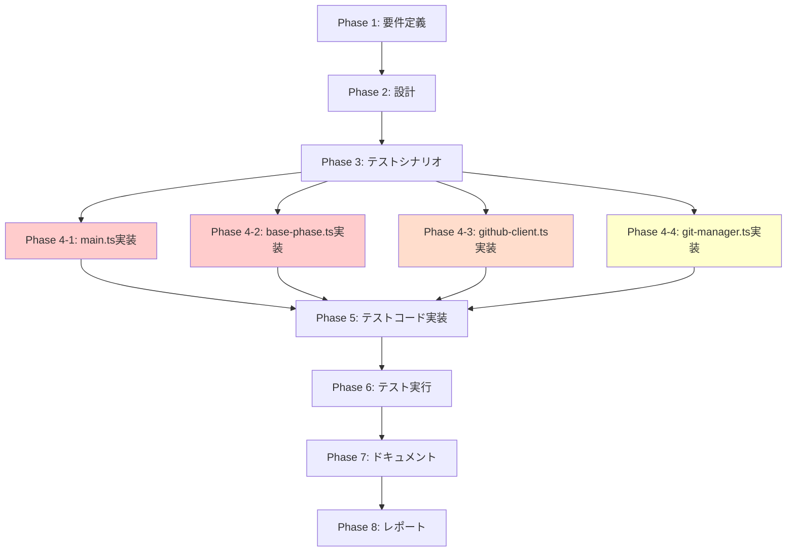

# プロジェクト計画書

**Issue**: #1 - [REFACTOR] 大規模ファイルのリファクタリング計画
**作成日**: 2025-01-20
**プロジェクト**: AI Workflow Agent (TypeScript)

---

## 1. Issue分析

### 複雑度判定: **複雑**

**判定理由**:
- アーキテクチャ変更を伴う大規模リファクタリング
- 4つの主要ファイル（main.ts: 1309行、base-phase.ts: 1419行、github-client.ts: 702行、git-manager.ts: 843行）を複数の小規模モジュールに分割
- 既存の18ファイルのテストコード（unit: 11, integration: 7）への影響が不可避
- 全10フェーズ（planning 〜 evaluation）の動作保証が必要

### 見積もり工数: **40~60時間**

**根拠**:
- **Phase 1 (main.ts)**: 12~16時間（最優先・最大規模）
- **Phase 2 (base-phase.ts)**: 14~18時間（最優先・最大規模）
- **Phase 3 (github-client.ts)**: 8~12時間（高優先）
- **Phase 4 (git-manager.ts)**: 6~10時間（中優先）
- **テスト修正・動作確認**: 各Phaseで追加コスト

### リスク評価: **高**

**主要リスク**:
1. **後方互換性の破壊**: 既存のワークフロー（Issue #2, #10, #16, #396など）への影響
2. **テストカバレッジの低下**: リファクタリング時のテスト漏れ
3. **段階的移行の失敗**: 1ファイルずつ対応する計画が、依存関係により崩壊する可能性
4. **工数超過**: 見積もり60時間に対して、実際は80時間以上かかる可能性

---

## 2. 実装戦略判断

### 実装戦略: **REFACTOR**

**判断根拠**:
- **新規機能追加なし**: Issue本文で「既存機能の保持」が明記されている
- **構造改善が目的**: 保守性と可読性の向上が主目的
- **既存コードの再配置**: 既存ロジックを新しいファイル構造に移動
- **既存テストの再利用**: 既存テスト18ファイルを修正して再利用

**不採用理由（CREATE / EXTEND）**:
- CREATE: 新規機能追加ではないため不適切
- EXTEND: 機能拡張ではなく構造改善のため不適切

### テスト戦略: **UNIT_INTEGRATION**

**判断根拠**:
- **ユニットテスト**: 分割後の各小規模クラスの動作確認（例: `InitCommand`, `AgentExecutor`, `IssueClient`）
- **インテグレーションテスト**: 既存の統合テスト（`preset-execution.test.ts`, `multi-repo-workflow.test.ts`など）で全体動作を保証
- **BDD不要**: ユーザーストーリー変更がないため、BDDテストは不要

**テストレベル**:
1. **ユニットテスト**: 新規作成する各小規模クラスの単体テスト
2. **インテグレーションテスト**: 既存の7ファイルの統合テストを修正して再利用

### テストコード戦略: **BOTH_TEST**

**判断根拠**:
- **EXTEND_TEST**: 既存テスト18ファイルを修正（import文、モック対象の変更）
- **CREATE_TEST**: 新規クラス（`InitCommand`, `AgentExecutor`など）に対する新規テスト作成

**具体例**:
- **EXTEND_TEST**: `tests/unit/main-preset-resolution.test.ts` → import文を `src/main.ts` から `src/commands/execute-command.ts` へ変更
- **CREATE_TEST**: `tests/unit/commands/init-command.test.ts` → 新規作成

---

## 3. 影響範囲分析

### 既存コードへの影響

**変更が必要なファイル**:

| カテゴリ | 変更対象 | 変更内容 |
|---------|---------|---------|
| **CLIエントリー** | `src/main.ts` | コマンドハンドラを別ファイルに分離（200行以下に削減） |
| **フェーズ基底クラス** | `src/phases/base-phase.ts` | Agent実行、レビューサイクル、ログフォーマットを別クラスに分離（300行以下に削減） |
| **GitHub連携** | `src/core/github-client.ts` | Issue/PR/コメント操作を別クラスに分離（各200行以下） |
| **Git操作** | `src/core/git-manager.ts` | コミット/ブランチ/リモート操作を別クラスに分離（各200行以下） |
| **テストコード** | `tests/**/*.test.ts` | import文、モック対象の変更（18ファイル） |

**影響を受ける既存機能**:
- ✅ **すべての10フェーズ**: planning, requirements, design, test_scenario, implementation, test_implementation, testing, documentation, report, evaluation
- ✅ **CLI**: init, execute, list-presets, review コマンド
- ✅ **マルチリポジトリ対応** (Issue #396)
- ✅ **ステップ単位のコミット＆レジューム** (Issue #10)
- ✅ **ワークフロークリーンアップ** (Issue #2)
- ✅ **カスタムブランチ対応** (v0.2.0)

### 依存関係の変更

**新規依存の追加**: なし（リファクタリングのみ）

**既存依存の変更**: なし（既存ライブラリをそのまま使用）

### マイグレーション要否

**データベーススキーマ変更**: なし（`metadata.json` のスキーマ変更なし）

**設定ファイル変更**: なし（環境変数、CLIオプションの変更なし）

---

## 4. タスク分割

### Phase 1: 要件定義 (見積もり: 4~6h)

- [x] Task 1-1: リファクタリング対象ファイルの詳細分析 (2~3h)
  - main.ts の責務を明確化（CLI定義、コマンドハンドラ、ユーティリティ関数）
  - base-phase.ts の責務を明確化（フェーズ実行、Agent制御、ログフォーマット、レビューサイクル）
  - github-client.ts の責務を明確化（Issue/PR/コメント操作）
  - git-manager.ts の責務を明確化（コミット/ブランチ/リモート操作）
- [x] Task 1-2: 既存テストコードの依存関係マッピング (1~2h)
  - 18ファイルのテストが依存するモジュールを列挙
  - リファクタリング後のimport文変更箇所をリストアップ
- [x] Task 1-3: 後方互換性維持戦略の策定 (1~1h)
  - 既存のワークフロー（Issue #2, #10, #16, #396）が影響を受けないことを確認
  - ビルド成果物（dist/）の構造が変わらないことを確認

### Phase 2: 設計 (見積もり: 8~10h)

- [ ] Task 2-1: main.ts の新ファイル構造設計 (2~3h)
  - `src/commands/init-command.ts`
  - `src/commands/execute-command.ts`
  - `src/commands/review-command.ts`
  - `src/commands/preset-command.ts`
  - `src/utils/branch-validator.ts`
  - `src/utils/repo-resolver.ts`
- [ ] Task 2-2: base-phase.ts の新ファイル構造設計 (3~4h)
  - `src/phases/base/base-phase.ts` (コア機能のみ)
  - `src/phases/base/agent-executor.ts`
  - `src/phases/base/review-cycle-manager.ts`
  - `src/phases/base/progress-formatter.ts`
  - `src/phases/base/agent-log-formatter.ts`
- [ ] Task 2-3: github-client.ts の新ファイル構造設計 (1~2h)
  - `src/core/github/github-client.ts` (ファサード)
  - `src/core/github/issue-client.ts`
  - `src/core/github/pr-client.ts`
  - `src/core/github/comment-client.ts`
- [ ] Task 2-4: git-manager.ts の新ファイル構造設計 (1~1h)
  - `src/core/git/git-manager.ts` (ファサード)
  - `src/core/git/commit-manager.ts`
  - `src/core/git/branch-manager.ts`
  - `src/core/git/remote-manager.ts`
- [ ] Task 2-5: クラス図とシーケンス図の作成 (1h)
  - Mermaid形式でクラス図を作成
  - リファクタリング前後の構造比較図を作成

### Phase 3: テストシナリオ (見積もり: 4~6h)

- [x] Task 3-1: main.ts リファクタリング後のテストシナリオ作成 (1~2h)
  - InitCommand, ExecuteCommand の単体テスト
  - branchValidator, repoResolver の単体テスト
  - 既存の `branch-validation.test.ts`, `repository-resolution.test.ts` の修正内容を定義
- [x] Task 3-2: base-phase.ts リファクタリング後のテストシナリオ作成 (2~3h)
  - AgentExecutor, ReviewCycleManager の単体テスト
  - 既存の `step-management.test.ts`, `base-phase-optional-context.test.ts` の修正内容を定義
- [x] Task 3-3: 統合テストシナリオの確認 (1~1h)
  - 既存の7ファイルの統合テストが、リファクタリング後も動作することを確認
  - `preset-execution.test.ts`, `multi-repo-workflow.test.ts` の修正内容を定義

### Phase 4: 実装 (見積もり: 16~24h)

- [x] Task 4-1: main.ts の分割実装 (Phase 1: 最優先) (4~6h)
  - `src/commands/init-command.ts` 実装
  - `src/commands/execute-command.ts` 実装
  - `src/commands/review-command.ts` 実装
  - `src/commands/preset-command.ts` 実装
  - `src/utils/branch-validator.ts` 実装
  - `src/utils/repo-resolver.ts` 実装
  - `src/main.ts` を200行以下に削減（CLIルーティングのみ）
- [ ] Task 4-2: base-phase.ts の分割実装 (Phase 2: 最優先) (6~8h)
  - `src/phases/base/agent-executor.ts` 実装
  - `src/phases/base/review-cycle-manager.ts` 実装
  - `src/phases/base/progress-formatter.ts` 実装
  - `src/phases/base/agent-log-formatter.ts` 実装
  - `src/phases/base/base-phase.ts` を300行以下に削減（コア機能のみ）
- [ ] Task 4-3: github-client.ts の分割実装 (Phase 3: 高優先) (3~5h)
  - `src/core/github/issue-client.ts` 実装
  - `src/core/github/pr-client.ts` 実装
  - `src/core/github/comment-client.ts` 実装
  - `src/core/github/github-client.ts` をファサードとして実装
- [ ] Task 4-4: git-manager.ts の分割実装 (Phase 4: 中優先) (3~5h)
  - `src/core/git/commit-manager.ts` 実装
  - `src/core/git/branch-manager.ts` 実装
  - `src/core/git/remote-manager.ts` 実装
  - `src/core/git/git-manager.ts` をファサードとして実装

### Phase 5: テストコード実装 (見積もり: 6~10h)

- [ ] Task 5-1: main.ts 関連の新規テスト作成 (2~3h)
  - `tests/unit/commands/init-command.test.ts` 作成
  - `tests/unit/commands/execute-command.test.ts` 作成
  - `tests/unit/utils/branch-validator.test.ts` 作成
  - `tests/unit/utils/repo-resolver.test.ts` 作成
- [ ] Task 5-2: base-phase.ts 関連の新規テスト作成 (2~3h)
  - `tests/unit/phases/base/agent-executor.test.ts` 作成
  - `tests/unit/phases/base/review-cycle-manager.test.ts` 作成
- [ ] Task 5-3: 既存テストの修正 (2~4h)
  - 18ファイルのテストのimport文を修正
  - モック対象の変更（例: `jest.mock('src/main.ts')` → `jest.mock('src/commands/execute-command.ts')`）

### Phase 6: テスト実行 (見積もり: 2~4h)

- [ ] Task 6-1: ユニットテスト実行 (1~2h)
  - `npm run test:unit` 実行
  - 失敗したテストの修正
- [ ] Task 6-2: インテグレーションテスト実行 (1~2h)
  - `npm run test:integration` 実行
  - 失敗したテストの修正
- [ ] Task 6-3: カバレッジ確認 (0.5h)
  - `npm run test:coverage` 実行
  - カバレッジが既存水準（80%以上）を維持していることを確認

### Phase 7: ドキュメント (見積もり: 2~3h)

- [ ] Task 7-1: ARCHITECTURE.md の更新 (1~1.5h)
  - 新しいファイル構造を反映
  - クラス図を更新
- [ ] Task 7-2: CLAUDE.md の更新 (0.5~1h)
  - コアモジュールのリストを更新
  - リファクタリング後のディレクトリ構造を反映
- [ ] Task 7-3: README.md の確認 (0.5h)
  - リファクタリングによる使用方法の変更がないことを確認（変更なしのはず）

### Phase 8: レポート (見積もり: 1~2h)

- [ ] Task 8-1: リファクタリング前後のメトリクス比較 (0.5~1h)
  - ファイルサイズ（行数）の削減効果を測定
  - テストカバレッジの変化を記録
- [ ] Task 8-2: PR本文の作成 (0.5~1h)
  - リファクタリングの概要と目的を記述
  - 変更ファイル一覧と主要な設計判断を記述
  - レビュワー向けの注意事項（後方互換性、テスト結果）を記述

---

## 5. 依存関係

**注記**:
- **Phase 4-1, 4-2**: 最優先（main.ts, base-phase.tsは最大規模）
- **Phase 4-3**: 高優先（github-client.tsは中規模）
- **Phase 4-4**: 中優先（git-manager.tsは比較的独立）
- **Phase 4-1〜4-4は並行実施可能**（依存関係が少ない）

---

## 6. リスクと軽減策

### リスク1: 後方互換性の破壊

- **影響度**: 高
- **確率**: 中
- **軽減策**:
  1. **ファサードパターンの採用**: 既存の `GitHubClient`, `GitManager` をファサードとして維持し、内部実装のみ分割
  2. **既存テストの全実行**: リファクタリング後に18ファイルすべてのテストを実行し、後方互換性を確認
  3. **段階的デプロイ**: 1ファイルずつリファクタリングし、各段階でビルド＆テストを実行

### リスク2: テストカバレッジの低下

- **影響度**: 中
- **確率**: 中
- **軽減策**:
  1. **カバレッジ目標設定**: リファクタリング前のカバレッジを測定し、同水準（80%以上）を維持
  2. **新規クラスへのテスト追加**: 分割後の各クラス（`AgentExecutor`, `InitCommand`など）に対して必ずテストを作成
  3. **統合テストの維持**: 既存の7ファイルの統合テストを修正して再利用

### リスク3: 段階的移行の失敗

- **影響度**: 高
- **確率**: 中
- **軽減策**:
  1. **依存関係の事前分析**: Task 1-1でファイル間の依存関係を明確化
  2. **ファサードパターンの活用**: 外部インターフェースを維持しつつ、内部実装のみ段階的に移行
  3. **ビルド成果物の確認**: 各段階で `npm run build` を実行し、dist/ ディレクトリの構造が変わらないことを確認

### リスク4: 工数超過

- **影響度**: 中
- **確率**: 高
- **軽減策**:
  1. **見積もりバッファ**: 各Phaseに20%のバッファを含める（40~60時間の見積もり）
  2. **優先順位の明確化**: Phase 4-1（main.ts）とPhase 4-2（base-phase.ts）を最優先とし、Phase 4-3, 4-4は必要に応じて調整
  3. **スコープ調整**: 工数超過の場合、github-client.ts, git-manager.ts のリファクタリングを次回Issueに先送り

### リスク5: 既存ワークフローへの影響

- **影響度**: 高
- **確率**: 低
- **軽減策**:
  1. **既存Issue（#2, #10, #16, #396）の動作確認**: 該当する統合テストを重点的に実行
  2. **マルチリポジトリ対応のテスト**: `multi-repo-workflow.test.ts` を必ず実行
  3. **ステップ単位のコミット＆レジュームのテスト**: `step-commit-push.test.ts`, `step-resume.test.ts` を必ず実行

---

## 7. 品質ゲート

### Phase 1: 要件定義

- [x] **実装戦略が明確に決定されている**（REFACTOR）
- [x] **テスト戦略が明確に決定されている**（UNIT_INTEGRATION）
- [x] **テストコード戦略が明確に決定されている**（BOTH_TEST）
- [x] **影響範囲が分析されている**（main.ts, base-phase.ts, github-client.ts, git-manager.ts, tests/）
- [x] **タスク分割が適切な粒度である**（1タスク = 1~4時間）
- [x] **リスクが洗い出されている**（5つのリスクと軽減策）

### Phase 2: 設計

- [ ] 新しいファイル構造が明確に定義されている
- [ ] クラス図が作成されている（Mermaid形式）
- [ ] 各クラスの責務が明確に定義されている
- [ ] ファサードパターンによる後方互換性が設計されている

### Phase 3: テストシナリオ

- [x] 新規クラスに対するテストシナリオが定義されている
- [x] 既存テストの修正内容が明確に定義されている
- [x] 統合テストの修正内容が明確に定義されている

### Phase 4: 実装

- [ ] main.ts が200行以下に削減されている
- [ ] base-phase.ts が300行以下に削減されている
- [ ] github-client.ts が各200行以下のファイルに分割されている
- [ ] git-manager.ts が各200行以下のファイルに分割されている
- [ ] ビルドが成功する（`npm run build`）

### Phase 5: テストコード実装

- [ ] 新規クラスに対するテストが作成されている
- [ ] 既存テストのimport文が修正されている
- [ ] すべてのテストがビルドエラーなしでコンパイルされる

### Phase 6: テスト実行

- [ ] ユニットテストがすべて合格する（`npm run test:unit`）
- [ ] インテグレーションテストがすべて合格する（`npm run test:integration`）
- [ ] カバレッジが80%以上を維持している

### Phase 7: ドキュメント

- [ ] ARCHITECTURE.md が新しい構造を反映している
- [ ] CLAUDE.md が更新されている
- [ ] README.md の使用方法に変更がないことを確認している

### Phase 8: レポート

- [ ] ファイルサイズ削減効果が測定されている
- [ ] テストカバレッジの変化が記録されている
- [ ] PR本文が作成されている

---

## 8. 成功基準

このリファクタリングは、以下の基準をすべて満たした場合に成功とみなします：

1. **ファイルサイズ削減**:
   - main.ts: 1309行 → 200行以下（削減率: 84%以上）
   - base-phase.ts: 1419行 → 300行以下（削減率: 79%以上）
   - github-client.ts: 702行 → 各200行以下のファイルに分割
   - git-manager.ts: 843行 → 各200行以下のファイルに分割

2. **後方互換性維持**:
   - 既存の18ファイルのテストがすべて合格
   - 既存のワークフロー（Issue #2, #10, #16, #396）が影響を受けない
   - CLIオプション、環境変数、metadata.json のスキーマに変更なし

3. **テストカバレッジ維持**:
   - カバレッジが80%以上を維持（リファクタリング前と同等）

4. **ビルド成果物の維持**:
   - dist/ ディレクトリの構造が変わらない
   - `npm run build` が成功する

5. **ドキュメント更新**:
   - ARCHITECTURE.md, CLAUDE.md が最新の構造を反映している

---

## 9. 次のステップ

Phase 1（要件定義）完了後、以下を実施してください：

1. **Phase 2（設計）への移行**: Task 2-1〜2-5を実施し、新しいファイル構造とクラス図を作成
2. **レビュー**: Phase 2完了後、設計レビューを実施し、品質ゲートを確認
3. **Phase 3（テストシナリオ）**: 設計に基づいてテストシナリオを作成
4. **Phase 4（実装）**: 優先順位に従って実装（Phase 4-1, 4-2を最優先）

---

## 10. 備考

### リファクタリングの原則

本プロジェクトでは、以下の原則を厳守します：

1. **後方互換性の維持**: 既存の動作を壊さない
2. **段階的リファクタリング**: 1ファイルずつ対応
3. **テストカバレッジの維持**: リファクタリング前後で動作確認
4. **既存機能の保持**: 機能削除は行わない

### 参考資料

- **SOLID原則**: 特に単一責任の原則（Single Responsibility Principle）に基づいてファイルを分割
- **ファサードパターン**: 既存のインターフェースを維持しつつ、内部実装を分割
- **リファクタリング**: Martin Fowler著『リファクタリング: 既存のコードを安全に改善する技術』

---

**計画書作成日**: 2025-01-20
**次回レビュー日**: Phase 2完了後
**承認者**: AI Workflow Agent (Phase 0: Planning)
