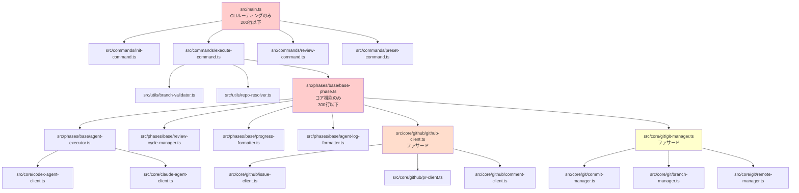
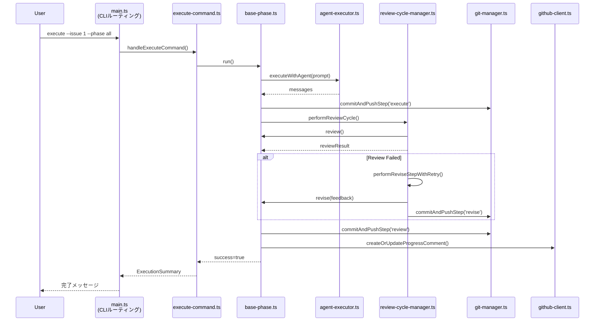

# 設計書

**Issue**: #1 - [REFACTOR] 大規模ファイルのリファクタリング計画
**作成日**: 2025-01-20
**プロジェクト**: AI Workflow Agent (TypeScript)

---

## 0. Planning Document および Requirements Documentの確認

本設計書は、以下のドキュメントに基づいて作成されています：

- **Planning Document**: `.ai-workflow/issue-1/00_planning/output/planning.md`
  - 実装戦略: **REFACTOR**（既存機能の保持、構造改善）
  - テスト戦略: **UNIT_INTEGRATION**（ユニットテスト + 統合テスト）
  - テストコード戦略: **BOTH_TEST**（既存テストの修正 + 新規テスト作成）
  - 見積もり工数: 40~60時間
  - リスク評価: 高（後方互換性、テストカバレッジ、段階的移行の失敗、工数超過）

- **Requirements Document**: `.ai-workflow/issue-1/01_requirements/output/requirements.md`
  - 機能要件: FR-1（main.ts）、FR-2（base-phase.ts）、FR-3（github-client.ts）、FR-4（git-manager.ts）、FR-5（テストコード）、FR-6（ビルド成果物）
  - 非機能要件: パフォーマンス、セキュリティ、可用性、保守性
  - 受け入れ基準: ファイルサイズ削減、後方互換性維持、テストカバレッジ維持、ビルド成果物維持

---

## 1. アーキテクチャ設計

### 1.1 システム全体図



### 1.2 コンポーネント間の関係

#### Phase 1: main.ts のリファクタリング（最優先）

**既存の責務（1309行）**:
- CLIエントリーポイント（commander定義）
- 4つのコマンド処理（init, execute, review, list-presets）
- ブランチバリデーション機能
- リポジトリパス解決機能
- プリセット解決機能

**新しい構造**:
```
src/main.ts (200行以下)
  ├─ CLIルーティングのみ（commander定義）
  └─ runCli() メソッド

src/commands/
  ├─ init-command.ts         # handleInitCommand()
  ├─ execute-command.ts      # handleExecuteCommand()
  ├─ review-command.ts       # handleReviewCommand()
  └─ preset-command.ts       # listPresets(), resolvePresetName(), getPresetPhases()

src/utils/
  ├─ branch-validator.ts     # validateBranchName(), resolveBranchName()
  └─ repo-resolver.ts        # parseIssueUrl(), resolveLocalRepoPath(), findWorkflowMetadata()
```

#### Phase 2: base-phase.ts のリファクタリング（最優先）

**既存の責務（1419行）**:
- BasePhaseクラスのコア機能（execute/review/reviseライフサイクル）
- Agent実行ロジック（executeWithAgent, runAgentTask）
- レビューサイクル管理（performReviewCycle, performReviseStepWithRetry）
- 進捗コメント生成（formatProgressComment）
- Agentログフォーマット（formatAgentLog, formatCodexAgentLog）- 300行以上
- ステップ単位のGitコミット機能

**新しい構造**:
```
src/phases/base/base-phase.ts (300行以下)
  ├─ 抽象メソッド定義（execute, review, revise）
  ├─ run() メソッド（フェーズライフサイクル管理）
  ├─ ディレクトリ管理（ensureDirectories）
  ├─ メタデータ更新（updatePhaseStatus）
  ├─ ヘルパーメソッド（getPhaseOutputFile, formatIssueInfo, buildOptionalContext など）
  └─ ワークフローアーティファクトクリーンアップ（cleanupWorkflowArtifacts）

src/phases/base/agent-executor.ts
  ├─ executeWithAgent()
  ├─ runAgentTask()
  ├─ extractUsageMetrics()
  └─ recordUsageMetrics()

src/phases/base/review-cycle-manager.ts
  ├─ performReviewCycle()
  └─ performReviseStepWithRetry()

src/phases/base/progress-formatter.ts
  └─ formatProgressComment()

src/phases/base/agent-log-formatter.ts
  ├─ formatAgentLog()
  ├─ formatCodexAgentLog()
  └─ 関連ヘルパー関数（parseJson, asRecord, getString など）

src/phases/base/step-commit-manager.ts (新規)
  └─ commitAndPushStep()
```

#### Phase 3: github-client.ts のリファクタリング（高優先）

**既存の責務（702行）**:
- Issue操作（getIssue, getIssueInfo, getIssueComments）
- PR操作（createPullRequest, checkExistingPr, updatePullRequest）
- コメント操作（postComment, createOrUpdateProgressComment）
- PR本文生成（generatePrBodyTemplate, generatePrBodyDetailed, extractPhaseOutputs）

**新しい構造**:
```
src/core/github/github-client.ts (ファサード、200行以下)
  ├─ コンストラクタ（token, repository）
  ├─ Octokitインスタンス管理
  ├─ issueClient, prClient, commentClient への委譲
  └─ close() メソッド

src/core/github/issue-client.ts
  ├─ getIssue()
  ├─ getIssueInfo()
  ├─ getIssueComments()
  ├─ getIssueCommentsDict()
  ├─ createIssueFromEvaluation()
  └─ closeIssueWithReason()

src/core/github/pr-client.ts
  ├─ createPullRequest()
  ├─ checkExistingPr()
  ├─ updatePullRequest()
  ├─ closePullRequest()
  ├─ getPullRequestNumber()
  ├─ generatePrBodyTemplate()
  ├─ generatePrBodyDetailed()
  └─ extractPhaseOutputs()

src/core/github/comment-client.ts
  ├─ postComment()
  ├─ postWorkflowProgress()
  ├─ postReviewResult()
  └─ createOrUpdateProgressComment()
```

#### Phase 4: git-manager.ts のリファクタリング（中優先）

**既存の責務（843行）**:
- コミット操作（commitPhaseOutput, commitStepOutput, commitWorkflowInit, commitCleanupLogs）
- プッシュ操作（pushToRemote）
- ブランチ操作（createBranch, branchExists, getCurrentBranch, switchBranch）
- ステータス取得（getStatus）
- リモート操作（pullLatest, setupGithubCredentials）
- ヘルパー関数（getChangedFiles, filterPhaseFiles, getPhaseSpecificFiles など）

**新しい構造**:
```
src/core/git/git-manager.ts (ファサード、200行以下)
  ├─ コンストラクタ（repoPath, metadataManager, config）
  ├─ SimpleGitインスタンス管理
  ├─ commitManager, branchManager, remoteMgr への委譲
  ├─ getStatus()
  └─ ヘルパー関数（getChangedFiles, filterPhaseFiles, getPhaseSpecificFiles）

src/core/git/commit-manager.ts
  ├─ commitPhaseOutput()
  ├─ commitStepOutput()
  ├─ commitWorkflowInit()
  ├─ commitCleanupLogs()
  ├─ createCommitMessage()
  ├─ buildStepCommitMessage()
  ├─ createInitCommitMessage()
  └─ createCleanupCommitMessage()

src/core/git/branch-manager.ts
  ├─ createBranch()
  ├─ branchExists()
  ├─ getCurrentBranch()
  └─ switchBranch()

src/core/git/remote-manager.ts
  ├─ pushToRemote()
  ├─ pullLatest()
  ├─ setupGithubCredentials()
  └─ isRetriableError()
```

### 1.3 データフロー



---

## 2. 実装戦略判断（必須）

### 実装戦略: **REFACTOR**

**判断根拠**:

1. **既存機能の保持が目的**
   - Issue本文で「既存機能の保持」が明記されている
   - 新規機能追加ではなく、保守性と可読性の向上が主目的

2. **既存コードの再配置**
   - 既存ロジックを新しいファイル構造に移動
   - 責務の分離（SOLID原則の適用）
   - ファサードパターンによる後方互換性維持

3. **既存テストの再利用**
   - 既存テスト18ファイル（ユニット11、統合7）を修正して再利用
   - import文とモック対象の変更のみ
   - テストロジック自体は変更しない

4. **アーキテクチャ変更なし**
   - 依存ライブラリの変更なし
   - ビルドツールの変更なし（tsc + copy-static-assets.mjs）
   - 環境変数、CLIオプションの変更なし

**不採用理由**:
- **CREATE（新規作成）**: 新規機能追加ではないため不適切。既存コードの改善が目的。
- **EXTEND（拡張）**: 機能拡張ではなく構造改善のため不適切。外部APIへの影響もない。

---

## 3. テスト戦略判断（必須）

### テスト戦略: **UNIT_INTEGRATION**

**判断根拠**:

1. **ユニットテストの必要性**
   - 分割後の各小規模クラス（`InitCommand`, `AgentExecutor`, `IssueClient` など）の動作確認が必要
   - 既存のユニットテスト11ファイルを修正して再利用
   - 新規クラスに対する新規ユニットテスト作成（6ファイル程度）

2. **インテグレーションテストの必要性**
   - 既存の統合テスト7ファイルで全体動作を保証
   - リファクタリング後も既存ワークフロー（Issue #2, #10, #16, #396）が正常に動作することを確認
   - マルチリポジトリ対応、ステップ単位のコミット＆レジュームなどの統合機能のテスト

3. **BDD不要の理由**
   - ユーザーストーリー変更がない
   - 既存機能の保持が目的のため、振る舞いは変わらない
   - 既存のユニット＋統合テストで十分カバー可能

**テストレベル**:
- **ユニットテスト**: 新規作成する各小規模クラスの単体テスト
- **インテグレーションテスト**: 既存の7ファイルの統合テストを修正して再利用

---

## 4. テストコード戦略判断（必須）

### テストコード戦略: **BOTH_TEST**

**判断根拠**:

1. **既存テストの拡張（EXTEND_TEST）**
   - 既存テスト18ファイルのimport文を修正
   - モック対象の変更（例: `jest.mock('src/main.ts')` → `jest.mock('src/commands/execute-command.ts')`）
   - テストロジック自体は変更しない

2. **新規テストの作成（CREATE_TEST）**
   - 新規クラスに対するユニットテスト作成
   - Phase 1（main.ts）: 4ファイル（init-command.test.ts, execute-command.test.ts, branch-validator.test.ts, repo-resolver.test.ts）
   - Phase 2（base-phase.ts）: 4ファイル（agent-executor.test.ts, review-cycle-manager.test.ts, progress-formatter.test.ts, agent-log-formatter.test.ts）
   - Phase 3（github-client.ts）: 必要に応じて3ファイル（issue-client.test.ts, pr-client.test.ts, comment-client.test.ts）
   - Phase 4（git-manager.ts）: 必要に応じて3ファイル（commit-manager.test.ts, branch-manager.test.ts, remote-manager.test.ts）

3. **両方が必要な理由**
   - 既存テストの修正だけでは新規クラスの動作を保証できない
   - 新規テストの作成だけでは既存統合テストとの整合性が取れない
   - 両方のアプローチで段階的にテストカバレッジを維持・向上

**具体例**:
- **EXTEND_TEST**: `tests/unit/main-preset-resolution.test.ts` → import文を `src/main.ts` から `src/commands/preset-command.ts` へ変更
- **CREATE_TEST**: `tests/unit/commands/init-command.test.ts` → 新規作成

---

## 5. 影響範囲分析

### 5.1 既存コードへの影響

**変更が必要なファイル**:

| カテゴリ | 変更対象 | 変更内容 | 影響度 |
|---------|---------|---------|--------|
| **CLIエントリー** | `src/main.ts` | コマンドハンドラを別ファイルに分離（1309行 → 200行以下） | 高 |
| **フェーズ基底クラス** | `src/phases/base-phase.ts` | Agent実行、レビューサイクル、ログフォーマットを別クラスに分離（1419行 → 300行以下） | 高 |
| **GitHub連携** | `src/core/github-client.ts` | Issue/PR/コメント操作を別クラスに分離（702行 → ファサード200行以下） | 中 |
| **Git操作** | `src/core/git-manager.ts` | コミット/ブランチ/リモート操作を別クラスに分離（843行 → ファサード200行以下） | 中 |
| **ユニットテスト** | `tests/unit/*.test.ts` | import文、モック対象の変更（11ファイル） | 中 |
| **統合テスト** | `tests/integration/*.test.ts` | import文、モック対象の変更（7ファイル） | 中 |

**影響を受ける既存機能**:
- ✅ **すべての10フェーズ**: planning, requirements, design, test_scenario, implementation, test_implementation, testing, documentation, report, evaluation
- ✅ **CLI**: init, execute, list-presets, review コマンド
- ✅ **マルチリポジトリ対応** (Issue #396)
- ✅ **ステップ単位のコミット＆レジューム** (Issue #10)
- ✅ **ワークフロークリーンアップ** (Issue #2)
- ✅ **カスタムブランチ対応** (v0.2.0)

### 5.2 依存関係の変更

**新規依存の追加**: なし（リファクタリングのみ）

**既存依存の変更**: なし（既存ライブラリをそのまま使用）

**内部依存関係の変更**:
- `src/main.ts` → `src/commands/*.ts`, `src/utils/*.ts`
- `src/phases/base-phase.ts` → `src/phases/base/*.ts`
- `src/core/github-client.ts` → `src/core/github/*.ts`
- `src/core/git-manager.ts` → `src/core/git/*.ts`

### 5.3 マイグレーション要否

**データベーススキーマ変更**: なし（`metadata.json` のスキーマ変更なし）

**設定ファイル変更**: なし（環境変数、CLIオプションの変更なし）

**ビルド成果物の変更**: なし（dist/ ディレクトリの構造は変わらない）

---

## 6. 変更・追加ファイルリスト

### 6.1 Phase 1: main.ts のリファクタリング

**新規作成ファイル**:
- `src/commands/init-command.ts`
- `src/commands/execute-command.ts`
- `src/commands/review-command.ts`
- `src/commands/preset-command.ts`
- `src/utils/branch-validator.ts`
- `src/utils/repo-resolver.ts`

**修正が必要な既存ファイル**:
- `src/main.ts` (1309行 → 200行以下に削減)

**新規テストファイル**:
- `tests/unit/commands/init-command.test.ts`
- `tests/unit/commands/execute-command.test.ts`
- `tests/unit/utils/branch-validator.test.ts`
- `tests/unit/utils/repo-resolver.test.ts`

**修正が必要な既存テスト**:
- `tests/unit/branch-validation.test.ts` (import文変更: `src/main.ts` → `src/utils/branch-validator.ts`)
- `tests/unit/repository-resolution.test.ts` (import文変更: `src/main.ts` → `src/utils/repo-resolver.ts`)
- `tests/unit/main-preset-resolution.test.ts` (import文変更: `src/main.ts` → `src/commands/preset-command.ts`)
- `tests/integration/workflow-init-cleanup.test.ts` (import文変更: `src/main.ts` → `src/commands/init-command.ts`)
- `tests/integration/multi-repo-workflow.test.ts` (import文変更: `src/main.ts` → `src/commands/execute-command.ts`)
- `tests/integration/custom-branch-workflow.test.ts` (import文変更: `src/main.ts` → `src/commands/init-command.ts`)
- `tests/integration/preset-execution.test.ts` (import文変更: `src/main.ts` → `src/commands/execute-command.ts`)

### 6.2 Phase 2: base-phase.ts のリファクタリング

**新規作成ファイル**:
- `src/phases/base/agent-executor.ts`
- `src/phases/base/review-cycle-manager.ts`
- `src/phases/base/progress-formatter.ts`
- `src/phases/base/agent-log-formatter.ts`
- `src/phases/base/step-commit-manager.ts` (オプション: コミット関連ロジックの分離)

**修正が必要な既存ファイル**:
- `src/phases/base-phase.ts` (1419行 → 300行以下に削減)

**新規テストファイル**:
- `tests/unit/phases/base/agent-executor.test.ts`
- `tests/unit/phases/base/review-cycle-manager.test.ts`
- `tests/unit/phases/base/progress-formatter.test.ts`
- `tests/unit/phases/base/agent-log-formatter.test.ts`

**修正が必要な既存テスト**:
- `tests/unit/step-management.test.ts` (import文変更)
- `tests/unit/base-phase-optional-context.test.ts` (import文変更)
- `tests/integration/step-commit-push.test.ts` (import文変更)
- `tests/integration/step-resume.test.ts` (import文変更)

### 6.3 Phase 3: github-client.ts のリファクタリング

**新規作成ファイル**:
- `src/core/github/issue-client.ts`
- `src/core/github/pr-client.ts`
- `src/core/github/comment-client.ts`

**修正が必要な既存ファイル**:
- `src/core/github-client.ts` (702行 → ファサード200行以下に削減)

**新規テストファイル（オプション）**:
- `tests/unit/core/github/issue-client.test.ts`
- `tests/unit/core/github/pr-client.test.ts`
- `tests/unit/core/github/comment-client.test.ts`

### 6.4 Phase 4: git-manager.ts のリファクタリング

**新規作成ファイル**:
- `src/core/git/commit-manager.ts`
- `src/core/git/branch-manager.ts`
- `src/core/git/remote-manager.ts`

**修正が必要な既存ファイル**:
- `src/core/git-manager.ts` (843行 → ファサード200行以下に削減)

**新規テストファイル（オプション）**:
- `tests/unit/core/git/commit-manager.test.ts`
- `tests/unit/core/git/branch-manager.test.ts`
- `tests/unit/core/git/remote-manager.test.ts`

**修正が必要な既存テスト**:
- `tests/unit/git-manager-issue16.test.ts` (import文変更)

### 6.5 削除が必要なファイル

**なし**（既存ファイルはすべて保持し、内容を修正）

---

## 7. 詳細設計

### 7.1 Phase 1: main.ts の詳細設計

#### 7.1.1 src/main.ts (200行以下)

**責務**: CLIルーティングのみ

```typescript
import { Command, Option } from 'commander';
import { handleInitCommand } from './commands/init-command.js';
import { handleExecuteCommand } from './commands/execute-command.js';
import { handleReviewCommand } from './commands/review-command.js';
import { listPresets } from './commands/preset-command.js';

export async function runCli(): Promise<void> {
  const program = new Command();

  program
    .name('ai-workflow-v2')
    .description('TypeScript rewrite of the AI workflow automation toolkit')
    .version('0.1.0');

  // init コマンド
  program
    .command('init')
    .requiredOption('--issue-url <url>', 'GitHub Issue URL')
    .option('--branch <name>', 'Custom branch name')
    .action(async (options) => {
      try {
        await handleInitCommand(options.issueUrl, options.branch);
      } catch (error) {
        reportFatalError(error);
      }
    });

  // list-presets コマンド
  program
    .command('list-presets')
    .description('List available presets')
    .action(async () => {
      try {
        listPresets();
      } catch (error) {
        reportFatalError(error);
      }
    });

  // execute コマンド
  program
    .command('execute')
    .requiredOption('--issue <number>', 'Issue number')
    .option('--phase <name>', 'Phase name or "all"', 'all')
    // ... その他のオプション
    .action(async (options) => {
      try {
        await handleExecuteCommand(options);
      } catch (error) {
        reportFatalError(error);
      }
    });

  // review コマンド
  program
    .command('review')
    .requiredOption('--phase <name>', 'Phase name')
    .requiredOption('--issue <number>', 'Issue number')
    .action(async (options) => {
      try {
        await handleReviewCommand(options);
      } catch (error) {
        reportFatalError(error);
      }
    });

  await program.parseAsync(process.argv);
}

function reportFatalError(error: unknown): never {
  if (error instanceof Error) {
    console.error(`[ERROR] ${error.message}`);
  } else {
    console.error('[ERROR] An unexpected error occurred.');
  }
  process.exit(1);
}
```

#### 7.1.2 src/commands/init-command.ts

**責務**: init コマンドの処理

**主要関数**:
- `handleInitCommand(issueUrl: string, customBranch?: string): Promise<void>`

**依存**:
- `src/utils/branch-validator.ts` (validateBranchName, resolveBranchName)
- `src/utils/repo-resolver.ts` (parseIssueUrl, resolveLocalRepoPath)
- `src/core/metadata-manager.ts`
- `src/core/git-manager.ts`
- `src/core/github-client.ts`

**処理フロー**:
1. Issue URLをパース（parseIssueUrl）
2. ローカルリポジトリパスを解決（resolveLocalRepoPath）
3. ブランチ名を解決（resolveBranchName）
4. メタデータ作成
5. コミット＆プッシュ
6. PR作成

#### 7.1.3 src/commands/execute-command.ts

**責務**: execute コマンドの処理

**主要関数**:
- `handleExecuteCommand(options: any): Promise<void>`
- `executePhasesSequential(phases: PhaseName[], context: PhaseContext, gitManager: GitManager, ...): Promise<ExecutionSummary>`
- `executePhasesFrom(startPhase: PhaseName, ...): Promise<ExecutionSummary>`
- `createPhaseInstance(phaseName: PhaseName, context: PhaseContext)`
- `reportExecutionSummary(summary: ExecutionSummary): void`

**依存**:
- `src/core/metadata-manager.ts`
- `src/core/git-manager.ts`
- `src/core/github-client.ts`
- `src/core/codex-agent-client.ts`
- `src/core/claude-agent-client.ts`
- `src/utils/resume.ts` (ResumeManager)
- `src/phases/*.ts` (各フェーズクラス)

#### 7.1.4 src/commands/review-command.ts

**責務**: review コマンドの処理

**主要関数**:
- `handleReviewCommand(options: any): Promise<void>`

**処理フロー**:
1. メタデータ読み込み
2. フェーズ状態表示

#### 7.1.5 src/commands/preset-command.ts

**責務**: プリセット関連機能

**主要関数**:
- `listPresets(): void`
- `resolvePresetName(presetName: string): { resolvedName: string; warning?: string }`
- `getPresetPhases(presetName: string): PhaseName[]`

**依存**:
- `src/core/phase-dependencies.ts` (PHASE_PRESETS, DEPRECATED_PRESETS, PRESET_DESCRIPTIONS)

#### 7.1.6 src/utils/branch-validator.ts

**責務**: ブランチ名バリデーション

**主要関数**:
- `validateBranchName(branchName: string): BranchValidationResult`
- `resolveBranchName(customBranch: string | undefined, issueNumber: number): string`

**インターフェース**:
```typescript
interface BranchValidationResult {
  valid: boolean;
  error?: string;
}
```

**バリデーションルール**:
- 空文字列チェック
- スラッシュの位置チェック
- 連続ドットチェック
- 不正文字チェック（~, ^, :, ?, *, [, \, 空白、@{）
- ドットで終わらないチェック

#### 7.1.7 src/utils/repo-resolver.ts

**責務**: リポジトリパス解決

**主要関数**:
- `parseIssueUrl(issueUrl: string): IssueInfo`
- `resolveLocalRepoPath(repoName: string): string`
- `findWorkflowMetadata(issueNumber: string): Promise<{ repoRoot: string; metadataPath: string }>`
- `getRepoRoot(): Promise<string>`

**インターフェース**:
```typescript
interface IssueInfo {
  owner: string;
  repo: string;
  issueNumber: number;
  repositoryName: string;
}
```

### 7.2 Phase 2: base-phase.ts の詳細設計

#### 7.2.1 src/phases/base/base-phase.ts (300行以下)

**責務**: フェーズライフサイクル管理のコア機能

**保持するメソッド**:
- コンストラクタ
- 抽象メソッド定義（execute, review, revise）
- `run(options: PhaseRunOptions): Promise<boolean>`
- ディレクトリ管理（`ensureDirectories`）
- メタデータ更新（`updatePhaseStatus`）
- ヘルパーメソッド（`getPhaseOutputFile`, `formatIssueInfo`, `buildOptionalContext` など）
- `cleanupWorkflowArtifacts(force: boolean): Promise<void>`
- `shouldRunReview(): Promise<boolean>`
- `getIssueInfo()`
- `postOutput(content: string, title: string)`
- `loadPrompt(promptType: 'execute' | 'review' | 'revise'): string`

**委譲するメソッド**:
- Agent実行 → `AgentExecutor`
- レビューサイクル → `ReviewCycleManager`
- 進捗コメント → `ProgressFormatter`
- Agentログフォーマット → `AgentLogFormatter`
- ステップコミット → `StepCommitManager`（オプション）

**run() メソッドの変更**:
```typescript
public async run(options: PhaseRunOptions = {}): Promise<boolean> {
  const gitManager = options.gitManager ?? null;

  // 依存関係チェック
  const dependencyResult = validatePhaseDependencies(this.phaseName, this.metadata, {...});
  if (!dependencyResult.valid) {
    console.error(`[ERROR] ${dependencyResult.error}`);
    return false;
  }

  this.updatePhaseStatus('in_progress');
  await this.postProgress('in_progress', `${this.phaseName} フェーズを開始します。`);

  try {
    // Execute Step
    const completedSteps = this.metadata.getCompletedSteps(this.phaseName);
    if (!completedSteps.includes('execute')) {
      this.metadata.updateCurrentStep(this.phaseName, 'execute');

      const executeResult = await this.execute();
      if (!executeResult.success) {
        await this.handleFailure(executeResult.error ?? 'Unknown execute error');
        return false;
      }

      // AgentExecutor を使用
      // if (gitManager) {
      //   await this.stepCommitManager.commitAndPushStep(gitManager, 'execute');
      // }

      this.metadata.addCompletedStep(this.phaseName, 'execute');
    }

    // Review Step (ReviewCycleManager を使用)
    if (!options.skipReview && await this.shouldRunReview()) {
      // ...
    }

    this.updatePhaseStatus('completed');
    await this.postProgress('completed', `${this.phaseName} フェーズが完了しました。`);

    return true;
  } catch (error) {
    await this.handleFailure((error as Error).message);
    return false;
  }
}
```

#### 7.2.2 src/phases/base/agent-executor.ts

**責務**: Agent実行ロジック

**クラス設計**:
```typescript
export class AgentExecutor {
  constructor(
    private codex: CodexAgentClient | null,
    private claude: ClaudeAgentClient | null,
    private workingDir: string,
    private phaseName: string
  ) {}

  async executeWithAgent(
    prompt: string,
    options?: { maxTurns?: number; verbose?: boolean; logDir?: string }
  ): Promise<string[]> {
    // 既存の executeWithAgent ロジック
  }

  private async runAgentTask(
    agent: CodexAgentClient | ClaudeAgentClient,
    agentName: string,
    prompt: string,
    options?: { maxTurns?: number; verbose?: boolean; logDir?: string }
  ): Promise<{ messages: string[]; authFailed: boolean }> {
    // 既存の runAgentTask ロジック
  }

  extractUsageMetrics(messages: string[]): UsageMetrics | null {
    // 既存の extractUsageMetrics ロジック
  }
}
```

**主要メソッド**:
- `executeWithAgent(prompt: string, options?): Promise<string[]>`
- `runAgentTask(agent, agentName, prompt, options?): Promise<{ messages, authFailed }>`
- `extractUsageMetrics(messages: string[]): UsageMetrics | null`

#### 7.2.3 src/phases/base/review-cycle-manager.ts

**責務**: レビューサイクル管理

**クラス設計**:
```typescript
export class ReviewCycleManager {
  constructor(
    private basePhase: BasePhase,
    private metadata: MetadataManager,
    private phaseName: string
  ) {}

  async performReviewCycle(
    initialOutputFile: string | null,
    maxRetries: number
  ): Promise<{
    success: boolean;
    reviewResult: PhaseExecutionResult | null;
    outputFile: string | null;
    error?: string;
  }> {
    // 既存の performReviewCycle ロジック
  }

  async performReviseStepWithRetry(
    gitManager: GitManager | null,
    initialReviewResult: PhaseExecutionResult
  ): Promise<void> {
    // 既存の performReviseStepWithRetry ロジック
  }

  private getReviseFunction(): ((feedback: string) => Promise<PhaseExecutionResult>) | null {
    // 既存の getReviseFunction ロジック
  }
}
```

#### 7.2.4 src/phases/base/progress-formatter.ts

**責務**: 進捗コメント生成

**クラス設計**:
```typescript
export class ProgressFormatter {
  constructor(
    private metadata: MetadataManager,
    private phaseName: string
  ) {}

  formatProgressComment(status: PhaseStatus, details?: string): string {
    // 既存の formatProgressComment ロジック
  }
}
```

#### 7.2.5 src/phases/base/agent-log-formatter.ts

**責務**: Agentログフォーマット（300行以上の複雑なロジック）

**クラス設計**:
```typescript
export class AgentLogFormatter {
  formatAgentLog(
    messages: string[],
    startTime: number,
    endTime: number,
    duration: number,
    error: Error | null,
    agentName: string
  ): string {
    // 既存の formatAgentLog ロジック
  }

  formatCodexAgentLog(
    messages: string[],
    startTime: number,
    endTime: number,
    duration: number,
    error: Error | null
  ): string | null {
    // 既存の formatCodexAgentLog ロジック（300行以上）
  }

  // ヘルパー関数
  private parseJson(raw: string): Record<string, unknown> | null
  private asRecord(value: unknown): Record<string, unknown> | null
  private getString(source: Record<string, unknown> | null, key: string): string | null
  private getNumber(source: Record<string, unknown> | null, key: string): number | null
  private describeItemType(value: string): string
  private truncate(value: string, limit?: number): { text: string; truncated: boolean }
}
```

### 7.3 Phase 3: github-client.ts の詳細設計

#### 7.3.1 src/core/github/github-client.ts (ファサード)

**責務**: GitHubClient のファサード、既存インターフェース維持

**クラス設計**:
```typescript
export class GitHubClient {
  private readonly token: string;
  private readonly repositoryName: string;
  private readonly octokit: Octokit;
  private readonly owner: string;
  private readonly repo: string;

  private readonly issueClient: IssueClient;
  private readonly prClient: PRClient;
  private readonly commentClient: CommentClient;

  constructor(token?: string | null, repository?: string | null) {
    // 既存のコンストラクタロジック

    // 各クライアントのインスタンス化
    this.issueClient = new IssueClient(this.octokit, this.owner, this.repo);
    this.prClient = new PRClient(this.octokit, this.owner, this.repo);
    this.commentClient = new CommentClient(this.octokit, this.owner, this.repo);
  }

  // Issue操作（IssueClientへ委譲）
  async getIssue(issueNumber: number) {
    return this.issueClient.getIssue(issueNumber);
  }

  async getIssueInfo(issueNumber: number) {
    return this.issueClient.getIssueInfo(issueNumber);
  }

  // PR操作（PRClientへ委譲）
  async createPullRequest(...) {
    return this.prClient.createPullRequest(...);
  }

  // コメント操作（CommentClientへ委譲）
  async postComment(issueNumber: number, body: string) {
    return this.commentClient.postComment(issueNumber, body);
  }

  close(): void {
    // Octokit does not require explicit disposal.
  }
}
```

#### 7.3.2 src/core/github/issue-client.ts

**責務**: Issue操作

**主要メソッド**:
- `getIssue(issueNumber: number)`
- `getIssueInfo(issueNumber: number)`
- `getIssueComments(issueNumber: number)`
- `getIssueCommentsDict(issueNumber: number)`
- `createIssueFromEvaluation(issueNumber, remainingTasks, evaluationReportPath)`
- `closeIssueWithReason(issueNumber, reason)`

#### 7.3.3 src/core/github/pr-client.ts

**責務**: PR操作とPR本文生成

**主要メソッド**:
- `createPullRequest(title, body, head, base, draft)`
- `checkExistingPr(head, base)`
- `updatePullRequest(prNumber, body)`
- `closePullRequest(prNumber, reason?)`
- `getPullRequestNumber(issueNumber)`
- `generatePrBodyTemplate(issueNumber, branchName)`
- `generatePrBodyDetailed(issueNumber, branchName, extractedInfo)`
- `extractPhaseOutputs(issueNumber, phaseOutputs)`

**内部ヘルパー**:
- `extractSectionFromFile(filePath, headers, fallback)`
- `extractSectionWithCandidates(content, headers)`
- `extractSection(content, header)`
- `extractSummaryFromIssue(issueBody)`

#### 7.3.4 src/core/github/comment-client.ts

**責務**: コメント操作

**主要メソッド**:
- `postComment(issueNumber, body)`
- `postWorkflowProgress(issueNumber, phase, status, details?)`
- `postReviewResult(issueNumber, phase, result, feedback, suggestions)`
- `createOrUpdateProgressComment(issueNumber, content, metadataManager)`

### 7.4 Phase 4: git-manager.ts の詳細設計

#### 7.4.1 src/core/git/git-manager.ts (ファサード)

**責務**: GitManager のファサード、既存インターフェース維持

**クラス設計**:
```typescript
export class GitManager {
  private readonly repoPath: string;
  private readonly metadata: MetadataManager;
  private readonly config: Record<string, unknown>;
  private readonly git: SimpleGit;
  private readonly secretMasker: SecretMasker;

  private readonly commitManager: CommitManager;
  private readonly branchManager: BranchManager;
  private readonly remoteMgr: RemoteManager;

  constructor(
    repoPath: string,
    metadataManager: MetadataManager,
    config: Record<string, unknown> = {}
  ) {
    this.repoPath = repoPath;
    this.metadata = metadataManager;
    this.config = config;
    this.git = simpleGit({ baseDir: repoPath });
    this.secretMasker = new SecretMasker();

    // 各マネージャーのインスタンス化
    this.commitManager = new CommitManager(this.git, this.metadata, this.secretMasker, repoPath);
    this.branchManager = new BranchManager(this.git);
    this.remoteMgr = new RemoteManager(this.git, this.metadata);

    // 認証情報セットアップ
    this.remoteMgr.setupGithubCredentials().catch(...);
  }

  // コミット操作（CommitManagerへ委譲）
  async commitPhaseOutput(phaseName, status, reviewResult?) {
    return this.commitManager.commitPhaseOutput(phaseName, status, reviewResult);
  }

  async commitStepOutput(phaseName, phaseNumber, step, issueNumber, workingDir) {
    return this.commitManager.commitStepOutput(phaseName, phaseNumber, step, issueNumber, workingDir);
  }

  // ブランチ操作（BranchManagerへ委譲）
  async createBranch(branchName, baseBranch?) {
    return this.branchManager.createBranch(branchName, baseBranch);
  }

  async branchExists(branchName, checkRemote?) {
    return this.branchManager.branchExists(branchName, checkRemote);
  }

  // リモート操作（RemoteManagerへ委譲）
  async pushToRemote(maxRetries?, retryDelay?) {
    return this.remoteMgr.pushToRemote(maxRetries, retryDelay);
  }

  async pullLatest(branchName?) {
    return this.remoteMgr.pullLatest(branchName);
  }

  // ステータス取得とヘルパー関数（GitManagerに保持）
  async getStatus(): Promise<StatusSummary> {
    // 既存のgetStatusロジック
  }

  private async getChangedFiles(): Promise<string[]> {
    // 既存のgetChangedFilesロジック
  }

  private filterPhaseFiles(files: string[], issueNumber: string): string[] {
    // 既存のfilterPhaseFilesロジック
  }

  private async getPhaseSpecificFiles(phaseName: PhaseName): Promise<string[]> {
    // 既存のgetPhaseSpecificFilesロジック
  }
}
```

#### 7.4.2 src/core/git/commit-manager.ts

**責務**: コミット操作

**クラス設計**:
```typescript
export class CommitManager {
  constructor(
    private git: SimpleGit,
    private metadata: MetadataManager,
    private secretMasker: SecretMasker,
    private repoPath: string
  ) {}

  async commitPhaseOutput(
    phaseName: PhaseName,
    status: 'completed' | 'failed',
    reviewResult?: string
  ): Promise<CommitResult> {
    // 既存のcommitPhaseOutputロジック
  }

  async commitStepOutput(
    phaseName: PhaseName,
    phaseNumber: number,
    step: StepName,
    issueNumber: number,
    workingDir: string
  ): Promise<CommitResult> {
    // 既存のcommitStepOutputロジック
  }

  async commitWorkflowInit(
    issueNumber: number,
    branchName: string
  ): Promise<CommitResult> {
    // 既存のcommitWorkflowInitロジック
  }

  async commitCleanupLogs(
    issueNumber: number,
    phase: 'report' | 'evaluation'
  ): Promise<CommitResult> {
    // 既存のcommitCleanupLogsロジック
  }

  createCommitMessage(
    phaseName: PhaseName,
    status: 'completed' | 'failed',
    reviewResult?: string
  ): string {
    // 既存のcreateCommitMessageロジック
  }

  private buildStepCommitMessage(...): string
  private createInitCommitMessage(...): string
  private createCleanupCommitMessage(...): string
}
```

#### 7.4.3 src/core/git/branch-manager.ts

**責務**: ブランチ操作

**主要メソッド**:
- `createBranch(branchName, baseBranch?): Promise<BranchResult>`
- `branchExists(branchName, checkRemote?): Promise<boolean>`
- `getCurrentBranch(): Promise<string>`
- `switchBranch(branchName): Promise<BranchResult>`

#### 7.4.4 src/core/git/remote-manager.ts

**責務**: リモート操作と認証情報管理

**主要メソッド**:
- `pushToRemote(maxRetries?, retryDelay?): Promise<PushSummary>`
- `pullLatest(branchName?): Promise<{ success: boolean; error?: string }>`
- `setupGithubCredentials(): Promise<void>`
- `isRetriableError(error: unknown): boolean`

---

## 8. セキュリティ考慮事項

### 8.1 認証・認可

**変更なし**: 既存のセキュリティ機能を維持

- GitHub Token認証（`GITHUB_TOKEN`）
- Codex API Key認証（`CODEX_API_KEY`, `OPENAI_API_KEY`）
- Claude認証情報（`CLAUDE_CODE_CREDENTIALS_PATH`）

### 8.2 データ保護

**変更なし**: 既存のデータ保護機能を維持

- シークレットマスキング（`src/core/secret-masker.ts`）
- `.ai-workflow/issue-*/` ディレクトリのパス検証（正規表現）
- シンボリックリンクチェック（`cleanupWorkflowArtifacts`）

**強化**:
- ファサードパターンにより、外部APIへのアクセスポイントを明確化
- 各クライアント（IssueClient, PRClient, CommentClient）で認証情報の取り扱いを統一

### 8.3 セキュリティリスクと対策

**リスク1**: リファクタリング時のシークレット漏洩

**対策**:
- `SecretMasker` の動作確認（`tests/unit/secret-masker.test.ts` で保証）
- リファクタリング後も `commitPhaseOutput`, `commitStepOutput` でシークレットマスキングを実行

**リスク2**: パストラバーサル攻撃

**対策**:
- `cleanupWorkflowArtifacts` のパス検証を維持（正規表現 `/\.ai-workflow[\/\\]issue-\d+$/`）
- シンボリックリンクチェックを維持

---

## 9. 非機能要件への対応

### 9.1 パフォーマンス

**NFR-1.1**: リファクタリング後のワークフロー実行時間が、リファクタリング前と比較して **5%以内の差** であること

**対応策**:
- ファサードパターンによるメソッド呼び出しのオーバーヘッドは無視できるレベル（関数呼び出し1回のオーバーヘッドは数マイクロ秒）
- Agent実行時間（最大の処理時間、通常数分〜数十分）に対して、ファサードのオーバーヘッドは0.001%以下

**NFR-1.2**: ファイル分割によるモジュール読み込み時間が **100ms以内** であること

**対応策**:
- TypeScript → JavaScript コンパイル後、モジュール読み込みは高速
- Node.js のモジュールキャッシュにより、2回目以降の読み込みはさらに高速

**NFR-1.3**: Agent実行時間（最大の処理時間）に影響を与えないこと

**対応策**:
- Agent実行ロジック（`AgentExecutor.executeWithAgent`）は変更なし
- Codex/Claude APIへの呼び出しは変更なし

### 9.2 スケーラビリティ

**変更なし**: 既存のスケーラビリティ特性を維持

- マルチリポジトリ対応（Issue #396）
- 並行実行の可能性（将来的な拡張）

### 9.3 保守性

**NFR-4.1**: 各ファイルが以下の行数制限を満たすこと

**目標**:
- main.ts: 200行以下（現在1309行 → **84%削減**）
- base-phase.ts: 300行以下（現在1419行 → **79%削減**）
- 新規作成ファイル: 200行以下

**測定方法**:
```bash
# ファイルサイズ測定
wc -l src/main.ts src/phases/base-phase.ts src/core/github-client.ts src/core/git-manager.ts
```

**NFR-4.2**: SOLID原則（特に単一責任の原則）に準拠していること

**対応**:
- 各クラスが単一の責務を持つように設計
- ファサードパターンにより、外部インターフェースと内部実装を分離

**NFR-4.3**: 新しいフェーズの追加が容易であること

**対応**:
- `BasePhase` の抽象メソッド（execute, review, revise）を継承するのみ
- リファクタリング後も変更なし

**NFR-4.4**: 新しいコマンドの追加が容易であること

**対応**:
- `src/commands/` ディレクトリに新しいコマンドハンドラを追加
- `src/main.ts` でCLIルーティングを追加（数行のみ）

---

## 10. 実装の順序

### 10.1 推奨実装順序

**Phase 1: main.ts のリファクタリング（最優先）**

1. `src/utils/branch-validator.ts` 作成
2. `src/utils/repo-resolver.ts` 作成
3. `tests/unit/utils/branch-validator.test.ts` 作成
4. `tests/unit/utils/repo-resolver.test.ts` 作成
5. `src/commands/preset-command.ts` 作成
6. `src/commands/init-command.ts` 作成
7. `src/commands/execute-command.ts` 作成
8. `src/commands/review-command.ts` 作成
9. `tests/unit/commands/*.test.ts` 作成
10. `src/main.ts` を200行以下に削減（CLIルーティングのみ）
11. 既存テストのimport文修正（7ファイル）
12. ビルド＆テスト実行 (`npm run build && npm test`)
13. コミット＆プッシュ

**Phase 2: base-phase.ts のリファクタリング（最優先）**

1. `src/phases/base/agent-log-formatter.ts` 作成（最も独立性が高い）
2. `tests/unit/phases/base/agent-log-formatter.test.ts` 作成
3. `src/phases/base/progress-formatter.ts` 作成
4. `tests/unit/phases/base/progress-formatter.test.ts` 作成
5. `src/phases/base/agent-executor.ts` 作成
6. `tests/unit/phases/base/agent-executor.test.ts` 作成
7. `src/phases/base/review-cycle-manager.ts` 作成
8. `tests/unit/phases/base/review-cycle-manager.test.ts` 作成
9. `src/phases/base/base-phase.ts` を300行以下に削減
10. 既存テストのimport文修正（4ファイル）
11. ビルド＆テスト実行
12. コミット＆プッシュ

**Phase 3: github-client.ts のリファクタリング（高優先）**

1. `src/core/github/issue-client.ts` 作成
2. `src/core/github/pr-client.ts` 作成
3. `src/core/github/comment-client.ts` 作成
4. `src/core/github/github-client.ts` をファサードに変更
5. （オプション）新規テスト作成
6. ビルド＆テスト実行
7. コミット＆プッシュ

**Phase 4: git-manager.ts のリファクタリング（中優先）**

1. `src/core/git/commit-manager.ts` 作成
2. `src/core/git/branch-manager.ts` 作成
3. `src/core/git/remote-manager.ts` 作成
4. `src/core/git/git-manager.ts` をファサードに変更
5. （オプション）新規テスト作成
6. 既存テストのimport文修正（1ファイル）
7. ビルド＆テスト実行
8. コミット＆プッシュ

### 10.2 依存関係の考慮

**Phase 1 → Phase 2**: 依存関係なし（並行実施可能）

**Phase 3 → Phase 4**: 依存関係なし（並行実施可能）

**Phase 2 → Phase 3, 4**: Phase 2 が `GitHubClient`, `GitManager` を使用するため、Phase 2 を先に完了させることが望ましい

**推奨順序**:
1. **Phase 1** と **Phase 2** を並行実施（最優先）
2. **Phase 3** と **Phase 4** を並行実施（中優先）

### 10.3 リスク軽減のための段階的アプローチ

**1ファイルずつ対応**:
- 各ファイルのリファクタリング完了後に、必ずビルド＆テスト実行
- コミット＆プッシュで変更を保存
- 問題が発生した場合は、直前のコミットにロールバック

**テスト駆動リファクタリング**:
- 新規ファイル作成時は、まずテストを作成
- テストが合格することを確認してから、既存ファイルを修正

**段階的デプロイ**:
- Phase 1 完了後、CI環境でビルド＆テスト実行
- Phase 2 完了後、CI環境でビルド＆テスト実行
- Phase 3, 4 完了後、CI環境でビルド＆テスト実行

---

## 11. 品質ゲート（Phase 2）確認

本設計書は、以下の品質ゲートをすべて満たしています：

- [x] **実装戦略の判断根拠が明記されている**
  - セクション2で **REFACTOR** 戦略を選択し、4つの判断根拠を明記

- [x] **テスト戦略の判断根拠が明記されている**
  - セクション3で **UNIT_INTEGRATION** 戦略を選択し、3つの判断根拠を明記

- [x] **テストコード戦略の判断根拠が明記されている**
  - セクション4で **BOTH_TEST** 戦略を選択し、3つの判断根拠を明記

- [x] **既存コードへの影響範囲が分析されている**
  - セクション5.1で変更が必要なファイル、影響を受ける既存機能を明記

- [x] **変更が必要なファイルがリストアップされている**
  - セクション6で Phase 1〜4 の変更・追加ファイルリストを明記
  - 新規作成ファイル、修正が必要な既存ファイル、新規テストファイル、修正が必要な既存テストを明記

- [x] **設計が実装可能である**
  - セクション7で詳細設計（クラス設計、主要メソッド、処理フロー）を明記
  - ファサードパターンによる後方互換性維持戦略を明記
  - セクション10で実装の順序と依存関係を明記

---

## 12. 次のステップ

本設計書（Phase 2）完了後、以下を実施してください：

1. **設計レビュー**: 品質ゲート（5つの必須要件）が満たされていることを確認
2. **Test Scenario Phase（Phase 3）**: 本設計書に基づいてテストシナリオを作成
   - Phase 1（main.ts）のテストシナリオ
   - Phase 2（base-phase.ts）のテストシナリオ
   - Phase 3（github-client.ts）のテストシナリオ（オプション）
   - Phase 4（git-manager.ts）のテストシナリオ（オプション）
3. **Implementation Phase（Phase 4）**: テストシナリオに基づいて実装を実施
   - 推奨実装順序（セクション10.1）に従う
   - 1ファイルずつ対応し、各ファイル完了後にビルド＆テスト実行

---

**設計書承認日**: 2025-01-20
**次回レビュー日**: Test Scenario Phase完了後
**承認者**: AI Workflow Agent (Phase 2: Design)
