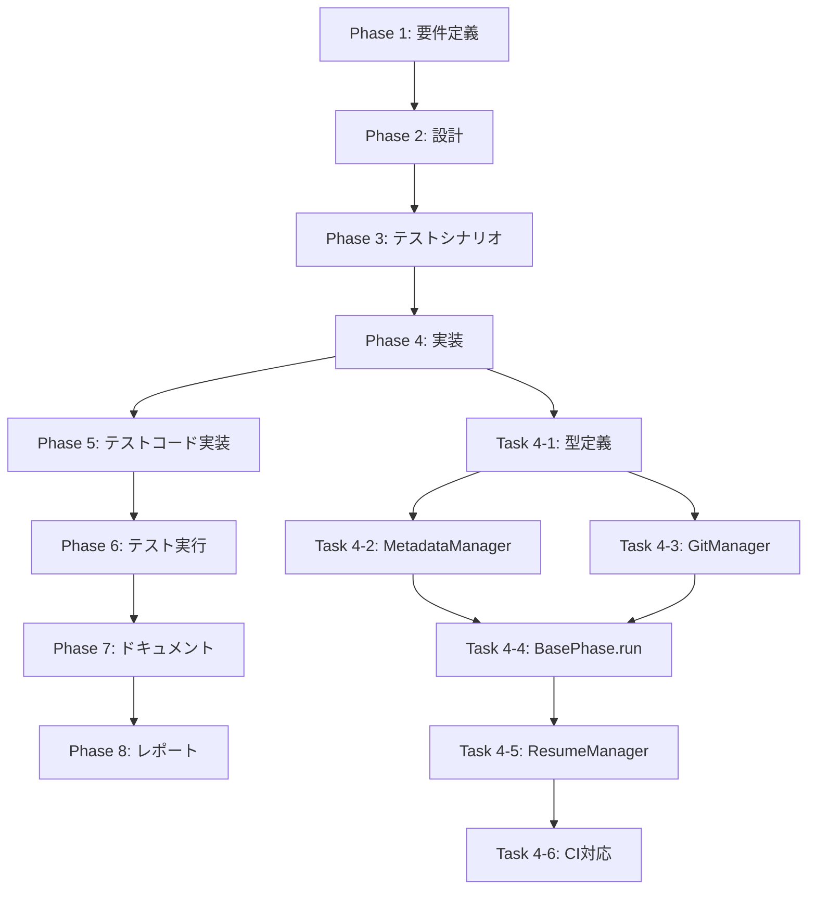

# プロジェクト計画書 - Issue #10: Git コミット頻度とレジューム粒度の改善

## Issue分析

### 複雑度: **複雑**

**理由**:
- アーキテクチャの重要な変更が必要（BasePhase、MetadataManager、GitManager の修正）
- 既存のワークフローに影響を与える大規模な変更
- CI/CD 環境での動作保証が必要
- 既存テストの更新と新規テストの追加が必要
- レジューム機能の再設計が必要

### 見積もり工数: **20~28時間**

**根拠**:
- **Phase 1 (要件定義)**: 2~3h - 詳細な受け入れ基準の定義、エッジケースの洗い出し
- **Phase 2 (設計)**: 4~5h - メタデータスキーマ設計、ステップ管理フロー設計、CI環境対応設計
- **Phase 3 (テストシナリオ)**: 2~3h - ステップ単位のテストシナリオ、プッシュ失敗シナリオ、レジュームシナリオ
- **Phase 4 (実装)**: 6~8h - BasePhase、MetadataManager、GitManager の修正
- **Phase 5 (テストコード実装)**: 2~3h - ユニットテスト・インテグレーションテスト作成
- **Phase 6 (テスト実行)**: 1~2h - テスト実行と修正
- **Phase 7 (ドキュメント)**: 2~3h - CLAUDE.md、README.md、ARCHITECTURE.md の更新
- **Phase 8 (レポート)**: 1~1h - ステータスレポート・PR ボディ生成

### リスク評価: **高**

**理由**:
- 既存のワークフローに影響を与える変更
- CI/CD 環境での動作保証が必要
- Git コミット・プッシュのエラーハンドリングが重要
- メタデータのマイグレーション処理が必要
- 既存ワークフローとの後方互換性の確保

---

## 実装戦略判断

### 実装戦略: **EXTEND**

**判断根拠**:
既存のワークフローインフラ（BasePhase、MetadataManager、GitManager）を拡張する形で実装します。新規クラスの作成ではなく、既存クラスにステップ管理機能を追加することで、既存機能との整合性を保ちながら改善を実現します。

**具体的な拡張ポイント**:
1. **MetadataManager**: メタデータスキーマに `current_step` と `completed_steps` フィールドを追加
2. **BasePhase.run()**: execute/review/revise の各ステップ後に Git コミット＆プッシュを実行
3. **GitManager**: コミットメッセージにステップ情報を含める機能を追加
4. **ResumeManager**: ステップ単位でのレジューム機能を追加

---

### テスト戦略: **UNIT_INTEGRATION**

**判断根拠**:
ステップ管理機能は単体としての動作検証（ユニットテスト）と、実際のワークフロー実行での動作検証（インテグレーションテスト）の両方が必要です。

**テスト範囲**:
- **ユニットテスト**: MetadataManager のステップ管理メソッド、GitManager のコミットメッセージ生成
- **インテグレーションテスト**: ステップ単位のコミット＆プッシュ、レジューム機能、プッシュ失敗時のリトライ

---

### テストコード戦略: **BOTH_TEST**

**判断根拠**:
既存のテストファイルを拡張しつつ、新規のステップ管理機能に特化したテストファイルも作成します。

**具体的な方針**:
- **既存テストの拡張**: `tests/unit/metadata-manager.test.ts` にステップ管理のテストを追加
- **新規テストの作成**: `tests/unit/step-management.test.ts`、`tests/integration/step-resume.test.ts` を作成

---

## 影響範囲分析

### 既存コードへの影響

#### 1. コアモジュール
- **`src/core/metadata-manager.ts`**:
  - `PhaseMetadata` インターフェースに `current_step` と `completed_steps` を追加
  - ステップ状態を更新するメソッドを追加
  - メタデータマイグレーション処理を追加

- **`src/phases/base-phase.ts`**:
  - `run()` メソッドを修正し、各ステップ後に Git コミット＆プッシュを実行
  - ステップ単位でのメタデータ更新を追加
  - レジューム時のステップスキップ処理を追加

- **`src/core/git-manager.ts`**:
  - `commitPhaseOutput()` メソッドにステップ情報を追加
  - コミットメッセージ生成にステップ名を含める

- **`src/utils/resume.ts`**:
  - ステップ単位でのレジューム判定を追加
  - `getResumePhase()` を `getResumeStep()` に拡張

#### 2. 型定義
- **`src/types.ts`**:
  - `PhaseMetadata` インターフェースに新規フィールドを追加
  - `StepName` 型を定義（'execute' | 'review' | 'revise'）

#### 3. テストコード
- **既存テストの更新**: メタデータスキーマ変更に伴うテストデータの更新
- **新規テストの追加**: ステップ管理機能のテスト

### 依存関係の変更

- **新規依存の追加**: なし（既存依存関係で対応可能）
- **既存依存の変更**: なし

### マイグレーション要否

**要**: メタデータスキーマの変更に伴うマイグレーション処理が必要

**マイグレーション内容**:
1. 既存の `metadata.json` に `current_step: null` と `completed_steps: []` を追加
2. フェーズステータスが `completed` の場合、`completed_steps: ['execute', 'review', 'revise']` を設定
3. フェーズステータスが `in_progress` の場合、`current_step: 'execute'`、`completed_steps: []` を設定

---

## タスク分割

### Phase 1: 要件定義 (見積もり: 2~3h)

- [x] Task 1-1: 機能要件の詳細化 (1~1.5h)
  - FR-1: ステップ単位の Git コミット＆プッシュの詳細仕様
  - FR-2: メタデータ拡張の詳細設計
  - FR-3: ステップ単位のレジュームの詳細仕様
  - FR-4: プッシュ失敗時の動作仕様
  - FR-5: BasePhase.run()メソッドの修正
  - FR-6: GitManagerの拡張
  - FR-7: ResumeManagerの拡張
  - FR-8: メタデータマイグレーション処理

- [x] Task 1-2: 非機能要件の定義 (0.5~1h)
  - CI/CD 環境での動作保証
  - パフォーマンス要件（コミット＆プッシュのオーバーヘッド）
  - エラーハンドリング要件
  - 信頼性、保守性、拡張性、セキュリティ要件

- [x] Task 1-3: エッジケースの洗い出し (0.5~0.5h)
  - ネットワークエラー時の動作
  - プッシュ失敗時の動作
  - メタデータ不整合時の動作
  - CI環境でのワークスペースリセット対応

---

### Phase 2: 設計 (見積もり: 4~5h)

- [ ] Task 2-1: メタデータスキーマ設計 (1~1.5h)
  - `PhaseMetadata` インターフェースの拡張
  - マイグレーション戦略の設計
  - 後方互換性の検討

- [ ] Task 2-2: ステップ管理フロー設計 (1.5~2h)
  - BasePhase.run() のフロー設計（各ステップでのコミット＆プッシュ）
  - ステップ開始前のメタデータ更新
  - ステップ完了後のメタデータ更新
  - プッシュ失敗時のリトライフロー

- [ ] Task 2-3: レジューム機能設計 (1~1h)
  - ステップ単位でのレジューム判定ロジック
  - CI 環境でのリモート同期フロー
  - completed_steps によるステップスキップ処理

- [ ] Task 2-4: エラーハンドリング設計 (0.5~0.5h)
  - プッシュ失敗時のリトライ戦略
  - コミット成功・プッシュ失敗時の動作
  - メタデータ不整合時の復旧処理

---

### Phase 3: テストシナリオ (見積もり: 2~3h)

- [ ] Task 3-1: ユニットテストシナリオ策定 (1~1.5h)
  - MetadataManager のステップ管理メソッド
  - GitManager のコミットメッセージ生成
  - ResumeManager のステップ判定ロジック

- [ ] Task 3-2: インテグレーションテストシナリオ策定 (1~1.5h)
  - 正常フロー: execute → review → revise のステップ単位コミット
  - レジュームフロー: execute 完了後のレジューム
  - プッシュ失敗フロー: リトライとリカバリー
  - CI 環境フロー: リモート同期とレジューム

---

### Phase 4: 実装 (見積もり: 6~8h)

- [ ] Task 4-1: 型定義の拡張 (0.5~0.5h)
  - `src/types.ts` に `StepName` 型を追加
  - `PhaseMetadata` インターフェースに `current_step` と `completed_steps` を追加

- [ ] Task 4-2: MetadataManager の拡張 (1~1.5h)
  - `updateStepStatus()` メソッドの追加
  - `getCompletedSteps()` メソッドの追加
  - `setCurrentStep()` メソッドの追加
  - メタデータマイグレーション処理の実装

- [ ] Task 4-3: GitManager の拡張 (1~1.5h)
  - `commitPhaseOutput()` にステップパラメータを追加
  - コミットメッセージ生成に step 情報を含める
  - `commitStepOutput()` メソッドの追加（ステップ単位のコミット）

- [ ] Task 4-4: BasePhase.run() の修正 (2~2.5h)
  - execute 後の Git コミット＆プッシュ処理を追加
  - review 後の Git コミット＆プッシュ処理を追加
  - revise 後の Git コミット＆プッシュ処理を追加
  - プッシュ失敗時のエラーハンドリング
  - ステップ開始前のメタデータ更新
  - ステップ完了後のメタデータ更新

- [ ] Task 4-5: ResumeManager の拡張 (1~1.5h)
  - ステップ単位でのレジューム判定ロジック
  - `getResumeStep()` メソッドの実装
  - completed_steps によるステップスキップ処理

- [ ] Task 4-6: CI 環境対応 (0.5~0.5h)
  - リモートブランチからの pull 処理
  - metadata.json の同期処理

---

### Phase 5: テストコード実装 (見積もり: 2~3h)

- [ ] Task 5-1: ユニットテストの実装 (1~1.5h)
  - `tests/unit/metadata-manager.test.ts` にステップ管理のテストを追加
  - `tests/unit/git-manager.test.ts` にステップコミットのテストを追加
  - `tests/unit/step-management.test.ts` を新規作成

- [ ] Task 5-2: インテグレーションテストの実装 (1~1.5h)
  - `tests/integration/step-resume.test.ts` を新規作成
  - `tests/integration/step-commit-push.test.ts` を新規作成
  - 既存テストの更新（メタデータスキーマ変更に伴う修正）

---

### Phase 6: テスト実行 (見積もり: 1~2h)

- [ ] Task 6-1: ユニットテスト実行と修正 (0.5~1h)
  - テスト実行
  - 失敗したテストの修正
  - カバレッジ確認

- [ ] Task 6-2: インテグレーションテスト実行と修正 (0.5~1h)
  - テスト実行
  - 失敗したテストの修正
  - CI 環境でのテスト実行確認

---

### Phase 7: ドキュメント (見積もり: 2~3h)

- [ ] Task 7-1: ARCHITECTURE.md の更新 (1~1.5h)
  - ステップ管理機能のアーキテクチャ説明を追加
  - メタデータスキーマの更新内容を記載
  - レジューム機能のフロー図を追加

- [ ] Task 7-2: CLAUDE.md の更新 (0.5~1h)
  - CLI オプションの更新（該当なし）
  - Git コミット動作の説明を更新
  - レジューム機能の説明を更新

- [ ] Task 7-3: README.md の更新 (0.5~0.5h)
  - Git コミット頻度の改善を反映
  - レジューム機能の説明を更新

---

### Phase 8: レポート (見積もり: 1~1h)

- [ ] Task 8-1: ステータスレポート生成 (0.5~0.5h)
  - 実装内容のサマリー
  - テスト結果のサマリー
  - 残課題の洗い出し

- [ ] Task 8-2: PR ボディ生成 (0.5~0.5h)
  - 変更内容の詳細
  - 受け入れ基準の確認
  - レビューポイントの記載

---

## 依存関係

---

## リスクと軽減策

### リスク1: メタデータマイグレーション失敗

- **影響度**: 高
- **確率**: 中
- **軽減策**:
  - マイグレーション前にメタデータのバックアップを作成
  - マイグレーション処理のユニットテストを作成
  - 既存ワークフローでのマイグレーション動作を確認

### リスク2: Git プッシュ失敗時のワークフロー中断

- **影響度**: 高
- **確率**: 中
- **軽減策**:
  - プッシュ失敗時のリトライ機能を実装（最大3回）
  - コミット成功・プッシュ失敗時の動作を明確化
  - プッシュ失敗時のエラーメッセージを分かりやすくする

### リスク3: CI 環境でのレジューム失敗

- **影響度**: 高
- **確率**: 中
- **軽減策**:
  - CI 環境でのリモート同期処理を実装
  - CI 環境でのインテグレーションテストを作成
  - Jenkins パイプラインでのテスト実行を確認

### リスク4: 既存ワークフローへの影響

- **影響度**: 中
- **確率**: 低
- **軽減策**:
  - 後方互換性を保つためのマイグレーション処理を実装
  - 既存テストをすべて実行して影響を確認
  - 段階的なロールアウト（新規ワークフローから適用）

### リスク5: パフォーマンス劣化

- **影響度**: 低
- **確率**: 低
- **軽減策**:
  - ステップ単位のコミット＆プッシュによるオーバーヘッドを測定
  - 必要に応じてプッシュのバッチ処理を検討

---

## 品質ゲート

### Phase 1: 要件定義

- [x] 機能要件が明確に記載されている（FR-1〜FR-8）
- [x] 受け入れ基準が定義されている（AC-1〜AC-10）
- [x] 非機能要件が定義されている（CI/CD、パフォーマンス、エラーハンドリング）
- [x] エッジケースが洗い出されている

### Phase 2: 設計

- [ ] 実装戦略の判断根拠が明記されている（EXTEND）
- [ ] テスト戦略の判断根拠が明記されている（UNIT_INTEGRATION）
- [ ] テストコード戦略の判断根拠が明記されている（BOTH_TEST）
- [ ] メタデータスキーマの設計が完了している
- [ ] ステップ管理フローの設計が完了している
- [ ] レジューム機能の設計が完了している
- [ ] エラーハンドリング設計が完了している

### Phase 3: テストシナリオ

- [ ] ユニットテストシナリオが策定されている
- [ ] インテグレーションテストシナリオが策定されている
- [ ] エッジケースのテストシナリオが含まれている
- [ ] CI 環境でのテストシナリオが含まれている

### Phase 4: 実装

- [ ] 型定義が追加されている（StepName、PhaseMetadata 拡張）
- [ ] MetadataManager が拡張されている（ステップ管理メソッド）
- [ ] GitManager が拡張されている（ステップ単位のコミット）
- [ ] BasePhase.run() が修正されている（ステップ単位のコミット＆プッシュ）
- [ ] ResumeManager が拡張されている（ステップ単位のレジューム）
- [ ] CI 環境対応が実装されている
- [ ] すべてのコードが TypeScript でコンパイルエラーなし

### Phase 5: テストコード実装

- [ ] ユニットテストが実装されている
- [ ] インテグレーションテストが実装されている
- [ ] 既存テストが更新されている
- [ ] すべてのテストがコンパイルエラーなし

### Phase 6: テスト実行

- [ ] すべてのユニットテストが成功している
- [ ] すべてのインテグレーションテストが成功している
- [ ] カバレッジが 80% 以上である
- [ ] CI 環境でのテストが成功している

### Phase 7: ドキュメント

- [ ] ARCHITECTURE.md が更新されている
- [ ] CLAUDE.md が更新されている
- [ ] README.md が更新されている
- [ ] ドキュメントに矛盾がない

### Phase 8: レポート

- [ ] ステータスレポートが生成されている
- [ ] PR ボディが生成されている
- [ ] すべての受け入れ基準が満たされている
- [ ] 残課題が明確化されている

---

## 注意事項

1. **後方互換性の確保**: 既存のワークフローが正常に動作することを確認する
2. **CI 環境でのテスト**: Jenkins パイプラインでのテスト実行を必須とする
3. **エラーハンドリング**: Git プッシュ失敗時の動作を明確にし、適切なエラーメッセージを表示する
4. **メタデータマイグレーション**: マイグレーション処理のテストを十分に行う
5. **パフォーマンス測定**: ステップ単位のコミット＆プッシュによるオーバーヘッドを測定する

---

## 参考情報

- **CLAUDE.md**: プロジェクトの全体方針とコーディングガイドライン
- **ARCHITECTURE.md**: アーキテクチャ設計思想
- **README.md**: プロジェクト概要と使用方法
- **Issue #10**: https://github.com/tielec/ai-workflow-agent/issues/10
