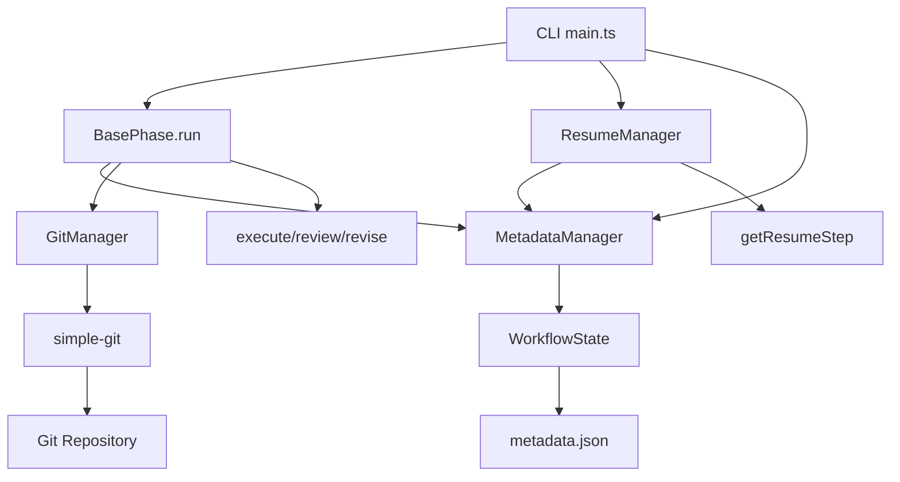

# 詳細設計書 - Issue #10: Git コミット頻度とレジューム粒度の改善

## 0. Planning & Requirements ドキュメントの確認

本設計は以下のドキュメントに基づいて策定されました：

- **Planning Document**: `.ai-workflow/issue-10/00_planning/output/planning.md`
- **Requirements Document**: `.ai-workflow/issue-10/01_requirements/output/requirements.md`
- **プロジェクトガイドライン**: `CLAUDE.md`、`ARCHITECTURE.md`、`README.md`

### Planning Phaseからの重要事項

- **見積もり工数**: 20~28時間（8フェーズ）
- **複雑度**: 複雑（アーキテクチャの重要な変更が必要）
- **リスク評価**: 高（既存ワークフローへの影響、CI/CD環境対応、メタデータマイグレーション）

---

## 1. 実装戦略判断

### 実装戦略: **EXTEND**

**判断根拠**:

1. **既存インフラの拡張**: BasePhase、MetadataManager、GitManagerは既に確立されたアーキテクチャであり、新規クラスを作成するのではなく、これらに機能を追加する方が整合性が高い
2. **影響範囲の明確化**: 既存クラスに`current_step`と`completed_steps`のフィールドを追加し、ステップ単位のコミット機能を追加することで、既存機能との互換性を保ちながら改善を実現できる
3. **後方互換性**: 既存のワークフローが引き続き動作するように、マイグレーション処理を実装することで段階的な移行が可能
4. **コードの凝集度**: ステップ管理機能はフェーズ実行ロジック（BasePhase.run()）と密接に関連しており、新規クラスに分離するよりも既存クラス内で管理する方が自然

**拡張対象コンポーネント**:
- `src/types.ts` - 型定義の拡張
- `src/core/metadata-manager.ts` - メタデータ管理の拡張
- `src/core/git-manager.ts` - Git操作の拡張
- `src/phases/base-phase.ts` - フェーズ実行フローの拡張
- `src/utils/resume.ts` - レジューム機能の拡張

---

## 2. テスト戦略判断

### テスト戦略: **UNIT_INTEGRATION**

**判断根拠**:

1. **ユニットテストの必要性**:
   - MetadataManagerのステップ管理メソッド（`updateStepStatus()`、`getCompletedSteps()`など）は独立してテスト可能
   - GitManagerのコミットメッセージ生成ロジック（`buildStepCommitMessage()`）は純粋関数として単体テスト可能
   - ResumeManagerのステップ判定ロジック（`getResumeStep()`）はメタデータを入力として動作をテスト可能

2. **インテグレーションテストの必要性**:
   - BasePhase.run()メソッドの実際のステップ実行フロー（execute → commit → review → commit → revise → commit）は統合テストが必須
   - CI環境でのリモート同期（git pull → メタデータ読み込み → ステップスキップ）は実際のGit操作を含むため統合テストが必要
   - プッシュ失敗時のリトライ動作は、GitManagerとMetadataManagerの連携をテストする必要がある

3. **BDDテストは不要**:
   - ユーザーストーリーは存在するが、ステップ管理機能は内部的な仕組みであり、エンドユーザーが直接操作するUIではない
   - 既存のユニット＋インテグレーションテストで受け入れ基準（AC-1〜AC-10）を十分にカバーできる

**テスト範囲**:
- **ユニットテスト**: MetadataManager、GitManager、ResumeManagerの個別メソッド
- **インテグレーションテスト**: BasePhase.run()の実際のフロー、CI環境シミュレーション、プッシュ失敗シナリオ

---

## 3. テストコード戦略判断

### テストコード戦略: **BOTH_TEST**

**判断根拠**:

1. **既存テストの拡張**:
   - `tests/unit/phase-dependencies.test.ts`などの既存ユニットテストファイルが存在し、MetadataManagerやGitManagerの既存機能をテストしている
   - これらのテストファイルに、新規メソッド（`updateStepStatus()`、`commitStepOutput()`など）のテストケースを追加することで、既存テストとの一貫性を保つ

2. **新規テストの作成**:
   - ステップ管理機能は新しい機能領域であり、専用のテストファイル（`tests/unit/step-management.test.ts`、`tests/integration/step-resume.test.ts`）を作成することで、テストの可読性と保守性が向上
   - CI環境でのレジューム動作など、複雑なシナリオは独立したテストファイルで管理する方が明確

**具体的な方針**:
- **既存テストの拡張**: `tests/unit/metadata-manager.test.ts`（存在すれば）、`tests/unit/git-manager.test.ts`（存在すれば）
- **新規テストの作成**:
  - `tests/unit/step-management.test.ts` - ステップ管理の単体テスト
  - `tests/integration/step-commit-push.test.ts` - ステップ単位のコミット＆プッシュの統合テスト
  - `tests/integration/step-resume.test.ts` - ステップ単位のレジューム機能の統合テスト

---

## 4. アーキテクチャ設計

### 4.1 システム全体図

```
┌─────────────────────────────────────────────────────────────┐
│                    CLI (src/main.ts)                        │
│  - オプション解析                                             │
│  - プリセット解決                                             │
│  - マルチリポジトリサポート                                    │
└─────────────────────────────────────────────────────────────┘
                           │
                           ▼
┌─────────────────────────────────────────────────────────────┐
│              BasePhase.run() (拡張後)                       │
│  ┌───────────────────────────────────────────────┐          │
│  │ 1. Execute Step                                │          │
│  │    - metadata.current_step = 'execute'        │          │
│  │    - execute()                                 │          │
│  │    - commitAndPushStep('execute')             │          │
│  │    - metadata.completed_steps.push('execute') │          │
│  │    - metadata.current_step = null             │          │
│  ├───────────────────────────────────────────────┤          │
│  │ 2. Review Step (optional)                     │          │
│  │    - metadata.current_step = 'review'         │          │
│  │    - review()                                  │          │
│  │    - commitAndPushStep('review')              │          │
│  │    - metadata.completed_steps.push('review')  │          │
│  │    - metadata.current_step = null             │          │
│  ├───────────────────────────────────────────────┤          │
│  │ 3. Revise Step (if review failed)             │          │
│  │    - metadata.current_step = 'revise'         │          │
│  │    - revise()                                  │          │
│  │    - commitAndPushStep('revise')              │          │
│  │    - metadata.completed_steps.push('revise')  │          │
│  │    - metadata.current_step = null             │          │
│  └───────────────────────────────────────────────┘          │
└─────────────────────────────────────────────────────────────┘
         │                  │                  │
         ▼                  ▼                  ▼
┌──────────────┐  ┌──────────────┐  ┌──────────────┐
│ Metadata     │  │ GitManager   │  │ ResumeManager│
│ Manager      │  │              │  │              │
│ (拡張後)     │  │ (拡張後)     │  │ (拡張後)     │
└──────────────┘  └──────────────┘  └──────────────┘
```

### 4.2 データフロー

```
┌─────────────────────────────────────────────────────────────┐
│                  Workflow Start (execute --phase all)       │
└─────────────────────────────────────────────────────────────┘
                           │
                           ▼
┌─────────────────────────────────────────────────────────────┐
│  ResumeManager.getResumeStep()                              │
│  - metadata.jsonを読み込み                                   │
│  - current_stepとcompleted_stepsを確認                      │
│  - 次に実行すべきステップを返す                              │
└─────────────────────────────────────────────────────────────┘
                           │
                           ▼
┌─────────────────────────────────────────────────────────────┐
│  BasePhase.run()                                            │
│  1. Execute Stepの実行判定                                   │
│     if (!metadata.completed_steps.includes('execute')) {   │
│       metadata.current_step = 'execute'                     │
│       await metadataManager.save()                          │
│       await this.execute(context)                           │
│       await this.commitAndPushStep('execute')               │
│       metadata.completed_steps.push('execute')              │
│       metadata.current_step = null                          │
│       await metadataManager.save()                          │
│     } else {                                                 │
│       console.log('Skipping execute (already completed)')   │
│     }                                                        │
└─────────────────────────────────────────────────────────────┘
                           │
                           ▼
┌─────────────────────────────────────────────────────────────┐
│  GitManager.commitStepOutput('execute')                     │
│  - コミットメッセージ生成:                                   │
│    "[ai-workflow] Phase 1 (requirements) - execute completed"│
│  - git add .ai-workflow/**/*                                 │
│  - git commit -m "..."                                       │
│  - pushToRemote() (最大3回リトライ)                         │
└─────────────────────────────────────────────────────────────┘
                           │
                           ▼
┌─────────────────────────────────────────────────────────────┐
│  CI Environment (Jenkins Build #2)                          │
│  - Workspace Reset (ローカルファイル削除)                    │
│  - git clone & git checkout ai-workflow/issue-123           │
│  - git pull origin ai-workflow/issue-123                    │
│  - metadata.jsonを読み込み:                                  │
│    {                                                         │
│      "phases": {                                             │
│        "requirements": {                                     │
│          "current_step": null,                               │
│          "completed_steps": ["execute"]                      │
│        }                                                      │
│      }                                                        │
│    }                                                         │
│  - ResumeManager.getResumeStep() → 'review'                 │
│  - BasePhase.run() → executeスキップ、reviewから再開        │
└─────────────────────────────────────────────────────────────┘
```

### 4.3 コンポーネント間の関係



---

## 5. 影響範囲分析

### 5.1 既存コードへの影響

#### コアモジュール

1. **`src/types.ts`**
   - **変更内容**: `PhaseMetadata`インターフェースに新規フィールド追加
   - **影響度**: 高（すべてのフェーズに影響）
   - **後方互換性**: マイグレーション処理で対応

2. **`src/core/metadata-manager.ts`**
   - **変更内容**: ステップ管理メソッドの追加
   - **影響度**: 中（新規メソッドのため既存コードには影響なし）
   - **新規メソッド**: `updateStepStatus()`, `getCompletedSteps()`, `getCurrentStep()`

3. **`src/core/git-manager.ts`**
   - **変更内容**: ステップ単位のコミット機能追加
   - **影響度**: 低（新規メソッドのため既存のcommitPhaseOutput()には影響なし）
   - **新規メソッド**: `commitStepOutput()`, `buildStepCommitMessage()`

4. **`src/phases/base-phase.ts`**
   - **変更内容**: `run()`メソッドの大幅な修正
   - **影響度**: 高（すべてのフェーズ実行フローに影響）
   - **既存機能**: 保持（既存のexecute/review/reviseロジックは維持）

5. **`src/utils/resume.ts`**
   - **変更内容**: ステップ単位のレジューム判定機能追加
   - **影響度**: 中（既存のgetResumePhase()は維持、新規メソッド追加）
   - **新規メソッド**: `getResumeStep()`, `getNextStep()`

6. **`src/core/workflow-state.ts`**
   - **変更内容**: マイグレーション処理の追加
   - **影響度**: 中（migrate()メソッド内で新フィールドを追加）

#### テンプレートファイル

7. **`metadata.json.template`**
   - **変更内容**: 各フェーズに`current_step`と`completed_steps`フィールドを追加
   - **影響度**: 中（既存フィールドは維持）

### 5.2 依存関係の変更

- **新規依存の追加**: なし（既存のsimple-git、fs-extraで対応可能）
- **既存依存の変更**: なし

### 5.3 マイグレーション要否

**要**: メタデータスキーマの変更に伴うマイグレーション処理が必要

**マイグレーション内容**:
1. 既存の`metadata.json`に`current_step: null`と`completed_steps: []`を追加
2. フェーズステータスが`completed`の場合、`completed_steps: ['execute', 'review', 'revise']`を設定
3. フェーズステータスが`in_progress`の場合、`current_step: 'execute'`、`completed_steps: []`を設定
4. マイグレーション前に`metadata.json.backup`を作成

---

## 6. 変更・追加ファイルリスト

### 6.1 修正が必要な既存ファイル

| ファイルパス | 変更内容 | 理由 |
|------------|---------|------|
| `src/types.ts` | `PhaseMetadata`インターフェースに`current_step`と`completed_steps`を追加、`StepName`型を定義 | ステップ管理のための型定義 |
| `src/core/metadata-manager.ts` | ステップ管理メソッドの追加 | メタデータ操作の拡張 |
| `src/core/git-manager.ts` | `commitStepOutput()`メソッドの追加 | ステップ単位のコミット機能 |
| `src/phases/base-phase.ts` | `run()`メソッドの修正、`commitAndPushStep()`メソッドの追加 | ステップ単位のコミット＆プッシュ |
| `src/utils/resume.ts` | `getResumeStep()`メソッドの追加 | ステップ単位のレジューム |
| `src/core/workflow-state.ts` | `migrate()`メソッドにステップフィールドのマイグレーション処理を追加 | スキーマ変更への対応 |
| `metadata.json.template` | 各フェーズに`current_step`と`completed_steps`を追加 | 新規ワークフローのテンプレート更新 |

### 6.2 新規作成ファイル

| ファイルパス | 内容 | 理由 |
|------------|------|------|
| `tests/unit/step-management.test.ts` | ステップ管理機能の単体テスト | 新機能のテスト |
| `tests/integration/step-commit-push.test.ts` | ステップ単位のコミット＆プッシュの統合テスト | 実際のGit操作を含むテスト |
| `tests/integration/step-resume.test.ts` | ステップ単位のレジュームの統合テスト | CI環境シミュレーション |

### 6.3 削除が必要なファイル

なし

---

## 7. 詳細設計

### 7.1 型定義設計

#### src/types.ts

```typescript
// 新規型定義: ステップ名
export type StepName = 'execute' | 'review' | 'revise';

// 既存インターフェースの拡張
export interface PhaseMetadata {
  status: PhaseStatus;
  retry_count: number;
  started_at: string | null;
  completed_at: string | null;
  review_result: string | null;
  output_files?: string[];

  // 新規フィールド (Issue #10)
  current_step?: StepName | null;         // 現在実行中のステップ
  completed_steps?: StepName[];            // 完了済みステップの配列
}
```

**設計判断**:
- `current_step`は`StepName | null`型とし、ステップ実行中以外は`null`
- `completed_steps`は配列とし、実行順序を保持
- オプショナルフィールド（`?`）とすることで、既存メタデータとの後方互換性を確保

### 7.2 MetadataManager 設計

#### 新規メソッド

```typescript
/**
 * ステップ開始時にcurrent_stepを更新
 */
public updateCurrentStep(
  phaseName: PhaseName,
  step: StepName | null
): void {
  const phaseData = this.state.data.phases[phaseName];
  phaseData.current_step = step;
  this.save();
}

/**
 * ステップ完了時にcompleted_stepsに追加
 */
public addCompletedStep(
  phaseName: PhaseName,
  step: StepName
): void {
  const phaseData = this.state.data.phases[phaseName];
  if (!phaseData.completed_steps) {
    phaseData.completed_steps = [];
  }

  // 重複チェック
  if (!phaseData.completed_steps.includes(step)) {
    phaseData.completed_steps.push(step);
  }

  // current_stepをnullにリセット
  phaseData.current_step = null;
  this.save();
}

/**
 * completed_stepsを取得
 */
public getCompletedSteps(phaseName: PhaseName): StepName[] {
  const phaseData = this.state.data.phases[phaseName];
  return phaseData.completed_steps ?? [];
}

/**
 * current_stepを取得
 */
public getCurrentStep(phaseName: PhaseName): StepName | null {
  const phaseData = this.state.data.phases[phaseName];
  return phaseData.current_step ?? null;
}
```

**設計判断**:
- `addCompletedStep()`で重複チェックを実施（冪等性の確保）
- `current_step`のリセットは`addCompletedStep()`内で自動的に実行
- 既存の`save()`メソッドを活用してメタデータを永続化

### 7.3 GitManager 設計

#### 新規メソッド

```typescript
/**
 * ステップ単位のGitコミットを実行
 */
public async commitStepOutput(
  phaseName: PhaseName,
  phaseNumber: number,
  step: StepName,
  issueNumber: number,
  workingDir: string
): Promise<CommitResult> {
  const message = this.buildStepCommitMessage(
    phaseName,
    phaseNumber,
    step,
    issueNumber
  );

  const changedFiles = await this.getChangedFiles();
  const targetFiles = this.filterPhaseFiles(changedFiles, issueNumber.toString());

  if (targetFiles.length === 0) {
    console.warn('[WARNING] No files to commit for step:', step);
    return {
      success: true,
      commit_hash: null,
      files_committed: [],
    };
  }

  await this.git.add(targetFiles);
  await this.ensureGitConfig();

  try {
    const commitResponse = await this.git.commit(message, targetFiles, {
      '--no-verify': null,
    });

    console.info(`[INFO] Step commit created: ${commitResponse.commit ?? 'unknown'}`);

    return {
      success: true,
      commit_hash: commitResponse.commit ?? null,
      files_committed: targetFiles,
    };
  } catch (error) {
    console.error(`[ERROR] Step commit failed: ${(error as Error).message}`);
    return {
      success: false,
      commit_hash: null,
      files_committed: targetFiles,
      error: `Step commit failed: ${(error as Error).message}`,
    };
  }
}

/**
 * ステップ用のコミットメッセージを生成
 */
private buildStepCommitMessage(
  phaseName: string,
  phaseNumber: number,
  step: string,
  issueNumber: number
): string {
  return [
    `[ai-workflow] Phase ${phaseNumber} (${phaseName}) - ${step} completed`,
    '',
    `Issue: #${issueNumber}`,
    `Phase: ${phaseNumber} (${phaseName})`,
    `Step: ${step}`,
    `Status: completed`,
    '',
    'Auto-generated by AI Workflow',
  ].join('\n');
}
```

**設計判断**:
- 既存の`commitPhaseOutput()`メソッドは保持（後方互換性）
- コミットメッセージ形式は要件定義書（FR-1）に準拠
- `getChangedFiles()`、`filterPhaseFiles()`など既存のヘルパーメソッドを再利用
- `pushToRemote()`は別メソッドとして呼び出す（関心の分離）

### 7.4 BasePhase.run() 設計

#### 修正後のrun()メソッド

```typescript
public async run(options: PhaseRunOptions = {}): Promise<boolean> {
  const gitManager = options.gitManager ?? null;

  // 依存関係検証（既存ロジック）
  const dependencyResult = validatePhaseDependencies(this.phaseName, this.metadata, {
    skipCheck: this.skipDependencyCheck,
    ignoreViolations: this.ignoreDependencies,
    presetPhases: this.presetPhases,
  });

  if (!dependencyResult.valid) {
    const error = dependencyResult.error ?? 'Dependency validation failed.';
    console.error(`[ERROR] ${error}`);
    return false;
  }

  if (dependencyResult.warning) {
    console.warn(`[WARNING] ${dependencyResult.warning}`);
  }

  this.updatePhaseStatus('in_progress');
  await this.postProgress('in_progress', `${this.phaseName} フェーズを開始します。`);

  try {
    // Execute Step
    const completedSteps = this.metadata.getCompletedSteps(this.phaseName);
    if (!completedSteps.includes('execute')) {
      console.info(`[INFO] Phase ${this.phaseName}: Starting execute step...`);
      this.metadata.updateCurrentStep(this.phaseName, 'execute');

      const executeResult = await this.execute();
      if (!executeResult.success) {
        console.error(`[ERROR] Phase ${this.phaseName}: Execute failed: ${executeResult.error ?? 'Unknown error'}`);
        await this.handleFailure(executeResult.error ?? 'Unknown execute error');
        return false;
      }

      console.info(`[INFO] Phase ${this.phaseName}: Execute completed successfully`);

      // Commit & Push after execute
      if (gitManager) {
        await this.commitAndPushStep(gitManager, 'execute');
      }

      this.metadata.addCompletedStep(this.phaseName, 'execute');
    } else {
      console.info(`[INFO] Phase ${this.phaseName}: Skipping execute step (already completed)`);
    }

    // Review Step (if enabled)
    if (!options.skipReview && (await this.shouldRunReview())) {
      const completedSteps = this.metadata.getCompletedSteps(this.phaseName);
      if (!completedSteps.includes('review')) {
        console.info(`[INFO] Phase ${this.phaseName}: Starting review step...`);
        this.metadata.updateCurrentStep(this.phaseName, 'review');

        const reviewResult = await this.review();
        if (!reviewResult.success) {
          console.warn(`[WARNING] Phase ${this.phaseName}: Review failed: ${reviewResult.error ?? 'Unknown error'}`);

          // Revise Step (if review failed)
          await this.performReviseStep(gitManager, reviewResult, options);
        } else {
          console.info(`[INFO] Phase ${this.phaseName}: Review completed successfully`);

          // Commit & Push after review
          if (gitManager) {
            await this.commitAndPushStep(gitManager, 'review');
          }

          this.metadata.addCompletedStep(this.phaseName, 'review');
        }
      } else {
        console.info(`[INFO] Phase ${this.phaseName}: Skipping review step (already completed)`);
      }
    }

    // フェーズ完了
    this.updatePhaseStatus('completed');
    await this.postProgress('completed', `${this.phaseName} フェーズが完了しました。`);

    return true;
  } catch (error) {
    const message = (error as Error).message ?? String(error);
    await this.handleFailure(message);
    return false;
  }
}

/**
 * ステップ単位のコミット＆プッシュ
 */
private async commitAndPushStep(
  gitManager: GitManager,
  step: StepName
): Promise<void> {
  const issueNumber = parseInt(this.metadata.data.issue_number, 10);
  const phaseNumber = this.getPhaseNumberInt(this.phaseName);

  console.info(`[INFO] Phase ${this.phaseName}: Committing ${step} step...`);

  const commitResult = await gitManager.commitStepOutput(
    this.phaseName,
    phaseNumber,
    step,
    issueNumber,
    this.workingDir
  );

  if (!commitResult.success) {
    throw new Error(`Git commit failed for step ${step}: ${commitResult.error ?? 'unknown error'}`);
  }

  console.info(`[INFO] Phase ${this.phaseName}: Pushing ${step} step to remote...`);

  try {
    const pushResult = await gitManager.pushToRemote(3); // 最大3回リトライ
    if (!pushResult.success) {
      throw new Error(`Git push failed for step ${step}: ${pushResult.error ?? 'unknown error'}`);
    }
    console.info(`[INFO] Phase ${this.phaseName}: Step ${step} pushed successfully`);
  } catch (error) {
    // プッシュ失敗時の処理
    console.error(`[ERROR] Phase ${this.phaseName}: Failed to push step ${step}: ${(error as Error).message}`);

    // current_stepを維持（次回レジューム時に同じステップを再実行）
    this.metadata.updateCurrentStep(this.phaseName, step);

    throw error;
  }
}

/**
 * Reviseステップの実行
 */
private async performReviseStep(
  gitManager: GitManager | null,
  reviewResult: PhaseExecutionResult,
  options: PhaseRunOptions
): Promise<void> {
  const completedSteps = this.metadata.getCompletedSteps(this.phaseName);
  if (completedSteps.includes('revise')) {
    console.info(`[INFO] Phase ${this.phaseName}: Skipping revise step (already completed)`);
    return;
  }

  console.info(`[INFO] Phase ${this.phaseName}: Starting revise step...`);
  this.metadata.updateCurrentStep(this.phaseName, 'revise');

  const feedback = reviewResult.error ?? 'レビューで不合格となりました。';
  const reviseResult = await this.performReviewCycle(null, MAX_RETRIES);

  if (!reviseResult.success) {
    console.error(`[ERROR] Phase ${this.phaseName}: Revise failed: ${reviseResult.error ?? 'Unknown error'}`);
    throw new Error(reviseResult.error ?? 'Revise failed');
  }

  console.info(`[INFO] Phase ${this.phaseName}: Revise completed successfully`);

  // Commit & Push after revise
  if (gitManager) {
    await this.commitAndPushStep(gitManager, 'revise');
  }

  this.metadata.addCompletedStep(this.phaseName, 'revise');
}

/**
 * フェーズ番号を整数で取得
 */
private getPhaseNumberInt(phase: PhaseName): number {
  const phaseOrder: PhaseName[] = [
    'planning',
    'requirements',
    'design',
    'test_scenario',
    'implementation',
    'test_implementation',
    'testing',
    'documentation',
    'report',
    'evaluation',
  ];
  return phaseOrder.indexOf(phase);
}
```

**設計判断**:
- 各ステップの実行前に`completed_steps`をチェックし、既に完了している場合はスキップ
- `current_step`の更新とリセットをMetadataManagerに委譲
- プッシュ失敗時は`current_step`を維持し、次回レジューム時に同じステップを再実行
- 既存の`performReviewCycle()`ロジックは維持し、reviseステップの実行部分のみ抽出

### 7.5 ResumeManager 設計

#### 新規メソッド

```typescript
/**
 * ステップ単位でのレジューム判定
 */
public getResumeStep(phaseName: PhaseName): {
  shouldResume: boolean;
  resumeStep: StepName | null;
  completedSteps: StepName[];
} {
  const phaseMetadata = this.metadata.data.phases[phaseName];

  if (!phaseMetadata || phaseMetadata.status === 'pending') {
    return { shouldResume: false, resumeStep: null, completedSteps: [] };
  }

  if (phaseMetadata.status === 'completed') {
    return {
      shouldResume: false,
      resumeStep: null,
      completedSteps: phaseMetadata.completed_steps ?? [],
    };
  }

  // in_progress または failed
  const completedSteps = phaseMetadata.completed_steps ?? [];
  const currentStep = phaseMetadata.current_step ?? null;

  // current_stepが設定されている場合はそこから再開
  if (currentStep) {
    return {
      shouldResume: true,
      resumeStep: currentStep,
      completedSteps,
    };
  }

  // current_stepがnullの場合、次のステップを判定
  const nextStep = this.getNextStep(completedSteps);
  return {
    shouldResume: true,
    resumeStep: nextStep,
    completedSteps,
  };
}

/**
 * 次に実行すべきステップを判定
 */
private getNextStep(completedSteps: StepName[]): StepName {
  if (!completedSteps.includes('execute')) {
    return 'execute';
  }
  if (!completedSteps.includes('review')) {
    return 'review';
  }
  if (!completedSteps.includes('revise')) {
    return 'revise';
  }
  // すべて完了している場合のフォールバック
  return 'execute';
}
```

**設計判断**:
- `current_step`が設定されている場合は優先的にそこから再開
- `current_step`がnullの場合、`completed_steps`から次のステップを判定
- フォールバック動作を明示的に定義（すべて完了している場合は`execute`を返す）

### 7.6 WorkflowState マイグレーション設計

#### migrate()メソッドの拡張

```typescript
public migrate(): boolean {
  if (!fs.existsSync(METADATA_TEMPLATE_PATH)) {
    console.warn(`[WARNING] Template file not found: ${METADATA_TEMPLATE_PATH}`);
    return false;
  }

  const template = fs.readJsonSync(METADATA_TEMPLATE_PATH) as WorkflowMetadata;
  const phases = this.data.phases as PhasesMetadata;
  let migrated = false;

  // 既存のマイグレーション処理（省略）...

  // Issue #10: ステップ管理フィールドのマイグレーション
  for (const [phaseName, phaseData] of Object.entries(phases)) {
    let phaseChanged = false;

    // current_stepフィールドの追加
    if (!('current_step' in phaseData)) {
      console.info(`[INFO] Migrating metadata.json: Adding current_step to ${phaseName}`);
      phaseData.current_step = null;
      phaseChanged = true;
    }

    // completed_stepsフィールドの追加
    if (!('completed_steps' in phaseData)) {
      console.info(`[INFO] Migrating metadata.json: Adding completed_steps to ${phaseName}`);

      // ステータスに応じて初期値を設定
      if (phaseData.status === 'completed') {
        phaseData.completed_steps = ['execute', 'review', 'revise'];
      } else if (phaseData.status === 'in_progress') {
        phaseData.completed_steps = [];
        phaseData.current_step = 'execute';
      } else {
        phaseData.completed_steps = [];
      }

      phaseChanged = true;
    }

    if (phaseChanged) {
      migrated = true;
    }
  }

  if (migrated) {
    // バックアップ作成
    const timestamp = this.formatTimestampForFilename();
    const backupPath = join(dirname(this.metadataPath), `metadata.json.backup_${timestamp}`);
    fs.copyFileSync(this.metadataPath, backupPath);
    console.info(`[INFO] Metadata backup created: ${backupPath}`);

    this.save();
    console.info('[OK] metadata.json migrated successfully');
  }

  return migrated;
}

private formatTimestampForFilename(date = new Date()): string {
  const pad = (value: number) => value.toString().padStart(2, '0');
  return [
    date.getFullYear(),
    pad(date.getMonth() + 1),
    pad(date.getDate()),
  ].join('') +
    '_' +
    [pad(date.getHours()), pad(date.getMinutes()), pad(date.getSeconds())].join('');
}
```

**設計判断**:
- `completed`フェーズは全ステップ完了と仮定
- `in_progress`フェーズは`execute`から再開と仮定
- マイグレーション前に自動的にバックアップを作成
- 既存のマイグレーション処理と統合

---

## 8. セキュリティ考慮事項

### 8.1 認証・認可

- **Git認証**: 既存の`GITHUB_TOKEN`環境変数を使用（変更なし）
- **アクセス制御**: プッシュ権限が必要（既存と同じ）

### 8.2 データ保護

- **メタデータの整合性**: `current_step`と`completed_steps`の不整合チェック
- **バックアップ**: マイグレーション時に自動的にバックアップを作成

### 8.3 セキュリティリスクと対策

| リスク | 影響度 | 対策 |
|--------|--------|------|
| メタデータ不整合 | 中 | マイグレーション処理でバリデーション、バックアップ作成 |
| プッシュ失敗時のデータ損失 | 高 | ローカルコミットは保持、`current_step`を維持して再実行可能に |
| CI環境でのワークスペースリセット | 高 | リモートブランチからpullしてメタデータを同期 |

---

## 9. 非機能要件への対応

### 9.1 パフォーマンス

- **目標**: ステップ単位のGitコミット＆プッシュによるオーバーヘッドは、フェーズ全体の実行時間の5%以内
- **測定方法**:
  - フェーズ実行前後の時間を計測
  - コミット＆プッシュの時間を個別に計測
  - オーバーヘッド率を算出（コミット時間 / フェーズ全体時間）
- **最適化**:
  - `pushToRemote()`の既存リトライ機能を活用（最大3回、指数バックオフ）
  - コミット対象ファイルのフィルタリング最適化（既存の`filterPhaseFiles()`を再利用）

### 9.2 信頼性

- **プッシュ失敗時のリトライ**: 既存の`pushToRemote()`メソッド（最大3回リトライ）を活用
- **メタデータ不整合の検出**: `getResumeStep()`でフォールバック動作を定義
- **エラーハンドリング**: すべての例外を適切にキャッチし、ログに記録
- **目標成功率**:
  - プッシュ失敗時のリトライ成功率: 95%以上
  - メタデータ不整合によるワークフロー停止: 0件

### 9.3 保守性

- **コーディング規約**: ESLintルール、TypeScript strict mode準拠
- **メソッド命名**: 動詞で始める（`commitStepOutput`、`getResumeStep`など）
- **コメント**: 複雑なロジック（ステップスキップ判定、マイグレーション処理）にコメントを追加
- **ドキュメント**: CLAUDE.md、ARCHITECTURE.mdを更新

### 9.4 拡張性

- **将来的な拡張**: ステップ種別の追加（例: "validate"、"deploy"）に対応可能な設計
- `StepName`型を拡張することで新しいステップを追加可能
- `getNextStep()`ロジックを拡張することで複雑なステップ依存関係に対応可能

---

## 10. 実装の順序

実装は以下の順序で進めることを推奨します：

### Phase 4-1: 型定義の拡張（0.5~0.5h）
1. `src/types.ts`に`StepName`型を追加
2. `PhaseMetadata`インターフェースに`current_step`と`completed_steps`を追加

### Phase 4-2: MetadataManager の拡張（1~1.5h）
1. `updateCurrentStep()`メソッドの実装
2. `addCompletedStep()`メソッドの実装
3. `getCompletedSteps()`、`getCurrentStep()`メソッドの実装
4. 単体テストの作成（`tests/unit/step-management.test.ts`）

### Phase 4-3: GitManager の拡張（1~1.5h）
1. `commitStepOutput()`メソッドの実装
2. `buildStepCommitMessage()`メソッドの実装
3. 単体テストの追加

### Phase 4-4: BasePhase.run() の修正（2~2.5h）
1. `commitAndPushStep()`プライベートメソッドの実装
2. `run()`メソッドの修正（executeステップ）
3. `run()`メソッドの修正（reviewステップ）
4. `run()`メソッドの修正（reviseステップ）
5. `performReviseStep()`ヘルパーメソッドの実装

### Phase 4-5: ResumeManager の拡張（1~1.5h）
1. `getResumeStep()`メソッドの実装
2. `getNextStep()`プライベートメソッドの実装
3. 単体テストの追加

### Phase 4-6: マイグレーション処理（0.5~0.5h）
1. `WorkflowState.migrate()`の拡張
2. `metadata.json.template`の更新

### Phase 4-7: CI環境対応（0.5~0.5h）
1. リモートブランチからのpull処理の確認
2. metadata.jsonの同期処理の確認

### Phase 5: テストコード実装（2~3h）
1. ユニットテストの実装
2. インテグレーションテストの実装

### Phase 6: テスト実行（1~2h）
1. テスト実行と修正
2. カバレッジ確認

---

## 11. テスト計画

### 11.1 ユニットテスト

#### tests/unit/step-management.test.ts

```typescript
describe('MetadataManager - Step Management', () => {
  test('updateCurrentStep sets current_step correctly', () => {
    // current_stepを更新できることを確認
  });

  test('addCompletedStep adds step to completed_steps', () => {
    // completed_stepsにステップが追加されることを確認
  });

  test('addCompletedStep prevents duplicates', () => {
    // 重複チェックが機能することを確認
  });

  test('addCompletedStep resets current_step to null', () => {
    // current_stepがnullにリセットされることを確認
  });

  test('getCompletedSteps returns empty array for new phase', () => {
    // 新規フェーズではcompleted_stepsが空配列であることを確認
  });

  test('getCurrentStep returns null for new phase', () => {
    // 新規フェーズではcurrent_stepがnullであることを確認
  });
});

describe('GitManager - Step Commit', () => {
  test('buildStepCommitMessage generates correct format', () => {
    // コミットメッセージが正しい形式で生成されることを確認
  });

  test('commitStepOutput creates commit with correct message', async () => {
    // ステップコミットが正しいメッセージで作成されることを確認
  });
});

describe('ResumeManager - Step Resume', () => {
  test('getResumeStep returns execute for new phase', () => {
    // 新規フェーズではexecuteを返すことを確認
  });

  test('getResumeStep returns current_step if set', () => {
    // current_stepが設定されている場合はそれを返すことを確認
  });

  test('getResumeStep returns next step based on completed_steps', () => {
    // completed_stepsから次のステップを判定することを確認
  });

  test('getNextStep returns execute when none completed', () => {
    // ステップ未完了の場合はexecuteを返すことを確認
  });

  test('getNextStep returns review when execute completed', () => {
    // execute完了後はreviewを返すことを確認
  });

  test('getNextStep returns revise when execute and review completed', () => {
    // execute、review完了後はreviseを返すことを確認
  });
});
```

### 11.2 インテグレーションテスト

#### tests/integration/step-commit-push.test.ts

```typescript
describe('Step Commit & Push Integration', () => {
  test('execute step creates commit and pushes to remote', async () => {
    // executeステップ後にコミット＆プッシュが実行されることを確認
  });

  test('review step creates commit and pushes to remote', async () => {
    // reviewステップ後にコミット＆プッシュが実行されることを確認
  });

  test('revise step creates commit and pushes to remote', async () => {
    // reviseステップ後にコミット＆プッシュが実行されることを確認
  });

  test('push failure retries up to 3 times', async () => {
    // プッシュ失敗時に最大3回リトライすることを確認
  });

  test('push failure maintains current_step', async () => {
    // プッシュ失敗時にcurrent_stepが維持されることを確認
  });
});
```

#### tests/integration/step-resume.test.ts

```typescript
describe('Step Resume Integration', () => {
  test('resume skips completed execute step', async () => {
    // execute完了後のレジュームでexecuteがスキップされることを確認
  });

  test('resume starts from review after execute completion', async () => {
    // execute完了後はreviewから再開されることを確認
  });

  test('CI environment pulls metadata from remote', async () => {
    // CI環境でリモートからメタデータが同期されることを確認
  });

  test('metadata migration adds step fields', () => {
    // 古いメタデータが正しくマイグレーションされることを確認
  });
});
```

### 11.3 テストカバレッジ目標

- **ユニットテスト**: 90%以上（新規メソッドのみ）
- **インテグレーションテスト**: 主要シナリオのカバー（AC-1〜AC-10）

---

## 12. リスクと軽減策

### リスク1: メタデータマイグレーション失敗

- **影響度**: 高
- **確率**: 中
- **軽減策**:
  - マイグレーション前にメタデータのバックアップを自動作成
  - マイグレーション処理のユニットテストを作成
  - 既存ワークフローでのマイグレーション動作を確認

### リスク2: Git プッシュ失敗時のワークフロー中断

- **影響度**: 高
- **確率**: 中
- **軽減策**:
  - 既存のpushToRemote()のリトライ機能を活用（最大3回、指数バックオフ）
  - プッシュ失敗時にcurrent_stepを維持し、次回レジューム時に再実行可能にする
  - エラーメッセージを明確にし、開発者が問題を特定しやすくする

### リスク3: CI 環境でのレジューム失敗

- **影響度**: 高
- **確率**: 中
- **軽減策**:
  - CI環境でのリモート同期処理を実装（git pull origin <branch>）
  - CI環境でのインテグレーションテストを作成
  - Jenkinsパイプラインでのテスト実行を確認

### リスク4: 既存ワークフローへの影響

- **影響度**: 中
- **確率**: 低
- **軽減策**:
  - 後方互換性を保つためのマイグレーション処理を実装
  - 既存テストをすべて実行して影響を確認
  - 段階的なロールアウト（新規ワークフローから適用）

### リスク5: パフォーマンス劣化

- **影響度**: 低
- **確率**: 低
- **軽減策**:
  - ステップ単位のコミット＆プッシュによるオーバーヘッドを測定
  - 必要に応じてプッシュのバッチ処理を検討

---

## 13. 設計判断の記録

### 判断1: ステップ管理をBasePhase内で実装

**理由**: ResumeManagerやMetadataManagerに分離するのではなく、BasePhase内でステップ管理を実装することで、フェーズ実行フローとステップ管理の凝集度を高める。

**代替案**: 新規クラス（StepManager）を作成
**却下理由**: クラスの数が増加し、責務が分散する。BasePhase.run()との連携が複雑になる。

### 判断2: プッシュ失敗時にcurrent_stepを維持

**理由**: プッシュ失敗時にステップを未完了として記録し、次回レジューム時に同じステップを最初から再実行することで、データの整合性を保つ。

**代替案**: プッシュ失敗時もcompleted_stepsに追加
**却下理由**: CI環境ではローカルコミットがワークスペースリセットで消失するため、プッシュ成功が進捗保存の唯一の手段。

### 判断3: マイグレーション時にcompletedフェーズは全ステップ完了と仮定

**理由**: 既存のcompletedフェーズは、execute/review/reviseすべてが完了していると仮定することで、既存ワークフローとの整合性を保つ。

**代替案**: completedフェーズもcompleted_steps: []として扱う
**却下理由**: 既存のcompletedフェーズは全ステップ完了済みであるべきであり、空配列にすると不整合が生じる。

### 判断4: commitStepOutput()を新規メソッドとして追加

**理由**: 既存のcommitPhaseOutput()メソッドを保持し、新規にcommitStepOutput()メソッドを追加することで、後方互換性を確保。

**代替案**: commitPhaseOutput()を修正してステップパラメータを追加
**却下理由**: 既存の呼び出し元が影響を受ける可能性がある。

---

## 14. ドキュメント更新計画

### 14.1 ARCHITECTURE.md

- **追加内容**:
  - ステップ管理機能のアーキテクチャ説明
  - メタデータスキーマの更新内容（`current_step`、`completed_steps`）
  - レジューム機能のフロー図（ステップ単位）

### 14.2 CLAUDE.md

- **追加内容**:
  - Gitコミット動作の説明を更新（フェーズ単位 → ステップ単位）
  - レジューム機能の説明を更新（フェーズ単位 → ステップ単位）
  - CI環境でのレジューム動作の説明

### 14.3 README.md

- **追加内容**:
  - Gitコミット頻度の改善を反映
  - レジューム機能の説明を更新
  - CI/CD環境での効率化の説明

---

## 15. 受け入れ基準とのマッピング

| 受け入れ基準 | 対応する設計 | 検証方法 |
|------------|------------|---------|
| AC-1: Execute ステップ後のGitコミット＆プッシュ | BasePhase.run() + GitManager.commitStepOutput() | インテグレーションテスト |
| AC-2: Review ステップ後のGitコミット＆プッシュ | BasePhase.run() + GitManager.commitStepOutput() | インテグレーションテスト |
| AC-3: Revise ステップ後のGitコミット＆プッシュ | BasePhase.performReviseStep() + GitManager.commitStepOutput() | インテグレーションテスト |
| AC-4: メタデータにcurrent_stepが記録される | MetadataManager.updateCurrentStep() | ユニットテスト |
| AC-5: Execute完了後のレジューム | ResumeManager.getResumeStep() + BasePhase.run() | インテグレーションテスト |
| AC-6: プッシュ失敗後の動作 | BasePhase.commitAndPushStep() | インテグレーションテスト |
| AC-7: フェーズ完了後のGitログ | GitManager.buildStepCommitMessage() | インテグレーションテスト |
| AC-8: メタデータマイグレーション | WorkflowState.migrate() | ユニットテスト |
| AC-9: CI環境でのリモート同期 | BasePhase.run() + GitManager.pullLatest() | インテグレーションテスト |
| AC-10: TypeScript型安全性 | types.ts | コンパイルチェック |

---

## 16. 品質ゲート（Phase 2）

設計書は以下の品質ゲートを満たしています：

- [x] **実装戦略の判断根拠が明記されている** - セクション1で詳細に説明
- [x] **テスト戦略の判断根拠が明記されている** - セクション2で詳細に説明
- [x] **テストコード戦略の判断根拠が明記されている** - セクション3で詳細に説明
- [x] **既存コードへの影響範囲が分析されている** - セクション5で詳細に分析
- [x] **変更が必要なファイルがリストアップされている** - セクション6で網羅的にリスト化
- [x] **設計が実装可能である** - セクション7で詳細な設計を記載、実装順序も明示

---

## 17. 参考情報

- **Planning Document**: `.ai-workflow/issue-10/00_planning/output/planning.md`
- **Requirements Document**: `.ai-workflow/issue-10/01_requirements/output/requirements.md`
- **CLAUDE.md**: プロジェクトの全体方針とコーディングガイドライン
- **ARCHITECTURE.md**: アーキテクチャ設計思想
- **README.md**: プロジェクト概要と使用方法
- **Issue #10**: https://github.com/tielec/ai-workflow-agent/issues/10

---

**作成日**: 2025-01-XX
**Issue**: #10
**Phase**: Design (Phase 2)
**Status**: Draft
