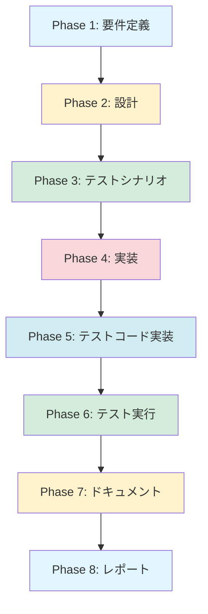

# プロジェクト計画書 - Issue #104

## 1. Issue分析

### 複雑度
**判定**: 中程度

### 見積もり工数
**合計**: 10~14時間

**根拠**:
- 既存の `createIssueFromEvaluation()` メソッドを拡張する必要があるが、全体的な構造変更は不要
- 新規のヘルパーメソッドを追加する必要がある（タイトル生成、キーワード抽出）
- `RemainingTask` 型の拡張が必要（6つの新規フィールド）
- Evaluation Phase 側での情報収集ロジックの追加が必要
- 既存テストの更新と新規テストケースの追加が必要
- 複数ファイルの修正が必要（3~5ファイル程度）

### リスク評価
**総合評価**: 中

**主なリスク要因**:
- **型拡張の影響範囲**: `RemainingTask` 型は複数箇所で使用されているため、後方互換性に注意が必要
- **AIエージェントの出力形式**: Evaluation Phase の出力から詳細情報を正確に抽出できるかが不確定
- **情報の粒度**: 既存の Evaluation レポートに含まれる情報が要件を満たすか不明（不足している場合は Phase 9 のプロンプト改善も必要）

---

## 2. 実装戦略判断

### 実装戦略: EXTEND

**判断根拠**:
- 既存の `IssueClient.createIssueFromEvaluation()` メソッドを拡張する
- 新規ファイル作成は不要（既存モジュールへの機能追加が中心）
- アーキテクチャレベルの変更は不要
- 既存の GitHub API 統合パターンをそのまま活用できる

### テスト戦略: UNIT_INTEGRATION

**判断根拠**:
- **ユニットテスト**:
  - 新規ヘルパーメソッド（`generateFollowUpTitle`, `extractKeywords` 等）の独立テスト
  - タイトル生成ロジック、キーワード抽出ロジックの境界値テスト
  - 型安全性の検証（オプショナルフィールドの扱い）
- **インテグレーションテスト**:
  - Evaluation Phase から Issue Client への情報伝達フローの検証
  - GitHub API モック（Octokit）との統合テスト
  - 既存のフォローアップ Issue 作成フローが壊れていないことの検証

**BDD が不要な理由**:
- エンドユーザー向けの UI 変更ではなく、内部処理の改善
- ユーザーストーリーよりも技術的な正確性が重要

### テストコード戦略: BOTH_TEST

**判断根拠**:
- **既存テスト拡張** (`tests/unit/github/issue-client.test.ts`):
  - `createIssueFromEvaluation()` の既存テストケースを拡張
  - 新規パラメータ追加による後方互換性の検証
  - タイトル生成の基本ケースを追加
- **新規テスト作成**:
  - タイトル生成とキーワード抽出の専用テストスイート
  - 拡張された `RemainingTask` 型のフィールド処理テスト
  - エッジケース（空配列、長大なタイトル、特殊文字等）のテスト

---

## 3. 影響範囲分析

### 既存コードへの影響

#### 変更が必要なファイル

1. **`src/types.ts`** (型定義の拡張)
   - `RemainingTask` interface への6つの新規フィールド追加
   - すべて **オプショナルフィールド** として定義（後方互換性維持）

2. **`src/core/github/issue-client.ts`** (コア実装)
   - `createIssueFromEvaluation()` メソッドのシグネチャ拡張（新規パラメータ追加、オプショナル）
   - 新規 private メソッド追加:
     - `generateFollowUpTitle()`: タイトル生成
     - `extractKeywords()`: キーワード抽出
     - `formatTaskDetails()`: タスク詳細セクション生成

3. **`src/phases/evaluation.ts`** (呼び出し側)
   - `handlePassWithIssues()` メソッドを修正
   - Evaluation レポートから追加情報を抽出
   - `IssueContext` 情報を構築して `createIssueFromEvaluation()` に渡す

4. **`tests/unit/github/issue-client.test.ts`** (既存テスト)
   - 既存テストケースの拡張
   - 後方互換性テストの追加

5. **新規テストファイル** (推奨):
   - `tests/unit/github/issue-title-generator.test.ts` - タイトル生成専用テスト（オプション）

### 依存関係の変更

**新規依存の追加**: なし

**既存依存の変更**: なし

**型定義の拡張**:
- `RemainingTask` 型の拡張（後方互換性を維持するためすべてオプショナル）

### マイグレーション要否

**不要**

**理由**:
- すべての新規フィールドはオプショナル（`?:`）として定義
- 既存のコードは新規フィールドを無視するだけで動作する
- Evaluation Phase 以外の箇所で `RemainingTask` を使用していない（影響範囲が限定的）

---

## 4. タスク分割

### Phase 1: 要件定義 (見積もり: 1~2h)

- [x] Task 1-1: Issue 要件の詳細分析 (0.5~1h)
  - GitHub Issue #104 の要望を構造化
  - 改善前後の比較表を作成
  - Acceptance Criteria の明確化

- [x] Task 1-2: 既存実装の調査とギャップ分析 (0.5~1h)
  - 現在の `createIssueFromEvaluation()` の挙動を確認
  - Evaluation レポートのフォーマット調査（既存 Issue の実例を確認）
  - 不足している情報を洗い出し

### Phase 2: 設計 (見積もり: 2~3h)

- [x] Task 2-1: `RemainingTask` 型の拡張設計 (0.5~1h)
  - 6つの新規フィールドの型定義
  - オプショナルフィールドとして定義（後方互換性）
  - JSDoc コメントの追加

- [x] Task 2-2: タイトル生成アルゴリズムの設計 (1~1.5h)
  - キーワード抽出ロジックの設計（正規表現、ストップワード除去等）
  - タイトルフォーマットの決定（80文字制限、切り詰めルール）
  - フォールバックロジックの設計

- [x] Task 2-3: Issue 本文テンプレートの設計 (0.5~1h)
  - Markdown テンプレートの構造設計
  - 各セクション（背景、タスク詳細、参考）の配置
  - 条件分岐ロジック（フィールドが存在しない場合の表示）

### Phase 3: テストシナリオ (見積もり: 1.5~2h)

- [ ] Task 3-1: ユニットテストシナリオ策定 (0.5~1h)
  - タイトル生成の境界値テスト
  - キーワード抽出のテストケース（空配列、特殊文字、長文等）
  - 型安全性テスト（オプショナルフィールドの扱い）

- [ ] Task 3-2: インテグレーションテストシナリオ策定 (0.5~0.5h)
  - Evaluation Phase との統合テスト
  - GitHub API モック（Octokit）との統合テスト

- [ ] Task 3-3: 後方互換性テストシナリオ策定 (0.5~0.5h)
  - 新規パラメータ未指定時の動作確認
  - 既存のフォローアップ Issue 作成フローの検証

### Phase 4: 実装 (見積もり: 3~4h)

- [ ] Task 4-1: `RemainingTask` 型の拡張 (0.5h)
  - `src/types.ts` にフィールド追加
  - JSDoc コメント追加

- [ ] Task 4-2: タイトル生成ロジックの実装 (1~1.5h)
  - `generateFollowUpTitle()` メソッド実装
  - `extractKeywords()` メソッド実装
  - 80文字制限とフォールバック処理

- [ ] Task 4-3: Issue 本文生成ロジックの拡張 (1~1.5h)
  - `createIssueFromEvaluation()` メソッドの拡張
  - 新規パラメータ（`IssueContext`）の追加
  - 各セクション生成ロジックの実装
  - 条件分岐（フィールド存在チェック）

- [ ] Task 4-4: Evaluation Phase 側の修正 (0.5~1h)
  - `handlePassWithIssues()` メソッドを修正
  - Evaluation レポートから情報抽出
  - `IssueContext` オブジェクトの構築

### Phase 5: テストコード実装 (見積もり: 2~2.5h)

- [ ] Task 5-1: タイトル生成のユニットテスト (1~1.5h)
  - `generateFollowUpTitle()` のテストケース
  - `extractKeywords()` のテストケース
  - 境界値テスト（空配列、長文、特殊文字）

- [ ] Task 5-2: Issue 本文生成のテスト (0.5~0.5h)
  - 拡張された `createIssueFromEvaluation()` のテスト
  - 新規セクションの表示確認
  - オプショナルフィールドの扱い

- [ ] Task 5-3: 後方互換性テスト (0.5~0.5h)
  - 新規パラメータ未指定時のテスト
  - 既存の呼び出し元（Evaluation Phase 以外）が壊れていないことを確認

### Phase 6: テスト実行 (見積もり: 0.5~1h)

- [ ] Task 6-1: ユニットテスト実行 (0.25~0.5h)
  - `npm run test:unit` でテストを実行
  - カバレッジ確認（90%以上を目標）

- [ ] Task 6-2: インテグレーションテスト実行 (0.25~0.5h)
  - `npm run test:integration` でテストを実行
  - 既存フローの破壊がないことを確認

### Phase 7: ドキュメント (見積もり: 0.5~1h)

- [ ] Task 7-1: ARCHITECTURE.md の更新 (0.25~0.5h)
  - IssueClient の機能拡張を記載
  - `RemainingTask` 型の拡張を記載

- [ ] Task 7-2: CLAUDE.md の更新 (0.25~0.5h)
  - Evaluation Phase のフォローアップ Issue 生成改善を記載
  - タイトル生成ロジックの説明を追加

### Phase 8: レポート (見積もり: 0.5h)

- [ ] Task 8-1: 実装サマリーの作成 (0.25h)
  - 変更内容の概要
  - Before/After の比較

- [ ] Task 8-2: PR 本文の生成 (0.25h)
  - 変更点の説明
  - テスト結果の添付

---

## 5. 依存関係



**主要な依存関係**:
- Phase 2（設計） → Phase 3（テストシナリオ）: 設計が完了しないとテストケースを定義できない
- Phase 4（実装） → Phase 5（テストコード実装）: 実装完了後にテストコードを書く
- Phase 5（テストコード実装） → Phase 6（テスト実行）: テストコード完成後に実行

**並列化可能な箇所**:
- なし（各フェーズは順次実行が必要）

---

## 6. リスクと軽減策

### リスク1: `RemainingTask` 型の拡張による後方互換性の破壊

- **影響度**: 中
- **確率**: 低
- **軽減策**:
  - すべての新規フィールドをオプショナル（`?:`）として定義
  - 既存の呼び出し元でテストを実施し、破壊的変更がないことを確認
  - Evaluation Phase 以外で `RemainingTask` を使用している箇所がないことを確認（Grep で検索）

### リスク2: Evaluation レポートから詳細情報を抽出できない

- **影響度**: 高
- **確率**: 中
- **軽減策**:
  - Phase 1（要件定義）で既存の Evaluation レポートを複数件調査
  - 情報が不足している場合は Phase 9（Evaluation）のプロンプト改善を別 Issue として提案
  - 暫定的にはフォールバック処理（情報がない場合は従来形式で生成）を実装

### リスク3: タイトル生成のキーワード抽出が不正確

- **影響度**: 中
- **確率**: 中
- **軽減策**:
  - シンプルなアルゴリズム（括弧前まで抽出、20文字制限）を採用
  - 複雑な自然言語処理は避ける（過度な抽象化のリスク）
  - フォールバックとして従来形式（`[FOLLOW-UP] Issue #XX - 残タスク`）を維持

### リスク4: GitHub Issue #104 の要件が不明確

- **影響度**: 中
- **確率**: 低
- **軽減策**:
  - Phase 1（要件定義）で不明点を洗い出し
  - 必要に応じて Issue コメントで質問（人間のレビュアーに確認）
  - Acceptance Criteria を明確化し、設計時に参照

### リスク5: テストコードの工数見積もり不足

- **影響度**: 低
- **確率**: 中
- **軽減策**:
  - 既存のテストコード（`issue-client.test.ts`）のパターンを踏襲
  - テストケースを Phase 3（テストシナリオ）で明確化
  - カバレッジ 90% 以上を目標とするが、100% は目指さない（コストパフォーマンス考慮）

---

## 7. 品質ゲート

### Phase 1: 要件定義

- [ ] 機能要件が明確に記載されている（タイトル生成、本文拡張、型定義）
- [ ] 受け入れ基準が定義されている（Issue #104 の Acceptance Criteria を満たす）
- [ ] 既存実装の調査が完了している（Evaluation レポートのフォーマット確認）
- [ ] 不足している情報が洗い出されている（Phase 9 改善の要否判断）

### Phase 2: 設計

- [x] **実装戦略の判断根拠が明記されている**（EXTEND）
- [x] **テスト戦略の判断根拠が明記されている**（UNIT_INTEGRATION）
- [x] **テストコード戦略の判断根拠が明記されている**（BOTH_TEST）
- [x] `RemainingTask` 型の拡張設計が完了している（6フィールドすべてオプショナル）
- [x] タイトル生成アルゴリズムが明確化されている（フローチャートまたは疑似コード）
- [x] Issue 本文テンプレートが設計されている（Markdown サンプル）

### Phase 3: テストシナリオ

- [ ] ユニットテストシナリオが定義されている（タイトル生成、キーワード抽出）
- [ ] インテグレーションテストシナリオが定義されている（Evaluation Phase 統合）
- [ ] 後方互換性テストシナリオが定義されている（既存フロー破壊なし）
- [ ] エッジケースが網羅されている（空配列、長文、特殊文字）

### Phase 4: 実装

- [ ] `RemainingTask` 型が拡張されている（6フィールド、オプショナル、JSDoc付き）
- [ ] タイトル生成ロジックが実装されている（80文字制限、フォールバック）
- [ ] Issue 本文生成ロジックが実装されている（背景、タスク詳細、参考セクション）
- [ ] Evaluation Phase 側の修正が完了している（`IssueContext` 構築）
- [ ] 既存コードが壊れていない（型エラーなし）

### Phase 5: テストコード実装

- [ ] タイトル生成のユニットテストが実装されている（境界値含む）
- [ ] Issue 本文生成のテストが実装されている（オプショナルフィールド処理）
- [ ] 後方互換性テストが実装されている（新規パラメータ未指定時）
- [ ] テストコードがすべてパスする（`npm test`）

### Phase 6: テスト実行

- [ ] すべてのユニットテストがパスする（`npm run test:unit`）
- [ ] すべてのインテグレーションテストがパスする（`npm run test:integration`）
- [ ] カバレッジが 90% 以上（`npm run test:coverage`）
- [ ] 既存のテストが破壊されていない（リグレッションなし）

### Phase 7: ドキュメント

- [ ] ARCHITECTURE.md が更新されている（IssueClient、RemainingTask 型の説明）
- [ ] CLAUDE.md が更新されている（Evaluation Phase の改善内容）
- [ ] JSDoc コメントが適切に記載されている（新規メソッド、型フィールド）

### Phase 8: レポート

- [ ] 実装サマリーが作成されている（変更内容の概要）
- [ ] Before/After の比較が記載されている（具体例）
- [ ] テスト結果が添付されている（カバレッジレポート）
- [ ] PR 本文が生成されている（レビュアーが理解できる内容）

---

## 8. 実装の詳細方針

### 8.1 タイトル生成ロジック

**アルゴリズム**:
1. `RemainingTask[]` から最大3つのタスクを取得
2. 各タスクのテキストから主要なキーワードを抽出（括弧前まで、最大20文字）
3. キーワードを `・` で結合
4. フォーマット: `[FOLLOW-UP] #{元Issue番号}: {キーワード1}・{キーワード2}・{キーワード3}`
5. 80文字を超える場合は77文字で切り詰め + `...`
6. キーワードが抽出できない場合はフォールバック: `[FOLLOW-UP] Issue #{元Issue番号} - 残タスク`

**例**:
```typescript
// 入力
const tasks = [
  { task: "Coverage improvement to 90% for key modules", ... },
  { task: "Performance benchmark execution and verification", ... },
  { task: "Documentation updates", ... }
];

// 出力
"[FOLLOW-UP] #91: Coverage improvement・Performance benchmark・Documentation updates"
```

### 8.2 `RemainingTask` 型の拡張

```typescript
export interface RemainingTask {
  task: string;                      // 既存（必須）
  phase: string;                     // 既存（必須）
  priority: string;                  // 既存（必須）

  // 新規フィールド（すべてオプショナル）
  priorityReason?: string;           // 優先度の理由
  targetFiles?: string[];            // 対象ファイルリスト
  steps?: string[];                  // 実行手順（番号付きリスト）
  acceptanceCriteria?: string[];     // 受け入れ基準（チェックリスト）
  dependencies?: string[];           // 依存タスク
  estimatedHours?: string;           // 見積もり工数（例: "2-4h"）
}
```

### 8.3 Issue 本文テンプレート

```markdown
## 背景

{issueContext.summary}

### 元 Issue のステータス

{issueContext.blockerStatus}

### なぜこれらのタスクが残ったか

{issueContext.deferredReason}

## 残タスク詳細

### Task 1: {task.task}

**対象ファイル**: （task.targetFiles が存在する場合のみ）
- `{file1}`
- `{file2}`

**必要な作業**: （task.steps が存在する場合のみ）
1. {step1}
2. {step2}

**Acceptance Criteria**: （task.acceptanceCriteria が存在する場合のみ）
- [ ] {criteria1}
- [ ] {criteria2}

**Phase**: {task.phase}

**優先度**: {task.priority}{task.priorityReason ? ` - ${task.priorityReason}` : ''}

**見積もり**: {task.estimatedHours ?? '未定'}

---

## 参考

- 元Issue: #{issueNumber}
- Evaluation Report: `{evaluationReportPath}`

---
*自動生成: AI Workflow Phase 9 (Evaluation)*
```

### 8.4 Evaluation Phase 側の実装方針

`handlePassWithIssues()` メソッドを修正し、以下の情報を Evaluation レポートから抽出:

1. **Issue Summary**: 元 Issue の概要（`issueTitle` から取得）
2. **Blocker Status**: "すべてのブロッカーは解決済み" 等
3. **Deferred Reason**: "タスク優先度の判断により後回し" 等

**注意**: 既存の Evaluation レポートにこれらの情報が含まれていない可能性があるため、Phase 1 で調査が必要。不足している場合は暫定的にデフォルト値を使用し、Phase 9 改善を別 Issue として提案。

---

## 9. 次ステップ

1. **Phase 1（要件定義）を開始**:
   - 既存の Evaluation レポートを3~5件調査
   - タイトル生成の要件を明確化
   - 不明点があれば Issue コメントで質問

2. **Phase 2（設計）に進む前に**:
   - Phase 1 の品質ゲートを確認
   - 設計判断（EXTEND、UNIT_INTEGRATION、BOTH_TEST）の妥当性を再確認

3. **実装時の注意点**:
   - すべての新規フィールドをオプショナルにする（後方互換性）
   - 既存のテストが壊れていないことを各ステップで確認
   - エッジケース（空配列、特殊文字）を忘れずにテスト

---

## 10. 参考情報

### 関連ファイル

- `src/core/github/issue-client.ts` (178-232行): 修正対象
- `src/types.ts` (32-36行): `RemainingTask` 型定義
- `src/phases/evaluation.ts` (420-449行): 呼び出し側
- `tests/unit/github/issue-client.test.ts` (301-397行): 既存テスト

### 既存のフォローアップ Issue 例

- Issue #94: `[FOLLOW-UP] Issue #91 - 残タスク`
- Issue #96: `[FOLLOW-UP] Issue #90 - 残タスク`
- Issue #98: `[FOLLOW-UP] Issue #74 - 残タスク`
- Issue #102: `[FOLLOW-UP] Issue #52 - 残タスク`

これらの Issue を Phase 1 で調査し、改善前後の比較を明確化する。

---

**計画作成日**: 2025-01-30
**想定完了日**: Phase 8 完了時（見積もり: 10~14時間）
**リスクレベル**: 中（主なリスク: Evaluation レポート情報不足、型拡張の影響範囲）
