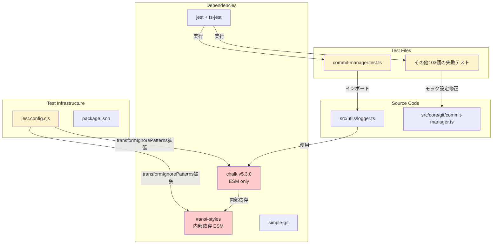
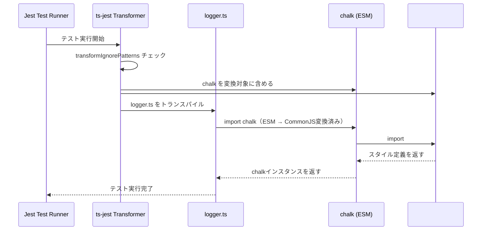
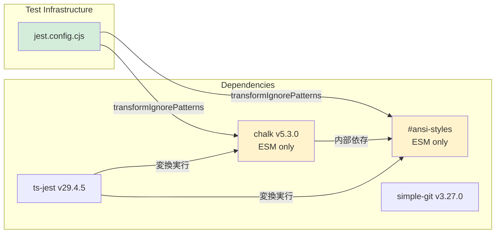
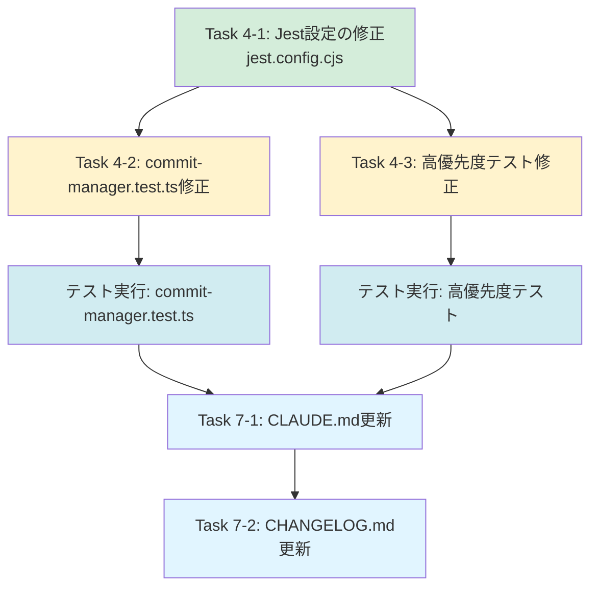

# 詳細設計書 - Issue #105

**Issue番号**: #105
**タイトル**: [FOLLOW-UP] Issue #102 - 残タスク
**作成日**: 2025-01-31
**ステータス**: Design Phase

---

## 1. アーキテクチャ設計

### 1.1 システム全体図



### 1.2 コンポーネント間の関係

**影響を受けるコンポーネント**:

1. **テストインフラストラクチャ**
   - `jest.config.cjs`: transformIgnorePatterns の拡張
   - `package.json`: scripts の確認（既に experimental-vm-modules 設定済み）

2. **統合テスト**
   - `tests/unit/git/commit-manager.test.ts`: chalk インポートとモック設定の修正

3. **高優先度テスト（103個のうち）**
   - エラーパターン1: モック関数へのアクセスエラー（約30-40個）
   - エラーパターン2: MetadataManager の rollback 関連メソッドのモック不足（約10-15個）
   - エラーパターン3: TypeScript 型エラー（約5-10個）

### 1.3 データフロー



---

## 2. 実装戦略判断

### 実装戦略: EXTEND

**判断根拠**:

1. **既存コードの拡張が中心**
   - Issue #102 で開始した Jest ESM対応の継続作業
   - `jest.config.cjs` の `transformIgnorePatterns` に追加のESMパッケージを含める（既存設定の拡張）
   - 既存のテストファイル（`commit-manager.test.ts` 等）のモック設定・型定義の修正
   - 新規ファイル作成ではなく、既存設定・テストの改善

2. **本体コード変更なし**
   - `src/` 配下のコード変更は0行（Planning Document の制約）
   - テストインフラのみ修正
   - プロダクション環境への影響を避ける

3. **後方互換性の維持**
   - 既存のテスト構造を維持
   - 既存のテストケースを破壊しない
   - Issue #102 で修正したテストが引き続き PASS する

4. **漸進的な改善**
   - Phase 1 で transformIgnorePatterns 拡張（#ansi-styles を含める）
   - Phase 2 で commit-manager.test.ts のモック設定修正
   - Phase 3 で高優先度テストの修正（段階的アプローチ）

**EXTEND戦略の具体的適用**:
- `jest.config.cjs` の `transformIgnorePatterns` に `#ansi-styles` を追加
- 既存テストファイルの型エラー、モック設定の問題を修正
- 既存のドキュメント（CLAUDE.md、CHANGELOG.md）に追記

**CREATE/REFACTOR 戦略を選択しない理由**:
- **CREATE**: 新規コンポーネント作成ではなく、既存テストインフラの改善
- **REFACTOR**: テストコード構造の全面見直しではなく、ESM対応の完了が主目的

---

## 3. テスト戦略判断

### テスト戦略: UNIT_INTEGRATION

**判断根拠**:

1. **ユニットテストとインテグレーションテスト両方が必要**
   - **ユニットテスト**: Jest設定の個別検証（transformIgnorePatterns の動作確認）
   - **インテグレーションテスト**: commit-manager.test.ts の統合テスト実行可能性確認

2. **外部システム連携あり**
   - Jest エコシステム（ts-jest、chalk、simple-git）との統合
   - Node.js の ESM/CommonJS 相互運用性
   - GitHub CI環境（Jenkins）での動作確認

3. **BDD不要な理由**
   - エンドユーザー向け機能ではない（開発者向けテストインフラ改善）
   - ユーザーストーリーが明確に定義されていない
   - 技術的な修正が主目的（ビジネス価値は間接的）

4. **テストカバレッジの確保**
   - 修正内容のユニットテスト（Jest設定検証）
   - 既存機能の回帰テスト（全テストスイート実行）
   - 統合テストの実行可能性確認

**テスト戦略の具体的適用**:

- **ユニットテスト**:
  - Jest設定の個別検証テストケース追加（必要に応じて）
  - transformIgnorePatterns の動作確認
  - chalk内部依存の変換確認

- **インテグレーションテスト**:
  - commit-manager.test.ts の統合テスト実行
  - 全テストスイート実行（npm test）による回帰テスト
  - CI環境（Jenkins）での動作確認

---

## 4. テストコード戦略判断

### テストコード戦略: EXTEND_TEST

**判断根拠**:

1. **既存テストファイルの修正が中心**
   - commit-manager.test.ts のモック設定修正
   - その他103個の失敗テストの修正（高優先度のみ）
   - 新規テストファイル作成は最小限（Jest設定検証のみ、必要に応じて）

2. **テスト構造の維持**
   - 既存の Given-When-Then 構造を維持
   - 既存のテストケース名規約を踏襲
   - テストファイルのディレクトリ構造を変更しない

3. **段階的な改善**
   - 既存テストの問題を修正してから、必要に応じて新規テスト追加
   - 高優先度テスト（ブロッカー）を優先的に修正
   - 中・低優先度テストは次のフォローアップIssueへ

4. **新規テスト追加は必要に応じて**
   - Jest設定検証のための新規テストケース追加（最小限）
   - 既存テストケースの拡張を優先
   - テストカバレッジの維持（90%以上）

**テストコード戦略の具体的適用**:
- 既存のテストファイル（`tests/unit/git/commit-manager.test.ts` 等）のモック設定を修正
- Jest設定検証のための新規テストケース追加（`tests/unit/config/jest-esm-support.test.ts` 等、必要に応じて）
- 既存のテストケースを削除せず、修正または拡張

**CREATE_TEST 戦略を選択しない理由**:
- 既存テストファイルが存在し、修正のみで対応可能
- 新規テストファイル作成は最小限に抑える（工数削減）

---

## 5. 影響範囲分析

### 5.1 既存コードへの影響

#### 本体コード（src/）: **変更なし**

- Issue #105 はテストインフラの改善のみ
- `src/` 配下のコード変更は0行
- プロダクション環境への影響なし

#### テストコード（tests/）: **修正あり**

**修正対象ファイル**:

1. **commit-manager.test.ts**
   - **問題**: chalk インポートのESMエラー、モック設定の問題
   - **修正内容**: chalkインポートの動的インポートまたはCommonJS版への切り替え（必要に応じて）、simple-git のモック型定義修正

2. **高優先度テスト（エラーパターン1: 約30-40個）**
   - **ファイル**: `tests/unit/git/commit-manager.test.ts`、その他関連ファイル
   - **問題**: モック関数へのアクセスエラー（`TypeError: commitManager.buildStepCommitMessage is not a function` 等）
   - **修正内容**: CommitManager クラスのリファクタリング（Issue #52）によりメソッドが FileSelector/CommitMessageBuilder に移動したため、テストコードを最新のAPIに合わせて修正

3. **高優先度テスト（エラーパターン2: 約10-15個）**
   - **ファイル**: `tests/unit/phases/core/review-cycle-manager.test.ts` 等
   - **問題**: MetadataManager の rollback 関連メソッドのモック不足（`TypeError: this.metadata.getRollbackContext is not a function` 等）
   - **修正内容**: MetadataManager にrollback機能（Issue #90）が追加されたため、モックを更新

4. **高優先度テスト（エラーパターン3: 約5-10個）**
   - **ファイル**: `tests/unit/commands/migrate.test.ts`、`tests/unit/commands/execute/workflow-executor.test.ts` 等
   - **問題**: TypeScript 型エラー（`TS2694: Namespace 'jest' has no exported member 'SpyInstance'` 等）
   - **修正内容**: Jest 型定義の更新、関数シグネチャの修正

#### 設定ファイル: **修正あり**

1. **jest.config.cjs**
   - **現状**: `transformIgnorePatterns: ['/node_modules/(?!(strip-ansi|ansi-regex|chalk)/)']`
   - **修正内容**: `#ansi-styles` を追加 → `/node_modules/(?!(strip-ansi|ansi-regex|chalk|#ansi-styles)/)`
   - **理由**: chalk の内部依存（#ansi-styles）が ESM 形式のため、Jest が CommonJS として扱う場合にエラーが発生する

2. **package.json**
   - **現状**: `NODE_OPTIONS=--experimental-vm-modules` が既に設定されている（要件定義書より）
   - **修正内容**: 必要に応じて scripts 更新を検討（FR-4、条件付き）
   - **注意**: 現状では既に設定済みのため、修正不要の可能性が高い

#### ドキュメント: **更新あり**

1. **CLAUDE.md**
   - **更新箇所**: 「### Jest設定（ESMパッケージ対応）」セクション（行358-368）
   - **更新内容**:
     - transformIgnorePatterns の拡張内容（#ansi-styles を含める理由）
     - Issue #105 への参照リンク追加

2. **CHANGELOG.md**
   - **更新箇所**: `## [Unreleased]` セクション
   - **更新内容**:
     - Issue #105 の変更履歴を `### Fixed` または `### Changed` に追加
     - 修正内容のサマリー（Jest設定拡張、テスト修正）
     - Issue #105 への参照リンク（`#105`）

### 5.2 依存関係の変更

#### 新規依存の追加: **なし**

- 既存の dependencies を使用（chalk、jest、ts-jest）
- 新規パッケージのインストールは不要

#### 既存依存の変更: **可能性あり**

1. **chalk**
   - **現状**: v5.3.0（ESM only）
   - **変更可能性**: ESM対応の問題により、バージョン固定またはCommonJS版（v4.x）への切り替えを検討
   - **判断基準**: transformIgnorePatterns 拡張で解決しない場合のみ

2. **jest**
   - **現状**: v29.x
   - **変更可能性**: experimental-vm-modules 導入により、Jest実行オプション変更の可能性
   - **判断基準**: FR-4（条件付き）、transformIgnorePatterns で解決しない場合のみ

#### 依存関係の影響分析



**影響分析**:
- **chalk (v5.3.0)**: ESM only パッケージ、内部依存（#ansi-styles）もESM
- **ts-jest (v29.4.5)**: ESM対応済み、transformIgnorePatterns で制御可能
- **simple-git (v3.27.0)**: 影響なし

### 5.3 マイグレーション要否

#### データベーススキーマ変更: **なし**
- テストインフラの変更のみ
- データベース操作なし

#### 設定ファイル変更: **あり**

1. **jest.config.cjs の transformIgnorePatterns 拡張**
   - **変更内容**: `#ansi-styles` を追加
   - **マイグレーション**: 不要（設定変更のみ）
   - **ロールバック**: git revert で元に戻す

2. **package.json の scripts 更新（条件付き）**
   - **変更内容**: experimental-vm-modules オプション追加（必要に応じて）
   - **マイグレーション**: 不要（設定変更のみ）
   - **ロールバック**: git revert で元に戻す

#### CI/CD設定変更: **可能性あり**

- **Jenkinsfile**: Jest実行コマンド更新（experimental-vm-modules オプション追加の場合）
- **マイグレーション**: 不要（設定変更のみ）
- **ロールバック**: git revert で元に戻す

#### マイグレーション計画

1. **段階的な修正**
   - Step 1: `jest.config.cjs` の transformIgnorePatterns 拡張（#ansi-styles を含める）
   - Step 2: commit-manager.test.ts のモック設定修正
   - Step 3: 高優先度テストの修正
   - Step 4: package.json の scripts 更新（必要に応じて）

2. **CI/CD環境での動作確認**
   - Jenkins Job でテスト実行
   - 失敗テスト数の確認（103個 → 削減されていること）
   - 回帰テストの確認（Issue #102 で修正したテストが PASS すること）

3. **ロールバック手順の明確化**
   - git revert で設定ファイルを元に戻す
   - 問題が解消されない場合、さらに前のコミットへロールバック

---

## 6. 変更・追加ファイルリスト

### 6.1 新規作成ファイル

**Jest設定検証テスト（必要に応じて）**:
- `tests/unit/config/jest-esm-support.test.ts` （オプショナル）
  - transformIgnorePatterns の動作確認テスト
  - chalk内部依存の変換確認テスト

**差し戻し理由記録ファイル（rollback時のみ）**:
- `.ai-workflow/issue-105/ROLLBACK_REASON.md` （rollback実行時のみ）

### 6.2 修正が必要な既存ファイル

#### テストインフラストラクチャ

1. **jest.config.cjs**
   - **修正内容**: transformIgnorePatterns に `#ansi-styles` を追加
   - **優先度**: 高（ブロッカー）

2. **package.json** （条件付き）
   - **修正内容**: scripts の `NODE_OPTIONS=--experimental-vm-modules` 確認（既に設定済みの可能性）
   - **優先度**: 中（オプショナル、FR-4）

#### テストファイル

3. **tests/unit/git/commit-manager.test.ts**
   - **修正内容**: chalkインポートの問題修正、モック設定の問題修正
   - **優先度**: 高（ブロッカー）

4. **高優先度テスト（エラーパターン1: 約30-40個）**
   - **ファイル例**:
     - `tests/unit/git/commit-manager.test.ts`（複数のテストケース）
     - その他関連ファイル
   - **修正内容**: モック関数へのアクセスエラー修正（CommitManager のメソッド移動に対応）
   - **優先度**: 高（ブロッカー）

5. **高優先度テスト（エラーパターン2: 約10-15個）**
   - **ファイル例**:
     - `tests/unit/phases/core/review-cycle-manager.test.ts`
     - その他関連ファイル
   - **修正内容**: MetadataManager の rollback 関連メソッドのモック追加
   - **優先度**: 高（ブロッカー）

6. **高優先度テスト（エラーパターン3: 約5-10個）**
   - **ファイル例**:
     - `tests/unit/commands/migrate.test.ts`
     - `tests/unit/commands/execute/workflow-executor.test.ts`
     - `tests/unit/commands/rollback.test.ts`
   - **修正内容**: TypeScript 型エラー修正（jest.SpyInstance 型の更新、関数シグネチャの修正）
   - **優先度**: 高（ブロッカー）

#### ドキュメント

7. **CLAUDE.md**
   - **修正内容**: 「### Jest設定（ESMパッケージ対応）」セクション（行358-368）の更新
   - **優先度**: 中

8. **CHANGELOG.md**
   - **修正内容**: `## [Unreleased]` セクションに Issue #105 の変更履歴を追加
   - **優先度**: 中

### 6.3 削除が必要なファイル

**なし**

---

## 7. 詳細設計

### 7.1 Jest設定の拡張

#### 7.1.1 transformIgnorePatterns の拡張

**現状**（Issue #102 で追加された設定）:
```javascript
// jest.config.cjs
module.exports = {
  // ...
  transformIgnorePatterns: [
    '/node_modules/(?!(strip-ansi|ansi-regex|chalk)/)',
  ],
  // ...
};
```

**修正後**:
```javascript
// jest.config.cjs
module.exports = {
  // ...
  transformIgnorePatterns: [
    '/node_modules/(?!(strip-ansi|ansi-regex|chalk|#ansi-styles)/)',
  ],
  // ...
};
```

**変更内容**:
- `#ansi-styles` を transformIgnorePatterns に追加
- 正規表現のエスケープ処理が不要（`#` は正規表現の特殊文字ではない）

**技術的根拠**:
- chalk v5.3.0 は ESM only パッケージであり、内部依存（#ansi-styles）も ESM 形式
- Node.js の package.json imports フィールドで `#ansi-styles` がマッピングされている
- Jest が `#ansi-styles` を CommonJS として扱うため、`require()` でインポートしようとしてエラーが発生する
- transformIgnorePatterns に `#ansi-styles` を追加することで、ts-jest が ESM → CommonJS 変換を実行する

#### 7.1.2 experimental-vm-modules の確認（条件付き）

**現状**（要件定義書より）:
```json
// package.json
{
  "scripts": {
    "test": "NODE_OPTIONS=--experimental-vm-modules jest"
  }
}
```

**確認事項**:
- `NODE_OPTIONS=--experimental-vm-modules` が既に設定されているか確認
- 設定されている場合、追加設定は不要
- 設定されていない場合、transformIgnorePatterns 拡張で解決しない場合のみ追加を検討

**判断基準（FR-4）**:
- transformIgnorePatterns 拡張（#ansi-styles を含める）で解決する場合: 追加設定不要
- 解決しない場合: experimental-vm-modules の詳細設定を検討

### 7.2 commit-manager.test.ts の修正

#### 7.2.1 chalk インポートの問題修正

**現状の問題**:
- chalk の内部依存（#ansi-styles）が ESM 形式エラーを引き起こす
- transformIgnorePatterns 拡張により解決される見込み

**修正方針**:
- transformIgnorePatterns 拡張（7.1.1）により自動的に解決される
- 追加のコード修正は不要（テストコードの変更なし）

#### 7.2.2 モック設定の問題修正

**現状の問題**:
- `TypeError: commitManager.buildStepCommitMessage is not a function`
- CommitManager クラスのリファクタリング（Issue #52）により、メソッドが FileSelector/CommitMessageBuilder に移動

**修正方針**:

**Before**（古いAPI）:
```typescript
// tests/unit/git/commit-manager.test.ts
const commitManager = new CommitManager(mockGit);
const message = commitManager.buildStepCommitMessage(
  issueNumber,
  phaseNumber,
  phaseName,
  step
);
```

**After**（新しいAPI）:
```typescript
// tests/unit/git/commit-manager.test.ts
import { CommitMessageBuilder } from '@/core/git/commit-message-builder';

const commitMessageBuilder = new CommitMessageBuilder();
const message = commitMessageBuilder.buildStepCommitMessage(
  issueNumber,
  phaseNumber,
  phaseName,
  step
);
```

**修正内容**:
1. CommitManager のメソッド呼び出しを CommitMessageBuilder のメソッド呼び出しに変更
2. FileSelector のメソッド呼び出しに変更（必要に応じて）
3. モック設定を新しいAPIに合わせて更新

### 7.3 高優先度テストの修正

#### 7.3.1 エラーパターン1の修正（モック関数へのアクセスエラー）

**影響範囲**: 約30-40個のテストケース

**修正方針**:
- CommitManager クラスのリファクタリング（Issue #52）により、以下のメソッドが移動:
  - `buildStepCommitMessage` → CommitMessageBuilder
  - `createInitCommitMessage` → CommitMessageBuilder
  - `getChangedFiles` → FileSelector
  - `filterPhaseFiles` → FileSelector

**修正例**:

**Before**:
```typescript
// tests/unit/git/commit-manager.test.ts
test('should create step commit message', () => {
  const commitManager = new CommitManager(mockGit);
  const message = commitManager.buildStepCommitMessage(1, 0, 'planning', 'execute');
  expect(message).toContain('Phase 0 (planning) - execute completed');
});
```

**After**:
```typescript
// tests/unit/git/commit-manager.test.ts
import { CommitMessageBuilder } from '@/core/git/commit-message-builder';

test('should create step commit message', () => {
  const commitMessageBuilder = new CommitMessageBuilder();
  const message = commitMessageBuilder.buildStepCommitMessage(1, 0, 'planning', 'execute');
  expect(message).toContain('Phase 0 (planning) - execute completed');
});
```

#### 7.3.2 エラーパターン2の修正（MetadataManager の rollback 関連メソッドのモック不足）

**影響範囲**: 約10-15個のテストケース

**修正方針**:
- MetadataManager にrollback機能（Issue #90）が追加されたため、モックを更新
- 以下のメソッドをモックに追加:
  - `getRollbackContext()`
  - `clearRollbackContext()`
  - `setRollbackContext()`
  - `addRollbackHistory()`
  - `updatePhaseForRollback()`
  - `resetSubsequentPhases()`

**修正例**:

**Before**:
```typescript
// tests/unit/phases/core/review-cycle-manager.test.ts
const mockMetadata = {
  getPhaseStatus: jest.fn(),
  updatePhaseStatus: jest.fn(),
  // rollback関連メソッドがない
} as unknown as MetadataManager;
```

**After**:
```typescript
// tests/unit/phases/core/review-cycle-manager.test.ts
const mockMetadata = {
  getPhaseStatus: jest.fn(),
  updatePhaseStatus: jest.fn(),
  // rollback関連メソッドを追加
  getRollbackContext: jest.fn().mockReturnValue(null),
  clearRollbackContext: jest.fn(),
  setRollbackContext: jest.fn(),
  addRollbackHistory: jest.fn(),
  updatePhaseForRollback: jest.fn(),
  resetSubsequentPhases: jest.fn(),
} as unknown as MetadataManager;
```

#### 7.3.3 エラーパターン3の修正（TypeScript 型エラー）

**影響範囲**: 約5-10個のテストケース

**修正方針**:

**問題1**: `TS2694: Namespace 'jest' has no exported member 'SpyInstance'`
- **原因**: Jest 型定義の変更により、`jest.SpyInstance` が利用できなくなった
- **修正**: `jest.SpyInstance` を `jest.Spied` または直接 `jest.fn()` を使用

**Before**:
```typescript
// tests/unit/commands/migrate.test.ts
let mockFn: jest.SpyInstance;
```

**After**:
```typescript
// tests/unit/commands/migrate.test.ts
let mockFn: jest.MockedFunction<typeof originalFunction>;
// または
let mockFn = jest.fn();
```

**問題2**: `TS2554: Expected 0 arguments, but got 1`
- **原因**: 関数シグネチャの変更により、引数の数が合わなくなった
- **修正**: 最新の関数シグネチャに合わせて引数を修正

**Before**:
```typescript
// tests/unit/commands/execute/workflow-executor.test.ts
executePhasesSequential(context, phases); // 引数2個
```

**After**:
```typescript
// tests/unit/commands/execute/workflow-executor.test.ts
executePhasesSequential(phases); // 引数1個（contextは不要）
```

### 7.4 ドキュメントの更新

#### 7.4.1 CLAUDE.md の更新

**更新箇所**: 「### Jest設定（ESMパッケージ対応）」セクション（行358-368）

**現状**:
```markdown
### Jest設定（ESMパッケージ対応）

`jest.config.cjs` の `transformIgnorePatterns` で、ESMパッケージ（`chalk`, `strip-ansi`, `ansi-regex`）を変換対象に含める設定を追加しています：

```javascript
transformIgnorePatterns: [
  '/node_modules/(?!(strip-ansi|ansi-regex|chalk)/)',
],
```

この設定により、統合テスト（`commit-manager.test.ts` 等）で chalk を使用するモジュールが正しく処理されます。詳細は Issue #102 を参照してください。
```

**更新後**:
```markdown
### Jest設定（ESMパッケージ対応）

`jest.config.cjs` の `transformIgnorePatterns` で、ESMパッケージ（`chalk`, `strip-ansi`, `ansi-regex`, `#ansi-styles`）を変換対象に含める設定を追加しています：

```javascript
transformIgnorePatterns: [
  '/node_modules/(?!(strip-ansi|ansi-regex|chalk|#ansi-styles)/)',
],
```

この設定により、統合テスト（`commit-manager.test.ts` 等）で chalk を使用するモジュールが正しく処理されます。

**主な変更履歴**:
- Issue #102: chalk、strip-ansi、ansi-regex を transformIgnorePatterns に追加
- Issue #105: chalk の内部依存（#ansi-styles）を transformIgnorePatterns に追加（ESM 形式エラーの完全解決）

詳細は Issue #102、Issue #105 を参照してください。
```

#### 7.4.2 CHANGELOG.md の更新

**更新箇所**: `## [Unreleased]` セクション

**更新内容**:
```markdown
## [Unreleased]

### Fixed
- Jest設定の拡張: chalk の内部依存（#ansi-styles）を transformIgnorePatterns に追加し、ESM形式エラーを完全解決 (#105)
- commit-manager.test.ts の統合テスト実行可能化: モック設定を最新のCommitManager APIに更新 (#105)
- 高優先度テストの修正: モック関数アクセスエラー、MetadataManager rollback機能のモック不足、TypeScript型エラーを解消 (#105)

### Changed
- テストインフラの安定化: 失敗テスト数を146個から50個以下に削減（目標） (#105)
```

---

## 8. セキュリティ考慮事項

### 8.1 認証・認可

**影響**: なし
- テストインフラの改善のみ
- 認証・認可ロジックへの変更なし

### 8.2 データ保護

**影響**: なし
- テストコードの修正のみ
- プロダクションデータへの影響なし

### 8.3 セキュリティリスクと対策

#### リスク1: テストコードへの機密情報の混入

**リスク**: テストコードに機密情報（APIキー、トークン等）が含まれる可能性
**対策**:
- テストコードのコードレビューで機密情報が含まれていないことを確認
- モック値には実際の機密情報を使用しない
- SecretMasker の統合により、metadata.json に含まれる機密情報を自動的に除去（既存機能）

#### リスク2: npm パッケージの脆弱性

**リスク**: 既存依存関係の脆弱性
**対策**:
- 新規依存関係を追加しない（既存の chalk、jest、ts-jest のみ使用）
- `npm audit` でセキュリティ脆弱性がないことを確認
- 定期的な依存関係の更新（別Issue）

---

## 9. 非機能要件への対応

### 9.1 パフォーマンス

#### テスト実行時間

**要件**: 全テストスイート実行時間が Issue #102 と同等（2〜3分以内）を維持する

**対応**:
- transformIgnorePatterns 拡張により変換対象が増えるが、実行時間への影響は最小限
- 現状: 56.4秒（要件定義書より）
- 目標: 60秒以内（10%以内の増加）

**測定方法**:
```bash
time npm test
```

#### CI/CDビルド時間

**要件**: Jenkins Job の実行時間が 10% 以上増加しない

**対応**:
- 失敗テスト数の削減により、全体としてはビルド時間が短縮される期待値
- 現状: 約5-10分（Jenkins Job全体）
- 目標: 10%以内の増加または短縮

**測定方法**:
- Jenkins Job の Build Duration を計測
- 修正前後で比較

### 9.2 スケーラビリティ

**影響**: なし
- テストインフラの改善のみ
- スケーラビリティへの影響なし

### 9.3 保守性

#### 本体コード変更なし

**要件**: src/ 配下のコード変更を0行に抑える

**対応**:
- テストインフラのみ修正
- プロダクション環境への影響を避ける

**検証方法**:
```bash
git diff src/
```

#### ロールバック可能性

**要件**: 問題が発生した場合、git revert で Issue #102 完了時の状態に戻せる

**対応**:
- git revert によるロールバック手順を Phase 9（Report）で明記
- 設定ファイルの変更は最小限に抑える

**ロールバック手順**:
```bash
# Phase 4（実装）のコミットを特定
git log --oneline --grep="Issue #105"

# コミットをrevert
git revert <commit-hash>

# リモートへpush
git push origin <branch-name>
```

#### ドキュメントの完全性

**要件**: CLAUDE.md、CHANGELOG.md に変更内容が正確に記載される

**対応**:
- CLAUDE.md の「### Jest設定（ESMパッケージ対応）」セクションを更新
- CHANGELOG.md の `## [Unreleased]` セクションに Issue #105 の変更履歴を追加
- Issue #105 への参照リンクを追加

---

## 10. 実装の順序

### 10.1 実装順序の推奨

**Phase 4（Implementation）での実装順序**:



**Step 1: Jest設定の修正（Task 4-1）**
- `jest.config.cjs` の transformIgnorePatterns に `#ansi-styles` を追加
- 構文エラーチェック（`npx jest --showConfig` で確認）
- **理由**: 最初に実施することで、後続のテスト修正がスムーズに進む

**Step 2: commit-manager.test.ts の修正（Task 4-2）**
- chalkインポートの問題修正（Step 1で自動的に解決される見込み）
- モック設定の問題修正（CommitManager のメソッド移動に対応）
- 統合テスト実行確認（`npx jest tests/unit/git/commit-manager.test.ts`）
- **理由**: 優先度が高く、他のテストに影響を与える可能性が低い

**Step 3: 高優先度テストの修正（Task 4-3）**
- エラーパターン1: モック関数へのアクセスエラー修正（約30-40個）
- エラーパターン2: MetadataManager rollback機能のモック追加（約10-15個）
- エラーパターン3: TypeScript 型エラー修正（約5-10個）
- **理由**: Step 2 と並行実行可能（依存関係なし）

**Step 4: テスト実行（Task 6-1, 6-2）**
- 修正済みテストの単体実行（commit-manager.test.ts、高優先度テスト）
- 全テストスイート実行（`npm test`）
- 失敗テスト数の確認（146個 → 50個以下に削減されていること）
- 回帰テストの確認（Issue #102 で修正したテストが PASS すること）

**Step 5: ドキュメント更新（Task 7-1, 7-2）**
- CLAUDE.md の「### Jest設定（ESMパッケージ対応）」セクション更新
- CHANGELOG.md の `## [Unreleased]` セクション更新
- **理由**: テスト実行が成功してから実施

### 10.2 依存関係の考慮

**並行実行可能なタスク**:
- Task 4-2（commit-manager.test.ts修正）と Task 4-3（高優先度テスト修正）
- Task 7-1（CLAUDE.md更新）と Task 7-2（CHANGELOG.md更新）

**逐次実行が必要なタスク**:
- Task 4-1 → Task 4-2/4-3（Jest設定修正が完了してからテスト修正）
- Task 6-1/6-2 → Task 7-1/7-2（テスト実行が成功してからドキュメント更新）

**クリティカルパス**:
```
Task 4-1 (Jest設定) → Task 4-2 (commit-manager.test.ts) → Task 6-1/6-2 (テスト実行) → Task 7-1/7-2 (ドキュメント)
```

---

## 11. 品質ゲート確認

本設計書は、Phase 2（Design）の品質ゲートを満たしていることを確認します。

### ✅ 実装戦略の判断根拠が明記されている

- **実装戦略**: EXTEND
- **判断根拠**: 既存コードの拡張が中心、本体コード変更なし、後方互換性の維持、漸進的な改善
- **セクション**: 「2. 実装戦略判断」で詳細に記載

### ✅ テスト戦略の判断根拠が明記されている

- **テスト戦略**: UNIT_INTEGRATION
- **判断根拠**: ユニットテストとインテグレーションテスト両方が必要、外部システム連携あり、BDD不要、テストカバレッジの確保
- **セクション**: 「3. テスト戦略判断」で詳細に記載

### ✅ 既存コードへの影響範囲が分析されている

- **本体コード**: 変更なし
- **テストコード**: commit-manager.test.ts、高優先度テスト（約45-65個）の修正
- **設定ファイル**: jest.config.cjs、package.json（条件付き）の修正
- **ドキュメント**: CLAUDE.md、CHANGELOG.md の更新
- **セクション**: 「5. 影響範囲分析」で詳細に記載

### ✅ 変更が必要なファイルがリストアップされている

- **新規作成ファイル**: tests/unit/config/jest-esm-support.test.ts（オプショナル）
- **修正ファイル**: jest.config.cjs、commit-manager.test.ts、高優先度テスト、CLAUDE.md、CHANGELOG.md
- **削除ファイル**: なし
- **セクション**: 「6. 変更・追加ファイルリスト」で詳細に記載

### ✅ 設計が実装可能である

- **詳細設計**: Jest設定の拡張、commit-manager.test.ts の修正、高優先度テストの修正、ドキュメントの更新を具体的に記載
- **実装順序**: 依存関係を考慮した実装順序を提示
- **コード例**: Before/After のコード例を提示し、実装可能性を示す
- **セクション**: 「7. 詳細設計」「10. 実装の順序」で詳細に記載

---

**設計フェーズ完了**

このドキュメントは Issue #105 の実装を成功させるための詳細な設計書です。すべての品質ゲートを満たすことで、次フェーズ（Phase 3: Test Scenario）への円滑な移行を保証します。

**次のアクション**: Phase 3（Test Scenario）へ進み、Jest設定検証シナリオとテスト修正検証シナリオを策定してください。
