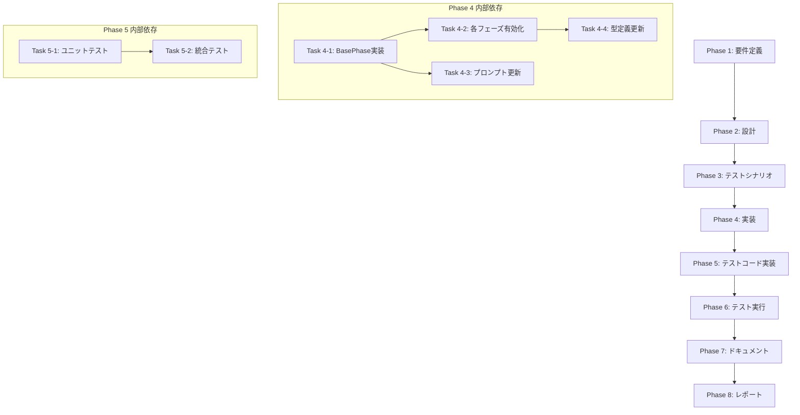

# プロジェクト計画書 - Issue #113

## Issue概要

**Issue番号**: #113
**タイトル**: 全フェーズに Evaluation Phase のフォールバック機構を導入する
**状態**: open
**URL**: https://github.com/tielec/ai-workflow-agent/issues/113

---

## 1. Issue分析

### 複雑度
**中程度**

### 見積もり工数
**12~16時間**

### 判定根拠

- **対象範囲**: 6フェーズ（Planning, Requirements, Design, TestScenario, Implementation, Report）のフォールバック機構追加
- **既存実装の活用**: Evaluation Phaseの実装パターンを流用可能
- **コア変更**: `BasePhase.executePhaseTemplate()` の拡張が必要（全フェーズに影響）
- **プロンプト更新**: 6フェーズ × 1ファイル（revise.txt）の更新
- **テスト追加**: ユニットテスト・統合テストの追加（6フェーズ分）

### リスク評価
**中**

**理由**:
- `BasePhase` の変更は全フェーズに影響する（リグレッションリスク）
- エージェントの挙動（ファイル生成失敗）を再現するテストが必要
- プロンプト変更によるエージェント挙動の変化（予測困難）

---

## 2. 実装戦略判断

### 実装戦略: **EXTEND**

**判断根拠**:
- 既存の `BasePhase.executePhaseTemplate()` を拡張（新規作成ではない）
- 既存の Evaluation Phase フォールバック実装を参考に、汎用化して他フェーズに適用
- 各フェーズクラス（`planning.ts`, `requirements.ts` など）の `execute()` メソッドを拡張
- 新規ファイル・クラスの作成は最小限（主に既存コードの拡張）

### テスト戦略: **UNIT_INTEGRATION**

**判断根拠**:
- **ユニットテスト**: `BasePhase` の新規メソッド（フォールバック機構）の単体テスト
  - ログからの成果物抽出ロジック
  - エラーハンドリング
  - メタデータ更新
- **インテグレーションテスト**: 実際のフェーズ実行でフォールバック動作を確認
  - エージェントがファイル生成に失敗した場合のエンドツーエンドテスト
  - 各フェーズで正しく revise が呼ばれることを確認
- **BDDテスト不要**: エンドユーザー向け機能ではなく、内部機構の改善のため

### テストコード戦略: **BOTH_TEST**

**判断根拠**:
- **EXTEND_TEST**: 既存の `BasePhase` テストファイル（`tests/unit/phases/base-phase.test.ts` など）にフォールバックロジックのテストを追加
- **CREATE_TEST**: 各フェーズのフォールバック統合テスト用に新規テストファイルを作成（`tests/integration/phases/fallback-mechanism.test.ts`）
- 両方のアプローチが必要（ユニット + 統合）

---

## 3. 影響範囲分析

### 既存コードへの影響

#### 変更が必要なファイル

1. **コアロジック**:
   - `src/phases/base-phase.ts` (約476行)
     - `executePhaseTemplate()` の拡張（フォールバックロジック追加）
     - 汎用フォールバックメソッドの追加（例: `handleMissingOutputFile()`）
   - `src/phases/core/agent-executor.ts` (約270行)
     - エージェントログ保存ロジックの確認（フォールバックで使用）

2. **各フェーズファイル**:
   - `src/phases/planning.ts`
   - `src/phases/requirements.ts`
   - `src/phases/design.ts`
   - `src/phases/test-scenario.ts`
   - `src/phases/implementation.ts`
   - `src/phases/report.ts`

   各ファイルで：
   - `execute()` メソッドに `enableFallback: true` オプション追加
   - （必要に応じて）フェーズ固有のフォールバック処理のカスタマイズ

3. **プロンプトファイル**:
   - `src/prompts/planning/revise.txt`
   - `src/prompts/requirements/revise.txt`
   - `src/prompts/design/revise.txt`
   - `src/prompts/test-scenario/revise.txt`
   - `src/prompts/implementation/revise.txt`
   - `src/prompts/report/revise.txt`

   各ファイルで Evaluation Phase パターン（`src/prompts/evaluation/revise.txt`）を適用：
   - 「⚠️ 最重要：必須アクション」セクション追加
   - Write ツール使用を明示的に指示
   - `{previous_log_snippet}` 変数の追加

4. **型定義**:
   - `src/types/commands.ts` (または該当する型定義ファイル)
     - `ExecutePhaseOptions` インターフェースに `enableFallback?: boolean` 追加

### 依存関係の変更

**新規依存の追加**: なし

**既存依存の変更**: なし

### マイグレーション要否

**不要**

- メタデータスキーマ変更なし（既存の `metadata.json` フォーマットを維持）
- 設定ファイル変更なし
- 環境変数追加なし

---

## 4. タスク分割

### Phase 1: 要件定義 (見積もり: 1~2h)

- [x] Task 1-1: Evaluation Phase フォールバック機構の詳細分析 (1~1.5h)
  - `src/phases/evaluation.ts` の `handleMissingEvaluationFile()` の仕様を文書化
  - `extractEvaluationFromLog()` のログ解析ロジックを理解
  - フォールバックトリガー条件を特定（ファイル不在、空ファイル等）
  - 各フェーズでの成果物ファイル名を一覧化
- [x] Task 1-2: 各フェーズの要件定義 (0.5~1h)
  - 6フェーズ（Planning, Requirements, Design, TestScenario, Implementation, Report）の成果物ファイル名確認
  - 各フェーズでのフォールバック要件の違いを洗い出し（例: Implementation Phase は複数ファイル生成の可能性）
  - 受け入れ基準の定義（「フォールバックが動作する」の定義）

### Phase 2: 設計 (見積もり: 2~3h)

- [x] Task 2-1: 汎用フォールバック機構の設計 (1.5~2h)
  - `BasePhase` に追加するメソッドのシグネチャ設計
    - `handleMissingOutputFile(phaseOutputFile: string, logDir: string): Promise<void>`
    - `extractContentFromLog(logDir: string, phaseType: string): Promise<string | null>`
  - `executePhaseTemplate()` の拡張設計
    - `options` パラメータに `enableFallback?: boolean` 追加
    - フォールバックフローの詳細設計（ファイル不在 → ログ抽出 → revise 呼び出し）
  - エラーハンドリング戦略（フォールバック失敗時の挙動）
- [x] Task 2-2: Revise プロンプト標準化の設計 (0.5~1h)
  - Evaluation Phase の revise.txt をテンプレート化
  - `{previous_log_snippet}` 変数の仕様定義
  - 各フェーズ固有の指示内容の洗い出し（フェーズ別カスタマイズ箇所）

### Phase 3: テストシナリオ (見積もり: 1~1.5h)

- [x] Task 3-1: ユニットテストシナリオの策定 (0.5~0.75h)
  - `BasePhase.handleMissingOutputFile()` のテストケース設計
    - 正常系: ログからの抽出成功
    - 異常系: ログ不在、ログ解析失敗
  - `executePhaseTemplate()` のフォールバックテストケース設計
    - ファイル不在時にフォールバックが呼ばれることを確認
- [x] Task 3-2: 統合テストシナリオの策定 (0.5~0.75h)
  - 各フェーズでのエンドツーエンドテストシナリオ
    - モックエージェントを使用してファイル生成失敗を再現
    - フォールバック → revise → 成功のフロー確認
  - リグレッションテストシナリオ（既存フェーズの動作に影響がないこと）

### Phase 4: 実装 (見積もり: 4~6h)

- [x] Task 4-1: BasePhase への汎用フォールバック機構の実装 (2~3h)
  - `handleMissingOutputFile()` メソッドの実装
  - `extractContentFromLog()` メソッドの実装（Evaluation Phase の `extractEvaluationFromLog()` を汎用化）
  - `executePhaseTemplate()` にフォールバックロジックを統合
  - エラーハンドリングとロギングの追加
- [x] Task 4-2: 各フェーズへのフォールバック有効化 (1~1.5h)
  - 6フェーズの `execute()` メソッドに `enableFallback: true` 追加
  - 各フェーズのテスト（ローカルで動作確認）
- [x] Task 4-3: Revise プロンプトの更新 (1~1.5h)
  - 6フェーズの revise.txt を Evaluation Phase パターンに更新
  - `{previous_log_snippet}` 変数の統合
  - フェーズ固有の指示内容の追加
- [x] Task 4-4: 型定義の更新 (0.5h)
  - `ExecutePhaseOptions` に `enableFallback?: boolean` 追加
  - 関連するインターフェースの更新

### Phase 5: テストコード実装 (見積もり: 2~3h)

- [x] Task 5-1: ユニットテストの実装 (1~1.5h)
  - `BasePhase.handleMissingOutputFile()` のテスト追加
  - `BasePhase.extractContentFromLog()` のテスト追加
  - モックファイルシステム・モックエージェントログの準備
- [x] Task 5-2: 統合テストの実装 (1~1.5h)
  - `tests/integration/phases/fallback-mechanism.test.ts` の作成
  - 各フェーズでのフォールバック動作の統合テスト
  - リグレッションテスト（既存フェーズの動作確認）

### Phase 6: テスト実行 (見積もり: 0.5~1h)

- [ ] Task 6-1: ユニットテストの実行と修正 (0.25~0.5h)
  - `npm run test:unit` の実行
  - 失敗したテストの修正
  - カバレッジ確認（新規コードのカバレッジ80%以上）
- [ ] Task 6-2: 統合テストの実行と修正 (0.25~0.5h)
  - `npm run test:integration` の実行
  - 失敗したテストの修正
  - エンドツーエンドでのフォールバック動作確認

### Phase 7: ドキュメント (見積もり: 1~1.5h)

- [ ] Task 7-1: CLAUDE.md の更新 (0.5~0.75h)
  - BasePhase のフォールバック機構の説明追加
  - `executePhaseTemplate()` の `enableFallback` オプション説明
  - 各フェーズでのフォールバック動作の説明
- [ ] Task 7-2: ARCHITECTURE.md の更新 (0.25~0.5h)
  - BasePhase のライフサイクル図にフォールバックフローを追加
  - フォールバック機構の設計思想を記載
- [ ] Task 7-3: Issue #113 のクローズコメント作成 (0.25h)
  - 実装内容のサマリー
  - 変更ファイル一覧
  - テスト結果のサマリー

### Phase 8: レポート (見積もり: 0.5h)

- [ ] Task 8-1: 実装サマリーの作成 (0.25h)
  - 変更内容の要約
  - ビフォー/アフターの比較
  - 成果物の確認（フォールバック機構が動作すること）
- [ ] Task 8-2: PR ボディの生成 (0.25h)
  - 変更内容の説明
  - 関連 Issue へのリンク
  - レビュー観点の明記

---

## 5. 依存関係

### クリティカルパス

1. **Phase 1 → Phase 2**: 要件が不明確だと設計できない
2. **Phase 2 → Phase 4**: 設計が確定しないと実装に着手できない
3. **Task 4-1 → Task 4-2**: BasePhase のフォールバック機構が完成しないと各フェーズに有効化できない
4. **Phase 4 → Phase 5**: 実装が完了しないとテストコードを書けない

---

## 6. リスクと軽減策

### リスク1: BasePhase 変更によるリグレッション

- **影響度**: 高
- **確率**: 中
- **軽減策**:
  - `executePhaseTemplate()` の変更は最小限にする（既存の動作を変えない）
  - `enableFallback: false`（デフォルト）で既存の動作を維持
  - 統合テストでリグレッションを検出
  - Phase 6 で全フェーズの既存テストを実行

### リスク2: エージェントの挙動変化（プロンプト変更による）

- **影響度**: 中
- **確率**: 中
- **軽減策**:
  - Evaluation Phase の revise.txt パターンは実績あり（既に動作している）
  - プロンプト変更は最小限にする（既存の指示を保持）
  - 統合テストで実際のエージェント挙動を確認
  - 問題が発生した場合は revise.txt を調整

### リスク3: ログ解析ロジックの複雑化

- **影響度**: 中
- **確率**: 低
- **軽減策**:
  - Evaluation Phase の `extractEvaluationFromLog()` を流用（実績あり）
  - エージェントログのフォーマットは統一されている（Codex/Claude 共通）
  - ログ解析失敗時は revise にフォールバック（二段階フォールバック）

### リスク4: 工数超過（見積もりの不確実性）

- **影響度**: 中
- **確率**: 中
- **軽減策**:
  - タスク粒度を細かくして進捗を可視化
  - Phase 4 の実装で想定外の問題が発生した場合は早期にエスカレーション
  - 最小限の実装で動作確認（MVP アプローチ）

### リスク5: フォールバック機構が機能しないエッジケース

- **影響度**: 低
- **確率**: 中
- **軽減策**:
  - Phase 3 で網羅的なテストシナリオを策定
  - エッジケース（ログが空、ログが巨大、ログがJSONでない等）を事前に洗い出し
  - フォールバック失敗時のエラーメッセージを明確にする

---

## 7. 品質ゲート

### Phase 1: 要件定義

- [ ] Evaluation Phase のフォールバック機構が詳細に分析されている
- [ ] 6フェーズの成果物ファイル名が一覧化されている
- [ ] 受け入れ基準（「フォールバックが動作する」の定義）が明確である
- [ ] 各フェーズでのフォールバック要件の違いが洗い出されている

### Phase 2: 設計

- [ ] **実装戦略の判断根拠が明記されている** (EXTEND)
- [ ] **テスト戦略の判断根拠が明記されている** (UNIT_INTEGRATION)
- [ ] **テストコード戦略の判断根拠が明記されている** (BOTH_TEST)
- [ ] `BasePhase` への追加メソッドのシグネチャが設計されている
- [ ] `executePhaseTemplate()` の拡張内容が明確である
- [ ] Revise プロンプトの標準化仕様が定義されている
- [ ] エラーハンドリング戦略が明確である

### Phase 3: テストシナリオ

- [x] ユニットテストのテストケースが網羅的である（正常系・異常系）
- [x] 統合テストのシナリオがエンドツーエンドをカバーしている
- [x] リグレッションテストシナリオが定義されている
- [x] エッジケースのテストシナリオが含まれている

### Phase 4: 実装

- [ ] `BasePhase.handleMissingOutputFile()` が実装されている
- [ ] `BasePhase.extractContentFromLog()` が実装されている
- [ ] `executePhaseTemplate()` にフォールバックロジックが統合されている
- [ ] 6フェーズの `execute()` メソッドに `enableFallback: true` が追加されている
- [ ] 6フェーズの revise.txt が Evaluation Phase パターンに更新されている
- [ ] 型定義が更新されている（`enableFallback?: boolean`）
- [ ] コードレビューで品質基準を満たしている（ESLint、TypeScript型チェック）

### Phase 5: テストコード実装

- [x] ユニットテストが実装されている（`handleMissingOutputFile()`, `extractContentFromLog()`）
- [x] 統合テストが実装されている（各フェーズのフォールバック動作）
- [x] モック/スタブが適切に準備されている
- [x] テストコードがコーディング規約に従っている

### Phase 6: テスト実行

- [ ] すべてのユニットテストがパスしている
- [ ] すべての統合テストがパスしている
- [ ] カバレッジが80%以上である（新規コード）
- [ ] リグレッションテストがパスしている（既存フェーズの動作確認）
- [ ] エッジケースのテストがパスしている

### Phase 7: ドキュメント

- [ ] CLAUDE.md にフォールバック機構の説明が追加されている
- [ ] ARCHITECTURE.md にフォールバックフローが追加されている
- [ ] ドキュメントが正確で理解しやすい
- [ ] Issue #113 のクローズコメントが準備されている

### Phase 8: レポート

- [ ] 実装サマリーが作成されている
- [ ] PR ボディが生成されている
- [ ] 変更内容が正確に要約されている
- [ ] レビュー観点が明記されている

---

## 8. 実装上の注意事項

### コーディング規約

- **ロギング**: `src/utils/logger.ts` の統一 logger モジュールを使用（`console.log` 禁止）
- **エラーハンドリング**: `src/utils/error-utils.ts` の `getErrorMessage()`, `getErrorStack()` を使用（`as Error` 禁止）
- **環境変数アクセス**: `src/core/config.ts` の Config クラスを使用（`process.env` 直接アクセス禁止）

### Evaluation Phase からの流用

- `src/phases/evaluation.ts:521-660` の実装パターンを参考にする
- ログ解析ロジックは汎用化して再利用する
- エラーメッセージのフォーマットを統一する

### プロンプト設計

- `src/prompts/evaluation/revise.txt` をテンプレートとして使用
- 「⚠️ 最重要：必須アクション」セクションは必須
- `{previous_log_snippet}` 変数は各フェーズで共通

---

## 9. 完了条件（Definition of Done）

このプロジェクトは、以下の条件をすべて満たした場合に「完了」とみなされます：

1. ✅ 6フェーズ（Planning, Requirements, Design, TestScenario, Implementation, Report）にフォールバック機構が実装されている
2. ✅ `BasePhase.executePhaseTemplate()` がフォールバックロジックを含んでいる
3. ✅ 各フェーズの revise.txt が Evaluation Phase パターンに更新されている
4. ✅ すべてのユニットテスト・統合テストがパスしている
5. ✅ カバレッジが80%以上である
6. ✅ リグレッションがない（既存フェーズの動作に影響なし）
7. ✅ ドキュメント（CLAUDE.md, ARCHITECTURE.md）が更新されている
8. ✅ Issue #113 がクローズされている

---

## 10. スケジュール見積もり

| フェーズ | 見積もり工数 | 累計工数 |
|---------|------------|---------|
| Phase 1: 要件定義 | 1~2h | 1~2h |
| Phase 2: 設計 | 2~3h | 3~5h |
| Phase 3: テストシナリオ | 1~1.5h | 4~6.5h |
| Phase 4: 実装 | 4~6h | 8~12.5h |
| Phase 5: テストコード実装 | 2~3h | 10~15.5h |
| Phase 6: テスト実行 | 0.5~1h | 10.5~16.5h |
| Phase 7: ドキュメント | 1~1.5h | 11.5~18h |
| Phase 8: レポート | 0.5h | 12~18.5h |

**合計見積もり工数**: **12~16時間**（バッファ含む）

---

## 11. まとめ

このプロジェクトは、Evaluation Phase で実証済みのフォールバック機構を他の6フェーズに拡張するものです。既存の実装パターンを流用できるため、複雑度は「中程度」と判定しました。

**成功の鍵**:
1. BasePhase の変更を最小限にする（リグレッション防止）
2. Evaluation Phase の実装を汎用化して再利用する
3. 網羅的なテストでエッジケースをカバーする
4. プロンプト変更によるエージェント挙動の変化を注意深く監視する

**期待される効果**:
- エージェントがファイル生成に失敗した場合でも自動的にリカバリー
- ワークフローの堅牢性向上
- ユーザーの手動介入を削減

このプロジェクト計画書は、Phase 1~8 の実行における羅針盤となります。各フェーズで品質ゲートを確認しながら、着実に実装を進めてください。
