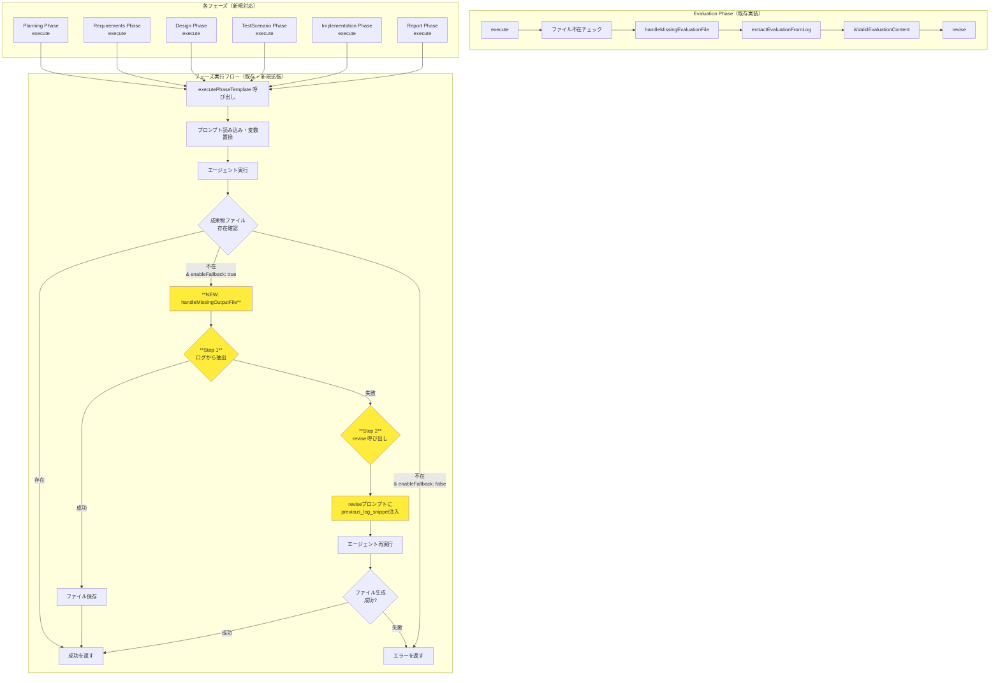
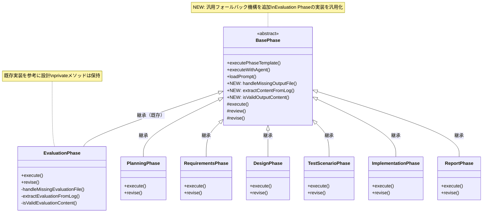

# 詳細設計書 - Issue #113

## 0. Planning Document & Requirements Document の確認

Planning Document（@.ai-workflow/issue-113/00_planning/output/planning.md）および要件定義書（@.ai-workflow/issue-113/01_requirements/output/requirements.md）を確認しました。

**開発計画の概要**:
- **複雑度**: 中程度
- **見積もり工数**: 12~16時間
- **主要リスク**: BasePhase変更によるリグレッション、エージェント挙動変化、ログ解析ロジックの複雑化

**要件定義サマリー**:
- 6フェーズ（Planning、Requirements、Design、TestScenario、Implementation、Report）にEvaluation Phaseのフォールバック機構を導入
- `BasePhase.executePhaseTemplate()`の拡張
- Reviseプロンプトの最適化（`{previous_log_snippet}`変数の追加、「⚠️ 最重要：必須アクション」セクションの追加）

---

## 1. アーキテクチャ設計

### 1.1 システム全体図



### 1.2 コンポーネント間の関係



### 1.3 データフロー

**フォールバックフロー**:

```
┌─────────────────────────────────────────────────────────┐
│ Phase.execute()                                         │
│   ├─ executePhaseTemplate(file, vars, {enableFallback})│
│   │    ├─ loadPrompt('execute')                        │
│   │    ├─ 変数置換                                      │
│   │    ├─ executeWithAgent()                           │
│   │    └─ ファイル存在確認                             │
│   │         ├─ [存在] → 成功                           │
│   │         └─ [不在 & enableFallback: true]           │
│   │              └─ handleMissingOutputFile()          │
│   │                   ├─ extractContentFromLog()       │
│   │                   │    ├─ agent_log.md読み込み    │
│   │                   │    ├─ パターンマッチング      │
│   │                   │    └─ コンテンツ抽出          │
│   │                   ├─ isValidOutputContent()        │
│   │                   │    ├─ 文字数チェック          │
│   │                   │    ├─ セクション数チェック    │
│   │                   │    └─ キーワード検証          │
│   │                   └─ [抽出失敗] → revise()        │
│   │                        ├─ loadPrompt('revise')    │
│   │                        ├─ previous_log_snippet注入│
│   │                        ├─ executeWithAgent()      │
│   │                        └─ ファイル存在確認        │
└─────────────────────────────────────────────────────────┘
```

---

## 2. 実装戦略判断

### 実装戦略: **EXTEND**

**判断根拠**:
1. **既存の`BasePhase.executePhaseTemplate()`を拡張**: 新規クラス作成ではなく、既存メソッドにオプションパラメータ（`enableFallback?: boolean`）を追加し、フォールバックロジックを統合する。
2. **Evaluation Phaseの実装を汎用化**: Evaluation Phaseの`handleMissingEvaluationFile()`、`extractEvaluationFromLog()`、`isValidEvaluationContent()`の実装パターンを`BasePhase`に汎用メソッドとして追加し、すべてのフェーズで再利用可能にする。
3. **各フェーズクラスの拡張**: 6フェーズ（Planning、Requirements、Design、TestScenario、Implementation、Report）の`execute()`メソッドで`executePhaseTemplate()`呼び出し時に`enableFallback: true`オプションを指定する。
4. **プロンプトファイルの拡張**: 6フェーズのrevise.txtファイルを拡張し、Evaluation Phaseのパターン（「⚠️ 最重要：必須アクション」セクション、`{previous_log_snippet}`変数）を追加する。
5. **新規ファイル作成は最小限**: 主に既存コードの拡張・修正で対応し、新規ファイルは作成しない。

**対象ファイル**:
- 修正: `src/phases/base-phase.ts` (約476行 → 約560行に拡張)
- 修正: 6フェーズの各ファイル（`src/phases/planning.ts`、`src/phases/requirements.ts`、`src/phases/design.ts`、`src/phases/test-scenario.ts`、`src/phases/implementation.ts`、`src/phases/report.ts`）
- 修正: 6フェーズのrevise.txt（`src/prompts/*/revise.txt`）
- 修正: `src/types.ts`（オプション型定義の追加）

---

## 3. テスト戦略判断

### テスト戦略: **UNIT_INTEGRATION**

**判断根拠**:
1. **ユニットテスト**: `BasePhase`の新規メソッド（`handleMissingOutputFile()`、`extractContentFromLog()`、`isValidOutputContent()`）の単体テストを実施する。
   - **対象**: ログからの成果物抽出ロジック、エラーハンドリング、バリデーション
   - **目的**: 各メソッドの入出力が仕様通りであることを確認
2. **統合テスト**: 実際のフェーズ実行でフォールバック動作を確認する。
   - **対象**: 各フェーズ（Planning、Requirements、Design、TestScenario、Implementation、Report）でのエンドツーエンドテスト
   - **目的**: エージェントがファイル生成に失敗した場合のフォールバック → revise → 成功のフロー確認
3. **BDDテスト不要**: エンドユーザー向けの機能追加ではなく、内部機構の改善のため、BDDテストは不要と判断。

**テスト項目**:
- **ユニットテスト**:
  - `extractContentFromLog()`: パターンマッチング（成功・失敗ケース）
  - `isValidOutputContent()`: バリデーションロジック（文字数、キーワード、セクション数）
  - `handleMissingOutputFile()`: フォールバックフロー全体（ログ抽出成功・失敗、revise呼び出し）
- **統合テスト**:
  - 各フェーズでのフォールバック動作（ファイル不在 → ログ抽出 → 成功）
  - 各フェーズでのrevise動作（ログ抽出失敗 → revise → 成功）
  - リグレッションテスト（既存フェーズの動作に影響がないこと）

---

## 4. テストコード戦略判断

### テストコード戦略: **BOTH_TEST**

**判断根拠**:
1. **EXTEND_TEST（既存テストの拡張）**: 既存の`tests/unit/phases/base-phase.test.ts`（存在する場合）にフォールバックロジックのユニットテストを追加する。
2. **CREATE_TEST（新規テスト作成）**: 各フェーズのフォールバック統合テスト用に新規テストファイル`tests/integration/phases/fallback-mechanism.test.ts`を作成する。
3. **両方のアプローチが必要**: ユニットテスト（既存テスト拡張）と統合テスト（新規テスト作成）の両方を実施し、品質を確保する。

**テストファイル**:
- 拡張: `tests/unit/phases/base-phase.test.ts` (既存テストにフォールバックロジックのテストケースを追加)
- 新規作成: `tests/integration/phases/fallback-mechanism.test.ts` (各フェーズのフォールバック統合テスト)

---

## 5. 影響範囲分析

### 5.1 既存コードへの影響

#### 修正が必要なファイル（詳細）

**1. コアロジック**:

| ファイル | 現在の行数 | 影響 | 主な変更内容 |
|---------|----------|------|------------|
| `src/phases/base-phase.ts` | 約476行 | 大 | - `executePhaseTemplate()`にオプションパラメータ追加<br/>- `handleMissingOutputFile()`メソッド追加<br/>- `extractContentFromLog()`メソッド追加<br/>- `isValidOutputContent()`メソッド追加<br/>- 約80行の追加（約560行に拡張） |

**2. 各フェーズファイル**:

| ファイル | 影響 | 主な変更内容 |
|---------|------|------------|
| `src/phases/planning.ts` | 小 | - `execute()`メソッド内の`executePhaseTemplate()`呼び出しに`enableFallback: true`オプション追加（1行変更）<br/>- `revise()`メソッドに`previous_log_snippet`変数の注入ロジック追加（約10行追加） |
| `src/phases/requirements.ts` | 小 | 同上 |
| `src/phases/design.ts` | 小 | 同上 |
| `src/phases/test-scenario.ts` | 小 | 同上 |
| `src/phases/implementation.ts` | 小 | 同上 |
| `src/phases/report.ts` | 小 | 同上 |

**3. プロンプトファイル**:

| ファイル | 影響 | 主な変更内容 |
|---------|------|------------|
| `src/prompts/planning/revise.txt` | 中 | - 「⚠️ 最重要：必須アクション」セクション追加（Writeツール使用を明示）<br/>- `{previous_log_snippet}`変数の追加<br/>- ケースA: ファイル未作成の場合の対応手順追加<br/>- 約30~50行の追加 |
| `src/prompts/requirements/revise.txt` | 中 | 同上 |
| `src/prompts/design/revise.txt` | 中 | 同上 |
| `src/prompts/test-scenario/revise.txt` | 中 | 同上 |
| `src/prompts/implementation/revise.txt` | 中 | 同上 |
| `src/prompts/report/revise.txt` | 中 | 同上 |

**4. 型定義**:

| ファイル | 影響 | 主な変更内容 |
|---------|------|------------|
| `src/types.ts` | 小 | - `executePhaseTemplate()`のオプションパラメータに`enableFallback?: boolean`を追加（型定義の拡張、1~3行追加） |

### 5.2 依存関係の変更

**新規依存の追加**: なし

**既存依存の変更**: なし

**影響を受けるモジュール**:
- `src/phases/base-phase.ts`: `fs-extra`、`path`、`logger`（既存依存、変更なし）
- 各フェーズファイル: `BasePhase`（継承元、変更なし）

### 5.3 マイグレーション要否

**不要**

理由:
- メタデータスキーマ変更なし（`metadata.json`のフォーマットを維持）
- 設定ファイル変更なし
- 環境変数追加なし
- データベーススキーマ変更なし（データベース未使用）

### 5.4 後方互換性

**完全な後方互換性を維持**:

1. **`executePhaseTemplate()`のデフォルト動作**: `enableFallback`オプションを指定しない場合、既存の動作（ファイル不在時はエラーを返す）を維持する。
   ```typescript
   // 既存の呼び出し（フォールバックなし）
   await this.executePhaseTemplate('output.md', { ... });  // 動作変更なし

   // 新規の呼び出し（フォールバックあり）
   await this.executePhaseTemplate('output.md', { ... }, { enableFallback: true });
   ```

2. **Evaluation Phaseの実装**: Evaluation Phaseの既存実装（`handleMissingEvaluationFile()`、`extractEvaluationFromLog()`、`isValidEvaluationContent()`）は`private`メソッドとして保持し、`BasePhase`の汎用メソッドとは別に維持する。これにより、Evaluation Phase固有のロジック（例: `DECISION`キーワードの検証）を保持できる。

3. **他のフェーズ**: `enableFallback: true`を指定しない限り、既存の動作を維持する（リグレッションなし）。

---

## 6. 変更・追加ファイルリスト

### 6.1 修正が必要な既存ファイル

**コアロジック**:
- `src/phases/base-phase.ts` (約476行 → 約560行に拡張)

**各フェーズファイル**:
- `src/phases/planning.ts`
- `src/phases/requirements.ts`
- `src/phases/design.ts`
- `src/phases/test-scenario.ts`
- `src/phases/implementation.ts`
- `src/phases/report.ts`

**プロンプトファイル**:
- `src/prompts/planning/revise.txt`
- `src/prompts/requirements/revise.txt`
- `src/prompts/design/revise.txt`
- `src/prompts/test-scenario/revise.txt`
- `src/prompts/implementation/revise.txt`
- `src/prompts/report/revise.txt`

**型定義**:
- `src/types.ts` (オプション型定義の拡張)

### 6.2 新規作成ファイル

**テストファイル**:
- `tests/integration/phases/fallback-mechanism.test.ts` (新規作成、各フェーズのフォールバック統合テスト)

### 6.3 削除が必要なファイル

なし

---

## 7. 詳細設計

### 7.1 クラス設計

#### 7.1.1 BasePhase クラスの拡張

**既存メソッドの拡張**:

```typescript
/**
 * フェーズ実行の共通パターンをテンプレート化したメソッド（Issue #47）
 * Issue #113: フォールバック機構を追加
 *
 * @param phaseOutputFile - 出力ファイル名（例: 'requirements.md', 'design.md'）
 * @param templateVariables - プロンプトテンプレートの変数マップ
 * @param options - エージェント実行オプション
 *   - maxTurns: エージェントの最大ターン数（デフォルト: 30）
 *   - verbose: 詳細ログ出力フラグ（オプション）
 *   - logDir: ログディレクトリパス（オプション）
 *   - enableFallback: フォールバック機構を有効化（NEW、デフォルト: false）
 * @returns PhaseExecutionResult
 */
protected async executePhaseTemplate<T extends Record<string, string>>(
  phaseOutputFile: string,
  templateVariables: T,
  options?: {
    maxTurns?: number;
    verbose?: boolean;
    logDir?: string;
    enableFallback?: boolean;  // NEW
  }
): Promise<PhaseExecutionResult> {
  // 1. プロンプトテンプレートを読み込む
  let prompt = this.loadPrompt('execute');

  // 2. テンプレート変数を置換
  for (const [key, value] of Object.entries(templateVariables)) {
    const placeholder = `{${key}}`;
    prompt = prompt.replace(placeholder, value);
  }

  // 3. エージェントを実行
  const agentOptions = {
    maxTurns: options?.maxTurns ?? 30,
    verbose: options?.verbose,
    logDir: options?.logDir ?? this.executeDir,  // デフォルトはexecuteDir
  };
  await this.executeWithAgent(prompt, agentOptions);

  // 4. 出力ファイルの存在確認
  const outputFilePath = path.join(this.outputDir, phaseOutputFile);
  if (!fs.existsSync(outputFilePath)) {
    // NEW: フォールバック機構が有効な場合
    if (options?.enableFallback === true) {
      logger.warn(`Phase ${this.phaseName}: Output file not found: ${outputFilePath}`);
      logger.info(`Phase ${this.phaseName}: Attempting fallback mechanism`);

      const fallbackResult = await this.handleMissingOutputFile(
        phaseOutputFile,
        agentOptions.logDir
      );

      return fallbackResult;
    }

    // 既存の動作（フォールバック無効時）
    return {
      success: false,
      error: `${phaseOutputFile} が見つかりません: ${outputFilePath}`,
    };
  }

  // 5. 成功を返す
  return {
    success: true,
    output: outputFilePath,
  };
}
```

**新規メソッド**:

```typescript
/**
 * ファイルが作成されなかった場合のフォールバック処理（Issue #113）
 *
 * 1. エージェントログから成果物内容を抽出して保存
 * 2. 抽出失敗時は revise() メソッドを使用
 *
 * Evaluation Phaseの handleMissingEvaluationFile() を汎用化した実装
 *
 * @param phaseOutputFile - 出力ファイル名（例: 'planning.md', 'requirements.md'）
 * @param logDir - エージェントログディレクトリ（通常は this.executeDir）
 * @returns PhaseExecutionResult
 */
protected async handleMissingOutputFile(
  phaseOutputFile: string,
  logDir: string
): Promise<PhaseExecutionResult> {
  const outputFilePath = path.join(this.outputDir, phaseOutputFile);

  // Step 1: エージェントログから成果物内容を抽出
  const agentLogPath = path.join(logDir, 'agent_log.md');

  if (!fs.existsSync(agentLogPath)) {
    logger.error(`Phase ${this.phaseName}: Agent log not found: ${agentLogPath}`);

    // ログが存在しない場合はエラー（revise しても意味がない）
    return {
      success: false,
      output: null,
      error: [
        `${phaseOutputFile} が見つかりません: ${outputFilePath}`,
        `エージェントログも見つかりません: ${agentLogPath}`,
        `エージェントが正常に実行されなかった可能性があります。`,
      ].join('\n'),
    };
  }

  try {
    const agentLog = fs.readFileSync(agentLogPath, 'utf-8');

    // ログから成果物内容を抽出
    const extractedContent = this.extractContentFromLog(agentLog, this.phaseName);

    if (extractedContent && this.isValidOutputContent(extractedContent, this.phaseName)) {
      // 抽出した内容が妥当な場合、ファイルとして保存
      logger.info(
        `Phase ${this.phaseName}: Extracted valid content from agent log (${extractedContent.length} chars)`
      );
      fs.writeFileSync(outputFilePath, extractedContent, 'utf-8');
      logger.info(`Phase ${this.phaseName}: Saved extracted content to: ${outputFilePath}`);

      return { success: true, output: outputFilePath };
    }

    // Step 2: 内容が不十分な場合、revise() で再実行
    logger.warn(`Phase ${this.phaseName}: Extracted content is insufficient or invalid.`);
    logger.info(`Phase ${this.phaseName}: Attempting revise step to create ${phaseOutputFile}`);

    const feedback = [
      `${phaseOutputFile} が見つかりません: ${outputFilePath}`,
      `エージェントが Write ツールを呼び出していない可能性があります。`,
      `前回のログから成果物内容を抽出するか、新たに作成してファイルを保存してください。`,
    ].join('\n');

    // revise() メソッドを使用（BasePhase のパターンに従う）
    // Note: revise() は各フェーズで実装されているため、型キャストが必要
    const reviseFunction = this.getReviseFunction();
    if (!reviseFunction) {
      return {
        success: false,
        output: null,
        error: `Phase ${this.phaseName}: revise() メソッドが実装されていません。`,
      };
    }

    const reviseResult = await reviseFunction(feedback);

    return reviseResult;
  } catch (error) {
    const message = getErrorMessage(error);
    logger.error(`Phase ${this.phaseName}: Error during fallback processing: ${message}`);
    return {
      success: false,
      output: null,
      error: `フォールバック処理中にエラーが発生しました: ${message}`,
    };
  }
}

/**
 * エージェントログから成果物内容を抽出（Issue #113）
 *
 * Evaluation Phaseの extractEvaluationFromLog() を汎用化した実装
 *
 * @param agentLog - エージェントログ（agent_log.md の内容）
 * @param phaseName - フェーズ名（抽出パターンの選択に使用）
 * @returns 抽出した成果物内容（抽出失敗時は null）
 */
protected extractContentFromLog(agentLog: string, phaseName: PhaseName): string | null {
  // フェーズごとのヘッダーパターン
  const headerPatterns: Record<PhaseName, RegExp> = {
    planning: /^#+ (プロジェクト計画書|Project Planning|計画書|Planning)/im,
    requirements: /^#+ (要件定義書|Requirements Document|要件定義|Requirements)/im,
    design: /^#+ (詳細設計書|Design Document|設計書|Design)/im,
    test_scenario: /^#+ (テストシナリオ|Test Scenario|テスト設計|Test Design)/im,
    implementation: /^#+ (実装ログ|Implementation Log|実装|Implementation)/im,
    report: /^#+ (プロジェクトレポート|Project Report|レポート|Report)/im,
    // 以下は対象外（フォールバック機構を導入しないフェーズ）
    test_implementation: /^#+ (テスト実装|Test Implementation)/im,
    testing: /^#+ (テスト実行結果|Test Result)/im,
    documentation: /^#+ (ドキュメント更新ログ|Documentation Update Log)/im,
    evaluation: /^#+ (評価レポート|Evaluation Report)/im,
  };

  const pattern = headerPatterns[phaseName];
  if (!pattern) {
    logger.warn(`Phase ${phaseName}: No extraction pattern defined`);
    return null;
  }

  // パターン1: ヘッダーから始まるセクションを探す
  const match = agentLog.match(pattern);

  if (match && match.index !== undefined) {
    // ヘッダー以降のコンテンツを抽出
    const content = agentLog.substring(match.index).trim();

    // 最低限の構造チェック：Markdownセクション（##）が含まれているか
    if (content.includes('##')) {
      return content;
    }
  }

  // パターン2: 大きなMarkdownブロックを探す（ヘッダーが見つからない場合）
  const lines = agentLog.split('\n');
  let startIndex = -1;
  let sectionCount = 0;

  for (let i = 0; i < lines.length; i++) {
    const line = lines[i];

    // Markdownセクションヘッダーを探す
    if (/^##+ /.test(line)) {
      if (startIndex === -1) {
        startIndex = i;
      }
      sectionCount++;
    }
  }

  // 複数のセクションヘッダーがある場合、それ以降を抽出
  if (sectionCount >= 2 && startIndex !== -1) {
    const extracted = lines.slice(startIndex).join('\n').trim();
    return extracted;
  }

  return null;
}

/**
 * 抽出した成果物内容が妥当かチェック（Issue #113）
 *
 * Evaluation Phaseの isValidEvaluationContent() を汎用化した実装
 *
 * @param content - 抽出した成果物内容
 * @param phaseName - フェーズ名（検証ルールの選択に使用）
 * @returns 妥当な場合は true、そうでない場合は false
 */
protected isValidOutputContent(content: string, phaseName: PhaseName): boolean {
  // 最低限の要件：
  // 1. 100文字以上（極端に短いものは除外）
  // 2. Markdownセクションヘッダー（## または ###）が複数ある

  if (content.length < 100) {
    logger.debug(`Phase ${phaseName}: Content too short: ${content.length} chars`);
    return false;
  }

  // セクションヘッダーのカウント
  const sectionCount = (content.match(/^##+ /gm) || []).length;
  if (sectionCount < 2) {
    logger.debug(`Phase ${phaseName}: Insufficient sections: ${sectionCount}`);
    return false;
  }

  // フェーズ固有のキーワードチェック（オプション）
  const requiredKeywords: Partial<Record<PhaseName, string[]>> = {
    planning: ['実装戦略', 'テスト戦略', 'タスク分割'],
    requirements: ['機能要件', '受け入れ基準', 'スコープ'],
    design: ['アーキテクチャ', '実装戦略', 'テスト戦略'],
    test_scenario: ['テストケース', 'テストシナリオ'],
    implementation: ['実装', 'コード'],
    report: ['プロジェクトレポート', 'サマリー'],
  };

  const keywords = requiredKeywords[phaseName];
  if (keywords) {
    const missingKeywords = keywords.filter((keyword) => !content.includes(keyword));
    if (missingKeywords.length === keywords.length) {
      // すべてのキーワードが欠落している場合は無効
      logger.debug(`Phase ${phaseName}: Missing all required keywords: ${keywords.join(', ')}`);
      return false;
    }
  }

  return true;
}

/**
 * revise() メソッドを取得（型安全なヘルパー）
 *
 * BasePhaseは abstract class のため、revise() メソッドが各フェーズで実装されていることを前提とする。
 * このメソッドは、型安全に revise() を呼び出すためのヘルパー。
 *
 * @returns revise() メソッド（存在しない場合は null）
 */
private getReviseFunction():
  | ((feedback: string) => Promise<PhaseExecutionResult>)
  | null {
  const candidate = (this as unknown as Record<string, unknown>).revise;
  if (typeof candidate === 'function') {
    return candidate.bind(this);
  }
  return null;
}
```

### 7.2 各フェーズの execute() メソッド拡張

**Planning Phase の例**:

```typescript
// src/phases/planning.ts

protected async execute(): Promise<PhaseExecutionResult> {
  const issueInfo = await this.getIssueInfo();

  return this.executePhaseTemplate(
    'planning.md',
    {
      issue_info: this.formatIssueInfo(issueInfo),
      issue_number: String(issueInfo.number),
    },
    {
      maxTurns: 30,
      enableFallback: true,  // NEW: フォールバック機構を有効化
    }
  );
}
```

**他のフェーズも同様に`enableFallback: true`を追加**:
- Requirements Phase: `requirements.md`
- Design Phase: `design.md`
- TestScenario Phase: `test-scenario.md`
- Implementation Phase: `implementation.md`
- Report Phase: `report.md`

### 7.3 各フェーズの revise() メソッド拡張

**Planning Phase の例**:

```typescript
// src/phases/planning.ts

protected async revise(feedback: string): Promise<PhaseExecutionResult> {
  const issueInfo = await this.getIssueInfo();
  const planningFile = path.join(this.outputDir, 'planning.md');
  const planningDocumentPath = this.getAgentFileReference(planningFile) ?? planningFile;

  // NEW: 前回のログスニペットを取得
  const agentLogPath = path.join(this.executeDir, 'agent_log.md');
  let previousLogSnippet = '';
  if (fs.existsSync(agentLogPath)) {
    const agentLog = fs.readFileSync(agentLogPath, 'utf-8');
    previousLogSnippet = agentLog.substring(0, 2000);  // 最初の2000文字
  }

  const revisePrompt = this.loadPrompt('revise')
    .replace('{planning_document_path}', planningDocumentPath)
    .replace('{review_feedback}', feedback)
    .replace('{issue_info}', this.formatIssueInfo(issueInfo))
    .replace('{issue_number}', String(issueInfo.number))
    .replace('{previous_log_snippet}', previousLogSnippet || '（ログなし）');  // NEW

  logger.info(`Phase ${this.phaseName}: Starting revise with previous log snippet`);
  await this.executeWithAgent(revisePrompt, { maxTurns: 30, logDir: this.reviseDir });

  // Check if file was created
  if (!fs.existsSync(planningFile)) {
    return {
      success: false,
      output: null,
      error: [
        `planning.md が見つかりません: ${planningFile}`,
        `Revise ステップでもファイルが作成されませんでした。`,
        `エージェントログを確認してください: ${path.join(this.reviseDir, 'agent_log.md')}`,
      ].join('\n'),
    };
  }

  logger.info(`Phase ${this.phaseName}: Revise succeeded, planning.md created`);
  return {
    success: true,
    output: planningFile,
  };
}
```

**他のフェーズも同様に`previous_log_snippet`変数を注入**:
- Requirements Phase: `requirements.md`
- Design Phase: `design.md`
- TestScenario Phase: `test-scenario.md`
- Implementation Phase: `implementation.md`
- Report Phase: `report.md`

### 7.4 プロンプト設計（revise.txt の拡張）

**Evaluation Phase のパターンを適用**:

```markdown
# [フェーズ名] - 修正プロンプト

あなたはレビューフィードバックに基づいて[成果物名]を修正する、または[成果物名]ファイルを確実に作成する任務を負ったAI[役割]です。

## ⚠️ 最重要：必須アクション

**Write ツールを使用して、[成果物名]を以下のパスに必ず保存してください：**

```
.ai-workflow/issue-{issue_number}/[フェーズ番号]_[フェーズ名]/output/[成果物ファイル名]
```

**このファイルが存在しない場合、[フェーズ名] Phase は失敗します。**

---

## コンテキスト

- **Issue**: #{issue_number} - {issue_title}
- **リポジトリ**: {repo_name}
- **元の[成果物名]**: {[document_path]}

## 修正が必要な理由

{review_feedback}

## 元の[成果物名]（存在する場合）

{[document_content]}

## 前回の実行ログ（参考）

以下は前回の実行ログの一部です。[成果物名]内容がログに含まれている場合は、それを使用してファイルを作成できます：

```
{previous_log_snippet}
```

## 修正指示

### ケース A: [成果物名]ファイルが未作成の場合

前回の実行でファイルが作成されなかった場合、以下の手順で対応してください：

1. **前回のログから[成果物名]内容を抽出**（ログに内容が含まれている場合）
   - [必須セクション1]、[必須セクション2]、...を抽出
   - 整形して [成果物ファイル名] として保存

2. **新たに[成果物名]を作成**（ログに内容が不十分な場合）
   - 簡潔に作成し、必須項目を含む[成果物名]を作成
   - Write ツールで [成果物ファイル名] として保存

### ケース B: レビューフィードバックに基づく修正の場合

レビューで問題が指摘された場合、以下に対処してください：

#### 1. すべての重大な問題（ブロッカー）に対処
- [ブロッカー例1]を修正
- [ブロッカー例2]を修正
- ...

#### 2. 改善提案の反映（可能な範囲で）
- [改善提案例1]を検討
- [改善提案例2]を検討
- ...

[... 以下、フェーズ固有の修正指示を記載 ...]

## 出力フォーマット

以下を含む完全な修正された[成果物名]を提供してください：

1. すべての必須セクション（[セクション1]、[セクション2]、...）
2. レビューフィードバックで特定されたすべての問題の修正
3. 改善された証拠と明確性
4. [フェーズ固有の要件]

**重要**: 修正された[成果物名]は必ず `.ai-workflow/issue-{issue_number}/[フェーズ番号]_[フェーズ名]/output/[成果物ファイル名]` として保存してください。元のファイルを上書きしてください。

## 重要な注意事項

- レビューフィードバックのすべてのポイントに対処する
- 元の[成果物名]からの有効な内容を削除しない
- 証拠と明確性を追加するが、客観性を維持する
- レビュアーが間違っていると思う場合は、推論でその理由を説明する
- 修正されたレポートがレビューを通過することを確認
```

**フェーズごとのカスタマイズ**:
- Planning Phase: 「実装戦略」「テスト戦略」「テストコード戦略」の明記を強調
- Requirements Phase: 「機能要件」「受け入れ基準」の明確性を強調
- Design Phase: 「アーキテクチャ設計」「実装戦略判断」の論理性を強調
- TestScenario Phase: 「テストケース」「テストシナリオ」の網羅性を強調
- Implementation Phase: 「実装ログ」「変更ファイル一覧」の正確性を強調
- Report Phase: 「プロジェクトレポート」「PR ボディ」の完全性を強調

### 7.5 データ構造設計

**既存のデータ構造を維持**（新規データ構造の追加なし）:

- `PhaseExecutionResult`: 既存の型定義を維持
- `metadata.json`: 既存のスキーマを維持

---

## 8. セキュリティ考慮事項

### 8.1 認証・認可

**影響なし**: 本Issue（#113）は内部ロジックの改善であり、認証・認可の変更は不要。

### 8.2 データ保護

**ログファイルの取り扱い**:
- エージェントログ（`agent_log.md`）からの抽出処理は、ファイルシステム上の既存ファイルを読み込むのみ（外部入力なし）
- パストラバーサル攻撃のリスクなし（`this.executeDir`は内部で管理されたパス）

### 8.3 セキュリティリスクと対策

**リスク**: なし

**対策**:
- ログ解析は正規表現によるパターンマッチングのみ使用（任意コード実行のリスクなし）
- ファイル生成は指定ディレクトリ（`.ai-workflow/issue-<NUM>/<PHASE>/output/`）内に限定（既存の実装と同様）

---

## 9. 非機能要件への対応

### 9.1 パフォーマンス

**ログ抽出処理の性能**:
- 対象: エージェントログ（最大100KB想定）からの抽出処理
- 目標: 5秒以内に完了
- 実装:
  - `fs.readFileSync()`で一括読み込み（ストリーミング不要、ファイルサイズが小さいため）
  - 正規表現マッチング（`String.prototype.match()`、O(n)の計算量）
  - 最適化: 不要（ファイルサイズが小さいため）

**フォールバック処理全体の性能**:
- 対象: ログ抽出 → revise呼び出しまでの処理
- 目標: 1分以内に完了（エージェント実行時間を除く）
- 実装:
  - ログ抽出: 5秒以内
  - ファイル保存: 1秒以内
  - revise呼び出し: エージェント実行時間に依存（本Issue外）

### 9.2 スケーラビリティ

**影響なし**: 本Issue（#113）は、フェーズ実行のエラーハンドリングを改善するものであり、スケーラビリティへの影響はない。

### 9.3 保守性

**コードの再利用性**:
- Evaluation Phaseの実装を汎用化して`BasePhase`に追加することで、コード重複を削減
- 各フェーズで共通のフォールバック機構を利用可能（DRY原則）

**新規フェーズへの適用**:
- 新規フェーズ追加時、`executePhaseTemplate()`を使用すれば自動的にフォールバック機構が利用可能
- `enableFallback: true`オプションを指定するだけで有効化

**ログ出力**:
- フォールバック処理の各ステップで適切なログを出力（`logger.info()`, `logger.warn()`, `logger.error()`）
- デバッグを容易にする

---

## 10. 実装の順序

以下の順序で実装することを推奨します（依存関係を考慮）：

### Phase 1: BasePhase への汎用フォールバック機構の実装（2~3h）

1. **`executePhaseTemplate()`の拡張**:
   - `options`パラメータに`enableFallback?: boolean`を追加
   - ファイル不在時に`enableFallback: true`の場合は`handleMissingOutputFile()`を呼び出す

2. **`handleMissingOutputFile()`メソッドの実装**:
   - エージェントログの存在確認
   - `extractContentFromLog()`呼び出し
   - `isValidOutputContent()`呼び出し
   - ファイル保存または`revise()`呼び出し

3. **`extractContentFromLog()`メソッドの実装**:
   - フェーズごとのヘッダーパターン定義
   - パターンマッチングによる抽出

4. **`isValidOutputContent()`メソッドの実装**:
   - 文字数チェック
   - セクション数チェック
   - キーワード検証（オプション）

5. **`getReviseFunction()`ヘルパーメソッドの実装**:
   - 型安全な`revise()`呼び出しをサポート

### Phase 2: 型定義の更新（0.5h）

1. **`src/types.ts`の拡張**:
   - `executePhaseTemplate()`のオプションパラメータに`enableFallback?: boolean`を追加（型定義レベル、実装はPhase 1で完了）

### Phase 3: Revise プロンプトの更新（1~1.5h）

1. **6フェーズのrevise.txtを更新**:
   - Evaluation Phaseのrevise.txtをテンプレートとして使用
   - 「⚠️ 最重要：必須アクション」セクションを追加
   - `{previous_log_snippet}`プレースホルダーを追加
   - ケースA: ファイル未作成の場合の対応手順を追加
   - フェーズ固有の指示内容を追加

### Phase 4: 各フェーズへのフォールバック有効化（1~1.5h）

1. **6フェーズの`execute()`メソッドを拡張**:
   - `executePhaseTemplate()`呼び出し時に`enableFallback: true`オプションを追加

2. **6フェーズの`revise()`メソッドを拡張**:
   - `previous_log_snippet`変数の取得・注入ロジックを追加

### Phase 5: テストコード実装（2~3h）

1. **ユニットテストの実装**:
   - `tests/unit/phases/base-phase.test.ts`（既存ファイルまたは新規作成）にフォールバックロジックのテストを追加
   - `extractContentFromLog()`のテスト
   - `isValidOutputContent()`のテスト
   - `handleMissingOutputFile()`のテスト

2. **統合テストの実装**:
   - `tests/integration/phases/fallback-mechanism.test.ts`（新規作成）
   - 各フェーズでのフォールバック動作の統合テスト
   - リグレッションテスト（既存フェーズの動作確認）

### Phase 6: テスト実行と修正（0.5~1h）

1. **ユニットテストの実行**:
   - `npm run test:unit`の実行
   - 失敗したテストの修正
   - カバレッジ確認（新規コードのカバレッジ80%以上）

2. **統合テストの実行**:
   - `npm run test:integration`の実行
   - 失敗したテストの修正
   - エンドツーエンドでのフォールバック動作確認

---

## 11. 実装上の注意事項

### 11.1 コーディング規約

**CLAUDE.md の「## 重要な制約事項」に従う**:

1. **ロギング規約（Issue #61）**:
   - `console.log`等の直接使用は禁止
   - 統一loggerモジュール（`src/utils/logger.ts`）を使用
   - `logger.debug()`, `logger.info()`, `logger.warn()`, `logger.error()`を呼び出す

2. **環境変数アクセス規約（Issue #51）**:
   - `process.env`への直接アクセスは禁止
   - Configクラス（`src/core/config.ts`）の`config.getXxx()`メソッドを使用

3. **エラーハンドリング規約（Issue #48）**:
   - `as Error`型アサーションの使用は禁止
   - エラーハンドリングユーティリティ（`src/utils/error-utils.ts`）の`getErrorMessage()`, `getErrorStack()`, `isError()`を使用

### 11.2 Evaluation Phase からの流用

**参考コード**: `src/phases/evaluation.ts:521-660`

- `handleMissingEvaluationFile()`: 2段階フォールバック（ログ抽出 → revise）のパターンを流用
- `extractEvaluationFromLog()`: 正規表現マッチングのパターンを汎用化
- `isValidEvaluationContent()`: バリデーションロジックを汎用化

**汎用化のポイント**:
- フェーズ名をパラメータ化（`phaseName: PhaseName`）
- ヘッダーパターンをフェーズごとに定義（`headerPatterns: Record<PhaseName, RegExp>`）
- キーワード検証をフェーズごとに定義（`requiredKeywords: Partial<Record<PhaseName, string[]>>`）

### 11.3 プロンプト設計

**テンプレート**: `src/prompts/evaluation/revise.txt`

- 「⚠️ 最重要：必須アクション」セクションは必須
- `{previous_log_snippet}`変数は各フェーズで共通
- ケースA: ファイル未作成の場合の対応手順を詳細に記載

---

## 12. テスト仕様

### 12.1 ユニットテスト

**テストファイル**: `tests/unit/phases/base-phase.test.ts` (既存ファイルの拡張または新規作成)

**テストケース**:

#### `extractContentFromLog()` のテスト

```typescript
describe('BasePhase.extractContentFromLog()', () => {
  describe('Planning Phase', () => {
    it('should extract content from log with header pattern', () => {
      const agentLog = `
# プロジェクト計画書

## 1. Issue分析
...
## 2. 実装戦略判断
...
`;
      const result = basePhase.extractContentFromLog(agentLog, 'planning');
      expect(result).not.toBeNull();
      expect(result).toContain('プロジェクト計画書');
    });

    it('should return null if no pattern matches', () => {
      const agentLog = 'No planning document here';
      const result = basePhase.extractContentFromLog(agentLog, 'planning');
      expect(result).toBeNull();
    });
  });

  // Requirements、Design、TestScenario、Implementation、Reportフェーズも同様にテスト
});
```

#### `isValidOutputContent()` のテスト

```typescript
describe('BasePhase.isValidOutputContent()', () => {
  it('should validate content with sufficient length and sections', () => {
    const content = `
# Planning Document

## Section 1
Content here...

## Section 2
More content...
`;
    const result = basePhase.isValidOutputContent(content, 'planning');
    expect(result).toBe(true);
  });

  it('should reject content that is too short', () => {
    const content = 'Too short';
    const result = basePhase.isValidOutputContent(content, 'planning');
    expect(result).toBe(false);
  });

  it('should reject content with insufficient sections', () => {
    const content = `
# Planning Document
Content without sections...
`.repeat(20); // 100文字以上にするため
    const result = basePhase.isValidOutputContent(content, 'planning');
    expect(result).toBe(false);
  });
});
```

#### `handleMissingOutputFile()` のテスト

```typescript
describe('BasePhase.handleMissingOutputFile()', () => {
  it('should extract content from log and save to file', async () => {
    // モックファイルシステムをセットアップ
    // エージェントログに有効なコンテンツが含まれている場合

    const result = await basePhase.handleMissingOutputFile('planning.md', executeDir);

    expect(result.success).toBe(true);
    expect(fs.existsSync(path.join(outputDir, 'planning.md'))).toBe(true);
  });

  it('should call revise() if extraction fails', async () => {
    // モックファイルシステムをセットアップ
    // エージェントログに無効なコンテンツが含まれている場合

    const reviseSpy = jest.spyOn(basePhase as any, 'revise');

    const result = await basePhase.handleMissingOutputFile('planning.md', executeDir);

    expect(reviseSpy).toHaveBeenCalledWith(expect.stringContaining('planning.md が見つかりません'));
  });

  it('should return error if agent log does not exist', async () => {
    // モックファイルシステムをセットアップ
    // エージェントログが存在しない場合

    const result = await basePhase.handleMissingOutputFile('planning.md', executeDir);

    expect(result.success).toBe(false);
    expect(result.error).toContain('エージェントログも見つかりません');
  });
});
```

### 12.2 統合テスト

**テストファイル**: `tests/integration/phases/fallback-mechanism.test.ts` (新規作成)

**テストケース**:

```typescript
describe('Fallback Mechanism Integration Tests', () => {
  describe('Planning Phase', () => {
    it('should successfully execute with fallback when file is not created', async () => {
      // モックエージェントをセットアップ
      // executeステップでファイルを生成しないが、ログに有効なコンテンツを出力

      const planningPhase = new PlanningPhase({
        workingDir: testWorkingDir,
        metadataManager: mockMetadata,
        codexClient: mockCodexClient,
        claudeClient: null,
        githubClient: mockGithubClient,
      });

      const result = await planningPhase.execute();

      expect(result.success).toBe(true);
      expect(fs.existsSync(path.join(testWorkingDir, '.ai-workflow/issue-123/00_planning/output/planning.md'))).toBe(true);
    });

    it('should call revise if log extraction fails', async () => {
      // モックエージェントをセットアップ
      // executeステップでファイルを生成せず、ログも無効

      const reviseSpy = jest.spyOn(PlanningPhase.prototype, 'revise');

      const planningPhase = new PlanningPhase({...});

      const result = await planningPhase.execute();

      expect(reviseSpy).toHaveBeenCalled();
    });
  });

  // Requirements、Design、TestScenario、Implementation、Reportフェーズも同様にテスト

  describe('Regression Tests', () => {
    it('should not affect phases without enableFallback option', async () => {
      // モックエージェントをセットアップ
      // enableFallback: false（デフォルト）の場合、既存の動作を維持

      const testPhase = new TestImplementationPhase({...});

      // TestImplementation Phaseは executePhaseTemplate() を使用していない（またはenableFallback: falseのまま）
      const result = await testPhase.execute();

      // 既存の動作を確認
      // （ファイル不在時はエラーを返す）
    });
  });
});
```

### 12.3 テストカバレッジ目標

**新規コードのカバレッジ**: 80%以上

**対象**:
- `BasePhase.handleMissingOutputFile()`
- `BasePhase.extractContentFromLog()`
- `BasePhase.isValidOutputContent()`
- `BasePhase.getReviseFunction()`
- 各フェーズの`execute()`拡張部分（`enableFallback: true`）
- 各フェーズの`revise()`拡張部分（`previous_log_snippet`注入）

---

## 13. 品質ゲート（Phase 2）

以下の品質ゲートを満たしていることを確認しました：

- [x] **実装戦略の判断根拠が明記されている** → セクション2「実装戦略判断」で明記（EXTEND戦略、5つの判断根拠）
- [x] **テスト戦略の判断根拠が明記されている** → セクション3「テスト戦略判断」で明記（UNIT_INTEGRATION戦略、3つの判断根拠）
- [x] **テストコード戦略の判断根拠が明記されている** → セクション4「テストコード戦略判断」で明記（BOTH_TEST戦略、3つの判断根拠）
- [x] **既存コードへの影響範囲が分析されている** → セクション5「影響範囲分析」で詳細に分析（15ファイルの変更内容、依存関係、マイグレーション要否、後方互換性）
- [x] **変更が必要なファイルがリストアップされている** → セクション6「変更・追加ファイルリスト」でリストアップ（修正14ファイル、新規作成1ファイル）
- [x] **設計が実装可能である** → セクション7「詳細設計」で実装可能な設計を提示（クラス設計、関数設計、データ構造設計、プロンプト設計）

---

## 14. リスクと軽減策

### 14.1 BasePhase変更によるリグレッション

**リスク**:
- `executePhaseTemplate()`の変更は全フェーズに影響する可能性がある

**軽減策**:
- `enableFallback`オプションのデフォルト値を`false`にする（既存の動作を維持）
- `enableFallback: true`を指定しない限り、既存のフローを変更しない
- 統合テストでリグレッションを検出
- Phase 6（テスト実行）で全フェーズの既存テストを実行

### 14.2 エージェント挙動変化（プロンプト変更による）

**リスク**:
- Reviseプロンプトの変更により、エージェントの挙動が変化する可能性がある

**軽減策**:
- Evaluation Phaseのrevise.txtパターンは実績あり（既に動作している）
- プロンプト変更は最小限にする（既存の指示を保持し、「⚠️ 最重要：必須アクション」セクションのみ追加）
- 統合テストで実際のエージェント挙動を確認
- 問題が発生した場合はrevise.txtを調整

### 14.3 ログ解析ロジックの複雑化

**リスク**:
- ログ解析ロジックが複雑になり、保守性が低下する可能性がある

**軽減策**:
- Evaluation Phaseの`extractEvaluationFromLog()`を流用（実績あり）
- エージェントログのフォーマットは統一されている（Codex/Claude共通）
- ログ解析失敗時はreviseにフォールバック（二段階フォールバック）
- ユニットテストでエッジケースをカバー

### 14.4 工数超過（見積もりの不確実性）

**リスク**:
- Phase 4（実装）で想定外の問題が発生し、工数超過する可能性がある

**軽減策**:
- タスク粒度を細かくして進捗を可視化（Planning Documentの「## 4. タスク分割」参照）
- Phase 4の実装で想定外の問題が発生した場合は早期にエスカレーション
- 最小限の実装で動作確認（MVP アプローチ）

---

## 15. まとめ

この設計書では、Issue #113「全フェーズに Evaluation Phase のフォールバック機構を導入する」の詳細設計を示しました。

**主な設計内容**:
1. **実装戦略**: EXTEND（既存の`BasePhase.executePhaseTemplate()`を拡張）
2. **テスト戦略**: UNIT_INTEGRATION（ユニットテスト + 統合テスト）
3. **テストコード戦略**: BOTH_TEST（既存テスト拡張 + 新規テスト作成）
4. **影響範囲**: 15ファイルの修正、1ファイルの新規作成
5. **後方互換性**: 完全に維持（`enableFallback`オプションのデフォルトは`false`）

**成功の鍵**:
1. BasePhaseの変更を最小限にする（リグレッション防止）
2. Evaluation Phaseの実装を汎用化して再利用する（DRY原則）
3. 網羅的なテストでエッジケースをカバーする
4. プロンプト変更によるエージェント挙動の変化を注意深く監視する

**期待される効果**:
- エージェントがファイル生成に失敗した場合でも自動的にリカバリー
- ワークフローの堅牢性向上
- ユーザーの手動介入を削減

この設計書は、Phase 3（テストシナリオ）～ Phase 8（レポート）の実行における羅針盤となります。各フェーズで品質ゲートを確認しながら、着実に実装を進めてください。
