# プロジェクト計画書 - Issue #115

## Issue概要

- **Issue番号**: #115
- **タイトル**: [FOLLOW-UP] #113: Fix integration test・Fix unit test mock c・Fix isValidOutputCon
- **状態**: open
- **URL**: https://github.com/tielec/ai-workflow-agent/issues/115
- **ラベル**: enhancement, ai-workflow-follow-up

この Issue は、Issue #113「フォールバック機構の導入」の Evaluation フェーズで特定された残タスク（テストコード品質改善）をまとめたものです。

## 1. Issue分析

### 複雑度: 簡単

**判断根拠**:
- 対象範囲: 2つのテストファイル（`tests/integration/phases/fallback-mechanism.test.ts`, `tests/unit/phases/base-phase-fallback.test.ts`）のみ
- 変更内容: テストコードの修正のみ（プロダクションコードは変更不要）
- 技術的難易度: TypeScript型定義とJestモック設定の標準的な問題
- 既知の解決策: Issue #113の評価レポートで具体的な修正方針が明示済み

### 見積もり工数: 4~6時間

**内訳**:
- Task 1（Integration test TypeScript compilation errors）: 2~3時間
  - TypeScript 5.x型定義との互換性修正
  - 15個の統合テストケースの実行確認
- Task 2（Unit test mock configuration）: 1~2時間
  - モック範囲の見直し（`fs.readFileSync` → `loadPrompt()` への影響排除）
  - 4個のexecutePhaseTemplateテストの実行確認
- Task 3（isValidOutputContent test data）: 0.5~1時間
  - テストデータへのキーワード追加（trivial）

**根拠**:
- Issue #113の評価レポート（lines 153-175）で各タスクの原因と推奨修正方法が明確に記載されている
- 類似のTypeScript/Jest型問題は過去のIssueで解決済み（Issue #102, #105を参照）
- テストフレームワーク（Jest + TypeScript 5.x + ESM）の設定は既に安定している

### リスク評価: 低

**判断根拠**:
- **技術的リスク**: 低
  - 既知の問題（TypeScript型定義、Jestモック設定）で前例あり
  - プロダクションコードへの影響なし（テストコードのみの修正）
- **スコープリスク**: 低
  - 明確な3タスク、具体的な修正箇所が特定済み
  - スコープクリープの可能性なし
- **依存リスク**: 低
  - 外部システム依存なし
  - ブロッキング問題なし（並行作業可能）

## 2. 実装戦略判断

### 実装戦略: EXTEND

**判断根拠**:
- **既存テストファイルの拡張**: 2つのテストファイル（`tests/integration/phases/fallback-mechanism.test.ts`, `tests/unit/phases/base-phase-fallback.test.ts`）を修正
- **新規ファイル作成不要**: プロダクションコードの変更はなし
- **既存構造の維持**: テストフレームワーク設定（`jest.config.cjs`）の変更は不要（Issue #102, #105で既に対応済み）
- **修正方針が明確**: Issue #113の評価レポートで各タスクの具体的な修正方法が提示されている

**このプロジェクトはテストコード品質改善であり、既存のテストファイルを修正して型エラーとモック設定を改善します。**

### テスト戦略: UNIT_ONLY

**判断根拠**:
- **既存テストの修正**: 統合テスト（15個）とユニットテスト（4個）の修正が中心
- **テストのテストは不要**: メタテスト（テストコードをテストするコード）を書く必要はない
- **手動検証で十分**: `npm test` コマンドで全テストが通過することを確認すれば目的達成
- **ユニットテストのみ**: 修正後のテストコードの動作確認は、既存のテスト実行によって自己検証される

**このプロジェクトはテストコード自体の修正であり、新たにテストを追加する必要はありません。修正後、既存のテストスイートが正しく動作することを確認します。**

### テストコード戦略: EXTEND_TEST

**判断根拠**:
- **既存テストの修正**: 統合テスト15個、ユニットテスト4個、テストデータ1個の修正
- **新規テスト作成不要**: テストコード品質改善のため、新しいテストケースは追加しない
- **テスト仕様は不変**: テストケースの目的と期待結果は変更せず、実装の問題（型エラー、モック設定）のみを修正

**このプロジェクトは既存テストコードのバグ修正であり、テスト仕様自体は変更しません。**

## 3. 影響範囲分析

### 既存コードへの影響

**変更が必要なファイル**:
1. `tests/integration/phases/fallback-mechanism.test.ts` (約520行)
   - TypeScript型定義の修正（15箇所程度）
   - Jestモックの型アノテーション修正
2. `tests/unit/phases/base-phase-fallback.test.ts` (約660行)
   - モック範囲の見直し（4箇所）
   - テストデータの修正（1箇所）

**変更が不要なファイル**:
- プロダクションコード（`src/` 配下）: 変更なし
- 他のテストファイル（57個）: 変更なし
- Jest設定ファイル（`jest.config.cjs`）: 変更なし（Issue #102, #105で対応済み）
- `package.json`: 変更なし（依存関係の追加・変更なし）

### 依存関係の変更

**新規依存の追加**: なし

**既存依存の変更**: なし

**理由**: テストコード品質改善のみであり、プロダクションコードや依存関係には影響しない

### マイグレーション要否

**マイグレーション不要**

**理由**:
- データベーススキーマ変更なし
- 設定ファイル変更なし
- API変更なし
- テストコードの内部修正のみ

## 4. タスク分割

### Phase 1: 要件定義 (見積もり: 0.5h)

- [x] Task 1-1: Issue #113評価レポートの詳細分析 (0.5h)
  - 評価レポートlines 153-175の修正推奨事項を確認
  - 各タスクの原因と具体的な修正方法を抽出
  - プロジェクト設定（Jest、TypeScript、ESM）の現状確認

### Phase 2: 設計 (見積もり: 1h)

- [ ] Task 2-1: Task 1（Integration test）の修正設計 (0.5h)
  - TypeScript 5.x型定義との互換性問題の解決方法を設計
  - Jestモックの型アノテーション戦略（`as any` vs 型定義拡張）を決定
  - 15個の統合テストケースへの適用パターンを定義
- [ ] Task 2-2: Task 2（Unit test mock）の修正設計 (0.5h)
  - `fs.readFileSync` モックが `loadPrompt()` に影響しない方法を設計
  - モック範囲を限定する戦略（特定ファイルパスのみ、または `loadPrompt()` を別途モック）を決定
  - 4個のexecutePhaseTemplateテストへの適用方法を定義

### Phase 3: テストシナリオ (見積もり: 0.5h)

- [ ] Task 3-1: 修正後の検証シナリオ作成 (0.5h)
  - Task 1: 15個の統合テストが全て成功すること
  - Task 2: 4個のexecutePhaseTemplateユニットテストが全て成功すること
  - Task 3: isValidOutputContentテストが成功すること
  - 全テストスイート（57ファイル）が引き続き成功すること（回帰テスト）

### Phase 4: 実装 (見積もり: 3~4h)

- [ ] Task 4-1: Integration test TypeScript compilation errors修正 (2~3h)
  - `tests/integration/phases/fallback-mechanism.test.ts` の型エラー修正
  - Jestモック（`jest.fn().mockResolvedValue()`）の型アノテーション追加
  - 15個の統合テストケース全体で型エラーを解消
  - コンパイル成功確認（`npm run build` または `tsc --noEmit`）
- [ ] Task 4-2: Unit test mock configuration修正 (1h)
  - `tests/unit/phases/base-phase-fallback.test.ts` のモック範囲見直し
  - `fs.readFileSync` モックが `loadPrompt()` に影響しないよう修正
  - 4個のexecutePhaseTemplateテストの修正
- [ ] Task 4-3: isValidOutputContent test data修正 (0.5h)
  - テストデータに Planning phase キーワード（実装戦略、テスト戦略、タスク分割）を追加
  - 1個のテストケース（"should validate content with sufficient length and sections"）の修正

### Phase 5: テストコード実装 (見積もり: 0h)

**このフェーズはスキップ**

理由: テストコード品質改善プロジェクトであり、メタテスト（テストのテスト）は不要。Phase 6（テスト実行）で修正内容を検証。

### Phase 6: テスト実行 (見積もり: 1h)

- [ ] Task 6-1: 修正したテストの実行確認 (0.5h)
  - `npm test tests/integration/phases/fallback-mechanism.test.ts` で15個の統合テスト成功確認
  - `npm test tests/unit/phases/base-phase-fallback.test.ts` で33個のユニットテスト全て成功確認
- [ ] Task 6-2: 全テストスイートの回帰テスト (0.5h)
  - `npm test` で全57テストファイルが成功することを確認
  - 修正によって他のテストが破壊されていないことを確認
  - カバレッジレポート（`npm run test:coverage`）で問題ないことを確認

### Phase 7: ドキュメント (見積もり: 0.5h)

- [ ] Task 7-1: CLAUDE.mdの更新 (0.5h)
  - Issue #113の残タスクが完了したことを記録（該当セクションがあれば）
  - テストコード品質改善のベストプラクティスを記載（今後の参考のため）
  - TypeScript 5.x + Jest + ESM環境でのモック設定のガイドライン追加（必要に応じて）

### Phase 8: レポート (見積もり: 0.5h)

- [ ] Task 8-1: Issue完了レポート作成 (0.5h)
  - 修正内容のサマリー（3タスク全て完了）
  - テスト結果の証跡（全テスト成功のスクリーンショットまたはログ）
  - プルリクエスト情報の更新

## 5. 依存関係

### タスク間の依存関係

**重要な依存関係**:
- Phase 1 → Phase 2: 要件理解なしに設計はできない（直列）
- Phase 2 → Phase 3: 設計決定なしにテストシナリオは作れない（直列）
- Phase 3 → Phase 4: テストシナリオが確定してから実装開始（直列）
- Task 4-1, 4-2, 4-3: 並行実行可能（独立）
- Phase 4 → Phase 6: 実装完了後にテスト実行（直列）
- Phase 6 → Phase 7: テスト成功確認後にドキュメント更新（直列）
- **Phase 5（テストコード実装）はスキップ**

## 6. リスクと軽減策

### リスク1: TypeScript型定義修正が予想より複雑

- **影響度**: 中
- **確率**: 低
- **軽減策**:
  - Phase 2で型エラーのパターンを詳細に分析し、統一的な解決方法を決定
  - 最初の5個の統合テストで修正パターンを確立し、残り10個に適用
  - 最悪の場合は `as any` による型アサーション回避（Issue #113評価レポートで推奨）

### リスク2: モック範囲の見直しで予期しない副作用

- **影響度**: 中
- **確率**: 低
- **軽減策**:
  - モック修正前に現在の挙動を詳細に理解（`loadPrompt()` がどのように影響を受けているか）
  - 小さい範囲から修正を開始（1個のテストケースで確認してから4個全てに適用）
  - Phase 6の回帰テストで他のテストへの影響をすぐに検出

### リスク3: 全テストスイートの回帰

- **影響度**: 高（もし発生すれば）
- **確率**: 極低
- **軽減策**:
  - Phase 6で `npm test` により全57テストファイルを実行
  - 修正は2つのテストファイルのみに限定されており、他への影響は理論上なし
  - CI/CD環境（Jenkins）でも自動テスト実行により二重チェック

### リスク4: 見積もり工数の超過

- **影響度**: 低
- **確率**: 低
- **軽減策**:
  - 各タスクの見積もりにバッファを含めている（Task 4-1: 2~3h、Task 4-2: 1~2h）
  - Issue #113評価レポートで具体的な修正方法が明示されており、調査時間は最小限
  - 最悪の場合、Task 3（テストデータ修正）を後回しにして、Task 1・2を優先

## 7. 品質ゲート

### Phase 1: 要件定義

- [x] Issue #113評価レポートの3つの残タスクが明確に理解されている
- [x] 各タスクの原因（TypeScript型エラー、モック設定、テストデータ）が特定されている
- [x] 修正対象ファイル（2つのテストファイル）が確認されている

### Phase 2: 設計

- [x] **実装戦略の判断根拠が明記されている**（EXTEND: 既存テストファイルの修正）
- [x] **テスト戦略の判断根拠が明記されている**（UNIT_ONLY: 修正後の動作確認のみ）
- [x] **テストコード戦略の判断根拠が明記されている**（EXTEND_TEST: 既存テストの修正）
- [x] Task 1の型エラー修正戦略が具体的に定義されている
- [x] Task 2のモック範囲見直し戦略が具体的に定義されている

### Phase 3: テストシナリオ

- [ ] Task 1の検証シナリオ（15個の統合テスト成功）が定義されている
- [ ] Task 2の検証シナリオ（4個のユニットテスト成功）が定義されている
- [ ] Task 3の検証シナリオ（1個のテスト成功）が定義されている
- [ ] 回帰テストシナリオ（全テストスイート成功）が定義されている

### Phase 4: 実装

- [ ] Task 4-1: 15個の統合テストのTypeScriptコンパイルエラーが解消されている
- [ ] Task 4-2: 4個のexecutePhaseTemplateユニットテストのモック設定が修正されている
- [ ] Task 4-3: 1個のisValidOutputContentテストデータが修正されている
- [ ] `tsc --noEmit` でTypeScriptコンパイルが成功する

### Phase 5: テストコード実装

**このフェーズはスキップ** （理由: メタテスト不要）

### Phase 6: テスト実行

- [ ] `npm test tests/integration/phases/fallback-mechanism.test.ts` が全て成功（15/15）
- [ ] `npm test tests/unit/phases/base-phase-fallback.test.ts` が全て成功（33/33）
- [ ] `npm test` で全テストスイートが成功（57ファイル全て）
- [ ] カバレッジレポートで問題が検出されていない

### Phase 7: ドキュメント

- [ ] CLAUDE.mdにテストコード品質改善の成果が記録されている
- [ ] 今後の参考となるベストプラクティスが記載されている（必要に応じて）

### Phase 8: レポート

- [ ] Issue完了レポートが作成されている
- [ ] 3タスク全ての修正内容が記載されている
- [ ] テスト結果の証跡が含まれている

## 8. 成功基準

このプロジェクトは以下の条件を全て満たした場合に成功とします：

1. **Task 1成功**: `tests/integration/phases/fallback-mechanism.test.ts` の15個の統合テストが全て成功
2. **Task 2成功**: `tests/unit/phases/base-phase-fallback.test.ts` の4個のexecutePhaseTemplateユニットテストが全て成功
3. **Task 3成功**: `tests/unit/phases/base-phase-fallback.test.ts` の1個のisValidOutputContentテストが成功
4. **回帰なし**: 全テストスイート（57ファイル）が引き続き成功
5. **TypeScriptコンパイル成功**: `tsc --noEmit` でエラーなし
6. **ドキュメント更新**: CLAUDE.mdに成果が記録されている

## 9. 期待される成果

### 技術的成果

- **テストコード品質向上**: Issue #113で実装されたフォールバック機構のテストカバレッジが完全に（48/48 = 100%）機能する
- **CI/CD安定性向上**: Jenkins等のCI環境で統合テストが正しく実行され、自動テストの信頼性が向上
- **型安全性向上**: TypeScript 5.x型定義との完全な互換性により、将来の型エラーを予防

### ビジネス的成果

- **Issue #113の完全完了**: 評価フェーズで `PASS_WITH_ISSUES` となっていたものが `PASS` に昇格
- **フォールバック機構の本番投入準備完了**: 統合テストが成功することで、6つのフェーズ（Planning, Requirements, Design, TestScenario, Implementation, Report）でフォールバック機構を有効化する準備が整う
- **テクニカルデットの解消**: Issue #113で積み残されていたテストコード品質の問題が解決

### 学習的成果

- **TypeScript 5.x + Jest + ESMのベストプラクティス確立**: 今後の同様の問題を予防するための知見が蓄積される
- **モック設定のノウハウ**: 過度に広範囲なモックが意図しない影響を与える問題の回避方法を学習

## 10. タイムライン

```mermaid
gantt
    title Issue #115 タイムライン（見積もり: 4~6時間）
    dateFormat HH:mm
    axisFormat %H:%M

    section Phase 1
    要件定義           :p1, 00:00, 0.5h

    section Phase 2
    設計               :p2, after p1, 1h

    section Phase 3
    テストシナリオ     :p3, after p2, 0.5h

    section Phase 4
    実装（並行可能）   :crit, p4, after p3, 3h
    Task 4-1 Integration :t41, after p3, 2.5h
    Task 4-2 Unit mock   :t42, after p3, 1h
    Task 4-3 Test data   :t43, after p3, 0.5h

    section Phase 6
    テスト実行         :p6, after p4, 1h

    section Phase 7
    ドキュメント       :p7, after p6, 0.5h

    section Phase 8
    レポート           :p8, after p7, 0.5h
```

**総所要時間**: 4~6時間（Phase 4の実装時間により変動）

**クリティカルパス**: Phase 1 → Phase 2 → Phase 3 → Phase 4 (Task 4-1) → Phase 6 → Phase 7 → Phase 8

**並行作業可能**: Phase 4のTask 4-1, 4-2, 4-3は独立しており、並行実装可能

## 11. 前提条件

このプロジェクトは以下の前提条件を満たしていることを前提とします：

1. **Issue #113の実装が完了**: プロダクションコード（`src/phases/base-phase.ts` 等）のフォールバック機構が実装済み
2. **開発環境が正常**: Node.js 20、npm 10、TypeScript 5.6.3がインストール済み
3. **Jest設定が正常**: `jest.config.cjs` が既にESMパッケージ（chalk、strip-ansi等）に対応済み（Issue #102, #105で対応済み）
4. **全テストが基本的に成功**: 修正対象の19個以外の全テスト（28個のユニットテスト + 他のテスト）が成功している

## 12. 制約事項

1. **プロダクションコードは変更不可**: テストコードの修正のみに限定
2. **テスト仕様は変更不可**: 既存の48個のテストケースの目的と期待結果は維持
3. **依存関係の追加は避ける**: 既存のJest設定とTypeScript設定の範囲内で解決
4. **Phase 5はスキップ**: メタテスト（テストのテスト）は作成しない

---

**この計画書は、Issue #113の評価レポート（`.ai-workflow/issue-113/09_evaluation/output/evaluation_report.md`）を基に作成されました。**

**計画作成日**: 2025-11-02
**見積もり総工数**: 4~6時間
**複雑度**: 簡単
**リスク評価**: 低
**実装戦略**: EXTEND
**テスト戦略**: UNIT_ONLY
**テストコード戦略**: EXTEND_TEST
