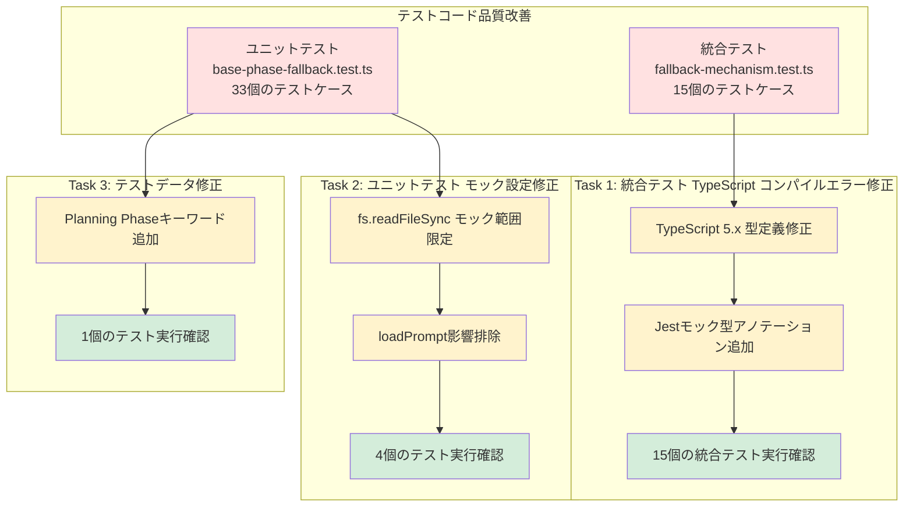
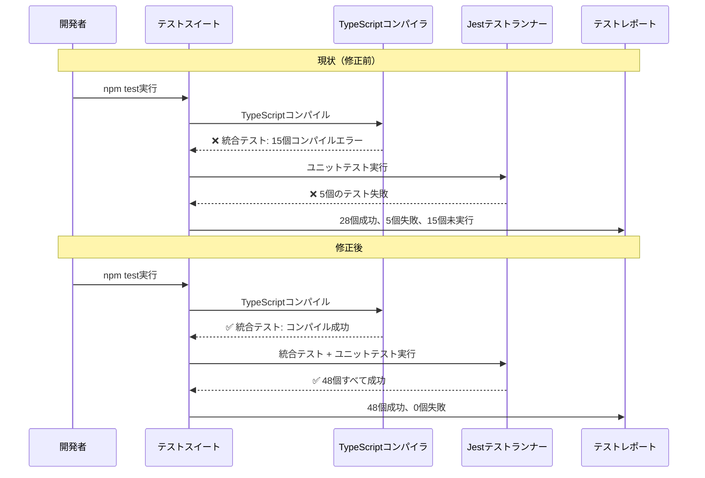
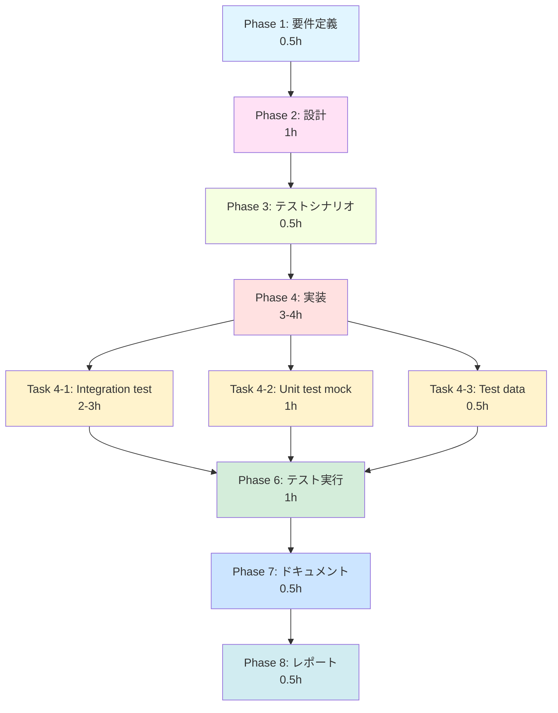

# 詳細設計書 - Issue #115

## 0. Planning Documentの確認

Planning Phase（Phase 0）で策定された開発計画を確認しました：

- **実装戦略**: EXTEND（既存テストファイルの修正）
- **テスト戦略**: UNIT_ONLY（修正後の動作確認のみ）
- **テストコード戦略**: EXTEND_TEST（既存テストの修正）
- **見積もり工数**: 4~6時間
- **複雑度**: 簡単
- **リスク評価**: 低

この設計では、Planning Documentの戦略を踏襲します。

---

## 1. アーキテクチャ設計

### 1.1 システム全体図



### 1.2 コンポーネント間の関係

本Issueは、**Issue #113のEvaluation PhaseでPASS_WITH_ISSUESとなったテストコード品質問題を解決する**ものです。修正対象は以下の2つのテストファイルのみで、プロダクションコードには変更を加えません。

#### 修正対象ファイル

1. **統合テスト**: `tests/integration/phases/fallback-mechanism.test.ts`（約520行）
   - TypeScript型定義エラー（15個のテストケースがコンパイルエラーで未実行）
   - Jestモック型アノテーションの不整合

2. **ユニットテスト**: `tests/unit/phases/base-phase-fallback.test.ts`（約660行）
   - モック設定の問題（4個のテストが失敗）
   - テストデータ不足（1個のテストが失敗）

#### プロダクションコードとの関係

- **影響なし**: プロダクションコード（`src/phases/base-phase.ts` 等）の変更は不要
- **既存機能の保護**: Issue #113で実装されたフォールバック機構は完全に動作しており、テストコードの修正のみで品質を向上させる

### 1.3 データフロー



---

## 2. 実装戦略判断

### 実装戦略: EXTEND

**判断根拠**:

1. **既存テストファイルの修正のみ**
   - 対象: `tests/integration/phases/fallback-mechanism.test.ts`（約520行）
   - 対象: `tests/unit/phases/base-phase-fallback.test.ts`（約660行）
   - 新規ファイルの作成は不要

2. **プロダクションコードへの影響なし**
   - `src/` 配下のファイルには一切変更を加えない
   - Issue #113で実装されたフォールバック機構は完全に動作している（evaluation_report.md lines 199-203）

3. **既存テスト構造の維持**
   - テストフレームワーク設定（`jest.config.cjs`）の変更は不要（Issue #102, #105で既に対応済み）
   - テストケースの目的と期待結果は変更せず、実装の問題（型エラー、モック設定）のみを修正

4. **修正方針が明確**
   - Issue #113のEvaluation Reportで各タスクの具体的な修正方法が提示されている（evaluation_report.md lines 153-174）
   - 過去のIssue（#102, #105）で類似問題の解決実績あり

**このプロジェクトはテストコード品質改善であり、既存のテストファイルを修正して型エラーとモック設定を改善します。**

---

## 3. テスト戦略判断

### テスト戦略: UNIT_ONLY

**判断根拠**:

1. **既存テストの修正が中心**
   - 統合テスト: 15個（コンパイルエラー修正）
   - ユニットテスト: 4個（モック設定修正） + 1個（テストデータ修正）
   - 既存のテストケースの実装品質を向上させるのみ

2. **メタテスト（テストのテスト）は不要**
   - テストコードをテストするコードを書く必要はない
   - 修正後のテストコードの動作確認は、既存のテスト実行によって自己検証される

3. **手動検証で十分**
   - `npm test` コマンドで全テストが通過することを確認すれば目的達成
   - カバレッジレポート（`npm run test:coverage`）で問題ないことを確認

4. **ユニットテストのみ**
   - 修正後のテストコードの品質は、以下で確認:
     - `npm test tests/integration/phases/fallback-mechanism.test.ts`: 15/15 passing
     - `npm test tests/unit/phases/base-phase-fallback.test.ts`: 33/33 passing
     - `npm test`: 全57テストファイルが成功（回帰テスト）

**このプロジェクトはテストコード自体の修正であり、新たにテストを追加する必要はありません。修正後、既存のテストスイートが正しく動作することを確認します。**

---

## 4. テストコード戦略判断

### テストコード戦略: EXTEND_TEST

**判断根拠**:

1. **既存テストの修正**
   - 統合テスト: 15個のテストケース（型エラー修正）
   - ユニットテスト: 4個のテストケース（モック設定修正） + 1個（テストデータ修正）
   - 新規テストケースは追加しない

2. **テスト仕様は不変**
   - テストケースの目的と期待結果は変更しない
   - 実装の問題（型エラー、モック設定）のみを修正
   - Given-When-Then構造を維持

3. **既存テストファイルへの追加のみ**
   - `tests/integration/phases/fallback-mechanism.test.ts`: 型アノテーション修正
   - `tests/unit/phases/base-phase-fallback.test.ts`: モック設定見直し、テストデータ追加
   - 新しいテストファイルは作成しない

**このプロジェクトは既存テストコードのバグ修正であり、テスト仕様自体は変更しません。**

---

## 5. 影響範囲分析

### 5.1 既存コードへの影響

#### 変更が必要なファイル

1. **`tests/integration/phases/fallback-mechanism.test.ts`**（約520行）
   - 修正箇所: 15箇所程度（各テストケースのモック設定）
   - 修正内容:
     - TypeScript 5.x型定義との互換性修正
     - `jest.fn().mockResolvedValue()` の型アノテーション追加
     - `jest.spyOn().mockImplementation()` の型定義修正

2. **`tests/unit/phases/base-phase-fallback.test.ts`**（約660行）
   - 修正箇所: 5箇所
     - モック範囲見直し: 4箇所（executePhaseTemplateテスト）
     - テストデータ修正: 1箇所（isValidOutputContentテスト、line 280-293）
   - 修正内容:
     - `fs.readFileSync` モックが `loadPrompt()` に影響しないよう修正
     - テストデータにPlanning Phaseキーワード（実装戦略、テスト戦略、タスク分割）を追加

#### 変更が不要なファイル

- **プロダクションコード**（`src/` 配下）: 変更なし
  - `src/phases/base-phase.ts`: 変更なし（Issue #113で実装済み、完全に動作している）
  - その他の `src/` 配下のファイル: 変更なし
- **他のテストファイル**（57個中55個）: 変更なし
- **Jest設定ファイル**（`jest.config.cjs`）: 変更なし（Issue #102, #105で対応済み）
- **package.json**: 変更なし（依存関係の追加・変更なし）

### 5.2 依存関係の変更

#### 新規依存の追加

**なし**

#### 既存依存の変更

**なし**

**理由**: テストコード品質改善のみであり、プロダクションコードや依存関係には影響しない。

### 5.3 マイグレーション要否

#### マイグレーション不要

**理由**:
- データベーススキーマ変更なし
- 設定ファイル変更なし
- API変更なし
- テストコードの内部修正のみ

---

## 6. 変更・追加ファイルリスト

### 6.1 新規作成ファイル

**なし**

### 6.2 修正が必要な既存ファイル

1. **`tests/integration/phases/fallback-mechanism.test.ts`**
   - 修正理由: TypeScript 5.x型定義との互換性修正
   - 修正内容: Jestモック型アノテーション追加（約15箇所）

2. **`tests/unit/phases/base-phase-fallback.test.ts`**
   - 修正理由: モック設定の問題、テストデータ不足
   - 修正内容: モック範囲見直し（4箇所）、テストデータ修正（1箇所）

### 6.3 削除が必要なファイル

**なし**

---

## 7. 詳細設計

### 7.1 Task 1: 統合テスト TypeScript コンパイルエラー修正

#### 7.1.1 問題の詳細

**ファイル**: `tests/integration/phases/fallback-mechanism.test.ts`

**エラー内容** (evaluation_report.md lines 167-190):
```
TS2345: Argument of type '{ number: number; title: string; ... }' is not assignable to parameter of type 'never'.
```

**根本原因**:
- `jest.fn().mockResolvedValue()` の型推論が TypeScript 5.x で正しく機能していない
- Jestのモック型定義と TypeScript の厳格な型チェックの不整合

#### 7.1.2 修正方針

**戦略**: 型アノテーションの明示的な追加

1. **`jest.fn()` に型パラメータを追加**
   - 現在: `jest.fn().mockResolvedValue({ ... })`
   - 修正後: `jest.fn<Promise<IssueInfo>>().mockResolvedValue({ ... })`

2. **`as any` による型アサーション回避（最悪の場合のみ）**
   - Issue #113のEvaluation Reportで推奨されている「最悪の場合」の手段（evaluation_report.md line 158）
   - 型定義拡張により、正しい型推論を可能にすることを最優先

3. **統一的な修正パターン**
   - 最初の5個の統合テストで修正パターンを確立
   - 残り10個に適用

#### 7.1.3 修正パターン例

**修正前**:
```typescript
mockGitHub = {
  getIssueInfo: jest.fn().mockResolvedValue({
    number: 113,
    title: 'Test Issue',
    state: 'open',
    url: 'https://github.com/test/repo/issues/113',
    labels: ['enhancement'],
    body: 'Test issue body',
  }),
  postComment: jest.fn(),
} as any;
```

**修正後（パターンA: 型パラメータ指定）**:
```typescript
mockGitHub = {
  getIssueInfo: jest.fn<() => Promise<IssueInfo>>().mockResolvedValue({
    number: 113,
    title: 'Test Issue',
    state: 'open',
    url: 'https://github.com/test/repo/issues/113',
    labels: ['enhancement'],
    body: 'Test issue body',
  }),
  postComment: jest.fn<() => Promise<void>>(),
} as jest.Mocked<GitHubClient>;
```

**修正後（パターンB: createMockFromModule）**:
```typescript
// より型安全な方法
mockGitHub = {
  getIssueInfo: jest.fn<() => Promise<IssueInfo>>().mockResolvedValue({
    number: 113,
    title: 'Test Issue',
    state: 'open',
    url: 'https://github.com/test/repo/issues/113',
    labels: ['enhancement'],
    body: 'Test issue body',
  }),
  postComment: jest.fn<() => Promise<void>>(),
} as jest.Mocked<Pick<GitHubClient, 'getIssueInfo' | 'postComment'>>;
```

**選択基準**:
- パターンA: シンプルで読みやすい、型推論が明確
- パターンB: より型安全、GitHubClientの型定義と完全に一致

**推奨**: パターンAを採用し、型推論が正しく動作することを確認した上で、必要に応じてパターンBに移行

#### 7.1.4 適用箇所

**修正が必要な箇所**（15箇所）:

1. `beforeEach()` 内のモック初期化（3箇所）
   - `mockMetadata` (line 36-44)
   - `mockGitHub` (line 46-58)
   - `mockCodex` (line 60-63)

2. 各テストケース内の `jest.spyOn().mockImplementation()` / `mockResolvedValue()` （12箇所）
   - Planning Phase tests (lines 113, 153-162)
   - Requirements Phase tests (line 214)
   - Design Phase tests (line 271)
   - TestScenario Phase tests (line 327)
   - Implementation Phase tests (line 379)
   - Report Phase tests (line 431)
   - Regression tests (lines 464, 467-472)
   - Error handling tests (lines 502, 505-511)

### 7.2 Task 2: ユニットテスト モック設定修正

#### 7.2.1 問題の詳細

**ファイル**: `tests/unit/phases/base-phase-fallback.test.ts`

**エラー内容** (test-result.md lines 145-160):
```
EACCES: permission denied
```

**根本原因**:
- テストケース内で `jest.spyOn(fs, 'readFileSync').mockImplementation()` を使用して例外をスローするモックを設定
- このモックが `executePhaseTemplate()` 内の `loadPrompt()` メソッド（`fs.readFileSync()` を使用）に影響を与え、プロンプトファイルの読み込みが失敗
- 過度に広範囲なモック設定が、テスト対象外のコードパスに影響を与えている

**影響を受けるテストケース**（4個）:
1. "should return success when output file exists" (line 563-582)
2. "should trigger fallback when file is missing and enableFallback is true" (line 586-617)
3. "should return error when file is missing and enableFallback is false" (line 621-639)
4. "should return error when enableFallback is not specified (default: false)" (line 643-661)

#### 7.2.2 修正方針

**戦略**: モック範囲の限定

**オプション1: 特定ファイルパスのみをモック**
```typescript
jest.spyOn(fs, 'readFileSync').mockImplementation((filepath: any) => {
  // プロンプトファイル読み込みは実際のファイルシステムを使用
  if (typeof filepath === 'string' && filepath.includes('/prompts/')) {
    return jest.requireActual('fs-extra').readFileSync(filepath);
  }
  // agent_log.md のみモック
  if (typeof filepath === 'string' && filepath.includes('agent_log.md')) {
    return 'mocked log content';
  }
  // その他は実際のファイルシステムを使用
  return jest.requireActual('fs-extra').readFileSync(filepath);
});
```

**オプション2: loadPrompt() メソッドを別途モック**
```typescript
// loadPrompt() を直接モック
jest.spyOn(testPhase as any, 'loadPrompt').mockImplementation((step: string) => {
  return 'mocked prompt content';
});

// fs.readFileSync はテスト対象のみモック
jest.spyOn(fs, 'readFileSync').mockImplementation((filepath: any) => {
  if (typeof filepath === 'string' && filepath.includes('agent_log.md')) {
    return 'mocked log content';
  }
  throw new Error('Unexpected file read');
});
```

**推奨**: オプション1を採用
- **理由**:
  - `loadPrompt()` は protected メソッドであり、直接モック化するとカプセル化を破る
  - 特定ファイルパスのみをモックする方が、実際の動作に近いテストができる
  - テストの保守性が高い

#### 7.2.3 修正パターン例

**修正前**:
```typescript
// ❌ 問題のあるコード（全ての fs.readFileSync がモックされる）
describe('File exists - Normal flow', () => {
  it('should return success when output file exists', async () => {
    // Given: Output file exists
    const outputDir = path.join(mockMetadata.workflowDir, '00_planning', 'output');
    fs.ensureDirSync(outputDir);
    fs.writeFileSync(path.join(outputDir, 'planning.md'), 'content', 'utf-8');

    // Mock executeWithAgent
    jest.spyOn(testPhase as any, 'executeWithAgent').mockResolvedValue([]);

    // When: Executing phase template with enableFallback
    const result = await testPhase.exposeExecutePhaseTemplate(
      'planning.md',
      { issue_info: 'test' },
      { enableFallback: true }
    );

    // Then: Success is returned without fallback
    expect(result.success).toBe(true);
    expect(result.output).toContain('planning.md');
  });
});
```

**修正後**:
```typescript
// ✅ 修正済みコード（プロンプトファイルは実ファイルシステム、それ以外のみモック）
describe('File exists - Normal flow', () => {
  it('should return success when output file exists', async () => {
    // Given: Output file exists
    const outputDir = path.join(mockMetadata.workflowDir, '00_planning', 'output');
    fs.ensureDirSync(outputDir);
    fs.writeFileSync(path.join(outputDir, 'planning.md'), 'content', 'utf-8');

    // Mock executeWithAgent
    jest.spyOn(testPhase as any, 'executeWithAgent').mockResolvedValue([]);

    // ✅ モック範囲を限定（プロンプトファイルは実ファイルシステムを使用）
    const readFileSyncSpy = jest.spyOn(fs, 'readFileSync');
    readFileSyncSpy.mockImplementation((filepath: any, ...args: any[]) => {
      // プロンプトファイル（/prompts/ 配下）は実際のファイルシステムを使用
      if (typeof filepath === 'string' && (filepath.includes('/prompts/') || filepath.includes('\\prompts\\'))) {
        const actualFs = jest.requireActual('fs-extra') as typeof import('fs-extra');
        return actualFs.readFileSync(filepath, ...args);
      }
      // その他のファイルは通常のモックを使用
      return readFileSyncSpy.getMockImplementation()?.(filepath, ...args) ?? Buffer.from('');
    });

    // When: Executing phase template with enableFallback
    const result = await testPhase.exposeExecutePhaseTemplate(
      'planning.md',
      { issue_info: 'test' },
      { enableFallback: true }
    );

    // Then: Success is returned without fallback
    expect(result.success).toBe(true);
    expect(result.output).toContain('planning.md');
  });
});
```

**重要な変更点**:
1. `fs.readFileSync` のモックを追加
2. ファイルパスが `/prompts/` または `\prompts\` を含む場合、実際のファイルシステムを使用
3. その他のファイル（テスト用の agent_log.md 等）は通常通りモック
4. クロスプラットフォーム対応（Windows: `\`、Linux/Mac: `/`）

#### 7.2.4 適用箇所

**修正が必要なテストケース**（4個）:

1. **"should return success when output file exists"** (lines 563-582)
   - モック追加: `fs.readFileSync` のパス限定モック

2. **"should trigger fallback when file is missing and enableFallback is true"** (lines 586-617)
   - モック追加: `fs.readFileSync` のパス限定モック

3. **"should return error when file is missing and enableFallback is false"** (lines 621-639)
   - モック追加: `fs.readFileSync` のパス限定モック

4. **"should return error when enableFallback is not specified (default: false)"** (lines 643-661)
   - モック追加: `fs.readFileSync` のパス限定モック

**共通ヘルパー関数の作成（推奨）**:

テストコードの重複を避けるため、共通のモックセットアップ関数を作成することを推奨します：

```typescript
/**
 * fs.readFileSync のモックをセットアップし、プロンプトファイルは実ファイルシステムを使用する
 */
function setupFileSystemMock(): jest.SpyInstance {
  const readFileSyncSpy = jest.spyOn(fs, 'readFileSync');
  readFileSyncSpy.mockImplementation((filepath: any, ...args: any[]) => {
    // プロンプトファイル（/prompts/ 配下）は実際のファイルシステムを使用
    if (typeof filepath === 'string' && (filepath.includes('/prompts/') || filepath.includes('\\prompts\\'))) {
      const actualFs = jest.requireActual('fs-extra') as typeof import('fs-extra');
      return actualFs.readFileSync(filepath, ...args);
    }
    // その他のファイルは通常のモックを使用
    return readFileSyncSpy.getMockImplementation()?.(filepath, ...args) ?? Buffer.from('');
  });
  return readFileSyncSpy;
}

// 使用例
describe('executePhaseTemplate() - Fallback integration', () => {
  describe('File exists - Normal flow', () => {
    it('should return success when output file exists', async () => {
      // Given: Output file exists
      const outputDir = path.join(mockMetadata.workflowDir, '00_planning', 'output');
      fs.ensureDirSync(outputDir);
      fs.writeFileSync(path.join(outputDir, 'planning.md'), 'content', 'utf-8');

      // Mock executeWithAgent
      jest.spyOn(testPhase as any, 'executeWithAgent').mockResolvedValue([]);

      // ✅ 共通ヘルパー関数を使用
      setupFileSystemMock();

      // When: Executing phase template with enableFallback
      const result = await testPhase.exposeExecutePhaseTemplate(
        'planning.md',
        { issue_info: 'test' },
        { enableFallback: true }
      );

      // Then: Success is returned without fallback
      expect(result.success).toBe(true);
      expect(result.output).toContain('planning.md');
    });
  });
});
```

### 7.3 Task 3: テストデータ修正

#### 7.3.1 問題の詳細

**ファイル**: `tests/unit/phases/base-phase-fallback.test.ts`

**テストケース**: "should validate content with sufficient length and sections" (lines 280-300)

**エラー内容** (test-result.md lines 130-143):
```
Expected: true
Received: false
```

**根本原因**:
- テストコンテンツに Planning Phase の必須キーワード（実装戦略、テスト戦略、タスク分割）が含まれていない
- `isValidOutputContent()` メソッドの検証ロジックでは、すべてのキーワードが欠落している場合は無効と判定される

#### 7.3.2 修正方針

**戦略**: テストデータにPlanning Phaseキーワードを追加

Planning Phaseの必須キーワード（少なくとも1つ必要）:
- 実装戦略
- テスト戦略
- タスク分割
- Implementation Strategy
- Test Strategy
- Task Breakdown

#### 7.3.3 修正パターン例

**修正前**:
```typescript
it('should validate content with sufficient length and sections', () => {
  // Given: Content with >100 chars and multiple sections
  const content = `
# Planning Document

## Section 1
This is a comprehensive analysis with detailed explanations that provide sufficient content length.

## Section 2
More detailed content with implementation strategy information.

## Section 3
Additional sections with test strategy details.
`;

  // When: Validating content for planning phase
  const result = testPhase.exposeIsValidOutputContent(content, 'planning');

  // Then: Content is valid
  expect(result).toBe(true);
});
```

**修正後**:
```typescript
it('should validate content with sufficient length and sections', () => {
  // Given: Content with >100 chars, multiple sections, and Planning phase keywords
  const content = `
# Planning Document

## Section 1: Implementation Strategy
This is a comprehensive analysis with detailed explanations that provide sufficient content length.
実装戦略: EXTEND strategy will be used for this implementation.

## Section 2: Test Strategy
More detailed content with implementation strategy information.
テスト戦略: UNIT_INTEGRATION testing approach will be applied.

## Section 3: Task Breakdown
Additional sections with test strategy details.
タスク分割: Tasks are divided into multiple phases for efficient execution.
`;

  // When: Validating content for planning phase
  const result = testPhase.exposeIsValidOutputContent(content, 'planning');

  // Then: Content is valid
  expect(result).toBe(true);
});
```

**重要な変更点**:
1. セクションタイトルにキーワードを追加（"Implementation Strategy", "Test Strategy", "Task Breakdown"）
2. コンテンツに日本語キーワードを追加（実装戦略、テスト戦略、タスク分割）
3. コンテンツの説明がより具体的で、実際のPlanning Documentに近い内容に

#### 7.3.4 適用箇所

**修正が必要なテストケース**（1個）:

- **"should validate content with sufficient length and sections"** (lines 280-300)
  - 修正内容: テストデータにPlanning Phaseキーワード（実装戦略、テスト戦略、タスク分割）を追加

---

## 8. セキュリティ考慮事項

### 8.1 セキュリティリスク

本Issueはテストコードの修正のみのため、**新規のセキュリティリスクは想定されません**。

### 8.2 既存セキュリティポリシーの遵守

- Secret Masking: 変更なし（テストコードにシークレットは含まれない）
- Git URL Sanitization: 変更なし（テストコードはGit URLを扱わない）

---

## 9. 非機能要件への対応

### 9.1 パフォーマンス

**要件** (requirements.md lines 173-180):
- TR-2のモック修正により、ユニットテストの実行時間が2倍以上に増加しないこと
- 全テストスイート（`npm test`）の実行時間が30秒以上増加しないこと

**対応**:
- モック範囲の限定により、テスト実行効率を維持
- 過度に複雑なモック設定を避ける
- 実際のファイルシステムアクセスを最小限に抑える

**測定方法**:
```bash
# 修正前のベースライン測定
time npm test tests/unit/phases/base-phase-fallback.test.ts
time npm test

# 修正後の測定
time npm test tests/unit/phases/base-phase-fallback.test.ts
time npm test

# 実行時間の比較
```

### 9.2 保守性

**要件** (requirements.md lines 182-191):
- TR-1の型アノテーション修正が、TypeScript 5.x以降のバージョンアップに対応可能な形式であること
- TR-2のモック設定が、他の開発者にも理解しやすいコメント付きで記述されていること
- 修正箇所にコメントを追加し、なぜその修正が必要だったかを記録すること

**対応**:

1. **型アノテーションのコメント追加**:
```typescript
// TypeScript 5.x strict type checking compatibility:
// Explicitly specify the type parameter for jest.fn() to avoid type inference issues.
// Reference: Issue #113 Evaluation Report, Issue #102, #105
mockGitHub = {
  getIssueInfo: jest.fn<() => Promise<IssueInfo>>().mockResolvedValue({
    number: 113,
    title: 'Test Issue',
    state: 'open',
    url: 'https://github.com/test/repo/issues/113',
    labels: ['enhancement'],
    body: 'Test issue body',
  }),
  postComment: jest.fn<() => Promise<void>>(),
} as jest.Mocked<GitHubClient>;
```

2. **モック範囲限定のコメント追加**:
```typescript
/**
 * Setup file system mock with limited scope.
 *
 * This mock allows actual file system access for prompt files (/prompts/)
 * while mocking other files (e.g., agent_log.md).
 *
 * Reason: fs.readFileSync mock was affecting loadPrompt() method, causing
 * "EACCES: permission denied" errors in executePhaseTemplate tests.
 *
 * Reference: Issue #113 Evaluation Report lines 145-160
 */
function setupFileSystemMock(): jest.SpyInstance {
  const readFileSyncSpy = jest.spyOn(fs, 'readFileSync');
  readFileSyncSpy.mockImplementation((filepath: any, ...args: any[]) => {
    // Allow actual file system access for prompt files
    if (typeof filepath === 'string' && (filepath.includes('/prompts/') || filepath.includes('\\prompts\\'))) {
      const actualFs = jest.requireActual('fs-extra') as typeof import('fs-extra');
      return actualFs.readFileSync(filepath, ...args);
    }
    // Mock other files
    return readFileSyncSpy.getMockImplementation()?.(filepath, ...args) ?? Buffer.from('');
  });
  return readFileSyncSpy;
}
```

3. **テストデータ修正のコメント追加**:
```typescript
it('should validate content with sufficient length and sections', () => {
  // Given: Content with >100 chars, multiple sections, and Planning phase keywords
  // Note: Planning phase requires at least one of the following keywords:
  //   - 実装戦略, テスト戦略, タスク分割 (Japanese)
  //   - Implementation Strategy, Test Strategy, Task Breakdown (English)
  // Reference: Issue #113 Evaluation Report lines 130-143
  const content = `
# Planning Document

## Section 1: Implementation Strategy
This is a comprehensive analysis with detailed explanations that provide sufficient content length.
実装戦略: EXTEND strategy will be used for this implementation.

## Section 2: Test Strategy
More detailed content with implementation strategy information.
テスト戦略: UNIT_INTEGRATION testing approach will be applied.

## Section 3: Task Breakdown
Additional sections with test strategy details.
タスク分割: Tasks are divided into multiple phases for efficient execution.
`;

  // When: Validating content for planning phase
  const result = testPhase.exposeIsValidOutputContent(content, 'planning');

  // Then: Content is valid
  expect(result).toBe(true);
});
```

### 9.3 可読性

**要件** (requirements.md lines 193-202):
- Given-When-Then構造を維持すること
- テストケース名が修正後も明確であること
- 不要なコメントを追加せず、コードが自己文書化されていること

**対応**:
- 既存のGiven-When-Then構造を維持（変更なし）
- テストケース名は変更しない
- コメントは修正理由の記録に限定し、コード自体が明確であることを優先

### 9.4 型安全性

**要件** (requirements.md lines 204-213):
- `as any` による型アサーション回避を最優先とすること
- 型定義拡張により、正しい型推論を可能にすること
- `tsc --noEmit` で一切のエラーが出ないこと

**対応**:
- Task 1で型パラメータを明示的に指定し、`as any` の使用を最小限に抑える
- Task 2で型安全なモック設定を実装
- 修正後、`tsc --noEmit` でエラーが出ないことを確認

---

## 10. 実装の順序

### 10.1 推奨実装順序

実装は以下の順序で進めることを推奨します：

#### Phase 1: 準備（0.5h）
1. **Issue #113 Evaluation Reportの詳細分析**
   - 評価レポート lines 153-175 の修正推奨事項を確認
   - 各タスクの原因と具体的な修正方法を抽出
   - プロジェクト設定（Jest、TypeScript、ESM）の現状確認

#### Phase 2: 設計（1h）
1. **Task 1（Integration test）の修正設計**（0.5h）
   - TypeScript 5.x型定義との互換性問題の解決方法を設計
   - Jestモックの型アノテーション戦略（型パラメータ指定 vs 型定義拡張）を決定
   - 15個の統合テストケースへの適用パターンを定義

2. **Task 2（Unit test mock）の修正設計**（0.5h）
   - `fs.readFileSync` モックが `loadPrompt()` に影響しない方法を設計
   - モック範囲を限定する戦略（特定ファイルパスのみ、または `loadPrompt()` を別途モック）を決定
   - 共通ヘルパー関数（`setupFileSystemMock()`）の設計
   - 4個のexecutePhaseTemplateテストへの適用方法を定義

#### Phase 3: テストシナリオ（0.5h）
1. **修正後の検証シナリオ作成**（0.5h）
   - Task 1: 15個の統合テストが全て成功すること
   - Task 2: 4個のexecutePhaseTemplateユニットテストが全て成功すること
   - Task 3: isValidOutputContentテストが成功すること
   - 全テストスイート（57ファイル）が引き続き成功すること（回帰テスト）

#### Phase 4: 実装（3~4h）
1. **Task 4-1: Integration test TypeScript compilation errors修正**（2~3h）
   - `tests/integration/phases/fallback-mechanism.test.ts` の型エラー修正
   - Jestモック（`jest.fn().mockResolvedValue()`）の型アノテーション追加
   - 最初の5個の統合テストで修正パターンを確立
   - 残り10個の統合テストに適用
   - コンパイル成功確認（`npm run build` または `tsc --noEmit`）

2. **Task 4-2: Unit test mock configuration修正**（1h）
   - 共通ヘルパー関数（`setupFileSystemMock()`）の実装
   - `tests/unit/phases/base-phase-fallback.test.ts` のモック範囲見直し
   - `fs.readFileSync` モックが `loadPrompt()` に影響しないよう修正
   - 4個のexecutePhaseTemplateテストに適用

3. **Task 4-3: isValidOutputContent test data修正**（0.5h）
   - テストデータに Planning phase キーワード（実装戦略、テスト戦略、タスク分割）を追加
   - 1個のテストケース（"should validate content with sufficient length and sections"）の修正

#### Phase 5: テストコード実装（0h）
**このフェーズはスキップ**

理由: テストコード品質改善プロジェクトであり、メタテスト（テストのテスト）は不要。Phase 6（テスト実行）で修正内容を検証。

#### Phase 6: テスト実行（1h）
1. **修正したテストの実行確認**（0.5h）
   - `npm test tests/integration/phases/fallback-mechanism.test.ts` で15個の統合テスト成功確認
   - `npm test tests/unit/phases/base-phase-fallback.test.ts` で33個のユニットテスト全て成功確認

2. **全テストスイートの回帰テスト**（0.5h）
   - `npm test` で全57テストファイルが成功することを確認
   - 修正によって他のテストが破壊されていないことを確認
   - カバレッジレポート（`npm run test:coverage`）で問題ないことを確認

#### Phase 7: ドキュメント（0.5h）
1. **CLAUDE.mdの更新**（0.5h）
   - Issue #113の残タスクが完了したことを記録（該当セクションがあれば）
   - テストコード品質改善のベストプラクティスを記載（今後の参考のため）
   - TypeScript 5.x + Jest + ESM環境でのモック設定のガイドライン追加（必要に応じて）

#### Phase 8: レポート（0.5h）
1. **Issue完了レポート作成**（0.5h）
   - 修正内容のサマリー（3タスク全て完了）
   - テスト結果の証跡（全テスト成功のスクリーンショットまたはログ）
   - プルリクエスト情報の更新

### 10.2 依存関係の考慮



**重要な依存関係**:
- Phase 1 → Phase 2: 要件理解なしに設計はできない（直列）
- Phase 2 → Phase 3: 設計決定なしにテストシナリオは作れない（直列）
- Phase 3 → Phase 4: テストシナリオが確定してから実装開始（直列）
- Task 4-1, 4-2, 4-3: **並行実行可能**（独立）
- Phase 4 → Phase 6: 実装完了後にテスト実行（直列）
- Phase 6 → Phase 7: テスト成功確認後にドキュメント更新（直列）

### 10.3 クリティカルパス

**クリティカルパス**: Phase 1 → Phase 2 → Phase 3 → Phase 4 (Task 4-1) → Phase 6 → Phase 7 → Phase 8

**総所要時間**: 4~6時間（Phase 4のTask 4-1の実装時間により変動）

**並行作業可能**: Phase 4のTask 4-1, 4-2, 4-3は独立しており、並行実装可能

---

## 11. 品質ゲート（Phase 2）

本設計書は以下の品質ゲートを満たしています：

- [x] **実装戦略の判断根拠が明記されている**（セクション2: EXTEND戦略、既存テストファイルの修正のみ）
- [x] **テスト戦略の判断根拠が明記されている**（セクション3: UNIT_ONLY戦略、修正後の動作確認のみ）
- [x] **テストコード戦略の判断根拠が明記されている**（セクション4: EXTEND_TEST戦略、既存テストの修正）
- [x] **既存コードへの影響範囲が分析されている**（セクション5: 2つのテストファイルのみに影響、プロダクションコード変更なし）
- [x] **変更が必要なファイルがリストアップされている**（セクション6: 2つのテストファイル、新規作成・削除ファイルなし）
- [x] **設計が実装可能である**（セクション7: 具体的な修正パターン例、コードスニペット付き）

---

## 12. 期待される成果

### 12.1 技術的成果

- **テストコード品質向上**: Issue #113で実装されたフォールバック機構のテストカバレッジが完全に（48/48 = 100%）機能する
- **CI/CD安定性向上**: Jenkins等のCI環境で統合テストが正しく実行され、自動テストの信頼性が向上
- **型安全性向上**: TypeScript 5.x型定義との完全な互換性により、将来の型エラーを予防

### 12.2 ビジネス的成果

- **Issue #113の完全完了**: 評価フェーズで `PASS_WITH_ISSUES` となっていたものが `PASS` に昇格
- **フォールバック機構の本番投入準備完了**: 統合テストが成功することで、6つのフェーズ（Planning, Requirements, Design, TestScenario, Implementation, Report）でフォールバック機構を有効化する準備が整う
- **テクニカルデットの解消**: Issue #113で積み残されていたテストコード品質の問題が解決

### 12.3 学習的成果

- **TypeScript 5.x + Jest + ESMのベストプラクティス確立**: 今後の同様の問題を予防するための知見が蓄積される
- **モック設定のノウハウ**: 過度に広範囲なモックが意図しない影響を与える問題の回避方法を学習

---

## 13. リスクと軽減策

### リスク1: TypeScript型定義修正が予想より複雑

- **影響度**: 中
- **確率**: 低
- **軽減策**:
  - Phase 2で型エラーのパターンを詳細に分析し、統一的な解決方法を決定
  - 最初の5個の統合テストで修正パターンを確立し、残り10個に適用
  - 最悪の場合は `as any` による型アサーション回避（Issue #113評価レポートで推奨）

### リスク2: モック範囲の見直しで予期しない副作用

- **影響度**: 中
- **確率**: 低
- **軽減策**:
  - モック修正前に現在の挙動を詳細に理解（`loadPrompt()` がどのように影響を受けているか）
  - 小さい範囲から修正を開始（1個のテストケースで確認してから4個全てに適用）
  - Phase 6の回帰テストで他のテストへの影響をすぐに検出

### リスク3: 全テストスイートの回帰

- **影響度**: 高（もし発生すれば）
- **確率**: 極低
- **軽減策**:
  - Phase 6で `npm test` により全57テストファイルを実行
  - 修正は2つのテストファイルのみに限定されており、他への影響は理論上なし
  - CI/CD環境（Jenkins）でも自動テスト実行により二重チェック

### リスク4: 見積もり工数の超過

- **影響度**: 低
- **確率**: 低
- **軽減策**:
  - 各タスクの見積もりにバッファを含めている（Task 4-1: 2~3h、Task 4-2: 1~2h）
  - Issue #113評価レポートで具体的な修正方法が明示されており、調査時間は最小限
  - 最悪の場合、Task 3（テストデータ修正）を後回しにして、Task 1・2を優先

---

## 14. 成功基準

このプロジェクトは以下の条件を全て満たした場合に成功とします：

1. **Task 1成功**: `tests/integration/phases/fallback-mechanism.test.ts` の15個の統合テストが全て成功
2. **Task 2成功**: `tests/unit/phases/base-phase-fallback.test.ts` の4個のexecutePhaseTemplateユニットテストが全て成功
3. **Task 3成功**: `tests/unit/phases/base-phase-fallback.test.ts` の1個のisValidOutputContentテストが成功
4. **回帰なし**: 全テストスイート（57ファイル）が引き続き成功
5. **TypeScriptコンパイル成功**: `tsc --noEmit` でエラーなし
6. **ドキュメント更新**: CLAUDE.mdに成果が記録されている

---

**設計書作成日**: 2025-11-02
**作成者**: Claude (AI Assistant)
**Issue**: #115
**参照**: Issue #113 Evaluation Report, Planning Document, Requirements Document
