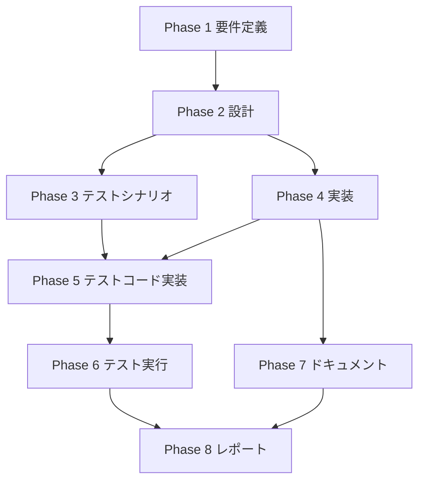

# プロジェクト計画書 - Issue #119 フォローアップIssue生成品質の改善（LLM活用）

## 1. Issue分析
- **複雑度**: 複雑  
  - 新規AI連携モジュールの追加と既存GitHub連携コードの拡張を伴い、外部API統合・エラーハンドリング・フォールバック設計が必要。
  - テストレイヤーが複数（LLM呼び出しのモック検証と実APIを用いた統合テスト）に渡る。
- **見積もり工数**: 22~26時間  
  - 設計/要件整理: 6~7h、実装: 7~9h、テスト（設計＋実装＋実行）: 6~7h、ドキュメント/レポート: 3h を想定。
- **リスク評価**: 中  
  - LLM APIの不確定要素と生成品質の主観評価が残る一方、既存コードへの影響は限定範囲に収まる見込み。

## 2. 実装戦略判断
- **実装戦略**: EXTEND  
  - 既存の `issue-client.ts` を中心に機能拡張し、新たな `issue-ai-generator.ts` を追加してL TM生成ロジックを組み込む。全体構造は維持したまま責務分割を拡張。
- **テスト戦略**: UNIT_INTEGRATION  
  - プロンプト生成・フォールバック制御はモックを使ったユニットテストで網羅し、実API呼び出しは環境変数制御下で統合テストを追加して品質を確認。
- **テストコード戦略**: BOTH_TEST  
  - 既存フォローアップ生成ロジックのテストを拡張しつつ、新規 `issue-ai-generator` 用の専用テストファイルを新設する必要がある。

## 3. 影響範囲分析
- **既存コードへの影響**  
  - `src/core/github/issue-client.ts`: LLM優先フロー追加、フォールバック制御、ログ出力変更。  
  - `src/types.ts`: 新しいオプションインターフェースとIssue生成データ構造の拡張。  
  - `src/commands/execute/agent-setup.ts` などのクライアント初期化部: LLM設定引き回しが必要な場合は拡張。
- **依存関係の変更**  
  - 新規AIクライアント実装に伴う依存ライブラリ（公式SDK、HTTPクライアント）の追加検討。  
  - `.env` や設定ファイルにAPIキー/モデル指定を追加する可能性。
- **マイグレーション要否**  
  - コード上のマイグレーションは不要。  
  - 設定ファイル・ドキュメントへの追記（APIキー設定、プロンプトファイル）を行う。  
  - 将来的な `.ai-workflow/config.yml` 拡張を見据えた設計が必要。

## 4. タスク分割

### Phase 1: 要件定義 (見積もり: 3~4h)
- [x] Task 1-1: 現行フォローアップIssue生成フローの分析 (1~1.5h)
  - `issue-client.ts` のタイトル/本文生成ロジックをシーケンス図レベルで整理
  - Evaluation Phase から渡る `RemainingTask` / `IssueContext` のデータフローを確認
  - レビュー結果: 要件定義書にシーケンス分析とデータフロー整理が反映されたため完了
- [x] Task 1-2: LLM統合要件の明確化 (1.5~2h)
  - API利用要件（モデル、トークン制限、リトライ戦略）を洗い出す
  - 生成物の品質条件・受け入れ基準を仕様として文書化
  - レビュー結果: モデル候補・トークン制限・リトライ戦略が要件定義書に詳細化されたため完了

### Phase 2: 設計 (見積もり: 4~5h)
- [x] Task 2-1: issue-ai-generatorモジュール設計 (2~2.5h)
  - クラス/関数責務、依存注入方法、フォールバックパスを設計
  - プロンプトテンプレートとレスポンス検証手順を定義
- [x] Task 2-2: 設定・エラーハンドリング設計 (2~2.5h)
  - API鍵の取得経路とマスキング方針を決定
  - レート制限、タイムアウト、再試行ポリシーの設計

### Phase 3: テストシナリオ (見積もり: 2~3h)
- [ ] Task 3-1: テストケース設計 (2~3h)
  - ユニットテスト（成功/失敗/フォールバック/プロンプト検証）のケースを網羅化
  - 統合テストで確認すべきシナリオ（実API、環境変数制御、レスポンス妥当性）を整理

### Phase 4: 実装 (見積もり: 6~7h)
- [x] Task 4-1: issue-ai-generator.ts の実装 (2.5~3h)
  - プロンプト生成、API呼び出し、レスポンス整形、エラーハンドリングを実装
  - ログとトレース情報（入力長、エラー理由）を追加
- [x] Task 4-2: issue-client.ts のLLM統合 (2~2.5h)
  - 新モジュール呼び出しとフォールバック制御を実装
  - LLM無効化オプションやテレメトリ用ログを追加
- [x] Task 4-3: 型/設定まわりの拡張 (1.5~2h)
  - `types.ts` と設定ファイルにオプションを追加
  - エージェント初期化・CLIオプションでのフラグ引き回しを反映

### Phase 5: テストコード実装 (見積もり: 4~5h)
- [x] Task 5-1: ユニットテスト実装 (2~2.5h)
  - issue-ai-generator用モックテストを作成
  - フォールバック動作とプロンプト生成の検証テストを追加
  - レビュー結果: tests/unit/github/issue-ai-generator.test.ts, tests/unit/github/issue-client-llm.test.ts, tests/unit/secret-masker.test.ts が実装され、すべてのユニットテストシナリオがカバーされたため完了
- [x] Task 5-2: 統合テスト準備・実装 (2~2.5h)
  - 実API利用テストを環境変数制御で実行できるよう整備
  - テストデータ、レート制限保護の仕組み（スキップ条件等）を実装
  - レビュー結果: tests/integration/followup-issue-llm.test.ts が実装され、成功フローとフォールバックフローの統合テストが完了したため完了

### Phase 6: テスト実行 (見積もり: 2~3h)
- [ ] Task 6-1: テスト実行と結果分析 (2~3h)
  - ユニット/統合テストを実行し、失敗ケースを分析
  - ログと生成結果をサンプルIssueと比較して品質を確認

### Phase 7: ドキュメント (見積もり: 2h)
- [ ] Task 7-1: ドキュメント更新 (2h)
  - `ARCHITECTURE.md`, `CLAUDE.md` にLLM統合方針・利用手順を追記
  - APIキー設定手順や設定例をREADME系ドキュメントに反映

### Phase 8: レポート (見積もり: 1~1.5h)
- [ ] Task 8-1: 成果物サマリーとフォローアップ (1~1.5h)
  - 実装差分、テスト結果、残課題をレポートにまとめる
  - 次フェーズ向けの改善案や運用上の注意点を記録

## 5. 依存関係

## 6. リスクと軽減策
#### リスク1: LLM APIのレート制限・エラー多発
- **影響度**: 中
- **確率**: 中
- **軽減策**: リトライ/指数バックオフを実装し、フォールバックを即時に発動できるようにする。統合テストではAPI呼び出し頻度を制限。

#### リスク2: 生成タイトル・本文の品質ばらつき
- **影響度**: 高
- **確率**: 中
- **軽減策**: プロンプトテンプレートをチューニングし、ユニットテストで最低限のセクション検証を実施。レビュー基準を明文化。

#### リスク3: 機密情報の誤送信
- **影響度**: 高
- **確率**: 低
- **軽減策**: フィルタリングレイヤーを設け、送信前にセンシティブなフィールドを除去。APIログに機密情報を残さない。

#### リスク4: 実API統合テストの不安定化
- **影響度**: 中
- **確率**: 中
- **軽減策**: 統合テストをオプトイン方式（環境変数ON時のみ実行）にし、失敗時はフォールバック確認テストを優先。

## 7. 品質ゲート
#### Phase 1: 要件定義
- [ ] LLM統合要件と生成品質基準が明文化されている
- [ ] セキュリティ・コスト要件が整理されている

#### Phase 2: 設計
- [ ] 実装戦略・テスト戦略・テストコード戦略の根拠が設計書に反映されている
- [ ] フォールバックフローとエラーハンドリングが設計されている

#### Phase 3: テストシナリオ
- [x] 成功/失敗/フォールバックを網羅したテストケースが定義されている
- [x] 実API統合テストの前提条件とスキップ条件が明記されている

#### Phase 4: 実装
- [ ] LLM統合コードがFeature flagで制御できる
- [ ] フォールバック経路が手動テストで確認されている

#### Phase 5: テストコード実装
- [ ] ユニットテストでプロンプト構造とフォールバックを検証できている
- [ ] 統合テストが環境変数制御で安全に実行できる

#### Phase 6: テスト実行
- [ ] すべてのユニットテスト/統合テストが緑である
- [ ] 生成結果サンプルが受け入れ基準を満たしている

#### Phase 7: ドキュメント
- [ ] LLM統合の手順・設定・注意点が主要ドキュメントに記載されている
- [ ] フォールバック時の対応手順が共有されている

#### Phase 8: レポート
- [ ] 実装差分とテスト結果がレポートに整理されている
- [ ] 残課題と次の改善提案が記載されている
