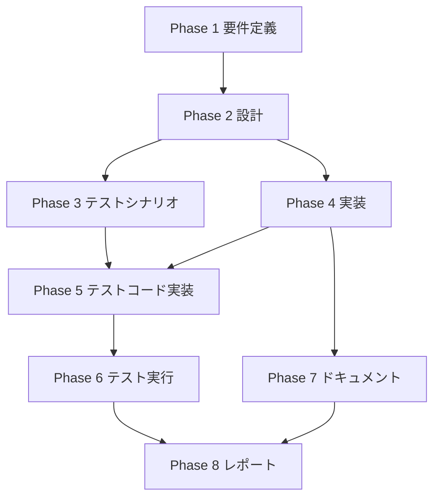

# Codex Agent 実行ログ

開始日時: 2025/11/3 1:40:36

---

## Turn 1: スレッド開始

**Thread ID**: `019a475f-9206-7503-9867-8f278e229db9`

## Turn 2: ツール実行

**種別**: コマンド実行
**コマンド**: `bash -lc 'cat .ai-workflow/issue-119/00_planning/output/planning.md'`
**ステータス**: completed (exit_code=0)

```text
# プロジェクト計画書 - Issue #119 フォローアップIssue生成品質の改善（LLM活用）

## 1. Issue分析
- **複雑度**: 複雑  
  - 新規AI連携モジュールの追加と既存GitHub連携コードの拡張を伴い、外部API統合・エラーハンドリング・フォールバック設計が必要。
  - テストレイヤーが複数（LLM呼び出しのモック検証と実APIを用いた統合テスト）に渡る。
- **見積もり工数**: 22~26時間  
  - 設計/要件整理: 6~7h、実装: 7~9h、テスト（設計＋実装＋実行）: 6~7h、ドキュメント/レポート: 3h を想定。
- **リスク評価**: 中  
  - LLM APIの不確定要素と生成品質の主観評価が残る一方、既存コードへの影響は限定範囲に収まる見込み。

## 2. 実装戦略判断
- **実装戦略**: EXTEND  
  - 既存の `issue-client.ts` を中心に機能拡張し、新たな `issue-ai-generator.ts` を追加してL TM生成ロジックを組み込む。全体構造は維持したまま責務分割を拡張。
- **テスト戦略**: UNIT_INTEGRATION  
  - プロンプト生成・フォールバック制御はモックを使ったユニットテストで網羅し、実API呼び出しは環境変数制御下で統合テストを追加して品質を確認。
- **テストコード戦略**: BOTH_TEST  
  - 既存フォローアップ生成ロジックのテストを拡張しつつ、新規 `issue-ai-generator` 用の専用テストファイルを新設する必要がある。

## 3. 影響範囲分析
- **既存コードへの影響**  
  - `src/core/github/issue-client.ts`: LLM優先フロー追加、フォールバック制御、ログ出力変更。  
  - `src/types.ts`: 新しいオプションインターフェースとIssue生成データ構造の拡張。  
  - `src/commands/execute/agent-setup.ts` などのクライアント初期化部: LLM設定引き回しが必要な場合は拡張。
- **依存関係の変更**  
  - 新規AIクライアント実装に伴う依存ライブラリ（公式SDK、HTTPクライアント）の追加検討。  
  - `.env` や設定ファイルにAPIキー/モデル指定を追加する可能性。
- **マイグレーション要否**  
  - コード上のマイグレーションは不要。  
  - 設定ファイル・ドキュメントへの追記（APIキー設定、プロンプトファイル）を行う。  
  - 将来的な `.ai-workflow/config.yml` 拡張を見据えた設計が必要。

## 4. タスク分割

### Phase 1: 要件定義 (見積もり: 3~4h)
- [ ] Task 1-1: 現行フォローアップIssue生成フローの分析 (1~1.5h)
  - `issue-client.ts` のタイトル/本文生成ロジックをシーケンス図レベルで整理
  - Evaluation Phase から渡る `RemainingTask` / `IssueContext` のデータフローを確認
- [ ] Task 1-2: LLM統合要件の明確化 (1.5~2h)
  - API利用要件（モデル、トークン制限、リトライ戦略）を洗い出す
  - 生成物の品質条件・受け入れ基準を仕様として文書化

### Phase 2: 設計 (見積もり: 4~5h)
- [ ] Task 2-1: issue-ai-generatorモジュール設計 (2~2.5h)
  - クラス/関数責務、依存注入方法、フォールバックパスを設計
  - プロンプトテンプレートとレスポンス検証手順を定義
- [ ] Task 2-2: 設定・エラーハンドリング設計 (2~2.5h)
  - API鍵の取得経路とマスキング方針を決定
  - レート制限、タイムアウト、再試行ポリシーの設計

### Phase 3: テストシナリオ (見積もり: 2~3h)
- [ ] Task 3-1: テストケース設計 (2~3h)
  - ユニットテスト（成功/失敗/フォールバック/プロンプト検証）のケースを網羅化
  - 統合テストで確認すべきシナリオ（実API、環境変数制御、レスポンス妥当性）を整理

### Phase 4: 実装 (見積もり: 6~7h)
- [ ] Task 4-1: issue-ai-generator.ts の実装 (2.5~3h)
  - プロンプト生成、API呼び出し、レスポンス整形、エラーハンドリングを実装
  - ログとトレース情報（入力長、エラー理由）を追加
- [ ] Task 4-2: issue-client.ts のLLM統合 (2~2.5h)
  - 新モジュール呼び出しとフォールバック制御を実装
  - LLM無効化オプションやテレメトリ用ログを追加
- [ ] Task 4-3: 型/設定まわりの拡張 (1.5~2h)
  - `types.ts` と設定ファイルにオプションを追加
  - エージェント初期化・CLIオプションでのフラグ引き回しを反映

### Phase 5: テストコード実装 (見積もり: 4~5h)
- [ ] Task 5-1: ユニットテスト実装 (2~2.5h)
  - issue-ai-generator用モックテストを作成
  - フォールバック動作とプロンプト生成の検証テストを追加
- [ ] Task 5-2: 統合テスト準備・実装 (2~2.5h)
  - 実API利用テストを環境変数制御で実行できるよう整備
  - テストデータ、レート制限保護の仕組み（スキップ条件等）を実装

### Phase 6: テスト実行 (見積もり: 2~3h)
- [ ] Task 6-1: テスト実行と結果分析 (2~3h)
  - ユニット/統合テストを実行し、失敗ケースを分析
  - ログと生成結果をサンプルIssueと比較して品質を確認

### Phase 7: ドキュメント (見積もり: 2h)
- [ ] Task 7-1: ドキュメント更新 (2h)
  - `ARCHITECTURE.md`, `CLAUDE.md` にLLM統合方針・利用手順を追記
  - APIキー設定手順や設定例をREADME系ドキュメントに反映

### Phase 8: レポート (見積もり: 1~1.5h)
- [ ] Task 8-1: 成果物サマリーとフォローアップ (1~1.5h)
  - 実装差分、テスト結果、残課題をレポートにまとめる
  - 次フェーズ向けの改善案や運用上の注意点を記録

## 5. 依存関係


## 6. リスクと軽減策
#### リスク1: LLM APIのレート制限・エラー多発
- **影響度**: 中
- **確率**: 中
- **軽減策**: リトライ/指数バックオフを実装し、フォールバックを即時に発動できるようにする。統合テストではAPI呼び出し頻度を制限。

#### リスク2: 生成タイトル・本文の品質ばらつき
- **影響度**: 高
- **確率**: 中
- **軽減策**: プロンプトテンプレートをチューニングし、ユニットテストで最低限のセクション検証を実施。レビュー基準を明文化。

#### リスク3: 機密情報の誤送信
- **影響度**: 高
- **確率**: 低
- **軽減策**: フィルタリングレイヤーを設け、送信前にセンシティブなフィールドを除去。APIログに機密情報を残さない。

#### リスク4: 実API統合テストの不安定化
- **影響度**: 中
- **確率**: 中
- **軽減策**: 統合テストをオプトイン方式（環境変数ON時のみ実行）にし、失敗時はフォールバック確認テストを優先。

## 7. 品質ゲート
#### Phase 1: 要件定義
- [ ] LLM統合要件と生成品質基準が明文化されている
- [ ] セキュリティ・コスト要件が整理されている

#### Phase 2: 設計
- [ ] 実装戦略・テスト戦略・テストコード戦略の根拠が設計書に反映されている
- [ ] フォールバックフローとエラーハンドリングが設計されている

#### Phase 3: テストシナリオ
- [ ] 成功/失敗/フォールバックを網羅したテストケースが定義されている
- [ ] 実API統合テストの前提条件とスキップ条件が明記されている

#### Phase 4: 実装
- [ ] LLM統合コードがFeature flagで
... (truncated)
```

## Turn 3: ツール実行

**種別**: コマンド実行
**コマンド**: `bash -lc ls`
**ステータス**: completed (exit_code=0)

```text
ARCHITECTURE.md
CHANGELOG.md
CLAUDE.md
DOCKER_AUTH_SETUP.md
Dockerfile
Jenkinsfile
LICENSE
PROGRESS.md
README.md
ROADMAP.md
SETUP_TYPESCRIPT.md
TROUBLESHOOTING.md
dist
examples
jest.config.cjs
metadata.json.template
node_modules
package-lock.json
package.json
scripts
src
tests
tsconfig.json
tsconfig.test.json
```

## Turn 4: ツール実行

**種別**: コマンド実行
**コマンド**: `bash -lc 'head -n 80 ARCHITECTURE.md'`
**ステータス**: completed (exit_code=0)

```text
# アーキテクチャ概要 ― AI Workflow v2 (TypeScript)

このドキュメントでは、TypeScript 版 AI Workflow の構成、モジュール間の制御フロー、および Codex / Claude Code / GitHub との連携方法を説明します。

## 全体フロー

```
CLI (src/main.ts - 約118行に削減、v0.3.0でリファクタリング)
 ├─ runCli() … CLI エントリーポイント
 ├─ commander定義（コマンドルーティングのみ）
 ├─ reportFatalError() … 致命的エラー報告
 ├─ reportExecutionSummary() … 実行サマリー表示
 └─ isValidPhaseName() … フェーズ名バリデーション

src/commands/init.ts (Issue初期化コマンド処理)
 ├─ handleInitCommand() … Issue初期化コマンドハンドラ
 ├─ validateBranchName() … ブランチ名バリデーション（Git 命名規則チェック）
 ├─ resolveBranchName() … ブランチ名解決（カスタム or デフォルト）
 ├─ ★PR タイトル生成★ … Issueタイトルを取得し、PRタイトルとして使用（v0.3.0、Issue #73）
 └─ src/core/repository-utils.ts を利用（Issue URL解析、リポジトリパス解決）

src/commands/execute.ts (フェーズ実行コマンド処理 - ファサード、v0.3.1で27%削減、Issue #46)
 ├─ handleExecuteCommand() … フェーズ実行コマンドハンドラ（各モジュールへ委譲）
 ├─ 既存公開関数の再エクスポート
 │   ├─ executePhasesSequential (workflow-executor から)
 │   ├─ executePhasesFrom (workflow-executor から)
 │   ├─ createPhaseInstance (phase-factory から)
 │   ├─ resolvePresetName (そのまま保持)
 │   └─ getPresetPhases (そのまま保持)
 └─ 内部ヘルパー関数
     ├─ canResumeWorkflow (そのまま保持)
     ├─ loadExternalDocuments (そのまま保持)
     ├─ resetMetadata (そのまま保持)
     └─ reportExecutionSummary (そのまま保持)

src/commands/execute/options-parser.ts (CLIオプション解析、v0.3.1で追加、Issue #46)
 ├─ parseExecuteOptions() … ExecuteCommandOptions を正規化
 └─ validateExecuteOptions() … 相互排他オプションの検証

src/commands/execute/agent-setup.ts (エージェント初期化、v0.3.1で追加、Issue #46)
 ├─ setupAgentClients() … Codex/Claude クライアントの初期化
 └─ resolveAgentCredentials() … 認証情報のフォールバック処理

src/commands/execute/workflow-executor.ts (ワークフロー実行、v0.3.1で追加、Issue #46)
 ├─ executePhasesSequential() … フェーズの順次実行
 ├─ executePhasesFrom() … 特定フェーズからの実行
 └─ 依存関係順にフェーズを実行
      ├─ BasePhase.run()
      │    ├─ execute()    … エージェントで成果物生成
      │    ├─ review()     … 可能ならレビューサイクル実施
      │    └─ revise()     … オプション（自動修正）
      └─ GitManager による自動コミット / プッシュ（必要に応じて）

src/core/phase-factory.ts (フェーズインスタンス生成、v0.3.1で追加、Issue #46)
 └─ createPhaseInstance() … フェーズインスタンス生成（10フェーズ対応）

src/commands/review.ts (フェーズレビューコマンド処理)
 └─ handleReviewCommand() … メタデータを取得し、フェーズの状態を表示

src/commands/list-presets.ts (プリセット一覧表示コマンド処理)
 └─ listPresets() … 利用可能なプリセット一覧を表示

src/commands/rollback.ts (フェーズ差し戻しコマンド処理、v0.4.0、Issue #90で追加)
 ├─ handleRollbackCommand() … フェーズ差し戻しコマンドハンドラ
 ├─ validateRollbackOptions() … rollbackオプションのバリデーション（exported for testing）
 ├─ loadRollbackReason() … 差し戻し理由の読み込み（--reason, --reason-file, --interactive）（exported for testing）
 ├─ generateRollbackReasonMarkdown() … ROLLBACK_REASON.mdファイルの生成（exported for testing）
 ├─ getPhaseNumber() … フェーズ名から番号を取得するヘルパー（exported for testing）
 └─ MetadataManager拡張メソッドを利用
     ├─ setRollbackContext() … 差し戻しコンテキストの設定
     ├─ getRollbackContext() … 差し戻しコンテキストの取得
     ├─ clearRollbackContext() … 差し戻しコンテキストのクリア
     ├─ addRollbackHistory() … 差し戻し履歴の追加
     ├─ updatePhaseForRollback() … 差し戻し先フェーズのステータス更新
     └─ resetSubsequentPhases() … 後続フェーズのリセット

src/core/repository-utils.ts (リポジトリ関連ユーティリティ)
 ├─ parseIssueUrl() … GitHub Issue URLからリポジトリ情報を抽出
 ├─ resolveLocalRepoPath() … リポジトリ名からローカルパスを解決
 ├─ findWorkflowMetadata() … Issue番号から対応するメタデータを探索
```

## Turn 5: ツール実行

**種別**: コマンド実行
**コマンド**: `bash -lc 'mkdir -p .ai-workflow/issue-119/01_requirements/output'`
**ステータス**: completed (exit_code=0)

## Turn 6: ツール実行

**種別**: コマンド実行
**コマンド**: `bash -lc 'cat package.json'`
**ステータス**: completed (exit_code=0)

```text
{
  "name": "ai-workflow-agent",
  "version": "0.2.0",
  "description": "TypeScript-based AI workflow automation toolkit with dual-agent (Codex + Claude) support",
  "private": false,
  "type": "module",
  "bin": {
    "ai-workflow": "./dist/index.js"
  },
  "repository": {
    "type": "git",
    "url": "https://github.com/tielec/ai-workflow-agent.git"
  },
  "bugs": {
    "url": "https://github.com/tielec/ai-workflow-agent/issues"
  },
  "homepage": "https://github.com/tielec/ai-workflow-agent#readme",
  "keywords": [
    "ai",
    "workflow",
    "automation",
    "codex",
    "claude",
    "github",
    "jenkins",
    "pulumi",
    "typescript"
  ],
  "author": "TIELEC",
  "license": "MIT",
  "scripts": {
    "build": "tsc -p tsconfig.json && node ./scripts/copy-static-assets.mjs",
    "start": "tsx src/index.ts",
    "dev": "tsx watch src/index.ts",
    "test": "NODE_OPTIONS=--experimental-vm-modules jest",
    "test:unit": "NODE_OPTIONS=--experimental-vm-modules jest tests/unit",
    "test:integration": "NODE_OPTIONS=--experimental-vm-modules jest tests/integration",
    "test:coverage": "NODE_OPTIONS=--experimental-vm-modules jest --coverage",
    "monitor:tokens": "tsx scripts/monitor-token-detection.ts"
  },
  "dependencies": {
    "@anthropic-ai/claude-agent-sdk": "^0.1.14",
    "@octokit/rest": "^20.1.0",
    "chalk": "^5.3.0",
    "commander": "^12.1.0",
    "dotenv": "^16.4.5",
    "fs-extra": "^11.2.0",
    "minimatch": "^9.0.3",
    "openai": "^4.57.2",
    "simple-git": "^3.27.0",
    "yaml": "^2.5.0"
  },
  "devDependencies": {
    "@jest/globals": "^30.2.0",
    "@types/fs-extra": "^11.0.4",
    "@types/jest": "^30.0.0",
    "@types/minimatch": "^5.1.2",
    "@types/node": "^20.11.30",
    "jest": "^30.2.0",
    "jest-mock-extended": "^4.0.0",
    "ts-jest": "^29.4.5",
    "tsx": "^4.11.0",
    "typescript": "^5.6.3"
  }
}
```

## Turn 7: ツール実行

**種別**: file_change
**ステータス**: completed

## Turn 8: ツール実行

**種別**: コマンド実行
**コマンド**: `bash -lc 'cat .ai-workflow/issue-119/01_requirements/output/requirements.md'`
**ステータス**: completed (exit_code=0)

```text
# 要件定義書 - Issue #119 フォローアップIssue生成品質の改善（LLM活用）

## 0. Planning Documentの確認
- `00_planning/output/planning.md` に基づき、既存 `issue-client.ts` の責務を維持しつつ新規 `issue-ai-generator.ts` でLLM連携を拡張する「EXTEND」戦略を採用する。
- テストはモック中心のユニットテストと実APIを使用する統合テストの両輪（UNIT_INTEGRATION/BOTH_TEST）で実施し、フォールバック経路を含めて網羅する。
- 主なリスクはLLM API失敗・品質ばらつき・機密情報漏洩であり、リトライ／フォールバック、プロンプト検証、フィルタリングで軽減する。
- 想定工数は22〜26時間で、要件定義・設計・実装・テスト・ドキュメント更新までを段階的に進める。

## 1. 概要
既存のフォローアップIssue自動生成機能は、タイトルが一般的すぎて検索性が低く、本文も箇条書きのみで具体的な作業内容が伝わらない。また、元IssueやPRの背景情報が十分に反映されず、残タスクの意義や優先度が不明瞭である。  
本要件はLLMを統合してタイトルと本文の生成品質を向上させ、技術的背景や実行手順を含む実務的に活用できるフォローアップIssueを自動生成することを目的とする。  
これにより、開発チームは手動でIssueを整形する手間を削減し、残タスクの理解・着手が迅速化され、ワークフロー全体のスループット向上と品質担保が期待できる。

## 2. 機能要件
Issue本文に「## TODO」節は存在しないため、概要および提案解決策から抽出した要件を整理する。

| ID | 要件 | 詳細 | 優先度 |
| --- | --- | --- | --- |
| FR-1 | LLMを用いたインテリジェントタイトル生成 | `generateIntelligentTitle` 関数で元Issue・PR・残タスクの文脈を入力に、50〜80文字の技術的に明確なタイトルを生成する。タイトルは主要コンポーネントや指標（例: 対象モジュール、目標値）を含み、既存の単語分割ロジックより情報密度が高いこと。 | 高 |
| FR-2 | 構造化されたタスク本文生成 | `generateTaskDescription` が背景、目的、実行内容（ステップ・対象ファイル・テスト方法）、受け入れ基準、関連リソースをMarkdownセクションとして出力する。本文内で1ステップずつ実行指示を明示し、テスト手順と完了条件を含める。 | 高 |
| FR-3 | フォールバック制御 | LLM呼び出し失敗・タイムアウト・無効化設定時には既存の `generateFollowUpTitle` / `formatTaskDetails` を自動で利用し、処理を中断させない。フォールバック発動状況は警告ログで記録する。 | 高 |
| FR-4 | 設定オプションの拡張 | `IssueGenerationOptions` 等を通じてLLM有効化フラグ、モデル選択、タイムアウト、最大リトライ回数を指定できるようにし、CLIや環境変数から設定可能にする。デフォルト値は後方互換を保つ。 | 中 |
| FR-5 | ログと品質監視 | LLM呼び出し成功時は入力トークン長・モデル名・生成時間をDEBUGログに出力し、失敗時は原因と再試行状況をWARNログに記録する。ログには機密情報を含めない。 | 中 |

## 3. 非機能要件
- **パフォーマンス**: 単一タスクあたりのLLM呼び出しは平均15秒以内に完了し、タイムアウトは30秒以下に設定する。レート制限到達時は指数バックオフで最大3回までリトライする。
- **セキュリティ**: APIキーは環境変数で安全に読み込み、ログ・例外メッセージに出力しない。送信ペイロードから機密情報（トークン、クレデンシャル、個人情報）は除外するフィルタリング層を備える。
- **可用性・信頼性**: フォールバック経路はLLMが失敗しても100%動作し、呼び出し結果はエラー発生時に既存生成ロジックへ切り替える。リトライ失敗時は処理継続と警告発報を保証する。
- **保守性・拡張性**: LLM連携は `issue-ai-generator.ts` に集約し、将来的なモデル追加やプロンプト更新を局所化する。ユニットテスト・統合テストを追加し、既存カバレッジ水準を維持または向上させる。

## 4. 制約事項
- **技術的制約**: TypeScript（Node.js 20系想定）で実装し、既存CLIアーキテクチャと互換性を保つ。LLMクライアントは既存依存（`openai`、`@anthropic-ai/claude-agent-sdk`）を利用し、新規依存追加は最小限に留める。
- **リソース制約**: Planning成果物の見積もりに従い22〜26時間内で完了させる。開発リソースは既存チームのスプリント枠内に限定される。
- **ポリシー制約**: CLAUDE.md/ARCHITECTURE.md に準拠し、コーディング規約・ログポリシー・セキュリティポリシーを遵守する。API利用は組織のコスト管理指針に従い、不要な試行を抑制する。

## 5. 前提条件
- **システム環境**: Node.js 20.x、TypeScript 5.x、Jestベースのテスト環境、GitHub APIアクセス権限、LLM API（ClaudeまたはCodex/OpenAI）へのネットワーク接続。
- **依存コンポーネント**: 既存 `issue-client.ts`、`commands/execute/agent-setup.ts`、GitHub Issue作成フロー、`openai` / `@anthropic-ai/claude-agent-sdk` クライアント。
- **外部システム連携**: GitHub REST API、Claude/OpenAI API。APIキーは環境変数（例: `ANTHROPIC_API_KEY`, `OPENAI_API_KEY`）で提供される。

## 6. 受け入れ基準
- FR-1  
  - Given LLMが有効で必要な認証情報が設定されている  
  - When `generateIntelligentTitle` にIssue・PR・タスク文脈を渡して実行する  
  - Then 50〜80文字のタイトルが生成され、主要技術要素が含まれ、空文字や重複語が発生しない
- FR-2  
  - Given 残タスク情報とIssue/PRコンテキストが揃っている  
  - When `generateTaskDescription` を呼び出す  
  - Then 背景・目的・実行内容・受け入れ基準・関連リソースのMarkdownセクションがすべて出力され、実行内容にステップとテスト方法が含まれる
- FR-3  
  - Given LLM呼び出しがタイムアウトまたはエラーを返す  
  - When フォローアップIssue生成を行う  
  - Then 既存ロジックでタイトルと本文が生成され、WARNログにフォールバック理由が記録される
- FR-4  
  - Given CLI実行時にLLM関連オプションを指定する  
  - When フォローアップIssue生成を実行する  
  - Then 指定されたモデル・タイムアウト・リトライ設定が `issue-ai-generator` に反映され、設定が無効な場合はバリデーションエラーを返す
- FR-5  
  - Given LLM呼び出しが行われ、成功または失敗する  
  - When ログ出力を確認する  
  - Then 成功時にモデル名・処理時間等がDEBUGで、失敗時に原因と再試行情報がWARNで出力され、ログに機密情報が含まれない

## 7. スコープ外
- カスタムプロンプトをユーザーが任意に設定する機能（`.ai-workflow/config.yml` 拡張）は今回のスコープ外で将来検討とする。
- 生成されたIssue内容の人手レビュー・承認ワークフロー自動化は対象外。
- 英語以外の多言語サポートやプロジェクト固有テンプレートの自動切替は本フェーズでは扱わない。
```

## Turn 9: ツール実行

**種別**: コマンド実行
**コマンド**: `bash -lc 'nl -ba .ai-workflow/issue-119/01_requirements/output/requirements.md'`
**ステータス**: completed (exit_code=0)

```text
1	# 要件定義書 - Issue #119 フォローアップIssue生成品質の改善（LLM活用）
     2	
     3	## 0. Planning Documentの確認
     4	- `00_planning/output/planning.md` に基づき、既存 `issue-client.ts` の責務を維持しつつ新規 `issue-ai-generator.ts` でLLM連携を拡張する「EXTEND」戦略を採用する。
     5	- テストはモック中心のユニットテストと実APIを使用する統合テストの両輪（UNIT_INTEGRATION/BOTH_TEST）で実施し、フォールバック経路を含めて網羅する。
     6	- 主なリスクはLLM API失敗・品質ばらつき・機密情報漏洩であり、リトライ／フォールバック、プロンプト検証、フィルタリングで軽減する。
     7	- 想定工数は22〜26時間で、要件定義・設計・実装・テスト・ドキュメント更新までを段階的に進める。
     8	
     9	## 1. 概要
    10	既存のフォローアップIssue自動生成機能は、タイトルが一般的すぎて検索性が低く、本文も箇条書きのみで具体的な作業内容が伝わらない。また、元IssueやPRの背景情報が十分に反映されず、残タスクの意義や優先度が不明瞭である。  
    11	本要件はLLMを統合してタイトルと本文の生成品質を向上させ、技術的背景や実行手順を含む実務的に活用できるフォローアップIssueを自動生成することを目的とする。  
    12	これにより、開発チームは手動でIssueを整形する手間を削減し、残タスクの理解・着手が迅速化され、ワークフロー全体のスループット向上と品質担保が期待できる。
    13	
    14	## 2. 機能要件
    15	Issue本文に「## TODO」節は存在しないため、概要および提案解決策から抽出した要件を整理する。
    16	
    17	| ID | 要件 | 詳細 | 優先度 |
    18	| --- | --- | --- | --- |
    19	| FR-1 | LLMを用いたインテリジェントタイトル生成 | `generateIntelligentTitle` 関数で元Issue・PR・残タスクの文脈を入力に、50〜80文字の技術的に明確なタイトルを生成する。タイトルは主要コンポーネントや指標（例: 対象モジュール、目標値）を含み、既存の単語分割ロジックより情報密度が高いこと。 | 高 |
    20	| FR-2 | 構造化されたタスク本文生成 | `generateTaskDescription` が背景、目的、実行内容（ステップ・対象ファイル・テスト方法）、受け入れ基準、関連リソースをMarkdownセクションとして出力する。本文内で1ステップずつ実行指示を明示し、テスト手順と完了条件を含める。 | 高 |
    21	| FR-3 | フォールバック制御 | LLM呼び出し失敗・タイムアウト・無効化設定時には既存の `generateFollowUpTitle` / `formatTaskDetails` を自動で利用し、処理を中断させない。フォールバック発動状況は警告ログで記録する。 | 高 |
    22	| FR-4 | 設定オプションの拡張 | `IssueGenerationOptions` 等を通じてLLM有効化フラグ、モデル選択、タイムアウト、最大リトライ回数を指定できるようにし、CLIや環境変数から設定可能にする。デフォルト値は後方互換を保つ。 | 中 |
    23	| FR-5 | ログと品質監視 | LLM呼び出し成功時は入力トークン長・モデル名・生成時間をDEBUGログに出力し、失敗時は原因と再試行状況をWARNログに記録する。ログには機密情報を含めない。 | 中 |
    24	
    25	## 3. 非機能要件
    26	- **パフォーマンス**: 単一タスクあたりのLLM呼び出しは平均15秒以内に完了し、タイムアウトは30秒以下に設定する。レート制限到達時は指数バックオフで最大3回までリトライする。
    27	- **セキュリティ**: APIキーは環境変数で安全に読み込み、ログ・例外メッセージに出力しない。送信ペイロードから機密情報（トークン、クレデンシャル、個人情報）は除外するフィルタリング層を備える。
    28	- **可用性・信頼性**: フォールバック経路はLLMが失敗しても100%動作し、呼び出し結果はエラー発生時に既存生成ロジックへ切り替える。リトライ失敗時は処理継続と警告発報を保証する。
    29	- **保守性・拡張性**: LLM連携は `issue-ai-generator.ts` に集約し、将来的なモデル追加やプロンプト更新を局所化する。ユニットテスト・統合テストを追加し、既存カバレッジ水準を維持または向上させる。
    30	
    31	## 4. 制約事項
    32	- **技術的制約**: TypeScript（Node.js 20系想定）で実装し、既存CLIアーキテクチャと互換性を保つ。LLMクライアントは既存依存（`openai`、`@anthropic-ai/claude-agent-sdk`）を利用し、新規依存追加は最小限に留める。
    33	- **リソース制約**: Planning成果物の見積もりに従い22〜26時間内で完了させる。開発リソースは既存チームのスプリント枠内に限定される。
    34	- **ポリシー制約**: CLAUDE.md/ARCHITECTURE.md に準拠し、コーディング規約・ログポリシー・セキュリティポリシーを遵守する。API利用は組織のコスト管理指針に従い、不要な試行を抑制する。
    35	
    36	## 5. 前提条件
    37	- **システム環境**: Node.js 20.x、TypeScript 5.x、Jestベースのテスト環境、GitHub APIアクセス権限、LLM API（ClaudeまたはCodex/OpenAI）へのネットワーク接続。
    38	- **依存コンポーネント**: 既存 `issue-client.ts`、`commands/execute/agent-setup.ts`、GitHub Issue作成フロー、`openai` / `@anthropic-ai/claude-agent-sdk` クライアント。
    39	- **外部システム連携**: GitHub REST API、Claude/OpenAI API。APIキーは環境変数（例: `ANTHROPIC_API_KEY`, `OPENAI_API_KEY`）で提供される。
    40	
    41	## 6. 受け入れ基準
    42	- FR-1  
    43	  - Given LLMが有効で必要な認証情報が設定されている  
    44	  - When `generateIntelligentTitle` にIssue・PR・タスク文脈を渡して実行する  
    45	  - Then 50〜80文字のタイトルが生成され、主要技術要素が含まれ、空文字や重複語が発生しない
    46	- FR-2  
    47	  - Given 残タスク情報とIssue/PRコンテキストが揃っている  
    48	  - When `generateTaskDescription` を呼び出す  
    49	  - Then 背景・目的・実行内容・受け入れ基準・関連リソースのMarkdownセクションがすべて出力され、実行内容にステップとテスト方法が含まれる
    50	- FR-3  
    51	  - Given LLM呼び出しがタイムアウトまたはエラーを返す  
    52	  - When フォローアップIssue生成を行う  
    53	  - Then 既存ロジックでタイトルと本文が生成され、WARNログにフォールバック理由が記録される
    54	- FR-4  
    55	  - Given CLI実行時にLLM関連オプションを指定する  
    56	  - When フォローアップIssue生成を実行する  
    57	  - Then 指定されたモデル・タイムアウト・リトライ設定が `issue-ai-generator` に反映され、設定が無効な場合はバリデーションエラーを返す
    58	- FR-5  
    59	  - Given LLM呼び出しが行われ、成功または失敗する  
    60	  - When ログ出力を確認する  
    61	  - Then 成功時にモデル名・処理時間等がDEBUGで、失敗時に原因と再試行情報がWARNで出力され、ログに機密情報が含まれない
    62	
    63	## 7. スコープ外
    64	- カスタムプロンプトをユーザーが任意に設定する機能（`.ai-workflow/config.yml` 拡張）は今回のスコープ外で将来検討とする。
    65	- 生成されたIssue内容の人手レビュー・承認ワークフロー自動化は対象外。
... (truncated)
```

## Turn 10: ツール実行

**種別**: agent_message
**ステータス**: completed

## Turn 11: ツール実行

**種別**: todo_list
**ステータス**: completed

## Turn 12: 実行完了

**ステータス**: completed
**所要時間**: 183513ms
**ターン数**: N/A

---

**経過時間**: 183513ms
**開始**: 2025-11-03T01:40:36.919Z
**終了**: 2025-11-03T01:43:40.432Z