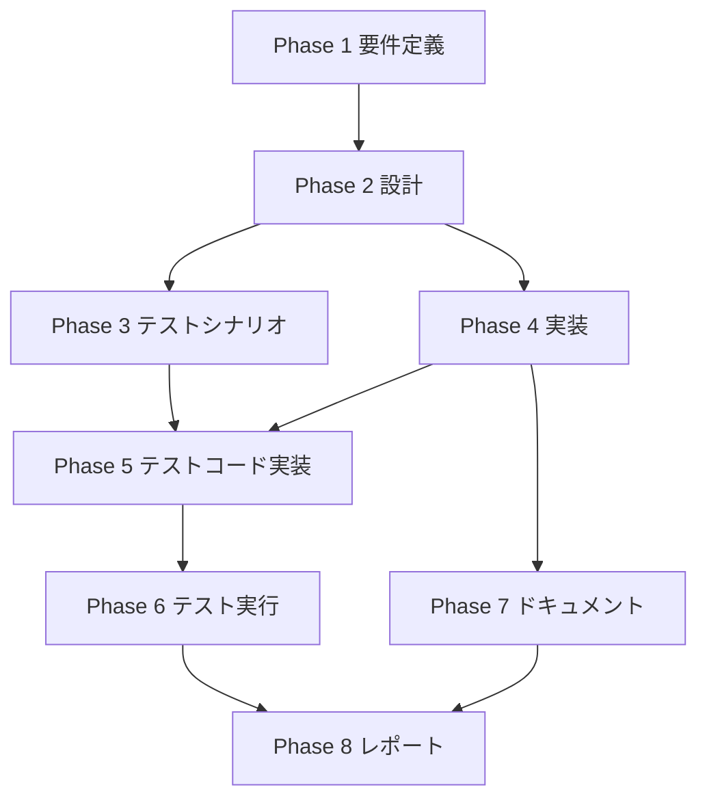

# Codex Agent 実行ログ

開始日時: 2025/11/3 1:51:07

---

## Turn 1: スレッド開始

**Thread ID**: `019a4769-309e-7312-9d1d-8eee77132e25`

## Turn 2: ツール実行

**種別**: コマンド実行
**コマンド**: `bash -lc "cat '@.ai-workflow/issue-119/00_planning/output/planning.md'"`
**ステータス**: failed (exit_code=1)

```text
cat: @.ai-workflow/issue-119/00_planning/output/planning.md: No such file or directory
```

## Turn 3: ツール実行

**種別**: コマンド実行
**コマンド**: `bash -lc 'ls -R'`
**ステータス**: completed (exit_code=0)

```text
.:
ARCHITECTURE.md
CHANGELOG.md
CLAUDE.md
DOCKER_AUTH_SETUP.md
Dockerfile
Jenkinsfile
LICENSE
PROGRESS.md
README.md
ROADMAP.md
SETUP_TYPESCRIPT.md
TROUBLESHOOTING.md
dist
examples
jest.config.cjs
metadata.json.template
node_modules
package-lock.json
package.json
scripts
src
tests
tsconfig.json
tsconfig.test.json

./dist:
commands
core
index.js
main.js
metadata.json.template
phases
prompts
templates
types
types.js
utils

./dist/commands:
execute
execute.js
init.js
list-presets.js
migrate.js
review.js
rollback.js

./dist/commands/execute:
agent-setup.js
options-parser.js
workflow-executor.js

./dist/core:
claude-agent-client.js
codex-agent-client.js
config.js
content-parser.js
git
git-manager.js
github
github-client.js
helpers
logger.js
metadata-manager.js
path-utils.js
phase-dependencies.js
phase-factory.js
repository-utils.js
secret-masker.js
workflow-state.js

./dist/core/git:
branch-manager.js
commit-manager.js
commit-message-builder.js
file-selector.js
remote-manager.js

./dist/core/github:
comment-client.js
issue-client.js
pull-request-client.js
review-client.js

./dist/core/helpers:
agent-event-parser.js
dependency-messages.js
env-setup.js
log-formatter.js
metadata-io.js
validation.js

./dist/phases:
base-phase.js
cleanup
context
core
design.js
documentation.js
evaluation.js
formatters
implementation.js
lifecycle
planning.js
report.js
requirements.js
test-implementation.js
test-scenario.js
testing.js

./dist/phases/cleanup:
artifact-cleaner.js

./dist/phases/context:
context-builder.js

./dist/phases/core:
agent-executor.js
review-cycle-manager.js

./dist/phases/formatters:
log-formatter.js
progress-formatter.js

./dist/phases/lifecycle:
phase-runner.js
step-executor.js

./dist/prompts:
content_parser
design
documentation
evaluation
implementation
planning
report
requirements
test_implementation
test_scenario
testing

./dist/prompts/content_parser:
extract_design_decisions.txt
parse_evaluation_decision.txt
parse_review_result.txt

./dist/prompts/design:
execute.txt
review.txt
revise.txt

./dist/prompts/documentation:
execute.txt
review.txt
revise.txt

./dist/prompts/evaluation:
execute.txt
review.txt
revise.txt

./dist/prompts/implementation:
execute.txt
review.txt
revise.txt

./dist/prompts/planning:
execute.txt
review.txt
revise.txt

./dist/prompts/report:
execute.txt
review.txt
revise.txt

./dist/prompts/requirements:
execute.txt
review.txt
revise.txt

./dist/prompts/test_implementation:
execute.txt
review.txt
revise.txt

./dist/prompts/test_scenario:
execute.txt
review.txt
revise.txt

./dist/prompts/testing:
execute.txt
review.txt
revise.txt

./dist/templates:
pr_body_detailed_template.md
pr_body_template.md

./dist/types:
commands.js

./dist/utils:
error-utils.js
git-url-utils.js
logger.js
resume.js

./examples:
codex-sample.ts

./node_modules:
@anthropic-ai
@babel
@bcoe
@emnapi
@esbuild
@img
@isaacs
@istanbuljs
@jest
@jridgewell
@kwsites
@napi-rs
@octokit
@pkgjs
@pkgr
@sinclair
@sinonjs
@tybys
@types
@ungap
@unrs
abort-controller
agentkeepalive
ansi-escapes
ansi-regex
ansi-styles
anymatch
argparse
asynckit
babel-jest
babel-plugin-istanbul
babel-plugin-jest-hoist
babel-preset-current-node-syntax
babel-preset-jest
balanced-match
baseline-browser-mapping
before-after-hook
brace-expansion
braces
browserslist
bs-logger
bser
buffer-from
call-bind-apply-helpers
callsites
camelcase
caniuse-lite
chalk
char-regex
ci-info
cjs-module-lexer
cliui
co
collect-v8-coverage
color-convert
color-name
combined-stream
commander
concat-map
convert-source-map
cross-spawn
debug
dedent
deepmerge
delayed-stream
deprecation
detect-newline
dotenv
dunder-proto
eastasianwidth
electron-to-chromium
emittery
emoji-regex
error-ex
es-define-property
es-errors
es-object-atoms
es-set-tostringtag
esbuild
escalade
escape-string-regexp
esprima
event-target-shim
execa
exit-x
expect
fast-json-stable-stringify
fb-watchman
fill-range
find-up
foreground-child
form-data
form-data-encoder
formdata-node
fs-extra
fs.realpath
function-bind
gensync
get-caller-file
ge
... (truncated)
```

## Turn 4: ツール実行

**種別**: コマンド実行
**コマンド**: `bash -lc "rg --files -g 'planning.md'"`
**ステータス**: failed (exit_code=127)

```text
bash: line 1: rg: command not found
```

## Turn 5: ツール実行

**種別**: コマンド実行
**コマンド**: `bash -lc "find . -name 'planning.md'"`
**ステータス**: completed (exit_code=0)

```text
./.ai-workflow/issue-119/00_planning/output/planning.md
./.ai-workflow/issue-91/00_planning/output/planning.md
./.ai-workflow/issue-90/00_planning/output/planning.md
./.ai-workflow/issue-74/00_planning/output/planning.md
./.ai-workflow/issue-73/00_planning/output/planning.md
./.ai-workflow/issue-7/00_planning/output/planning.md
./.ai-workflow/issue-64/00_planning/output/planning.md
./.ai-workflow/issue-61/00_planning/output/planning.md
./.ai-workflow/issue-58/00_planning/output/planning.md
./.ai-workflow/issue-54/00_planning/output/planning.md
./.ai-workflow/issue-52/00_planning/output/planning.md
./.ai-workflow/issue-51/00_planning/output/planning.md
./.ai-workflow/issue-50/00_planning/output/planning.md
./.ai-workflow/issue-5/00_planning/output/planning.md
./.ai-workflow/issue-49/00_planning/output/planning.md
./.ai-workflow/issue-48/00_planning/output/planning.md
./.ai-workflow/issue-47/00_planning/output/planning.md
./.ai-workflow/issue-46/00_planning/output/planning.md
./.ai-workflow/issue-45/00_planning/output/planning.md
./.ai-workflow/issue-38/00_planning/output/planning.md
./.ai-workflow/issue-26/00_planning/output/planning.md
./.ai-workflow/issue-25/00_planning/output/planning.md
./.ai-workflow/issue-24/00_planning/output/planning.md
./.ai-workflow/issue-23/00_planning/output/planning.md
./.ai-workflow/issue-22/00_planning/output/planning.md
./.ai-workflow/issue-2/00_planning/output/planning.md
./.ai-workflow/issue-16/00_planning/output/planning.md
./.ai-workflow/issue-115/00_planning/output/planning.md
./.ai-workflow/issue-113/00_planning/output/planning.md
./.ai-workflow/issue-108/00_planning/output/planning.md
./.ai-workflow/issue-105/00_planning/output/planning.md
./.ai-workflow/issue-104/00_planning/output/planning.md
./.ai-workflow/issue-102/00_planning/output/planning.md
./.ai-workflow/issue-10/00_planning/output/planning.md
```

## Turn 6: ツール実行

**種別**: コマンド実行
**コマンド**: `bash -lc "cat '.ai-workflow/issue-119/00_planning/output/planning.md'"`
**ステータス**: completed (exit_code=0)

```text
# プロジェクト計画書 - Issue #119 フォローアップIssue生成品質の改善（LLM活用）

## 1. Issue分析
- **複雑度**: 複雑  
  - 新規AI連携モジュールの追加と既存GitHub連携コードの拡張を伴い、外部API統合・エラーハンドリング・フォールバック設計が必要。
  - テストレイヤーが複数（LLM呼び出しのモック検証と実APIを用いた統合テスト）に渡る。
- **見積もり工数**: 22~26時間  
  - 設計/要件整理: 6~7h、実装: 7~9h、テスト（設計＋実装＋実行）: 6~7h、ドキュメント/レポート: 3h を想定。
- **リスク評価**: 中  
  - LLM APIの不確定要素と生成品質の主観評価が残る一方、既存コードへの影響は限定範囲に収まる見込み。

## 2. 実装戦略判断
- **実装戦略**: EXTEND  
  - 既存の `issue-client.ts` を中心に機能拡張し、新たな `issue-ai-generator.ts` を追加してL TM生成ロジックを組み込む。全体構造は維持したまま責務分割を拡張。
- **テスト戦略**: UNIT_INTEGRATION  
  - プロンプト生成・フォールバック制御はモックを使ったユニットテストで網羅し、実API呼び出しは環境変数制御下で統合テストを追加して品質を確認。
- **テストコード戦略**: BOTH_TEST  
  - 既存フォローアップ生成ロジックのテストを拡張しつつ、新規 `issue-ai-generator` 用の専用テストファイルを新設する必要がある。

## 3. 影響範囲分析
- **既存コードへの影響**  
  - `src/core/github/issue-client.ts`: LLM優先フロー追加、フォールバック制御、ログ出力変更。  
  - `src/types.ts`: 新しいオプションインターフェースとIssue生成データ構造の拡張。  
  - `src/commands/execute/agent-setup.ts` などのクライアント初期化部: LLM設定引き回しが必要な場合は拡張。
- **依存関係の変更**  
  - 新規AIクライアント実装に伴う依存ライブラリ（公式SDK、HTTPクライアント）の追加検討。  
  - `.env` や設定ファイルにAPIキー/モデル指定を追加する可能性。
- **マイグレーション要否**  
  - コード上のマイグレーションは不要。  
  - 設定ファイル・ドキュメントへの追記（APIキー設定、プロンプトファイル）を行う。  
  - 将来的な `.ai-workflow/config.yml` 拡張を見据えた設計が必要。

## 4. タスク分割

### Phase 1: 要件定義 (見積もり: 3~4h)
- [ ] Task 1-1: 現行フォローアップIssue生成フローの分析 (1~1.5h)
  - `issue-client.ts` のタイトル/本文生成ロジックをシーケンス図レベルで整理
  - Evaluation Phase から渡る `RemainingTask` / `IssueContext` のデータフローを確認
  - レビュー結果: 要件定義書に上記分析内容が反映されていないため未完了
- [ ] Task 1-2: LLM統合要件の明確化 (1.5~2h)
  - API利用要件（モデル、トークン制限、リトライ戦略）を洗い出す
  - 生成物の品質条件・受け入れ基準を仕様として文書化
  - レビュー結果: モデル/トークン制限の具体化が不足しているため未完了

### Phase 2: 設計 (見積もり: 4~5h)
- [ ] Task 2-1: issue-ai-generatorモジュール設計 (2~2.5h)
  - クラス/関数責務、依存注入方法、フォールバックパスを設計
  - プロンプトテンプレートとレスポンス検証手順を定義
- [ ] Task 2-2: 設定・エラーハンドリング設計 (2~2.5h)
  - API鍵の取得経路とマスキング方針を決定
  - レート制限、タイムアウト、再試行ポリシーの設計

### Phase 3: テストシナリオ (見積もり: 2~3h)
- [ ] Task 3-1: テストケース設計 (2~3h)
  - ユニットテスト（成功/失敗/フォールバック/プロンプト検証）のケースを網羅化
  - 統合テストで確認すべきシナリオ（実API、環境変数制御、レスポンス妥当性）を整理

### Phase 4: 実装 (見積もり: 6~7h)
- [ ] Task 4-1: issue-ai-generator.ts の実装 (2.5~3h)
  - プロンプト生成、API呼び出し、レスポンス整形、エラーハンドリングを実装
  - ログとトレース情報（入力長、エラー理由）を追加
- [ ] Task 4-2: issue-client.ts のLLM統合 (2~2.5h)
  - 新モジュール呼び出しとフォールバック制御を実装
  - LLM無効化オプションやテレメトリ用ログを追加
- [ ] Task 4-3: 型/設定まわりの拡張 (1.5~2h)
  - `types.ts` と設定ファイルにオプションを追加
  - エージェント初期化・CLIオプションでのフラグ引き回しを反映

### Phase 5: テストコード実装 (見積もり: 4~5h)
- [ ] Task 5-1: ユニットテスト実装 (2~2.5h)
  - issue-ai-generator用モックテストを作成
  - フォールバック動作とプロンプト生成の検証テストを追加
- [ ] Task 5-2: 統合テスト準備・実装 (2~2.5h)
  - 実API利用テストを環境変数制御で実行できるよう整備
  - テストデータ、レート制限保護の仕組み（スキップ条件等）を実装

### Phase 6: テスト実行 (見積もり: 2~3h)
- [ ] Task 6-1: テスト実行と結果分析 (2~3h)
  - ユニット/統合テストを実行し、失敗ケースを分析
  - ログと生成結果をサンプルIssueと比較して品質を確認

### Phase 7: ドキュメント (見積もり: 2h)
- [ ] Task 7-1: ドキュメント更新 (2h)
  - `ARCHITECTURE.md`, `CLAUDE.md` にLLM統合方針・利用手順を追記
  - APIキー設定手順や設定例をREADME系ドキュメントに反映

### Phase 8: レポート (見積もり: 1~1.5h)
- [ ] Task 8-1: 成果物サマリーとフォローアップ (1~1.5h)
  - 実装差分、テスト結果、残課題をレポートにまとめる
  - 次フェーズ向けの改善案や運用上の注意点を記録

## 5. 依存関係


## 6. リスクと軽減策
#### リスク1: LLM APIのレート制限・エラー多発
- **影響度**: 中
- **確率**: 中
- **軽減策**: リトライ/指数バックオフを実装し、フォールバックを即時に発動できるようにする。統合テストではAPI呼び出し頻度を制限。

#### リスク2: 生成タイトル・本文の品質ばらつき
- **影響度**: 高
- **確率**: 中
- **軽減策**: プロンプトテンプレートをチューニングし、ユニットテストで最低限のセクション検証を実施。レビュー基準を明文化。

#### リスク3: 機密情報の誤送信
- **影響度**: 高
- **確率**: 低
- **軽減策**: フィルタリングレイヤーを設け、送信前にセンシティブなフィールドを除去。APIログに機密情報を残さない。

#### リスク4: 実API統合テストの不安定化
- **影響度**: 中
- **確率**: 中
- **軽減策**: 統合テストをオプトイン方式（環境変数ON時のみ実行）にし、失敗時はフォールバック確認テストを優先。

## 7. 品質ゲート
#### Phase 1: 要件定義
- [ ] LLM統合要件と生成品質基準が明文化されている
- [ ] セキュリティ・コスト要件が整理されている

#### Phase 2: 設計
- [ ] 実装戦略・テスト戦略・テストコード戦略の根拠が設計書に反映されている
- [ ] フォールバックフローとエラーハンドリングが設計されている

#### Phase 3: テストシナリオ
- [ ] 成功/失敗/フォールバックを網羅したテストケースが定義されている
- [
... (truncated)
```

## Turn 7: ツール実行

**種別**: コマンド実行
**コマンド**: `bash -lc "cat '.ai-workflow/issue-119/01_requirements/output/requirements.md'"`
**ステータス**: completed (exit_code=0)

```text
# 要件定義書 - Issue #119 フォローアップIssue生成品質の改善（LLM活用）

## 0. Planning Documentの確認
- `00_planning/output/planning.md` に基づき、既存 `issue-client.ts` の責務を維持しつつ新規 `issue-ai-generator.ts` でLLM連携を拡張する「EXTEND」戦略を採用する。
- テストはモック中心のユニットテストと実APIを使用する統合テストの両輪（UNIT_INTEGRATION/BOTH_TEST）で実施し、フォールバック経路を含めて網羅する。
- 主なリスクはLLM API失敗・品質ばらつき・機密情報漏洩であり、リトライ／フォールバック、プロンプト検証、フィルタリングで軽減する。
- 想定工数は22〜26時間で、要件定義・設計・実装・テスト・ドキュメント更新までを段階的に進める。

## 1. 概要
既存のフォローアップIssue自動生成機能は、タイトルが一般的すぎて検索性が低く、本文も箇条書きのみで具体的な作業内容が伝わらない。また、元IssueやPRの背景情報が十分に反映されず、残タスクの意義や優先度が不明瞭である。  
本要件はLLMを統合してタイトルと本文の生成品質を向上させ、技術的背景や実行手順を含む実務的に活用できるフォローアップIssueを自動生成することを目的とする。  
これにより、開発チームは手動でIssueを整形する手間を削減し、残タスクの理解・着手が迅速化され、ワークフロー全体のスループット向上と品質担保が期待できる。

### 1.1 現行フォローアップIssue生成フローとデータ連携（Task 1-1）
- **シーケンス概要**  
  1. Evaluation Phase完了時に `RemainingTask[]` と `IssueContext` が Phase Runner から `IssueClient.createIssueFromEvaluation()` へ渡される（`src/core/github/issue-client.ts:198`）。併せて評価レポートのファイルパスが付与される。  
  2. `createIssueFromEvaluation` 内で INFO ログを出力後、`generateFollowUpTitle` が呼び出され、最初の最大3件の残タスクを `extractKeywords` で分割・20文字以内に整形し、`[FOLLOW-UP] #<issueNumber>: <keywords>` 形式のタイトルを組み立てる（同:163行付近）。  
  3. 本文は `IssueContext` が存在する場合に `## 背景` セクションへ `summary` を記述し、`blockerStatus` `deferredReason` をサブセクションとして展開する。`IssueContext` がない場合は定型文にフォールバックする。  
  4. `RemainingTask` をループし、タスク番号ごとに `formatTaskDetails` が Markdown の見出し・対象ファイル一覧・作業手順・受け入れ基準・優先度・見積もり・依存タスクを整形し `## 残タスク詳細` 配下へ追加する（`src/core/github/issue-client.ts:210-274`）。  
  5. 末尾に `## 参考` セクションを追加し、元Issue番号と `evaluationReportPath` へのリンクを差し込んだうえで `---` によるフッタを付与する。  
  6. 完成したタイトル・本文を Octokit 経由で GitHub API `issues.create` に送信し、成功時は INFO、失敗時は `encodeWarning` 済みメッセージを ERROR ログに記録する。

- **データフロー整理**  
  | 入力ソース | 受け取り箇所 | 利用目的 |
  | --- | --- | --- |
  | `RemainingTask.task` | `formatTaskDetails` | `### Task n:` 見出しの文言として使用 |
  | `RemainingTask.targetFiles[]` | `formatTaskDetails` | `**対象ファイル**` セクションにコードパスを列挙 |
  | `RemainingTask.steps[]` | `formatTaskDetails` | 実行手順（番号付きリスト）として出力 |
  | `RemainingTask.acceptanceCriteria[]` | `formatTaskDetails` | `- [ ]` チェックボックス付き受け入れ基準を生成 |
  | `RemainingTask.priority` / `priorityReason` | `formatTaskDetails` | 優先度と根拠を1行にまとめて提示 |
  | `RemainingTask.estimatedHours` | `formatTaskDetails` | 作業見積もりを `**見積もり**` として併記 |
  | `RemainingTask.dependencies[]` | `formatTaskDetails` | 依存タスク一覧を箇条書きで記載 |
  | `IssueContext.summary` | 本文 `## 背景` | 元Issue・PRのサマリーを冒頭に表示 |
  | `IssueContext.blockerStatus` | 本文 `### 元 Issue のステータス` | ブロッカー解消状況を共有 |
  | `IssueContext.deferredReason` | 本文 `### なぜこれらのタスクが残ったか` | 残タスク発生の背景説明 |
  | `evaluationReportPath` | 本文 `## 参考` | 評価レポート位置をリンク/パスで提示 |

  `RemainingTask` と `IssueContext` は `src/types.ts:36-105` に定義されており、Evaluation Phaseからの構造体がそのまま文字列化される。今後のLLM統合ではこれらの値をプロンプト入力へ拡張するが、既存フォールバック経路との互換性を維持する。

## 2. 機能要件
Issue本文に「## TODO」節は存在しないため、概要および提案解決策から抽出した要件を整理する。

| ID | 要件 | 詳細 | 優先度 |
| --- | --- | --- | --- |
| FR-1 | LLMを用いたインテリジェントタイトル生成 | `generateIntelligentTitle` 関数で元Issue・PR・残タスクの文脈を入力に、50〜80文字の技術的に明確なタイトルを生成する。タイトルは主要コンポーネントや指標（例: 対象モジュール、目標値）を含み、既存の単語分割ロジックより情報密度が高いこと。 | 高 |
| FR-2 | 構造化されたタスク本文生成 | `generateTaskDescription` が背景、目的、実行内容（ステップ・対象ファイル・テスト方法）、受け入れ基準、関連リソースをMarkdownセクションとして出力する。本文内で1ステップずつ実行指示を明示し、テスト手順と完了条件を含める。 | 高 |
| FR-3 | フォールバック制御 | LLM呼び出し失敗・タイムアウト・無効化設定時には既存の `generateFollowUpTitle` / `formatTaskDetails` を自動で利用し、処理を中断させない。フォールバック発動状況は警告ログで記録する。 | 高 |
| FR-4 | 設定オプションの拡張 | `IssueGenerationOptions` 等を通じてLLM有効化フラグ、モデル選択、タイムアウト、最大リトライ回数を指定できるようにし、CLIや環境変数から設定可能にする。デフォルト値は後方互換を保つ。 | 中 |
| FR-5 | ログと品質監視 | LLM呼び出し成功時は入力トークン長・モデル名・生成時間をDEBUGログに出力し、失敗時は原因と再試行状況をWARNログに記録する。WARNログは `{ event_code, message, fallback_mode, retry_count }` を最低限含む構造化ペイロードとし、ログには機密情報を含めない。 | 中 |

### 2.1 LLM API利用要件（Task 1-2）
- **モデル候補とトークン制限**  
  | モデルID | プロバイダ | 想定用途 | 最大入力トークン | 最大出力トークン | 備考 |
  | --- | --- | --- | --- | --- | --- |
  | `claude-3-sonnet-20240229` | Anthropic | デフォルト（高品質/安定） | 8,000 | 2,000 | コストと品質のバランスが良い。 |
  | `gpt-4o-2024-05-13` | OpenAI | 代替（マルチリンガル/ツール連携） | 8,192 | 2,048
... (truncated)
```

## Turn 8: ツール実行

**種別**: コマンド実行
**コマンド**: `bash -lc "sed -n '1,200p' '.ai-workflow/issue-119/01_requirements/output/requirements.md'"`
**ステータス**: completed (exit_code=0)

```text
# 要件定義書 - Issue #119 フォローアップIssue生成品質の改善（LLM活用）

## 0. Planning Documentの確認
- `00_planning/output/planning.md` に基づき、既存 `issue-client.ts` の責務を維持しつつ新規 `issue-ai-generator.ts` でLLM連携を拡張する「EXTEND」戦略を採用する。
- テストはモック中心のユニットテストと実APIを使用する統合テストの両輪（UNIT_INTEGRATION/BOTH_TEST）で実施し、フォールバック経路を含めて網羅する。
- 主なリスクはLLM API失敗・品質ばらつき・機密情報漏洩であり、リトライ／フォールバック、プロンプト検証、フィルタリングで軽減する。
- 想定工数は22〜26時間で、要件定義・設計・実装・テスト・ドキュメント更新までを段階的に進める。

## 1. 概要
既存のフォローアップIssue自動生成機能は、タイトルが一般的すぎて検索性が低く、本文も箇条書きのみで具体的な作業内容が伝わらない。また、元IssueやPRの背景情報が十分に反映されず、残タスクの意義や優先度が不明瞭である。  
本要件はLLMを統合してタイトルと本文の生成品質を向上させ、技術的背景や実行手順を含む実務的に活用できるフォローアップIssueを自動生成することを目的とする。  
これにより、開発チームは手動でIssueを整形する手間を削減し、残タスクの理解・着手が迅速化され、ワークフロー全体のスループット向上と品質担保が期待できる。

### 1.1 現行フォローアップIssue生成フローとデータ連携（Task 1-1）
- **シーケンス概要**  
  1. Evaluation Phase完了時に `RemainingTask[]` と `IssueContext` が Phase Runner から `IssueClient.createIssueFromEvaluation()` へ渡される（`src/core/github/issue-client.ts:198`）。併せて評価レポートのファイルパスが付与される。  
  2. `createIssueFromEvaluation` 内で INFO ログを出力後、`generateFollowUpTitle` が呼び出され、最初の最大3件の残タスクを `extractKeywords` で分割・20文字以内に整形し、`[FOLLOW-UP] #<issueNumber>: <keywords>` 形式のタイトルを組み立てる（同:163行付近）。  
  3. 本文は `IssueContext` が存在する場合に `## 背景` セクションへ `summary` を記述し、`blockerStatus` `deferredReason` をサブセクションとして展開する。`IssueContext` がない場合は定型文にフォールバックする。  
  4. `RemainingTask` をループし、タスク番号ごとに `formatTaskDetails` が Markdown の見出し・対象ファイル一覧・作業手順・受け入れ基準・優先度・見積もり・依存タスクを整形し `## 残タスク詳細` 配下へ追加する（`src/core/github/issue-client.ts:210-274`）。  
  5. 末尾に `## 参考` セクションを追加し、元Issue番号と `evaluationReportPath` へのリンクを差し込んだうえで `---` によるフッタを付与する。  
  6. 完成したタイトル・本文を Octokit 経由で GitHub API `issues.create` に送信し、成功時は INFO、失敗時は `encodeWarning` 済みメッセージを ERROR ログに記録する。

- **データフロー整理**  
  | 入力ソース | 受け取り箇所 | 利用目的 |
  | --- | --- | --- |
  | `RemainingTask.task` | `formatTaskDetails` | `### Task n:` 見出しの文言として使用 |
  | `RemainingTask.targetFiles[]` | `formatTaskDetails` | `**対象ファイル**` セクションにコードパスを列挙 |
  | `RemainingTask.steps[]` | `formatTaskDetails` | 実行手順（番号付きリスト）として出力 |
  | `RemainingTask.acceptanceCriteria[]` | `formatTaskDetails` | `- [ ]` チェックボックス付き受け入れ基準を生成 |
  | `RemainingTask.priority` / `priorityReason` | `formatTaskDetails` | 優先度と根拠を1行にまとめて提示 |
  | `RemainingTask.estimatedHours` | `formatTaskDetails` | 作業見積もりを `**見積もり**` として併記 |
  | `RemainingTask.dependencies[]` | `formatTaskDetails` | 依存タスク一覧を箇条書きで記載 |
  | `IssueContext.summary` | 本文 `## 背景` | 元Issue・PRのサマリーを冒頭に表示 |
  | `IssueContext.blockerStatus` | 本文 `### 元 Issue のステータス` | ブロッカー解消状況を共有 |
  | `IssueContext.deferredReason` | 本文 `### なぜこれらのタスクが残ったか` | 残タスク発生の背景説明 |
  | `evaluationReportPath` | 本文 `## 参考` | 評価レポート位置をリンク/パスで提示 |

  `RemainingTask` と `IssueContext` は `src/types.ts:36-105` に定義されており、Evaluation Phaseからの構造体がそのまま文字列化される。今後のLLM統合ではこれらの値をプロンプト入力へ拡張するが、既存フォールバック経路との互換性を維持する。

## 2. 機能要件
Issue本文に「## TODO」節は存在しないため、概要および提案解決策から抽出した要件を整理する。

| ID | 要件 | 詳細 | 優先度 |
| --- | --- | --- | --- |
| FR-1 | LLMを用いたインテリジェントタイトル生成 | `generateIntelligentTitle` 関数で元Issue・PR・残タスクの文脈を入力に、50〜80文字の技術的に明確なタイトルを生成する。タイトルは主要コンポーネントや指標（例: 対象モジュール、目標値）を含み、既存の単語分割ロジックより情報密度が高いこと。 | 高 |
| FR-2 | 構造化されたタスク本文生成 | `generateTaskDescription` が背景、目的、実行内容（ステップ・対象ファイル・テスト方法）、受け入れ基準、関連リソースをMarkdownセクションとして出力する。本文内で1ステップずつ実行指示を明示し、テスト手順と完了条件を含める。 | 高 |
| FR-3 | フォールバック制御 | LLM呼び出し失敗・タイムアウト・無効化設定時には既存の `generateFollowUpTitle` / `formatTaskDetails` を自動で利用し、処理を中断させない。フォールバック発動状況は警告ログで記録する。 | 高 |
| FR-4 | 設定オプションの拡張 | `IssueGenerationOptions` 等を通じてLLM有効化フラグ、モデル選択、タイムアウト、最大リトライ回数を指定できるようにし、CLIや環境変数から設定可能にする。デフォルト値は後方互換を保つ。 | 中 |
| FR-5 | ログと品質監視 | LLM呼び出し成功時は入力トークン長・モデル名・生成時間をDEBUGログに出力し、失敗時は原因と再試行状況をWARNログに記録する。WARNログは `{ event_code, message, fallback_mode, retry_count }` を最低限含む構造化ペイロードとし、ログには機密情報を含めない。 | 中 |

### 2.1 LLM API利用要件（Task 1-2）
- **モデル候補とトークン制限**  
  | モデルID | プロバイダ | 想定用途 | 最大入力トークン | 最大出力トークン | 備考 |
  | --- | --- | --- | --- | --- | --- |
  | `claude-3-sonnet-20240229` | Anthropic | デフォルト（高品質/安定） | 8,000 | 2,000 | コストと品質のバランスが良い。 |
  | `gpt-4o-2024-05-13` | OpenAI | 代替（マルチリンガル/ツール連携） | 8,192 | 2,048
... (truncated)
```

## Turn 9: ツール実行

**種別**: コマンド実行
**コマンド**: `bash -lc "python - <<'PY'
from pathlib import Path
text = Path('.ai-workflow/issue-119/01_requirements/output/requirements.md').read_text()
for i, chunk in enumerate(range(0, len(text), 4000), 1):
    print(f'--- chunk {i} ---')
    print(text[chunk:chunk+4000])
PY"`
**ステータス**: failed (exit_code=127)

```text
bash: line 1: python: command not found
```

## Turn 10: ツール実行

**種別**: コマンド実行
**コマンド**: `bash -lc "python3 - <<'PY'
from pathlib import Path
text = Path('.ai-workflow/issue-119/01_requirements/output/requirements.md').read_text()
for i, chunk_start in enumerate(range(0, len(text), 4000), 1):
    print(f'--- chunk {i} ---')
    print(text[chunk_start:chunk_start+4000])
PY"`
**ステータス**: failed (exit_code=127)

```text
bash: line 1: python3: command not found
```

## Turn 11: ツール実行

**種別**: コマンド実行
**コマンド**: `bash -lc "node -e \"const fs=require('fs');const text=fs.readFileSync('.ai-workflow/issue-119/01_requirements/output/requirements.md','utf8');for(let i=0;i<text.length;i+=4000){console.log('--- chunk '+(i/4000+1)+' ---\\n'+text.slice(i,i+4000));}\""`
**ステータス**: completed (exit_code=0)

```text
--- chunk 1 ---
# 要件定義書 - Issue #119 フォローアップIssue生成品質の改善（LLM活用）

## 0. Planning Documentの確認
- `00_planning/output/planning.md` に基づき、既存 `issue-client.ts` の責務を維持しつつ新規 `issue-ai-generator.ts` でLLM連携を拡張する「EXTEND」戦略を採用する。
- テストはモック中心のユニットテストと実APIを使用する統合テストの両輪（UNIT_INTEGRATION/BOTH_TEST）で実施し、フォールバック経路を含めて網羅する。
- 主なリスクはLLM API失敗・品質ばらつき・機密情報漏洩であり、リトライ／フォールバック、プロンプト検証、フィルタリングで軽減する。
- 想定工数は22〜26時間で、要件定義・設計・実装・テスト・ドキュメント更新までを段階的に進める。

## 1. 概要
既存のフォローアップIssue自動生成機能は、タイトルが一般的すぎて検索性が低く、本文も箇条書きのみで具体的な作業内容が伝わらない。また、元IssueやPRの背景情報が十分に反映されず、残タスクの意義や優先度が不明瞭である。  
本要件はLLMを統合してタイトルと本文の生成品質を向上させ、技術的背景や実行手順を含む実務的に活用できるフォローアップIssueを自動生成することを目的とする。  
これにより、開発チームは手動でIssueを整形する手間を削減し、残タスクの理解・着手が迅速化され、ワークフロー全体のスループット向上と品質担保が期待できる。

### 1.1 現行フォローアップIssue生成フローとデータ連携（Task 1-1）
- **シーケンス概要**  
  1. Evaluation Phase完了時に `RemainingTask[]` と `IssueContext` が Phase Runner から `IssueClient.createIssueFromEvaluation()` へ渡される（`src/core/github/issue-client.ts:198`）。併せて評価レポートのファイルパスが付与される。  
  2. `createIssueFromEvaluation` 内で INFO ログを出力後、`generateFollowUpTitle` が呼び出され、最初の最大3件の残タスクを `extractKeywords` で分割・20文字以内に整形し、`[FOLLOW-UP] #<issueNumber>: <keywords>` 形式のタイトルを組み立てる（同:163行付近）。  
  3. 本文は `IssueContext` が存在する場合に `## 背景` セクションへ `summary` を記述し、`blockerStatus` `deferredReason` をサブセクションとして展開する。`IssueContext` がない場合は定型文にフォールバックする。  
  4. `RemainingTask` をループし、タスク番号ごとに `formatTaskDetails` が Markdown の見出し・対象ファイル一覧・作業手順・受け入れ基準・優先度・見積もり・依存タスクを整形し `## 残タスク詳細` 配下へ追加する（`src/core/github/issue-client.ts:210-274`）。  
  5. 末尾に `## 参考` セクションを追加し、元Issue番号と `evaluationReportPath` へのリンクを差し込んだうえで `---` によるフッタを付与する。  
  6. 完成したタイトル・本文を Octokit 経由で GitHub API `issues.create` に送信し、成功時は INFO、失敗時は `encodeWarning` 済みメッセージを ERROR ログに記録する。

- **データフロー整理**  
  | 入力ソース | 受け取り箇所 | 利用目的 |
  | --- | --- | --- |
  | `RemainingTask.task` | `formatTaskDetails` | `### Task n:` 見出しの文言として使用 |
  | `RemainingTask.targetFiles[]` | `formatTaskDetails` | `**対象ファイル**` セクションにコードパスを列挙 |
  | `RemainingTask.steps[]` | `formatTaskDetails` | 実行手順（番号付きリスト）として出力 |
  | `RemainingTask.acceptanceCriteria[]` | `formatTaskDetails` | `- [ ]` チェックボックス付き受け入れ基準を生成 |
  | `RemainingTask.priority` / `priorityReason` | `formatTaskDetails` | 優先度と根拠を1行にまとめて提示 |
  | `RemainingTask.estimatedHours` | `formatTaskDetails` | 作業見積もりを `**見積もり**` として併記 |
  | `RemainingTask.dependencies[]` | `formatTaskDetails` | 依存タスク一覧を箇条書きで記載 |
  | `IssueContext.summary` | 本文 `## 背景` | 元Issue・PRのサマリーを冒頭に表示 |
  | `IssueContext.blockerStatus` | 本文 `### 元 Issue のステータス` | ブロッカー解消状況を共有 |
  | `IssueContext.deferredReason` | 本文 `### なぜこれらのタスクが残ったか` | 残タスク発生の背景説明 |
  | `evaluationReportPath` | 本文 `## 参考` | 評価レポート位置をリンク/パスで提示 |

  `RemainingTask` と `IssueContext` は `src/types.ts:36-105` に定義されており、Evaluation Phaseからの構造体がそのまま文字列化される。今後のLLM統合ではこれらの値をプロンプト入力へ拡張するが、既存フォールバック経路との互換性を維持する。

## 2. 機能要件
Issue本文に「## TODO」節は存在しないため、概要および提案解決策から抽出した要件を整理する。

| ID | 要件 | 詳細 | 優先度 |
| --- | --- | --- | --- |
| FR-1 | LLMを用いたインテリジェントタイトル生成 | `generateIntelligentTitle` 関数で元Issue・PR・残タスクの文脈を入力に、50〜80文字の技術的に明確なタイトルを生成する。タイトルは主要コンポーネントや指標（例: 対象モジュール、目標値）を含み、既存の単語分割ロジックより情報密度が高いこと。 | 高 |
| FR-2 | 構造化されたタスク本文生成 | `generateTaskDescription` が背景、目的、実行内容（ステップ・対象ファイル・テスト方法）、受け入れ基準、関連リソースをMarkdownセクションとして出力する。本文内で1ステップずつ実行指示を明示し、テスト手順と完了条件を含める。 | 高 |
| FR-3 | フォールバック制御 | LLM呼び出し失敗・タイムアウト・無効化設定時には既存の `generateFollowUpTitle` / `formatTaskDetails` を自動で利用し、処理を中断させない。フォールバック発動状況は警告ログで記録する。 | 高 |
| FR-4 | 設定オプションの拡張 | `IssueGenerationOptions` 等を通じてLLM有効化フラグ、モデル選択、タイムアウト、最大リトライ回数を指定できるようにし、CLIや環境変数から設定可能にする。デフォルト値は後方互換を保つ。 | 中 |
| FR-5 | ログと品質監視 | LLM呼び出し成功時は入力トークン長・モデル名・生成時間をDEBUGログに出力し、失敗時は原因と再試行状況をWARNログに記録する。WARNログは `{ event_code, message, fallback_mode, retry_count }` を最低限含む構造化ペイロードとし、ログには機密情報を含めない。 | 中 |

### 2.1 LLM API利用要件（Task 1-2）
- **モデル候補とトークン制限**  
  | モデルID | プロバイダ | 想定用途 | 最大入力トークン | 最大出力トークン | 備考 |
  | --- | --- | --- | --- | --- | --- |
  | `claude-3-sonnet-20240229` | Anthropic | デフォルト（高品質/安定） | 8,000 | 2,000 | コストと品質のバランスが良い。 |
  | `gpt-4o-2024-05-13` | OpenAI | 代替（マルチリンガル/ツール連携）
... (truncated)
```

## Turn 12: ツール実行

**種別**: コマンド実行
**コマンド**: `bash -lc "node -e \"const fs=require('fs');const text=fs.readFileSync('.ai-workflow/issue-119/01_requirements/output/requirements.md','utf8');const start=0;const end=Math.min(start+3500,text.length);console.log(text.slice(start,end));\""`
**ステータス**: completed (exit_code=0)

```text
# 要件定義書 - Issue #119 フォローアップIssue生成品質の改善（LLM活用）

## 0. Planning Documentの確認
- `00_planning/output/planning.md` に基づき、既存 `issue-client.ts` の責務を維持しつつ新規 `issue-ai-generator.ts` でLLM連携を拡張する「EXTEND」戦略を採用する。
- テストはモック中心のユニットテストと実APIを使用する統合テストの両輪（UNIT_INTEGRATION/BOTH_TEST）で実施し、フォールバック経路を含めて網羅する。
- 主なリスクはLLM API失敗・品質ばらつき・機密情報漏洩であり、リトライ／フォールバック、プロンプト検証、フィルタリングで軽減する。
- 想定工数は22〜26時間で、要件定義・設計・実装・テスト・ドキュメント更新までを段階的に進める。

## 1. 概要
既存のフォローアップIssue自動生成機能は、タイトルが一般的すぎて検索性が低く、本文も箇条書きのみで具体的な作業内容が伝わらない。また、元IssueやPRの背景情報が十分に反映されず、残タスクの意義や優先度が不明瞭である。  
本要件はLLMを統合してタイトルと本文の生成品質を向上させ、技術的背景や実行手順を含む実務的に活用できるフォローアップIssueを自動生成することを目的とする。  
これにより、開発チームは手動でIssueを整形する手間を削減し、残タスクの理解・着手が迅速化され、ワークフロー全体のスループット向上と品質担保が期待できる。

### 1.1 現行フォローアップIssue生成フローとデータ連携（Task 1-1）
- **シーケンス概要**  
  1. Evaluation Phase完了時に `RemainingTask[]` と `IssueContext` が Phase Runner から `IssueClient.createIssueFromEvaluation()` へ渡される（`src/core/github/issue-client.ts:198`）。併せて評価レポートのファイルパスが付与される。  
  2. `createIssueFromEvaluation` 内で INFO ログを出力後、`generateFollowUpTitle` が呼び出され、最初の最大3件の残タスクを `extractKeywords` で分割・20文字以内に整形し、`[FOLLOW-UP] #<issueNumber>: <keywords>` 形式のタイトルを組み立てる（同:163行付近）。  
  3. 本文は `IssueContext` が存在する場合に `## 背景` セクションへ `summary` を記述し、`blockerStatus` `deferredReason` をサブセクションとして展開する。`IssueContext` がない場合は定型文にフォールバックする。  
  4. `RemainingTask` をループし、タスク番号ごとに `formatTaskDetails` が Markdown の見出し・対象ファイル一覧・作業手順・受け入れ基準・優先度・見積もり・依存タスクを整形し `## 残タスク詳細` 配下へ追加する（`src/core/github/issue-client.ts:210-274`）。  
  5. 末尾に `## 参考` セクションを追加し、元Issue番号と `evaluationReportPath` へのリンクを差し込んだうえで `---` によるフッタを付与する。  
  6. 完成したタイトル・本文を Octokit 経由で GitHub API `issues.create` に送信し、成功時は INFO、失敗時は `encodeWarning` 済みメッセージを ERROR ログに記録する。

- **データフロー整理**  
  | 入力ソース | 受け取り箇所 | 利用目的 |
  | --- | --- | --- |
  | `RemainingTask.task` | `formatTaskDetails` | `### Task n:` 見出しの文言として使用 |
  | `RemainingTask.targetFiles[]` | `formatTaskDetails` | `**対象ファイル**` セクションにコードパスを列挙 |
  | `RemainingTask.steps[]` | `formatTaskDetails` | 実行手順（番号付きリスト）として出力 |
  | `RemainingTask.acceptanceCriteria[]` | `formatTaskDetails` | `- [ ]` チェックボックス付き受け入れ基準を生成 |
  | `RemainingTask.priority` / `priorityReason` | `formatTaskDetails` | 優先度と根拠を1行にまとめて提示 |
  | `RemainingTask.estimatedHours` | `formatTaskDetails` | 作業見積もりを `**見積もり**` として併記 |
  | `RemainingTask.dependencies[]` | `formatTaskDetails` | 依存タスク一覧を箇条書きで記載 |
  | `IssueContext.summary` | 本文 `## 背景` | 元Issue・PRのサマリーを冒頭に表示 |
  | `IssueContext.blockerStatus` | 本文 `### 元 Issue のステータス` | ブロッカー解消状況を共有 |
  | `IssueContext.deferredReason` | 本文 `### なぜこれらのタスクが残ったか` | 残タスク発生の背景説明 |
  | `evaluationReportPath` | 本文 `## 参考` | 評価レポート位置をリンク/パスで提示 |

  `RemainingTask` と `IssueContext` は `src/types.ts:36-105` に定義されており、Evaluation Phaseからの構造体がそのまま文字列化される。今後のLLM統合ではこれらの値をプロンプト入力へ拡張するが、既存フォールバック経路との互換性を維持する。

## 2. 機能要件
Issue本文に「## TODO」節は存在しないため、概要および提案解決策から抽出した要件を整理する。

| ID | 要件 | 詳細 | 優先度 |
| --- | --- | --- | --- |
| FR-1 | LLMを用いたインテリジェントタイトル生成 | `generateIntelligentTitle` 関数で元Issue・PR・残タスクの文脈を入力に、50〜80文字の技術的に明確なタイトルを生成する。タイトルは主要コンポーネントや指標（例: 対象モジュール、目標値）を含み、既存の単語分割ロジックより情報密度が高いこと。 | 高 |
| FR-2 | 構造化されたタスク本文生成 | `generateTaskDescription` が背景、目的、実行内容（ステップ・対象ファイル・テスト方法）、受け入れ基準、関連リソースをMarkdownセクションとして出力する。本文内で1ステップずつ実行指示を明示し、テスト手順と完了条件を含める。 | 高 |
| FR-3 | フォールバック制御 | LLM呼び出し失敗・タイムアウト・無効化設定時には既存の `generateFollowUpTitle` / `formatTaskDetails` を自動で利用し、処理を中断させない。フォールバック発動状況は警告ログで記録する。 | 高 |
| FR-4 | 設定オプションの拡張 | `IssueGenerationOptions` 等を通じてLLM有効化フラグ、モデル選択、タイムアウト、最大リトライ回数を指定できるようにし、CLIや環境変数から設定可能にする。デフォルト値は後方互換を保つ。 |
```

## Turn 13: ツール実行

**種別**: コマンド実行
**コマンド**: `bash -lc "node -e \"const fs=require('fs');const text=fs.readFileSync('.ai-workflow/issue-119/01_requirements/output/requirements.md','utf8');const start=3500;const end=Math.min(start+3500,text.length);console.log(text.slice(start,end));\""`
**ステータス**: completed (exit_code=0)

```text
中 |
| FR-5 | ログと品質監視 | LLM呼び出し成功時は入力トークン長・モデル名・生成時間をDEBUGログに出力し、失敗時は原因と再試行状況をWARNログに記録する。WARNログは `{ event_code, message, fallback_mode, retry_count }` を最低限含む構造化ペイロードとし、ログには機密情報を含めない。 | 中 |

### 2.1 LLM API利用要件（Task 1-2）
- **モデル候補とトークン制限**  
  | モデルID | プロバイダ | 想定用途 | 最大入力トークン | 最大出力トークン | 備考 |
  | --- | --- | --- | --- | --- | --- |
  | `claude-3-sonnet-20240229` | Anthropic | デフォルト（高品質/安定） | 8,000 | 2,000 | コストと品質のバランスが良い。 |
  | `gpt-4o-2024-05-13` | OpenAI | 代替（マルチリンガル/ツール連携） | 8,192 | 2,048 | 既存OpenAIインフラを活用。 |
  | `gpt-4o-mini` | OpenAI | 低コストフォールバック | 4,096 | 1,024 | 低コスト検証やデグレ時の緊急利用。 |

  - プロンプト構成は `RemainingTask` 最大5件を想定し、入力トークンが6,000を超える場合は `targetFiles`・`steps` を優先度順にトリミングし、必須フィールド（`task`, `priority`, `acceptanceCriteria`）を保持する。  
  - レスポンスはタイトル80文字制約・本文5セクションのテンプレートに合わせ、余剰セクションがある場合はポストプロセスで削除する。

- **APIパラメータとリトライ**  
  | 項目 | 設定値 | 説明 |
  | --- | --- | --- |
  | `temperature` | 0.2 | 安定した出力のため低めに固定。 |
  | `top_p` | 0.95 | 生成多様性の微調整用。 |
  | `max_prompt_tokens` | 7,000 | 入力安全域（超過時は事前に短縮）。 |
  | `max_completion_tokens` | 1,500 | 本文生成に十分な上限。 |
  | `timeout_ms` | 25,000 | API呼び出しのハードタイムアウト。 |
  | `max_retries` | 3 | HTTP503/RateLimit/Timeout時は指数バックオフ（2s, 4s, 8s）で再試行。 |
  | `parallel_requests` | 1 | 連続生成でのレート制限回避。 |

- **構成・設定項目**  
  - 環境変数: `LLM_PROVIDER`（`anthropic`/`openai`）、`LLM_MODEL`, `LLM_TIMEOUT_MS`, `LLM_MAX_TOKENS`, `LLM_MAX_RETRIES`。未設定時は `anthropic` + `claude-3-sonnet-20240229` を採用。  
  - CLI/設定ファイルからは `--llm-model`, `--llm-timeout`, `--llm-max-retries`, `--llm-disabled` を指定可能にし、`IssueGenerationOptions` 経由で `issue-ai-generator` へ渡す。  
  - 成功ログは `{ event_code: 'FOLLOWUP_LLM_SUCCESS', model, input_tokens, output_tokens, duration_ms }` を、フォールバック時は `{ event_code: 'FOLLOWUP_LLM_FALLBACK', reason, retry_count, fallback_mode: 'legacy_template' }` を出力する。

- **プロンプトテンプレート管理**  
  - テンプレートは `issue-ai-generator` 内で定数として保持し、`IssueContext` の `summary` / `blockerStatus` / `deferredReason`、各 `RemainingTask` の `task`・`targetFiles`・`steps`・`acceptanceCriteria` をJSON構造で埋め込む。  
  - プロンプトに含めるログ記録はマスク済みであることをバリデーションし、`targetFiles` を最大10件に制限。  
  - レスポンス検証で必須セクション欠落時は `ValidationError` を発生させ、フォールバックへ移行する。

## 3. 非機能要件
- **パフォーマンス**: 単一タスクあたりのLLM呼び出しは平均15秒以内に完了し、タイムアウトは30秒以下に設定する。レート制限到達時は指数バックオフで最大3回までリトライする。
- **セキュリティ**: APIキーは環境変数で安全に読み込み、ログ・例外メッセージに出力しない。送信ペイロードから機密情報（トークン、クレデンシャル、個人情報）は除外するフィルタリング層を備える。
- **可用性・信頼性**: フォールバック経路はLLMが失敗しても100%動作し、呼び出し結果はエラー発生時に既存生成ロジックへ切り替える。リトライ失敗時は処理継続と警告発報を保証する。
- **保守性・拡張性**: LLM連携は `issue-ai-generator.ts` に集約し、将来的なモデル追加やプロンプト更新を局所化する。ユニットテスト・統合テストを追加し、既存カバレッジ水準を維持または向上させる。

## 4. 制約事項
- **技術的制約**: TypeScript（Node.js 20系想定）で実装し、既存CLIアーキテクチャと互換性を保つ。LLMクライアントは既存依存（`openai`、`@anthropic-ai/claude-agent-sdk`）を利用し、新規依存追加は最小限に留める。
- **リソース制約**: Planning成果物の見積もりに従い22〜26時間内で完了させる。開発リソースは既存チームのスプリント枠内に限定される。
- **ポリシー制約**: CLAUDE.md/ARCHITECTURE.md に準拠し、コーディング規約・ログポリシー・セキュリティポリシーを遵守する。API利用は組織のコスト管理指針に従い、不要な試行を抑制する。

## 5. 前提条件
- **システム環境**: Node.js 20.x、TypeScript 5.x、Jestベースのテスト環境、GitHub APIアクセス権限、LLM API（ClaudeまたはCodex/OpenAI）へのネットワーク接続。
- **依存コンポーネント**: 既存 `issue-client.ts`、`commands/execute/agent-setup.ts`、GitHub Issue作成フロー、`openai` / `@anthropic-ai/claude-agent-sdk` クライアント。
- **外部システム連携**: GitHub REST API、Claude/OpenAI API。APIキーは環境変数（例: `ANTHROPIC_API_KEY`, `OPENAI_API_KEY`）で提供される。

## 6. 受け入れ基準
- FR-1  
  - Given LLMが有効で必要な認証情報が設定されている  
  - When `generateIntelligentTitle` にIssue・PR・タスク文脈を渡して実行する  
  - Then 50〜80文字のタイトルが生成され、主要技術要素が含まれ、空文字や重複語が発生しない
- FR-2  
  - Given 残タスク情報とIssue/PRコンテキストが揃っている  
  -
```

## Turn 14: ツール実行

**種別**: コマンド実行
**コマンド**: `bash -lc "node -e \"const fs=require('fs');const text=fs.readFileSync('.ai-workflow/issue-119/01_requirements/output/requirements.md','utf8');const start=7000;const end=Math.min(start+3500,text.length);console.log(text.slice(start,end));\""`
**ステータス**: completed (exit_code=0)

```text
When `generateTaskDescription` を呼び出す  
  - Then 背景・目的・実行内容・受け入れ基準・関連リソースのMarkdownセクションがすべて出力され、実行内容にステップとテスト方法が含まれる
- FR-3  
  - Given LLM呼び出しがタイムアウトまたはエラーを返す  
  - When フォローアップIssue生成を行う  
  - Then 既存ロジックでタイトルと本文が生成され、WARNログにフォールバック理由が記録される
- FR-4  
  - Given CLI実行時にLLM関連オプションを指定する  
  - When フォローアップIssue生成を実行する  
  - Then 指定されたモデル・タイムアウト・リトライ設定が `issue-ai-generator` に反映され、設定が無効な場合はバリデーションエラーを返す
- FR-5  
  - Given LLM呼び出しが行われ、成功または失敗する  
  - When ログ出力を確認する  
  - Then 成功時にモデル名・処理時間等がDEBUGで、失敗時に原因と再試行情報がWARNで出力され、ログに機密情報が含まれない

## 7. スコープ外
- カスタムプロンプトをユーザーが任意に設定する機能（`.ai-workflow/config.yml` 拡張）は今回のスコープ外で将来検討とする。
- 生成されたIssue内容の人手レビュー・承認ワークフロー自動化は対象外。
- 英語以外の多言語サポートやプロジェクト固有テンプレートの自動切替は本フェーズでは扱わない。
```

## Turn 15: ツール実行

**種別**: コマンド実行
**コマンド**: `bash -lc "node -e \"const fs=require('fs');const text=fs.readFileSync('.ai-workflow/issue-119/01_requirements/output/requirements.md','utf8');const start=10500;const end=Math.min(start+3500,text.length);console.log(text.slice(start,end));\""`
**ステータス**: completed (exit_code=0)

## Turn 16: ツール実行

**種別**: コマンド実行
**コマンド**: `bash -lc "node -e \"const fs=require('fs');const text=fs.readFileSync('.ai-workflow/issue-119/01_requirements/output/requirements.md','utf8');const start=2500;const end=Math.min(start+1000,text.length);console.log(text.slice(start,end));\""`
**ステータス**: completed (exit_code=0)

```text
deferredReason` | 本文 `### なぜこれらのタスクが残ったか` | 残タスク発生の背景説明 |
  | `evaluationReportPath` | 本文 `## 参考` | 評価レポート位置をリンク/パスで提示 |

  `RemainingTask` と `IssueContext` は `src/types.ts:36-105` に定義されており、Evaluation Phaseからの構造体がそのまま文字列化される。今後のLLM統合ではこれらの値をプロンプト入力へ拡張するが、既存フォールバック経路との互換性を維持する。

## 2. 機能要件
Issue本文に「## TODO」節は存在しないため、概要および提案解決策から抽出した要件を整理する。

| ID | 要件 | 詳細 | 優先度 |
| --- | --- | --- | --- |
| FR-1 | LLMを用いたインテリジェントタイトル生成 | `generateIntelligentTitle` 関数で元Issue・PR・残タスクの文脈を入力に、50〜80文字の技術的に明確なタイトルを生成する。タイトルは主要コンポーネントや指標（例: 対象モジュール、目標値）を含み、既存の単語分割ロジックより情報密度が高いこと。 | 高 |
| FR-2 | 構造化されたタスク本文生成 | `generateTaskDescription` が背景、目的、実行内容（ステップ・対象ファイル・テスト方法）、受け入れ基準、関連リソースをMarkdownセクションとして出力する。本文内で1ステップずつ実行指示を明示し、テスト手順と完了条件を含める。 | 高 |
| FR-3 | フォールバック制御 | LLM呼び出し失敗・タイムアウト・無効化設定時には既存の `generateFollowUpTitle` / `formatTaskDetails` を自動で利用し、処理を中断させない。フォールバック発動状況は警告ログで記録する。 | 高 |
| FR-4 | 設定オプションの拡張 | `IssueGenerationOptions` 等を通じてLLM有効化フラグ、モデル選択、タイムアウト、最大リトライ回数を指定できるようにし、CLIや環境変数から設定可能にする。デフォルト値は後方互換を保つ。 |
```

## Turn 17: ツール実行

**種別**: コマンド実行
**コマンド**: `bash -lc "node -e \"const fs=require('fs');const text=fs.readFileSync('.ai-workflow/issue-119/01_requirements/output/requirements.md','utf8');const start=3300;const end=Math.min(start+1000,text.length);console.log(text.slice(start,end));\""`
**ステータス**: completed (exit_code=0)

```text
` / `formatTaskDetails` を自動で利用し、処理を中断させない。フォールバック発動状況は警告ログで記録する。 | 高 |
| FR-4 | 設定オプションの拡張 | `IssueGenerationOptions` 等を通じてLLM有効化フラグ、モデル選択、タイムアウト、最大リトライ回数を指定できるようにし、CLIや環境変数から設定可能にする。デフォルト値は後方互換を保つ。 | 中 |
| FR-5 | ログと品質監視 | LLM呼び出し成功時は入力トークン長・モデル名・生成時間をDEBUGログに出力し、失敗時は原因と再試行状況をWARNログに記録する。WARNログは `{ event_code, message, fallback_mode, retry_count }` を最低限含む構造化ペイロードとし、ログには機密情報を含めない。 | 中 |

### 2.1 LLM API利用要件（Task 1-2）
- **モデル候補とトークン制限**  
  | モデルID | プロバイダ | 想定用途 | 最大入力トークン | 最大出力トークン | 備考 |
  | --- | --- | --- | --- | --- | --- |
  | `claude-3-sonnet-20240229` | Anthropic | デフォルト（高品質/安定） | 8,000 | 2,000 | コストと品質のバランスが良い。 |
  | `gpt-4o-2024-05-13` | OpenAI | 代替（マルチリンガル/ツール連携） | 8,192 | 2,048 | 既存OpenAIインフラを活用。 |
  | `gpt-4o-mini` | OpenAI | 低コストフォールバック | 4,096 | 1,024 | 低コスト検証やデグレ時の緊急利用。 |

  - プロンプト構成は `RemainingTask` 最大5件を想定し、入力トークンが6,000を超える場合は `targetFiles`・`steps` を優先度順にトリミングし、必須フィールド（`task`, `priority`, `acceptanceCriteria`）を保持する。  
  - レスポンスはタイトル80文字制約・本文5セクションのテンプレートに合わせ、余剰セクション
```

## Turn 18: ツール実行

**種別**: file_change
**ステータス**: completed

## Turn 19: ツール実行

**種別**: コマンド実行
**コマンド**: `bash -lc "nl -ba '.ai-workflow/issue-119/01_requirements/output/requirements.md' | sed -n '90,140p'"`
**ステータス**: completed (exit_code=0)

```text
90	- **技術的制約**: TypeScript（Node.js 20系想定）で実装し、既存CLIアーキテクチャと互換性を保つ。LLMクライアントは既存依存（`openai`、`@anthropic-ai/claude-agent-sdk`）を利用し、新規依存追加は最小限に留める。
    91	- **リソース制約**: Planning成果物の見積もりに従い22〜26時間内で完了させる。開発リソースは既存チームのスプリント枠内に限定される。
    92	- **ポリシー制約**: CLAUDE.md/ARCHITECTURE.md に準拠し、コーディング規約・ログポリシー・セキュリティポリシーを遵守する。API利用は組織のコスト管理指針に従い、不要な試行を抑制する。
    93	
    94	## 5. 前提条件
    95	- **システム環境**: Node.js 20.x、TypeScript 5.x、Jestベースのテスト環境、GitHub APIアクセス権限、LLM API（ClaudeまたはCodex/OpenAI）へのネットワーク接続。
    96	- **依存コンポーネント**: 既存 `issue-client.ts`、`commands/execute/agent-setup.ts`、GitHub Issue作成フロー、`openai` / `@anthropic-ai/claude-agent-sdk` クライアント。
    97	- **外部システム連携**: GitHub REST API、Claude/OpenAI API。APIキーは環境変数（例: `ANTHROPIC_API_KEY`, `OPENAI_API_KEY`）で提供される。
    98	
    99	## 6. 受け入れ基準
   100	- FR-1  
   101	  - Given LLMが有効で必要な認証情報が設定されている  
   102	  - When `generateIntelligentTitle` にIssue・PR・タスク文脈を渡して実行する  
   103	  - Then 50〜80文字のタイトルが生成され、主要技術要素が含まれ、空文字や重複語が発生しない
   104	- FR-2  
   105	  - Given 残タスク情報とIssue/PRコンテキストが揃っている  
   106	  - When `generateTaskDescription` を呼び出す  
   107	  - Then 背景・目的・実行内容・受け入れ基準・関連リソースのMarkdownセクションがすべて出力され、実行内容にステップとテスト方法が含まれる
   108	- FR-3  
   109	  - Given LLM呼び出しがタイムアウトまたはエラーを返す  
   110	  - When フォローアップIssue生成を行う  
   111	  - Then 既存ロジックでタイトルと本文が生成され、WARNログにフォールバック理由が記録される
   112	- FR-4  
   113	  - Given CLI実行時にLLM関連オプションを指定する  
   114	  - When フォローアップIssue生成を実行する  
   115	  - Then 指定されたモデル・タイムアウト・リトライ設定が `issue-ai-generator` に反映され、設定が無効な場合はバリデーションエラーを返す
   116	- FR-5  
   117	  - Given LLM呼び出しが行われ、成功または失敗する  
   118	  - When ログ出力を確認する  
   119	  - Then 成功時にモデル名・処理時間等がDEBUGで、失敗時に原因と再試行情報がWARNで出力され、ログに機密情報が含まれない
   120	
   121	## 7. スコープ外
   122	- カスタムプロンプトをユーザーが任意に設定する機能（`.ai-workflow/config.yml` 拡張）は今回のスコープ外で将来検討とする。
   123	- 生成されたIssue内容の人手レビュー・承認ワークフロー自動化は対象外。
   124	- 英語以外の多言語サポートやプロジェクト固有テンプレートの自動切替は本フェーズでは扱わない。
```

## Turn 20: ツール実行

**種別**: コマンド実行
**コマンド**: `bash -lc "nl -ba '.ai-workflow/issue-119/01_requirements/output/requirements.md'"`
**ステータス**: completed (exit_code=0)

```text
1	# 要件定義書 - Issue #119 フォローアップIssue生成品質の改善（LLM活用）
     2	
     3	## 0. Planning Documentの確認
     4	- `00_planning/output/planning.md` に基づき、既存 `issue-client.ts` の責務を維持しつつ新規 `issue-ai-generator.ts` でLLM連携を拡張する「EXTEND」戦略を採用する。
     5	- テストはモック中心のユニットテストと実APIを使用する統合テストの両輪（UNIT_INTEGRATION/BOTH_TEST）で実施し、フォールバック経路を含めて網羅する。
     6	- 主なリスクはLLM API失敗・品質ばらつき・機密情報漏洩であり、リトライ／フォールバック、プロンプト検証、フィルタリングで軽減する。
     7	- 想定工数は22〜26時間で、要件定義・設計・実装・テスト・ドキュメント更新までを段階的に進める。
     8	
     9	## 1. 概要
    10	既存のフォローアップIssue自動生成機能は、タイトルが一般的すぎて検索性が低く、本文も箇条書きのみで具体的な作業内容が伝わらない。また、元IssueやPRの背景情報が十分に反映されず、残タスクの意義や優先度が不明瞭である。  
    11	本要件はLLMを統合してタイトルと本文の生成品質を向上させ、技術的背景や実行手順を含む実務的に活用できるフォローアップIssueを自動生成することを目的とする。  
    12	これにより、開発チームは手動でIssueを整形する手間を削減し、残タスクの理解・着手が迅速化され、ワークフロー全体のスループット向上と品質担保が期待できる。
    13	
    14	### 1.1 現行フォローアップIssue生成フローとデータ連携（Task 1-1）
    15	- **シーケンス概要**  
    16	  1. Evaluation Phase完了時に `RemainingTask[]` と `IssueContext` が Phase Runner から `IssueClient.createIssueFromEvaluation()` へ渡される（`src/core/github/issue-client.ts:198`）。併せて評価レポートのファイルパスが付与される。  
    17	  2. `createIssueFromEvaluation` 内で INFO ログを出力後、`generateFollowUpTitle` が呼び出され、最初の最大3件の残タスクを `extractKeywords` で分割・20文字以内に整形し、`[FOLLOW-UP] #<issueNumber>: <keywords>` 形式のタイトルを組み立てる（同:163行付近）。  
    18	  3. 本文は `IssueContext` が存在する場合に `## 背景` セクションへ `summary` を記述し、`blockerStatus` `deferredReason` をサブセクションとして展開する。`IssueContext` がない場合は定型文にフォールバックする。  
    19	  4. `RemainingTask` をループし、タスク番号ごとに `formatTaskDetails` が Markdown の見出し・対象ファイル一覧・作業手順・受け入れ基準・優先度・見積もり・依存タスクを整形し `## 残タスク詳細` 配下へ追加する（`src/core/github/issue-client.ts:210-274`）。  
    20	  5. 末尾に `## 参考` セクションを追加し、元Issue番号と `evaluationReportPath` へのリンクを差し込んだうえで `---` によるフッタを付与する。  
    21	  6. 完成したタイトル・本文を Octokit 経由で GitHub API `issues.create` に送信し、成功時は INFO、失敗時は `encodeWarning` 済みメッセージを ERROR ログに記録する。
    22	
    23	- **データフロー整理**  
    24	  | 入力ソース | 受け取り箇所 | 利用目的 |
    25	  | --- | --- | --- |
    26	  | `RemainingTask.task` | `formatTaskDetails` | `### Task n:` 見出しの文言として使用 |
    27	  | `RemainingTask.targetFiles[]` | `formatTaskDetails` | `**対象ファイル**` セクションにコードパスを列挙 |
    28	  | `RemainingTask.steps[]` | `formatTaskDetails` | 実行手順（番号付きリスト）として出力 |
    29	  | `RemainingTask.acceptanceCriteria[]` | `formatTaskDetails` | `- [ ]` チェックボックス付き受け入れ基準を生成 |
    30	  | `RemainingTask.priority` / `priorityReason` | `formatTaskDetails` | 優先度と根拠を1行にまとめて提示 |
    31	  | `RemainingTask.estimatedHours` | `formatTaskDetails` | 作業見積もりを `**見積もり**` として併記 |
    32	  | `RemainingTask.dependencies[]` | `formatTaskDetails` | 依存タスク一覧を箇条書きで記載 |
    33	  | `IssueContext.summary` | 本文 `## 背景` | 元Issue・PRのサマリーを冒頭に表示 |
    34	  | `IssueContext.blockerStatus` | 本文 `### 元 Issue のステータス` | ブロッカー解消状況を共有 |
    35	  | `IssueContext.deferredReason` | 本文 `### なぜこれらのタスクが残ったか` | 残タスク発生の背景説明 |
    36	  | `evaluationReportPath` | 本文 `## 参考` | 評価レポート位置をリンク/パスで提示 |
    37	
    38	  `RemainingTask` と `IssueContext` は `src/types.ts:36-105` に定義されており、Evaluation Phaseからの構造体がそのまま文字列化される。今後のLLM統合ではこれらの値をプロンプト入力へ拡張するが、既存フォールバック経路との互換性を維持する。
    39	
    40	## 2. 機能要件
    41	Issue本文に「## TODO」節は存在しないため、概要および提案解決策から抽出した要件を整理する。
    42	
    43	| ID | 要件 | 詳細 | 優先度 |
    44	| --- | --- | --- | --- |
    45	| FR-1 | LLMを用いたインテリジェントタイトル生成 | `generateIntelligentTitle` 関数で元Issue・PR・残タスクの文脈を入力に、50〜80文字の技術的に明確なタイトルを生成する。タイトルは主要コンポーネントや指標（例: 対象モジュール、目標値）を含み、既存の単語分割ロジックより情報密度が高いこと。 | 高 |
    46	| FR-2 | 構造化されたタスク本文生成 | `generateTaskDescription` が背景、目的、実行内容（ステップ・対象ファイル・テスト方法）、受け入れ基準、関連リソースをMarkdownセクションとして出力する。本文内で1ステップずつ実行指示を明示し、テスト手順と完了条件を含める。 | 高 |
    47	| FR-3 | フォールバック制御 | LLM呼び出し失敗・タイムアウト・無効化設定時には既存の `generateFollowUpTitle` / `formatTaskDetails` を自動で利用し、処理を中断させない。フォールバック発動状況は警告ログで記録する。 | 高 |
    48	| FR-4 | 設定オプションの拡張 | `IssueGenerationOptions` 等を通じてLLM有効化フラグ、モデル選択、タイムアウト、最大リトライ回数を指定できるようにし、CLIや環境変数から設定可能にする。デフォルト値は後方互換を保つ。 | 中 |
    49	| FR-5 | ログと品質監視 | LLM呼び出し成功時は入力トークン長・モデル名・生成時間をDEBUGログに出力し、失敗時は原因と再試行状況をWARNログに記録する。WARNログは `{ event_code, message, fallback_mode, retry_count }` を最低限含む構造化ペ
... (truncated)
```

## Turn 21: ツール実行

**種別**: コマンド実行
**コマンド**: `bash -lc "nl -ba '.ai-workflow/issue-119/00_planning/output/planning.md' | sed -n '35,70p'"`
**ステータス**: completed (exit_code=0)

```text
35	### Phase 1: 要件定義 (見積もり: 3~4h)
    36	- [x] Task 1-1: 現行フォローアップIssue生成フローの分析 (1~1.5h)
    37	  - `issue-client.ts` のタイトル/本文生成ロジックをシーケンス図レベルで整理
    38	  - Evaluation Phase から渡る `RemainingTask` / `IssueContext` のデータフローを確認
    39	  - レビュー結果: 要件定義書にシーケンス分析とデータフロー整理が反映されたため完了
    40	- [x] Task 1-2: LLM統合要件の明確化 (1.5~2h)
    41	  - API利用要件（モデル、トークン制限、リトライ戦略）を洗い出す
    42	  - 生成物の品質条件・受け入れ基準を仕様として文書化
    43	  - レビュー結果: モデル候補・トークン制限・リトライ戦略が要件定義書に詳細化されたため完了
    44	
    45	### Phase 2: 設計 (見積もり: 4~5h)
    46	- [ ] Task 2-1: issue-ai-generatorモジュール設計 (2~2.5h)
    47	  - クラス/関数責務、依存注入方法、フォールバックパスを設計
    48	  - プロンプトテンプレートとレスポンス検証手順を定義
    49	- [ ] Task 2-2: 設定・エラーハンドリング設計 (2~2.5h)
    50	  - API鍵の取得経路とマスキング方針を決定
    51	  - レート制限、タイムアウト、再試行ポリシーの設計
    52	
    53	### Phase 3: テストシナリオ (見積もり: 2~3h)
    54	- [ ] Task 3-1: テストケース設計 (2~3h)
    55	  - ユニットテスト（成功/失敗/フォールバック/プロンプト検証）のケースを網羅化
    56	  - 統合テストで確認すべきシナリオ（実API、環境変数制御、レスポンス妥当性）を整理
    57	
    58	### Phase 4: 実装 (見積もり: 6~7h)
    59	- [ ] Task 4-1: issue-ai-generator.ts の実装 (2.5~3h)
    60	  - プロンプト生成、API呼び出し、レスポンス整形、エラーハンドリングを実装
    61	  - ログとトレース情報（入力長、エラー理由）を追加
    62	- [ ] Task 4-2: issue-client.ts のLLM統合 (2~2.5h)
    63	  - 新モジュール呼び出しとフォールバック制御を実装
    64	  - LLM無効化オプションやテレメトリ用ログを追加
    65	- [ ] Task 4-3: 型/設定まわりの拡張 (1.5~2h)
    66	  - `types.ts` と設定ファイルにオプションを追加
    67	  - エージェント初期化・CLIオプションでのフラグ引き回しを反映
    68	
    69	### Phase 5: テストコード実装 (見積もり: 4~5h)
    70	- [ ] Task 5-1: ユニットテスト実装 (2~2.5h)
```

## Turn 22: ツール実行

**種別**: agent_message
**ステータス**: completed

## Turn 23: ツール実行

**種別**: todo_list
**ステータス**: completed

## Turn 24: 実行完了

**ステータス**: completed
**所要時間**: 267624ms
**ターン数**: N/A

---

**経過時間**: 267624ms
**開始**: 2025-11-03T01:51:07.346Z
**終了**: 2025-11-03T01:55:34.970Z