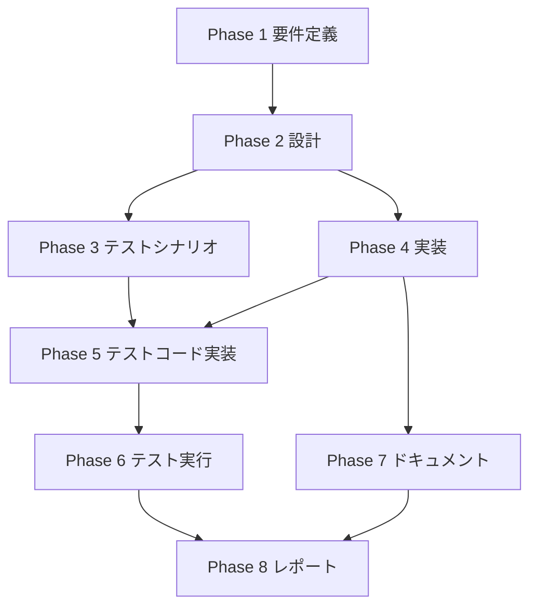

# Codex Agent 実行ログ

開始日時: 2025/11/3 1:47:18

---

## Turn 1: スレッド開始

**Thread ID**: `019a4765-b3b6-7383-bb5b-8a7cd656cd46`

## Turn 2: ツール実行

**種別**: コマンド実行
**コマンド**: `bash -lc 'cat .ai-workflow/issue-119/01_requirements/output/requirements.md'`
**ステータス**: completed (exit_code=0)

```text
# 要件定義書 - Issue #119 フォローアップIssue生成品質の改善（LLM活用）

## 0. Planning Documentの確認
- `00_planning/output/planning.md` に基づき、既存 `issue-client.ts` の責務を維持しつつ新規 `issue-ai-generator.ts` でLLM連携を拡張する「EXTEND」戦略を採用する。
- テストはモック中心のユニットテストと実APIを使用する統合テストの両輪（UNIT_INTEGRATION/BOTH_TEST）で実施し、フォールバック経路を含めて網羅する。
- 主なリスクはLLM API失敗・品質ばらつき・機密情報漏洩であり、リトライ／フォールバック、プロンプト検証、フィルタリングで軽減する。
- 想定工数は22〜26時間で、要件定義・設計・実装・テスト・ドキュメント更新までを段階的に進める。

## 1. 概要
既存のフォローアップIssue自動生成機能は、タイトルが一般的すぎて検索性が低く、本文も箇条書きのみで具体的な作業内容が伝わらない。また、元IssueやPRの背景情報が十分に反映されず、残タスクの意義や優先度が不明瞭である。  
本要件はLLMを統合してタイトルと本文の生成品質を向上させ、技術的背景や実行手順を含む実務的に活用できるフォローアップIssueを自動生成することを目的とする。  
これにより、開発チームは手動でIssueを整形する手間を削減し、残タスクの理解・着手が迅速化され、ワークフロー全体のスループット向上と品質担保が期待できる。

## 2. 機能要件
Issue本文に「## TODO」節は存在しないため、概要および提案解決策から抽出した要件を整理する。

| ID | 要件 | 詳細 | 優先度 |
| --- | --- | --- | --- |
| FR-1 | LLMを用いたインテリジェントタイトル生成 | `generateIntelligentTitle` 関数で元Issue・PR・残タスクの文脈を入力に、50〜80文字の技術的に明確なタイトルを生成する。タイトルは主要コンポーネントや指標（例: 対象モジュール、目標値）を含み、既存の単語分割ロジックより情報密度が高いこと。 | 高 |
| FR-2 | 構造化されたタスク本文生成 | `generateTaskDescription` が背景、目的、実行内容（ステップ・対象ファイル・テスト方法）、受け入れ基準、関連リソースをMarkdownセクションとして出力する。本文内で1ステップずつ実行指示を明示し、テスト手順と完了条件を含める。 | 高 |
| FR-3 | フォールバック制御 | LLM呼び出し失敗・タイムアウト・無効化設定時には既存の `generateFollowUpTitle` / `formatTaskDetails` を自動で利用し、処理を中断させない。フォールバック発動状況は警告ログで記録する。 | 高 |
| FR-4 | 設定オプションの拡張 | `IssueGenerationOptions` 等を通じてLLM有効化フラグ、モデル選択、タイムアウト、最大リトライ回数を指定できるようにし、CLIや環境変数から設定可能にする。デフォルト値は後方互換を保つ。 | 中 |
| FR-5 | ログと品質監視 | LLM呼び出し成功時は入力トークン長・モデル名・生成時間をDEBUGログに出力し、失敗時は原因と再試行状況をWARNログに記録する。ログには機密情報を含めない。 | 中 |

## 3. 非機能要件
- **パフォーマンス**: 単一タスクあたりのLLM呼び出しは平均15秒以内に完了し、タイムアウトは30秒以下に設定する。レート制限到達時は指数バックオフで最大3回までリトライする。
- **セキュリティ**: APIキーは環境変数で安全に読み込み、ログ・例外メッセージに出力しない。送信ペイロードから機密情報（トークン、クレデンシャル、個人情報）は除外するフィルタリング層を備える。
- **可用性・信頼性**: フォールバック経路はLLMが失敗しても100%動作し、呼び出し結果はエラー発生時に既存生成ロジックへ切り替える。リトライ失敗時は処理継続と警告発報を保証する。
- **保守性・拡張性**: LLM連携は `issue-ai-generator.ts` に集約し、将来的なモデル追加やプロンプト更新を局所化する。ユニットテスト・統合テストを追加し、既存カバレッジ水準を維持または向上させる。

## 4. 制約事項
- **技術的制約**: TypeScript（Node.js 20系想定）で実装し、既存CLIアーキテクチャと互換性を保つ。LLMクライアントは既存依存（`openai`、`@anthropic-ai/claude-agent-sdk`）を利用し、新規依存追加は最小限に留める。
- **リソース制約**: Planning成果物の見積もりに従い22〜26時間内で完了させる。開発リソースは既存チームのスプリント枠内に限定される。
- **ポリシー制約**: CLAUDE.md/ARCHITECTURE.md に準拠し、コーディング規約・ログポリシー・セキュリティポリシーを遵守する。API利用は組織のコスト管理指針に従い、不要な試行を抑制する。

## 5. 前提条件
- **システム環境**: Node.js 20.x、TypeScript 5.x、Jestベースのテスト環境、GitHub APIアクセス権限、LLM API（ClaudeまたはCodex/OpenAI）へのネットワーク接続。
- **依存コンポーネント**: 既存 `issue-client.ts`、`commands/execute/agent-setup.ts`、GitHub Issue作成フロー、`openai` / `@anthropic-ai/claude-agent-sdk` クライアント。
- **外部システム連携**: GitHub REST API、Claude/OpenAI API。APIキーは環境変数（例: `ANTHROPIC_API_KEY`, `OPENAI_API_KEY`）で提供される。

## 6. 受け入れ基準
- FR-1  
  - Given LLMが有効で必要な認証情報が設定されている  
  - When `generateIntelligentTitle` にIssue・PR・タスク文脈を渡して実行する  
  - Then 50〜80文字のタイトルが生成され、主要技術要素が含まれ、空文字や重複語が発生しない
- FR-2  
  - Given 残タスク情報とIssue/PRコンテキストが揃っている  
  - When `generateTaskDescription` を呼び出す  
  - Then 背景・目的・実行内容・受け入れ基準・関連リソースのMarkdownセクションがすべて出力され、実行内容にステップとテスト方法が含まれる
- FR-3  
  - Given LLM呼び出しがタイムアウトまたはエラーを返す  
  - When フォローアップIssue生成を行う  
  - Then 既存ロジックでタイトルと本文が生成され、WARNログにフォールバック理由が記録される
- FR-4  
  - Given CLI実行時にLLM関連オプションを指定する  
  - When フォローアップIssue生成を実行する  
  - Then 指定されたモデル・タイムアウト・リトライ設定が `issue-ai-generator` に反映され、設定が無効な場合はバリデーションエラーを返す
- FR-5  
  - Given LLM呼び出しが行われ、成功または失敗する  
  - When ログ出力を確認する  
  - Then 成功時にモデル名・処理時間等がDEBUGで、失敗時に原因と再試行情報がWARNで出力され、ログに機密情報が含まれない

## 7. スコープ外
- カスタムプロンプトをユーザーが任意に設定する機能（`.ai-workflow/config.yml` 拡張）は今回のスコープ外で将来検討とする。
- 生成されたIssue内容の人手レビュー・承認ワークフロー自動化は対象外。
- 英語以外の多言語サポートやプロジェクト固有テンプレートの自動切替は本フェーズでは扱わない。
```

## Turn 3: ツール実行

**種別**: コマンド実行
**コマンド**: `bash -lc "sed -n '30,120p' .ai-workflow/issue-119/00_planning/output/planning.md"`
**ステータス**: completed (exit_code=0)

```text
- 設定ファイル・ドキュメントへの追記（APIキー設定、プロンプトファイル）を行う。  
  - 将来的な `.ai-workflow/config.yml` 拡張を見据えた設計が必要。

## 4. タスク分割

### Phase 1: 要件定義 (見積もり: 3~4h)
- [ ] Task 1-1: 現行フォローアップIssue生成フローの分析 (1~1.5h)
  - `issue-client.ts` のタイトル/本文生成ロジックをシーケンス図レベルで整理
  - Evaluation Phase から渡る `RemainingTask` / `IssueContext` のデータフローを確認
  - レビュー結果: 要件定義書に上記分析内容が反映されていないため未完了
- [ ] Task 1-2: LLM統合要件の明確化 (1.5~2h)
  - API利用要件（モデル、トークン制限、リトライ戦略）を洗い出す
  - 生成物の品質条件・受け入れ基準を仕様として文書化
  - レビュー結果: モデル/トークン制限の具体化が不足しているため未完了

### Phase 2: 設計 (見積もり: 4~5h)
- [ ] Task 2-1: issue-ai-generatorモジュール設計 (2~2.5h)
  - クラス/関数責務、依存注入方法、フォールバックパスを設計
  - プロンプトテンプレートとレスポンス検証手順を定義
- [ ] Task 2-2: 設定・エラーハンドリング設計 (2~2.5h)
  - API鍵の取得経路とマスキング方針を決定
  - レート制限、タイムアウト、再試行ポリシーの設計

### Phase 3: テストシナリオ (見積もり: 2~3h)
- [ ] Task 3-1: テストケース設計 (2~3h)
  - ユニットテスト（成功/失敗/フォールバック/プロンプト検証）のケースを網羅化
  - 統合テストで確認すべきシナリオ（実API、環境変数制御、レスポンス妥当性）を整理

### Phase 4: 実装 (見積もり: 6~7h)
- [ ] Task 4-1: issue-ai-generator.ts の実装 (2.5~3h)
  - プロンプト生成、API呼び出し、レスポンス整形、エラーハンドリングを実装
  - ログとトレース情報（入力長、エラー理由）を追加
- [ ] Task 4-2: issue-client.ts のLLM統合 (2~2.5h)
  - 新モジュール呼び出しとフォールバック制御を実装
  - LLM無効化オプションやテレメトリ用ログを追加
- [ ] Task 4-3: 型/設定まわりの拡張 (1.5~2h)
  - `types.ts` と設定ファイルにオプションを追加
  - エージェント初期化・CLIオプションでのフラグ引き回しを反映

### Phase 5: テストコード実装 (見積もり: 4~5h)
- [ ] Task 5-1: ユニットテスト実装 (2~2.5h)
  - issue-ai-generator用モックテストを作成
  - フォールバック動作とプロンプト生成の検証テストを追加
- [ ] Task 5-2: 統合テスト準備・実装 (2~2.5h)
  - 実API利用テストを環境変数制御で実行できるよう整備
  - テストデータ、レート制限保護の仕組み（スキップ条件等）を実装

### Phase 6: テスト実行 (見積もり: 2~3h)
- [ ] Task 6-1: テスト実行と結果分析 (2~3h)
  - ユニット/統合テストを実行し、失敗ケースを分析
  - ログと生成結果をサンプルIssueと比較して品質を確認

### Phase 7: ドキュメント (見積もり: 2h)
- [ ] Task 7-1: ドキュメント更新 (2h)
  - `ARCHITECTURE.md`, `CLAUDE.md` にLLM統合方針・利用手順を追記
  - APIキー設定手順や設定例をREADME系ドキュメントに反映

### Phase 8: レポート (見積もり: 1~1.5h)
- [ ] Task 8-1: 成果物サマリーとフォローアップ (1~1.5h)
  - 実装差分、テスト結果、残課題をレポートにまとめる
  - 次フェーズ向けの改善案や運用上の注意点を記録

## 5. 依存関係


## 6. リスクと軽減策
#### リスク1: LLM APIのレート制限・エラー多発
- **影響度**: 中
- **確率**: 中
- **軽減策**: リトライ/指数バックオフを実装し、フォールバックを即時に発動できるようにする。統合テストではAPI呼び出し頻度を制限。

#### リスク2: 生成タイトル・本文の品質ばらつき
- **影響度**: 高
- **確率**: 中
- **軽減策**: プロンプトテンプレートをチューニングし、ユニットテストで最低限のセクション検証を実施。レビュー基準を明文化。

#### リスク3: 機密情報の誤送信
- **影響度**: 高
- **確率**: 低
- **軽減策**: フィルタリングレイヤーを設け、送信前にセンシティブなフィールドを除去。APIログに機密情報を残さない。
```

## Turn 4: ツール実行

**種別**: コマンド実行
**コマンド**: `bash -lc "sed -n '1,200p' src/core/github/issue-client.ts"`
**ステータス**: completed (exit_code=0)

```text
import { Octokit } from '@octokit/rest';
import { logger } from '../../utils/logger.js';
import { RequestError } from '@octokit/request-error';
import { getErrorMessage } from '../../utils/error-utils.js';
import { RemainingTask, IssueContext } from '../../types.js';

export interface IssueInfo {
  number: number;
  title: string;
  body: string;
  state: string;
  labels: string[];
  url: string;
  created_at: string;
  updated_at: string;
}

export interface CommentDict {
  id: number;
  user: string;
  body: string;
  created_at: string;
  updated_at: string;
}

export interface IssueCreationResult {
  success: boolean;
  issue_url: string | null;
  issue_number: number | null;
  error?: string | null;
}

export interface GenericResult {
  success: boolean;
  error?: string | null;
}

/**
 * IssueClient handles all Issue-related operations with GitHub API.
 * Responsibilities:
 * - Issue retrieval (getIssue, getIssueInfo)
 * - Issue comments retrieval (getIssueComments, getIssueCommentsDict)
 * - Comment posting (postComment)
 * - Issue closing (closeIssueWithReason)
 * - Follow-up issue creation (createIssueFromEvaluation)
 */
export class IssueClient {
  private readonly octokit: Octokit;
  private readonly owner: string;
  private readonly repo: string;

  constructor(octokit: Octokit, owner: string, repo: string) {
    this.octokit = octokit;
    this.owner = owner;
    this.repo = repo;
  }

  /**
   * Retrieves issue details from GitHub API.
   */
  public async getIssue(issueNumber: number) {
    const { data } = await this.octokit.issues.get({
      owner: this.owner,
      repo: this.repo,
      issue_number: issueNumber,
    });
    return data;
  }

  /**
   * Retrieves simplified issue information.
   */
  public async getIssueInfo(issueNumber: number): Promise<IssueInfo> {
    const issue = await this.getIssue(issueNumber);
    return {
      number: issue.number,
      title: issue.title ?? '',
      body: issue.body ?? '',
      state: issue.state ?? 'open',
      labels: (issue.labels ?? []).map((label) =>
        typeof label === 'string' ? label : label.name ?? '',
      ),
      url: issue.html_url ?? '',
      created_at: issue.created_at ?? new Date().toISOString(),
      updated_at: issue.updated_at ?? new Date().toISOString(),
    };
  }

  /**
   * Retrieves all comments for an issue.
   */
  public async getIssueComments(issueNumber: number) {
    const { data } = await this.octokit.issues.listComments({
      owner: this.owner,
      repo: this.repo,
      issue_number: issueNumber,
    });
    return data;
  }

  /**
   * Retrieves issue comments in dictionary format.
   */
  public async getIssueCommentsDict(issueNumber: number): Promise<CommentDict[]> {
    const comments = await this.getIssueComments(issueNumber);
    return comments.map((comment) => ({
      id: comment.id,
      user: comment.user?.login ?? 'unknown',
      body: comment.body ?? '',
      created_at: comment.created_at ?? '',
      updated_at: comment.updated_at ?? '',
    }));
  }

  /**
   * Posts a comment to an issue.
   */
  public async postComment(issueNumber: number, body: string) {
    const { data } = await this.octokit.issues.createComment({
      owner: this.owner,
      repo: this.repo,
      issue_number: issueNumber,
      body,
    });
    return data;
  }

  /**
   * Closes an issue with a reason comment.
   */
  public async closeIssueWithReason(issueNumber: number, reason: string): Promise<GenericResult> {
    try {
      await this.postComment(
        issueNumber,
        [
          '## ⚠️ ワークフロー中止',
          '',
          'プロジェクト評価の結果、致命的な問題が発見されたため、ワークフローを中止します。',
          '',
          '### 中止理由',
          '',
          reason,
          '',
          '### 推奨アクション',
          '',
          '- アーキテクチャの再設計',
          '- スコープの見直し',
          '- 技術選定の再検討',
          '',
          '---',
          '*AI Workflow Phase 9 (Evaluation) - ABORT*',
        ].join('\n'),
      );

      await this.octokit.iss
... (truncated)
```

## Turn 5: ツール実行

**種別**: コマンド実行
**コマンド**: `bash -lc "sed -n '200,400p' src/core/github/issue-client.ts"`
**ステータス**: completed (exit_code=0)

```text
if (keyword) {
        keywords.push(keyword);
      }
    }

    return keywords;
  }

  /**
   * フォローアップ Issue のタイトルを生成する
   *
   * @param issueNumber - 元 Issue 番号
   * @param remainingTasks - 残タスクのリスト
   * @returns Issue タイトル（80文字以内）
   */
  private generateFollowUpTitle(issueNumber: number, remainingTasks: RemainingTask[]): string {
    // キーワード抽出（最大3個）
    const keywords = this.extractKeywords(remainingTasks, 3);

    // キーワードが抽出できた場合
    if (keywords.length > 0) {
      const keywordsStr = keywords.join('・');
      const title = `[FOLLOW-UP] #${issueNumber}: ${keywordsStr}`;

      // 80文字制限
      if (title.length > 80) {
        return title.substring(0, 77) + '...';
      }

      return title;
    }

    // フォールバック: キーワードが抽出できない場合は従来形式
    return `[FOLLOW-UP] Issue #${issueNumber} - 残タスク`;
  }

  /**
   * 残タスクの詳細情報をフォーマットする
   *
   * @param task - 残タスク
   * @param taskNumber - タスク番号（1始まり）
   * @returns フォーマットされた行の配列
   */
  private formatTaskDetails(task: RemainingTask, taskNumber: number): string[] {
    const lines: string[] = [];

    // タスク見出し
    lines.push(`### Task ${taskNumber}: ${task.task}`, '');

    // 対象ファイル（存在する場合のみ）
    if (task.targetFiles && task.targetFiles.length > 0) {
      lines.push('**対象ファイル**:', '');
      task.targetFiles.forEach((file) => lines.push(`- \`${file}\``));
      lines.push('');
    }

    // 必要な作業（存在する場合のみ）
    if (task.steps && task.steps.length > 0) {
      lines.push('**必要な作業**:', '');
      task.steps.forEach((step, i) => lines.push(`${i + 1}. ${step}`));
      lines.push('');
    }

    // Acceptance Criteria（存在する場合のみ）
    if (task.acceptanceCriteria && task.acceptanceCriteria.length > 0) {
      lines.push('**Acceptance Criteria**:', '');
      task.acceptanceCriteria.forEach((ac) => lines.push(`- [ ] ${ac}`));
      lines.push('');
    }

    // Phase
    lines.push(`**Phase**: ${task.phase ?? 'unknown'}`, '');

    // 優先度 + 根拠
    const priority = task.priority ?? '中';
    const priorityLine = task.priorityReason
      ? `**優先度**: ${priority} - ${task.priorityReason}`
      : `**優先度**: ${priority}`;
    lines.push(priorityLine, '');

    // 見積もり工数
    lines.push(`**見積もり**: ${task.estimatedHours ?? '未定'}`, '');

    // 依存タスク（存在する場合のみ）
    if (task.dependencies && task.dependencies.length > 0) {
      lines.push('**依存タスク**:', '');
      task.dependencies.forEach((dep) => lines.push(`- ${dep}`));
      lines.push('');
    }

    lines.push('---'); // タスク間の区切り線

    return lines;
  }

  /**
   * Creates a follow-up issue from evaluation remaining tasks.
   *
   * @param issueNumber - 元 Issue 番号
   * @param remainingTasks - 残タスクのリスト
   * @param evaluationReportPath - Evaluation レポートのパス
   * @param issueContext - Issue コンテキスト（背景情報、オプショナル）
   * @returns Issue 作成結果
   */
  public async createIssueFromEvaluation(
    issueNumber: number,
    remainingTasks: RemainingTask[],
    evaluationReportPath: string,
    issueContext?: IssueContext,
  ): Promise<IssueCreationResult> {
    try {
      logger.info(`Creating follow-up issue for #${issueNumber} with ${remainingTasks.length} remaining tasks`);

      // タイトル生成
      const title = this.generateFollowUpTitle(issueNumber, remainingTasks);

      // 本文生成
      const lines: string[] = [];

      // 背景セクション（issueContext が存在する場合のみ）
      if (issueContext) {
        lines.push('## 背景', '');
        lines.push(issueContext.summary, '');

        if (issueContext.blockerStatus) {
          lines.push('### 元 Issue のステータス', '');
          lines.push(issueContext.blockerStatus, '');
        }

        if (issueContext.deferredReason) {
          lines.push('### なぜこれらのタスクが残ったか', '');
          lines.push(issueContext.deferredReason, '');
        }
      } else {
        // フォールバック: issueContext がない場合は従来形式
        lines.push('## 背景', '');
        lines.push(`AI Workflow Issue #${issueNumber} の評価フェーズで残タスクが見つかりました。`, '');
      }

      // 残タスク詳細セクション
      lines.push('## 残タスク詳細', '');

      for (let i = 0; i < remainingTasks.length; i++) {
... (truncated)
```

## Turn 6: ツール実行

**種別**: コマンド実行
**コマンド**: `bash -lc 'grep -n "RemainingTask" -n src/types.ts'`
**ステータス**: completed (exit_code=0)

```text
59:export interface RemainingTask {
112:  remaining_tasks: RemainingTask[];
231:  remainingTasks?: RemainingTask[];
```

## Turn 7: ツール実行

**種別**: コマンド実行
**コマンド**: `bash -lc "sed -n '59,140p' src/types.ts"`
**ステータス**: completed (exit_code=0)

```text
export interface RemainingTask {
  // ===== 既存フィールド（必須） =====
  /** タスクの説明 */
  task: string;

  /** 対象フェーズ（例: "implementation", "testing"） */
  phase: string;

  /** 優先度（例: "High", "Medium", "Low"） */
  priority: string;

  // ===== 新規フィールド（すべてオプショナル） =====

  /**
   * 優先度の理由
   * 例: "元 Issue #91 の推奨事項、ブロッカーではない"
   */
  priorityReason?: string;

  /**
   * 対象ファイル/モジュールのリスト
   * 例: ["src/core/phase-factory.ts", "src/commands/execute/agent-setup.ts"]
   */
  targetFiles?: string[];

  /**
   * 実行手順（番号付きリスト）
   * 例: ["不足しているテストケースを特定", "エッジケースのテストを追加"]
   */
  steps?: string[];

  /**
   * 受け入れ基準（Acceptance Criteria）
   * 例: ["すべての対象モジュールで 90% 以上のカバレッジを達成", "npm run test:coverage がすべてパス"]
   */
  acceptanceCriteria?: string[];

  /**
   * 依存タスク
   * 例: ["Task 1 完了後に実行", "Phase 4 の修正が必要"]
   */
  dependencies?: string[];

  /**
   * 見積もり工数
   * 例: "2-4h", "1日", "0.5h"
   */
  estimatedHours?: string;
}

export interface EvaluationPhaseMetadata extends PhaseMetadata {
  decision: string | null;
  failed_phase: PhaseName | null;
  remaining_tasks: RemainingTask[];
  created_issue_url: string | null;
  abort_reason: string | null;
}

export type PhasesMetadata = {
  [phase in Exclude<PhaseName, 'evaluation'>]: PhaseMetadata;
} & {
  evaluation: EvaluationPhaseMetadata;
};

export interface DesignDecisions {
  implementation_strategy: string | null;
  test_strategy: string | null;
  test_code_strategy: string | null;
  [key: string]: string | null;
}

export interface CostTracking {
  total_input_tokens: number;
  total_output_tokens: number;
  total_cost_usd: number;
}

/**
 * 対象リポジトリ情報
 */
export interface TargetRepository {
  /**
```

## Turn 8: ツール実行

**種別**: コマンド実行
**コマンド**: `bash -lc "sed -n '200,260p' src/types.ts"`
**ステータス**: completed (exit_code=0)

```text
decision?: string | null;
  approved?: boolean;       // レビュー承認フラグ（Issue #49）
  feedback?: string;        // レビューフィードバック（Issue #49）
}

export interface PhaseRunSummary {
  phases: PhaseName[];
  success: boolean;
  failed_phase?: PhaseName;
  error?: string;
  results: Record<
    PhaseName,
    {
      success: boolean;
      error?: string;
      output?: string | null;
    }
  >;
}

export interface GitCommandResult {
  success: boolean;
  error?: string;
  [key: string]: unknown;
}

export interface EvaluationDecisionResult {
  success: boolean;
  decision?: string;
  failedPhase?: PhaseName;
  abortReason?: string;
  remainingTasks?: RemainingTask[];
  error?: string;
}
```

## Turn 9: ツール実行

**種別**: コマンド実行
**コマンド**: `bash -lc 'rg "interface IssueContext" -n'`
**ステータス**: failed (exit_code=127)

```text
bash: line 1: rg: command not found
```

## Turn 10: ツール実行

**種別**: コマンド実行
**コマンド**: `bash -lc 'grep -R "interface IssueContext" -n'`
**ステータス**: completed (exit_code=0)

```text
src/types.ts:36:export interface IssueContext {
.ai-workflow/issue-119/00_planning/execute/agent_log.md:404:export interface IssueContext {
.ai-workflow/issue-119/00_planning/execute/agent_log_raw.txt:11:{"type":"item.completed","item":{"id":"item_3","type":"command_execution","command":"bash -lc \"sed -n '1,200p' src/types.ts\"","aggregated_output":"export type PhaseName =\n  | 'planning'\n  | 'requirements'\n  | 'design'\n  | 'test_scenario'\n  | 'implementation'\n  | 'test_implementation'\n  | 'testing'\n  | 'documentation'\n  | 'report'\n  | 'evaluation';\n\nexport type PhaseStatus = 'pending' | 'in_progress' | 'completed' | 'failed';\n\n// Issue #10: ステップ名の型定義\nexport type StepName = 'execute' | 'review' | 'revise';\n\nexport interface PhaseMetadata {\n  status: PhaseStatus;\n  retry_count: number;\n  started_at: string | null;\n  completed_at: string | null;\n  review_result: string | null;\n  output_files?: string[];\n  // Issue #10: ステップ単位の進捗管理\n  current_step?: StepName | null;  // 現在実行中のステップ（実行中でない場合はnull）\n  completed_steps?: StepName[];     // 完了済みステップの配列（実行順序を保持）\n  // Issue #90: 差し戻しコンテキスト（オプショナル）\n  rollback_context?: import('./types/commands.js').RollbackContext | null;\n}\n\n/**\n * フォローアップ Issue の背景コンテキスト\n * Evaluation Phase から IssueClient に渡される\n */\nexport interface IssueContext {\n  /**\n   * 元 Issue の概要\n   * 例: \"Issue #91 では、BasePhase モジュール分解（Issue #49）で発生した 15 件のテスト失敗を修正しました。\"\n   */\n  summary: string;\n\n  /**\n   * ブロッカーのステータス\n   * 例: \"すべてのブロッカーは解決済み\"\n   */\n  blockerStatus: string;\n\n  /**\n   * タスクが残った理由\n   * 例: \"テスト失敗修正を優先したため、カバレッジ改善は後回しにした\"\n   */\n  deferredReason: string;\n}\n\n/**\n * Evaluation Phase で検出された残タスク\n */\nexport interface RemainingTask {\n  // ===== 既存フィールド（必須） =====\n  /** タスクの説明 */\n  task: string;\n\n  /** 対象フェーズ（例: \"implementation\", \"testing\"） */\n  phase: string;\n\n  /** 優先度（例: \"High\", \"Medium\", \"Low\"） */\n  priority: string;\n\n  // ===== 新規フィールド（すべてオプショナル） =====\n\n  /**\n   * 優先度の理由\n   * 例: \"元 Issue #91 の推奨事項、ブロッカーではない\"\n   */\n  priorityReason?: string;\n\n  /**\n   * 対象ファイル/モジュールのリスト\n   * 例: [\"src/core/phase-factory.ts\", \"src/commands/execute/agent-setup.ts\"]\n   */\n  targetFiles?: string[];\n\n  /**\n   * 実行手順（番号付きリスト）\n   * 例: [\"不足しているテストケースを特定\", \"エッジケースのテストを追加\"]\n   */\n  steps?: string[];\n\n  /**\n   * 受け入れ基準（Acceptance Criteria）\n   * 例: [\"すべての対象モジュールで 90% 以上のカバレッジを達成\", \"npm run test:coverage がすべてパス\"]\n   */\n  acceptanceCriteria?: string[];\n\n  /**\n   * 依存タスク\n   * 例: [\"Task 1 完了後に実行\", \"Phase 4 の修正が必要\"]\n   */\n  dependencies?: string[];\n\n  /**\n   * 見積もり工数\n   * 例: \"2-4h\", \"1日\", \"0.5h\"\n   */\n  estimatedHours?: string;\n}\n\nexport interface EvaluationPhaseMetadata extends PhaseMetadata {\n  decision: string | null;\n  failed_phase: PhaseName | null;\n  remaining_tasks: RemainingTask[];\n  created_issue_url: string | null;\n  abort_reason: string | null;\n}\n\nexport type PhasesMetadata = {\n  [phase in Exclude<PhaseName, 'evaluation'>]: PhaseMetadata;\n} & {\n  evaluation: EvaluationPhaseMetadata;\n};\n\nexport interface DesignDecisions {\n  implementation_strategy: string | null;\n  test_strategy: string | null;\n  test_code_strategy: string | null;\n  [key: string]: string | null;\n}\n\nexport interface CostTracking {\n  total_input_tokens: number;\n  total_output_tokens: number;\n  total_cost_usd: number;\n}\n\n/**\n * 対象リポジトリ情報\n */\nexport interface TargetRepository {\n  /**\n   * ローカルパス\n   * 例: \"C:\\\\Users\\\\ytaka\\\\TIELEC\\\\development\\\\my-app\"\n   */\n  path: string;\n\n  /**\n   * GitHubリポジトリ名（owner/repo形式）\n   * 例: \"tielec/my-app\"\n   */\n  github_name: string;\n\n  /**\n   * Git remote URL\n   * 例: \"https://github.com/tielec/my-app.git\"\n   */\n  remote_url: string;\n\n  /**\n   * リポジトリオーナー\n   * 例: \"tielec\"\n   */\n  owner: string;\n\n  /**\n   * リポジトリ名\n   * 例: \"my-app\"\n   */\n  repo: string;\n}\n\nexport interface WorkflowMetadata {\n  issue_number: string;\n  issue_url: strin
... (truncated)
```

## Turn 11: ツール実行

**種別**: file_change
**ステータス**: completed

## Turn 12: ツール実行

**種別**: コマンド実行
**コマンド**: `bash -lc 'cat .ai-workflow/issue-119/01_requirements/output/requirements.md'`
**ステータス**: completed (exit_code=0)

```text
# 要件定義書 - Issue #119 フォローアップIssue生成品質の改善（LLM活用）

## 0. Planning Documentの確認
- `00_planning/output/planning.md` に基づき、既存 `issue-client.ts` の責務を維持しつつ新規 `issue-ai-generator.ts` でLLM連携を拡張する「EXTEND」戦略を採用する。
- テストはモック中心のユニットテストと実APIを使用する統合テストの両輪（UNIT_INTEGRATION/BOTH_TEST）で実施し、フォールバック経路を含めて網羅する。
- 主なリスクはLLM API失敗・品質ばらつき・機密情報漏洩であり、リトライ／フォールバック、プロンプト検証、フィルタリングで軽減する。
- 想定工数は22〜26時間で、要件定義・設計・実装・テスト・ドキュメント更新までを段階的に進める。

## 1. 概要
既存のフォローアップIssue自動生成機能は、タイトルが一般的すぎて検索性が低く、本文も箇条書きのみで具体的な作業内容が伝わらない。また、元IssueやPRの背景情報が十分に反映されず、残タスクの意義や優先度が不明瞭である。  
本要件はLLMを統合してタイトルと本文の生成品質を向上させ、技術的背景や実行手順を含む実務的に活用できるフォローアップIssueを自動生成することを目的とする。  
これにより、開発チームは手動でIssueを整形する手間を削減し、残タスクの理解・着手が迅速化され、ワークフロー全体のスループット向上と品質担保が期待できる。

### 1.1 現行フォローアップIssue生成フローとデータ連携（Task 1-1）
- **シーケンス概要**  
  1. Evaluation Phase完了時に `RemainingTask[]` と `IssueContext` が Phase Runner から `IssueClient.createIssueFromEvaluation()` へ渡される（`src/core/github/issue-client.ts:198`）。併せて評価レポートのファイルパスが付与される。  
  2. `createIssueFromEvaluation` 内で INFO ログを出力後、`generateFollowUpTitle` が呼び出され、最初の最大3件の残タスクを `extractKeywords` で分割・20文字以内に整形し、`[FOLLOW-UP] #<issueNumber>: <keywords>` 形式のタイトルを組み立てる（同:163行付近）。  
  3. 本文は `IssueContext` が存在する場合に `## 背景` セクションへ `summary` を記述し、`blockerStatus` `deferredReason` をサブセクションとして展開する。`IssueContext` がない場合は定型文にフォールバックする。  
  4. `RemainingTask` をループし、タスク番号ごとに `formatTaskDetails` が Markdown の見出し・対象ファイル一覧・作業手順・受け入れ基準・優先度・見積もり・依存タスクを整形し `## 残タスク詳細` 配下へ追加する（`src/core/github/issue-client.ts:210-274`）。  
  5. 末尾に `## 参考` セクションを追加し、元Issue番号と `evaluationReportPath` へのリンクを差し込んだうえで `---` によるフッタを付与する。  
  6. 完成したタイトル・本文を Octokit 経由で GitHub API `issues.create` に送信し、成功時は INFO、失敗時は `encodeWarning` 済みメッセージを ERROR ログに記録する。

- **データフロー整理**  
  | 入力ソース | 受け取り箇所 | 利用目的 |
  | --- | --- | --- |
  | `RemainingTask.task` | `formatTaskDetails` | `### Task n:` 見出しの文言として使用 |
  | `RemainingTask.targetFiles[]` | `formatTaskDetails` | `**対象ファイル**` セクションにコードパスを列挙 |
  | `RemainingTask.steps[]` | `formatTaskDetails` | 実行手順（番号付きリスト）として出力 |
  | `RemainingTask.acceptanceCriteria[]` | `formatTaskDetails` | `- [ ]` チェックボックス付き受け入れ基準を生成 |
  | `RemainingTask.priority` / `priorityReason` | `formatTaskDetails` | 優先度と根拠を1行にまとめて提示 |
  | `RemainingTask.estimatedHours` | `formatTaskDetails` | 作業見積もりを `**見積もり**` として併記 |
  | `RemainingTask.dependencies[]` | `formatTaskDetails` | 依存タスク一覧を箇条書きで記載 |
  | `IssueContext.summary` | 本文 `## 背景` | 元Issue・PRのサマリーを冒頭に表示 |
  | `IssueContext.blockerStatus` | 本文 `### 元 Issue のステータス` | ブロッカー解消状況を共有 |
  | `IssueContext.deferredReason` | 本文 `### なぜこれらのタスクが残ったか` | 残タスク発生の背景説明 |
  | `evaluationReportPath` | 本文 `## 参考` | 評価レポート位置をリンク/パスで提示 |

  `RemainingTask` と `IssueContext` は `src/types.ts:36-105` に定義されており、Evaluation Phaseからの構造体がそのまま文字列化される。今後のLLM統合ではこれらの値をプロンプト入力へ拡張するが、既存フォールバック経路との互換性を維持する。

## 2. 機能要件
Issue本文に「## TODO」節は存在しないため、概要および提案解決策から抽出した要件を整理する。

| ID | 要件 | 詳細 | 優先度 |
| --- | --- | --- | --- |
| FR-1 | LLMを用いたインテリジェントタイトル生成 | `generateIntelligentTitle` 関数で元Issue・PR・残タスクの文脈を入力に、50〜80文字の技術的に明確なタイトルを生成する。タイトルは主要コンポーネントや指標（例: 対象モジュール、目標値）を含み、既存の単語分割ロジックより情報密度が高いこと。 | 高 |
| FR-2 | 構造化されたタスク本文生成 | `generateTaskDescription` が背景、目的、実行内容（ステップ・対象ファイル・テスト方法）、受け入れ基準、関連リソースをMarkdownセクションとして出力する。本文内で1ステップずつ実行指示を明示し、テスト手順と完了条件を含める。 | 高 |
| FR-3 | フォールバック制御 | LLM呼び出し失敗・タイムアウト・無効化設定時には既存の `generateFollowUpTitle` / `formatTaskDetails` を自動で利用し、処理を中断させない。フォールバック発動状況は警告ログで記録する。 | 高 |
| FR-4 | 設定オプションの拡張 | `IssueGenerationOptions` 等を通じてLLM有効化フラグ、モデル選択、タイムアウト、最大リトライ回数を指定できるようにし、CLIや環境変数から設定可能にする。デフォルト値は後方互換を保つ。 | 中 |
| FR-5 | ログと品質監視 | LLM呼び出し成功時は入力トークン長・モデル名・生成時間をDEBUGログに出力し、失敗時は原因と再試行状況をWARNログに記録する。WARNログは `{ event_code, message, fallback_mode, retry_count }` を最低限含む構造化ペイロードとし、ログには機密情報を含めない。 | 中 |

### 2.1 LLM API利用要件（Task 1-2）
- **モデル候補とトークン制限**  
  | モデルID | プロバイダ | 想定用途 | 最大入力トークン | 最大出力トークン | 備考 |
  | --- | --- | --- | --- | --- | --- |
  | `claude-3-sonnet-20240229` | Anthropic | デフォルト（高品質/安定） | 8,000 | 2,000 | コストと品質のバランスが良い。 |
  | `gpt-4o-2024-05-13` | OpenAI | 代替（マルチリンガル/ツール連携） | 8,192 | 2,048
... (truncated)
```

## Turn 13: ツール実行

**種別**: コマンド実行
**コマンド**: `bash -lc "nl -ba .ai-workflow/issue-119/01_requirements/output/requirements.md | sed -n '1,160p'"`
**ステータス**: completed (exit_code=0)

```text
1	# 要件定義書 - Issue #119 フォローアップIssue生成品質の改善（LLM活用）
     2	
     3	## 0. Planning Documentの確認
     4	- `00_planning/output/planning.md` に基づき、既存 `issue-client.ts` の責務を維持しつつ新規 `issue-ai-generator.ts` でLLM連携を拡張する「EXTEND」戦略を採用する。
     5	- テストはモック中心のユニットテストと実APIを使用する統合テストの両輪（UNIT_INTEGRATION/BOTH_TEST）で実施し、フォールバック経路を含めて網羅する。
     6	- 主なリスクはLLM API失敗・品質ばらつき・機密情報漏洩であり、リトライ／フォールバック、プロンプト検証、フィルタリングで軽減する。
     7	- 想定工数は22〜26時間で、要件定義・設計・実装・テスト・ドキュメント更新までを段階的に進める。
     8	
     9	## 1. 概要
    10	既存のフォローアップIssue自動生成機能は、タイトルが一般的すぎて検索性が低く、本文も箇条書きのみで具体的な作業内容が伝わらない。また、元IssueやPRの背景情報が十分に反映されず、残タスクの意義や優先度が不明瞭である。  
    11	本要件はLLMを統合してタイトルと本文の生成品質を向上させ、技術的背景や実行手順を含む実務的に活用できるフォローアップIssueを自動生成することを目的とする。  
    12	これにより、開発チームは手動でIssueを整形する手間を削減し、残タスクの理解・着手が迅速化され、ワークフロー全体のスループット向上と品質担保が期待できる。
    13	
    14	### 1.1 現行フォローアップIssue生成フローとデータ連携（Task 1-1）
    15	- **シーケンス概要**  
    16	  1. Evaluation Phase完了時に `RemainingTask[]` と `IssueContext` が Phase Runner から `IssueClient.createIssueFromEvaluation()` へ渡される（`src/core/github/issue-client.ts:198`）。併せて評価レポートのファイルパスが付与される。  
    17	  2. `createIssueFromEvaluation` 内で INFO ログを出力後、`generateFollowUpTitle` が呼び出され、最初の最大3件の残タスクを `extractKeywords` で分割・20文字以内に整形し、`[FOLLOW-UP] #<issueNumber>: <keywords>` 形式のタイトルを組み立てる（同:163行付近）。  
    18	  3. 本文は `IssueContext` が存在する場合に `## 背景` セクションへ `summary` を記述し、`blockerStatus` `deferredReason` をサブセクションとして展開する。`IssueContext` がない場合は定型文にフォールバックする。  
    19	  4. `RemainingTask` をループし、タスク番号ごとに `formatTaskDetails` が Markdown の見出し・対象ファイル一覧・作業手順・受け入れ基準・優先度・見積もり・依存タスクを整形し `## 残タスク詳細` 配下へ追加する（`src/core/github/issue-client.ts:210-274`）。  
    20	  5. 末尾に `## 参考` セクションを追加し、元Issue番号と `evaluationReportPath` へのリンクを差し込んだうえで `---` によるフッタを付与する。  
    21	  6. 完成したタイトル・本文を Octokit 経由で GitHub API `issues.create` に送信し、成功時は INFO、失敗時は `encodeWarning` 済みメッセージを ERROR ログに記録する。
    22	
    23	- **データフロー整理**  
    24	  | 入力ソース | 受け取り箇所 | 利用目的 |
    25	  | --- | --- | --- |
    26	  | `RemainingTask.task` | `formatTaskDetails` | `### Task n:` 見出しの文言として使用 |
    27	  | `RemainingTask.targetFiles[]` | `formatTaskDetails` | `**対象ファイル**` セクションにコードパスを列挙 |
    28	  | `RemainingTask.steps[]` | `formatTaskDetails` | 実行手順（番号付きリスト）として出力 |
    29	  | `RemainingTask.acceptanceCriteria[]` | `formatTaskDetails` | `- [ ]` チェックボックス付き受け入れ基準を生成 |
    30	  | `RemainingTask.priority` / `priorityReason` | `formatTaskDetails` | 優先度と根拠を1行にまとめて提示 |
    31	  | `RemainingTask.estimatedHours` | `formatTaskDetails` | 作業見積もりを `**見積もり**` として併記 |
    32	  | `RemainingTask.dependencies[]` | `formatTaskDetails` | 依存タスク一覧を箇条書きで記載 |
    33	  | `IssueContext.summary` | 本文 `## 背景` | 元Issue・PRのサマリーを冒頭に表示 |
    34	  | `IssueContext.blockerStatus` | 本文 `### 元 Issue のステータス` | ブロッカー解消状況を共有 |
    35	  | `IssueContext.deferredReason` | 本文 `### なぜこれらのタスクが残ったか` | 残タスク発生の背景説明 |
    36	  | `evaluationReportPath` | 本文 `## 参考` | 評価レポート位置をリンク/パスで提示 |
    37	
    38	  `RemainingTask` と `IssueContext` は `src/types.ts:36-105` に定義されており、Evaluation Phaseからの構造体がそのまま文字列化される。今後のLLM統合ではこれらの値をプロンプト入力へ拡張するが、既存フォールバック経路との互換性を維持する。
    39	
    40	## 2. 機能要件
    41	Issue本文に「## TODO」節は存在しないため、概要および提案解決策から抽出した要件を整理する。
    42	
    43	| ID | 要件 | 詳細 | 優先度 |
    44	| --- | --- | --- | --- |
    45	| FR-1 | LLMを用いたインテリジェントタイトル生成 | `generateIntelligentTitle` 関数で元Issue・PR・残タスクの文脈を入力に、50〜80文字の技術的に明確なタイトルを生成する。タイトルは主要コンポーネントや指標（例: 対象モジュール、目標値）を含み、既存の単語分割ロジックより情報密度が高いこと。 | 高 |
    46	| FR-2 | 構造化されたタスク本文生成 | `generateTaskDescription` が背景、目的、実行内容（ステップ・対象ファイル・テスト方法）、受け入れ基準、関連リソースをMarkdownセクションとして出力する。本文内で1ステップずつ実行指示を明示し、テスト手順と完了条件を含める。 | 高 |
    47	| FR-3 | フォールバック制御 | LLM呼び出し失敗・タイムアウト・無効化設定時には既存の `generateFollowUpTitle` / `formatTaskDetails` を自動で利用し、処理を中断させない。フォールバック発動状況は警告ログで記録する。 | 高 |
    48	| FR-4 | 設定オプションの拡張 | `IssueGenerationOptions` 等を通じてLLM有効化フラグ、モデル選択、タイムアウト、最大リトライ回数を指定できるようにし、CLIや環境変数から設定可能にする。デフォルト値は後方互換を保つ。 | 中 |
    49	| FR-5 | ログと品質監視 | LLM呼び出し成功時は入力トークン長・モデル名・生成時間をDEBUGログに出力し、失敗時は原因と再試行状況をWARNログに記録する。WARNログは `{ event_code, message, fallback_mode, retry_count }` を最低限含む構造化ペ
... (truncated)
```

## Turn 14: ツール実行

**種別**: コマンド実行
**コマンド**: `bash -lc "nl -ba .ai-workflow/issue-119/01_requirements/output/requirements.md | sed -n '60,160p'"`
**ステータス**: completed (exit_code=0)

```text
60	  - レスポンスはタイトル80文字制約・本文5セクションのテンプレートに合わせ、余剰セクションがある場合はポストプロセスで削除する。
    61	
    62	- **APIパラメータとリトライ**  
    63	  | 項目 | 設定値 | 説明 |
    64	  | --- | --- | --- |
    65	  | `temperature` | 0.2 | 安定した出力のため低めに固定。 |
    66	  | `top_p` | 0.95 | 生成多様性の微調整用。 |
    67	  | `max_prompt_tokens` | 7,000 | 入力安全域（超過時は事前に短縮）。 |
    68	  | `max_completion_tokens` | 1,500 | 本文生成に十分な上限。 |
    69	  | `timeout_ms` | 25,000 | API呼び出しのハードタイムアウト。 |
    70	  | `max_retries` | 3 | HTTP503/RateLimit/Timeout時は指数バックオフ（2s, 4s, 8s）で再試行。 |
    71	  | `parallel_requests` | 1 | 連続生成でのレート制限回避。 |
    72	
    73	- **構成・設定項目**  
    74	  - 環境変数: `LLM_PROVIDER`（`anthropic`/`openai`）、`LLM_MODEL`, `LLM_TIMEOUT_MS`, `LLM_MAX_TOKENS`, `LLM_MAX_RETRIES`。未設定時は `anthropic` + `claude-3-sonnet-20240229` を採用。  
    75	  - CLI/設定ファイルからは `--llm-model`, `--llm-timeout`, `--llm-max-retries`, `--llm-disabled` を指定可能にし、`IssueGenerationOptions` 経由で `issue-ai-generator` へ渡す。  
    76	  - 成功ログは `{ event_code: 'FOLLOWUP_LLM_SUCCESS', model, input_tokens, output_tokens, duration_ms }` を、フォールバック時は `{ event_code: 'FOLLOWUP_LLM_FALLBACK', reason, retry_count, fallback_mode: 'legacy_template' }` を出力する。
    77	
    78	- **プロンプトテンプレート管理**  
    79	  - テンプレートは `issue-ai-generator` 内で定数として保持し、`IssueContext` の `summary` / `blockerStatus` / `deferredReason`、各 `RemainingTask` の `task`・`targetFiles`・`steps`・`acceptanceCriteria` をJSON構造で埋め込む。  
    80	  - プロンプトに含めるログ記録はマスク済みであることをバリデーションし、`targetFiles` を最大10件に制限。  
    81	  - レスポンス検証で必須セクション欠落時は `ValidationError` を発生させ、フォールバックへ移行する。
    82	
    83	## 3. 非機能要件
    84	- **パフォーマンス**: 単一タスクあたりのLLM呼び出しは平均15秒以内に完了し、タイムアウトは30秒以下に設定する。レート制限到達時は指数バックオフで最大3回までリトライする。
    85	- **セキュリティ**: APIキーは環境変数で安全に読み込み、ログ・例外メッセージに出力しない。送信ペイロードから機密情報（トークン、クレデンシャル、個人情報）は除外するフィルタリング層を備える。
    86	- **可用性・信頼性**: フォールバック経路はLLMが失敗しても100%動作し、呼び出し結果はエラー発生時に既存生成ロジックへ切り替える。リトライ失敗時は処理継続と警告発報を保証する。
    87	- **保守性・拡張性**: LLM連携は `issue-ai-generator.ts` に集約し、将来的なモデル追加やプロンプト更新を局所化する。ユニットテスト・統合テストを追加し、既存カバレッジ水準を維持または向上させる。
    88	
    89	## 4. 制約事項
    90	- **技術的制約**: TypeScript（Node.js 20系想定）で実装し、既存CLIアーキテクチャと互換性を保つ。LLMクライアントは既存依存（`openai`、`@anthropic-ai/claude-agent-sdk`）を利用し、新規依存追加は最小限に留める。
    91	- **リソース制約**: Planning成果物の見積もりに従い22〜26時間内で完了させる。開発リソースは既存チームのスプリント枠内に限定される。
    92	- **ポリシー制約**: CLAUDE.md/ARCHITECTURE.md に準拠し、コーディング規約・ログポリシー・セキュリティポリシーを遵守する。API利用は組織のコスト管理指針に従い、不要な試行を抑制する。
    93	
    94	## 5. 前提条件
    95	- **システム環境**: Node.js 20.x、TypeScript 5.x、Jestベースのテスト環境、GitHub APIアクセス権限、LLM API（ClaudeまたはCodex/OpenAI）へのネットワーク接続。
    96	- **依存コンポーネント**: 既存 `issue-client.ts`、`commands/execute/agent-setup.ts`、GitHub Issue作成フロー、`openai` / `@anthropic-ai/claude-agent-sdk` クライアント。
    97	- **外部システム連携**: GitHub REST API、Claude/OpenAI API。APIキーは環境変数（例: `ANTHROPIC_API_KEY`, `OPENAI_API_KEY`）で提供される。
    98	
    99	## 6. 受け入れ基準
   100	- FR-1  
   101	  - Given LLMが有効で必要な認証情報が設定されている  
   102	  - When `generateIntelligentTitle` にIssue・PR・タスク文脈を渡して実行する  
   103	  - Then 50〜80文字のタイトルが生成され、主要技術要素が含まれ、空文字や重複語が発生しない
   104	- FR-2  
   105	  - Given 残タスク情報とIssue/PRコンテキストが揃っている  
   106	  - When `generateTaskDescription` を呼び出す  
   107	  - Then 背景・目的・実行内容・受け入れ基準・関連リソースのMarkdownセクションがすべて出力され、実行内容にステップとテスト方法が含まれる
   108	- FR-3  
   109	  - Given LLM呼び出しがタイムアウトまたはエラーを返す  
   110	  - When フォローアップIssue生成を行う  
   111	  - Then 既存ロジックでタイトルと本文が生成され、WARNログにフォールバック理由が記録される
   112	- FR-4  
   113	  - Given CLI実行時にLLM関連オプションを指定する  
   114	  - When フォローアップIssue生成を実行する  
   115	  - Then 指定されたモデル・タイムアウト・リトライ設定が `issue-ai-generator` に反映され、設定が無効な場合はバリデーションエラーを返す
   116	- FR-5  
   117	  - Given LLM呼び出しが行われ、成功または失敗する  
   118	  - When ログ出力を確認する  
   119	  - Then 成功時にモデル名・処理時間等がDEBUGで、失敗時に原因と再試行情報がWARNで出力され、ログに機密情報が含まれない
   120	
   121	## 7. スコープ外
   122	- カスタムプロンプトをユーザーが任意に設定する機能（`.ai-workflow/config.yml` 拡張）は今回のスコープ外で将来検討とする。
   123	- 生成されたIssue内容の人手レビュー・承認ワークフロー自動化は対象外。
   124	- 英語以外の多言語サポートやプロジェクト固有テンプレートの自動切替は本フェーズでは扱わない。
```

## Turn 15: ツール実行

**種別**: コマンド実行
**コマンド**: `bash -lc "nl -ba .ai-workflow/issue-119/01_requirements/output/requirements.md | sed -n '40,100p'"`
**ステータス**: completed (exit_code=0)

```text
40	## 2. 機能要件
    41	Issue本文に「## TODO」節は存在しないため、概要および提案解決策から抽出した要件を整理する。
    42	
    43	| ID | 要件 | 詳細 | 優先度 |
    44	| --- | --- | --- | --- |
    45	| FR-1 | LLMを用いたインテリジェントタイトル生成 | `generateIntelligentTitle` 関数で元Issue・PR・残タスクの文脈を入力に、50〜80文字の技術的に明確なタイトルを生成する。タイトルは主要コンポーネントや指標（例: 対象モジュール、目標値）を含み、既存の単語分割ロジックより情報密度が高いこと。 | 高 |
    46	| FR-2 | 構造化されたタスク本文生成 | `generateTaskDescription` が背景、目的、実行内容（ステップ・対象ファイル・テスト方法）、受け入れ基準、関連リソースをMarkdownセクションとして出力する。本文内で1ステップずつ実行指示を明示し、テスト手順と完了条件を含める。 | 高 |
    47	| FR-3 | フォールバック制御 | LLM呼び出し失敗・タイムアウト・無効化設定時には既存の `generateFollowUpTitle` / `formatTaskDetails` を自動で利用し、処理を中断させない。フォールバック発動状況は警告ログで記録する。 | 高 |
    48	| FR-4 | 設定オプションの拡張 | `IssueGenerationOptions` 等を通じてLLM有効化フラグ、モデル選択、タイムアウト、最大リトライ回数を指定できるようにし、CLIや環境変数から設定可能にする。デフォルト値は後方互換を保つ。 | 中 |
    49	| FR-5 | ログと品質監視 | LLM呼び出し成功時は入力トークン長・モデル名・生成時間をDEBUGログに出力し、失敗時は原因と再試行状況をWARNログに記録する。WARNログは `{ event_code, message, fallback_mode, retry_count }` を最低限含む構造化ペイロードとし、ログには機密情報を含めない。 | 中 |
    50	
    51	### 2.1 LLM API利用要件（Task 1-2）
    52	- **モデル候補とトークン制限**  
    53	  | モデルID | プロバイダ | 想定用途 | 最大入力トークン | 最大出力トークン | 備考 |
    54	  | --- | --- | --- | --- | --- | --- |
    55	  | `claude-3-sonnet-20240229` | Anthropic | デフォルト（高品質/安定） | 8,000 | 2,000 | コストと品質のバランスが良い。 |
    56	  | `gpt-4o-2024-05-13` | OpenAI | 代替（マルチリンガル/ツール連携） | 8,192 | 2,048 | 既存OpenAIインフラを活用。 |
    57	  | `gpt-4o-mini` | OpenAI | 低コストフォールバック | 4,096 | 1,024 | 低コスト検証やデグレ時の緊急利用。 |
    58	
    59	  - プロンプト構成は `RemainingTask` 最大5件を想定し、入力トークンが6,000を超える場合は `targetFiles`・`steps` を優先度順にトリミングし、必須フィールド（`task`, `priority`, `acceptanceCriteria`）を保持する。  
    60	  - レスポンスはタイトル80文字制約・本文5セクションのテンプレートに合わせ、余剰セクションがある場合はポストプロセスで削除する。
    61	
    62	- **APIパラメータとリトライ**  
    63	  | 項目 | 設定値 | 説明 |
    64	  | --- | --- | --- |
    65	  | `temperature` | 0.2 | 安定した出力のため低めに固定。 |
    66	  | `top_p` | 0.95 | 生成多様性の微調整用。 |
    67	  | `max_prompt_tokens` | 7,000 | 入力安全域（超過時は事前に短縮）。 |
    68	  | `max_completion_tokens` | 1,500 | 本文生成に十分な上限。 |
    69	  | `timeout_ms` | 25,000 | API呼び出しのハードタイムアウト。 |
    70	  | `max_retries` | 3 | HTTP503/RateLimit/Timeout時は指数バックオフ（2s, 4s, 8s）で再試行。 |
    71	  | `parallel_requests` | 1 | 連続生成でのレート制限回避。 |
    72	
    73	- **構成・設定項目**  
    74	  - 環境変数: `LLM_PROVIDER`（`anthropic`/`openai`）、`LLM_MODEL`, `LLM_TIMEOUT_MS`, `LLM_MAX_TOKENS`, `LLM_MAX_RETRIES`。未設定時は `anthropic` + `claude-3-sonnet-20240229` を採用。  
    75	  - CLI/設定ファイルからは `--llm-model`, `--llm-timeout`, `--llm-max-retries`, `--llm-disabled` を指定可能にし、`IssueGenerationOptions` 経由で `issue-ai-generator` へ渡す。  
    76	  - 成功ログは `{ event_code: 'FOLLOWUP_LLM_SUCCESS', model, input_tokens, output_tokens, duration_ms }` を、フォールバック時は `{ event_code: 'FOLLOWUP_LLM_FALLBACK', reason, retry_count, fallback_mode: 'legacy_template' }` を出力する。
    77	
    78	- **プロンプトテンプレート管理**  
    79	  - テンプレートは `issue-ai-generator` 内で定数として保持し、`IssueContext` の `summary` / `blockerStatus` / `deferredReason`、各 `RemainingTask` の `task`・`targetFiles`・`steps`・`acceptanceCriteria` をJSON構造で埋め込む。  
    80	  - プロンプトに含めるログ記録はマスク済みであることをバリデーションし、`targetFiles` を最大10件に制限。  
    81	  - レスポンス検証で必須セクション欠落時は `ValidationError` を発生させ、フォールバックへ移行する。
    82	
    83	## 3. 非機能要件
    84	- **パフォーマンス**: 単一タスクあたりのLLM呼び出しは平均15秒以内に完了し、タイムアウトは30秒以下に設定する。レート制限到達時は指数バックオフで最大3回までリトライする。
    85	- **セキュリティ**: APIキーは環境変数で安全に読み込み、ログ・例外メッセージに出力しない。送信ペイロードから機密情報（トークン、クレデンシャル、個人情報）は除外するフィルタリング層を備える。
    86	- **可用性・信頼性**: フォールバック経路はLLMが失敗しても100%動作し、呼び出し結果はエラー発生時に既存生成ロジックへ切り替える。リトライ失敗時は処理継続と警告発報を保証する。
    87	- **保守性・拡張性**: LLM連携は `issue-ai-generator.ts` に集約し、将来的なモデル追加やプロンプト更新を局所化する。ユニットテスト・統合テストを追加し、既存カバレッジ水準を維持または向上させる。
    88	
    89	## 4. 制約事項
    90	- **技術的制約**: TypeScript（Node.js 20系想定）で実装し、既存CLIアーキテクチャと互換性を保つ。LLMクライアントは既存依存（`openai`、`@anthropic-ai/claude-agent-sdk`）を利用し、新規依存追加は最小限に留める。
    91	- **リソース制約**: Planning成果物の見積もりに従い22〜26時間内で完了させる。開発リソースは既存チームのスプリント枠内に限定される。
    92	- **ポリシー制約**: CLAUDE.md/ARCHITECTURE.md に準拠し、コーディング規約・ログポリシー・セキュリティポリシーを遵守する。API利用は組織のコスト管理指針に従い、不要な試行を抑制する。
    93	
    94
... (truncated)
```

## Turn 16: ツール実行

**種別**: agent_message
**ステータス**: completed

## Turn 17: ツール実行

**種別**: todo_list
**ステータス**: completed

## Turn 18: 実行完了

**ステータス**: completed
**所要時間**: 226965ms
**ターン数**: N/A

---

**経過時間**: 226965ms
**開始**: 2025-11-03T01:47:18.743Z
**終了**: 2025-11-03T01:51:05.708Z