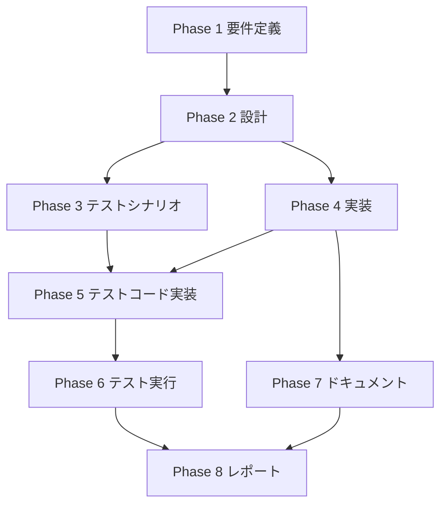

# Codex Agent 実行ログ

開始日時: 2025/11/3 1:55:39

---

## Turn 1: スレッド開始

**Thread ID**: `019a476d-56ea-77e3-911c-8544a4c53f39`

## Turn 2: ツール実行

**種別**: コマンド実行
**コマンド**: `bash -lc ls`
**ステータス**: completed (exit_code=0)

```text
ARCHITECTURE.md
CHANGELOG.md
CLAUDE.md
DOCKER_AUTH_SETUP.md
Dockerfile
Jenkinsfile
LICENSE
PROGRESS.md
README.md
ROADMAP.md
SETUP_TYPESCRIPT.md
TROUBLESHOOTING.md
dist
examples
jest.config.cjs
metadata.json.template
node_modules
package-lock.json
package.json
scripts
src
tests
tsconfig.json
tsconfig.test.json
```

## Turn 3: ツール実行

**種別**: コマンド実行
**コマンド**: `bash -lc 'ls .ai-workflow'`
**ステータス**: completed (exit_code=0)

```text
issue-10
issue-102
issue-104
issue-105
issue-108
issue-113
issue-115
issue-119
issue-16
issue-18
issue-2
issue-22
issue-23
issue-24
issue-25
issue-26
issue-38
issue-45
issue-46
issue-47
issue-48
issue-49
issue-5
issue-50
issue-51
issue-52
issue-54
issue-58
issue-61
issue-64
issue-7
issue-73
issue-74
issue-90
issue-91
```

## Turn 4: ツール実行

**種別**: コマンド実行
**コマンド**: `bash -lc 'cat .ai-workflow/issue-119/00_planning/output/planning.md'`
**ステータス**: completed (exit_code=0)

```text
# プロジェクト計画書 - Issue #119 フォローアップIssue生成品質の改善（LLM活用）

## 1. Issue分析
- **複雑度**: 複雑  
  - 新規AI連携モジュールの追加と既存GitHub連携コードの拡張を伴い、外部API統合・エラーハンドリング・フォールバック設計が必要。
  - テストレイヤーが複数（LLM呼び出しのモック検証と実APIを用いた統合テスト）に渡る。
- **見積もり工数**: 22~26時間  
  - 設計/要件整理: 6~7h、実装: 7~9h、テスト（設計＋実装＋実行）: 6~7h、ドキュメント/レポート: 3h を想定。
- **リスク評価**: 中  
  - LLM APIの不確定要素と生成品質の主観評価が残る一方、既存コードへの影響は限定範囲に収まる見込み。

## 2. 実装戦略判断
- **実装戦略**: EXTEND  
  - 既存の `issue-client.ts` を中心に機能拡張し、新たな `issue-ai-generator.ts` を追加してL TM生成ロジックを組み込む。全体構造は維持したまま責務分割を拡張。
- **テスト戦略**: UNIT_INTEGRATION  
  - プロンプト生成・フォールバック制御はモックを使ったユニットテストで網羅し、実API呼び出しは環境変数制御下で統合テストを追加して品質を確認。
- **テストコード戦略**: BOTH_TEST  
  - 既存フォローアップ生成ロジックのテストを拡張しつつ、新規 `issue-ai-generator` 用の専用テストファイルを新設する必要がある。

## 3. 影響範囲分析
- **既存コードへの影響**  
  - `src/core/github/issue-client.ts`: LLM優先フロー追加、フォールバック制御、ログ出力変更。  
  - `src/types.ts`: 新しいオプションインターフェースとIssue生成データ構造の拡張。  
  - `src/commands/execute/agent-setup.ts` などのクライアント初期化部: LLM設定引き回しが必要な場合は拡張。
- **依存関係の変更**  
  - 新規AIクライアント実装に伴う依存ライブラリ（公式SDK、HTTPクライアント）の追加検討。  
  - `.env` や設定ファイルにAPIキー/モデル指定を追加する可能性。
- **マイグレーション要否**  
  - コード上のマイグレーションは不要。  
  - 設定ファイル・ドキュメントへの追記（APIキー設定、プロンプトファイル）を行う。  
  - 将来的な `.ai-workflow/config.yml` 拡張を見据えた設計が必要。

## 4. タスク分割

### Phase 1: 要件定義 (見積もり: 3~4h)
- [x] Task 1-1: 現行フォローアップIssue生成フローの分析 (1~1.5h)
  - `issue-client.ts` のタイトル/本文生成ロジックをシーケンス図レベルで整理
  - Evaluation Phase から渡る `RemainingTask` / `IssueContext` のデータフローを確認
  - レビュー結果: 要件定義書にシーケンス分析とデータフロー整理が反映されたため完了
- [x] Task 1-2: LLM統合要件の明確化 (1.5~2h)
  - API利用要件（モデル、トークン制限、リトライ戦略）を洗い出す
  - 生成物の品質条件・受け入れ基準を仕様として文書化
  - レビュー結果: モデル候補・トークン制限・リトライ戦略が要件定義書に詳細化されたため完了

### Phase 2: 設計 (見積もり: 4~5h)
- [ ] Task 2-1: issue-ai-generatorモジュール設計 (2~2.5h)
  - クラス/関数責務、依存注入方法、フォールバックパスを設計
  - プロンプトテンプレートとレスポンス検証手順を定義
- [ ] Task 2-2: 設定・エラーハンドリング設計 (2~2.5h)
  - API鍵の取得経路とマスキング方針を決定
  - レート制限、タイムアウト、再試行ポリシーの設計

### Phase 3: テストシナリオ (見積もり: 2~3h)
- [ ] Task 3-1: テストケース設計 (2~3h)
  - ユニットテスト（成功/失敗/フォールバック/プロンプト検証）のケースを網羅化
  - 統合テストで確認すべきシナリオ（実API、環境変数制御、レスポンス妥当性）を整理

### Phase 4: 実装 (見積もり: 6~7h)
- [ ] Task 4-1: issue-ai-generator.ts の実装 (2.5~3h)
  - プロンプト生成、API呼び出し、レスポンス整形、エラーハンドリングを実装
  - ログとトレース情報（入力長、エラー理由）を追加
- [ ] Task 4-2: issue-client.ts のLLM統合 (2~2.5h)
  - 新モジュール呼び出しとフォールバック制御を実装
  - LLM無効化オプションやテレメトリ用ログを追加
- [ ] Task 4-3: 型/設定まわりの拡張 (1.5~2h)
  - `types.ts` と設定ファイルにオプションを追加
  - エージェント初期化・CLIオプションでのフラグ引き回しを反映

### Phase 5: テストコード実装 (見積もり: 4~5h)
- [ ] Task 5-1: ユニットテスト実装 (2~2.5h)
  - issue-ai-generator用モックテストを作成
  - フォールバック動作とプロンプト生成の検証テストを追加
- [ ] Task 5-2: 統合テスト準備・実装 (2~2.5h)
  - 実API利用テストを環境変数制御で実行できるよう整備
  - テストデータ、レート制限保護の仕組み（スキップ条件等）を実装

### Phase 6: テスト実行 (見積もり: 2~3h)
- [ ] Task 6-1: テスト実行と結果分析 (2~3h)
  - ユニット/統合テストを実行し、失敗ケースを分析
  - ログと生成結果をサンプルIssueと比較して品質を確認

### Phase 7: ドキュメント (見積もり: 2h)
- [ ] Task 7-1: ドキュメント更新 (2h)
  - `ARCHITECTURE.md`, `CLAUDE.md` にLLM統合方針・利用手順を追記
  - APIキー設定手順や設定例をREADME系ドキュメントに反映

### Phase 8: レポート (見積もり: 1~1.5h)
- [ ] Task 8-1: 成果物サマリーとフォローアップ (1~1.5h)
  - 実装差分、テスト結果、残課題をレポートにまとめる
  - 次フェーズ向けの改善案や運用上の注意点を記録

## 5. 依存関係


## 6. リスクと軽減策
#### リスク1: LLM APIのレート制限・エラー多発
- **影響度**: 中
- **確率**: 中
- **軽減策**: リトライ/指数バックオフを実装し、フォールバックを即時に発動できるようにする。統合テストではAPI呼び出し頻度を制限。

#### リスク2: 生成タイトル・本文の品質ばらつき
- **影響度**: 高
- **確率**: 中
- **軽減策**: プロンプトテンプレートをチューニングし、ユニットテストで最低限のセクション検証を実施。レビュー基準を明文化。

#### リスク3: 機密情報の誤送信
- **影響度**: 高
- **確率**: 低
- **軽減策**: フィルタリングレイヤーを設け、送信前にセンシティブなフィールドを除去。APIログに機密情報を残さない。

#### リスク4: 実API統合テストの不安定化
- **影響度**: 中
- **確率**: 中
- **軽減策**: 統合テストをオプトイン方式（環境変数ON時のみ実行）にし、失敗時はフォールバック確認テストを優先。

## 7. 品質ゲート
#### Phase 1: 要件定義
- [ ] LLM統合要件と生成品質基準が明文化されている
- [ ] セキュリティ・コスト要件が整理されている

#### Phase 2: 設計
- [ ] 実装戦略・テスト戦略・テストコード戦略の根拠が設計書に反映されている
- [ ] フォールバックフローとエラーハンドリングが設計されている

#### Phase 3: テストシナリオ
- [ ] 成功/失敗/フォールバックを網羅したテスト
... (truncated)
```

## Turn 5: ツール実行

**種別**: コマンド実行
**コマンド**: `bash -lc 'cat .ai-workflow/issue-119/01_requirements/output/requirements.md'`
**ステータス**: completed (exit_code=0)

```text
# 要件定義書 - Issue #119 フォローアップIssue生成品質の改善（LLM活用）

## 0. Planning Documentの確認
- `00_planning/output/planning.md` に基づき、既存 `issue-client.ts` の責務を維持しつつ新規 `issue-ai-generator.ts` でLLM連携を拡張する「EXTEND」戦略を採用する。
- テストはモック中心のユニットテストと実APIを使用する統合テストの両輪（UNIT_INTEGRATION/BOTH_TEST）で実施し、フォールバック経路を含めて網羅する。
- 主なリスクはLLM API失敗・品質ばらつき・機密情報漏洩であり、リトライ／フォールバック、プロンプト検証、フィルタリングで軽減する。
- 想定工数は22〜26時間で、要件定義・設計・実装・テスト・ドキュメント更新までを段階的に進める。

## 1. 概要
既存のフォローアップIssue自動生成機能は、タイトルが一般的すぎて検索性が低く、本文も箇条書きのみで具体的な作業内容が伝わらない。また、元IssueやPRの背景情報が十分に反映されず、残タスクの意義や優先度が不明瞭である。  
本要件はLLMを統合してタイトルと本文の生成品質を向上させ、技術的背景や実行手順を含む実務的に活用できるフォローアップIssueを自動生成することを目的とする。  
これにより、開発チームは手動でIssueを整形する手間を削減し、残タスクの理解・着手が迅速化され、ワークフロー全体のスループット向上と品質担保が期待できる。

### 1.1 現行フォローアップIssue生成フローとデータ連携（Task 1-1）
- **シーケンス概要**  
  1. Evaluation Phase完了時に `RemainingTask[]` と `IssueContext` が Phase Runner から `IssueClient.createIssueFromEvaluation()` へ渡される（`src/core/github/issue-client.ts:198`）。併せて評価レポートのファイルパスが付与される。  
  2. `createIssueFromEvaluation` 内で INFO ログを出力後、`generateFollowUpTitle` が呼び出され、最初の最大3件の残タスクを `extractKeywords` で分割・20文字以内に整形し、`[FOLLOW-UP] #<issueNumber>: <keywords>` 形式のタイトルを組み立てる（同:163行付近）。  
  3. 本文は `IssueContext` が存在する場合に `## 背景` セクションへ `summary` を記述し、`blockerStatus` `deferredReason` をサブセクションとして展開する。`IssueContext` がない場合は定型文にフォールバックする。  
  4. `RemainingTask` をループし、タスク番号ごとに `formatTaskDetails` が Markdown の見出し・対象ファイル一覧・作業手順・受け入れ基準・優先度・見積もり・依存タスクを整形し `## 残タスク詳細` 配下へ追加する（`src/core/github/issue-client.ts:210-274`）。  
  5. 末尾に `## 参考` セクションを追加し、元Issue番号と `evaluationReportPath` へのリンクを差し込んだうえで `---` によるフッタを付与する。  
  6. 完成したタイトル・本文を Octokit 経由で GitHub API `issues.create` に送信し、成功時は INFO、失敗時は `encodeWarning` 済みメッセージを ERROR ログに記録する。

- **データフロー整理**  
  | 入力ソース | 受け取り箇所 | 利用目的 |
  | --- | --- | --- |
  | `RemainingTask.task` | `formatTaskDetails` | `### Task n:` 見出しの文言として使用 |
  | `RemainingTask.targetFiles[]` | `formatTaskDetails` | `**対象ファイル**` セクションにコードパスを列挙 |
  | `RemainingTask.steps[]` | `formatTaskDetails` | 実行手順（番号付きリスト）として出力 |
  | `RemainingTask.acceptanceCriteria[]` | `formatTaskDetails` | `- [ ]` チェックボックス付き受け入れ基準を生成 |
  | `RemainingTask.priority` / `priorityReason` | `formatTaskDetails` | 優先度と根拠を1行にまとめて提示 |
  | `RemainingTask.estimatedHours` | `formatTaskDetails` | 作業見積もりを `**見積もり**` として併記 |
  | `RemainingTask.dependencies[]` | `formatTaskDetails` | 依存タスク一覧を箇条書きで記載 |
  | `IssueContext.summary` | 本文 `## 背景` | 元Issue・PRのサマリーを冒頭に表示 |
  | `IssueContext.blockerStatus` | 本文 `### 元 Issue のステータス` | ブロッカー解消状況を共有 |
  | `IssueContext.deferredReason` | 本文 `### なぜこれらのタスクが残ったか` | 残タスク発生の背景説明 |
  | `evaluationReportPath` | 本文 `## 参考` | 評価レポート位置をリンク/パスで提示 |

  `RemainingTask` と `IssueContext` は `src/types.ts:36-105` に定義されており、Evaluation Phaseからの構造体がそのまま文字列化される。今後のLLM統合ではこれらの値をプロンプト入力へ拡張するが、既存フォールバック経路との互換性を維持する。

## 2. 機能要件
Issue本文に「## TODO」節は存在しないため、概要および提案解決策から抽出した要件を整理する。

| ID | 要件 | 詳細 | 優先度 |
| --- | --- | --- | --- |
| FR-1 | LLMを用いたインテリジェントタイトル生成 | `generateIntelligentTitle` 関数で元Issue・PR・残タスクの文脈を入力に、50〜80文字の技術的に明確なタイトルを生成する。タイトルは主要コンポーネントや指標（例: 対象モジュール、目標値）を含み、既存の単語分割ロジックより情報密度が高いこと。 | 高 |
| FR-2 | 構造化されたタスク本文生成 | `generateTaskDescription` が背景、目的、実行内容（ステップ・対象ファイル・テスト方法）、受け入れ基準、関連リソースをMarkdownセクションとして出力する。本文内で1ステップずつ実行指示を明示し、テスト手順と完了条件を含める。 | 高 |
| FR-3 | フォールバック制御 | LLM呼び出し失敗・タイムアウト・無効化設定時には既存の `generateFollowUpTitle` / `formatTaskDetails` を自動で利用し、処理を中断させない。フォールバック発動状況は警告ログで記録する。 | 高 |
| FR-4 | 設定オプションの拡張 | `IssueGenerationOptions` 等を通じてLLM有効化フラグ、モデル選択、タイムアウト、最大リトライ回数を指定できるようにし、CLIや環境変数から設定可能にする。デフォルト値は後方互換を保つ。 | 中 |
| FR-5 | ログと品質監視 | LLM呼び出し成功時は入力トークン長・モデル名・生成時間をDEBUGログに出力し、失敗時は原因と再試行状況をWARNログに記録する。WARNログは `{ event_code, message, fallback_mode, retry_count }` を最低限含む構造化ペイロードとし、ログには機密情報を含めない。 | 中 |

### 2.1 LLM API利用要件（Task 1-2）
- **モデル候補とトークン制限**  
  | モデルID | プロバイダ | 想定用途 | 最大入力トークン | 最大出力トークン | 備考 |
  | --- | --- | --- | --- | --- | --- |
  | `claude-3-sonnet-20240229` | Anthropic | デフォルト（高品質/安定） | 8,000 | 2,000 | コストと品質のバランスが良い。 |
  | `gpt-4o-2024-05-13` | OpenAI | 代替（マルチリンガル/ツール連携） | 8,192 | 2,048
... (truncated)
```

## Turn 6: ツール実行

**種別**: コマンド実行
**コマンド**: `bash -lc "sed -n '1,160p' .ai-workflow/issue-119/01_requirements/output/requirements.md"`
**ステータス**: completed (exit_code=0)

```text
# 要件定義書 - Issue #119 フォローアップIssue生成品質の改善（LLM活用）

## 0. Planning Documentの確認
- `00_planning/output/planning.md` に基づき、既存 `issue-client.ts` の責務を維持しつつ新規 `issue-ai-generator.ts` でLLM連携を拡張する「EXTEND」戦略を採用する。
- テストはモック中心のユニットテストと実APIを使用する統合テストの両輪（UNIT_INTEGRATION/BOTH_TEST）で実施し、フォールバック経路を含めて網羅する。
- 主なリスクはLLM API失敗・品質ばらつき・機密情報漏洩であり、リトライ／フォールバック、プロンプト検証、フィルタリングで軽減する。
- 想定工数は22〜26時間で、要件定義・設計・実装・テスト・ドキュメント更新までを段階的に進める。

## 1. 概要
既存のフォローアップIssue自動生成機能は、タイトルが一般的すぎて検索性が低く、本文も箇条書きのみで具体的な作業内容が伝わらない。また、元IssueやPRの背景情報が十分に反映されず、残タスクの意義や優先度が不明瞭である。  
本要件はLLMを統合してタイトルと本文の生成品質を向上させ、技術的背景や実行手順を含む実務的に活用できるフォローアップIssueを自動生成することを目的とする。  
これにより、開発チームは手動でIssueを整形する手間を削減し、残タスクの理解・着手が迅速化され、ワークフロー全体のスループット向上と品質担保が期待できる。

### 1.1 現行フォローアップIssue生成フローとデータ連携（Task 1-1）
- **シーケンス概要**  
  1. Evaluation Phase完了時に `RemainingTask[]` と `IssueContext` が Phase Runner から `IssueClient.createIssueFromEvaluation()` へ渡される（`src/core/github/issue-client.ts:198`）。併せて評価レポートのファイルパスが付与される。  
  2. `createIssueFromEvaluation` 内で INFO ログを出力後、`generateFollowUpTitle` が呼び出され、最初の最大3件の残タスクを `extractKeywords` で分割・20文字以内に整形し、`[FOLLOW-UP] #<issueNumber>: <keywords>` 形式のタイトルを組み立てる（同:163行付近）。  
  3. 本文は `IssueContext` が存在する場合に `## 背景` セクションへ `summary` を記述し、`blockerStatus` `deferredReason` をサブセクションとして展開する。`IssueContext` がない場合は定型文にフォールバックする。  
  4. `RemainingTask` をループし、タスク番号ごとに `formatTaskDetails` が Markdown の見出し・対象ファイル一覧・作業手順・受け入れ基準・優先度・見積もり・依存タスクを整形し `## 残タスク詳細` 配下へ追加する（`src/core/github/issue-client.ts:210-274`）。  
  5. 末尾に `## 参考` セクションを追加し、元Issue番号と `evaluationReportPath` へのリンクを差し込んだうえで `---` によるフッタを付与する。  
  6. 完成したタイトル・本文を Octokit 経由で GitHub API `issues.create` に送信し、成功時は INFO、失敗時は `encodeWarning` 済みメッセージを ERROR ログに記録する。

- **データフロー整理**  
  | 入力ソース | 受け取り箇所 | 利用目的 |
  | --- | --- | --- |
  | `RemainingTask.task` | `formatTaskDetails` | `### Task n:` 見出しの文言として使用 |
  | `RemainingTask.targetFiles[]` | `formatTaskDetails` | `**対象ファイル**` セクションにコードパスを列挙 |
  | `RemainingTask.steps[]` | `formatTaskDetails` | 実行手順（番号付きリスト）として出力 |
  | `RemainingTask.acceptanceCriteria[]` | `formatTaskDetails` | `- [ ]` チェックボックス付き受け入れ基準を生成 |
  | `RemainingTask.priority` / `priorityReason` | `formatTaskDetails` | 優先度と根拠を1行にまとめて提示 |
  | `RemainingTask.estimatedHours` | `formatTaskDetails` | 作業見積もりを `**見積もり**` として併記 |
  | `RemainingTask.dependencies[]` | `formatTaskDetails` | 依存タスク一覧を箇条書きで記載 |
  | `IssueContext.summary` | 本文 `## 背景` | 元Issue・PRのサマリーを冒頭に表示 |
  | `IssueContext.blockerStatus` | 本文 `### 元 Issue のステータス` | ブロッカー解消状況を共有 |
  | `IssueContext.deferredReason` | 本文 `### なぜこれらのタスクが残ったか` | 残タスク発生の背景説明 |
  | `evaluationReportPath` | 本文 `## 参考` | 評価レポート位置をリンク/パスで提示 |

  `RemainingTask` と `IssueContext` は `src/types.ts:36-105` に定義されており、Evaluation Phaseからの構造体がそのまま文字列化される。今後のLLM統合ではこれらの値をプロンプト入力へ拡張するが、既存フォールバック経路との互換性を維持する。

## 2. 機能要件
Issue本文に「## TODO」節は存在しないため、概要および提案解決策から抽出した要件を整理する。

| ID | 要件 | 詳細 | 優先度 |
| --- | --- | --- | --- |
| FR-1 | LLMを用いたインテリジェントタイトル生成 | `generateIntelligentTitle` 関数で元Issue・PR・残タスクの文脈を入力に、50〜80文字の技術的に明確なタイトルを生成する。タイトルは主要コンポーネントや指標（例: 対象モジュール、目標値）を含み、既存の単語分割ロジックより情報密度が高いこと。 | 高 |
| FR-2 | 構造化されたタスク本文生成 | `generateTaskDescription` が背景、目的、実行内容（ステップ・対象ファイル・テスト方法）、受け入れ基準、関連リソースをMarkdownセクションとして出力する。本文内で1ステップずつ実行指示を明示し、テスト手順と完了条件を含める。 | 高 |
| FR-3 | フォールバック制御 | LLM呼び出し失敗・タイムアウト・無効化設定時には既存の `generateFollowUpTitle` / `formatTaskDetails` を自動で利用し、処理を中断させない。フォールバック発動状況は警告ログで記録する。 | 高 |
| FR-4 | 設定オプションの拡張 | `IssueGenerationOptions` 等を通じてLLM有効化フラグ、モデル選択、タイムアウト、最大リトライ回数を指定できるようにし、CLIや環境変数から設定可能にする。デフォルト値は後方互換を保つ。 | 中 |
| FR-5 | ログと品質監視 | LLM呼び出し成功時は入力トークン長・モデル名・生成時間をDEBUGログに出力し、失敗時は原因と再試行状況をWARNログに記録する。WARNログは `{ event_code, message, fallback_mode, retry_count }` を最低限含む構造化ペイロードとし、ログには機密情報を含めない。 | 中 |

### 2.1 LLM API利用要件（Task 1-2）
- **モデル候補とトークン制限**  
  | モデルID | プロバイダ | 想定用途 | 最大入力トークン | 最大出力トークン | 備考 |
  | --- | --- | --- | --- | --- | --- |
  | `claude-3-sonnet-20240229` | Anthropic | デフォルト（高品質/安定） | 8,000 | 2,000 | コストと品質のバランスが良い。 |
  | `gpt-4o-2024-05-13` | OpenAI | 代替（マルチリンガル/ツール連携） | 8,192 | 2,048
... (truncated)
```

## Turn 7: ツール実行

**種別**: コマンド実行
**コマンド**: `bash -lc "sed -n '160,320p' .ai-workflow/issue-119/01_requirements/output/requirements.md"`
**ステータス**: completed (exit_code=0)

## Turn 8: ツール実行

**種別**: コマンド実行
**コマンド**: `bash -lc 'wc -l .ai-workflow/issue-119/01_requirements/output/requirements.md'`
**ステータス**: completed (exit_code=0)

```text
124 .ai-workflow/issue-119/01_requirements/output/requirements.md
```

## Turn 9: ツール実行

**種別**: コマンド実行
**コマンド**: `bash -lc "sed -n '80,124p' .ai-workflow/issue-119/01_requirements/output/requirements.md"`
**ステータス**: completed (exit_code=0)

```text
- プロンプトに含めるログ記録はマスク済みであることをバリデーションし、`targetFiles` を最大10件に制限。  
  - レスポンス検証で必須セクション欠落時は `ValidationError` を発生させ、フォールバックへ移行する。

## 3. 非機能要件
- **パフォーマンス**: 単一タスクあたりのLLM呼び出しは平均15秒以内に完了し、タイムアウトは30秒以下に設定する。レート制限到達時は指数バックオフで最大3回までリトライする。
- **セキュリティ**: APIキーは環境変数で安全に読み込み、ログ・例外メッセージに出力しない。送信ペイロードから機密情報（トークン、クレデンシャル、個人情報）は除外するフィルタリング層を備える。
- **可用性・信頼性**: フォールバック経路はLLMが失敗しても100%動作し、呼び出し結果はエラー発生時に既存生成ロジックへ切り替える。リトライ失敗時は処理継続と警告発報を保証する。
- **保守性・拡張性**: LLM連携は `issue-ai-generator.ts` に集約し、将来的なモデル追加やプロンプト更新を局所化する。ユニットテスト・統合テストを追加し、既存カバレッジ水準を維持または向上させる。

## 4. 制約事項
- **技術的制約**: TypeScript（Node.js 20系想定）で実装し、既存CLIアーキテクチャと互換性を保つ。LLMクライアントは既存依存（`openai`、`@anthropic-ai/claude-agent-sdk`）を利用し、新規依存追加は最小限に留める。
- **リソース制約**: Planning成果物の見積もりに従い22〜26時間内で完了させる。開発リソースは既存チームのスプリント枠内に限定される。
- **ポリシー制約**: CLAUDE.md/ARCHITECTURE.md に準拠し、コーディング規約・ログポリシー・セキュリティポリシーを遵守する。API利用は組織のコスト管理指針に従い、不要な試行を抑制する。

## 5. 前提条件
- **システム環境**: Node.js 20.x、TypeScript 5.x、Jestベースのテスト環境、GitHub APIアクセス権限、LLM API（ClaudeまたはCodex/OpenAI）へのネットワーク接続。
- **依存コンポーネント**: 既存 `issue-client.ts`、`commands/execute/agent-setup.ts`、GitHub Issue作成フロー、`openai` / `@anthropic-ai/claude-agent-sdk` クライアント。
- **外部システム連携**: GitHub REST API、Claude/OpenAI API。APIキーは環境変数（例: `ANTHROPIC_API_KEY`, `OPENAI_API_KEY`）で提供される。

## 6. 受け入れ基準
- FR-1  
  - Given LLMが有効で必要な認証情報が設定されている  
  - When `generateIntelligentTitle` にIssue・PR・タスク文脈を渡して実行する  
  - Then 50〜80文字のタイトルが生成され、主要技術要素が含まれ、空文字や重複語が発生しない
- FR-2  
  - Given 残タスク情報とIssue/PRコンテキストが揃っている  
  - When `generateTaskDescription` を呼び出す  
  - Then 背景・目的・実行内容・受け入れ基準・関連リソースのMarkdownセクションがすべて出力され、実行内容にステップとテスト方法が含まれる
- FR-3  
  - Given LLM呼び出しがタイムアウトまたはエラーを返す  
  - When フォローアップIssue生成を行う  
  - Then 既存ロジックでタイトルと本文が生成され、WARNログにフォールバック理由が記録される
- FR-4  
  - Given CLI実行時にLLM関連オプションを指定する  
  - When フォローアップIssue生成を実行する  
  - Then 指定されたモデル・タイムアウト・リトライ設定が `issue-ai-generator` に反映され、設定が無効な場合はバリデーションエラーを返す
- FR-5  
  - Given LLM呼び出しが行われ、成功または失敗する  
  - When ログ出力を確認する  
  - Then 成功時にモデル名・処理時間等がDEBUGで、失敗時に原因と再試行情報がWARNで出力され、ログに機密情報が含まれない

## 7. スコープ外
- カスタムプロンプトをユーザーが任意に設定する機能（`.ai-workflow/config.yml` 拡張）は今回のスコープ外で将来検討とする。
- 生成されたIssue内容の人手レビュー・承認ワークフロー自動化は対象外。
- 英語以外の多言語サポートやプロジェクト固有テンプレートの自動切替は本フェーズでは扱わない。
```

## Turn 10: ツール実行

**種別**: コマンド実行
**コマンド**: `bash -lc "sed -n '1,200p' src/core/github/issue-client.ts"`
**ステータス**: completed (exit_code=0)

```text
import { Octokit } from '@octokit/rest';
import { logger } from '../../utils/logger.js';
import { RequestError } from '@octokit/request-error';
import { getErrorMessage } from '../../utils/error-utils.js';
import { RemainingTask, IssueContext } from '../../types.js';

export interface IssueInfo {
  number: number;
  title: string;
  body: string;
  state: string;
  labels: string[];
  url: string;
  created_at: string;
  updated_at: string;
}

export interface CommentDict {
  id: number;
  user: string;
  body: string;
  created_at: string;
  updated_at: string;
}

export interface IssueCreationResult {
  success: boolean;
  issue_url: string | null;
  issue_number: number | null;
  error?: string | null;
}

export interface GenericResult {
  success: boolean;
  error?: string | null;
}

/**
 * IssueClient handles all Issue-related operations with GitHub API.
 * Responsibilities:
 * - Issue retrieval (getIssue, getIssueInfo)
 * - Issue comments retrieval (getIssueComments, getIssueCommentsDict)
 * - Comment posting (postComment)
 * - Issue closing (closeIssueWithReason)
 * - Follow-up issue creation (createIssueFromEvaluation)
 */
export class IssueClient {
  private readonly octokit: Octokit;
  private readonly owner: string;
  private readonly repo: string;

  constructor(octokit: Octokit, owner: string, repo: string) {
    this.octokit = octokit;
    this.owner = owner;
    this.repo = repo;
  }

  /**
   * Retrieves issue details from GitHub API.
   */
  public async getIssue(issueNumber: number) {
    const { data } = await this.octokit.issues.get({
      owner: this.owner,
      repo: this.repo,
      issue_number: issueNumber,
    });
    return data;
  }

  /**
   * Retrieves simplified issue information.
   */
  public async getIssueInfo(issueNumber: number): Promise<IssueInfo> {
    const issue = await this.getIssue(issueNumber);
    return {
      number: issue.number,
      title: issue.title ?? '',
      body: issue.body ?? '',
      state: issue.state ?? 'open',
      labels: (issue.labels ?? []).map((label) =>
        typeof label === 'string' ? label : label.name ?? '',
      ),
      url: issue.html_url ?? '',
      created_at: issue.created_at ?? new Date().toISOString(),
      updated_at: issue.updated_at ?? new Date().toISOString(),
    };
  }

  /**
   * Retrieves all comments for an issue.
   */
  public async getIssueComments(issueNumber: number) {
    const { data } = await this.octokit.issues.listComments({
      owner: this.owner,
      repo: this.repo,
      issue_number: issueNumber,
    });
    return data;
  }

  /**
   * Retrieves issue comments in dictionary format.
   */
  public async getIssueCommentsDict(issueNumber: number): Promise<CommentDict[]> {
    const comments = await this.getIssueComments(issueNumber);
    return comments.map((comment) => ({
      id: comment.id,
      user: comment.user?.login ?? 'unknown',
      body: comment.body ?? '',
      created_at: comment.created_at ?? '',
      updated_at: comment.updated_at ?? '',
    }));
  }

  /**
   * Posts a comment to an issue.
   */
  public async postComment(issueNumber: number, body: string) {
    const { data } = await this.octokit.issues.createComment({
      owner: this.owner,
      repo: this.repo,
      issue_number: issueNumber,
      body,
    });
    return data;
  }

  /**
   * Closes an issue with a reason comment.
   */
  public async closeIssueWithReason(issueNumber: number, reason: string): Promise<GenericResult> {
    try {
      await this.postComment(
        issueNumber,
        [
          '## ⚠️ ワークフロー中止',
          '',
          'プロジェクト評価の結果、致命的な問題が発見されたため、ワークフローを中止します。',
          '',
          '### 中止理由',
          '',
          reason,
          '',
          '### 推奨アクション',
          '',
          '- アーキテクチャの再設計',
          '- スコープの見直し',
          '- 技術選定の再検討',
          '',
          '---',
          '*AI Workflow Phase 9 (Evaluation) - ABORT*',
        ].join('\n'),
      );

      await this.octokit.iss
... (truncated)
```

## Turn 11: ツール実行

**種別**: コマンド実行
**コマンド**: `bash -lc "sed -n '200,400p' src/core/github/issue-client.ts"`
**ステータス**: completed (exit_code=0)

```text
if (keyword) {
        keywords.push(keyword);
      }
    }

    return keywords;
  }

  /**
   * フォローアップ Issue のタイトルを生成する
   *
   * @param issueNumber - 元 Issue 番号
   * @param remainingTasks - 残タスクのリスト
   * @returns Issue タイトル（80文字以内）
   */
  private generateFollowUpTitle(issueNumber: number, remainingTasks: RemainingTask[]): string {
    // キーワード抽出（最大3個）
    const keywords = this.extractKeywords(remainingTasks, 3);

    // キーワードが抽出できた場合
    if (keywords.length > 0) {
      const keywordsStr = keywords.join('・');
      const title = `[FOLLOW-UP] #${issueNumber}: ${keywordsStr}`;

      // 80文字制限
      if (title.length > 80) {
        return title.substring(0, 77) + '...';
      }

      return title;
    }

    // フォールバック: キーワードが抽出できない場合は従来形式
    return `[FOLLOW-UP] Issue #${issueNumber} - 残タスク`;
  }

  /**
   * 残タスクの詳細情報をフォーマットする
   *
   * @param task - 残タスク
   * @param taskNumber - タスク番号（1始まり）
   * @returns フォーマットされた行の配列
   */
  private formatTaskDetails(task: RemainingTask, taskNumber: number): string[] {
    const lines: string[] = [];

    // タスク見出し
    lines.push(`### Task ${taskNumber}: ${task.task}`, '');

    // 対象ファイル（存在する場合のみ）
    if (task.targetFiles && task.targetFiles.length > 0) {
      lines.push('**対象ファイル**:', '');
      task.targetFiles.forEach((file) => lines.push(`- \`${file}\``));
      lines.push('');
    }

    // 必要な作業（存在する場合のみ）
    if (task.steps && task.steps.length > 0) {
      lines.push('**必要な作業**:', '');
      task.steps.forEach((step, i) => lines.push(`${i + 1}. ${step}`));
      lines.push('');
    }

    // Acceptance Criteria（存在する場合のみ）
    if (task.acceptanceCriteria && task.acceptanceCriteria.length > 0) {
      lines.push('**Acceptance Criteria**:', '');
      task.acceptanceCriteria.forEach((ac) => lines.push(`- [ ] ${ac}`));
      lines.push('');
    }

    // Phase
    lines.push(`**Phase**: ${task.phase ?? 'unknown'}`, '');

    // 優先度 + 根拠
    const priority = task.priority ?? '中';
    const priorityLine = task.priorityReason
      ? `**優先度**: ${priority} - ${task.priorityReason}`
      : `**優先度**: ${priority}`;
    lines.push(priorityLine, '');

    // 見積もり工数
    lines.push(`**見積もり**: ${task.estimatedHours ?? '未定'}`, '');

    // 依存タスク（存在する場合のみ）
    if (task.dependencies && task.dependencies.length > 0) {
      lines.push('**依存タスク**:', '');
      task.dependencies.forEach((dep) => lines.push(`- ${dep}`));
      lines.push('');
    }

    lines.push('---'); // タスク間の区切り線

    return lines;
  }

  /**
   * Creates a follow-up issue from evaluation remaining tasks.
   *
   * @param issueNumber - 元 Issue 番号
   * @param remainingTasks - 残タスクのリスト
   * @param evaluationReportPath - Evaluation レポートのパス
   * @param issueContext - Issue コンテキスト（背景情報、オプショナル）
   * @returns Issue 作成結果
   */
  public async createIssueFromEvaluation(
    issueNumber: number,
    remainingTasks: RemainingTask[],
    evaluationReportPath: string,
    issueContext?: IssueContext,
  ): Promise<IssueCreationResult> {
    try {
      logger.info(`Creating follow-up issue for #${issueNumber} with ${remainingTasks.length} remaining tasks`);

      // タイトル生成
      const title = this.generateFollowUpTitle(issueNumber, remainingTasks);

      // 本文生成
      const lines: string[] = [];

      // 背景セクション（issueContext が存在する場合のみ）
      if (issueContext) {
        lines.push('## 背景', '');
        lines.push(issueContext.summary, '');

        if (issueContext.blockerStatus) {
          lines.push('### 元 Issue のステータス', '');
          lines.push(issueContext.blockerStatus, '');
        }

        if (issueContext.deferredReason) {
          lines.push('### なぜこれらのタスクが残ったか', '');
          lines.push(issueContext.deferredReason, '');
        }
      } else {
        // フォールバック: issueContext がない場合は従来形式
        lines.push('## 背景', '');
        lines.push(`AI Workflow Issue #${issueNumber} の評価フェーズで残タスクが見つかりました。`, '');
      }

      // 残タスク詳細セクション
      lines.push('## 残タスク詳細', '');

      for (let i = 0; i < remainingTasks.length; i++) {
... (truncated)
```

## Turn 12: ツール実行

**種別**: コマンド実行
**コマンド**: `bash -lc "sed -n '1,200p' src/types.ts"`
**ステータス**: completed (exit_code=0)

```text
export type PhaseName =
  | 'planning'
  | 'requirements'
  | 'design'
  | 'test_scenario'
  | 'implementation'
  | 'test_implementation'
  | 'testing'
  | 'documentation'
  | 'report'
  | 'evaluation';

export type PhaseStatus = 'pending' | 'in_progress' | 'completed' | 'failed';

// Issue #10: ステップ名の型定義
export type StepName = 'execute' | 'review' | 'revise';

export interface PhaseMetadata {
  status: PhaseStatus;
  retry_count: number;
  started_at: string | null;
  completed_at: string | null;
  review_result: string | null;
  output_files?: string[];
  // Issue #10: ステップ単位の進捗管理
  current_step?: StepName | null;  // 現在実行中のステップ（実行中でない場合はnull）
  completed_steps?: StepName[];     // 完了済みステップの配列（実行順序を保持）
  // Issue #90: 差し戻しコンテキスト（オプショナル）
  rollback_context?: import('./types/commands.js').RollbackContext | null;
}

/**
 * フォローアップ Issue の背景コンテキスト
 * Evaluation Phase から IssueClient に渡される
 */
export interface IssueContext {
  /**
   * 元 Issue の概要
   * 例: "Issue #91 では、BasePhase モジュール分解（Issue #49）で発生した 15 件のテスト失敗を修正しました。"
   */
  summary: string;

  /**
   * ブロッカーのステータス
   * 例: "すべてのブロッカーは解決済み"
   */
  blockerStatus: string;

  /**
   * タスクが残った理由
   * 例: "テスト失敗修正を優先したため、カバレッジ改善は後回しにした"
   */
  deferredReason: string;
}

/**
 * Evaluation Phase で検出された残タスク
 */
export interface RemainingTask {
  // ===== 既存フィールド（必須） =====
  /** タスクの説明 */
  task: string;

  /** 対象フェーズ（例: "implementation", "testing"） */
  phase: string;

  /** 優先度（例: "High", "Medium", "Low"） */
  priority: string;

  // ===== 新規フィールド（すべてオプショナル） =====

  /**
   * 優先度の理由
   * 例: "元 Issue #91 の推奨事項、ブロッカーではない"
   */
  priorityReason?: string;

  /**
   * 対象ファイル/モジュールのリスト
   * 例: ["src/core/phase-factory.ts", "src/commands/execute/agent-setup.ts"]
   */
  targetFiles?: string[];

  /**
   * 実行手順（番号付きリスト）
   * 例: ["不足しているテストケースを特定", "エッジケースのテストを追加"]
   */
  steps?: string[];

  /**
   * 受け入れ基準（Acceptance Criteria）
   * 例: ["すべての対象モジュールで 90% 以上のカバレッジを達成", "npm run test:coverage がすべてパス"]
   */
  acceptanceCriteria?: string[];

  /**
   * 依存タスク
   * 例: ["Task 1 完了後に実行", "Phase 4 の修正が必要"]
   */
  dependencies?: string[];

  /**
   * 見積もり工数
   * 例: "2-4h", "1日", "0.5h"
   */
  estimatedHours?: string;
}

export interface EvaluationPhaseMetadata extends PhaseMetadata {
  decision: string | null;
  failed_phase: PhaseName | null;
  remaining_tasks: RemainingTask[];
  created_issue_url: string | null;
  abort_reason: string | null;
}

export type PhasesMetadata = {
  [phase in Exclude<PhaseName, 'evaluation'>]: PhaseMetadata;
} & {
  evaluation: EvaluationPhaseMetadata;
};

export interface DesignDecisions {
  implementation_strategy: string | null;
  test_strategy: string | null;
  test_code_strategy: string | null;
  [key: string]: string | null;
}

export interface CostTracking {
  total_input_tokens: number;
  total_output_tokens: number;
  total_cost_usd: number;
}

/**
 * 対象リポジトリ情報
 */
export interface TargetRepository {
  /**
   * ローカルパス
   * 例: "C:\\Users\\ytaka\\TIELEC\\development\\my-app"
   */
  path: string;

  /**
   * GitHubリポジトリ名（owner/repo形式）
   * 例: "tielec/my-app"
   */
  github_name: string;

  /**
   * Git remote URL
   * 例: "https://github.com/tielec/my-app.git"
   */
  remote_url: string;

  /**
   * リポジトリオーナー
   * 例: "tielec"
   */
  owner: string;

  /**
   * リポジトリ名
   * 例: "my-app"
   */
  repo: string;
}

export interface WorkflowMetadata {
  issue_number: string;
  issue_url: string;
  issue_title: string;
  repository?: string | null;
  target_repository?: TargetRepository | null;
  workflow_version: string;
  current_phase: PhaseName;
  design_decisions: DesignDecisions;
  cost_tracking: CostTracking;
  phases: PhasesMetadata;
  pr_number?: number | null;
  pr_url?: string | null;
  branch_name?: string | null;
  github_integration?: {
    progress_comment_id?: number;
    progress_comment_url?: string;
  };
  external_documents?: Record<string, string>;
  created_at: string;
  updated_at: string;
  // Issue #90: 差し戻し履歴（オプショナル）
  rollback_history?: impo
... (truncated)
```

## Turn 13: ツール実行

**種別**: コマンド実行
**コマンド**: `bash -lc "sed -n '1,160p' ARCHITECTURE.md"`
**ステータス**: completed (exit_code=0)

```text
# アーキテクチャ概要 ― AI Workflow v2 (TypeScript)

このドキュメントでは、TypeScript 版 AI Workflow の構成、モジュール間の制御フロー、および Codex / Claude Code / GitHub との連携方法を説明します。

## 全体フロー

```
CLI (src/main.ts - 約118行に削減、v0.3.0でリファクタリング)
 ├─ runCli() … CLI エントリーポイント
 ├─ commander定義（コマンドルーティングのみ）
 ├─ reportFatalError() … 致命的エラー報告
 ├─ reportExecutionSummary() … 実行サマリー表示
 └─ isValidPhaseName() … フェーズ名バリデーション

src/commands/init.ts (Issue初期化コマンド処理)
 ├─ handleInitCommand() … Issue初期化コマンドハンドラ
 ├─ validateBranchName() … ブランチ名バリデーション（Git 命名規則チェック）
 ├─ resolveBranchName() … ブランチ名解決（カスタム or デフォルト）
 ├─ ★PR タイトル生成★ … Issueタイトルを取得し、PRタイトルとして使用（v0.3.0、Issue #73）
 └─ src/core/repository-utils.ts を利用（Issue URL解析、リポジトリパス解決）

src/commands/execute.ts (フェーズ実行コマンド処理 - ファサード、v0.3.1で27%削減、Issue #46)
 ├─ handleExecuteCommand() … フェーズ実行コマンドハンドラ（各モジュールへ委譲）
 ├─ 既存公開関数の再エクスポート
 │   ├─ executePhasesSequential (workflow-executor から)
 │   ├─ executePhasesFrom (workflow-executor から)
 │   ├─ createPhaseInstance (phase-factory から)
 │   ├─ resolvePresetName (そのまま保持)
 │   └─ getPresetPhases (そのまま保持)
 └─ 内部ヘルパー関数
     ├─ canResumeWorkflow (そのまま保持)
     ├─ loadExternalDocuments (そのまま保持)
     ├─ resetMetadata (そのまま保持)
     └─ reportExecutionSummary (そのまま保持)

src/commands/execute/options-parser.ts (CLIオプション解析、v0.3.1で追加、Issue #46)
 ├─ parseExecuteOptions() … ExecuteCommandOptions を正規化
 └─ validateExecuteOptions() … 相互排他オプションの検証

src/commands/execute/agent-setup.ts (エージェント初期化、v0.3.1で追加、Issue #46)
 ├─ setupAgentClients() … Codex/Claude クライアントの初期化
 └─ resolveAgentCredentials() … 認証情報のフォールバック処理

src/commands/execute/workflow-executor.ts (ワークフロー実行、v0.3.1で追加、Issue #46)
 ├─ executePhasesSequential() … フェーズの順次実行
 ├─ executePhasesFrom() … 特定フェーズからの実行
 └─ 依存関係順にフェーズを実行
      ├─ BasePhase.run()
      │    ├─ execute()    … エージェントで成果物生成
      │    ├─ review()     … 可能ならレビューサイクル実施
      │    └─ revise()     … オプション（自動修正）
      └─ GitManager による自動コミット / プッシュ（必要に応じて）

src/core/phase-factory.ts (フェーズインスタンス生成、v0.3.1で追加、Issue #46)
 └─ createPhaseInstance() … フェーズインスタンス生成（10フェーズ対応）

src/commands/review.ts (フェーズレビューコマンド処理)
 └─ handleReviewCommand() … メタデータを取得し、フェーズの状態を表示

src/commands/list-presets.ts (プリセット一覧表示コマンド処理)
 └─ listPresets() … 利用可能なプリセット一覧を表示

src/commands/rollback.ts (フェーズ差し戻しコマンド処理、v0.4.0、Issue #90で追加)
 ├─ handleRollbackCommand() … フェーズ差し戻しコマンドハンドラ
 ├─ validateRollbackOptions() … rollbackオプションのバリデーション（exported for testing）
 ├─ loadRollbackReason() … 差し戻し理由の読み込み（--reason, --reason-file, --interactive）（exported for testing）
 ├─ generateRollbackReasonMarkdown() … ROLLBACK_REASON.mdファイルの生成（exported for testing）
 ├─ getPhaseNumber() … フェーズ名から番号を取得するヘルパー（exported for testing）
 └─ MetadataManager拡張メソッドを利用
     ├─ setRollbackContext() … 差し戻しコンテキストの設定
     ├─ getRollbackContext() … 差し戻しコンテキストの取得
     ├─ clearRollbackContext() … 差し戻しコンテキストのクリア
     ├─ addRollbackHistory() … 差し戻し履歴の追加
     ├─ updatePhaseForRollback() … 差し戻し先フェーズのステータス更新
     └─ resetSubsequentPhases() … 後続フェーズのリセット

src/core/repository-utils.ts (リポジトリ関連ユーティリティ)
 ├─ parseIssueUrl() … GitHub Issue URLからリポジトリ情報を抽出
 ├─ resolveLocalRepoPath() … リポジトリ名からローカルパスを解決
 ├─ findWorkflowMetadata() … Issue番号から対応するメタデータを探索
 └─ getRepoRoot() … Gitリポジトリのルートパスを取得

src/types/commands.ts (コマンド関連の型定義)
 ├─ PhaseContext … フェーズ実行コンテキスト
 ├─ ExecutionSummary … 実行サマリー
 ├─ IssueInfo … Issue情報
 └─ BranchValidationResult … ブランチバリデーション結果
```

## モジュール一覧

| モジュール | 役割 |
|------------|------|
| `src/main.ts` | `commander` による CLI 定義。コマンドルーティングのみを担当（約118行、v0.3.0でリファクタリング）。 |
| `src/index.ts` | `ai-workflow-v2` 実行ファイルのエントリーポイント。`runCli` を呼び出す。 |
| `src/commands/init.ts` | Issue初期化コマンド処理（約356行）。ブランチ作成、メタデータ初期化、PR作成、PRタイトル自動生成（v0.3.0、Issue #73）を担当。`handleInitCommand()`, `validateBranchName()`, `resolveBranchName()` を提供。 |
| `src/commands/execute.ts` | フェーズ実行コマンド処理（約497行、v0.3.1で27%削減、Issue #46）。ファサードパターンにより4つの専門モジュールに分離。エージェント管理、プリセット解決、フェーズ順次実行を担当。`handleExecuteCommand()`, `executePhasesSequential()`, `resolvePresetName()`, `getPresetPhases()` 等を提供。 |
| `src/commands/execute/options-parser.
... (truncated)
```

## Turn 14: ツール実行

**種別**: コマンド実行
**コマンド**: `bash -lc 'ls tests'`
**ステータス**: completed (exit_code=0)

```text
integration
run-tests.sh
unit
```

## Turn 15: ツール実行

**種別**: コマンド実行
**コマンド**: `bash -lc 'rg "issue-client" -n tests'`
**ステータス**: failed (exit_code=127)

```text
bash: line 1: rg: command not found
```

## Turn 16: ツール実行

**種別**: コマンド実行
**コマンド**: `bash -lc 'grep -R "issue-client" -n tests'`
**ステータス**: completed (exit_code=0)

```text
tests/unit/github/issue-client.test.ts:3:import { IssueClient, IssueInfo, CommentDict, IssueCreationResult, GenericResult } from '../../../src/core/github/issue-client.js';
tests/unit/github/issue-client-followup.test.ts:4:import { IssueClient, IssueCreationResult } from '../../../src/core/github/issue-client.js';
tests/integration/github-client-facade.test.ts:2:import { IssueClient } from '../../src/core/github/issue-client.js';
```

## Turn 17: ツール実行

**種別**: コマンド実行
**コマンド**: `bash -lc "sed -n '1,200p' tests/unit/github/issue-client-followup.test.ts"`
**ステータス**: completed (exit_code=0)

```text
import { jest, describe, it, expect, beforeEach, afterEach } from '@jest/globals';
import { Octokit } from '@octokit/rest';
import { RequestError } from '@octokit/request-error';
import { IssueClient, IssueCreationResult } from '../../../src/core/github/issue-client.js';
import { RemainingTask, IssueContext } from '../../../src/types.js';

// @jest/globals を使用するため、jest.Mocked 型を any でキャストする必要がある
type MockedOctokit = {
  issues: {
    get: ReturnType<typeof jest.fn>;
    listComments: ReturnType<typeof jest.fn>;
    createComment: ReturnType<typeof jest.fn>;
    update: ReturnType<typeof jest.fn>;
    create: ReturnType<typeof jest.fn>;
  };
};

/**
 * テストスイート: Issue #104 - フォローアップ Issue 改善
 *
 * このテストスイートは、Phase 3のテストシナリオに基づいて実装されています。
 * テスト戦略: UNIT_INTEGRATION
 * - ユニットテスト: extractKeywords(), generateFollowUpTitle(), formatTaskDetails()
 * - インテグレーションテスト: createIssueFromEvaluation()
 */
describe('IssueClient - Follow-up Issue Improvements (Issue #104)', () => {
  let issueClient: IssueClient;
  let mockOctokit: MockedOctokit;

  beforeEach(() => {
    // Octokitモックの作成
    mockOctokit = {
      issues: {
        get: jest.fn(),
        listComments: jest.fn(),
        createComment: jest.fn(),
        update: jest.fn(),
        create: jest.fn(),
      },
    };

    issueClient = new IssueClient(mockOctokit as any, 'owner', 'repo');
  });

  afterEach(() => {
    jest.clearAllMocks();
  });

  // ===== ユニットテスト: extractKeywords() =====

  describe('extractKeywords (private method)', () => {
    /**
     * テストケース 2.1.1: 正常系 - 3つのタスクから3つのキーワードを抽出
     *
     * Given: 3つの有効なタスクを含む RemainingTask[]
     * When: extractKeywords(tasks, 3) を呼び出す
     * Then: 3つのキーワードが抽出される
     */
    it('should extract keywords from 3 tasks', () => {
      const tasks: RemainingTask[] = [
        { task: 'Coverage improvement to 90%', phase: 'test_implementation', priority: 'Medium' },
        { task: 'Performance benchmark execution', phase: 'testing', priority: 'Medium' },
        { task: 'Documentation updates', phase: 'documentation', priority: 'Low' },
      ];

      const keywords = (issueClient as any).extractKeywords(tasks, 3);

      expect(keywords).toEqual([
        'Coverage improvement',    // 20文字に切り詰め (元: 'Coverage improvement to 90%')
        'Performance benchmar',    // 20文字に切り詰め (元: 'Performance benchmark execution')
        'Documentation update',    // 20文字に切り詰め (元: 'Documentation updates')
      ]);
    });

    /**
     * テストケース 2.1.2: 正常系 - 括弧前まで抽出（日本語括弧）
     *
     * Given: 日本語括弧（（）を含むタスクテキスト
     * When: extractKeywords(tasks, 1) を呼び出す
     * Then: 括弧前までのテキストが抽出される
     */
    it('should extract keywords before Japanese parentheses', () => {
      const tasks: RemainingTask[] = [
        { task: 'Jest設定を修正（src/jest.config.js）', phase: 'implementation', priority: 'High' },
      ];

      const keywords = (issueClient as any).extractKeywords(tasks, 1);

      expect(keywords).toEqual(['Jest設定を修正']);
    });

    /**
     * テストケース 2.1.3: 正常系 - 括弧前まで抽出（英語括弧）
     *
     * Given: 英語括弧（()）を含むタスクテキスト
     * When: extractKeywords(tasks, 1) を呼び出す
     * Then: 括弧前までのテキストが抽出される
     */
    it('should extract keywords before English parentheses', () => {
      const tasks: RemainingTask[] = [
        { task: 'Fix Jest configuration (src/jest.config.js)', phase: 'implementation', priority: 'High' },
      ];

      const keywords = (issueClient as any).extractKeywords(tasks, 1);

      expect(keywords).toEqual(['Fix Jest configurati']); // 20文字に切り詰め (元: 'Fix Jest configuration')
    });

    /**
     * テストケース 2.1.4: 境界値 - タスクテキストが20文字を超える場合
     *
     * Given: 20文字を超えるタスクテキスト
     * When: extractKeywords(tasks, 1) を呼び出す
     * Then: 20文字で切り詰められる
     */
    it('should truncate keywords to 20 characters', () => {
      const tasks: RemainingTask[] = [
        { task: 'This is a very long task description that exceeds 20 characters', phase: 'implementation', priority: 'High' },
      ];

      const keywords = (issueClient as any).ext
... (truncated)
```

## Turn 18: ツール実行

**種別**: コマンド実行
**コマンド**: `bash -lc 'ls .ai-workflow/issue-119/02_design'`
**ステータス**: completed (exit_code=0)

```text
execute
output
review
revise
```

## Turn 19: ツール実行

**種別**: コマンド実行
**コマンド**: `bash -lc 'ls .ai-workflow/issue-119/02_design/output'`
**ステータス**: completed (exit_code=0)

## Turn 20: ツール実行

**種別**: コマンド実行
**コマンド**: `bash -lc 'grep -R "issue-ai" -n src'`
**ステータス**: failed (exit_code=1)

## Turn 21: ツール実行

**種別**: コマンド実行
**コマンド**: `bash -lc 'ls src/core'`
**ステータス**: completed (exit_code=0)

```text
claude-agent-client.ts
codex-agent-client.ts
config.ts
content-parser.ts
git
git-manager.ts
github
github-client.ts
helpers
logger.ts
metadata-manager.ts
path-utils.ts
phase-dependencies.ts
phase-factory.ts
repository-utils.ts
secret-masker.ts
workflow-state.ts
```

## Turn 22: ツール実行

**種別**: コマンド実行
**コマンド**: `bash -lc "sed -n '1,200p' src/commands/execute/agent-setup.ts"`
**ステータス**: completed (exit_code=0)

```text
import path from 'node:path';
import process from 'node:process';
import fs from 'fs-extra';

import { logger } from '../../utils/logger.js';
import { config } from '../../core/config.js';
import { CodexAgentClient } from '../../core/codex-agent-client.js';
import { ClaudeAgentClient } from '../../core/claude-agent-client.js';

/**
 * エージェント初期化結果
 */
export interface AgentSetupResult {
  /**
   * Codex エージェントクライアント（未初期化時は null）
   */
  codexClient: CodexAgentClient | null;

  /**
   * Claude エージェントクライアント（未初期化時は null）
   */
  claudeClient: ClaudeAgentClient | null;
}

/**
 * 認証情報解決結果
 */
export interface CredentialsResult {
  /**
   * Codex API キー（未設定時は null）
   */
  codexApiKey: string | null;

  /**
   * Claude 認証情報ファイルパス（未設定時は null）
   */
  claudeCredentialsPath: string | null;
}

/**
 * 認証情報を解決（フォールバック処理）
 *
 * Codex API キーと Claude 認証情報ファイルパスを以下の優先順位で探索します:
 *
 * **Codex API キー**:
 * 1. CODEX_API_KEY 環境変数
 * 2. OPENAI_API_KEY 環境変数（フォールバック）
 *
 * **Claude 認証情報**:
 * 1. CLAUDE_CODE_CREDENTIALS_PATH 環境変数
 * 2. ~/.claude-code/credentials.json
 * 3. <repo>/.claude-code/credentials.json
 *
 * @param homeDir - ホームディレクトリ
 * @param repoRoot - リポジトリルート
 * @returns 認証情報解決結果
 */
export function resolveAgentCredentials(homeDir: string, repoRoot: string): CredentialsResult {
  // Codex API キーの解決（CODEX_API_KEY → OPENAI_API_KEY）
  const codexApiKey = config.getCodexApiKey();

  // Claude 認証情報ファイルパスの候補を探索
  const claudeCandidatePaths: string[] = [];

  // 優先度1: CLAUDE_CODE_CREDENTIALS_PATH 環境変数
  const claudeCredentialsEnv = config.getClaudeCredentialsPath();
  if (claudeCredentialsEnv) {
    claudeCandidatePaths.push(claudeCredentialsEnv);
  }

  // 優先度2: ~/.claude-code/credentials.json
  claudeCandidatePaths.push(path.join(homeDir, '.claude-code', 'credentials.json'));

  // 優先度3: <repo>/.claude-code/credentials.json
  claudeCandidatePaths.push(path.join(repoRoot, '.claude-code', 'credentials.json'));

  // 最初に存在するファイルパスを採用
  const claudeCredentialsPath =
    claudeCandidatePaths.find((candidate) => candidate && fs.existsSync(candidate)) ?? null;

  return {
    codexApiKey,
    claudeCredentialsPath,
  };
}

/**
 * Codex/Claude クライアントを初期化
 *
 * エージェントモードに基づいて、Codex および Claude エージェントクライアントを初期化します。
 *
 * **エージェントモード動作**:
 * - 'codex': Codex のみ使用（codexApiKey 必須、なければエラー）
 * - 'claude': Claude のみ使用（claudeCredentialsPath 必須、なければエラー）
 * - 'auto': Codex 優先、Claude にフォールバック（いずれかが必須）
 *
 * @param agentMode - エージェントモード ('auto' | 'codex' | 'claude')
 * @param workingDir - 作業ディレクトリ
 * @param codexApiKey - Codex API キー（オプション）
 * @param claudeCredentialsPath - Claude 認証情報パス（オプション）
 * @returns エージェント初期化結果
 * @throws {Error} 必須の認証情報が存在しない場合
 */
export function setupAgentClients(
  agentMode: 'auto' | 'codex' | 'claude',
  workingDir: string,
  codexApiKey: string | null,
  claudeCredentialsPath: string | null,
): AgentSetupResult {
  let codexClient: CodexAgentClient | null = null;
  let claudeClient: ClaudeAgentClient | null = null;

  switch (agentMode) {
    case 'codex': {
      // Codex 強制モード: codexApiKey 必須
      if (!codexApiKey || !codexApiKey.trim()) {
        throw new Error(
          'Agent mode "codex" requires CODEX_API_KEY or OPENAI_API_KEY to be set with a valid Codex API key.',
        );
      }
      const trimmed = codexApiKey.trim();
      // 環境変数設定
      process.env.CODEX_API_KEY = trimmed;
      if (!process.env.OPENAI_API_KEY || !process.env.OPENAI_API_KEY.trim()) {
        process.env.OPENAI_API_KEY = trimmed;
      }
      delete process.env.CLAUDE_CODE_CREDENTIALS_PATH;

      codexClient = new CodexAgentClient({ workingDir, model: 'gpt-5-codex' });
      logger.info('Codex agent enabled (codex mode).');
      break;
    }
    case 'claude': {
      // Claude 強制モード: claudeCredentialsPath 必須
      if (!claudeCredentialsPath) {
        throw new Error(
          'Agent mode "claude" requires Claude Code credentials.json to be available.',
        );
      }
      claudeClient = new ClaudeAgentClient({ workingDir, credentialsPath:
... (truncated)
```

## Turn 23: ツール実行

**種別**: コマンド実行
**コマンド**: `bash -lc "sed -n '1,180p' src/core/codex-agent-client.ts"`
**ステータス**: completed (exit_code=0)

```text
import fs from 'fs-extra';
import { logger } from '../utils/logger.js';
import { config } from './config.js';
import { spawn } from 'node:child_process';
import { parseCodexEvent, determineCodexEventType } from './helpers/agent-event-parser.js';
import { formatCodexLog } from './helpers/log-formatter.js';
import { setupCodexEnvironment } from './helpers/env-setup.js';

interface ExecuteTaskOptions {
  prompt: string;
  systemPrompt?: string | null;
  maxTurns?: number;
  workingDirectory?: string;
  verbose?: boolean;
  model?: string | null;
}

const DEFAULT_MAX_TURNS = 50;

export class CodexAgentClient {
  private readonly workingDir: string;
  private readonly binaryPath: string;
  private readonly defaultModel?: string;

  constructor(options: { workingDir?: string; binaryPath?: string; model?: string } = {}) {
    this.workingDir = options.workingDir ?? process.cwd();
    this.binaryPath = options.binaryPath ?? config.getCodexCliPath();
    this.defaultModel = options.model ?? undefined;
  }

  public getWorkingDirectory(): string {
    return this.workingDir;
  }

  public getBinaryPath(): string {
    return this.binaryPath;
  }

  public async executeTask(options: ExecuteTaskOptions): Promise<string[]> {
    const cwd = options.workingDirectory ?? this.workingDir;
    const args: string[] = ['exec', '--json', '--skip-git-repo-check', '--dangerously-bypass-approvals-and-sandbox'];

    const model = options.model ?? this.defaultModel;
    if (model) {
      args.push('--model', model);
    }

    const maxTurns = options.maxTurns ?? DEFAULT_MAX_TURNS;
    if (Number.isFinite(maxTurns)) {
      args.push('-c', `max_turns=${maxTurns}`);
    }

    if (cwd) {
      args.push('--cd', cwd);
    }

    args.push('-');

    const finalPrompt =
      options.systemPrompt && options.systemPrompt.trim().length > 0
        ? `${options.systemPrompt.trim()}\n\n${options.prompt}`
        : options.prompt;

    try {
      return await this.runCodexProcess(args, {
        cwd,
        verbose: options.verbose ?? true,
        stdinPayload: finalPrompt,
      });
    } catch (error) {
      const err = error as NodeJS.ErrnoException;
      const message = err?.message ?? '';
      const missingBinary =
        err?.code === 'ENOENT' ||
        message.includes('ENOENT') ||
        message.includes('spawn codex ENOENT');

      if (missingBinary) {
        const helpMessage = [
          `Codex CLI binary not found at "${this.binaryPath}".`,
          'Install the Codex CLI or set CODEX_CLI_PATH to the executable path before running the workflow.',
        ].join(' ');
        const wrapped = new Error(helpMessage) as NodeJS.ErrnoException & { cause?: unknown };
        wrapped.code = 'CODEX_CLI_NOT_FOUND';
        wrapped.cause = error;
        throw wrapped;
      }

      throw error;
    }
  }

  public async executeTaskFromFile(
    promptFile: string,
    templateVars?: Record<string, string>,
    systemPrompt?: string,
    maxTurns?: number,
    verbose?: boolean,
    model?: string,
  ): Promise<string[]> {
    const template = fs.readFileSync(promptFile, 'utf-8');
    const prompt = this.fillTemplate(template, templateVars ?? {});
    return this.executeTask({
      prompt,
      systemPrompt,
      maxTurns,
      verbose,
      model,
    });
  }

  private async runCodexProcess(
    args: string[],
    options: { cwd: string; verbose: boolean; stdinPayload: string },
  ): Promise<string[]> {
    return new Promise((resolve, reject) => {
      const messages: string[] = [];
      const childEnv = setupCodexEnvironment(process.env);

      const child = spawn(this.binaryPath, args, {
        cwd: options.cwd,
        env: childEnv,
        stdio: ['pipe', 'pipe', 'pipe'],
      });

      let stdoutBuffer = '';
      let stderrBuffer = '';

      child.stdin?.write(options.stdinPayload);
      child.stdin?.end();

      child.stdout?.on('data', (chunk: Buffer) => {
        stdoutBuffer += chunk.toString();
        const line
... (truncated)
```

## Turn 24: ツール実行

**種別**: コマンド実行
**コマンド**: `bash -lc "sed -n '1,200p' src/core/config.ts"`
**ステータス**: completed (exit_code=0)

```text
/**
 * 環境変数アクセスを一元化する設定管理クラス
 *
 * このモジュールは、AI Workflowプロジェクト全体で使用される環境変数への
 * 型安全なアクセスを提供します。process.envへの直接アクセスを隠蔽し、
 * 一元化された検証とフォールバックロジックを実現します。
 *
 * @module config
 */

/**
 * 環境変数アクセスのインターフェース
 *
 * このインターフェースは、アプリケーション全体で使用される環境変数への
 * 型安全なアクセスを提供します。必須環境変数は string 型、オプション
 * 環境変数は string | null 型を返します。
 */
export interface IConfig {
  // ========== GitHub関連 ==========

  /**
   * GitHub パーソナルアクセストークンを取得
   * @throws {Error} GITHUB_TOKEN が未設定の場合
   * @returns GitHub トークン
   */
  getGitHubToken(): string;

  /**
   * GitHub リポジトリ名を取得（owner/repo 形式）
   * @returns リポジトリ名、または未設定の場合は null
   */
  getGitHubRepository(): string | null;

  // ========== エージェント関連 ==========

  /**
   * Codex API キーを取得（CODEX_API_KEY → OPENAI_API_KEY のフォールバック）
   * @returns API キー、または未設定の場合は null
   */
  getCodexApiKey(): string | null;

  /**
   * Claude Code 認証ファイルパスを取得
   * @returns 認証ファイルパス、または未設定の場合は null
   */
  getClaudeCredentialsPath(): string | null;

  /**
   * Claude Code OAuth トークンを取得
   * @returns OAuth トークン、または未設定の場合は null
   */
  getClaudeOAuthToken(): string | null;

  /**
   * Claude の権限スキップフラグを取得
   * @returns true: スキップする、false: スキップしない
   */
  getClaudeDangerouslySkipPermissions(): boolean;

  // ========== Git関連 ==========

  /**
   * Git コミット作成者名を取得（GIT_COMMIT_USER_NAME → GIT_AUTHOR_NAME のフォールバック）
   * @returns ユーザー名、または未設定の場合は null
   */
  getGitCommitUserName(): string | null;

  /**
   * Git コミット作成者メールを取得（GIT_COMMIT_USER_EMAIL → GIT_AUTHOR_EMAIL のフォールバック）
   * @returns メールアドレス、または未設定の場合は null
   */
  getGitCommitUserEmail(): string | null;

  // ========== パス関連 ==========

  /**
   * ホームディレクトリパスを取得（HOME → USERPROFILE のフォールバック）
   * @throws {Error} HOME と USERPROFILE の両方が未設定の場合
   * @returns ホームディレクトリパス
   */
  getHomeDir(): string;

  /**
   * リポジトリの親ディレクトリパスを取得
   * @returns ディレクトリパス、または未設定の場合は null
   */
  getReposRoot(): string | null;

  /**
   * Codex CLI バイナリパスを取得
   * @returns バイナリパス（デフォルト: 'codex'）
   */
  getCodexCliPath(): string;

  // ========== ロギング関連 ==========

  /**
   * ログレベルを取得
   * @returns ログレベル（'debug' | 'info' | 'warn' | 'error'、デフォルト: 'info'）
   */
  getLogLevel(): string;

  /**
   * カラーリング無効化フラグを取得
   * @returns true: カラーリング無効、false: カラーリング有効
   */
  getLogNoColor(): boolean;

  // ========== 動作環境判定 ==========

  /**
   * CI環境かどうかを判定
   * @returns true: CI環境、false: ローカル環境
   */
  isCI(): boolean;
}

/**
 * 環境変数アクセスを一元化する設定管理クラス
 *
 * このクラスはアプリケーション全体で単一のインスタンス（config）を
 * 共有します。process.env への直接アクセスを隠蔽し、型安全なアクセスと
 * 一元化された検証を提供します。
 */
export class Config implements IConfig {
  /**
   * コンストラクタ
   * 通常は直接インスタンス化せず、エクスポートされた config インスタンスを使用してください。
   */
  constructor() {}

  // ========== GitHub関連 ==========

  public getGitHubToken(): string {
    const token = this.getEnv('GITHUB_TOKEN', false);
    if (!token) {
      throw new Error(
        'GITHUB_TOKEN environment variable is required. ' +
          'Please set your GitHub personal access token with repo, workflow, and read:org scopes.',
      );
    }
    return token;
  }

  public getGitHubRepository(): string | null {
    return this.getEnv('GITHUB_REPOSITORY', false);
  }

  // ========== エージェント関連 ==========

  public getCodexApiKey(): string | null {
    // CODEX_API_KEY → OPENAI_API_KEY のフォールバック
    return this.getEnvWithFallback('CODEX_API_KEY', 'OPENAI_API_KEY');
  }

  public getClaudeCredentialsPath(): string | null {
    return this.getEnv('CLAUDE_CODE_CREDENTIALS_PATH', false);
  }

  public getClaudeOAuthToken(): string | null {
    return this.getEnv('CLAUDE_CODE_OAUTH_TOKEN', false);
  }

  public getClaudeDangerouslySkipPermissions(): boolean {
    return this.getEnv('CLAUDE_DANGEROUSLY_SKIP_PERMISSIONS', false) === '1';
  }

  // ========== Git関連 ==========

  public getGitCommitUserName(): string | null {
    // GIT_COMMIT_USER_NAME → GIT_AUTHOR_NAME のフォールバック
    return this.getEnvWithFallback('GIT_COMMIT_USER_NAME', 'GIT_AUTHOR_NAME');
  }

  public getGitCommitUserEmail(): string | null {
    // GIT_COMMIT_USER_EMAIL →
... (truncated)
```

## Turn 25: ツール実行

**種別**: コマンド実行
**コマンド**: `bash -lc "find .ai-workflow -path '*02_design/output/design.md' | head -n 1"`
**ステータス**: completed (exit_code=0)

```text
.ai-workflow/issue-91/02_design/output/design.md
```

## Turn 26: ツール実行

**種別**: コマンド実行
**コマンド**: `bash -lc "sed -n '1,160p' .ai-workflow/issue-91/02_design/output/design.md"`
**ステータス**: completed (exit_code=0)

```text
# 詳細設計書 - Issue #91

**Issue番号**: #91
**タイトル**: [FOLLOW-UP] Issue #49 - 残タスク
**作成日**: 2025-01-30
**バージョン**: 1.0
**ステータス**: Draft

---

## 1. アーキテクチャ設計

### 1.1 システム全体図

```
┌─────────────────────────────────────────────────────────────────┐
│                    Issue #91 - テストインフラ改善                 │
│                     (既存テストコードの修正・拡張)                 │
└─────────────────────────────────────────────────────────────────┘
                                  │
                                  ├─────────────────────────────────┐
                                  │                                 │
                    ┌─────────────▼──────────────┐   ┌─────────────▼──────────────┐
                    │  Phase 5: テストコード修正  │   │  Phase 6: テスト実行・検証  │
                    │  (Test Implementation)     │   │  (Testing)                 │
                    └─────────────┬──────────────┘   └─────────────┬──────────────┘
                                  │                                 │
        ┌─────────────────────────┼─────────────────────────────────┼────────────────┐
        │                         │                                 │                │
┌───────▼───────┐   ┌─────────────▼──────────┐   ┌─────────────────▼────┐   ┌──────▼──────┐
│ Task 5-1:     │   │ Task 5-2:              │   │ Task 5-3:             │   │ Task 5-4:   │
│ PhaseRunner   │   │ StepExecutor           │   │ Integration           │   │ カバレッジ   │
│ mock修正      │   │ 期待値修正             │   │ ラッパー利用          │   │ 向上テスト   │
│ (10テスト)    │   │ (3テスト)              │   │ (2テスト)             │   │ 追加        │
└───────┬───────┘   └─────────────┬──────────┘   └─────────────────┬────┘   └──────┬──────┘
        │                         │                                 │                │
        └─────────────────────────┴─────────────────────────────────┴────────────────┘
                                                │
                                                ▼
                                    ┌───────────────────────┐
                                    │ Task 6-1:             │
                                    │ ユニットテスト実行    │
                                    │ (49/49テスト合格)     │
                                    └───────────┬───────────┘
                                                │
                                                ▼
                                    ┌───────────────────────┐
                                    │ Task 6-2:             │
                                    │ カバレッジレポート    │
                                    │ (90%以上達成)         │
                                    └───────────┬───────────┘
                                                │
                                                ▼
                                    ┌───────────────────────┐
                                    │ Task 6-3:             │
                                    │ パフォーマンス        │
                                    │ ベンチマーク          │
                                    │ (±5%閾値検証)         │
                                    └───────────────────────┘
```

### 1.2 コンポーネント間の関係

```
プロダクションコード (変更なし)
├── src/phases/lifecycle/phase-runner.ts (参照のみ)
├── src/phases/lifecycle/step-executor.ts (参照のみ)
├── src/phases/context/context-builder.ts (参照のみ)
└── src/phases/cleanup/artifact-cleaner.ts (参照のみ)

テストコード (修正・拡張対象)
├── tests/unit/phases/lifecycle/phase-runner.test.ts (修正: mock追加)
├── tests/unit/phases/lifecycle/step-executor.test.ts (修正: 期待値変更)
├── tests/integration/base-phase-refactored.test.ts (修正: メソッド呼び出し変更)
├── tests/unit/phases/cleanup/artifact-cleaner.test.ts (拡張: テストケース追加)
├── tests/unit/phases/context/context-builder.test.ts (拡張: テストケース追加)
├── tests/unit/phases/lifecycle/phase-runner.test.ts (拡張: カバレッジ向上テスト追加)
└── tests/unit/phases/lifecycle/step-executor.test.ts (拡張: カバレッジ向上テスト追加)

テストフレームワーク (既存利用)
├── Jest (unit/integration テストランナー)
├── jest-mock-extended (mock ライブラリ)
└── @types/jest (TypeScript型定義)
```

### 1.3 デー
... (truncated)
```

## Turn 27: ツール実行

**種別**: コマンド実行
**コマンド**: `bash -lc 'grep -R "createIssueFromEvaluation" -n'`
**ステータス**: completed (exit_code=0)

```text
dist/phases/evaluation.js:370:            const result = await this.github.createIssueFromEvaluation(issueNumber, remainingTasks, relativeReportPath, issueContext);
dist/core/github-client.js:83:    async createIssueFromEvaluation(issueNumber, remainingTasks, evaluationReportPath, issueContext) {
dist/core/github-client.js:84:        return this.issueClient.createIssueFromEvaluation(issueNumber, remainingTasks, evaluationReportPath, issueContext);
dist/core/github/issue-client.js:11: * - Follow-up issue creation (createIssueFromEvaluation)
dist/core/github/issue-client.js:228:    async createIssueFromEvaluation(issueNumber, remainingTasks, evaluationReportPath, issueContext) {
tests/unit/github/issue-client.test.ts:301:  describe('createIssueFromEvaluation', () => {
tests/unit/github/issue-client.test.ts:317:      const result: IssueCreationResult = await issueClient.createIssueFromEvaluation(
tests/unit/github/issue-client.test.ts:353:      const result = await issueClient.createIssueFromEvaluation(24, remainingTasks, 'eval.md');
tests/unit/github/issue-client.test.ts:382:      const result = await issueClient.createIssueFromEvaluation(24, [], 'eval.md');
tests/unit/github/issue-client-followup.test.ts:24: * - インテグレーションテスト: createIssueFromEvaluation()
tests/unit/github/issue-client-followup.test.ts:433:  // ===== インテグレーションテスト: createIssueFromEvaluation() =====
tests/unit/github/issue-client-followup.test.ts:435:  describe('createIssueFromEvaluation (integration)', () => {
tests/unit/github/issue-client-followup.test.ts:440:     * When: createIssueFromEvaluation() を issueContext 付きで呼び出す
tests/unit/github/issue-client-followup.test.ts:462:      const result: IssueCreationResult = await issueClient.createIssueFromEvaluation(
tests/unit/github/issue-client-followup.test.ts:495:     * When: createIssueFromEvaluation() を issueContext なしで呼び出す
tests/unit/github/issue-client-followup.test.ts:510:      const result = await issueClient.createIssueFromEvaluation(
tests/unit/github/issue-client-followup.test.ts:536:     * When: createIssueFromEvaluation() を空配列で呼び出す
tests/unit/github/issue-client-followup.test.ts:549:      const result = await issueClient.createIssueFromEvaluation(
tests/unit/github/issue-client-followup.test.ts:571:     * When: createIssueFromEvaluation() を10個のタスクで呼び出す
tests/unit/github/issue-client-followup.test.ts:588:      const result = await issueClient.createIssueFromEvaluation(
tests/unit/github/issue-client-followup.test.ts:612:     * When: createIssueFromEvaluation() を呼び出す
tests/unit/github/issue-client-followup.test.ts:638:      const result = await issueClient.createIssueFromEvaluation(
tests/unit/github/issue-client-followup.test.ts:657:     * When: createIssueFromEvaluation() を呼び出す
tests/unit/github/issue-client-followup.test.ts:672:      const result = await issueClient.createIssueFromEvaluation(
tests/unit/github/issue-client-followup.test.ts:699:     * When: createIssueFromEvaluation() を呼び出す
tests/unit/github/issue-client-followup.test.ts:724:      const result = await issueClient.createIssueFromEvaluation(
tests/integration/github-client-facade.test.ts:315:      expect(typeof githubClient.createIssueFromEvaluation).toBe('function');
src/phases/evaluation.ts:462:      const result = await this.github.createIssueFromEvaluation(
src/core/github/issue-client.ts:45: * - Follow-up issue creation (createIssueFromEvaluation)
src/core/github/issue-client.ts:304:  public async createIssueFromEvaluation(
src/core/github-client.ts:145:  public async createIssueFromEvaluation(
src/core/github-client.ts:151:    return this.issueClient.createIssueFromEvaluation(
.ai-workflow/issue-119/02_design/execute/prompt.txt:98:  - `createIssueFromEvaluation()` を修正し、LLM生成を優先的に使用
.ai-workflow/issue-119/01_requirements/revise/agent_log.md:237: * - Follow-up issue creation (createIssueFromEvaluation)
.ai-workflow/issue-119/01_requirements/revise/agent_log.md:462:  public async createIssueFromEvaluation(
.ai-workflow/issue-119/01_requ
... (truncated)
```

## Turn 28: ツール実行

**種別**: コマンド実行
**コマンド**: `bash -lc "sed -n '120,220p' src/core/github-client.ts"`
**ステータス**: completed (exit_code=0)

```text
public async getIssue(issueNumber: number) {
    return this.issueClient.getIssue(issueNumber);
  }

  public async getIssueInfo(issueNumber: number) {
    return this.issueClient.getIssueInfo(issueNumber);
  }

  public async getIssueComments(issueNumber: number) {
    return this.issueClient.getIssueComments(issueNumber);
  }

  public async getIssueCommentsDict(issueNumber: number) {
    return this.issueClient.getIssueCommentsDict(issueNumber);
  }

  public async postComment(issueNumber: number, body: string) {
    return this.issueClient.postComment(issueNumber, body);
  }

  public async closeIssueWithReason(issueNumber: number, reason: string): Promise<GenericResult> {
    return this.issueClient.closeIssueWithReason(issueNumber, reason);
  }

  public async createIssueFromEvaluation(
    issueNumber: number,
    remainingTasks: RemainingTask[],
    evaluationReportPath: string,
    issueContext?: IssueContext,
  ): Promise<IssueCreationResult> {
    return this.issueClient.createIssueFromEvaluation(
      issueNumber,
      remainingTasks,
      evaluationReportPath,
      issueContext,
    );
  }

  // ============================================================================
  // Comment operations (delegated to CommentClient)
  // ============================================================================

  public async postWorkflowProgress(
    issueNumber: number,
    phase: string,
    status: string,
    details?: string,
  ) {
    return this.commentClient.postWorkflowProgress(issueNumber, phase, status, details);
  }

  public async createOrUpdateProgressComment(
    issueNumber: number,
    content: string,
    metadataManager: MetadataManager,
  ): Promise<ProgressCommentResult> {
    return this.commentClient.createOrUpdateProgressComment(issueNumber, content, metadataManager);
  }

  // ============================================================================
  // Review operations (delegated to ReviewClient)
  // ============================================================================

  public async postReviewResult(
    issueNumber: number,
    phase: string,
    result: string,
    feedback: string,
    suggestions: string[],
  ) {
    return this.reviewClient.postReviewResult(issueNumber, phase, result, feedback, suggestions);
  }

  // ============================================================================
  // Pull Request operations (delegated to PullRequestClient)
  // ============================================================================

  public async createPullRequest(
    title: string,
    body: string,
    head: string,
    base = 'main',
    draft = true,
  ): Promise<PullRequestResult> {
    return this.pullRequestClient.createPullRequest(title, body, head, base, draft);
  }

  public async checkExistingPr(head: string, base = 'main'): Promise<PullRequestSummary | null> {
    return this.pullRequestClient.checkExistingPr(head, base);
  }

  public async updatePullRequest(prNumber: number, body: string): Promise<GenericResult> {
    return this.pullRequestClient.updatePullRequest(prNumber, body);
  }

  public async closePullRequest(prNumber: number, reason?: string): Promise<GenericResult> {
    return this.pullRequestClient.closePullRequest(prNumber, reason);
  }

  public async getPullRequestNumber(issueNumber: number): Promise<number | null> {
```

## Turn 29: ツール実行

**種別**: コマンド実行
**コマンド**: `bash -lc 'grep -R "generate" src -n | head'`
**ステータス**: completed (exit_code=0)

```text
src/phases/report.ts:307:      const prBody = this.github.generatePrBodyDetailed(issueNumber, branchName, extractedInfo);
src/core/github/issue-client.ts:215:  private generateFollowUpTitle(issueNumber: number, remainingTasks: RemainingTask[]): string {
src/core/github/issue-client.ts:314:      const title = this.generateFollowUpTitle(issueNumber, remainingTasks);
src/core/github-client.ts:228:  public generatePrBodyTemplate(issueNumber: number, branchName: string): string {
src/core/github-client.ts:241:  public generatePrBodyDetailed(
src/core/git/commit-message-builder.ts:42:   *   Auto-generated by AI Workflow
src/core/git/commit-message-builder.ts:61:      'Auto-generated by AI Workflow',
src/core/git/commit-message-builder.ts:75:   *   Auto-generated by AI Workflow
src/core/git/commit-message-builder.ts:91:      'Auto-generated by AI Workflow',
src/core/git/commit-message-builder.ts:104:   *   Auto-generated by AI Workflow
```

## Turn 30: ツール実行

**種別**: コマンド実行
**コマンド**: `bash -lc 'grep -R "openai" -n src'`
**ステータス**: completed (exit_code=0)

```text
src/core/content-parser.ts:5:import { OpenAI } from 'openai';
src/core/content-parser.ts:28:          'You can create an API key from https://platform.openai.com/api-keys',
```

## Turn 31: ツール実行

**種別**: コマンド実行
**コマンド**: `bash -lc "sed -n '1,200p' src/core/content-parser.ts"`
**ステータス**: completed (exit_code=0)

```text
import fs from 'fs-extra';
import { logger } from '../utils/logger.js';
import path from 'node:path';
import { fileURLToPath } from 'node:url';
import { OpenAI } from 'openai';
import type { EvaluationDecisionResult, PhaseName, RemainingTask } from '../types.js';
import { config } from './config.js';
import { getErrorMessage } from '../utils/error-utils.js';

interface ReviewParseResult {
  result: string;
  feedback: string;
  suggestions: string[];
}

export class ContentParser {
  private readonly client: OpenAI;
  private readonly model: string;
  private readonly promptDir: string;

  constructor(options: { apiKey?: string; model?: string } = {}) {
    const apiKey = options.apiKey ?? config.getCodexApiKey();
    if (!apiKey) {
      throw new Error(
        [
          'OpenAI API key is required.',
          'Set the OPENAI_API_KEY environment variable or pass apiKey via constructor.',
          'You can create an API key from https://platform.openai.com/api-keys',
        ].join('\n'),
      );
    }

    this.client = new OpenAI({ apiKey });
    this.model = options.model ?? 'gpt-4o-mini';

    const moduleDir = path.dirname(fileURLToPath(import.meta.url));
    this.promptDir = path.resolve(moduleDir, '..', 'prompts', 'content_parser');
  }

  private loadPrompt(promptName: string): string {
    const promptPath = path.join(this.promptDir, `${promptName}.txt`);
    if (!fs.existsSync(promptPath)) {
      throw new Error(`Prompt file not found: ${promptPath}`);
    }
    return fs.readFileSync(promptPath, 'utf-8');
  }

  public async extractDesignDecisions(documentContent: string): Promise<Record<string, string>> {
    const template = this.loadPrompt('extract_design_decisions');
    const prompt = template.replace('{document_content}', documentContent);

    try {
      const response = await this.client.chat.completions.create({
        model: this.model,
        messages: [{ role: 'user', content: prompt }],
        max_tokens: 1024,
        temperature: 0,
      });

      const content = response.choices?.[0]?.message?.content ?? '{}';
      const parsed = JSON.parse(content) as Record<string, string | null | undefined>;
      const result: Record<string, string> = {};
      for (const [key, value] of Object.entries(parsed)) {
        if (typeof value === 'string' && value.trim().length > 0) {
          result[key] = value;
        }
      }
      return result;
    } catch (error) {
      const message = getErrorMessage(error);
      logger.warn(`Failed to extract design decisions: ${message}`);
      return {};
    }
  }

  public async parseReviewResult(messages: string[]): Promise<ReviewParseResult> {
    const textBlocks: string[] = [];

    for (const rawMessage of messages) {
      try {
        const message = JSON.parse(rawMessage);

        // Extract text from assistant messages
        if (message.type === 'assistant' && message.message?.content) {
          for (const block of message.message.content) {
            if (block.type === 'text' && block.text) {
              textBlocks.push(block.text);
            }
          }
        }

        // Extract text from result messages
        if (message.type === 'result' && message.result) {
          textBlocks.push(message.result);
        }

        // Extract text from Codex agent_message items
        if (message.type === 'item.completed' && message.item) {
          const item = message.item as Record<string, unknown>;
          const itemType = typeof item.type === 'string' ? item.type : '';
          if (itemType === 'agent_message') {
            const text = typeof item.text === 'string' ? item.text : '';
            if (text.trim()) {
              textBlocks.push(text);
            }
          }
        }
      } catch (parseError) {
        // Not JSON, try legacy Python-style parsing
        const message = rawMessage ?? '';
        const resultRegex = /result="([^"]*)"/;

        const resultMatch = message.includes('ResultMessage')
... (truncated)
```

## Turn 32: ツール実行

**種別**: コマンド実行
**コマンド**: `bash -lc 'grep -R "@anthropic" -n src'`
**ステータス**: completed (exit_code=0)

```text
src/core/helpers/log-formatter.ts:7:import type { SDKMessage } from '@anthropic-ai/claude-agent-sdk';
src/core/helpers/agent-event-parser.ts:7:import type { SDKMessage } from '@anthropic-ai/claude-agent-sdk';
src/core/claude-agent-client.ts:4:import { query, type SDKMessage } from '@anthropic-ai/claude-agent-sdk';
```

## Turn 33: ツール実行

**種別**: コマンド実行
**コマンド**: `bash -lc "sed -n '1,200p' src/core/claude-agent-client.ts"`
**ステータス**: completed (exit_code=0)

```text
import fs from 'fs-extra';
import { logger } from '../utils/logger.js';
import { config } from './config.js';
import { query, type SDKMessage } from '@anthropic-ai/claude-agent-sdk';
import { parseClaudeEvent, determineClaudeEventType } from './helpers/agent-event-parser.js';
import { formatClaudeLog } from './helpers/log-formatter.js';

interface ExecuteTaskOptions {
  prompt: string;
  systemPrompt?: string | null;
  maxTurns?: number;
  workingDirectory?: string;
  verbose?: boolean;
}

const DEFAULT_MAX_TURNS = 50;

export class ClaudeAgentClient {
  private readonly workingDir: string;
  private readonly model?: string;

  constructor(options: { workingDir?: string; model?: string; credentialsPath?: string } = {}) {
    this.workingDir = options.workingDir ?? process.cwd();
    this.model = options.model;

    this.ensureAuthToken(options.credentialsPath);

    // 環境変数の設定を確認
    const skipPermissions = config.getClaudeDangerouslySkipPermissions();
    if (skipPermissions) {
      logger.info('CLAUDE_DANGEROUSLY_SKIP_PERMISSIONS=1 detected. Using permissionMode="bypassPermissions".');
    } else {
      logger.info('Using permissionMode="acceptEdits" (default).');
    }
  }

  public getWorkingDirectory(): string {
    return this.workingDir;
  }

  public async executeTask(options: ExecuteTaskOptions): Promise<string[]> {
    const { prompt, systemPrompt = null, maxTurns = DEFAULT_MAX_TURNS, verbose = true } = options;
    const cwd = options.workingDirectory ?? this.workingDir;

    // 環境変数でBashコマンド承認スキップを確認（Docker環境内で安全）
    // CLAUDE_DANGEROUSLY_SKIP_PERMISSIONS=1 の場合、すべての操作を自動承認
    const skipPermissions = config.getClaudeDangerouslySkipPermissions();
    const permissionMode = skipPermissions ? 'bypassPermissions' : 'acceptEdits';

    const stream = query({
      prompt,
      options: {
        cwd,
        permissionMode,
        maxTurns,
        model: this.model,
        systemPrompt: systemPrompt ?? undefined,
      },
    });

    const messages: string[] = [];

    for await (const message of stream) {
      messages.push(JSON.stringify(message));
      if (verbose) {
        this.logMessage(message);
      }
    }

    return messages;
  }

  public async executeTaskFromFile(
    promptFile: string,
    templateVars?: Record<string, string>,
    systemPrompt?: string,
    maxTurns?: number,
    verbose?: boolean,
  ): Promise<string[]> {
    const template = fs.readFileSync(promptFile, 'utf-8');
    const prompt = this.fillTemplate(template, templateVars ?? {});
    return this.executeTask({ prompt, systemPrompt, maxTurns, verbose });
  }

  private fillTemplate(template: string, variables: Record<string, string>): string {
    let content = template;
    for (const [key, value] of Object.entries(variables)) {
      content = content.replace(new RegExp(`{${key}}`, 'g'), value);
    }
    return content;
  }

  private logMessage(message: SDKMessage): void {
    const event = parseClaudeEvent(message);
    if (!event) {
      return;
    }

    const formattedLog = formatClaudeLog(event);
    if (formattedLog) {
      logger.info(formattedLog);
    }
  }

  private ensureAuthToken(credentialsPath?: string): void {
    const resolvedPath = credentialsPath ?? config.getClaudeCredentialsPath() ?? null;

    if (resolvedPath) {
      const token = this.readTokenFromCredentials(resolvedPath);
      logger.info(`Loaded Claude Code credentials from ${resolvedPath} (token length=${token.length})`);
      process.env.CLAUDE_CODE_OAUTH_TOKEN = token;
      return;
    }

    const token = config.getClaudeOAuthToken();
    if (!token || !token.trim()) {
      throw new Error(
        [
          'Claude Code credentials are not configured.',
          'Provide a valid credentials file via CLAUDE_CODE_CREDENTIALS_PATH or set CLAUDE_CODE_OAUTH_TOKEN.',
        ].join('\n'),
      );
    }
  }

  private readTokenFromCredentials(credentialsPath: string): string {
    if (!fs.existsSync(credentialsPath)) {
      throw new
... (truncated)
```

## Turn 34: ツール実行

**種別**: コマンド実行
**コマンド**: `bash -lc 'ls src/prompts'`
**ステータス**: completed (exit_code=0)

```text
content_parser
design
documentation
evaluation
implementation
planning
report
requirements
test_implementation
test_scenario
testing
```

## Turn 35: ツール実行

**種別**: コマンド実行
**コマンド**: `bash -lc "sed -n '1,200p' src/core/secret-masker.ts"`
**ステータス**: completed (exit_code=0)

```text
import * as fs from 'fs/promises';
import { logger } from '../utils/logger.js';
import * as path from 'path';
import { glob } from 'glob';
import { getErrorMessage } from '../utils/error-utils.js';

export interface Secret {
  name: string;
  value: string;
}

export interface MaskingResult {
  filesProcessed: number;
  secretsMasked: number;
  errors: string[];
}

/**
 * SecretMasker - Masks secrets in workflow files before Git commit
 *
 * This class prevents GitHub Secret Scanning from blocking pushes by
 * replacing secret values from environment variables with redacted placeholders.
 */
export class SecretMasker {
  private readonly targetFilePatterns = [
    'agent_log_raw.txt',
    'agent_log.md',
    'prompt.txt',
    'metadata.json', // Issue #54: Scan metadata.json for tokens
  ];

  private readonly envVarNames = [
    'GITHUB_TOKEN',
    'OPENAI_API_KEY',
    'CODEX_API_KEY',
    'CLAUDE_CODE_OAUTH_TOKEN',
    'AWS_ACCESS_KEY_ID',
    'AWS_SECRET_ACCESS_KEY',
    'AWS_SESSION_TOKEN',
  ];

  /**
   * Get list of secrets from environment variables
   */
  public getSecretList(): Secret[] {
    const secrets: Secret[] = [];

    for (const name of this.envVarNames) {
      const value = process.env[name];
      if (value && value.length > 10) {
        secrets.push({ name, value });
      }
    }

    return secrets;
  }

  /**
   * Mask secrets in all files within workflow directory
   *
   * @param workflowDir - Path to .ai-workflow/issue-{number}/ directory
   * @returns MaskingResult with statistics
   */
  public async maskSecretsInWorkflowDir(
    workflowDir: string,
  ): Promise<MaskingResult> {
    const secrets = this.getSecretList();

    if (secrets.length === 0) {
      logger.info('No secrets found in environment variables');
      return {
        filesProcessed: 0,
        secretsMasked: 0,
        errors: [],
      };
    }

    logger.info(`Found ${secrets.length} secret(s) in environment variables`);

    // Find all target files in workflow directory
    const files = await this.findTargetFiles(workflowDir);

    if (files.length === 0) {
      logger.info('No files found to scan for secrets');
      return {
        filesProcessed: 0,
        secretsMasked: 0,
        errors: [],
      };
    }

    logger.info(`Scanning ${files.length} file(s) for secrets`);

    let filesProcessed = 0;
    let totalSecretsMasked = 0;
    const errors: string[] = [];

    // Process each file
    for (const filePath of files) {
      try {
        const result = await this.maskSecretsInFile(filePath, secrets);
        if (result.masked) {
          filesProcessed++;
          totalSecretsMasked += result.count;
          logger.info(
            `Masked ${result.count} secret(s) in ${path.basename(filePath)}`,
          );
        }
      } catch (error) {
        const errorMsg = `Failed to process ${filePath}: ${getErrorMessage(error)}`;
        logger.error(`${errorMsg}`);
        errors.push(errorMsg);
      }
    }

    return {
      filesProcessed,
      secretsMasked: totalSecretsMasked,
      errors,
    };
  }

  /**
   * Find all target files in workflow directory
   */
  private async findTargetFiles(workflowDir: string): Promise<string[]> {
    const files: string[] = [];

    for (const pattern of this.targetFilePatterns) {
      const globPattern = path.join(workflowDir, '**', pattern);
      try {
        const matches = await glob(globPattern, {
          nodir: true,
          absolute: true,
          windowsPathsNoEscape: true,
        });
        files.push(...matches);
      } catch (error) {
        logger.warn(
          `Failed to glob pattern ${globPattern}: ${getErrorMessage(error)}`,
        );
      }
    }

    return files;
  }

  /**
   * Mask secrets in a single file
   */
  private async maskSecretsInFile(
    filePath: string,
    secrets: Secret[],
  ): Promise<{ masked: boolean; count: number }> {
    let content = await fs.readFile(filePath, 'utf-8');
    let maskedCount = 0
... (truncated)
```

## Turn 36: ツール実行

**種別**: コマンド実行
**コマンド**: `bash -lc 'cat package.json'`
**ステータス**: completed (exit_code=0)

```text
{
  "name": "ai-workflow-agent",
  "version": "0.2.0",
  "description": "TypeScript-based AI workflow automation toolkit with dual-agent (Codex + Claude) support",
  "private": false,
  "type": "module",
  "bin": {
    "ai-workflow": "./dist/index.js"
  },
  "repository": {
    "type": "git",
    "url": "https://github.com/tielec/ai-workflow-agent.git"
  },
  "bugs": {
    "url": "https://github.com/tielec/ai-workflow-agent/issues"
  },
  "homepage": "https://github.com/tielec/ai-workflow-agent#readme",
  "keywords": [
    "ai",
    "workflow",
    "automation",
    "codex",
    "claude",
    "github",
    "jenkins",
    "pulumi",
    "typescript"
  ],
  "author": "TIELEC",
  "license": "MIT",
  "scripts": {
    "build": "tsc -p tsconfig.json && node ./scripts/copy-static-assets.mjs",
    "start": "tsx src/index.ts",
    "dev": "tsx watch src/index.ts",
    "test": "NODE_OPTIONS=--experimental-vm-modules jest",
    "test:unit": "NODE_OPTIONS=--experimental-vm-modules jest tests/unit",
    "test:integration": "NODE_OPTIONS=--experimental-vm-modules jest tests/integration",
    "test:coverage": "NODE_OPTIONS=--experimental-vm-modules jest --coverage",
    "monitor:tokens": "tsx scripts/monitor-token-detection.ts"
  },
  "dependencies": {
    "@anthropic-ai/claude-agent-sdk": "^0.1.14",
    "@octokit/rest": "^20.1.0",
    "chalk": "^5.3.0",
    "commander": "^12.1.0",
    "dotenv": "^16.4.5",
    "fs-extra": "^11.2.0",
    "minimatch": "^9.0.3",
    "openai": "^4.57.2",
    "simple-git": "^3.27.0",
    "yaml": "^2.5.0"
  },
  "devDependencies": {
    "@jest/globals": "^30.2.0",
    "@types/fs-extra": "^11.0.4",
    "@types/jest": "^30.0.0",
    "@types/minimatch": "^5.1.2",
    "@types/node": "^20.11.30",
    "jest": "^30.2.0",
    "jest-mock-extended": "^4.0.0",
    "ts-jest": "^29.4.5",
    "tsx": "^4.11.0",
    "typescript": "^5.6.3"
  }
}
```

## Turn 37: ツール実行

**種別**: コマンド実行
**コマンド**: `bash -lc "sed -n '420,520p' src/phases/evaluation.ts"`
**ステータス**: completed (exit_code=0)

```text
/**
   * Evaluation 結果が「Pass with Issues」の場合の処理
   * フォローアップ Issue を作成する
   */
  private async handlePassWithIssues(
    remainingTasks: RemainingTask[],
    issueNumber: number,
    evaluationFile: string,
  ): Promise<{ success: boolean; createdIssueUrl?: string | null; error?: string }> {
    if (!remainingTasks.length) {
      logger.warn('Evaluation result is "Pass with Issues", but no remaining tasks found');
      return { success: true, createdIssueUrl: null };
    }

    logger.info(`Creating follow-up issue for ${remainingTasks.length} remaining tasks`);

    try {
      const agentWorkingDir = this.getAgentWorkingDirectory();
      const repoRoot = path.resolve(agentWorkingDir, '..', '..');
      const relativeReportPath = path.relative(repoRoot, evaluationFile);

      // ===== 新規: Issue コンテキストの構築 =====

      // Issue Summary: issueTitle から取得（メタデータに存在する場合）
      const issueTitle = this.metadata.data.issue_title ?? `Issue #${issueNumber}`;

      // Blocker Status: デフォルト値（Evaluation レポートからの抽出は Phase 1 で調査）
      // TODO: 将来的には Evaluation レポートから抽出する（Phase 9 改善、別 Issue として提案）
      const blockerStatus = 'すべてのブロッカーは解決済み';

      // Deferred Reason: デフォルト値（同上）
      // TODO: 将来的には Evaluation レポートから抽出する（Phase 9 改善、別 Issue として提案）
      const deferredReason = 'タスク優先度の判断により後回し';

      const issueContext: IssueContext = {
        summary: `この Issue は、Issue #${issueNumber}「${issueTitle}」の Evaluation フェーズで特定された残タスクをまとめたものです。`,
        blockerStatus,
        deferredReason,
      };

      // ===== 既存: フォローアップ Issue 作成 =====

      const result = await this.github.createIssueFromEvaluation(
        issueNumber,
        remainingTasks,
        relativeReportPath,
        issueContext, // 新規パラメータ
      );

      if (result.success) {
        logger.info(`Follow-up issue created: #${result.issue_number}`);
        logger.info(`Follow-up issue URL: ${result.issue_url}`);
        return { success: true, createdIssueUrl: result.issue_url ?? null };
      }

      return { success: false, error: result.error ?? 'Issue 作成に失敗しました' };
    } catch (error) {
      const message = getErrorMessage(error);
      logger.error(`Failed to create follow-up issue: ${message}`);
      return { success: false, error: message };
    }
  }

  private async handleAbort(
    abortReason: string,
    issueNumber: number,
  ): Promise<{ success: boolean; error?: string }> {
    try {
      const issueResult = await this.github.closeIssueWithReason(issueNumber, abortReason);
      if (!issueResult.success) {
        logger.warn(`Issue クローズに失敗: ${issueResult.error ?? '不明なエラー'}`);
      }

      const prNumber = await this.github.getPullRequestNumber(issueNumber);
      if (prNumber) {
        const prResult = await this.github.closePullRequest(prNumber, abortReason);
        if (!prResult.success) {
          logger.warn(`PR クローズに失敗: ${prResult.error ?? '不明なエラー'}`);
        }
      }

      return { success: true };
    } catch (error) {
      const message = getErrorMessage(error);
      return { success: false, error: message };
    }
  }

  private formatPhaseName(phase: string): string {
    return phase
      .split('_')
      .map((segment) => segment.charAt(0).toUpperCase() + segment.slice(1))
      .join(' ');
  }

  /**
   * ファイルが作成されなかった場合のフォールバック処理（Issue #82）
   *
   * 1. エージェントログから評価内容を抽出して保存
   * 2. 抽出失敗時は revise() メソッドを使用（他のフェーズと同じパターン）
   */
```

## Turn 38: ツール実行

**種別**: コマンド実行
**コマンド**: `bash -lc 'grep -R "new GitHubClient" -n src'`
**ステータス**: completed (exit_code=0)

```text
src/commands/init.ts:310:    const githubClient = new GitHubClient(githubToken, repositoryName);
src/commands/execute.ts:178:  const githubClient = new GitHubClient(githubToken, repoName);
```

## Turn 39: ツール実行

**種別**: コマンド実行
**コマンド**: `bash -lc "sed -n '1,160p' src/core/github-client.ts"`
**ステータス**: completed (exit_code=0)

```text
import fs from 'fs-extra';
import { logger } from '../utils/logger.js';
import { config } from './config.js';
import { Octokit } from '@octokit/rest';
import { MetadataManager } from './metadata-manager.js';
import { RemainingTask, IssueContext } from '../types.js';
import path from 'node:path';
import { fileURLToPath } from 'node:url';
import { IssueClient, type IssueCreationResult } from './github/issue-client.js';
import { PullRequestClient, type PullRequestSummary, type PullRequestResult } from './github/pull-request-client.js';
import { CommentClient, type ProgressCommentResult } from './github/comment-client.js';
import { ReviewClient } from './github/review-client.js';
import { getErrorMessage } from '../utils/error-utils.js';

// Re-export types for backward compatibility
export type {
  IssueInfo,
  CommentDict,
  IssueCreationResult,
  GenericResult as IssueGenericResult,
} from './github/issue-client.js';
export type {
  PullRequestSummary,
  PullRequestResult,
  GenericResult as PullRequestGenericResult,
} from './github/pull-request-client.js';
export type { ProgressCommentResult } from './github/comment-client.js';

// Unified GenericResult type for backward compatibility
export interface GenericResult {
  success: boolean;
  error?: string | null;
}

const moduleDir = path.dirname(fileURLToPath(import.meta.url));
const PR_TEMPLATE_PATH = path.resolve(moduleDir, '..', 'templates', 'pr_body_template.md');
const PR_DETAILED_TEMPLATE_PATH = path.resolve(
  moduleDir,
  '..',
  'templates',
  'pr_body_detailed_template.md',
);

/**
 * GitHubClient - Facade pattern for GitHub API operations
 *
 * This class provides a unified interface to specialized GitHub clients:
 * - IssueClient: Issue operations (getIssue, postComment, closeIssue, etc.)
 * - PullRequestClient: PR operations (createPR, updatePR, closePR, etc.)
 * - CommentClient: Comment operations (postWorkflowProgress, createOrUpdateProgressComment)
 * - ReviewClient: Review result posting (postReviewResult)
 *
 * All clients share a single Octokit instance for authentication.
 * Document extraction methods remain in GitHubClient as utility functions.
 */
export class GitHubClient {
  private readonly token: string;
  private readonly repositoryName: string;
  private readonly octokit: Octokit;
  private readonly owner: string;
  private readonly repo: string;

  // Specialized clients
  private readonly issueClient: IssueClient;
  private readonly pullRequestClient: PullRequestClient;
  private readonly commentClient: CommentClient;
  private readonly reviewClient: ReviewClient;

  constructor(token?: string | null, repository?: string | null) {
    // フォールバック: 引数が指定されていない場合はConfigクラスから取得
    if (token === undefined || token === null) {
      this.token = config.getGitHubToken();
    } else {
      this.token = token;
    }
    if (!this.token) {
      throw new Error(
        'GitHub token is required. Please set the GITHUB_TOKEN environment variable.',
      );
    }

    // フォールバック: 引数が指定されていない場合はConfigクラスから取得
    if (repository === undefined || repository === null) {
      this.repositoryName = config.getGitHubRepository() ?? '';
    } else {
      this.repositoryName = repository;
    }
    if (!this.repositoryName) {
      throw new Error(
        'Repository name is required. Please set the GITHUB_REPOSITORY environment variable.',
      );
    }

    const [owner, repo] = this.repositoryName.split('/');
    if (!owner || !repo) {
      throw new Error(
        `Invalid repository name: ${this.repositoryName}. Expected owner/repo format.`,
      );
    }

    this.owner = owner;
    this.repo = repo;
    this.octokit = new Octokit({ auth: this.token });

    // Initialize specialized clients with dependency injection
    this.issueClient = new IssueClient(this.octokit, this.owner, this.repo);
    this.pullRequestClient = new PullRequestClient(
      this.octokit,
      this.owner,
      this.repo,
      this.repositoryName,
    );
    this.commentClient
... (truncated)
```

## Turn 40: ツール実行

**種別**: コマンド実行
**コマンド**: `bash -lc "sed -n '1,200p' src/commands/execute/options-parser.ts"`
**ステータス**: completed (exit_code=0)

```text
import type { ExecuteCommandOptions } from '../../types/commands.js';

/**
 * 解析済みオプション
 *
 * ExecuteCommandOptions を正規化し、デフォルト値を補完した結果
 */
export interface ParsedExecuteOptions {
  /**
   * Issue番号
   */
  issueNumber: string;

  /**
   * フェーズオプション（"all" または具体的なフェーズ名）
   */
  phaseOption: string;

  /**
   * プリセットオプション（未指定時は undefined）
   */
  presetOption: string | undefined;

  /**
   * エージェントモード（'auto' | 'codex' | 'claude'）
   */
  agentMode: 'auto' | 'codex' | 'claude';

  /**
   * 依存関係チェックスキップフラグ
   */
  skipDependencyCheck: boolean;

  /**
   * 依存関係警告無視フラグ
   */
  ignoreDependencies: boolean;

  /**
   * メタデータリセットフラグ
   */
  forceReset: boolean;

  /**
   * 完了時クリーンアップフラグ
   */
  cleanupOnComplete: boolean;

  /**
   * クリーンアップ強制フラグ
   */
  cleanupOnCompleteForce: boolean;
}

/**
 * バリデーション結果
 */
export interface ValidationResult {
  /**
   * バリデーション成功フラグ
   */
  valid: boolean;

  /**
   * エラーメッセージリスト（バリデーション失敗時）
   */
  errors: string[];
}

/**
 * ExecuteCommandOptions を正規化
 *
 * デフォルト値を補完し、型変換を行います。
 *
 * @param options - CLI オプション
 * @returns 解析済みオプション
 */
export function parseExecuteOptions(options: ExecuteCommandOptions): ParsedExecuteOptions {
  const issueNumber = String(options.issue);
  const phaseOption: string = (options.phase ?? 'all').toLowerCase();
  const presetOption: string | undefined = options.preset;

  // エージェントモードの正規化
  const agentModeRaw = typeof options.agent === 'string' ? options.agent.toLowerCase() : 'auto';
  const agentMode: 'auto' | 'codex' | 'claude' =
    agentModeRaw === 'codex' || agentModeRaw === 'claude' ? agentModeRaw : 'auto';

  const skipDependencyCheck = Boolean(options.skipDependencyCheck);
  const ignoreDependencies = Boolean(options.ignoreDependencies);
  const forceReset = Boolean(options.forceReset);
  const cleanupOnComplete = Boolean(options.cleanupOnComplete);
  const cleanupOnCompleteForce = Boolean(options.cleanupOnCompleteForce);

  return {
    issueNumber,
    phaseOption,
    presetOption,
    agentMode,
    skipDependencyCheck,
    ignoreDependencies,
    forceReset,
    cleanupOnComplete,
    cleanupOnCompleteForce,
  };
}

/**
 * 相互排他オプションを検証
 *
 * 以下の相互排他制約を検証します:
 * - '--preset' と '--phase' の同時指定禁止
 * - '--skip-dependency-check' と '--ignore-dependencies' の同時指定禁止
 * - '--issue' は必須
 * - '--phase' または '--preset' のいずれかが必須
 *
 * @param options - CLI オプション
 * @returns バリデーション結果
 */
export function validateExecuteOptions(options: ExecuteCommandOptions): ValidationResult {
  const errors: string[] = [];

  // 必須オプション検証: --issue
  if (!options.issue) {
    errors.push("Option '--issue' is required.");
  }

  const phaseOption: string = (options.phase ?? 'all').toLowerCase();
  const presetOption: string | undefined = options.preset;

  // 相互排他検証: --preset vs --phase
  if (presetOption && phaseOption !== 'all') {
    errors.push("Options '--preset' and '--phase' are mutually exclusive.");
  }

  // 必須オプション検証: --phase または --preset のいずれかが必須
  if (!phaseOption && !presetOption) {
    errors.push("Either '--phase' or '--preset' must be specified.");
  }

  // 相互排他検証: --skip-dependency-check vs --ignore-dependencies
  if (options.skipDependencyCheck && options.ignoreDependencies) {
    errors.push(
      "Options '--skip-dependency-check' and '--ignore-dependencies' are mutually exclusive.",
    );
  }

  return {
    valid: errors.length === 0,
    errors,
  };
}
```

## Turn 41: ツール実行

**種別**: コマンド実行
**コマンド**: `bash -lc "sed -n '1,200p' src/types/commands.ts"`
**ステータス**: completed (exit_code=0)

```text
import type { PhaseName, PhaseExecutionResult } from '../types.js';
import type { MetadataManager } from '../core/metadata-manager.js';
import type { CodexAgentClient } from '../core/codex-agent-client.js';
import type { ClaudeAgentClient } from '../core/claude-agent-client.js';
import type { GitHubClient } from '../core/github-client.js';

/**
 * フェーズ実行コンテキスト
 */
export type PhaseContext = {
  workingDir: string;
  metadataManager: MetadataManager;
  codexClient: CodexAgentClient | null;
  claudeClient: ClaudeAgentClient | null;
  githubClient: GitHubClient;
  skipDependencyCheck: boolean;
  ignoreDependencies: boolean;
  presetPhases?: PhaseName[]; // プリセット実行時のフェーズリスト（Issue #396）
};

/**
 * フェーズ実行結果マップ
 */
export type PhaseResultMap = Record<PhaseName, PhaseExecutionResult>;

/**
 * 実行サマリー
 */
export type ExecutionSummary = {
  success: boolean;
  failedPhase?: PhaseName;
  error?: string;
  results: PhaseResultMap;
};

/**
 * Issue URL解析結果
 */
export interface IssueInfo {
  /**
   * リポジトリオーナー
   * 例: "tielec"
   */
  owner: string;

  /**
   * リポジトリ名
   * 例: "my-app"
   */
  repo: string;

  /**
   * Issue番号
   * 例: 123
   */
  issueNumber: number;

  /**
   * リポジトリ名（owner/repo形式）
   * 例: "tielec/my-app"
   */
  repositoryName: string;
}

/**
 * ブランチ名バリデーション結果
 */
export interface BranchValidationResult {
  valid: boolean;
  error?: string;
}

/**
 * Execute コマンドのオプション定義
 *
 * CLI の --issue, --phase, --preset 等のオプションを型安全に扱うためのインターフェース
 */
export interface ExecuteCommandOptions {
  /**
   * Issue番号（必須）
   *
   * 例: "123"
   */
  issue: string;

  /**
   * フェーズ名または "all"（オプション）
   *
   * デフォルト: "all"
   * 利用可能な値: "planning", "requirements", "design", "test_scenario",
   *              "implementation", "test_implementation", "testing",
   *              "documentation", "report", "evaluation", "all"
   */
  phase?: string;

  /**
   * プリセット名（オプション）
   *
   * 利用可能なプリセット: "review-requirements", "review-design",
   *                       "review-test-scenario", "quick-fix",
   *                       "implementation", "testing", "finalize"
   */
  preset?: string;

  /**
   * Git コミット作成者名（オプション）
   *
   * 環境変数 GIT_COMMIT_USER_NAME に設定される
   */
  gitUser?: string;

  /**
   * Git コミット作成者メール（オプション）
   *
   * 環境変数 GIT_COMMIT_USER_EMAIL に設定される
   */
  gitEmail?: string;

  /**
   * メタデータリセットフラグ（オプション）
   *
   * デフォルト: false
   * true の場合、メタデータをクリアして Phase 0 から再開
   */
  forceReset?: boolean;

  /**
   * 依存関係チェックスキップフラグ（オプション）
   *
   * デフォルト: false
   * true の場合、すべての依存関係検証をバイパス（慎重に使用）
   */
  skipDependencyCheck?: boolean;

  /**
   * 依存関係警告無視フラグ（オプション）
   *
   * デフォルト: false
   * true の場合、依存関係の警告を表示しつつ処理を続行
   */
  ignoreDependencies?: boolean;

  /**
   * エージェントモード（オプション）
   *
   * デフォルト: 'auto'
   * - 'auto': CODEX_API_KEY が設定されていれば Codex を使用、なければ Claude にフォールバック
   * - 'codex': Codex を強制使用（CODEX_API_KEY または OPENAI_API_KEY が必要）
   * - 'claude': Claude を強制使用（CLAUDE_CODE_CREDENTIALS_PATH が必要）
   */
  agent?: 'auto' | 'codex' | 'claude';

  /**
   * 完了時クリーンアップフラグ（オプション）
   *
   * デフォルト: false
   * true の場合、Evaluation Phase 完了後に .ai-workflow/issue-* ディレクトリを削除
   */
  cleanupOnComplete?: boolean;

  /**
   * クリーンアップ強制フラグ（オプション）
   *
   * デフォルト: false
   * true の場合、確認プロンプトをスキップして強制的にクリーンアップ（CI環境用）
   */
  cleanupOnCompleteForce?: boolean;

  /**
   * 外部要件ドキュメントパス（オプション）
   *
   * 絶対パスまたは相対パスで指定
   */
  requirementsDoc?: string;

  /**
   * 外部設計ドキュメントパス（オプション）
   *
   * 絶対パスまたは相対パスで指定
   */
  designDoc?: string;

  /**
   * 外部テストシナリオドキュメントパス（オプション）
   *
   * 絶対パスまたは相対パスで指定
   */
  testScenarioDoc?: string;
}

/**
 * Review コマンドのオプション定義
 *
 * CLI の --phase, --issue オプションを型安全に扱うためのインターフェース
 */
export interface ReviewCommandOptions {
  /**
   * フェーズ名（必須）
   *
   * 例: "requirements", "design", "implementation"
```

## Turn 42: ツール実行

**種別**: コマンド実行
**コマンド**: `bash -lc 'grep -R "ParsedExecuteOptions" -n src'`
**ステータス**: completed (exit_code=0)

```text
src/commands/execute/options-parser.ts:8:export interface ParsedExecuteOptions {
src/commands/execute/options-parser.ts:78:export function parseExecuteOptions(options: ExecuteCommandOptions): ParsedExecuteOptions {
```

## Turn 43: ツール実行

**種別**: コマンド実行
**コマンド**: `bash -lc 'grep -R "parseExecuteOptions" -n src'`
**ステータス**: completed (exit_code=0)

```text
src/commands/execute/options-parser.ts:78:export function parseExecuteOptions(options: ExecuteCommandOptions): ParsedExecuteOptions {
src/commands/execute.ts:22:import { validateExecuteOptions, parseExecuteOptions } from './execute/options-parser.js';
src/commands/execute.ts:62:  const parsedOptions = parseExecuteOptions(options);
```

## Turn 44: ツール実行

**種別**: コマンド実行
**コマンド**: `bash -lc "sed -n '1,200p' src/commands/execute.ts"`
**ステータス**: completed (exit_code=0)

```text
import path from 'node:path';
import process from 'node:process';
import fs from 'fs-extra';

import { logger } from '../utils/logger.js';
import { config } from '../core/config.js';
import { MetadataManager } from '../core/metadata-manager.js';
import { GitManager } from '../core/git-manager.js';
import { GitHubClient } from '../core/github-client.js';
import {
  PHASE_PRESETS,
  DEPRECATED_PRESETS,
  validateExternalDocument,
} from '../core/phase-dependencies.js';
import { ResumeManager } from '../utils/resume.js';
import { PhaseName } from '../types.js';
import { findWorkflowMetadata, getRepoRoot } from '../core/repository-utils.js';
import { getErrorMessage } from '../utils/error-utils.js';
import type { PhaseContext, ExecuteCommandOptions } from '../types/commands.js';

// 新規モジュールからインポート
import { validateExecuteOptions, parseExecuteOptions } from './execute/options-parser.js';
import { resolveAgentCredentials, setupAgentClients } from './execute/agent-setup.js';
import {
  executePhasesSequential,
  executePhasesFrom,
} from './execute/workflow-executor.js';

// phase-factory から createPhaseInstance を再エクスポート
export { createPhaseInstance } from '../core/phase-factory.js';
// workflow-executor から executePhasesSequential, executePhasesFrom を再エクスポート
export { executePhasesSequential, executePhasesFrom } from './execute/workflow-executor.js';

const PHASE_ORDER: PhaseName[] = [
  'planning',
  'requirements',
  'design',
  'test_scenario',
  'implementation',
  'test_implementation',
  'testing',
  'documentation',
  'report',
  'evaluation',
];

/**
 * フェーズ実行コマンドハンドラ
 * @param options - CLI オプション
 */
export async function handleExecuteCommand(options: ExecuteCommandOptions): Promise<void> {
  // 1. オプション検証（options-parser に委譲）
  const validationResult = validateExecuteOptions(options);
  if (!validationResult.valid) {
    for (const error of validationResult.errors) {
      logger.error(error);
    }
    process.exit(1);
  }

  // 2. オプション解析（options-parser に委譲）
  const parsedOptions = parseExecuteOptions(options);
  const {
    issueNumber,
    phaseOption,
    presetOption,
    agentMode,
    skipDependencyCheck,
    ignoreDependencies,
    forceReset,
    cleanupOnComplete,
    cleanupOnCompleteForce,
  } = parsedOptions;

  // メタデータからリポジトリ情報を取得
  let repoRoot: string;
  let metadataPath: string;

  try {
    const result = await findWorkflowMetadata(issueNumber);
    repoRoot = result.repoRoot;
    metadataPath = result.metadataPath;
  } catch (error) {
    // フォールバック: 現在のリポジトリルートで試す
    const currentRepoRoot = await getRepoRoot();
    const fallbackMetadataPath = path.join(
      currentRepoRoot,
      '.ai-workflow',
      `issue-${issueNumber}`,
      'metadata.json',
    );

    if (fs.existsSync(fallbackMetadataPath)) {
      logger.warn('Metadata found in current repository (legacy behavior).');
      repoRoot = currentRepoRoot;
      metadataPath = fallbackMetadataPath;
    } else {
      logger.error('Workflow not found. Run init first.');
      process.exit(1);
    }
  }

  let metadataManager = new MetadataManager(metadataPath);

  // メタデータから対象リポジトリ情報を取得
  const targetRepo = metadataManager.data.target_repository;
  if (targetRepo) {
    logger.info(`Target repository: ${targetRepo.github_name}`);
    logger.info(`Local path: ${targetRepo.path}`);
  } else {
    // 後方互換性: target_repositoryが存在しない場合は現在のリポジトリを使用
    logger.warn('target_repository not found in metadata. Using current repository.');
  }

  if (options.gitUser) {
    process.env.GIT_COMMIT_USER_NAME = options.gitUser;
  }
  if (options.gitEmail) {
    process.env.GIT_COMMIT_USER_EMAIL = options.gitEmail;
  }

  if (options.requirementsDoc || options.designDoc || options.testScenarioDoc) {
    await loadExternalDocuments(
      {
        requirements: options.requirementsDoc,
        design: options.designDoc,
        test_scenario: options.testScenarioDoc,
      },
      metadataManager,
      repoRoot,
    );
  }

  if (forceReset) {
    logger.info('--
... (truncated)
```

## Turn 45: ツール実行

**種別**: コマンド実行
**コマンド**: `bash -lc "sed -n '1,200p' src/commands/execute/workflow-executor.ts"`
**ステータス**: completed (exit_code=0)

```text
import type { PhaseName } from '../../types.js';
import type { PhaseContext, ExecutionSummary, PhaseResultMap } from '../../types/commands.js';
import type { GitManager } from '../../core/git-manager.js';

import { getErrorMessage } from '../../utils/error-utils.js';
import { createPhaseInstance } from '../../core/phase-factory.js';

/**
 * フェーズ順序定義
 */
const PHASE_ORDER: PhaseName[] = [
  'planning',
  'requirements',
  'design',
  'test_scenario',
  'implementation',
  'test_implementation',
  'testing',
  'documentation',
  'report',
  'evaluation',
];

/**
 * フェーズを順次実行
 *
 * 指定されたフェーズリストを依存関係順に順次実行します。
 * フェーズ実行失敗時は即座に ExecutionSummary を返し、後続フェーズは実行されません。
 *
 * @param phases - 実行するフェーズリスト
 * @param context - フェーズ実行コンテキスト
 * @param gitManager - Git管理インスタンス
 * @param cleanupOnComplete - 完了時クリーンアップフラグ
 * @param cleanupOnCompleteForce - クリーンアップ強制フラグ
 * @returns 実行サマリー
 */
export async function executePhasesSequential(
  phases: PhaseName[],
  context: PhaseContext,
  gitManager: GitManager,
  cleanupOnComplete?: boolean,
  cleanupOnCompleteForce?: boolean,
): Promise<ExecutionSummary> {
  const results: PhaseResultMap = {} as PhaseResultMap;

  for (const phaseName of phases) {
    try {
      // フェーズインスタンス生成
      const phaseInstance = createPhaseInstance(phaseName, context);

      // フェーズ実行
      const success = await phaseInstance.run({
        gitManager,
        cleanupOnComplete,
        cleanupOnCompleteForce,
      });

      results[phaseName] = { success };

      if (!success) {
        // フェーズ実行失敗
        return {
          success: false,
          failedPhase: phaseName,
          error: `Phase ${phaseName} failed.`,
          results,
        };
      }
    } catch (error) {
      // フェーズ実行中に例外スロー
      results[phaseName] = { success: false, error: getErrorMessage(error) };
      return {
        success: false,
        failedPhase: phaseName,
        error: getErrorMessage(error),
        results,
      };
    }
  }

  // 全フェーズ成功
  return { success: true, results };
}

/**
 * 特定フェーズから実行
 *
 * PHASE_ORDER から startPhase 以降のフェーズを抽出し、executePhasesSequential() に委譲します。
 * レジューム機能で使用されます。
 *
 * @param startPhase - 開始フェーズ
 * @param context - フェーズ実行コンテキスト
 * @param gitManager - Git管理インスタンス
 * @param cleanupOnComplete - 完了時クリーンアップフラグ
 * @param cleanupOnCompleteForce - クリーンアップ強制フラグ
 * @returns 実行サマリー
 */
export async function executePhasesFrom(
  startPhase: PhaseName,
  context: PhaseContext,
  gitManager: GitManager,
  cleanupOnComplete?: boolean,
  cleanupOnCompleteForce?: boolean,
): Promise<ExecutionSummary> {
  const startIndex = PHASE_ORDER.indexOf(startPhase);

  if (startIndex === -1) {
    // 未知のフェーズ名
    return {
      success: false,
      failedPhase: startPhase,
      error: `Unknown phase: ${startPhase}`,
      results: {} as PhaseResultMap,
    };
  }

  // startPhase 以降のフェーズを抽出
  const remainingPhases = PHASE_ORDER.slice(startIndex);

  // executePhasesSequential() に委譲
  return executePhasesSequential(
    remainingPhases,
    context,
    gitManager,
    cleanupOnComplete,
    cleanupOnCompleteForce,
  );
}
```

## Turn 46: ツール実行

**種別**: コマンド実行
**コマンド**: `bash -lc 'grep -R "githubClient" src -n | head'`
**ステータス**: completed (exit_code=0)

```text
src/types/commands.ts:15:  githubClient: GitHubClient;
src/phases/base-phase.ts:39:  githubClient: GitHubClient;
src/phases/base-phase.ts:101:    this.github = params.githubClient;
src/core/phase-factory.ts:34:    githubClient: context.githubClient,
src/commands/init.ts:310:    const githubClient = new GitHubClient(githubToken, repositoryName);
src/commands/init.ts:311:    const existingPr = await githubClient.checkExistingPr(branchName);
src/commands/init.ts:325:      const issue = await githubClient.getIssue(issueNumber);
src/commands/init.ts:343:    const prBody = githubClient.generatePrBodyTemplate(issueNumber, branchName);
src/commands/init.ts:344:    const prResult = await githubClient.createPullRequest(prTitle, prBody, branchName, 'main', true);
src/commands/execute.ts:178:  const githubClient = new GitHubClient(githubToken, repoName);
```

## Turn 47: ツール実行

**種別**: コマンド実行
**コマンド**: `bash -lc 'grep -R "const context" -n src/commands/execute.ts'`
**ステータス**: completed (exit_code=0)

```text
215:  const context: PhaseContext = {
```

## Turn 48: ツール実行

**種別**: コマンド実行
**コマンド**: `bash -lc "sed -n '200,260p' src/commands/execute.ts"`
**ステータス**: completed (exit_code=0)

```text
// uncommitted changesがある場合はpullをスキップ
  const status = await gitManager.getStatus();
  if (status.is_dirty) {
    logger.info('Uncommitted changes detected. Skipping git pull to avoid conflicts.');
  } else {
    const pullResult = await gitManager.pullLatest(branchName);
    if (!pullResult.success) {
      logger.warn(`Failed to pull latest changes: ${pullResult.error ?? 'unknown error'}`);
      logger.warn('Continuing workflow execution...');
    } else {
      logger.info('Successfully pulled latest changes.');
    }
  }

  // 6. PhaseContext 構築
  const context: PhaseContext = {
    workingDir,
    metadataManager,
    codexClient,
    claudeClient,
    githubClient,
    skipDependencyCheck,
    ignoreDependencies,
  };

  // 7. プリセット実行（workflow-executor に委譲）
  if (presetOption !== undefined) {
    const resolved = resolvePresetName(presetOption);

    if (resolved.warning) {
      logger.warn(resolved.warning);
    }

    if (!resolved.resolvedName) {
      // full-workflowの特殊ケース
      logger.error('Please use --phase all instead.');
      process.exit(1);
    }

    const targetPhases = getPresetPhases(resolved.resolvedName);
    logger.info(`Running preset "${resolved.resolvedName}": ${targetPhases.join(', ')}`);

    // プリセット実行時はpresetPhasesをcontextに追加（Issue #396）
    const presetContext: PhaseContext = {
      ...context,
      presetPhases: targetPhases,
    };

    const summary = await executePhasesSequential(
      targetPhases,
      presetContext,
      gitManager,
      cleanupOnComplete,
      cleanupOnCompleteForce,
    );
    reportExecutionSummary(summary);
    process.exit(summary.success ? 0 : 1);
  }

  // 8. 全フェーズ実行またはレジューム（workflow-executor に委譲）
  if (phaseOption === 'all') {
```

## Turn 49: ツール実行

**種別**: file_change
**ステータス**: completed

## Turn 50: ツール実行

**種別**: agent_message
**ステータス**: completed

## Turn 51: 実行完了

**ステータス**: completed
**所要時間**: 469206ms
**ターン数**: N/A

---

**経過時間**: 469206ms
**開始**: 2025-11-03T01:55:39.287Z
**終了**: 2025-11-03T02:03:28.493Z