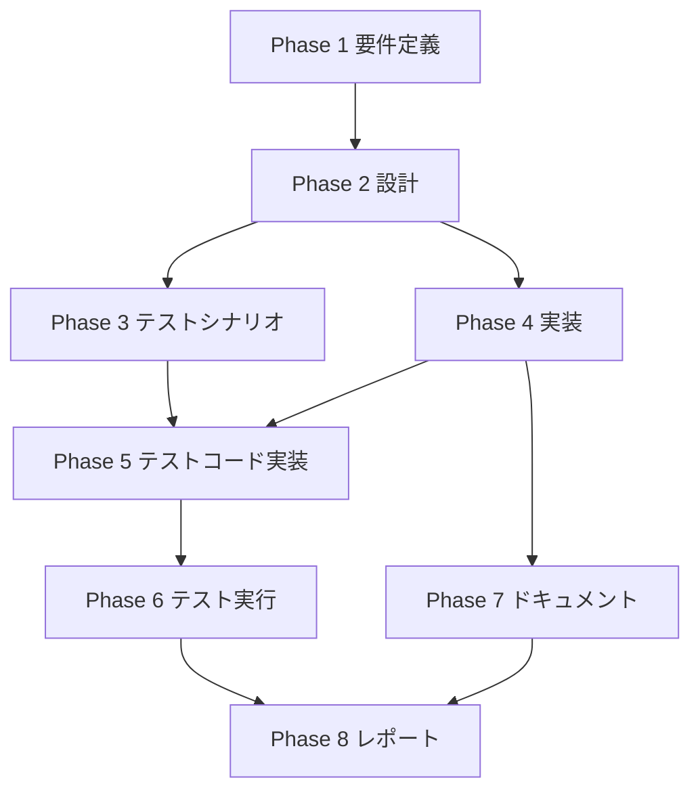

# Codex Agent 実行ログ

開始日時: 2025/11/3 2:45:15

---

## Turn 1: スレッド開始

**Thread ID**: `019a479a-c19c-7c72-8456-650e94ab5ab3`

## Turn 2: ツール実行

**種別**: コマンド実行
**コマンド**: `bash -lc 'cat .ai-workflow/issue-119/00_planning/output/planning.md'`
**ステータス**: completed (exit_code=0)

```text
# プロジェクト計画書 - Issue #119 フォローアップIssue生成品質の改善（LLM活用）

## 1. Issue分析
- **複雑度**: 複雑  
  - 新規AI連携モジュールの追加と既存GitHub連携コードの拡張を伴い、外部API統合・エラーハンドリング・フォールバック設計が必要。
  - テストレイヤーが複数（LLM呼び出しのモック検証と実APIを用いた統合テスト）に渡る。
- **見積もり工数**: 22~26時間  
  - 設計/要件整理: 6~7h、実装: 7~9h、テスト（設計＋実装＋実行）: 6~7h、ドキュメント/レポート: 3h を想定。
- **リスク評価**: 中  
  - LLM APIの不確定要素と生成品質の主観評価が残る一方、既存コードへの影響は限定範囲に収まる見込み。

## 2. 実装戦略判断
- **実装戦略**: EXTEND  
  - 既存の `issue-client.ts` を中心に機能拡張し、新たな `issue-ai-generator.ts` を追加してL TM生成ロジックを組み込む。全体構造は維持したまま責務分割を拡張。
- **テスト戦略**: UNIT_INTEGRATION  
  - プロンプト生成・フォールバック制御はモックを使ったユニットテストで網羅し、実API呼び出しは環境変数制御下で統合テストを追加して品質を確認。
- **テストコード戦略**: BOTH_TEST  
  - 既存フォローアップ生成ロジックのテストを拡張しつつ、新規 `issue-ai-generator` 用の専用テストファイルを新設する必要がある。

## 3. 影響範囲分析
- **既存コードへの影響**  
  - `src/core/github/issue-client.ts`: LLM優先フロー追加、フォールバック制御、ログ出力変更。  
  - `src/types.ts`: 新しいオプションインターフェースとIssue生成データ構造の拡張。  
  - `src/commands/execute/agent-setup.ts` などのクライアント初期化部: LLM設定引き回しが必要な場合は拡張。
- **依存関係の変更**  
  - 新規AIクライアント実装に伴う依存ライブラリ（公式SDK、HTTPクライアント）の追加検討。  
  - `.env` や設定ファイルにAPIキー/モデル指定を追加する可能性。
- **マイグレーション要否**  
  - コード上のマイグレーションは不要。  
  - 設定ファイル・ドキュメントへの追記（APIキー設定、プロンプトファイル）を行う。  
  - 将来的な `.ai-workflow/config.yml` 拡張を見据えた設計が必要。

## 4. タスク分割

### Phase 1: 要件定義 (見積もり: 3~4h)
- [x] Task 1-1: 現行フォローアップIssue生成フローの分析 (1~1.5h)
  - `issue-client.ts` のタイトル/本文生成ロジックをシーケンス図レベルで整理
  - Evaluation Phase から渡る `RemainingTask` / `IssueContext` のデータフローを確認
  - レビュー結果: 要件定義書にシーケンス分析とデータフロー整理が反映されたため完了
- [x] Task 1-2: LLM統合要件の明確化 (1.5~2h)
  - API利用要件（モデル、トークン制限、リトライ戦略）を洗い出す
  - 生成物の品質条件・受け入れ基準を仕様として文書化
  - レビュー結果: モデル候補・トークン制限・リトライ戦略が要件定義書に詳細化されたため完了

### Phase 2: 設計 (見積もり: 4~5h)
- [ ] Task 2-1: issue-ai-generatorモジュール設計 (2~2.5h)
  - クラス/関数責務、依存注入方法、フォールバックパスを設計
  - プロンプトテンプレートとレスポンス検証手順を定義
- [ ] Task 2-2: 設定・エラーハンドリング設計 (2~2.5h)
  - API鍵の取得経路とマスキング方針を決定
  - レート制限、タイムアウト、再試行ポリシーの設計

### Phase 3: テストシナリオ (見積もり: 2~3h)
- [ ] Task 3-1: テストケース設計 (2~3h)
  - ユニットテスト（成功/失敗/フォールバック/プロンプト検証）のケースを網羅化
  - 統合テストで確認すべきシナリオ（実API、環境変数制御、レスポンス妥当性）を整理

### Phase 4: 実装 (見積もり: 6~7h)
- [ ] Task 4-1: issue-ai-generator.ts の実装 (2.5~3h)
  - プロンプト生成、API呼び出し、レスポンス整形、エラーハンドリングを実装
  - ログとトレース情報（入力長、エラー理由）を追加
- [ ] Task 4-2: issue-client.ts のLLM統合 (2~2.5h)
  - 新モジュール呼び出しとフォールバック制御を実装
  - LLM無効化オプションやテレメトリ用ログを追加
- [ ] Task 4-3: 型/設定まわりの拡張 (1.5~2h)
  - `types.ts` と設定ファイルにオプションを追加
  - エージェント初期化・CLIオプションでのフラグ引き回しを反映

### Phase 5: テストコード実装 (見積もり: 4~5h)
- [ ] Task 5-1: ユニットテスト実装 (2~2.5h)
  - issue-ai-generator用モックテストを作成
  - フォールバック動作とプロンプト生成の検証テストを追加
- [ ] Task 5-2: 統合テスト準備・実装 (2~2.5h)
  - 実API利用テストを環境変数制御で実行できるよう整備
  - テストデータ、レート制限保護の仕組み（スキップ条件等）を実装

### Phase 6: テスト実行 (見積もり: 2~3h)
- [ ] Task 6-1: テスト実行と結果分析 (2~3h)
  - ユニット/統合テストを実行し、失敗ケースを分析
  - ログと生成結果をサンプルIssueと比較して品質を確認

### Phase 7: ドキュメント (見積もり: 2h)
- [ ] Task 7-1: ドキュメント更新 (2h)
  - `ARCHITECTURE.md`, `CLAUDE.md` にLLM統合方針・利用手順を追記
  - APIキー設定手順や設定例をREADME系ドキュメントに反映

### Phase 8: レポート (見積もり: 1~1.5h)
- [ ] Task 8-1: 成果物サマリーとフォローアップ (1~1.5h)
  - 実装差分、テスト結果、残課題をレポートにまとめる
  - 次フェーズ向けの改善案や運用上の注意点を記録

## 5. 依存関係


## 6. リスクと軽減策
#### リスク1: LLM APIのレート制限・エラー多発
- **影響度**: 中
- **確率**: 中
- **軽減策**: リトライ/指数バックオフを実装し、フォールバックを即時に発動できるようにする。統合テストではAPI呼び出し頻度を制限。

#### リスク2: 生成タイトル・本文の品質ばらつき
- **影響度**: 高
- **確率**: 中
- **軽減策**: プロンプトテンプレートをチューニングし、ユニットテストで最低限のセクション検証を実施。レビュー基準を明文化。

#### リスク3: 機密情報の誤送信
- **影響度**: 高
- **確率**: 低
- **軽減策**: フィルタリングレイヤーを設け、送信前にセンシティブなフィールドを除去。APIログに機密情報を残さない。

#### リスク4: 実API統合テストの不安定化
- **影響度**: 中
- **確率**: 中
- **軽減策**: 統合テストをオプトイン方式（環境変数ON時のみ実行）にし、失敗時はフォールバック確認テストを優先。

## 7. 品質ゲート
#### Phase 1: 要件定義
- [ ] LLM統合要件と生成品質基準が明文化されている
- [ ] セキュリティ・コスト要件が整理されている

#### Phase 2: 設計
- [ ] 実装戦略・テスト戦略・テストコード戦略の根拠が設計書に反映されている
- [ ] フォールバックフローとエラーハンドリングが設計されている

#### Phase 3: テストシナリオ
- [ ] 成功/失敗/フォールバックを網羅したテスト
... (truncated)
```

## Turn 3: ツール実行

**種別**: コマンド実行
**コマンド**: `bash -lc 'cat .ai-workflow/issue-119/01_requirements/output/requirements.md'`
**ステータス**: completed (exit_code=0)

```text
# 要件定義書 - Issue #119 フォローアップIssue生成品質の改善（LLM活用）

## 0. Planning Documentの確認
- `00_planning/output/planning.md` に基づき、既存 `issue-client.ts` の責務を維持しつつ新規 `issue-ai-generator.ts` でLLM連携を拡張する「EXTEND」戦略を採用する。
- テストはモック中心のユニットテストと実APIを使用する統合テストの両輪（UNIT_INTEGRATION/BOTH_TEST）で実施し、フォールバック経路を含めて網羅する。
- 主なリスクはLLM API失敗・品質ばらつき・機密情報漏洩であり、リトライ／フォールバック、プロンプト検証、フィルタリングで軽減する。
- 想定工数は22〜26時間で、要件定義・設計・実装・テスト・ドキュメント更新までを段階的に進める。

## 1. 概要
既存のフォローアップIssue自動生成機能は、タイトルが一般的すぎて検索性が低く、本文も箇条書きのみで具体的な作業内容が伝わらない。また、元IssueやPRの背景情報が十分に反映されず、残タスクの意義や優先度が不明瞭である。  
本要件はLLMを統合してタイトルと本文の生成品質を向上させ、技術的背景や実行手順を含む実務的に活用できるフォローアップIssueを自動生成することを目的とする。  
これにより、開発チームは手動でIssueを整形する手間を削減し、残タスクの理解・着手が迅速化され、ワークフロー全体のスループット向上と品質担保が期待できる。

### 1.1 現行フォローアップIssue生成フローとデータ連携（Task 1-1）
- **シーケンス概要**  
  1. Evaluation Phase完了時に `RemainingTask[]` と `IssueContext` が Phase Runner から `IssueClient.createIssueFromEvaluation()` へ渡される（`src/core/github/issue-client.ts:198`）。併せて評価レポートのファイルパスが付与される。  
  2. `createIssueFromEvaluation` 内で INFO ログを出力後、`generateFollowUpTitle` が呼び出され、最初の最大3件の残タスクを `extractKeywords` で分割・20文字以内に整形し、`[FOLLOW-UP] #<issueNumber>: <keywords>` 形式のタイトルを組み立てる（同:163行付近）。  
  3. 本文は `IssueContext` が存在する場合に `## 背景` セクションへ `summary` を記述し、`blockerStatus` `deferredReason` をサブセクションとして展開する。`IssueContext` がない場合は定型文にフォールバックする。  
  4. `RemainingTask` をループし、タスク番号ごとに `formatTaskDetails` が Markdown の見出し・対象ファイル一覧・作業手順・受け入れ基準・優先度・見積もり・依存タスクを整形し `## 残タスク詳細` 配下へ追加する（`src/core/github/issue-client.ts:210-274`）。  
  5. 末尾に `## 参考` セクションを追加し、元Issue番号と `evaluationReportPath` へのリンクを差し込んだうえで `---` によるフッタを付与する。  
  6. 完成したタイトル・本文を Octokit 経由で GitHub API `issues.create` に送信し、成功時は INFO、失敗時は `encodeWarning` 済みメッセージを ERROR ログに記録する。

- **データフロー整理**  
  | 入力ソース | 受け取り箇所 | 利用目的 |
  | --- | --- | --- |
  | `RemainingTask.task` | `formatTaskDetails` | `### Task n:` 見出しの文言として使用 |
  | `RemainingTask.targetFiles[]` | `formatTaskDetails` | `**対象ファイル**` セクションにコードパスを列挙 |
  | `RemainingTask.steps[]` | `formatTaskDetails` | 実行手順（番号付きリスト）として出力 |
  | `RemainingTask.acceptanceCriteria[]` | `formatTaskDetails` | `- [ ]` チェックボックス付き受け入れ基準を生成 |
  | `RemainingTask.priority` / `priorityReason` | `formatTaskDetails` | 優先度と根拠を1行にまとめて提示 |
  | `RemainingTask.estimatedHours` | `formatTaskDetails` | 作業見積もりを `**見積もり**` として併記 |
  | `RemainingTask.dependencies[]` | `formatTaskDetails` | 依存タスク一覧を箇条書きで記載 |
  | `IssueContext.summary` | 本文 `## 背景` | 元Issue・PRのサマリーを冒頭に表示 |
  | `IssueContext.blockerStatus` | 本文 `### 元 Issue のステータス` | ブロッカー解消状況を共有 |
  | `IssueContext.deferredReason` | 本文 `### なぜこれらのタスクが残ったか` | 残タスク発生の背景説明 |
  | `evaluationReportPath` | 本文 `## 参考` | 評価レポート位置をリンク/パスで提示 |

  `RemainingTask` と `IssueContext` は `src/types.ts:36-105` に定義されており、Evaluation Phaseからの構造体がそのまま文字列化される。今後のLLM統合ではこれらの値をプロンプト入力へ拡張するが、既存フォールバック経路との互換性を維持する。

## 2. 機能要件
Issue本文に「## TODO」節は存在しないため、概要および提案解決策から抽出した要件を整理する。

| ID | 要件 | 詳細 | 優先度 |
| --- | --- | --- | --- |
| FR-1 | LLMを用いたインテリジェントタイトル生成 | `generateIntelligentTitle` 関数で元Issue・PR・残タスクの文脈を入力に、50〜80文字の技術的に明確なタイトルを生成する。タイトルは主要コンポーネントや指標（例: 対象モジュール、目標値）を含み、既存の単語分割ロジックより情報密度が高いこと。 | 高 |
| FR-2 | 構造化されたタスク本文生成 | `generateTaskDescription` が背景、目的、実行内容（ステップ・対象ファイル・テスト方法）、受け入れ基準、関連リソースをMarkdownセクションとして出力する。本文内で1ステップずつ実行指示を明示し、テスト手順と完了条件を含める。 | 高 |
| FR-3 | フォールバック制御 | LLM呼び出し失敗・タイムアウト・無効化設定時には既存の `generateFollowUpTitle` / `formatTaskDetails` を自動で利用し、処理を中断させない。フォールバック発動状況は警告ログで記録する。 | 高 |
| FR-4 | 設定オプションの拡張 | `IssueGenerationOptions` 等を通じてLLM有効化フラグ、モデル選択、タイムアウト、最大リトライ回数を指定できるようにし、CLIや環境変数から設定可能にする。デフォルト値は後方互換を保つ。 | 中 |
| FR-5 | ログと品質監視 | LLM呼び出し成功時は入力トークン長・モデル名・生成時間をDEBUGログに出力し、失敗時は原因と再試行状況をWARNログに記録する。WARNログは `{ event_code, message, fallback_mode, retry_count }` を最低限含む構造化ペイロードとし、ログには機密情報を含めない。 | 中 |

### 2.1 LLM API利用要件（Task 1-2）
- **モデル候補とトークン制限**  
  | モデルID | プロバイダ | 想定用途 | 最大入力トークン | 最大出力トークン | 備考 |
  | --- | --- | --- | --- | --- | --- |
  | `claude-3-sonnet-20240229` | Anthropic | デフォルト（高品質/安定） | 8,000 | 2,000 | コストと品質のバランスが良い。 |
  | `gpt-4o-2024-05-13` | OpenAI | 代替（マルチリンガル/ツール連携） | 8,192 | 2,048
... (truncated)
```

## Turn 4: ツール実行

**種別**: コマンド実行
**コマンド**: `bash -lc "sed -n '1,160p' .ai-workflow/issue-119/01_requirements/output/requirements.md"`
**ステータス**: completed (exit_code=0)

```text
# 要件定義書 - Issue #119 フォローアップIssue生成品質の改善（LLM活用）

## 0. Planning Documentの確認
- `00_planning/output/planning.md` に基づき、既存 `issue-client.ts` の責務を維持しつつ新規 `issue-ai-generator.ts` でLLM連携を拡張する「EXTEND」戦略を採用する。
- テストはモック中心のユニットテストと実APIを使用する統合テストの両輪（UNIT_INTEGRATION/BOTH_TEST）で実施し、フォールバック経路を含めて網羅する。
- 主なリスクはLLM API失敗・品質ばらつき・機密情報漏洩であり、リトライ／フォールバック、プロンプト検証、フィルタリングで軽減する。
- 想定工数は22〜26時間で、要件定義・設計・実装・テスト・ドキュメント更新までを段階的に進める。

## 1. 概要
既存のフォローアップIssue自動生成機能は、タイトルが一般的すぎて検索性が低く、本文も箇条書きのみで具体的な作業内容が伝わらない。また、元IssueやPRの背景情報が十分に反映されず、残タスクの意義や優先度が不明瞭である。  
本要件はLLMを統合してタイトルと本文の生成品質を向上させ、技術的背景や実行手順を含む実務的に活用できるフォローアップIssueを自動生成することを目的とする。  
これにより、開発チームは手動でIssueを整形する手間を削減し、残タスクの理解・着手が迅速化され、ワークフロー全体のスループット向上と品質担保が期待できる。

### 1.1 現行フォローアップIssue生成フローとデータ連携（Task 1-1）
- **シーケンス概要**  
  1. Evaluation Phase完了時に `RemainingTask[]` と `IssueContext` が Phase Runner から `IssueClient.createIssueFromEvaluation()` へ渡される（`src/core/github/issue-client.ts:198`）。併せて評価レポートのファイルパスが付与される。  
  2. `createIssueFromEvaluation` 内で INFO ログを出力後、`generateFollowUpTitle` が呼び出され、最初の最大3件の残タスクを `extractKeywords` で分割・20文字以内に整形し、`[FOLLOW-UP] #<issueNumber>: <keywords>` 形式のタイトルを組み立てる（同:163行付近）。  
  3. 本文は `IssueContext` が存在する場合に `## 背景` セクションへ `summary` を記述し、`blockerStatus` `deferredReason` をサブセクションとして展開する。`IssueContext` がない場合は定型文にフォールバックする。  
  4. `RemainingTask` をループし、タスク番号ごとに `formatTaskDetails` が Markdown の見出し・対象ファイル一覧・作業手順・受け入れ基準・優先度・見積もり・依存タスクを整形し `## 残タスク詳細` 配下へ追加する（`src/core/github/issue-client.ts:210-274`）。  
  5. 末尾に `## 参考` セクションを追加し、元Issue番号と `evaluationReportPath` へのリンクを差し込んだうえで `---` によるフッタを付与する。  
  6. 完成したタイトル・本文を Octokit 経由で GitHub API `issues.create` に送信し、成功時は INFO、失敗時は `encodeWarning` 済みメッセージを ERROR ログに記録する。

- **データフロー整理**  
  | 入力ソース | 受け取り箇所 | 利用目的 |
  | --- | --- | --- |
  | `RemainingTask.task` | `formatTaskDetails` | `### Task n:` 見出しの文言として使用 |
  | `RemainingTask.targetFiles[]` | `formatTaskDetails` | `**対象ファイル**` セクションにコードパスを列挙 |
  | `RemainingTask.steps[]` | `formatTaskDetails` | 実行手順（番号付きリスト）として出力 |
  | `RemainingTask.acceptanceCriteria[]` | `formatTaskDetails` | `- [ ]` チェックボックス付き受け入れ基準を生成 |
  | `RemainingTask.priority` / `priorityReason` | `formatTaskDetails` | 優先度と根拠を1行にまとめて提示 |
  | `RemainingTask.estimatedHours` | `formatTaskDetails` | 作業見積もりを `**見積もり**` として併記 |
  | `RemainingTask.dependencies[]` | `formatTaskDetails` | 依存タスク一覧を箇条書きで記載 |
  | `IssueContext.summary` | 本文 `## 背景` | 元Issue・PRのサマリーを冒頭に表示 |
  | `IssueContext.blockerStatus` | 本文 `### 元 Issue のステータス` | ブロッカー解消状況を共有 |
  | `IssueContext.deferredReason` | 本文 `### なぜこれらのタスクが残ったか` | 残タスク発生の背景説明 |
  | `evaluationReportPath` | 本文 `## 参考` | 評価レポート位置をリンク/パスで提示 |

  `RemainingTask` と `IssueContext` は `src/types.ts:36-105` に定義されており、Evaluation Phaseからの構造体がそのまま文字列化される。今後のLLM統合ではこれらの値をプロンプト入力へ拡張するが、既存フォールバック経路との互換性を維持する。

## 2. 機能要件
Issue本文に「## TODO」節は存在しないため、概要および提案解決策から抽出した要件を整理する。

| ID | 要件 | 詳細 | 優先度 |
| --- | --- | --- | --- |
| FR-1 | LLMを用いたインテリジェントタイトル生成 | `generateIntelligentTitle` 関数で元Issue・PR・残タスクの文脈を入力に、50〜80文字の技術的に明確なタイトルを生成する。タイトルは主要コンポーネントや指標（例: 対象モジュール、目標値）を含み、既存の単語分割ロジックより情報密度が高いこと。 | 高 |
| FR-2 | 構造化されたタスク本文生成 | `generateTaskDescription` が背景、目的、実行内容（ステップ・対象ファイル・テスト方法）、受け入れ基準、関連リソースをMarkdownセクションとして出力する。本文内で1ステップずつ実行指示を明示し、テスト手順と完了条件を含める。 | 高 |
| FR-3 | フォールバック制御 | LLM呼び出し失敗・タイムアウト・無効化設定時には既存の `generateFollowUpTitle` / `formatTaskDetails` を自動で利用し、処理を中断させない。フォールバック発動状況は警告ログで記録する。 | 高 |
| FR-4 | 設定オプションの拡張 | `IssueGenerationOptions` 等を通じてLLM有効化フラグ、モデル選択、タイムアウト、最大リトライ回数を指定できるようにし、CLIや環境変数から設定可能にする。デフォルト値は後方互換を保つ。 | 中 |
| FR-5 | ログと品質監視 | LLM呼び出し成功時は入力トークン長・モデル名・生成時間をDEBUGログに出力し、失敗時は原因と再試行状況をWARNログに記録する。WARNログは `{ event_code, message, fallback_mode, retry_count }` を最低限含む構造化ペイロードとし、ログには機密情報を含めない。 | 中 |

### 2.1 LLM API利用要件（Task 1-2）
- **モデル候補とトークン制限**  
  | モデルID | プロバイダ | 想定用途 | 最大入力トークン | 最大出力トークン | 備考 |
  | --- | --- | --- | --- | --- | --- |
  | `claude-3-sonnet-20240229` | Anthropic | デフォルト（高品質/安定） | 8,000 | 2,000 | コストと品質のバランスが良い。 |
  | `gpt-4o-2024-05-13` | OpenAI | 代替（マルチリンガル/ツール連携） | 8,192 | 2,048
... (truncated)
```

## Turn 5: ツール実行

**種別**: コマンド実行
**コマンド**: `bash -lc "sed -n '160,320p' .ai-workflow/issue-119/01_requirements/output/requirements.md"`
**ステータス**: completed (exit_code=0)

## Turn 6: ツール実行

**種別**: コマンド実行
**コマンド**: `bash -lc "nl -ba .ai-workflow/issue-119/01_requirements/output/requirements.md | sed -n '110,140p'"`
**ステータス**: completed (exit_code=0)

```text
110	  - When フォローアップIssue生成を行う  
   111	  - Then 既存ロジックでタイトルと本文が生成され、WARNログにフォールバック理由が記録される
   112	- FR-4  
   113	  - Given CLI実行時にLLM関連オプションを指定する  
   114	  - When フォローアップIssue生成を実行する  
   115	  - Then 指定されたモデル・タイムアウト・リトライ設定が `issue-ai-generator` に反映され、設定が無効な場合はバリデーションエラーを返す
   116	- FR-5  
   117	  - Given LLM呼び出しが行われ、成功または失敗する  
   118	  - When ログ出力を確認する  
   119	  - Then 成功時にモデル名・処理時間等がDEBUGで、失敗時に原因と再試行情報がWARNで出力され、ログに機密情報が含まれない
   120	
   121	## 7. スコープ外
   122	- カスタムプロンプトをユーザーが任意に設定する機能（`.ai-workflow/config.yml` 拡張）は今回のスコープ外で将来検討とする。
   123	- 生成されたIssue内容の人手レビュー・承認ワークフロー自動化は対象外。
   124	- 英語以外の多言語サポートやプロジェクト固有テンプレートの自動切替は本フェーズでは扱わない。
```

## Turn 7: ツール実行

**種別**: コマンド実行
**コマンド**: `bash -lc "nl -ba .ai-workflow/issue-119/01_requirements/output/requirements.md | sed -n '1,110p'"`
**ステータス**: completed (exit_code=0)

```text
1	# 要件定義書 - Issue #119 フォローアップIssue生成品質の改善（LLM活用）
     2	
     3	## 0. Planning Documentの確認
     4	- `00_planning/output/planning.md` に基づき、既存 `issue-client.ts` の責務を維持しつつ新規 `issue-ai-generator.ts` でLLM連携を拡張する「EXTEND」戦略を採用する。
     5	- テストはモック中心のユニットテストと実APIを使用する統合テストの両輪（UNIT_INTEGRATION/BOTH_TEST）で実施し、フォールバック経路を含めて網羅する。
     6	- 主なリスクはLLM API失敗・品質ばらつき・機密情報漏洩であり、リトライ／フォールバック、プロンプト検証、フィルタリングで軽減する。
     7	- 想定工数は22〜26時間で、要件定義・設計・実装・テスト・ドキュメント更新までを段階的に進める。
     8	
     9	## 1. 概要
    10	既存のフォローアップIssue自動生成機能は、タイトルが一般的すぎて検索性が低く、本文も箇条書きのみで具体的な作業内容が伝わらない。また、元IssueやPRの背景情報が十分に反映されず、残タスクの意義や優先度が不明瞭である。  
    11	本要件はLLMを統合してタイトルと本文の生成品質を向上させ、技術的背景や実行手順を含む実務的に活用できるフォローアップIssueを自動生成することを目的とする。  
    12	これにより、開発チームは手動でIssueを整形する手間を削減し、残タスクの理解・着手が迅速化され、ワークフロー全体のスループット向上と品質担保が期待できる。
    13	
    14	### 1.1 現行フォローアップIssue生成フローとデータ連携（Task 1-1）
    15	- **シーケンス概要**  
    16	  1. Evaluation Phase完了時に `RemainingTask[]` と `IssueContext` が Phase Runner から `IssueClient.createIssueFromEvaluation()` へ渡される（`src/core/github/issue-client.ts:198`）。併せて評価レポートのファイルパスが付与される。  
    17	  2. `createIssueFromEvaluation` 内で INFO ログを出力後、`generateFollowUpTitle` が呼び出され、最初の最大3件の残タスクを `extractKeywords` で分割・20文字以内に整形し、`[FOLLOW-UP] #<issueNumber>: <keywords>` 形式のタイトルを組み立てる（同:163行付近）。  
    18	  3. 本文は `IssueContext` が存在する場合に `## 背景` セクションへ `summary` を記述し、`blockerStatus` `deferredReason` をサブセクションとして展開する。`IssueContext` がない場合は定型文にフォールバックする。  
    19	  4. `RemainingTask` をループし、タスク番号ごとに `formatTaskDetails` が Markdown の見出し・対象ファイル一覧・作業手順・受け入れ基準・優先度・見積もり・依存タスクを整形し `## 残タスク詳細` 配下へ追加する（`src/core/github/issue-client.ts:210-274`）。  
    20	  5. 末尾に `## 参考` セクションを追加し、元Issue番号と `evaluationReportPath` へのリンクを差し込んだうえで `---` によるフッタを付与する。  
    21	  6. 完成したタイトル・本文を Octokit 経由で GitHub API `issues.create` に送信し、成功時は INFO、失敗時は `encodeWarning` 済みメッセージを ERROR ログに記録する。
    22	
    23	- **データフロー整理**  
    24	  | 入力ソース | 受け取り箇所 | 利用目的 |
    25	  | --- | --- | --- |
    26	  | `RemainingTask.task` | `formatTaskDetails` | `### Task n:` 見出しの文言として使用 |
    27	  | `RemainingTask.targetFiles[]` | `formatTaskDetails` | `**対象ファイル**` セクションにコードパスを列挙 |
    28	  | `RemainingTask.steps[]` | `formatTaskDetails` | 実行手順（番号付きリスト）として出力 |
    29	  | `RemainingTask.acceptanceCriteria[]` | `formatTaskDetails` | `- [ ]` チェックボックス付き受け入れ基準を生成 |
    30	  | `RemainingTask.priority` / `priorityReason` | `formatTaskDetails` | 優先度と根拠を1行にまとめて提示 |
    31	  | `RemainingTask.estimatedHours` | `formatTaskDetails` | 作業見積もりを `**見積もり**` として併記 |
    32	  | `RemainingTask.dependencies[]` | `formatTaskDetails` | 依存タスク一覧を箇条書きで記載 |
    33	  | `IssueContext.summary` | 本文 `## 背景` | 元Issue・PRのサマリーを冒頭に表示 |
    34	  | `IssueContext.blockerStatus` | 本文 `### 元 Issue のステータス` | ブロッカー解消状況を共有 |
    35	  | `IssueContext.deferredReason` | 本文 `### なぜこれらのタスクが残ったか` | 残タスク発生の背景説明 |
    36	  | `evaluationReportPath` | 本文 `## 参考` | 評価レポート位置をリンク/パスで提示 |
    37	
    38	  `RemainingTask` と `IssueContext` は `src/types.ts:36-105` に定義されており、Evaluation Phaseからの構造体がそのまま文字列化される。今後のLLM統合ではこれらの値をプロンプト入力へ拡張するが、既存フォールバック経路との互換性を維持する。
    39	
    40	## 2. 機能要件
    41	Issue本文に「## TODO」節は存在しないため、概要および提案解決策から抽出した要件を整理する。
    42	
    43	| ID | 要件 | 詳細 | 優先度 |
    44	| --- | --- | --- | --- |
    45	| FR-1 | LLMを用いたインテリジェントタイトル生成 | `generateIntelligentTitle` 関数で元Issue・PR・残タスクの文脈を入力に、50〜80文字の技術的に明確なタイトルを生成する。タイトルは主要コンポーネントや指標（例: 対象モジュール、目標値）を含み、既存の単語分割ロジックより情報密度が高いこと。 | 高 |
    46	| FR-2 | 構造化されたタスク本文生成 | `generateTaskDescription` が背景、目的、実行内容（ステップ・対象ファイル・テスト方法）、受け入れ基準、関連リソースをMarkdownセクションとして出力する。本文内で1ステップずつ実行指示を明示し、テスト手順と完了条件を含める。 | 高 |
    47	| FR-3 | フォールバック制御 | LLM呼び出し失敗・タイムアウト・無効化設定時には既存の `generateFollowUpTitle` / `formatTaskDetails` を自動で利用し、処理を中断させない。フォールバック発動状況は警告ログで記録する。 | 高 |
    48	| FR-4 | 設定オプションの拡張 | `IssueGenerationOptions` 等を通じてLLM有効化フラグ、モデル選択、タイムアウト、最大リトライ回数を指定できるようにし、CLIや環境変数から設定可能にする。デフォルト値は後方互換を保つ。 | 中 |
    49	| FR-5 | ログと品質監視 | LLM呼び出し成功時は入力トークン長・モデル名・生成時間をDEBUGログに出力し、失敗時は原因と再試行状況をWARNログに記録する。WARNログは `{ event_code, message, fallback_mode, retry_count }` を最低限含む構造化ペ
... (truncated)
```

## Turn 8: ツール実行

**種別**: コマンド実行
**コマンド**: `bash -lc "python - <<'PY'
from pathlib import Path
text = Path('.ai-workflow/issue-119/01_requirements/output/requirements.md').read_text()
lines = text.splitlines()
for i in range(38, 80):
    if i < len(lines):
        print(f\"{i+1:4}\\t{lines[i]}\")
PY"`
**ステータス**: failed (exit_code=127)

```text
bash: line 1: python: command not found
```

## Turn 9: ツール実行

**種別**: コマンド実行
**コマンド**: `bash -lc "node - <<'NODE'
const fs = require('fs');
const lines = fs.readFileSync('.ai-workflow/issue-119/01_requirements/output/requirements.md','utf8').split(/\\r?\\n/);
for (let i=38; i<80 && i<lines.length; i++) {
  console.log(String(i+1).padStart(4,' '), lines[i]);
}
NODE"`
**ステータス**: completed (exit_code=0)

```text
39 
  40 ## 2. 機能要件
  41 Issue本文に「## TODO」節は存在しないため、概要および提案解決策から抽出した要件を整理する。
  42 
  43 | ID | 要件 | 詳細 | 優先度 |
  44 | --- | --- | --- | --- |
  45 | FR-1 | LLMを用いたインテリジェントタイトル生成 | `generateIntelligentTitle` 関数で元Issue・PR・残タスクの文脈を入力に、50〜80文字の技術的に明確なタイトルを生成する。タイトルは主要コンポーネントや指標（例: 対象モジュール、目標値）を含み、既存の単語分割ロジックより情報密度が高いこと。 | 高 |
  46 | FR-2 | 構造化されたタスク本文生成 | `generateTaskDescription` が背景、目的、実行内容（ステップ・対象ファイル・テスト方法）、受け入れ基準、関連リソースをMarkdownセクションとして出力する。本文内で1ステップずつ実行指示を明示し、テスト手順と完了条件を含める。 | 高 |
  47 | FR-3 | フォールバック制御 | LLM呼び出し失敗・タイムアウト・無効化設定時には既存の `generateFollowUpTitle` / `formatTaskDetails` を自動で利用し、処理を中断させない。フォールバック発動状況は警告ログで記録する。 | 高 |
  48 | FR-4 | 設定オプションの拡張 | `IssueGenerationOptions` 等を通じてLLM有効化フラグ、モデル選択、タイムアウト、最大リトライ回数を指定できるようにし、CLIや環境変数から設定可能にする。デフォルト値は後方互換を保つ。 | 中 |
  49 | FR-5 | ログと品質監視 | LLM呼び出し成功時は入力トークン長・モデル名・生成時間をDEBUGログに出力し、失敗時は原因と再試行状況をWARNログに記録する。WARNログは `{ event_code, message, fallback_mode, retry_count }` を最低限含む構造化ペイロードとし、ログには機密情報を含めない。 | 中 |
  50 
  51 ### 2.1 LLM API利用要件（Task 1-2）
  52 - **モデル候補とトークン制限**  
  53   | モデルID | プロバイダ | 想定用途 | 最大入力トークン | 最大出力トークン | 備考 |
  54   | --- | --- | --- | --- | --- | --- |
  55   | `claude-3-sonnet-20240229` | Anthropic | デフォルト（高品質/安定） | 8,000 | 2,000 | コストと品質のバランスが良い。 |
  56   | `gpt-4o-2024-05-13` | OpenAI | 代替（マルチリンガル/ツール連携） | 8,192 | 2,048 | 既存OpenAIインフラを活用。 |
  57   | `gpt-4o-mini` | OpenAI | 低コストフォールバック | 4,096 | 1,024 | 低コスト検証やデグレ時の緊急利用。 |
  58 
  59   - プロンプト構成は `RemainingTask` 最大5件を想定し、入力トークンが6,000を超える場合は `targetFiles`・`steps` を優先度順にトリミングし、必須フィールド（`task`, `priority`, `acceptanceCriteria`）を保持する。  
  60   - レスポンスはタイトル80文字制約・本文5セクションのテンプレートに合わせ、余剰セクションがある場合はポストプロセスで削除する。
  61 
  62 - **APIパラメータとリトライ**  
  63   | 項目 | 設定値 | 説明 |
  64   | --- | --- | --- |
  65   | `temperature` | 0.2 | 安定した出力のため低めに固定。 |
  66   | `top_p` | 0.95 | 生成多様性の微調整用。 |
  67   | `max_prompt_tokens` | 7,000 | 入力安全域（超過時は事前に短縮）。 |
  68   | `max_completion_tokens` | 1,500 | 本文生成に十分な上限。 |
  69   | `timeout_ms` | 25,000 | API呼び出しのハードタイムアウト。 |
  70   | `max_retries` | 3 | HTTP503/RateLimit/Timeout時は指数バックオフ（2s, 4s, 8s）で再試行。 |
  71   | `parallel_requests` | 1 | 連続生成でのレート制限回避。 |
  72 
  73 - **構成・設定項目**  
  74   - 環境変数: `LLM_PROVIDER`（`anthropic`/`openai`）、`LLM_MODEL`, `LLM_TIMEOUT_MS`, `LLM_MAX_TOKENS`, `LLM_MAX_RETRIES`。未設定時は `anthropic` + `claude-3-sonnet-20240229` を採用。  
  75   - CLI/設定ファイルからは `--llm-model`, `--llm-timeout`, `--llm-max-retries`, `--llm-disabled` を指定可能にし、`IssueGenerationOptions` 経由で `issue-ai-generator` へ渡す。  
  76   - 成功ログは `{ event_code: 'FOLLOWUP_LLM_SUCCESS', model, input_tokens, output_tokens, duration_ms }` を、フォールバック時は `{ event_code: 'FOLLOWUP_LLM_FALLBACK', reason, retry_count, fallback_mode: 'legacy_template' }` を出力する。
  77 
  78 - **プロンプトテンプレート管理**  
  79   - テンプレートは `issue-ai-generator` 内で定数として保持し、`IssueContext` の `summary` / `blockerStatus` / `deferredReason`、各 `RemainingTask` の `task`・`targetFiles`・`steps`・`acceptanceCriteria` をJSON構造で埋め込む。  
  80   - プロンプトに含めるログ記録はマスク済みであることをバリデーションし、`targetFiles` を最大10件に制限。
```

## Turn 10: ツール実行

**種別**: コマンド実行
**コマンド**: `bash -lc "node - <<'NODE'
const fs = require('fs');
const lines = fs.readFileSync('.ai-workflow/issue-119/01_requirements/output/requirements.md','utf8').split(/\\r?\\n/);
for (let i=80; i<120 && i<lines.length; i++) {
  console.log(String(i+1).padStart(4,' '), lines[i]);
}
NODE"`
**ステータス**: completed (exit_code=0)

```text
81   - レスポンス検証で必須セクション欠落時は `ValidationError` を発生させ、フォールバックへ移行する。
  82 
  83 ## 3. 非機能要件
  84 - **パフォーマンス**: 単一タスクあたりのLLM呼び出しは平均15秒以内に完了し、タイムアウトは30秒以下に設定する。レート制限到達時は指数バックオフで最大3回までリトライする。
  85 - **セキュリティ**: APIキーは環境変数で安全に読み込み、ログ・例外メッセージに出力しない。送信ペイロードから機密情報（トークン、クレデンシャル、個人情報）は除外するフィルタリング層を備える。
  86 - **可用性・信頼性**: フォールバック経路はLLMが失敗しても100%動作し、呼び出し結果はエラー発生時に既存生成ロジックへ切り替える。リトライ失敗時は処理継続と警告発報を保証する。
  87 - **保守性・拡張性**: LLM連携は `issue-ai-generator.ts` に集約し、将来的なモデル追加やプロンプト更新を局所化する。ユニットテスト・統合テストを追加し、既存カバレッジ水準を維持または向上させる。
  88 
  89 ## 4. 制約事項
  90 - **技術的制約**: TypeScript（Node.js 20系想定）で実装し、既存CLIアーキテクチャと互換性を保つ。LLMクライアントは既存依存（`openai`、`@anthropic-ai/claude-agent-sdk`）を利用し、新規依存追加は最小限に留める。
  91 - **リソース制約**: Planning成果物の見積もりに従い22〜26時間内で完了させる。開発リソースは既存チームのスプリント枠内に限定される。
  92 - **ポリシー制約**: CLAUDE.md/ARCHITECTURE.md に準拠し、コーディング規約・ログポリシー・セキュリティポリシーを遵守する。API利用は組織のコスト管理指針に従い、不要な試行を抑制する。
  93 
  94 ## 5. 前提条件
  95 - **システム環境**: Node.js 20.x、TypeScript 5.x、Jestベースのテスト環境、GitHub APIアクセス権限、LLM API（ClaudeまたはCodex/OpenAI）へのネットワーク接続。
  96 - **依存コンポーネント**: 既存 `issue-client.ts`、`commands/execute/agent-setup.ts`、GitHub Issue作成フロー、`openai` / `@anthropic-ai/claude-agent-sdk` クライアント。
  97 - **外部システム連携**: GitHub REST API、Claude/OpenAI API。APIキーは環境変数（例: `ANTHROPIC_API_KEY`, `OPENAI_API_KEY`）で提供される。
  98 
  99 ## 6. 受け入れ基準
 100 - FR-1  
 101   - Given LLMが有効で必要な認証情報が設定されている  
 102   - When `generateIntelligentTitle` にIssue・PR・タスク文脈を渡して実行する  
 103   - Then 50〜80文字のタイトルが生成され、主要技術要素が含まれ、空文字や重複語が発生しない
 104 - FR-2  
 105   - Given 残タスク情報とIssue/PRコンテキストが揃っている  
 106   - When `generateTaskDescription` を呼び出す  
 107   - Then 背景・目的・実行内容・受け入れ基準・関連リソースのMarkdownセクションがすべて出力され、実行内容にステップとテスト方法が含まれる
 108 - FR-3  
 109   - Given LLM呼び出しがタイムアウトまたはエラーを返す  
 110   - When フォローアップIssue生成を行う  
 111   - Then 既存ロジックでタイトルと本文が生成され、WARNログにフォールバック理由が記録される
 112 - FR-4  
 113   - Given CLI実行時にLLM関連オプションを指定する  
 114   - When フォローアップIssue生成を実行する  
 115   - Then 指定されたモデル・タイムアウト・リトライ設定が `issue-ai-generator` に反映され、設定が無効な場合はバリデーションエラーを返す
 116 - FR-5  
 117   - Given LLM呼び出しが行われ、成功または失敗する  
 118   - When ログ出力を確認する  
 119   - Then 成功時にモデル名・処理時間等がDEBUGで、失敗時に原因と再試行情報がWARNで出力され、ログに機密情報が含まれない
 120
```

## Turn 11: ツール実行

**種別**: コマンド実行
**コマンド**: `bash -lc ls`
**ステータス**: completed (exit_code=0)

```text
ARCHITECTURE.md
CHANGELOG.md
CLAUDE.md
DOCKER_AUTH_SETUP.md
Dockerfile
Jenkinsfile
LICENSE
PROGRESS.md
README.md
ROADMAP.md
SETUP_TYPESCRIPT.md
TROUBLESHOOTING.md
dist
examples
jest.config.cjs
metadata.json.template
node_modules
package-lock.json
package.json
scripts
src
tests
tsconfig.json
tsconfig.test.json
```

## Turn 12: ツール実行

**種別**: コマンド実行
**コマンド**: `bash -lc "sed -n '1,160p' README.md"`
**ステータス**: completed (exit_code=0)

```text
# AI Workflow Agent

TypeScript ベースの AI Workflow 自動化ツールキットです。Codex と Claude Code のデュアルエージェント機能により、GitHub / Jenkins / Pulumi と統合した 10 フェーズの Issue ワークフロー（planning 〜 evaluation）を実行します。

## 特長

- **Codex + Claude のデュアルエージェント** … Codex（`gpt-5-codex`）で高い推論が必要な編集を担当し、状況に応じて自動で Claude にフォールバックします。
- **決定的なプロンプト管理** … すべてのプロンプトテンプレートは `src/prompts/{phase}` に配置され、ビルド時に `dist` へコピーされます。
- **永続化されたワークフロー状態** … `.ai-workflow/issue-*/metadata.json` へメタデータを保存する `MetadataManager` により、途中再開やコスト集計が可能です。
- **マルチリポジトリ対応** … Issue URL から対象リポジトリを自動判定し、別のリポジトリに対してもワークフローを実行できます（v0.2.0 で追加）。
- **自動PR作成とタイトル最適化** … Issue タイトルをそのまま PR タイトルとして使用し、PR 一覧での可読性を向上（v0.3.0、Issue #73）。
- **GitHub & Jenkins 対応** … 個人アクセストークンと Jenkins Job DSL に対応し、Docker コンテナ内で TypeScript CLI を実行できます。

## リポジトリ構成

```
ai-workflow-agent/
├── Dockerfile                 # Node 20 ベースの Codex 対応イメージ
├── package.json               # CLI エントリーポイント（bin: ai-workflow）
├── scripts/
│   └── copy-static-assets.mjs # prompts/templates を dist/ へコピー
├── src/
│   ├── core/                  # エージェント・Git/GitHub ヘルパー・メタデータ管理
│   ├── phases/                # 各フェーズ実装（planning 〜 evaluation）
│   ├── prompts/               # フェーズ別プロンプト
│   ├── templates/             # PR ボディなどのテンプレート
│   ├── main.ts                # CLI 定義
│   └── index.ts               # bin エントリ
└── dist/                      # `npm run build` 後に生成される JS
```

## 前提条件

- Node.js 20 以上
- npm 10 以上
- Codex API キー（`CODEX_API_KEY` または `OPENAI_API_KEY`）
- Claude Code 認証ファイル（`credentials.json`）
- GitHub パーソナルアクセストークン（`repo`, `workflow`, `read:org`）
- （任意）環境変数 `REPOS_ROOT` … マルチリポジトリ環境でリポジトリの親ディレクトリを指定
- （任意）環境変数 `LOG_LEVEL` … ログレベル制御（`debug` | `info` | `warn` | `error`、デフォルト: `info`）
- （任意）環境変数 `LOG_NO_COLOR` … カラーリング無効化（CI環境用）
- （任意）Docker 24 以上（コンテナ内で実行する場合）

## クイックスタート（ローカル）

```bash
# 依存関係のインストールとビルド
npm install
npm run build

# 環境変数
export CODEX_API_KEY="sk-code..."        # Codex 高推論キー
export CLAUDE_CODE_CREDENTIALS_PATH="$HOME/.claude-code/credentials.json"
export GITHUB_TOKEN="ghp_..."
export GITHUB_REPOSITORY="tielec/ai-workflow-agent"
export REPOS_ROOT="$HOME/projects"       # （任意）リポジトリの親ディレクトリ
export LOG_LEVEL="info"                  # （任意）ログレベル（debug|info|warn|error）
export LOG_NO_COLOR="false"              # （任意）カラーリング無効化（CI環境では "true"）

# Issue URL からワークフローを初期化
node dist/index.js init \
  --issue-url https://github.com/tielec/ai-workflow-agent/issues/1

# 全フェーズ実行
node dist/index.js execute --phase all --issue 1

# 失敗したフェーズのみ再実行
node dist/index.js execute --phase requirements --issue 1 --agent codex

# マルチリポジトリの例: 別リポジトリのIssueに対してワークフローを実行
node dist/index.js init \
  --issue-url https://github.com/owner/my-app/issues/123
node dist/index.js execute --phase all --issue 123
```

## CLI オプション

```bash
ai-workflow init \
  --issue-url <URL> \
  [--branch <name>]

ai-workflow execute \
  --issue <number> \
  [--phase <name>|--phase all] \
  [--agent auto|codex|claude] \
  [--preset <name>] \
  [--force-reset] \
  [--skip-dependency-check|--ignore-dependencies] \
  [--cleanup-on-complete] \
  [--cleanup-on-complete-force] \
  [--requirements-doc <path>] [...] \
  [--git-user <name>] [--git-email <email>]

ai-workflow execute \
  --list-presets

ai-workflow review \
  --phase <name> \
  --issue <number>

ai-workflow migrate \
  --sanitize-tokens \
  [--dry-run] \
  [--issue <number>] \
  [--repo <path>]

ai-workflow rollback \
  --issue <number> \
  --to-phase <phase> \
  --reason <text> | --reason-file <path> | --interactive \
  [--to-step <step>] \
  [--from-phase <phase>] \
  [--force] \
  [--dry-run]
```

### ブランチ名のカスタマイズ

`init` コマンドで `--branch` オプションを使用すると、カスタムブランチ名でワークフローを開始できます（v0.2.0 で追加）：

```bash
# カスタムブランチ名を指定
node dist/index.js init \
  --issue-url https://github.com/tielec/ai-workflow-agent/issues/1 \
  --branch feature/add-logging

# 既存ブランチでワークフローを開始
node dist/index.js init \
  --issue-url https://github.com/tielec/ai-workflow-agent/issues/1 \
  --branch feature/existing-work

# デフォルト（未指定時は ai-workflow/issue-{issue_number
... (truncated)
```

## Turn 13: ツール実行

**種別**: コマンド実行
**コマンド**: `bash -lc "sed -n '1,160p' ARCHITECTURE.md"`
**ステータス**: completed (exit_code=0)

```text
# アーキテクチャ概要 ― AI Workflow v2 (TypeScript)

このドキュメントでは、TypeScript 版 AI Workflow の構成、モジュール間の制御フロー、および Codex / Claude Code / GitHub との連携方法を説明します。

## 全体フロー

```
CLI (src/main.ts - 約118行に削減、v0.3.0でリファクタリング)
 ├─ runCli() … CLI エントリーポイント
 ├─ commander定義（コマンドルーティングのみ）
 ├─ reportFatalError() … 致命的エラー報告
 ├─ reportExecutionSummary() … 実行サマリー表示
 └─ isValidPhaseName() … フェーズ名バリデーション

src/commands/init.ts (Issue初期化コマンド処理)
 ├─ handleInitCommand() … Issue初期化コマンドハンドラ
 ├─ validateBranchName() … ブランチ名バリデーション（Git 命名規則チェック）
 ├─ resolveBranchName() … ブランチ名解決（カスタム or デフォルト）
 ├─ ★PR タイトル生成★ … Issueタイトルを取得し、PRタイトルとして使用（v0.3.0、Issue #73）
 └─ src/core/repository-utils.ts を利用（Issue URL解析、リポジトリパス解決）

src/commands/execute.ts (フェーズ実行コマンド処理 - ファサード、v0.3.1で27%削減、Issue #46)
 ├─ handleExecuteCommand() … フェーズ実行コマンドハンドラ（各モジュールへ委譲）
 ├─ 既存公開関数の再エクスポート
 │   ├─ executePhasesSequential (workflow-executor から)
 │   ├─ executePhasesFrom (workflow-executor から)
 │   ├─ createPhaseInstance (phase-factory から)
 │   ├─ resolvePresetName (そのまま保持)
 │   └─ getPresetPhases (そのまま保持)
 └─ 内部ヘルパー関数
     ├─ canResumeWorkflow (そのまま保持)
     ├─ loadExternalDocuments (そのまま保持)
     ├─ resetMetadata (そのまま保持)
     └─ reportExecutionSummary (そのまま保持)

src/commands/execute/options-parser.ts (CLIオプション解析、v0.3.1で追加、Issue #46)
 ├─ parseExecuteOptions() … ExecuteCommandOptions を正規化
 └─ validateExecuteOptions() … 相互排他オプションの検証

src/commands/execute/agent-setup.ts (エージェント初期化、v0.3.1で追加、Issue #46)
 ├─ setupAgentClients() … Codex/Claude クライアントの初期化
 └─ resolveAgentCredentials() … 認証情報のフォールバック処理

src/commands/execute/workflow-executor.ts (ワークフロー実行、v0.3.1で追加、Issue #46)
 ├─ executePhasesSequential() … フェーズの順次実行
 ├─ executePhasesFrom() … 特定フェーズからの実行
 └─ 依存関係順にフェーズを実行
      ├─ BasePhase.run()
      │    ├─ execute()    … エージェントで成果物生成
      │    ├─ review()     … 可能ならレビューサイクル実施
      │    └─ revise()     … オプション（自動修正）
      └─ GitManager による自動コミット / プッシュ（必要に応じて）

src/core/phase-factory.ts (フェーズインスタンス生成、v0.3.1で追加、Issue #46)
 └─ createPhaseInstance() … フェーズインスタンス生成（10フェーズ対応）

src/commands/review.ts (フェーズレビューコマンド処理)
 └─ handleReviewCommand() … メタデータを取得し、フェーズの状態を表示

src/commands/list-presets.ts (プリセット一覧表示コマンド処理)
 └─ listPresets() … 利用可能なプリセット一覧を表示

src/commands/rollback.ts (フェーズ差し戻しコマンド処理、v0.4.0、Issue #90で追加)
 ├─ handleRollbackCommand() … フェーズ差し戻しコマンドハンドラ
 ├─ validateRollbackOptions() … rollbackオプションのバリデーション（exported for testing）
 ├─ loadRollbackReason() … 差し戻し理由の読み込み（--reason, --reason-file, --interactive）（exported for testing）
 ├─ generateRollbackReasonMarkdown() … ROLLBACK_REASON.mdファイルの生成（exported for testing）
 ├─ getPhaseNumber() … フェーズ名から番号を取得するヘルパー（exported for testing）
 └─ MetadataManager拡張メソッドを利用
     ├─ setRollbackContext() … 差し戻しコンテキストの設定
     ├─ getRollbackContext() … 差し戻しコンテキストの取得
     ├─ clearRollbackContext() … 差し戻しコンテキストのクリア
     ├─ addRollbackHistory() … 差し戻し履歴の追加
     ├─ updatePhaseForRollback() … 差し戻し先フェーズのステータス更新
     └─ resetSubsequentPhases() … 後続フェーズのリセット

src/core/repository-utils.ts (リポジトリ関連ユーティリティ)
 ├─ parseIssueUrl() … GitHub Issue URLからリポジトリ情報を抽出
 ├─ resolveLocalRepoPath() … リポジトリ名からローカルパスを解決
 ├─ findWorkflowMetadata() … Issue番号から対応するメタデータを探索
 └─ getRepoRoot() … Gitリポジトリのルートパスを取得

src/types/commands.ts (コマンド関連の型定義)
 ├─ PhaseContext … フェーズ実行コンテキスト
 ├─ ExecutionSummary … 実行サマリー
 ├─ IssueInfo … Issue情報
 └─ BranchValidationResult … ブランチバリデーション結果
```

## モジュール一覧

| モジュール | 役割 |
|------------|------|
| `src/main.ts` | `commander` による CLI 定義。コマンドルーティングのみを担当（約118行、v0.3.0でリファクタリング）。 |
| `src/index.ts` | `ai-workflow-v2` 実行ファイルのエントリーポイント。`runCli` を呼び出す。 |
| `src/commands/init.ts` | Issue初期化コマンド処理（約356行）。ブランチ作成、メタデータ初期化、PR作成、PRタイトル自動生成（v0.3.0、Issue #73）を担当。`handleInitCommand()`, `validateBranchName()`, `resolveBranchName()` を提供。 |
| `src/commands/execute.ts` | フェーズ実行コマンド処理（約497行、v0.3.1で27%削減、Issue #46）。ファサードパターンにより4つの専門モジュールに分離。エージェント管理、プリセット解決、フェーズ順次実行を担当。`handleExecuteCommand()`, `executePhasesSequential()`, `resolvePresetName()`, `getPresetPhases()` 等を提供。 |
| `src/commands/execute/options-parser.
... (truncated)
```

## Turn 14: ツール実行

**種別**: コマンド実行
**コマンド**: `bash -lc "sed -n '1,200p' src/core/github/issue-client.ts"`
**ステータス**: completed (exit_code=0)

```text
import { Octokit } from '@octokit/rest';
import { logger } from '../../utils/logger.js';
import { RequestError } from '@octokit/request-error';
import { getErrorMessage } from '../../utils/error-utils.js';
import { RemainingTask, IssueContext } from '../../types.js';

export interface IssueInfo {
  number: number;
  title: string;
  body: string;
  state: string;
  labels: string[];
  url: string;
  created_at: string;
  updated_at: string;
}

export interface CommentDict {
  id: number;
  user: string;
  body: string;
  created_at: string;
  updated_at: string;
}

export interface IssueCreationResult {
  success: boolean;
  issue_url: string | null;
  issue_number: number | null;
  error?: string | null;
}

export interface GenericResult {
  success: boolean;
  error?: string | null;
}

/**
 * IssueClient handles all Issue-related operations with GitHub API.
 * Responsibilities:
 * - Issue retrieval (getIssue, getIssueInfo)
 * - Issue comments retrieval (getIssueComments, getIssueCommentsDict)
 * - Comment posting (postComment)
 * - Issue closing (closeIssueWithReason)
 * - Follow-up issue creation (createIssueFromEvaluation)
 */
export class IssueClient {
  private readonly octokit: Octokit;
  private readonly owner: string;
  private readonly repo: string;

  constructor(octokit: Octokit, owner: string, repo: string) {
    this.octokit = octokit;
    this.owner = owner;
    this.repo = repo;
  }

  /**
   * Retrieves issue details from GitHub API.
   */
  public async getIssue(issueNumber: number) {
    const { data } = await this.octokit.issues.get({
      owner: this.owner,
      repo: this.repo,
      issue_number: issueNumber,
    });
    return data;
  }

  /**
   * Retrieves simplified issue information.
   */
  public async getIssueInfo(issueNumber: number): Promise<IssueInfo> {
    const issue = await this.getIssue(issueNumber);
    return {
      number: issue.number,
      title: issue.title ?? '',
      body: issue.body ?? '',
      state: issue.state ?? 'open',
      labels: (issue.labels ?? []).map((label) =>
        typeof label === 'string' ? label : label.name ?? '',
      ),
      url: issue.html_url ?? '',
      created_at: issue.created_at ?? new Date().toISOString(),
      updated_at: issue.updated_at ?? new Date().toISOString(),
    };
  }

  /**
   * Retrieves all comments for an issue.
   */
  public async getIssueComments(issueNumber: number) {
    const { data } = await this.octokit.issues.listComments({
      owner: this.owner,
      repo: this.repo,
      issue_number: issueNumber,
    });
    return data;
  }

  /**
   * Retrieves issue comments in dictionary format.
   */
  public async getIssueCommentsDict(issueNumber: number): Promise<CommentDict[]> {
    const comments = await this.getIssueComments(issueNumber);
    return comments.map((comment) => ({
      id: comment.id,
      user: comment.user?.login ?? 'unknown',
      body: comment.body ?? '',
      created_at: comment.created_at ?? '',
      updated_at: comment.updated_at ?? '',
    }));
  }

  /**
   * Posts a comment to an issue.
   */
  public async postComment(issueNumber: number, body: string) {
    const { data } = await this.octokit.issues.createComment({
      owner: this.owner,
      repo: this.repo,
      issue_number: issueNumber,
      body,
    });
    return data;
  }

  /**
   * Closes an issue with a reason comment.
   */
  public async closeIssueWithReason(issueNumber: number, reason: string): Promise<GenericResult> {
    try {
      await this.postComment(
        issueNumber,
        [
          '## ⚠️ ワークフロー中止',
          '',
          'プロジェクト評価の結果、致命的な問題が発見されたため、ワークフローを中止します。',
          '',
          '### 中止理由',
          '',
          reason,
          '',
          '### 推奨アクション',
          '',
          '- アーキテクチャの再設計',
          '- スコープの見直し',
          '- 技術選定の再検討',
          '',
          '---',
          '*AI Workflow Phase 9 (Evaluation) - ABORT*',
        ].join('\n'),
      );

      await this.octokit.iss
... (truncated)
```

## Turn 15: ツール実行

**種別**: コマンド実行
**コマンド**: `bash -lc "sed -n '200,400p' src/core/github/issue-client.ts"`
**ステータス**: completed (exit_code=0)

```text
if (keyword) {
        keywords.push(keyword);
      }
    }

    return keywords;
  }

  /**
   * フォローアップ Issue のタイトルを生成する
   *
   * @param issueNumber - 元 Issue 番号
   * @param remainingTasks - 残タスクのリスト
   * @returns Issue タイトル（80文字以内）
   */
  private generateFollowUpTitle(issueNumber: number, remainingTasks: RemainingTask[]): string {
    // キーワード抽出（最大3個）
    const keywords = this.extractKeywords(remainingTasks, 3);

    // キーワードが抽出できた場合
    if (keywords.length > 0) {
      const keywordsStr = keywords.join('・');
      const title = `[FOLLOW-UP] #${issueNumber}: ${keywordsStr}`;

      // 80文字制限
      if (title.length > 80) {
        return title.substring(0, 77) + '...';
      }

      return title;
    }

    // フォールバック: キーワードが抽出できない場合は従来形式
    return `[FOLLOW-UP] Issue #${issueNumber} - 残タスク`;
  }

  /**
   * 残タスクの詳細情報をフォーマットする
   *
   * @param task - 残タスク
   * @param taskNumber - タスク番号（1始まり）
   * @returns フォーマットされた行の配列
   */
  private formatTaskDetails(task: RemainingTask, taskNumber: number): string[] {
    const lines: string[] = [];

    // タスク見出し
    lines.push(`### Task ${taskNumber}: ${task.task}`, '');

    // 対象ファイル（存在する場合のみ）
    if (task.targetFiles && task.targetFiles.length > 0) {
      lines.push('**対象ファイル**:', '');
      task.targetFiles.forEach((file) => lines.push(`- \`${file}\``));
      lines.push('');
    }

    // 必要な作業（存在する場合のみ）
    if (task.steps && task.steps.length > 0) {
      lines.push('**必要な作業**:', '');
      task.steps.forEach((step, i) => lines.push(`${i + 1}. ${step}`));
      lines.push('');
    }

    // Acceptance Criteria（存在する場合のみ）
    if (task.acceptanceCriteria && task.acceptanceCriteria.length > 0) {
      lines.push('**Acceptance Criteria**:', '');
      task.acceptanceCriteria.forEach((ac) => lines.push(`- [ ] ${ac}`));
      lines.push('');
    }

    // Phase
    lines.push(`**Phase**: ${task.phase ?? 'unknown'}`, '');

    // 優先度 + 根拠
    const priority = task.priority ?? '中';
    const priorityLine = task.priorityReason
      ? `**優先度**: ${priority} - ${task.priorityReason}`
      : `**優先度**: ${priority}`;
    lines.push(priorityLine, '');

    // 見積もり工数
    lines.push(`**見積もり**: ${task.estimatedHours ?? '未定'}`, '');

    // 依存タスク（存在する場合のみ）
    if (task.dependencies && task.dependencies.length > 0) {
      lines.push('**依存タスク**:', '');
      task.dependencies.forEach((dep) => lines.push(`- ${dep}`));
      lines.push('');
    }

    lines.push('---'); // タスク間の区切り線

    return lines;
  }

  /**
   * Creates a follow-up issue from evaluation remaining tasks.
   *
   * @param issueNumber - 元 Issue 番号
   * @param remainingTasks - 残タスクのリスト
   * @param evaluationReportPath - Evaluation レポートのパス
   * @param issueContext - Issue コンテキスト（背景情報、オプショナル）
   * @returns Issue 作成結果
   */
  public async createIssueFromEvaluation(
    issueNumber: number,
    remainingTasks: RemainingTask[],
    evaluationReportPath: string,
    issueContext?: IssueContext,
  ): Promise<IssueCreationResult> {
    try {
      logger.info(`Creating follow-up issue for #${issueNumber} with ${remainingTasks.length} remaining tasks`);

      // タイトル生成
      const title = this.generateFollowUpTitle(issueNumber, remainingTasks);

      // 本文生成
      const lines: string[] = [];

      // 背景セクション（issueContext が存在する場合のみ）
      if (issueContext) {
        lines.push('## 背景', '');
        lines.push(issueContext.summary, '');

        if (issueContext.blockerStatus) {
          lines.push('### 元 Issue のステータス', '');
          lines.push(issueContext.blockerStatus, '');
        }

        if (issueContext.deferredReason) {
          lines.push('### なぜこれらのタスクが残ったか', '');
          lines.push(issueContext.deferredReason, '');
        }
      } else {
        // フォールバック: issueContext がない場合は従来形式
        lines.push('## 背景', '');
        lines.push(`AI Workflow Issue #${issueNumber} の評価フェーズで残タスクが見つかりました。`, '');
      }

      // 残タスク詳細セクション
      lines.push('## 残タスク詳細', '');

      for (let i = 0; i < remainingTasks.length; i++) {
... (truncated)
```

## Turn 16: ツール実行

**種別**: コマンド実行
**コマンド**: `bash -lc "sed -n '1,200p' src/types.ts"`
**ステータス**: completed (exit_code=0)

```text
export type PhaseName =
  | 'planning'
  | 'requirements'
  | 'design'
  | 'test_scenario'
  | 'implementation'
  | 'test_implementation'
  | 'testing'
  | 'documentation'
  | 'report'
  | 'evaluation';

export type PhaseStatus = 'pending' | 'in_progress' | 'completed' | 'failed';

// Issue #10: ステップ名の型定義
export type StepName = 'execute' | 'review' | 'revise';

export interface PhaseMetadata {
  status: PhaseStatus;
  retry_count: number;
  started_at: string | null;
  completed_at: string | null;
  review_result: string | null;
  output_files?: string[];
  // Issue #10: ステップ単位の進捗管理
  current_step?: StepName | null;  // 現在実行中のステップ（実行中でない場合はnull）
  completed_steps?: StepName[];     // 完了済みステップの配列（実行順序を保持）
  // Issue #90: 差し戻しコンテキスト（オプショナル）
  rollback_context?: import('./types/commands.js').RollbackContext | null;
}

/**
 * フォローアップ Issue の背景コンテキスト
 * Evaluation Phase から IssueClient に渡される
 */
export interface IssueContext {
  /**
   * 元 Issue の概要
   * 例: "Issue #91 では、BasePhase モジュール分解（Issue #49）で発生した 15 件のテスト失敗を修正しました。"
   */
  summary: string;

  /**
   * ブロッカーのステータス
   * 例: "すべてのブロッカーは解決済み"
   */
  blockerStatus: string;

  /**
   * タスクが残った理由
   * 例: "テスト失敗修正を優先したため、カバレッジ改善は後回しにした"
   */
  deferredReason: string;
}

/**
 * Evaluation Phase で検出された残タスク
 */
export interface RemainingTask {
  // ===== 既存フィールド（必須） =====
  /** タスクの説明 */
  task: string;

  /** 対象フェーズ（例: "implementation", "testing"） */
  phase: string;

  /** 優先度（例: "High", "Medium", "Low"） */
  priority: string;

  // ===== 新規フィールド（すべてオプショナル） =====

  /**
   * 優先度の理由
   * 例: "元 Issue #91 の推奨事項、ブロッカーではない"
   */
  priorityReason?: string;

  /**
   * 対象ファイル/モジュールのリスト
   * 例: ["src/core/phase-factory.ts", "src/commands/execute/agent-setup.ts"]
   */
  targetFiles?: string[];

  /**
   * 実行手順（番号付きリスト）
   * 例: ["不足しているテストケースを特定", "エッジケースのテストを追加"]
   */
  steps?: string[];

  /**
   * 受け入れ基準（Acceptance Criteria）
   * 例: ["すべての対象モジュールで 90% 以上のカバレッジを達成", "npm run test:coverage がすべてパス"]
   */
  acceptanceCriteria?: string[];

  /**
   * 依存タスク
   * 例: ["Task 1 完了後に実行", "Phase 4 の修正が必要"]
   */
  dependencies?: string[];

  /**
   * 見積もり工数
   * 例: "2-4h", "1日", "0.5h"
   */
  estimatedHours?: string;
}

export interface EvaluationPhaseMetadata extends PhaseMetadata {
  decision: string | null;
  failed_phase: PhaseName | null;
  remaining_tasks: RemainingTask[];
  created_issue_url: string | null;
  abort_reason: string | null;
}

export type PhasesMetadata = {
  [phase in Exclude<PhaseName, 'evaluation'>]: PhaseMetadata;
} & {
  evaluation: EvaluationPhaseMetadata;
};

export interface DesignDecisions {
  implementation_strategy: string | null;
  test_strategy: string | null;
  test_code_strategy: string | null;
  [key: string]: string | null;
}

export interface CostTracking {
  total_input_tokens: number;
  total_output_tokens: number;
  total_cost_usd: number;
}

/**
 * 対象リポジトリ情報
 */
export interface TargetRepository {
  /**
   * ローカルパス
   * 例: "C:\\Users\\ytaka\\TIELEC\\development\\my-app"
   */
  path: string;

  /**
   * GitHubリポジトリ名（owner/repo形式）
   * 例: "tielec/my-app"
   */
  github_name: string;

  /**
   * Git remote URL
   * 例: "https://github.com/tielec/my-app.git"
   */
  remote_url: string;

  /**
   * リポジトリオーナー
   * 例: "tielec"
   */
  owner: string;

  /**
   * リポジトリ名
   * 例: "my-app"
   */
  repo: string;
}

export interface WorkflowMetadata {
  issue_number: string;
  issue_url: string;
  issue_title: string;
  repository?: string | null;
  target_repository?: TargetRepository | null;
  workflow_version: string;
  current_phase: PhaseName;
  design_decisions: DesignDecisions;
  cost_tracking: CostTracking;
  phases: PhasesMetadata;
  pr_number?: number | null;
  pr_url?: string | null;
  branch_name?: string | null;
  github_integration?: {
    progress_comment_id?: number;
    progress_comment_url?: string;
  };
  external_documents?: Record<string, string>;
  created_at: string;
  updated_at: string;
  // Issue #90: 差し戻し履歴（オプショナル）
  rollback_history?: impo
... (truncated)
```

## Turn 17: ツール実行

**種別**: コマンド実行
**コマンド**: `bash -lc "sed -n '1,160p' CLAUDE.md"`
**ステータス**: completed (exit_code=0)

```text
# CLAUDE.md

このファイルは、このリポジトリで作業する際に Claude Code (claude.ai/code) にガイダンスを提供します。

## 概要

TypeScript ベースの AI Workflow 自動化ツールキットで、デュアルエージェント（Codex + Claude）をサポートしています。GitHub Issue に対して planning から evaluation までの 10 フェーズのワークフローを実行し、マルチリポジトリワークフロー、Jenkins 統合、永続的なメタデータ管理をサポートします。

## ビルド & 開発コマンド

```bash
# 依存関係のインストール
npm install

# TypeScript ソースのビルド（dist/ へコンパイルし、prompts/templates をコピー）
npm run build

# ウォッチモードで開発
npm run dev

# テスト実行
npm test                    # すべてのテスト
npm run test:unit          # ユニットテストのみ
npm run test:integration   # 統合テストのみ
npm run test:coverage      # カバレッジレポート付き
```

## CLI の使用方法

CLI バイナリは `ai-workflow` です（ローカル実行時は `node dist/index.js`）。

### ワークフロー初期化
```bash
# Issue に対してワークフローを初期化（メタデータ、ブランチ、ドラフト PR を作成）
node dist/index.js init --issue-url <GITHUB_ISSUE_URL>

# カスタムブランチ名を指定（v0.2.0 で追加）
node dist/index.js init --issue-url <GITHUB_ISSUE_URL> --branch <BRANCH_NAME>
```

**`--branch` オプション**:
- **未指定時**: デフォルトブランチ名 `ai-workflow/issue-{issue_number}` を使用
- **指定時**: カスタムブランチ名を使用（既存ブランチにも切り替え可能）
- **バリデーション**: Git 命名規則（空白不可、連続ドット不可、不正文字不可）に従う

**PR タイトル生成**（v0.3.0 で追加、Issue #73）:
- Issue タイトルを取得し、そのままPRタイトルとして使用
- Issue取得失敗時は従来の形式 `[AI-Workflow] Issue #<NUM>` にフォールバック
- 256文字を超えるタイトルは自動的に切り詰め（253文字 + `...`）

### フェーズ実行
```bash
# 全フェーズを実行（失敗したフェーズから自動的に再開）
node dist/index.js execute --issue <NUM> --phase all

# 特定のフェーズを実行
node dist/index.js execute --issue <NUM> --phase <PHASE_NAME>

# プリセットワークフローを実行（推奨）
node dist/index.js execute --issue <NUM> --preset <PRESET_NAME>

# 利用可能なプリセット一覧を表示
node dist/index.js list-presets
```

### フェーズ差し戻し（v0.4.0、Issue #90で追加）
```bash
# ワークフローを前のフェーズに差し戻し（直接理由を指定）
node dist/index.js rollback \
  --issue <NUM> \
  --to-phase <PHASE_NAME> \
  --reason "差し戻し理由"

# ファイルから差し戻し理由を読み込む
node dist/index.js rollback \
  --issue <NUM> \
  --to-phase <PHASE_NAME> \
  --reason-file /path/to/reason.md

# インタラクティブモード（標準入力から理由を入力）
node dist/index.js rollback \
  --issue <NUM> \
  --to-phase <PHASE_NAME> \
  --interactive

# 特定のステップへの差し戻し（revise ステップから再開）
node dist/index.js rollback \
  --issue <NUM> \
  --to-phase implementation \
  --to-step revise \
  --reason "レビューコメントの修正が必要"

# ドライラン（実際には差し戻さず、変更内容のみ確認）
node dist/index.js rollback \
  --issue <NUM> \
  --to-phase implementation \
  --reason "テスト用" \
  --dry-run
```

**主な機能**:
- **3つの入力方法**: `--reason`（直接指定）、`--reason-file`（ファイル）、`--interactive`（標準入力）
- **メタデータ自動更新**: 差し戻し先フェーズを `in_progress` に、後続フェーズを `pending` にリセット
- **差し戻し履歴記録**: `metadata.json` の `rollback_history` 配列に履歴を保存
- **プロンプト自動注入**: 差し戻し先フェーズの `revise` ステップで差し戻し理由が自動的にプロンプトに注入
- **ROLLBACK_REASON.md生成**: 差し戻し理由を記録したMarkdownファイルを自動生成

**オプション**:
- `--to-step <step>`: 差し戻し先のステップ（`execute` | `review` | `revise`、デフォルト: `revise`）
- `--from-phase <phase>`: 差し戻し元のフェーズ（省略時は現在の最新完了フェーズ）
- `--force`: 確認プロンプトをスキップ
- `--dry-run`: 実際には差し戻さず、変更内容のみを表示

### エージェントモード
- `--agent auto`（デフォルト）: `CODEX_API_KEY` が設定されていれば Codex を使用、なければ Claude にフォールバック
- `--agent codex`: Codex を強制使用（`CODEX_API_KEY` または `OPENAI_API_KEY` が必要）
- `--agent claude`: Claude を強制使用（`CLAUDE_CODE_CREDENTIALS_PATH` が必要）

### 依存関係管理
- `--skip-dependency-check`: すべての依存関係検証をバイパス（慎重に使用）
- `--ignore-dependencies`: 警告を表示するが実行を継続
- `--force-reset`: メタデータをクリアして Phase 0 から再開

## アーキテクチャ

### フェーズ実行フロー

1. **CLI エントリー**（`src/main.ts`）: コマンドルーティング → 各コマンドハンドラ（`src/commands/init.ts`, `src/commands/execute.ts` 等）へ委譲
2. **Issue URL 解析**: GitHub URL から owner/repo/issue を抽出（`parseIssueUrl` in `src/core/repository-utils.ts`）
3. **マルチリポジトリ解決**: `REPOS_ROOT` 環境変数を使用して対象リポジトリを特定
4. **メタデータ読み込み**: `.ai-workflow/issue-<NUM>/metadata.json` を読み込み、`target_repository` 情報を取得
5. **フェーズ実行**: `BasePhase.run()` による順次実行（`src/commands/execute.ts` で管理）:
   - 依存関係検証
   - `execute()`: エージェントで成果物を生成
     - **フォールバック機構** (Issue #113で追加): 成果物ファイル不在時の自動復旧
       - `enableFallback: true` のフェーズ（Planning, Requirements, Design, TestScenario, Implementation, Report）で有効
       - ① ログからの成果物抽出（`extractContentFromLog()`） → ② revise呼び出し
       - フェーズ固有ヘッダーパターンでログを解析、コンテンツ検証後に保存
... (truncated)
```

## Turn 18: ツール実行

**種別**: コマンド実行
**コマンド**: `bash -lc 'rg "createIssueFromEvaluation" -n'`
**ステータス**: failed (exit_code=127)

```text
bash: line 1: rg: command not found
```

## Turn 19: ツール実行

**種別**: コマンド実行
**コマンド**: `bash -lc 'grep -R "createIssueFromEvaluation" -n'`
**ステータス**: completed (exit_code=0)

```text
dist/phases/evaluation.js:370:            const result = await this.github.createIssueFromEvaluation(issueNumber, remainingTasks, relativeReportPath, issueContext);
dist/core/github-client.js:83:    async createIssueFromEvaluation(issueNumber, remainingTasks, evaluationReportPath, issueContext) {
dist/core/github-client.js:84:        return this.issueClient.createIssueFromEvaluation(issueNumber, remainingTasks, evaluationReportPath, issueContext);
dist/core/github/issue-client.js:11: * - Follow-up issue creation (createIssueFromEvaluation)
dist/core/github/issue-client.js:228:    async createIssueFromEvaluation(issueNumber, remainingTasks, evaluationReportPath, issueContext) {
tests/unit/github/issue-client.test.ts:301:  describe('createIssueFromEvaluation', () => {
tests/unit/github/issue-client.test.ts:317:      const result: IssueCreationResult = await issueClient.createIssueFromEvaluation(
tests/unit/github/issue-client.test.ts:353:      const result = await issueClient.createIssueFromEvaluation(24, remainingTasks, 'eval.md');
tests/unit/github/issue-client.test.ts:382:      const result = await issueClient.createIssueFromEvaluation(24, [], 'eval.md');
tests/unit/github/issue-client-followup.test.ts:24: * - インテグレーションテスト: createIssueFromEvaluation()
tests/unit/github/issue-client-followup.test.ts:433:  // ===== インテグレーションテスト: createIssueFromEvaluation() =====
tests/unit/github/issue-client-followup.test.ts:435:  describe('createIssueFromEvaluation (integration)', () => {
tests/unit/github/issue-client-followup.test.ts:440:     * When: createIssueFromEvaluation() を issueContext 付きで呼び出す
tests/unit/github/issue-client-followup.test.ts:462:      const result: IssueCreationResult = await issueClient.createIssueFromEvaluation(
tests/unit/github/issue-client-followup.test.ts:495:     * When: createIssueFromEvaluation() を issueContext なしで呼び出す
tests/unit/github/issue-client-followup.test.ts:510:      const result = await issueClient.createIssueFromEvaluation(
tests/unit/github/issue-client-followup.test.ts:536:     * When: createIssueFromEvaluation() を空配列で呼び出す
tests/unit/github/issue-client-followup.test.ts:549:      const result = await issueClient.createIssueFromEvaluation(
tests/unit/github/issue-client-followup.test.ts:571:     * When: createIssueFromEvaluation() を10個のタスクで呼び出す
tests/unit/github/issue-client-followup.test.ts:588:      const result = await issueClient.createIssueFromEvaluation(
tests/unit/github/issue-client-followup.test.ts:612:     * When: createIssueFromEvaluation() を呼び出す
tests/unit/github/issue-client-followup.test.ts:638:      const result = await issueClient.createIssueFromEvaluation(
tests/unit/github/issue-client-followup.test.ts:657:     * When: createIssueFromEvaluation() を呼び出す
tests/unit/github/issue-client-followup.test.ts:672:      const result = await issueClient.createIssueFromEvaluation(
tests/unit/github/issue-client-followup.test.ts:699:     * When: createIssueFromEvaluation() を呼び出す
tests/unit/github/issue-client-followup.test.ts:724:      const result = await issueClient.createIssueFromEvaluation(
tests/integration/github-client-facade.test.ts:315:      expect(typeof githubClient.createIssueFromEvaluation).toBe('function');
src/phases/evaluation.ts:462:      const result = await this.github.createIssueFromEvaluation(
src/core/github/issue-client.ts:45: * - Follow-up issue creation (createIssueFromEvaluation)
src/core/github/issue-client.ts:304:  public async createIssueFromEvaluation(
src/core/github-client.ts:145:  public async createIssueFromEvaluation(
src/core/github-client.ts:151:    return this.issueClient.createIssueFromEvaluation(
.ai-workflow/issue-119/02_design/output/design.md:17:GitHubClient.createIssueFromEvaluation(issueNumber, tasks, report, context, options)
.ai-workflow/issue-119/02_design/output/design.md:40:| `EvaluationPhase` | Phase 9 実装。残タスク発見時に Issue 作成を依頼 | `GitHubClient.createIssueFromEvaluation` 呼び出し |
.ai-workflow/issue-119/02_design/output/design.md:51:2. `GitHubClient
... (truncated)
```

## Turn 20: ツール実行

**種別**: コマンド実行
**コマンド**: `bash -lc 'cat .ai-workflow/issue-119/02_design/output/design.md'`
**ステータス**: completed (exit_code=0)

```text
# 詳細設計書 - Issue #119 フォローアップIssue生成品質の改善（LLM活用）

**Issue番号**: #119  
**タイトル**: フォローアップIssue生成品質の改善（LLM活用）  
**バージョン**: 1.0 (Draft)

---

## 1. アーキテクチャ設計

### 1.1 システム全体図

```
Evaluation Phase (PhaseRunner)
        │ RemainingTask[], IssueContext, Report Path
        ▼
GitHubClient.createIssueFromEvaluation(issueNumber, tasks, report, context, options)
        │
        ▼
IssueClient (LLM-aware)
   ├─ tryGenerateWithLLM(...)
   │     │ sanitized prompt payload
   │     ▼
   │  IssueAIGenerator
   │     ├─ buildPrompt()
   │     ├─ invokeProvider(OpenAI | Anthropic)
   │     └─ validateAndNormalize()
   │            │
   │            └─ JSON(title, body)
   └─ fallbackToLegacyBuilders()  ← LLM disabled/エラー時
        │
        ▼
Octokit.issues.create(...)  → GitHub Issue
```

### 1.2 コンポーネント責務と関係

| コンポーネント | 役割 | 入出力・備考 |
| --- | --- | --- |
| `EvaluationPhase` | Phase 9 実装。残タスク発見時に Issue 作成を依頼 | `GitHubClient.createIssueFromEvaluation` 呼び出し |
| `GitHubClient` | GitHub 操作ファサード | `IssueClient` へ委譲しつつ LLM オプションを引き渡す |
| `IssueClient` | フォローアップ Issue 生成の中心 | 既存組版ロジックを保持しつつ、LLM 優先フローとフォールバック制御を担当 |
| `IssueAIGenerator` (**新規**) | プロンプト生成・LLM呼び出し・レスポンス検証を集約 | OpenAI / Claude どちらにも対応するアダプタを組み込み |
| `OpenAILLMAdapter` / `ClaudeLLMAdapter` (**新規サブモジュール**) | 各プロバイダの API 呼び出しを抽象化 | 公式 SDK (`openai`, `@anthropic-ai/sdk`) を利用 |
| `SecretMasker` （既存） | プロンプトへの機密情報流出防止 | IssueAIGenerator 内で再利用 |
| `Octokit` | GitHub REST API クライアント | 最終的な Issue 作成を実行 |

### 1.3 データフロー

1. Evaluation Phase が `RemainingTask[]`, `IssueContext`, `evaluationReportPath` を構築し、`IssueGenerationOptions` を併せて `GitHubClient` に渡す。
2. `GitHubClient` はパラメータを `IssueClient.createIssueFromEvaluation` に委譲。
3. `IssueClient` は LLM が有効 (`options.enabled === true`) かつ `IssueAIGenerator` が利用可能な場合、`tryGenerateWithLLM()` を呼び出す。
4. `IssueAIGenerator` は以下を順に処理:
   - `sanitizeContext()` でタスクを最大5件に絞り、各フィールドを 512 文字にトリムしつつ、`SecretMasker` で機密値を除去。
   - `buildPrompt()` で要件定義書記載のテンプレートを埋め込み、モデルへ渡す JSON 指示を生成。
   - `invokeProvider()` で OpenAI もしくは Claude API を呼び出し、指数バックオフ付きリトライを適用。
   - `validateResponse()` で JSON 形式・必須セクション・タイトル長(50-80文字)を検証。
5. LLM 生成に成功した場合、`IssueClient` は生成タイトル/本文を採用し、Octokit へ送信。失敗や無効時は既存 `generateFollowUpTitle` / `formatTaskDetails` と同等のフォールバックを使用。
6. 成否情報は LOGGER に WARN/INFO で記録され、呼び出し元へ `IssueCreationResult` として返却される。

### 1.4 プロンプト・レスポンス設計

- プロンプトは Markdown ではなく JSON 指示テキストを生成し、LLM に `{ "title": "...", "body": "..." }` 形式で応答させる。
- 本文は `## 背景`, `## 目的`, `## 実行内容`, `## 受け入れ基準`, `## 関連リソース` の順序を必須とし、`validateResponse()` でセクション存在を確認。
- タイトルは 50〜80 文字制約。検証時に不足/超過があればフォールバック。
- レスポンスは Markdown のみ許容。HTML タグやコードフェンス内の命令文は検出して除外。

---

## 2. 実装戦略判断

### 実装戦略: EXTEND

**判断根拠**:
- 既存 `IssueClient` に LLM 優先の分岐を追加し、既存タイトル/本文組版ロジックを変更せずにフォールバックとして残すため。
- `GitHubClient`, `EvaluationPhase`, CLI オプションなど既存フローとの統合が必要で、新規モジュール追加に加えて既存コードの拡張が中心となるため。
- 既存テストスイート (`issue-client` ユニット/インテグレーション) を拡張し互換性を担保する計画であり、大規模なリファクタではないため。

---

## 3. テスト戦略判断

### テスト戦略: UNIT_INTEGRATION

**判断根拠**:
- LLM プロンプト生成・レスポンス検証・リトライ制御など純粋ロジックはモックで十分かつユニットテストで網羅可能。
- `IssueClient` との統合作用（LLM成功/失敗・フォールバック・Octokit呼び出し）は依存注入を用いたインテグレーションテストで回帰防止が必要。
- 実 API 呼び出しはオプトイン統合テスト（環境変数によるスキップ制御）で品質確認する計画のため、ユニットとインテグレーション双方が不可欠。

---

## 4. テストコード戦略判断

### テストコード戦略: BOTH_TEST

**判断根拠**:
- 既存 `tests/unit/github/issue-client(-followup).test.ts` に LLM フォールバックの追加ケースを組み込む必要がある（既存拡張）。
- `IssueAIGenerator` 専用のユニットテストファイルを新規作成し、プロンプト/バリデーション/リトライ挙動を検証する必要がある（新規作成）。

---

## 5. 影響範囲分析

- **コード**: `src/core/github/issue-client.ts`, `src/core/github-client.ts`, `src/phases/evaluation.ts`, `src/commands/execute.ts`, `src/commands/execute/options-parser.ts`, `src/types.ts`, `src/types/commands.ts` が主対象。  
- **新規モジュール**: `src/core/github/issue-ai-generator.ts`（およびサブアダプタ/ユーティリティ）、`src/prompts/follow_up_issue/*.md`。  
- **依存関係**: Anthropic 公式 SDK (`@anthropic-ai/sdk`) を追加予定。既存 `openai` は再利用。  
- **設定**: `.env` / 環境変数に LLM 有効化フラグ・モデル指定・タイムアウト設定を追加。`config.ts` にゲッターを実装。  
- **ドキュメント**: `ARCHITECTURE.md`, `CLAUDE.md`, `README.md` の LLM セク
... (truncated)
```

## Turn 21: ツール実行

**種別**: コマンド実行
**コマンド**: `bash -lc "node - <<'NODE'
const fs = require('fs');
const lines = fs.readFileSync('.ai-workflow/issue-119/02_design/output/design.md','utf8').split(/\\r?\\n/);
for (let i=0; i<lines.length; i++) {
  console.log(String(i+1).padStart(4,' '), lines[i]);
}
NODE"`
**ステータス**: completed (exit_code=0)

```text
1 # 詳細設計書 - Issue #119 フォローアップIssue生成品質の改善（LLM活用）
   2 
   3 **Issue番号**: #119  
   4 **タイトル**: フォローアップIssue生成品質の改善（LLM活用）  
   5 **バージョン**: 1.0 (Draft)
   6 
   7 ---
   8 
   9 ## 1. アーキテクチャ設計
  10 
  11 ### 1.1 システム全体図
  12 
  13 ```
  14 Evaluation Phase (PhaseRunner)
  15         │ RemainingTask[], IssueContext, Report Path
  16         ▼
  17 GitHubClient.createIssueFromEvaluation(issueNumber, tasks, report, context, options)
  18         │
  19         ▼
  20 IssueClient (LLM-aware)
  21    ├─ tryGenerateWithLLM(...)
  22    │     │ sanitized prompt payload
  23    │     ▼
  24    │  IssueAIGenerator
  25    │     ├─ buildPrompt()
  26    │     ├─ invokeProvider(OpenAI | Anthropic)
  27    │     └─ validateAndNormalize()
  28    │            │
  29    │            └─ JSON(title, body)
  30    └─ fallbackToLegacyBuilders()  ← LLM disabled/エラー時
  31         │
  32         ▼
  33 Octokit.issues.create(...)  → GitHub Issue
  34 ```
  35 
  36 ### 1.2 コンポーネント責務と関係
  37 
  38 | コンポーネント | 役割 | 入出力・備考 |
  39 | --- | --- | --- |
  40 | `EvaluationPhase` | Phase 9 実装。残タスク発見時に Issue 作成を依頼 | `GitHubClient.createIssueFromEvaluation` 呼び出し |
  41 | `GitHubClient` | GitHub 操作ファサード | `IssueClient` へ委譲しつつ LLM オプションを引き渡す |
  42 | `IssueClient` | フォローアップ Issue 生成の中心 | 既存組版ロジックを保持しつつ、LLM 優先フローとフォールバック制御を担当 |
  43 | `IssueAIGenerator` (**新規**) | プロンプト生成・LLM呼び出し・レスポンス検証を集約 | OpenAI / Claude どちらにも対応するアダプタを組み込み |
  44 | `OpenAILLMAdapter` / `ClaudeLLMAdapter` (**新規サブモジュール**) | 各プロバイダの API 呼び出しを抽象化 | 公式 SDK (`openai`, `@anthropic-ai/sdk`) を利用 |
  45 | `SecretMasker` （既存） | プロンプトへの機密情報流出防止 | IssueAIGenerator 内で再利用 |
  46 | `Octokit` | GitHub REST API クライアント | 最終的な Issue 作成を実行 |
  47 
  48 ### 1.3 データフロー
  49 
  50 1. Evaluation Phase が `RemainingTask[]`, `IssueContext`, `evaluationReportPath` を構築し、`IssueGenerationOptions` を併せて `GitHubClient` に渡す。
  51 2. `GitHubClient` はパラメータを `IssueClient.createIssueFromEvaluation` に委譲。
  52 3. `IssueClient` は LLM が有効 (`options.enabled === true`) かつ `IssueAIGenerator` が利用可能な場合、`tryGenerateWithLLM()` を呼び出す。
  53 4. `IssueAIGenerator` は以下を順に処理:
  54    - `sanitizeContext()` でタスクを最大5件に絞り、各フィールドを 512 文字にトリムしつつ、`SecretMasker` で機密値を除去。
  55    - `buildPrompt()` で要件定義書記載のテンプレートを埋め込み、モデルへ渡す JSON 指示を生成。
  56    - `invokeProvider()` で OpenAI もしくは Claude API を呼び出し、指数バックオフ付きリトライを適用。
  57    - `validateResponse()` で JSON 形式・必須セクション・タイトル長(50-80文字)を検証。
  58 5. LLM 生成に成功した場合、`IssueClient` は生成タイトル/本文を採用し、Octokit へ送信。失敗や無効時は既存 `generateFollowUpTitle` / `formatTaskDetails` と同等のフォールバックを使用。
  59 6. 成否情報は LOGGER に WARN/INFO で記録され、呼び出し元へ `IssueCreationResult` として返却される。
  60 
  61 ### 1.4 プロンプト・レスポンス設計
  62 
  63 - プロンプトは Markdown ではなく JSON 指示テキストを生成し、LLM に `{ "title": "...", "body": "..." }` 形式で応答させる。
  64 - 本文は `## 背景`, `## 目的`, `## 実行内容`, `## 受け入れ基準`, `## 関連リソース` の順序を必須とし、`validateResponse()` でセクション存在を確認。
  65 - タイトルは 50〜80 文字制約。検証時に不足/超過があればフォールバック。
  66 - レスポンスは Markdown のみ許容。HTML タグやコードフェンス内の命令文は検出して除外。
  67 
  68 ---
  69 
  70 ## 2. 実装戦略判断
  71 
  72 ### 実装戦略: EXTEND
  73 
  74 **判断根拠**:
  75 - 既存 `IssueClient` に LLM 優先の分岐を追加し、既存タイトル/本文組版ロジックを変更せずにフォールバックとして残すため。
  76 - `GitHubClient`, `EvaluationPhase`, CLI オプションなど既存フローとの統合が必要で、新規モジュール追加に加えて既存コードの拡張が中心となるため。
  77 - 既存テストスイート (`issue-client` ユニット/インテグレーション) を拡張し互換性を担保する計画であり、大規模なリファクタではないため。
  78 
  79 ---
  80 
  81 ## 3. テスト戦略判断
  82 
  83 ### テスト戦略: UNIT_INTEGRATION
  84 
  85 **判断根拠**:
  86 - LLM プロンプト生成・レスポンス検証・リトライ制御など純粋ロジックはモックで十分かつユニットテストで網羅可能。
  87 - `IssueClient` との統合作用（LLM成功/失敗・フォールバック・Octokit呼び出し）は依存注入を用いたインテグレーションテストで回帰防止が必要。
  88 - 実 API 呼び出しはオプトイン統合テスト（環境変数によるスキップ制御）で品質確認する計画のため、ユニットとインテグレーション双方が不可欠。
  89 
  90 ---
  91 
  92 ## 4. テストコード戦略判断
  93 
  94 ### テストコード戦略: BOTH_TEST
  95 
  96 **判断根拠**:
  97 - 既存 `tests/unit/github/issue-client(-followup).test.ts` に LLM フォールバックの追加ケースを組み込む必要がある（既存拡張）。
  98 - `IssueAIGenerator` 専用のユニットテストファイルを新規作成し、プロンプト/バリデーション/リトライ挙動を検証する必要がある（新規作成）。
  99 
 100 ---
 101 
 102 ## 5. 影響範囲分析
 103 
 104 - **コード**: `src/core/github/issue-cl
... (truncated)
```

## Turn 22: ツール実行

**種別**: コマンド実行
**コマンド**: `bash -lc "node - <<'NODE'
const fs = require('fs');
const lines = fs.readFileSync('.ai-workflow/issue-119/02_design/output/design.md','utf8').split(/\\r?\\n/);
for (let i=120; i<lines.length; i++) {
  console.log(String(i+1).padStart(4,' '), lines[i]);
}
NODE"`
**ステータス**: completed (exit_code=0)

```text
121   - `src/prompts/follow_up_issue/title_prompt.md`
 122   - `src/prompts/follow_up_issue/body_prompt.md`
 123   - `tests/unit/github/issue-ai-generator.test.ts`
 124   - `tests/integration/followup-issue-llm.test.ts`
 125 - **既存修正**
 126   - `src/core/github/issue-client.ts`
 127   - `src/core/github-client.ts`
 128   - `src/phases/evaluation.ts`
 129   - `src/commands/execute.ts`
 130   - `src/commands/execute/options-parser.ts`
 131   - `src/types.ts`
 132   - `src/types/commands.ts`
 133   - `src/core/config.ts`
 134   - 既存テスト: `tests/unit/github/issue-client.test.ts`, `tests/unit/github/issue-client-followup.test.ts`
 135 - **ドキュメント**
 136   - `ARCHITECTURE.md`
 137   - `CLAUDE.md`
 138   - `README.md`（環境変数と使い方）
 139 - **削除**: なし
 140 
 141 ---
 142 
 143 ## 7. 詳細設計
 144 
 145 ### 7.1 IssueAIGenerator モジュール（新規）
 146 
 147 - **クラス構成**
 148   ```mermaid
 149   classDiagram
 150     class IssueAIGenerator {
 151       -options: IssueGenerationOptions
 152       -provider: LLMProviderAdapter
 153       -secretMasker: SecretMasker
 154       -clock: Clock
 155       +generateTitle(task: RemainingTask, ctx: IssueContext, meta: GenerationMeta): Promise<string>
 156       +generateDescription(task: RemainingTask, ctx: IssueContext, meta: GenerationMeta): Promise<string>
 157       +generateIssue(task: RemainingTask, ctx: IssueContext, meta: GenerationMeta): Promise<IssueAiResult>
 158     }
 159     class LLMProviderAdapter {
 160       <<interface>>
 161       +complete(prompt: string, opts: ProviderCallOptions): Promise<string>
 162     }
 163     IssueAIGenerator --> LLMProviderAdapter
 164   ```
 165 - **主要責務**
 166   - `sanitizeContext(tasks, context)`：  
 167     - 最大5件の `RemainingTask` を対象。`task`, `steps`, `acceptanceCriteria`, `priorityReason`, `dependencies` は 512 文字にトリム。  
 168     - `targetFiles` は 10 件に制限。  
 169     - `SecretMasker` により既知のシークレット値を `[REDACTED_*]` に置換。  
 170   - `buildPrompt(payload)`：要件定義書のテンプレートを読み込み、`JSON.stringify` で安全に埋め込む。タイトルと本文を同時生成する複合リクエスト（FR-1, FR-2 対応）。
 171   - `invokeProvider(prompt)`：`options.maxRetries`（デフォルト3回）、指数バックオフ（1s, 2s, 4s）で再試行。`AbortController` による `timeoutMs` 制御。
 172   - `validateResponse(raw)`：  
 173     1. JSON 解析。  
 174     2. `title` 文字数チェック (50〜80)。  
 175     3. `body` に必須セクションが全て含まれるか正規表現で検証。  
 176     4. Markdown 以外のタグ検出 (`/<\w+>/`) で拒否。  
 177     5. 失敗時は `IssueAiValidationError` を throw。
 178   - 成功時は `{ title, body, metadata }` を返却。`metadata` には使用モデル・推定トークン数・処理時間等を格納し DEBUG ログで出力。
 179 
 180 ### 7.2 LLM Provider アダプタ
 181 
 182 - **OpenAIAdapter**
 183   - 既存 `openai` パッケージを利用し `chat.completions.create()` を呼び出す。
 184   - デフォルトモデル: `options.model ?? 'gpt-4o-mini'`。
 185   - `response_format: { type: 'json_object' }` を指定し JSON を強制。
 186 - **AnthropicAdapter**
 187   - 公式 SDK `@anthropic-ai/sdk` を追加。`messages.create()` を使用し JSON 出力を指示。
 188   - `model` は `options.model ?? 'claude-3-5-sonnet-latest'`。
 189   - プロンプトは `messages: [{ role: 'user', content: prompt }]` 形式。
 190 - **Adapter 選択ロジック**
 191   - `IssueGenerationOptions.provider` が `claude`／`openai`／`auto` を選択。  
 192   - `auto` 時は OpenAI API キーが存在すれば優先、なければ Claude にフォールバック。  
 193   - API キー未設定・どちらも使用不可の場合は `IssueAIGenerator.isAvailable()` が `false` を返却し、IssueClient が即座にフォールバックする。
 194 
 195 ### 7.3 プロンプトテンプレート
 196 
 197 - `src/prompts/follow_up_issue/title_prompt.md` / `body_prompt.md` を追加し、テンプレート文字列中に `{{original_issue_title}}` 等のプレースホルダを定義。
 198 - IssueAIGenerator は `fs.readFileSync` (同期) で初期化時にロードし、ホットリロード不要。
 199 - プロンプトには以下を明示:
 200   1. タイトル 50〜80文字。
 201   2. 本文の必須セクション。
 202   3. 各セクションの内容ガイドライン（目的は1文、実行内容は番号付きリストなど）。
 203   4. JSON 形式で回答すること。
 204 - テンプレートは Markdown コメント (`<!-- -->`) でヒューマン向け説明を記載しつつ、モデルへの指示はプレーンテキストで記述。
 205 
 206 ### 7.4 IssueClient 拡張
 207 
 208 - 依存注入: `constructor(octokit, owner, repo, aiGenerator?: IssueAIGenerator)` に変更。`GitHubClient` から `IssueAIGenerator` を渡す。
 209 - `createIssueFromEvaluation` 署名を以下に拡張:
 210   ```ts
 211   public async createIssueFromEvaluation(
 212
... (truncated)
```

## Turn 23: ツール実行

**種別**: コマンド実行
**コマンド**: `bash -lc "node - <<'NODE'
const fs = require('fs');
const lines = fs.readFileSync('.ai-workflow/issue-119/02_design/output/design.md','utf8').split(/\\r?\\n/);
for (let i=200; i<lines.length; i++) {
  console.log(String(i+1).padStart(4,' '), lines[i]);
}
NODE"`
**ステータス**: completed (exit_code=0)

```text
201   2. 本文の必須セクション。
 202   3. 各セクションの内容ガイドライン（目的は1文、実行内容は番号付きリストなど）。
 203   4. JSON 形式で回答すること。
 204 - テンプレートは Markdown コメント (`<!-- -->`) でヒューマン向け説明を記載しつつ、モデルへの指示はプレーンテキストで記述。
 205 
 206 ### 7.4 IssueClient 拡張
 207 
 208 - 依存注入: `constructor(octokit, owner, repo, aiGenerator?: IssueAIGenerator)` に変更。`GitHubClient` から `IssueAIGenerator` を渡す。
 209 - `createIssueFromEvaluation` 署名を以下に拡張:
 210   ```ts
 211   public async createIssueFromEvaluation(
 212     issueNumber: number,
 213     remainingTasks: RemainingTask[],
 214     evaluationReportPath: string,
 215     issueContext?: IssueContext,
 216     generationOptions?: IssueGenerationOptions,
 217   ): Promise<IssueCreationResult>
 218   ```
 219 - 本文生成ロジック:
 220   ```ts
 221   let aiResult: IssueAiResult | null = null;
 222   if (generationOptions?.enabled && this.aiGenerator?.isAvailable()) {
 223     aiResult = await this.tryGenerateWithLLM(...).catch((error) => {
 224       logger.warn(`LLM generation failed: ${encodeWarning(getErrorMessage(error))}`);
 225       return null;
 226     });
 227   }
 228   const title = aiResult?.title ?? this.generateFollowUpTitle(...);
 229   const body = aiResult?.body ?? this.buildLegacyBody(...);
 230   ```
 231 - `tryGenerateWithLLM` 内で:
 232   - すべての `RemainingTask` を `IssueAIGenerator.generateIssue` に渡し、レスポンスを適用。
 233   - 生成内容に必須セクションが欠落している場合は LLM 失敗扱いとし、WARN ログに詳細（セクション欠如、タイトル長超過など）を出力。
 234   - 成功時は `## LLM生成メタデータ` を本文末尾（`## 参考` 手前）に追加し、モデル名・生成時刻を記録（要件 FR-5 のログ補助。ユーザーが不要な場合は `options.appendMetadata` で制御）。
 235 
 236 ### 7.5 GitHubClient / CLI / Phase 連携
 237 
 238 - `GitHubClient` コンストラクタで `IssueAIGenerator` を初期化。`config.ts` から取得した LLM 設定を渡す。
 239 - `createIssueFromEvaluation` 引数に `generationOptions` を追加。Phase 側で動的に変更したい場合に備える。
 240 - `ExecuteCommandOptions` / `ParsedExecuteOptions` に以下オプション追加:
 241   - `followupLlmMode` (`'auto' | 'openai' | 'claude' | 'off'`, デフォルト `'off'`)
 242   - `followupLlmModel?: string`
 243   - `followupLlmTimeout?: number`
 244   - `followupLlmRetries?: number`
 245 - CLI サンプル: `ai-workflow execute --issue 119 --phase evaluation --followup-llm-mode auto`.
 246 - `PhaseContext` に `issueGenerationOptions` を追加。`PhaseFactory` と各 Phase のコンストラクタに影響が出ないよう、`BasePhase` にプロパティを追加する。
 247 - `EvaluationPhase` では `this.context.issueGenerationOptions` を取得し、`this.github.createIssueFromEvaluation(..., options)` を呼び出す。
 248 
 249 ### 7.6 型・設定拡張
 250 
 251 - `src/types.ts` に `IssueGenerationOptions` を追加:
 252   ```ts
 253   export interface IssueGenerationOptions {
 254     enabled: boolean;
 255     provider: 'auto' | 'openai' | 'claude';
 256     model?: string;
 257     temperature?: number;
 258     maxTokens?: number;
 259     timeoutMs?: number;
 260     maxRetries?: number;
 261     maxTasks?: number; // プロンプトへ含める残タスク数（デフォルト5）
 262     appendMetadata?: boolean; // 本文末尾にAIメタデータを追記するか
 263   }
 264   ```
 265 - `config.ts` へ以下ゲッター追加:
 266   - `getFollowupLlmMode()`, `getFollowupLlmModel()`, `getFollowupLlmTimeoutMs()`, `getFollowupLlmRetries()`, `getFollowupLlmEnabled()`.
 267 - 環境変数命名例:
 268   - `FOLLOWUP_LLM_MODE` (`off` / `auto` / `openai` / `claude`)
 269   - `FOLLOWUP_LLM_MODEL`
 270   - `FOLLOWUP_LLM_TIMEOUT_MS`
 271   - `FOLLOWUP_LLM_MAX_RETRIES`
 272   - `FOLLOWUP_LLM_APPEND_METADATA`
 273 
 274 ### 7.7 テスト設計詳細
 275 
 276 - **ユニットテスト (`tests/unit/github/issue-ai-generator.test.ts`)**
 277   1. `buildPrompt()` がタスク5件超過時に切り詰めること。
 278   2. API 応答が JSON 以外の場合に `ValidationError` を throw。
 279   3. 必須セクション欠落時に失敗すること。
 280   4. タイトル長が 50 未満/80 超過で失敗すること。
 281   5. リトライ設定が機能し、2回目で成功した場合に成功として返ること（モックで制御）。
 282   6. シークレット値が `[REDACTED_*]` に置換されること。
 283 - **既存ユニットテスト拡張**
 284   - `issue-client.followup` テストに LLM 成功シナリオを追加（モック `IssueAIGenerator` を注入）。
 285   - LLM 例外時に WARN ログが発生し、既存フォールバックが使われることを検証。
 286 - **インテグレーションテスト (`tests/integration/followup-issue-llm.test.ts`)**
 287   - Octokit モック + `IssueAIGenerator` フェイクを用意し、`createIssueFromEvaluation` が最終的に Octokit へ期待値を渡すことを確認。
 288   - 実 API 呼び出しテストは `process.env.FO
... (truncated)
```

## Turn 24: ツール実行

**種別**: コマンド実行
**コマンド**: `bash -lc 'grep -R "class SecretMasker" -n src'`
**ステータス**: completed (exit_code=0)

```text
src/core/secret-masker.ts:24:export class SecretMasker {
```

## Turn 25: ツール実行

**種別**: コマンド実行
**コマンド**: `bash -lc "sed -n '1,200p' src/core/github-client.ts"`
**ステータス**: completed (exit_code=0)

```text
import fs from 'fs-extra';
import { logger } from '../utils/logger.js';
import { config } from './config.js';
import { Octokit } from '@octokit/rest';
import { MetadataManager } from './metadata-manager.js';
import { RemainingTask, IssueContext } from '../types.js';
import path from 'node:path';
import { fileURLToPath } from 'node:url';
import { IssueClient, type IssueCreationResult } from './github/issue-client.js';
import { PullRequestClient, type PullRequestSummary, type PullRequestResult } from './github/pull-request-client.js';
import { CommentClient, type ProgressCommentResult } from './github/comment-client.js';
import { ReviewClient } from './github/review-client.js';
import { getErrorMessage } from '../utils/error-utils.js';

// Re-export types for backward compatibility
export type {
  IssueInfo,
  CommentDict,
  IssueCreationResult,
  GenericResult as IssueGenericResult,
} from './github/issue-client.js';
export type {
  PullRequestSummary,
  PullRequestResult,
  GenericResult as PullRequestGenericResult,
} from './github/pull-request-client.js';
export type { ProgressCommentResult } from './github/comment-client.js';

// Unified GenericResult type for backward compatibility
export interface GenericResult {
  success: boolean;
  error?: string | null;
}

const moduleDir = path.dirname(fileURLToPath(import.meta.url));
const PR_TEMPLATE_PATH = path.resolve(moduleDir, '..', 'templates', 'pr_body_template.md');
const PR_DETAILED_TEMPLATE_PATH = path.resolve(
  moduleDir,
  '..',
  'templates',
  'pr_body_detailed_template.md',
);

/**
 * GitHubClient - Facade pattern for GitHub API operations
 *
 * This class provides a unified interface to specialized GitHub clients:
 * - IssueClient: Issue operations (getIssue, postComment, closeIssue, etc.)
 * - PullRequestClient: PR operations (createPR, updatePR, closePR, etc.)
 * - CommentClient: Comment operations (postWorkflowProgress, createOrUpdateProgressComment)
 * - ReviewClient: Review result posting (postReviewResult)
 *
 * All clients share a single Octokit instance for authentication.
 * Document extraction methods remain in GitHubClient as utility functions.
 */
export class GitHubClient {
  private readonly token: string;
  private readonly repositoryName: string;
  private readonly octokit: Octokit;
  private readonly owner: string;
  private readonly repo: string;

  // Specialized clients
  private readonly issueClient: IssueClient;
  private readonly pullRequestClient: PullRequestClient;
  private readonly commentClient: CommentClient;
  private readonly reviewClient: ReviewClient;

  constructor(token?: string | null, repository?: string | null) {
    // フォールバック: 引数が指定されていない場合はConfigクラスから取得
    if (token === undefined || token === null) {
      this.token = config.getGitHubToken();
    } else {
      this.token = token;
    }
    if (!this.token) {
      throw new Error(
        'GitHub token is required. Please set the GITHUB_TOKEN environment variable.',
      );
    }

    // フォールバック: 引数が指定されていない場合はConfigクラスから取得
    if (repository === undefined || repository === null) {
      this.repositoryName = config.getGitHubRepository() ?? '';
    } else {
      this.repositoryName = repository;
    }
    if (!this.repositoryName) {
      throw new Error(
        'Repository name is required. Please set the GITHUB_REPOSITORY environment variable.',
      );
    }

    const [owner, repo] = this.repositoryName.split('/');
    if (!owner || !repo) {
      throw new Error(
        `Invalid repository name: ${this.repositoryName}. Expected owner/repo format.`,
      );
    }

    this.owner = owner;
    this.repo = repo;
    this.octokit = new Octokit({ auth: this.token });

    // Initialize specialized clients with dependency injection
    this.issueClient = new IssueClient(this.octokit, this.owner, this.repo);
    this.pullRequestClient = new PullRequestClient(
      this.octokit,
      this.owner,
      this.repo,
      this.repositoryName,
    );
    this.commentClient
... (truncated)
```

## Turn 26: ツール実行

**種別**: コマンド実行
**コマンド**: `bash -lc 'grep -n "class Config" -n src/core/config.ts'`
**ステータス**: completed (exit_code=0)

```text
125:export class Config implements IConfig {
```

## Turn 27: ツール実行

**種別**: コマンド実行
**コマンド**: `bash -lc "sed -n '300,440p' tests/unit/github/issue-client.test.ts"`
**ステータス**: completed (exit_code=0)

```text
describe('createIssueFromEvaluation', () => {
    it('should create follow-up issue successfully', async () => {
      // Given: Remaining tasks and mock response
      const remainingTasks: RemainingTask[] = [
        { task: 'ドキュメント更新', phase: 'documentation', priority: '中' },
        { task: 'テスト追加', phase: 'testing', priority: '高' },
      ];

      const mockIssue = {
        number: 25,
        html_url: 'https://github.com/owner/repo/issues/25',
      };

      mockOctokit.issues.create.mockResolvedValue({ data: mockIssue } as any);

      // When: Create issue from evaluation
      const result: IssueCreationResult = await issueClient.createIssueFromEvaluation(
        24,
        remainingTasks,
        '.ai-workflow/issue-24/08_evaluation/output/evaluation.md'
      );

      // Then: Octokit should be called with correct parameters
      expect(mockOctokit.issues.create).toHaveBeenCalledWith({
        owner: 'owner',
        repo: 'repo',
        title: '[FOLLOW-UP] Issue #24 - 残タスク',
        body: expect.stringContaining('ドキュメント更新'),
        labels: ['enhancement', 'ai-workflow-follow-up'],
      });

      // And: Result should indicate success
      expect(result).toEqual({
        success: true,
        issue_url: 'https://github.com/owner/repo/issues/25',
        issue_number: 25,
        error: null,
      });
    });

    it('should handle empty remaining tasks', async () => {
      // Given: Empty tasks array
      const remainingTasks: RemainingTask[] = [];

      const mockIssue = {
        number: 25,
        html_url: 'https://github.com/owner/repo/issues/25',
      };

      mockOctokit.issues.create.mockResolvedValue({ data: mockIssue } as any);

      // When: Create issue with empty tasks
      const result = await issueClient.createIssueFromEvaluation(24, remainingTasks, 'eval.md');

      // Then: Should still create issue successfully
      expect(result.success).toBe(true);
      expect(mockOctokit.issues.create).toHaveBeenCalled();
    });

    it('should handle RequestError appropriately', async () => {
      // Given: Mock RequestError
      const mockError = new RequestError('Validation Failed', 422, {
        request: {
          method: 'POST',
          url: 'https://api.github.com/repos/owner/repo/issues',
          headers: {},
        },
        response: {
          status: 422,
          url: 'https://api.github.com/repos/owner/repo/issues',
          headers: {},
          data: {},
        },
      });

      mockOctokit.issues.create.mockRejectedValue(mockError);

      // Spy on console.error
      const consoleErrorSpy = jest.spyOn(console, 'error').mockImplementation();

      // When: Attempt to create issue
      const result = await issueClient.createIssueFromEvaluation(24, [], 'eval.md');

      // Then: Result should indicate failure
      expect(result).toEqual({
        success: false,
        issue_url: null,
        issue_number: null,
        error: expect.stringContaining('GitHub API error: 422'),
      });

      // And: Error should be logged
      expect(consoleErrorSpy).toHaveBeenCalled();

      consoleErrorSpy.mockRestore();
    });
  });
});
```

## Turn 28: ツール実行

**種別**: コマンド実行
**コマンド**: `bash -lc "sed -n '400,520p' src/phases/evaluation.ts"`
**ステータス**: completed (exit_code=0)

```text
documentation: path.join(
        baseDir,
        '07_documentation',
        'output',
        'documentation-update-log.md',
      ),
      report: path.join(baseDir, '08_report', 'output', 'report.md'),
    };

    return Object.fromEntries(
      Object.entries(entries).map(([phase, filePath]) => [
        phase,
        {
          path: filePath,
          exists: fs.existsSync(filePath),
        },
      ]),
    );
  }

  /**
   * Evaluation 結果が「Pass with Issues」の場合の処理
   * フォローアップ Issue を作成する
   */
  private async handlePassWithIssues(
    remainingTasks: RemainingTask[],
    issueNumber: number,
    evaluationFile: string,
  ): Promise<{ success: boolean; createdIssueUrl?: string | null; error?: string }> {
    if (!remainingTasks.length) {
      logger.warn('Evaluation result is "Pass with Issues", but no remaining tasks found');
      return { success: true, createdIssueUrl: null };
    }

    logger.info(`Creating follow-up issue for ${remainingTasks.length} remaining tasks`);

    try {
      const agentWorkingDir = this.getAgentWorkingDirectory();
      const repoRoot = path.resolve(agentWorkingDir, '..', '..');
      const relativeReportPath = path.relative(repoRoot, evaluationFile);

      // ===== 新規: Issue コンテキストの構築 =====

      // Issue Summary: issueTitle から取得（メタデータに存在する場合）
      const issueTitle = this.metadata.data.issue_title ?? `Issue #${issueNumber}`;

      // Blocker Status: デフォルト値（Evaluation レポートからの抽出は Phase 1 で調査）
      // TODO: 将来的には Evaluation レポートから抽出する（Phase 9 改善、別 Issue として提案）
      const blockerStatus = 'すべてのブロッカーは解決済み';

      // Deferred Reason: デフォルト値（同上）
      // TODO: 将来的には Evaluation レポートから抽出する（Phase 9 改善、別 Issue として提案）
      const deferredReason = 'タスク優先度の判断により後回し';

      const issueContext: IssueContext = {
        summary: `この Issue は、Issue #${issueNumber}「${issueTitle}」の Evaluation フェーズで特定された残タスクをまとめたものです。`,
        blockerStatus,
        deferredReason,
      };

      // ===== 既存: フォローアップ Issue 作成 =====

      const result = await this.github.createIssueFromEvaluation(
        issueNumber,
        remainingTasks,
        relativeReportPath,
        issueContext, // 新規パラメータ
      );

      if (result.success) {
        logger.info(`Follow-up issue created: #${result.issue_number}`);
        logger.info(`Follow-up issue URL: ${result.issue_url}`);
        return { success: true, createdIssueUrl: result.issue_url ?? null };
      }

      return { success: false, error: result.error ?? 'Issue 作成に失敗しました' };
    } catch (error) {
      const message = getErrorMessage(error);
      logger.error(`Failed to create follow-up issue: ${message}`);
      return { success: false, error: message };
    }
  }

  private async handleAbort(
    abortReason: string,
    issueNumber: number,
  ): Promise<{ success: boolean; error?: string }> {
    try {
      const issueResult = await this.github.closeIssueWithReason(issueNumber, abortReason);
      if (!issueResult.success) {
        logger.warn(`Issue クローズに失敗: ${issueResult.error ?? '不明なエラー'}`);
      }

      const prNumber = await this.github.getPullRequestNumber(issueNumber);
      if (prNumber) {
        const prResult = await this.github.closePullRequest(prNumber, abortReason);
        if (!prResult.success) {
          logger.warn(`PR クローズに失敗: ${prResult.error ?? '不明なエラー'}`);
        }
      }

      return { success: true };
    } catch (error) {
      const message = getErrorMessage(error);
      return { success: false, error: message };
    }
  }

  private formatPhaseName(phase: string): string {
    return phase
      .split('_')
      .map((segment) => segment.charAt(0).toUpperCase() + segment.slice(1))
      .join(' ');
  }

  /**
   * ファイルが作成されなかった場合のフォールバック処理（Issue #82）
   *
   * 1. エージェントログから評価内容を抽出して保存
   * 2. 抽出失敗時は revise() メソッドを使用（他のフェーズと同じパターン）
   */
```

## Turn 29: ツール実行

**種別**: コマンド実行
**コマンド**: `bash -lc 'grep -R "interface PhaseContext" -n src'`
**ステータス**: failed (exit_code=1)

## Turn 30: ツール実行

**種別**: コマンド実行
**コマンド**: `bash -lc 'grep -R "PhaseContext" -n src'`
**ステータス**: completed (exit_code=0)

```text
src/types/commands.ts:10:export type PhaseContext = {
src/core/phase-factory.ts:2:import type { PhaseContext } from '../types/commands.js';
src/core/phase-factory.ts:20: * 10フェーズすべてに対応し、PhaseContext から baseParams を構築してコンストラクタに渡します。
src/core/phase-factory.ts:27:export function createPhaseInstance(phaseName: PhaseName, context: PhaseContext): BasePhase {
src/core/phase-factory.ts:28:  // PhaseContext から baseParams を構築
src/commands/execute/workflow-executor.ts:2:import type { PhaseContext, ExecutionSummary, PhaseResultMap } from '../../types/commands.js';
src/commands/execute/workflow-executor.ts:39:  context: PhaseContext,
src/commands/execute/workflow-executor.ts:100:  context: PhaseContext,
src/commands/execute.ts:19:import type { PhaseContext, ExecuteCommandOptions } from '../types/commands.js';
src/commands/execute.ts:214:  // 6. PhaseContext 構築
src/commands/execute.ts:215:  const context: PhaseContext = {
src/commands/execute.ts:243:    const presetContext: PhaseContext = {
```

## Turn 31: ツール実行

**種別**: コマンド実行
**コマンド**: `bash -lc "sed -n '1,160p' src/types/commands.ts"`
**ステータス**: completed (exit_code=0)

```text
import type { PhaseName, PhaseExecutionResult } from '../types.js';
import type { MetadataManager } from '../core/metadata-manager.js';
import type { CodexAgentClient } from '../core/codex-agent-client.js';
import type { ClaudeAgentClient } from '../core/claude-agent-client.js';
import type { GitHubClient } from '../core/github-client.js';

/**
 * フェーズ実行コンテキスト
 */
export type PhaseContext = {
  workingDir: string;
  metadataManager: MetadataManager;
  codexClient: CodexAgentClient | null;
  claudeClient: ClaudeAgentClient | null;
  githubClient: GitHubClient;
  skipDependencyCheck: boolean;
  ignoreDependencies: boolean;
  presetPhases?: PhaseName[]; // プリセット実行時のフェーズリスト（Issue #396）
};

/**
 * フェーズ実行結果マップ
 */
export type PhaseResultMap = Record<PhaseName, PhaseExecutionResult>;

/**
 * 実行サマリー
 */
export type ExecutionSummary = {
  success: boolean;
  failedPhase?: PhaseName;
  error?: string;
  results: PhaseResultMap;
};

/**
 * Issue URL解析結果
 */
export interface IssueInfo {
  /**
   * リポジトリオーナー
   * 例: "tielec"
   */
  owner: string;

  /**
   * リポジトリ名
   * 例: "my-app"
   */
  repo: string;

  /**
   * Issue番号
   * 例: 123
   */
  issueNumber: number;

  /**
   * リポジトリ名（owner/repo形式）
   * 例: "tielec/my-app"
   */
  repositoryName: string;
}

/**
 * ブランチ名バリデーション結果
 */
export interface BranchValidationResult {
  valid: boolean;
  error?: string;
}

/**
 * Execute コマンドのオプション定義
 *
 * CLI の --issue, --phase, --preset 等のオプションを型安全に扱うためのインターフェース
 */
export interface ExecuteCommandOptions {
  /**
   * Issue番号（必須）
   *
   * 例: "123"
   */
  issue: string;

  /**
   * フェーズ名または "all"（オプション）
   *
   * デフォルト: "all"
   * 利用可能な値: "planning", "requirements", "design", "test_scenario",
   *              "implementation", "test_implementation", "testing",
   *              "documentation", "report", "evaluation", "all"
   */
  phase?: string;

  /**
   * プリセット名（オプション）
   *
   * 利用可能なプリセット: "review-requirements", "review-design",
   *                       "review-test-scenario", "quick-fix",
   *                       "implementation", "testing", "finalize"
   */
  preset?: string;

  /**
   * Git コミット作成者名（オプション）
   *
   * 環境変数 GIT_COMMIT_USER_NAME に設定される
   */
  gitUser?: string;

  /**
   * Git コミット作成者メール（オプション）
   *
   * 環境変数 GIT_COMMIT_USER_EMAIL に設定される
   */
  gitEmail?: string;

  /**
   * メタデータリセットフラグ（オプション）
   *
   * デフォルト: false
   * true の場合、メタデータをクリアして Phase 0 から再開
   */
  forceReset?: boolean;

  /**
   * 依存関係チェックスキップフラグ（オプション）
   *
   * デフォルト: false
   * true の場合、すべての依存関係検証をバイパス（慎重に使用）
   */
  skipDependencyCheck?: boolean;

  /**
   * 依存関係警告無視フラグ（オプション）
   *
   * デフォルト: false
   * true の場合、依存関係の警告を表示しつつ処理を続行
   */
  ignoreDependencies?: boolean;

  /**
   * エージェントモード（オプション）
   *
   * デフォルト: 'auto'
   * - 'auto': CODEX_API_KEY が設定されていれば Codex を使用、なければ Claude にフォールバック
   * - 'codex': Codex を強制使用（CODEX_API_KEY または OPENAI_API_KEY が必要）
   * - 'claude': Claude を強制使用（CLAUDE_CODE_CREDENTIALS_PATH が必要）
   */
  agent?: 'auto' | 'codex' | 'claude';

  /**
   * 完了時クリーンアップフラグ（オプション）
   *
   * デフォルト: false
   * true の場合、Evaluation Phase 完了後に .ai-workflow/issue-* ディレクトリを削除
   */
  cleanupOnComplete?: boolean;
```

## Turn 32: ツール実行

**種別**: コマンド実行
**コマンド**: `bash -lc 'cat package.json'`
**ステータス**: completed (exit_code=0)

```text
{
  "name": "ai-workflow-agent",
  "version": "0.2.0",
  "description": "TypeScript-based AI workflow automation toolkit with dual-agent (Codex + Claude) support",
  "private": false,
  "type": "module",
  "bin": {
    "ai-workflow": "./dist/index.js"
  },
  "repository": {
    "type": "git",
    "url": "https://github.com/tielec/ai-workflow-agent.git"
  },
  "bugs": {
    "url": "https://github.com/tielec/ai-workflow-agent/issues"
  },
  "homepage": "https://github.com/tielec/ai-workflow-agent#readme",
  "keywords": [
    "ai",
    "workflow",
    "automation",
    "codex",
    "claude",
    "github",
    "jenkins",
    "pulumi",
    "typescript"
  ],
  "author": "TIELEC",
  "license": "MIT",
  "scripts": {
    "build": "tsc -p tsconfig.json && node ./scripts/copy-static-assets.mjs",
    "start": "tsx src/index.ts",
    "dev": "tsx watch src/index.ts",
    "test": "NODE_OPTIONS=--experimental-vm-modules jest",
    "test:unit": "NODE_OPTIONS=--experimental-vm-modules jest tests/unit",
    "test:integration": "NODE_OPTIONS=--experimental-vm-modules jest tests/integration",
    "test:coverage": "NODE_OPTIONS=--experimental-vm-modules jest --coverage",
    "monitor:tokens": "tsx scripts/monitor-token-detection.ts"
  },
  "dependencies": {
    "@anthropic-ai/claude-agent-sdk": "^0.1.14",
    "@octokit/rest": "^20.1.0",
    "chalk": "^5.3.0",
    "commander": "^12.1.0",
    "dotenv": "^16.4.5",
    "fs-extra": "^11.2.0",
    "minimatch": "^9.0.3",
    "openai": "^4.57.2",
    "simple-git": "^3.27.0",
    "yaml": "^2.5.0"
  },
  "devDependencies": {
    "@jest/globals": "^30.2.0",
    "@types/fs-extra": "^11.0.4",
    "@types/jest": "^30.0.0",
    "@types/minimatch": "^5.1.2",
    "@types/node": "^20.11.30",
    "jest": "^30.2.0",
    "jest-mock-extended": "^4.0.0",
    "ts-jest": "^29.4.5",
    "tsx": "^4.11.0",
    "typescript": "^5.6.3"
  }
}
```

## Turn 33: ツール実行

**種別**: file_change
**ステータス**: completed

## Turn 34: ツール実行

**種別**: file_change
**ステータス**: completed

## Turn 35: ツール実行

**種別**: agent_message
**ステータス**: completed

## Turn 36: ツール実行

**種別**: todo_list
**ステータス**: completed

## Turn 37: 実行完了

**ステータス**: completed
**所要時間**: 572296ms
**ターン数**: N/A

---

**経過時間**: 572296ms
**開始**: 2025-11-03T02:45:15.728Z
**終了**: 2025-11-03T02:54:48.024Z