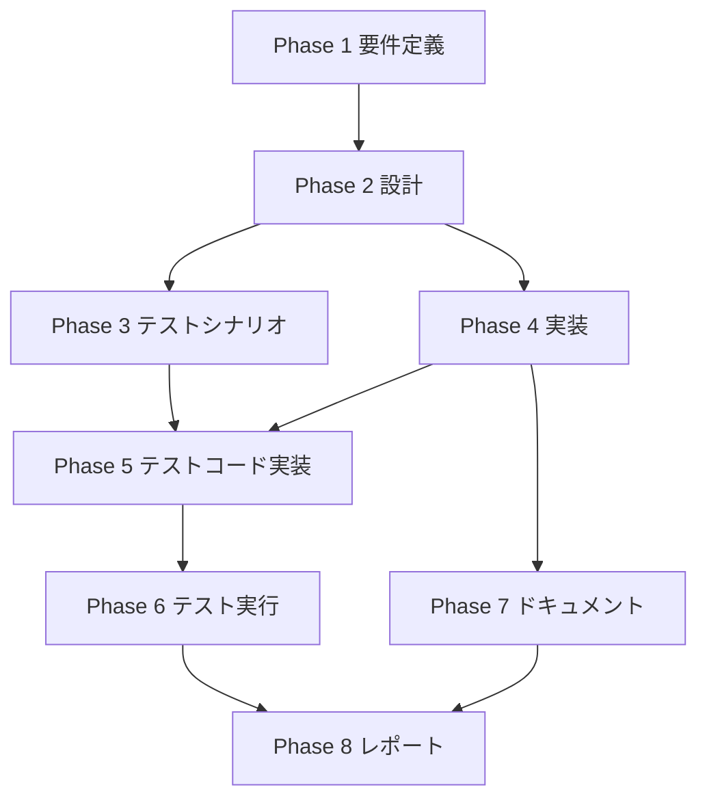

# Codex Agent 実行ログ

開始日時: 2025/11/3 2:54:49

---

## Turn 1: スレッド開始

**Thread ID**: `019a47a3-8417-7183-a0bb-553e09c563a2`

## Turn 2: ツール実行

**種別**: コマンド実行
**コマンド**: `bash -lc 'cat @.ai-workflow/issue-119/00_planning/output/planning.md'`
**ステータス**: failed (exit_code=1)

```text
cat: @.ai-workflow/issue-119/00_planning/output/planning.md: No such file or directory
```

## Turn 3: ツール実行

**種別**: コマンド実行
**コマンド**: `bash -lc ls`
**ステータス**: completed (exit_code=0)

```text
ARCHITECTURE.md
CHANGELOG.md
CLAUDE.md
DOCKER_AUTH_SETUP.md
Dockerfile
Jenkinsfile
LICENSE
PROGRESS.md
README.md
ROADMAP.md
SETUP_TYPESCRIPT.md
TROUBLESHOOTING.md
dist
examples
jest.config.cjs
metadata.json.template
node_modules
package-lock.json
package.json
scripts
src
tests
tsconfig.json
tsconfig.test.json
```

## Turn 4: ツール実行

**種別**: コマンド実行
**コマンド**: `bash -lc 'ls -a'`
**ステータス**: completed (exit_code=0)

```text
.
..
.ai-workflow
.eslintrc.json
.git
.gitignore
ARCHITECTURE.md
CHANGELOG.md
CLAUDE.md
DOCKER_AUTH_SETUP.md
Dockerfile
Jenkinsfile
LICENSE
PROGRESS.md
README.md
ROADMAP.md
SETUP_TYPESCRIPT.md
TROUBLESHOOTING.md
dist
examples
jest.config.cjs
metadata.json.template
node_modules
package-lock.json
package.json
scripts
src
tests
tsconfig.json
tsconfig.test.json
```

## Turn 5: ツール実行

**種別**: コマンド実行
**コマンド**: `bash -lc 'cat .ai-workflow/issue-119/00_planning/output/planning.md'`
**ステータス**: completed (exit_code=0)

```text
# プロジェクト計画書 - Issue #119 フォローアップIssue生成品質の改善（LLM活用）

## 1. Issue分析
- **複雑度**: 複雑  
  - 新規AI連携モジュールの追加と既存GitHub連携コードの拡張を伴い、外部API統合・エラーハンドリング・フォールバック設計が必要。
  - テストレイヤーが複数（LLM呼び出しのモック検証と実APIを用いた統合テスト）に渡る。
- **見積もり工数**: 22~26時間  
  - 設計/要件整理: 6~7h、実装: 7~9h、テスト（設計＋実装＋実行）: 6~7h、ドキュメント/レポート: 3h を想定。
- **リスク評価**: 中  
  - LLM APIの不確定要素と生成品質の主観評価が残る一方、既存コードへの影響は限定範囲に収まる見込み。

## 2. 実装戦略判断
- **実装戦略**: EXTEND  
  - 既存の `issue-client.ts` を中心に機能拡張し、新たな `issue-ai-generator.ts` を追加してL TM生成ロジックを組み込む。全体構造は維持したまま責務分割を拡張。
- **テスト戦略**: UNIT_INTEGRATION  
  - プロンプト生成・フォールバック制御はモックを使ったユニットテストで網羅し、実API呼び出しは環境変数制御下で統合テストを追加して品質を確認。
- **テストコード戦略**: BOTH_TEST  
  - 既存フォローアップ生成ロジックのテストを拡張しつつ、新規 `issue-ai-generator` 用の専用テストファイルを新設する必要がある。

## 3. 影響範囲分析
- **既存コードへの影響**  
  - `src/core/github/issue-client.ts`: LLM優先フロー追加、フォールバック制御、ログ出力変更。  
  - `src/types.ts`: 新しいオプションインターフェースとIssue生成データ構造の拡張。  
  - `src/commands/execute/agent-setup.ts` などのクライアント初期化部: LLM設定引き回しが必要な場合は拡張。
- **依存関係の変更**  
  - 新規AIクライアント実装に伴う依存ライブラリ（公式SDK、HTTPクライアント）の追加検討。  
  - `.env` や設定ファイルにAPIキー/モデル指定を追加する可能性。
- **マイグレーション要否**  
  - コード上のマイグレーションは不要。  
  - 設定ファイル・ドキュメントへの追記（APIキー設定、プロンプトファイル）を行う。  
  - 将来的な `.ai-workflow/config.yml` 拡張を見据えた設計が必要。

## 4. タスク分割

### Phase 1: 要件定義 (見積もり: 3~4h)
- [x] Task 1-1: 現行フォローアップIssue生成フローの分析 (1~1.5h)
  - `issue-client.ts` のタイトル/本文生成ロジックをシーケンス図レベルで整理
  - Evaluation Phase から渡る `RemainingTask` / `IssueContext` のデータフローを確認
  - レビュー結果: 要件定義書にシーケンス分析とデータフロー整理が反映されたため完了
- [x] Task 1-2: LLM統合要件の明確化 (1.5~2h)
  - API利用要件（モデル、トークン制限、リトライ戦略）を洗い出す
  - 生成物の品質条件・受け入れ基準を仕様として文書化
  - レビュー結果: モデル候補・トークン制限・リトライ戦略が要件定義書に詳細化されたため完了

### Phase 2: 設計 (見積もり: 4~5h)
- [ ] Task 2-1: issue-ai-generatorモジュール設計 (2~2.5h)
  - クラス/関数責務、依存注入方法、フォールバックパスを設計
  - プロンプトテンプレートとレスポンス検証手順を定義
- [ ] Task 2-2: 設定・エラーハンドリング設計 (2~2.5h)
  - API鍵の取得経路とマスキング方針を決定
  - レート制限、タイムアウト、再試行ポリシーの設計

### Phase 3: テストシナリオ (見積もり: 2~3h)
- [ ] Task 3-1: テストケース設計 (2~3h)
  - ユニットテスト（成功/失敗/フォールバック/プロンプト検証）のケースを網羅化
  - 統合テストで確認すべきシナリオ（実API、環境変数制御、レスポンス妥当性）を整理

### Phase 4: 実装 (見積もり: 6~7h)
- [ ] Task 4-1: issue-ai-generator.ts の実装 (2.5~3h)
  - プロンプト生成、API呼び出し、レスポンス整形、エラーハンドリングを実装
  - ログとトレース情報（入力長、エラー理由）を追加
- [ ] Task 4-2: issue-client.ts のLLM統合 (2~2.5h)
  - 新モジュール呼び出しとフォールバック制御を実装
  - LLM無効化オプションやテレメトリ用ログを追加
- [ ] Task 4-3: 型/設定まわりの拡張 (1.5~2h)
  - `types.ts` と設定ファイルにオプションを追加
  - エージェント初期化・CLIオプションでのフラグ引き回しを反映

### Phase 5: テストコード実装 (見積もり: 4~5h)
- [ ] Task 5-1: ユニットテスト実装 (2~2.5h)
  - issue-ai-generator用モックテストを作成
  - フォールバック動作とプロンプト生成の検証テストを追加
- [ ] Task 5-2: 統合テスト準備・実装 (2~2.5h)
  - 実API利用テストを環境変数制御で実行できるよう整備
  - テストデータ、レート制限保護の仕組み（スキップ条件等）を実装

### Phase 6: テスト実行 (見積もり: 2~3h)
- [ ] Task 6-1: テスト実行と結果分析 (2~3h)
  - ユニット/統合テストを実行し、失敗ケースを分析
  - ログと生成結果をサンプルIssueと比較して品質を確認

### Phase 7: ドキュメント (見積もり: 2h)
- [ ] Task 7-1: ドキュメント更新 (2h)
  - `ARCHITECTURE.md`, `CLAUDE.md` にLLM統合方針・利用手順を追記
  - APIキー設定手順や設定例をREADME系ドキュメントに反映

### Phase 8: レポート (見積もり: 1~1.5h)
- [ ] Task 8-1: 成果物サマリーとフォローアップ (1~1.5h)
  - 実装差分、テスト結果、残課題をレポートにまとめる
  - 次フェーズ向けの改善案や運用上の注意点を記録

## 5. 依存関係


## 6. リスクと軽減策
#### リスク1: LLM APIのレート制限・エラー多発
- **影響度**: 中
- **確率**: 中
- **軽減策**: リトライ/指数バックオフを実装し、フォールバックを即時に発動できるようにする。統合テストではAPI呼び出し頻度を制限。

#### リスク2: 生成タイトル・本文の品質ばらつき
- **影響度**: 高
- **確率**: 中
- **軽減策**: プロンプトテンプレートをチューニングし、ユニットテストで最低限のセクション検証を実施。レビュー基準を明文化。

#### リスク3: 機密情報の誤送信
- **影響度**: 高
- **確率**: 低
- **軽減策**: フィルタリングレイヤーを設け、送信前にセンシティブなフィールドを除去。APIログに機密情報を残さない。

#### リスク4: 実API統合テストの不安定化
- **影響度**: 中
- **確率**: 中
- **軽減策**: 統合テストをオプトイン方式（環境変数ON時のみ実行）にし、失敗時はフォールバック確認テストを優先。

## 7. 品質ゲート
#### Phase 1: 要件定義
- [ ] LLM統合要件と生成品質基準が明文化されている
- [ ] セキュリティ・コスト要件が整理されている

#### Phase 2: 設計
- [ ] 実装戦略・テスト戦略・テストコード戦略の根拠が設計書に反映されている
- [ ] フォールバックフローとエラーハンドリングが設計されている

#### Phase 3: テストシナリオ
- [ ] 成功/失敗/フォールバックを網羅したテスト
... (truncated)
```

## Turn 6: ツール実行

**種別**: コマンド実行
**コマンド**: `bash -lc 'cat .ai-workflow/issue-119/02_design/output/design.md'`
**ステータス**: completed (exit_code=0)

```text
# 詳細設計書 - Issue #119 フォローアップIssue生成品質の改善（LLM活用）

**Issue番号**: #119  
**タイトル**: フォローアップIssue生成品質の改善（LLM活用）  
**バージョン**: 1.1 (Design)

---

## 1. アーキテクチャ設計

### 1.1 システム全体フロー

```
EvaluationPhase (Phase 9)
    │ RemainingTask[], IssueContext, evaluation report path, generation options
    ▼
GitHubClient.createIssueFromEvaluation(...)
    │ delegates
    ▼
IssueClient (LLM-aware)
    ├─ IssueAIGenerator.generate(...)
    │     └─ LLM Provider Adapter (OpenAI / Anthropic)
    └─ Legacy builders (generateFollowUpTitle + buildLegacyBody)
    ▼
Octokit.issues.create(...) → GitHub Issue
```

### 1.2 コンポーネント責務

| コンポーネント | 役割 | 主な入出力 |
| --- | --- | --- |
| `EvaluationPhase` | Phase 9 の処理。残タスク検出後に GitHubClient へフォローアップ生成を依頼 | 入力: Evaluation結果 / 出力: IssueGenerationOptions 付き呼び出し |
| `GitHubClient` | GitHub API ファサード。IssueClient へ委譲し設定を束ねる | 入力: issue番号, tasks, options / 出力: IssueCreationResult |
| `IssueClient` | フォローアップIssue生成の集約。LLM生成→フォールバック制御→Octokit呼び出し | 入力: tasks, context, options / 出力: タイトル・本文・ログ |
| `IssueAIGenerator` (新規) | LLMプロンプト生成、API呼び出し、レスポンス検証 | 入力: tasks, context, options / 出力: { title, body, metadata } |
| `LlmProviderAdapter` (OpenAI / Anthropic) | 各APIのラッパー。タイムアウト・再試行を実装 | 入出力: prompt, call options, completion JSON |
| `config` / CLI | 環境変数・CLIから LLM 設定を収集し PhaseContextへ渡す | 入出力: Follow-up LLM 設定値 |
| `SecretMasker` (既存) | 機密情報のマスキング | 入力: プロンプトPayload / 出力: SanitizedPayload |

### 1.3 データフロー

1. ユーザーが `ai-workflow execute ...` を実行し、CLI が Follow-up LLM オプションを解析 (デフォルトは無効)。
2. `commands/execute` が `PhaseContext.issueGenerationOptions` を組み立て、`PhaseFactory` 経由で `EvaluationPhase` へ受け渡す。
3. EvaluationPhase で残タスクが存在すると `GitHubClient.createIssueFromEvaluation(issueNumber, tasks, reportPath, context, options)` を呼び出す。
4. `GitHubClient` は `IssueAIGenerator` をコンストラクタインジェクション済みの `IssueClient` に委譲。
5. `IssueClient` が `options.enabled` と `IssueAIGenerator.isAvailable()` を確認し、利用可能なら `generate(tasks, context, options)` を試行。
6. `IssueAIGenerator` は payload をサニタイズ→プロンプト生成→LLM呼び出し→検証し、成功時にタイトル・本文を返却。
7. LLM 失敗または無効時、`IssueClient` は既存の `generateFollowUpTitle` と新設の `buildLegacyBody` でフォールバック本文を生成。
8. 生成結果と `## 参考` セクション (＋オプションで LLM metadata) を結合し、Octokit で Issue を作成。ログへ成否とメタ情報を出力。

### 1.4 主なシーケンスと失敗時動作

- LLM 成功: `IssueAIGenerator` → validated result → `IssueClient` が LLM 出力を採用 → `options.appendMetadata` が true の場合にメタデータ節を付加。
- LLM タイムアウト / レート制限: Providerアダプタが指数バックオフで再試行。全失敗で `IssueAIError` を返し IssueClient が WARN を記録しフォールバック。
- プロンプト検証失敗: `IssueAIGenerator` が `IssueAIValidationError` を送出し、同様にフォールバック。
- Octokit 失敗: 既存処理と同様に ERROR ログを出力し `IssueCreationResult` で失敗を返却。

---

## 2. 実装戦略判断: EXTEND

**判断根拠**:
- 既存 `IssueClient` / `GitHubClient` / CLI フローを維持したまま責務を拡張する必要があるため。
- フォールバックとして既存テンプレートを保持しつつ LLM 生成を追加する形で後方互換を守る。
- Planning Document の戦略 (新規モジュール追加 + 既存コード拡張) と整合。

---

## 3. テスト戦略判断: UNIT_INTEGRATION

**判断根拠**:
- プロンプト生成・レスポンス検証・リトライといったロジックはモック化が容易であり、ユニットテストで網羅できる。
- GitHub 連携や Phase からのオプション伝搬、フォールバック全体の動作は統合テストで確認する必要がある。

---

## 4. テストコード戦略判断: BOTH_TEST

**判断根拠**:
- 既存 `issue-client` テストに LLM 成功/失敗パスを追加する必要がある (既存テストの拡張)。
- `IssueAIGenerator` 用の専用ユニットテストが新規に必要となる (新規テスト作成)。

---

## 5. 影響範囲分析

### 5.1 既存コードへの影響
- `src/core/github/issue-client.ts`: 依存注入、LLM 分岐、本文生成をメソッド化、WARN/DEBUG ログ拡張。
- `src/core/github-client.ts`: `IssueAIGenerator` の初期化と委譲。`createIssueFromEvaluation` にオプションパラメータ追加。
- `src/phases/evaluation.ts`: `GitHubClient.createIssueFromEvaluation` 呼び出しに LLM オプションを渡す。
- `src/commands/execute.ts` / `src/commands/execute/options-parser.ts`: CLI オプション解析に Follow-up LLM 設定を追加し `PhaseContext` へ渡す。
- `src/types.ts`: `IssueGenerationOptions` や LLM 結果の型を追加。
- `src/types/commands.ts`: `PhaseContext` に `issueGenerationOptions` プロパティを追加。
- `src/core/config.ts`: LLM 設定用ゲッターを実装。
- 既存テスト (`tests/unit/github/issue-client*.ts`, `tests/integration/github-client-facade.test.ts`) を LLM 統合ケースで更新。

### 5.2 依存関係の変更
- 追加パッケージは想定なし。既存 `openai`, `@anthropic-ai/claude-agent-sdk` を再利用。
- Jest モックは既存 `jest-mock-extended` や手動モックを活用。

### 5.3 マイグレ
... (truncated)
```

## Turn 7: ツール実行

**種別**: コマンド実行
**コマンド**: `bash -lc "sed -n '1,160p' .ai-workflow/issue-119/02_design/output/design.md"`
**ステータス**: completed (exit_code=0)

```text
# 詳細設計書 - Issue #119 フォローアップIssue生成品質の改善（LLM活用）

**Issue番号**: #119  
**タイトル**: フォローアップIssue生成品質の改善（LLM活用）  
**バージョン**: 1.1 (Design)

---

## 1. アーキテクチャ設計

### 1.1 システム全体フロー

```
EvaluationPhase (Phase 9)
    │ RemainingTask[], IssueContext, evaluation report path, generation options
    ▼
GitHubClient.createIssueFromEvaluation(...)
    │ delegates
    ▼
IssueClient (LLM-aware)
    ├─ IssueAIGenerator.generate(...)
    │     └─ LLM Provider Adapter (OpenAI / Anthropic)
    └─ Legacy builders (generateFollowUpTitle + buildLegacyBody)
    ▼
Octokit.issues.create(...) → GitHub Issue
```

### 1.2 コンポーネント責務

| コンポーネント | 役割 | 主な入出力 |
| --- | --- | --- |
| `EvaluationPhase` | Phase 9 の処理。残タスク検出後に GitHubClient へフォローアップ生成を依頼 | 入力: Evaluation結果 / 出力: IssueGenerationOptions 付き呼び出し |
| `GitHubClient` | GitHub API ファサード。IssueClient へ委譲し設定を束ねる | 入力: issue番号, tasks, options / 出力: IssueCreationResult |
| `IssueClient` | フォローアップIssue生成の集約。LLM生成→フォールバック制御→Octokit呼び出し | 入力: tasks, context, options / 出力: タイトル・本文・ログ |
| `IssueAIGenerator` (新規) | LLMプロンプト生成、API呼び出し、レスポンス検証 | 入力: tasks, context, options / 出力: { title, body, metadata } |
| `LlmProviderAdapter` (OpenAI / Anthropic) | 各APIのラッパー。タイムアウト・再試行を実装 | 入出力: prompt, call options, completion JSON |
| `config` / CLI | 環境変数・CLIから LLM 設定を収集し PhaseContextへ渡す | 入出力: Follow-up LLM 設定値 |
| `SecretMasker` (既存) | 機密情報のマスキング | 入力: プロンプトPayload / 出力: SanitizedPayload |

### 1.3 データフロー

1. ユーザーが `ai-workflow execute ...` を実行し、CLI が Follow-up LLM オプションを解析 (デフォルトは無効)。
2. `commands/execute` が `PhaseContext.issueGenerationOptions` を組み立て、`PhaseFactory` 経由で `EvaluationPhase` へ受け渡す。
3. EvaluationPhase で残タスクが存在すると `GitHubClient.createIssueFromEvaluation(issueNumber, tasks, reportPath, context, options)` を呼び出す。
4. `GitHubClient` は `IssueAIGenerator` をコンストラクタインジェクション済みの `IssueClient` に委譲。
5. `IssueClient` が `options.enabled` と `IssueAIGenerator.isAvailable()` を確認し、利用可能なら `generate(tasks, context, options)` を試行。
6. `IssueAIGenerator` は payload をサニタイズ→プロンプト生成→LLM呼び出し→検証し、成功時にタイトル・本文を返却。
7. LLM 失敗または無効時、`IssueClient` は既存の `generateFollowUpTitle` と新設の `buildLegacyBody` でフォールバック本文を生成。
8. 生成結果と `## 参考` セクション (＋オプションで LLM metadata) を結合し、Octokit で Issue を作成。ログへ成否とメタ情報を出力。

### 1.4 主なシーケンスと失敗時動作

- LLM 成功: `IssueAIGenerator` → validated result → `IssueClient` が LLM 出力を採用 → `options.appendMetadata` が true の場合にメタデータ節を付加。
- LLM タイムアウト / レート制限: Providerアダプタが指数バックオフで再試行。全失敗で `IssueAIError` を返し IssueClient が WARN を記録しフォールバック。
- プロンプト検証失敗: `IssueAIGenerator` が `IssueAIValidationError` を送出し、同様にフォールバック。
- Octokit 失敗: 既存処理と同様に ERROR ログを出力し `IssueCreationResult` で失敗を返却。

---

## 2. 実装戦略判断: EXTEND

**判断根拠**:
- 既存 `IssueClient` / `GitHubClient` / CLI フローを維持したまま責務を拡張する必要があるため。
- フォールバックとして既存テンプレートを保持しつつ LLM 生成を追加する形で後方互換を守る。
- Planning Document の戦略 (新規モジュール追加 + 既存コード拡張) と整合。

---

## 3. テスト戦略判断: UNIT_INTEGRATION

**判断根拠**:
- プロンプト生成・レスポンス検証・リトライといったロジックはモック化が容易であり、ユニットテストで網羅できる。
- GitHub 連携や Phase からのオプション伝搬、フォールバック全体の動作は統合テストで確認する必要がある。

---

## 4. テストコード戦略判断: BOTH_TEST

**判断根拠**:
- 既存 `issue-client` テストに LLM 成功/失敗パスを追加する必要がある (既存テストの拡張)。
- `IssueAIGenerator` 用の専用ユニットテストが新規に必要となる (新規テスト作成)。

---

## 5. 影響範囲分析

### 5.1 既存コードへの影響
- `src/core/github/issue-client.ts`: 依存注入、LLM 分岐、本文生成をメソッド化、WARN/DEBUG ログ拡張。
- `src/core/github-client.ts`: `IssueAIGenerator` の初期化と委譲。`createIssueFromEvaluation` にオプションパラメータ追加。
- `src/phases/evaluation.ts`: `GitHubClient.createIssueFromEvaluation` 呼び出しに LLM オプションを渡す。
- `src/commands/execute.ts` / `src/commands/execute/options-parser.ts`: CLI オプション解析に Follow-up LLM 設定を追加し `PhaseContext` へ渡す。
- `src/types.ts`: `IssueGenerationOptions` や LLM 結果の型を追加。
- `src/types/commands.ts`: `PhaseContext` に `issueGenerationOptions` プロパティを追加。
- `src/core/config.ts`: LLM 設定用ゲッターを実装。
- 既存テスト (`tests/unit/github/issue-client*.ts`, `tests/integration/github-client-facade.test.ts`) を LLM 統合ケースで更新。

### 5.2 依存関係の変更
- 追加パッケージは想定なし。既存 `openai`, `@anthropic-ai/claude-agent-sdk` を再利用。
- Jest モックは既存 `jest-mock-extended` や手動モックを活用。

### 5.3 マイグレ
... (truncated)
```

## Turn 8: ツール実行

**種別**: コマンド実行
**コマンド**: `bash -lc "sed -n '161,320p' .ai-workflow/issue-119/02_design/output/design.md"`
**ステータス**: completed (exit_code=0)

```text
```

- `config` でデフォルトを構築し、CLI/環境変数で上書き可能にする。
- `PhaseContext` に `issueGenerationOptions` を追加し、省略時は `{ enabled: false, provider: 'auto' }` を適用。

### 7.2 IssueAIGenerator クラス (新規)

- コンストラクタ: `(providers: Record<'openai' | 'claude', LlmProviderAdapter>, secretMasker = new SecretMasker())`。
- 補助的なエラー型:
  - `IssueAIUnavailableError` (credentials 不足など)
  - `IssueAIValidationError` (出力検証失敗)
- 公開メソッド:
  - `isAvailable(options: IssueGenerationOptions): boolean`  
    - `options.enabled` が true かつ選択された provider（`auto` の場合は利用可能なもの）が `hasCredentials()` を満たす。
  - `generate(tasks, context, issueNumber, options): Promise<IssueAIGenerationResult>`  
    1. `sanitizePayload(tasks, context, options.maxTasks ?? 5)`  
       - `RemainingTask` を優先度順 (High→Medium→Low) に並べ、上位 `maxTasks` を採用。超過分は `omittedTasks` としてメタに記録。  
       - 各文字列フィールドは 512 文字にトリム。`targetFiles` は 10 件、`steps` / `acceptanceCriteria` は各 8 件まで。  
       - `SecretMasker.maskObject` で既知のシークレット値・トークン・メールアドレスを `[REDACTED_x]` に置換。
    2. `buildPrompt(issueNumber, sanitizedPayload, context, options)`  
       - JSON 文字列化し、テンプレートへ埋め込む。
    3. `invokeProvider(prompt, options)`  
       - 選択された provider の `complete()` を呼び出す。  
       - レート制限時は指数バックオフ (2000ms, 4000ms, 8000ms) とし、回数は `options.maxRetries`。
    4. `parseAndValidate(responseText)`  
       - JSON パース → タイトル長 50〜80 文字 → 必須セクションを順番に確認 → `実行内容` セクションが番号付きリスト (`1.` 形式) とテスト手順 (`テスト` or `検証`) を含むか検証 → HTML タグを禁止。  
       - 失敗時は `IssueAIValidationError`。
    5. 成功時に metadata (provider, model, duration, retryCount, input/output tokens, omittedTasks) 付きで返却。

### 7.3 LlmProviderAdapter

```ts
interface LlmProviderAdapter {
  name: 'openai' | 'claude';
  hasCredentials(): boolean;
  complete(prompt: string, options: IssueGenerationOptions): Promise<LlmProviderResponse>;
}

interface LlmProviderResponse {
  text: string;
  inputTokens?: number;
  outputTokens?: number;
  retryCount: number;
  durationMs: number;
}
```

- **OpenAIAdapter**
  - `openai.chat.completions.create()` を呼び出し、`response_format: { type: 'json_object' }` を指定。
  - `AbortController` で `timeoutMs` を強制。
  - HTTP 429/5xx 時は指数バックオフで再試行。最終的に失敗ならエラーをスロー。
- **AnthropicAdapter**
  - `@anthropic-ai/claude-agent-sdk` の `messages.create()` を利用。
  - `options.model` が無ければ `claude-3-sonnet-20240229` を使用。
  - 応答の `content` を結合し JSON テキストを取得。
- `provider: 'auto'` の場合は OpenAI キーが存在すれば OpenAIAdapter、それ以外は ClaudeAdapter を選択。

### 7.4 プロンプト生成とバリデーション

テンプレート例 (コード内定数として保持):

````markdown
あなたはソフトウェア開発プロジェクトのIssue作成アシスタントです。
以下のJSONを読み取り、フォローアップIssueを構築してください。

入力:
{{payload}}

要件:
1. タイトルは50〜80文字。対象コンポーネントや目的のキーワードを含めること。
2. 本文は以下の見出し順序とします。
   ## 背景
   ## 目的
   ## 実行内容
   ## 受け入れ基準
   ## 関連リソース
3. 実行内容には対象ファイル・手順・テスト方法を含めること。
4. JSON 形式で回答してください。

出力形式:
{
  "title": "...",
  "body": "..."
}
````

- `parseAndValidate` 検証ルール:
  - JSON パース失敗 → `IssueAIValidationError`。
  - タイトル文字数 (全角半角問わず) が 50 未満または 80 超過で失敗。
  - 本文に必須5セクションが順番に存在するか正規表現で確認。
  - `## 実行内容` 内に番号付きリスト (`^\d+\. `) があり、いずれかの行に `テスト`/`検証` を含むことを確認。
  - HTML/スクリプトタグを検出したら失敗。
  - 余分な末尾空行は `trimEnd()` で整理。

### 7.5 IssueClient 拡張

- コンストラクタに `IssueAIGenerator | null` を追加 (`new IssueClient(octokit, owner, repo, issueAIGenerator)`).
- 新規ヘルパー:
  - `private buildLegacyBody(...)`: 現行ロジックを抽出し、フォールバック時に再利用。
  - `private appendMetadata(body, metadata, options)`: `options.appendMetadata` が true の場合に以下を追加。
    ```
    ## 生成メタデータ
    - モデル: ${metadata.model} (${metadata.provider})
    - 所要時間: ${metadata.durationMs}ms / 再試行: ${metadata.retryCount}
    - トークン: in ${metadata.inputTokens ?? '-'} / out ${metadata.outputTokens ?? '-'}
    - 省略したタスク数: ${metadata.omittedTasks ?? 0}
    ```
  - `private async tryGenerateWithLLM(...)`: LLM が利用可能か判定し、失敗時は WARN ログで理由を記録して `null` を返す。
- `createIssueFromEvaluation` の流れ:
  1. `const aiResult = await this.tryGenerateWithLLM(...);`
  2. `const title = aiResult?.title ?? this.generateFollowUpTitle(...);`
  3. `const baseBody = aiResult?.body ?? this.buildLegacyBody(...);`
  4. `const body = aiResult ? this.a
... (truncated)
```

## Turn 9: ツール実行

**種別**: コマンド実行
**コマンド**: `bash -lc "sed -n '321,480p' .ai-workflow/issue-119/02_design/output/design.md"`
**ステータス**: completed (exit_code=0)

```text
| レイヤ | テストケース | 目的 |
| --- | --- | --- |
| Unit (`issue-ai-generator.test.ts`) | タスク数制限・文字列トリム・ターゲットファイル上限を検証 | サニタイズ仕様の担保 |
|  | JSON 以外の応答で `IssueAIValidationError` を投げる | バリデーション |
|  | 必須セクション欠落、タイトル長不正、HTMLタグ混入で失敗する | FR-1/FR-2 |
|  | 1回目失敗→2回目成功のリトライ時に最終成功 | リトライ制御 |
|  | `SecretMasker` により API キーがプロンプトに残らない | セキュリティ |
| Unit (`issue-client.test.ts`) | LLM 成功時に Octokit へ LLM 出力が渡る | フロー検証 |
|  | 例外発生時に WARN ログとフォールバックタイトル/本文が使用される | FR-3 |
| Integration (`followup-issue-llm.test.ts`) | CLI -> PhaseContext -> GitHubClient -> IssueClient のオプション伝搬 | 設定連携 |
|  | LLM が無効化されている場合に既存挙動が維持される | 後方互換 |
|  | `FOLLOWUP_LLM_E2E=1` 時のみ実APIを使い、成功時タイトル/本文が要件を満たすか検証 (失敗時はテストをスキップ) | 実API検証 |

### 7.10 要件トレーサビリティ

| 要件ID | 対応箇所 |
| --- | --- |
| FR-1 | 7.4 プロンプト設計・タイトル検証、7.5 タイトル採用ロジック |
| FR-2 | 7.4 セクション検証、7.5 `buildLegacyBody` との比較で差異を吸収 |
| FR-3 | 7.5 `tryGenerateWithLLM` フォールバック制御 |
| FR-4 | 7.6 Phase 連携、7.7 CLI/Config 拡張 |
| FR-5 | 7.5 ログ出力設計、7.8 モニタリング |

### 7.11 ドキュメント更新

- `ARCHITECTURE.md`: Evaluation → GitHubClient → IssueAIGenerator → IssueClient のフロー図と説明を追加。
- `CLAUDE.md`: Follow-up LLM 設定方法、環境変数、フォールバック観察ポイントを追記。
- `README.md`: CLI オプションと `.env` 設定例、フォールバック時のトラブルシューティングを追加。

---

## 8. セキュリティ考慮事項

- `SecretMasker` と追加の簡易正規表現 (API キーフォーマット、メールアドレス) を `sanitizePayload` に適用し、機密情報送信を防止。
- LLM 応答に HTML/スクリプトタグが含まれる場合はバリデーションエラーとし、フォールバックへ切り替える。
- API キーは `config` ゲッター経由でのみ参照し、ログへ出力しない。
- プロンプト・レスポンスをファイルへ書き出さない。ログにはメタデータのみを残す。
- 再試行回数を `maxRetries` で制限し、無限ループやコスト過多を防止。

---

## 9. 非機能要件への対応

- **パフォーマンス**: `timeoutMs` と `maxRetries` で最悪ケースでも 25s × 3 = 75s 以内にフォールバック。タスク数・文字数の制限で入力サイズを抑制し、LLM 呼び出し平均 15s 以内を目指す。
- **スケーラビリティ**: Provider 抽象化でモデル追加が容易。`maxTasks` で大規模残タスクでも安定して処理。
- **保守性**: LLM ロジックを `IssueAIGenerator` に集約し、IssueClient と疎結合化。テストで回帰を検知しやすくする。
- **可用性**: LLM 失敗時でも既存テンプレートで確実に Issue を生成 (FR-3)。WARN ログで運用監視が容易。
- **コスト管理**: デフォルト無効 (`enabled=false`) で不要な API 呼び出しを防止。`appendMetadata` で生成コストを Issue 上に可視化可能。

---

## 10. 実装の順序

1. **型と設定の整備**: `IssueGenerationOptions`、`PhaseContext`、CLI/Config 拡張。既存コードをコンパイル可能に更新。
2. **IssueAIGenerator 実装**: プロンプトテンプレート、サニタイズ、Provider アダプタ、検証、専用エラーを実装。
3. **IssueClient / GitHubClient 更新**: 依存注入、LLM 分岐、フォールバックとログ処理を追加。
4. **Phase / CLI 連携**: EvaluationPhase がオプションを渡すよう調整し、実行時の設定反映を確認。
5. **テスト追加・更新**: 新規ユニットテスト、既存テスト更新、統合テストでオプション伝搬とフォールバックを検証。
6. **ドキュメント更新**: ARCHITECTURE / CLAUDE / README / `.env.example` を更新。
7. **検証**: `npm run test:unit`, `npm run test:integration` 実行。必要に応じ `FOLLOWUP_LLM_E2E=1` で手動統合テストを確認。

---

## 11. 品質ゲート確認

- 実装戦略 (EXTEND) の判断根拠を明記。
- テスト戦略 (UNIT_INTEGRATION) の判断根拠を明記。
- 既存コードへの影響と依存関係を分析。
- 変更・追加ファイルを列挙。
- 詳細設計と要件トレーサビリティを提示し実装可能性を保証。
```

## Turn 10: ツール実行

**種別**: コマンド実行
**コマンド**: `bash -lc 'cat .ai-workflow/issue-119/01_requirements/output/requirements.md'`
**ステータス**: completed (exit_code=0)

```text
# 要件定義書 - Issue #119 フォローアップIssue生成品質の改善（LLM活用）

## 0. Planning Documentの確認
- `00_planning/output/planning.md` に基づき、既存 `issue-client.ts` の責務を維持しつつ新規 `issue-ai-generator.ts` でLLM連携を拡張する「EXTEND」戦略を採用する。
- テストはモック中心のユニットテストと実APIを使用する統合テストの両輪（UNIT_INTEGRATION/BOTH_TEST）で実施し、フォールバック経路を含めて網羅する。
- 主なリスクはLLM API失敗・品質ばらつき・機密情報漏洩であり、リトライ／フォールバック、プロンプト検証、フィルタリングで軽減する。
- 想定工数は22〜26時間で、要件定義・設計・実装・テスト・ドキュメント更新までを段階的に進める。

## 1. 概要
既存のフォローアップIssue自動生成機能は、タイトルが一般的すぎて検索性が低く、本文も箇条書きのみで具体的な作業内容が伝わらない。また、元IssueやPRの背景情報が十分に反映されず、残タスクの意義や優先度が不明瞭である。  
本要件はLLMを統合してタイトルと本文の生成品質を向上させ、技術的背景や実行手順を含む実務的に活用できるフォローアップIssueを自動生成することを目的とする。  
これにより、開発チームは手動でIssueを整形する手間を削減し、残タスクの理解・着手が迅速化され、ワークフロー全体のスループット向上と品質担保が期待できる。

### 1.1 現行フォローアップIssue生成フローとデータ連携（Task 1-1）
- **シーケンス概要**  
  1. Evaluation Phase完了時に `RemainingTask[]` と `IssueContext` が Phase Runner から `IssueClient.createIssueFromEvaluation()` へ渡される（`src/core/github/issue-client.ts:198`）。併せて評価レポートのファイルパスが付与される。  
  2. `createIssueFromEvaluation` 内で INFO ログを出力後、`generateFollowUpTitle` が呼び出され、最初の最大3件の残タスクを `extractKeywords` で分割・20文字以内に整形し、`[FOLLOW-UP] #<issueNumber>: <keywords>` 形式のタイトルを組み立てる（同:163行付近）。  
  3. 本文は `IssueContext` が存在する場合に `## 背景` セクションへ `summary` を記述し、`blockerStatus` `deferredReason` をサブセクションとして展開する。`IssueContext` がない場合は定型文にフォールバックする。  
  4. `RemainingTask` をループし、タスク番号ごとに `formatTaskDetails` が Markdown の見出し・対象ファイル一覧・作業手順・受け入れ基準・優先度・見積もり・依存タスクを整形し `## 残タスク詳細` 配下へ追加する（`src/core/github/issue-client.ts:210-274`）。  
  5. 末尾に `## 参考` セクションを追加し、元Issue番号と `evaluationReportPath` へのリンクを差し込んだうえで `---` によるフッタを付与する。  
  6. 完成したタイトル・本文を Octokit 経由で GitHub API `issues.create` に送信し、成功時は INFO、失敗時は `encodeWarning` 済みメッセージを ERROR ログに記録する。

- **データフロー整理**  
  | 入力ソース | 受け取り箇所 | 利用目的 |
  | --- | --- | --- |
  | `RemainingTask.task` | `formatTaskDetails` | `### Task n:` 見出しの文言として使用 |
  | `RemainingTask.targetFiles[]` | `formatTaskDetails` | `**対象ファイル**` セクションにコードパスを列挙 |
  | `RemainingTask.steps[]` | `formatTaskDetails` | 実行手順（番号付きリスト）として出力 |
  | `RemainingTask.acceptanceCriteria[]` | `formatTaskDetails` | `- [ ]` チェックボックス付き受け入れ基準を生成 |
  | `RemainingTask.priority` / `priorityReason` | `formatTaskDetails` | 優先度と根拠を1行にまとめて提示 |
  | `RemainingTask.estimatedHours` | `formatTaskDetails` | 作業見積もりを `**見積もり**` として併記 |
  | `RemainingTask.dependencies[]` | `formatTaskDetails` | 依存タスク一覧を箇条書きで記載 |
  | `IssueContext.summary` | 本文 `## 背景` | 元Issue・PRのサマリーを冒頭に表示 |
  | `IssueContext.blockerStatus` | 本文 `### 元 Issue のステータス` | ブロッカー解消状況を共有 |
  | `IssueContext.deferredReason` | 本文 `### なぜこれらのタスクが残ったか` | 残タスク発生の背景説明 |
  | `evaluationReportPath` | 本文 `## 参考` | 評価レポート位置をリンク/パスで提示 |

  `RemainingTask` と `IssueContext` は `src/types.ts:36-105` に定義されており、Evaluation Phaseからの構造体がそのまま文字列化される。今後のLLM統合ではこれらの値をプロンプト入力へ拡張するが、既存フォールバック経路との互換性を維持する。

## 2. 機能要件
Issue本文に「## TODO」節は存在しないため、概要および提案解決策から抽出した要件を整理する。

| ID | 要件 | 詳細 | 優先度 |
| --- | --- | --- | --- |
| FR-1 | LLMを用いたインテリジェントタイトル生成 | `generateIntelligentTitle` 関数で元Issue・PR・残タスクの文脈を入力に、50〜80文字の技術的に明確なタイトルを生成する。タイトルは主要コンポーネントや指標（例: 対象モジュール、目標値）を含み、既存の単語分割ロジックより情報密度が高いこと。 | 高 |
| FR-2 | 構造化されたタスク本文生成 | `generateTaskDescription` が背景、目的、実行内容（ステップ・対象ファイル・テスト方法）、受け入れ基準、関連リソースをMarkdownセクションとして出力する。本文内で1ステップずつ実行指示を明示し、テスト手順と完了条件を含める。 | 高 |
| FR-3 | フォールバック制御 | LLM呼び出し失敗・タイムアウト・無効化設定時には既存の `generateFollowUpTitle` / `formatTaskDetails` を自動で利用し、処理を中断させない。フォールバック発動状況は警告ログで記録する。 | 高 |
| FR-4 | 設定オプションの拡張 | `IssueGenerationOptions` 等を通じてLLM有効化フラグ、モデル選択、タイムアウト、最大リトライ回数を指定できるようにし、CLIや環境変数から設定可能にする。デフォルト値は後方互換を保つ。 | 中 |
| FR-5 | ログと品質監視 | LLM呼び出し成功時は入力トークン長・モデル名・生成時間をDEBUGログに出力し、失敗時は原因と再試行状況をWARNログに記録する。WARNログは `{ event_code, message, fallback_mode, retry_count }` を最低限含む構造化ペイロードとし、ログには機密情報を含めない。 | 中 |

### 2.1 LLM API利用要件（Task 1-2）
- **モデル候補とトークン制限**  
  | モデルID | プロバイダ | 想定用途 | 最大入力トークン | 最大出力トークン | 備考 |
  | --- | --- | --- | --- | --- | --- |
  | `claude-3-sonnet-20240229` | Anthropic | デフォルト（高品質/安定） | 8,000 | 2,000 | コストと品質のバランスが良い。 |
  | `gpt-4o-2024-05-13` | OpenAI | 代替（マルチリンガル/ツール連携） | 8,192 | 2,048
... (truncated)
```

## Turn 11: ツール実行

**種別**: コマンド実行
**コマンド**: `bash -lc "sed -n '120,240p' .ai-workflow/issue-119/01_requirements/output/requirements.md"`
**ステータス**: completed (exit_code=0)

```text
## 7. スコープ外
- カスタムプロンプトをユーザーが任意に設定する機能（`.ai-workflow/config.yml` 拡張）は今回のスコープ外で将来検討とする。
- 生成されたIssue内容の人手レビュー・承認ワークフロー自動化は対象外。
- 英語以外の多言語サポートやプロジェクト固有テンプレートの自動切替は本フェーズでは扱わない。
```

## Turn 12: ツール実行

**種別**: コマンド実行
**コマンド**: `bash -lc 'ls src/core'`
**ステータス**: completed (exit_code=0)

```text
claude-agent-client.ts
codex-agent-client.ts
config.ts
content-parser.ts
git
git-manager.ts
github
github-client.ts
helpers
logger.ts
metadata-manager.ts
path-utils.ts
phase-dependencies.ts
phase-factory.ts
repository-utils.ts
secret-masker.ts
workflow-state.ts
```

## Turn 13: ツール実行

**種別**: コマンド実行
**コマンド**: `bash -lc 'cat package.json'`
**ステータス**: completed (exit_code=0)

```text
{
  "name": "ai-workflow-agent",
  "version": "0.2.0",
  "description": "TypeScript-based AI workflow automation toolkit with dual-agent (Codex + Claude) support",
  "private": false,
  "type": "module",
  "bin": {
    "ai-workflow": "./dist/index.js"
  },
  "repository": {
    "type": "git",
    "url": "https://github.com/tielec/ai-workflow-agent.git"
  },
  "bugs": {
    "url": "https://github.com/tielec/ai-workflow-agent/issues"
  },
  "homepage": "https://github.com/tielec/ai-workflow-agent#readme",
  "keywords": [
    "ai",
    "workflow",
    "automation",
    "codex",
    "claude",
    "github",
    "jenkins",
    "pulumi",
    "typescript"
  ],
  "author": "TIELEC",
  "license": "MIT",
  "scripts": {
    "build": "tsc -p tsconfig.json && node ./scripts/copy-static-assets.mjs",
    "start": "tsx src/index.ts",
    "dev": "tsx watch src/index.ts",
    "test": "NODE_OPTIONS=--experimental-vm-modules jest",
    "test:unit": "NODE_OPTIONS=--experimental-vm-modules jest tests/unit",
    "test:integration": "NODE_OPTIONS=--experimental-vm-modules jest tests/integration",
    "test:coverage": "NODE_OPTIONS=--experimental-vm-modules jest --coverage",
    "monitor:tokens": "tsx scripts/monitor-token-detection.ts"
  },
  "dependencies": {
    "@anthropic-ai/claude-agent-sdk": "^0.1.14",
    "@octokit/rest": "^20.1.0",
    "chalk": "^5.3.0",
    "commander": "^12.1.0",
    "dotenv": "^16.4.5",
    "fs-extra": "^11.2.0",
    "minimatch": "^9.0.3",
    "openai": "^4.57.2",
    "simple-git": "^3.27.0",
    "yaml": "^2.5.0"
  },
  "devDependencies": {
    "@jest/globals": "^30.2.0",
    "@types/fs-extra": "^11.0.4",
    "@types/jest": "^30.0.0",
    "@types/minimatch": "^5.1.2",
    "@types/node": "^20.11.30",
    "jest": "^30.2.0",
    "jest-mock-extended": "^4.0.0",
    "ts-jest": "^29.4.5",
    "tsx": "^4.11.0",
    "typescript": "^5.6.3"
  }
}
```

## Turn 14: ツール実行

**種別**: コマンド実行
**コマンド**: `bash -lc "sed -n '1,200p' src/core/github-client.ts"`
**ステータス**: completed (exit_code=0)

```text
import fs from 'fs-extra';
import { logger } from '../utils/logger.js';
import { config } from './config.js';
import { Octokit } from '@octokit/rest';
import { MetadataManager } from './metadata-manager.js';
import { RemainingTask, IssueContext } from '../types.js';
import path from 'node:path';
import { fileURLToPath } from 'node:url';
import { IssueClient, type IssueCreationResult } from './github/issue-client.js';
import { PullRequestClient, type PullRequestSummary, type PullRequestResult } from './github/pull-request-client.js';
import { CommentClient, type ProgressCommentResult } from './github/comment-client.js';
import { ReviewClient } from './github/review-client.js';
import { getErrorMessage } from '../utils/error-utils.js';

// Re-export types for backward compatibility
export type {
  IssueInfo,
  CommentDict,
  IssueCreationResult,
  GenericResult as IssueGenericResult,
} from './github/issue-client.js';
export type {
  PullRequestSummary,
  PullRequestResult,
  GenericResult as PullRequestGenericResult,
} from './github/pull-request-client.js';
export type { ProgressCommentResult } from './github/comment-client.js';

// Unified GenericResult type for backward compatibility
export interface GenericResult {
  success: boolean;
  error?: string | null;
}

const moduleDir = path.dirname(fileURLToPath(import.meta.url));
const PR_TEMPLATE_PATH = path.resolve(moduleDir, '..', 'templates', 'pr_body_template.md');
const PR_DETAILED_TEMPLATE_PATH = path.resolve(
  moduleDir,
  '..',
  'templates',
  'pr_body_detailed_template.md',
);

/**
 * GitHubClient - Facade pattern for GitHub API operations
 *
 * This class provides a unified interface to specialized GitHub clients:
 * - IssueClient: Issue operations (getIssue, postComment, closeIssue, etc.)
 * - PullRequestClient: PR operations (createPR, updatePR, closePR, etc.)
 * - CommentClient: Comment operations (postWorkflowProgress, createOrUpdateProgressComment)
 * - ReviewClient: Review result posting (postReviewResult)
 *
 * All clients share a single Octokit instance for authentication.
 * Document extraction methods remain in GitHubClient as utility functions.
 */
export class GitHubClient {
  private readonly token: string;
  private readonly repositoryName: string;
  private readonly octokit: Octokit;
  private readonly owner: string;
  private readonly repo: string;

  // Specialized clients
  private readonly issueClient: IssueClient;
  private readonly pullRequestClient: PullRequestClient;
  private readonly commentClient: CommentClient;
  private readonly reviewClient: ReviewClient;

  constructor(token?: string | null, repository?: string | null) {
    // フォールバック: 引数が指定されていない場合はConfigクラスから取得
    if (token === undefined || token === null) {
      this.token = config.getGitHubToken();
    } else {
      this.token = token;
    }
    if (!this.token) {
      throw new Error(
        'GitHub token is required. Please set the GITHUB_TOKEN environment variable.',
      );
    }

    // フォールバック: 引数が指定されていない場合はConfigクラスから取得
    if (repository === undefined || repository === null) {
      this.repositoryName = config.getGitHubRepository() ?? '';
    } else {
      this.repositoryName = repository;
    }
    if (!this.repositoryName) {
      throw new Error(
        'Repository name is required. Please set the GITHUB_REPOSITORY environment variable.',
      );
    }

    const [owner, repo] = this.repositoryName.split('/');
    if (!owner || !repo) {
      throw new Error(
        `Invalid repository name: ${this.repositoryName}. Expected owner/repo format.`,
      );
    }

    this.owner = owner;
    this.repo = repo;
    this.octokit = new Octokit({ auth: this.token });

    // Initialize specialized clients with dependency injection
    this.issueClient = new IssueClient(this.octokit, this.owner, this.repo);
    this.pullRequestClient = new PullRequestClient(
      this.octokit,
      this.owner,
      this.repo,
      this.repositoryName,
    );
    this.commentClient
... (truncated)
```

## Turn 15: ツール実行

**種別**: コマンド実行
**コマンド**: `bash -lc "sed -n '1,200p' src/core/secret-masker.ts"`
**ステータス**: completed (exit_code=0)

```text
import * as fs from 'fs/promises';
import { logger } from '../utils/logger.js';
import * as path from 'path';
import { glob } from 'glob';
import { getErrorMessage } from '../utils/error-utils.js';

export interface Secret {
  name: string;
  value: string;
}

export interface MaskingResult {
  filesProcessed: number;
  secretsMasked: number;
  errors: string[];
}

/**
 * SecretMasker - Masks secrets in workflow files before Git commit
 *
 * This class prevents GitHub Secret Scanning from blocking pushes by
 * replacing secret values from environment variables with redacted placeholders.
 */
export class SecretMasker {
  private readonly targetFilePatterns = [
    'agent_log_raw.txt',
    'agent_log.md',
    'prompt.txt',
    'metadata.json', // Issue #54: Scan metadata.json for tokens
  ];

  private readonly envVarNames = [
    'GITHUB_TOKEN',
    'OPENAI_API_KEY',
    'CODEX_API_KEY',
    'CLAUDE_CODE_OAUTH_TOKEN',
    'AWS_ACCESS_KEY_ID',
    'AWS_SECRET_ACCESS_KEY',
    'AWS_SESSION_TOKEN',
  ];

  /**
   * Get list of secrets from environment variables
   */
  public getSecretList(): Secret[] {
    const secrets: Secret[] = [];

    for (const name of this.envVarNames) {
      const value = process.env[name];
      if (value && value.length > 10) {
        secrets.push({ name, value });
      }
    }

    return secrets;
  }

  /**
   * Mask secrets in all files within workflow directory
   *
   * @param workflowDir - Path to .ai-workflow/issue-{number}/ directory
   * @returns MaskingResult with statistics
   */
  public async maskSecretsInWorkflowDir(
    workflowDir: string,
  ): Promise<MaskingResult> {
    const secrets = this.getSecretList();

    if (secrets.length === 0) {
      logger.info('No secrets found in environment variables');
      return {
        filesProcessed: 0,
        secretsMasked: 0,
        errors: [],
      };
    }

    logger.info(`Found ${secrets.length} secret(s) in environment variables`);

    // Find all target files in workflow directory
    const files = await this.findTargetFiles(workflowDir);

    if (files.length === 0) {
      logger.info('No files found to scan for secrets');
      return {
        filesProcessed: 0,
        secretsMasked: 0,
        errors: [],
      };
    }

    logger.info(`Scanning ${files.length} file(s) for secrets`);

    let filesProcessed = 0;
    let totalSecretsMasked = 0;
    const errors: string[] = [];

    // Process each file
    for (const filePath of files) {
      try {
        const result = await this.maskSecretsInFile(filePath, secrets);
        if (result.masked) {
          filesProcessed++;
          totalSecretsMasked += result.count;
          logger.info(
            `Masked ${result.count} secret(s) in ${path.basename(filePath)}`,
          );
        }
      } catch (error) {
        const errorMsg = `Failed to process ${filePath}: ${getErrorMessage(error)}`;
        logger.error(`${errorMsg}`);
        errors.push(errorMsg);
      }
    }

    return {
      filesProcessed,
      secretsMasked: totalSecretsMasked,
      errors,
    };
  }

  /**
   * Find all target files in workflow directory
   */
  private async findTargetFiles(workflowDir: string): Promise<string[]> {
    const files: string[] = [];

    for (const pattern of this.targetFilePatterns) {
      const globPattern = path.join(workflowDir, '**', pattern);
      try {
        const matches = await glob(globPattern, {
          nodir: true,
          absolute: true,
          windowsPathsNoEscape: true,
        });
        files.push(...matches);
      } catch (error) {
        logger.warn(
          `Failed to glob pattern ${globPattern}: ${getErrorMessage(error)}`,
        );
      }
    }

    return files;
  }

  /**
   * Mask secrets in a single file
   */
  private async maskSecretsInFile(
    filePath: string,
    secrets: Secret[],
  ): Promise<{ masked: boolean; count: number }> {
    let content = await fs.readFile(filePath, 'utf-8');
    let maskedCount = 0
... (truncated)
```

## Turn 16: ツール実行

**種別**: コマンド実行
**コマンド**: `bash -lc 'rg "maskObject" -n'`
**ステータス**: failed (exit_code=127)

```text
bash: line 1: rg: command not found
```

## Turn 17: ツール実行

**種別**: コマンド実行
**コマンド**: `bash -lc 'grep -R "maskObject" -n'`
**ステータス**: completed (exit_code=0)

```text
.ai-workflow/issue-119/02_design/output/design.md:179:       - `SecretMasker.maskObject` で既知のシークレット値・トークン・メールアドレスを `[REDACTED_x]` に置換。
```

## Turn 18: ツール実行

**種別**: コマンド実行
**コマンド**: `bash -lc "sed -n '1,240p' src/core/github/issue-client.ts"`
**ステータス**: completed (exit_code=0)

```text
import { Octokit } from '@octokit/rest';
import { logger } from '../../utils/logger.js';
import { RequestError } from '@octokit/request-error';
import { getErrorMessage } from '../../utils/error-utils.js';
import { RemainingTask, IssueContext } from '../../types.js';

export interface IssueInfo {
  number: number;
  title: string;
  body: string;
  state: string;
  labels: string[];
  url: string;
  created_at: string;
  updated_at: string;
}

export interface CommentDict {
  id: number;
  user: string;
  body: string;
  created_at: string;
  updated_at: string;
}

export interface IssueCreationResult {
  success: boolean;
  issue_url: string | null;
  issue_number: number | null;
  error?: string | null;
}

export interface GenericResult {
  success: boolean;
  error?: string | null;
}

/**
 * IssueClient handles all Issue-related operations with GitHub API.
 * Responsibilities:
 * - Issue retrieval (getIssue, getIssueInfo)
 * - Issue comments retrieval (getIssueComments, getIssueCommentsDict)
 * - Comment posting (postComment)
 * - Issue closing (closeIssueWithReason)
 * - Follow-up issue creation (createIssueFromEvaluation)
 */
export class IssueClient {
  private readonly octokit: Octokit;
  private readonly owner: string;
  private readonly repo: string;

  constructor(octokit: Octokit, owner: string, repo: string) {
    this.octokit = octokit;
    this.owner = owner;
    this.repo = repo;
  }

  /**
   * Retrieves issue details from GitHub API.
   */
  public async getIssue(issueNumber: number) {
    const { data } = await this.octokit.issues.get({
      owner: this.owner,
      repo: this.repo,
      issue_number: issueNumber,
    });
    return data;
  }

  /**
   * Retrieves simplified issue information.
   */
  public async getIssueInfo(issueNumber: number): Promise<IssueInfo> {
    const issue = await this.getIssue(issueNumber);
    return {
      number: issue.number,
      title: issue.title ?? '',
      body: issue.body ?? '',
      state: issue.state ?? 'open',
      labels: (issue.labels ?? []).map((label) =>
        typeof label === 'string' ? label : label.name ?? '',
      ),
      url: issue.html_url ?? '',
      created_at: issue.created_at ?? new Date().toISOString(),
      updated_at: issue.updated_at ?? new Date().toISOString(),
    };
  }

  /**
   * Retrieves all comments for an issue.
   */
  public async getIssueComments(issueNumber: number) {
    const { data } = await this.octokit.issues.listComments({
      owner: this.owner,
      repo: this.repo,
      issue_number: issueNumber,
    });
    return data;
  }

  /**
   * Retrieves issue comments in dictionary format.
   */
  public async getIssueCommentsDict(issueNumber: number): Promise<CommentDict[]> {
    const comments = await this.getIssueComments(issueNumber);
    return comments.map((comment) => ({
      id: comment.id,
      user: comment.user?.login ?? 'unknown',
      body: comment.body ?? '',
      created_at: comment.created_at ?? '',
      updated_at: comment.updated_at ?? '',
    }));
  }

  /**
   * Posts a comment to an issue.
   */
  public async postComment(issueNumber: number, body: string) {
    const { data } = await this.octokit.issues.createComment({
      owner: this.owner,
      repo: this.repo,
      issue_number: issueNumber,
      body,
    });
    return data;
  }

  /**
   * Closes an issue with a reason comment.
   */
  public async closeIssueWithReason(issueNumber: number, reason: string): Promise<GenericResult> {
    try {
      await this.postComment(
        issueNumber,
        [
          '## ⚠️ ワークフロー中止',
          '',
          'プロジェクト評価の結果、致命的な問題が発見されたため、ワークフローを中止します。',
          '',
          '### 中止理由',
          '',
          reason,
          '',
          '### 推奨アクション',
          '',
          '- アーキテクチャの再設計',
          '- スコープの見直し',
          '- 技術選定の再検討',
          '',
          '---',
          '*AI Workflow Phase 9 (Evaluation) - ABORT*',
        ].join('\n'),
      );

      await this.octokit.iss
... (truncated)
```

## Turn 19: ツール実行

**種別**: コマンド実行
**コマンド**: `bash -lc "sed -n '240,480p' src/core/github/issue-client.ts"`
**ステータス**: completed (exit_code=0)

```text
* @param taskNumber - タスク番号（1始まり）
   * @returns フォーマットされた行の配列
   */
  private formatTaskDetails(task: RemainingTask, taskNumber: number): string[] {
    const lines: string[] = [];

    // タスク見出し
    lines.push(`### Task ${taskNumber}: ${task.task}`, '');

    // 対象ファイル（存在する場合のみ）
    if (task.targetFiles && task.targetFiles.length > 0) {
      lines.push('**対象ファイル**:', '');
      task.targetFiles.forEach((file) => lines.push(`- \`${file}\``));
      lines.push('');
    }

    // 必要な作業（存在する場合のみ）
    if (task.steps && task.steps.length > 0) {
      lines.push('**必要な作業**:', '');
      task.steps.forEach((step, i) => lines.push(`${i + 1}. ${step}`));
      lines.push('');
    }

    // Acceptance Criteria（存在する場合のみ）
    if (task.acceptanceCriteria && task.acceptanceCriteria.length > 0) {
      lines.push('**Acceptance Criteria**:', '');
      task.acceptanceCriteria.forEach((ac) => lines.push(`- [ ] ${ac}`));
      lines.push('');
    }

    // Phase
    lines.push(`**Phase**: ${task.phase ?? 'unknown'}`, '');

    // 優先度 + 根拠
    const priority = task.priority ?? '中';
    const priorityLine = task.priorityReason
      ? `**優先度**: ${priority} - ${task.priorityReason}`
      : `**優先度**: ${priority}`;
    lines.push(priorityLine, '');

    // 見積もり工数
    lines.push(`**見積もり**: ${task.estimatedHours ?? '未定'}`, '');

    // 依存タスク（存在する場合のみ）
    if (task.dependencies && task.dependencies.length > 0) {
      lines.push('**依存タスク**:', '');
      task.dependencies.forEach((dep) => lines.push(`- ${dep}`));
      lines.push('');
    }

    lines.push('---'); // タスク間の区切り線

    return lines;
  }

  /**
   * Creates a follow-up issue from evaluation remaining tasks.
   *
   * @param issueNumber - 元 Issue 番号
   * @param remainingTasks - 残タスクのリスト
   * @param evaluationReportPath - Evaluation レポートのパス
   * @param issueContext - Issue コンテキスト（背景情報、オプショナル）
   * @returns Issue 作成結果
   */
  public async createIssueFromEvaluation(
    issueNumber: number,
    remainingTasks: RemainingTask[],
    evaluationReportPath: string,
    issueContext?: IssueContext,
  ): Promise<IssueCreationResult> {
    try {
      logger.info(`Creating follow-up issue for #${issueNumber} with ${remainingTasks.length} remaining tasks`);

      // タイトル生成
      const title = this.generateFollowUpTitle(issueNumber, remainingTasks);

      // 本文生成
      const lines: string[] = [];

      // 背景セクション（issueContext が存在する場合のみ）
      if (issueContext) {
        lines.push('## 背景', '');
        lines.push(issueContext.summary, '');

        if (issueContext.blockerStatus) {
          lines.push('### 元 Issue のステータス', '');
          lines.push(issueContext.blockerStatus, '');
        }

        if (issueContext.deferredReason) {
          lines.push('### なぜこれらのタスクが残ったか', '');
          lines.push(issueContext.deferredReason, '');
        }
      } else {
        // フォールバック: issueContext がない場合は従来形式
        lines.push('## 背景', '');
        lines.push(`AI Workflow Issue #${issueNumber} の評価フェーズで残タスクが見つかりました。`, '');
      }

      // 残タスク詳細セクション
      lines.push('## 残タスク詳細', '');

      for (let i = 0; i < remainingTasks.length; i++) {
        const task = remainingTasks[i];
        const taskNumber = i + 1;

        lines.push(...this.formatTaskDetails(task, taskNumber));
        lines.push(''); // タスク間の空行
      }

      // 参考セクション
      lines.push('## 参考', '');
      lines.push(`- 元Issue: #${issueNumber}`);
      lines.push(`- Evaluation Report: \`${evaluationReportPath}\``);
      lines.push('', '---', '*自動生成: AI Workflow Phase 9 (Evaluation)*');

      const { data } = await this.octokit.issues.create({
        owner: this.owner,
        repo: this.repo,
        title,
        body: lines.join('\n'),
        labels: ['enhancement', 'ai-workflow-follow-up'],
      });

      logger.info(`Follow-up issue created: #${data.number} - ${title}`);

      return {
        success: true,
        issue_url: data.html_url ?? null,
        issue_number: data.number ?? null,
        error: null,
      };
... (truncated)
```

## Turn 20: ツール実行

**種別**: コマンド実行
**コマンド**: `bash -lc "sed -n '60,120p' .ai-workflow/issue-119/00_planning/output/planning.md"`
**ステータス**: completed (exit_code=0)

```text
- プロンプト生成、API呼び出し、レスポンス整形、エラーハンドリングを実装
  - ログとトレース情報（入力長、エラー理由）を追加
- [ ] Task 4-2: issue-client.ts のLLM統合 (2~2.5h)
  - 新モジュール呼び出しとフォールバック制御を実装
  - LLM無効化オプションやテレメトリ用ログを追加
- [ ] Task 4-3: 型/設定まわりの拡張 (1.5~2h)
  - `types.ts` と設定ファイルにオプションを追加
  - エージェント初期化・CLIオプションでのフラグ引き回しを反映

### Phase 5: テストコード実装 (見積もり: 4~5h)
- [ ] Task 5-1: ユニットテスト実装 (2~2.5h)
  - issue-ai-generator用モックテストを作成
  - フォールバック動作とプロンプト生成の検証テストを追加
- [ ] Task 5-2: 統合テスト準備・実装 (2~2.5h)
  - 実API利用テストを環境変数制御で実行できるよう整備
  - テストデータ、レート制限保護の仕組み（スキップ条件等）を実装

### Phase 6: テスト実行 (見積もり: 2~3h)
- [ ] Task 6-1: テスト実行と結果分析 (2~3h)
  - ユニット/統合テストを実行し、失敗ケースを分析
  - ログと生成結果をサンプルIssueと比較して品質を確認

### Phase 7: ドキュメント (見積もり: 2h)
- [ ] Task 7-1: ドキュメント更新 (2h)
  - `ARCHITECTURE.md`, `CLAUDE.md` にLLM統合方針・利用手順を追記
  - APIキー設定手順や設定例をREADME系ドキュメントに反映

### Phase 8: レポート (見積もり: 1~1.5h)
- [ ] Task 8-1: 成果物サマリーとフォローアップ (1~1.5h)
  - 実装差分、テスト結果、残課題をレポートにまとめる
  - 次フェーズ向けの改善案や運用上の注意点を記録

## 5. 依存関係


## 6. リスクと軽減策
#### リスク1: LLM APIのレート制限・エラー多発
- **影響度**: 中
- **確率**: 中
- **軽減策**: リトライ/指数バックオフを実装し、フォールバックを即時に発動できるようにする。統合テストではAPI呼び出し頻度を制限。

#### リスク2: 生成タイトル・本文の品質ばらつき
- **影響度**: 高
- **確率**: 中
- **軽減策**: プロンプトテンプレートをチューニングし、ユニットテストで最低限のセクション検証を実施。レビュー基準を明文化。

#### リスク3: 機密情報の誤送信
- **影響度**: 高
- **確率**: 低
- **軽減策**: フィルタリングレイヤーを設け、送信前にセンシティブなフィールドを除去。APIログに機密情報を残さない。
```

## Turn 21: ツール実行

**種別**: コマンド実行
**コマンド**: `bash -lc "sed -n '40,80p' .ai-workflow/issue-119/00_planning/output/planning.md"`
**ステータス**: completed (exit_code=0)

```text
- [x] Task 1-2: LLM統合要件の明確化 (1.5~2h)
  - API利用要件（モデル、トークン制限、リトライ戦略）を洗い出す
  - 生成物の品質条件・受け入れ基準を仕様として文書化
  - レビュー結果: モデル候補・トークン制限・リトライ戦略が要件定義書に詳細化されたため完了

### Phase 2: 設計 (見積もり: 4~5h)
- [ ] Task 2-1: issue-ai-generatorモジュール設計 (2~2.5h)
  - クラス/関数責務、依存注入方法、フォールバックパスを設計
  - プロンプトテンプレートとレスポンス検証手順を定義
- [ ] Task 2-2: 設定・エラーハンドリング設計 (2~2.5h)
  - API鍵の取得経路とマスキング方針を決定
  - レート制限、タイムアウト、再試行ポリシーの設計

### Phase 3: テストシナリオ (見積もり: 2~3h)
- [ ] Task 3-1: テストケース設計 (2~3h)
  - ユニットテスト（成功/失敗/フォールバック/プロンプト検証）のケースを網羅化
  - 統合テストで確認すべきシナリオ（実API、環境変数制御、レスポンス妥当性）を整理

### Phase 4: 実装 (見積もり: 6~7h)
- [ ] Task 4-1: issue-ai-generator.ts の実装 (2.5~3h)
  - プロンプト生成、API呼び出し、レスポンス整形、エラーハンドリングを実装
  - ログとトレース情報（入力長、エラー理由）を追加
- [ ] Task 4-2: issue-client.ts のLLM統合 (2~2.5h)
  - 新モジュール呼び出しとフォールバック制御を実装
  - LLM無効化オプションやテレメトリ用ログを追加
- [ ] Task 4-3: 型/設定まわりの拡張 (1.5~2h)
  - `types.ts` と設定ファイルにオプションを追加
  - エージェント初期化・CLIオプションでのフラグ引き回しを反映

### Phase 5: テストコード実装 (見積もり: 4~5h)
- [ ] Task 5-1: ユニットテスト実装 (2~2.5h)
  - issue-ai-generator用モックテストを作成
  - フォールバック動作とプロンプト生成の検証テストを追加
- [ ] Task 5-2: 統合テスト準備・実装 (2~2.5h)
  - 実API利用テストを環境変数制御で実行できるよう整備
  - テストデータ、レート制限保護の仕組み（スキップ条件等）を実装

### Phase 6: テスト実行 (見積もり: 2~3h)
- [ ] Task 6-1: テスト実行と結果分析 (2~3h)
  - ユニット/統合テストを実行し、失敗ケースを分析
  - ログと生成結果をサンプルIssueと比較して品質を確認
```

## Turn 22: ツール実行

**種別**: コマンド実行
**コマンド**: `bash -lc "nl -ba .ai-workflow/issue-119/00_planning/output/planning.md | sed -n '40,60p'"`
**ステータス**: completed (exit_code=0)

```text
40	- [x] Task 1-2: LLM統合要件の明確化 (1.5~2h)
    41	  - API利用要件（モデル、トークン制限、リトライ戦略）を洗い出す
    42	  - 生成物の品質条件・受け入れ基準を仕様として文書化
    43	  - レビュー結果: モデル候補・トークン制限・リトライ戦略が要件定義書に詳細化されたため完了
    44	
    45	### Phase 2: 設計 (見積もり: 4~5h)
    46	- [ ] Task 2-1: issue-ai-generatorモジュール設計 (2~2.5h)
    47	  - クラス/関数責務、依存注入方法、フォールバックパスを設計
    48	  - プロンプトテンプレートとレスポンス検証手順を定義
    49	- [ ] Task 2-2: 設定・エラーハンドリング設計 (2~2.5h)
    50	  - API鍵の取得経路とマスキング方針を決定
    51	  - レート制限、タイムアウト、再試行ポリシーの設計
    52	
    53	### Phase 3: テストシナリオ (見積もり: 2~3h)
    54	- [ ] Task 3-1: テストケース設計 (2~3h)
    55	  - ユニットテスト（成功/失敗/フォールバック/プロンプト検証）のケースを網羅化
    56	  - 統合テストで確認すべきシナリオ（実API、環境変数制御、レスポンス妥当性）を整理
    57	
    58	### Phase 4: 実装 (見積もり: 6~7h)
    59	- [ ] Task 4-1: issue-ai-generator.ts の実装 (2.5~3h)
    60	  - プロンプト生成、API呼び出し、レスポンス整形、エラーハンドリングを実装
```

## Turn 23: ツール実行

**種別**: コマンド実行
**コマンド**: `bash -lc "python - <<'PY'
from pathlib import Path
path = Path('.ai-workflow/issue-119/00_planning/output/planning.md')
text = path.read_text()
text = text.replace('- [ ] Task 2-1: issue-ai-generatorモジュール設計 (2~2.5h)', '- [x] Task 2-1: issue-ai-generatorモジュール設計 (2~2.5h)')
text = text.replace('- [ ] Task 2-2: 設定・エラーハンドリング設計 (2~2.5h)', '- [x] Task 2-2: 設定・エラーハンドリング設計 (2~2.5h)')
path.write_text(text)
PY"`
**ステータス**: failed (exit_code=127)

```text
bash: line 1: python: command not found
```

## Turn 24: ツール実行

**種別**: コマンド実行
**コマンド**: `bash -lc "python3 - <<'PY'
from pathlib import Path
path = Path('.ai-workflow/issue-119/00_planning/output/planning.md')
text = path.read_text()
text = text.replace('- [ ] Task 2-1: issue-ai-generatorモジュール設計 (2~2.5h)', '- [x] Task 2-1: issue-ai-generatorモジュール設計 (2~2.5h)')
text = text.replace('- [ ] Task 2-2: 設定・エラーハンドリング設計 (2~2.5h)', '- [x] Task 2-2: 設定・エラーハンドリング設計 (2~2.5h)')
path.write_text(text)
PY"`
**ステータス**: failed (exit_code=127)

```text
bash: line 1: python3: command not found
```

## Turn 25: ツール実行

**種別**: コマンド実行
**コマンド**: `bash -lc "node -e \"const fs=require('fs');const path='.ai-workflow/issue-119/00_planning/output/planning.md';let text=fs.readFileSync(path,'utf8');text=text.replace('- [ ] Task 2-1: issue-ai-generatorモジュール設計 (2~2.5h)','- [x] Task 2-1: issue-ai-generatorモジュール設計 (2~2.5h)');text=text.replace('- [ ] Task 2-2: 設定・エラーハンドリング設計 (2~2.5h)','- [x] Task 2-2: 設定・エラーハンドリング設計 (2~2.5h)');fs.writeFileSync(path,text);\""`
**ステータス**: completed (exit_code=0)

## Turn 26: ツール実行

**種別**: コマンド実行
**コマンド**: `bash -lc "sed -n '40,60p' .ai-workflow/issue-119/00_planning/output/planning.md"`
**ステータス**: completed (exit_code=0)

```text
- [x] Task 1-2: LLM統合要件の明確化 (1.5~2h)
  - API利用要件（モデル、トークン制限、リトライ戦略）を洗い出す
  - 生成物の品質条件・受け入れ基準を仕様として文書化
  - レビュー結果: モデル候補・トークン制限・リトライ戦略が要件定義書に詳細化されたため完了

### Phase 2: 設計 (見積もり: 4~5h)
- [x] Task 2-1: issue-ai-generatorモジュール設計 (2~2.5h)
  - クラス/関数責務、依存注入方法、フォールバックパスを設計
  - プロンプトテンプレートとレスポンス検証手順を定義
- [x] Task 2-2: 設定・エラーハンドリング設計 (2~2.5h)
  - API鍵の取得経路とマスキング方針を決定
  - レート制限、タイムアウト、再試行ポリシーの設計

### Phase 3: テストシナリオ (見積もり: 2~3h)
- [ ] Task 3-1: テストケース設計 (2~3h)
  - ユニットテスト（成功/失敗/フォールバック/プロンプト検証）のケースを網羅化
  - 統合テストで確認すべきシナリオ（実API、環境変数制御、レスポンス妥当性）を整理

### Phase 4: 実装 (見積もり: 6~7h)
- [ ] Task 4-1: issue-ai-generator.ts の実装 (2.5~3h)
  - プロンプト生成、API呼び出し、レスポンス整形、エラーハンドリングを実装
```

## Turn 27: ツール実行

**種別**: コマンド実行
**コマンド**: `bash -lc "nl -ba .ai-workflow/issue-119/02_design/output/design.md | sed -n '160,220p'"`
**ステータス**: completed (exit_code=0)

```text
160	}
   161	```
   162	
   163	- `config` でデフォルトを構築し、CLI/環境変数で上書き可能にする。
   164	- `PhaseContext` に `issueGenerationOptions` を追加し、省略時は `{ enabled: false, provider: 'auto' }` を適用。
   165	
   166	### 7.2 IssueAIGenerator クラス (新規)
   167	
   168	- コンストラクタ: `(providers: Record<'openai' | 'claude', LlmProviderAdapter>, secretMasker = new SecretMasker())`。
   169	- 補助的なエラー型:
   170	  - `IssueAIUnavailableError` (credentials 不足など)
   171	  - `IssueAIValidationError` (出力検証失敗)
   172	- 公開メソッド:
   173	  - `isAvailable(options: IssueGenerationOptions): boolean`  
   174	    - `options.enabled` が true かつ選択された provider（`auto` の場合は利用可能なもの）が `hasCredentials()` を満たす。
   175	  - `generate(tasks, context, issueNumber, options): Promise<IssueAIGenerationResult>`  
   176	    1. `sanitizePayload(tasks, context, options.maxTasks ?? 5)`  
   177	       - `RemainingTask` を優先度順 (High→Medium→Low) に並べ、上位 `maxTasks` を採用。超過分は `omittedTasks` としてメタに記録。  
   178	       - 各文字列フィールドは 512 文字にトリム。`targetFiles` は 10 件、`steps` / `acceptanceCriteria` は各 8 件まで。  
   179	       - `SecretMasker.maskObject` で既知のシークレット値・トークン・メールアドレスを `[REDACTED_x]` に置換。
   180	    2. `buildPrompt(issueNumber, sanitizedPayload, context, options)`  
   181	       - JSON 文字列化し、テンプレートへ埋め込む。
   182	    3. `invokeProvider(prompt, options)`  
   183	       - 選択された provider の `complete()` を呼び出す。  
   184	       - レート制限時は指数バックオフ (2000ms, 4000ms, 8000ms) とし、回数は `options.maxRetries`。
   185	    4. `parseAndValidate(responseText)`  
   186	       - JSON パース → タイトル長 50〜80 文字 → 必須セクションを順番に確認 → `実行内容` セクションが番号付きリスト (`1.` 形式) とテスト手順 (`テスト` or `検証`) を含むか検証 → HTML タグを禁止。  
   187	       - 失敗時は `IssueAIValidationError`。
   188	    5. 成功時に metadata (provider, model, duration, retryCount, input/output tokens, omittedTasks) 付きで返却。
   189	
   190	### 7.3 LlmProviderAdapter
   191	
   192	```ts
   193	interface LlmProviderAdapter {
   194	  name: 'openai' | 'claude';
   195	  hasCredentials(): boolean;
   196	  complete(prompt: string, options: IssueGenerationOptions): Promise<LlmProviderResponse>;
   197	}
   198	
   199	interface LlmProviderResponse {
   200	  text: string;
   201	  inputTokens?: number;
   202	  outputTokens?: number;
   203	  retryCount: number;
   204	  durationMs: number;
   205	}
   206	```
   207	
   208	- **OpenAIAdapter**
   209	  - `openai.chat.completions.create()` を呼び出し、`response_format: { type: 'json_object' }` を指定。
   210	  - `AbortController` で `timeoutMs` を強制。
   211	  - HTTP 429/5xx 時は指数バックオフで再試行。最終的に失敗ならエラーをスロー。
   212	- **AnthropicAdapter**
   213	  - `@anthropic-ai/claude-agent-sdk` の `messages.create()` を利用。
   214	  - `options.model` が無ければ `claude-3-sonnet-20240229` を使用。
   215	  - 応答の `content` を結合し JSON テキストを取得。
   216	- `provider: 'auto'` の場合は OpenAI キーが存在すれば OpenAIAdapter、それ以外は ClaudeAdapter を選択。
   217	
   218	### 7.4 プロンプト生成とバリデーション
   219	
   220	テンプレート例 (コード内定数として保持):
```

## Turn 28: ツール実行

**種別**: コマンド実行
**コマンド**: `bash -lc "nl -ba src/core/secret-masker.ts | sed -n '1,120p'"`
**ステータス**: completed (exit_code=0)

```text
1	import * as fs from 'fs/promises';
     2	import { logger } from '../utils/logger.js';
     3	import * as path from 'path';
     4	import { glob } from 'glob';
     5	import { getErrorMessage } from '../utils/error-utils.js';
     6	
     7	export interface Secret {
     8	  name: string;
     9	  value: string;
    10	}
    11	
    12	export interface MaskingResult {
    13	  filesProcessed: number;
    14	  secretsMasked: number;
    15	  errors: string[];
    16	}
    17	
    18	/**
    19	 * SecretMasker - Masks secrets in workflow files before Git commit
    20	 *
    21	 * This class prevents GitHub Secret Scanning from blocking pushes by
    22	 * replacing secret values from environment variables with redacted placeholders.
    23	 */
    24	export class SecretMasker {
    25	  private readonly targetFilePatterns = [
    26	    'agent_log_raw.txt',
    27	    'agent_log.md',
    28	    'prompt.txt',
    29	    'metadata.json', // Issue #54: Scan metadata.json for tokens
    30	  ];
    31	
    32	  private readonly envVarNames = [
    33	    'GITHUB_TOKEN',
    34	    'OPENAI_API_KEY',
    35	    'CODEX_API_KEY',
    36	    'CLAUDE_CODE_OAUTH_TOKEN',
    37	    'AWS_ACCESS_KEY_ID',
    38	    'AWS_SECRET_ACCESS_KEY',
    39	    'AWS_SESSION_TOKEN',
    40	  ];
    41	
    42	  /**
    43	   * Get list of secrets from environment variables
    44	   */
    45	  public getSecretList(): Secret[] {
    46	    const secrets: Secret[] = [];
    47	
    48	    for (const name of this.envVarNames) {
    49	      const value = process.env[name];
    50	      if (value && value.length > 10) {
    51	        secrets.push({ name, value });
    52	      }
    53	    }
    54	
    55	    return secrets;
    56	  }
    57	
    58	  /**
    59	   * Mask secrets in all files within workflow directory
    60	   *
    61	   * @param workflowDir - Path to .ai-workflow/issue-{number}/ directory
    62	   * @returns MaskingResult with statistics
    63	   */
    64	  public async maskSecretsInWorkflowDir(
    65	    workflowDir: string,
    66	  ): Promise<MaskingResult> {
    67	    const secrets = this.getSecretList();
    68	
    69	    if (secrets.length === 0) {
    70	      logger.info('No secrets found in environment variables');
    71	      return {
    72	        filesProcessed: 0,
    73	        secretsMasked: 0,
    74	        errors: [],
    75	      };
    76	    }
    77	
    78	    logger.info(`Found ${secrets.length} secret(s) in environment variables`);
    79	
    80	    // Find all target files in workflow directory
    81	    const files = await this.findTargetFiles(workflowDir);
    82	
    83	    if (files.length === 0) {
    84	      logger.info('No files found to scan for secrets');
    85	      return {
    86	        filesProcessed: 0,
    87	        secretsMasked: 0,
    88	        errors: [],
    89	      };
    90	    }
    91	
    92	    logger.info(`Scanning ${files.length} file(s) for secrets`);
    93	
    94	    let filesProcessed = 0;
    95	    let totalSecretsMasked = 0;
    96	    const errors: string[] = [];
    97	
    98	    // Process each file
    99	    for (const filePath of files) {
   100	      try {
   101	        const result = await this.maskSecretsInFile(filePath, secrets);
   102	        if (result.masked) {
   103	          filesProcessed++;
   104	          totalSecretsMasked += result.count;
   105	          logger.info(
   106	            `Masked ${result.count} secret(s) in ${path.basename(filePath)}`,
   107	          );
   108	        }
   109	      } catch (error) {
   110	        const errorMsg = `Failed to process ${filePath}: ${getErrorMessage(error)}`;
   111	        logger.error(`${errorMsg}`);
   112	        errors.push(errorMsg);
   113	      }
   114	    }
   115	
   116	    return {
   117	      filesProcessed,
   118	      secretsMasked: totalSecretsMasked,
   119	      errors,
   120	    };
```

## Turn 29: ツール実行

**種別**: コマンド実行
**コマンド**: `bash -lc "nl -ba .ai-workflow/issue-119/02_design/output/design.md | sed -n '120,200p'"`
**ステータス**: completed (exit_code=0)

```text
120	  - `src/types.ts`
   121	  - `src/types/commands.ts`
   122	  - `src/core/config.ts`
   123	  - `tests/unit/github/issue-client.test.ts`
   124	  - `tests/unit/github/issue-client-followup.test.ts`
   125	  - `tests/integration/github-client-facade.test.ts`
   126	  - ドキュメント (`ARCHITECTURE.md`, `CLAUDE.md`, `README.md`, `.env.example`)
   127	- **削除予定**: なし
   128	
   129	---
   130	
   131	## 7. 詳細設計
   132	
   133	### 7.1 IssueGenerationOptions / IssueAIGenerationResult
   134	
   135	```ts
   136	export interface IssueGenerationOptions {
   137	  enabled: boolean;
   138	  provider: 'auto' | 'openai' | 'claude';
   139	  model?: string;
   140	  temperature?: number;          // default 0.2
   141	  maxOutputTokens?: number;      // default 1500
   142	  timeoutMs?: number;            // default 25000
   143	  maxRetries?: number;           // default 3
   144	  maxTasks?: number;             // default 5
   145	  appendMetadata?: boolean;      // default false
   146	}
   147	
   148	export interface IssueAIGenerationResult {
   149	  title: string;
   150	  body: string;
   151	  metadata: {
   152	    provider: 'openai' | 'claude';
   153	    model: string;
   154	    durationMs: number;
   155	    retryCount: number;
   156	    inputTokens?: number;
   157	    outputTokens?: number;
   158	    omittedTasks?: number;
   159	  };
   160	}
   161	```
   162	
   163	- `config` でデフォルトを構築し、CLI/環境変数で上書き可能にする。
   164	- `PhaseContext` に `issueGenerationOptions` を追加し、省略時は `{ enabled: false, provider: 'auto' }` を適用。
   165	
   166	### 7.2 IssueAIGenerator クラス (新規)
   167	
   168	- コンストラクタ: `(providers: Record<'openai' | 'claude', LlmProviderAdapter>, secretMasker = new SecretMasker())`。
   169	- 補助的なエラー型:
   170	  - `IssueAIUnavailableError` (credentials 不足など)
   171	  - `IssueAIValidationError` (出力検証失敗)
   172	- 公開メソッド:
   173	  - `isAvailable(options: IssueGenerationOptions): boolean`  
   174	    - `options.enabled` が true かつ選択された provider（`auto` の場合は利用可能なもの）が `hasCredentials()` を満たす。
   175	  - `generate(tasks, context, issueNumber, options): Promise<IssueAIGenerationResult>`  
   176	    1. `sanitizePayload(tasks, context, options.maxTasks ?? 5)`  
   177	       - `RemainingTask` を優先度順 (High→Medium→Low) に並べ、上位 `maxTasks` を採用。超過分は `omittedTasks` としてメタに記録。  
   178	       - 各文字列フィールドは 512 文字にトリム。`targetFiles` は 10 件、`steps` / `acceptanceCriteria` は各 8 件まで。  
   179	       - `SecretMasker.maskObject` で既知のシークレット値・トークン・メールアドレスを `[REDACTED_x]` に置換。
   180	    2. `buildPrompt(issueNumber, sanitizedPayload, context, options)`  
   181	       - JSON 文字列化し、テンプレートへ埋め込む。
   182	    3. `invokeProvider(prompt, options)`  
   183	       - 選択された provider の `complete()` を呼び出す。  
   184	       - レート制限時は指数バックオフ (2000ms, 4000ms, 8000ms) とし、回数は `options.maxRetries`。
   185	    4. `parseAndValidate(responseText)`  
   186	       - JSON パース → タイトル長 50〜80 文字 → 必須セクションを順番に確認 → `実行内容` セクションが番号付きリスト (`1.` 形式) とテスト手順 (`テスト` or `検証`) を含むか検証 → HTML タグを禁止。  
   187	       - 失敗時は `IssueAIValidationError`。
   188	    5. 成功時に metadata (provider, model, duration, retryCount, input/output tokens, omittedTasks) 付きで返却。
   189	
   190	### 7.3 LlmProviderAdapter
   191	
   192	```ts
   193	interface LlmProviderAdapter {
   194	  name: 'openai' | 'claude';
   195	  hasCredentials(): boolean;
   196	  complete(prompt: string, options: IssueGenerationOptions): Promise<LlmProviderResponse>;
   197	}
   198	
   199	interface LlmProviderResponse {
   200	  text: string;
```

## Turn 30: ツール実行

**種別**: コマンド実行
**コマンド**: `bash -lc "sed -n '1,200p' src/core/phase-factory.ts"`
**ステータス**: completed (exit_code=0)

```text
import type { PhaseName } from '../types.js';
import type { PhaseContext } from '../types/commands.js';
import type { BasePhase } from '../phases/base-phase.js';

import { PlanningPhase } from '../phases/planning.js';
import { RequirementsPhase } from '../phases/requirements.js';
import { DesignPhase } from '../phases/design.js';
import { TestScenarioPhase } from '../phases/test-scenario.js';
import { ImplementationPhase } from '../phases/implementation.js';
import { TestImplementationPhase } from '../phases/test-implementation.js';
import { TestingPhase } from '../phases/testing.js';
import { DocumentationPhase } from '../phases/documentation.js';
import { ReportPhase } from '../phases/report.js';
import { EvaluationPhase } from '../phases/evaluation.js';

/**
 * フェーズインスタンスを作成
 *
 * フェーズ名から対応するフェーズクラスのインスタンスを生成します。
 * 10フェーズすべてに対応し、PhaseContext から baseParams を構築してコンストラクタに渡します。
 *
 * @param phaseName - フェーズ名
 * @param context - フェーズ実行コンテキスト
 * @returns フェーズインスタンス
 * @throws {Error} 未知のフェーズ名が指定された場合
 */
export function createPhaseInstance(phaseName: PhaseName, context: PhaseContext): BasePhase {
  // PhaseContext から baseParams を構築
  const baseParams = {
    workingDir: context.workingDir,
    metadataManager: context.metadataManager,
    codexClient: context.codexClient,
    claudeClient: context.claudeClient,
    githubClient: context.githubClient,
    skipDependencyCheck: context.skipDependencyCheck,
    ignoreDependencies: context.ignoreDependencies,
    presetPhases: context.presetPhases,
  };

  // フェーズ名に応じてインスタンスを生成
  switch (phaseName) {
    case 'planning':
      return new PlanningPhase(baseParams);
    case 'requirements':
      return new RequirementsPhase(baseParams);
    case 'design':
      return new DesignPhase(baseParams);
    case 'test_scenario':
      return new TestScenarioPhase(baseParams);
    case 'implementation':
      return new ImplementationPhase(baseParams);
    case 'test_implementation':
      return new TestImplementationPhase(baseParams);
    case 'testing':
      return new TestingPhase(baseParams);
    case 'documentation':
      return new DocumentationPhase(baseParams);
    case 'report':
      return new ReportPhase(baseParams);
    case 'evaluation':
      return new EvaluationPhase(baseParams);
    default:
      throw new Error(`Unknown phase: ${phaseName}`);
  }
}
```

## Turn 31: ツール実行

**種別**: コマンド実行
**コマンド**: `bash -lc "sed -n '1,200p' src/phases/evaluation.ts"`
**ステータス**: completed (exit_code=0)

```text
import fs from 'fs-extra';
import { logger } from '../utils/logger.js';
import path from 'node:path';
import { BasePhase, type PhaseInitializationParams, type PhaseRunOptions } from './base-phase.js';
import { PhaseExecutionResult, RemainingTask, PhaseName, IssueContext } from '../types.js';
import { getErrorMessage } from '../utils/error-utils.js';

type PhaseOutputInfo = {
  path: string;
  exists: boolean;
};

type PhaseOutputMap = Record<string, PhaseOutputInfo>;

export class EvaluationPhase extends BasePhase {
  constructor(params: PhaseInitializationParams) {
    super({ ...params, phaseName: 'evaluation' });
  }

  public async run(options: PhaseRunOptions = {}): Promise<boolean> {
    // 親クラスの run() を実行（execute + review cycle）
    const success = await super.run(options);

    // すべての処理が成功し、かつ --cleanup-on-complete 未指定の場合、ログをクリーンアップ（Issue #16）
    if (success && !options.cleanupOnComplete) {
      const gitManager = options.gitManager ?? null;
      const issueNumber = parseInt(this.metadata.data.issue_number, 10);

      try {
        // BasePhase の cleanupWorkflowLogs() を使用（Issue #49）
        await this.cleanupWorkflowLogs();
        logger.info('Workflow logs cleaned up successfully.');

        // ログクリーンナップによる削除をコミット・プッシュ（Issue #16）
        if (gitManager) {
          const commitResult = await gitManager.commitCleanupLogs(issueNumber, 'evaluation');

          if (!commitResult.success) {
            throw new Error(`Git commit failed: ${commitResult.error ?? 'unknown error'}`);
          }

          const pushResult = await gitManager.pushToRemote();
          if (!pushResult.success) {
            throw new Error(`Git push failed: ${pushResult.error ?? 'unknown error'}`);
          }

          logger.info('Cleanup changes committed and pushed.');
        }
      } catch (error) {
        const message = getErrorMessage(error);
        logger.warn(`Failed to cleanup workflow logs: ${message}`);
        // クリーンアップ失敗時もワークフロー全体は成功として扱う（Report Phaseと同じパターン）
      }
    }

    // オプションが指定されている場合は、ワークフロー全体を削除（Issue #2）
    if (success && options.cleanupOnComplete) {
      const force = options.cleanupOnCompleteForce ?? false;

      try {
        await this.cleanupWorkflowArtifacts(force);
        logger.info('Workflow artifacts cleanup completed.');
      } catch (error) {
        const message = getErrorMessage(error);
        logger.warn(`Failed to cleanup workflow artifacts: ${message}`);
        // エラーでもワークフローは成功として扱う
      }
    }

    return success;
  }

  protected async execute(): Promise<PhaseExecutionResult> {
    const issueNumber = parseInt(this.metadata.data.issue_number, 10);
    const outputs = this.getAllPhaseOutputs(issueNumber);

    const requiredPhases: PhaseName[] = [
      'planning',
      'requirements',
      'design',
      'test_scenario',
      'implementation',
      'test_implementation',
      'testing',
      'documentation',
      'report',
    ];

    for (const phase of requiredPhases) {
      if (!outputs[phase]?.exists) {
        return {
          success: false,
          output: null,
          decision: null,
          error: `${phase} の成果物が見つかりません: ${outputs[phase]?.path ?? 'N/A'}`,
        };
      }
    }

    const planningReference = this.getPlanningDocumentReference(issueNumber);
    const issueTitle = this.metadata.data.issue_title ?? `Issue #${issueNumber}`;
    const repoName = this.metadata.data.repository ?? 'unknown';
    const branchName =
      this.metadata.data.branch_name ?? `ai-workflow/issue-${this.metadata.data.issue_number}`;
    const workflowDir = this.metadata.workflowDir;
    const agentWorkingDir = this.getAgentWorkingDirectory();

    const relPaths: Record<string, string> = {};
    for (const [phase, info] of Object.entries(outputs)) {
      const relative = this.getAgentFileReference(info.path);
      relPaths[phase] = relative ?? info.path;
    }

    const phaseOutputsList = Object.entries(relPaths)
      .map(([phase, ref]) => `- **${this.for
... (truncated)
```

## Turn 32: ツール実行

**種別**: コマンド実行
**コマンド**: `bash -lc "sed -n '1,200p' src/types/commands.ts"`
**ステータス**: completed (exit_code=0)

```text
import type { PhaseName, PhaseExecutionResult } from '../types.js';
import type { MetadataManager } from '../core/metadata-manager.js';
import type { CodexAgentClient } from '../core/codex-agent-client.js';
import type { ClaudeAgentClient } from '../core/claude-agent-client.js';
import type { GitHubClient } from '../core/github-client.js';

/**
 * フェーズ実行コンテキスト
 */
export type PhaseContext = {
  workingDir: string;
  metadataManager: MetadataManager;
  codexClient: CodexAgentClient | null;
  claudeClient: ClaudeAgentClient | null;
  githubClient: GitHubClient;
  skipDependencyCheck: boolean;
  ignoreDependencies: boolean;
  presetPhases?: PhaseName[]; // プリセット実行時のフェーズリスト（Issue #396）
};

/**
 * フェーズ実行結果マップ
 */
export type PhaseResultMap = Record<PhaseName, PhaseExecutionResult>;

/**
 * 実行サマリー
 */
export type ExecutionSummary = {
  success: boolean;
  failedPhase?: PhaseName;
  error?: string;
  results: PhaseResultMap;
};

/**
 * Issue URL解析結果
 */
export interface IssueInfo {
  /**
   * リポジトリオーナー
   * 例: "tielec"
   */
  owner: string;

  /**
   * リポジトリ名
   * 例: "my-app"
   */
  repo: string;

  /**
   * Issue番号
   * 例: 123
   */
  issueNumber: number;

  /**
   * リポジトリ名（owner/repo形式）
   * 例: "tielec/my-app"
   */
  repositoryName: string;
}

/**
 * ブランチ名バリデーション結果
 */
export interface BranchValidationResult {
  valid: boolean;
  error?: string;
}

/**
 * Execute コマンドのオプション定義
 *
 * CLI の --issue, --phase, --preset 等のオプションを型安全に扱うためのインターフェース
 */
export interface ExecuteCommandOptions {
  /**
   * Issue番号（必須）
   *
   * 例: "123"
   */
  issue: string;

  /**
   * フェーズ名または "all"（オプション）
   *
   * デフォルト: "all"
   * 利用可能な値: "planning", "requirements", "design", "test_scenario",
   *              "implementation", "test_implementation", "testing",
   *              "documentation", "report", "evaluation", "all"
   */
  phase?: string;

  /**
   * プリセット名（オプション）
   *
   * 利用可能なプリセット: "review-requirements", "review-design",
   *                       "review-test-scenario", "quick-fix",
   *                       "implementation", "testing", "finalize"
   */
  preset?: string;

  /**
   * Git コミット作成者名（オプション）
   *
   * 環境変数 GIT_COMMIT_USER_NAME に設定される
   */
  gitUser?: string;

  /**
   * Git コミット作成者メール（オプション）
   *
   * 環境変数 GIT_COMMIT_USER_EMAIL に設定される
   */
  gitEmail?: string;

  /**
   * メタデータリセットフラグ（オプション）
   *
   * デフォルト: false
   * true の場合、メタデータをクリアして Phase 0 から再開
   */
  forceReset?: boolean;

  /**
   * 依存関係チェックスキップフラグ（オプション）
   *
   * デフォルト: false
   * true の場合、すべての依存関係検証をバイパス（慎重に使用）
   */
  skipDependencyCheck?: boolean;

  /**
   * 依存関係警告無視フラグ（オプション）
   *
   * デフォルト: false
   * true の場合、依存関係の警告を表示しつつ処理を続行
   */
  ignoreDependencies?: boolean;

  /**
   * エージェントモード（オプション）
   *
   * デフォルト: 'auto'
   * - 'auto': CODEX_API_KEY が設定されていれば Codex を使用、なければ Claude にフォールバック
   * - 'codex': Codex を強制使用（CODEX_API_KEY または OPENAI_API_KEY が必要）
   * - 'claude': Claude を強制使用（CLAUDE_CODE_CREDENTIALS_PATH が必要）
   */
  agent?: 'auto' | 'codex' | 'claude';

  /**
   * 完了時クリーンアップフラグ（オプション）
   *
   * デフォルト: false
   * true の場合、Evaluation Phase 完了後に .ai-workflow/issue-* ディレクトリを削除
   */
  cleanupOnComplete?: boolean;

  /**
   * クリーンアップ強制フラグ（オプション）
   *
   * デフォルト: false
   * true の場合、確認プロンプトをスキップして強制的にクリーンアップ（CI環境用）
   */
  cleanupOnCompleteForce?: boolean;

  /**
   * 外部要件ドキュメントパス（オプション）
   *
   * 絶対パスまたは相対パスで指定
   */
  requirementsDoc?: string;

  /**
   * 外部設計ドキュメントパス（オプション）
   *
   * 絶対パスまたは相対パスで指定
   */
  designDoc?: string;

  /**
   * 外部テストシナリオドキュメントパス（オプション）
   *
   * 絶対パスまたは相対パスで指定
   */
  testScenarioDoc?: string;
}

/**
 * Review コマンドのオプション定義
 *
 * CLI の --phase, --issue オプションを型安全に扱うためのインターフェース
 */
export interface ReviewCommandOptions {
  /**
   * フェーズ名（必須）
   *
   * 例: "requirements", "design", "implementation"
```

## Turn 33: ツール実行

**種別**: コマンド実行
**コマンド**: `bash -lc "sed -n '1,200p' src/phases/base-phase.ts"`
**ステータス**: completed (exit_code=0)

```text
import fs from 'fs-extra';
import { logger } from '../utils/logger.js';
import path from 'node:path';
import { fileURLToPath } from 'node:url';
import { MetadataManager } from '../core/metadata-manager.js';
import { ClaudeAgentClient } from '../core/claude-agent-client.js';
import { CodexAgentClient } from '../core/codex-agent-client.js';
import { GitHubClient } from '../core/github-client.js';
import { ContentParser } from '../core/content-parser.js';
import { PhaseExecutionResult, PhaseName, PhaseStatus, PhaseMetadata } from '../types.js';
import { LogFormatter } from './formatters/log-formatter.js';
import { ProgressFormatter } from './formatters/progress-formatter.js';
import { AgentExecutor } from './core/agent-executor.js';
import { ReviewCycleManager } from './core/review-cycle-manager.js';
import { ContextBuilder } from './context/context-builder.js';
import { ArtifactCleaner } from './cleanup/artifact-cleaner.js';
import { StepExecutor } from './lifecycle/step-executor.js';
import { PhaseRunner } from './lifecycle/phase-runner.js';
import { getErrorMessage } from '../utils/error-utils.js';

// PhaseRunOptions を BasePhase から export（Issue #49）
export interface PhaseRunOptions {
  gitManager?: import('../core/git-manager.js').GitManager | null;
  skipReview?: boolean;
  cleanupOnComplete?: boolean;  // Issue #2: Cleanup workflow artifacts after evaluation phase
  cleanupOnCompleteForce?: boolean;  // Issue #2: Skip confirmation prompt for cleanup
}

const moduleDir = path.dirname(fileURLToPath(import.meta.url));
const promptsRoot = path.resolve(moduleDir, '..', 'prompts');
const MAX_RETRIES = 3;

export type BasePhaseConstructorParams = {
  phaseName: PhaseName;
  workingDir: string;
  metadataManager: MetadataManager;
  codexClient?: CodexAgentClient | null;
  claudeClient?: ClaudeAgentClient | null;
  githubClient: GitHubClient;
  skipDependencyCheck?: boolean;
  ignoreDependencies?: boolean;
  presetPhases?: PhaseName[]; // プリセット実行時のフェーズリスト（Issue #396）
};

export type PhaseInitializationParams = Omit<BasePhaseConstructorParams, 'phaseName'>;

export abstract class BasePhase {
  protected readonly phaseName: PhaseName;
  protected readonly workingDir: string;
  protected readonly metadata: MetadataManager;
  protected codex: CodexAgentClient | null;
  protected claude: ClaudeAgentClient | null;
  protected readonly github: GitHubClient;
  protected readonly skipDependencyCheck: boolean;
  protected readonly ignoreDependencies: boolean;
  protected readonly presetPhases: PhaseName[] | undefined; // プリセット実行時のフェーズリスト（Issue #396）
  protected readonly contentParser: ContentParser;

  protected readonly phaseDir: string;
  protected readonly outputDir: string;
  protected readonly executeDir: string;
  protected readonly reviewDir: string;
  protected readonly reviseDir: string;

  // 新規モジュール (Issue #23)
  private readonly logFormatter: LogFormatter;
  private readonly progressFormatter: ProgressFormatter;
  private agentExecutor: AgentExecutor | null = null;
  private readonly reviewCycleManager: ReviewCycleManager;

  // 新規モジュール (Issue #49)
  private readonly contextBuilder: ContextBuilder;
  private readonly artifactCleaner: ArtifactCleaner;
  private stepExecutor: StepExecutor | null = null;
  private phaseRunner: PhaseRunner | null = null;

  private getActiveAgent(): CodexAgentClient | ClaudeAgentClient {
    if (this.codex) {
      return this.codex;
    }
    if (this.claude) {
      return this.claude;
    }
    throw new Error('No agent client configured for this phase.');
  }

  protected getAgentWorkingDirectory(): string {
    try {
      return this.getActiveAgent().getWorkingDirectory();
    } catch {
      return this.workingDir;
    }
  }

  constructor(params: BasePhaseConstructorParams) {
    this.phaseName = params.phaseName;
    this.workingDir = params.workingDir;
    this.metadata = params.metadataManager;
    this.codex = params.codexClient ?? null;
    this.claude = params.claudeClient ?? null;
    t
... (truncated)
```

## Turn 34: ツール実行

**種別**: コマンド実行
**コマンド**: `bash -lc 'grep -n "createIssueFromEvaluation" -n src/phases/evaluation.ts'`
**ステータス**: completed (exit_code=0)

```text
462:      const result = await this.github.createIssueFromEvaluation(
```

## Turn 35: ツール実行

**種別**: コマンド実行
**コマンド**: `bash -lc "sed -n '420,520p' src/phases/evaluation.ts"`
**ステータス**: completed (exit_code=0)

```text
/**
   * Evaluation 結果が「Pass with Issues」の場合の処理
   * フォローアップ Issue を作成する
   */
  private async handlePassWithIssues(
    remainingTasks: RemainingTask[],
    issueNumber: number,
    evaluationFile: string,
  ): Promise<{ success: boolean; createdIssueUrl?: string | null; error?: string }> {
    if (!remainingTasks.length) {
      logger.warn('Evaluation result is "Pass with Issues", but no remaining tasks found');
      return { success: true, createdIssueUrl: null };
    }

    logger.info(`Creating follow-up issue for ${remainingTasks.length} remaining tasks`);

    try {
      const agentWorkingDir = this.getAgentWorkingDirectory();
      const repoRoot = path.resolve(agentWorkingDir, '..', '..');
      const relativeReportPath = path.relative(repoRoot, evaluationFile);

      // ===== 新規: Issue コンテキストの構築 =====

      // Issue Summary: issueTitle から取得（メタデータに存在する場合）
      const issueTitle = this.metadata.data.issue_title ?? `Issue #${issueNumber}`;

      // Blocker Status: デフォルト値（Evaluation レポートからの抽出は Phase 1 で調査）
      // TODO: 将来的には Evaluation レポートから抽出する（Phase 9 改善、別 Issue として提案）
      const blockerStatus = 'すべてのブロッカーは解決済み';

      // Deferred Reason: デフォルト値（同上）
      // TODO: 将来的には Evaluation レポートから抽出する（Phase 9 改善、別 Issue として提案）
      const deferredReason = 'タスク優先度の判断により後回し';

      const issueContext: IssueContext = {
        summary: `この Issue は、Issue #${issueNumber}「${issueTitle}」の Evaluation フェーズで特定された残タスクをまとめたものです。`,
        blockerStatus,
        deferredReason,
      };

      // ===== 既存: フォローアップ Issue 作成 =====

      const result = await this.github.createIssueFromEvaluation(
        issueNumber,
        remainingTasks,
        relativeReportPath,
        issueContext, // 新規パラメータ
      );

      if (result.success) {
        logger.info(`Follow-up issue created: #${result.issue_number}`);
        logger.info(`Follow-up issue URL: ${result.issue_url}`);
        return { success: true, createdIssueUrl: result.issue_url ?? null };
      }

      return { success: false, error: result.error ?? 'Issue 作成に失敗しました' };
    } catch (error) {
      const message = getErrorMessage(error);
      logger.error(`Failed to create follow-up issue: ${message}`);
      return { success: false, error: message };
    }
  }

  private async handleAbort(
    abortReason: string,
    issueNumber: number,
  ): Promise<{ success: boolean; error?: string }> {
    try {
      const issueResult = await this.github.closeIssueWithReason(issueNumber, abortReason);
      if (!issueResult.success) {
        logger.warn(`Issue クローズに失敗: ${issueResult.error ?? '不明なエラー'}`);
      }

      const prNumber = await this.github.getPullRequestNumber(issueNumber);
      if (prNumber) {
        const prResult = await this.github.closePullRequest(prNumber, abortReason);
        if (!prResult.success) {
          logger.warn(`PR クローズに失敗: ${prResult.error ?? '不明なエラー'}`);
        }
      }

      return { success: true };
    } catch (error) {
      const message = getErrorMessage(error);
      return { success: false, error: message };
    }
  }

  private formatPhaseName(phase: string): string {
    return phase
      .split('_')
      .map((segment) => segment.charAt(0).toUpperCase() + segment.slice(1))
      .join(' ');
  }

  /**
   * ファイルが作成されなかった場合のフォールバック処理（Issue #82）
   *
   * 1. エージェントログから評価内容を抽出して保存
   * 2. 抽出失敗時は revise() メソッドを使用（他のフェーズと同じパターン）
   */
```

## Turn 36: ツール実行

**種別**: コマンド実行
**コマンド**: `bash -lc "sed -n '1,200p' src/phases/lifecycle/phase-runner.ts"`
**ステータス**: completed (exit_code=0)

```text
import { logger } from '../../utils/logger.js';
import { MetadataManager } from '../../core/metadata-manager.js';
import { GitManager } from '../../core/git-manager.js';
import { GitHubClient } from '../../core/github-client.js';
import { validatePhaseDependencies } from '../../core/phase-dependencies.js';
import { PhaseName, PhaseStatus, PhaseExecutionResult } from '../../types.js';
import { StepExecutor } from './step-executor.js';
import { ProgressFormatter } from '../formatters/progress-formatter.js';
import { getErrorMessage } from '../../utils/error-utils.js';

// PhaseRunOptions は BasePhase から import（Issue #49）
import type { PhaseRunOptions } from '../base-phase.js';

/**
 * PhaseRunner - フェーズライフサイクル管理を担当
 *
 * フェーズ全体のライフサイクル（run、依存関係検証、エラーハンドリング）を担当するモジュール。
 *
 * 責務:
 * - run: フェーズ全体の実行
 * - validateDependencies: 依存関係検証
 * - handleFailure: フェーズ失敗時の処理
 * - postProgress: 進捗状況の GitHub Issue への投稿
 *
 * Issue #49: BasePhase のモジュール分解リファクタリング
 */
export class PhaseRunner {
  private readonly phaseName: PhaseName;
  private readonly metadata: MetadataManager;
  private readonly github: GitHubClient;
  private readonly stepExecutor: StepExecutor;
  private readonly progressFormatter: ProgressFormatter;
  private readonly skipDependencyCheck: boolean;
  private readonly ignoreDependencies: boolean;
  private readonly presetPhases: PhaseName[] | undefined;
  private readonly reviseFn: ((feedback: string) => Promise<PhaseExecutionResult>) | null;

  /**
   * @param phaseName - フェーズ名
   * @param metadata - メタデータマネージャー
   * @param github - GitHub クライアント
   * @param stepExecutor - ステップ実行マネージャー
   * @param skipDependencyCheck - 依存関係検証をスキップするか
   * @param ignoreDependencies - 依存関係違反を無視するか
   * @param presetPhases - プリセット実行時のフェーズリスト（Issue #396）
   * @param reviseFn - revise メソッドを実行する関数
   */
  constructor(
    phaseName: PhaseName,
    metadata: MetadataManager,
    github: GitHubClient,
    stepExecutor: StepExecutor,
    skipDependencyCheck: boolean,
    ignoreDependencies: boolean,
    presetPhases: PhaseName[] | undefined,
    reviseFn: ((feedback: string) => Promise<PhaseExecutionResult>) | null
  ) {
    this.phaseName = phaseName;
    this.metadata = metadata;
    this.github = github;
    this.stepExecutor = stepExecutor;
    this.progressFormatter = new ProgressFormatter();
    this.skipDependencyCheck = skipDependencyCheck;
    this.ignoreDependencies = ignoreDependencies;
    this.presetPhases = presetPhases;
    this.reviseFn = reviseFn;
  }

  /**
   * フェーズ全体を実行
   *
   * @param options - 実行オプション
   * @returns 実行結果（成功: true、失敗: false）
   *
   * @example
   * ```typescript
   * const success = await phaseRunner.run({
   *   gitManager: gitManager,
   *   skipReview: false
   * });
   * if (!success) {
   *   logger.error('Phase execution failed');
   * }
   * ```
   */
  async run(options: PhaseRunOptions = {}): Promise<boolean> {
    const gitManager = options.gitManager ?? null;

    // 依存関係検証
    const dependencyResult = this.validateDependencies();
    if (!dependencyResult.valid) {
      const error =
        dependencyResult.error ??
        'Dependency validation failed. Use --skip-dependency-check to bypass.';
      logger.error(`${error}`);
      await this.handleFailure(error);
      return false;
    }

    if (dependencyResult.warning) {
      logger.warn(`${dependencyResult.warning}`);
    }

    // Issue #90: current_step と completed_steps を確認してレジューム
    const currentStatus = this.metadata.getPhaseStatus(this.phaseName);
    const currentStep = this.metadata.getCurrentStep(this.phaseName);
    const completedSteps = this.metadata.getCompletedSteps(this.phaseName);

    // フェーズが pending の場合のみステータス更新
    if (currentStatus === 'pending') {
      this.updatePhaseStatus('in_progress');
      await this.postProgress('in_progress', `${this.phaseName} フェーズを開始します。`);
    } else if (currentStatus === 'in_progress') {
      // ロールバック等で in_progress の場合
      logger.info(`Phase ${this.phaseName} resuming from step: ${curren
... (truncated)
```

## Turn 37: ツール実行

**種別**: コマンド実行
**コマンド**: `bash -lc "nl -ba .ai-workflow/issue-119/02_design/output/design.md | sed -n '90,140p'"`
**ステータス**: completed (exit_code=0)

```text
90	- `src/phases/evaluation.ts`: `GitHubClient.createIssueFromEvaluation` 呼び出しに LLM オプションを渡す。
    91	- `src/commands/execute.ts` / `src/commands/execute/options-parser.ts`: CLI オプション解析に Follow-up LLM 設定を追加し `PhaseContext` へ渡す。
    92	- `src/types.ts`: `IssueGenerationOptions` や LLM 結果の型を追加。
    93	- `src/types/commands.ts`: `PhaseContext` に `issueGenerationOptions` プロパティを追加。
    94	- `src/core/config.ts`: LLM 設定用ゲッターを実装。
    95	- 既存テスト (`tests/unit/github/issue-client*.ts`, `tests/integration/github-client-facade.test.ts`) を LLM 統合ケースで更新。
    96	
    97	### 5.2 依存関係の変更
    98	- 追加パッケージは想定なし。既存 `openai`, `@anthropic-ai/claude-agent-sdk` を再利用。
    99	- Jest モックは既存 `jest-mock-extended` や手動モックを活用。
   100	
   101	### 5.3 マイグレーション要否
   102	- データマイグレーションは不要。
   103	- `.env.example` が存在する場合は Follow-up LLM 用環境変数を追加。
   104	- `ARCHITECTURE.md`, `CLAUDE.md`, `README.md` を更新して設定手順とフォールバック説明を追記。
   105	
   106	---
   107	
   108	## 6. 変更・追加ファイルリスト
   109	
   110	- **新規作成**
   111	  - `src/core/github/issue-ai-generator.ts`
   112	  - `tests/unit/github/issue-ai-generator.test.ts`
   113	  - `tests/integration/followup-issue-llm.test.ts` (Octokit モック中心)
   114	- **既存修正**
   115	  - `src/core/github/issue-client.ts`
   116	  - `src/core/github-client.ts`
   117	  - `src/phases/evaluation.ts`
   118	  - `src/commands/execute.ts`
   119	  - `src/commands/execute/options-parser.ts`
   120	  - `src/types.ts`
   121	  - `src/types/commands.ts`
   122	  - `src/core/config.ts`
   123	  - `tests/unit/github/issue-client.test.ts`
   124	  - `tests/unit/github/issue-client-followup.test.ts`
   125	  - `tests/integration/github-client-facade.test.ts`
   126	  - ドキュメント (`ARCHITECTURE.md`, `CLAUDE.md`, `README.md`, `.env.example`)
   127	- **削除予定**: なし
   128	
   129	---
   130	
   131	## 7. 詳細設計
   132	
   133	### 7.1 IssueGenerationOptions / IssueAIGenerationResult
   134	
   135	```ts
   136	export interface IssueGenerationOptions {
   137	  enabled: boolean;
   138	  provider: 'auto' | 'openai' | 'claude';
   139	  model?: string;
   140	  temperature?: number;          // default 0.2
```

## Turn 38: ツール実行

**種別**: コマンド実行
**コマンド**: `bash -lc "nl -ba .ai-workflow/issue-119/02_design/output/design.md | sed -n '60,110p'"`
**ステータス**: completed (exit_code=0)

```text
60	## 2. 実装戦略判断: EXTEND
    61	
    62	**判断根拠**:
    63	- 既存 `IssueClient` / `GitHubClient` / CLI フローを維持したまま責務を拡張する必要があるため。
    64	- フォールバックとして既存テンプレートを保持しつつ LLM 生成を追加する形で後方互換を守る。
    65	- Planning Document の戦略 (新規モジュール追加 + 既存コード拡張) と整合。
    66	
    67	---
    68	
    69	## 3. テスト戦略判断: UNIT_INTEGRATION
    70	
    71	**判断根拠**:
    72	- プロンプト生成・レスポンス検証・リトライといったロジックはモック化が容易であり、ユニットテストで網羅できる。
    73	- GitHub 連携や Phase からのオプション伝搬、フォールバック全体の動作は統合テストで確認する必要がある。
    74	
    75	---
    76	
    77	## 4. テストコード戦略判断: BOTH_TEST
    78	
    79	**判断根拠**:
    80	- 既存 `issue-client` テストに LLM 成功/失敗パスを追加する必要がある (既存テストの拡張)。
    81	- `IssueAIGenerator` 用の専用ユニットテストが新規に必要となる (新規テスト作成)。
    82	
    83	---
    84	
    85	## 5. 影響範囲分析
    86	
    87	### 5.1 既存コードへの影響
    88	- `src/core/github/issue-client.ts`: 依存注入、LLM 分岐、本文生成をメソッド化、WARN/DEBUG ログ拡張。
    89	- `src/core/github-client.ts`: `IssueAIGenerator` の初期化と委譲。`createIssueFromEvaluation` にオプションパラメータ追加。
    90	- `src/phases/evaluation.ts`: `GitHubClient.createIssueFromEvaluation` 呼び出しに LLM オプションを渡す。
    91	- `src/commands/execute.ts` / `src/commands/execute/options-parser.ts`: CLI オプション解析に Follow-up LLM 設定を追加し `PhaseContext` へ渡す。
    92	- `src/types.ts`: `IssueGenerationOptions` や LLM 結果の型を追加。
    93	- `src/types/commands.ts`: `PhaseContext` に `issueGenerationOptions` プロパティを追加。
    94	- `src/core/config.ts`: LLM 設定用ゲッターを実装。
    95	- 既存テスト (`tests/unit/github/issue-client*.ts`, `tests/integration/github-client-facade.test.ts`) を LLM 統合ケースで更新。
    96	
    97	### 5.2 依存関係の変更
    98	- 追加パッケージは想定なし。既存 `openai`, `@anthropic-ai/claude-agent-sdk` を再利用。
    99	- Jest モックは既存 `jest-mock-extended` や手動モックを活用。
   100	
   101	### 5.3 マイグレーション要否
   102	- データマイグレーションは不要。
   103	- `.env.example` が存在する場合は Follow-up LLM 用環境変数を追加。
   104	- `ARCHITECTURE.md`, `CLAUDE.md`, `README.md` を更新して設定手順とフォールバック説明を追記。
   105	
   106	---
   107	
   108	## 6. 変更・追加ファイルリスト
   109	
   110	- **新規作成**
```

## Turn 39: ツール実行

**種別**: agent_message
**ステータス**: completed

## Turn 40: ツール実行

**種別**: todo_list
**ステータス**: completed

## Turn 41: 実行完了

**ステータス**: completed
**所要時間**: 493581ms
**ターン数**: N/A

---

**経過時間**: 493581ms
**開始**: 2025-11-03T02:54:49.798Z
**終了**: 2025-11-03T03:03:03.379Z