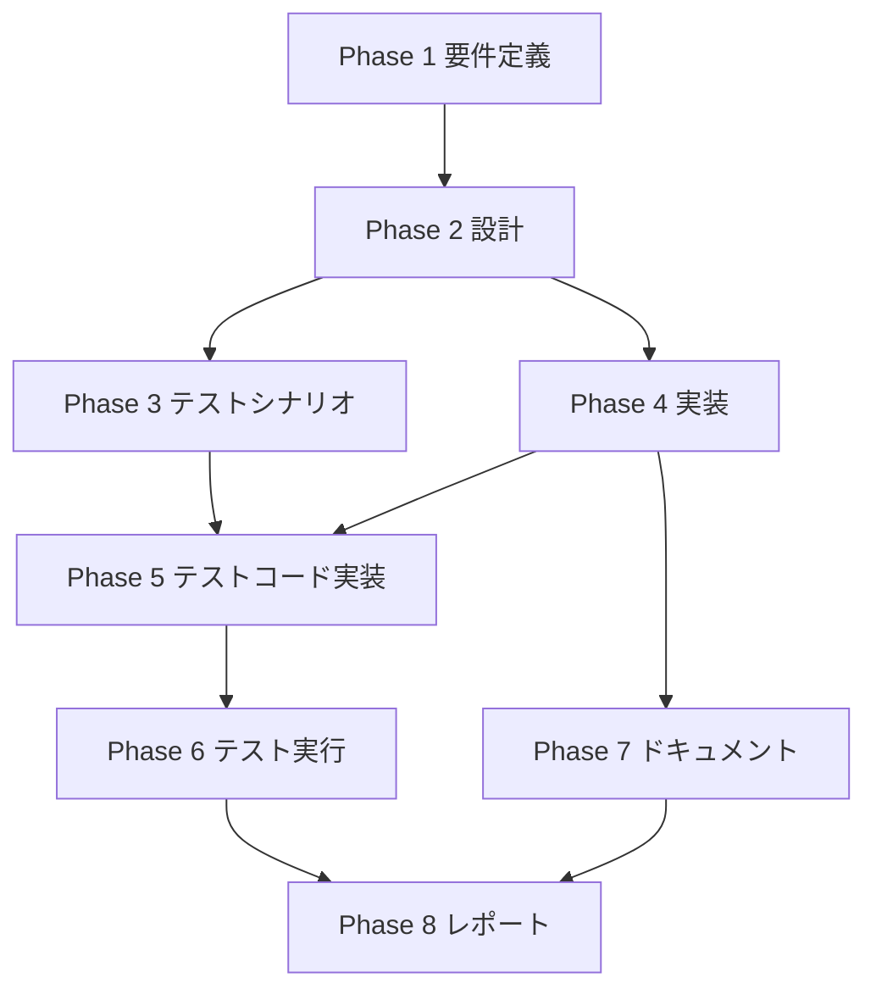

# Codex Agent 実行ログ

開始日時: 2025/11/3 3:10:01

---

## Turn 1: スレッド開始

**Thread ID**: `019a47b1-6f06-74f3-b9ec-85dd0f0faa78`

## Turn 2: ツール実行

**種別**: コマンド実行
**コマンド**: `bash -lc 'cat .ai-workflow/issue-119/00_planning/output/planning.md'`
**ステータス**: completed (exit_code=0)

```text
# プロジェクト計画書 - Issue #119 フォローアップIssue生成品質の改善（LLM活用）

## 1. Issue分析
- **複雑度**: 複雑  
  - 新規AI連携モジュールの追加と既存GitHub連携コードの拡張を伴い、外部API統合・エラーハンドリング・フォールバック設計が必要。
  - テストレイヤーが複数（LLM呼び出しのモック検証と実APIを用いた統合テスト）に渡る。
- **見積もり工数**: 22~26時間  
  - 設計/要件整理: 6~7h、実装: 7~9h、テスト（設計＋実装＋実行）: 6~7h、ドキュメント/レポート: 3h を想定。
- **リスク評価**: 中  
  - LLM APIの不確定要素と生成品質の主観評価が残る一方、既存コードへの影響は限定範囲に収まる見込み。

## 2. 実装戦略判断
- **実装戦略**: EXTEND  
  - 既存の `issue-client.ts` を中心に機能拡張し、新たな `issue-ai-generator.ts` を追加してL TM生成ロジックを組み込む。全体構造は維持したまま責務分割を拡張。
- **テスト戦略**: UNIT_INTEGRATION  
  - プロンプト生成・フォールバック制御はモックを使ったユニットテストで網羅し、実API呼び出しは環境変数制御下で統合テストを追加して品質を確認。
- **テストコード戦略**: BOTH_TEST  
  - 既存フォローアップ生成ロジックのテストを拡張しつつ、新規 `issue-ai-generator` 用の専用テストファイルを新設する必要がある。

## 3. 影響範囲分析
- **既存コードへの影響**  
  - `src/core/github/issue-client.ts`: LLM優先フロー追加、フォールバック制御、ログ出力変更。  
  - `src/types.ts`: 新しいオプションインターフェースとIssue生成データ構造の拡張。  
  - `src/commands/execute/agent-setup.ts` などのクライアント初期化部: LLM設定引き回しが必要な場合は拡張。
- **依存関係の変更**  
  - 新規AIクライアント実装に伴う依存ライブラリ（公式SDK、HTTPクライアント）の追加検討。  
  - `.env` や設定ファイルにAPIキー/モデル指定を追加する可能性。
- **マイグレーション要否**  
  - コード上のマイグレーションは不要。  
  - 設定ファイル・ドキュメントへの追記（APIキー設定、プロンプトファイル）を行う。  
  - 将来的な `.ai-workflow/config.yml` 拡張を見据えた設計が必要。

## 4. タスク分割

### Phase 1: 要件定義 (見積もり: 3~4h)
- [x] Task 1-1: 現行フォローアップIssue生成フローの分析 (1~1.5h)
  - `issue-client.ts` のタイトル/本文生成ロジックをシーケンス図レベルで整理
  - Evaluation Phase から渡る `RemainingTask` / `IssueContext` のデータフローを確認
  - レビュー結果: 要件定義書にシーケンス分析とデータフロー整理が反映されたため完了
- [x] Task 1-2: LLM統合要件の明確化 (1.5~2h)
  - API利用要件（モデル、トークン制限、リトライ戦略）を洗い出す
  - 生成物の品質条件・受け入れ基準を仕様として文書化
  - レビュー結果: モデル候補・トークン制限・リトライ戦略が要件定義書に詳細化されたため完了

### Phase 2: 設計 (見積もり: 4~5h)
- [x] Task 2-1: issue-ai-generatorモジュール設計 (2~2.5h)
  - クラス/関数責務、依存注入方法、フォールバックパスを設計
  - プロンプトテンプレートとレスポンス検証手順を定義
- [x] Task 2-2: 設定・エラーハンドリング設計 (2~2.5h)
  - API鍵の取得経路とマスキング方針を決定
  - レート制限、タイムアウト、再試行ポリシーの設計

### Phase 3: テストシナリオ (見積もり: 2~3h)
- [ ] Task 3-1: テストケース設計 (2~3h)
  - ユニットテスト（成功/失敗/フォールバック/プロンプト検証）のケースを網羅化
  - 統合テストで確認すべきシナリオ（実API、環境変数制御、レスポンス妥当性）を整理

### Phase 4: 実装 (見積もり: 6~7h)
- [ ] Task 4-1: issue-ai-generator.ts の実装 (2.5~3h)
  - プロンプト生成、API呼び出し、レスポンス整形、エラーハンドリングを実装
  - ログとトレース情報（入力長、エラー理由）を追加
- [ ] Task 4-2: issue-client.ts のLLM統合 (2~2.5h)
  - 新モジュール呼び出しとフォールバック制御を実装
  - LLM無効化オプションやテレメトリ用ログを追加
- [ ] Task 4-3: 型/設定まわりの拡張 (1.5~2h)
  - `types.ts` と設定ファイルにオプションを追加
  - エージェント初期化・CLIオプションでのフラグ引き回しを反映

### Phase 5: テストコード実装 (見積もり: 4~5h)
- [ ] Task 5-1: ユニットテスト実装 (2~2.5h)
  - issue-ai-generator用モックテストを作成
  - フォールバック動作とプロンプト生成の検証テストを追加
- [ ] Task 5-2: 統合テスト準備・実装 (2~2.5h)
  - 実API利用テストを環境変数制御で実行できるよう整備
  - テストデータ、レート制限保護の仕組み（スキップ条件等）を実装

### Phase 6: テスト実行 (見積もり: 2~3h)
- [ ] Task 6-1: テスト実行と結果分析 (2~3h)
  - ユニット/統合テストを実行し、失敗ケースを分析
  - ログと生成結果をサンプルIssueと比較して品質を確認

### Phase 7: ドキュメント (見積もり: 2h)
- [ ] Task 7-1: ドキュメント更新 (2h)
  - `ARCHITECTURE.md`, `CLAUDE.md` にLLM統合方針・利用手順を追記
  - APIキー設定手順や設定例をREADME系ドキュメントに反映

### Phase 8: レポート (見積もり: 1~1.5h)
- [ ] Task 8-1: 成果物サマリーとフォローアップ (1~1.5h)
  - 実装差分、テスト結果、残課題をレポートにまとめる
  - 次フェーズ向けの改善案や運用上の注意点を記録

## 5. 依存関係


## 6. リスクと軽減策
#### リスク1: LLM APIのレート制限・エラー多発
- **影響度**: 中
- **確率**: 中
- **軽減策**: リトライ/指数バックオフを実装し、フォールバックを即時に発動できるようにする。統合テストではAPI呼び出し頻度を制限。

#### リスク2: 生成タイトル・本文の品質ばらつき
- **影響度**: 高
- **確率**: 中
- **軽減策**: プロンプトテンプレートをチューニングし、ユニットテストで最低限のセクション検証を実施。レビュー基準を明文化。

#### リスク3: 機密情報の誤送信
- **影響度**: 高
- **確率**: 低
- **軽減策**: フィルタリングレイヤーを設け、送信前にセンシティブなフィールドを除去。APIログに機密情報を残さない。

#### リスク4: 実API統合テストの不安定化
- **影響度**: 中
- **確率**: 中
- **軽減策**: 統合テストをオプトイン方式（環境変数ON時のみ実行）にし、失敗時はフォールバック確認テストを優先。

## 7. 品質ゲート
#### Phase 1: 要件定義
- [ ] LLM統合要件と生成品質基準が明文化されている
- [ ] セキュリティ・コスト要件が整理されている

#### Phase 2: 設計
- [ ] 実装戦略・テスト戦略・テストコード戦略の根拠が設計書に反映されている
- [ ] フォールバックフローとエラーハンドリングが設計されている

#### Phase 3: テストシナリオ
- [ ] 成功/失敗/フォールバックを網羅したテスト
... (truncated)
```

## Turn 3: ツール実行

**種別**: コマンド実行
**コマンド**: `bash -lc 'cat .ai-workflow/issue-119/01_requirements/output/requirements.md'`
**ステータス**: completed (exit_code=0)

```text
# 要件定義書 - Issue #119 フォローアップIssue生成品質の改善（LLM活用）

## 0. Planning Documentの確認
- `00_planning/output/planning.md` に基づき、既存 `issue-client.ts` の責務を維持しつつ新規 `issue-ai-generator.ts` でLLM連携を拡張する「EXTEND」戦略を採用する。
- テストはモック中心のユニットテストと実APIを使用する統合テストの両輪（UNIT_INTEGRATION/BOTH_TEST）で実施し、フォールバック経路を含めて網羅する。
- 主なリスクはLLM API失敗・品質ばらつき・機密情報漏洩であり、リトライ／フォールバック、プロンプト検証、フィルタリングで軽減する。
- 想定工数は22〜26時間で、要件定義・設計・実装・テスト・ドキュメント更新までを段階的に進める。

## 1. 概要
既存のフォローアップIssue自動生成機能は、タイトルが一般的すぎて検索性が低く、本文も箇条書きのみで具体的な作業内容が伝わらない。また、元IssueやPRの背景情報が十分に反映されず、残タスクの意義や優先度が不明瞭である。  
本要件はLLMを統合してタイトルと本文の生成品質を向上させ、技術的背景や実行手順を含む実務的に活用できるフォローアップIssueを自動生成することを目的とする。  
これにより、開発チームは手動でIssueを整形する手間を削減し、残タスクの理解・着手が迅速化され、ワークフロー全体のスループット向上と品質担保が期待できる。

### 1.1 現行フォローアップIssue生成フローとデータ連携（Task 1-1）
- **シーケンス概要**  
  1. Evaluation Phase完了時に `RemainingTask[]` と `IssueContext` が Phase Runner から `IssueClient.createIssueFromEvaluation()` へ渡される（`src/core/github/issue-client.ts:198`）。併せて評価レポートのファイルパスが付与される。  
  2. `createIssueFromEvaluation` 内で INFO ログを出力後、`generateFollowUpTitle` が呼び出され、最初の最大3件の残タスクを `extractKeywords` で分割・20文字以内に整形し、`[FOLLOW-UP] #<issueNumber>: <keywords>` 形式のタイトルを組み立てる（同:163行付近）。  
  3. 本文は `IssueContext` が存在する場合に `## 背景` セクションへ `summary` を記述し、`blockerStatus` `deferredReason` をサブセクションとして展開する。`IssueContext` がない場合は定型文にフォールバックする。  
  4. `RemainingTask` をループし、タスク番号ごとに `formatTaskDetails` が Markdown の見出し・対象ファイル一覧・作業手順・受け入れ基準・優先度・見積もり・依存タスクを整形し `## 残タスク詳細` 配下へ追加する（`src/core/github/issue-client.ts:210-274`）。  
  5. 末尾に `## 参考` セクションを追加し、元Issue番号と `evaluationReportPath` へのリンクを差し込んだうえで `---` によるフッタを付与する。  
  6. 完成したタイトル・本文を Octokit 経由で GitHub API `issues.create` に送信し、成功時は INFO、失敗時は `encodeWarning` 済みメッセージを ERROR ログに記録する。

- **データフロー整理**  
  | 入力ソース | 受け取り箇所 | 利用目的 |
  | --- | --- | --- |
  | `RemainingTask.task` | `formatTaskDetails` | `### Task n:` 見出しの文言として使用 |
  | `RemainingTask.targetFiles[]` | `formatTaskDetails` | `**対象ファイル**` セクションにコードパスを列挙 |
  | `RemainingTask.steps[]` | `formatTaskDetails` | 実行手順（番号付きリスト）として出力 |
  | `RemainingTask.acceptanceCriteria[]` | `formatTaskDetails` | `- [ ]` チェックボックス付き受け入れ基準を生成 |
  | `RemainingTask.priority` / `priorityReason` | `formatTaskDetails` | 優先度と根拠を1行にまとめて提示 |
  | `RemainingTask.estimatedHours` | `formatTaskDetails` | 作業見積もりを `**見積もり**` として併記 |
  | `RemainingTask.dependencies[]` | `formatTaskDetails` | 依存タスク一覧を箇条書きで記載 |
  | `IssueContext.summary` | 本文 `## 背景` | 元Issue・PRのサマリーを冒頭に表示 |
  | `IssueContext.blockerStatus` | 本文 `### 元 Issue のステータス` | ブロッカー解消状況を共有 |
  | `IssueContext.deferredReason` | 本文 `### なぜこれらのタスクが残ったか` | 残タスク発生の背景説明 |
  | `evaluationReportPath` | 本文 `## 参考` | 評価レポート位置をリンク/パスで提示 |

  `RemainingTask` と `IssueContext` は `src/types.ts:36-105` に定義されており、Evaluation Phaseからの構造体がそのまま文字列化される。今後のLLM統合ではこれらの値をプロンプト入力へ拡張するが、既存フォールバック経路との互換性を維持する。

## 2. 機能要件
Issue本文に「## TODO」節は存在しないため、概要および提案解決策から抽出した要件を整理する。

| ID | 要件 | 詳細 | 優先度 |
| --- | --- | --- | --- |
| FR-1 | LLMを用いたインテリジェントタイトル生成 | `generateIntelligentTitle` 関数で元Issue・PR・残タスクの文脈を入力に、50〜80文字の技術的に明確なタイトルを生成する。タイトルは主要コンポーネントや指標（例: 対象モジュール、目標値）を含み、既存の単語分割ロジックより情報密度が高いこと。 | 高 |
| FR-2 | 構造化されたタスク本文生成 | `generateTaskDescription` が背景、目的、実行内容（ステップ・対象ファイル・テスト方法）、受け入れ基準、関連リソースをMarkdownセクションとして出力する。本文内で1ステップずつ実行指示を明示し、テスト手順と完了条件を含める。 | 高 |
| FR-3 | フォールバック制御 | LLM呼び出し失敗・タイムアウト・無効化設定時には既存の `generateFollowUpTitle` / `formatTaskDetails` を自動で利用し、処理を中断させない。フォールバック発動状況は警告ログで記録する。 | 高 |
| FR-4 | 設定オプションの拡張 | `IssueGenerationOptions` 等を通じてLLM有効化フラグ、モデル選択、タイムアウト、最大リトライ回数を指定できるようにし、CLIや環境変数から設定可能にする。デフォルト値は後方互換を保つ。 | 中 |
| FR-5 | ログと品質監視 | LLM呼び出し成功時は入力トークン長・モデル名・生成時間をDEBUGログに出力し、失敗時は原因と再試行状況をWARNログに記録する。WARNログは `{ event_code, message, fallback_mode, retry_count }` を最低限含む構造化ペイロードとし、ログには機密情報を含めない。 | 中 |

### 2.1 LLM API利用要件（Task 1-2）
- **モデル候補とトークン制限**  
  | モデルID | プロバイダ | 想定用途 | 最大入力トークン | 最大出力トークン | 備考 |
  | --- | --- | --- | --- | --- | --- |
  | `claude-3-sonnet-20240229` | Anthropic | デフォルト（高品質/安定） | 8,000 | 2,000 | コストと品質のバランスが良い。 |
  | `gpt-4o-2024-05-13` | OpenAI | 代替（マルチリンガル/ツール連携） | 8,192 | 2,048
... (truncated)
```

## Turn 4: ツール実行

**種別**: コマンド実行
**コマンド**: `bash -lc "sed -n '125,250p' .ai-workflow/issue-119/01_requirements/output/requirements.md"`
**ステータス**: completed (exit_code=0)

## Turn 5: ツール実行

**種別**: コマンド実行
**コマンド**: `bash -lc 'wc -l .ai-workflow/issue-119/01_requirements/output/requirements.md'`
**ステータス**: completed (exit_code=0)

```text
124 .ai-workflow/issue-119/01_requirements/output/requirements.md
```

## Turn 6: ツール実行

**種別**: コマンド実行
**コマンド**: `bash -lc "sed -n '1,124p' .ai-workflow/issue-119/01_requirements/output/requirements.md"`
**ステータス**: completed (exit_code=0)

```text
# 要件定義書 - Issue #119 フォローアップIssue生成品質の改善（LLM活用）

## 0. Planning Documentの確認
- `00_planning/output/planning.md` に基づき、既存 `issue-client.ts` の責務を維持しつつ新規 `issue-ai-generator.ts` でLLM連携を拡張する「EXTEND」戦略を採用する。
- テストはモック中心のユニットテストと実APIを使用する統合テストの両輪（UNIT_INTEGRATION/BOTH_TEST）で実施し、フォールバック経路を含めて網羅する。
- 主なリスクはLLM API失敗・品質ばらつき・機密情報漏洩であり、リトライ／フォールバック、プロンプト検証、フィルタリングで軽減する。
- 想定工数は22〜26時間で、要件定義・設計・実装・テスト・ドキュメント更新までを段階的に進める。

## 1. 概要
既存のフォローアップIssue自動生成機能は、タイトルが一般的すぎて検索性が低く、本文も箇条書きのみで具体的な作業内容が伝わらない。また、元IssueやPRの背景情報が十分に反映されず、残タスクの意義や優先度が不明瞭である。  
本要件はLLMを統合してタイトルと本文の生成品質を向上させ、技術的背景や実行手順を含む実務的に活用できるフォローアップIssueを自動生成することを目的とする。  
これにより、開発チームは手動でIssueを整形する手間を削減し、残タスクの理解・着手が迅速化され、ワークフロー全体のスループット向上と品質担保が期待できる。

### 1.1 現行フォローアップIssue生成フローとデータ連携（Task 1-1）
- **シーケンス概要**  
  1. Evaluation Phase完了時に `RemainingTask[]` と `IssueContext` が Phase Runner から `IssueClient.createIssueFromEvaluation()` へ渡される（`src/core/github/issue-client.ts:198`）。併せて評価レポートのファイルパスが付与される。  
  2. `createIssueFromEvaluation` 内で INFO ログを出力後、`generateFollowUpTitle` が呼び出され、最初の最大3件の残タスクを `extractKeywords` で分割・20文字以内に整形し、`[FOLLOW-UP] #<issueNumber>: <keywords>` 形式のタイトルを組み立てる（同:163行付近）。  
  3. 本文は `IssueContext` が存在する場合に `## 背景` セクションへ `summary` を記述し、`blockerStatus` `deferredReason` をサブセクションとして展開する。`IssueContext` がない場合は定型文にフォールバックする。  
  4. `RemainingTask` をループし、タスク番号ごとに `formatTaskDetails` が Markdown の見出し・対象ファイル一覧・作業手順・受け入れ基準・優先度・見積もり・依存タスクを整形し `## 残タスク詳細` 配下へ追加する（`src/core/github/issue-client.ts:210-274`）。  
  5. 末尾に `## 参考` セクションを追加し、元Issue番号と `evaluationReportPath` へのリンクを差し込んだうえで `---` によるフッタを付与する。  
  6. 完成したタイトル・本文を Octokit 経由で GitHub API `issues.create` に送信し、成功時は INFO、失敗時は `encodeWarning` 済みメッセージを ERROR ログに記録する。

- **データフロー整理**  
  | 入力ソース | 受け取り箇所 | 利用目的 |
  | --- | --- | --- |
  | `RemainingTask.task` | `formatTaskDetails` | `### Task n:` 見出しの文言として使用 |
  | `RemainingTask.targetFiles[]` | `formatTaskDetails` | `**対象ファイル**` セクションにコードパスを列挙 |
  | `RemainingTask.steps[]` | `formatTaskDetails` | 実行手順（番号付きリスト）として出力 |
  | `RemainingTask.acceptanceCriteria[]` | `formatTaskDetails` | `- [ ]` チェックボックス付き受け入れ基準を生成 |
  | `RemainingTask.priority` / `priorityReason` | `formatTaskDetails` | 優先度と根拠を1行にまとめて提示 |
  | `RemainingTask.estimatedHours` | `formatTaskDetails` | 作業見積もりを `**見積もり**` として併記 |
  | `RemainingTask.dependencies[]` | `formatTaskDetails` | 依存タスク一覧を箇条書きで記載 |
  | `IssueContext.summary` | 本文 `## 背景` | 元Issue・PRのサマリーを冒頭に表示 |
  | `IssueContext.blockerStatus` | 本文 `### 元 Issue のステータス` | ブロッカー解消状況を共有 |
  | `IssueContext.deferredReason` | 本文 `### なぜこれらのタスクが残ったか` | 残タスク発生の背景説明 |
  | `evaluationReportPath` | 本文 `## 参考` | 評価レポート位置をリンク/パスで提示 |

  `RemainingTask` と `IssueContext` は `src/types.ts:36-105` に定義されており、Evaluation Phaseからの構造体がそのまま文字列化される。今後のLLM統合ではこれらの値をプロンプト入力へ拡張するが、既存フォールバック経路との互換性を維持する。

## 2. 機能要件
Issue本文に「## TODO」節は存在しないため、概要および提案解決策から抽出した要件を整理する。

| ID | 要件 | 詳細 | 優先度 |
| --- | --- | --- | --- |
| FR-1 | LLMを用いたインテリジェントタイトル生成 | `generateIntelligentTitle` 関数で元Issue・PR・残タスクの文脈を入力に、50〜80文字の技術的に明確なタイトルを生成する。タイトルは主要コンポーネントや指標（例: 対象モジュール、目標値）を含み、既存の単語分割ロジックより情報密度が高いこと。 | 高 |
| FR-2 | 構造化されたタスク本文生成 | `generateTaskDescription` が背景、目的、実行内容（ステップ・対象ファイル・テスト方法）、受け入れ基準、関連リソースをMarkdownセクションとして出力する。本文内で1ステップずつ実行指示を明示し、テスト手順と完了条件を含める。 | 高 |
| FR-3 | フォールバック制御 | LLM呼び出し失敗・タイムアウト・無効化設定時には既存の `generateFollowUpTitle` / `formatTaskDetails` を自動で利用し、処理を中断させない。フォールバック発動状況は警告ログで記録する。 | 高 |
| FR-4 | 設定オプションの拡張 | `IssueGenerationOptions` 等を通じてLLM有効化フラグ、モデル選択、タイムアウト、最大リトライ回数を指定できるようにし、CLIや環境変数から設定可能にする。デフォルト値は後方互換を保つ。 | 中 |
| FR-5 | ログと品質監視 | LLM呼び出し成功時は入力トークン長・モデル名・生成時間をDEBUGログに出力し、失敗時は原因と再試行状況をWARNログに記録する。WARNログは `{ event_code, message, fallback_mode, retry_count }` を最低限含む構造化ペイロードとし、ログには機密情報を含めない。 | 中 |

### 2.1 LLM API利用要件（Task 1-2）
- **モデル候補とトークン制限**  
  | モデルID | プロバイダ | 想定用途 | 最大入力トークン | 最大出力トークン | 備考 |
  | --- | --- | --- | --- | --- | --- |
  | `claude-3-sonnet-20240229` | Anthropic | デフォルト（高品質/安定） | 8,000 | 2,000 | コストと品質のバランスが良い。 |
  | `gpt-4o-2024-05-13` | OpenAI | 代替（マルチリンガル/ツール連携） | 8,192 | 2,048
... (truncated)
```

## Turn 7: ツール実行

**種別**: コマンド実行
**コマンド**: `bash -lc 'tail -n 100 .ai-workflow/issue-119/01_requirements/output/requirements.md'`
**ステータス**: completed (exit_code=0)

```text
| --- | --- | --- |
  | `RemainingTask.task` | `formatTaskDetails` | `### Task n:` 見出しの文言として使用 |
  | `RemainingTask.targetFiles[]` | `formatTaskDetails` | `**対象ファイル**` セクションにコードパスを列挙 |
  | `RemainingTask.steps[]` | `formatTaskDetails` | 実行手順（番号付きリスト）として出力 |
  | `RemainingTask.acceptanceCriteria[]` | `formatTaskDetails` | `- [ ]` チェックボックス付き受け入れ基準を生成 |
  | `RemainingTask.priority` / `priorityReason` | `formatTaskDetails` | 優先度と根拠を1行にまとめて提示 |
  | `RemainingTask.estimatedHours` | `formatTaskDetails` | 作業見積もりを `**見積もり**` として併記 |
  | `RemainingTask.dependencies[]` | `formatTaskDetails` | 依存タスク一覧を箇条書きで記載 |
  | `IssueContext.summary` | 本文 `## 背景` | 元Issue・PRのサマリーを冒頭に表示 |
  | `IssueContext.blockerStatus` | 本文 `### 元 Issue のステータス` | ブロッカー解消状況を共有 |
  | `IssueContext.deferredReason` | 本文 `### なぜこれらのタスクが残ったか` | 残タスク発生の背景説明 |
  | `evaluationReportPath` | 本文 `## 参考` | 評価レポート位置をリンク/パスで提示 |

  `RemainingTask` と `IssueContext` は `src/types.ts:36-105` に定義されており、Evaluation Phaseからの構造体がそのまま文字列化される。今後のLLM統合ではこれらの値をプロンプト入力へ拡張するが、既存フォールバック経路との互換性を維持する。

## 2. 機能要件
Issue本文に「## TODO」節は存在しないため、概要および提案解決策から抽出した要件を整理する。

| ID | 要件 | 詳細 | 優先度 |
| --- | --- | --- | --- |
| FR-1 | LLMを用いたインテリジェントタイトル生成 | `generateIntelligentTitle` 関数で元Issue・PR・残タスクの文脈を入力に、50〜80文字の技術的に明確なタイトルを生成する。タイトルは主要コンポーネントや指標（例: 対象モジュール、目標値）を含み、既存の単語分割ロジックより情報密度が高いこと。 | 高 |
| FR-2 | 構造化されたタスク本文生成 | `generateTaskDescription` が背景、目的、実行内容（ステップ・対象ファイル・テスト方法）、受け入れ基準、関連リソースをMarkdownセクションとして出力する。本文内で1ステップずつ実行指示を明示し、テスト手順と完了条件を含める。 | 高 |
| FR-3 | フォールバック制御 | LLM呼び出し失敗・タイムアウト・無効化設定時には既存の `generateFollowUpTitle` / `formatTaskDetails` を自動で利用し、処理を中断させない。フォールバック発動状況は警告ログで記録する。 | 高 |
| FR-4 | 設定オプションの拡張 | `IssueGenerationOptions` 等を通じてLLM有効化フラグ、モデル選択、タイムアウト、最大リトライ回数を指定できるようにし、CLIや環境変数から設定可能にする。デフォルト値は後方互換を保つ。 | 中 |
| FR-5 | ログと品質監視 | LLM呼び出し成功時は入力トークン長・モデル名・生成時間をDEBUGログに出力し、失敗時は原因と再試行状況をWARNログに記録する。WARNログは `{ event_code, message, fallback_mode, retry_count }` を最低限含む構造化ペイロードとし、ログには機密情報を含めない。 | 中 |

### 2.1 LLM API利用要件（Task 1-2）
- **モデル候補とトークン制限**  
  | モデルID | プロバイダ | 想定用途 | 最大入力トークン | 最大出力トークン | 備考 |
  | --- | --- | --- | --- | --- | --- |
  | `claude-3-sonnet-20240229` | Anthropic | デフォルト（高品質/安定） | 8,000 | 2,000 | コストと品質のバランスが良い。 |
  | `gpt-4o-2024-05-13` | OpenAI | 代替（マルチリンガル/ツール連携） | 8,192 | 2,048 | 既存OpenAIインフラを活用。 |
  | `gpt-4o-mini` | OpenAI | 低コストフォールバック | 4,096 | 1,024 | 低コスト検証やデグレ時の緊急利用。 |

  - プロンプト構成は `RemainingTask` 最大5件を想定し、入力トークンが6,000を超える場合は `targetFiles`・`steps` を優先度順にトリミングし、必須フィールド（`task`, `priority`, `acceptanceCriteria`）を保持する。  
  - レスポンスはタイトル80文字制約・本文5セクションのテンプレートに合わせ、余剰セクションがある場合はポストプロセスで削除する。

- **APIパラメータとリトライ**  
  | 項目 | 設定値 | 説明 |
  | --- | --- | --- |
  | `temperature` | 0.2 | 安定した出力のため低めに固定。 |
  | `top_p` | 0.95 | 生成多様性の微調整用。 |
  | `max_prompt_tokens` | 7,000 | 入力安全域（超過時は事前に短縮）。 |
  | `max_completion_tokens` | 1,500 | 本文生成に十分な上限。 |
  | `timeout_ms` | 25,000 | API呼び出しのハードタイムアウト。 |
  | `max_retries` | 3 | HTTP503/RateLimit/Timeout時は指数バックオフ（2s, 4s, 8s）で再試行。 |
  | `parallel_requests` | 1 | 連続生成でのレート制限回避。 |

- **構成・設定項目**  
  - 環境変数: `LLM_PROVIDER`（`anthropic`/`openai`）、`LLM_MODEL`, `LLM_TIMEOUT_MS`, `LLM_MAX_TOKENS`, `LLM_MAX_RETRIES`。未設定時は `anthropic` + `claude-3-sonnet-20240229` を採用。  
  - CLI/設定ファイルからは `--llm-model`, `--llm-timeout`, `--llm-max-retries`, `--llm-disabled` を指定可能にし、`IssueGenerationOptions` 経由で `issue-ai-generator` へ渡す。  
  - 成功ログは `{ event_code: 'FOLLOWUP_LLM_SUCCESS', model, input_tokens, output_tokens, duration_ms }` を、フォールバック時は `{ event_code: 'FOLLOWUP_LLM_FALLBACK', reason, retry_count, fallback_mode: 'legacy_template' }` を出力する。

- **プロンプトテンプレート管理**  
  - テンプレートは `issue-ai-generator` 内で定数として保持し、`IssueContext` の `summary` / `blockerStatus` / `deferredReason`、各 `RemainingTask` の `task`・`targetFiles`・`steps`・`acceptanceCriteria` をJSON構造で埋め込む。  
  - プロンプトに含めるログ記録はマスク済みであることをバリデーションし、`targetFiles` を最大10件に制限。  
  - レスポンス検証で必須セクション欠落時は `ValidationError` を発生させ、フォールバックへ移行する。

## 3. 非機能要件
- **パフォーマンス**: 単一タスクあたりのLLM呼び出しは平均15秒以内に完了し、タイムアウトは30秒以下に設定する。レート制限到達時は指数バックオフで
... (truncated)
```

## Turn 8: ツール実行

**種別**: コマンド実行
**コマンド**: `bash -lc "sed -n '60,120p' .ai-workflow/issue-119/01_requirements/output/requirements.md"`
**ステータス**: completed (exit_code=0)

```text
- レスポンスはタイトル80文字制約・本文5セクションのテンプレートに合わせ、余剰セクションがある場合はポストプロセスで削除する。

- **APIパラメータとリトライ**  
  | 項目 | 設定値 | 説明 |
  | --- | --- | --- |
  | `temperature` | 0.2 | 安定した出力のため低めに固定。 |
  | `top_p` | 0.95 | 生成多様性の微調整用。 |
  | `max_prompt_tokens` | 7,000 | 入力安全域（超過時は事前に短縮）。 |
  | `max_completion_tokens` | 1,500 | 本文生成に十分な上限。 |
  | `timeout_ms` | 25,000 | API呼び出しのハードタイムアウト。 |
  | `max_retries` | 3 | HTTP503/RateLimit/Timeout時は指数バックオフ（2s, 4s, 8s）で再試行。 |
  | `parallel_requests` | 1 | 連続生成でのレート制限回避。 |

- **構成・設定項目**  
  - 環境変数: `LLM_PROVIDER`（`anthropic`/`openai`）、`LLM_MODEL`, `LLM_TIMEOUT_MS`, `LLM_MAX_TOKENS`, `LLM_MAX_RETRIES`。未設定時は `anthropic` + `claude-3-sonnet-20240229` を採用。  
  - CLI/設定ファイルからは `--llm-model`, `--llm-timeout`, `--llm-max-retries`, `--llm-disabled` を指定可能にし、`IssueGenerationOptions` 経由で `issue-ai-generator` へ渡す。  
  - 成功ログは `{ event_code: 'FOLLOWUP_LLM_SUCCESS', model, input_tokens, output_tokens, duration_ms }` を、フォールバック時は `{ event_code: 'FOLLOWUP_LLM_FALLBACK', reason, retry_count, fallback_mode: 'legacy_template' }` を出力する。

- **プロンプトテンプレート管理**  
  - テンプレートは `issue-ai-generator` 内で定数として保持し、`IssueContext` の `summary` / `blockerStatus` / `deferredReason`、各 `RemainingTask` の `task`・`targetFiles`・`steps`・`acceptanceCriteria` をJSON構造で埋め込む。  
  - プロンプトに含めるログ記録はマスク済みであることをバリデーションし、`targetFiles` を最大10件に制限。  
  - レスポンス検証で必須セクション欠落時は `ValidationError` を発生させ、フォールバックへ移行する。

## 3. 非機能要件
- **パフォーマンス**: 単一タスクあたりのLLM呼び出しは平均15秒以内に完了し、タイムアウトは30秒以下に設定する。レート制限到達時は指数バックオフで最大3回までリトライする。
- **セキュリティ**: APIキーは環境変数で安全に読み込み、ログ・例外メッセージに出力しない。送信ペイロードから機密情報（トークン、クレデンシャル、個人情報）は除外するフィルタリング層を備える。
- **可用性・信頼性**: フォールバック経路はLLMが失敗しても100%動作し、呼び出し結果はエラー発生時に既存生成ロジックへ切り替える。リトライ失敗時は処理継続と警告発報を保証する。
- **保守性・拡張性**: LLM連携は `issue-ai-generator.ts` に集約し、将来的なモデル追加やプロンプト更新を局所化する。ユニットテスト・統合テストを追加し、既存カバレッジ水準を維持または向上させる。

## 4. 制約事項
- **技術的制約**: TypeScript（Node.js 20系想定）で実装し、既存CLIアーキテクチャと互換性を保つ。LLMクライアントは既存依存（`openai`、`@anthropic-ai/claude-agent-sdk`）を利用し、新規依存追加は最小限に留める。
- **リソース制約**: Planning成果物の見積もりに従い22〜26時間内で完了させる。開発リソースは既存チームのスプリント枠内に限定される。
- **ポリシー制約**: CLAUDE.md/ARCHITECTURE.md に準拠し、コーディング規約・ログポリシー・セキュリティポリシーを遵守する。API利用は組織のコスト管理指針に従い、不要な試行を抑制する。

## 5. 前提条件
- **システム環境**: Node.js 20.x、TypeScript 5.x、Jestベースのテスト環境、GitHub APIアクセス権限、LLM API（ClaudeまたはCodex/OpenAI）へのネットワーク接続。
- **依存コンポーネント**: 既存 `issue-client.ts`、`commands/execute/agent-setup.ts`、GitHub Issue作成フロー、`openai` / `@anthropic-ai/claude-agent-sdk` クライアント。
- **外部システム連携**: GitHub REST API、Claude/OpenAI API。APIキーは環境変数（例: `ANTHROPIC_API_KEY`, `OPENAI_API_KEY`）で提供される。

## 6. 受け入れ基準
- FR-1  
  - Given LLMが有効で必要な認証情報が設定されている  
  - When `generateIntelligentTitle` にIssue・PR・タスク文脈を渡して実行する  
  - Then 50〜80文字のタイトルが生成され、主要技術要素が含まれ、空文字や重複語が発生しない
- FR-2  
  - Given 残タスク情報とIssue/PRコンテキストが揃っている  
  - When `generateTaskDescription` を呼び出す  
  - Then 背景・目的・実行内容・受け入れ基準・関連リソースのMarkdownセクションがすべて出力され、実行内容にステップとテスト方法が含まれる
- FR-3  
  - Given LLM呼び出しがタイムアウトまたはエラーを返す  
  - When フォローアップIssue生成を行う  
  - Then 既存ロジックでタイトルと本文が生成され、WARNログにフォールバック理由が記録される
- FR-4  
  - Given CLI実行時にLLM関連オプションを指定する  
  - When フォローアップIssue生成を実行する  
  - Then 指定されたモデル・タイムアウト・リトライ設定が `issue-ai-generator` に反映され、設定が無効な場合はバリデーションエラーを返す
- FR-5  
  - Given LLM呼び出しが行われ、成功または失敗する  
  - When ログ出力を確認する  
  - Then 成功時にモデル名・処理時間等がDEBUGで、失敗時に原因と再試行情報がWARNで出力され、ログに機密情報が含まれない
```

## Turn 9: ツール実行

**種別**: コマンド実行
**コマンド**: `bash -lc "sed -n '120,180p' .ai-workflow/issue-119/01_requirements/output/requirements.md"`
**ステータス**: completed (exit_code=0)

```text
## 7. スコープ外
- カスタムプロンプトをユーザーが任意に設定する機能（`.ai-workflow/config.yml` 拡張）は今回のスコープ外で将来検討とする。
- 生成されたIssue内容の人手レビュー・承認ワークフロー自動化は対象外。
- 英語以外の多言語サポートやプロジェクト固有テンプレートの自動切替は本フェーズでは扱わない。
```

## Turn 10: ツール実行

**種別**: コマンド実行
**コマンド**: `bash -lc 'cat .ai-workflow/issue-119/02_design/output/design.md'`
**ステータス**: completed (exit_code=0)

```text
# 詳細設計書 - Issue #119 フォローアップIssue生成品質の改善（LLM活用）

**Issue番号**: #119  
**タイトル**: フォローアップIssue生成品質の改善（LLM活用）  
**バージョン**: 1.1 (Design)

---

## 1. アーキテクチャ設計

### 1.1 システム全体フロー

```
EvaluationPhase (Phase 9)
    │ RemainingTask[], IssueContext, evaluation report path, generation options
    ▼
GitHubClient.createIssueFromEvaluation(...)
    │ delegates
    ▼
IssueClient (LLM-aware)
    ├─ IssueAIGenerator.generate(...)
    │     └─ LLM Provider Adapter (OpenAI / Anthropic)
    └─ Legacy builders (generateFollowUpTitle + buildLegacyBody)
    ▼
Octokit.issues.create(...) → GitHub Issue
```

### 1.2 コンポーネント責務

| コンポーネント | 役割 | 主な入出力 |
| --- | --- | --- |
| `EvaluationPhase` | Phase 9 の処理。残タスク検出後に GitHubClient へフォローアップ生成を依頼 | 入力: Evaluation結果 / 出力: IssueGenerationOptions 付き呼び出し |
| `GitHubClient` | GitHub API ファサード。IssueClient へ委譲し設定を束ねる | 入力: issue番号, tasks, options / 出力: IssueCreationResult |
| `IssueClient` | フォローアップIssue生成の集約。LLM生成→フォールバック制御→Octokit呼び出し | 入力: tasks, context, options / 出力: タイトル・本文・ログ |
| `IssueAIGenerator` (新規) | LLMプロンプト生成、API呼び出し、レスポンス検証 | 入力: tasks, context, options / 出力: { title, body, metadata } |
| `LlmProviderAdapter` (OpenAI / Anthropic) | 各APIのラッパー。タイムアウト・再試行を実装 | 入出力: prompt, call options, completion JSON |
| `config` / CLI | 環境変数・CLIから LLM 設定を収集し PhaseContextへ渡す | 入出力: Follow-up LLM 設定値 |
| `SecretMasker` (既存) | 機密情報のマスキング | 入力: プロンプトPayload / 出力: SanitizedPayload |

### 1.3 データフロー

1. ユーザーが `ai-workflow execute ...` を実行し、CLI が Follow-up LLM オプションを解析 (デフォルトは無効)。
2. `commands/execute` が `PhaseContext.issueGenerationOptions` を組み立て、`PhaseFactory` 経由で `EvaluationPhase` へ受け渡す。
3. EvaluationPhase で残タスクが存在すると `GitHubClient.createIssueFromEvaluation(issueNumber, tasks, reportPath, context, options)` を呼び出す。
4. `GitHubClient` は `IssueAIGenerator` をコンストラクタインジェクション済みの `IssueClient` に委譲。
5. `IssueClient` が `options.enabled` と `IssueAIGenerator.isAvailable()` を確認し、利用可能なら `generate(tasks, context, options)` を試行。
6. `IssueAIGenerator` は payload をサニタイズ→プロンプト生成→LLM呼び出し→検証し、成功時にタイトル・本文を返却。
7. LLM 失敗または無効時、`IssueClient` は既存の `generateFollowUpTitle` と新設の `buildLegacyBody` でフォールバック本文を生成。
8. 生成結果と `## 参考` セクション (＋オプションで LLM metadata) を結合し、Octokit で Issue を作成。ログへ成否とメタ情報を出力。

### 1.4 主なシーケンスと失敗時動作

- LLM 成功: `IssueAIGenerator` → validated result → `IssueClient` が LLM 出力を採用 → `options.appendMetadata` が true の場合にメタデータ節を付加。
- LLM タイムアウト / レート制限: Providerアダプタが指数バックオフで再試行。全失敗で `IssueAIError` を返し IssueClient が WARN を記録しフォールバック。
- プロンプト検証失敗: `IssueAIGenerator` が `IssueAIValidationError` を送出し、同様にフォールバック。
- Octokit 失敗: 既存処理と同様に ERROR ログを出力し `IssueCreationResult` で失敗を返却。

---

## 2. 実装戦略判断: EXTEND

**判断根拠**:
- 既存 `IssueClient` / `GitHubClient` / CLI フローを維持したまま責務を拡張する必要があるため。
- フォールバックとして既存テンプレートを保持しつつ LLM 生成を追加する形で後方互換を守る。
- Planning Document の戦略 (新規モジュール追加 + 既存コード拡張) と整合。

---

## 3. テスト戦略判断: UNIT_INTEGRATION

**判断根拠**:
- プロンプト生成・レスポンス検証・リトライといったロジックはモック化が容易であり、ユニットテストで網羅できる。
- GitHub 連携や Phase からのオプション伝搬、フォールバック全体の動作は統合テストで確認する必要がある。

---

## 4. テストコード戦略判断: BOTH_TEST

**判断根拠**:
- 既存 `issue-client` テストに LLM 成功/失敗パスを追加する必要がある (既存テストの拡張)。
- `IssueAIGenerator` 用の専用ユニットテストが新規に必要となる (新規テスト作成)。

---

## 5. 影響範囲分析

### 5.1 既存コードへの影響
- `src/core/github/issue-client.ts`: 依存注入、LLM 分岐、本文生成をメソッド化、WARN/DEBUG ログ拡張。
- `src/core/github-client.ts`: `IssueAIGenerator` の初期化と委譲。`createIssueFromEvaluation` にオプションパラメータ追加。
- `src/core/phase-factory.ts`: `PhaseContext` へ追加した `issueGenerationOptions` を全 Phase に渡す初期化処理を拡張。
- `src/phases/base-phase.ts`: Phase インスタンスが `issueGenerationOptions` を受け取り `this.context` へ保持できるようにする。
- `src/phases/evaluation.ts`: `GitHubClient.createIssueFromEvaluation` 呼び出しに LLM オプションを渡す。
- `src/core/secret-masker.ts`: `maskObject` を追加してネストした残タスクオブジェクトを一括マスキングできるようにする。
- `src/commands/execute.ts` / `src/commands/execute/options-parser.ts`: CLI オプション解析に Follow-up LLM 設定を追加し `PhaseContext` へ渡す。
- `src/types.ts`: `IssueGenerationOptions` や LLM 結果の型を追加。
- `src/types/commands.ts`: `PhaseContext` に `issueGenerationOptions` プロパティを追加。
- `src/core/
... (truncated)
```

## Turn 11: ツール実行

**種別**: コマンド実行
**コマンド**: `bash -lc "sed -n '150,220p' .ai-workflow/issue-119/02_design/output/design.md"`
**ステータス**: completed (exit_code=0)

```text
maxRetries?: number;           // default 3
  maxTasks?: number;             // default 5
  appendMetadata?: boolean;      // default false
}

export interface IssueAIGenerationResult {
  title: string;
  body: string;
  metadata: {
    provider: 'openai' | 'claude';
    model: string;
    durationMs: number;
    retryCount: number;
    inputTokens?: number;
    outputTokens?: number;
    omittedTasks?: number;
  };
}
```

- `config` でデフォルトを構築し、CLI/環境変数で上書き可能にする。
- `PhaseContext` に `issueGenerationOptions` を追加し、省略時は `{ enabled: false, provider: 'auto' }` を適用。

### 7.2 IssueAIGenerator クラス (新規)

- コンストラクタ: `(providers: Record<'openai' | 'claude', LlmProviderAdapter>, secretMasker = new SecretMasker())`。
- 補助的なエラー型:
  - `IssueAIUnavailableError` (credentials 不足など)
  - `IssueAIValidationError` (出力検証失敗)
- 公開メソッド:
  - `isAvailable(options: IssueGenerationOptions): boolean`  
    - `options.enabled` が true かつ選択された provider（`auto` の場合は利用可能なもの）が `hasCredentials()` を満たす。
  - `generate(tasks, context, issueNumber, options): Promise<IssueAIGenerationResult>`  
    1. `sanitizePayload(tasks, context, options.maxTasks ?? 5)`  
       - `RemainingTask` を優先度順 (High→Medium→Low) に並べ、上位 `maxTasks` を採用。超過分は `omittedTasks` としてメタに記録。  
       - 各文字列フィールドは 512 文字にトリム。`targetFiles` は 10 件、`steps` / `acceptanceCriteria` は各 8 件まで。  
       - `SecretMasker.maskObject` で既知のシークレット値・トークン・メールアドレスを `[REDACTED_x]` に置換。
    2. `buildPrompt(issueNumber, sanitizedPayload, context, options)`  
       - JSON 文字列化し、テンプレートへ埋め込む。
    3. `invokeProvider(prompt, options)`  
       - 選択された provider の `complete()` を呼び出す。  
       - レート制限時は指数バックオフ (2000ms, 4000ms, 8000ms) とし、回数は `options.maxRetries`。
    4. `parseAndValidate(responseText)`  
       - JSON パース → タイトル長 50〜80 文字 → 必須セクションを順番に確認 → `実行内容` セクションが番号付きリスト (`1.` 形式) とテスト手順 (`テスト` or `検証`) を含むか検証 → HTML タグを禁止。  
       - 失敗時は `IssueAIValidationError`。
    5. 成功時に metadata (provider, model, duration, retryCount, input/output tokens, omittedTasks) 付きで返却。

### 7.3 LlmProviderAdapter

```ts
interface LlmProviderAdapter {
  name: 'openai' | 'claude';
  hasCredentials(): boolean;
  complete(prompt: string, options: IssueGenerationOptions): Promise<LlmProviderResponse>;
}

interface LlmProviderResponse {
  text: string;
  inputTokens?: number;
  outputTokens?: number;
  retryCount: number;
  durationMs: number;
}
```

- **OpenAIAdapter**
  - `openai.chat.completions.create()` を呼び出し、`response_format: { type: 'json_object' }` を指定。
  - `AbortController` で `timeoutMs` を強制。
  - HTTP 429/5xx 時は指数バックオフで再試行。最終的に失敗ならエラーをスロー。
- **AnthropicAdapter**
  - `@anthropic-ai/claude-agent-sdk` の `messages.create()` を利用。
```

## Turn 12: ツール実行

**種別**: コマンド実行
**コマンド**: `bash -lc "sed -n '220,320p' .ai-workflow/issue-119/02_design/output/design.md"`
**ステータス**: completed (exit_code=0)

```text
- `@anthropic-ai/claude-agent-sdk` の `messages.create()` を利用。
  - `options.model` が無ければ `claude-3-sonnet-20240229` を使用。
  - 応答の `content` を結合し JSON テキストを取得。
- `provider: 'auto'` の場合は OpenAI キーが存在すれば OpenAIAdapter、それ以外は ClaudeAdapter を選択。

### 7.4 プロンプト生成とバリデーション

テンプレート例 (コード内定数として保持):

````markdown
あなたはソフトウェア開発プロジェクトのIssue作成アシスタントです。
以下のJSONを読み取り、フォローアップIssueを構築してください。

入力:
{{payload}}

要件:
1. タイトルは50〜80文字。対象コンポーネントや目的のキーワードを含めること。
2. 本文は以下の見出し順序とします。
   ## 背景
   ## 目的
   ## 実行内容
   ## 受け入れ基準
   ## 関連リソース
3. 実行内容には対象ファイル・手順・テスト方法を含めること。
4. JSON 形式で回答してください。

出力形式:
{
  "title": "...",
  "body": "..."
}
````

- `parseAndValidate` 検証ルール:
  - JSON パース失敗 → `IssueAIValidationError`。
  - タイトル文字数 (全角半角問わず) が 50 未満または 80 超過で失敗。
  - 本文に必須5セクションが順番に存在するか正規表現で確認。
  - `## 実行内容` 内に番号付きリスト (`^\d+\. `) があり、いずれかの行に `テスト`/`検証` を含むことを確認。
  - HTML/スクリプトタグを検出したら失敗。
  - 余分な末尾空行は `trimEnd()` で整理。

### 7.5 IssueClient 拡張

- コンストラクタに `IssueAIGenerator | null` を追加 (`new IssueClient(octokit, owner, repo, issueAIGenerator)`).
- 新規ヘルパー:
  - `private buildLegacyBody(...)`: 現行ロジックを抽出し、フォールバック時に再利用。
  - `private appendMetadata(body, metadata, options)`: `options.appendMetadata` が true の場合に以下を追加。
    ```
    ## 生成メタデータ
    - モデル: ${metadata.model} (${metadata.provider})
    - 所要時間: ${metadata.durationMs}ms / 再試行: ${metadata.retryCount}
    - トークン: in ${metadata.inputTokens ?? '-'} / out ${metadata.outputTokens ?? '-'}
    - 省略したタスク数: ${metadata.omittedTasks ?? 0}
    ```
  - `private async tryGenerateWithLLM(...)`: LLM が利用可能か判定し、失敗時は WARN ログで理由を記録して `null` を返す。
- `createIssueFromEvaluation` の流れ:
  1. `const aiResult = await this.tryGenerateWithLLM(...);`
  2. `const title = aiResult?.title ?? this.generateFollowUpTitle(...);`
  3. `const baseBody = aiResult?.body ?? this.buildLegacyBody(...);`
  4. `const body = aiResult ? this.appendMetadata(baseBody, aiResult.metadata, options) : baseBody;`
  5. 既存どおり Octokit で Issue を作成。
- ログ出力:
  - 成功 (`logger.debug`): `FOLLOWUP_LLM_SUCCESS { provider, model, durationMs, retryCount }`
  - フォールバック (`logger.warn`): `FOLLOWUP_LLM_FALLBACK { reason, fallback: 'legacy_template' }`
  - ログにはプロンプト本文を含めない。

### 7.6 GitHubClient / Phase 連携

- `GitHubClient` コンストラクタで `IssueAIGenerator` を生成し `IssueClient` に渡す。
- `createIssueFromEvaluation` の署名を `(..., issueContext?: IssueContext, options?: IssueGenerationOptions)` に拡張。`options` が無い場合は `config` から取得する。
- `EvaluationPhase`:
  ```ts
  const options = this.context.issueGenerationOptions ?? { enabled: false, provider: 'auto' };
  const result = await this.github.createIssueFromEvaluation(
    issueNumber,
    remainingTasks,
    relativeReportPath,
    issueContext,
    options,
  );
  ```
- `PhaseFactory` / `BasePhase` で `PhaseContext.issueGenerationOptions` を新たに受け渡す。

### 7.7 CLI / Config 拡張

- `ExecuteCommandOptions` に以下フィールドを追加:
  - `followupLlmMode?: 'auto' | 'openai' | 'claude' | 'off'`
  - `followupLlmModel?: string`
  - `followupLlmTimeout?: number`
  - `followupLlmMaxRetries?: number`
  - `followupLlmAppendMetadata?: boolean`
- `options-parser.ts` でバリデーション:
  - `off` → `enabled` false。
  - timeout/retries は正の整数 (0 許容)。
  - provider 指定が `openai` なのに OpenAI APIキー不在の場合は警告ログを出して `enabled=false`。
- `config.ts` で環境変数ゲッターを追加 (`FOLLOWUP_LLM_MODE`, `FOLLOWUP_LLM_MODEL`, `FOLLOWUP_LLM_TIMEOUT_MS`, `FOLLOWUP_LLM_MAX_RETRIES`, `FOLLOWUP_LLM_APPEND_METADATA`)。
- CLI 例:  
  `ai-workflow execute --issue 119 --phase evaluation --followup-llm-mode auto --followup-llm-model claude-3-sonnet-20240229`.

### 7.8 SecretMasker 拡張
```

## Turn 13: ツール実行

**種別**: コマンド実行
**コマンド**: `bash -lc "sed -n '320,420p' .ai-workflow/issue-119/02_design/output/design.md"`
**ステータス**: completed (exit_code=0)

```text
### 7.8 SecretMasker 拡張

- 新規メソッド `maskObject<T>(input: T, options?: { ignoredPaths?: string[] }): T` を追加し、入力オブジェクトを破壊せずに深いコピーを返す。`ignoredPaths` は `['tasks.*.metadata']` のようなドット表記で除外を指定できる。
- 処理フロー:
  1. `getSecretList()` で環境変数ベースのシークレットを取得し、`[REDACTED_${name}]` への置換テーブルを構築。
  2. 追加で以下のパターンを検出する正規表現を用意し、ヒットした文字列は `[REDACTED_PATTERN]` に置換する。  
     - 長さ 20 文字以上の英数字+`-_` 混在トークン (`/[A-Za-z0-9_-]{20,}/g`)  
     - メールアドレス (`/[A-Za-z0-9._%+-]+@[A-Za-z0-9.-]+\.[A-Za-z]{2,}/g`)  
     - `Bearer <token>` / `token=` 形式 (`/(Bearer|token=)[\w\-.]+/gi`)
  3. 走査は DFS で実装し、`WeakSet` で循環参照を検出して二度処理しない。配列は同じく再帰し、プリミティブ以外は `Object.prototype.toString` で plain object のみを対象にする。
  4. 文字列に対しては上記パターンとシークレット値を順次 `replaceAll` し、オブジェクト／配列はフィールド単位で再帰結果を集約する。
- 戻り値は元の構造を維持した `sanitized` コピー。元のオブジェクトは変更せず、`undefined` や関数はそのまま返す。
- `IssueAIGenerator.sanitizePayload` はこの `maskObject` の戻り値に対して文字数トリムやタスク数制限を適用し、マスキングと整形の責務を分離する。
- 追加するユニットテストでは、ネストしたオブジェクトと配列、循環参照、`ignoredPaths` 指定時の除外、メールアドレス置換が期待通り動くことを確認する。

### 7.9 ロギング・モニタリング

- LLM 成功時は DEBUG ログ、再試行数 > 0 の場合は WARN と INFO の両方に出力して追跡可能にする。
- フォールバック発生時は WARN ログを構造化文字列 (JSON 互換) で出力。`event=FOLLOWUP_LLM_FALLBACK`, `fallback_mode=legacy_template`, `reason=...`。
- `IssueAIGenerator.generate` 内で `performance.now()` を使い処理時間を計測。
- ログには機密情報やプロンプト全文を含めない。

### 7.10 テスト設計詳細

| レイヤ | テストケース | 目的 |
| --- | --- | --- |
| Unit (`issue-ai-generator.test.ts`) | タスク数制限・文字列トリム・ターゲットファイル上限を検証 | サニタイズ仕様の担保 |
|  | JSON 以外の応答で `IssueAIValidationError` を投げる | バリデーション |
|  | 必須セクション欠落、タイトル長不正、HTMLタグ混入で失敗する | FR-1/FR-2 |
|  | 1回目失敗→2回目成功のリトライ時に最終成功 | リトライ制御 |
|  | `SecretMasker` により API キーがプロンプトに残らない | セキュリティ |
| Unit (`secret-masker.test.ts`) | `maskObject` がネスト構造・配列・循環参照を安全にマスキングする | サニタイズ機構の信頼性 |
|  | `ignoredPaths` 指定時に該当フィールドをスキップしつつ他をマスクする | 柔軟な除外設定 |
| Unit (`issue-client.test.ts`) | LLM 成功時に Octokit へ LLM 出力が渡る | フロー検証 |
|  | 例外発生時に WARN ログとフォールバックタイトル/本文が使用される | FR-3 |
| Integration (`followup-issue-llm.test.ts`) | CLI -> PhaseContext -> GitHubClient -> IssueClient のオプション伝搬 | 設定連携 |
|  | LLM が無効化されている場合に既存挙動が維持される | 後方互換 |
|  | `FOLLOWUP_LLM_E2E=1` 時のみ実APIを使い、成功時タイトル/本文が要件を満たすか検証 (失敗時はテストをスキップ) | 実API検証 |

### 7.11 要件トレーサビリティ

| 要件ID | 対応箇所 |
| --- | --- |
| FR-1 | 7.4 プロンプト設計・タイトル検証、7.5 タイトル採用ロジック |
| FR-2 | 7.4 セクション検証、7.5 `buildLegacyBody` との比較で差異を吸収 |
| FR-3 | 7.5 `tryGenerateWithLLM` フォールバック制御 |
| FR-4 | 7.6 Phase 連携、7.7 CLI/Config 拡張 |
| FR-5 | 7.5 ログ出力設計、7.9 モニタリング |

### 7.12 ドキュメント更新

- `ARCHITECTURE.md`: Evaluation → GitHubClient → IssueAIGenerator → IssueClient のフロー図と説明を追加。
- `CLAUDE.md`: Follow-up LLM 設定方法、環境変数、フォールバック観察ポイントを追記。
- `README.md`: CLI オプションと `.env` 設定例、フォールバック時のトラブルシューティングを追加。

---

## 8. セキュリティ考慮事項

- `SecretMasker` と追加の簡易正規表現 (API キーフォーマット、メールアドレス) を `sanitizePayload` に適用し、機密情報送信を防止。
- LLM 応答に HTML/スクリプトタグが含まれる場合はバリデーションエラーとし、フォールバックへ切り替える。
- API キーは `config` ゲッター経由でのみ参照し、ログへ出力しない。
- プロンプト・レスポンスをファイルへ書き出さない。ログにはメタデータのみを残す。
- 再試行回数を `maxRetries` で制限し、無限ループやコスト過多を防止。

---

## 9. 非機能要件への対応

- **パフォーマンス**: `timeoutMs` と `maxRetries` で最悪ケースでも 25s × 3 = 75s 以内にフォールバック。タスク数・文字数の制限で入力サイズを抑制し、LLM 呼び出し平均 15s 以内を目指す。
- **スケーラビリティ**: Provider 抽象化でモデル追加が容易。`maxTasks` で大規模残タスクでも安定して処理。
- **保守性**: LLM ロジックを `IssueAIGenerator` に集約し、IssueClient と疎結合化。テストで回帰を検知しやすくする。
- **可用性**: LLM 失敗時でも既存テンプレートで確実に Issue を生成 (FR-3)。WARN ログで運用監視が容易。
- **コスト管理**: デフォルト無効 (`enabled=false`) で不要な API 呼び出しを防止。`appendMetadata` で生成コストを Issue 上に可視化可能。

---

## 10. 実装の順序

1. **型と設定の整備**: `IssueGenerationOptions`、`PhaseContext`、CLI/Config 拡張。既存コードをコンパイル可能に更新。
2. **IssueAIGenerator 実装**: プロンプトテンプレート、サニタイズ、Provider アダプタ、検証、専用エラーを実装。
3. **IssueClient / GitHubClient 更新**: 依存注入、LLM 分岐、フォールバックとログ処理を追加。
4. **Phase / CLI 連携**: EvaluationPhase がオプションを渡すよう調整し、実行時の設定反映を確認。
5. **テスト追加・更新**: 新規ユニットテスト、既存テスト更新、統合テストでオプション伝搬とフォールバックを検証。
6. **ドキュメント更新**: ARCHITECTURE / CLAUDE / README / `.env.example` を更新。
7. **検証**: `npm run test:unit`, `npm run test:integration` 実行。必要に応じ `FOLLOWUP_LLM_E2E=1` で手動統合テストを確認。

---

## 11. 品質ゲート確認

- 実装戦略 (EXTEND) の判断根拠を明記。
... (truncated)
```

## Turn 14: ツール実行

**種別**: コマンド実行
**コマンド**: `bash -lc 'mkdir -p .ai-workflow/issue-119/03_test_scenario/output'`
**ステータス**: completed (exit_code=0)

## Turn 15: ツール実行

**種別**: file_change
**ステータス**: completed

## Turn 16: ツール実行

**種別**: コマンド実行
**コマンド**: `bash -lc 'cat .ai-workflow/issue-119/03_test_scenario/output/test-scenario.md'`
**ステータス**: completed (exit_code=0)

```text
# テストシナリオ - Issue #119 フォローアップIssue生成品質の改善（LLM活用）

## 1. テスト戦略サマリー
- **戦略**: UNIT_INTEGRATION（Phase 2確定）。ユニットテストで `IssueAIGenerator` / `IssueClient` / `SecretMasker` のロジックを網羅し、統合テストで CLI→Phase→GitHubClient の連携とフォールバック挙動を検証する。
- **テスト対象範囲**: 新規 `issue-ai-generator.ts`、拡張された `issue-client.ts`、`secret-masker` 拡張、CLI オプションと PhaseContext の連携、LLM プロバイダアダプタ。
- **テスト目的**: FR-1〜FR-5 に沿って LLM 生成タイトル/本文品質、フォールバック制御、設定オプション伝搬、ログ/メタデータ記録、セキュリティ（マスキング）を確認する。

## 2. Unitテストシナリオ

### テストケース名: issue_ai_generator_generate_success_正常系
- 目的: LLM プロバイダが有効な JSON を返却した際に、タイトル/本文/メタデータが採用されることを検証する（FR-1, FR-2, FR-5）。
- 前提条件: `IssueGenerationOptions.enabled=true`, provider は `openai`, API キーはモックで利用可能。プロバイダは1回で成功レスポンスを返す。
- 入力: 高優先度タスク1件、`IssueContext`（summary, blockerStatus, deferredReason）、`maxTasks=3`, `appendMetadata=true`。
- 期待結果: 50〜80文字のタイトルと5セクションを含む本文を返却。メタデータに provider/model/duration/retryCount=0 が設定され、`appendMetadata` 指定時に本文末尾へ追記される。
- テストデータ: `task_high_priority`（後述）、`context_with_blocker`、モックレスポンス `{ "title": "カバレッジ90%達成 - core/gitの単体テスト拡張", "body": "## 背景\n..." }`。

### テストケース名: issue_ai_generator_generate_retry_success_正常系
- 目的: プロバイダが一時的に失敗した場合でも最大リトライ内で成功することを検証する（FR-3, FR-5）。
- 前提条件: `maxRetries=3`, プロバイダモックが1回目に HTTP 429、2回目に成功レスポンスを返す。バックオフタイマはフェイクで制御。
- 入力: 中優先度タスク1件、`IssueContext` あり。
- 期待結果: `IssueAIGenerationResult.metadata.retryCount=1`、最終タイトル/本文は成功レスポンスを反映、WARN ログを出さず DEBUG ログのみで完了。
- テストデータ: `task_medium_priority`, 成功レスポンス JSON。

### テストケース名: issue_ai_generator_generate_invalid_json_異常系
- 目的: プロバイダが JSON 以外のテキストを返す場合に `IssueAIValidationError` を送出しフォールバック条件となることを検証する（FR-2, FR-3）。
- 前提条件: `enabled=true`、プロバイダモックが `"**markdown only**"` を返す。
- 入力: タスク1件、`IssueContext` 任意。
- 期待結果: `IssueAIValidationError` が throw され、呼び出し側でフォールバック処理に遷移できる。
- テストデータ: `task_low_priority`, ノイズレスポンス `"**markdown only**"`.

### テストケース名: issue_ai_generator_generate_missing_sections_異常系
- 目的: 本文に必須セクションが不足している場合に検証エラーが発生することを確認する（FR-2）。
- 前提条件: プロバイダが `## 実行内容` を欠いた本文を返す。
- 入力: タスク1件、`IssueContext` 任意。
- 期待結果: `IssueAIValidationError` が throw される。ログにバリデーション理由（missing sections）が WARN 出力される。
- テストデータ: `task_high_priority`, レスポンス JSON から `## 実行内容` を意図的に削除。

### テストケース名: issue_ai_generator_sanitize_payload_boundary_境界値
- 目的: タスク数・文字数・配列要素数の上限とマスキング処理が正しく適用されることを検証する（FR-2, セキュリティ要件）。
- 前提条件: 6件のタスク（高3/中2/低1）、長文の `steps`・`targetFiles`、Bearer トークン/メールアドレスを含む説明を用意。
- 入力: `maxTasks=5`, `IssueContext` あり。
- 期待結果: 高→中→低の優先度順に5件へ切り詰められる。文字列512文字でトリム済み。`targetFiles` は10件に制限。シークレット文字列が `[REDACTED_]` へ置換される。
- テストデータ: `task_priority_set`, `context_with_secret`.

### テストケース名: secret_masker_mask_object_正常系
- 目的: `maskObject` がネスト/配列/循環参照を含むオブジェクトを破壊せずにマスキングすることを確認する（セキュリティ要件）。
- 前提条件: `ignoredPaths=['tasks.1.meta']` を指定。循環参照を含むテストオブジェクトを作成。
- 入力: API キー文字列、メールアドレス、Bearer トークンを含むオブジェクト。
- 期待結果: 元オブジェクトは不変。戻り値で対象文字列が `[REDACTED_*]` に置換され、`ignoredPaths` 指定フィールドは未マスク。
- テストデータ: `sanitization_fixture`.

### テストケース名: issue_client_create_issue_llm_success_正常系
- 目的: LLM 出力が成功した場合にタイトル/本文/メタデータが採用され、Octokit へ送信されることを検証する（FR-1〜FR-5）。
- 前提条件: `appendMetadata=true`、`IssueAIGenerator` モックが成功結果を返す、Octokit モックが `issues.create` 呼び出しを記録。
- 入力: タスク2件（高/中）、`IssueContext` あり。
- 期待結果: Octokit へ渡るタイトル/本文が LLM 結果とメタデータ追記を含む。WARN ログは発生しない。
- テストデータ: `task_high_priority`, `task_medium_priority`, `context_with_blocker`, LLM 成功レスポンス。

### テストケース名: issue_client_create_issue_llm_fallback_異常系
- 目的: LLM 失敗時に WARN ログと共に既存テンプレートへフォールバックすることを検証する（FR-3）。
- 前提条件: `IssueAIGenerator.generate` が `IssueAIValidationError` を throw。Octokit モックが呼び出される。
- 入力: タスク1件、`IssueContext` あり。
- 期待結果: WARN ログ `FOLLOWUP_LLM_FALLBACK` が出力され、Octokit へはレガシータイトル/本文が送信される。
- テストデータ: `task_low_priority`, 既存 `generateFollowUpTitle` で計算可能なキーワード。

### テストケース名: issue_client_create_issue_llm_disabled_境界値
- 目的: `IssueGenerationOptions.enabled=false` の場合に LLM を呼び出さず既存挙動を維持することを確認する（FR-4）。
- 前提条件: `enabled=false`, `appendMetadata=false`。`IssueAIGenerator` モックは呼ばれていないことを検証。
- 入力: タスク1件、`IssueContext` あり。
- 期待結果: LLM 呼び出しが 0 回、Octokit へはレガシータ
... (truncated)
```

## Turn 17: ツール実行

**種別**: agent_message
**ステータス**: completed

## Turn 18: ツール実行

**種別**: todo_list
**ステータス**: completed

## Turn 19: 実行完了

**ステータス**: completed
**所要時間**: 175311ms
**ターン数**: N/A

---

**経過時間**: 175311ms
**開始**: 2025-11-03T03:10:01.915Z
**終了**: 2025-11-03T03:12:57.226Z