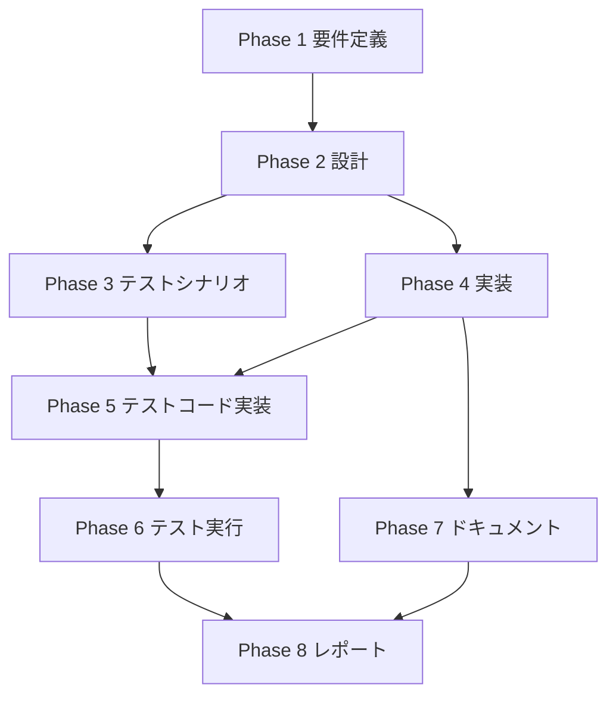

# Codex Agent 実行ログ

開始日時: 2025/11/3 3:16:49

---

## Turn 1: スレッド開始

**Thread ID**: `019a47b7-a7c9-7043-a708-626e535e713d`

## Turn 2: ツール実行

**種別**: コマンド実行
**コマンド**: `bash -lc ls`
**ステータス**: completed (exit_code=0)

```text
ARCHITECTURE.md
CHANGELOG.md
CLAUDE.md
DOCKER_AUTH_SETUP.md
Dockerfile
Jenkinsfile
LICENSE
PROGRESS.md
README.md
ROADMAP.md
SETUP_TYPESCRIPT.md
TROUBLESHOOTING.md
dist
examples
jest.config.cjs
metadata.json.template
node_modules
package-lock.json
package.json
scripts
src
tests
tsconfig.json
tsconfig.test.json
```

## Turn 3: ツール実行

**種別**: コマンド実行
**コマンド**: `bash -lc 'ls .ai-workflow/issue-119'`
**ステータス**: completed (exit_code=0)

```text
00_planning
01_requirements
02_design
03_test_scenario
04_implementation
metadata.json
metadata.json.backup_20251103_024512
```

## Turn 4: ツール実行

**種別**: コマンド実行
**コマンド**: `bash -lc 'cat .ai-workflow/issue-119/00_planning/output/planning.md'`
**ステータス**: completed (exit_code=0)

```text
# プロジェクト計画書 - Issue #119 フォローアップIssue生成品質の改善（LLM活用）

## 1. Issue分析
- **複雑度**: 複雑  
  - 新規AI連携モジュールの追加と既存GitHub連携コードの拡張を伴い、外部API統合・エラーハンドリング・フォールバック設計が必要。
  - テストレイヤーが複数（LLM呼び出しのモック検証と実APIを用いた統合テスト）に渡る。
- **見積もり工数**: 22~26時間  
  - 設計/要件整理: 6~7h、実装: 7~9h、テスト（設計＋実装＋実行）: 6~7h、ドキュメント/レポート: 3h を想定。
- **リスク評価**: 中  
  - LLM APIの不確定要素と生成品質の主観評価が残る一方、既存コードへの影響は限定範囲に収まる見込み。

## 2. 実装戦略判断
- **実装戦略**: EXTEND  
  - 既存の `issue-client.ts` を中心に機能拡張し、新たな `issue-ai-generator.ts` を追加してL TM生成ロジックを組み込む。全体構造は維持したまま責務分割を拡張。
- **テスト戦略**: UNIT_INTEGRATION  
  - プロンプト生成・フォールバック制御はモックを使ったユニットテストで網羅し、実API呼び出しは環境変数制御下で統合テストを追加して品質を確認。
- **テストコード戦略**: BOTH_TEST  
  - 既存フォローアップ生成ロジックのテストを拡張しつつ、新規 `issue-ai-generator` 用の専用テストファイルを新設する必要がある。

## 3. 影響範囲分析
- **既存コードへの影響**  
  - `src/core/github/issue-client.ts`: LLM優先フロー追加、フォールバック制御、ログ出力変更。  
  - `src/types.ts`: 新しいオプションインターフェースとIssue生成データ構造の拡張。  
  - `src/commands/execute/agent-setup.ts` などのクライアント初期化部: LLM設定引き回しが必要な場合は拡張。
- **依存関係の変更**  
  - 新規AIクライアント実装に伴う依存ライブラリ（公式SDK、HTTPクライアント）の追加検討。  
  - `.env` や設定ファイルにAPIキー/モデル指定を追加する可能性。
- **マイグレーション要否**  
  - コード上のマイグレーションは不要。  
  - 設定ファイル・ドキュメントへの追記（APIキー設定、プロンプトファイル）を行う。  
  - 将来的な `.ai-workflow/config.yml` 拡張を見据えた設計が必要。

## 4. タスク分割

### Phase 1: 要件定義 (見積もり: 3~4h)
- [x] Task 1-1: 現行フォローアップIssue生成フローの分析 (1~1.5h)
  - `issue-client.ts` のタイトル/本文生成ロジックをシーケンス図レベルで整理
  - Evaluation Phase から渡る `RemainingTask` / `IssueContext` のデータフローを確認
  - レビュー結果: 要件定義書にシーケンス分析とデータフロー整理が反映されたため完了
- [x] Task 1-2: LLM統合要件の明確化 (1.5~2h)
  - API利用要件（モデル、トークン制限、リトライ戦略）を洗い出す
  - 生成物の品質条件・受け入れ基準を仕様として文書化
  - レビュー結果: モデル候補・トークン制限・リトライ戦略が要件定義書に詳細化されたため完了

### Phase 2: 設計 (見積もり: 4~5h)
- [x] Task 2-1: issue-ai-generatorモジュール設計 (2~2.5h)
  - クラス/関数責務、依存注入方法、フォールバックパスを設計
  - プロンプトテンプレートとレスポンス検証手順を定義
- [x] Task 2-2: 設定・エラーハンドリング設計 (2~2.5h)
  - API鍵の取得経路とマスキング方針を決定
  - レート制限、タイムアウト、再試行ポリシーの設計

### Phase 3: テストシナリオ (見積もり: 2~3h)
- [ ] Task 3-1: テストケース設計 (2~3h)
  - ユニットテスト（成功/失敗/フォールバック/プロンプト検証）のケースを網羅化
  - 統合テストで確認すべきシナリオ（実API、環境変数制御、レスポンス妥当性）を整理

### Phase 4: 実装 (見積もり: 6~7h)
- [ ] Task 4-1: issue-ai-generator.ts の実装 (2.5~3h)
  - プロンプト生成、API呼び出し、レスポンス整形、エラーハンドリングを実装
  - ログとトレース情報（入力長、エラー理由）を追加
- [ ] Task 4-2: issue-client.ts のLLM統合 (2~2.5h)
  - 新モジュール呼び出しとフォールバック制御を実装
  - LLM無効化オプションやテレメトリ用ログを追加
- [ ] Task 4-3: 型/設定まわりの拡張 (1.5~2h)
  - `types.ts` と設定ファイルにオプションを追加
  - エージェント初期化・CLIオプションでのフラグ引き回しを反映

### Phase 5: テストコード実装 (見積もり: 4~5h)
- [ ] Task 5-1: ユニットテスト実装 (2~2.5h)
  - issue-ai-generator用モックテストを作成
  - フォールバック動作とプロンプト生成の検証テストを追加
- [ ] Task 5-2: 統合テスト準備・実装 (2~2.5h)
  - 実API利用テストを環境変数制御で実行できるよう整備
  - テストデータ、レート制限保護の仕組み（スキップ条件等）を実装

### Phase 6: テスト実行 (見積もり: 2~3h)
- [ ] Task 6-1: テスト実行と結果分析 (2~3h)
  - ユニット/統合テストを実行し、失敗ケースを分析
  - ログと生成結果をサンプルIssueと比較して品質を確認

### Phase 7: ドキュメント (見積もり: 2h)
- [ ] Task 7-1: ドキュメント更新 (2h)
  - `ARCHITECTURE.md`, `CLAUDE.md` にLLM統合方針・利用手順を追記
  - APIキー設定手順や設定例をREADME系ドキュメントに反映

### Phase 8: レポート (見積もり: 1~1.5h)
- [ ] Task 8-1: 成果物サマリーとフォローアップ (1~1.5h)
  - 実装差分、テスト結果、残課題をレポートにまとめる
  - 次フェーズ向けの改善案や運用上の注意点を記録

## 5. 依存関係


## 6. リスクと軽減策
#### リスク1: LLM APIのレート制限・エラー多発
- **影響度**: 中
- **確率**: 中
- **軽減策**: リトライ/指数バックオフを実装し、フォールバックを即時に発動できるようにする。統合テストではAPI呼び出し頻度を制限。

#### リスク2: 生成タイトル・本文の品質ばらつき
- **影響度**: 高
- **確率**: 中
- **軽減策**: プロンプトテンプレートをチューニングし、ユニットテストで最低限のセクション検証を実施。レビュー基準を明文化。

#### リスク3: 機密情報の誤送信
- **影響度**: 高
- **確率**: 低
- **軽減策**: フィルタリングレイヤーを設け、送信前にセンシティブなフィールドを除去。APIログに機密情報を残さない。

#### リスク4: 実API統合テストの不安定化
- **影響度**: 中
- **確率**: 中
- **軽減策**: 統合テストをオプトイン方式（環境変数ON時のみ実行）にし、失敗時はフォールバック確認テストを優先。

## 7. 品質ゲート
#### Phase 1: 要件定義
- [ ] LLM統合要件と生成品質基準が明文化されている
- [ ] セキュリティ・コスト要件が整理されている

#### Phase 2: 設計
- [ ] 実装戦略・テスト戦略・テストコード戦略の根拠が設計書に反映されている
- [ ] フォールバックフローとエラーハンドリングが設計されている

#### Phase 3: テストシナリオ
- [x] 成功/失敗/フォールバックを網羅したテスト
... (truncated)
```

## Turn 5: ツール実行

**種別**: コマンド実行
**コマンド**: `bash -lc 'cat .ai-workflow/issue-119/01_requirements/output/requirements.md'`
**ステータス**: completed (exit_code=0)

```text
# 要件定義書 - Issue #119 フォローアップIssue生成品質の改善（LLM活用）

## 0. Planning Documentの確認
- `00_planning/output/planning.md` に基づき、既存 `issue-client.ts` の責務を維持しつつ新規 `issue-ai-generator.ts` でLLM連携を拡張する「EXTEND」戦略を採用する。
- テストはモック中心のユニットテストと実APIを使用する統合テストの両輪（UNIT_INTEGRATION/BOTH_TEST）で実施し、フォールバック経路を含めて網羅する。
- 主なリスクはLLM API失敗・品質ばらつき・機密情報漏洩であり、リトライ／フォールバック、プロンプト検証、フィルタリングで軽減する。
- 想定工数は22〜26時間で、要件定義・設計・実装・テスト・ドキュメント更新までを段階的に進める。

## 1. 概要
既存のフォローアップIssue自動生成機能は、タイトルが一般的すぎて検索性が低く、本文も箇条書きのみで具体的な作業内容が伝わらない。また、元IssueやPRの背景情報が十分に反映されず、残タスクの意義や優先度が不明瞭である。  
本要件はLLMを統合してタイトルと本文の生成品質を向上させ、技術的背景や実行手順を含む実務的に活用できるフォローアップIssueを自動生成することを目的とする。  
これにより、開発チームは手動でIssueを整形する手間を削減し、残タスクの理解・着手が迅速化され、ワークフロー全体のスループット向上と品質担保が期待できる。

### 1.1 現行フォローアップIssue生成フローとデータ連携（Task 1-1）
- **シーケンス概要**  
  1. Evaluation Phase完了時に `RemainingTask[]` と `IssueContext` が Phase Runner から `IssueClient.createIssueFromEvaluation()` へ渡される（`src/core/github/issue-client.ts:198`）。併せて評価レポートのファイルパスが付与される。  
  2. `createIssueFromEvaluation` 内で INFO ログを出力後、`generateFollowUpTitle` が呼び出され、最初の最大3件の残タスクを `extractKeywords` で分割・20文字以内に整形し、`[FOLLOW-UP] #<issueNumber>: <keywords>` 形式のタイトルを組み立てる（同:163行付近）。  
  3. 本文は `IssueContext` が存在する場合に `## 背景` セクションへ `summary` を記述し、`blockerStatus` `deferredReason` をサブセクションとして展開する。`IssueContext` がない場合は定型文にフォールバックする。  
  4. `RemainingTask` をループし、タスク番号ごとに `formatTaskDetails` が Markdown の見出し・対象ファイル一覧・作業手順・受け入れ基準・優先度・見積もり・依存タスクを整形し `## 残タスク詳細` 配下へ追加する（`src/core/github/issue-client.ts:210-274`）。  
  5. 末尾に `## 参考` セクションを追加し、元Issue番号と `evaluationReportPath` へのリンクを差し込んだうえで `---` によるフッタを付与する。  
  6. 完成したタイトル・本文を Octokit 経由で GitHub API `issues.create` に送信し、成功時は INFO、失敗時は `encodeWarning` 済みメッセージを ERROR ログに記録する。

- **データフロー整理**  
  | 入力ソース | 受け取り箇所 | 利用目的 |
  | --- | --- | --- |
  | `RemainingTask.task` | `formatTaskDetails` | `### Task n:` 見出しの文言として使用 |
  | `RemainingTask.targetFiles[]` | `formatTaskDetails` | `**対象ファイル**` セクションにコードパスを列挙 |
  | `RemainingTask.steps[]` | `formatTaskDetails` | 実行手順（番号付きリスト）として出力 |
  | `RemainingTask.acceptanceCriteria[]` | `formatTaskDetails` | `- [ ]` チェックボックス付き受け入れ基準を生成 |
  | `RemainingTask.priority` / `priorityReason` | `formatTaskDetails` | 優先度と根拠を1行にまとめて提示 |
  | `RemainingTask.estimatedHours` | `formatTaskDetails` | 作業見積もりを `**見積もり**` として併記 |
  | `RemainingTask.dependencies[]` | `formatTaskDetails` | 依存タスク一覧を箇条書きで記載 |
  | `IssueContext.summary` | 本文 `## 背景` | 元Issue・PRのサマリーを冒頭に表示 |
  | `IssueContext.blockerStatus` | 本文 `### 元 Issue のステータス` | ブロッカー解消状況を共有 |
  | `IssueContext.deferredReason` | 本文 `### なぜこれらのタスクが残ったか` | 残タスク発生の背景説明 |
  | `evaluationReportPath` | 本文 `## 参考` | 評価レポート位置をリンク/パスで提示 |

  `RemainingTask` と `IssueContext` は `src/types.ts:36-105` に定義されており、Evaluation Phaseからの構造体がそのまま文字列化される。今後のLLM統合ではこれらの値をプロンプト入力へ拡張するが、既存フォールバック経路との互換性を維持する。

## 2. 機能要件
Issue本文に「## TODO」節は存在しないため、概要および提案解決策から抽出した要件を整理する。

| ID | 要件 | 詳細 | 優先度 |
| --- | --- | --- | --- |
| FR-1 | LLMを用いたインテリジェントタイトル生成 | `generateIntelligentTitle` 関数で元Issue・PR・残タスクの文脈を入力に、50〜80文字の技術的に明確なタイトルを生成する。タイトルは主要コンポーネントや指標（例: 対象モジュール、目標値）を含み、既存の単語分割ロジックより情報密度が高いこと。 | 高 |
| FR-2 | 構造化されたタスク本文生成 | `generateTaskDescription` が背景、目的、実行内容（ステップ・対象ファイル・テスト方法）、受け入れ基準、関連リソースをMarkdownセクションとして出力する。本文内で1ステップずつ実行指示を明示し、テスト手順と完了条件を含める。 | 高 |
| FR-3 | フォールバック制御 | LLM呼び出し失敗・タイムアウト・無効化設定時には既存の `generateFollowUpTitle` / `formatTaskDetails` を自動で利用し、処理を中断させない。フォールバック発動状況は警告ログで記録する。 | 高 |
| FR-4 | 設定オプションの拡張 | `IssueGenerationOptions` 等を通じてLLM有効化フラグ、モデル選択、タイムアウト、最大リトライ回数を指定できるようにし、CLIや環境変数から設定可能にする。デフォルト値は後方互換を保つ。 | 中 |
| FR-5 | ログと品質監視 | LLM呼び出し成功時は入力トークン長・モデル名・生成時間をDEBUGログに出力し、失敗時は原因と再試行状況をWARNログに記録する。WARNログは `{ event_code, message, fallback_mode, retry_count }` を最低限含む構造化ペイロードとし、ログには機密情報を含めない。 | 中 |

### 2.1 LLM API利用要件（Task 1-2）
- **モデル候補とトークン制限**  
  | モデルID | プロバイダ | 想定用途 | 最大入力トークン | 最大出力トークン | 備考 |
  | --- | --- | --- | --- | --- | --- |
  | `claude-3-sonnet-20240229` | Anthropic | デフォルト（高品質/安定） | 8,000 | 2,000 | コストと品質のバランスが良い。 |
  | `gpt-4o-2024-05-13` | OpenAI | 代替（マルチリンガル/ツール連携） | 8,192 | 2,048
... (truncated)
```

## Turn 6: ツール実行

**種別**: コマンド実行
**コマンド**: `bash -lc "sed -n '124,248p' .ai-workflow/issue-119/01_requirements/output/requirements.md"`
**ステータス**: completed (exit_code=0)

```text
- 英語以外の多言語サポートやプロジェクト固有テンプレートの自動切替は本フェーズでは扱わない。
```

## Turn 7: ツール実行

**種別**: コマンド実行
**コマンド**: `bash -lc 'cat .ai-workflow/issue-119/02_design/output/design.md'`
**ステータス**: completed (exit_code=0)

```text
# 詳細設計書 - Issue #119 フォローアップIssue生成品質の改善（LLM活用）

**Issue番号**: #119  
**タイトル**: フォローアップIssue生成品質の改善（LLM活用）  
**バージョン**: 1.1 (Design)

---

## 1. アーキテクチャ設計

### 1.1 システム全体フロー

```
EvaluationPhase (Phase 9)
    │ RemainingTask[], IssueContext, evaluation report path, generation options
    ▼
GitHubClient.createIssueFromEvaluation(...)
    │ delegates
    ▼
IssueClient (LLM-aware)
    ├─ IssueAIGenerator.generate(...)
    │     └─ LLM Provider Adapter (OpenAI / Anthropic)
    └─ Legacy builders (generateFollowUpTitle + buildLegacyBody)
    ▼
Octokit.issues.create(...) → GitHub Issue
```

### 1.2 コンポーネント責務

| コンポーネント | 役割 | 主な入出力 |
| --- | --- | --- |
| `EvaluationPhase` | Phase 9 の処理。残タスク検出後に GitHubClient へフォローアップ生成を依頼 | 入力: Evaluation結果 / 出力: IssueGenerationOptions 付き呼び出し |
| `GitHubClient` | GitHub API ファサード。IssueClient へ委譲し設定を束ねる | 入力: issue番号, tasks, options / 出力: IssueCreationResult |
| `IssueClient` | フォローアップIssue生成の集約。LLM生成→フォールバック制御→Octokit呼び出し | 入力: tasks, context, options / 出力: タイトル・本文・ログ |
| `IssueAIGenerator` (新規) | LLMプロンプト生成、API呼び出し、レスポンス検証 | 入力: tasks, context, options / 出力: { title, body, metadata } |
| `LlmProviderAdapter` (OpenAI / Anthropic) | 各APIのラッパー。タイムアウト・再試行を実装 | 入出力: prompt, call options, completion JSON |
| `config` / CLI | 環境変数・CLIから LLM 設定を収集し PhaseContextへ渡す | 入出力: Follow-up LLM 設定値 |
| `SecretMasker` (既存) | 機密情報のマスキング | 入力: プロンプトPayload / 出力: SanitizedPayload |

### 1.3 データフロー

1. ユーザーが `ai-workflow execute ...` を実行し、CLI が Follow-up LLM オプションを解析 (デフォルトは無効)。
2. `commands/execute` が `PhaseContext.issueGenerationOptions` を組み立て、`PhaseFactory` 経由で `EvaluationPhase` へ受け渡す。
3. EvaluationPhase で残タスクが存在すると `GitHubClient.createIssueFromEvaluation(issueNumber, tasks, reportPath, context, options)` を呼び出す。
4. `GitHubClient` は `IssueAIGenerator` をコンストラクタインジェクション済みの `IssueClient` に委譲。
5. `IssueClient` が `options.enabled` と `IssueAIGenerator.isAvailable()` を確認し、利用可能なら `generate(tasks, context, options)` を試行。
6. `IssueAIGenerator` は payload をサニタイズ→プロンプト生成→LLM呼び出し→検証し、成功時にタイトル・本文を返却。
7. LLM 失敗または無効時、`IssueClient` は既存の `generateFollowUpTitle` と新設の `buildLegacyBody` でフォールバック本文を生成。
8. 生成結果と `## 参考` セクション (＋オプションで LLM metadata) を結合し、Octokit で Issue を作成。ログへ成否とメタ情報を出力。

### 1.4 主なシーケンスと失敗時動作

- LLM 成功: `IssueAIGenerator` → validated result → `IssueClient` が LLM 出力を採用 → `options.appendMetadata` が true の場合にメタデータ節を付加。
- LLM タイムアウト / レート制限: Providerアダプタが指数バックオフで再試行。全失敗で `IssueAIError` を返し IssueClient が WARN を記録しフォールバック。
- プロンプト検証失敗: `IssueAIGenerator` が `IssueAIValidationError` を送出し、同様にフォールバック。
- Octokit 失敗: 既存処理と同様に ERROR ログを出力し `IssueCreationResult` で失敗を返却。

---

## 2. 実装戦略判断: EXTEND

**判断根拠**:
- 既存 `IssueClient` / `GitHubClient` / CLI フローを維持したまま責務を拡張する必要があるため。
- フォールバックとして既存テンプレートを保持しつつ LLM 生成を追加する形で後方互換を守る。
- Planning Document の戦略 (新規モジュール追加 + 既存コード拡張) と整合。

---

## 3. テスト戦略判断: UNIT_INTEGRATION

**判断根拠**:
- プロンプト生成・レスポンス検証・リトライといったロジックはモック化が容易であり、ユニットテストで網羅できる。
- GitHub 連携や Phase からのオプション伝搬、フォールバック全体の動作は統合テストで確認する必要がある。

---

## 4. テストコード戦略判断: BOTH_TEST

**判断根拠**:
- 既存 `issue-client` テストに LLM 成功/失敗パスを追加する必要がある (既存テストの拡張)。
- `IssueAIGenerator` 用の専用ユニットテストが新規に必要となる (新規テスト作成)。

---

## 5. 影響範囲分析

### 5.1 既存コードへの影響
- `src/core/github/issue-client.ts`: 依存注入、LLM 分岐、本文生成をメソッド化、WARN/DEBUG ログ拡張。
- `src/core/github-client.ts`: `IssueAIGenerator` の初期化と委譲。`createIssueFromEvaluation` にオプションパラメータ追加。
- `src/core/phase-factory.ts`: `PhaseContext` へ追加した `issueGenerationOptions` を全 Phase に渡す初期化処理を拡張。
- `src/phases/base-phase.ts`: Phase インスタンスが `issueGenerationOptions` を受け取り `this.context` へ保持できるようにする。
- `src/phases/evaluation.ts`: `GitHubClient.createIssueFromEvaluation` 呼び出しに LLM オプションを渡す。
- `src/core/secret-masker.ts`: `maskObject` を追加してネストした残タスクオブジェクトを一括マスキングできるようにする。
- `src/commands/execute.ts` / `src/commands/execute/options-parser.ts`: CLI オプション解析に Follow-up LLM 設定を追加し `PhaseContext` へ渡す。
- `src/types.ts`: `IssueGenerationOptions` や LLM 結果の型を追加。
- `src/types/commands.ts`: `PhaseContext` に `issueGenerationOptions` プロパティを追加。
- `src/core/
... (truncated)
```

## Turn 8: ツール実行

**種別**: コマンド実行
**コマンド**: `bash -lc "sed -n '120,240p' .ai-workflow/issue-119/02_design/output/design.md"`
**ステータス**: completed (exit_code=0)

```text
- `src/core/phase-factory.ts`
  - `src/phases/base-phase.ts`
  - `src/phases/evaluation.ts`
  - `src/core/secret-masker.ts`
  - `src/commands/execute.ts`
  - `src/commands/execute/options-parser.ts`
  - `src/types.ts`
  - `src/types/commands.ts`
  - `src/core/config.ts`
  - `tests/unit/github/issue-client.test.ts`
  - `tests/unit/github/issue-client-followup.test.ts`
  - `tests/unit/secret-masker.test.ts`
  - `tests/integration/github-client-facade.test.ts`
  - ドキュメント (`ARCHITECTURE.md`, `CLAUDE.md`, `README.md`, `.env.example`)
- **削除予定**: なし

---

## 7. 詳細設計

### 7.1 IssueGenerationOptions / IssueAIGenerationResult

```ts
export interface IssueGenerationOptions {
  enabled: boolean;
  provider: 'auto' | 'openai' | 'claude';
  model?: string;
  temperature?: number;          // default 0.2
  maxOutputTokens?: number;      // default 1500
  timeoutMs?: number;            // default 25000
  maxRetries?: number;           // default 3
  maxTasks?: number;             // default 5
  appendMetadata?: boolean;      // default false
}

export interface IssueAIGenerationResult {
  title: string;
  body: string;
  metadata: {
    provider: 'openai' | 'claude';
    model: string;
    durationMs: number;
    retryCount: number;
    inputTokens?: number;
    outputTokens?: number;
    omittedTasks?: number;
  };
}
```

- `config` でデフォルトを構築し、CLI/環境変数で上書き可能にする。
- `PhaseContext` に `issueGenerationOptions` を追加し、省略時は `{ enabled: false, provider: 'auto' }` を適用。

### 7.2 IssueAIGenerator クラス (新規)

- コンストラクタ: `(providers: Record<'openai' | 'claude', LlmProviderAdapter>, secretMasker = new SecretMasker())`。
- 補助的なエラー型:
  - `IssueAIUnavailableError` (credentials 不足など)
  - `IssueAIValidationError` (出力検証失敗)
- 公開メソッド:
  - `isAvailable(options: IssueGenerationOptions): boolean`  
    - `options.enabled` が true かつ選択された provider（`auto` の場合は利用可能なもの）が `hasCredentials()` を満たす。
  - `generate(tasks, context, issueNumber, options): Promise<IssueAIGenerationResult>`  
    1. `sanitizePayload(tasks, context, options.maxTasks ?? 5)`  
       - `RemainingTask` を優先度順 (High→Medium→Low) に並べ、上位 `maxTasks` を採用。超過分は `omittedTasks` としてメタに記録。  
       - 各文字列フィールドは 512 文字にトリム。`targetFiles` は 10 件、`steps` / `acceptanceCriteria` は各 8 件まで。  
       - `SecretMasker.maskObject` で既知のシークレット値・トークン・メールアドレスを `[REDACTED_x]` に置換。
    2. `buildPrompt(issueNumber, sanitizedPayload, context, options)`  
       - JSON 文字列化し、テンプレートへ埋め込む。
    3. `invokeProvider(prompt, options)`  
       - 選択された provider の `complete()` を呼び出す。  
       - レート制限時は指数バックオフ (2000ms, 4000ms, 8000ms) とし、回数は `options.maxRetries`。
    4. `parseAndValidate(responseText)`  
       - JSON パース → タイトル長 50〜80 文字 → 必須セクションを順番に確認 → `実行内容` セクションが番号付きリスト (`1.` 形式) とテスト手順 (`テスト` or `検証`) を含むか検証 → HTML タグを禁止。  
       - 失敗時は `IssueAIValidationError`。
    5. 成功時に metadata (provider, model, duration, retryCount, input/output tokens, omittedTasks) 付きで返却。

### 7.3 LlmProviderAdapter

```ts
interface LlmProviderAdapter {
  name: 'openai' | 'claude';
  hasCredentials(): boolean;
  complete(prompt: string, options: IssueGenerationOptions): Promise<LlmProviderResponse>;
}

interface LlmProviderResponse {
  text: string;
  inputTokens?: number;
  outputTokens?: number;
  retryCount: number;
  durationMs: number;
}
```

- **OpenAIAdapter**
  - `openai.chat.completions.create()` を呼び出し、`response_format: { type: 'json_object' }` を指定。
  - `AbortController` で `timeoutMs` を強制。
  - HTTP 429/5xx 時は指数バックオフで再試行。最終的に失敗ならエラーをスロー。
- **AnthropicAdapter**
  - `@anthropic-ai/claude-agent-sdk` の `messages.create()` を利用。
  - `options.model` が無ければ `claude-3-sonnet-20240229` を使用。
  - 応答の `content` を結合し JSON テキストを取得。
- `provider: 'auto'` の場合は OpenAI キーが存在すれば OpenAIAdapter、それ以外は ClaudeAdapter を選択。

### 7.4 プロンプト生成とバリデーション

テンプレート例 (コード内定数として保持):

````markdown
あなたはソフトウェア開発プロジェクトのIssue作成アシスタントです。
以下のJSONを読み取り、フォローアップIssueを構築してください。

入力:
{{payload}}

要件:
1. タイトルは50〜80文字。対象コンポーネントや目的のキーワードを含めること。
2. 本文は以下の見出し順序とします。
   ## 背景
   ## 目的
```

## Turn 9: ツール実行

**種別**: コマンド実行
**コマンド**: `bash -lc "sed -n '240,480p' .ai-workflow/issue-119/02_design/output/design.md"`
**ステータス**: completed (exit_code=0)

```text
## 目的
   ## 実行内容
   ## 受け入れ基準
   ## 関連リソース
3. 実行内容には対象ファイル・手順・テスト方法を含めること。
4. JSON 形式で回答してください。

出力形式:
{
  "title": "...",
  "body": "..."
}
````

- `parseAndValidate` 検証ルール:
  - JSON パース失敗 → `IssueAIValidationError`。
  - タイトル文字数 (全角半角問わず) が 50 未満または 80 超過で失敗。
  - 本文に必須5セクションが順番に存在するか正規表現で確認。
  - `## 実行内容` 内に番号付きリスト (`^\d+\. `) があり、いずれかの行に `テスト`/`検証` を含むことを確認。
  - HTML/スクリプトタグを検出したら失敗。
  - 余分な末尾空行は `trimEnd()` で整理。

### 7.5 IssueClient 拡張

- コンストラクタに `IssueAIGenerator | null` を追加 (`new IssueClient(octokit, owner, repo, issueAIGenerator)`).
- 新規ヘルパー:
  - `private buildLegacyBody(...)`: 現行ロジックを抽出し、フォールバック時に再利用。
  - `private appendMetadata(body, metadata, options)`: `options.appendMetadata` が true の場合に以下を追加。
    ```
    ## 生成メタデータ
    - モデル: ${metadata.model} (${metadata.provider})
    - 所要時間: ${metadata.durationMs}ms / 再試行: ${metadata.retryCount}
    - トークン: in ${metadata.inputTokens ?? '-'} / out ${metadata.outputTokens ?? '-'}
    - 省略したタスク数: ${metadata.omittedTasks ?? 0}
    ```
  - `private async tryGenerateWithLLM(...)`: LLM が利用可能か判定し、失敗時は WARN ログで理由を記録して `null` を返す。
- `createIssueFromEvaluation` の流れ:
  1. `const aiResult = await this.tryGenerateWithLLM(...);`
  2. `const title = aiResult?.title ?? this.generateFollowUpTitle(...);`
  3. `const baseBody = aiResult?.body ?? this.buildLegacyBody(...);`
  4. `const body = aiResult ? this.appendMetadata(baseBody, aiResult.metadata, options) : baseBody;`
  5. 既存どおり Octokit で Issue を作成。
- ログ出力:
  - 成功 (`logger.debug`): `FOLLOWUP_LLM_SUCCESS { provider, model, durationMs, retryCount }`
  - フォールバック (`logger.warn`): `FOLLOWUP_LLM_FALLBACK { reason, fallback: 'legacy_template' }`
  - ログにはプロンプト本文を含めない。

### 7.6 GitHubClient / Phase 連携

- `GitHubClient` コンストラクタで `IssueAIGenerator` を生成し `IssueClient` に渡す。
- `createIssueFromEvaluation` の署名を `(..., issueContext?: IssueContext, options?: IssueGenerationOptions)` に拡張。`options` が無い場合は `config` から取得する。
- `EvaluationPhase`:
  ```ts
  const options = this.context.issueGenerationOptions ?? { enabled: false, provider: 'auto' };
  const result = await this.github.createIssueFromEvaluation(
    issueNumber,
    remainingTasks,
    relativeReportPath,
    issueContext,
    options,
  );
  ```
- `PhaseFactory` / `BasePhase` で `PhaseContext.issueGenerationOptions` を新たに受け渡す。

### 7.7 CLI / Config 拡張

- `ExecuteCommandOptions` に以下フィールドを追加:
  - `followupLlmMode?: 'auto' | 'openai' | 'claude' | 'off'`
  - `followupLlmModel?: string`
  - `followupLlmTimeout?: number`
  - `followupLlmMaxRetries?: number`
  - `followupLlmAppendMetadata?: boolean`
- `options-parser.ts` でバリデーション:
  - `off` → `enabled` false。
  - timeout/retries は正の整数 (0 許容)。
  - provider 指定が `openai` なのに OpenAI APIキー不在の場合は警告ログを出して `enabled=false`。
- `config.ts` で環境変数ゲッターを追加 (`FOLLOWUP_LLM_MODE`, `FOLLOWUP_LLM_MODEL`, `FOLLOWUP_LLM_TIMEOUT_MS`, `FOLLOWUP_LLM_MAX_RETRIES`, `FOLLOWUP_LLM_APPEND_METADATA`)。
- CLI 例:  
  `ai-workflow execute --issue 119 --phase evaluation --followup-llm-mode auto --followup-llm-model claude-3-sonnet-20240229`.

### 7.8 SecretMasker 拡張

- 新規メソッド `maskObject<T>(input: T, options?: { ignoredPaths?: string[] }): T` を追加し、入力オブジェクトを破壊せずに深いコピーを返す。`ignoredPaths` は `['tasks.*.metadata']` のようなドット表記で除外を指定できる。
- 処理フロー:
  1. `getSecretList()` で環境変数ベースのシークレットを取得し、`[REDACTED_${name}]` への置換テーブルを構築。
  2. 追加で以下のパターンを検出する正規表現を用意し、ヒットした文字列は `[REDACTED_PATTERN]` に置換する。  
     - 長さ 20 文字以上の英数字+`-_` 混在トークン (`/[A-Za-z0-9_-]{20,}/g`)  
     - メールアドレス (`/[A-Za-z0-9._%+-]+@[A-Za-z0-9.-]+\.[A-Za-z]{2,}/g`)  
     - `Bearer <token>` / `token=` 形式 (`/(Bearer|token=)[\w\-.]+/gi`)
  3. 走査は DFS で実装し、`WeakSet` で循環参照を検出して二度処理しない。配列は同じく再帰し、プリミティブ以外は `Object.prototype.toString` で plain object のみを対象にする。
  4. 文字列に対しては上記パターンとシークレット値を順次 `replaceAll` し、オブジェクト／配列はフィールド単位で再帰結果を集約する。
- 戻り値は元の構造を維持した `sanitized` コピー。元のオブジェクトは変更せず、`undefined` や関数はそのまま返す。
- `IssueAIGenerator.sanitizePayload` はこの `maskObject` の戻り値に対して文字数トリムやタスク数制限を適用し、マスキングと整形の責務を分離する。
- 追加するユニットテストでは、ネストしたオブジェクトと配列、循環参照、`ignoredPaths` 指定時の除外、メールアド
... (truncated)
```

## Turn 10: ツール実行

**種別**: コマンド実行
**コマンド**: `bash -lc "sed -n '480,720p' .ai-workflow/issue-119/02_design/output/design.md"`
**ステータス**: completed (exit_code=0)

## Turn 11: ツール実行

**種別**: コマンド実行
**コマンド**: `bash -lc 'cat .ai-workflow/issue-119/03_test_scenario/output/test-scenario.md'`
**ステータス**: completed (exit_code=0)

```text
# テストシナリオ - Issue #119 フォローアップIssue生成品質の改善（LLM活用）

## 1. テスト戦略サマリー
- **戦略**: UNIT_INTEGRATION（Phase 2確定）。ユニットテストで `IssueAIGenerator` / `IssueClient` / `SecretMasker` のロジックを網羅し、統合テストで CLI→Phase→GitHubClient の連携とフォールバック挙動を検証する。
- **テスト対象範囲**: 新規 `issue-ai-generator.ts`、拡張された `issue-client.ts`、`secret-masker` 拡張、CLI オプションと PhaseContext の連携、LLM プロバイダアダプタ。
- **テスト目的**: FR-1〜FR-5 に沿って LLM 生成タイトル/本文品質、フォールバック制御、設定オプション伝搬、ログ/メタデータ記録、セキュリティ（マスキング）を確認する。

## 2. Unitテストシナリオ

### テストケース名: issue_ai_generator_generate_success_正常系
- 目的: LLM プロバイダが有効な JSON を返却した際に、タイトル/本文/メタデータが採用されることを検証する（FR-1, FR-2, FR-5）。
- 前提条件: `IssueGenerationOptions.enabled=true`, provider は `openai`, API キーはモックで利用可能。プロバイダは1回で成功レスポンスを返す。
- 入力: 高優先度タスク1件、`IssueContext`（summary, blockerStatus, deferredReason）、`maxTasks=3`, `appendMetadata=true`。
- 期待結果: 50〜80文字のタイトルと5セクションを含む本文を返却。メタデータに provider/model/duration/retryCount=0 が設定され、`appendMetadata` 指定時に本文末尾へ追記される。
- テストデータ: `task_high_priority`（後述）、`context_with_blocker`、モックレスポンス `{ "title": "カバレッジ90%達成 - core/gitの単体テスト拡張", "body": "## 背景\n..." }`。

### テストケース名: issue_ai_generator_generate_retry_success_正常系
- 目的: プロバイダが一時的に失敗した場合でも最大リトライ内で成功することを検証する（FR-3, FR-5）。
- 前提条件: `maxRetries=3`, プロバイダモックが1回目に HTTP 429、2回目に成功レスポンスを返す。バックオフタイマはフェイクで制御。
- 入力: 中優先度タスク1件、`IssueContext` あり。
- 期待結果: `IssueAIGenerationResult.metadata.retryCount=1`、最終タイトル/本文は成功レスポンスを反映、WARN ログを出さず DEBUG ログのみで完了。
- テストデータ: `task_medium_priority`, 成功レスポンス JSON。

### テストケース名: issue_ai_generator_generate_invalid_json_異常系
- 目的: プロバイダが JSON 以外のテキストを返す場合に `IssueAIValidationError` を送出しフォールバック条件となることを検証する（FR-2, FR-3）。
- 前提条件: `enabled=true`、プロバイダモックが `"**markdown only**"` を返す。
- 入力: タスク1件、`IssueContext` 任意。
- 期待結果: `IssueAIValidationError` が throw され、呼び出し側でフォールバック処理に遷移できる。
- テストデータ: `task_low_priority`, ノイズレスポンス `"**markdown only**"`.

### テストケース名: issue_ai_generator_generate_missing_sections_異常系
- 目的: 本文に必須セクションが不足している場合に検証エラーが発生することを確認する（FR-2）。
- 前提条件: プロバイダが `## 実行内容` を欠いた本文を返す。
- 入力: タスク1件、`IssueContext` 任意。
- 期待結果: `IssueAIValidationError` が throw される。ログにバリデーション理由（missing sections）が WARN 出力される。
- テストデータ: `task_high_priority`, レスポンス JSON から `## 実行内容` を意図的に削除。

### テストケース名: issue_ai_generator_sanitize_payload_boundary_境界値
- 目的: タスク数・文字数・配列要素数の上限とマスキング処理が正しく適用されることを検証する（FR-2, セキュリティ要件）。
- 前提条件: 6件のタスク（高3/中2/低1）、長文の `steps`・`targetFiles`、Bearer トークン/メールアドレスを含む説明を用意。
- 入力: `maxTasks=5`, `IssueContext` あり。
- 期待結果: 高→中→低の優先度順に5件へ切り詰められる。文字列512文字でトリム済み。`targetFiles` は10件に制限。シークレット文字列が `[REDACTED_]` へ置換される。
- テストデータ: `task_priority_set`, `context_with_secret`.

### テストケース名: secret_masker_mask_object_正常系
- 目的: `maskObject` がネスト/配列/循環参照を含むオブジェクトを破壊せずにマスキングすることを確認する（セキュリティ要件）。
- 前提条件: `ignoredPaths=['tasks.1.meta']` を指定。循環参照を含むテストオブジェクトを作成。
- 入力: API キー文字列、メールアドレス、Bearer トークンを含むオブジェクト。
- 期待結果: 元オブジェクトは不変。戻り値で対象文字列が `[REDACTED_*]` に置換され、`ignoredPaths` 指定フィールドは未マスク。
- テストデータ: `sanitization_fixture`.

### テストケース名: issue_client_create_issue_llm_success_正常系
- 目的: LLM 出力が成功した場合にタイトル/本文/メタデータが採用され、Octokit へ送信されることを検証する（FR-1〜FR-5）。
- 前提条件: `appendMetadata=true`、`IssueAIGenerator` モックが成功結果を返す、Octokit モックが `issues.create` 呼び出しを記録。
- 入力: タスク2件（高/中）、`IssueContext` あり。
- 期待結果: Octokit へ渡るタイトル/本文が LLM 結果とメタデータ追記を含む。WARN ログは発生しない。
- テストデータ: `task_high_priority`, `task_medium_priority`, `context_with_blocker`, LLM 成功レスポンス。

### テストケース名: issue_client_create_issue_llm_fallback_異常系
- 目的: LLM 失敗時に WARN ログと共に既存テンプレートへフォールバックすることを検証する（FR-3）。
- 前提条件: `IssueAIGenerator.generate` が `IssueAIValidationError` を throw。Octokit モックが呼び出される。
- 入力: タスク1件、`IssueContext` あり。
- 期待結果: WARN ログ `FOLLOWUP_LLM_FALLBACK` が出力され、Octokit へはレガシータイトル/本文が送信される。
- テストデータ: `task_low_priority`, 既存 `generateFollowUpTitle` で計算可能なキーワード。

### テストケース名: issue_client_create_issue_llm_disabled_境界値
- 目的: `IssueGenerationOptions.enabled=false` の場合に LLM を呼び出さず既存挙動を維持することを確認する（FR-4）。
- 前提条件: `enabled=false`, `appendMetadata=false`。`IssueAIGenerator` モックは呼ばれていないことを検証。
- 入力: タスク1件、`IssueContext` あり。
- 期待結果: LLM 呼び出しが 0 回、Octokit へはレガシータ
... (truncated)
```

## Turn 12: ツール実行

**種別**: コマンド実行
**コマンド**: `bash -lc 'ls src'`
**ステータス**: completed (exit_code=0)

```text
commands
core
index.ts
main.ts
phases
prompts
templates
types
types.ts
utils
```

## Turn 13: ツール実行

**種別**: コマンド実行
**コマンド**: `bash -lc "sed -n '1,200p' src/core/github/issue-client.ts"`
**ステータス**: completed (exit_code=0)

```text
import { Octokit } from '@octokit/rest';
import { logger } from '../../utils/logger.js';
import { RequestError } from '@octokit/request-error';
import { getErrorMessage } from '../../utils/error-utils.js';
import { RemainingTask, IssueContext } from '../../types.js';

export interface IssueInfo {
  number: number;
  title: string;
  body: string;
  state: string;
  labels: string[];
  url: string;
  created_at: string;
  updated_at: string;
}

export interface CommentDict {
  id: number;
  user: string;
  body: string;
  created_at: string;
  updated_at: string;
}

export interface IssueCreationResult {
  success: boolean;
  issue_url: string | null;
  issue_number: number | null;
  error?: string | null;
}

export interface GenericResult {
  success: boolean;
  error?: string | null;
}

/**
 * IssueClient handles all Issue-related operations with GitHub API.
 * Responsibilities:
 * - Issue retrieval (getIssue, getIssueInfo)
 * - Issue comments retrieval (getIssueComments, getIssueCommentsDict)
 * - Comment posting (postComment)
 * - Issue closing (closeIssueWithReason)
 * - Follow-up issue creation (createIssueFromEvaluation)
 */
export class IssueClient {
  private readonly octokit: Octokit;
  private readonly owner: string;
  private readonly repo: string;

  constructor(octokit: Octokit, owner: string, repo: string) {
    this.octokit = octokit;
    this.owner = owner;
    this.repo = repo;
  }

  /**
   * Retrieves issue details from GitHub API.
   */
  public async getIssue(issueNumber: number) {
    const { data } = await this.octokit.issues.get({
      owner: this.owner,
      repo: this.repo,
      issue_number: issueNumber,
    });
    return data;
  }

  /**
   * Retrieves simplified issue information.
   */
  public async getIssueInfo(issueNumber: number): Promise<IssueInfo> {
    const issue = await this.getIssue(issueNumber);
    return {
      number: issue.number,
      title: issue.title ?? '',
      body: issue.body ?? '',
      state: issue.state ?? 'open',
      labels: (issue.labels ?? []).map((label) =>
        typeof label === 'string' ? label : label.name ?? '',
      ),
      url: issue.html_url ?? '',
      created_at: issue.created_at ?? new Date().toISOString(),
      updated_at: issue.updated_at ?? new Date().toISOString(),
    };
  }

  /**
   * Retrieves all comments for an issue.
   */
  public async getIssueComments(issueNumber: number) {
    const { data } = await this.octokit.issues.listComments({
      owner: this.owner,
      repo: this.repo,
      issue_number: issueNumber,
    });
    return data;
  }

  /**
   * Retrieves issue comments in dictionary format.
   */
  public async getIssueCommentsDict(issueNumber: number): Promise<CommentDict[]> {
    const comments = await this.getIssueComments(issueNumber);
    return comments.map((comment) => ({
      id: comment.id,
      user: comment.user?.login ?? 'unknown',
      body: comment.body ?? '',
      created_at: comment.created_at ?? '',
      updated_at: comment.updated_at ?? '',
    }));
  }

  /**
   * Posts a comment to an issue.
   */
  public async postComment(issueNumber: number, body: string) {
    const { data } = await this.octokit.issues.createComment({
      owner: this.owner,
      repo: this.repo,
      issue_number: issueNumber,
      body,
    });
    return data;
  }

  /**
   * Closes an issue with a reason comment.
   */
  public async closeIssueWithReason(issueNumber: number, reason: string): Promise<GenericResult> {
    try {
      await this.postComment(
        issueNumber,
        [
          '## ⚠️ ワークフロー中止',
          '',
          'プロジェクト評価の結果、致命的な問題が発見されたため、ワークフローを中止します。',
          '',
          '### 中止理由',
          '',
          reason,
          '',
          '### 推奨アクション',
          '',
          '- アーキテクチャの再設計',
          '- スコープの見直し',
          '- 技術選定の再検討',
          '',
          '---',
          '*AI Workflow Phase 9 (Evaluation) - ABORT*',
        ].join('\n'),
      );

      await this.octokit.iss
... (truncated)
```

## Turn 14: ツール実行

**種別**: コマンド実行
**コマンド**: `bash -lc "sed -n '200,400p' src/core/github/issue-client.ts"`
**ステータス**: completed (exit_code=0)

```text
if (keyword) {
        keywords.push(keyword);
      }
    }

    return keywords;
  }

  /**
   * フォローアップ Issue のタイトルを生成する
   *
   * @param issueNumber - 元 Issue 番号
   * @param remainingTasks - 残タスクのリスト
   * @returns Issue タイトル（80文字以内）
   */
  private generateFollowUpTitle(issueNumber: number, remainingTasks: RemainingTask[]): string {
    // キーワード抽出（最大3個）
    const keywords = this.extractKeywords(remainingTasks, 3);

    // キーワードが抽出できた場合
    if (keywords.length > 0) {
      const keywordsStr = keywords.join('・');
      const title = `[FOLLOW-UP] #${issueNumber}: ${keywordsStr}`;

      // 80文字制限
      if (title.length > 80) {
        return title.substring(0, 77) + '...';
      }

      return title;
    }

    // フォールバック: キーワードが抽出できない場合は従来形式
    return `[FOLLOW-UP] Issue #${issueNumber} - 残タスク`;
  }

  /**
   * 残タスクの詳細情報をフォーマットする
   *
   * @param task - 残タスク
   * @param taskNumber - タスク番号（1始まり）
   * @returns フォーマットされた行の配列
   */
  private formatTaskDetails(task: RemainingTask, taskNumber: number): string[] {
    const lines: string[] = [];

    // タスク見出し
    lines.push(`### Task ${taskNumber}: ${task.task}`, '');

    // 対象ファイル（存在する場合のみ）
    if (task.targetFiles && task.targetFiles.length > 0) {
      lines.push('**対象ファイル**:', '');
      task.targetFiles.forEach((file) => lines.push(`- \`${file}\``));
      lines.push('');
    }

    // 必要な作業（存在する場合のみ）
    if (task.steps && task.steps.length > 0) {
      lines.push('**必要な作業**:', '');
      task.steps.forEach((step, i) => lines.push(`${i + 1}. ${step}`));
      lines.push('');
    }

    // Acceptance Criteria（存在する場合のみ）
    if (task.acceptanceCriteria && task.acceptanceCriteria.length > 0) {
      lines.push('**Acceptance Criteria**:', '');
      task.acceptanceCriteria.forEach((ac) => lines.push(`- [ ] ${ac}`));
      lines.push('');
    }

    // Phase
    lines.push(`**Phase**: ${task.phase ?? 'unknown'}`, '');

    // 優先度 + 根拠
    const priority = task.priority ?? '中';
    const priorityLine = task.priorityReason
      ? `**優先度**: ${priority} - ${task.priorityReason}`
      : `**優先度**: ${priority}`;
    lines.push(priorityLine, '');

    // 見積もり工数
    lines.push(`**見積もり**: ${task.estimatedHours ?? '未定'}`, '');

    // 依存タスク（存在する場合のみ）
    if (task.dependencies && task.dependencies.length > 0) {
      lines.push('**依存タスク**:', '');
      task.dependencies.forEach((dep) => lines.push(`- ${dep}`));
      lines.push('');
    }

    lines.push('---'); // タスク間の区切り線

    return lines;
  }

  /**
   * Creates a follow-up issue from evaluation remaining tasks.
   *
   * @param issueNumber - 元 Issue 番号
   * @param remainingTasks - 残タスクのリスト
   * @param evaluationReportPath - Evaluation レポートのパス
   * @param issueContext - Issue コンテキスト（背景情報、オプショナル）
   * @returns Issue 作成結果
   */
  public async createIssueFromEvaluation(
    issueNumber: number,
    remainingTasks: RemainingTask[],
    evaluationReportPath: string,
    issueContext?: IssueContext,
  ): Promise<IssueCreationResult> {
    try {
      logger.info(`Creating follow-up issue for #${issueNumber} with ${remainingTasks.length} remaining tasks`);

      // タイトル生成
      const title = this.generateFollowUpTitle(issueNumber, remainingTasks);

      // 本文生成
      const lines: string[] = [];

      // 背景セクション（issueContext が存在する場合のみ）
      if (issueContext) {
        lines.push('## 背景', '');
        lines.push(issueContext.summary, '');

        if (issueContext.blockerStatus) {
          lines.push('### 元 Issue のステータス', '');
          lines.push(issueContext.blockerStatus, '');
        }

        if (issueContext.deferredReason) {
          lines.push('### なぜこれらのタスクが残ったか', '');
          lines.push(issueContext.deferredReason, '');
        }
      } else {
        // フォールバック: issueContext がない場合は従来形式
        lines.push('## 背景', '');
        lines.push(`AI Workflow Issue #${issueNumber} の評価フェーズで残タスクが見つかりました。`, '');
      }

      // 残タスク詳細セクション
      lines.push('## 残タスク詳細', '');

      for (let i = 0; i < remainingTasks.length; i++) {
... (truncated)
```

## Turn 15: ツール実行

**種別**: コマンド実行
**コマンド**: `bash -lc 'ls src/core/github'`
**ステータス**: completed (exit_code=0)

```text
comment-client.ts
issue-client.ts
pull-request-client.ts
review-client.ts
```

## Turn 16: ツール実行

**種別**: コマンド実行
**コマンド**: `bash -lc 'ls src/core'`
**ステータス**: completed (exit_code=0)

```text
claude-agent-client.ts
codex-agent-client.ts
config.ts
content-parser.ts
git
git-manager.ts
github
github-client.ts
helpers
logger.ts
metadata-manager.ts
path-utils.ts
phase-dependencies.ts
phase-factory.ts
repository-utils.ts
secret-masker.ts
workflow-state.ts
```

## Turn 17: ツール実行

**種別**: コマンド実行
**コマンド**: `bash -lc "sed -n '1,200p' src/core/github-client.ts"`
**ステータス**: completed (exit_code=0)

```text
import fs from 'fs-extra';
import { logger } from '../utils/logger.js';
import { config } from './config.js';
import { Octokit } from '@octokit/rest';
import { MetadataManager } from './metadata-manager.js';
import { RemainingTask, IssueContext } from '../types.js';
import path from 'node:path';
import { fileURLToPath } from 'node:url';
import { IssueClient, type IssueCreationResult } from './github/issue-client.js';
import { PullRequestClient, type PullRequestSummary, type PullRequestResult } from './github/pull-request-client.js';
import { CommentClient, type ProgressCommentResult } from './github/comment-client.js';
import { ReviewClient } from './github/review-client.js';
import { getErrorMessage } from '../utils/error-utils.js';

// Re-export types for backward compatibility
export type {
  IssueInfo,
  CommentDict,
  IssueCreationResult,
  GenericResult as IssueGenericResult,
} from './github/issue-client.js';
export type {
  PullRequestSummary,
  PullRequestResult,
  GenericResult as PullRequestGenericResult,
} from './github/pull-request-client.js';
export type { ProgressCommentResult } from './github/comment-client.js';

// Unified GenericResult type for backward compatibility
export interface GenericResult {
  success: boolean;
  error?: string | null;
}

const moduleDir = path.dirname(fileURLToPath(import.meta.url));
const PR_TEMPLATE_PATH = path.resolve(moduleDir, '..', 'templates', 'pr_body_template.md');
const PR_DETAILED_TEMPLATE_PATH = path.resolve(
  moduleDir,
  '..',
  'templates',
  'pr_body_detailed_template.md',
);

/**
 * GitHubClient - Facade pattern for GitHub API operations
 *
 * This class provides a unified interface to specialized GitHub clients:
 * - IssueClient: Issue operations (getIssue, postComment, closeIssue, etc.)
 * - PullRequestClient: PR operations (createPR, updatePR, closePR, etc.)
 * - CommentClient: Comment operations (postWorkflowProgress, createOrUpdateProgressComment)
 * - ReviewClient: Review result posting (postReviewResult)
 *
 * All clients share a single Octokit instance for authentication.
 * Document extraction methods remain in GitHubClient as utility functions.
 */
export class GitHubClient {
  private readonly token: string;
  private readonly repositoryName: string;
  private readonly octokit: Octokit;
  private readonly owner: string;
  private readonly repo: string;

  // Specialized clients
  private readonly issueClient: IssueClient;
  private readonly pullRequestClient: PullRequestClient;
  private readonly commentClient: CommentClient;
  private readonly reviewClient: ReviewClient;

  constructor(token?: string | null, repository?: string | null) {
    // フォールバック: 引数が指定されていない場合はConfigクラスから取得
    if (token === undefined || token === null) {
      this.token = config.getGitHubToken();
    } else {
      this.token = token;
    }
    if (!this.token) {
      throw new Error(
        'GitHub token is required. Please set the GITHUB_TOKEN environment variable.',
      );
    }

    // フォールバック: 引数が指定されていない場合はConfigクラスから取得
    if (repository === undefined || repository === null) {
      this.repositoryName = config.getGitHubRepository() ?? '';
    } else {
      this.repositoryName = repository;
    }
    if (!this.repositoryName) {
      throw new Error(
        'Repository name is required. Please set the GITHUB_REPOSITORY environment variable.',
      );
    }

    const [owner, repo] = this.repositoryName.split('/');
    if (!owner || !repo) {
      throw new Error(
        `Invalid repository name: ${this.repositoryName}. Expected owner/repo format.`,
      );
    }

    this.owner = owner;
    this.repo = repo;
    this.octokit = new Octokit({ auth: this.token });

    // Initialize specialized clients with dependency injection
    this.issueClient = new IssueClient(this.octokit, this.owner, this.repo);
    this.pullRequestClient = new PullRequestClient(
      this.octokit,
      this.owner,
      this.repo,
      this.repositoryName,
    );
    this.commentClient
... (truncated)
```

## Turn 18: ツール実行

**種別**: コマンド実行
**コマンド**: `bash -lc "sed -n '1,200p' src/types.ts"`
**ステータス**: completed (exit_code=0)

```text
export type PhaseName =
  | 'planning'
  | 'requirements'
  | 'design'
  | 'test_scenario'
  | 'implementation'
  | 'test_implementation'
  | 'testing'
  | 'documentation'
  | 'report'
  | 'evaluation';

export type PhaseStatus = 'pending' | 'in_progress' | 'completed' | 'failed';

// Issue #10: ステップ名の型定義
export type StepName = 'execute' | 'review' | 'revise';

export interface PhaseMetadata {
  status: PhaseStatus;
  retry_count: number;
  started_at: string | null;
  completed_at: string | null;
  review_result: string | null;
  output_files?: string[];
  // Issue #10: ステップ単位の進捗管理
  current_step?: StepName | null;  // 現在実行中のステップ（実行中でない場合はnull）
  completed_steps?: StepName[];     // 完了済みステップの配列（実行順序を保持）
  // Issue #90: 差し戻しコンテキスト（オプショナル）
  rollback_context?: import('./types/commands.js').RollbackContext | null;
}

/**
 * フォローアップ Issue の背景コンテキスト
 * Evaluation Phase から IssueClient に渡される
 */
export interface IssueContext {
  /**
   * 元 Issue の概要
   * 例: "Issue #91 では、BasePhase モジュール分解（Issue #49）で発生した 15 件のテスト失敗を修正しました。"
   */
  summary: string;

  /**
   * ブロッカーのステータス
   * 例: "すべてのブロッカーは解決済み"
   */
  blockerStatus: string;

  /**
   * タスクが残った理由
   * 例: "テスト失敗修正を優先したため、カバレッジ改善は後回しにした"
   */
  deferredReason: string;
}

/**
 * Evaluation Phase で検出された残タスク
 */
export interface RemainingTask {
  // ===== 既存フィールド（必須） =====
  /** タスクの説明 */
  task: string;

  /** 対象フェーズ（例: "implementation", "testing"） */
  phase: string;

  /** 優先度（例: "High", "Medium", "Low"） */
  priority: string;

  // ===== 新規フィールド（すべてオプショナル） =====

  /**
   * 優先度の理由
   * 例: "元 Issue #91 の推奨事項、ブロッカーではない"
   */
  priorityReason?: string;

  /**
   * 対象ファイル/モジュールのリスト
   * 例: ["src/core/phase-factory.ts", "src/commands/execute/agent-setup.ts"]
   */
  targetFiles?: string[];

  /**
   * 実行手順（番号付きリスト）
   * 例: ["不足しているテストケースを特定", "エッジケースのテストを追加"]
   */
  steps?: string[];

  /**
   * 受け入れ基準（Acceptance Criteria）
   * 例: ["すべての対象モジュールで 90% 以上のカバレッジを達成", "npm run test:coverage がすべてパス"]
   */
  acceptanceCriteria?: string[];

  /**
   * 依存タスク
   * 例: ["Task 1 完了後に実行", "Phase 4 の修正が必要"]
   */
  dependencies?: string[];

  /**
   * 見積もり工数
   * 例: "2-4h", "1日", "0.5h"
   */
  estimatedHours?: string;
}

export interface EvaluationPhaseMetadata extends PhaseMetadata {
  decision: string | null;
  failed_phase: PhaseName | null;
  remaining_tasks: RemainingTask[];
  created_issue_url: string | null;
  abort_reason: string | null;
}

export type PhasesMetadata = {
  [phase in Exclude<PhaseName, 'evaluation'>]: PhaseMetadata;
} & {
  evaluation: EvaluationPhaseMetadata;
};

export interface DesignDecisions {
  implementation_strategy: string | null;
  test_strategy: string | null;
  test_code_strategy: string | null;
  [key: string]: string | null;
}

export interface CostTracking {
  total_input_tokens: number;
  total_output_tokens: number;
  total_cost_usd: number;
}

/**
 * 対象リポジトリ情報
 */
export interface TargetRepository {
  /**
   * ローカルパス
   * 例: "C:\\Users\\ytaka\\TIELEC\\development\\my-app"
   */
  path: string;

  /**
   * GitHubリポジトリ名（owner/repo形式）
   * 例: "tielec/my-app"
   */
  github_name: string;

  /**
   * Git remote URL
   * 例: "https://github.com/tielec/my-app.git"
   */
  remote_url: string;

  /**
   * リポジトリオーナー
   * 例: "tielec"
   */
  owner: string;

  /**
   * リポジトリ名
   * 例: "my-app"
   */
  repo: string;
}

export interface WorkflowMetadata {
  issue_number: string;
  issue_url: string;
  issue_title: string;
  repository?: string | null;
  target_repository?: TargetRepository | null;
  workflow_version: string;
  current_phase: PhaseName;
  design_decisions: DesignDecisions;
  cost_tracking: CostTracking;
  phases: PhasesMetadata;
  pr_number?: number | null;
  pr_url?: string | null;
  branch_name?: string | null;
  github_integration?: {
    progress_comment_id?: number;
    progress_comment_url?: string;
  };
  external_documents?: Record<string, string>;
  created_at: string;
  updated_at: string;
  // Issue #90: 差し戻し履歴（オプショナル）
  rollback_history?: impo
... (truncated)
```

## Turn 19: ツール実行

**種別**: コマンド実行
**コマンド**: `bash -lc "sed -n '1,200p' src/types/commands.ts"`
**ステータス**: completed (exit_code=0)

```text
import type { PhaseName, PhaseExecutionResult } from '../types.js';
import type { MetadataManager } from '../core/metadata-manager.js';
import type { CodexAgentClient } from '../core/codex-agent-client.js';
import type { ClaudeAgentClient } from '../core/claude-agent-client.js';
import type { GitHubClient } from '../core/github-client.js';

/**
 * フェーズ実行コンテキスト
 */
export type PhaseContext = {
  workingDir: string;
  metadataManager: MetadataManager;
  codexClient: CodexAgentClient | null;
  claudeClient: ClaudeAgentClient | null;
  githubClient: GitHubClient;
  skipDependencyCheck: boolean;
  ignoreDependencies: boolean;
  presetPhases?: PhaseName[]; // プリセット実行時のフェーズリスト（Issue #396）
};

/**
 * フェーズ実行結果マップ
 */
export type PhaseResultMap = Record<PhaseName, PhaseExecutionResult>;

/**
 * 実行サマリー
 */
export type ExecutionSummary = {
  success: boolean;
  failedPhase?: PhaseName;
  error?: string;
  results: PhaseResultMap;
};

/**
 * Issue URL解析結果
 */
export interface IssueInfo {
  /**
   * リポジトリオーナー
   * 例: "tielec"
   */
  owner: string;

  /**
   * リポジトリ名
   * 例: "my-app"
   */
  repo: string;

  /**
   * Issue番号
   * 例: 123
   */
  issueNumber: number;

  /**
   * リポジトリ名（owner/repo形式）
   * 例: "tielec/my-app"
   */
  repositoryName: string;
}

/**
 * ブランチ名バリデーション結果
 */
export interface BranchValidationResult {
  valid: boolean;
  error?: string;
}

/**
 * Execute コマンドのオプション定義
 *
 * CLI の --issue, --phase, --preset 等のオプションを型安全に扱うためのインターフェース
 */
export interface ExecuteCommandOptions {
  /**
   * Issue番号（必須）
   *
   * 例: "123"
   */
  issue: string;

  /**
   * フェーズ名または "all"（オプション）
   *
   * デフォルト: "all"
   * 利用可能な値: "planning", "requirements", "design", "test_scenario",
   *              "implementation", "test_implementation", "testing",
   *              "documentation", "report", "evaluation", "all"
   */
  phase?: string;

  /**
   * プリセット名（オプション）
   *
   * 利用可能なプリセット: "review-requirements", "review-design",
   *                       "review-test-scenario", "quick-fix",
   *                       "implementation", "testing", "finalize"
   */
  preset?: string;

  /**
   * Git コミット作成者名（オプション）
   *
   * 環境変数 GIT_COMMIT_USER_NAME に設定される
   */
  gitUser?: string;

  /**
   * Git コミット作成者メール（オプション）
   *
   * 環境変数 GIT_COMMIT_USER_EMAIL に設定される
   */
  gitEmail?: string;

  /**
   * メタデータリセットフラグ（オプション）
   *
   * デフォルト: false
   * true の場合、メタデータをクリアして Phase 0 から再開
   */
  forceReset?: boolean;

  /**
   * 依存関係チェックスキップフラグ（オプション）
   *
   * デフォルト: false
   * true の場合、すべての依存関係検証をバイパス（慎重に使用）
   */
  skipDependencyCheck?: boolean;

  /**
   * 依存関係警告無視フラグ（オプション）
   *
   * デフォルト: false
   * true の場合、依存関係の警告を表示しつつ処理を続行
   */
  ignoreDependencies?: boolean;

  /**
   * エージェントモード（オプション）
   *
   * デフォルト: 'auto'
   * - 'auto': CODEX_API_KEY が設定されていれば Codex を使用、なければ Claude にフォールバック
   * - 'codex': Codex を強制使用（CODEX_API_KEY または OPENAI_API_KEY が必要）
   * - 'claude': Claude を強制使用（CLAUDE_CODE_CREDENTIALS_PATH が必要）
   */
  agent?: 'auto' | 'codex' | 'claude';

  /**
   * 完了時クリーンアップフラグ（オプション）
   *
   * デフォルト: false
   * true の場合、Evaluation Phase 完了後に .ai-workflow/issue-* ディレクトリを削除
   */
  cleanupOnComplete?: boolean;

  /**
   * クリーンアップ強制フラグ（オプション）
   *
   * デフォルト: false
   * true の場合、確認プロンプトをスキップして強制的にクリーンアップ（CI環境用）
   */
  cleanupOnCompleteForce?: boolean;

  /**
   * 外部要件ドキュメントパス（オプション）
   *
   * 絶対パスまたは相対パスで指定
   */
  requirementsDoc?: string;

  /**
   * 外部設計ドキュメントパス（オプション）
   *
   * 絶対パスまたは相対パスで指定
   */
  designDoc?: string;

  /**
   * 外部テストシナリオドキュメントパス（オプション）
   *
   * 絶対パスまたは相対パスで指定
   */
  testScenarioDoc?: string;
}

/**
 * Review コマンドのオプション定義
 *
 * CLI の --phase, --issue オプションを型安全に扱うためのインターフェース
 */
export interface ReviewCommandOptions {
  /**
   * フェーズ名（必須）
   *
   * 例: "requirements", "design", "implementation"
```

## Turn 20: ツール実行

**種別**: コマンド実行
**コマンド**: `bash -lc "sed -n '1,200p' src/core/config.ts"`
**ステータス**: completed (exit_code=0)

```text
/**
 * 環境変数アクセスを一元化する設定管理クラス
 *
 * このモジュールは、AI Workflowプロジェクト全体で使用される環境変数への
 * 型安全なアクセスを提供します。process.envへの直接アクセスを隠蔽し、
 * 一元化された検証とフォールバックロジックを実現します。
 *
 * @module config
 */

/**
 * 環境変数アクセスのインターフェース
 *
 * このインターフェースは、アプリケーション全体で使用される環境変数への
 * 型安全なアクセスを提供します。必須環境変数は string 型、オプション
 * 環境変数は string | null 型を返します。
 */
export interface IConfig {
  // ========== GitHub関連 ==========

  /**
   * GitHub パーソナルアクセストークンを取得
   * @throws {Error} GITHUB_TOKEN が未設定の場合
   * @returns GitHub トークン
   */
  getGitHubToken(): string;

  /**
   * GitHub リポジトリ名を取得（owner/repo 形式）
   * @returns リポジトリ名、または未設定の場合は null
   */
  getGitHubRepository(): string | null;

  // ========== エージェント関連 ==========

  /**
   * Codex API キーを取得（CODEX_API_KEY → OPENAI_API_KEY のフォールバック）
   * @returns API キー、または未設定の場合は null
   */
  getCodexApiKey(): string | null;

  /**
   * Claude Code 認証ファイルパスを取得
   * @returns 認証ファイルパス、または未設定の場合は null
   */
  getClaudeCredentialsPath(): string | null;

  /**
   * Claude Code OAuth トークンを取得
   * @returns OAuth トークン、または未設定の場合は null
   */
  getClaudeOAuthToken(): string | null;

  /**
   * Claude の権限スキップフラグを取得
   * @returns true: スキップする、false: スキップしない
   */
  getClaudeDangerouslySkipPermissions(): boolean;

  // ========== Git関連 ==========

  /**
   * Git コミット作成者名を取得（GIT_COMMIT_USER_NAME → GIT_AUTHOR_NAME のフォールバック）
   * @returns ユーザー名、または未設定の場合は null
   */
  getGitCommitUserName(): string | null;

  /**
   * Git コミット作成者メールを取得（GIT_COMMIT_USER_EMAIL → GIT_AUTHOR_EMAIL のフォールバック）
   * @returns メールアドレス、または未設定の場合は null
   */
  getGitCommitUserEmail(): string | null;

  // ========== パス関連 ==========

  /**
   * ホームディレクトリパスを取得（HOME → USERPROFILE のフォールバック）
   * @throws {Error} HOME と USERPROFILE の両方が未設定の場合
   * @returns ホームディレクトリパス
   */
  getHomeDir(): string;

  /**
   * リポジトリの親ディレクトリパスを取得
   * @returns ディレクトリパス、または未設定の場合は null
   */
  getReposRoot(): string | null;

  /**
   * Codex CLI バイナリパスを取得
   * @returns バイナリパス（デフォルト: 'codex'）
   */
  getCodexCliPath(): string;

  // ========== ロギング関連 ==========

  /**
   * ログレベルを取得
   * @returns ログレベル（'debug' | 'info' | 'warn' | 'error'、デフォルト: 'info'）
   */
  getLogLevel(): string;

  /**
   * カラーリング無効化フラグを取得
   * @returns true: カラーリング無効、false: カラーリング有効
   */
  getLogNoColor(): boolean;

  // ========== 動作環境判定 ==========

  /**
   * CI環境かどうかを判定
   * @returns true: CI環境、false: ローカル環境
   */
  isCI(): boolean;
}

/**
 * 環境変数アクセスを一元化する設定管理クラス
 *
 * このクラスはアプリケーション全体で単一のインスタンス（config）を
 * 共有します。process.env への直接アクセスを隠蔽し、型安全なアクセスと
 * 一元化された検証を提供します。
 */
export class Config implements IConfig {
  /**
   * コンストラクタ
   * 通常は直接インスタンス化せず、エクスポートされた config インスタンスを使用してください。
   */
  constructor() {}

  // ========== GitHub関連 ==========

  public getGitHubToken(): string {
    const token = this.getEnv('GITHUB_TOKEN', false);
    if (!token) {
      throw new Error(
        'GITHUB_TOKEN environment variable is required. ' +
          'Please set your GitHub personal access token with repo, workflow, and read:org scopes.',
      );
    }
    return token;
  }

  public getGitHubRepository(): string | null {
    return this.getEnv('GITHUB_REPOSITORY', false);
  }

  // ========== エージェント関連 ==========

  public getCodexApiKey(): string | null {
    // CODEX_API_KEY → OPENAI_API_KEY のフォールバック
    return this.getEnvWithFallback('CODEX_API_KEY', 'OPENAI_API_KEY');
  }

  public getClaudeCredentialsPath(): string | null {
    return this.getEnv('CLAUDE_CODE_CREDENTIALS_PATH', false);
  }

  public getClaudeOAuthToken(): string | null {
    return this.getEnv('CLAUDE_CODE_OAUTH_TOKEN', false);
  }

  public getClaudeDangerouslySkipPermissions(): boolean {
    return this.getEnv('CLAUDE_DANGEROUSLY_SKIP_PERMISSIONS', false) === '1';
  }

  // ========== Git関連 ==========

  public getGitCommitUserName(): string | null {
    // GIT_COMMIT_USER_NAME → GIT_AUTHOR_NAME のフォールバック
    return this.getEnvWithFallback('GIT_COMMIT_USER_NAME', 'GIT_AUTHOR_NAME');
  }

  public getGitCommitUserEmail(): string | null {
    // GIT_COMMIT_USER_EMAIL →
... (truncated)
```

## Turn 21: ツール実行

**種別**: コマンド実行
**コマンド**: `bash -lc "sed -n '1,200p' src/core/secret-masker.ts"`
**ステータス**: completed (exit_code=0)

```text
import * as fs from 'fs/promises';
import { logger } from '../utils/logger.js';
import * as path from 'path';
import { glob } from 'glob';
import { getErrorMessage } from '../utils/error-utils.js';

export interface Secret {
  name: string;
  value: string;
}

export interface MaskingResult {
  filesProcessed: number;
  secretsMasked: number;
  errors: string[];
}

/**
 * SecretMasker - Masks secrets in workflow files before Git commit
 *
 * This class prevents GitHub Secret Scanning from blocking pushes by
 * replacing secret values from environment variables with redacted placeholders.
 */
export class SecretMasker {
  private readonly targetFilePatterns = [
    'agent_log_raw.txt',
    'agent_log.md',
    'prompt.txt',
    'metadata.json', // Issue #54: Scan metadata.json for tokens
  ];

  private readonly envVarNames = [
    'GITHUB_TOKEN',
    'OPENAI_API_KEY',
    'CODEX_API_KEY',
    'CLAUDE_CODE_OAUTH_TOKEN',
    'AWS_ACCESS_KEY_ID',
    'AWS_SECRET_ACCESS_KEY',
    'AWS_SESSION_TOKEN',
  ];

  /**
   * Get list of secrets from environment variables
   */
  public getSecretList(): Secret[] {
    const secrets: Secret[] = [];

    for (const name of this.envVarNames) {
      const value = process.env[name];
      if (value && value.length > 10) {
        secrets.push({ name, value });
      }
    }

    return secrets;
  }

  /**
   * Mask secrets in all files within workflow directory
   *
   * @param workflowDir - Path to .ai-workflow/issue-{number}/ directory
   * @returns MaskingResult with statistics
   */
  public async maskSecretsInWorkflowDir(
    workflowDir: string,
  ): Promise<MaskingResult> {
    const secrets = this.getSecretList();

    if (secrets.length === 0) {
      logger.info('No secrets found in environment variables');
      return {
        filesProcessed: 0,
        secretsMasked: 0,
        errors: [],
      };
    }

    logger.info(`Found ${secrets.length} secret(s) in environment variables`);

    // Find all target files in workflow directory
    const files = await this.findTargetFiles(workflowDir);

    if (files.length === 0) {
      logger.info('No files found to scan for secrets');
      return {
        filesProcessed: 0,
        secretsMasked: 0,
        errors: [],
      };
    }

    logger.info(`Scanning ${files.length} file(s) for secrets`);

    let filesProcessed = 0;
    let totalSecretsMasked = 0;
    const errors: string[] = [];

    // Process each file
    for (const filePath of files) {
      try {
        const result = await this.maskSecretsInFile(filePath, secrets);
        if (result.masked) {
          filesProcessed++;
          totalSecretsMasked += result.count;
          logger.info(
            `Masked ${result.count} secret(s) in ${path.basename(filePath)}`,
          );
        }
      } catch (error) {
        const errorMsg = `Failed to process ${filePath}: ${getErrorMessage(error)}`;
        logger.error(`${errorMsg}`);
        errors.push(errorMsg);
      }
    }

    return {
      filesProcessed,
      secretsMasked: totalSecretsMasked,
      errors,
    };
  }

  /**
   * Find all target files in workflow directory
   */
  private async findTargetFiles(workflowDir: string): Promise<string[]> {
    const files: string[] = [];

    for (const pattern of this.targetFilePatterns) {
      const globPattern = path.join(workflowDir, '**', pattern);
      try {
        const matches = await glob(globPattern, {
          nodir: true,
          absolute: true,
          windowsPathsNoEscape: true,
        });
        files.push(...matches);
      } catch (error) {
        logger.warn(
          `Failed to glob pattern ${globPattern}: ${getErrorMessage(error)}`,
        );
      }
    }

    return files;
  }

  /**
   * Mask secrets in a single file
   */
  private async maskSecretsInFile(
    filePath: string,
    secrets: Secret[],
  ): Promise<{ masked: boolean; count: number }> {
    let content = await fs.readFile(filePath, 'utf-8');
    let maskedCount = 0
... (truncated)
```

## Turn 22: ツール実行

**種別**: コマンド実行
**コマンド**: `bash -lc "sed -n '1,200p' src/phases/base-phase.ts"`
**ステータス**: completed (exit_code=0)

```text
import fs from 'fs-extra';
import { logger } from '../utils/logger.js';
import path from 'node:path';
import { fileURLToPath } from 'node:url';
import { MetadataManager } from '../core/metadata-manager.js';
import { ClaudeAgentClient } from '../core/claude-agent-client.js';
import { CodexAgentClient } from '../core/codex-agent-client.js';
import { GitHubClient } from '../core/github-client.js';
import { ContentParser } from '../core/content-parser.js';
import { PhaseExecutionResult, PhaseName, PhaseStatus, PhaseMetadata } from '../types.js';
import { LogFormatter } from './formatters/log-formatter.js';
import { ProgressFormatter } from './formatters/progress-formatter.js';
import { AgentExecutor } from './core/agent-executor.js';
import { ReviewCycleManager } from './core/review-cycle-manager.js';
import { ContextBuilder } from './context/context-builder.js';
import { ArtifactCleaner } from './cleanup/artifact-cleaner.js';
import { StepExecutor } from './lifecycle/step-executor.js';
import { PhaseRunner } from './lifecycle/phase-runner.js';
import { getErrorMessage } from '../utils/error-utils.js';

// PhaseRunOptions を BasePhase から export（Issue #49）
export interface PhaseRunOptions {
  gitManager?: import('../core/git-manager.js').GitManager | null;
  skipReview?: boolean;
  cleanupOnComplete?: boolean;  // Issue #2: Cleanup workflow artifacts after evaluation phase
  cleanupOnCompleteForce?: boolean;  // Issue #2: Skip confirmation prompt for cleanup
}

const moduleDir = path.dirname(fileURLToPath(import.meta.url));
const promptsRoot = path.resolve(moduleDir, '..', 'prompts');
const MAX_RETRIES = 3;

export type BasePhaseConstructorParams = {
  phaseName: PhaseName;
  workingDir: string;
  metadataManager: MetadataManager;
  codexClient?: CodexAgentClient | null;
  claudeClient?: ClaudeAgentClient | null;
  githubClient: GitHubClient;
  skipDependencyCheck?: boolean;
  ignoreDependencies?: boolean;
  presetPhases?: PhaseName[]; // プリセット実行時のフェーズリスト（Issue #396）
};

export type PhaseInitializationParams = Omit<BasePhaseConstructorParams, 'phaseName'>;

export abstract class BasePhase {
  protected readonly phaseName: PhaseName;
  protected readonly workingDir: string;
  protected readonly metadata: MetadataManager;
  protected codex: CodexAgentClient | null;
  protected claude: ClaudeAgentClient | null;
  protected readonly github: GitHubClient;
  protected readonly skipDependencyCheck: boolean;
  protected readonly ignoreDependencies: boolean;
  protected readonly presetPhases: PhaseName[] | undefined; // プリセット実行時のフェーズリスト（Issue #396）
  protected readonly contentParser: ContentParser;

  protected readonly phaseDir: string;
  protected readonly outputDir: string;
  protected readonly executeDir: string;
  protected readonly reviewDir: string;
  protected readonly reviseDir: string;

  // 新規モジュール (Issue #23)
  private readonly logFormatter: LogFormatter;
  private readonly progressFormatter: ProgressFormatter;
  private agentExecutor: AgentExecutor | null = null;
  private readonly reviewCycleManager: ReviewCycleManager;

  // 新規モジュール (Issue #49)
  private readonly contextBuilder: ContextBuilder;
  private readonly artifactCleaner: ArtifactCleaner;
  private stepExecutor: StepExecutor | null = null;
  private phaseRunner: PhaseRunner | null = null;

  private getActiveAgent(): CodexAgentClient | ClaudeAgentClient {
    if (this.codex) {
      return this.codex;
    }
    if (this.claude) {
      return this.claude;
    }
    throw new Error('No agent client configured for this phase.');
  }

  protected getAgentWorkingDirectory(): string {
    try {
      return this.getActiveAgent().getWorkingDirectory();
    } catch {
      return this.workingDir;
    }
  }

  constructor(params: BasePhaseConstructorParams) {
    this.phaseName = params.phaseName;
    this.workingDir = params.workingDir;
    this.metadata = params.metadataManager;
    this.codex = params.codexClient ?? null;
    this.claude = params.claudeClient ?? null;
    t
... (truncated)
```

## Turn 23: ツール実行

**種別**: コマンド実行
**コマンド**: `bash -lc "sed -n '1,200p' src/commands/execute/options-parser.ts"`
**ステータス**: completed (exit_code=0)

```text
import type { ExecuteCommandOptions } from '../../types/commands.js';

/**
 * 解析済みオプション
 *
 * ExecuteCommandOptions を正規化し、デフォルト値を補完した結果
 */
export interface ParsedExecuteOptions {
  /**
   * Issue番号
   */
  issueNumber: string;

  /**
   * フェーズオプション（"all" または具体的なフェーズ名）
   */
  phaseOption: string;

  /**
   * プリセットオプション（未指定時は undefined）
   */
  presetOption: string | undefined;

  /**
   * エージェントモード（'auto' | 'codex' | 'claude'）
   */
  agentMode: 'auto' | 'codex' | 'claude';

  /**
   * 依存関係チェックスキップフラグ
   */
  skipDependencyCheck: boolean;

  /**
   * 依存関係警告無視フラグ
   */
  ignoreDependencies: boolean;

  /**
   * メタデータリセットフラグ
   */
  forceReset: boolean;

  /**
   * 完了時クリーンアップフラグ
   */
  cleanupOnComplete: boolean;

  /**
   * クリーンアップ強制フラグ
   */
  cleanupOnCompleteForce: boolean;
}

/**
 * バリデーション結果
 */
export interface ValidationResult {
  /**
   * バリデーション成功フラグ
   */
  valid: boolean;

  /**
   * エラーメッセージリスト（バリデーション失敗時）
   */
  errors: string[];
}

/**
 * ExecuteCommandOptions を正規化
 *
 * デフォルト値を補完し、型変換を行います。
 *
 * @param options - CLI オプション
 * @returns 解析済みオプション
 */
export function parseExecuteOptions(options: ExecuteCommandOptions): ParsedExecuteOptions {
  const issueNumber = String(options.issue);
  const phaseOption: string = (options.phase ?? 'all').toLowerCase();
  const presetOption: string | undefined = options.preset;

  // エージェントモードの正規化
  const agentModeRaw = typeof options.agent === 'string' ? options.agent.toLowerCase() : 'auto';
  const agentMode: 'auto' | 'codex' | 'claude' =
    agentModeRaw === 'codex' || agentModeRaw === 'claude' ? agentModeRaw : 'auto';

  const skipDependencyCheck = Boolean(options.skipDependencyCheck);
  const ignoreDependencies = Boolean(options.ignoreDependencies);
  const forceReset = Boolean(options.forceReset);
  const cleanupOnComplete = Boolean(options.cleanupOnComplete);
  const cleanupOnCompleteForce = Boolean(options.cleanupOnCompleteForce);

  return {
    issueNumber,
    phaseOption,
    presetOption,
    agentMode,
    skipDependencyCheck,
    ignoreDependencies,
    forceReset,
    cleanupOnComplete,
    cleanupOnCompleteForce,
  };
}

/**
 * 相互排他オプションを検証
 *
 * 以下の相互排他制約を検証します:
 * - '--preset' と '--phase' の同時指定禁止
 * - '--skip-dependency-check' と '--ignore-dependencies' の同時指定禁止
 * - '--issue' は必須
 * - '--phase' または '--preset' のいずれかが必須
 *
 * @param options - CLI オプション
 * @returns バリデーション結果
 */
export function validateExecuteOptions(options: ExecuteCommandOptions): ValidationResult {
  const errors: string[] = [];

  // 必須オプション検証: --issue
  if (!options.issue) {
    errors.push("Option '--issue' is required.");
  }

  const phaseOption: string = (options.phase ?? 'all').toLowerCase();
  const presetOption: string | undefined = options.preset;

  // 相互排他検証: --preset vs --phase
  if (presetOption && phaseOption !== 'all') {
    errors.push("Options '--preset' and '--phase' are mutually exclusive.");
  }

  // 必須オプション検証: --phase または --preset のいずれかが必須
  if (!phaseOption && !presetOption) {
    errors.push("Either '--phase' or '--preset' must be specified.");
  }

  // 相互排他検証: --skip-dependency-check vs --ignore-dependencies
  if (options.skipDependencyCheck && options.ignoreDependencies) {
    errors.push(
      "Options '--skip-dependency-check' and '--ignore-dependencies' are mutually exclusive.",
    );
  }

  return {
    valid: errors.length === 0,
    errors,
  };
}
```

## Turn 24: ツール実行

**種別**: コマンド実行
**コマンド**: `bash -lc "sed -n '1,200p' src/phases/evaluation.ts"`
**ステータス**: completed (exit_code=0)

```text
import fs from 'fs-extra';
import { logger } from '../utils/logger.js';
import path from 'node:path';
import { BasePhase, type PhaseInitializationParams, type PhaseRunOptions } from './base-phase.js';
import { PhaseExecutionResult, RemainingTask, PhaseName, IssueContext } from '../types.js';
import { getErrorMessage } from '../utils/error-utils.js';

type PhaseOutputInfo = {
  path: string;
  exists: boolean;
};

type PhaseOutputMap = Record<string, PhaseOutputInfo>;

export class EvaluationPhase extends BasePhase {
  constructor(params: PhaseInitializationParams) {
    super({ ...params, phaseName: 'evaluation' });
  }

  public async run(options: PhaseRunOptions = {}): Promise<boolean> {
    // 親クラスの run() を実行（execute + review cycle）
    const success = await super.run(options);

    // すべての処理が成功し、かつ --cleanup-on-complete 未指定の場合、ログをクリーンアップ（Issue #16）
    if (success && !options.cleanupOnComplete) {
      const gitManager = options.gitManager ?? null;
      const issueNumber = parseInt(this.metadata.data.issue_number, 10);

      try {
        // BasePhase の cleanupWorkflowLogs() を使用（Issue #49）
        await this.cleanupWorkflowLogs();
        logger.info('Workflow logs cleaned up successfully.');

        // ログクリーンナップによる削除をコミット・プッシュ（Issue #16）
        if (gitManager) {
          const commitResult = await gitManager.commitCleanupLogs(issueNumber, 'evaluation');

          if (!commitResult.success) {
            throw new Error(`Git commit failed: ${commitResult.error ?? 'unknown error'}`);
          }

          const pushResult = await gitManager.pushToRemote();
          if (!pushResult.success) {
            throw new Error(`Git push failed: ${pushResult.error ?? 'unknown error'}`);
          }

          logger.info('Cleanup changes committed and pushed.');
        }
      } catch (error) {
        const message = getErrorMessage(error);
        logger.warn(`Failed to cleanup workflow logs: ${message}`);
        // クリーンアップ失敗時もワークフロー全体は成功として扱う（Report Phaseと同じパターン）
      }
    }

    // オプションが指定されている場合は、ワークフロー全体を削除（Issue #2）
    if (success && options.cleanupOnComplete) {
      const force = options.cleanupOnCompleteForce ?? false;

      try {
        await this.cleanupWorkflowArtifacts(force);
        logger.info('Workflow artifacts cleanup completed.');
      } catch (error) {
        const message = getErrorMessage(error);
        logger.warn(`Failed to cleanup workflow artifacts: ${message}`);
        // エラーでもワークフローは成功として扱う
      }
    }

    return success;
  }

  protected async execute(): Promise<PhaseExecutionResult> {
    const issueNumber = parseInt(this.metadata.data.issue_number, 10);
    const outputs = this.getAllPhaseOutputs(issueNumber);

    const requiredPhases: PhaseName[] = [
      'planning',
      'requirements',
      'design',
      'test_scenario',
      'implementation',
      'test_implementation',
      'testing',
      'documentation',
      'report',
    ];

    for (const phase of requiredPhases) {
      if (!outputs[phase]?.exists) {
        return {
          success: false,
          output: null,
          decision: null,
          error: `${phase} の成果物が見つかりません: ${outputs[phase]?.path ?? 'N/A'}`,
        };
      }
    }

    const planningReference = this.getPlanningDocumentReference(issueNumber);
    const issueTitle = this.metadata.data.issue_title ?? `Issue #${issueNumber}`;
    const repoName = this.metadata.data.repository ?? 'unknown';
    const branchName =
      this.metadata.data.branch_name ?? `ai-workflow/issue-${this.metadata.data.issue_number}`;
    const workflowDir = this.metadata.workflowDir;
    const agentWorkingDir = this.getAgentWorkingDirectory();

    const relPaths: Record<string, string> = {};
    for (const [phase, info] of Object.entries(outputs)) {
      const relative = this.getAgentFileReference(info.path);
      relPaths[phase] = relative ?? info.path;
    }

    const phaseOutputsList = Object.entries(relPaths)
      .map(([phase, ref]) => `- **${this.for
... (truncated)
```

## Turn 25: ツール実行

**種別**: コマンド実行
**コマンド**: `bash -lc "sed -n '200,400p' src/phases/evaluation.ts"`
**ステータス**: completed (exit_code=0)

```text
});
          return {
            success: false,
            output: evaluationFile,
            decision,
            error: passResult.error ?? '残タスク Issue の作成に失敗しました',
          };
        }

        this.metadata.setEvaluationDecision({
          decision: 'PASS_WITH_ISSUES',
          remainingTasks,
          createdIssueUrl: passResult.createdIssueUrl ?? null,
        });

        return {
          success: true,
          output: evaluationFile,
          decision,
        };
      }

      if (decision.startsWith('FAIL_PHASE_')) {
        const failedPhase = decisionResult.failedPhase;
        if (!failedPhase) {
          return {
            success: false,
            output: evaluationFile,
            decision,
            error: '失敗フェーズの特定に失敗しました',
          };
        }

        const failResult = this.metadata.rollbackToPhase(failedPhase);
        if (!failResult.success) {
          return {
            success: false,
            output: evaluationFile,
            decision,
            error: failResult.error ?? 'メタデータの巻き戻しに失敗しました',
          };
        }

        this.metadata.setEvaluationDecision({
          decision,
          failedPhase,
        });

        return {
          success: true,
          output: evaluationFile,
          decision,
        };
      }

      if (decision === 'ABORT') {
        const abortReason =
          decisionResult.abortReason ?? 'プロジェクトを継続できない重大な問題が検出されました。';
        const abortResult = await this.handleAbort(abortReason, issueNumber);

        this.metadata.setEvaluationDecision({
          decision: 'ABORT',
          abortReason,
        });

        if (!abortResult.success) {
          return {
            success: false,
            output: evaluationFile,
            decision,
            error: abortResult.error ?? 'ワークフロー中止処理に失敗しました',
          };
        }

        return {
          success: true,
          output: evaluationFile,
          decision,
        };
      }

      logger.error(`Invalid decision type: ${decision}`);
      logger.error(`Valid decisions: PASS, PASS_WITH_ISSUES, FAIL_PHASE_*, ABORT`);
      logger.error(`Content snippet for debugging: ${content.substring(0, 1000)}`);
      return {
        success: false,
        output: evaluationFile,
        decision,
        error: `不正な判定タイプ: ${decision}. 有効な判定: PASS, PASS_WITH_ISSUES, FAIL_PHASE_*, ABORT`,
      };
    } catch (error) {
      const message = getErrorMessage(error);
      return {
        success: false,
        output: evaluationFile,
        decision: null,
        error: message,
      };
    }
  }

  protected async review(): Promise<PhaseExecutionResult> {
    // Evaluation phase does not require review
    // But we save a placeholder result.md for consistency
    const reviewFile = path.join(this.reviewDir, 'result.md');
    const content = '# 評価フェーズレビュー\n\n評価フェーズにはレビューは不要です。\n\n**判定**: PASS\n';
    fs.writeFileSync(reviewFile, content, 'utf-8');

    return {
      success: true,
      output: null,
    };
  }

  protected async revise(feedback: string): Promise<PhaseExecutionResult> {
    // Revise is used for two scenarios:
    // 1. File not created on first attempt (feedback will contain error message)
    // 2. Review failed (standard revise scenario, but Evaluation Phase has no review)

    const issueNumber = parseInt(this.metadata.data.issue_number, 10);
    const issueTitle = this.metadata.data.issue_title ?? `Issue #${issueNumber}`;
    const repoName = this.metadata.data.repository ?? 'unknown';
    const evaluationFile = path.join(this.outputDir, 'evaluation_report.md');
    const evaluationReportPath = this.getAgentFileReference(evaluationFile) ?? evaluationFile;

    // Get previous log snippet
    const agentLogPath = path.join(this.executeDir, 'agent_log.md');
    let previousLogSnippet = '';
    if (fs.existsSync(agentLogPath)) {
      const agentLog = fs.readFileSync(agentLogPath, 'utf-8');
      previousLogSnippet = agentLog.substring(0, 2000);
... (truncated)
```

## Turn 26: ツール実行

**種別**: コマンド実行
**コマンド**: `bash -lc "sed -n '400,600p' src/phases/evaluation.ts"`
**ステータス**: completed (exit_code=0)

```text
documentation: path.join(
        baseDir,
        '07_documentation',
        'output',
        'documentation-update-log.md',
      ),
      report: path.join(baseDir, '08_report', 'output', 'report.md'),
    };

    return Object.fromEntries(
      Object.entries(entries).map(([phase, filePath]) => [
        phase,
        {
          path: filePath,
          exists: fs.existsSync(filePath),
        },
      ]),
    );
  }

  /**
   * Evaluation 結果が「Pass with Issues」の場合の処理
   * フォローアップ Issue を作成する
   */
  private async handlePassWithIssues(
    remainingTasks: RemainingTask[],
    issueNumber: number,
    evaluationFile: string,
  ): Promise<{ success: boolean; createdIssueUrl?: string | null; error?: string }> {
    if (!remainingTasks.length) {
      logger.warn('Evaluation result is "Pass with Issues", but no remaining tasks found');
      return { success: true, createdIssueUrl: null };
    }

    logger.info(`Creating follow-up issue for ${remainingTasks.length} remaining tasks`);

    try {
      const agentWorkingDir = this.getAgentWorkingDirectory();
      const repoRoot = path.resolve(agentWorkingDir, '..', '..');
      const relativeReportPath = path.relative(repoRoot, evaluationFile);

      // ===== 新規: Issue コンテキストの構築 =====

      // Issue Summary: issueTitle から取得（メタデータに存在する場合）
      const issueTitle = this.metadata.data.issue_title ?? `Issue #${issueNumber}`;

      // Blocker Status: デフォルト値（Evaluation レポートからの抽出は Phase 1 で調査）
      // TODO: 将来的には Evaluation レポートから抽出する（Phase 9 改善、別 Issue として提案）
      const blockerStatus = 'すべてのブロッカーは解決済み';

      // Deferred Reason: デフォルト値（同上）
      // TODO: 将来的には Evaluation レポートから抽出する（Phase 9 改善、別 Issue として提案）
      const deferredReason = 'タスク優先度の判断により後回し';

      const issueContext: IssueContext = {
        summary: `この Issue は、Issue #${issueNumber}「${issueTitle}」の Evaluation フェーズで特定された残タスクをまとめたものです。`,
        blockerStatus,
        deferredReason,
      };

      // ===== 既存: フォローアップ Issue 作成 =====

      const result = await this.github.createIssueFromEvaluation(
        issueNumber,
        remainingTasks,
        relativeReportPath,
        issueContext, // 新規パラメータ
      );

      if (result.success) {
        logger.info(`Follow-up issue created: #${result.issue_number}`);
        logger.info(`Follow-up issue URL: ${result.issue_url}`);
        return { success: true, createdIssueUrl: result.issue_url ?? null };
      }

      return { success: false, error: result.error ?? 'Issue 作成に失敗しました' };
    } catch (error) {
      const message = getErrorMessage(error);
      logger.error(`Failed to create follow-up issue: ${message}`);
      return { success: false, error: message };
    }
  }

  private async handleAbort(
    abortReason: string,
    issueNumber: number,
  ): Promise<{ success: boolean; error?: string }> {
    try {
      const issueResult = await this.github.closeIssueWithReason(issueNumber, abortReason);
      if (!issueResult.success) {
        logger.warn(`Issue クローズに失敗: ${issueResult.error ?? '不明なエラー'}`);
      }

      const prNumber = await this.github.getPullRequestNumber(issueNumber);
      if (prNumber) {
        const prResult = await this.github.closePullRequest(prNumber, abortReason);
        if (!prResult.success) {
          logger.warn(`PR クローズに失敗: ${prResult.error ?? '不明なエラー'}`);
        }
      }

      return { success: true };
    } catch (error) {
      const message = getErrorMessage(error);
      return { success: false, error: message };
    }
  }

  private formatPhaseName(phase: string): string {
    return phase
      .split('_')
      .map((segment) => segment.charAt(0).toUpperCase() + segment.slice(1))
      .join(' ');
  }

  /**
   * ファイルが作成されなかった場合のフォールバック処理（Issue #82）
   *
   * 1. エージェントログから評価内容を抽出して保存
   * 2. 抽出失敗時は revise() メソッドを使用（他のフェーズと同じパターン）
   */
  private async handleMissingEvaluationFile(
    evaluationFile: string,
    originalPrompt: string
  ): Promise<PhaseExecutionResult> {
    // Step 1: エージェントログから評価内容を抽出
    co
... (truncated)
```

## Turn 27: ツール実行

**種別**: コマンド実行
**コマンド**: `bash -lc 'rg "issueGenerationOptions" -n'`
**ステータス**: failed (exit_code=127)

```text
bash: line 1: rg: command not found
```

## Turn 28: ツール実行

**種別**: コマンド実行
**コマンド**: `bash -lc 'grep -R "issueGenerationOptions" -n'`
**ステータス**: completed (exit_code=0)

```text
.ai-workflow/issue-119/03_test_scenario/review/agent_log.md:179:2. `commands/execute` が `PhaseContext.issueGenerationOptions` を組み立て、`PhaseFactory` 経由で `EvaluationPhase` へ受け渡す。
.ai-workflow/issue-119/03_test_scenario/review/agent_log.md:226:- `src/core/phase-factory.ts`: `PhaseContext` へ追加した `issueGenerationOptions` を全 Phase に渡す初期化処理を拡張。
.ai-workflow/issue-119/03_test_scenario/review/agent_log.md:227:- `src/phases/base-phase.ts`: Phase インスタンスが `issueGenerationOptions` を受け取り `this.context` へ保持できるようにする。
.ai-workflow/issue-119/03_test_scenario/review/agent_log.md:232:- `src/types/commands.ts`: `PhaseContext` に `issueGenerationOptions` プロパティを追加。
.ai-workflow/issue-119/03_test_scenario/review/agent_log_raw.txt:10:{"type":"item.completed","item":{"id":"item_3","type":"command_execution","command":"bash -lc 'cat ./.ai-workflow/issue-119/02_design/output/design.md'","aggregated_output":"# 詳細設計書 - Issue #119 フォローアップIssue生成品質の改善（LLM活用）\n\n**Issue番号**: #119  \n**タイトル**: フォローアップIssue生成品質の改善（LLM活用）  \n**バージョン**: 1.1 (Design)\n\n---\n\n## 1. アーキテクチャ設計\n\n### 1.1 システム全体フロー\n\n```\nEvaluationPhase (Phase 9)\n    │ RemainingTask[], IssueContext, evaluation report path, generation options\n    ▼\nGitHubClient.createIssueFromEvaluation(...)\n    │ delegates\n    ▼\nIssueClient (LLM-aware)\n    ├─ IssueAIGenerator.generate(...)\n    │     └─ LLM Provider Adapter (OpenAI / Anthropic)\n    └─ Legacy builders (generateFollowUpTitle + buildLegacyBody)\n    ▼\nOctokit.issues.create(...) → GitHub Issue\n```\n\n### 1.2 コンポーネント責務\n\n| コンポーネント | 役割 | 主な入出力 |\n| --- | --- | --- |\n| `EvaluationPhase` | Phase 9 の処理。残タスク検出後に GitHubClient へフォローアップ生成を依頼 | 入力: Evaluation結果 / 出力: IssueGenerationOptions 付き呼び出し |\n| `GitHubClient` | GitHub API ファサード。IssueClient へ委譲し設定を束ねる | 入力: issue番号, tasks, options / 出力: IssueCreationResult |\n| `IssueClient` | フォローアップIssue生成の集約。LLM生成→フォールバック制御→Octokit呼び出し | 入力: tasks, context, options / 出力: タイトル・本文・ログ |\n| `IssueAIGenerator` (新規) | LLMプロンプト生成、API呼び出し、レスポンス検証 | 入力: tasks, context, options / 出力: { title, body, metadata } |\n| `LlmProviderAdapter` (OpenAI / Anthropic) | 各APIのラッパー。タイムアウト・再試行を実装 | 入出力: prompt, call options, completion JSON |\n| `config` / CLI | 環境変数・CLIから LLM 設定を収集し PhaseContextへ渡す | 入出力: Follow-up LLM 設定値 |\n| `SecretMasker` (既存) | 機密情報のマスキング | 入力: プロンプトPayload / 出力: SanitizedPayload |\n\n### 1.3 データフロー\n\n1. ユーザーが `ai-workflow execute ...` を実行し、CLI が Follow-up LLM オプションを解析 (デフォルトは無効)。\n2. `commands/execute` が `PhaseContext.issueGenerationOptions` を組み立て、`PhaseFactory` 経由で `EvaluationPhase` へ受け渡す。\n3. EvaluationPhase で残タスクが存在すると `GitHubClient.createIssueFromEvaluation(issueNumber, tasks, reportPath, context, options)` を呼び出す。\n4. `GitHubClient` は `IssueAIGenerator` をコンストラクタインジェクション済みの `IssueClient` に委譲。\n5. `IssueClient` が `options.enabled` と `IssueAIGenerator.isAvailable()` を確認し、利用可能なら `generate(tasks, context, options)` を試行。\n6. `IssueAIGenerator` は payload をサニタイズ→プロンプト生成→LLM呼び出し→検証し、成功時にタイトル・本文を返却。\n7. LLM 失敗または無効時、`IssueClient` は既存の `generateFollowUpTitle` と新設の `buildLegacyBody` でフォールバック本文を生成。\n8. 生成結果と `## 参考` セクション (＋オプションで LLM metadata) を結合し、Octokit で Issue を作成。ログへ成否とメタ情報を出力。\n\n### 1.4 主なシーケンスと失敗時動作\n\n- LLM 成功: `IssueAIGenerator` → validated result → `IssueClient` が LLM 出力を採用 → `options.appendMetadata` が true の場合にメタデータ節を付加。\n- LLM タイムアウト / レート制限: Providerアダプタが指数バックオフで再試行。全失敗で `IssueAIError` を返し IssueClient が WARN を記録しフォールバック。\n- プロンプト検証失敗: `IssueAIGenerator` が `IssueAIValidationError` を送出し、同様にフォールバック。\n- Octokit 失敗: 既存処理と同様に ERROR ログを出力し `IssueCreationResult` で失敗を返却。\n\n---\n\n## 2. 実装戦略判断: EXTEND\n\n**判断根拠**:\n- 既存 `IssueClient` / `GitHubClient` / CLI フローを維持したまま責務を拡張する必要があるため。\n- フォールバックとして既存テンプレートを保持しつつ LLM 生成を追加する形で後方互換を守る。\n- Planning Document の戦略 (新規モジュール追加 + 既存コード拡張) と整合。\n\n---\n\n## 3. テスト戦略判断: UNIT_INTEGRATION\n\n**判断根拠**:\n- プロンプト生成・レスポンス検証・リトライといったロジックはモック化が容易であり、ユニットテストで網羅できる。\n- GitHub 連携や Phase からのオプション伝搬、フォールバック全体の動作は統合テストで確認する必要がある。\n\n---\n\n## 4. テストコード戦略判断: BOTH_TEST\n\n**判断根拠**:\n- 既存 `is
... (truncated)
```

## Turn 29: ツール実行

**種別**: コマンド実行
**コマンド**: `bash -lc "sed -n '1,200p' src/commands/execute.ts"`
**ステータス**: completed (exit_code=0)

```text
import path from 'node:path';
import process from 'node:process';
import fs from 'fs-extra';

import { logger } from '../utils/logger.js';
import { config } from '../core/config.js';
import { MetadataManager } from '../core/metadata-manager.js';
import { GitManager } from '../core/git-manager.js';
import { GitHubClient } from '../core/github-client.js';
import {
  PHASE_PRESETS,
  DEPRECATED_PRESETS,
  validateExternalDocument,
} from '../core/phase-dependencies.js';
import { ResumeManager } from '../utils/resume.js';
import { PhaseName } from '../types.js';
import { findWorkflowMetadata, getRepoRoot } from '../core/repository-utils.js';
import { getErrorMessage } from '../utils/error-utils.js';
import type { PhaseContext, ExecuteCommandOptions } from '../types/commands.js';

// 新規モジュールからインポート
import { validateExecuteOptions, parseExecuteOptions } from './execute/options-parser.js';
import { resolveAgentCredentials, setupAgentClients } from './execute/agent-setup.js';
import {
  executePhasesSequential,
  executePhasesFrom,
} from './execute/workflow-executor.js';

// phase-factory から createPhaseInstance を再エクスポート
export { createPhaseInstance } from '../core/phase-factory.js';
// workflow-executor から executePhasesSequential, executePhasesFrom を再エクスポート
export { executePhasesSequential, executePhasesFrom } from './execute/workflow-executor.js';

const PHASE_ORDER: PhaseName[] = [
  'planning',
  'requirements',
  'design',
  'test_scenario',
  'implementation',
  'test_implementation',
  'testing',
  'documentation',
  'report',
  'evaluation',
];

/**
 * フェーズ実行コマンドハンドラ
 * @param options - CLI オプション
 */
export async function handleExecuteCommand(options: ExecuteCommandOptions): Promise<void> {
  // 1. オプション検証（options-parser に委譲）
  const validationResult = validateExecuteOptions(options);
  if (!validationResult.valid) {
    for (const error of validationResult.errors) {
      logger.error(error);
    }
    process.exit(1);
  }

  // 2. オプション解析（options-parser に委譲）
  const parsedOptions = parseExecuteOptions(options);
  const {
    issueNumber,
    phaseOption,
    presetOption,
    agentMode,
    skipDependencyCheck,
    ignoreDependencies,
    forceReset,
    cleanupOnComplete,
    cleanupOnCompleteForce,
  } = parsedOptions;

  // メタデータからリポジトリ情報を取得
  let repoRoot: string;
  let metadataPath: string;

  try {
    const result = await findWorkflowMetadata(issueNumber);
    repoRoot = result.repoRoot;
    metadataPath = result.metadataPath;
  } catch (error) {
    // フォールバック: 現在のリポジトリルートで試す
    const currentRepoRoot = await getRepoRoot();
    const fallbackMetadataPath = path.join(
      currentRepoRoot,
      '.ai-workflow',
      `issue-${issueNumber}`,
      'metadata.json',
    );

    if (fs.existsSync(fallbackMetadataPath)) {
      logger.warn('Metadata found in current repository (legacy behavior).');
      repoRoot = currentRepoRoot;
      metadataPath = fallbackMetadataPath;
    } else {
      logger.error('Workflow not found. Run init first.');
      process.exit(1);
    }
  }

  let metadataManager = new MetadataManager(metadataPath);

  // メタデータから対象リポジトリ情報を取得
  const targetRepo = metadataManager.data.target_repository;
  if (targetRepo) {
    logger.info(`Target repository: ${targetRepo.github_name}`);
    logger.info(`Local path: ${targetRepo.path}`);
  } else {
    // 後方互換性: target_repositoryが存在しない場合は現在のリポジトリを使用
    logger.warn('target_repository not found in metadata. Using current repository.');
  }

  if (options.gitUser) {
    process.env.GIT_COMMIT_USER_NAME = options.gitUser;
  }
  if (options.gitEmail) {
    process.env.GIT_COMMIT_USER_EMAIL = options.gitEmail;
  }

  if (options.requirementsDoc || options.designDoc || options.testScenarioDoc) {
    await loadExternalDocuments(
      {
        requirements: options.requirementsDoc,
        design: options.designDoc,
        test_scenario: options.testScenarioDoc,
      },
      metadataManager,
      repoRoot,
    );
  }

  if (forceReset) {
    logger.info('--
... (truncated)
```

## Turn 30: ツール実行

**種別**: コマンド実行
**コマンド**: `bash -lc 'grep -n "PhaseContext" -n src/commands/execute.ts'`
**ステータス**: completed (exit_code=0)

```text
19:import type { PhaseContext, ExecuteCommandOptions } from '../types/commands.js';
214:  // 6. PhaseContext 構築
215:  const context: PhaseContext = {
243:    const presetContext: PhaseContext = {
```

## Turn 31: ツール実行

**種別**: コマンド実行
**コマンド**: `bash -lc "sed -n '200,280p' src/commands/execute.ts"`
**ステータス**: completed (exit_code=0)

```text
// uncommitted changesがある場合はpullをスキップ
  const status = await gitManager.getStatus();
  if (status.is_dirty) {
    logger.info('Uncommitted changes detected. Skipping git pull to avoid conflicts.');
  } else {
    const pullResult = await gitManager.pullLatest(branchName);
    if (!pullResult.success) {
      logger.warn(`Failed to pull latest changes: ${pullResult.error ?? 'unknown error'}`);
      logger.warn('Continuing workflow execution...');
    } else {
      logger.info('Successfully pulled latest changes.');
    }
  }

  // 6. PhaseContext 構築
  const context: PhaseContext = {
    workingDir,
    metadataManager,
    codexClient,
    claudeClient,
    githubClient,
    skipDependencyCheck,
    ignoreDependencies,
  };

  // 7. プリセット実行（workflow-executor に委譲）
  if (presetOption !== undefined) {
    const resolved = resolvePresetName(presetOption);

    if (resolved.warning) {
      logger.warn(resolved.warning);
    }

    if (!resolved.resolvedName) {
      // full-workflowの特殊ケース
      logger.error('Please use --phase all instead.');
      process.exit(1);
    }

    const targetPhases = getPresetPhases(resolved.resolvedName);
    logger.info(`Running preset "${resolved.resolvedName}": ${targetPhases.join(', ')}`);

    // プリセット実行時はpresetPhasesをcontextに追加（Issue #396）
    const presetContext: PhaseContext = {
      ...context,
      presetPhases: targetPhases,
    };

    const summary = await executePhasesSequential(
      targetPhases,
      presetContext,
      gitManager,
      cleanupOnComplete,
      cleanupOnCompleteForce,
    );
    reportExecutionSummary(summary);
    process.exit(summary.success ? 0 : 1);
  }

  // 8. 全フェーズ実行またはレジューム（workflow-executor に委譲）
  if (phaseOption === 'all') {
    const resumeManager = new ResumeManager(metadataManager);

    if (forceReset) {
      const summary = await executePhasesSequential(
        PHASE_ORDER,
        context,
        gitManager,
        cleanupOnComplete,
        cleanupOnCompleteForce,
      );
      reportExecutionSummary(summary);
      process.exit(summary.success ? 0 : 1);
    }

    if (canResumeWorkflow(resumeManager)) {
      const resumePhase = resumeManager.getResumePhase();
      if (!resumePhase) {
        logger.info('All phases are already completed.');
        logger.info('To re-run, use --force-reset flag.');
        process.exit(0);
```

## Turn 32: ツール実行

**種別**: コマンド実行
**コマンド**: `bash -lc 'cat package.json'`
**ステータス**: completed (exit_code=0)

```text
{
  "name": "ai-workflow-agent",
  "version": "0.2.0",
  "description": "TypeScript-based AI workflow automation toolkit with dual-agent (Codex + Claude) support",
  "private": false,
  "type": "module",
  "bin": {
    "ai-workflow": "./dist/index.js"
  },
  "repository": {
    "type": "git",
    "url": "https://github.com/tielec/ai-workflow-agent.git"
  },
  "bugs": {
    "url": "https://github.com/tielec/ai-workflow-agent/issues"
  },
  "homepage": "https://github.com/tielec/ai-workflow-agent#readme",
  "keywords": [
    "ai",
    "workflow",
    "automation",
    "codex",
    "claude",
    "github",
    "jenkins",
    "pulumi",
    "typescript"
  ],
  "author": "TIELEC",
  "license": "MIT",
  "scripts": {
    "build": "tsc -p tsconfig.json && node ./scripts/copy-static-assets.mjs",
    "start": "tsx src/index.ts",
    "dev": "tsx watch src/index.ts",
    "test": "NODE_OPTIONS=--experimental-vm-modules jest",
    "test:unit": "NODE_OPTIONS=--experimental-vm-modules jest tests/unit",
    "test:integration": "NODE_OPTIONS=--experimental-vm-modules jest tests/integration",
    "test:coverage": "NODE_OPTIONS=--experimental-vm-modules jest --coverage",
    "monitor:tokens": "tsx scripts/monitor-token-detection.ts"
  },
  "dependencies": {
    "@anthropic-ai/claude-agent-sdk": "^0.1.14",
    "@octokit/rest": "^20.1.0",
    "chalk": "^5.3.0",
    "commander": "^12.1.0",
    "dotenv": "^16.4.5",
    "fs-extra": "^11.2.0",
    "minimatch": "^9.0.3",
    "openai": "^4.57.2",
    "simple-git": "^3.27.0",
    "yaml": "^2.5.0"
  },
  "devDependencies": {
    "@jest/globals": "^30.2.0",
    "@types/fs-extra": "^11.0.4",
    "@types/jest": "^30.0.0",
    "@types/minimatch": "^5.1.2",
    "@types/node": "^20.11.30",
    "jest": "^30.2.0",
    "jest-mock-extended": "^4.0.0",
    "ts-jest": "^29.4.5",
    "tsx": "^4.11.0",
    "typescript": "^5.6.3"
  }
}
```

## Turn 33: ツール実行

**種別**: コマンド実行
**コマンド**: `bash -lc "sed -n '1,200p' src/phases/lifecycle/phase-runner.ts"`
**ステータス**: completed (exit_code=0)

```text
import { logger } from '../../utils/logger.js';
import { MetadataManager } from '../../core/metadata-manager.js';
import { GitManager } from '../../core/git-manager.js';
import { GitHubClient } from '../../core/github-client.js';
import { validatePhaseDependencies } from '../../core/phase-dependencies.js';
import { PhaseName, PhaseStatus, PhaseExecutionResult } from '../../types.js';
import { StepExecutor } from './step-executor.js';
import { ProgressFormatter } from '../formatters/progress-formatter.js';
import { getErrorMessage } from '../../utils/error-utils.js';

// PhaseRunOptions は BasePhase から import（Issue #49）
import type { PhaseRunOptions } from '../base-phase.js';

/**
 * PhaseRunner - フェーズライフサイクル管理を担当
 *
 * フェーズ全体のライフサイクル（run、依存関係検証、エラーハンドリング）を担当するモジュール。
 *
 * 責務:
 * - run: フェーズ全体の実行
 * - validateDependencies: 依存関係検証
 * - handleFailure: フェーズ失敗時の処理
 * - postProgress: 進捗状況の GitHub Issue への投稿
 *
 * Issue #49: BasePhase のモジュール分解リファクタリング
 */
export class PhaseRunner {
  private readonly phaseName: PhaseName;
  private readonly metadata: MetadataManager;
  private readonly github: GitHubClient;
  private readonly stepExecutor: StepExecutor;
  private readonly progressFormatter: ProgressFormatter;
  private readonly skipDependencyCheck: boolean;
  private readonly ignoreDependencies: boolean;
  private readonly presetPhases: PhaseName[] | undefined;
  private readonly reviseFn: ((feedback: string) => Promise<PhaseExecutionResult>) | null;

  /**
   * @param phaseName - フェーズ名
   * @param metadata - メタデータマネージャー
   * @param github - GitHub クライアント
   * @param stepExecutor - ステップ実行マネージャー
   * @param skipDependencyCheck - 依存関係検証をスキップするか
   * @param ignoreDependencies - 依存関係違反を無視するか
   * @param presetPhases - プリセット実行時のフェーズリスト（Issue #396）
   * @param reviseFn - revise メソッドを実行する関数
   */
  constructor(
    phaseName: PhaseName,
    metadata: MetadataManager,
    github: GitHubClient,
    stepExecutor: StepExecutor,
    skipDependencyCheck: boolean,
    ignoreDependencies: boolean,
    presetPhases: PhaseName[] | undefined,
    reviseFn: ((feedback: string) => Promise<PhaseExecutionResult>) | null
  ) {
    this.phaseName = phaseName;
    this.metadata = metadata;
    this.github = github;
    this.stepExecutor = stepExecutor;
    this.progressFormatter = new ProgressFormatter();
    this.skipDependencyCheck = skipDependencyCheck;
    this.ignoreDependencies = ignoreDependencies;
    this.presetPhases = presetPhases;
    this.reviseFn = reviseFn;
  }

  /**
   * フェーズ全体を実行
   *
   * @param options - 実行オプション
   * @returns 実行結果（成功: true、失敗: false）
   *
   * @example
   * ```typescript
   * const success = await phaseRunner.run({
   *   gitManager: gitManager,
   *   skipReview: false
   * });
   * if (!success) {
   *   logger.error('Phase execution failed');
   * }
   * ```
   */
  async run(options: PhaseRunOptions = {}): Promise<boolean> {
    const gitManager = options.gitManager ?? null;

    // 依存関係検証
    const dependencyResult = this.validateDependencies();
    if (!dependencyResult.valid) {
      const error =
        dependencyResult.error ??
        'Dependency validation failed. Use --skip-dependency-check to bypass.';
      logger.error(`${error}`);
      await this.handleFailure(error);
      return false;
    }

    if (dependencyResult.warning) {
      logger.warn(`${dependencyResult.warning}`);
    }

    // Issue #90: current_step と completed_steps を確認してレジューム
    const currentStatus = this.metadata.getPhaseStatus(this.phaseName);
    const currentStep = this.metadata.getCurrentStep(this.phaseName);
    const completedSteps = this.metadata.getCompletedSteps(this.phaseName);

    // フェーズが pending の場合のみステータス更新
    if (currentStatus === 'pending') {
      this.updatePhaseStatus('in_progress');
      await this.postProgress('in_progress', `${this.phaseName} フェーズを開始します。`);
    } else if (currentStatus === 'in_progress') {
      // ロールバック等で in_progress の場合
      logger.info(`Phase ${this.phaseName} resuming from step: ${curren
... (truncated)
```

## Turn 34: ツール実行

**種別**: コマンド実行
**コマンド**: `bash -lc "sed -n '1,200p' src/core/phase-factory.ts"`
**ステータス**: completed (exit_code=0)

```text
import type { PhaseName } from '../types.js';
import type { PhaseContext } from '../types/commands.js';
import type { BasePhase } from '../phases/base-phase.js';

import { PlanningPhase } from '../phases/planning.js';
import { RequirementsPhase } from '../phases/requirements.js';
import { DesignPhase } from '../phases/design.js';
import { TestScenarioPhase } from '../phases/test-scenario.js';
import { ImplementationPhase } from '../phases/implementation.js';
import { TestImplementationPhase } from '../phases/test-implementation.js';
import { TestingPhase } from '../phases/testing.js';
import { DocumentationPhase } from '../phases/documentation.js';
import { ReportPhase } from '../phases/report.js';
import { EvaluationPhase } from '../phases/evaluation.js';

/**
 * フェーズインスタンスを作成
 *
 * フェーズ名から対応するフェーズクラスのインスタンスを生成します。
 * 10フェーズすべてに対応し、PhaseContext から baseParams を構築してコンストラクタに渡します。
 *
 * @param phaseName - フェーズ名
 * @param context - フェーズ実行コンテキスト
 * @returns フェーズインスタンス
 * @throws {Error} 未知のフェーズ名が指定された場合
 */
export function createPhaseInstance(phaseName: PhaseName, context: PhaseContext): BasePhase {
  // PhaseContext から baseParams を構築
  const baseParams = {
    workingDir: context.workingDir,
    metadataManager: context.metadataManager,
    codexClient: context.codexClient,
    claudeClient: context.claudeClient,
    githubClient: context.githubClient,
    skipDependencyCheck: context.skipDependencyCheck,
    ignoreDependencies: context.ignoreDependencies,
    presetPhases: context.presetPhases,
  };

  // フェーズ名に応じてインスタンスを生成
  switch (phaseName) {
    case 'planning':
      return new PlanningPhase(baseParams);
    case 'requirements':
      return new RequirementsPhase(baseParams);
    case 'design':
      return new DesignPhase(baseParams);
    case 'test_scenario':
      return new TestScenarioPhase(baseParams);
    case 'implementation':
      return new ImplementationPhase(baseParams);
    case 'test_implementation':
      return new TestImplementationPhase(baseParams);
    case 'testing':
      return new TestingPhase(baseParams);
    case 'documentation':
      return new DocumentationPhase(baseParams);
    case 'report':
      return new ReportPhase(baseParams);
    case 'evaluation':
      return new EvaluationPhase(baseParams);
    default:
      throw new Error(`Unknown phase: ${phaseName}`);
  }
}
```

## Turn 35: ツール実行

**種別**: コマンド実行
**コマンド**: `bash -lc 'grep -n "issueGenerationOptions" .ai-workflow/issue-119/02_design/output/design.md'`
**ステータス**: completed (exit_code=0)

```text
43:2. `commands/execute` が `PhaseContext.issueGenerationOptions` を組み立て、`PhaseFactory` 経由で `EvaluationPhase` へ受け渡す。
90:- `src/core/phase-factory.ts`: `PhaseContext` へ追加した `issueGenerationOptions` を全 Phase に渡す初期化処理を拡張。
91:- `src/phases/base-phase.ts`: Phase インスタンスが `issueGenerationOptions` を受け取り `this.context` へ保持できるようにする。
96:- `src/types/commands.ts`: `PhaseContext` に `issueGenerationOptions` プロパティを追加。
171:- `PhaseContext` に `issueGenerationOptions` を追加し、省略時は `{ enabled: false, provider: 'auto' }` を適用。
293:  const options = this.context.issueGenerationOptions ?? { enabled: false, provider: 'auto' };
302:- `PhaseFactory` / `BasePhase` で `PhaseContext.issueGenerationOptions` を新たに受け渡す。
```

## Turn 36: ツール実行

**種別**: コマンド実行
**コマンド**: `bash -lc "sed -n '150,210p' .ai-workflow/issue-119/02_design/output/design.md"`
**ステータス**: completed (exit_code=0)

```text
maxRetries?: number;           // default 3
  maxTasks?: number;             // default 5
  appendMetadata?: boolean;      // default false
}

export interface IssueAIGenerationResult {
  title: string;
  body: string;
  metadata: {
    provider: 'openai' | 'claude';
    model: string;
    durationMs: number;
    retryCount: number;
    inputTokens?: number;
    outputTokens?: number;
    omittedTasks?: number;
  };
}
```

- `config` でデフォルトを構築し、CLI/環境変数で上書き可能にする。
- `PhaseContext` に `issueGenerationOptions` を追加し、省略時は `{ enabled: false, provider: 'auto' }` を適用。

### 7.2 IssueAIGenerator クラス (新規)

- コンストラクタ: `(providers: Record<'openai' | 'claude', LlmProviderAdapter>, secretMasker = new SecretMasker())`。
- 補助的なエラー型:
  - `IssueAIUnavailableError` (credentials 不足など)
  - `IssueAIValidationError` (出力検証失敗)
- 公開メソッド:
  - `isAvailable(options: IssueGenerationOptions): boolean`  
    - `options.enabled` が true かつ選択された provider（`auto` の場合は利用可能なもの）が `hasCredentials()` を満たす。
  - `generate(tasks, context, issueNumber, options): Promise<IssueAIGenerationResult>`  
    1. `sanitizePayload(tasks, context, options.maxTasks ?? 5)`  
       - `RemainingTask` を優先度順 (High→Medium→Low) に並べ、上位 `maxTasks` を採用。超過分は `omittedTasks` としてメタに記録。  
       - 各文字列フィールドは 512 文字にトリム。`targetFiles` は 10 件、`steps` / `acceptanceCriteria` は各 8 件まで。  
       - `SecretMasker.maskObject` で既知のシークレット値・トークン・メールアドレスを `[REDACTED_x]` に置換。
    2. `buildPrompt(issueNumber, sanitizedPayload, context, options)`  
       - JSON 文字列化し、テンプレートへ埋め込む。
    3. `invokeProvider(prompt, options)`  
       - 選択された provider の `complete()` を呼び出す。  
       - レート制限時は指数バックオフ (2000ms, 4000ms, 8000ms) とし、回数は `options.maxRetries`。
    4. `parseAndValidate(responseText)`  
       - JSON パース → タイトル長 50〜80 文字 → 必須セクションを順番に確認 → `実行内容` セクションが番号付きリスト (`1.` 形式) とテスト手順 (`テスト` or `検証`) を含むか検証 → HTML タグを禁止。  
       - 失敗時は `IssueAIValidationError`。
    5. 成功時に metadata (provider, model, duration, retryCount, input/output tokens, omittedTasks) 付きで返却。

### 7.3 LlmProviderAdapter

```ts
interface LlmProviderAdapter {
  name: 'openai' | 'claude';
  hasCredentials(): boolean;
  complete(prompt: string, options: IssueGenerationOptions): Promise<LlmProviderResponse>;
}

interface LlmProviderResponse {
  text: string;
  inputTokens?: number;
  outputTokens?: number;
  retryCount: number;
```

## Turn 37: ツール実行

**種別**: コマンド実行
**コマンド**: `bash -lc 'grep -n "followup" .ai-workflow/issue-119/02_design/output/design.md'`
**ステータス**: completed (exit_code=0)

```text
116:  - `tests/integration/followup-issue-llm.test.ts` (Octokit モック中心)
130:  - `tests/unit/github/issue-client-followup.test.ts`
307:  - `followupLlmMode?: 'auto' | 'openai' | 'claude' | 'off'`
308:  - `followupLlmModel?: string`
309:  - `followupLlmTimeout?: number`
310:  - `followupLlmMaxRetries?: number`
311:  - `followupLlmAppendMetadata?: boolean`
318:  `ai-workflow execute --issue 119 --phase evaluation --followup-llm-mode auto --followup-llm-model claude-3-sonnet-20240229`.
355:| Integration (`followup-issue-llm.test.ts`) | CLI -> PhaseContext -> GitHubClient -> IssueClient のオプション伝搬 | 設定連携 |
```

## Turn 38: ツール実行

**種別**: コマンド実行
**コマンド**: `bash -lc "sed -n '300,330p' .ai-workflow/issue-119/02_design/output/design.md"`
**ステータス**: completed (exit_code=0)

```text
);
  ```
- `PhaseFactory` / `BasePhase` で `PhaseContext.issueGenerationOptions` を新たに受け渡す。

### 7.7 CLI / Config 拡張

- `ExecuteCommandOptions` に以下フィールドを追加:
  - `followupLlmMode?: 'auto' | 'openai' | 'claude' | 'off'`
  - `followupLlmModel?: string`
  - `followupLlmTimeout?: number`
  - `followupLlmMaxRetries?: number`
  - `followupLlmAppendMetadata?: boolean`
- `options-parser.ts` でバリデーション:
  - `off` → `enabled` false。
  - timeout/retries は正の整数 (0 許容)。
  - provider 指定が `openai` なのに OpenAI APIキー不在の場合は警告ログを出して `enabled=false`。
- `config.ts` で環境変数ゲッターを追加 (`FOLLOWUP_LLM_MODE`, `FOLLOWUP_LLM_MODEL`, `FOLLOWUP_LLM_TIMEOUT_MS`, `FOLLOWUP_LLM_MAX_RETRIES`, `FOLLOWUP_LLM_APPEND_METADATA`)。
- CLI 例:  
  `ai-workflow execute --issue 119 --phase evaluation --followup-llm-mode auto --followup-llm-model claude-3-sonnet-20240229`.

### 7.8 SecretMasker 拡張

- 新規メソッド `maskObject<T>(input: T, options?: { ignoredPaths?: string[] }): T` を追加し、入力オブジェクトを破壊せずに深いコピーを返す。`ignoredPaths` は `['tasks.*.metadata']` のようなドット表記で除外を指定できる。
- 処理フロー:
  1. `getSecretList()` で環境変数ベースのシークレットを取得し、`[REDACTED_${name}]` への置換テーブルを構築。
  2. 追加で以下のパターンを検出する正規表現を用意し、ヒットした文字列は `[REDACTED_PATTERN]` に置換する。  
     - 長さ 20 文字以上の英数字+`-_` 混在トークン (`/[A-Za-z0-9_-]{20,}/g`)  
     - メールアドレス (`/[A-Za-z0-9._%+-]+@[A-Za-z0-9.-]+\.[A-Za-z]{2,}/g`)  
     - `Bearer <token>` / `token=` 形式 (`/(Bearer|token=)[\w\-.]+/gi`)
  3. 走査は DFS で実装し、`WeakSet` で循環参照を検出して二度処理しない。配列は同じく再帰し、プリミティブ以外は `Object.prototype.toString` で plain object のみを対象にする。
  4. 文字列に対しては上記パターンとシークレット値を順次 `replaceAll` し、オブジェクト／配列はフィールド単位で再帰結果を集約する。
```

## Turn 39: ツール実行

**種別**: コマンド実行
**コマンド**: `bash -lc 'grep -n "IssueClient" .ai-workflow/issue-119/02_design/output/design.md'`
**ステータス**: completed (exit_code=0)

```text
20:IssueClient (LLM-aware)
33:| `GitHubClient` | GitHub API ファサード。IssueClient へ委譲し設定を束ねる | 入力: issue番号, tasks, options / 出力: IssueCreationResult |
34:| `IssueClient` | フォローアップIssue生成の集約。LLM生成→フォールバック制御→Octokit呼び出し | 入力: tasks, context, options / 出力: タイトル・本文・ログ |
45:4. `GitHubClient` は `IssueAIGenerator` をコンストラクタインジェクション済みの `IssueClient` に委譲。
46:5. `IssueClient` が `options.enabled` と `IssueAIGenerator.isAvailable()` を確認し、利用可能なら `generate(tasks, context, options)` を試行。
48:7. LLM 失敗または無効時、`IssueClient` は既存の `generateFollowUpTitle` と新設の `buildLegacyBody` でフォールバック本文を生成。
53:- LLM 成功: `IssueAIGenerator` → validated result → `IssueClient` が LLM 出力を採用 → `options.appendMetadata` が true の場合にメタデータ節を付加。
54:- LLM タイムアウト / レート制限: Providerアダプタが指数バックオフで再試行。全失敗で `IssueAIError` を返し IssueClient が WARN を記録しフォールバック。
63:- 既存 `IssueClient` / `GitHubClient` / CLI フローを維持したまま責務を拡張する必要があるため。
262:### 7.5 IssueClient 拡張
264:- コンストラクタに `IssueAIGenerator | null` を追加 (`new IssueClient(octokit, owner, repo, issueAIGenerator)`).
289:- `GitHubClient` コンストラクタで `IssueAIGenerator` を生成し `IssueClient` に渡す。
355:| Integration (`followup-issue-llm.test.ts`) | CLI -> PhaseContext -> GitHubClient -> IssueClient のオプション伝搬 | 設定連携 |
371:- `ARCHITECTURE.md`: Evaluation → GitHubClient → IssueAIGenerator → IssueClient のフロー図と説明を追加。
391:- **保守性**: LLM ロジックを `IssueAIGenerator` に集約し、IssueClient と疎結合化。テストで回帰を検知しやすくする。
401:3. **IssueClient / GitHubClient 更新**: 依存注入、LLM 分岐、フォールバックとログ処理を追加。
```

## Turn 40: ツール実行

**種別**: コマンド実行
**コマンド**: `bash -lc 'ls src/core'`
**ステータス**: completed (exit_code=0)

```text
claude-agent-client.ts
codex-agent-client.ts
config.ts
content-parser.ts
git
git-manager.ts
github
github-client.ts
helpers
logger.ts
metadata-manager.ts
path-utils.ts
phase-dependencies.ts
phase-factory.ts
repository-utils.ts
secret-masker.ts
workflow-state.ts
```

## Turn 41: ツール実行

**種別**: コマンド実行
**コマンド**: `bash -lc "sed -n '1,200p' src/commands/execute/agent-setup.ts"`
**ステータス**: completed (exit_code=0)

```text
import path from 'node:path';
import process from 'node:process';
import fs from 'fs-extra';

import { logger } from '../../utils/logger.js';
import { config } from '../../core/config.js';
import { CodexAgentClient } from '../../core/codex-agent-client.js';
import { ClaudeAgentClient } from '../../core/claude-agent-client.js';

/**
 * エージェント初期化結果
 */
export interface AgentSetupResult {
  /**
   * Codex エージェントクライアント（未初期化時は null）
   */
  codexClient: CodexAgentClient | null;

  /**
   * Claude エージェントクライアント（未初期化時は null）
   */
  claudeClient: ClaudeAgentClient | null;
}

/**
 * 認証情報解決結果
 */
export interface CredentialsResult {
  /**
   * Codex API キー（未設定時は null）
   */
  codexApiKey: string | null;

  /**
   * Claude 認証情報ファイルパス（未設定時は null）
   */
  claudeCredentialsPath: string | null;
}

/**
 * 認証情報を解決（フォールバック処理）
 *
 * Codex API キーと Claude 認証情報ファイルパスを以下の優先順位で探索します:
 *
 * **Codex API キー**:
 * 1. CODEX_API_KEY 環境変数
 * 2. OPENAI_API_KEY 環境変数（フォールバック）
 *
 * **Claude 認証情報**:
 * 1. CLAUDE_CODE_CREDENTIALS_PATH 環境変数
 * 2. ~/.claude-code/credentials.json
 * 3. <repo>/.claude-code/credentials.json
 *
 * @param homeDir - ホームディレクトリ
 * @param repoRoot - リポジトリルート
 * @returns 認証情報解決結果
 */
export function resolveAgentCredentials(homeDir: string, repoRoot: string): CredentialsResult {
  // Codex API キーの解決（CODEX_API_KEY → OPENAI_API_KEY）
  const codexApiKey = config.getCodexApiKey();

  // Claude 認証情報ファイルパスの候補を探索
  const claudeCandidatePaths: string[] = [];

  // 優先度1: CLAUDE_CODE_CREDENTIALS_PATH 環境変数
  const claudeCredentialsEnv = config.getClaudeCredentialsPath();
  if (claudeCredentialsEnv) {
    claudeCandidatePaths.push(claudeCredentialsEnv);
  }

  // 優先度2: ~/.claude-code/credentials.json
  claudeCandidatePaths.push(path.join(homeDir, '.claude-code', 'credentials.json'));

  // 優先度3: <repo>/.claude-code/credentials.json
  claudeCandidatePaths.push(path.join(repoRoot, '.claude-code', 'credentials.json'));

  // 最初に存在するファイルパスを採用
  const claudeCredentialsPath =
    claudeCandidatePaths.find((candidate) => candidate && fs.existsSync(candidate)) ?? null;

  return {
    codexApiKey,
    claudeCredentialsPath,
  };
}

/**
 * Codex/Claude クライアントを初期化
 *
 * エージェントモードに基づいて、Codex および Claude エージェントクライアントを初期化します。
 *
 * **エージェントモード動作**:
 * - 'codex': Codex のみ使用（codexApiKey 必須、なければエラー）
 * - 'claude': Claude のみ使用（claudeCredentialsPath 必須、なければエラー）
 * - 'auto': Codex 優先、Claude にフォールバック（いずれかが必須）
 *
 * @param agentMode - エージェントモード ('auto' | 'codex' | 'claude')
 * @param workingDir - 作業ディレクトリ
 * @param codexApiKey - Codex API キー（オプション）
 * @param claudeCredentialsPath - Claude 認証情報パス（オプション）
 * @returns エージェント初期化結果
 * @throws {Error} 必須の認証情報が存在しない場合
 */
export function setupAgentClients(
  agentMode: 'auto' | 'codex' | 'claude',
  workingDir: string,
  codexApiKey: string | null,
  claudeCredentialsPath: string | null,
): AgentSetupResult {
  let codexClient: CodexAgentClient | null = null;
  let claudeClient: ClaudeAgentClient | null = null;

  switch (agentMode) {
    case 'codex': {
      // Codex 強制モード: codexApiKey 必須
      if (!codexApiKey || !codexApiKey.trim()) {
        throw new Error(
          'Agent mode "codex" requires CODEX_API_KEY or OPENAI_API_KEY to be set with a valid Codex API key.',
        );
      }
      const trimmed = codexApiKey.trim();
      // 環境変数設定
      process.env.CODEX_API_KEY = trimmed;
      if (!process.env.OPENAI_API_KEY || !process.env.OPENAI_API_KEY.trim()) {
        process.env.OPENAI_API_KEY = trimmed;
      }
      delete process.env.CLAUDE_CODE_CREDENTIALS_PATH;

      codexClient = new CodexAgentClient({ workingDir, model: 'gpt-5-codex' });
      logger.info('Codex agent enabled (codex mode).');
      break;
    }
    case 'claude': {
      // Claude 強制モード: claudeCredentialsPath 必須
      if (!claudeCredentialsPath) {
        throw new Error(
          'Agent mode "claude" requires Claude Code credentials.json to be available.',
        );
      }
      claudeClient = new ClaudeAgentClient({ workingDir, credentialsPath:
... (truncated)
```

## Turn 42: ツール実行

**種別**: コマンド実行
**コマンド**: `bash -lc 'grep -n "agent-setup" .ai-workflow/issue-119/02_design/output/design.md'`
**ステータス**: failed (exit_code=1)

## Turn 43: ツール実行

**種別**: コマンド実行
**コマンド**: `bash -lc "sed -n '200,400p' src/core/config.ts"`
**ステータス**: completed (exit_code=0)

```text
return this.getEnv('CODEX_CLI_PATH', false) ?? 'codex';
  }

  // ========== ロギング関連 ==========

  public getLogLevel(): string {
    const level = this.getEnv('LOG_LEVEL', false)?.toLowerCase();
    const validLevels = ['debug', 'info', 'warn', 'error'];
    return level && validLevels.includes(level) ? level : 'info';
  }

  public getLogNoColor(): boolean {
    const value = this.getEnv('LOG_NO_COLOR', false);
    return value === 'true' || value === '1';
  }

  // ========== 動作環境判定 ==========

  public isCI(): boolean {
    const ci = this.getEnv('CI', false);
    const jenkinsHome = this.getEnv('JENKINS_HOME', false);
    return ci === 'true' || ci === '1' || !!jenkinsHome;
  }

  // ========== プライベートヘルパーメソッド ==========

  /**
   * 環境変数を取得（内部用）
   *
   * @param key - 環境変数名
   * @param required - 必須フラグ（true: 未設定時は例外、false: 未設定時は null）
   * @returns 環境変数の値（トリム済み）、または null
   */
  private getEnv(key: string, required: boolean): string | null {
    const value = process.env[key];

    if (!value || value.trim() === '') {
      if (required) {
        throw new Error(`${key} environment variable is required`);
      }
      return null;
    }

    return value.trim();
  }

  /**
   * フォールバック付き環境変数取得（内部用）
   *
   * @param keys - 環境変数名の配列（優先順位順）
   * @returns 最初に見つかった環境変数の値（トリム済み）、または null
   */
  private getEnvWithFallback(...keys: string[]): string | null {
    for (const key of keys) {
      const value = this.getEnv(key, false);
      if (value !== null) {
        return value;
      }
    }
    return null;
  }
}

/**
 * Singleton インスタンス
 *
 * このインスタンスをアプリケーション全体で import して使用します。
 *
 * @example
 * ```typescript
 * import { config } from '@/core/config';
 *
 * const token = config.getGitHubToken(); // 必須環境変数（未設定時は例外）
 * const reposRoot = config.getReposRoot(); // オプション環境変数（未設定時は null）
 * ```
 */
export const config = new Config();
```

## Turn 44: ツール実行

**種別**: コマンド実行
**コマンド**: `bash -lc 'grep -R "claude-agent-sdk" -n src'`
**ステータス**: completed (exit_code=0)

```text
src/core/helpers/log-formatter.ts:7:import type { SDKMessage } from '@anthropic-ai/claude-agent-sdk';
src/core/helpers/agent-event-parser.ts:7:import type { SDKMessage } from '@anthropic-ai/claude-agent-sdk';
src/core/claude-agent-client.ts:4:import { query, type SDKMessage } from '@anthropic-ai/claude-agent-sdk';
```

## Turn 45: ツール実行

**種別**: コマンド実行
**コマンド**: `bash -lc "sed -n '1,200p' src/core/claude-agent-client.ts"`
**ステータス**: completed (exit_code=0)

```text
import fs from 'fs-extra';
import { logger } from '../utils/logger.js';
import { config } from './config.js';
import { query, type SDKMessage } from '@anthropic-ai/claude-agent-sdk';
import { parseClaudeEvent, determineClaudeEventType } from './helpers/agent-event-parser.js';
import { formatClaudeLog } from './helpers/log-formatter.js';

interface ExecuteTaskOptions {
  prompt: string;
  systemPrompt?: string | null;
  maxTurns?: number;
  workingDirectory?: string;
  verbose?: boolean;
}

const DEFAULT_MAX_TURNS = 50;

export class ClaudeAgentClient {
  private readonly workingDir: string;
  private readonly model?: string;

  constructor(options: { workingDir?: string; model?: string; credentialsPath?: string } = {}) {
    this.workingDir = options.workingDir ?? process.cwd();
    this.model = options.model;

    this.ensureAuthToken(options.credentialsPath);

    // 環境変数の設定を確認
    const skipPermissions = config.getClaudeDangerouslySkipPermissions();
    if (skipPermissions) {
      logger.info('CLAUDE_DANGEROUSLY_SKIP_PERMISSIONS=1 detected. Using permissionMode="bypassPermissions".');
    } else {
      logger.info('Using permissionMode="acceptEdits" (default).');
    }
  }

  public getWorkingDirectory(): string {
    return this.workingDir;
  }

  public async executeTask(options: ExecuteTaskOptions): Promise<string[]> {
    const { prompt, systemPrompt = null, maxTurns = DEFAULT_MAX_TURNS, verbose = true } = options;
    const cwd = options.workingDirectory ?? this.workingDir;

    // 環境変数でBashコマンド承認スキップを確認（Docker環境内で安全）
    // CLAUDE_DANGEROUSLY_SKIP_PERMISSIONS=1 の場合、すべての操作を自動承認
    const skipPermissions = config.getClaudeDangerouslySkipPermissions();
    const permissionMode = skipPermissions ? 'bypassPermissions' : 'acceptEdits';

    const stream = query({
      prompt,
      options: {
        cwd,
        permissionMode,
        maxTurns,
        model: this.model,
        systemPrompt: systemPrompt ?? undefined,
      },
    });

    const messages: string[] = [];

    for await (const message of stream) {
      messages.push(JSON.stringify(message));
      if (verbose) {
        this.logMessage(message);
      }
    }

    return messages;
  }

  public async executeTaskFromFile(
    promptFile: string,
    templateVars?: Record<string, string>,
    systemPrompt?: string,
    maxTurns?: number,
    verbose?: boolean,
  ): Promise<string[]> {
    const template = fs.readFileSync(promptFile, 'utf-8');
    const prompt = this.fillTemplate(template, templateVars ?? {});
    return this.executeTask({ prompt, systemPrompt, maxTurns, verbose });
  }

  private fillTemplate(template: string, variables: Record<string, string>): string {
    let content = template;
    for (const [key, value] of Object.entries(variables)) {
      content = content.replace(new RegExp(`{${key}}`, 'g'), value);
    }
    return content;
  }

  private logMessage(message: SDKMessage): void {
    const event = parseClaudeEvent(message);
    if (!event) {
      return;
    }

    const formattedLog = formatClaudeLog(event);
    if (formattedLog) {
      logger.info(formattedLog);
    }
  }

  private ensureAuthToken(credentialsPath?: string): void {
    const resolvedPath = credentialsPath ?? config.getClaudeCredentialsPath() ?? null;

    if (resolvedPath) {
      const token = this.readTokenFromCredentials(resolvedPath);
      logger.info(`Loaded Claude Code credentials from ${resolvedPath} (token length=${token.length})`);
      process.env.CLAUDE_CODE_OAUTH_TOKEN = token;
      return;
    }

    const token = config.getClaudeOAuthToken();
    if (!token || !token.trim()) {
      throw new Error(
        [
          'Claude Code credentials are not configured.',
          'Provide a valid credentials file via CLAUDE_CODE_CREDENTIALS_PATH or set CLAUDE_CODE_OAUTH_TOKEN.',
        ].join('\n'),
      );
    }
  }

  private readTokenFromCredentials(credentialsPath: string): string {
    if (!fs.existsSync(credentialsPath)) {
      throw new
... (truncated)
```

## Turn 46: ツール実行

**種別**: コマンド実行
**コマンド**: `bash -lc 'grep -n "gpt" .ai-workflow/issue-119/02_design/output/design.md'`
**ステータス**: failed (exit_code=1)

## Turn 47: ツール実行

**種別**: コマンド実行
**コマンド**: `bash -lc 'grep -n "OpenAI" .ai-workflow/issue-119/02_design/output/design.md'`
**ステータス**: completed (exit_code=0)

```text
22:    │     └─ LLM Provider Adapter (OpenAI / Anthropic)
36:| `LlmProviderAdapter` (OpenAI / Anthropic) | 各APIのラッパー。タイムアウト・再試行を実装 | 入出力: prompt, call options, completion JSON |
215:- **OpenAIAdapter**
223:- `provider: 'auto'` の場合は OpenAI キーが存在すれば OpenAIAdapter、それ以外は ClaudeAdapter を選択。
315:  - provider 指定が `openai` なのに OpenAI APIキー不在の場合は警告ログを出して `enabled=false`。
```

## Turn 48: ツール実行

**種別**: コマンド実行
**コマンド**: `bash -lc "sed -n '210,240p' .ai-workflow/issue-119/02_design/output/design.md"`
**ステータス**: completed (exit_code=0)

```text
retryCount: number;
  durationMs: number;
}
```

- **OpenAIAdapter**
  - `openai.chat.completions.create()` を呼び出し、`response_format: { type: 'json_object' }` を指定。
  - `AbortController` で `timeoutMs` を強制。
  - HTTP 429/5xx 時は指数バックオフで再試行。最終的に失敗ならエラーをスロー。
- **AnthropicAdapter**
  - `@anthropic-ai/claude-agent-sdk` の `messages.create()` を利用。
  - `options.model` が無ければ `claude-3-sonnet-20240229` を使用。
  - 応答の `content` を結合し JSON テキストを取得。
- `provider: 'auto'` の場合は OpenAI キーが存在すれば OpenAIAdapter、それ以外は ClaudeAdapter を選択。

### 7.4 プロンプト生成とバリデーション

テンプレート例 (コード内定数として保持):

````markdown
あなたはソフトウェア開発プロジェクトのIssue作成アシスタントです。
以下のJSONを読み取り、フォローアップIssueを構築してください。

入力:
{{payload}}

要件:
1. タイトルは50〜80文字。対象コンポーネントや目的のキーワードを含めること。
2. 本文は以下の見出し順序とします。
   ## 背景
   ## 目的
```

## Turn 49: ツール実行

**種別**: コマンド実行
**コマンド**: `bash -lc 'ls node_modules/@anthropic-ai/claude-agent-sdk'`
**ステータス**: completed (exit_code=0)

```text
LICENSE.md
README.md
cli.js
package.json
sdk-tools.d.ts
sdk.d.ts
sdk.mjs
sdkTypes.d.ts
vendor
yoga.wasm
```

## Turn 50: ツール実行

**種別**: コマンド実行
**コマンド**: `bash -lc 'cat node_modules/@anthropic-ai/claude-agent-sdk/sdk.d.ts'`
**ステータス**: completed (exit_code=0)

```text
import type { Options as BaseOptions, Query, SDKUserMessage } from './sdkTypes.js';
export type AgentDefinition = {
    description: string;
    tools?: string[];
    prompt: string;
    model?: 'sonnet' | 'opus' | 'haiku' | 'inherit';
};
export type SettingSource = 'user' | 'project' | 'local';
export type Options = Omit<BaseOptions, 'customSystemPrompt' | 'appendSystemPrompt'> & {
    agents?: Record<string, AgentDefinition>;
    settingSources?: SettingSource[];
    systemPrompt?: string | {
        type: 'preset';
        preset: 'claude_code';
        append?: string;
    };
};
export declare function query(_params: {
    prompt: string | AsyncIterable<SDKUserMessage>;
    options?: Options;
}): Query;
export type { NonNullableUsage, ModelUsage, ApiKeySource, ConfigScope, McpStdioServerConfig, McpSSEServerConfig, McpHttpServerConfig, McpSdkServerConfig, McpSdkServerConfigWithInstance, McpServerConfig, McpServerConfigForProcessTransport, PermissionBehavior, PermissionUpdate, PermissionResult, PermissionRuleValue, CanUseTool, HookEvent, HookCallback, HookCallbackMatcher, BaseHookInput, PreToolUseHookInput, PostToolUseHookInput, NotificationHookInput, UserPromptSubmitHookInput, SessionStartHookInput, StopHookInput, SubagentStopHookInput, PreCompactHookInput, ExitReason, SessionEndHookInput, HookInput, AsyncHookJSONOutput, SyncHookJSONOutput, HookJSONOutput, PermissionMode, SlashCommand, ModelInfo, McpServerStatus, SDKMessageBase, SDKUserMessage, SDKUserMessageReplay, SDKAssistantMessage, SDKPermissionDenial, SDKResultMessage, SDKSystemMessage, SDKPartialAssistantMessage, SDKCompactBoundaryMessage, SDKMessage, Query, } from './sdkTypes.js';
export { HOOK_EVENTS, EXIT_REASONS, tool, createSdkMcpServer, AbortError, } from './sdkTypes.js';
```

## Turn 51: ツール実行

**種別**: コマンド実行
**コマンド**: `bash -lc 'grep -R "ANTHROPIC" -n'`
**ステータス**: completed (exit_code=0)

```text
node_modules/@anthropic-ai/claude-agent-sdk/cli.js:349:Please migrate to a newer model. Visit https://docs.anthropic.com/en/docs/resources/model-deprecations for more information.`);let Q=this._client._options.timeout;if(!A.stream&&Q==null){let Z=BO1[A.model]??void 0;Q=this._client.calculateNonstreamingTimeout(A.max_tokens,Z)}return this._client.post("/v1/messages",{body:A,timeout:Q??600000,...B,stream:A.stream??!1})}stream(A,B){return DG1.createMessage(this,A,B)}countTokens(A,B){return this._client.post("/v1/messages/count_tokens",{body:A,...B})}};uRA={"claude-1.3":"November 6th, 2024","claude-1.3-100k":"November 6th, 2024","claude-instant-1.1":"November 6th, 2024","claude-instant-1.1-100k":"November 6th, 2024","claude-instant-1.2":"November 6th, 2024","claude-3-sonnet-20240229":"July 21st, 2025","claude-3-opus-20240229":"January 5th, 2026","claude-2.1":"July 21st, 2025","claude-2.0":"July 21st, 2025","claude-3-5-sonnet-20241022":"October 22, 2025","claude-3-5-sonnet-20240620":"October 22, 2025"};BL.Batches=HG1});var Te;var p30=S(()=>{mb();Zy();Le();Te=class Te extends CI{retrieve(A,B={},Q){let{betas:Z}=B??{};return this._client.get(tV`/v1/models/${A}`,{...Q,headers:v8([{...Z?.toString()!=null?{"anthropic-beta":Z?.toString()}:void 0},Q?.headers])})}list(A={},B){let{betas:Q,...Z}=A??{};return this._client.getAPIList("/v1/models",AL,{query:Z,...B,headers:v8([{...Q?.toString()!=null?{"anthropic-beta":Q?.toString()}:void 0},B?.headers])})}}});var IO1=S(()=>{b30();f30();l30();p30();jRA()});var zG1=(A)=>{if(typeof globalThis.process<"u")return globalThis.process.env?.[A]?.trim()??void 0;if(typeof globalThis.Deno<"u")return globalThis.Deno.env?.get?.(A)?.trim();return};class C7{constructor({baseURL:A=zG1("ANTHROPIC_BASE_URL"),apiKey:B=zG1("ANTHROPIC_API_KEY")??null,authToken:Q=zG1("ANTHROPIC_AUTH_TOKEN")??null,...Z}={}){n30.add(this),XO1.set(this,void 0);let G={apiKey:B,authToken:Q,...Z,baseURL:A||"https://api.anthropic.com"};if(!G.dangerouslyAllowBrowser&&wRA())throw new rQ(`It looks like you're running in a browser-like environment.
node_modules/@anthropic-ai/claude-agent-sdk/cli.js:356:`);this.baseURL=G.baseURL,this.timeout=G.timeout??a30.DEFAULT_TIMEOUT,this.logger=G.logger??console;let Y="warn";this.logLevel=Y,this.logLevel=g80(G.logLevel,"ClientOptions.logLevel",this)??g80(zG1("ANTHROPIC_LOG"),"process.env['ANTHROPIC_LOG']",this)??Y,this.fetchOptions=G.fetchOptions,this.maxRetries=G.maxRetries??2,this.fetch=G.fetch??AOA(),P9(this,XO1,LRA,"f"),this._options=G,this.apiKey=B,this.authToken=Q}withOptions(A){return new this.constructor({...this._options,baseURL:this.baseURL,maxRetries:this.maxRetries,timeout:this.timeout,logger:this.logger,logLevel:this.logLevel,fetch:this.fetch,fetchOptions:this.fetchOptions,apiKey:this.apiKey,authToken:this.authToken,...A})}defaultQuery(){return this._options.defaultQuery}validateHeaders({values:A,nulls:B}){if(this.apiKey&&A.get("x-api-key"))return;if(B.has("x-api-key"))return;if(this.authToken&&A.get("authorization"))return;if(B.has("authorization"))return;throw Error('Could not resolve authentication method. Expected either apiKey or authToken to be set. Or for one of the "X-Api-Key" or "Authorization" headers to be explicitly omitted')}async authHeaders(A){return v8([await this.apiKeyAuth(A),await this.bearerAuth(A)])}async apiKeyAuth(A){if(this.apiKey==null)return;return v8([{"X-Api-Key":this.apiKey}])}async bearerAuth(A){if(this.authToken==null)return;return v8([{Authorization:`Bearer ${this.authToken}`}])}stringifyQuery(A){return Object.entries(A).filter(([B,Q])=>typeof Q<"u").map(([B,Q])=>{if(typeof Q==="string"||typeof Q==="number"||typeof Q==="boolean")return`${encodeURIComponent(B)}=${encodeURIComponent(Q)}`;if(Q===null)return`${encodeURIComponent(B)}=`;throw new rQ(`Cannot stringify type ${typeof Q}; Expected string, number, boolean, or null. If you need to pass nested query parameters, you can manually encode them, e.g. { query: { 'foo[key1]': value1, 'foo[key2]': value2 } }, and plea
... (truncated)
```

## Turn 52: ツール実行

**種別**: コマンド実行
**コマンド**: `bash -lc "sed -n '1,200p' src/index.ts"`
**ステータス**: completed (exit_code=0)

```text
import { runCli } from './main.js';

runCli().catch((error) => {
  console.error('[ERROR] Unhandled exception in AI Workflow v2 CLI');
  console.error(error instanceof Error ? error.stack ?? error.message : error);
  process.exit(1);
});
```

## Turn 53: ツール実行

**種別**: コマンド実行
**コマンド**: `bash -lc "sed -n '1,200p' src/main.ts"`
**ステータス**: completed (exit_code=0)

```text
import process from 'node:process';
import { Command, Option } from 'commander';

import { PHASE_PRESETS } from './core/phase-dependencies.js';
import { handleInitCommand } from './commands/init.js';
import { handleExecuteCommand } from './commands/execute.js';
import { handleReviewCommand } from './commands/review.js';
import { listPresets } from './commands/list-presets.js';
import { handleMigrateCommand } from './commands/migrate.js';
import { handleRollbackCommand } from './commands/rollback.js';

/**
 * CLIエントリーポイント
 */
export async function runCli(): Promise<void> {
  const program = new Command();

  program
    .name('ai-workflow-v2')
    .description('TypeScript rewrite of the AI workflow automation toolkit')
    .version('0.1.0');

  // init コマンド
  program
    .command('init')
    .requiredOption('--issue-url <url>', 'GitHub Issue URL')
    .option('--branch <name>', 'Custom branch name (default: ai-workflow/issue-{issue_number})')
    .action(async (options) => {
      try {
        await handleInitCommand(options.issueUrl, options.branch);
      } catch (error) {
        reportFatalError(error);
      }
    });

  // list-presets コマンド
  program
    .command('list-presets')
    .description('List available presets')
    .action(async () => {
      try {
        listPresets();
      } catch (error) {
        reportFatalError(error);
      }
    });

  // execute コマンド
  program
    .command('execute')
    .requiredOption('--issue <number>', 'Issue number')
    .option('--phase <name>', 'Phase name or "all"', 'all')
    .addOption(
      new Option('--preset <preset>', 'Execute preset workflow').choices(
        Object.keys(PHASE_PRESETS),
      ),
    )
    .option('--git-user <name>', 'Git commit user name')
    .option('--git-email <email>', 'Git commit user email')
    .option('--force-reset', 'Clear metadata and restart from Phase 1', false)
    .option('--skip-dependency-check', 'Skip all dependency checks', false)
    .option(
      '--ignore-dependencies',
      'Warn about dependency violations but continue',
      false,
    )
    .addOption(
      new Option('--agent <mode>', 'Agent mode')
        .choices(['auto', 'codex', 'claude'])
        .default('auto'),
    )
    .option('--requirements-doc <path>', 'External requirements document path')
    .option('--design-doc <path>', 'External design document path')
    .option('--test-scenario-doc <path>', 'External test scenario document path')
    .option(
      '--cleanup-on-complete',
      'Delete .ai-workflow directory after evaluation phase completes',
      false,
    )
    .option(
      '--cleanup-on-complete-force',
      'Skip confirmation prompt before cleanup (for CI environments)',
      false,
    )
    .action(async (options) => {
      try {
        await handleExecuteCommand(options);
      } catch (error) {
        reportFatalError(error);
      }
    });

  // review コマンド
  program
    .command('review')
    .requiredOption('--phase <name>', 'Phase name')
    .requiredOption('--issue <number>', 'Issue number')
    .action(async (options) => {
      try {
        await handleReviewCommand(options);
      } catch (error) {
        reportFatalError(error);
      }
    });

  // migrate コマンド (Issue #58)
  program
    .command('migrate')
    .description('Migrate workflow metadata')
    .option('--sanitize-tokens', 'Sanitize Personal Access Tokens in metadata.json')
    .option('--dry-run', 'Dry run mode (do not modify files)')
    .option('--issue <number>', 'Target specific issue number')
    .option('--repo <path>', 'Target repository path')
    .action(async (options) => {
      try {
        await handleMigrateCommand(options);
      } catch (error) {
        reportFatalError(error);
      }
    });

  // rollback コマンド (Issue #90)
  program
    .command('rollback')
    .description('Roll back a phase to a previous step')
    .requiredOption('--issue <number>', 'Issue number')
    .requiredOption('--to-phase <phase>', 'Target phase to roll ba
... (truncated)
```

## Turn 54: ツール実行

**種別**: コマンド実行
**コマンド**: `bash -lc 'grep -R "createIssueFromEvaluation" -n src'`
**ステータス**: completed (exit_code=0)

```text
src/phases/evaluation.ts:462:      const result = await this.github.createIssueFromEvaluation(
src/core/github/issue-client.ts:45: * - Follow-up issue creation (createIssueFromEvaluation)
src/core/github/issue-client.ts:304:  public async createIssueFromEvaluation(
src/core/github-client.ts:145:  public async createIssueFromEvaluation(
src/core/github-client.ts:151:    return this.issueClient.createIssueFromEvaluation(
```

## Turn 55: ツール実行

**種別**: file_change
**ステータス**: completed

## Turn 56: ツール実行

**種別**: コマンド実行
**コマンド**: `bash -lc 'grep -R "issueGenerationOptions" -n src'`
**ステータス**: failed (exit_code=1)

## Turn 57: ツール実行

**種別**: コマンド実行
**コマンド**: `bash -lc 'grep -R "PhaseContext" -n src | head'`
**ステータス**: completed (exit_code=0)

```text
src/types/commands.ts:10:export type PhaseContext = {
src/core/phase-factory.ts:2:import type { PhaseContext } from '../types/commands.js';
src/core/phase-factory.ts:20: * 10フェーズすべてに対応し、PhaseContext から baseParams を構築してコンストラクタに渡します。
src/core/phase-factory.ts:27:export function createPhaseInstance(phaseName: PhaseName, context: PhaseContext): BasePhase {
src/core/phase-factory.ts:28:  // PhaseContext から baseParams を構築
src/commands/execute/workflow-executor.ts:2:import type { PhaseContext, ExecutionSummary, PhaseResultMap } from '../../types/commands.js';
src/commands/execute/workflow-executor.ts:39:  context: PhaseContext,
src/commands/execute/workflow-executor.ts:100:  context: PhaseContext,
src/commands/execute.ts:19:import type { PhaseContext, ExecuteCommandOptions } from '../types/commands.js';
src/commands/execute.ts:214:  // 6. PhaseContext 構築
```

## Turn 58: ツール実行

**種別**: コマンド実行
**コマンド**: `bash -lc "sed -n '1,200p' src/commands/execute/workflow-executor.ts"`
**ステータス**: completed (exit_code=0)

```text
import type { PhaseName } from '../../types.js';
import type { PhaseContext, ExecutionSummary, PhaseResultMap } from '../../types/commands.js';
import type { GitManager } from '../../core/git-manager.js';

import { getErrorMessage } from '../../utils/error-utils.js';
import { createPhaseInstance } from '../../core/phase-factory.js';

/**
 * フェーズ順序定義
 */
const PHASE_ORDER: PhaseName[] = [
  'planning',
  'requirements',
  'design',
  'test_scenario',
  'implementation',
  'test_implementation',
  'testing',
  'documentation',
  'report',
  'evaluation',
];

/**
 * フェーズを順次実行
 *
 * 指定されたフェーズリストを依存関係順に順次実行します。
 * フェーズ実行失敗時は即座に ExecutionSummary を返し、後続フェーズは実行されません。
 *
 * @param phases - 実行するフェーズリスト
 * @param context - フェーズ実行コンテキスト
 * @param gitManager - Git管理インスタンス
 * @param cleanupOnComplete - 完了時クリーンアップフラグ
 * @param cleanupOnCompleteForce - クリーンアップ強制フラグ
 * @returns 実行サマリー
 */
export async function executePhasesSequential(
  phases: PhaseName[],
  context: PhaseContext,
  gitManager: GitManager,
  cleanupOnComplete?: boolean,
  cleanupOnCompleteForce?: boolean,
): Promise<ExecutionSummary> {
  const results: PhaseResultMap = {} as PhaseResultMap;

  for (const phaseName of phases) {
    try {
      // フェーズインスタンス生成
      const phaseInstance = createPhaseInstance(phaseName, context);

      // フェーズ実行
      const success = await phaseInstance.run({
        gitManager,
        cleanupOnComplete,
        cleanupOnCompleteForce,
      });

      results[phaseName] = { success };

      if (!success) {
        // フェーズ実行失敗
        return {
          success: false,
          failedPhase: phaseName,
          error: `Phase ${phaseName} failed.`,
          results,
        };
      }
    } catch (error) {
      // フェーズ実行中に例外スロー
      results[phaseName] = { success: false, error: getErrorMessage(error) };
      return {
        success: false,
        failedPhase: phaseName,
        error: getErrorMessage(error),
        results,
      };
    }
  }

  // 全フェーズ成功
  return { success: true, results };
}

/**
 * 特定フェーズから実行
 *
 * PHASE_ORDER から startPhase 以降のフェーズを抽出し、executePhasesSequential() に委譲します。
 * レジューム機能で使用されます。
 *
 * @param startPhase - 開始フェーズ
 * @param context - フェーズ実行コンテキスト
 * @param gitManager - Git管理インスタンス
 * @param cleanupOnComplete - 完了時クリーンアップフラグ
 * @param cleanupOnCompleteForce - クリーンアップ強制フラグ
 * @returns 実行サマリー
 */
export async function executePhasesFrom(
  startPhase: PhaseName,
  context: PhaseContext,
  gitManager: GitManager,
  cleanupOnComplete?: boolean,
  cleanupOnCompleteForce?: boolean,
): Promise<ExecutionSummary> {
  const startIndex = PHASE_ORDER.indexOf(startPhase);

  if (startIndex === -1) {
    // 未知のフェーズ名
    return {
      success: false,
      failedPhase: startPhase,
      error: `Unknown phase: ${startPhase}`,
      results: {} as PhaseResultMap,
    };
  }

  // startPhase 以降のフェーズを抽出
  const remainingPhases = PHASE_ORDER.slice(startIndex);

  // executePhasesSequential() に委譲
  return executePhasesSequential(
    remainingPhases,
    context,
    gitManager,
    cleanupOnComplete,
    cleanupOnCompleteForce,
  );
}
```

## Turn 59: ツール実行

**種別**: file_change
**ステータス**: completed

## Turn 60: ツール実行

**種別**: file_change
**ステータス**: completed

## Turn 61: ツール実行

**種別**: file_change
**ステータス**: completed

## Turn 62: ツール実行

**種別**: file_change
**ステータス**: completed

## Turn 63: ツール実行

**種別**: コマンド実行
**コマンド**: `bash -lc "sed -n '280,520p' src/commands/execute.ts"`
**ステータス**: completed (exit_code=0)

```text
context,
        gitManager,
        cleanupOnComplete,
        cleanupOnCompleteForce,
      );
      reportExecutionSummary(summary);
      process.exit(summary.success ? 0 : 1);
    }

    if (canResumeWorkflow(resumeManager)) {
      const resumePhase = resumeManager.getResumePhase();
      if (!resumePhase) {
        logger.info('All phases are already completed.');
        logger.info('To re-run, use --force-reset flag.');
        process.exit(0);
      }

      const statusSummary = resumeManager.getStatusSummary();
      if (statusSummary.completed.length) {
        logger.info(`Completed phases: ${statusSummary.completed.join(', ')}`);
      }
      if (statusSummary.failed.length) {
        logger.info(`Failed phases: ${statusSummary.failed.join(', ')}`);
      }
      if (statusSummary.in_progress.length) {
        logger.info(`In-progress phases: ${statusSummary.in_progress.join(', ')}`);
      }
      logger.info(`Resuming from phase: ${resumePhase}`);

      const summary = await executePhasesFrom(
        resumePhase,
        context,
        gitManager,
        cleanupOnComplete,
        cleanupOnCompleteForce,
      );
      reportExecutionSummary(summary);
      process.exit(summary.success ? 0 : 1);
    }

    logger.info('Starting all phases execution.');
    const summary = await executePhasesSequential(
      PHASE_ORDER,
      context,
      gitManager,
      cleanupOnComplete,
      cleanupOnCompleteForce,
    );
    reportExecutionSummary(summary);
    process.exit(summary.success ? 0 : 1);
  }

  // 9. 単一フェーズ実行（workflow-executor に委譲）
  if (!isValidPhaseName(phaseOption)) {
    logger.error(`Unknown phase "${phaseOption}".`);
    process.exit(1);
  }

  const phaseName = phaseOption as PhaseName;
  const summary = await executePhasesSequential(
    [phaseName],
    context,
    gitManager,
    cleanupOnComplete,
    cleanupOnCompleteForce,
  );
  reportExecutionSummary(summary);
  process.exit(summary.success ? 0 : 1);
}


/**
 * プリセット名を解決（後方互換性対応）
 * @param presetName - プリセット名
 * @returns 解決結果（resolvedName, warning）
 */
export function resolvePresetName(presetName: string): {
  resolvedName: string;
  warning?: string;
} {
  // 現行プリセット名の場合
  if (PHASE_PRESETS[presetName]) {
    return { resolvedName: presetName };
  }

  // 非推奨プリセット名の場合
  if (DEPRECATED_PRESETS[presetName]) {
    const newName = DEPRECATED_PRESETS[presetName];

    // full-workflowの特殊ケース
    if (presetName === 'full-workflow') {
      return {
        resolvedName: '',
        warning: `[WARNING] Preset "${presetName}" is deprecated. Please use "--phase all" instead.`,
      };
    }

    // 通常の非推奨プリセット
    return {
      resolvedName: newName,
      warning: `[WARNING] Preset "${presetName}" is deprecated. Please use "${newName}" instead. This alias will be removed in 6 months.`,
    };
  }

  // 存在しないプリセット名
  throw new Error(
    `[ERROR] Unknown preset: ${presetName}. Use 'list-presets' command to see available presets.`,
  );
}

/**
 * プリセットのフェーズリストを取得
 * @param presetName - プリセット名
 * @returns フェーズリスト
 */
export function getPresetPhases(presetName: string): PhaseName[] {
  const phases = PHASE_PRESETS[presetName];
  if (!phases) {
    throw new Error(
      `Invalid preset: '${presetName}'. Available presets: ${Object.keys(PHASE_PRESETS).join(', ')}`,
    );
  }
  return phases as PhaseName[];
}

/**
 * ワークフロー再開可否を判定
 * @param resumeManager - レジュームマネージャ
 * @returns 再開可能かどうか
 */
export function canResumeWorkflow(resumeManager: ResumeManager): boolean {
  try {
    return resumeManager.canResume();
  } catch (error) {
    logger.warn(
      `Failed to assess resume status: ${getErrorMessage(error)}. Starting new workflow.`,
    );
    return false;
  }
}

/**
 * 外部ドキュメントを読み込み
 * @param docs - ドキュメントパス
 * @param metadataManager - メタデータマネージャ
 * @param repoRoot - リポジトリルート
 */
export async function loadExternalDocuments(
  docs: { requirements?: string; design?: string; test_scenario?: string },
  metadataManager: MetadataManager,
  rep
... (truncated)
```

## Turn 64: ツール実行

**種別**: file_change
**ステータス**: completed

## Turn 65: ツール実行

**種別**: file_change
**ステータス**: completed

## Turn 66: ツール実行

**種別**: file_change
**ステータス**: completed

## Turn 67: ツール実行

**種別**: file_change
**ステータス**: completed

## Turn 68: ツール実行

**種別**: file_change
**ステータス**: completed

## Turn 69: ツール実行

**種別**: file_change
**ステータス**: completed

## Turn 70: ツール実行

**種別**: file_change
**ステータス**: completed

## Turn 71: ツール実行

**種別**: file_change
**ステータス**: completed

## Turn 72: ツール実行

**種別**: file_change
**ステータス**: completed

## Turn 73: ツール実行

**種別**: コマンド実行
**コマンド**: `bash -lc "sed -n '1,160p' src/utils/logger.ts"`
**ステータス**: completed (exit_code=0)

```text
import chalk from 'chalk';
import { config } from '../core/config.js';

/**
 * ログレベル定義
 */
type LogLevel = 'debug' | 'info' | 'warn' | 'error';

/**
 * ログレベルの数値マッピング（優先度順）
 */
const LOG_LEVELS: Record<LogLevel, number> = {
  debug: 0,
  info: 1,
  warn: 2,
  error: 3,
};

/**
 * 現在のログレベルを取得
 * @returns 現在のログレベル（デフォルト: info）
 */
function getCurrentLogLevel(): LogLevel {
  const envLevel = config.getLogLevel().toLowerCase() as LogLevel;
  return envLevel in LOG_LEVELS ? envLevel : 'info';
}

/**
 * カラーリング無効化判定
 * @returns カラーリングが無効化されているかどうか
 */
function isColorDisabled(): boolean {
  return config.getLogNoColor();
}

/**
 * タイムスタンプを生成
 * @returns YYYY-MM-DD HH:mm:ss 形式のタイムスタンプ
 */
function getTimestamp(): string {
  const now = new Date();
  return now.toISOString().replace('T', ' ').substring(0, 19);
}

/**
 * ログメッセージをフォーマット
 * @param level - ログレベル
 * @param args - ログメッセージ引数
 * @returns フォーマット済みメッセージ
 */
function formatMessage(level: LogLevel, ...args: unknown[]): string {
  const timestamp = getTimestamp();
  const levelStr = level.toUpperCase().padEnd(5);
  const message = args
    .map((arg) => {
      if (typeof arg === 'object' && arg !== null) {
        try {
          return JSON.stringify(arg);
        } catch {
          // 循環参照などでJSON.stringifyが失敗した場合
          return String(arg);
        }
      }
      return String(arg);
    })
    .join(' ');

  return `${timestamp} [${levelStr}] ${message}`;
}

/**
 * カラーリングを適用
 * @param level - ログレベル
 * @param message - メッセージ
 * @returns カラーリング適用済みメッセージ
 */
function applyColor(level: LogLevel, message: string): string {
  if (isColorDisabled()) {
    return message;
  }

  switch (level) {
    case 'debug':
      return chalk.gray(message);
    case 'info':
      return chalk.blue(message);
    case 'warn':
      return chalk.yellow(message);
    case 'error':
      return chalk.red(message);
    default:
      return message;
  }
}

/**
 * ログ出力の実装
 * @param level - ログレベル
 * @param args - ログメッセージ引数
 */
function log(level: LogLevel, ...args: unknown[]): void {
  const currentLevel = getCurrentLogLevel();

  // ログレベルチェック
  if (LOG_LEVELS[level] < LOG_LEVELS[currentLevel]) {
    return;
  }

  const message = formatMessage(level, ...args);
  const coloredMessage = applyColor(level, message);

  // 出力先の選択
  if (level === 'error') {
    console.error(coloredMessage);
  } else {
    console.log(coloredMessage);
  }
}

/**
 * Loggerオブジェクト
 * 統一されたロギングインターフェースを提供
 */
export const logger = {
  /**
   * デバッグレベルのログを出力
   * @param args - ログメッセージ引数
   */
  debug: (...args: unknown[]) => log('debug', ...args),

  /**
   * 情報レベルのログを出力
   * @param args - ログメッセージ引数
   */
  info: (...args: unknown[]) => log('info', ...args),

  /**
   * 警告レベルのログを出力
   * @param args - ログメッセージ引数
   */
  warn: (...args: unknown[]) => log('warn', ...args),

  /**
   * エラーレベルのログを出力
   * @param args - ログメッセージ引数
   */
  error: (...args: unknown[]) => log('error', ...args),
};
```

## Turn 74: ツール実行

**種別**: file_change
**ステータス**: completed

## Turn 75: ツール実行

**種別**: file_change
**ステータス**: completed

## Turn 76: ツール実行

**種別**: file_change
**ステータス**: completed

## Turn 77: ツール実行

**種別**: コマンド実行
**コマンド**: `bash -lc 'cat tsconfig.json'`
**ステータス**: completed (exit_code=0)

```text
{
  "$schema": "https://json.schemastore.org/tsconfig",
  "compilerOptions": {
    "target": "ES2021",
    "module": "ES2020",
    "moduleResolution": "node",
    "rootDir": "src",
    "outDir": "dist",
    "esModuleInterop": true,
    "forceConsistentCasingInFileNames": true,
    "skipLibCheck": true,
    "strict": true,
    "resolveJsonModule": true,
    "types": ["node"]
  },
  "include": ["src/**/*.ts"],
  "exclude": ["dist", "node_modules"]
}
```

## Turn 78: ツール実行

**種別**: file_change
**ステータス**: completed

## Turn 79: ツール実行

**種別**: file_change
**ステータス**: completed

## Turn 80: ツール実行

**種別**: file_change
**ステータス**: completed

## Turn 81: ツール実行

**種別**: コマンド実行
**コマンド**: `bash -lc 'npm run build'`
**ステータス**: failed (exit_code=2)

```text
> ai-workflow-agent@0.2.0 build
> tsc -p tsconfig.json && node ./scripts/copy-static-assets.mjs

src/commands/execute.ts(385,13): error TS2345: Argument of type '"auto" | "openai" | "claude" | "off" | null' is not assignable to parameter of type '"auto" | "openai" | "claude" | "off" | undefined'.
  Type 'null' is not assignable to type '"auto" | "openai" | "claude" | "off" | undefined'.
src/core/github/issue-client.ts(406,9): error TS2322: Type 'string | number | boolean' is not assignable to type 'never'.
  Type 'string' is not assignable to type 'never'.
```

## Turn 82: ツール実行

**種別**: file_change
**ステータス**: completed

## Turn 83: ツール実行

**種別**: file_change
**ステータス**: completed

## Turn 84: ツール実行

**種別**: コマンド実行
**コマンド**: `bash -lc 'npm run build'`
**ステータス**: completed (exit_code=0)

```text
> ai-workflow-agent@0.2.0 build
> tsc -p tsconfig.json && node ./scripts/copy-static-assets.mjs

[OK] Copied /tmp/jenkins-33ebb7ab/workspace/AI_Workflow/ai_workflow_orchestrator_develop/metadata.json.template -> /tmp/jenkins-33ebb7ab/workspace/AI_Workflow/ai_workflow_orchestrator_develop/dist/metadata.json.template
[OK] Copied /tmp/jenkins-33ebb7ab/workspace/AI_Workflow/ai_workflow_orchestrator_develop/src/prompts -> /tmp/jenkins-33ebb7ab/workspace/AI_Workflow/ai_workflow_orchestrator_develop/dist/prompts
[OK] Copied /tmp/jenkins-33ebb7ab/workspace/AI_Workflow/ai_workflow_orchestrator_develop/src/templates -> /tmp/jenkins-33ebb7ab/workspace/AI_Workflow/ai_workflow_orchestrator_develop/dist/templates
```

## Turn 85: ツール実行

**種別**: コマンド実行
**コマンド**: `bash -lc 'git status -sb'`
**ステータス**: completed (exit_code=0)

```text
## ai-workflow/issue-119...origin/ai-workflow/issue-119
 M .ai-workflow/issue-119/metadata.json
 M src/commands/execute.ts
 M src/commands/execute/options-parser.ts
 M src/core/config.ts
 M src/core/github-client.ts
 M src/core/github/issue-client.ts
 M src/core/phase-factory.ts
 M src/core/secret-masker.ts
 M src/main.ts
 M src/phases/base-phase.ts
 M src/phases/evaluation.ts
 M src/types.ts
 M src/types/commands.ts
?? .ai-workflow/issue-119/04_implementation/
?? src/core/github/issue-ai-generator.ts
```

## Turn 86: ツール実行

**種別**: コマンド実行
**コマンド**: `bash -lc 'ls .ai-workflow/issue-119/04_implementation'`
**ステータス**: completed (exit_code=0)

```text
execute
output
review
revise
```

## Turn 87: ツール実行

**種別**: コマンド実行
**コマンド**: `bash -lc 'ls .ai-workflow/issue-119/04_implementation/output'`
**ステータス**: completed (exit_code=0)

## Turn 88: ツール実行

**種別**: コマンド実行
**コマンド**: `bash -lc 'git diff src/commands/execute.ts'`
**ステータス**: completed (exit_code=0)

```text
diff --git a/src/commands/execute.ts b/src/commands/execute.ts
index 6651e17..1f91ff0 100644
--- a/src/commands/execute.ts
+++ b/src/commands/execute.ts
@@ -13,7 +13,7 @@ import {
   validateExternalDocument,
 } from '../core/phase-dependencies.js';
 import { ResumeManager } from '../utils/resume.js';
-import { PhaseName } from '../types.js';
+import { PhaseName, type IssueGenerationOptions } from '../types.js';
 import { findWorkflowMetadata, getRepoRoot } from '../core/repository-utils.js';
 import { getErrorMessage } from '../utils/error-utils.js';
 import type { PhaseContext, ExecuteCommandOptions } from '../types/commands.js';
@@ -44,6 +44,17 @@ const PHASE_ORDER: PhaseName[] = [
   'evaluation',
 ];
 
+const DEFAULT_FOLLOWUP_LLM_OPTIONS: IssueGenerationOptions = {
+  enabled: false,
+  provider: 'auto',
+  temperature: 0.2,
+  maxOutputTokens: 1500,
+  timeoutMs: 25000,
+  maxRetries: 3,
+  maxTasks: 5,
+  appendMetadata: false,
+};
+
 /**
  * フェーズ実行コマンドハンドラ
  * @param options - CLI オプション
@@ -70,6 +81,11 @@ export async function handleExecuteCommand(options: ExecuteCommandOptions): Prom
     forceReset,
     cleanupOnComplete,
     cleanupOnCompleteForce,
+    followupLlmMode,
+    followupLlmModel,
+    followupLlmTimeout,
+    followupLlmMaxRetries,
+    followupLlmAppendMetadata,
   } = parsedOptions;
 
   // メタデータからリポジトリ情報を取得
@@ -211,6 +227,14 @@ export async function handleExecuteCommand(options: ExecuteCommandOptions): Prom
     }
   }
 
+  const issueGenerationOptions = resolveIssueGenerationOptions({
+    cliMode: followupLlmMode,
+    cliModel: followupLlmModel,
+    cliTimeout: followupLlmTimeout,
+    cliMaxRetries: followupLlmMaxRetries,
+    cliAppendMetadata: followupLlmAppendMetadata,
+  });
+
   // 6. PhaseContext 構築
   const context: PhaseContext = {
     workingDir,
@@ -220,6 +244,7 @@ export async function handleExecuteCommand(options: ExecuteCommandOptions): Prom
     githubClient,
     skipDependencyCheck,
     ignoreDependencies,
+    issueGenerationOptions,
   };
 
   // 7. プリセット実行（workflow-executor に委譲）
@@ -333,6 +358,105 @@ export async function handleExecuteCommand(options: ExecuteCommandOptions): Prom
   process.exit(summary.success ? 0 : 1);
 }
 
+type FollowupCliOverrides = {
+  cliMode?: 'auto' | 'openai' | 'claude' | 'off';
+  cliModel?: string;
+  cliTimeout?: number;
+  cliMaxRetries?: number;
+  cliAppendMetadata?: boolean;
+};
+
+function resolveIssueGenerationOptions(overrides: FollowupCliOverrides): IssueGenerationOptions {
+  const options: IssueGenerationOptions = { ...DEFAULT_FOLLOWUP_LLM_OPTIONS };
+
+  const applyMode = (mode?: 'auto' | 'openai' | 'claude' | 'off') => {
+    if (!mode) {
+      return;
+    }
+    if (mode === 'off') {
+      options.enabled = false;
+      options.provider = 'auto';
+      return;
+    }
+    options.enabled = true;
+    options.provider = mode;
+  };
+
+  applyMode(config.getFollowupLlmMode() ?? undefined);
+  applyMode(overrides.cliMode);
+
+  const envModel = config.getFollowupLlmModel();
+  if (envModel) {
+    options.model = envModel;
+  }
+  if (overrides.cliModel) {
+    options.model = overrides.cliModel;
+  }
+
+  const envTimeout = config.getFollowupLlmTimeoutMs();
+  if (typeof envTimeout === 'number') {
+    options.timeoutMs = envTimeout;
+  }
+  if (typeof overrides.cliTimeout === 'number' && Number.isFinite(overrides.cliTimeout)) {
+    options.timeoutMs = overrides.cliTimeout;
+  }
+
+  const envMaxRetries = config.getFollowupLlmMaxRetries();
+  if (typeof envMaxRetries === 'number') {
+    options.maxRetries = envMaxRetries;
+  }
+  if (typeof overrides.cliMaxRetries === 'number' && Number.isFinite(overrides.cliMaxRetries)) {
+    options.maxRetries = overrides.cliMaxRetries;
+  }
+
+  const envAppendMetadata = config.getFollowupLlmAppendMetadata();
+  if (typeof envAppendMetadata === 'boolean') {
+    options.appendMetadata = envAppendMetadata;
+  }
+  if (typeof overrides.cliAppendMetadata === 'boolean') {
+    options.append
... (truncated)
```

## Turn 89: ツール実行

**種別**: コマンド実行
**コマンド**: `bash -lc 'git diff .ai-workflow/issue-119/metadata.json'`
**ステータス**: completed (exit_code=0)

```text
diff --git a/.ai-workflow/issue-119/metadata.json b/.ai-workflow/issue-119/metadata.json
index b1a9a30..f424789 100644
--- a/.ai-workflow/issue-119/metadata.json
+++ b/.ai-workflow/issue-119/metadata.json
@@ -11,7 +11,7 @@
     "repo": "ai-workflow-agent"
   },
   "workflow_version": "1.0.0",
-  "current_phase": "test_scenario",
+  "current_phase": "implementation",
   "design_decisions": {
     "implementation_strategy": "EXTEND",
     "test_strategy": "UNIT_INTEGRATION",
@@ -62,23 +62,24 @@
       ]
     },
     "test_scenario": {
-      "status": "in_progress",
+      "status": "completed",
       "retry_count": 0,
       "started_at": "2025-11-03T03:10:01.019Z",
-      "completed_at": null,
+      "completed_at": "2025-11-03T03:16:48.255Z",
       "review_result": null,
-      "current_step": "review",
+      "current_step": null,
       "completed_steps": [
-        "execute"
+        "execute",
+        "review"
       ]
     },
     "implementation": {
-      "status": "pending",
+      "status": "in_progress",
       "retry_count": 0,
-      "started_at": null,
+      "started_at": "2025-11-03T03:16:49.023Z",
       "completed_at": null,
       "review_result": null,
-      "current_step": null,
+      "current_step": "execute",
       "completed_steps": []
     },
     "test_implementation": {
@@ -133,7 +134,7 @@
     }
   },
   "created_at": "2025-11-03T01:36:47.324Z",
-  "updated_at": "2025-11-03T03:16:45.387Z",
+  "updated_at": "2025-11-03T03:16:49.650Z",
   "branch_name": "ai-workflow/issue-119",
   "pr_number": 120,
   "pr_url": "https://github.com/tielec/ai-workflow-agent/pull/120",
```

## Turn 90: ツール実行

**種別**: file_change
**ステータス**: completed

## Turn 91: ツール実行

**種別**: コマンド実行
**コマンド**: `bash -lc "nl -ba src/core/github/issue-ai-generator.ts | sed -n '1,200p'"`
**ステータス**: completed (exit_code=0)

```text
1	import OpenAI from 'openai';
     2	import { IssueContext, IssueGenerationOptions, IssueAIGenerationResult, RemainingTask } from '../../types.js';
     3	import { SecretMasker } from '../secret-masker.js';
     4	import { getErrorMessage } from '../../utils/error-utils.js';
     5	
     6	export interface LlmProviderResponse {
     7	  text: string;
     8	  model: string;
     9	  inputTokens?: number;
    10	  outputTokens?: number;
    11	  retryCount: number;
    12	  durationMs: number;
    13	}
    14	
    15	export interface LlmProviderAdapter {
    16	  name: 'openai' | 'claude';
    17	  hasCredentials(): boolean;
    18	  complete(prompt: string, options: IssueGenerationOptions): Promise<LlmProviderResponse>;
    19	}
    20	
    21	export class IssueAIUnavailableError extends Error {
    22	  constructor(message: string) {
    23	    super(message);
    24	    this.name = 'IssueAIUnavailableError';
    25	  }
    26	}
    27	
    28	export class IssueAIValidationError extends Error {
    29	  constructor(message: string) {
    30	    super(message);
    31	    this.name = 'IssueAIValidationError';
    32	  }
    33	}
    34	
    35	type SanitizedPayload = {
    36	  issueNumber: number;
    37	  tasks: Array<{
    38	    task: string;
    39	    phase: string;
    40	    priority: string;
    41	    priorityReason?: string;
    42	    targetFiles?: string[];
    43	    steps?: string[];
    44	    acceptanceCriteria?: string[];
    45	    dependencies?: string[];
    46	    estimatedHours?: string;
    47	  }>;
    48	  context: IssueContext | null;
    49	};
    50	
    51	const PROMPT_TEMPLATE = `
    52	あなたはソフトウェア開発プロジェクトのIssue作成アシスタントです。
    53	以下のJSONを読み取り、フォローアップIssueを構築してください。
    54	
    55	入力:
    56	{{payload}}
    57	
    58	要件:
    59	1. タイトルは50〜80文字。対象コンポーネントや目的のキーワードを含めること。
    60	2. 本文は以下の見出し順序とします。
    61	   ## 背景
    62	   ## 目的
    63	   ## 実行内容
    64	   ## 受け入れ基準
    65	   ## 関連リソース
    66	3. 実行内容には対象ファイル・手順・テスト方法を含めること。
    67	4. JSON 形式で回答してください。
    68	
    69	出力形式:
    70	{
    71	  "title": "...",
    72	  "body": "..."
    73	}
    74	`.trim();
    75	
    76	const PRIORITY_ORDER: Record<string, number> = {
    77	  high: 0,
    78	  medium: 1,
    79	  low: 2,
    80	};
    81	
    82	export class IssueAIGenerator {
    83	  private readonly providers: Record<'openai' | 'claude', LlmProviderAdapter>;
    84	  private readonly secretMasker: SecretMasker;
    85	
    86	  constructor(
    87	    providers: Record<'openai' | 'claude', LlmProviderAdapter>,
    88	    secretMasker: SecretMasker = new SecretMasker(),
    89	  ) {
    90	    this.providers = providers;
    91	    this.secretMasker = secretMasker;
    92	  }
    93	
    94	  public isAvailable(options: IssueGenerationOptions): boolean {
    95	    if (!options.enabled) {
    96	      return false;
    97	    }
    98	
    99	    if (options.provider === 'auto') {
   100	      return (
   101	        this.providers.openai.hasCredentials() || this.providers.claude.hasCredentials()
   102	      );
   103	    }
   104	
   105	    return this.providers[options.provider]?.hasCredentials() ?? false;
   106	  }
   107	
   108	  public async generate(
   109	    tasks: RemainingTask[],
   110	    context: IssueContext | undefined,
   111	    issueNumber: number,
   112	    options: IssueGenerationOptions,
   113	  ): Promise<IssueAIGenerationResult> {
   114	    if (!options.enabled) {
   115	      throw new IssueAIUnavailableError('LLM generation is disabled.');
   116	    }
   117	
   118	    const maxTasks = options.maxTasks ?? 5;
   119	    const { payload, omittedTasks } = this.sanitizePayload(tasks, context, issueNumber, maxTasks);
   120	    const prompt = this.buildPrompt(payload);
   121	
   122	    const adapter = this.pickProvider(options);
   123	    const response = await this.executeWithRetries(adapter, prompt, options);
   124	    const parsed = this.parseAndValidate(response.text);
   125	
   126	    return {
   127
... (truncated)
```

## Turn 92: ツール実行

**種別**: コマンド実行
**コマンド**: `bash -lc "nl -ba src/core/github/issue-client.ts | sed -n '300,520p'"`
**ステータス**: completed (exit_code=0)

```text
300	
   301	    // 優先度 + 根拠
   302	    const priority = task.priority ?? '中';
   303	    const priorityLine = task.priorityReason
   304	      ? `**優先度**: ${priority} - ${task.priorityReason}`
   305	      : `**優先度**: ${priority}`;
   306	    lines.push(priorityLine, '');
   307	
   308	    // 見積もり工数
   309	    lines.push(`**見積もり**: ${task.estimatedHours ?? '未定'}`, '');
   310	
   311	    // 依存タスク（存在する場合のみ）
   312	    if (task.dependencies && task.dependencies.length > 0) {
   313	      lines.push('**依存タスク**:', '');
   314	      task.dependencies.forEach((dep) => lines.push(`- ${dep}`));
   315	      lines.push('');
   316	    }
   317	
   318	    lines.push('---'); // タスク間の区切り線
   319	
   320	    return lines;
   321	  }
   322	
   323	  /**
   324	   * Creates a follow-up issue from evaluation remaining tasks.
   325	   *
   326	   * @param issueNumber - 元 Issue 番号
   327	   * @param remainingTasks - 残タスクのリスト
   328	   * @param evaluationReportPath - Evaluation レポートのパス
   329	   * @param issueContext - Issue コンテキスト（背景情報、オプショナル）
   330	   * @param options - フォローアップ Issue 生成オプション
   331	   * @returns Issue 作成結果
   332	   */
   333	  public async createIssueFromEvaluation(
   334	    issueNumber: number,
   335	    remainingTasks: RemainingTask[],
   336	    evaluationReportPath: string,
   337	    issueContext?: IssueContext,
   338	    options?: IssueGenerationOptions,
   339	  ): Promise<IssueCreationResult> {
   340	    try {
   341	      logger.info(
   342	        `Creating follow-up issue for #${issueNumber} with ${remainingTasks.length} remaining tasks`,
   343	      );
   344	
   345	      const generationOptions = this.resolveIssueGenerationOptions(options);
   346	      const aiResult = await this.tryGenerateWithLLM(
   347	        issueNumber,
   348	        remainingTasks,
   349	        issueContext,
   350	        generationOptions,
   351	      );
   352	
   353	      const title = aiResult?.title ?? this.generateFollowUpTitle(issueNumber, remainingTasks);
   354	      let body = aiResult
   355	        ? aiResult.body
   356	        : this.buildLegacyBody(issueNumber, remainingTasks, evaluationReportPath, issueContext);
   357	
   358	      if (aiResult) {
   359	        body = this.appendReferenceSection(body, issueNumber, evaluationReportPath);
   360	        body = this.appendMetadata(body, aiResult.metadata, generationOptions);
   361	      }
   362	
   363	      const { data } = await this.octokit.issues.create({
   364	        owner: this.owner,
   365	        repo: this.repo,
   366	        title,
   367	        body,
   368	        labels: ['enhancement', 'ai-workflow-follow-up'],
   369	      });
   370	
   371	      logger.info(`Follow-up issue created: #${data.number} - ${title}`);
   372	
   373	      return {
   374	        success: true,
   375	        issue_url: data.html_url ?? null,
   376	        issue_number: data.number ?? null,
   377	        error: null,
   378	      };
   379	    } catch (error) {
   380	      const message =
   381	        error instanceof RequestError
   382	          ? `GitHub API error: ${error.status} - ${error.message}`
   383	          : getErrorMessage(error);
   384	
   385	      logger.error(`Failed to create follow-up issue: ${this.encodeWarning(message)}`);
   386	
   387	      return {
   388	        success: false,
   389	        issue_url: null,
   390	        issue_number: null,
   391	        error: message,
   392	      };
   393	    }
   394	  }
   395	
   396	  private resolveIssueGenerationOptions(options?: IssueGenerationOptions): IssueGenerationOptions {
   397	    const merged: IssueGenerationOptions = { ...DEFAULT_ISSUE_GENERATION_OPTIONS };
   398	
   399	    if (!options) {
   400	      return merged;
   401	    }
   402	
   403	    for (const key of Object.keys(options) as (keyof IssueGenerationOptions)[]) {
   404	      const value = options[key];
   405	      if (value !== undefined) {
   406	        (merged as Record<keyof IssueGenerationOpt
... (truncated)
```

## Turn 93: ツール実行

**種別**: コマンド実行
**コマンド**: `bash -lc "nl -ba src/core/secret-masker.ts | sed -n '1,200p'"`
**ステータス**: completed (exit_code=0)

```text
1	import * as fs from 'fs/promises';
     2	import { logger } from '../utils/logger.js';
     3	import * as path from 'path';
     4	import { glob } from 'glob';
     5	import { getErrorMessage } from '../utils/error-utils.js';
     6	
     7	export interface Secret {
     8	  name: string;
     9	  value: string;
    10	}
    11	
    12	export interface MaskingResult {
    13	  filesProcessed: number;
    14	  secretsMasked: number;
    15	  errors: string[];
    16	}
    17	
    18	/**
    19	 * SecretMasker - Masks secrets in workflow files before Git commit
    20	 *
    21	 * This class prevents GitHub Secret Scanning from blocking pushes by
    22	 * replacing secret values from environment variables with redacted placeholders.
    23	 */
    24	export class SecretMasker {
    25	  private readonly targetFilePatterns = [
    26	    'agent_log_raw.txt',
    27	    'agent_log.md',
    28	    'prompt.txt',
    29	    'metadata.json', // Issue #54: Scan metadata.json for tokens
    30	  ];
    31	
    32	  private readonly envVarNames = [
    33	    'GITHUB_TOKEN',
    34	    'OPENAI_API_KEY',
    35	    'CODEX_API_KEY',
    36	    'CLAUDE_CODE_OAUTH_TOKEN',
    37	    'AWS_ACCESS_KEY_ID',
    38	    'AWS_SECRET_ACCESS_KEY',
    39	    'AWS_SESSION_TOKEN',
    40	  ];
    41	
    42	  /**
    43	   * Get list of secrets from environment variables
    44	   */
    45	  public getSecretList(): Secret[] {
    46	    const secrets: Secret[] = [];
    47	
    48	    for (const name of this.envVarNames) {
    49	      const value = process.env[name];
    50	      if (value && value.length > 10) {
    51	        secrets.push({ name, value });
    52	      }
    53	    }
    54	
    55	    return secrets;
    56	  }
    57	
    58	  /**
    59	   * 任意のオブジェクトをマスキングしつつディープコピーする
    60	   */
    61	  public maskObject<T>(input: T, options?: { ignoredPaths?: string[] }): T {
    62	    const replacementMap = new Map<string, string>();
    63	    for (const secret of this.getSecretList()) {
    64	      replacementMap.set(secret.value, `[REDACTED_${secret.name}]`);
    65	    }
    66	
    67	    const ignoredPatterns = (options?.ignoredPaths ?? []).map((pattern) => pattern.split('.'));
    68	    const visited = new WeakMap<object, unknown>();
    69	
    70	    const maskString = (value: string): string => {
    71	      let masked = value;
    72	      for (const [secretValue, replacement] of replacementMap) {
    73	        if (secretValue) {
    74	          masked = masked.split(secretValue).join(replacement);
    75	        }
    76	      }
    77	      masked = masked.replace(/[A-Za-z0-9._%+-]+@[A-Za-z0-9.-]+\.[A-Za-z]{2,}/g, '[REDACTED_EMAIL]');
    78	      masked = masked.replace(/[A-Za-z0-9_-]{20,}/g, '[REDACTED_TOKEN]');
    79	      masked = masked.replace(/(Bearer\s+)[\w\-.]+/gi, '$1[REDACTED_TOKEN]');
    80	      masked = masked.replace(/(token=)[\w\-.]+/gi, '$1[REDACTED_TOKEN]');
    81	      return masked;
    82	    };
    83	
    84	    const matchesPattern = (path: string[], pattern: string[]): boolean => {
    85	      if (pattern.length > path.length) {
    86	        return false;
    87	      }
    88	      for (let i = 0; i < pattern.length; i++) {
    89	        const token = pattern[i];
    90	        if (token === '*') {
    91	          continue;
    92	        }
    93	        if (token !== path[i]) {
    94	          return false;
    95	        }
    96	      }
    97	      return true;
    98	    };
    99	
   100	    const isIgnoredPath = (path: string[]): boolean =>
   101	      ignoredPatterns.some((pattern) => matchesPattern(path, pattern));
   102	
   103	    const cloneAndMask = (value: unknown, path: string[]): unknown => {
   104	      if (typeof value === 'string') {
   105	        return maskString(value);
   106	      }
   107	
   108	      if (!value || typeof value !== 'object') {
   109	        return value;
   110	      }
   111	
   112	      if (visited.has(value as object)) {
   113
... (truncated)
```

## Turn 94: ツール実行

**種別**: コマンド実行
**コマンド**: `bash -lc "nl -ba src/commands/execute.ts | sed -n '200,420p'"`
**ステータス**: completed (exit_code=0)

```text
200	    logger.error(`Branch not found: ${branchName}. Please run init first.`);
   201	    process.exit(1);
   202	  }
   203	
   204	  const currentBranch = await gitManager.getCurrentBranch();
   205	  if (currentBranch !== branchName) {
   206	    const switchResult = await gitManager.switchBranch(branchName);
   207	    if (!switchResult.success) {
   208	      logger.error(`${switchResult.error ?? 'Failed to switch branch.'}`);
   209	      process.exit(1);
   210	    }
   211	    logger.info(`Switched to branch: ${switchResult.branch_name}`);
   212	  } else {
   213	    logger.info(`Already on branch: ${branchName}`);
   214	  }
   215	
   216	  // uncommitted changesがある場合はpullをスキップ
   217	  const status = await gitManager.getStatus();
   218	  if (status.is_dirty) {
   219	    logger.info('Uncommitted changes detected. Skipping git pull to avoid conflicts.');
   220	  } else {
   221	    const pullResult = await gitManager.pullLatest(branchName);
   222	    if (!pullResult.success) {
   223	      logger.warn(`Failed to pull latest changes: ${pullResult.error ?? 'unknown error'}`);
   224	      logger.warn('Continuing workflow execution...');
   225	    } else {
   226	      logger.info('Successfully pulled latest changes.');
   227	    }
   228	  }
   229	
   230	  const issueGenerationOptions = resolveIssueGenerationOptions({
   231	    cliMode: followupLlmMode,
   232	    cliModel: followupLlmModel,
   233	    cliTimeout: followupLlmTimeout,
   234	    cliMaxRetries: followupLlmMaxRetries,
   235	    cliAppendMetadata: followupLlmAppendMetadata,
   236	  });
   237	
   238	  // 6. PhaseContext 構築
   239	  const context: PhaseContext = {
   240	    workingDir,
   241	    metadataManager,
   242	    codexClient,
   243	    claudeClient,
   244	    githubClient,
   245	    skipDependencyCheck,
   246	    ignoreDependencies,
   247	    issueGenerationOptions,
   248	  };
   249	
   250	  // 7. プリセット実行（workflow-executor に委譲）
   251	  if (presetOption !== undefined) {
   252	    const resolved = resolvePresetName(presetOption);
   253	
   254	    if (resolved.warning) {
   255	      logger.warn(resolved.warning);
   256	    }
   257	
   258	    if (!resolved.resolvedName) {
   259	      // full-workflowの特殊ケース
   260	      logger.error('Please use --phase all instead.');
   261	      process.exit(1);
   262	    }
   263	
   264	    const targetPhases = getPresetPhases(resolved.resolvedName);
   265	    logger.info(`Running preset "${resolved.resolvedName}": ${targetPhases.join(', ')}`);
   266	
   267	    // プリセット実行時はpresetPhasesをcontextに追加（Issue #396）
   268	    const presetContext: PhaseContext = {
   269	      ...context,
   270	      presetPhases: targetPhases,
   271	    };
   272	
   273	    const summary = await executePhasesSequential(
   274	      targetPhases,
   275	      presetContext,
   276	      gitManager,
   277	      cleanupOnComplete,
   278	      cleanupOnCompleteForce,
   279	    );
   280	    reportExecutionSummary(summary);
   281	    process.exit(summary.success ? 0 : 1);
   282	  }
   283	
   284	  // 8. 全フェーズ実行またはレジューム（workflow-executor に委譲）
   285	  if (phaseOption === 'all') {
   286	    const resumeManager = new ResumeManager(metadataManager);
   287	
   288	    if (forceReset) {
   289	      const summary = await executePhasesSequential(
   290	        PHASE_ORDER,
   291	        context,
   292	        gitManager,
   293	        cleanupOnComplete,
   294	        cleanupOnCompleteForce,
   295	      );
   296	      reportExecutionSummary(summary);
   297	      process.exit(summary.success ? 0 : 1);
   298	    }
   299	
   300	    if (canResumeWorkflow(resumeManager)) {
   301	      const resumePhase = resumeManager.getResumePhase();
   302	      if (!resumePhase) {
   303	        logger.info('All phases are already completed.');
   304	        logger.info('To re-run, use --force-reset flag.');
   305	        process.exit(0);
   306	      }
   307	
   308	      const statusSummary = resumeManag
... (truncated)
```

## Turn 95: ツール実行

**種別**: コマンド実行
**コマンド**: `bash -lc "nl -ba src/core/config.ts | sed -n '80,220p'"`
**ステータス**: completed (exit_code=0)

```text
80	  /**
    81	   * Git コミット作成者メールを取得（GIT_COMMIT_USER_EMAIL → GIT_AUTHOR_EMAIL のフォールバック）
    82	   * @returns メールアドレス、または未設定の場合は null
    83	   */
    84	  getGitCommitUserEmail(): string | null;
    85	
    86	  // ========== パス関連 ==========
    87	
    88	  /**
    89	   * ホームディレクトリパスを取得（HOME → USERPROFILE のフォールバック）
    90	   * @throws {Error} HOME と USERPROFILE の両方が未設定の場合
    91	   * @returns ホームディレクトリパス
    92	   */
    93	  getHomeDir(): string;
    94	
    95	  /**
    96	   * リポジトリの親ディレクトリパスを取得
    97	   * @returns ディレクトリパス、または未設定の場合は null
    98	   */
    99	  getReposRoot(): string | null;
   100	
   101	  /**
   102	   * Codex CLI バイナリパスを取得
   103	   * @returns バイナリパス（デフォルト: 'codex'）
   104	   */
   105	  getCodexCliPath(): string;
   106	
   107	  // ========== ロギング関連 ==========
   108	
   109	  /**
   110	   * ログレベルを取得
   111	   * @returns ログレベル（'debug' | 'info' | 'warn' | 'error'、デフォルト: 'info'）
   112	   */
   113	  getLogLevel(): string;
   114	
   115	  /**
   116	   * カラーリング無効化フラグを取得
   117	   * @returns true: カラーリング無効、false: カラーリング有効
   118	   */
   119	  getLogNoColor(): boolean;
   120	
   121	  // ========== Follow-up LLM 設定 ==========
   122	
   123	  /**
   124	   * フォローアップ Issue 生成に使用する LLM モードを取得
   125	   */
   126	  getFollowupLlmMode(): 'auto' | 'openai' | 'claude' | 'off' | null;
   127	
   128	  /**
   129	   * フォローアップ Issue 生成に使用する LLM モデル名を取得
   130	   */
   131	  getFollowupLlmModel(): string | null;
   132	
   133	  /**
   134	   * フォローアップ Issue 生成時のタイムアウト（ミリ秒）を取得
   135	   */
   136	  getFollowupLlmTimeoutMs(): number | null;
   137	
   138	  /**
   139	   * フォローアップ Issue 生成時の最大リトライ回数を取得
   140	   */
   141	  getFollowupLlmMaxRetries(): number | null;
   142	
   143	  /**
   144	   * フォローアップ Issue 生成結果にメタデータを追記するかどうか
   145	   */
   146	  getFollowupLlmAppendMetadata(): boolean | null;
   147	
   148	  /**
   149	   * フォローアップ Issue 生成時の温度パラメータを取得
   150	   */
   151	  getFollowupLlmTemperature(): number | null;
   152	
   153	  /**
   154	   * フォローアップ Issue 生成時の最大出力トークンを取得
   155	   */
   156	  getFollowupLlmMaxOutputTokens(): number | null;
   157	
   158	  /**
   159	   * フォローアップ Issue 生成時に LLM へ渡す最大タスク数を取得
   160	   */
   161	  getFollowupLlmMaxTasks(): number | null;
   162	
   163	  // ========== 動作環境判定 ==========
   164	
   165	  /**
   166	   * CI環境かどうかを判定
   167	   * @returns true: CI環境、false: ローカル環境
   168	   */
   169	  isCI(): boolean;
   170	}
   171	
   172	/**
   173	 * 環境変数アクセスを一元化する設定管理クラス
   174	 *
   175	 * このクラスはアプリケーション全体で単一のインスタンス（config）を
   176	 * 共有します。process.env への直接アクセスを隠蔽し、型安全なアクセスと
   177	 * 一元化された検証を提供します。
   178	 */
   179	export class Config implements IConfig {
   180	  /**
   181	   * コンストラクタ
   182	   * 通常は直接インスタンス化せず、エクスポートされた config インスタンスを使用してください。
   183	   */
   184	  constructor() {}
   185	
   186	  // ========== GitHub関連 ==========
   187	
   188	  public getGitHubToken(): string {
   189	    const token = this.getEnv('GITHUB_TOKEN', false);
   190	    if (!token) {
   191	      throw new Error(
   192	        'GITHUB_TOKEN environment variable is required. ' +
   193	          'Please set your GitHub personal access token with repo, workflow, and read:org scopes.',
   194	      );
   195	    }
   196	    return token;
   197	  }
   198	
   199	  public getGitHubRepository(): string | null {
   200	    return this.getEnv('GITHUB_REPOSITORY', false);
   201	  }
   202	
   203	  // ========== エージェント関連 ==========
   204	
   205	  public getCodexApiKey(): string | null {
   206	    // CODEX_API_KEY → OPENAI_API_KEY のフォールバック
   207	    return this.getEnvWithFallback('CODEX_API_KEY', 'OPENAI_API_KEY');
   208	  }
   209	
   210	  public getClaudeCredentialsPath(): string | null {
   211	    return this.getEnv('CLAUDE_CODE_CREDENTIALS_PATH', false);
   212	  }
   213	
   214	  public getClaudeOAuthToken(): string | null {
   215	    return this.getEnv('CLAUDE_CODE_OAUTH_TOKEN', false);
   216	  }
   217	
   218	  public getClaudeDangerouslySkipPermissions()
... (truncated)
```

## Turn 96: ツール実行

**種別**: コマンド実行
**コマンド**: `bash -lc "nl -ba src/main.ts | sed -n '40,140p'"`
**ステータス**: completed (exit_code=0)

```text
40	    .action(async () => {
    41	      try {
    42	        listPresets();
    43	      } catch (error) {
    44	        reportFatalError(error);
    45	      }
    46	    });
    47	
    48	  // execute コマンド
    49	  program
    50	    .command('execute')
    51	    .requiredOption('--issue <number>', 'Issue number')
    52	    .option('--phase <name>', 'Phase name or "all"', 'all')
    53	    .addOption(
    54	      new Option('--preset <preset>', 'Execute preset workflow').choices(
    55	        Object.keys(PHASE_PRESETS),
    56	      ),
    57	    )
    58	    .option('--git-user <name>', 'Git commit user name')
    59	    .option('--git-email <email>', 'Git commit user email')
    60	    .option('--force-reset', 'Clear metadata and restart from Phase 1', false)
    61	    .option('--skip-dependency-check', 'Skip all dependency checks', false)
    62	    .option(
    63	      '--ignore-dependencies',
    64	      'Warn about dependency violations but continue',
    65	      false,
    66	    )
    67	    .addOption(
    68	      new Option('--agent <mode>', 'Agent mode')
    69	        .choices(['auto', 'codex', 'claude'])
    70	        .default('auto'),
    71	    )
    72	    .option('--requirements-doc <path>', 'External requirements document path')
    73	    .option('--design-doc <path>', 'External design document path')
    74	    .option('--test-scenario-doc <path>', 'External test scenario document path')
    75	    .option(
    76	      '--followup-llm-mode <mode>',
    77	      'Follow-up issue LLM mode (off|auto|openai|claude)',
    78	    )
    79	    .option(
    80	      '--followup-llm-model <name>',
    81	      'Override model name when using follow-up LLM integration',
    82	    )
    83	    .option(
    84	      '--followup-llm-timeout <ms>',
    85	      'Timeout in milliseconds for follow-up LLM requests',
    86	    )
    87	    .option(
    88	      '--followup-llm-max-retries <count>',
    89	      'Maximum retry attempts for follow-up LLM requests',
    90	    )
    91	    .option(
    92	      '--followup-llm-append-metadata',
    93	      'Append LLM generation metadata section to the follow-up issue body',
    94	    )
    95	    .option(
    96	      '--cleanup-on-complete',
    97	      'Delete .ai-workflow directory after evaluation phase completes',
    98	      false,
    99	    )
   100	    .option(
   101	      '--cleanup-on-complete-force',
   102	      'Skip confirmation prompt before cleanup (for CI environments)',
   103	      false,
   104	    )
   105	    .action(async (options) => {
   106	      try {
   107	        await handleExecuteCommand(options);
   108	      } catch (error) {
   109	        reportFatalError(error);
   110	      }
   111	    });
   112	
   113	  // review コマンド
   114	  program
   115	    .command('review')
   116	    .requiredOption('--phase <name>', 'Phase name')
   117	    .requiredOption('--issue <number>', 'Issue number')
   118	    .action(async (options) => {
   119	      try {
   120	        await handleReviewCommand(options);
   121	      } catch (error) {
   122	        reportFatalError(error);
   123	      }
   124	    });
   125	
   126	  // migrate コマンド (Issue #58)
   127	  program
   128	    .command('migrate')
   129	    .description('Migrate workflow metadata')
   130	    .option('--sanitize-tokens', 'Sanitize Personal Access Tokens in metadata.json')
   131	    .option('--dry-run', 'Dry run mode (do not modify files)')
   132	    .option('--issue <number>', 'Target specific issue number')
   133	    .option('--repo <path>', 'Target repository path')
   134	    .action(async (options) => {
   135	      try {
   136	        await handleMigrateCommand(options);
   137	      } catch (error) {
   138	        reportFatalError(error);
   139	      }
   140	    });
```

## Turn 97: ツール実行

**種別**: コマンド実行
**コマンド**: `bash -lc 'nl -ba src/core/phase-factory.ts'`
**ステータス**: completed (exit_code=0)

```text
1	import type { PhaseName } from '../types.js';
     2	import type { PhaseContext } from '../types/commands.js';
     3	import type { BasePhase } from '../phases/base-phase.js';
     4	
     5	import { PlanningPhase } from '../phases/planning.js';
     6	import { RequirementsPhase } from '../phases/requirements.js';
     7	import { DesignPhase } from '../phases/design.js';
     8	import { TestScenarioPhase } from '../phases/test-scenario.js';
     9	import { ImplementationPhase } from '../phases/implementation.js';
    10	import { TestImplementationPhase } from '../phases/test-implementation.js';
    11	import { TestingPhase } from '../phases/testing.js';
    12	import { DocumentationPhase } from '../phases/documentation.js';
    13	import { ReportPhase } from '../phases/report.js';
    14	import { EvaluationPhase } from '../phases/evaluation.js';
    15	
    16	/**
    17	 * フェーズインスタンスを作成
    18	 *
    19	 * フェーズ名から対応するフェーズクラスのインスタンスを生成します。
    20	 * 10フェーズすべてに対応し、PhaseContext から baseParams を構築してコンストラクタに渡します。
    21	 *
    22	 * @param phaseName - フェーズ名
    23	 * @param context - フェーズ実行コンテキスト
    24	 * @returns フェーズインスタンス
    25	 * @throws {Error} 未知のフェーズ名が指定された場合
    26	 */
    27	export function createPhaseInstance(phaseName: PhaseName, context: PhaseContext): BasePhase {
    28	  // PhaseContext から baseParams を構築
    29	  const baseParams = {
    30	    workingDir: context.workingDir,
    31	    metadataManager: context.metadataManager,
    32	    codexClient: context.codexClient,
    33	    claudeClient: context.claudeClient,
    34	    githubClient: context.githubClient,
    35	    skipDependencyCheck: context.skipDependencyCheck,
    36	    ignoreDependencies: context.ignoreDependencies,
    37	    presetPhases: context.presetPhases,
    38	    issueGenerationOptions: context.issueGenerationOptions,
    39	  };
    40	
    41	  // フェーズ名に応じてインスタンスを生成
    42	  switch (phaseName) {
    43	    case 'planning':
    44	      return new PlanningPhase(baseParams);
    45	    case 'requirements':
    46	      return new RequirementsPhase(baseParams);
    47	    case 'design':
    48	      return new DesignPhase(baseParams);
    49	    case 'test_scenario':
    50	      return new TestScenarioPhase(baseParams);
    51	    case 'implementation':
    52	      return new ImplementationPhase(baseParams);
    53	    case 'test_implementation':
    54	      return new TestImplementationPhase(baseParams);
    55	    case 'testing':
    56	      return new TestingPhase(baseParams);
    57	    case 'documentation':
    58	      return new DocumentationPhase(baseParams);
    59	    case 'report':
    60	      return new ReportPhase(baseParams);
    61	    case 'evaluation':
    62	      return new EvaluationPhase(baseParams);
    63	    default:
    64	      throw new Error(`Unknown phase: ${phaseName}`);
    65	  }
    66	}
```

## Turn 98: ツール実行

**種別**: コマンド実行
**コマンド**: `bash -lc "nl -ba src/phases/base-phase.ts | sed -n '1,200p'"`
**ステータス**: completed (exit_code=0)

```text
1	import fs from 'fs-extra';
     2	import { logger } from '../utils/logger.js';
     3	import path from 'node:path';
     4	import { fileURLToPath } from 'node:url';
     5	import { MetadataManager } from '../core/metadata-manager.js';
     6	import { ClaudeAgentClient } from '../core/claude-agent-client.js';
     7	import { CodexAgentClient } from '../core/codex-agent-client.js';
     8	import { GitHubClient } from '../core/github-client.js';
     9	import { ContentParser } from '../core/content-parser.js';
    10	import {
    11	  PhaseExecutionResult,
    12	  PhaseName,
    13	  PhaseStatus,
    14	  PhaseMetadata,
    15	  type IssueGenerationOptions,
    16	} from '../types.js';
    17	import { LogFormatter } from './formatters/log-formatter.js';
    18	import { ProgressFormatter } from './formatters/progress-formatter.js';
    19	import { AgentExecutor } from './core/agent-executor.js';
    20	import { ReviewCycleManager } from './core/review-cycle-manager.js';
    21	import { ContextBuilder } from './context/context-builder.js';
    22	import { ArtifactCleaner } from './cleanup/artifact-cleaner.js';
    23	import { StepExecutor } from './lifecycle/step-executor.js';
    24	import { PhaseRunner } from './lifecycle/phase-runner.js';
    25	import { getErrorMessage } from '../utils/error-utils.js';
    26	
    27	// PhaseRunOptions を BasePhase から export（Issue #49）
    28	export interface PhaseRunOptions {
    29	  gitManager?: import('../core/git-manager.js').GitManager | null;
    30	  skipReview?: boolean;
    31	  cleanupOnComplete?: boolean;  // Issue #2: Cleanup workflow artifacts after evaluation phase
    32	  cleanupOnCompleteForce?: boolean;  // Issue #2: Skip confirmation prompt for cleanup
    33	}
    34	
    35	const moduleDir = path.dirname(fileURLToPath(import.meta.url));
    36	const promptsRoot = path.resolve(moduleDir, '..', 'prompts');
    37	const MAX_RETRIES = 3;
    38	
    39	export type BasePhaseConstructorParams = {
    40	  phaseName: PhaseName;
    41	  workingDir: string;
    42	  metadataManager: MetadataManager;
    43	  codexClient?: CodexAgentClient | null;
    44	  claudeClient?: ClaudeAgentClient | null;
    45	  githubClient: GitHubClient;
    46	  skipDependencyCheck?: boolean;
    47	  ignoreDependencies?: boolean;
    48	  presetPhases?: PhaseName[]; // プリセット実行時のフェーズリスト（Issue #396）
    49	  issueGenerationOptions: IssueGenerationOptions;
    50	};
    51	
    52	export type PhaseInitializationParams = Omit<BasePhaseConstructorParams, 'phaseName'>;
    53	
    54	export abstract class BasePhase {
    55	  protected readonly phaseName: PhaseName;
    56	  protected readonly workingDir: string;
    57	  protected readonly metadata: MetadataManager;
    58	  protected codex: CodexAgentClient | null;
    59	  protected claude: ClaudeAgentClient | null;
    60	  protected readonly github: GitHubClient;
    61	  protected readonly skipDependencyCheck: boolean;
    62	  protected readonly ignoreDependencies: boolean;
    63	  protected readonly presetPhases: PhaseName[] | undefined; // プリセット実行時のフェーズリスト（Issue #396）
    64	  protected readonly contentParser: ContentParser;
    65	  protected readonly issueGenerationOptions: IssueGenerationOptions;
    66	
    67	  protected readonly phaseDir: string;
    68	  protected readonly outputDir: string;
    69	  protected readonly executeDir: string;
    70	  protected readonly reviewDir: string;
    71	  protected readonly reviseDir: string;
    72	
    73	  // 新規モジュール (Issue #23)
    74	  private readonly logFormatter: LogFormatter;
    75	  private readonly progressFormatter: ProgressFormatter;
    76	  private agentExecutor: AgentExecutor | null = null;
    77	  private readonly reviewCycleManager: ReviewCycleManager;
    78	
    79	  // 新規モジュール (Issue #49)
    80	  private readonly contextBuilder: ContextBuilder;
    81	  private readonly artifactCleaner: ArtifactCleaner;
    82	  private stepExecutor: StepExecutor | null = null;
    83	  privat
... (truncated)
```

## Turn 99: ツール実行

**種別**: コマンド実行
**コマンド**: `bash -lc "nl -ba src/phases/evaluation.ts | sed -n '420,520p'"`
**ステータス**: completed (exit_code=0)

```text
420	  /**
   421	   * Evaluation 結果が「Pass with Issues」の場合の処理
   422	   * フォローアップ Issue を作成する
   423	   */
   424	  private async handlePassWithIssues(
   425	    remainingTasks: RemainingTask[],
   426	    issueNumber: number,
   427	    evaluationFile: string,
   428	  ): Promise<{ success: boolean; createdIssueUrl?: string | null; error?: string }> {
   429	    if (!remainingTasks.length) {
   430	      logger.warn('Evaluation result is "Pass with Issues", but no remaining tasks found');
   431	      return { success: true, createdIssueUrl: null };
   432	    }
   433	
   434	    logger.info(`Creating follow-up issue for ${remainingTasks.length} remaining tasks`);
   435	
   436	    try {
   437	      const agentWorkingDir = this.getAgentWorkingDirectory();
   438	      const repoRoot = path.resolve(agentWorkingDir, '..', '..');
   439	      const relativeReportPath = path.relative(repoRoot, evaluationFile);
   440	
   441	      // ===== 新規: Issue コンテキストの構築 =====
   442	
   443	      // Issue Summary: issueTitle から取得（メタデータに存在する場合）
   444	      const issueTitle = this.metadata.data.issue_title ?? `Issue #${issueNumber}`;
   445	
   446	      // Blocker Status: デフォルト値（Evaluation レポートからの抽出は Phase 1 で調査）
   447	      // TODO: 将来的には Evaluation レポートから抽出する（Phase 9 改善、別 Issue として提案）
   448	      const blockerStatus = 'すべてのブロッカーは解決済み';
   449	
   450	      // Deferred Reason: デフォルト値（同上）
   451	      // TODO: 将来的には Evaluation レポートから抽出する（Phase 9 改善、別 Issue として提案）
   452	      const deferredReason = 'タスク優先度の判断により後回し';
   453	
   454	      const issueContext: IssueContext = {
   455	        summary: `この Issue は、Issue #${issueNumber}「${issueTitle}」の Evaluation フェーズで特定された残タスクをまとめたものです。`,
   456	        blockerStatus,
   457	        deferredReason,
   458	      };
   459	
   460	      const generationOptions = { ...this.issueGenerationOptions };
   461	
   462	      // ===== 既存: フォローアップ Issue 作成 =====
   463	
   464	      const result = await this.github.createIssueFromEvaluation(
   465	        issueNumber,
   466	        remainingTasks,
   467	        relativeReportPath,
   468	        issueContext, // 新規パラメータ
   469	        generationOptions,
   470	      );
   471	
   472	      if (result.success) {
   473	        logger.info(`Follow-up issue created: #${result.issue_number}`);
   474	        logger.info(`Follow-up issue URL: ${result.issue_url}`);
   475	        return { success: true, createdIssueUrl: result.issue_url ?? null };
   476	      }
   477	
   478	      return { success: false, error: result.error ?? 'Issue 作成に失敗しました' };
   479	    } catch (error) {
   480	      const message = getErrorMessage(error);
   481	      logger.error(`Failed to create follow-up issue: ${message}`);
   482	      return { success: false, error: message };
   483	    }
   484	  }
   485	
   486	  private async handleAbort(
   487	    abortReason: string,
   488	    issueNumber: number,
   489	  ): Promise<{ success: boolean; error?: string }> {
   490	    try {
   491	      const issueResult = await this.github.closeIssueWithReason(issueNumber, abortReason);
   492	      if (!issueResult.success) {
   493	        logger.warn(`Issue クローズに失敗: ${issueResult.error ?? '不明なエラー'}`);
   494	      }
   495	
   496	      const prNumber = await this.github.getPullRequestNumber(issueNumber);
   497	      if (prNumber) {
   498	        const prResult = await this.github.closePullRequest(prNumber, abortReason);
   499	        if (!prResult.success) {
   500	          logger.warn(`PR クローズに失敗: ${prResult.error ?? '不明なエラー'}`);
   501	        }
   502	      }
   503	
   504	      return { success: true };
   505	    } catch (error) {
   506	      const message = getErrorMessage(error);
   507	      return { success: false, error: message };
   508	    }
   509	  }
   510	
   511	  private formatPhaseName(phase: string): string {
   512	    return phase
   513	      .split('_')
   514	      .map((segment) => segment.charAt(0).toUpperCase() + segment.slice(1))
   515
... (truncated)
```

## Turn 100: ツール実行

**種別**: コマンド実行
**コマンド**: `bash -lc "nl -ba src/types.ts | sed -n '70,150p'"`
**ステータス**: completed (exit_code=0)

```text
70	  // ===== 新規フィールド（すべてオプショナル） =====
    71	
    72	  /**
    73	   * 優先度の理由
    74	   * 例: "元 Issue #91 の推奨事項、ブロッカーではない"
    75	   */
    76	  priorityReason?: string;
    77	
    78	  /**
    79	   * 対象ファイル/モジュールのリスト
    80	   * 例: ["src/core/phase-factory.ts", "src/commands/execute/agent-setup.ts"]
    81	   */
    82	  targetFiles?: string[];
    83	
    84	  /**
    85	   * 実行手順（番号付きリスト）
    86	   * 例: ["不足しているテストケースを特定", "エッジケースのテストを追加"]
    87	   */
    88	  steps?: string[];
    89	
    90	  /**
    91	   * 受け入れ基準（Acceptance Criteria）
    92	   * 例: ["すべての対象モジュールで 90% 以上のカバレッジを達成", "npm run test:coverage がすべてパス"]
    93	   */
    94	  acceptanceCriteria?: string[];
    95	
    96	  /**
    97	   * 依存タスク
    98	   * 例: ["Task 1 完了後に実行", "Phase 4 の修正が必要"]
    99	   */
   100	  dependencies?: string[];
   101	
   102	  /**
   103	   * 見積もり工数
   104	   * 例: "2-4h", "1日", "0.5h"
   105	   */
   106	  estimatedHours?: string;
   107	}
   108	
   109	export interface IssueGenerationOptions {
   110	  enabled: boolean;
   111	  provider: 'auto' | 'openai' | 'claude';
   112	  model?: string;
   113	  temperature?: number;
   114	  maxOutputTokens?: number;
   115	  timeoutMs?: number;
   116	  maxRetries?: number;
   117	  maxTasks?: number;
   118	  appendMetadata?: boolean;
   119	}
   120	
   121	export interface IssueAIGenerationResult {
   122	  title: string;
   123	  body: string;
   124	  metadata: {
   125	    provider: 'openai' | 'claude';
   126	    model: string;
   127	    durationMs: number;
   128	    retryCount: number;
   129	    inputTokens?: number;
   130	    outputTokens?: number;
   131	    omittedTasks?: number;
   132	  };
   133	}
   134	
   135	export interface EvaluationPhaseMetadata extends PhaseMetadata {
   136	  decision: string | null;
   137	  failed_phase: PhaseName | null;
   138	  remaining_tasks: RemainingTask[];
   139	  created_issue_url: string | null;
   140	  abort_reason: string | null;
   141	}
   142	
   143	export type PhasesMetadata = {
   144	  [phase in Exclude<PhaseName, 'evaluation'>]: PhaseMetadata;
   145	} & {
   146	  evaluation: EvaluationPhaseMetadata;
   147	};
   148	
   149	export interface DesignDecisions {
   150	  implementation_strategy: string | null;
```

## Turn 101: ツール実行

**種別**: コマンド実行
**コマンド**: `bash -lc "nl -ba src/types/commands.ts | sed -n '1,140p'"`
**ステータス**: completed (exit_code=0)

```text
1	import type { PhaseName, PhaseExecutionResult, IssueGenerationOptions } from '../types.js';
     2	import type { MetadataManager } from '../core/metadata-manager.js';
     3	import type { CodexAgentClient } from '../core/codex-agent-client.js';
     4	import type { ClaudeAgentClient } from '../core/claude-agent-client.js';
     5	import type { GitHubClient } from '../core/github-client.js';
     6	
     7	/**
     8	 * フェーズ実行コンテキスト
     9	 */
    10	export type PhaseContext = {
    11	  workingDir: string;
    12	  metadataManager: MetadataManager;
    13	  codexClient: CodexAgentClient | null;
    14	  claudeClient: ClaudeAgentClient | null;
    15	  githubClient: GitHubClient;
    16	  skipDependencyCheck: boolean;
    17	  ignoreDependencies: boolean;
    18	  presetPhases?: PhaseName[]; // プリセット実行時のフェーズリスト（Issue #396）
    19	  issueGenerationOptions: IssueGenerationOptions;
    20	};
    21	
    22	/**
    23	 * フェーズ実行結果マップ
    24	 */
    25	export type PhaseResultMap = Record<PhaseName, PhaseExecutionResult>;
    26	
    27	/**
    28	 * 実行サマリー
    29	 */
    30	export type ExecutionSummary = {
    31	  success: boolean;
    32	  failedPhase?: PhaseName;
    33	  error?: string;
    34	  results: PhaseResultMap;
    35	};
    36	
    37	/**
    38	 * Issue URL解析結果
    39	 */
    40	export interface IssueInfo {
    41	  /**
    42	   * リポジトリオーナー
    43	   * 例: "tielec"
    44	   */
    45	  owner: string;
    46	
    47	  /**
    48	   * リポジトリ名
    49	   * 例: "my-app"
    50	   */
    51	  repo: string;
    52	
    53	  /**
    54	   * Issue番号
    55	   * 例: 123
    56	   */
    57	  issueNumber: number;
    58	
    59	  /**
    60	   * リポジトリ名（owner/repo形式）
    61	   * 例: "tielec/my-app"
    62	   */
    63	  repositoryName: string;
    64	}
    65	
    66	/**
    67	 * ブランチ名バリデーション結果
    68	 */
    69	export interface BranchValidationResult {
    70	  valid: boolean;
    71	  error?: string;
    72	}
    73	
    74	/**
    75	 * Execute コマンドのオプション定義
    76	 *
    77	 * CLI の --issue, --phase, --preset 等のオプションを型安全に扱うためのインターフェース
    78	 */
    79	export interface ExecuteCommandOptions {
    80	  /**
    81	   * Issue番号（必須）
    82	   *
    83	   * 例: "123"
    84	   */
    85	  issue: string;
    86	
    87	  /**
    88	   * フェーズ名または "all"（オプション）
    89	   *
    90	   * デフォルト: "all"
    91	   * 利用可能な値: "planning", "requirements", "design", "test_scenario",
    92	   *              "implementation", "test_implementation", "testing",
    93	   *              "documentation", "report", "evaluation", "all"
    94	   */
    95	  phase?: string;
    96	
    97	  /**
    98	   * プリセット名（オプション）
    99	   *
   100	   * 利用可能なプリセット: "review-requirements", "review-design",
   101	   *                       "review-test-scenario", "quick-fix",
   102	   *                       "implementation", "testing", "finalize"
   103	   */
   104	  preset?: string;
   105	
   106	  /**
   107	   * Git コミット作成者名（オプション）
   108	   *
   109	   * 環境変数 GIT_COMMIT_USER_NAME に設定される
   110	   */
   111	  gitUser?: string;
   112	
   113	  /**
   114	   * Git コミット作成者メール（オプション）
   115	   *
   116	   * 環境変数 GIT_COMMIT_USER_EMAIL に設定される
   117	   */
   118	  gitEmail?: string;
   119	
   120	  /**
   121	   * メタデータリセットフラグ（オプション）
   122	   *
   123	   * デフォルト: false
   124	   * true の場合、メタデータをクリアして Phase 0 から再開
   125	   */
   126	  forceReset?: boolean;
   127	
   128	  /**
   129	   * 依存関係チェックスキップフラグ（オプション）
   130	   *
   131	   * デフォルト: false
   132	   * true の場合、すべての依存関係検証をバイパス（慎重に使用）
   133	   */
   134	  skipDependencyCheck?: boolean;
   135	
   136	  /**
   137	   * 依存関係警告無視フラグ（オプション）
   138	   *
   139	   * デフォルト: false
   140	   * true の場合、依存関係の警告を表示しつつ処理を続行
```

## Turn 102: ツール実行

**種別**: コマンド実行
**コマンド**: `bash -lc "nl -ba src/core/github-client.ts | sed -n '1,200p'"`
**ステータス**: completed (exit_code=0)

```text
1	import fs from 'fs-extra';
     2	import { logger } from '../utils/logger.js';
     3	import { config } from './config.js';
     4	import { Octokit } from '@octokit/rest';
     5	import { MetadataManager } from './metadata-manager.js';
     6	import { RemainingTask, IssueContext, type IssueGenerationOptions } from '../types.js';
     7	import path from 'node:path';
     8	import { fileURLToPath } from 'node:url';
     9	import { IssueClient, type IssueCreationResult } from './github/issue-client.js';
    10	import { PullRequestClient, type PullRequestSummary, type PullRequestResult } from './github/pull-request-client.js';
    11	import { CommentClient, type ProgressCommentResult } from './github/comment-client.js';
    12	import { ReviewClient } from './github/review-client.js';
    13	import { getErrorMessage } from '../utils/error-utils.js';
    14	import {
    15	  IssueAIGenerator,
    16	  OpenAIAdapter,
    17	  AnthropicAdapter,
    18	} from './github/issue-ai-generator.js';
    19	
    20	// Re-export types for backward compatibility
    21	export type {
    22	  IssueInfo,
    23	  CommentDict,
    24	  IssueCreationResult,
    25	  GenericResult as IssueGenericResult,
    26	} from './github/issue-client.js';
    27	export type {
    28	  PullRequestSummary,
    29	  PullRequestResult,
    30	  GenericResult as PullRequestGenericResult,
    31	} from './github/pull-request-client.js';
    32	export type { ProgressCommentResult } from './github/comment-client.js';
    33	
    34	// Unified GenericResult type for backward compatibility
    35	export interface GenericResult {
    36	  success: boolean;
    37	  error?: string | null;
    38	}
    39	
    40	const moduleDir = path.dirname(fileURLToPath(import.meta.url));
    41	const PR_TEMPLATE_PATH = path.resolve(moduleDir, '..', 'templates', 'pr_body_template.md');
    42	const PR_DETAILED_TEMPLATE_PATH = path.resolve(
    43	  moduleDir,
    44	  '..',
    45	  'templates',
    46	  'pr_body_detailed_template.md',
    47	);
    48	
    49	/**
    50	 * GitHubClient - Facade pattern for GitHub API operations
    51	 *
    52	 * This class provides a unified interface to specialized GitHub clients:
    53	 * - IssueClient: Issue operations (getIssue, postComment, closeIssue, etc.)
    54	 * - PullRequestClient: PR operations (createPR, updatePR, closePR, etc.)
    55	 * - CommentClient: Comment operations (postWorkflowProgress, createOrUpdateProgressComment)
    56	 * - ReviewClient: Review result posting (postReviewResult)
    57	 *
    58	 * All clients share a single Octokit instance for authentication.
    59	 * Document extraction methods remain in GitHubClient as utility functions.
    60	 */
    61	export class GitHubClient {
    62	  private readonly token: string;
    63	  private readonly repositoryName: string;
    64	  private readonly octokit: Octokit;
    65	  private readonly owner: string;
    66	  private readonly repo: string;
    67	
    68	  // Specialized clients
    69	  private readonly issueClient: IssueClient;
    70	  private readonly pullRequestClient: PullRequestClient;
    71	  private readonly commentClient: CommentClient;
    72	  private readonly reviewClient: ReviewClient;
    73	
    74	  constructor(token?: string | null, repository?: string | null) {
    75	    // フォールバック: 引数が指定されていない場合はConfigクラスから取得
    76	    if (token === undefined || token === null) {
    77	      this.token = config.getGitHubToken();
    78	    } else {
    79	      this.token = token;
    80	    }
    81	    if (!this.token) {
    82	      throw new Error(
    83	        'GitHub token is required. Please set the GITHUB_TOKEN environment variable.',
    84	      );
    85	    }
    86	
    87	    // フォールバック: 引数が指定されていない場合はConfigクラスから取得
    88	    if (repository === undefined || repository === null) {
    89	      this.repositoryName = config.getGitHubRepository() ?? '';
    90	    } else {
    91	      this.repositoryName = repository;
    92	    }
    93
... (truncated)
```

## Turn 103: ツール実行

**種別**: コマンド実行
**コマンド**: `bash -lc "nl -ba src/commands/execute/options-parser.ts | sed -n '1,220p'"`
**ステータス**: completed (exit_code=0)

```text
1	import type { ExecuteCommandOptions } from '../../types/commands.js';
     2	
     3	/**
     4	 * 解析済みオプション
     5	 *
     6	 * ExecuteCommandOptions を正規化し、デフォルト値を補完した結果
     7	 */
     8	export interface ParsedExecuteOptions {
     9	  /**
    10	   * Issue番号
    11	   */
    12	  issueNumber: string;
    13	
    14	  /**
    15	   * フェーズオプション（"all" または具体的なフェーズ名）
    16	   */
    17	  phaseOption: string;
    18	
    19	  /**
    20	   * プリセットオプション（未指定時は undefined）
    21	   */
    22	  presetOption: string | undefined;
    23	
    24	  /**
    25	   * エージェントモード（'auto' | 'codex' | 'claude'）
    26	   */
    27	  agentMode: 'auto' | 'codex' | 'claude';
    28	
    29	  /**
    30	   * 依存関係チェックスキップフラグ
    31	   */
    32	  skipDependencyCheck: boolean;
    33	
    34	  /**
    35	   * 依存関係警告無視フラグ
    36	   */
    37	  ignoreDependencies: boolean;
    38	
    39	  /**
    40	   * メタデータリセットフラグ
    41	   */
    42	  forceReset: boolean;
    43	
    44	  /**
    45	   * 完了時クリーンアップフラグ
    46	   */
    47	  cleanupOnComplete: boolean;
    48	
    49	  /**
    50	   * クリーンアップ強制フラグ
    51	   */
    52	  cleanupOnCompleteForce: boolean;
    53	
    54	  /**
    55	   * フォローアップ Issue 生成時の LLM モード
    56	   */
    57	  followupLlmMode?: 'auto' | 'openai' | 'claude' | 'off';
    58	
    59	  /**
    60	   * フォローアップ Issue 生成時のモデル名
    61	   */
    62	  followupLlmModel?: string;
    63	
    64	  /**
    65	   * フォローアップ Issue 生成時のタイムアウト（ミリ秒）
    66	   */
    67	  followupLlmTimeout?: number;
    68	
    69	  /**
    70	   * フォローアップ Issue 生成時の最大リトライ回数
    71	   */
    72	  followupLlmMaxRetries?: number;
    73	
    74	  /**
    75	   * Issue 本文にメタデータを追記するかどうか
    76	   */
    77	  followupLlmAppendMetadata?: boolean;
    78	}
    79	
    80	/**
    81	 * バリデーション結果
    82	 */
    83	export interface ValidationResult {
    84	  /**
    85	   * バリデーション成功フラグ
    86	   */
    87	  valid: boolean;
    88	
    89	  /**
    90	   * エラーメッセージリスト（バリデーション失敗時）
    91	   */
    92	  errors: string[];
    93	}
    94	
    95	/**
    96	 * ExecuteCommandOptions を正規化
    97	 *
    98	 * デフォルト値を補完し、型変換を行います。
    99	 *
   100	 * @param options - CLI オプション
   101	 * @returns 解析済みオプション
   102	 */
   103	export function parseExecuteOptions(options: ExecuteCommandOptions): ParsedExecuteOptions {
   104	  const issueNumber = String(options.issue);
   105	  const phaseOption: string = (options.phase ?? 'all').toLowerCase();
   106	  const presetOption: string | undefined = options.preset;
   107	
   108	  // エージェントモードの正規化
   109	  const agentModeRaw = typeof options.agent === 'string' ? options.agent.toLowerCase() : 'auto';
   110	  const agentMode: 'auto' | 'codex' | 'claude' =
   111	    agentModeRaw === 'codex' || agentModeRaw === 'claude' ? agentModeRaw : 'auto';
   112	
   113	  const skipDependencyCheck = Boolean(options.skipDependencyCheck);
   114	  const ignoreDependencies = Boolean(options.ignoreDependencies);
   115	  const forceReset = Boolean(options.forceReset);
   116	  const cleanupOnComplete = Boolean(options.cleanupOnComplete);
   117	  const cleanupOnCompleteForce = Boolean(options.cleanupOnCompleteForce);
   118	
   119	  const followupLlmModeRaw =
   120	    typeof options.followupLlmMode === 'string' ? options.followupLlmMode.toLowerCase() : undefined;
   121	  const followupLlmMode =
   122	    followupLlmModeRaw && ['auto', 'openai', 'claude', 'off'].includes(followupLlmModeRaw)
   123	      ? (followupLlmModeRaw as 'auto' | 'openai' | 'claude' | 'off')
   124	      : undefined;
   125	
   126	  const followupLlmModel =
   127	    typeof options.followupLlmModel === 'string' && options.followupLlmModel.trim().length > 0
   128	      ? options.followupLlmModel.trim()
   129	      : undefined;
   130	
   131	  const followupLlmTimeout =
   132	    options.followupLlmTimeout !== undefined && options.followupLlmTimeout !== null
   133	      ? Number(options.followupLlmTimeout)
   134	      : undefined;
   135	
   136	  const followupLlmMaxRetr
... (truncated)
```

## Turn 104: ツール実行

**種別**: コマンド実行
**コマンド**: `bash -lc 'git status -sb'`
**ステータス**: completed (exit_code=0)

```text
## ai-workflow/issue-119...origin/ai-workflow/issue-119
 M .ai-workflow/issue-119/metadata.json
 M src/commands/execute.ts
 M src/commands/execute/options-parser.ts
 M src/core/config.ts
 M src/core/github-client.ts
 M src/core/github/issue-client.ts
 M src/core/phase-factory.ts
 M src/core/secret-masker.ts
 M src/main.ts
 M src/phases/base-phase.ts
 M src/phases/evaluation.ts
 M src/types.ts
 M src/types/commands.ts
?? .ai-workflow/issue-119/04_implementation/
?? src/core/github/issue-ai-generator.ts
```

## Turn 105: ツール実行

**種別**: agent_message
**ステータス**: completed

## Turn 106: ツール実行

**種別**: todo_list
**ステータス**: completed

## Turn 107: 実行完了

**ステータス**: completed
**所要時間**: 1389393ms
**ターン数**: N/A

---

**経過時間**: 1389393ms
**開始**: 2025-11-03T03:16:49.651Z
**終了**: 2025-11-03T03:39:59.044Z