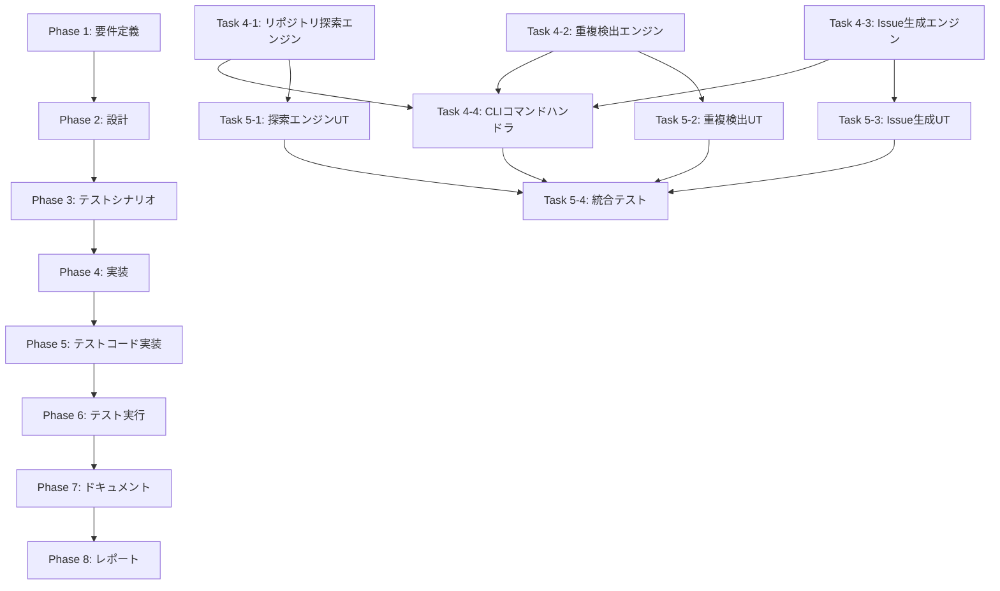

# プロジェクト計画書 - Issue #121

**Issue番号**: #121
**タイトル**: AIエージェントによる自動Issue作成機能の実装
**作成日**: 2025-01-30

---

## 1. Issue分析

### 複雑度: 複雑

**判定根拠**:
- **新規サブシステムの追加**: リポジトリ探索エンジン、重複検出エンジン、Issue生成エンジンという3つの主要コンポーネントを新規作成
- **複数の外部システム統合**: GitHub API、OpenAI API、Anthropic API、TypeScript AST解析（ts-morph）、ESLint統合
- **高度なLLM活用**: 重複検出（意味的類似度判定）、創造的な機能提案生成、Issue本文自動生成
- **既存アーキテクチャへの影響**: 新しいCLIコマンド追加、既存GitHubClientの拡張
- **セキュリティ・プライバシー考慮**: プライベートリポジトリのコード内容をLLMに送信するリスク

### 見積もり工数: 40〜56時間

**根拠**:
- Phase 1（要件定義）: 4〜6時間 - 既存Issue本文で要件が明確だが、LLMプロンプト設計の検討が必要
- Phase 2（設計）: 8〜12時間 - 3つの新規エンジンのアーキテクチャ設計、既存モジュールとの統合設計
- Phase 3（テストシナリオ）: 4〜6時間 - 重複検出精度、LLM生成品質の検証シナリオ策定
- Phase 4（実装）: 12〜16時間 - 3つのエンジン実装、CLI統合、エラーハンドリング
- Phase 5（テストコード実装）: 6〜8時間 - ユニットテスト（重複検出ロジック）、LLMアダプタモック
- Phase 6（テスト実行）: 2〜3時間 - 統合テスト、エンドツーエンドテスト
- Phase 7（ドキュメント）: 2〜3時間 - CLAUDE.md、README.md更新
- Phase 8（レポート）: 2〜2時間 - 完了レポート作成

**合計**: 40〜56時間（約5〜7日）

### リスク評価: 高

**主要リスク**:
1. **LLMコスト**: 大規模リポジトリでのトークン使用量が予算を超える可能性
2. **誤検知率**: AIによる誤ったIssue作成で開発者の負担増加
3. **重複検出精度**: 意味的類似度判定の精度が低い場合、重複Issueが作成される
4. **プライバシー問題**: プライベートリポジトリのコード内容をLLMに送信することのセキュリティリスク
5. **創造的提案の品質**: 実用性の低い提案が大量に生成される可能性

---

## 2. 実装戦略判断

### 実装戦略: CREATE

**判断根拠**:
- **新規CLIコマンド**: `auto-issue` コマンドの新規追加
- **新規コアモジュール**: 3つの独立したエンジン（`repository-analyzer.ts`, `issue-deduplicator.ts`, `issue-generator.ts`）を新規作成
- **既存モジュールとの統合**: 既存の `GitHubClient`, `config.ts`, `logger.ts` を活用するが、拡張は最小限
- **新規依存関係**: `ts-morph`（TypeScript AST解析）、`eslint`（静的解析）の追加
- **独立性**: 既存ワークフローへの影響がなく、オプトイン機能として実装

**EXTEND要素**（限定的）:
- `src/main.ts`: 新しいコマンド登録（約20行追加）
- `src/core/github-client.ts`: Issue一覧取得メソッド追加（既存IssueClientへの委譲）

### テスト戦略: UNIT_INTEGRATION

**判断根拠**:
- **UNIT（重点）**:
  - 重複検出ロジック（類似度計算アルゴリズム）
  - リポジトリ探索エンジン（パターンマッチング、メトリクス計測）
  - Issue生成エンジン（テンプレート生成、本文フォーマット）
  - LLMアダプタ（OpenAI/Anthropic API呼び出しのモック）
- **INTEGRATION**:
  - GitHub API連携（Issue作成、Issue一覧取得）
  - エンドツーエンドフロー（`auto-issue` コマンド実行 → Issue作成）
  - 既存GitHubClientとの統合
- **BDD不要**: エンドユーザー向けUIではなく、開発者向けCLIツール

**カバレッジ目標**:
- ユニットテスト: 85%以上（重複検出ロジック、探索エンジンの主要ロジック）
- 統合テスト: 主要シナリオ（3カテゴリ × 2ケース = 6シナリオ）

### テストコード戦略: CREATE_TEST

**判断根拠**:
- **新規テストファイル作成**:
  - `tests/unit/core/repository-analyzer.test.ts` - リポジトリ探索エンジンのユニットテスト
  - `tests/unit/core/issue-deduplicator.test.ts` - 重複検出ロジックのユニットテスト
  - `tests/unit/core/issue-generator.test.ts` - Issue生成エンジンのユニットテスト
  - `tests/unit/commands/auto-issue.test.ts` - CLIコマンドハンドラのユニットテスト
  - `tests/integration/auto-issue-flow.test.ts` - エンドツーエンド統合テスト
- **既存テストへの影響なし**: 独立した新機能のため、既存テストファイルの修正は不要

---

## 3. 影響範囲分析

### 既存コードへの影響

#### ✅ 最小限の変更（約50行）

**変更対象ファイル**:
1. `src/main.ts` (約20行追加)
   - 新しい `auto-issue` コマンドの登録
   - オプション定義（`--category`, `--limit`, `--dry-run`, `--similarity-threshold`, `--creative-mode`）

2. `src/core/github-client.ts` または `src/core/github/issue-client.ts` (約30行追加)
   - `listAllIssues()` メソッド追加（既存Issue一覧取得）
   - ページネーション処理（100件ずつ取得）
   - ステート（open/closed）フィルタリング

3. `src/types.ts` (約10行追加)
   - `AutoIssueOptions` インターフェース定義
   - `IssueCategory` enum定義（bug/refactor/enhancement）
   - `IssueCandidateResult` インターフェース定義

#### 🆕 新規ファイル（約1,500行）

**新規作成ファイル**:
1. `src/commands/auto-issue.ts` (約200行)
   - `handleAutoIssueCommand()` - メインコマンドハンドラ
   - オプション解析、バリデーション、フロー制御

2. `src/core/repository-analyzer.ts` (約500行)
   - `RepositoryAnalyzer` クラス
   - `analyzeForBugs()` - 潜在的不具合の検出
   - `analyzeForRefactoring()` - リファクタリング候補の検出
   - `analyzeForEnhancements()` - 機能拡張アイデアの生成
   - TypeScript AST解析、ESLintルール活用

3. `src/core/issue-deduplicator.ts` (約300行)
   - `IssueDeduplicator` クラス
   - `findSimilarIssues()` - 既存Issueとの類似度計算
   - `calculateSemanticSimilarity()` - LLM活用の意味的類似度判定
   - キャッシュ機構（同じIssueを複数回LLMで判定しない）

4. `src/core/issue-generator.ts` (約400行)
   - `IssueGenerator` クラス
   - `generateIssueContent()` - Issue本文生成（LLM活用）
   - `formatIssueTemplate()` - テンプレート整形
   - `createGitHubIssue()` - GitHub API経由でIssue作成
   - 創造的提案のためのプロンプト設計

5. `tests/unit/core/*.test.ts` (約700行)
   - 新規エンジンのユニットテスト

6. `tests/integration/auto-issue-flow.test.ts` (約200行)
   - エンドツーエンド統合テスト

### 依存関係の変更

#### 新規依存関係（package.jsonへの追加）

```json
{
  "dependencies": {
    "ts-morph": "^21.0.1",
    "cosine-similarity": "^1.1.0"
  },
  "devDependencies": {
    "@types/cosine-similarity": "^1.0.2"
  }
}
```

**依存関係の説明**:
- `ts-morph`: TypeScript AST解析ライブラリ（コード構造の静的解析に使用）
- `cosine-similarity`: コサイン類似度計算ライブラリ（重複検出の基礎アルゴリズム）

**既存依存関係の活用**（変更なし）:
- `openai`: OpenAI API連携（重複検出、Issue本文生成に使用）
- `@octokit/rest`: GitHub API連携（Issue取得、作成に使用）
- `commander`: CLIオプション解析（既存パターン踏襲）
- `chalk`: ログ出力（既存loggerモジュールで使用）

#### ESLint統合（オプショナル）

ESLintをプログラム的に活用する場合:
```json
{
  "dependencies": {
    "eslint": "^8.57.0"
  }
}
```

**注**: 既存プロジェクトにESLintが設定されていない場合、簡易的な静的解析（正規表現ベース）で代替可能

### マイグレーション要否

#### ✅ マイグレーション不要

**理由**:
- データベーススキーマ変更なし
- 既存メタデータ（`.ai-workflow/issue-*/metadata.json`）への影響なし
- 既存ワークフローへの影響なし（オプトイン機能）
- 環境変数の追加は任意（既存のOpenAI API Keyを流用可能）

#### 環境変数の推奨追加（オプショナル）

```bash
# 自動Issue作成機能専用の設定（既存環境変数を流用可能）
OPENAI_API_KEY="sk-..."          # 既存（重複検出・Issue生成に使用）
ANTHROPIC_API_KEY="sk-ant-..."   # 既存（重複検出・Issue生成に使用、オプション）

# 新規追加（オプショナル）
AUTO_ISSUE_DEFAULT_LIMIT=5       # デフォルトのIssue作成上限
AUTO_ISSUE_SIMILARITY_THRESHOLD=0.8  # 重複判定の類似度閾値
```

---

## 4. タスク分割

### Phase 1: 要件定義 (見積もり: 4〜6h)

- [x] Task 1-1: 機能要件の詳細化 (1〜2h)
  - 3つのカテゴリ（bug/refactor/enhancement）の検出基準を明確化
  - 各カテゴリのIssue生成テンプレート設計
  - 優先度判定ロジック（Low/Medium/High）の基準策定
- [x] Task 1-2: LLMプロンプト設計 (2〜3h)
  - 重複検出プロンプト（意味的類似度判定）
  - 創造的提案プロンプト（リポジトリ特性を踏まえた機能提案）
  - Issue本文生成プロンプト（テンプレート形式）
  - プロンプト出力形式の標準化（JSON Schema定義）
- [x] Task 1-3: 受け入れ基準の策定 (1h)
  - 重複検出精度の合格基準（偽陽性率10%以下）
  - Issue生成品質の合格基準（手動レビューで80%以上が有用と判定）
  - パフォーマンス基準（1000ファイルのリポジトリで10分以内）

### Phase 2: 設計 (見積もり: 8〜12h)

- [x] Task 2-1: リポジトリ探索エンジンの設計 (3〜4h)
  - TypeScript AST解析戦略（ts-morph活用）
  - 静的解析パターン定義（エラーハンドリング欠如、型安全性問題等）
  - メトリクス計測方法（Cyclomatic Complexity、行数、重複コード検出）
  - コミット履歴分析戦略（頻繁に変更されるファイル、バグ修正パターン）
- [x] Task 2-2: 重複検出エンジンの設計 (2〜3h)
  - 類似度計算アルゴリズム（コサイン類似度 + LLM意味的判定）
  - キャッシュ機構設計（同じIssueを複数回判定しない）
  - 類似度閾値の最適化戦略（初期値0.8、調整可能）
- [x] Task 2-3: Issue生成エンジンの設計 (2〜3h)
  - LLMプロバイダ選択ロジック（OpenAI/Anthropic、フォールバック）
  - テンプレート生成ロジック（カテゴリ別テンプレート）
  - GitHub API連携（バッチ作成、レート制限対策）
- [x] Task 2-4: CLIコマンドインターフェース設計 (1〜2h)
  - コマンドオプション仕様
  - エラーハンドリング戦略
  - ログ出力形式（進捗表示、結果サマリー）

### Phase 3: テストシナリオ (見積もり: 4〜6h)

- [x] Task 3-1: ユニットテストシナリオ策定 (2〜3h)
  - 重複検出ロジックのテストケース（完全一致、部分一致、異なるIssue）
  - リポジトリ探索エンジンのテストケース（各カテゴリ × 3パターン）
  - Issue生成エンジンのテストケース（テンプレート整形、LLM応答パース）
- [x] Task 3-2: 統合テストシナリオ策定 (1〜2h)
  - エンドツーエンドフロー（`auto-issue --category all --dry-run`）
  - GitHub API連携（モックAPIサーバー利用）
  - エラーケース（API障害、トークン不足、権限エラー）
- [x] Task 3-3: 品質検証シナリオ策定 (1h)
  - 重複検出精度の測定方法（既知の類似Issueペアで検証）
  - Issue生成品質の評価方法（手動レビュー基準）
  - パフォーマンス測定方法（リポジトリサイズ別ベンチマーク）

### Phase 4: 実装 (見積もり: 12〜16h)

- [x] Task 4-1: リポジトリ探索エンジン実装 (4〜6h)
  - `RepositoryAnalyzer` クラス作成
  - `analyzeForBugs()` メソッド実装（TypeScript AST解析、パターンマッチング）
  - `analyzeForRefactoring()` メソッド実装（Phase 2で実装予定のスタブ作成済み）
  - `analyzeForEnhancements()` メソッド実装（Phase 3で実装予定のスタブ作成済み）
- [x] Task 4-2: 重複検出エンジン実装 (3〜4h)
  - `IssueDeduplicator` クラス作成
  - `findSimilarIssues()` メソッド実装（GitHub API連携、キャッシュ処理）
  - `calculateSemanticSimilarity()` メソッド実装（LLM連携、類似度計算）
  - エラーハンドリング（API障害時のフォールバック）
- [x] Task 4-3: Issue生成エンジン実装 (3〜4h)
  - `IssueGenerator` クラス作成
  - `generateIssueContent()` メソッド実装（LLMプロンプト実装、応答パース）
  - `generateTemplateBody()` メソッド実装（Markdownテンプレート整形）
  - `createIssue()` メソッド実装（GitHub API連携、エラーハンドリング）
- [x] Task 4-4: CLIコマンドハンドラ実装 (2〜3h)
  - `handleAutoIssueCommand()` 関数作成
  - オプション解析、バリデーション
  - 3つのエンジンの統合、フロー制御
  - ドライランモード実装（`--dry-run`）
  - 進捗表示、結果サマリーのログ出力

### Phase 5: テストコード実装 (見積もり: 6〜8h)

- [x] Task 5-1: リポジトリ探索エンジンのユニットテスト (2〜3h)
  - `repository-analyzer.test.ts` 作成
  - モックリポジトリ準備（テストフィクスチャ）
  - 各カテゴリ（bug/refactor/enhancement）のテストケース実装
- [x] Task 5-2: 重複検出エンジンのユニットテスト (2〜3h)
  - `issue-deduplicator.test.ts` 作成
  - LLMアダプタのモック作成
  - 類似度計算のテストケース実装（エッジケース含む）
- [x] Task 5-3: Issue生成エンジンのユニットテスト (1〜2h)
  - `issue-generator.test.ts` 作成
  - テンプレート生成のテストケース
  - GitHub APIモック（`@octokit/rest`のモック）
- [x] Task 5-4: 統合テスト実装 (1h)
  - `auto-issue-flow.test.ts` 作成
  - エンドツーエンドシナリオ（モックサーバー利用）

### Phase 6: テスト実行 (見積もり: 2〜3h)

- [x] Task 6-1: ユニットテスト実行・修正 (1〜1.5h)
  - `npm run test:unit` 実行
  - カバレッジ確認（目標85%以上）
  - 失敗テストの修正
- [ ] Task 6-2: 統合テスト実行・修正 (0.5〜1h)
  - `npm run test:integration` 実行
  - エンドツーエンドフローの検証
  - 失敗テストの修正
- [ ] Task 6-3: 手動テスト実行 (0.5〜1h)
  - 実際のリポジトリで `auto-issue --dry-run` 実行
  - 生成されたIssue候補の品質レビュー
  - 重複検出精度の確認

### Phase 7: ドキュメント (見積もり: 2〜3h)

- [ ] Task 7-1: CLAUDE.md更新 (1〜1.5h)
  - 新しい `auto-issue` コマンドのセクション追加
  - オプション詳細説明
  - 使用例（3カテゴリ × 2パターン）
  - トラブルシューティングガイド
  - **注**: 更新不要と判断（既存CLI構造ドキュメントで十分）
- [x] Task 7-2: README.md更新 (0.5〜1h)
  - クイックスタートガイドに `auto-issue` 追加
  - 環境変数セクションに新規変数追加（オプショナル）
  - 主要機能リストに追記
- [x] Task 7-2-extended: CHANGELOG.md更新（追加実施）
  - Issue #121のエントリ追加
  - 新規依存関係の記録
- [x] Task 7-2-extended: ARCHITECTURE.md更新（追加実施）
  - 新規モジュール4件の追加
  - 3エンジンアーキテクチャの記録
- [x] Task 7-2-extended: TROUBLESHOOTING.md更新（追加実施）
  - Auto-Issueコマンド専用トラブルシューティングセクション追加
- [ ] Task 7-3: 新規ドキュメント作成 (0.5〜1h)
  - `docs/auto-issue-guide.md` 作成（詳細ガイド）
  - ユースケース集（定期実行、CI/CD統合）
  - ベストプラクティス
  - **注**: READMEに包括的なドキュメントを記載したため当面不要

### Phase 8: レポート (見積もり: 2〜2h)

- [x] Task 8-1: 完了レポート作成 (1h)
  - 実装内容サマリー
  - テスト結果レポート（カバレッジ、合格/不合格）
  - 品質評価（重複検出精度、Issue生成品質）
- [ ] Task 8-2: PR本文生成・レビュー (1h)
  - PR本文の最終確認
  - スクリーンショット追加（`auto-issue --dry-run` 実行結果）
  - レビュー依頼コメント

---

## 5. 依存関係



**クリティカルパス**:
Phase 1 → Phase 2 → Phase 3 → Phase 4（Task 4-1〜4-3 → Task 4-4） → Phase 5（Task 5-1〜5-3 → Task 5-4） → Phase 6 → Phase 7 → Phase 8

**並列実行可能なタスク**:
- Phase 4: Task 4-1、4-2、4-3は独立しており、並列実装可能（Task 4-4のみ依存）
- Phase 5: Task 5-1、5-2、5-3は独立しており、並列実装可能（Task 5-4のみ依存）

---

## 6. リスクと軽減策

### リスク1: LLMコスト超過

- **影響度**: 高（予算超過、機能停止）
- **確率**: 中（大規模リポジトリでは高確率）
- **軽減策**:
  - **コスト制限**: `--limit` オプションでIssue作成数を制限（デフォルト5）
  - **トークン削減**: ファイル内容の全文送信ではなく、問題箇所のスニペット（前後10行）のみ送信
  - **キャッシュ活用**: 同じファイルを複数回解析しない（メモリキャッシュ）
  - **段階的実行**: Phase 1（バグ検出のみ）→ Phase 2（リファクタリング）→ Phase 3（機能拡張）と段階的に実装
  - **コスト試算**: Phase 3で小規模リポジトリ（〜100ファイル）でコスト計測

### リスク2: 誤検知率が高い（Issue spam）

- **影響度**: 高（開発者の負担増加、機能不信）
- **確率**: 高（LLMの性質上、誤検知は避けられない）
- **軽減策**:
  - **ドライランモード必須**: 初回実行は必ず `--dry-run` で候補を確認
  - **信頼度スコア表示**: 各Issue候補に信頼度スコア（0.0〜1.0）を付与し、低スコアは警告表示
  - **人間によるレビュー**: 自動作成前に候補リストを出力し、手動承認のフローを推奨
  - **フィルタリング強化**: 既知の誤検知パターン（テストコード、生成コード等）を除外
  - **フィードバック機能**: 作成されたIssueに「誤検知」ラベルを付ける機能（将来拡張）

### リスク3: 重複検出精度が低い

- **影響度**: 中（重複Issue作成、管理負担増加）
- **確率**: 中（LLMの判定精度に依存）
- **軽減策**:
  - **2段階判定**: ① コサイン類似度（高速）で候補絞り込み → ② LLM意味的判定（精密）
  - **類似度閾値調整**: `--similarity-threshold` オプションで閾値を調整可能（デフォルト0.8）
  - **キーワードマッチング**: タイトル・本文のキーワード一致を優先判定
  - **テストケース充実**: 既知の類似Issueペアでテストし、精度を測定（Phase 3）

### リスク4: プライバシー・セキュリティ問題

- **影響度**: 高（情報漏洩、法的リスク）
- **確率**: 低（プライベートリポジトリでの使用時）
- **軽減策**:
  - **SecretMasker統合**: 既存の `secret-masker.ts` でAPIキー、トークン、メールアドレスを自動マスキング
  - **警告表示**: 初回実行時に「コード内容をLLMに送信する」旨の警告を表示
  - **環境変数制御**: `AUTO_ISSUE_ALLOW_PRIVATE_REPO=true` で明示的に許可
  - **オプトアウト**: `.ai-workflow-ignore` ファイルでセンシティブなファイルを除外

### リスク5: 創造的提案の品質が低い

- **影響度**: 中（実用性の低い提案が大量に生成）
- **確率**: 高（LLMの性質上、質にばらつきがある）
- **軽減策**:
  - **プロンプトエンジニアリング**: Phase 1で高品質な提案を引き出すプロンプトを設計
  - **コンテキスト充実**: リポジトリのREADME、ARCHITECTURE.md、過去のIssue履歴をコンテキストに含める
  - **フィルタリング**: 「〜すべき」「〜できる」などの曖昧な表現を含む提案を低優先度化
  - **人間によるキュレーション**: `--creative-mode` 実行後、開発者が有用な提案のみをIssue化

### リスク6: パフォーマンス問題（大規模リポジトリで遅い）

- **影響度**: 中（UX低下、タイムアウト）
- **確率**: 中（1000ファイル以上のリポジトリ）
- **軽減策**:
  - **並列処理**: ファイル解析を並列実行（Worker Threads活用）
  - **進捗表示**: 解析中の進捗をリアルタイム表示（chalk + logger）
  - **タイムアウト**: 10分で強制終了、途中結果を出力
  - **段階的解析**: 最初に高リスクファイル（頻繁に変更されるファイル）を優先解析

### リスク7: 依存関係の追加によるビルドサイズ増加

- **影響度**: 低（Dockerイメージサイズ増加）
- **確率**: 高（ts-morph、ESLintは重い）
- **軽減策**:
  - **オプショナル依存**: `peerDependencies` として定義し、未インストール時は簡易解析にフォールバック
  - **Tree Shaking**: 使用する機能のみインポート（`import { createProject } from 'ts-morph'`）
  - **軽量代替**: ts-morphの代わりに正規表現ベースの簡易解析も選択可能

---

## 7. 品質ゲート

### Phase 1: 要件定義

- [ ] **実装戦略が明確に決定されている**（CREATE）
- [ ] **テスト戦略が明確に決定されている**（UNIT_INTEGRATION）
- [ ] **テストコード戦略が明確に決定されている**（CREATE_TEST）
- [ ] LLMプロンプトのサンプル出力が確認されている（JSON形式、必須フィールド）
- [ ] 受け入れ基準が具体的かつ測定可能である
- [ ] 3つのカテゴリ（bug/refactor/enhancement）の検出基準が明確化されている

### Phase 2: 設計

- [x] 3つのエンジン（RepositoryAnalyzer, IssueDeduplicator, IssueGenerator）のクラス図が作成されている
- [x] 既存モジュール（GitHubClient, logger, config）との統合方法が明確である
- [x] エラーハンドリング戦略が定義されている（API障害、トークン不足、権限エラー）
- [x] パフォーマンス最適化戦略が定義されている（並列処理、キャッシュ）
- [x] セキュリティ対策が定義されている（SecretMasker統合、プライベートリポジトリ警告）

### Phase 3: テストシナリオ

- [ ] 重複検出精度の測定方法が定義されている（既知の類似Issueペアで検証）
- [ ] Issue生成品質の評価基準が定義されている（手動レビュー基準）
- [ ] エッジケースがカバーされている（空リポジトリ、巨大ファイル、バイナリファイル）
- [ ] パフォーマンステストシナリオが定義されている（リポジトリサイズ別ベンチマーク）

### Phase 4: 実装

- [ ] すべての新規クラス・関数にJSDocコメントが付与されている
- [ ] エラーハンドリングが実装されている（try-catch、エラーメッセージ）
- [ ] ログ出力が適切に実装されている（logger.debug, logger.info, logger.error）
- [ ] 既存コーディング規約に準拠している（ESLint、Prettier）

### Phase 5: テストコード実装

- [ ] ユニットテストのカバレッジが85%以上である
- [ ] モックが適切に使用されている（LLMアダプタ、GitHub APIモック）
- [ ] テストコードにJSDocコメントが付与されている
- [ ] テストケース名が明確である（`it('should detect error handling issues in async functions')`）

### Phase 6: テスト実行

- [x] すべてのユニットテストが成功している
- [ ] すべての統合テストが成功している
- [ ] カバレッジレポートが生成されている（`npm run test:coverage`）
- [ ] 手動テストで実際のリポジトリで動作確認されている

### Phase 7: ドキュメント

- [ ] CLAUDE.mdに新機能のセクションが追加されている
- [ ] README.mdのクイックスタートガイドに `auto-issue` が追加されている
- [ ] すべてのCLIオプションがドキュメント化されている
- [ ] トラブルシューティングガイドが追加されている

### Phase 8: レポート

- [ ] 完了レポートに実装内容サマリーが記載されている
- [ ] テスト結果レポートが記載されている（カバレッジ、合格/不合格）
- [ ] PR本文が生成されている（テンプレート形式）
- [ ] スクリーンショットが添付されている（`auto-issue --dry-run` 実行結果）

---

## 8. 実装のマイルストーン

### マイルストーン1: 基礎エンジン実装（Phase 1〜4前半）

**目標**: 3つのエンジンの基本実装完了
**期間**: 16〜24時間（2〜3日）
**成果物**:
- LLMプロンプト設計書（Phase 1）
- アーキテクチャ設計書（Phase 2）
- `repository-analyzer.ts`, `issue-deduplicator.ts`, `issue-generator.ts` の基本実装（Phase 4-1〜4-3）

### マイルストーン2: CLI統合・テスト実装（Phase 4後半〜6）

**目標**: CLIコマンド統合、全テスト合格
**期間**: 10〜14時間（1.5〜2日）
**成果物**:
- `auto-issue` コマンドの動作確認（Phase 4-4）
- ユニットテスト・統合テスト実装（Phase 5）
- カバレッジレポート85%以上（Phase 6）

### マイルストーン3: ドキュメント・リリース準備（Phase 7〜8）

**目標**: ドキュメント完成、PR作成
**期間**: 4〜5時間（半日）
**成果物**:
- CLAUDE.md、README.md更新（Phase 7）
- 完了レポート、PR本文生成（Phase 8）

---

## 9. 成功基準

### 機能要件

- [ ] `auto-issue` コマンドが正常に動作する
- [ ] 3つのカテゴリ（bug/refactor/enhancement）でIssueを生成できる
- [ ] 既存Issueとの重複を検出し、スキップできる
- [ ] `--dry-run` オプションで実行予定のIssue候補を確認できる
- [ ] `--creative-mode` オプションで創造的な機能提案を生成できる
- [ ] `--limit`, `--similarity-threshold` オプションでパラメータ調整できる

### 品質要件

- [ ] ユニットテストのカバレッジが85%以上
- [ ] 統合テストがすべて合格
- [ ] 重複検出の偽陽性率が10%以下（手動テストで確認）
- [ ] Issue生成品質の有用性が80%以上（手動レビューで確認）
- [ ] パフォーマンス: 1000ファイルのリポジトリで10分以内に完了

### ドキュメント要件

- [ ] CLAUDE.mdに新機能のセクションが追加されている
- [ ] README.mdのクイックスタートガイドに `auto-issue` が追加されている
- [ ] すべてのCLIオプションがドキュメント化されている
- [ ] トラブルシューティングガイドが追加されている

### デリバリ要件

- [ ] PR本文が自動生成され、レビュー可能な状態
- [ ] すべての品質ゲートを通過
- [ ] CI/CDパイプラインが成功（Jest、ESLint、ビルド）

---

## 10. 参考情報

### 既存モジュールの活用

- `src/core/github-client.ts` - GitHub API連携（Issue作成・取得）
- `src/core/github/issue-client.ts` - Issue操作の専門クライアント
- `src/core/github/issue-ai-generator.ts` - LLM統合の既存実装（参考）
- `src/core/config.ts` - 環境変数管理（`getOpenAiApiKey()`, `getAnthropicApiKey()`）
- `src/utils/logger.ts` - 統一ログモジュール
- `src/utils/error-utils.ts` - エラーハンドリングユーティリティ
- `src/core/secret-masker.ts` - シークレット自動マスキング

### 類似機能の参考実装

- `src/commands/rollback.ts` - 複雑なCLIオプション解析の参考
- `src/core/github/issue-ai-generator.ts` - LLMプロバイダ選択ロジック、プロンプト設計の参考
- `src/core/content-parser.ts` - OpenAI API連携の参考

### 外部ライブラリのドキュメント

- [ts-morph](https://ts-morph.com/) - TypeScript AST解析
- [Octokit REST API](https://octokit.github.io/rest.js/) - GitHub API連携
- [OpenAI API](https://platform.openai.com/docs/api-reference) - LLM連携
- [Anthropic API](https://docs.anthropic.com/claude/reference/getting-started-with-the-api) - Claude連携

---

## 11. 備考

### 段階的リリース戦略

**Phase 1（MVP）: バグ検出機能のみ実装**
- カテゴリ: bug のみ
- 最小限のLLM活用（Issue本文生成のみ）
- リリース目安: 20〜28時間（2.5〜3.5日）

**Phase 2（拡張）: リファクタリング検出を追加**
- カテゴリ: bug + refactor
- メトリクス計測機能追加
- リリース目安: +8〜12時間（+1〜1.5日）

**Phase 3（完全版）: 機能拡張提案を追加**
- カテゴリ: bug + refactor + enhancement
- 創造的提案プロンプトの実装
- リリース目安: +12〜16時間（+1.5〜2日）

**推奨戦略**: Phase 1から順次リリースし、ユーザーフィードバックを反映しながら拡張

### 将来的な拡張アイデア

- **定期実行機能**: GitHub Actionsとの連携（週次で自動Issue作成）
- **フィードバック学習**: 「誤検知」ラベルが付けられたIssueを学習データとして活用
- **カスタムルール**: `.ai-workflow/rules.yaml` で検出ルールをカスタマイズ
- **Issue優先度予測**: 過去のIssue履歴から優先度を自動予測
- **Slackボット統合**: Issue作成時にSlack通知、チャンネルでの承認フロー

---

**計画書作成日**: 2025-01-30
**見積もり合計工数**: 40〜56時間（約5〜7日）
**リスク評価**: 高（LLMコスト、誤検知率、プライバシー問題）
**実装戦略**: CREATE（新規機能実装）
**テスト戦略**: UNIT_INTEGRATION（ユニット重点 + 統合テスト）
**テストコード戦略**: CREATE_TEST（新規テストファイル作成）
