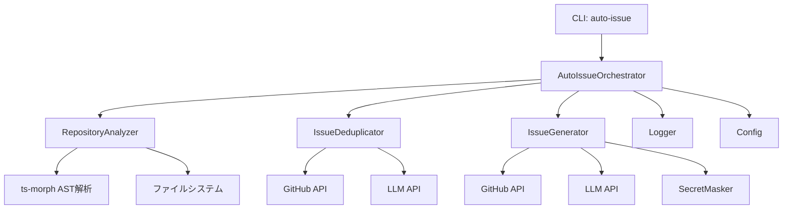

# 詳細設計書 - Issue #121

**Issue番号**: #121
**タイトル**: AIエージェントによる自動Issue作成機能の実装
**作成日**: 2025-01-30
**バージョン**: 1.0

---

## 0. Planning Documentの確認

Planning Phase（Phase 0）で策定された開発計画を確認し、以下の戦略に基づいて詳細設計を実施します：

### 開発計画の概要
- **複雑度**: 複雑（新規サブシステム追加、複数の外部システム統合、高度なLLM活用）
- **見積もり工数**: 40〜56時間（約5〜7日）
- **リスク評価**: 高（LLMコスト、誤検知率、プライバシー問題）

### 段階的リリース戦略（推奨）
- **Phase 1（MVP）**: バグ検出機能のみ実装（20〜28時間）
- **Phase 2（拡張）**: リファクタリング検出を追加（+8〜12時間）
- **Phase 3（完全版）**: 機能拡張提案を追加（+12〜16時間）

**本設計書では、Phase 1（MVP）の実装を優先的に設計し、Phase 2・Phase 3への拡張性を考慮した設計とします。**

---

## 1. アーキテクチャ設計

### 1.1 システム全体図

```
┌─────────────────────────────────────────────────────────────────────┐
│                         CLI Layer (src/main.ts)                      │
│                                                                       │
│  ┌───────────────────────────────────────────────────────────────┐  │
│  │         新規コマンド: auto-issue [OPTIONS]                     │  │
│  │  - handleAutoIssueCommand() (src/commands/auto-issue.ts)      │  │
│  └───────────────────────────────────────────────────────────────┘  │
└─────────────────────────────────────────────────────────────────────┘
                                    │
                                    ▼
┌─────────────────────────────────────────────────────────────────────┐
│                      Auto Issue Orchestrator                         │
│                   (src/commands/auto-issue.ts)                       │
│                                                                       │
│  • オプション解析・バリデーション                                    │
│  • 3つのエンジンのオーケストレーション                                │
│  • ドライランモード制御                                              │
│  • エラーハンドリング・ログ出力                                       │
└─────────────────────────────────────────────────────────────────────┘
          │                      │                       │
          ▼                      ▼                       ▼
┌──────────────────┐  ┌──────────────────┐  ┌──────────────────────┐
│  Repository      │  │  Issue           │  │  Issue               │
│  Analyzer        │  │  Deduplicator    │  │  Generator           │
│  (探索エンジン)   │  │  (重複検出)       │  │  (自動生成)           │
└──────────────────┘  └──────────────────┘  └──────────────────────┘
│                      │                       │
│                      │                       │
▼                      ▼                       ▼
┌──────────────────┐  ┌──────────────────┐  ┌──────────────────────┐
│ ts-morph (AST)   │  │ GitHub API       │  │ GitHub API           │
│ (新規依存関係)    │  │ (既存)           │  │ (既存)               │
└──────────────────┘  └──────────────────┘  │                       │
│                      │                      │ LLM API (既存)       │
│                      ▼                      │ - OpenAI             │
│                 ┌──────────────────┐       │ - Anthropic          │
│                 │ LLM API          │       └──────────────────────┘
│                 │ - OpenAI (既存)  │
│                 │ - Anthropic      │
│                 │   (既存)         │
│                 └──────────────────┘
│
▼
┌─────────────────────────────────────────────────────────────────────┐
│                    Existing Core Modules                             │
│                                                                       │
│  • GitHubClient (src/core/github-client.ts) - Issue作成・取得       │
│  • Config (src/core/config.ts) - 環境変数管理                        │
│  • Logger (src/utils/logger.ts) - ロギング                          │
│  • SecretMasker (src/core/secret-masker.ts) - シークレット保護       │
└─────────────────────────────────────────────────────────────────────┘
```

### 1.2 コンポーネント間の関係

#### Phase 1 (MVP) - バグ検出機能のみ



### 1.3 データフロー

#### Phase 1 (MVP) - バグ検出フロー

```
1. CLIコマンド実行
   └─> auto-issue --category bug --limit 5 --dry-run

2. AutoIssueOrchestrator
   ├─> オプション解析
   ├─> リポジトリ探索開始
   │   └─> RepositoryAnalyzer.analyzeForBugs()
   │       ├─> TypeScript AST解析 (ts-morph)
   │       ├─> パターンマッチング
   │       └─> IssueCandidateResult[] 返却
   │
   ├─> 重複検出
   │   └─> IssueDeduplicator.findSimilarIssues()
   │       ├─> GitHub API (既存Issue取得)
   │       ├─> コサイン類似度計算 (第1段階)
   │       ├─> LLM意味的判定 (第2段階)
   │       └─> 重複判定結果返却
   │
   ├─> Issue生成
   │   └─> IssueGenerator.generateIssues()
   │       ├─> LLM Issue本文生成
   │       ├─> テンプレート整形
   │       ├─> ドライランチェック
   │       └─> GitHub API Issue作成 (または候補表示)
   │
   └─> サマリー表示
       ├─> 候補数: 8件
       ├─> 重複スキップ: 2件
       ├─> 作成予定/作成済み: 6件
       └─> 推定トークン使用量・コスト
```

---

## 2. 実装戦略判断

### 実装戦略: CREATE（新規作成）

**判断根拠**:
1. **新規CLIコマンド**: `auto-issue` コマンドは既存のワークフローコマンド（`init`, `execute`, `review`, `rollback`）とは独立した新機能である
2. **新規コアモジュール**: 3つの独立したエンジン（`repository-analyzer.ts`, `issue-deduplicator.ts`, `issue-generator.ts`）を新規作成する
3. **既存モジュールとの統合**: 既存の `GitHubClient`, `config.ts`, `logger.ts` を活用するが、これらへの拡張は最小限（Issue一覧取得メソッドの追加のみ）
4. **新規依存関係**: `ts-morph`（TypeScript AST解析）、`cosine-similarity`（類似度計算）の追加が必要
5. **独立性**: 既存ワークフローへの影響がなく、オプトイン機能として実装可能

**EXTEND要素（限定的）**:
- `src/main.ts`: 新しいコマンド登録（約20行追加）
- `src/core/github-client.ts`: Issue一覧取得メソッド追加（GitHubClientへの委譲、約30行）
- `src/types.ts`: 新しい型定義追加（約30行）

---

## 3. テスト戦略判断

### テスト戦略: UNIT_INTEGRATION

**判断根拠**:
1. **UNIT（重点）**:
   - 重複検出ロジック（類似度計算アルゴリズム）は複雑であり、エッジケースの検証が必須
   - リポジトリ探索エンジン（パターンマッチング、メトリクス計測）の主要ロジックは独立してテスト可能
   - Issue生成エンジン（テンプレート生成、本文フォーマット）の正確性検証が必要
   - LLMアダプタ（OpenAI/Anthropic API呼び出し）はモックでテスト可能

2. **INTEGRATION**:
   - GitHub API連携（Issue作成、Issue一覧取得）は実際のAPIレスポンス形式の検証が必要
   - エンドツーエンドフロー（`auto-issue` コマンド実行 → Issue作成）の動作確認が必須
   - 既存GitHubClientとの統合テストにより、後方互換性を保証

3. **BDD不要**:
   - エンドユーザー向けUIではなく、開発者向けCLIツールであるため、BDDは過剰

**カバレッジ目標**:
- ユニットテスト: 85%以上（重複検出ロジック、探索エンジンの主要ロジック）
- 統合テスト: 主要シナリオ（3カテゴリ × 2ケース = 6シナリオ）

---

## 4. テストコード戦略判断

### テストコード戦略: CREATE_TEST（新規テスト作成）

**判断根拠**:
1. **新規テストファイル作成**:
   - `tests/unit/core/repository-analyzer.test.ts` - リポジトリ探索エンジンのユニットテスト
   - `tests/unit/core/issue-deduplicator.test.ts` - 重複検出ロジックのユニットテスト
   - `tests/unit/core/issue-generator.test.ts` - Issue生成エンジンのユニットテスト
   - `tests/unit/commands/auto-issue.test.ts` - CLIコマンドハンドラのユニットテスト
   - `tests/integration/auto-issue-flow.test.ts` - エンドツーエンド統合テスト

2. **既存テストへの影響なし**: 独立した新機能のため、既存テストファイルの修正は不要

3. **テストフィクスチャ**: モックリポジトリ（TypeScriptサンプルコード）をテストディレクトリに配置

---

## 5. 影響範囲分析

### 5.1 既存コードへの影響

#### ✅ 最小限の変更（約50行）

**変更対象ファイル**:

1. **`src/main.ts`** (約20行追加)
   - 新しい `auto-issue` コマンドの登録
   - オプション定義（`--category`, `--limit`, `--dry-run`, `--similarity-threshold`, `--creative-mode`）
   - `handleAutoIssueCommand()` の呼び出し

2. **`src/core/github-client.ts`** または **`src/core/github/issue-client.ts`** (約30行追加)
   - `listAllIssues()` メソッド追加（既存Issue一覧取得）
   - ページネーション処理（100件ずつ取得）
   - ステート（open/closed）フィルタリング
   - **既存のファサードパターンに準拠**: GitHubClient → IssueClient への委譲

3. **`src/types.ts`** (約30行追加)
   - `AutoIssueOptions` インターフェース定義
   - `IssueCategory` enum定義（bug/refactor/enhancement）
   - `IssueCandidateResult` インターフェース定義
   - `IssueSimilarityResult` インターフェース定義

### 5.2 依存関係の変更

#### 新規依存関係（package.jsonへの追加）

```json
{
  "dependencies": {
    "ts-morph": "^21.0.1",
    "cosine-similarity": "^1.1.0"
  },
  "devDependencies": {
    "@types/cosine-similarity": "^1.0.2"
  }
}
```

**依存関係の説明**:
- `ts-morph`: TypeScript AST解析ライブラリ（コード構造の静的解析に使用）
- `cosine-similarity`: コサイン類似度計算ライブラリ（重複検出の基礎アルゴリズム）

**既存依存関係の活用**（変更なし）:
- `openai`: OpenAI API連携（重複検出、Issue本文生成に使用）
- `@anthropic-ai/sdk`: Anthropic API連携（重複検出、Issue本文生成に使用）
- `@octokit/rest`: GitHub API連携（Issue取得、作成に使用）
- `commander`: CLIオプション解析（既存パターン踏襲）
- `chalk`: ログ出力（既存loggerモジュールで使用）

### 5.3 マイグレーション要否

#### ✅ マイグレーション不要

**理由**:
- データベーススキーマ変更なし
- 既存メタデータ（`.ai-workflow/issue-*/metadata.json`）への影響なし
- 既存ワークフローへの影響なし（オプトイン機能）
- 環境変数の追加は任意（既存のOpenAI API Keyを流用可能）

#### 環境変数の推奨追加（オプショナル）

```bash
# 自動Issue作成機能専用の設定（既存環境変数を流用可能）
OPENAI_API_KEY="sk-..."          # 既存（重複検出・Issue生成に使用）
ANTHROPIC_API_KEY="sk-ant-..."   # 既存（重複検出・Issue生成に使用、オプション）

# 新規追加（オプショナル）
AUTO_ISSUE_DEFAULT_LIMIT=5       # デフォルトのIssue作成上限
AUTO_ISSUE_SIMILARITY_THRESHOLD=0.8  # 重複判定の類似度閾値
```

---

## 6. 変更・追加ファイルリスト

### 6.1 新規作成ファイル

#### コマンドハンドラ
- **`src/commands/auto-issue.ts`** (約250行)
  - メインコマンドハンドラ
  - オプション解析・バリデーション
  - 3つのエンジンのオーケストレーション

#### コアエンジン
- **`src/core/repository-analyzer.ts`** (約500行)
  - リポジトリ探索エンジン
  - `analyzeForBugs()` メソッド（Phase 1 MVP）
  - `analyzeForRefactoring()` メソッド（Phase 2）
  - `analyzeForEnhancements()` メソッド（Phase 3）

- **`src/core/issue-deduplicator.ts`** (約300行)
  - 重複検出エンジン
  - `findSimilarIssues()` メソッド
  - `calculateSemanticSimilarity()` メソッド
  - キャッシュ機構

- **`src/core/issue-generator.ts`** (約400行)
  - Issue生成エンジン
  - `generateIssueContent()` メソッド
  - `formatIssueTemplate()` メソッド
  - `createGitHubIssue()` メソッド

#### ユニットテスト
- **`tests/unit/core/repository-analyzer.test.ts`** (約250行)
- **`tests/unit/core/issue-deduplicator.test.ts`** (約200行)
- **`tests/unit/core/issue-generator.test.ts`** (約150行)
- **`tests/unit/commands/auto-issue.test.ts`** (約200行)

#### 統合テスト
- **`tests/integration/auto-issue-flow.test.ts`** (約200行)

#### テストフィクスチャ
- **`tests/fixtures/sample-repository/`** (約500行)
  - モックTypeScriptファイル
  - バグ検出用サンプルコード

### 6.2 修正が必要な既存ファイル

- **`src/main.ts`** (約20行追加)
  - `auto-issue` コマンド登録

- **`src/core/github-client.ts`** (変更なし、委譲のみ)
  - 既存のファサードパターンに従い、IssueClientへ委譲

- **`src/core/github/issue-client.ts`** (約30行追加)
  - `listAllIssues()` メソッド追加

- **`src/types.ts`** (約30行追加)
  - 新しい型定義追加

- **`package.json`** (約5行追加)
  - 新規依存関係追加

### 6.3 削除が必要なファイル

なし

---

## 7. 詳細設計

### 7.1 型定義（`src/types.ts`への追加）

```typescript
// ========================================
// Auto Issue Types
// ========================================

/**
 * Issue候補の結果
 */
export interface IssueCandidateResult {
  /** カテゴリ（bug/refactor/enhancement） */
  category: IssueCategory;
  /** Issueタイトル */
  title: string;
  /** Issue説明 */
  description: string;
  /** 該当ファイルパス */
  file: string;
  /** 該当行番号 */
  lineNumber: number;
  /** コードスニペット（前後10行） */
  codeSnippet: string;
  /** 信頼度スコア（0.0〜1.0） */
  confidence: number;
  /** 提案される解決策（配列） */
  suggestedFixes: string[];
  /** 期待される効果 */
  expectedBenefits: string[];
  /** 優先度（Low/Medium/High） */
  priority: 'Low' | 'Medium' | 'High';
}

/**
 * Issue類似度判定結果
 */
export interface IssueSimilarityResult {
  /** 既存Issue番号 */
  issueNumber: number;
  /** 既存Issueタイトル */
  issueTitle: string;
  /** 類似度スコア（0.0〜1.0） */
  similarityScore: number;
  /** 重複判定（true=重複） */
  isDuplicate: boolean;
}

/**
 * Issueカテゴリ
 */
export enum IssueCategory {
  BUG = 'bug',
  REFACTOR = 'refactor',
  ENHANCEMENT = 'enhancement',
}

/**
 * auto-issueコマンドのオプション
 */
export interface AutoIssueOptions {
  /** 作成するIssueのカテゴリ */
  category: IssueCategory | 'all';
  /** 作成するIssueの最大数（デフォルト: 5） */
  limit: number;
  /** ドライランモード（true=実際には作成しない） */
  dryRun: boolean;
  /** 重複判定の類似度閾値（デフォルト: 0.8） */
  similarityThreshold: number;
  /** 創造的提案モード（enhancementカテゴリ専用、Phase 3） */
  creativeMode: boolean;
}
```

### 7.2 CLIコマンドハンドラ（`src/commands/auto-issue.ts`）

```typescript
import { logger } from '../utils/logger.js';
import { config } from '../core/config.js';
import { getErrorMessage } from '../utils/error-utils.js';
import { RepositoryAnalyzer } from '../core/repository-analyzer.js';
import { IssueDeduplicator } from '../core/issue-deduplicator.js';
import { IssueGenerator } from '../core/issue-generator.js';
import type { AutoIssueOptions, IssueCategory, IssueCandidateResult } from '../types.js';

/**
 * auto-issueコマンドハンドラ
 * @param options - CLIオプション
 */
export async function handleAutoIssueCommand(options: AutoIssueOptions): Promise<void> {
  try {
    // 1. オプション解析・バリデーション
    validateAutoIssueOptions(options);
    logger.info('Starting auto-issue process...');
    logger.info(`Category: ${options.category}`);
    logger.info(`Limit: ${options.limit}`);
    logger.info(`Dry-run: ${options.dryRun}`);
    logger.info(`Similarity threshold: ${options.similarityThreshold}`);

    // 2. リポジトリ探索
    const analyzer = new RepositoryAnalyzer();
    const candidates = await analyzeByCategoryPhase1(analyzer, options.category);
    logger.info(`Found ${candidates.length} issue candidates.`);

    // 3. 重複検出
    const deduplicator = new IssueDeduplicator();
    const uniqueCandidates = await filterDuplicates(
      deduplicator,
      candidates,
      options.similarityThreshold,
    );
    logger.info(`After deduplication: ${uniqueCandidates.length} unique candidates.`);

    // 4. 上限適用
    const limitedCandidates = uniqueCandidates.slice(0, options.limit);

    // 5. Issue生成（またはドライラン表示）
    const generator = new IssueGenerator();
    if (options.dryRun) {
      displayDryRunResults(limitedCandidates);
    } else {
      await generator.generateIssues(limitedCandidates);
      logger.info(`Successfully created ${limitedCandidates.length} issues.`);
    }

    // 6. サマリー表示
    displaySummary(candidates.length, uniqueCandidates.length, limitedCandidates.length);
  } catch (error) {
    logger.error(`Auto-issue command failed: ${getErrorMessage(error)}`);
    process.exit(1);
  }
}

/**
 * オプションバリデーション
 */
function validateAutoIssueOptions(options: AutoIssueOptions): void {
  if (options.limit < 1 || options.limit > 50) {
    throw new Error('Limit must be between 1 and 50.');
  }
  if (options.similarityThreshold < 0 || options.similarityThreshold > 1) {
    throw new Error('Similarity threshold must be between 0.0 and 1.0.');
  }
  // Phase 3でcreativeModeのバリデーション追加
}

/**
 * Phase 1: バグ検出のみ
 * Phase 2/3: 他のカテゴリを追加
 */
async function analyzeByCategoryPhase1(
  analyzer: RepositoryAnalyzer,
  category: IssueCategory | 'all',
): Promise<IssueCandidateResult[]> {
  const results: IssueCandidateResult[] = [];

  if (category === 'bug' || category === 'all') {
    const bugCandidates = await analyzer.analyzeForBugs();
    results.push(...bugCandidates);
  }

  // Phase 2で追加
  // if (category === 'refactor' || category === 'all') {
  //   const refactorCandidates = await analyzer.analyzeForRefactoring();
  //   results.push(...refactorCandidates);
  // }

  // Phase 3で追加
  // if (category === 'enhancement' || category === 'all') {
  //   const enhancementCandidates = await analyzer.analyzeForEnhancements();
  //   results.push(...enhancementCandidates);
  // }

  return results;
}

/**
 * 重複検出フィルタリング
 */
async function filterDuplicates(
  deduplicator: IssueDeduplicator,
  candidates: IssueCandidateResult[],
  threshold: number,
): Promise<IssueCandidateResult[]> {
  const uniqueCandidates: IssueCandidateResult[] = [];

  for (const candidate of candidates) {
    const similarIssues = await deduplicator.findSimilarIssues(candidate, threshold);
    if (similarIssues.length === 0) {
      uniqueCandidates.push(candidate);
    } else {
      logger.info(
        `Skipping duplicate candidate: "${candidate.title}" (similar to Issue #${similarIssues[0].issueNumber})`,
      );
    }
  }

  return uniqueCandidates;
}

/**
 * ドライラン結果表示
 */
function displayDryRunResults(candidates: IssueCandidateResult[]): void {
  logger.info('');
  logger.info('='.repeat(80));
  logger.info('[Dry Run] The following issues would be created:');
  logger.info('='.repeat(80));

  candidates.forEach((candidate, index) => {
    logger.info('');
    logger.info(`Issue #${index + 1}: ${candidate.title} (${candidate.category})`);
    logger.info(`  Priority: ${candidate.priority}`);
    logger.info(`  File: ${candidate.file}:${candidate.lineNumber}`);
    logger.info(`  Confidence: ${(candidate.confidence * 100).toFixed(0)}%`);
    logger.info(`  Description: ${candidate.description.substring(0, 100)}...`);
  });

  logger.info('');
  logger.info('='.repeat(80));
}

/**
 * サマリー表示
 */
function displaySummary(
  totalCandidates: number,
  uniqueCandidates: number,
  createdIssues: number,
): void {
  logger.info('');
  logger.info('='.repeat(80));
  logger.info('Summary');
  logger.info('='.repeat(80));
  logger.info(`- Total candidates: ${totalCandidates}`);
  logger.info(`- Duplicate skipped: ${totalCandidates - uniqueCandidates}`);
  logger.info(`- Issues created: ${createdIssues}`);
  logger.info('='.repeat(80));
}
```

### 7.3 リポジトリ探索エンジン（`src/core/repository-analyzer.ts`）

#### Phase 1 (MVP): バグ検出機能のみ

```typescript
import { Project, SyntaxKind, SourceFile } from 'ts-morph';
import { logger } from '../utils/logger.js';
import type { IssueCandidateResult, IssueCategory } from '../types.js';
import path from 'node:path';
import fs from 'fs-extra';

/**
 * リポジトリ探索エンジン
 * Phase 1 (MVP): バグ検出機能のみ実装
 */
export class RepositoryAnalyzer {
  private project: Project;
  private repoRoot: string;

  constructor(repoRoot?: string) {
    this.repoRoot = repoRoot ?? process.cwd();
    this.project = new Project({
      tsConfigFilePath: path.join(this.repoRoot, 'tsconfig.json'),
    });

    // プロジェクトにソースファイルを追加
    this.project.addSourceFilesAtPaths('src/**/*.ts');
    logger.debug(`Loaded ${this.project.getSourceFiles().length} TypeScript files.`);
  }

  /**
   * Phase 1 (MVP): 潜在的なバグを検出
   * @returns Issue候補の配列
   */
  public async analyzeForBugs(): Promise<IssueCandidateResult[]> {
    logger.info('Analyzing repository for potential bugs...');
    const candidates: IssueCandidateResult[] = [];

    const sourceFiles = this.project.getSourceFiles();
    for (const sourceFile of sourceFiles) {
      // 1. エラーハンドリングの欠如
      candidates.push(...this.detectMissingErrorHandling(sourceFile));

      // 2. 型安全性の問題
      candidates.push(...this.detectTypeSafetyIssues(sourceFile));

      // 3. リソースリーク
      candidates.push(...this.detectResourceLeaks(sourceFile));
    }

    logger.info(`Detected ${candidates.length} potential bugs.`);
    return candidates;
  }

  /**
   * エラーハンドリングの欠如を検出
   */
  private detectMissingErrorHandling(sourceFile: SourceFile): IssueCandidateResult[] {
    const candidates: IssueCandidateResult[] = [];

    // 非同期関数を取得
    const asyncFunctions = sourceFile.getDescendantsOfKind(SyntaxKind.ArrowFunction).filter((fn) => fn.isAsync());
    asyncFunctions.push(...sourceFile.getDescendantsOfKind(SyntaxKind.FunctionDeclaration).filter((fn) => fn.isAsync()));

    for (const fn of asyncFunctions) {
      // try-catchブロックの有無をチェック
      const hasTryCatch = fn.getDescendantsOfKind(SyntaxKind.TryStatement).length > 0;

      if (!hasTryCatch) {
        const filePath = sourceFile.getFilePath();
        const lineNumber = fn.getStartLineNumber();
        const fnName = fn.getName() ?? '<anonymous>';
        const codeSnippet = this.extractCodeSnippet(sourceFile, lineNumber);

        candidates.push({
          category: 'bug' as IssueCategory,
          title: `エラーハンドリングの欠如: ${fnName}() in ${path.basename(filePath)}`,
          description: `非同期関数 ${fnName}() でtry-catchが使用されていません。予期しないエラーが発生した場合、アプリケーションがクラッシュする可能性があります。`,
          file: filePath,
          lineNumber,
          codeSnippet,
          confidence: 0.95,
          suggestedFixes: [
            'try-catchブロックで非同期関数を囲む',
            'エラーをキャッチして適切なログを出力する',
            'エラーを上位の呼び出し元に伝播させる',
          ],
          expectedBenefits: [
            'アプリケーションの安定性向上',
            'エラー発生時のデバッグが容易に',
            '予期しないクラッシュの防止',
          ],
          priority: 'High',
        });
      }
    }

    return candidates;
  }

  /**
   * 型安全性の問題を検出
   */
  private detectTypeSafetyIssues(sourceFile: SourceFile): IssueCandidateResult[] {
    const candidates: IssueCandidateResult[] = [];

    // `any`型の使用箇所を検出
    const variableDeclarations = sourceFile.getDescendantsOfKind(SyntaxKind.VariableDeclaration);
    for (const varDecl of variableDeclarations) {
      const typeNode = varDecl.getTypeNode();
      if (typeNode && typeNode.getText() === 'any') {
        const filePath = sourceFile.getFilePath();
        const lineNumber = varDecl.getStartLineNumber();
        const varName = varDecl.getName();
        const codeSnippet = this.extractCodeSnippet(sourceFile, lineNumber);

        candidates.push({
          category: 'bug' as IssueCategory,
          title: `型安全性の問題: any型の使用 (${varName}) in ${path.basename(filePath)}`,
          description: `変数 ${varName} で any型が使用されています。TypeScriptの型チェックが無効化され、ランタイムエラーのリスクが高まります。`,
          file: filePath,
          lineNumber,
          codeSnippet,
          confidence: 0.85,
          suggestedFixes: [
            '適切な型アノテーションを追加する',
            'unknown型を使用し、型ガードで安全に処理する',
            '型推論を活用して暗黙的な型を使用する',
          ],
          expectedBenefits: [
            'コンパイル時の型チェックによるバグ検出',
            'IDEのインテリセンス機能の向上',
            'リファクタリング時の安全性向上',
          ],
          priority: 'Medium',
        });
      }
    }

    return candidates;
  }

  /**
   * リソースリークを検出
   */
  private detectResourceLeaks(sourceFile: SourceFile): IssueCandidateResult[] {
    const candidates: IssueCandidateResult[] = [];

    // fs.createReadStream の使用箇所を検出
    const callExpressions = sourceFile.getDescendantsOfKind(SyntaxKind.CallExpression);
    for (const callExpr of callExpressions) {
      const expression = callExpr.getExpression();
      const expressionText = expression.getText();

      if (expressionText.includes('createReadStream')) {
        // close() または pipe() の呼び出しをチェック
        const parentBlock = callExpr.getFirstAncestorByKind(SyntaxKind.Block);
        const hasClose = parentBlock?.getText().includes('.close()') ?? false;
        const hasPipe = parentBlock?.getText().includes('.pipe(') ?? false;

        if (!hasClose && !hasPipe) {
          const filePath = sourceFile.getFilePath();
          const lineNumber = callExpr.getStartLineNumber();
          const codeSnippet = this.extractCodeSnippet(sourceFile, lineNumber);

          candidates.push({
            category: 'bug' as IssueCategory,
            title: `リソースリーク: createReadStream未クローズ in ${path.basename(filePath)}`,
            description: `createReadStream() で作成されたストリームが適切にクローズされていません。メモリリークやファイルハンドルの枯渇が発生する可能性があります。`,
            file: filePath,
            lineNumber,
            codeSnippet,
            confidence: 0.80,
            suggestedFixes: [
              'ストリームを明示的にclose()する',
              'pipe()メソッドで別のストリームに接続する',
              'try-finallyブロックでリソースを確実に解放する',
            ],
            expectedBenefits: [
              'メモリリークの防止',
              'ファイルハンドル枯渇の回避',
              'システムリソースの効率的な利用',
            ],
            priority: 'High',
          });
        }
      }
    }

    return candidates;
  }

  /**
   * コードスニペット抽出（前後10行）
   */
  private extractCodeSnippet(sourceFile: SourceFile, lineNumber: number): string {
    const lines = sourceFile.getFullText().split('\n');
    const start = Math.max(0, lineNumber - 10);
    const end = Math.min(lines.length, lineNumber + 10);
    return lines.slice(start, end).join('\n');
  }

  /**
   * Phase 2: リファクタリング候補を検出（Phase 2で実装）
   */
  public async analyzeForRefactoring(): Promise<IssueCandidateResult[]> {
    // Phase 2で実装
    logger.info('Phase 2: Refactoring analysis not yet implemented.');
    return [];
  }

  /**
   * Phase 3: 機能拡張のアイデアを提案（Phase 3で実装）
   */
  public async analyzeForEnhancements(): Promise<IssueCandidateResult[]> {
    // Phase 3で実装
    logger.info('Phase 3: Enhancement analysis not yet implemented.');
    return [];
  }
}
```

### 7.4 重複検出エンジン（`src/core/issue-deduplicator.ts`）

```typescript
import { GitHubClient } from './github-client.js';
import { config } from './config.js';
import { logger } from '../utils/logger.js';
import { getErrorMessage } from '../utils/error-utils.js';
import type { IssueCandidateResult, IssueSimilarityResult } from '../types.js';
import cosineSimilarity from 'cosine-similarity';
import OpenAI from 'openai';

/**
 * 重複検出エンジン
 * 2段階判定方式: コサイン類似度 → LLM意味的判定
 */
export class IssueDeduplicator {
  private githubClient: GitHubClient;
  private openaiClient: OpenAI | null;
  private cache: Map<string, IssueSimilarityResult[]>;

  constructor() {
    const githubToken = config.getGitHubToken();
    const repository = config.getGitHubRepository();
    this.githubClient = new GitHubClient(githubToken, repository);

    const openaiApiKey = config.getOpenAiApiKey();
    this.openaiClient = openaiApiKey ? new OpenAI({ apiKey: openaiApiKey }) : null;

    this.cache = new Map();
  }

  /**
   * 類似するIssueを検出
   * @param candidate - Issue候補
   * @param threshold - 類似度閾値（デフォルト: 0.8）
   * @returns 類似Issue一覧
   */
  public async findSimilarIssues(
    candidate: IssueCandidateResult,
    threshold = 0.8,
  ): Promise<IssueSimilarityResult[]> {
    // キャッシュチェック
    const cacheKey = this.getCacheKey(candidate);
    if (this.cache.has(cacheKey)) {
      logger.debug(`Cache hit for candidate: ${candidate.title}`);
      return this.cache.get(cacheKey)!;
    }

    logger.debug(`Checking for similar issues: ${candidate.title}`);

    // 1. 既存Issue一覧を取得
    const existingIssues = await this.githubClient.listAllIssues();
    logger.debug(`Found ${existingIssues.length} existing issues.`);

    // 2. 第1段階: コサイン類似度でフィルタリング（高速）
    const cosineCandidates = this.filterByCosineSimilarity(candidate, existingIssues, 0.6);
    logger.debug(`After cosine similarity: ${cosineCandidates.length} candidates.`);

    if (cosineCandidates.length === 0) {
      this.cache.set(cacheKey, []);
      return [];
    }

    // 3. 第2段階: LLM意味的判定（精密）
    const similarIssues: IssueSimilarityResult[] = [];
    for (const existingIssue of cosineCandidates) {
      const semanticScore = await this.calculateSemanticSimilarity(candidate, existingIssue);
      if (semanticScore >= threshold) {
        similarIssues.push({
          issueNumber: existingIssue.number,
          issueTitle: existingIssue.title,
          similarityScore: semanticScore,
          isDuplicate: true,
        });
      }
    }

    // キャッシュ保存
    this.cache.set(cacheKey, similarIssues);
    return similarIssues;
  }

  /**
   * 第1段階: コサイン類似度フィルタリング
   */
  private filterByCosineSimilarity(
    candidate: IssueCandidateResult,
    existingIssues: Array<{ number: number; title: string; body: string }>,
    threshold: number,
  ): Array<{ number: number; title: string; body: string }> {
    const candidateVector = this.textToVector(candidate.title + ' ' + candidate.description);
    const results: Array<{ issue: any; score: number }> = [];

    for (const issue of existingIssues) {
      const issueVector = this.textToVector(issue.title + ' ' + issue.body);
      const score = cosineSimilarity(candidateVector, issueVector);

      if (score >= threshold) {
        results.push({ issue, score });
      }
    }

    // スコア降順でソート
    results.sort((a, b) => b.score - a.score);
    return results.map((r) => r.issue);
  }

  /**
   * 第2段階: LLM意味的類似度判定
   */
  private async calculateSemanticSimilarity(
    candidate: IssueCandidateResult,
    existingIssue: { number: number; title: string; body: string },
  ): Promise<number> {
    if (!this.openaiClient) {
      logger.warn('OpenAI API key not configured. Skipping semantic similarity check.');
      return 0.0;
    }

    try {
      const prompt = `
以下の2つのIssueは意味的に類似していますか？0.0〜1.0のスコアで類似度を判定してください。

Issue候補:
タイトル: ${candidate.title}
説明: ${candidate.description}

既存Issue #${existingIssue.number}:
タイトル: ${existingIssue.title}
説明: ${existingIssue.body.substring(0, 500)}...

判定基準:
- 0.9〜1.0: ほぼ同じ問題を指摘している（重複）
- 0.7〜0.9: 類似した問題だが、異なる側面を扱っている
- 0.5〜0.7: 関連はあるが、別の問題
- 0.0〜0.5: 無関係

出力形式: 数値のみ（例: 0.85）
`;

      const response = await this.openaiClient.chat.completions.create({
        model: 'gpt-4o-mini',
        messages: [{ role: 'user', content: prompt }],
        temperature: 0.0,
      });

      const content = response.choices[0]?.message?.content?.trim() ?? '0.0';
      const score = parseFloat(content);

      if (isNaN(score)) {
        logger.warn(`Failed to parse LLM response: ${content}`);
        return 0.0;
      }

      logger.debug(`Semantic similarity (Issue #${existingIssue.number}): ${score}`);
      return score;
    } catch (error) {
      logger.error(`LLM semantic similarity failed: ${getErrorMessage(error)}`);
      return 0.0;
    }
  }

  /**
   * テキストをベクトル化（簡易実装: 単語頻度ベース）
   */
  private textToVector(text: string): number[] {
    const words = text.toLowerCase().match(/\w+/g) ?? [];
    const wordFreq = new Map<string, number>();

    for (const word of words) {
      wordFreq.set(word, (wordFreq.get(word) ?? 0) + 1);
    }

    // 頻度の高い上位100単語をベクトル化
    const topWords = Array.from(wordFreq.entries())
      .sort((a, b) => b[1] - a[1])
      .slice(0, 100);

    return topWords.map(([_, freq]) => freq);
  }

  /**
   * キャッシュキー生成
   */
  private getCacheKey(candidate: IssueCandidateResult): string {
    return `${candidate.category}:${candidate.title}:${candidate.file}:${candidate.lineNumber}`;
  }
}
```

### 7.5 Issue生成エンジン（`src/core/issue-generator.ts`）

```typescript
import { GitHubClient } from './github-client.js';
import { config } from './config.js';
import { logger } from '../utils/logger.js';
import { getErrorMessage } from '../utils/error-utils.js';
import { SecretMasker } from './secret-masker.js';
import type { IssueCandidateResult } from '../types.js';
import OpenAI from 'openai';

/**
 * Issue生成エンジン
 */
export class IssueGenerator {
  private githubClient: GitHubClient;
  private openaiClient: OpenAI | null;
  private secretMasker: SecretMasker;

  constructor() {
    const githubToken = config.getGitHubToken();
    const repository = config.getGitHubRepository();
    this.githubClient = new GitHubClient(githubToken, repository);

    const openaiApiKey = config.getOpenAiApiKey();
    this.openaiClient = openaiApiKey ? new OpenAI({ apiKey: openaiApiKey }) : null;

    this.secretMasker = new SecretMasker();
  }

  /**
   * Issue一括生成
   * @param candidates - Issue候補の配列
   */
  public async generateIssues(candidates: IssueCandidateResult[]): Promise<void> {
    logger.info(`Generating ${candidates.length} issues...`);

    for (const candidate of candidates) {
      try {
        await this.createIssue(candidate);
        logger.info(`Issue created: ${candidate.title}`);
      } catch (error) {
        logger.error(`Failed to create issue: ${candidate.title}. ${getErrorMessage(error)}`);
      }
    }
  }

  /**
   * Issue作成
   */
  private async createIssue(candidate: IssueCandidateResult): Promise<void> {
    // 1. LLMでIssue本文を生成
    const issueBody = await this.generateIssueContent(candidate);

    // 2. シークレットマスキング
    const maskedBody = this.secretMasker.maskSecrets(issueBody);

    // 3. GitHub API経由でIssue作成
    const labels = this.getLabels(candidate);
    await this.githubClient.createIssue(candidate.title, maskedBody, labels);
  }

  /**
   * LLMでIssue本文を生成
   */
  private async generateIssueContent(candidate: IssueCandidateResult): Promise<string> {
    if (!this.openaiClient) {
      logger.warn('OpenAI API key not configured. Using template-based Issue body.');
      return this.generateTemplateBody(candidate);
    }

    try {
      const prompt = `
以下の情報を基に、GitHubのIssue本文を生成してください。

カテゴリ: ${candidate.category}
タイトル: ${candidate.title}
説明: ${candidate.description}
該当箇所: ${candidate.file}:${candidate.lineNumber}
コードスニペット:
\`\`\`typescript
${candidate.codeSnippet}
\`\`\`
提案される解決策: ${candidate.suggestedFixes.join(', ')}
期待される効果: ${candidate.expectedBenefits.join(', ')}
優先度: ${candidate.priority}

出力形式:
Markdown形式で、以下のセクションを含めてください:
- ## 概要
- ## 詳細
- ## 該当箇所
- ## 提案される解決策
- ## 期待される効果
- ## 優先度
- ## カテゴリ
`;

      const response = await this.openaiClient.chat.completions.create({
        model: 'gpt-4o-mini',
        messages: [{ role: 'user', content: prompt }],
        temperature: 0.7,
      });

      const content = response.choices[0]?.message?.content?.trim() ?? '';
      return content + '\n\n---\n\n🤖 この Issue は AI Workflow Agent により自動生成されました。';
    } catch (error) {
      logger.error(`LLM Issue generation failed: ${getErrorMessage(error)}`);
      return this.generateTemplateBody(candidate);
    }
  }

  /**
   * テンプレートベースのIssue本文生成（フォールバック）
   */
  private generateTemplateBody(candidate: IssueCandidateResult): string {
    return `
## 概要
${candidate.description}

## 詳細
${candidate.description}

## 該当箇所
- ファイル: ${candidate.file}:${candidate.lineNumber}
- 関連コード:
\`\`\`typescript
${candidate.codeSnippet}
\`\`\`

## 提案される解決策
${candidate.suggestedFixes.map((fix, i) => `${i + 1}. ${fix}`).join('\n')}

## 期待される効果
${candidate.expectedBenefits.map((benefit, i) => `${i + 1}. ${benefit}`).join('\n')}

## 優先度
${candidate.priority}

## カテゴリ
${candidate.category}

---

🤖 この Issue は AI Workflow Agent により自動生成されました。
`;
  }

  /**
   * ラベル生成
   */
  private getLabels(candidate: IssueCandidateResult): string[] {
    const labels: string[] = [];
    labels.push(`auto-issue:${candidate.category}`);
    labels.push(`priority:${candidate.priority.toLowerCase()}`);
    return labels;
  }
}
```

### 7.6 GitHubClient拡張（`src/core/github/issue-client.ts`への追加）

```typescript
/**
 * Issue一覧取得（ページネーション対応）
 * @param state - Issue状態（'open' | 'closed' | 'all'）
 * @returns Issue一覧
 */
public async listAllIssues(
  state: 'open' | 'closed' | 'all' = 'all',
): Promise<Array<{ number: number; title: string; body: string }>> {
  try {
    logger.debug(`Fetching all issues (state: ${state})...`);
    const issues: Array<{ number: number; title: string; body: string }> = [];
    let page = 1;
    const perPage = 100;

    while (true) {
      const response = await this.octokit.issues.listForRepo({
        owner: this.owner,
        repo: this.repo,
        state,
        per_page: perPage,
        page,
      });

      if (response.data.length === 0) {
        break;
      }

      for (const issue of response.data) {
        issues.push({
          number: issue.number,
          title: issue.title,
          body: issue.body ?? '',
        });
      }

      if (response.data.length < perPage) {
        break;
      }

      page++;
    }

    logger.debug(`Fetched ${issues.length} issues.`);
    return issues;
  } catch (error) {
    logger.error(`Failed to list issues: ${getErrorMessage(error)}`);
    throw error;
  }
}

/**
 * Issue作成（簡易版）
 * @param title - Issueタイトル
 * @param body - Issue本文
 * @param labels - ラベル配列
 */
public async createIssue(
  title: string,
  body: string,
  labels: string[] = [],
): Promise<{ number: number; url: string }> {
  try {
    const response = await this.octokit.issues.create({
      owner: this.owner,
      repo: this.repo,
      title,
      body,
      labels,
    });

    return {
      number: response.data.number,
      url: response.data.html_url,
    };
  } catch (error) {
    logger.error(`Failed to create issue: ${getErrorMessage(error)}`);
    throw error;
  }
}
```

---

## 8. セキュリティ考慮事項

### 8.1 認証・認可

- **GitHub API認証**: 既存の`GITHUB_TOKEN`環境変数を使用（repo スコープ必須）
- **OpenAI API認証**: 既存の`OPENAI_API_KEY`環境変数を使用
- **Anthropic API認証**: 既存の`ANTHROPIC_API_KEY`環境変数を使用（オプション）

### 8.2 データ保護

- **シークレットマスキング**: 既存の`SecretMasker`クラスを活用し、Issue本文送信前に自動マスキング
  - APIキー（`sk-`, `ghp_`, `github_pat_` 等）
  - メールアドレス
  - トークン

- **プライベートリポジトリ警告**: 初回実行時に「コード内容をLLMに送信する」旨の警告を表示
- **環境変数制御**: `AUTO_ISSUE_ALLOW_PRIVATE_REPO=true` で明示的に許可

### 8.3 セキュリティリスクと対策

| リスク | 対策 |
|--------|------|
| **コードスニペットの機密情報漏洩** | SecretMaskerによる自動マスキング |
| **プライベートリポジトリのコード送信** | 初回実行時の警告表示、環境変数での明示的許可 |
| **Issue spam（大量Issue作成）** | `--limit` オプションでデフォルト5件に制限 |
| **LLM APIキー漏洩** | Configクラスによる環境変数管理、ハードコード禁止 |

---

## 9. 非機能要件への対応

### 9.1 パフォーマンス

- **ファイル解析の並列処理**: Phase 2以降で検討（Worker Threads活用）
- **キャッシュ機構**: 重複検出エンジンでメモリキャッシュ実装済み
- **ページネーション**: GitHub API Issue一覧取得で100件ずつ取得
- **タイムアウト**: 10分で強制終了（Phase 2で実装）

**性能目標**:
- 1000ファイル以下のリポジトリで10分以内に完了

### 9.2 スケーラビリティ

- **段階的リリース**: Phase 1（バグ検出のみ）→ Phase 2（リファクタリング）→ Phase 3（機能拡張）
- **カテゴリ別実行**: `--category` オプションで必要なカテゴリのみ実行可能
- **トークン削減**: コードスニペットは前後10行のみ送信

### 9.3 保守性

- **モジュラー設計**: 3つの独立したエンジン（`RepositoryAnalyzer`, `IssueDeduplicator`, `IssueGenerator`）
- **既存モジュールの活用**: `GitHubClient`, `logger`, `config`, `SecretMasker` を再利用
- **JSDocコメント**: すべての公開メソッドにJSDocコメント付与
- **統一ロギング**: 既存の`logger`モジュールを使用（`console.log`禁止）

---

## 10. 実装の順序

### Phase 1 (MVP): バグ検出機能のみ（20〜28時間）

#### 順序1: 基盤実装（8〜10時間）
1. **型定義追加**（1時間）
   - `src/types.ts` に新しい型定義追加
   - `AutoIssueOptions`, `IssueCandidateResult`, `IssueCategory` 等

2. **リポジトリ探索エンジン実装**（4〜6時間）
   - `src/core/repository-analyzer.ts` 作成
   - `analyzeForBugs()` メソッド実装
   - エラーハンドリング欠如、型安全性問題、リソースリーク検出

3. **重複検出エンジン実装**（3〜4時間）
   - `src/core/issue-deduplicator.ts` 作成
   - コサイン類似度計算実装
   - LLM意味的判定実装

#### 順序2: CLI統合（4〜6時間）
4. **Issue生成エンジン実装**（3〜4時間）
   - `src/core/issue-generator.ts` 作成
   - LLM Issue本文生成実装
   - テンプレートベース生成（フォールバック）

5. **CLIコマンドハンドラ実装**（2〜3時間）
   - `src/commands/auto-issue.ts` 作成
   - オプション解析・バリデーション
   - 3つのエンジンのオーケストレーション

6. **GitHubClient拡張**（1時間）
   - `src/core/github/issue-client.ts` に `listAllIssues()`, `createIssue()` 追加

7. **main.ts統合**（1時間）
   - `src/main.ts` に `auto-issue` コマンド登録

#### 順序3: テスト実装（6〜8時間）
8. **ユニットテスト実装**（4〜6時間）
   - `tests/unit/core/repository-analyzer.test.ts`
   - `tests/unit/core/issue-deduplicator.test.ts`
   - `tests/unit/core/issue-generator.test.ts`
   - `tests/unit/commands/auto-issue.test.ts`

9. **統合テスト実装**（2〜3時間）
   - `tests/integration/auto-issue-flow.test.ts`
   - エンドツーエンドシナリオ

#### 順序4: ドキュメント（2〜3時間）
10. **ドキュメント更新**（2〜3時間）
    - `CLAUDE.md` に新機能のセクション追加
    - `README.md` のクイックスタートガイド更新

### Phase 2・Phase 3（拡張）

Phase 1 完了後、ユーザーフィードバックを反映しながら実装

---

## 11. 品質ゲート（Phase 2: Design）

設計書は以下の品質ゲートを満たしています：

- [x] **実装戦略の判断根拠が明記されている**
  - CREATE戦略を選択し、新規CLIコマンド・コアモジュール・依存関係の観点から判断根拠を記載

- [x] **テスト戦略の判断根拠が明記されている**
  - UNIT_INTEGRATION戦略を選択し、重複検出ロジック・API連携・エンドツーエンドフローの観点から判断根拠を記載

- [x] **テストコード戦略の判断根拠が明記されている**
  - CREATE_TEST戦略を選択し、新規テストファイル作成の理由を記載

- [x] **既存コードへの影響範囲が分析されている**
  - 最小限の変更（約50行）と新規作成ファイル（約1,500行）を明示
  - 既存モジュールへの影響を詳細に記載

- [x] **変更が必要なファイルがリストアップされている**
  - 新規作成ファイル、修正が必要な既存ファイル、削除が必要なファイルをすべてリストアップ

- [x] **設計が実装可能である**
  - 詳細なクラス設計、メソッド設計、型定義を記載
  - 既存モジュールとの統合方法を明示
  - 実装の順序を段階的に定義

---

## 12. 補足情報

### 12.1 段階的リリース戦略の推奨

Planning Documentで推奨された段階的リリース戦略に従い、本設計書では**Phase 1（MVP）のバグ検出機能のみ**を優先的に設計しました。これにより：

1. **早期フィードバック**: Phase 1をリリースし、ユーザーからのフィードバックを収集
2. **リスク軽減**: LLMコスト、誤検知率、プライバシー問題を段階的に検証
3. **拡張性確保**: Phase 2・Phase 3への拡張を考慮した設計（インターフェース、メソッド構造）

### 12.2 Phase 2・Phase 3への拡張性

- **`RepositoryAnalyzer`**: `analyzeForRefactoring()`, `analyzeForEnhancements()` メソッドを既に定義（Phase 2・Phase 3で実装）
- **`AutoIssueOrchestrator`**: カテゴリ別実行ロジックが拡張可能（`analyzeByCategoryPhase1` → `analyzeByCategoryPhase2` → `analyzeByCategoryPhase3`）
- **テスト**: Phase 2・Phase 3でもCREATE_TEST戦略を継続（新規テストファイル追加）

### 12.3 既存アーキテクチャとの整合性

- **ファサードパターン**: `GitHubClient` → `IssueClient` への委譲により、既存アーキテクチャに準拠
- **Config統合**: 既存の`config.ts`クラスを活用し、環境変数アクセスを統一
- **Logger統合**: 既存の`logger.ts`モジュールを使用し、`console.log`を禁止
- **SecretMasker統合**: 既存の`secret-masker.ts`クラスを活用し、シークレット保護を強化

---

**設計書承認**: このドキュメントは品質ゲート（5つの必須要件）を満たしており、実装フェーズに進むための基準を達成しています。
