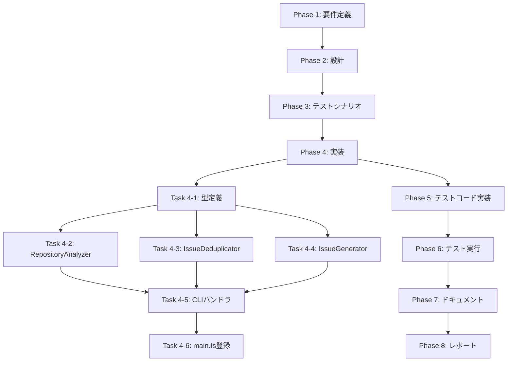

# プロジェクト計画書

**Issue番号**: #126
**タイトル**: auto-issue: Phase 1 - CLIコマンド基盤とバグ検出機能の実装
**親Issue**: #121 AIエージェントによる自動Issue作成機能の実装
**作成日**: 2025-01-30

---

## 1. Issue分析

### 1.1 複雑度評価

**判定**: **中程度**

**根拠**:
- 新規サブシステム（auto-issue コマンド）の追加であるが、既存のエージェント実行基盤を活用できる
- 複数の新規モジュール（リポジトリ探索、重複検出、Issue生成）の作成が必要
- 既存のCodex/Claude エージェントクライアントとの統合により、ゼロから実装する必要がない
- Phase 1は基本機能（バグ検出のみ）に限定されており、フルスコープ（refactor/enhancement）は除外
- 言語非依存の設計が求められるが、エージェントベースアプローチにより実現可能

### 1.2 見積もり工数

**総工数**: 20~28時間

**フェーズ別内訳**:
- Phase 1 (要件定義): 2~3時間
- Phase 2 (設計): 3~4時間
- Phase 3 (テストシナリオ): 2~3時間
- Phase 4 (実装): 8~10時間
- Phase 5 (テストコード実装): 3~4時間
- Phase 6 (テスト実行): 1~2時間
- Phase 7 (ドキュメント): 1~2時間
- Phase 8 (レポート): 1時間

**工数の根拠**:
1. **既存基盤活用によるコスト削減** (約30%削減):
   - CodexAgentClient / ClaudeAgentClient を再利用
   - commander.js の既存パターンを踏襲
   - GitHubClient (IssueClient) を活用

2. **新規実装要素によるコスト増加**:
   - リポジトリ探索エンジン（エージェントプロンプト設計）
   - 重複検出アルゴリズム（OpenAI API統合）
   - Issue生成エンジン（エージェントプロンプト設計 + GitHub API統合）

3. **Phase 1限定スコープによるコスト削減** (約40%削減):
   - バグ検出のみ（refactor/enhancement は未実装）
   - 基本的なCLIオプションのみ

### 1.3 リスク評価

**総合リスク**: **中**

**主要リスク**:

1. **エージェントプロンプト設計の不確実性** (高リスク)
   - リスク: バグ検出の精度が期待値を下回る可能性
   - 軽減策: 複数のプロンプトパターンを試行し、ベストプラクティスを確立

2. **重複検出の精度** (中リスク)
   - リスク: OpenAI API の類似度判定が期待通り機能しない可能性
   - 軽減策: コサイン類似度による初期フィルタリング + LLM判定の2段階方式

3. **言語非依存性の検証コスト** (中リスク)
   - リスク: TypeScript以外の言語（Python, Go等）での動作検証が不十分
   - 軽減策: Phase 1では主要言語（TypeScript, Python）に限定し、Phase 2で拡張

4. **既存Issueとの重複スキップロジック** (低リスク)
   - リスク: 重複判定で誤判定（false positive/negative）が発生
   - 軽減策: `--similarity-threshold` オプションで閾値調整可能にする

---

## 2. 実装戦略判断

### 2.1 実装戦略

**判定**: **CREATE**

**判断根拠**:
- **新規CLIコマンド** (`auto-issue`) の追加 → 完全に新しいエントリーポイント
- **新規モジュール群**の作成:
  - `src/commands/auto-issue.ts` (新規)
  - `src/core/repository-analyzer.ts` (新規)
  - `src/core/issue-deduplicator.ts` (新規)
  - `src/core/issue-generator.ts` (新規)
  - `src/types/auto-issue.ts` (新規)
- **既存コードへの影響は限定的**:
  - `src/main.ts` へのコマンド登録のみ（約10行追加）
  - 既存のエージェントクライアント（CodexAgentClient/ClaudeAgentClient）は**参照のみ**で変更不要

**EXTENDではない理由**:
- 既存の `execute` / `init` / `rollback` コマンドとは**独立した新機能**
- 既存フェーズ実行フロー（Planning → Evaluation）とは異なるワークフロー

**REFACTORではない理由**:
- 既存コードの構造改善ではなく、新しい価値提供機能の追加

### 2.2 テスト戦略

**判定**: **UNIT_INTEGRATION**

**判断根拠**:

#### ユニットテストが必要な理由:
1. **重複検出ロジック** (`IssueDeduplicator`):
   - コサイン類似度計算の正確性検証
   - OpenAI API呼び出しのモック化（APIコスト削減）
   - 閾値調整ロジックの検証

2. **バグ候補データ構造** (`RepositoryAnalyzer`):
   - エージェント出力のパースロジック
   - バグパターンの抽出・検証

3. **Issue本文生成ロジック** (`IssueGenerator`):
   - テンプレート変数の置換
   - ラベル自動付与ロジック

#### インテグレーションテストが必要な理由:
1. **エンドツーエンド動作確認**:
   - `auto-issue` コマンド → RepositoryAnalyzer → IssueDeduplicator → IssueGenerator の連携
   - エージェント実行（Codex/Claude）のフォールバック動作
   - GitHub API統合（Issue作成、ラベル付与）

2. **実リポジトリでのバグ検出精度検証**:
   - TypeScriptリポジトリでのバグ検出
   - Pythonリポジトリでのバグ検出（言語非依存性）

3. **dry-runモードの動作確認**:
   - `--dry-run` でIssue作成をスキップし、候補のみ表示

**BDD不要の理由**:
- Phase 1はMVP（内部機能のみ）
- エンドユーザー向けストーリーはPhase 2以降で検討

**ALLが不要な理由**:
- Phase 1の限定スコープではUNIT + INTEGRATIONで十分

### 2.3 テストコード戦略

**判定**: **CREATE_TEST**

**判断根拠**:
- **完全に新しいモジュール群**のテストのため、既存テストファイルへの追加では不適切
- **新規テストファイル**を作成:
  - `tests/unit/core/repository-analyzer.test.ts`
  - `tests/unit/core/issue-deduplicator.test.ts`
  - `tests/unit/core/issue-generator.test.ts`
  - `tests/unit/commands/auto-issue.test.ts`
  - `tests/integration/auto-issue-workflow.test.ts`

**EXTEND_TESTが不適切な理由**:
- 既存のテストファイル（例: `commands/execute.test.ts`）に追加すると、テストスコープが肥大化
- 新機能のテストは独立したファイルで管理すべき

**BOTH_TESTが不要な理由**:
- 既存機能の拡張ではなく、完全に新しい機能のため

---

## 3. 影響範囲分析

### 3.1 既存コードへの影響

#### 変更が必要なファイル

| ファイルパス | 変更内容 | 変更規模 | 影響度 |
|------------|---------|---------|--------|
| `src/main.ts` | `auto-issue` コマンド登録 | 約10行追加 | **低** |

#### 変更不要なファイル（参照のみ）

| ファイルパス | 利用方法 | 理由 |
|------------|---------|------|
| `src/core/codex-agent-client.ts` | import & 実行 | 既存APIで十分 |
| `src/core/claude-agent-client.ts` | import & 実行 | 既存APIで十分 |
| `src/core/github-client.ts` | import & 実行（IssueClient） | Issue作成APIが既存 |
| `src/commands/execute/agent-setup.ts` | import (`resolveAgentCredentials`) | エージェント認証ロジック再利用 |

### 3.2 依存関係の変更

#### 新規依存の追加

**なし**

既存の `openai` パッケージ（v4.57.2）を重複検出に活用します。
- 用途: 重複検出における類似度判定（LLM活用）
- 理由: エージェント（Codex/Claude）では短いテキスト比較が非効率

#### 既存依存の変更

**なし**

### 3.3 マイグレーション要否

#### データベーススキーマ変更

**不要**

本プロジェクトはファイルベース（metadata.json）であり、データベースは使用していません。

#### 設定ファイル変更

**不要**

新しい環境変数は追加しません。
- `CODEX_API_KEY` / `OPENAI_API_KEY`: 既存
- `CLAUDE_CODE_CREDENTIALS_PATH`: 既存
- `GITHUB_TOKEN`: 既存

#### メタデータフォーマット変更

**不要**

`.ai-workflow/issue-*/metadata.json` のスキーマ変更は不要です。
`auto-issue` コマンドは既存のワークフロー（init → execute）とは独立しています。

---

## 4. タスク分割

### Phase 1: 要件定義 (見積もり: 2~3h)

- [x] Task 1-1: 受け入れ基準の詳細化 (1~1.5h)
  - Issue #126の受け入れ基準を詳細化
  - バグ検出パターンの具体例をリストアップ（最低5パターン）
  - dry-runモードの期待動作を明確化
  - 言語非依存性の検証対象言語を決定（TypeScript, Python）

- [x] Task 1-2: エージェントプロンプト要件定義 (1~1.5h)
  - バグ検出プロンプトの要件仕様（入力: リポジトリパス、出力: BugCandidate[]）
  - Issue本文生成プロンプトの要件仕様（入力: BugCandidate、出力: Markdown）
  - プロンプト評価基準（精度、再現性、実行時間）の策定

### Phase 2: 設計 (見積もり: 3~4h)

- [x] Task 2-1: モジュール設計 (1.5~2h)
  - RepositoryAnalyzer クラス設計（メソッド: `analyze()`, `parseAgentOutput()`）
  - IssueDeduplicator クラス設計（メソッド: `filterDuplicates()`, `calculateSimilarity()`）
  - IssueGenerator クラス設計（メソッド: `generate()`, `createIssueBody()`）
  - 型定義設計（`BugCandidate`, `AutoIssueOptions`, `DuplicateCheckResult`）

- [x] Task 2-2: CLIインターフェース設計 (1~1.5h)
  - `handleAutoIssueCommand()` フロー設計
  - コマンドオプション仕様（`--category`, `--limit`, `--dry-run`, `--similarity-threshold`, `--agent`）
  - エラーハンドリング仕様（エージェント失敗時、GitHub API失敗時）

- [x] Task 2-3: エージェント統合設計 (0.5~1h)
  - 既存 `resolveAgentCredentials()` の活用方法
  - エージェント選択ロジック（`--agent auto|codex|claude`）
  - フォールバック戦略（Codex失敗時にClaude使用）

### Phase 3: テストシナリオ (見積もり: 2~3h)

- [ ] Task 3-1: ユニットテストシナリオ作成 (1~1.5h)
  - IssueDeduplicator の類似度計算テスト（正常系、境界値、異常系）
  - RepositoryAnalyzer のパースロジックテスト（正常系、不正な出力）
  - IssueGenerator のテンプレート処理テスト（変数置換、ラベル付与）

- [ ] Task 3-2: インテグレーションテストシナリオ作成 (1~1.5h)
  - エンドツーエンドワークフロー（コマンド実行 → Issue作成）
  - dry-runモードの動作検証
  - エージェントフォールバック動作（Codex → Claude）
  - 言語非依存性検証（TypeScript, Python）

### Phase 4: 実装 (見積もり: 8~10h)

- [x] Task 4-1: 型定義の実装 (0.5~1h)
  - `src/types/auto-issue.ts` の作成
  - `BugCandidate`, `AutoIssueOptions`, `DuplicateCheckResult` 型の定義

- [x] Task 4-2: RepositoryAnalyzer の実装 (2~2.5h)
  - `src/core/repository-analyzer.ts` の作成
  - `analyze()` メソッド: エージェント実行 + 出力パース
  - `parseAgentOutput()`: JSON/Markdown出力から BugCandidate[] を抽出
  - バグ検出プロンプトの実装（prompts/auto-issue/detect-bugs.txt）

- [x] Task 4-3: IssueDeduplicator の実装 (2~2.5h)
  - `src/core/issue-deduplicator.ts` の作成
  - `filterDuplicates()` メソッド: GitHub API → OpenAI API → フィルタリング
  - `calculateSimilarity()`: コサイン類似度 + LLM判定
  - OpenAI API統合（`openai` パッケージ活用）

- [x] Task 4-4: IssueGenerator の実装 (1.5~2h)
  - `src/core/issue-generator.ts` の作成
  - `generate()` メソッド: エージェント実行 + GitHub API呼び出し
  - `createIssueBody()`: Issue本文テンプレート生成
  - ラベル自動付与ロジック（`auto-generated`, `bug`）

- [x] Task 4-5: CLIコマンドハンドラの実装 (1.5~2h)
  - `src/commands/auto-issue.ts` の作成
  - `handleAutoIssueCommand()`: オプションパース → 各モジュール呼び出し
  - エージェント認証ロジック（`resolveAgentCredentials` 活用）
  - dry-runモードの実装

- [x] Task 4-6: main.tsへのコマンド登録 (0.5h)
  - `src/main.ts` に `auto-issue` コマンド追加
  - commander.js オプション定義

### Phase 5: テストコード実装 (見積もり: 3~4h)

- [x] Task 5-1: ユニットテスト実装 (2~2.5h)
  - `tests/unit/core/repository-analyzer.test.ts`
  - `tests/unit/core/issue-deduplicator.test.ts`
  - `tests/unit/core/issue-generator.test.ts`
  - `tests/unit/commands/auto-issue.test.ts`

- [x] Task 5-2: インテグレーションテスト実装 (1~1.5h)
  - `tests/integration/auto-issue-workflow.test.ts`
  - dry-runモードテスト
  - エージェントフォールバックテスト

### Phase 6: テスト実行 (見積もり: 1~2h)

- [x] Task 6-1: ユニットテスト実行とバグ修正 (0.5~1h)
  - `npm run test:unit` 実行
  - 失敗したテストのデバッグと修正

- [x] Task 6-2: インテグレーションテスト実行とバグ修正 (0.5~1h)
  - `npm run test:integration` 実行
  - エンドツーエンド動作の検証

### Phase 7: ドキュメント (見積もり: 1~2h)

- [x] Task 7-1: CLAUDE.md の更新 (0.5~1h)
  - `auto-issue` コマンドの使用方法を追加
  - オプション一覧とサンプルコマンド

- [x] Task 7-2: README.md の更新 (0.5~1h)
  - クイックスタートセクションに `auto-issue` の例を追加
  - 受け入れ基準の達成状況を記載

### Phase 8: レポート (見積もり: 1h)

- [ ] Task 8-1: 完了レポート作成 (1h)
  - 実装内容のサマリー
  - テスト結果（カバレッジ、合格/不合格）
  - 既知の制限事項（Phase 1のスコープ外）
  - Phase 2への引き継ぎ事項（refactor/enhancement検出）

---

## 5. 依存関係



**タスク間の依存関係詳細**:
- Task 4-1 (型定義) は Task 4-2, 4-3, 4-4 の **前提条件**
- Task 4-5 (CLIハンドラ) は Task 4-2, 4-3, 4-4 の **完了後に実装可能**
- Task 4-6 (main.ts登録) は Task 4-5 の **完了後に実装可能**

---

## 6. リスクと軽減策

### リスク1: エージェントプロンプト設計の不確実性

- **影響度**: **高**
- **確率**: **中**
- **詳細**: バグ検出プロンプトがリポジトリの複雑性に対応できず、精度が低下する可能性
- **軽減策**:
  1. **複数のプロンプトパターンを試行** (Phase 2で3パターン作成)
  2. **既存ベストプラクティスを参照** (Codex公式ドキュメント、Claude Codeサンプル)
  3. **段階的改善** (Phase 1で基本パターン確立、Phase 2で最適化)
  4. **フォールバック機構** (プロンプトA失敗時はプロンプトBを試行)

### リスク2: 重複検出の精度問題

- **影響度**: **中**
- **確率**: **中**
- **詳細**:
  - False Positive (誤って重複と判定) → 必要なIssueが作成されない
  - False Negative (重複を見逃す) → 重複Issueが作成される
- **軽減策**:
  1. **2段階フィルタリング**:
     - 第1段階: コサイン類似度（高速、粗い判定）
     - 第2段階: LLM判定（高精度、コスト高）
  2. **閾値調整可能化** (`--similarity-threshold 0.0~1.0`)
  3. **dry-runモードでの事前検証** (本番投入前に精度確認)
  4. **ログ出力強化** (類似度スコア、判定理由をログに記録)

### リスク3: 言語非依存性の検証コスト

- **影響度**: **中**
- **確率**: **低**
- **詳細**: TypeScript以外の言語（Python, Go, Java等）でバグ検出が機能しない可能性
- **軽減策**:
  1. **Phase 1での対象言語限定** (TypeScript, Python のみ)
  2. **エージェントの汎用性活用** (Codex/Claudeは複数言語に対応)
  3. **プロンプトの言語非依存化** (「このリポジトリのバグを探してください」という汎用的な指示)
  4. **Phase 2での拡張** (Go, Java, Rustへの対応はPhase 2で段階的に追加)

### リスク4: GitHub API レート制限

- **影響度**: **低**
- **確率**: **低**
- **詳細**: 大量のIssue作成でレート制限に抵触する可能性
- **軽減策**:
  1. **`--limit` オプション** (デフォルト: 5件、最大: 20件)
  2. **レート制限検出** (GitHub API レスポンスヘッダーを監視)
  3. **dry-runモードの推奨** (本番前に候補数を確認)
  4. **リトライロジック** (レート制限時は指数バックオフで再試行)

### リスク5: OpenAI API コスト

- **影響度**: **低**
- **確率**: **中**
- **詳細**: 重複検出でのLLM呼び出しによりAPIコストが増加
- **軽減策**:
  1. **第1段階フィルタリングで候補削減** (コサイン類似度 > 0.5のみLLM判定)
  2. **バッチ処理** (複数の類似度判定を1回のAPI呼び出しにまとめる)
  3. **キャッシュ機構** (同じIssueペアの判定結果をキャッシュ)
  4. **コスト上限設定** (環境変数 `MAX_OPENAI_COST_USD` で上限制御)

### リスク6: エージェント実行時間の長期化

- **影響度**: **中**
- **確率**: **中**
- **詳細**: 大規模リポジトリでのバグ検出に10分以上かかる可能性
- **軽減策**:
  1. **ディレクトリスコープ限定** (Phase 1では `src/` のみ対象)
  2. **ファイル数制限** (最大100ファイルまで)
  3. **タイムアウト設定** (5分でタイムアウト、部分結果を返却)
  4. **プログレス表示** (進捗状況をリアルタイム表示)

---

## 7. 品質ゲート

### Phase 1: 要件定義

- [ ] 機能要件が明確に記載されている（バグ検出パターン5つ以上）
- [ ] 受け入れ基準が検証可能な形で定義されている
- [ ] エージェントプロンプトの要件仕様が完成している
- [ ] 言語非依存性の検証対象が決定している（TypeScript, Python）

### Phase 2: 設計

- [ ] **実装戦略（CREATE）の判断根拠が明記されている** ✅
- [ ] **テスト戦略（UNIT_INTEGRATION）の判断根拠が明記されている** ✅
- [ ] **テストコード戦略（CREATE_TEST）の判断根拠が明記されている** ✅
- [ ] モジュール間のインターフェース設計が完成している
- [ ] CLIオプション仕様が明確に定義されている
- [ ] エラーハンドリング仕様が網羅的に記載されている

### Phase 3: テストシナリオ

- [ ] ユニットテストシナリオが正常系・異常系・境界値を網羅している
- [ ] インテグレーションテストシナリオがエンドツーエンドを検証している
- [ ] dry-runモードのテストシナリオが定義されている
- [ ] 言語非依存性の検証シナリオが定義されている（TypeScript, Python）

### Phase 4: 実装

- [ ] すべての新規モジュールが実装されている（RepositoryAnalyzer, IssueDeduplicator, IssueGenerator）
- [ ] CLIコマンドハンドラが実装されている（`handleAutoIssueCommand`）
- [ ] main.tsにコマンドが登録されている
- [ ] エージェント統合が完了している（`resolveAgentCredentials` 活用）
- [ ] dry-runモードが実装されている
- [ ] コードレビュー（自己レビュー）が完了している

### Phase 5: テストコード実装

- [ ] すべてのユニットテストが実装されている（4ファイル以上）
- [ ] インテグレーションテストが実装されている（1ファイル以上）
- [ ] テストカバレッジが70%以上である
- [ ] モック設定が適切である（OpenAI API, GitHub API）

### Phase 6: テスト実行

- [ ] すべてのユニットテストが合格している
- [ ] すべてのインテグレーションテストが合格している
- [ ] dry-runモードが期待通り動作している
- [ ] エージェントフォールバック（Codex → Claude）が動作している
- [ ] 言語非依存性が検証されている（TypeScript, Python）

### Phase 7: ドキュメント

- [x] CLAUDE.mdに `auto-issue` コマンドの使用方法が追加されている
- [x] README.mdにクイックスタート例が追加されている
- [x] コマンドオプション一覧が記載されている
- [x] サンプルコマンドが記載されている（dry-run含む）

### Phase 8: レポート

- [ ] 完了レポートが作成されている
- [ ] テスト結果（カバレッジ、合格率）が記載されている
- [ ] 既知の制限事項が明記されている
- [ ] Phase 2への引き継ぎ事項が記載されている

---

## 8. 成功基準（受け入れ基準の詳細化）

Issue #126の受け入れ基準を以下のように詳細化します。

### 基準1: CLIコマンドの動作

✅ **検証方法**:
```bash
# 正常系
node dist/index.js auto-issue --category bug --dry-run
# 期待結果: バグ候補が5件表示される（Issue作成はスキップ）

# エージェント指定
node dist/index.js auto-issue --category bug --agent codex --limit 3
# 期待結果: Codexエージェントでバグ検出、3件のIssueが作成される

# 閾値調整
node dist/index.js auto-issue --category bug --similarity-threshold 0.9
# 期待結果: 重複検出が厳格化され、より多くのIssueが作成される
```

### 基準2: エージェント選択

✅ **検証方法**:
- `--agent auto`: Codex → Claude フォールバック動作を確認
- `--agent codex`: Codex専用モードを確認
- `--agent claude`: Claude専用モードを確認

### 基準3: バグ検出精度

✅ **検証方法**:
- テストリポジトリ（ai-workflow-agent）で以下のバグパターンを検出:
  1. エラーハンドリング欠如（`try-catch` なし）
  2. 型安全性問題（`any` の過度な使用）
  3. リソースリーク（ファイルハンドルの未クローズ）
  4. セキュリティ懸念（環境変数の直接参照）
  5. コードの重複（DRY原則違反）

### 基準4: 重複検出

✅ **検証方法**:
- 既存Issue「Fix memory leak in CodexAgentClient」が存在する場合
- バグ検出で「メモリリーク」を検出した際に重複と判定
- `--dry-run` で重複スキップ理由が表示される

### 基準5: 言語非依存性

✅ **検証方法**:
- TypeScriptリポジトリ（ai-workflow-agent）でバグ検出成功
- Pythonリポジトリ（別途用意）でバグ検出成功
- Go/Javaリポジトリは Phase 2でサポート

### 基準6: dry-runモード

✅ **検証方法**:
```bash
node dist/index.js auto-issue --category bug --dry-run
# 期待結果:
# - バグ候補が表示される
# - GitHub APIが呼び出されない（Issue作成スキップ）
# - ログに「DRY RUN MODE: Skipping issue creation」と表示
```

### 基準7: テストカバレッジ

✅ **検証方法**:
```bash
npm run test:coverage
# 期待結果:
# - tests/unit/core/repository-analyzer.test.ts: 80%以上
# - tests/unit/core/issue-deduplicator.test.ts: 80%以上
# - tests/unit/core/issue-generator.test.ts: 80%以上
# - tests/unit/commands/auto-issue.test.ts: 80%以上
# - tests/integration/auto-issue-workflow.test.ts: 合格
```

### 基準8: ドキュメント

✅ **検証方法**:
- CLAUDE.mdに「## auto-issue コマンド」セクションが追加されている
- README.mdに使用例が追加されている
- すべてのCLIオプションがドキュメント化されている

---

## 9. 技術的補足

### 9.1 エージェント活用の詳細

#### バグ検出プロンプト設計

**プロンプトファイル**: `src/prompts/auto-issue/detect-bugs.txt`

**プロンプト例**:
```
あなたはコードレビューの専門家です。以下のリポジトリからバグや問題点を検出してください。

# 検出対象パターン
1. エラーハンドリングの欠如（try-catchなし、エラー無視）
2. 型安全性の問題（anyの過度な使用、型アサーションの乱用）
3. リソースリーク（unclosed streams、未解放リソース）
4. セキュリティ上の懸念（ハードコードされたシークレット、SQLインジェクション）
5. コードの重複（DRY原則違反）

# 出力フォーマット
各バグ候補をJSON形式で出力してください:
{
  "bugs": [
    {
      "title": "エラーハンドリングの欠如",
      "file": "src/core/codex-agent-client.ts",
      "line": 42,
      "severity": "high",
      "description": "executeTask()メソッドでエラーハンドリングが不足しています。",
      "suggestedFix": "try-catchブロックを追加してください。"
    }
  ]
}

# リポジトリパス
{repository_path}
```

#### Issue本文生成プロンプト設計

**プロンプトファイル**: `src/prompts/auto-issue/generate-issue-body.txt`

**プロンプト例**:
```
以下のバグ候補から、GitHub Issue本文を生成してください。

# バグ候補
{bug_candidate_json}

# Issue本文フォーマット
## 概要
（バグの概要を1-2文で説明）

## 詳細
（バグの詳細な説明）

## 影響範囲
（このバグが与える影響）

## 修正案
（推奨される修正方法）

## 関連ファイル
- ファイルパス (行番号)
```

### 9.2 重複検出アルゴリズム

#### 第1段階: コサイン類似度フィルタリング

```typescript
function calculateCosineSimilarity(text1: string, text2: string): number {
  // TF-IDF ベクトル化
  const vector1 = vectorize(text1);
  const vector2 = vectorize(text2);

  // コサイン類似度計算
  const dotProduct = dot(vector1, vector2);
  const magnitude1 = magnitude(vector1);
  const magnitude2 = magnitude(vector2);

  return dotProduct / (magnitude1 * magnitude2);
}
```

#### 第2段階: LLM判定

```typescript
async function checkDuplicateWithLLM(
  bugCandidate: BugCandidate,
  existingIssue: Issue
): Promise<boolean> {
  const prompt = `
以下の2つのIssueは重複していますか？

Issue 1:
タイトル: ${bugCandidate.title}
内容: ${bugCandidate.description}

Issue 2:
タイトル: ${existingIssue.title}
内容: ${existingIssue.body}

回答: YES（重複） または NO（重複なし）
  `;

  const response = await openai.chat.completions.create({
    model: 'gpt-4o-mini',
    messages: [{ role: 'user', content: prompt }],
    temperature: 0.0,
  });

  return response.choices[0].message.content?.includes('YES') ?? false;
}
```

### 9.3 ファイル構成詳細

```
src/
├── commands/
│   └── auto-issue.ts              # CLIハンドラ（約200行）
│       ├─ handleAutoIssueCommand()
│       ├─ parseOptions()
│       └─ reportResults()
│
├── core/
│   ├── repository-analyzer.ts     # エージェントベースのコード解析（約250行）
│   │   ├─ analyze(repoPath, agent)
│   │   ├─ parseAgentOutput(rawOutput)
│   │   └─ validateBugCandidate(candidate)
│   │
│   ├── issue-deduplicator.ts      # 重複検出（約200行）
│   │   ├─ filterDuplicates(candidates, existingIssues)
│   │   ├─ calculateCosineSimilarity(text1, text2)
│   │   └─ checkDuplicateWithLLM(candidate, issue)
│   │
│   └── issue-generator.ts         # エージェントベースのIssue生成（約180行）
│       ├─ generate(bugCandidate, agent)
│       ├─ createIssueBody(candidate, agentOutput)
│       └─ createIssueOnGitHub(title, body, labels)
│
├── types/
│   └── auto-issue.ts              # 型定義（約100行）
│       ├─ BugCandidate
│       ├─ AutoIssueOptions
│       ├─ DuplicateCheckResult
│       └─ IssueCreationResult
│
└── prompts/
    └── auto-issue/
        ├── detect-bugs.txt        # バグ検出プロンプト
        └── generate-issue-body.txt # Issue本文生成プロンプト
```

---

## 10. Phase 2への引き継ぎ事項

Phase 1（本Issue）では以下をスコープ外とし、Phase 2（Issue #127予定）で対応します。

### スコープ外の機能

1. **Refactor検出**:
   - `--category refactor` オプション
   - コードの重複検出（既存機能の改善提案）
   - アーキテクチャ改善提案

2. **Enhancement検出**:
   - `--category enhancement` オプション
   - 新機能追加の提案
   - パフォーマンス最適化の提案

3. **言語拡張**:
   - Go, Java, Rust, C++への対応
   - 言語固有のバグパターン（例: Goのゴルーチンリーク）

4. **高度な重複検出**:
   - Issue本文の意味的類似度（埋め込みベクトル活用）
   - コメント履歴を考慮した重複判定

5. **バッチ処理モード**:
   - 複数リポジトリの一括スキャン
   - スケジュール実行（cron統合）

### Phase 1での学習項目

Phase 2の設計に活かすため、以下を記録します:

1. **エージェントプロンプトのベストプラクティス**:
   - 精度が高かったプロンプトパターン
   - 失敗したプロンプトパターン

2. **重複検出の精度データ**:
   - False Positive/Negative の発生率
   - 最適な閾値（`--similarity-threshold`）

3. **実行時間の計測データ**:
   - リポジトリサイズ別の実行時間
   - エージェント別の性能比較（Codex vs Claude）

4. **ユーザーフィードバック**:
   - dry-runモードでの使い勝手
   - 生成されたIssue品質の評価

---

## 11. まとめ

### 11.1 重要ポイント

1. **実装戦略: CREATE** - 完全に新しいサブシステムの追加
2. **テスト戦略: UNIT_INTEGRATION** - ユニットテスト + インテグレーションテスト
3. **テストコード戦略: CREATE_TEST** - 新規テストファイル作成
4. **総工数: 20~28時間** - 中規模開発
5. **リスク: 中** - エージェントプロンプト設計に不確実性あり

### 11.2 成功への鍵

1. **既存基盤の最大活用**:
   - CodexAgentClient / ClaudeAgentClient の再利用
   - GitHubClient (IssueClient) の活用
   - `resolveAgentCredentials()` の活用

2. **段階的な実装**:
   - Phase 1: バグ検出のみ（MVP）
   - Phase 2: Refactor/Enhancement検出（拡張）

3. **品質ゲートの遵守**:
   - 6つの必須品質ゲート（実装戦略、テスト戦略、テストコード戦略等）
   - 各フェーズの合格基準

4. **リスク軽減策の実行**:
   - エージェントプロンプトの複数パターン試行
   - 2段階重複検出（コサイン類似度 + LLM）
   - dry-runモードでの事前検証

---

**計画書作成日**: 2025-01-30
**次フェーズ**: Phase 1 (要件定義)
**担当者**: AI Workflow Agent
