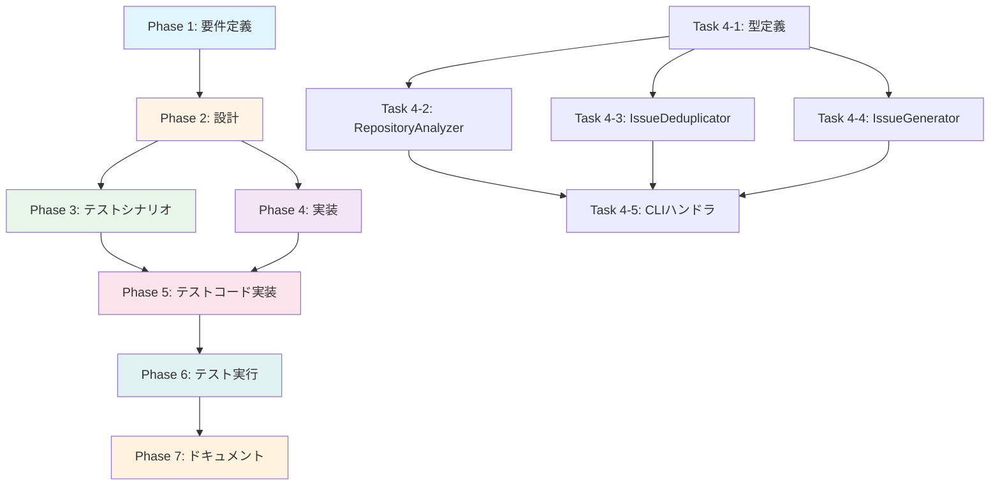

# プロジェクト計画書 - Issue #126

**Issue番号**: #126
**タイトル**: auto-issue: Phase 1 - CLIコマンド基盤とバグ検出機能の実装
**親Issue**: #121 AIエージェントによる自動Issue作成機能の実装
**作成日**: 2025-01-30

## 1. Issue分析

### 1.1 複雑度判定

**判定結果**: 中程度

**根拠**:
- 4つの新規モジュールの作成（repository-analyzer, issue-deduplicator, issue-generator, auto-issue command）
- TypeScript AST解析の導入（ts-morphパッケージの追加と学習が必要）
- GitHub API統合と既存GitHubClientとの連携
- LLM統合（OpenAI API）による意味的類似度判定
- ユニットテスト実装が必須
- 既存コマンド実装パターンへの統合

**特記事項**:
- Phase 1 MVPとして明確にスコープが限定されている（バグ検出のみ、リファクタリング・拡張機能は Phase 2以降）
- 既存の `rollback` コマンド実装パターンを参考にできる（類似の CLIハンドラ構造）
- OpenAI APIは既存の `content-parser.ts` で使用されているため、統合は比較的容易

### 1.2 見積もり工数

**合計見積もり**: 20~28時間（2.5~3.5日程度）

**内訳**:
- Phase 1: 要件定義 - 3~4時間
- Phase 2: 設計 - 4~5時間
- Phase 3: テストシナリオ - 2~3時間
- Phase 4: 実装 - 6~8時間
- Phase 5: テストコード実装 - 3~4時間
- Phase 6: テスト実行 - 1~2時間
- Phase 7: ドキュメント - 1~2時間

### 1.3 リスク評価

**総合リスク**: 中

**主要リスク**:
1. **技術的リスク（中）**: ts-morphパッケージの学習曲線、TypeScript AST解析の複雑性
2. **スコープリスク（低）**: Phase 1 MVPとして明確に定義されているため、スコープクリープのリスクは低い
3. **統合リスク（中）**: 既存GitHubClientとの統合、LLM呼び出しの非同期処理
4. **依存リスク（低）**: 外部システム依存は GitHub API と OpenAI API のみ

---

## 2. 実装戦略判断

### 2.1 実装戦略: **CREATE**

**判断根拠**:

この Issue は **新規サブシステム**の基盤構築が中心です:
- 4つの新規モジュールをゼロから作成
  - `src/commands/auto-issue.ts` - CLIハンドラ（新規コマンド）
  - `src/core/repository-analyzer.ts` - リポジトリ探索エンジン（新規機能）
  - `src/core/issue-deduplicator.ts` - 重複検出ロジック（新規機能）
  - `src/core/issue-generator.ts` - Issue生成エンジン（新規機能）
- 新規型定義 `src/types/auto-issue.ts` の作成
- 新規 npm 依存パッケージ（ts-morph）の追加
- `src/main.ts` への新規コマンド登録（既存コマンドとは独立）

既存コードの拡張は最小限（`src/main.ts` へのコマンド追加のみ）で、ほとんどのコードが新規作成です。

**参考**: 類似の新規コマンド実装として `rollback` コマンド（Issue #90）があり、そのパターンに従います。

### 2.2 テスト戦略: **UNIT_INTEGRATION**

**判断根拠**:

ユニットテスト + インテグレーションテストの組み合わせが適切です:

**ユニットテストが必要な理由**:
- バグ検出パターンのロジック（AST解析）は独立してテスト可能
- 重複Issue検出アルゴリズム（コサイン類似度）は数学的ロジックのため単体テストが適切
- Issue生成ロジック（テンプレートベース）はモックで簡単にテスト可能

**インテグレーションテストが必要な理由**:
- GitHub API連携（Issue作成、既存Issue取得）は実際のAPIモックが必要
- LLM統合（OpenAI API）の呼び出しフローはエンドツーエンドでテスト
- CLIコマンド全体のフロー（`--dry-run`, `--limit`, `--similarity-threshold`）は統合テストで検証

**BDDテストは不要**:
- エンドユーザー向けUIではなく、開発者ツールのCLIコマンドのため
- 機能要件が明確で、振る舞い駆動テストのメリットが小さい

### 2.3 テストコード戦略: **CREATE_TEST**

**判断根拠**:

新規テストファイルの作成が適切です:

**新規テストファイルが必要な理由**:
- 新規モジュール（repository-analyzer, issue-deduplicator, issue-generator）に対応するテストファイルが必要
- 既存テストとは独立したテストケースのため、既存テストファイルへの追加は不適切
- テストの保守性と可読性のため、モジュール単位でテストファイルを分離すべき

**作成予定のテストファイル**:
- `tests/unit/commands/auto-issue.test.ts` - CLIハンドラのユニットテスト
- `tests/unit/core/repository-analyzer.test.ts` - バグ検出ロジックのユニットテスト
- `tests/unit/core/issue-deduplicator.test.ts` - 重複検出ロジックのユニットテスト
- `tests/integration/auto-issue-workflow.test.ts` - コマンド全体の統合テスト

---

## 3. 影響範囲分析

### 3.1 既存コードへの影響

**変更が必要なファイル**（最小限）:

1. **`src/main.ts`** (軽微な変更)
   - 新規コマンド `auto-issue` の登録
   - `handleAutoIssueCommand` のインポート追加
   - 影響度: **低**（既存コマンドとは独立、約10行の追加）

2. **`package.json`** (軽微な変更)
   - `ts-morph` パッケージの追加（`dependencies` セクション）
   - 影響度: **低**（新規依存のみ、既存依存は変更なし）

**変更不要なファイル**:
- 既存のコマンドハンドラ（`init.ts`, `execute.ts`, `rollback.ts` 等）は **変更不要**
- 既存のコアモジュール（`github-client.ts`, `metadata-manager.ts` 等）は **そのまま利用**（変更不要）
- 既存の型定義（`commands.ts`, `types.ts`）は **変更不要**（新規ファイルで型を定義）

### 3.2 依存関係の変更

**新規依存の追加**:

| パッケージ名 | バージョン | 用途 | インストールコマンド |
|-------------|-----------|------|---------------------|
| `ts-morph` | `^21.0.0` | TypeScript AST解析 | `npm install ts-morph` |

**既存依存の変更**: なし

**既存依存の活用**:
- `openai` - 意味的類似度判定に使用（既存）
- `@octokit/rest` - GitHub Issue操作に使用（既存）
- `commander` - CLIオプション解析に使用（既存）

### 3.3 マイグレーション要否

**マイグレーション不要**:
- データベーススキーマ変更なし
- 設定ファイル変更なし（`.env` への新規変数追加は **オプショナル**）
- `metadata.json` スキーマ変更なし（`auto-issue` コマンドはワークフロー外で動作）

**注意事項**:
- `ts-morph` パッケージのインストールが必要（`npm install` 実行）
- 既存の `openai` パッケージのバージョン互換性確認（現在使用中のバージョンで動作するか確認）

---

## 4. タスク分割

### Phase 1: 要件定義 (見積もり: 3~4h)

- [ ] Task 1-1: 受け入れ基準の詳細化 (1~1.5h)
  - Issue #126 の受け入れ基準を機能要件に変換
  - `--dry-run` モードの振る舞いを明確化
  - バグ検出パターンの優先順位を決定
- [ ] Task 1-2: 技術調査（ts-morph） (1.5~2h)
  - ts-morph パッケージのドキュメント確認
  - TypeScript AST解析のサンプルコード作成
  - エラーハンドリング欠如の検出パターンを調査
- [ ] Task 1-3: 既存コード調査 (0.5~1h)
  - `rollback` コマンドの実装パターンを参照
  - `GitHubClient` の Issue操作メソッドを確認
  - `ContentParser` の OpenAI統合方法を確認

### Phase 2: 設計 (見積もり: 4~5h)

- [ ] Task 2-1: モジュール設計 (1.5~2h)
  - `RepositoryAnalyzer` クラスの設計（バグ検出パターンのメソッド定義）
  - `IssueDeduplicator` クラスの設計（類似度計算アルゴリズム）
  - `IssueGenerator` クラスの設計（テンプレート構造）
- [ ] Task 2-2: 型定義の設計 (1~1.5h)
  - `AutoIssueCommandOptions` インターフェースの定義
  - `BugPattern` 型の定義（検出されたバグ情報）
  - `IssueSimilarity` 型の定義（重複判定結果）
- [ ] Task 2-3: CLIオプションの設計 (0.5~1h)
  - `--category`, `--limit`, `--dry-run`, `--similarity-threshold` のデフォルト値決定
  - バリデーションルールの定義
- [ ] Task 2-4: エラーハンドリング設計 (1~1.5h)
  - ts-morph パースエラーのハンドリング
  - GitHub API エラーのハンドリング
  - OpenAI API エラーのハンドリング（タイムアウト、レート制限等）

### Phase 3: テストシナリオ (見積もり: 2~3h)

- [ ] Task 3-1: ユニットテストシナリオ (1~1.5h)
  - バグ検出パターンのテストケース（正常系・異常系）
  - 重複検出ロジックのテストケース（類似度スコア境界値）
  - Issueテンプレート生成のテストケース
- [ ] Task 3-2: インテグレーションテストシナリオ (1~1.5h)
  - `--dry-run` モードのエンドツーエンドテスト
  - GitHub API モックを使用したIssue作成フロー
  - LLM統合の重複判定フロー

### Phase 4: 実装 (見積もり: 6~8h)

- [ ] Task 4-1: 型定義の実装 (0.5~1h)
  - `src/types/auto-issue.ts` の作成
  - `AutoIssueCommandOptions`, `BugPattern`, `IssueSimilarity` の実装
- [ ] Task 4-2: RepositoryAnalyzer の実装 (2~2.5h)
  - `src/core/repository-analyzer.ts` の作成
  - ts-morph を使用したバグ検出パターンの実装
    - エラーハンドリング欠如の検出
    - `any` 型の過剰使用の検出
    - リソースリークの検出
- [ ] Task 4-3: IssueDeduplicator の実装 (1.5~2h)
  - `src/core/issue-deduplicator.ts` の作成
  - コサイン類似度計算の実装
  - LLM統合（OpenAI API）の意味的類似度判定
- [ ] Task 4-4: IssueGenerator の実装 (1~1.5h)
  - `src/core/issue-generator.ts` の作成
  - テンプレートベースのIssue本文生成
  - ラベル自動付与（`auto-generated`, `bug`）
- [ ] Task 4-5: CLIハンドラの実装 (1~1.5h)
  - `src/commands/auto-issue.ts` の作成
  - CLIオプション解析とバリデーション
  - モジュール間の統合（Analyzer → Deduplicator → Generator）
  - `src/main.ts` への登録

### Phase 5: テストコード実装 (見積もり: 3~4h)

- [ ] Task 5-1: ユニットテストの実装 (2~2.5h)
  - `tests/unit/core/repository-analyzer.test.ts` の作成
  - `tests/unit/core/issue-deduplicator.test.ts` の作成
  - モック設計（ts-morph AST、GitHub API、OpenAI API）
- [ ] Task 5-2: インテグレーションテストの実装 (1~1.5h)
  - `tests/integration/auto-issue-workflow.test.ts` の作成
  - エンドツーエンドのフロー検証
  - `--dry-run` と実Issue作成の両方をテスト

### Phase 6: テスト実行 (見積もり: 1~2h)

- [ ] Task 6-1: ユニットテスト実行 (0.5~1h)
  - `npm run test:unit` で全ユニットテストを実行
  - カバレッジレポート確認（80%以上を目標）
  - 失敗したテストの修正
- [ ] Task 6-2: インテグレーションテスト実行 (0.5~1h)
  - `npm run test:integration` で全統合テストを実行
  - GitHub API モックの動作確認
  - LLM統合のレスポンス検証

### Phase 7: ドキュメント (見積もり: 1~2h)

- [ ] Task 7-1: CLAUDE.md の更新 (0.5~1h)
  - `auto-issue` コマンドの使用方法セクションを追加
  - CLIオプションの説明
  - 使用例（`--dry-run` モード、実Issue作成）
- [ ] Task 7-2: README.md の更新 (オプショナル、0.5~1h)
  - クイックスタートセクションに `auto-issue` コマンドを追加
  - Phase 1 MVP の制限事項を明記（バグ検出のみ）

---

## 5. 依存関係

### タスク依存関係（Mermaid図）

### クリティカルパス

**クリティカルパス**: Phase 1 → Phase 2 → Phase 4 → Phase 5 → Phase 6 → Phase 7

**ボトルネック**:
- **Phase 4-2 (RepositoryAnalyzer実装)**: 最も技術的に複雑（ts-morph学習、AST解析）
- **Phase 5-1 (ユニットテスト実装)**: モック設計が複雑（ts-morph AST、LLM API）

**並行実行可能なタスク**:
- Phase 3（テストシナリオ）と Phase 4（実装）の一部は並行可能
- Phase 4-2, 4-3, 4-4（各モジュール実装）は独立しており、優先度を付けて順次実装

---

## 6. リスクと軽減策

### リスク1: ts-morph パッケージの学習曲線

- **影響度**: 中
- **確率**: 高
- **軽減策**:
  - Phase 1 Task 1-2 で技術調査を実施し、サンプルコード作成
  - 公式ドキュメント（https://ts-morph.com/）とサンプルリポジトリを参照
  - 既存のTypeScript AST解析ツール（ESLintプラグイン等）のソースコードを参考
  - Phase 2 で設計を固める際に、複雑なパターン検出は Phase 2以降に延期する判断も検討

### リスク2: OpenAI API のレート制限・タイムアウト

- **影響度**: 中
- **確率**: 中
- **軽減策**:
  - 重複Issue検出時に、まずコサイン類似度で初期フィルタリング（類似度が低いものはLLM呼び出しをスキップ）
  - LLM呼び出しにタイムアウトとリトライロジックを実装（既存の `IssueAIGenerator` パターンを参考）
  - `--dry-run` モードでLLM統合をスキップ可能にする（開発中のテスト効率化）
  - 環境変数 `OPENAI_API_KEY` が未設定の場合は、LLM統合をスキップしてコサイン類似度のみで判定

### リスク3: バグ検出パターンの精度不足（False Positive/Negative）

- **影響度**: 中
- **確率**: 中
- **軽減策**:
  - Phase 1 MVP では **3つのパターンのみ**に限定（エラーハンドリング欠如、any型、リソースリーク）
  - Phase 3 でテストシナリオを充実させ、False Positive/Negative のケースを洗い出し
  - `--dry-run` モードで検出結果をレビューし、パターンを調整
  - Phase 2以降で追加パターンを実装する際に、Phase 1 の学習成果を活かす

### リスク4: 既存GitHubClientとの統合不整合

- **影響度**: 低
- **確率**: 低
- **軽減策**:
  - Phase 1 Task 1-3 で `GitHubClient` の既存メソッド（`getIssues`, `createIssue` 等）を確認
  - 既存メソッドが不足する場合は、`GitHubClient` に新規メソッドを追加（後方互換性を維持）
  - インテグレーションテストでGitHub APIモックを使用し、実際の動作を検証

### リスク5: スコープクリープ（Phase 2機能の前倒し実装）

- **影響度**: 高
- **確率**: 低
- **軽減策**:
  - Phase 1 MVP の受け入れ基準を厳格に守る（リファクタリング・拡張機能は Phase 2以降）
  - レビュー時に「Phase 1 MVP の範囲内か？」を確認
  - Phase 2以降の機能要望は、親Issue #121 のサブタスクとして別途管理

---

## 7. 品質ゲート

### Phase 1: 要件定義

- [ ] 機能要件が明確に記載されている
- [ ] 受け入れ基準が検証可能な形で定義されている（`--dry-run` の振る舞い、バグ検出パターンの数）
- [ ] 技術調査（ts-morph）の成果物（サンプルコード）が作成されている
- [ ] 既存コードとの統合ポイントが特定されている（`GitHubClient`, `ContentParser`）

### Phase 2: 設計

- [ ] **実装戦略の判断根拠が明記されている**（CREATE/EXTEND/REFACTOR）
- [ ] **テスト戦略の判断根拠が明記されている**（UNIT_ONLY/.../ALL）
- [ ] **テストコード戦略の判断根拠が明記されている**（EXTEND_TEST/CREATE_TEST/BOTH_TEST）
- [ ] モジュール間のインターフェースが明確に定義されている（型定義、メソッドシグネチャ）
- [ ] エラーハンドリング戦略が定義されている（ts-morph, GitHub API, OpenAI API）
- [ ] CLIオプションのデフォルト値とバリデーションルールが決定されている

### Phase 3: テストシナリオ

- [ ] ユニットテストのテストケースが網羅されている（正常系・異常系・境界値）
- [ ] インテグレーションテストのシナリオが明確である（`--dry-run`, 実Issue作成）
- [ ] モック戦略が定義されている（ts-morph AST, GitHub API, OpenAI API）
- [ ] カバレッジ目標（80%以上）が設定されている

### Phase 4: 実装

- [ ] すべての型定義が実装されている（`src/types/auto-issue.ts`）
- [ ] 4つのモジュールが実装されている（RepositoryAnalyzer, IssueDeduplicator, IssueGenerator, auto-issue command）
- [ ] `src/main.ts` への新規コマンド登録が完了している
- [ ] `package.json` への ts-morph 依存追加が完了している
- [ ] ESLint/Prettierチェックが通過している（`npm run lint` で確認）
- [ ] TypeScriptコンパイルが成功している（`npm run build` で確認）

### Phase 5: テストコード実装

- [ ] ユニットテストが実装されている（repository-analyzer, issue-deduplicator）
- [ ] インテグレーションテストが実装されている（auto-issue-workflow）
- [ ] モックが適切に実装されている（ts-morph AST, GitHub API, OpenAI API）
- [ ] テストコードがESLint/Prettierチェックを通過している

### Phase 6: テスト実行

- [ ] すべてのユニットテストが成功している（`npm run test:unit`）
- [ ] すべてのインテグレーションテストが成功している（`npm run test:integration`）
- [ ] カバレッジが80%以上である（`npm run test:coverage`）
- [ ] 既存テストが壊れていない（リグレッションテスト）

### Phase 7: ドキュメント

- [ ] CLAUDE.md に `auto-issue` コマンドの使用方法が記載されている
- [ ] CLIオプションの説明が明確である（`--category`, `--limit`, `--dry-run`, `--similarity-threshold`）
- [ ] 使用例が記載されている（`--dry-run` モード、実Issue作成）
- [ ] Phase 1 MVP の制限事項が明記されている（バグ検出のみ）

---

## 8. 成功基準（受け入れ基準の詳細化）

Issue #126 の受け入れ基準を以下のように詳細化します:

### 8.1 機能要件

1. **CLIコマンドの動作**:
   - [ ] `node dist/index.js auto-issue --category bug --dry-run` が正常に動作する
   - [ ] `--limit` オプションでIssue候補数を制限できる（デフォルト: 5）
   - [ ] `--similarity-threshold` オプションで重複判定の閾値を調整できる（デフォルト: 0.8）
   - [ ] `--dry-run` モードでは候補のみを表示し、実際のIssue作成は行わない
   - [ ] `--dry-run` なしでは、GitHub API経由でIssueを実際に作成する

2. **バグ検出パターン**:
   - [ ] エラーハンドリング欠如（async関数のtry-catch欠如）を検出できる
   - [ ] 型安全性の問題（`any`型の過剰使用）を検出できる
   - [ ] リソースリーク（unclosed streams等）を検出できる

3. **重複Issue検出**:
   - [ ] GitHub APIで既存Issue一覧を取得できる
   - [ ] コサイン類似度で初期フィルタリングを実施できる
   - [ ] LLM（OpenAI API）で意味的類似度を判定できる
   - [ ] 重複と判定されたIssueはスキップされる

4. **Issue生成**:
   - [ ] テンプレートベースでIssue本文を生成できる
   - [ ] ラベル `auto-generated`, `bug` を自動付与できる
   - [ ] 生成されたIssueに検出されたバグ情報が含まれる

### 8.2 品質要件

- [ ] ユニットテストが追加されている（重複検出ロジック、バグ検出パターン）
- [ ] インテグレーションテストが追加されている（コマンド全体のフロー）
- [ ] カバレッジが80%以上である
- [ ] CLAUDE.md に基本的なドキュメントが追加されている

---

## 9. 次のフェーズへの引き継ぎ事項

### Phase 2（設計）で決定すべき事項

1. **バグ検出パターンの詳細仕様**:
   - エラーハンドリング欠如の具体的なAST解析パターン
   - `any` 型の過剰使用の判定基準（何個以上を「過剰」とするか）
   - リソースリークの検出パターン（ファイルストリーム、ネットワーク接続等）

2. **重複Issue検出のアルゴリズム詳細**:
   - コサイン類似度の計算方法（TF-IDF、単語埋め込み等）
   - LLM統合のプロンプト設計（OpenAI APIへの入力フォーマット）
   - 類似度閾値のデフォルト値（0.8）の妥当性検証

3. **Issueテンプレートの構造**:
   - Issue本文のセクション構成（概要、検出されたコード、推奨修正方法等）
   - Markdownフォーマットの詳細（コードブロック、チェックリスト等）

### Phase 3（テストシナリオ）で定義すべき事項

1. **バグ検出パターンのテストケース**:
   - 正常系: 各パターンが正しく検出されるケース
   - 異常系: False Positive/False Negative のケース
   - 境界値: エッジケース（空ファイル、巨大ファイル等）

2. **重複Issue検出のテストケース**:
   - 類似度スコアの境界値テスト（0.79, 0.80, 0.81）
   - LLM統合のモックレスポンステスト
   - GitHub API エラーハンドリングテスト（404, 403, 500等）

---

## 10. 参考情報

### 関連ドキュメント

- **親Issue**: #121 AIエージェントによる自動Issue作成機能の実装
- **参考実装**: `rollback` コマンド（Issue #90）- CLIハンドラのパターン
- **既存モジュール**:
  - `src/core/github-client.ts` - GitHub API統合
  - `src/core/content-parser.ts` - OpenAI API統合
  - `src/commands/init.ts` - CLIオプション解析のパターン

### 技術リソース

- **ts-morph公式ドキュメント**: https://ts-morph.com/
- **TypeScript AST Explorer**: https://ts-ast-viewer.com/
- **OpenAI API リファレンス**: https://platform.openai.com/docs/api-reference
- **GitHub REST API**: https://docs.github.com/en/rest/issues

---

## 11. まとめ

この Issue #126 は、**新規サブシステムの基盤構築**（CREATE戦略）であり、Phase 1 MVPとして明確にスコープが限定されています。主なリスクは技術的学習曲線（ts-morph）とLLM統合の安定性ですが、適切な軽減策（技術調査、モック設計、段階的実装）により、**20~28時間**で完了可能と見積もられます。

**成功の鍵**:
1. Phase 1 で ts-morph の技術調査を確実に実施
2. Phase 2 でモジュール設計を明確にし、インターフェースを固める
3. Phase 3 でテストシナリオを充実させ、品質を担保
4. スコープを Phase 1 MVP に厳格に限定（リファクタリング・拡張機能は Phase 2以降）

この計画書は、次のフェーズ（Requirements, Design, Implementation等）の指針として使用されます。
