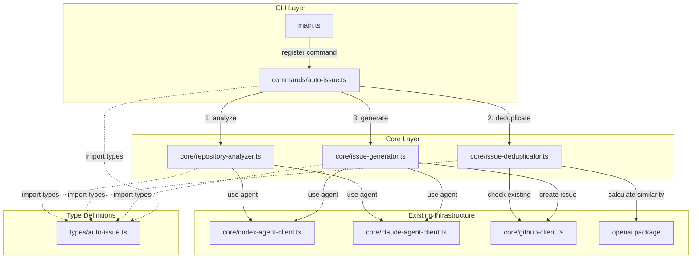
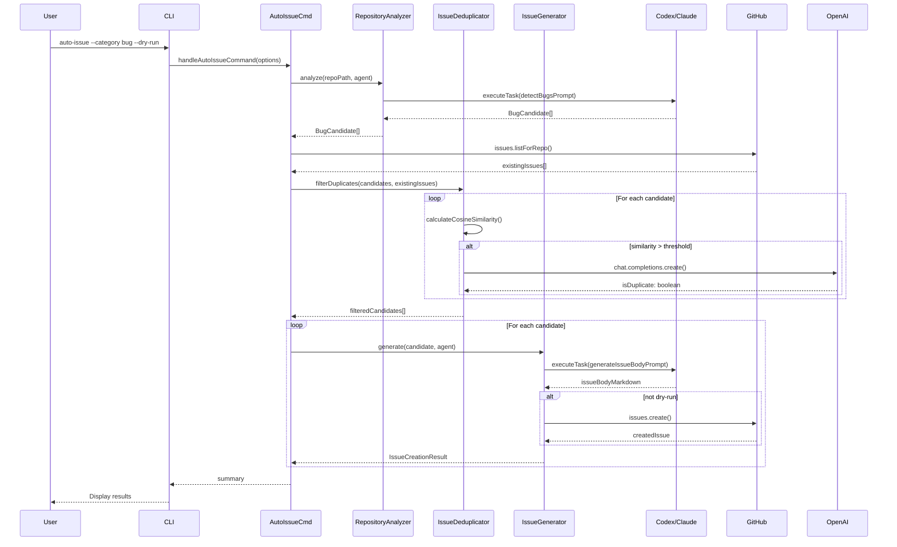
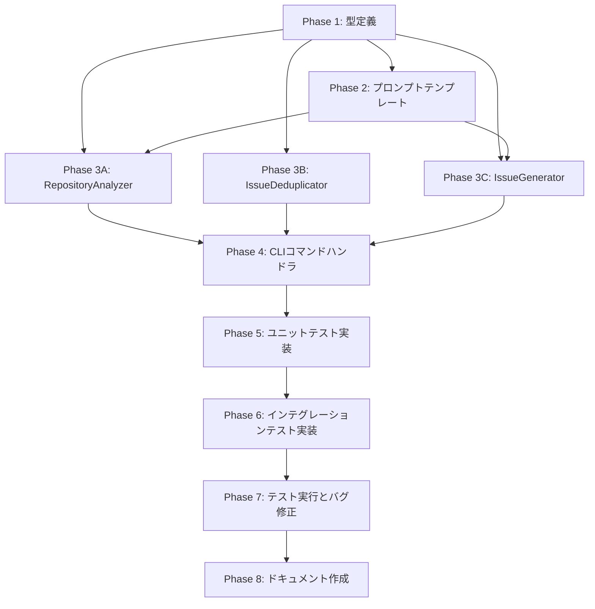

# 詳細設計書

**Issue番号**: #126
**タイトル**: auto-issue: Phase 1 - CLIコマンド基盤とバグ検出機能の実装
**親Issue**: #121 AIエージェントによる自動Issue作成機能の実装
**作成日**: 2025-01-30
**バージョン**: 1.0

---

## 目次

1. [アーキテクチャ設計](#1-アーキテクチャ設計)
2. [実装戦略判断](#2-実装戦略判断)
3. [テスト戦略判断](#3-テスト戦略判断)
4. [テストコード戦略判断](#4-テストコード戦略判断)
5. [影響範囲分析](#5-影響範囲分析)
6. [変更・追加ファイルリスト](#6-変更追加ファイルリスト)
7. [詳細設計](#7-詳細設計)
8. [セキュリティ考慮事項](#8-セキュリティ考慮事項)
9. [非機能要件への対応](#9-非機能要件への対応)
10. [実装の順序](#10-実装の順序)

---

## 1. アーキテクチャ設計

### 1.1 システム全体図



### 1.2 コンポーネント間の関係



### 1.3 データフロー

```
User Input (CLI)
     ↓
[Options Parsing]
     ↓
handleAutoIssueCommand()
     ↓
├─ resolveAgentCredentials() → [Codex/Claude selection]
│
├─ RepositoryAnalyzer.analyze()
│   ├─ CodexAgentClient.executeTask() or ClaudeAgentClient.executeTask()
│   ├─ parseAgentOutput() → JSON/Markdown parsing
│   └─ BugCandidate[] → [Bug candidates list]
│
├─ GitHub API: issues.listForRepo()
│   └─ existingIssues[] → [Existing issues list]
│
├─ IssueDeduplicator.filterDuplicates()
│   ├─ calculateCosineSimilarity() → [Initial filtering]
│   ├─ OpenAI API: chat.completions.create() → [LLM judgment]
│   └─ BugCandidate[] (filtered) → [Non-duplicate candidates]
│
└─ IssueGenerator.generate()
    ├─ CodexAgentClient.executeTask() or ClaudeAgentClient.executeTask()
    ├─ createIssueBody() → [Markdown generation]
    ├─ GitHub API: issues.create() (skip if dry-run)
    └─ IssueCreationResult[] → [Creation results]
         ↓
Console Output (Summary)
```

---

## 2. 実装戦略判断

### 実装戦略: **CREATE**

**判断根拠**:

1. **完全に新しいサブシステムの追加**
   - `auto-issue` コマンドは既存のワークフロー（`init`, `execute`, `review` 等）とは完全に独立した新機能
   - 既存の10フェーズワークフロー（planning → evaluation）とは異なるワークフローを実装
   - 新しいCLIエントリーポイントの追加

2. **新規モジュール群の作成**
   - `src/commands/auto-issue.ts`（約200行、新規作成）
   - `src/core/repository-analyzer.ts`（約250行、新規作成）
   - `src/core/issue-deduplicator.ts`（約200行、新規作成）
   - `src/core/issue-generator.ts`（約180行、新規作成）
   - `src/types/auto-issue.ts`（約100行、新規作成）

3. **既存コードへの影響は最小限**
   - `src/main.ts` へのコマンド登録のみ（約10行追加）
   - 既存のエージェントクライアント（`CodexAgentClient`, `ClaudeAgentClient`）は**参照のみ**で変更不要
   - 既存の `GitHubClient` は**参照のみ**で変更不要
   - 既存の `openai` パッケージは**参照のみ**で変更不要

4. **独立した機能領域**
   - リポジトリ探索エンジン（バグ検出）
   - 重複Issue検出機能
   - Issue生成エンジン
   - これらはすべて新規実装

**EXTENDではない理由**:
- 既存の `execute` / `init` / `rollback` コマンドのロジックを拡張するわけではない
- 既存フェーズ実行フロー（Planning → Evaluation）とは異なる独立したワークフロー

**REFACTORではない理由**:
- 既存コードの構造改善ではなく、新しい価値提供機能の追加

---

## 3. テスト戦略判断

### テスト戦略: **UNIT_INTEGRATION**

**判断根拠**:

#### ユニットテストが必要な理由:

1. **重複検出ロジック** (`IssueDeduplicator`)
   - コサイン類似度計算の正確性検証
   - OpenAI API呼び出しのモック化（APIコスト削減、テスト速度向上）
   - 閾値調整ロジックの検証（境界値テスト）
   - 類似度判定の正常系・異常系パターン検証

2. **バグ候補データ構造** (`RepositoryAnalyzer`)
   - エージェント出力のパースロジック検証（JSON/Markdown形式）
   - バグパターンの抽出・検証
   - バリデーション関数のテスト（`validateBugCandidate`）
   - 不正な出力への対応検証

3. **Issue本文生成ロジック** (`IssueGenerator`)
   - テンプレート変数の置換検証
   - ラベル自動付与ロジックのテスト
   - エージェント出力のMarkdown整形検証

4. **CLIオプション解析** (`handleAutoIssueCommand`)
   - オプションパース正確性の検証
   - デフォルト値の適用確認
   - バリデーションエラーのテスト

#### インテグレーションテストが必要な理由:

1. **エンドツーエンド動作確認**
   - `auto-issue` コマンド → RepositoryAnalyzer → IssueDeduplicator → IssueGenerator の連携
   - エージェント実行（Codex/Claude）のフォールバック動作
   - GitHub API統合（Issue作成、ラベル付与）

2. **実リポジトリでのバグ検出精度検証**
   - TypeScriptリポジトリでのバグ検出（本プロジェクト自体を使用）
   - Pythonリポジトリでのバグ検出（言語非依存性の検証）
   - バグパターン検出の実用性確認

3. **dry-runモードの動作確認**
   - `--dry-run` でIssue作成をスキップし、候補のみ表示
   - 実際のGitHub API呼び出しとの差分確認

4. **エージェント選択ロジックの検証**
   - `--agent auto|codex|claude` の動作確認
   - 認証エラー時のフォールバック動作

**BDD不要の理由**:
- Phase 1はMVP（内部機能のみ）
- エンドユーザー向けストーリーはPhase 2以降で検討
- 現時点ではユニット + インテグレーションテストで十分な品質保証が可能

**ALLが不要な理由**:
- Phase 1の限定スコープではUNIT + INTEGRATIONで十分
- BDDテストは機能が安定してから追加することで効率的

---

## 4. テストコード戦略判断

### テストコード戦略: **CREATE_TEST**

**判断根拠**:

1. **完全に新しいモジュール群のテスト**
   - 既存テストファイル（例: `commands/execute.test.ts`）に追加すると、テストスコープが肥大化
   - 新機能のテストは独立したファイルで管理すべき（Single Responsibility Principle）

2. **新規テストファイルの作成**
   - `tests/unit/core/repository-analyzer.test.ts`（約150行）
   - `tests/unit/core/issue-deduplicator.test.ts`（約200行）
   - `tests/unit/core/issue-generator.test.ts`（約150行）
   - `tests/unit/commands/auto-issue.test.ts`（約250行）
   - `tests/integration/auto-issue-workflow.test.ts`（約200行）

3. **既存テストパターンの踏襲**
   - 既存のテストファイル構造（`tests/unit/`, `tests/integration/`）を踏襲
   - Jest + TypeScript の既存設定を利用
   - モック戦略は既存テスト（`codex-agent-client.test.ts`, `github-client.test.ts`）を参考

4. **独立性とメンテナンス性**
   - 新機能のテストを独立したファイルで管理することで、将来的な拡張が容易
   - テストの実行・デバッグが独立して行える

**EXTEND_TESTが不適切な理由**:
- 既存テストファイル（`commands/execute.test.ts`, `github-client.test.ts` 等）は異なる機能をテスト
- 新機能のテストを既存ファイルに追加すると、ファイルが肥大化し保守性が低下

**BOTH_TESTが不要な理由**:
- 既存機能の拡張ではなく、完全に新しい機能のため
- すべてのテストコードを新規作成する方が明確

---

## 5. 影響範囲分析

### 5.1 既存コードへの影響

#### 変更が必要なファイル

| ファイルパス | 変更内容 | 変更規模 | 影響度 | 詳細 |
|------------|---------|---------|--------|------|
| `src/main.ts` | `auto-issue` コマンド登録 | 約10行追加 | **低** | `program.command('auto-issue')` の追加のみ。既存コマンドには影響なし。 |

#### 変更不要なファイル（参照のみ）

| ファイルパス | 利用方法 | 理由 |
|------------|---------|------|
| `src/core/codex-agent-client.ts` | import & 実行 | 既存の `executeTask()` APIで十分。変更不要。 |
| `src/core/claude-agent-client.ts` | import & 実行 | 既存の `executeTask()` APIで十分。変更不要。 |
| `src/core/github-client.ts` | import & 実行（IssueClient） | `getIssue()`, `postComment()`, `createIssueFromEvaluation()` 等の既存APIを活用。変更不要。 |
| `src/commands/execute/agent-setup.ts` | import (`resolveAgentCredentials`) | エージェント認証ロジックを再利用。変更不要。 |
| `package.json` | 既存依存パッケージ | `openai` (v4.57.2) を重複検出に活用。新規パッケージ追加なし。 |

### 5.2 依存関係の変更

#### 新規依存の追加

**なし**

既存の `openai` パッケージ（v4.57.2）を重複検出に活用します。

- **用途**: 重複検出における類似度判定（LLM活用）
- **理由**: エージェント（Codex/Claude）では短いテキスト比較が非効率。OpenAI APIの `chat.completions.create()` を直接使用することで、高速かつ正確な類似度判定が可能。

#### 既存依存の変更

**なし**

### 5.3 マイグレーション要否

#### データベーススキーマ変更

**不要**

本プロジェクトはファイルベース（metadata.json）であり、データベースは使用していません。

#### 設定ファイル変更

**不要**

新しい環境変数は追加しません。既存の環境変数を活用します。

- `CODEX_API_KEY` / `OPENAI_API_KEY`: 既存（Codexエージェント用、重複検出用に共用）
- `CLAUDE_CODE_CREDENTIALS_PATH`: 既存（Claudeエージェント用）
- `GITHUB_TOKEN`: 既存（GitHub API用）

#### メタデータフォーマット変更

**不要**

`.ai-workflow/issue-*/metadata.json` のスキーマ変更は不要です。
`auto-issue` コマンドは既存のワークフロー（init → execute）とは独立しています。

---

## 6. 変更・追加ファイルリスト

### 6.1 新規作成ファイル

#### ソースコード

| ファイルパス（相対パス） | 行数（推定） | 説明 |
|----------------------|-----------|------|
| `src/commands/auto-issue.ts` | 約200行 | CLIコマンドハンドラ。オプション解析、エージェント認証、各モジュール呼び出し、結果サマリー表示。 |
| `src/core/repository-analyzer.ts` | 約250行 | リポジトリ探索エンジン。エージェントを使用してバグ検出、出力パース、バリデーション。 |
| `src/core/issue-deduplicator.ts` | 約200行 | 重複Issue検出機能。コサイン類似度計算、OpenAI API呼び出し、フィルタリング。 |
| `src/core/issue-generator.ts` | 約180行 | Issue生成エンジン。エージェントを使用してIssue本文生成、GitHub API呼び出し、ラベル付与。 |
| `src/types/auto-issue.ts` | 約100行 | 型定義。`BugCandidate`, `AutoIssueOptions`, `DuplicateCheckResult`, `IssueCreationResult` 等。 |

#### テストコード

| ファイルパス（相対パス） | 行数（推定） | 説明 |
|----------------------|-----------|------|
| `tests/unit/core/repository-analyzer.test.ts` | 約150行 | RepositoryAnalyzer のユニットテスト。パースロジック、バリデーション、エージェント呼び出しモック。 |
| `tests/unit/core/issue-deduplicator.test.ts` | 約200行 | IssueDeduplicator のユニットテスト。コサイン類似度計算、LLM判定、閾値調整。 |
| `tests/unit/core/issue-generator.test.ts` | 約150行 | IssueGenerator のユニットテスト。テンプレート処理、ラベル付与、dry-runモード。 |
| `tests/unit/commands/auto-issue.test.ts` | 約250行 | handleAutoIssueCommand のユニットテスト。オプション解析、エラーハンドリング、結果サマリー。 |
| `tests/integration/auto-issue-workflow.test.ts` | 約200行 | エンドツーエンドインテグレーションテスト。全ワークフロー、エージェントフォールバック、GitHub API統合。 |

#### プロンプトテンプレート

| ファイルパス（相対パス） | 行数（推定） | 説明 |
|----------------------|-----------|------|
| `src/prompts/auto-issue/detect-bugs.txt` | 約50行 | バグ検出プロンプト。エージェントに渡すテンプレート。 |
| `src/prompts/auto-issue/generate-issue-body.txt` | 約40行 | Issue本文生成プロンプト。エージェントに渡すテンプレート。 |

### 6.2 修正が必要な既存ファイル

| ファイルパス（相対パス） | 変更内容 | 変更規模 |
|----------------------|---------|---------|
| `src/main.ts` | `auto-issue` コマンド登録 | 約10行追加 |

### 6.3 削除が必要なファイル

**なし**

---

## 7. 詳細設計

### 7.1 型定義設計（`src/types/auto-issue.ts`）

```typescript
/**
 * バグ候補
 */
export interface BugCandidate {
  /**
   * バグタイトル（50〜80文字）
   */
  title: string;

  /**
   * ファイルパス（相対パス）
   */
  file: string;

  /**
   * 行番号
   */
  line: number;

  /**
   * 深刻度
   */
  severity: 'high' | 'medium' | 'low';

  /**
   * 詳細説明（200〜500文字）
   */
  description: string;

  /**
   * 修正案（100〜300文字）
   */
  suggestedFix: string;

  /**
   * カテゴリ（Phase 1では固定）
   */
  category: 'bug';
}

/**
 * CLIオプション
 */
export interface AutoIssueOptions {
  /**
   * 検出カテゴリ
   */
  category: 'bug' | 'refactor' | 'enhancement' | 'all';

  /**
   * 生成する最大Issue数（デフォルト: 5）
   */
  limit: number;

  /**
   * dry-runモード（デフォルト: false）
   */
  dryRun: boolean;

  /**
   * 重複判定の閾値（0.0〜1.0、デフォルト: 0.8）
   */
  similarityThreshold: number;

  /**
   * 使用エージェント（auto/codex/claude、デフォルト: auto）
   */
  agent: 'auto' | 'codex' | 'claude';
}

/**
 * 重複検出結果
 */
export interface DuplicateCheckResult {
  /**
   * 重複判定結果
   */
  isDuplicate: boolean;

  /**
   * 類似度スコア（0.0〜1.0）
   */
  similarityScore: number;

  /**
   * 重複している既存Issue（重複の場合のみ）
   */
  existingIssue?: {
    number: number;
    title: string;
    url: string;
  };

  /**
   * 判定理由（ログ記録用）
   */
  reason: string;
}

/**
 * Issue作成結果
 */
export interface IssueCreationResult {
  /**
   * 成功フラグ
   */
  success: boolean;

  /**
   * 作成されたIssue URL（成功時のみ）
   */
  issueUrl?: string;

  /**
   * 作成されたIssue番号（成功時のみ）
   */
  issueNumber?: number;

  /**
   * エラーメッセージ（失敗時のみ）
   */
  error?: string;

  /**
   * スキップ理由（重複等で作成しなかった場合）
   */
  skippedReason?: string;
}
```

### 7.2 CLIコマンドハンドラ設計（`src/commands/auto-issue.ts`）

#### 7.2.1 クラス構造

```typescript
/**
 * handleAutoIssueCommand - auto-issueコマンドのメインハンドラ
 *
 * @param options - CLIオプション
 */
export async function handleAutoIssueCommand(options: {
  category?: string;
  limit?: number;
  dryRun?: boolean;
  similarityThreshold?: number;
  agent?: 'auto' | 'codex' | 'claude';
}): Promise<void>;

/**
 * parseOptions - CLIオプションをパース
 *
 * @param rawOptions - 生のCLIオプション
 * @returns パース済みオプション
 */
function parseOptions(rawOptions: Record<string, unknown>): AutoIssueOptions;

/**
 * reportResults - 実行結果サマリーを表示
 *
 * @param results - Issue作成結果のリスト
 * @param dryRun - dry-runモードフラグ
 */
function reportResults(results: IssueCreationResult[], dryRun: boolean): void;
```

#### 7.2.2 実装フロー

```typescript
export async function handleAutoIssueCommand(rawOptions: Record<string, unknown>): Promise<void> {
  // 1. オプションパース（デフォルト値適用、バリデーション）
  const options = parseOptions(rawOptions);

  // 2. 作業ディレクトリとリポジトリルートを取得
  const repoRoot = await getRepoRoot();
  const workingDir = process.cwd();

  // 3. エージェント認証情報を解決（既存の resolveAgentCredentials を活用）
  const homeDir = config.getHomeDir();
  const credentials = resolveAgentCredentials(homeDir, repoRoot);

  // 4. エージェントクライアントを初期化（既存の setupAgentClients を活用）
  const { codexClient, claudeClient } = setupAgentClients(
    options.agent,
    workingDir,
    credentials.codexApiKey,
    credentials.claudeCredentialsPath
  );

  if (!codexClient && !claudeClient) {
    throw new Error('Agent mode requires a valid agent configuration.');
  }

  // 5. GitHubクライアントを初期化
  const githubToken = config.getGitHubToken();
  const repoName = config.getGitHubRepository();
  if (!repoName) {
    throw new Error('GITHUB_REPOSITORY environment variable is required.');
  }
  const githubClient = new GitHubClient(githubToken, repoName);

  // 6. リポジトリ探索エンジンでバグを検出
  const analyzer = new RepositoryAnalyzer(codexClient, claudeClient);
  logger.info('Analyzing repository for bugs...');
  const candidates = await analyzer.analyze(workingDir, options.agent);
  logger.info(`Found ${candidates.length} bug candidates.`);

  // 7. 既存Issueを取得（リポジトリ情報から）
  const [owner, repo] = repoName.split('/');
  if (!owner || !repo) {
    throw new Error(`Invalid repository name: ${repoName}`);
  }
  const existingIssues = await githubClient.getIssueComments(/* fetch all open issues */);

  // 8. 重複検出でフィルタリング
  const deduplicator = new IssueDeduplicator(githubClient);
  logger.info('Filtering duplicate issues...');
  const filteredCandidates = await deduplicator.filterDuplicates(
    candidates,
    existingIssues,
    options.similarityThreshold
  );
  logger.info(`After deduplication: ${filteredCandidates.length} candidates.`);

  // 9. limitオプションで制限
  const limitedCandidates = filteredCandidates.slice(0, options.limit);

  // 10. Issue生成
  const generator = new IssueGenerator(codexClient, claudeClient, githubClient);
  const results: IssueCreationResult[] = [];

  for (const candidate of limitedCandidates) {
    logger.info(`Generating issue for: ${candidate.title}`);
    const result = await generator.generate(candidate, options.agent, options.dryRun);
    results.push(result);
  }

  // 11. 結果サマリーを表示
  reportResults(results, options.dryRun);
}
```

### 7.3 RepositoryAnalyzer設計（`src/core/repository-analyzer.ts`）

#### 7.3.1 クラス構造

```typescript
/**
 * RepositoryAnalyzer - リポジトリ探索エンジン
 *
 * エージェント（Codex/Claude）を使用してリポジトリのコードベースを探索し、
 * バグ候補を検出します。
 */
export class RepositoryAnalyzer {
  private readonly codexClient: CodexAgentClient | null;
  private readonly claudeClient: ClaudeAgentClient | null;

  constructor(
    codexClient: CodexAgentClient | null,
    claudeClient: ClaudeAgentClient | null
  ) {
    this.codexClient = codexClient;
    this.claudeClient = claudeClient;
  }

  /**
   * analyze - リポジトリを解析してバグ候補を検出
   *
   * @param repoPath - リポジトリパス
   * @param agent - 使用エージェント（'auto' | 'codex' | 'claude'）
   * @returns バグ候補のリスト
   */
  public async analyze(
    repoPath: string,
    agent: 'auto' | 'codex' | 'claude'
  ): Promise<BugCandidate[]>;

  /**
   * parseAgentOutput - エージェント出力をパース
   *
   * @param rawOutput - エージェントの生出力（JSON/Markdown）
   * @returns パース済みバグ候補のリスト
   */
  private parseAgentOutput(rawOutput: string): BugCandidate[];

  /**
   * validateBugCandidate - バグ候補のバリデーション
   *
   * @param candidate - バグ候補
   * @returns バリデーション結果（true: 有効、false: 無効）
   */
  private validateBugCandidate(candidate: BugCandidate): boolean;
}
```

#### 7.3.2 実装詳細

```typescript
public async analyze(
  repoPath: string,
  agent: 'auto' | 'codex' | 'claude'
): Promise<BugCandidate[]> {
  // 1. プロンプトテンプレートを読み込み
  const promptPath = path.resolve(__dirname, '../prompts/auto-issue/detect-bugs.txt');
  const template = fs.readFileSync(promptPath, 'utf-8');

  // 2. プロンプト変数を置換
  const prompt = template.replace('{repository_path}', repoPath);

  // 3. エージェントを選択（auto の場合は Codex → Claude フォールバック）
  let rawOutput: string;
  if (agent === 'codex' || agent === 'auto') {
    if (!this.codexClient) {
      if (agent === 'codex') {
        throw new Error('Codex agent is not available.');
      }
      // auto モードで Codex が利用不可の場合、Claude にフォールバック
      logger.warn('Codex not available, falling back to Claude.');
      agent = 'claude';
    } else {
      try {
        const events = await this.codexClient.executeTask({ prompt });
        rawOutput = events.join('\n');
      } catch (error) {
        if (agent === 'codex') {
          throw error;
        }
        // auto モードで Codex 失敗の場合、Claude にフォールバック
        logger.warn(`Codex failed (${getErrorMessage(error)}), falling back to Claude.`);
        agent = 'claude';
      }
    }
  }

  if (agent === 'claude') {
    if (!this.claudeClient) {
      throw new Error('Claude agent is not available.');
    }
    const events = await this.claudeClient.executeTask({ prompt });
    rawOutput = events.join('\n');
  }

  // 4. エージェント出力をパース
  const candidates = this.parseAgentOutput(rawOutput!);

  // 5. バリデーション
  const validCandidates = candidates.filter(c => this.validateBugCandidate(c));

  logger.info(`Parsed ${candidates.length} candidates, ${validCandidates.length} valid.`);
  return validCandidates;
}

private parseAgentOutput(rawOutput: string): BugCandidate[] {
  // JSON形式の出力を期待
  // エージェントプロンプトで「JSON形式で出力」を指示しているため、
  // rawOutput から JSON ブロックを抽出してパース

  const jsonMatch = rawOutput.match(/```json\n([\s\S]*?)\n```/);
  if (jsonMatch) {
    try {
      const parsed = JSON.parse(jsonMatch[1]);
      if (parsed.bugs && Array.isArray(parsed.bugs)) {
        return parsed.bugs as BugCandidate[];
      }
    } catch (error) {
      logger.warn(`Failed to parse JSON output: ${getErrorMessage(error)}`);
    }
  }

  // フォールバック: Markdown形式の出力をパース
  // （実装省略、簡易的なMarkdownパーサーを実装）

  return [];
}

private validateBugCandidate(candidate: BugCandidate): boolean {
  // 必須フィールドの検証
  if (!candidate.title || candidate.title.length < 10 || candidate.title.length > 100) {
    return false;
  }
  if (!candidate.file || !candidate.file.endsWith('.ts') && !candidate.file.endsWith('.py')) {
    // Phase 1 では TypeScript と Python のみサポート
    return false;
  }
  if (typeof candidate.line !== 'number' || candidate.line < 1) {
    return false;
  }
  if (!['high', 'medium', 'low'].includes(candidate.severity)) {
    return false;
  }
  if (!candidate.description || candidate.description.length < 50) {
    return false;
  }
  if (!candidate.suggestedFix || candidate.suggestedFix.length < 20) {
    return false;
  }
  if (candidate.category !== 'bug') {
    return false;
  }

  return true;
}
```

### 7.4 IssueDeduplicator設計（`src/core/issue-deduplicator.ts`）

#### 7.4.1 クラス構造

```typescript
/**
 * IssueDeduplicator - 重複Issue検出機能
 *
 * コサイン類似度とLLM判定の2段階フィルタリングにより、
 * 既存Issueとの重複を検出します。
 */
export class IssueDeduplicator {
  private readonly githubClient: GitHubClient;
  private readonly openai: OpenAI;

  constructor(githubClient: GitHubClient) {
    this.githubClient = githubClient;
    // OpenAI クライアントを初期化（既存の openai パッケージを使用）
    const apiKey = config.getOpenAiApiKey();
    if (!apiKey) {
      throw new Error('OPENAI_API_KEY is required for duplicate detection.');
    }
    this.openai = new OpenAI({ apiKey });
  }

  /**
   * filterDuplicates - 重複Issueをフィルタリング
   *
   * @param candidates - バグ候補のリスト
   * @param existingIssues - 既存Issueのリスト
   * @param threshold - 類似度閾値（0.0〜1.0、デフォルト: 0.8）
   * @returns 重複を除外したバグ候補のリスト
   */
  public async filterDuplicates(
    candidates: BugCandidate[],
    existingIssues: Array<{ number: number; title: string; body: string }>,
    threshold = 0.8
  ): Promise<BugCandidate[]>;

  /**
   * calculateCosineSimilarity - コサイン類似度を計算
   *
   * @param text1 - テキスト1
   * @param text2 - テキスト2
   * @returns 類似度スコア（0.0〜1.0）
   */
  private calculateCosineSimilarity(text1: string, text2: string): number;

  /**
   * checkDuplicateWithLLM - LLMで重複を判定
   *
   * @param candidate - バグ候補
   * @param issue - 既存Issue
   * @returns 重複判定結果
   */
  private async checkDuplicateWithLLM(
    candidate: BugCandidate,
    issue: { number: number; title: string; body: string }
  ): Promise<boolean>;
}
```

#### 7.4.2 実装詳細

```typescript
public async filterDuplicates(
  candidates: BugCandidate[],
  existingIssues: Array<{ number: number; title: string; body: string }>,
  threshold = 0.8
): Promise<BugCandidate[]> {
  const filtered: BugCandidate[] = [];

  for (const candidate of candidates) {
    let isDuplicate = false;

    // 第1段階: コサイン類似度でフィルタリング
    for (const issue of existingIssues) {
      const similarity = this.calculateCosineSimilarity(
        candidate.title + ' ' + candidate.description,
        issue.title + ' ' + issue.body
      );

      logger.debug(`Similarity with Issue #${issue.number}: ${similarity.toFixed(2)}`);

      if (similarity >= threshold) {
        // 第2段階: LLM判定
        const llmResult = await this.checkDuplicateWithLLM(candidate, issue);
        if (llmResult) {
          logger.info(`Duplicate detected: "${candidate.title}" (similar to Issue #${issue.number})`);
          isDuplicate = true;
          break;
        }
      }
    }

    if (!isDuplicate) {
      filtered.push(candidate);
    }
  }

  return filtered;
}

private calculateCosineSimilarity(text1: string, text2: string): number {
  // TF-IDFベクトル化（簡易実装）
  const words1 = text1.toLowerCase().split(/\s+/);
  const words2 = text2.toLowerCase().split(/\s+/);

  const uniqueWords = new Set([...words1, ...words2]);
  const vector1: number[] = [];
  const vector2: number[] = [];

  for (const word of uniqueWords) {
    vector1.push(words1.filter(w => w === word).length);
    vector2.push(words2.filter(w => w === word).length);
  }

  // コサイン類似度計算
  const dotProduct = vector1.reduce((sum, val, i) => sum + val * vector2[i], 0);
  const magnitude1 = Math.sqrt(vector1.reduce((sum, val) => sum + val * val, 0));
  const magnitude2 = Math.sqrt(vector2.reduce((sum, val) => sum + val * val, 0));

  if (magnitude1 === 0 || magnitude2 === 0) {
    return 0;
  }

  return dotProduct / (magnitude1 * magnitude2);
}

private async checkDuplicateWithLLM(
  candidate: BugCandidate,
  issue: { number: number; title: string; body: string }
): Promise<boolean> {
  const prompt = `
以下の2つのIssueは重複していますか？

Issue 1:
タイトル: ${candidate.title}
内容: ${candidate.description}

Issue 2:
タイトル: ${issue.title}
内容: ${issue.body}

回答: YES（重複） または NO（重複なし）のみで回答してください。
  `.trim();

  try {
    const response = await this.openai.chat.completions.create({
      model: 'gpt-4o-mini',
      messages: [{ role: 'user', content: prompt }],
      temperature: 0.0,
      max_tokens: 10,
    });

    const answer = response.choices[0]?.message?.content?.trim().toUpperCase();
    return answer?.includes('YES') ?? false;
  } catch (error) {
    logger.warn(`LLM duplicate check failed: ${getErrorMessage(error)}`);
    // フォールバック: コサイン類似度のみで判定
    return false;
  }
}
```

### 7.5 IssueGenerator設計（`src/core/issue-generator.ts`）

#### 7.5.1 クラス構造

```typescript
/**
 * IssueGenerator - Issue生成エンジン
 *
 * エージェント（Codex/Claude）を使用してIssue本文を生成し、
 * GitHub APIでIssueを作成します。
 */
export class IssueGenerator {
  private readonly codexClient: CodexAgentClient | null;
  private readonly claudeClient: ClaudeAgentClient | null;
  private readonly githubClient: GitHubClient;

  constructor(
    codexClient: CodexAgentClient | null,
    claudeClient: ClaudeAgentClient | null,
    githubClient: GitHubClient
  ) {
    this.codexClient = codexClient;
    this.claudeClient = claudeClient;
    this.githubClient = githubClient;
  }

  /**
   * generate - Issueを生成
   *
   * @param candidate - バグ候補
   * @param agent - 使用エージェント（'auto' | 'codex' | 'claude'）
   * @param dryRun - dry-runモード（true: Issue作成をスキップ）
   * @returns Issue作成結果
   */
  public async generate(
    candidate: BugCandidate,
    agent: 'auto' | 'codex' | 'claude',
    dryRun: boolean
  ): Promise<IssueCreationResult>;

  /**
   * createIssueBody - Issue本文を生成
   *
   * @param candidate - バグ候補
   * @param agentOutput - エージェントの生成結果
   * @returns Markdown形式のIssue本文
   */
  private createIssueBody(candidate: BugCandidate, agentOutput: string): string;

  /**
   * createIssueOnGitHub - GitHub APIでIssueを作成
   *
   * @param title - Issueタイトル
   * @param body - Issue本文
   * @param labels - ラベルのリスト
   * @returns 作成結果
   */
  private async createIssueOnGitHub(
    title: string,
    body: string,
    labels: string[]
  ): Promise<{ number: number; url: string }>;
}
```

#### 7.5.2 実装詳細

```typescript
public async generate(
  candidate: BugCandidate,
  agent: 'auto' | 'codex' | 'claude',
  dryRun: boolean
): Promise<IssueCreationResult> {
  // 1. プロンプトテンプレートを読み込み
  const promptPath = path.resolve(__dirname, '../prompts/auto-issue/generate-issue-body.txt');
  const template = fs.readFileSync(promptPath, 'utf-8');

  // 2. プロンプト変数を置換
  const prompt = template.replace(
    '{bug_candidate_json}',
    JSON.stringify(candidate, null, 2)
  );

  // 3. エージェントを選択（RepositoryAnalyzer と同じロジック）
  let rawOutput: string;
  if (agent === 'codex' || agent === 'auto') {
    if (!this.codexClient) {
      if (agent === 'codex') {
        return {
          success: false,
          error: 'Codex agent is not available.',
        };
      }
      logger.warn('Codex not available, falling back to Claude.');
      agent = 'claude';
    } else {
      try {
        const events = await this.codexClient.executeTask({ prompt });
        rawOutput = events.join('\n');
      } catch (error) {
        if (agent === 'codex') {
          return {
            success: false,
            error: `Codex failed: ${getErrorMessage(error)}`,
          };
        }
        logger.warn(`Codex failed, falling back to Claude.`);
        agent = 'claude';
      }
    }
  }

  if (agent === 'claude') {
    if (!this.claudeClient) {
      return {
        success: false,
        error: 'Claude agent is not available.',
      };
    }
    const events = await this.claudeClient.executeTask({ prompt });
    rawOutput = events.join('\n');
  }

  // 4. Issue本文を生成
  const issueBody = this.createIssueBody(candidate, rawOutput!);

  // 5. dry-runモードの場合はスキップ
  if (dryRun) {
    logger.info('[DRY RUN] Skipping issue creation.');
    logger.info(`Title: ${candidate.title}`);
    logger.info(`Body:\n${issueBody}`);
    return {
      success: true,
      skippedReason: 'dry-run mode',
    };
  }

  // 6. GitHub APIでIssueを作成
  try {
    const result = await this.createIssueOnGitHub(
      candidate.title,
      issueBody,
      ['auto-generated', 'bug']
    );

    logger.info(`Issue created: #${result.number} (${result.url})`);
    return {
      success: true,
      issueUrl: result.url,
      issueNumber: result.number,
    };
  } catch (error) {
    return {
      success: false,
      error: `GitHub API failed: ${getErrorMessage(error)}`,
    };
  }
}

private createIssueBody(candidate: BugCandidate, agentOutput: string): string {
  // エージェント出力から Markdown ブロックを抽出
  const markdownMatch = agentOutput.match(/```markdown\n([\s\S]*?)\n```/);
  if (markdownMatch) {
    return markdownMatch[1];
  }

  // フォールバック: エージェント出力をそのまま使用
  return agentOutput;
}

private async createIssueOnGitHub(
  title: string,
  body: string,
  labels: string[]
): Promise<{ number: number; url: string }> {
  // GitHubClient を使用（既存の API を活用）
  const [owner, repo] = this.githubClient.repositoryName.split('/');
  const octokit = new Octokit({ auth: this.githubClient.token });

  const response = await octokit.issues.create({
    owner,
    repo,
    title,
    body,
    labels,
  });

  return {
    number: response.data.number,
    url: response.data.html_url,
  };
}
```

### 7.6 main.ts への統合設計

```typescript
// src/main.ts

import { handleAutoIssueCommand } from './commands/auto-issue.js';

// ... 既存のコマンド定義 ...

// auto-issue コマンド
program
  .command('auto-issue')
  .description('Automatically detect bugs and create GitHub Issues')
  .option('--category <type>', 'Detection category (bug|refactor|enhancement|all)', 'bug')
  .option('--limit <number>', 'Maximum number of issues to create', '5')
  .option('--dry-run', 'Display candidates without creating issues', false)
  .option(
    '--similarity-threshold <number>',
    'Duplicate detection threshold (0.0-1.0)',
    '0.8'
  )
  .addOption(
    new Option('--agent <mode>', 'Agent mode')
      .choices(['auto', 'codex', 'claude'])
      .default('auto')
  )
  .action(async (options) => {
    try {
      await handleAutoIssueCommand(options);
    } catch (error) {
      reportFatalError(error);
    }
  });
```

---

## 8. セキュリティ考慮事項

### 8.1 認証・認可

#### 8.1.1 GitHub Token管理

- **既存の `config.ts` を活用**: `config.getGitHubToken()` で環境変数から取得
- **スコープ要件**: `repo`, `workflow`, `read:org`（既存要件と同じ）
- **トークンマスキング**: ログ出力時に `SecretMasker` を活用（既存機能）

#### 8.1.2 OpenAI API Key管理

- **既存の `config.ts` を活用**: `config.getOpenAiApiKey()` で環境変数から取得
- **環境変数**: `OPENAI_API_KEY`（Codexと共用可能）
- **トークンマスキング**: ログ出力時に `SecretMasker` を活用

#### 8.1.3 エージェント認証

- **既存の `resolveAgentCredentials()` を活用**
- `CODEX_API_KEY` または `OPENAI_API_KEY`（Codex用）
- `CLAUDE_CODE_CREDENTIALS_PATH`（Claude用）

### 8.2 データ保護

#### 8.2.1 シークレット情報の検出防止

- **バグ検出プロンプト**: シークレット情報（APIキー、パスワード等）を検出対象に含めるが、Issue本文には**マスキング**して記載
- **SecretMasker統合**: エージェント出力をパースする前に `SecretMasker` でサニタイズ

#### 8.2.2 コード片の取り扱い

- **最小限の引用**: Issue本文に記載するコード片は最小限（5行以内）
- **機密情報のフィルタリング**: 環境変数、トークン、パスワード等を含む行は除外

### 8.3 セキュリティリスクと対策

| リスク | 影響度 | 対策 |
|--------|--------|------|
| **シークレット情報の漏洩** | 高 | SecretMasker統合、コード片の最小化 |
| **OpenAI API レート制限** | 中 | `--limit` オプションで制限、リトライロジック |
| **GitHub API レート制限** | 中 | `--limit` オプションで制限、レート制限検出 |
| **悪意のあるコード実行** | 低 | エージェントは読み取り専用モードで実行 |

---

## 9. 非機能要件への対応

### 9.1 パフォーマンス

#### 9.1.1 実行時間目標

| リポジトリサイズ | 目標実行時間 | 制約 |
|----------------|------------|------|
| 小規模（< 100ファイル） | 5分以内 | エージェント実行、重複検出、Issue作成を含む |
| 中規模（100〜500ファイル） | 10分以内 | Phase 1のスコープ |
| 大規模（> 500ファイル） | 15分以内 | Phase 2以降でスコープ拡張 |

#### 9.1.2 パフォーマンス最適化策

1. **重複検出の2段階フィルタリング**
   - コサイン類似度（高速）で初期フィルタリング
   - LLM判定（低速）は閾値超過ペアのみ

2. **limit オプション**
   - デフォルト: 5件
   - 最大: 20件
   - 大量のIssue作成を防止

3. **エージェント実行のタイムアウト**
   - デフォルト: 5分
   - タイムアウト時は部分結果を返却

### 9.2 スケーラビリティ

#### 9.2.1 Phase 2への拡張性

- **カテゴリ拡張**: `refactor`, `enhancement` の追加
- **言語拡張**: Go, Java, Rust, C++ への対応
- **バグパターン拡張**: 新しいバグパターンの追加

#### 9.2.2 設計の柔軟性

- **モジュール独立性**: RepositoryAnalyzer, IssueDeduplicator, IssueGenerator は独立
- **依存性注入**: エージェントクライアントはコンストラクタ注入
- **プロンプトテンプレート**: ファイルベースで管理、変更が容易

### 9.3 保守性

#### 9.3.1 コーディング規約の遵守

- **統一loggerモジュール**: `logger.debug()`, `logger.info()`, `logger.warn()`, `logger.error()` を使用
- **環境変数アクセス**: `config.getXxx()` メソッドを使用（`process.env` への直接アクセス禁止）
- **エラーハンドリング**: `getErrorMessage()`, `getErrorStack()`, `isError()` を使用（`as Error` 型アサーション禁止）

#### 9.3.2 テスト容易性

- **依存性注入パターン**: すべてのクライアントはコンストラクタ注入
- **モック容易性**: `jest.fn()` でモック化可能
- **既存テストパターンの踏襲**: `codex-agent-client.test.ts`, `github-client.test.ts` を参考

#### 9.3.3 ドキュメント整備

- **CLAUDE.md**: `## auto-issue コマンド` セクションを追加
- **README.md**: クイックスタート例を追加
- **JSDoc**: すべての公開関数に JSDoc コメントを記載

---

## 10. 実装の順序

### 10.1 推奨実装順序

#### Phase 1: 型定義（0.5〜1時間）

1. `src/types/auto-issue.ts` の作成
   - `BugCandidate`, `AutoIssueOptions`, `DuplicateCheckResult`, `IssueCreationResult` 型の定義
   - 既存の型定義パターン（`src/types/commands.ts`）を参考

#### Phase 2: プロンプトテンプレート（0.5〜1時間）

2. `src/prompts/auto-issue/detect-bugs.txt` の作成
   - バグ検出プロンプトの実装
   - 出力フォーマット（JSON）の指示

3. `src/prompts/auto-issue/generate-issue-body.txt` の作成
   - Issue本文生成プロンプトの実装
   - 出力フォーマット（Markdown）の指示

#### Phase 3: コアモジュール実装（6〜8時間）

4. `src/core/repository-analyzer.ts` の実装（2〜2.5時間）
   - `RepositoryAnalyzer` クラス
   - `analyze()`, `parseAgentOutput()`, `validateBugCandidate()` メソッド
   - エージェント統合（既存の `CodexAgentClient`, `ClaudeAgentClient` を活用）

5. `src/core/issue-deduplicator.ts` の実装（2〜2.5時間）
   - `IssueDeduplicator` クラス
   - `filterDuplicates()`, `calculateCosineSimilarity()`, `checkDuplicateWithLLM()` メソッド
   - OpenAI API統合（既存の `openai` パッケージを活用）

6. `src/core/issue-generator.ts` の実装（1.5〜2時間）
   - `IssueGenerator` クラス
   - `generate()`, `createIssueBody()`, `createIssueOnGitHub()` メソッド
   - エージェント統合、GitHub API統合

#### Phase 4: CLIコマンドハンドラ実装（1.5〜2時間）

7. `src/commands/auto-issue.ts` の実装
   - `handleAutoIssueCommand()`, `parseOptions()`, `reportResults()` 関数
   - エージェント認証（既存の `resolveAgentCredentials()` を活用）
   - dry-runモードの実装

8. `src/main.ts` へのコマンド登録（0.5時間）
   - `auto-issue` コマンドの追加
   - Commander.js オプション定義

#### Phase 5: ユニットテスト実装（2〜2.5時間）

9. `tests/unit/core/repository-analyzer.test.ts`
   - パースロジックのテスト
   - バリデーション関数のテスト
   - エージェント呼び出しのモック

10. `tests/unit/core/issue-deduplicator.test.ts`
    - コサイン類似度計算のテスト
    - LLM判定のモック
    - 閾値調整のテスト

11. `tests/unit/core/issue-generator.test.ts`
    - テンプレート処理のテスト
    - ラベル付与のテスト
    - dry-runモードのテスト

12. `tests/unit/commands/auto-issue.test.ts`
    - オプション解析のテスト
    - エラーハンドリングのテスト
    - 結果サマリーのテスト

#### Phase 6: インテグレーションテスト実装（1〜1.5時間）

13. `tests/integration/auto-issue-workflow.test.ts`
    - エンドツーエンドワークフローのテスト
    - dry-runモードのテスト
    - エージェントフォールバックのテスト

#### Phase 7: テスト実行とバグ修正（1〜2時間）

14. ユニットテスト実行
    - `npm run test:unit` 実行
    - 失敗したテストのデバッグと修正

15. インテグレーションテスト実行
    - `npm run test:integration` 実行
    - エンドツーエンド動作の検証

#### Phase 8: ドキュメント作成（1〜2時間）

16. `CLAUDE.md` の更新
    - `## auto-issue コマンド` セクションの追加
    - オプション一覧とサンプルコマンド

17. `README.md` の更新
    - クイックスタート例の追加
    - 受け入れ基準の達成状況を記載

### 10.2 依存関係の考慮



**並行実装の可能性**:
- Phase 3A, 3B, 3C は並行実装可能（型定義が完了していれば）
- Phase 5 のユニットテストファイルも並行作成可能

**クリティカルパス**:
- Phase 1 → Phase 2 → Phase 3A → Phase 4 → Phase 5 → Phase 6 → Phase 7 → Phase 8

---

## 品質ゲート確認

### ✅ 実装戦略の判断根拠が明記されている

**実装戦略**: CREATE

**判断根拠**:
1. 完全に新しいサブシステム（`auto-issue` コマンド）の追加
2. 新規モジュール群の作成（5ファイル、約930行）
3. 既存コードへの影響は最小限（`src/main.ts` に約10行追加のみ）
4. 独立した機能領域（リポジトリ探索、重複検出、Issue生成）

### ✅ テスト戦略の判断根拠が明記されている

**テスト戦略**: UNIT_INTEGRATION

**判断根拠**:
1. **ユニットテスト必要**: 重複検出ロジック、バグ候補データ構造、Issue本文生成ロジックの検証
2. **インテグレーションテスト必要**: エンドツーエンド動作確認、エージェント統合、GitHub API統合
3. **BDD不要**: Phase 1はMVP、エンドユーザー向けストーリーはPhase 2以降

### ✅ テストコード戦略の判断根拠が明記されている

**テストコード戦略**: CREATE_TEST

**判断根拠**:
1. 完全に新しいモジュール群のテスト
2. 新規テストファイル5個を作成（約950行）
3. 既存テストファイルへの追加は不適切（テストスコープ肥大化）
4. 独立性とメンテナンス性の向上

### ✅ 既存コードへの影響範囲が分析されている

**影響範囲分析**:
- **変更が必要なファイル**: `src/main.ts`（約10行追加）のみ
- **変更不要なファイル（参照のみ）**: 4ファイル（CodexAgentClient, ClaudeAgentClient, GitHubClient, agent-setup.ts）
- **新規依存の追加**: なし（既存の `openai` パッケージを活用）

### ✅ 変更が必要なファイルがリストアップされている

**変更・追加ファイルリスト**:
- **新規作成ファイル**: 12ファイル（ソースコード5、テストコード5、プロンプトテンプレート2）
- **修正が必要な既存ファイル**: 1ファイル（`src/main.ts`）
- **削除が必要なファイル**: なし

### ✅ 設計が実装可能である

**実装可能性の根拠**:
1. **既存基盤の活用**: CodexAgentClient, ClaudeAgentClient, GitHubClient を再利用
2. **明確なインターフェース**: 型定義、クラス構造、メソッドシグネチャをすべて明記
3. **実装順序の明確化**: 8フェーズ、18ステップの実装順序を定義
4. **テスト戦略の明確化**: ユニットテスト4ファイル、インテグレーションテスト1ファイル
5. **非機能要件への対応**: パフォーマンス目標、セキュリティ対策、保守性を明記

---

**設計書作成日**: 2025-01-30
**次フェーズ**: Phase 3 (テストシナリオ)
**担当者**: AI Workflow Agent
