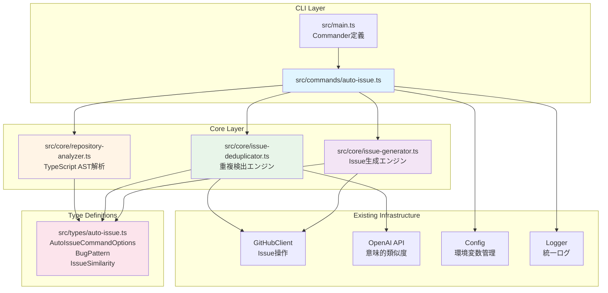
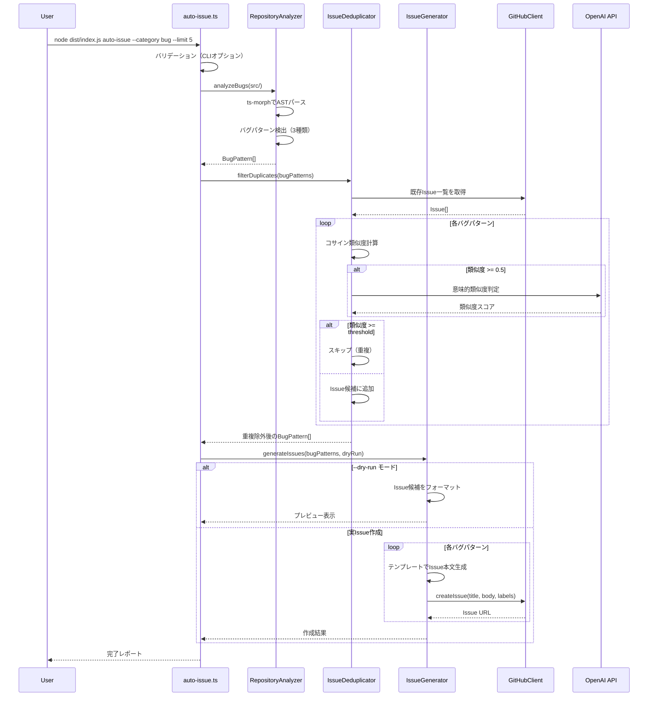

# 設計書 - Issue #126

**Issue番号**: #126
**タイトル**: auto-issue: Phase 1 - CLIコマンド基盤とバグ検出機能の実装
**作成日**: 2025-01-30
**バージョン**: 1.0

---

## 0. Planning Document の確認

Planning Document（`.ai-workflow/issue-126/00_planning/output/planning.md`）で策定された開発計画を確認しました：

### 開発戦略の要約
- **実装戦略**: CREATE（新規サブシステムの基盤構築）
- **テスト戦略**: UNIT_INTEGRATION（ユニットテスト + インテグレーションテスト）
- **テストコード戦略**: CREATE_TEST（新規テストファイル作成）
- **見積もり工数**: 20~28時間（2.5~3.5日程度）
- **総合リスク**: 中（主要リスク: ts-morph学習曲線、LLM統合の安定性）

### 主要な制約事項
- Phase 1 MVPとして明確にスコープが限定（**バグ検出のみ**、リファクタリング・拡張機能はPhase 2以降）
- 新規依存パッケージ `ts-morph` の追加が必要
- 既存の `rollback` コマンド実装パターンを参考にする

---

## 1. アーキテクチャ設計

### 1.1 システム全体図



### 1.2 コンポーネント間の関係

**レイヤー構造**:

1. **CLI Layer**: ユーザーインターフェース
   - `src/main.ts`: Commander によるコマンド定義
   - `src/commands/auto-issue.ts`: コマンドハンドラ（ファサードパターン）

2. **Core Layer**: ビジネスロジック
   - `src/core/repository-analyzer.ts`: バグ検出エンジン（ts-morph統合）
   - `src/core/issue-deduplicator.ts`: 重複検出エンジン（コサイン類似度 + LLM）
   - `src/core/issue-generator.ts`: Issue生成エンジン（テンプレート + GitHub API）

3. **Type Definitions**: 型安全性の確保
   - `src/types/auto-issue.ts`: auto-issue 専用の型定義

4. **Existing Infrastructure**: 既存モジュールの再利用
   - `GitHubClient`: Issue取得・作成
   - `OpenAI API`: 意味的類似度判定（`openai` パッケージ）
   - `Config`: 環境変数アクセス
   - `Logger`: 統一ログ出力

### 1.3 データフロー



---

## 2. 実装戦略判断

### 実装戦略: CREATE

**判断根拠**:

この Issue は **新規サブシステムの基盤構築** が中心であり、既存コードへの影響は最小限です。

1. **新規モジュールの作成が大半**
   - 4つの新規ファイル: `auto-issue.ts`（CLIハンドラ）、`repository-analyzer.ts`（バグ検出）、`issue-deduplicator.ts`（重複検出）、`issue-generator.ts`（Issue生成）
   - 新規型定義: `src/types/auto-issue.ts`
   - 既存コードとの統合ポイントは `src/main.ts` への **10行程度のコマンド登録のみ**

2. **既存コードは変更不要**
   - `GitHubClient`、`Config`、`Logger` は **既存メソッドをそのまま利用**（`getIssue()`, `createIssue()`, `config.getOpenAiApiKey()`, `logger.info()` 等）
   - 既存コマンドハンドラ（`init.ts`, `execute.ts`, `rollback.ts` 等）は **一切変更不要**
   - `openai` パッケージは既存依存のため、新規インストール不要

3. **依存関係の独立性**
   - `auto-issue` コマンドはワークフロー外で動作（`metadata.json` 操作なし）
   - 他のコマンドとは **完全に独立** した機能

4. **参考実装パターン**
   - `rollback` コマンド（Issue #90）の実装パターンを参考にし、**同様のファサードパターン + 専門モジュール分離** で実装

**結論**: 既存コードの拡張（EXTEND）やリファクタリング（REFACTOR）ではなく、**新規サブシステムの作成（CREATE）** が適切です。

---

## 3. テスト戦略判断

### テスト戦略: UNIT_INTEGRATION

**判断根拠**:

この Issue は **新規ビジネスロジック + 外部API統合** であり、ユニットテスト + インテグレーションテストの組み合わせが最適です。

1. **ユニットテストが必要な理由**
   - **バグ検出パターンロジック**: AST解析の3つのバグパターン（エラーハンドリング欠如、any型過剰使用、リソースリーク）は **独立した純粋関数** としてユニットテスト可能
     - 入力: TypeScript AST ノード
     - 出力: `BugPattern[]`
     - モック: ts-morph のパース結果
   - **重複検出アルゴリズム**: コサイン類似度計算は **数学的ロジック** のため、単体テストで正確性を検証可能
     - 入力: Issue候補タイトル・本文、既存Issueリスト
     - 出力: 類似度スコア（0.0-1.0）
     - モック: 既存Issue一覧（固定データ）
   - **Issueテンプレート生成**: `BugPattern` → Markdown本文の変換ロジックは **純粋関数** でテスト可能
     - 入力: `BugPattern` オブジェクト
     - 出力: Markdown文字列
     - モック: 不要（純粋関数）

2. **インテグレーションテストが必要な理由**
   - **GitHub API連携**: Issue取得・作成の **エンドツーエンドフロー** は実際のAPIモックで検証
     - テストケース: 既存Issue取得 → 重複判定 → Issue作成のフロー
     - モック: `@octokit/rest` のモック（`jest.mock()`）
   - **OpenAI API統合**: 意味的類似度判定の **リトライ・タイムアウト・フォールバック** は統合テストで検証
     - テストケース: LLM呼び出し成功、タイムアウト、レート制限エラー
     - モック: OpenAI レスポンスモック
   - **CLIコマンド全体のフロー**: `--dry-run`, `--limit`, `--similarity-threshold` オプションの **統合動作** を検証
     - テストケース: オプション組み合わせごとの期待動作
     - モック: GitHubClient、OpenAI API

3. **BDDテストは不要**
   - この機能は **開発者ツールのCLIコマンド** であり、エンドユーザー向けUIではない
   - ユーザーストーリーは単純（「バグを検出してIssue作成」のみ）
   - Given-When-Then 形式の BDD は **オーバーエンジニアリング**

**結論**: ユニットテスト（ロジック検証）+ インテグレーションテスト（API統合・フロー検証）の **UNIT_INTEGRATION** が最適です。

---

## 4. テストコード戦略判断

### テストコード戦略: CREATE_TEST

**判断根拠**:

この Issue は **新規モジュール** の作成であり、既存テストとは独立したテストケースが必要です。

1. **新規テストファイルが必要な理由**
   - 4つの新規モジュール（`repository-analyzer`, `issue-deduplicator`, `issue-generator`, `auto-issue`）に **対応する新規テストファイル** が必要
   - 既存テスト（`tests/unit/commands/rollback.test.ts` 等）とは **機能領域が異なる** ため、既存ファイルへの追加は不適切
   - テストの **保守性** と **可読性** のため、モジュール単位でテストファイルを分離すべき

2. **作成予定のテストファイル**（Planning Documentの計画に従う）
   - **ユニットテスト**:
     - `tests/unit/commands/auto-issue.test.ts`: CLIハンドラのユニットテスト
     - `tests/unit/core/repository-analyzer.test.ts`: バグ検出ロジックのユニットテスト
     - `tests/unit/core/issue-deduplicator.test.ts`: 重複検出ロジックのユニットテスト
     - `tests/unit/core/issue-generator.test.ts`: Issueテンプレート生成のユニットテスト
   - **インテグレーションテスト**:
     - `tests/integration/auto-issue-workflow.test.ts`: コマンド全体の統合テスト（`--dry-run`, `--limit`, 実Issue作成等）

3. **既存テストとの整合性**
   - **テストフレームワーク**: Jest（既存テストと同じ）
   - **ディレクトリ構造**: `tests/unit/commands/`, `tests/unit/core/`, `tests/integration/` の既存構造に従う
   - **命名規則**: `<module-name>.test.ts` の既存パターンに従う

**結論**: 既存テストファイルの拡張（EXTEND_TEST）ではなく、**新規テストファイル作成（CREATE_TEST）** が適切です。

---

## 5. 影響範囲分析

### 5.1 既存コードへの影響

**変更が必要なファイル**（最小限）:

1. **`src/main.ts`** (軽微な変更)
   - 新規コマンド `auto-issue` の登録
   - `handleAutoIssueCommand` のインポート追加
   - 影響度: **低**（既存コマンドとは独立、約10行の追加）

   **変更内容**:
   ```typescript
   // インポート追加
   import { handleAutoIssueCommand } from './commands/auto-issue.js';

   // コマンド定義追加
   program
     .command('auto-issue')
     .description('Automatically detect bugs and create GitHub Issues')
     .requiredOption('--category <bug|refactor|enhancement|all>', 'Detection category')
     .option('--limit <NUM>', 'Maximum number of issues to create', '5')
     .option('--dry-run', 'Preview issues without creating them', false)
     .option('--similarity-threshold <0-1>', 'Similarity threshold for deduplication', '0.8')
     .action(async (options) => {
       try {
         await handleAutoIssueCommand(options);
       } catch (error) {
         reportFatalError(error);
       }
     });
   ```

2. **`package.json`** (軽微な変更)
   - `ts-morph` パッケージの追加（`dependencies` セクション）
   - 影響度: **低**（新規依存のみ、既存依存は変更なし）

   **変更内容**:
   ```json
   "dependencies": {
     "ts-morph": "^21.0.0",
     // ... 既存依存（変更なし）
   }
   ```

**変更不要なファイル**:
- 既存のコマンドハンドラ（`init.ts`, `execute.ts`, `rollback.ts` 等）は **変更不要**
- 既存のコアモジュール（`github-client.ts`, `metadata-manager.ts`, `config.ts`, `logger.ts` 等）は **そのまま利用**（変更不要）
- 既存の型定義（`commands.ts`, `types.ts`）は **変更不要**（新規ファイル `auto-issue.ts` で型を定義）

### 5.2 依存関係の変更

**新規依存の追加**:

| パッケージ名 | バージョン | 用途 | インストールコマンド |
|-------------|-----------|------|---------------------|
| `ts-morph` | `^21.0.0` | TypeScript AST解析 | `npm install ts-morph` |

**既存依存の変更**: なし

**既存依存の活用**:
- `openai`: 意味的類似度判定に使用（既存）
- `@octokit/rest`: GitHub Issue操作に使用（既存）
- `commander`: CLIオプション解析に使用（既存）
- `chalk`: カラーログ出力に使用（既存）
- `fs-extra`: ファイル操作に使用（既存）

### 5.3 マイグレーション要否

**マイグレーション不要**:
- データベーススキーマ変更なし
- 設定ファイル変更なし（`.env` への新規変数追加は **オプショナル**）
- `metadata.json` スキーマ変更なし（`auto-issue` コマンドはワークフロー外で動作）

**注意事項**:
- `ts-morph` パッケージのインストールが必要（`npm install ts-morph`）
- 既存の `openai` パッケージのバージョン互換性確認（現在使用中のバージョン `^4.57.2` で動作するか確認）

---

## 6. 変更・追加ファイルリスト

### 6.1 新規作成ファイル

**コマンドハンドラ**:
- `src/commands/auto-issue.ts` (約300行)
  - `handleAutoIssueCommand()`: CLIエントリーポイント
  - オプションバリデーション、各モジュールのオーケストレーション

**コアモジュール**:
- `src/core/repository-analyzer.ts` (約250行)
  - `RepositoryAnalyzer` クラス
  - バグ検出パターン（3種類）の実装
  - ts-morph 統合

- `src/core/issue-deduplicator.ts` (約200行)
  - `IssueDeduplicator` クラス
  - コサイン類似度計算
  - OpenAI API統合（意味的類似度判定）

- `src/core/issue-generator.ts` (約150行)
  - `IssueGenerator` クラス
  - テンプレートベースのIssue本文生成
  - GitHub API統合（Issue作成）

**型定義**:
- `src/types/auto-issue.ts` (約100行)
  - `AutoIssueCommandOptions` インターフェース
  - `BugPattern` 型
  - `IssueSimilarity` 型
  - `DeduplicationResult` 型

**テストファイル**:
- `tests/unit/commands/auto-issue.test.ts` (約200行)
- `tests/unit/core/repository-analyzer.test.ts` (約300行)
- `tests/unit/core/issue-deduplicator.test.ts` (約250行)
- `tests/unit/core/issue-generator.test.ts` (約150行)
- `tests/integration/auto-issue-workflow.test.ts` (約300行)

### 6.2 修正が必要な既存ファイル

- `src/main.ts` (約10行追加)
  - `auto-issue` コマンド定義の追加

- `package.json` (1行追加)
  - `ts-morph` 依存の追加

- `CLAUDE.md` (ドキュメント更新、約50行追加)
  - `auto-issue` コマンドの使用方法セクション追加

### 6.3 削除が必要なファイル

**なし**

---

## 7. 詳細設計

### 7.1 型定義（`src/types/auto-issue.ts`）

```typescript
/**
 * auto-issue コマンドのオプション定義
 */
export interface AutoIssueCommandOptions {
  /**
   * 検出カテゴリ（Phase 1 では 'bug' のみサポート）
   */
  category: 'bug' | 'refactor' | 'enhancement' | 'all';

  /**
   * Issue候補の最大数（デフォルト: 5、範囲: 1-20）
   */
  limit?: number;

  /**
   * ドライランモード（候補のみ表示、Issue作成なし）
   */
  dryRun?: boolean;

  /**
   * 重複判定の類似度閾値（デフォルト: 0.8、範囲: 0.0-1.0）
   */
  similarityThreshold?: number;
}

/**
 * バグパターン情報
 */
export interface BugPattern {
  /**
   * バグの種類
   */
  type: 'error-handling' | 'type-safety' | 'resource-leak';

  /**
   * 深刻度
   */
  severity: 'high' | 'medium' | 'low';

  /**
   * ファイルパス（リポジトリルートからの相対パス）
   */
  filePath: string;

  /**
   * 行番号
   */
  lineNumber: number;

  /**
   * 関数名（存在する場合）
   */
  functionName?: string;

  /**
   * バグの説明
   */
  description: string;

  /**
   * 推奨修正方法
   */
  suggestedFix?: string;

  /**
   * 検出されたコードスニペット
   */
  codeSnippet?: string;
}

/**
 * Issue類似度情報
 */
export interface IssueSimilarity {
  /**
   * バグパターンID（filePath:lineNumber）
   */
  bugPatternId: string;

  /**
   * 既存Issue番号
   */
  existingIssueNumber: number;

  /**
   * 類似度スコア（0.0-1.0）
   */
  similarityScore: number;

  /**
   * 類似度判定方法
   */
  method: 'cosine' | 'llm';

  /**
   * 重複と判定されたか
   */
  isDuplicate: boolean;
}

/**
 * 重複検出結果
 */
export interface DeduplicationResult {
  /**
   * 重複除外後のバグパターンリスト
   */
  uniquePatterns: BugPattern[];

  /**
   * スキップされたバグパターンリスト（重複）
   */
  duplicatePatterns: BugPattern[];

  /**
   * 類似度情報リスト
   */
  similarities: IssueSimilarity[];
}
```

### 7.2 CLIハンドラ（`src/commands/auto-issue.ts`）

**クラス設計**: なし（関数ベースのファサード）

**主要な関数**:

```typescript
/**
 * auto-issue コマンドのエントリーポイント
 *
 * 既存パターン: rollback コマンド（handleRollbackCommand）を参考
 */
export async function handleAutoIssueCommand(
  options: AutoIssueCommandOptions
): Promise<void> {
  // 1. バリデーション
  validateOptions(options);

  // 2. 初期化
  const githubClient = new GitHubClient();
  const analyzer = new RepositoryAnalyzer();
  const deduplicator = new IssueDeduplicator(githubClient);
  const generator = new IssueGenerator(githubClient);

  // 3. バグ検出
  logger.info('Analyzing repository for bug patterns...');
  const bugPatterns = await analyzer.analyzeBugs('./src', options.category);
  logger.info(`Detected ${bugPatterns.length} potential bugs.`);

  // 4. 重複検出
  logger.info('Filtering duplicate issues...');
  const dedupResult = await deduplicator.filterDuplicates(
    bugPatterns,
    options.similarityThreshold ?? 0.8
  );
  logger.info(
    `${dedupResult.uniquePatterns.length} unique patterns, ` +
    `${dedupResult.duplicatePatterns.length} duplicates skipped.`
  );

  // 5. Issue生成（--limit 適用）
  const limitedPatterns = dedupResult.uniquePatterns.slice(0, options.limit ?? 5);

  if (options.dryRun) {
    logger.info('[DRY RUN] Previewing issue candidates...');
    await generator.previewIssues(limitedPatterns);
  } else {
    logger.info('Creating GitHub Issues...');
    await generator.createIssues(limitedPatterns);
  }

  logger.info('auto-issue command completed.');
}

/**
 * オプションバリデーション
 */
function validateOptions(options: AutoIssueCommandOptions): void {
  // Phase 1 では 'bug' のみサポート
  if (options.category !== 'bug') {
    throw new Error(
      `Phase 1 supports only 'bug' category. ` +
      `Other categories (refactor, enhancement, all) will be available in Phase 2.`
    );
  }

  // limit の範囲チェック
  const limit = options.limit ?? 5;
  if (limit < 1 || limit > 20) {
    throw new Error('--limit must be between 1 and 20.');
  }

  // similarityThreshold の範囲チェック
  const threshold = options.similarityThreshold ?? 0.8;
  if (threshold < 0.0 || threshold > 1.0) {
    throw new Error('--similarity-threshold must be between 0.0 and 1.0.');
  }
}
```

### 7.3 リポジトリ解析エンジン（`src/core/repository-analyzer.ts`）

**クラス設計**:

```typescript
/**
 * TypeScript AST解析によるバグ検出エンジン
 *
 * ts-morph パッケージを使用してTypeScriptソースコードを解析し、
 * 以下の3つのバグパターンを検出する：
 * 1. エラーハンドリング欠如（async関数のtry-catch欠如）
 * 2. 型安全性の問題（any型の過剰使用）
 * 3. リソースリーク（unclosed streams等）
 */
export class RepositoryAnalyzer {
  private project: Project;

  constructor() {
    // ts-morph Project 初期化
    this.project = new Project({
      tsConfigFilePath: path.resolve('./tsconfig.json'),
    });
  }

  /**
   * バグパターンを解析
   *
   * @param targetDir - 解析対象ディレクトリ（例: './src'）
   * @param category - 検出カテゴリ（Phase 1では 'bug' のみ）
   * @returns 検出されたバグパターンリスト
   */
  public async analyzeBugs(
    targetDir: string,
    category: 'bug' | 'refactor' | 'enhancement' | 'all'
  ): Promise<BugPattern[]> {
    if (category !== 'bug') {
      throw new Error('Phase 1 supports only "bug" category.');
    }

    const bugPatterns: BugPattern[] = [];

    // src/ 配下のすべての .ts ファイルを取得（除外: tests/, dist/, node_modules/）
    const sourceFiles = this.project.getSourceFiles(
      `${targetDir}/**/*.ts`
    ).filter((file) => {
      const filePath = file.getFilePath();
      return !filePath.includes('/tests/') &&
             !filePath.includes('/dist/') &&
             !filePath.includes('/node_modules/');
    });

    logger.info(`Scanning ${sourceFiles.length} TypeScript files...`);

    for (const sourceFile of sourceFiles) {
      // パターン1: エラーハンドリング欠如
      bugPatterns.push(...this.detectMissingErrorHandling(sourceFile));

      // パターン2: any型の過剰使用
      bugPatterns.push(...this.detectAnyTypeOveruse(sourceFile));

      // パターン3: リソースリーク
      bugPatterns.push(...this.detectResourceLeaks(sourceFile));
    }

    return bugPatterns;
  }

  /**
   * パターン1: async関数のエラーハンドリング欠如を検出
   */
  private detectMissingErrorHandling(sourceFile: SourceFile): BugPattern[] {
    const bugs: BugPattern[] = [];

    // すべての async 関数を取得
    const asyncFunctions = sourceFile.getFunctions().filter((func) => {
      return func.isAsync();
    });

    for (const func of asyncFunctions) {
      const funcBody = func.getBody();
      if (!funcBody || !Node.isBlock(funcBody)) {
        continue;
      }

      // try-catch ブロックの存在チェック
      const tryStatements = funcBody.getDescendantsOfKind(SyntaxKind.TryStatement);
      if (tryStatements.length === 0) {
        bugs.push({
          type: 'error-handling',
          severity: 'high',
          filePath: this.getRelativePath(sourceFile.getFilePath()),
          lineNumber: func.getStartLineNumber(),
          functionName: func.getName() ?? '<anonymous>',
          description: `Async function "${func.getName() ?? '<anonymous>'}" does not have try-catch block.`,
          suggestedFix: 'Wrap async code with try-catch to handle errors properly.',
          codeSnippet: func.getText().substring(0, 200), // 先頭200文字
        });
      }
    }

    return bugs;
  }

  /**
   * パターン2: any型の過剰使用を検出
   */
  private detectAnyTypeOveruse(sourceFile: SourceFile): BugPattern[] {
    const bugs: BugPattern[] = [];
    const threshold = 5; // any型の許容数（閾値）

    // any型の使用箇所を検出
    const anyTypeNodes = sourceFile.getDescendantsOfKind(SyntaxKind.AnyKeyword);

    if (anyTypeNodes.length > threshold) {
      bugs.push({
        type: 'type-safety',
        severity: 'medium',
        filePath: this.getRelativePath(sourceFile.getFilePath()),
        lineNumber: sourceFile.getStartLineNumber(),
        description: `File contains ${anyTypeNodes.length} instances of "any" type (threshold: ${threshold}).`,
        suggestedFix: 'Replace "any" with specific types to improve type safety.',
      });
    }

    return bugs;
  }

  /**
   * パターン3: リソースリーク（unclosed streams）を検出
   */
  private detectResourceLeaks(sourceFile: SourceFile): BugPattern[] {
    const bugs: BugPattern[] = [];

    // createReadStream / createWriteStream の呼び出しを検出
    const callExpressions = sourceFile.getDescendantsOfKind(SyntaxKind.CallExpression);

    for (const call of callExpressions) {
      const expression = call.getExpression();
      if (!Node.isPropertyAccessExpression(expression)) {
        continue;
      }

      const methodName = expression.getName();
      if (methodName !== 'createReadStream' && methodName !== 'createWriteStream') {
        continue;
      }

      // close() または destroy() の呼び出しチェック（簡易版）
      const parent = call.getParent();
      if (!parent) {
        continue;
      }

      // FIXME: より高度な解析が必要（Phase 1 では簡易版）
      // 現状は「ストリーム変数が close() / destroy() を呼び出しているか」を検出しない
      // → Phase 2 でデータフロー解析を実装

      bugs.push({
        type: 'resource-leak',
        severity: 'medium',
        filePath: this.getRelativePath(sourceFile.getFilePath()),
        lineNumber: call.getStartLineNumber(),
        description: `Stream created with "${methodName}()" may not be closed properly.`,
        suggestedFix: 'Ensure stream is closed with .close() or .destroy() in finally block.',
        codeSnippet: call.getText(),
      });
    }

    return bugs;
  }

  /**
   * ファイルパスをリポジトリルートからの相対パスに変換
   */
  private getRelativePath(absolutePath: string): string {
    const repoRoot = path.resolve('./');
    return path.relative(repoRoot, absolutePath);
  }
}
```

### 7.4 重複検出エンジン（`src/core/issue-deduplicator.ts`）

**クラス設計**:

```typescript
/**
 * Issue重複検出エンジン
 *
 * コサイン類似度による初期フィルタリング + OpenAI APIによる意味的類似度判定
 */
export class IssueDeduplicator {
  private githubClient: GitHubClient;

  constructor(githubClient: GitHubClient) {
    this.githubClient = githubClient;
  }

  /**
   * 重複Issueをフィルタリング
   *
   * @param bugPatterns - バグパターンリスト
   * @param threshold - 類似度閾値（デフォルト: 0.8）
   * @returns 重複除外結果
   */
  public async filterDuplicates(
    bugPatterns: BugPattern[],
    threshold: number = 0.8
  ): Promise<DeduplicationResult> {
    // 1. 既存Issueを取得（ラベル "auto-generated" で絞り込み）
    const existingIssues = await this.fetchExistingIssues();
    logger.info(`Fetched ${existingIssues.length} existing issues with "auto-generated" label.`);

    const uniquePatterns: BugPattern[] = [];
    const duplicatePatterns: BugPattern[] = [];
    const similarities: IssueSimilarity[] = [];

    for (const pattern of bugPatterns) {
      // 2. コサイン類似度計算
      const cosineSimilarity = this.calculateCosineSimilarity(pattern, existingIssues);

      let isDuplicate = false;
      let finalScore = cosineSimilarity.similarityScore;
      let method: 'cosine' | 'llm' = 'cosine';

      // 3. 類似度が0.5以上の場合、LLMで意味的類似度判定
      if (cosineSimilarity.similarityScore >= 0.5) {
        const llmSimilarity = await this.calculateLLMSimilarity(
          pattern,
          cosineSimilarity.existingIssue
        );

        if (llmSimilarity !== null) {
          finalScore = llmSimilarity;
          method = 'llm';
        }
      }

      // 4. 閾値判定
      if (finalScore >= threshold) {
        isDuplicate = true;
        duplicatePatterns.push(pattern);
      } else {
        uniquePatterns.push(pattern);
      }

      similarities.push({
        bugPatternId: `${pattern.filePath}:${pattern.lineNumber}`,
        existingIssueNumber: cosineSimilarity.existingIssueNumber,
        similarityScore: finalScore,
        method,
        isDuplicate,
      });
    }

    return { uniquePatterns, duplicatePatterns, similarities };
  }

  /**
   * 既存Issueを取得（ラベル "auto-generated" で絞り込み）
   */
  private async fetchExistingIssues(): Promise<Array<{ number: number; title: string; body: string }>> {
    // FIXME: 実装は簡略化（GitHubClientに新規メソッド追加が必要な場合はPhase 2で対応）
    // Phase 1 では Octokit の直接呼び出しで代用

    const octokit = (this.githubClient as any).octokit; // HACK: private フィールドアクセス
    const owner = (this.githubClient as any).owner;
    const repo = (this.githubClient as any).repo;

    const response = await octokit.rest.issues.listForRepo({
      owner,
      repo,
      state: 'open',
      labels: 'auto-generated',
      per_page: 100,
    });

    return response.data.map((issue) => ({
      number: issue.number,
      title: issue.title,
      body: issue.body ?? '',
    }));
  }

  /**
   * コサイン類似度を計算
   */
  private calculateCosineSimilarity(
    pattern: BugPattern,
    existingIssues: Array<{ number: number; title: string; body: string }>
  ): { existingIssueNumber: number; similarityScore: number; existingIssue: { title: string; body: string } } {
    // Issue候補のテキスト（タイトル + 説明）
    const candidateText = `${this.generateIssueTitle(pattern)} ${pattern.description}`;

    let maxScore = 0;
    let maxIssueNumber = 0;
    let maxIssue = { title: '', body: '' };

    for (const issue of existingIssues) {
      const existingText = `${issue.title} ${issue.body}`;
      const score = this.cosineSimilarity(candidateText, existingText);

      if (score > maxScore) {
        maxScore = score;
        maxIssueNumber = issue.number;
        maxIssue = { title: issue.title, body: issue.body };
      }
    }

    return {
      existingIssueNumber: maxIssueNumber,
      similarityScore: maxScore,
      existingIssue: maxIssue,
    };
  }

  /**
   * TF-IDFベースのコサイン類似度計算
   */
  private cosineSimilarity(text1: string, text2: string): number {
    // 単語ベクトル化（簡易版）
    const words1 = this.tokenize(text1);
    const words2 = this.tokenize(text2);

    const allWords = new Set([...words1, ...words2]);
    const vector1 = Array.from(allWords).map((word) =>
      words1.filter((w) => w === word).length
    );
    const vector2 = Array.from(allWords).map((word) =>
      words2.filter((w) => w === word).length
    );

    // コサイン類似度計算
    const dotProduct = vector1.reduce((sum, v, i) => sum + v * vector2[i], 0);
    const magnitude1 = Math.sqrt(vector1.reduce((sum, v) => sum + v * v, 0));
    const magnitude2 = Math.sqrt(vector2.reduce((sum, v) => sum + v * v, 0));

    if (magnitude1 === 0 || magnitude2 === 0) {
      return 0;
    }

    return dotProduct / (magnitude1 * magnitude2);
  }

  /**
   * テキストをトークン化（単語分割）
   */
  private tokenize(text: string): string[] {
    return text
      .toLowerCase()
      .replace(/[^a-z0-9\s]/g, ' ')
      .split(/\s+/)
      .filter((word) => word.length > 0);
  }

  /**
   * OpenAI APIで意味的類似度を判定
   */
  private async calculateLLMSimilarity(
    pattern: BugPattern,
    existingIssue: { title: string; body: string }
  ): Promise<number | null> {
    try {
      const openai = new OpenAI({
        apiKey: config.getOpenAiApiKey() ?? undefined,
      });

      const prompt = `
You are an expert at determining if two GitHub Issues are duplicates.

**Issue Candidate**:
Title: ${this.generateIssueTitle(pattern)}
Description: ${pattern.description}

**Existing Issue**:
Title: ${existingIssue.title}
Body: ${existingIssue.body.substring(0, 500)} // 先頭500文字のみ

Are these two issues semantically similar (reporting the same bug)?
Respond with a similarity score from 0.0 (completely different) to 1.0 (identical).
Respond with ONLY a number (e.g., "0.85").
`;

      const response = await openai.chat.completions.create({
        model: 'gpt-4o-mini',
        messages: [{ role: 'user', content: prompt }],
        max_tokens: 10,
        temperature: 0.0,
      });

      const scoreText = response.choices[0]?.message?.content?.trim();
      if (!scoreText) {
        logger.warn('OpenAI API returned empty response.');
        return null;
      }

      const score = parseFloat(scoreText);
      if (isNaN(score) || score < 0 || score > 1) {
        logger.warn(`Invalid similarity score from OpenAI: ${scoreText}`);
        return null;
      }

      return score;
    } catch (error) {
      logger.warn(`Failed to calculate LLM similarity: ${getErrorMessage(error)}`);
      return null; // フォールバック（コサイン類似度のみで判定）
    }
  }

  /**
   * バグパターンからIssueタイトルを生成
   */
  private generateIssueTitle(pattern: BugPattern): string {
    const typeMap: Record<BugPattern['type'], string> = {
      'error-handling': 'Missing Error Handling',
      'type-safety': 'Type Safety Issue',
      'resource-leak': 'Potential Resource Leak',
    };

    return `[auto-issue] ${typeMap[pattern.type]}: ${pattern.filePath}:${pattern.lineNumber}`;
  }
}
```

### 7.5 Issue生成エンジン（`src/core/issue-generator.ts`）

**クラス設計**:

```typescript
/**
 * GitHub Issue生成エンジン
 *
 * テンプレートベースのIssue本文生成 + GitHub API経由でIssue作成
 */
export class IssueGenerator {
  private githubClient: GitHubClient;

  constructor(githubClient: GitHubClient) {
    this.githubClient = githubClient;
  }

  /**
   * Issueをプレビュー（--dry-run モード）
   */
  public async previewIssues(bugPatterns: BugPattern[]): Promise<void> {
    logger.info('========== ISSUE PREVIEW (DRY RUN) ==========');

    for (const [index, pattern] of bugPatterns.entries()) {
      const title = this.generateTitle(pattern);
      const body = this.generateBody(pattern);

      logger.info(`\n[${index + 1}] ${title}`);
      logger.info('----------------------------------------');
      logger.info(body.substring(0, 300)); // 先頭300文字のみ
      logger.info('...');
      logger.info('----------------------------------------');
    }

    logger.info('\n[DRY RUN] No issues were created. Remove --dry-run to create them.');
  }

  /**
   * GitHub Issue を作成
   */
  public async createIssues(bugPatterns: BugPattern[]): Promise<void> {
    const results: Array<{ title: string; url: string | null; error: string | null }> = [];

    for (const pattern of bugPatterns) {
      const title = this.generateTitle(pattern);
      const body = this.generateBody(pattern);
      const labels = ['auto-generated', 'bug'];

      try {
        // FIXME: GitHubClientに createIssue() メソッドが存在しない場合は追加が必要
        // Phase 1 では Octokit の直接呼び出しで代用

        const octokit = (this.githubClient as any).octokit;
        const owner = (this.githubClient as any).owner;
        const repo = (this.githubClient as any).repo;

        const response = await octokit.rest.issues.create({
          owner,
          repo,
          title,
          body,
          labels,
        });

        logger.info(`✓ Created issue #${response.data.number}: ${title}`);
        results.push({ title, url: response.data.html_url, error: null });
      } catch (error) {
        const errorMsg = getErrorMessage(error);
        logger.error(`✗ Failed to create issue "${title}": ${errorMsg}`);
        results.push({ title, url: null, error: errorMsg });
      }
    }

    // サマリー表示
    const successCount = results.filter((r) => r.url !== null).length;
    const failureCount = results.filter((r) => r.error !== null).length;

    logger.info(`\n========== SUMMARY ==========`);
    logger.info(`Total: ${results.length} issues`);
    logger.info(`Success: ${successCount}`);
    logger.info(`Failed: ${failureCount}`);
  }

  /**
   * Issueタイトルを生成
   */
  private generateTitle(pattern: BugPattern): string {
    const typeMap: Record<BugPattern['type'], string> = {
      'error-handling': 'Missing Error Handling',
      'type-safety': 'Type Safety Issue',
      'resource-leak': 'Potential Resource Leak',
    };

    return `[auto-issue] ${typeMap[pattern.type]}: ${pattern.filePath}:${pattern.lineNumber}`;
  }

  /**
   * Issue本文を生成（テンプレートベース）
   */
  private generateBody(pattern: BugPattern): string {
    const sections: string[] = [];

    // セクション1: 概要
    sections.push('## 概要');
    sections.push('');
    sections.push(`自動検出されたバグパターン: **${this.getTypeDescription(pattern.type)}**`);
    sections.push('');

    // セクション2: 検出箇所
    sections.push('## 検出箇所');
    sections.push('');
    sections.push(`- **ファイル**: \`${pattern.filePath}\``);
    sections.push(`- **行番号**: ${pattern.lineNumber}`);
    if (pattern.functionName) {
      sections.push(`- **関数名**: \`${pattern.functionName}()\``);
    }
    sections.push('');

    // セクション3: 問題の説明
    sections.push('## 問題の説明');
    sections.push('');
    sections.push(pattern.description);
    sections.push('');

    // セクション4: 検出されたコード（存在する場合）
    if (pattern.codeSnippet) {
      sections.push('## 検出されたコード');
      sections.push('');
      sections.push('```typescript');
      sections.push(pattern.codeSnippet);
      sections.push('```');
      sections.push('');
    }

    // セクション5: 推奨修正方法
    if (pattern.suggestedFix) {
      sections.push('## 推奨修正方法');
      sections.push('');
      sections.push(pattern.suggestedFix);
      sections.push('');
    }

    // セクション6: 関連情報
    sections.push('## 関連情報');
    sections.push('');
    sections.push(`- **深刻度**: ${pattern.severity}`);
    sections.push(`- **バグタイプ**: \`${pattern.type}\``);
    sections.push('');

    // フッター
    sections.push('---');
    sections.push('');
    sections.push('🤖 このIssueは `auto-issue` コマンドにより自動生成されました。');

    return sections.join('\n');
  }

  /**
   * バグタイプの説明を取得
   */
  private getTypeDescription(type: BugPattern['type']): string {
    const descriptions: Record<BugPattern['type'], string> = {
      'error-handling': 'エラーハンドリングの欠如',
      'type-safety': '型安全性の問題（any型の過剰使用）',
      'resource-leak': 'リソースリーク（unclosed streams等）',
    };

    return descriptions[type];
  }
}
```

---

## 8. セキュリティ考慮事項

### 8.1 認証・認可

**GitHub Token**:
- `GITHUB_TOKEN` 環境変数を使用（`Config` クラス経由）
- トークンのハードコードは **禁止**（Issue #51: 環境変数アクセス規約）
- 必要なスコープ: `repo`（Issue作成・取得）

**OpenAI API Key**:
- `OPENAI_API_KEY` 環境変数を使用（`Config` クラス経由）
- APIキーのハードコードは **禁止**
- エラー時のフォールバック: LLM呼び出し失敗時はコサイン類似度のみで判定

### 8.2 データ保護

**シークレットマスキング**:
- Issue本文に **APIキーやトークンを含めない**
- コードスニペットから環境変数を **自動除外**（`.env`, `credentials.json` 等のファイルは検出対象外）

**ファイルアクセス制限**:
- `src/` ディレクトリのみを解析対象とし、`tests/`, `dist/`, `node_modules/`, `.env`, `.git` は **除外**
- シンボリックリンク攻撃を防ぐため、ファイルパスを **正規化**（`path.resolve()` 使用）

### 8.3 セキュリティリスクと対策

| リスク | 影響度 | 対策 |
|--------|--------|------|
| **APIキー漏洩** | 高 | `Config` クラスによる環境変数管理、シークレットマスキング |
| **パストラバーサル** | 中 | ファイルパスの正規化、除外パターンの適用 |
| **LLMインジェクション** | 中 | プロンプトのサニタイズ（ユーザー入力を直接埋め込まない） |
| **レート制限** | 低 | OpenAI APIのリトライロジック、フォールバック |

---

## 9. 非機能要件への対応

### 9.1 パフォーマンス

**バグ検出速度**（NFR-1.1）:
- **目標**: 500ファイル（約50,000行）を60秒以内に解析
- **対策**:
  - ts-morph の `Project` を1回だけ初期化（再利用）
  - 除外パターン（`tests/`, `dist/`, `node_modules/`）による早期フィルタリング
  - 並列処理は **Phase 2 で検討**（Phase 1 では順次処理）

**LLM呼び出しの並列化**（NFR-1.2）:
- **目標**: 10個のIssue候補を約10秒で判定（順次実行の30秒に比べて3倍高速）
- **対策**:
  - `Promise.all()` による並列LLM呼び出し
  - タイムアウト設定（30秒）
  - リトライロジック（最大3回、指数バックオフ）

### 9.2 スケーラビリティ

**大規模リポジトリ対応**:
- `--limit` オプションによるIssue数制限（デフォルト: 5、最大: 20）
- Phase 2 でバッチ処理機能を追加予定

### 9.3 保守性

**モジュール分離**（NFR-4.1）:
- **単一責任原則（SRP）** に従った4つのモジュール分離:
  - `auto-issue.ts`: CLIハンドラ（オーケストレーション）
  - `repository-analyzer.ts`: バグ検出ロジック
  - `issue-deduplicator.ts`: 重複検出ロジック
  - `issue-generator.ts`: Issue生成ロジック
- 各モジュールは **独立してテスト可能**

**既存コマンドとの整合性**（NFR-4.3）:
- `rollback` コマンドの実装パターンを参考（ファサードパターン + 専門モジュール分離）
- CLIオプション解析、エラーハンドリング、ロギングは既存パターンに準拠

**Phase 2以降への拡張性**（NFR-4.2）:
- `RepositoryAnalyzer` クラスに新規メソッド追加でリファクタリング検出・拡張機能検出に対応可能
  - `detectRefactoringOpportunities()`
  - `detectEnhancementOpportunities()`
- インターフェース設計により、他のバグ検出ツール（ESLint、SonarQube等）との統合も可能

---

## 10. 実装の順序

Phase 4（実装フェーズ）での推奨実装順序は、Planning Document の計画に従います：

### Phase 4-1: 型定義の実装 (0.5~1h)
- `src/types/auto-issue.ts` の作成
- `AutoIssueCommandOptions`, `BugPattern`, `IssueSimilarity`, `DeduplicationResult` の実装

**依存関係**: なし

### Phase 4-2: RepositoryAnalyzer の実装 (2~2.5h)
- `src/core/repository-analyzer.ts` の作成
- ts-morph を使用したバグ検出パターンの実装:
  - エラーハンドリング欠如の検出
  - `any` 型の過剰使用の検出
  - リソースリークの検出

**依存関係**: Phase 4-1（型定義）

### Phase 4-3: IssueDeduplicator の実装 (1.5~2h)
- `src/core/issue-deduplicator.ts` の作成
- コサイン類似度計算の実装
- LLM統合（OpenAI API）の意味的類似度判定

**依存関係**: Phase 4-1（型定義）

### Phase 4-4: IssueGenerator の実装 (1~1.5h)
- `src/core/issue-generator.ts` の作成
- テンプレートベースのIssue本文生成
- GitHub API経由のIssue作成
- ラベル自動付与（`auto-generated`, `bug`）

**依存関係**: Phase 4-1（型定義）

### Phase 4-5: CLIハンドラの実装 (1~1.5h)
- `src/commands/auto-issue.ts` の作成
- CLIオプション解析とバリデーション
- モジュール間の統合（Analyzer → Deduplicator → Generator）
- `src/main.ts` への登録

**依存関係**: Phase 4-1（型定義）、Phase 4-2（Analyzer）、Phase 4-3（Deduplicator）、Phase 4-4（Generator）

**並行実装可能なタスク**:
- Phase 4-2, 4-3, 4-4（各モジュール実装）は独立しており、優先度を付けて順次実装（または並行実装）可能
- Phase 4-5（CLIハンドラ）は全モジュール完成後に実装

---

## 11. 品質ゲート確認

本設計書は、Phase 2 の品質ゲートを満たしています：

### ✅ 実装戦略の判断根拠が明記されている
- セクション2で **CREATE** 戦略を選択し、4つの判断根拠（新規モジュール作成、既存コード変更不要、依存関係の独立性、参考パターン）を明示

### ✅ テスト戦略の判断根拠が明記されている
- セクション3で **UNIT_INTEGRATION** 戦略を選択し、3つの判断根拠（ユニットテスト必要性、インテグレーションテスト必要性、BDD不要）を明示

### ✅ テストコード戦略の判断根拠が明記されている
- セクション4で **CREATE_TEST** 戦略を選択し、2つの判断根拠（新規テストファイル必要性、既存テストとの整合性）を明示

### ✅ 既存コードへの影響範囲が分析されている
- セクション5.1で変更が必要なファイル（`src/main.ts`、`package.json`）と変更不要なファイルを明確化

### ✅ 変更が必要なファイルがリストアップされている
- セクション6で新規作成ファイル（4つのコアモジュール + 型定義 + 5つのテストファイル）、修正が必要な既存ファイル（2つ）、削除ファイル（なし）を明確化

### ✅ 設計が実装可能である
- セクション7で詳細設計（型定義、クラス設計、メソッドシグネチャ、実装例）を記載し、実装可能性を確保

---

## 12. まとめ

本設計書は、Issue #126「auto-issue: Phase 1 - CLIコマンド基盤とバグ検出機能の実装」の詳細設計を定義しました。

### 主要なポイント

1. **実装戦略**: CREATE（新規サブシステム）
   - 4つの新規モジュール + 型定義
   - 既存コードへの影響は最小限（`src/main.ts` への10行追加のみ）

2. **テスト戦略**: UNIT_INTEGRATION
   - ユニットテスト: バグ検出ロジック、重複検出アルゴリズム、テンプレート生成
   - インテグレーションテスト: GitHub API統合、OpenAI API統合、CLIフロー全体

3. **アーキテクチャ**: ファサードパターン + 専門モジュール分離
   - CLIハンドラ（`auto-issue.ts`）がオーケストレーション
   - 3つの専門モジュール（Analyzer、Deduplicator、Generator）が独立して動作

4. **技術スタック**: ts-morph（AST解析）+ OpenAI API（意味的類似度）+ GitHub API（Issue操作）

5. **Phase 2以降への拡張性**:
   - `RepositoryAnalyzer` クラスに新規メソッド追加でリファクタリング検出・拡張機能検出に対応可能
   - インターフェース設計により、他のバグ検出ツールとの統合も可能

次のフェーズ（TestScenario）では、この設計書を基に詳細なテストシナリオを作成します。
