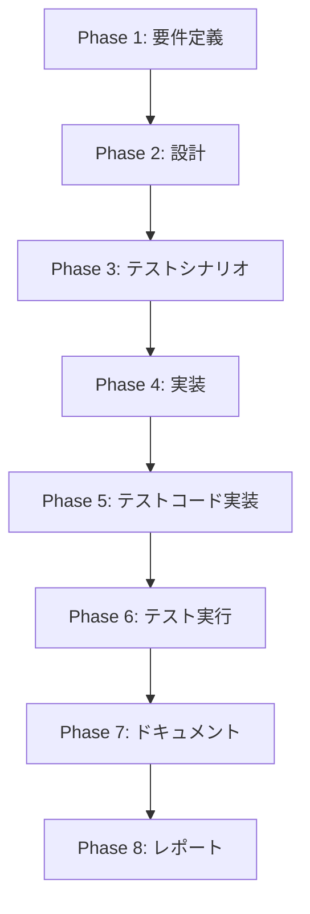

# プロジェクト計画書 - Issue #127

## プロジェクト概要

**Issue番号**: #127
**タイトル**: auto-issue: Phase 2 - リファクタリング検出機能の実装
**URL**: https://github.com/tielec/ai-workflow-agent/issues/127
**親Issue**: #121 AIエージェントによる自動Issue作成機能の実装
**前提条件**: #126 Phase 1（CLIコマンド基盤とバグ検出機能）が完了していること

---

## 1. Issue分析

### 複雑度判定: **中程度**

**根拠**:
- 既存のバグ検出機能（Phase 1）のアーキテクチャを再利用できる
- 新規モジュール追加は最小限（プロンプト、型定義の拡張）
- 複数ファイルの修正が必要だが、コア設計は変更不要
- エージェント連携パターンはPhase 1で確立済み

### 見積もり工数: **12〜16時間**

**内訳**:
- Phase 1: 要件定義（1〜2h）
- Phase 2: 設計（2〜3h）
- Phase 3: テストシナリオ（1〜2h）
- Phase 4: 実装（4〜5h）
- Phase 5: テストコード実装（2〜3h）
- Phase 6: テスト実行（1h）
- Phase 7: ドキュメント（1h）

### リスク評価: **中**

**リスク要因**:
1. **エージェントプロンプト設計の複雑性**: リファクタリング候補の検出基準が曖昧になる可能性（リスク軽減策: セクション6参照）
2. **Phase 1との互換性**: 既存コードへの変更が予期しない副作用を引き起こす可能性（リスク軽減策: セクション6参照）
3. **言語非依存性の検証**: TypeScript以外の言語でのテスト不足（リスク軽減策: セクション6参照）

---

## 2. 実装戦略判断

### 実装戦略: **EXTEND**

**判断根拠**:
- Phase 1で実装済みの `RepositoryAnalyzer`, `IssueDeduplicator`, `IssueGenerator`, `handleAutoIssueCommand` を拡張
- 新規クラス・モジュールの作成は不要（プロンプトテンプレート、型定義の追加のみ）
- コアアーキテクチャ（エージェント→解析→重複除外→Issue生成）は変更せず、検出ロジックのみ追加
- 既存の `--category` オプションを `'refactor'` に対応させる形で拡張

### テスト戦略: **UNIT_INTEGRATION**

**判断根拠**:
- **UNIT**テストが必要な理由:
  - `RefactorCandidate` のバリデーション機能（`RepositoryAnalyzer.validateRefactorCandidate`）
  - `--category refactor` オプションのパース処理（`parseOptions`）
  - プロンプトテンプレート変数置換ロジック
- **INTEGRATIONテスト**が必要な理由:
  - エージェント（Codex/Claude）の実行フローE2Eテスト
  - `RepositoryAnalyzer.analyzeForRefactoring()` → `IssueDeduplicator` → `IssueGenerator` のフロー全体
  - dry-runモードでの統合動作確認
- **BDD不要**の理由:
  - エンドユーザー向けUI機能ではなく、CLI内部の解析エンジン拡張のため

### テストコード戦略: **BOTH_TEST**

**判断根拠**:
- **EXTEND_TEST**: 既存の `repository-analyzer.test.ts` にリファクタリング検出のユニットテストを追加
- **CREATE_TEST**: 新規に `tests/integration/auto-issue-refactor.test.ts` を作成し、リファクタリング検出のE2Eテストを実装
- **理由**: 既存のバグ検出テストと統合テストの構造を維持しつつ、リファクタリング検出特有のケース（重複コード検出、複雑度判定等）を独立してテスト

---

## 3. 影響範囲分析

### 既存コードへの影響

| ファイル | 変更内容 | 影響度 |
|---------|---------|--------|
| `src/types/auto-issue.ts` | `RefactorCandidate` 型の追加、`AutoIssueOptions.category` に `'refactor'` を追加 | 低（型定義の拡張のみ） |
| `src/core/repository-analyzer.ts` | `analyzeForRefactoring()` メソッド追加、`validateRefactorCandidate()` 追加 | 中（新規メソッド追加、既存コード変更なし） |
| `src/commands/auto-issue.ts` | `parseOptions` でカテゴリ `'refactor'` を処理、`handleAutoIssueCommand` でリファクタリング検出を呼び出し | 中（条件分岐追加） |
| `src/core/issue-generator.ts` | リファクタリング用Issueテンプレート生成ロジック追加 | 低（既存のバグ生成ロジックを再利用） |
| `src/prompts/auto-issue/` | `detect-refactoring.txt` プロンプト新規作成 | 低（新規ファイル、既存プロンプト影響なし） |

### 依存関係の変更

- **新規依存の追加**: なし（既存のCodex/Claude SDK、OpenAI API、fs-extra等をすべて再利用）
- **既存依存の変更**: なし

### マイグレーション要否

- **不要**: データベーススキーマ変更なし、設定ファイル変更なし
- ビルドプロセス（`scripts/copy-static-assets.mjs`）で新規プロンプトファイル（`detect-refactoring.txt`）が自動的に `dist/` へコピーされる

---

## 4. タスク分割

### Phase 1: 要件定義 (見積もり: 1〜2h)

- [x] Task 1-1: リファクタリング検出基準の明確化 (0.5h)
  - コード品質問題（大きすぎるファイル・関数、複雑な条件分岐）の定義
  - コード重複（類似コードブロック、コピー＆ペースト）の定義
  - 未使用コード（Dead code、到達不能コード）の定義
  - ドキュメント品質（コメント欠落、古い記述）の定義
- [x] Task 1-2: エージェント出力形式の設計 (0.5h)
  - `RefactorCandidate` 型のフィールド定義確認
  - JSON出力形式の設計（Phase 1の `BugCandidate` と整合性を保つ）
- [x] Task 1-3: 受け入れ基準の文書化 (0.5〜1h)
  - 各検出パターンの具体例を列挙
  - Phase 1の受け入れ基準との整合性確認

### Phase 2: 設計 (見積もり: 2〜3h)

- [x] Task 2-1: `RefactorCandidate` 型定義の設計 (0.5h)
  - `src/types/auto-issue.ts` にインターフェース定義を追加
  - バリデーションルール（最小文字数、必須フィールド）の設計
- [x] Task 2-2: プロンプトテンプレート設計 (1h)
  - `detect-refactoring.txt` の内容設計
  - エージェント指示文の明確化（4つの検出パターン別）
  - 出力JSON形式の例示
- [x] Task 2-3: `RepositoryAnalyzer` 拡張設計 (1〜1.5h)
  - `analyzeForRefactoring()` メソッドのシグネチャ設計
  - `validateRefactorCandidate()` メソッドの設計
  - 除外ディレクトリ・ファイルパターンの再利用確認

### Phase 3: テストシナリオ (見積もり: 1〜2h)

- [ ] Task 3-1: ユニットテストシナリオ作成 (0.5h)
  - `validateRefactorCandidate()` の正常系・異常系
  - `parseOptions` でカテゴリ `'refactor'` を正しく処理するケース
- [ ] Task 3-2: インテグレーションテストシナリオ作成 (1〜1.5h)
  - `--category refactor` でリファクタリング候補を検出するE2Eテスト
  - dry-runモードでIssue作成をスキップするテスト
  - TypeScript以外の言語（Python, Go等）でのテストケース設計

### Phase 4: 実装 (見積もり: 4〜5h)

- [ ] Task 4-1: 型定義の拡張 (0.5h)
  - `src/types/auto-issue.ts` に `RefactorCandidate` インターフェース追加
  - `AutoIssueOptions.category` の型に `'refactor'` を追加
- [ ] Task 4-2: プロンプトテンプレートの作成 (1h)
  - `src/prompts/auto-issue/detect-refactoring.txt` 新規作成
  - 4つの検出パターン（コード品質、重複、未使用、ドキュメント）の指示文を記述
  - 出力JSON形式のサンプルを記載
- [ ] Task 4-3: `RepositoryAnalyzer` の拡張 (1.5〜2h)
  - `analyzeForRefactoring()` メソッド実装
  - `validateRefactorCandidate()` メソッド実装
  - `analyze()` メソッドから共通化できるロジックをリファクタリング
- [ ] Task 4-4: `handleAutoIssueCommand` の拡張 (1h)
  - `parseOptions` でカテゴリ `'refactor'` を処理
  - カテゴリに応じて `analyzer.analyze()` または `analyzer.analyzeForRefactoring()` を呼び出す条件分岐追加
- [ ] Task 4-5: `IssueGenerator` の拡張（リファクタリング用テンプレート） (0.5〜1h)
  - リファクタリング用Issue本文テンプレートの生成ロジック追加
  - 既存のバグ用テンプレートとの共通化

### Phase 5: テストコード実装 (見積もり: 2〜3h)

- [ ] Task 5-1: ユニットテスト実装 (1〜1.5h)
  - `tests/unit/repository-analyzer.test.ts` にリファクタリング検出テストを追加
  - `validateRefactorCandidate()` の正常系・異常系テスト
  - 除外パターンのテスト（生成ファイル、ロックファイル、バイナリ）
- [ ] Task 5-2: インテグレーションテスト実装 (1〜1.5h)
  - `tests/integration/auto-issue-refactor.test.ts` 新規作成
  - `--category refactor` でのE2Eテスト
  - dry-runモードテスト
  - TypeScript以外の言語（Python, Go）のサンプルリポジトリでのテスト

### Phase 6: テスト実行 (見積もり: 1h)

- [ ] Task 6-1: ユニットテスト実行・デバッグ (0.5h)
  - `npm run test:unit` で全ユニットテストを実行
  - 失敗ケースのデバッグと修正
- [ ] Task 6-2: インテグレーションテスト実行・デバッグ (0.5h)
  - `npm run test:integration` でリファクタリング検出のE2Eテストを実行
  - dry-runモードでのIssue生成スキップ確認
  - TypeScript以外の言語での動作確認

### Phase 7: ドキュメント (見積もり: 1h)

- [ ] Task 7-1: README.mdの更新 (0.5h)
  - `--category refactor` オプションの使用方法を追記
  - リファクタリング検出機能の説明を追加
  - 使用例を追加
- [ ] Task 7-2: CLAUDE.mdの更新 (0.5h)
  - auto-issueコマンドのリファクタリング検出機能を追記
  - Phase 2の実装内容を記載
  - 検出パターン（コード品質、重複、未使用、ドキュメント）の説明を追加

### Phase 8: レポート (見積もり: 0.5h)

- [ ] Task 8-1: 実装完了レポート作成 (0.5h)
  - 実装内容のサマリー作成
  - テスト結果の記録
  - 既知の制限事項・今後の改善点の記載

---

## 5. 依存関係

**クリティカルパス**:
- Phase 1 → Phase 2 → Phase 4（実装）が最も時間がかかるため、ここでの遅延が全体スケジュールに影響

**並行実行可能なタスク**:
- Phase 3（テストシナリオ）とPhase 4（実装）は一部並行可能（プロンプト実装が完了すればテストシナリオを先行作成可能）
- Phase 5（テストコード実装）は Phase 4 完了後すぐに開始可能

---

## 6. リスクと軽減策

### リスク1: エージェントプロンプト設計の複雑性
- **影響度**: 高
- **確率**: 中
- **内容**: リファクタリング候補の検出基準が曖昧な場合、エージェントが誤検出（false positive）や検出漏れ（false negative）を起こす可能性がある
- **軽減策**:
  - Phase 1で具体的な検出基準を明確化（ファイル行数500行以上、関数行数50行以上、ネスト深さ4以上等）
  - プロンプトに具体例を複数記載し、エージェントの理解を助ける
  - dry-runモードで検出結果をレビューし、プロンプトを段階的に改善

### リスク2: Phase 1との互換性
- **影響度**: 中
- **確率**: 低
- **内容**: 既存の `RepositoryAnalyzer`, `handleAutoIssueCommand` への変更が、バグ検出機能に予期しない影響を与える可能性
- **軽減策**:
  - Phase 1のユニットテスト・インテグレーションテストをすべて実行し、リグレッションがないことを確認
  - `--category bug` のテストケースを Phase 5 で追加し、既存機能が壊れていないことを保証
  - 既存メソッドの変更は最小限とし、新規メソッド（`analyzeForRefactoring`）で独立実装

### リスク3: 言語非依存性の検証不足
- **影響度**: 中
- **確率**: 中
- **内容**: TypeScript以外の言語（Python, Go, Java等）でのリファクタリング検出が正しく動作しない可能性
- **軽減策**:
  - Phase 5でPython（`.py`）、Go（`.go`）のサンプルリポジトリを用意し、インテグレーションテストで検証
  - エージェントプロンプトに「言語を問わず、コード構造の問題を検出する」ことを明記
  - 既存の除外パターン（`EXCLUDED_DIRECTORIES`, `EXCLUDED_FILE_PATTERNS`）がTypeScript以外の言語でも機能することを確認

### リスク4: スコープクリープ（要件の拡大）
- **影響度**: 低
- **確率**: 中
- **内容**: レビュー段階で「こういう検出パターンも追加すべき」という要望が出て、スコープが拡大する可能性
- **軽減策**:
  - Phase 1で検出パターンを4つ（コード品質、重複、未使用、ドキュメント）に限定し、受け入れ基準を明確化
  - 追加要望はPhase 3（enhancement）として別Issueで管理
  - Phase 2でプロンプト設計を固定し、レビュー後は変更しない

---

## 7. 品質ゲート

### Phase 1: 要件定義
- [x] リファクタリング検出基準が具体的に定義されている（ファイル行数、関数行数、ネスト深さ等の閾値を明記）
- [x] 受け入れ基準が明確に記載されている（Issue #127の受け入れ基準を満たす）
- [x] Phase 1の既存機能（バグ検出）への影響範囲が分析されている

### Phase 2: 設計
- [x] **実装戦略の判断根拠が明記されている**（EXTEND戦略を選択した理由）
- [x] **テスト戦略の判断根拠が明記されている**（UNIT_INTEGRATION戦略を選択した理由）
- [x] **テストコード戦略の判断根拠が明記されている**（BOTH_TEST戦略を選択した理由）
- [x] プロンプトテンプレート設計が完了している（`detect-refactoring.txt`のドラフト）
- [x] `RefactorCandidate` 型定義が完了している

### Phase 3: テストシナリオ
- [ ] ユニットテストシナリオが具体的に記載されている（正常系・異常系）
- [ ] インテグレーションテストシナリオが具体的に記載されている（E2E、dry-run、言語非依存性）
- [ ] テストデータ（サンプルリポジトリ）の準備計画がある

### Phase 4: 実装
- [ ] 型定義（`RefactorCandidate`）が実装されている
- [ ] プロンプトテンプレート（`detect-refactoring.txt`）が実装されている
- [ ] `RepositoryAnalyzer.analyzeForRefactoring()` が実装されている
- [ ] `handleAutoIssueCommand` でカテゴリ `'refactor'` を処理できる
- [ ] コードレビュー観点: 既存コード（Phase 1）への影響がないことを確認

### Phase 5: テストコード実装
- [ ] ユニットテストが実装されている（`validateRefactorCandidate()` 等）
- [ ] インテグレーションテストが実装されている（E2E、dry-run、言語非依存性）
- [ ] Phase 1のリグレッションテスト（`--category bug`）が追加されている
- [ ] テストカバレッジが既存水準を維持している

### Phase 6: テスト実行
- [ ] すべてのユニットテストがパスしている
- [ ] すべてのインテグレーションテストがパスしている
- [ ] Phase 1のリグレッションテストがパスしている（既存機能が壊れていない）
- [ ] TypeScript以外の言語（Python, Go）でのテストがパスしている

### Phase 7: ドキュメント
- [ ] README.mdに `--category refactor` オプションの使用方法が追記されている
- [ ] CLAUDE.mdにPhase 2の実装内容が記載されている
- [ ] 検出パターン（コード品質、重複、未使用、ドキュメント）の説明が追加されている

### Phase 8: レポート
- [ ] 実装完了レポートが作成されている
- [ ] テスト結果が記録されている
- [ ] 既知の制限事項・今後の改善点が記載されている

---

## 8. 成果物一覧

| フェーズ | 成果物 | 形式 |
|---------|--------|------|
| Phase 1 | リファクタリング検出基準書 | Markdown |
| Phase 2 | `RefactorCandidate` 型定義、プロンプト設計書 | TypeScript, Markdown |
| Phase 3 | テストシナリオ書 | Markdown |
| Phase 4 | 実装コード（`src/types/auto-issue.ts`, `src/core/repository-analyzer.ts`, `src/commands/auto-issue.ts`, `src/prompts/auto-issue/detect-refactoring.txt`) | TypeScript |
| Phase 5 | テストコード（`tests/unit/repository-analyzer.test.ts`, `tests/integration/auto-issue-refactor.test.ts`） | TypeScript |
| Phase 6 | テスト結果レポート | ログファイル |
| Phase 7 | 更新ドキュメント（README.md, CLAUDE.md） | Markdown |
| Phase 8 | 実装完了レポート | Markdown |

---

## 9. 前提条件・制約事項

### 前提条件
- Issue #126（Phase 1: CLIコマンド基盤とバグ検出機能）が完了していること
- Codex/Claude エージェントが利用可能であること（CODEX_API_KEY または CLAUDE_CODE_CREDENTIALS_PATH が設定済み）
- OpenAI API キーが利用可能であること（重複検出機能用）

### 制約事項
- Phase 1 MVPでは `--category refactor` のみサポート（`--category all` でバグ + リファクタリング同時検出は将来拡張）
- エージェントのリファクタリング検出精度は完璧ではないため、false positive（誤検出）が発生する可能性がある
- dry-runモードでの事前確認を推奨

---

## 10. 次ステップ

1. **Phase 1（要件定義）開始**: リファクタリング検出基準の明確化から着手
2. **設計レビュー**: Phase 2完了後、プロンプトテンプレートと型定義をレビュー
3. **実装レビュー**: Phase 4完了後、コードレビューで既存機能への影響を確認
4. **Phase 3への準備**: Phase 2完了後、enhancement検出機能の要件整理を開始（別Issue）

---

**計画書作成日**: 2025-01-30
**作成者**: AI Workflow Agent (Planning Phase)
**レビュー予定日**: Phase 2完了後（設計レビュー）
