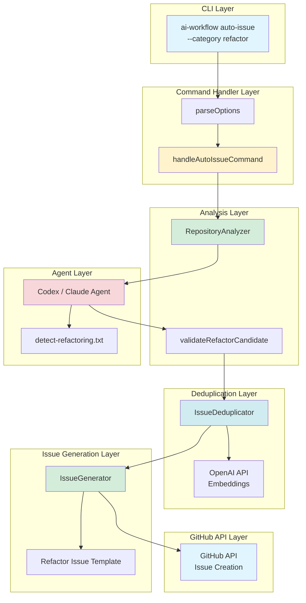
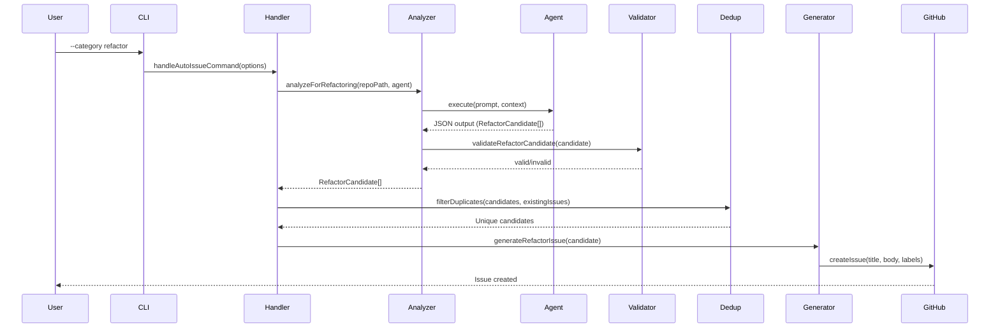
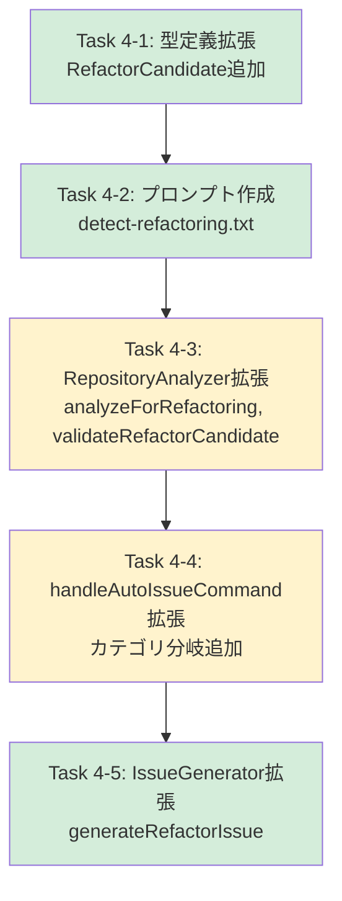

# 設計書 - Issue #127

## 0. Planning Documentの確認

本設計は、Planning Phase（Phase 0）および Requirements Phase（Phase 1）で策定された以下の計画に基づいて実施します：

### 開発計画の概要
- **実装戦略**: EXTEND（既存のPhase 1コードを拡張）
- **テスト戦略**: UNIT_INTEGRATION（ユニットテスト + 統合テスト）
- **テストコード戦略**: BOTH_TEST（既存テスト拡張 + 新規テスト作成）
- **見積もり工数**: 12〜16時間
- **複雑度**: 中程度
- **リスク評価**: 中（エージェントプロンプト設計、Phase 1互換性、言語非依存性検証）

### 実装方針の継承
Planning Documentで策定された以下の方針を踏襲します：
1. Phase 1（Issue #126）で実装済みの `RepositoryAnalyzer`, `IssueDeduplicator`, `IssueGenerator`, `handleAutoIssueCommand` を拡張
2. 新規クラス・モジュールの作成は不要（プロンプトテンプレート、型定義の追加のみ）
3. コアアーキテクチャ（エージェント→解析→重複除外→Issue生成）は変更せず、検出ロジックのみ追加
4. 既存の `--category` オプションを `'refactor'` に対応させる形で拡張

---

## 1. アーキテクチャ設計

### 1.1 システム全体図



### 1.2 コンポーネント間の関係

| コンポーネント | 役割 | 依存関係 |
|------------|------|---------|
| `parseOptions` | CLIオプション解析、`--category refactor` の処理 | なし |
| `handleAutoIssueCommand` | コマンドハンドラ、カテゴリに応じた分岐 | `RepositoryAnalyzer`, `IssueDeduplicator`, `IssueGenerator` |
| `RepositoryAnalyzer` | リファクタリング候補検出、バリデーション | Codex/Claude Agent, `validateRefactorCandidate` |
| `validateRefactorCandidate` | エージェント出力の検証 | なし |
| `IssueDeduplicator` | 重複除外（Phase 1から再利用） | OpenAI API |
| `IssueGenerator` | Issue生成（リファクタリング用テンプレート追加） | GitHub API |
| `detect-refactoring.txt` | エージェントプロンプトテンプレート | なし |

### 1.3 データフロー



---

## 2. 実装戦略判断

### 実装戦略: EXTEND

**判断根拠**:
1. **既存アーキテクチャの再利用**: Phase 1で実装済みの `RepositoryAnalyzer`, `IssueDeduplicator`, `IssueGenerator`, `handleAutoIssueCommand` を拡張する方針（Planning Document セクション2で明示）
2. **新規クラス不要**: 新規クラス・モジュールの作成は不要で、プロンプトテンプレート（`detect-refactoring.txt`）と型定義（`RefactorCandidate`）の追加のみで実現可能
3. **コアロジックは不変**: エージェント→解析→重複除外→Issue生成のフローは変更せず、検出パターンのみ追加
4. **既存オプション拡張**: `--category` オプションに `'refactor'` を追加する形で実装
5. **修正ファイル数の限定**: 既存ファイル（`src/types/auto-issue.ts`, `src/core/repository-analyzer.ts`, `src/commands/auto-issue.ts`, `src/core/issue-generator.ts`）の拡張のみで対応可能

**実装パターン**:
- `RepositoryAnalyzer` に新規メソッド `analyzeForRefactoring()` を追加
- `handleAutoIssueCommand` でカテゴリに応じた条件分岐を追加
- 既存のバグ検出機能（`analyze()`）は無変更で維持

---

## 3. テスト戦略判断

### テスト戦略: UNIT_INTEGRATION

**判断根拠**:
1. **UNITテストが必要な理由**:
   - `validateRefactorCandidate()` のバリデーション機能（最小文字数、必須フィールド、`type` フィールドの検証）
   - `parseOptions` でカテゴリ `'refactor'` を正しく処理するロジック
   - プロンプトテンプレート変数置換ロジック（エージェント実行前の準備処理）

2. **INTEGRATIONテストが必要な理由**:
   - エージェント（Codex/Claude）の実行フローE2Eテスト（実際のエージェント呼び出し）
   - `RepositoryAnalyzer.analyzeForRefactoring()` → `IssueDeduplicator` → `IssueGenerator` のフロー全体
   - dry-runモードでの統合動作確認（Issue生成スキップの検証）
   - TypeScript以外の言語（Python, Go）でのリファクタリング検出テスト

3. **BDD不要の理由**:
   - エンドユーザー向けUI機能ではなく、CLI内部の解析エンジン拡張のため
   - ビジネスシナリオよりも、技術的なバリデーションと統合フローの検証が重要
   - Phase 1のテスト戦略と整合性を保つ（バグ検出機能もUNIT_INTEGRATION）

**テスト観点**:
- **UNIT**: バリデーション、オプションパース、プロンプト変数置換
- **INTEGRATION**: エージェント実行、重複除外、Issue生成、言語非依存性

---

## 4. テストコード戦略判断

### テストコード戦略: BOTH_TEST

**判断根拠**:
1. **EXTEND_TEST（既存テスト拡張）が必要な理由**:
   - `tests/unit/repository-analyzer.test.ts` が既に存在し、Phase 1のバグ検出テストを含む
   - リファクタリング検出機能も同じ `RepositoryAnalyzer` クラスのメソッドとして追加されるため、同一ファイルでテスト
   - Phase 1のリグレッションテスト（`--category bug` が引き続き動作することを保証）を追加

2. **CREATE_TEST（新規テスト作成）が必要な理由**:
   - リファクタリング検出のE2Eテスト（エージェント実行、重複除外、Issue生成）は既存の統合テスト（`tests/integration/auto-issue-bug.test.ts`）とは独立
   - 新規に `tests/integration/auto-issue-refactor.test.ts` を作成し、リファクタリング検出特有のケース（重複コード検出、複雑度判定等）を独立してテスト
   - TypeScript以外の言語（Python, Go）でのテストケースを新規ファイルで管理

3. **テストファイル構成**:
   - **既存テスト拡張**: `tests/unit/repository-analyzer.test.ts` にリファクタリング検出のユニットテストを追加
   - **新規テスト作成**: `tests/integration/auto-issue-refactor.test.ts` を新規作成

---

## 5. 影響範囲分析

### 5.1 既存コードへの影響

| ファイル | 変更内容 | 影響度 | リスク |
|---------|---------|--------|--------|
| `src/types/auto-issue.ts` | `RefactorCandidate` 型の追加、`AutoIssueOptions.category` に `'refactor'` を追加 | 低 | 型定義の拡張のみ、既存コード無影響 |
| `src/core/repository-analyzer.ts` | `analyzeForRefactoring()` メソッド追加、`validateRefactorCandidate()` 追加 | 中 | 新規メソッド追加、既存メソッド変更なし |
| `src/commands/auto-issue.ts` | `parseOptions` でカテゴリ `'refactor'` を処理、`handleAutoIssueCommand` でリファクタリング検出を呼び出し | 中 | 条件分岐追加、Phase 1のバグ検出ロジックに影響しないよう注意 |
| `src/core/issue-generator.ts` | リファクタリング用Issueテンプレート生成ロジック追加 | 低 | 既存のバグ生成ロジックを再利用、新規条件分岐のみ |
| `src/prompts/auto-issue/detect-refactoring.txt` | 新規プロンプトファイル作成 | 低 | 新規ファイル、既存プロンプト影響なし |
| `scripts/copy-static-assets.mjs` | （変更なし、既存ロジックで自動コピー） | なし | ビルドプロセスでプロンプトファイル自動コピー |

### 5.2 依存関係の変更

#### 新規依存の追加
- **なし**: Phase 1で使用している Codex/Claude SDK、OpenAI API、fs-extra、simple-git 等をすべて再利用

#### 既存依存の変更
- **なし**: `package.json` の依存関係変更なし

### 5.3 マイグレーション要否

- **不要**: データベーススキーマ変更なし、設定ファイル変更なし
- **ビルドプロセス**: `scripts/copy-static-assets.mjs` で新規プロンプトファイル（`detect-refactoring.txt`）が自動的に `dist/prompts/auto-issue/` へコピーされる（既存ロジックで対応済み）

### 5.4 Phase 1との互換性

| 機能 | 互換性確保策 |
|------|------------|
| `--category bug` オプション | `handleAutoIssueCommand` で条件分岐、既存の `analyzer.analyze()` を引き続き呼び出し |
| バグ検出プロンプト | `src/prompts/auto-issue/detect-bugs.txt` は無変更で維持 |
| 重複除外ロジック | `IssueDeduplicator` は無変更で再利用（リファクタリング候補にも同じロジックを適用） |
| Issue生成ロジック | `IssueGenerator` にリファクタリング用テンプレート追加、バグ用テンプレートは無変更 |

**リグレッションテスト**:
- Phase 1のユニットテスト・インテグレーションテストをすべて実行し、バグ検出機能が壊れていないことを確認
- `--category bug` のテストケースを Phase 5（テストコード実装）で追加

---

## 6. 変更・追加ファイルリスト

### 6.1 新規作成ファイル

| ファイルパス | 目的 | 内容 |
|------------|------|------|
| `src/prompts/auto-issue/detect-refactoring.txt` | リファクタリング検出用プロンプトテンプレート | エージェントに4つの検出パターン（コード品質、重複、未使用、ドキュメント）を指示 |
| `tests/integration/auto-issue-refactor.test.ts` | リファクタリング検出のE2Eテスト | `--category refactor` でのエージェント実行、dry-run、言語非依存性のテスト |

### 6.2 修正が必要な既存ファイル

| ファイルパス | 修正内容 | 優先度 |
|------------|---------|--------|
| `src/types/auto-issue.ts` | `RefactorCandidate` インターフェース追加、`AutoIssueOptions.category` の型に `'refactor'` を追加 | 高 |
| `src/core/repository-analyzer.ts` | `analyzeForRefactoring()` メソッド追加、`validateRefactorCandidate()` メソッド追加 | 高 |
| `src/commands/auto-issue.ts` | `parseOptions` でカテゴリ `'refactor'` を処理、`handleAutoIssueCommand` でリファクタリング検出呼び出し | 高 |
| `src/core/issue-generator.ts` | リファクタリング用Issueテンプレート生成ロジック追加 | 中 |
| `tests/unit/repository-analyzer.test.ts` | リファクタリング検出のユニットテスト追加（`validateRefactorCandidate()` 等） | 高 |

### 6.3 削除が必要なファイル

- **なし**: 既存ファイルの削除は不要

---

## 7. 詳細設計

### 7.1 型定義拡張（`src/types/auto-issue.ts`）

#### 7.1.1 `RefactorCandidate` インターフェース

```typescript
/**
 * リファクタリング候補を表すインターフェース
 */
export interface RefactorCandidate {
  /**
   * リファクタリングの種類
   * - large-file: 大きすぎるファイル（500行以上）
   * - large-function: 大きすぎる関数（50行以上）
   * - high-complexity: 複雑な条件分岐（ネスト深さ4以上）
   * - duplication: コード重複
   * - unused-code: 未使用コード
   * - missing-docs: ドキュメント欠落
   */
  type: 'large-file' | 'large-function' | 'high-complexity' | 'duplication' | 'unused-code' | 'missing-docs';

  /**
   * 対象ファイルの相対パス
   */
  filePath: string;

  /**
   * 該当する行範囲（オプショナル）
   */
  lineRange?: {
    start: number;
    end: number;
  };

  /**
   * 問題の詳細説明（最小20文字）
   */
  description: string;

  /**
   * 推奨される改善策（最小20文字）
   */
  suggestion: string;

  /**
   * 優先度
   * - low: 低（可読性向上）
   * - medium: 中（保守性向上）
   * - high: 高（技術的負債の削減）
   */
  priority: 'low' | 'medium' | 'high';
}
```

#### 7.1.2 `AutoIssueOptions.category` 型拡張

```typescript
export interface AutoIssueOptions {
  /**
   * 検出するIssueの種類
   * - bug: バグ検出（Phase 1）
   * - refactor: リファクタリング検出（Phase 2）
   * - enhancement: 機能改善検出（将来拡張）
   * - all: すべて（将来拡張）
   */
  category: 'bug' | 'refactor' | 'enhancement' | 'all';

  // ... 既存フィールド（limit, dryRun, similarityThreshold, agent 等）
}
```

#### 7.1.3 バリデーションルール

| フィールド | バリデーション | エラーメッセージ |
|-----------|--------------|----------------|
| `type` | 6つの定義済み型のいずれかであること | `Invalid refactor type: ${type}` |
| `filePath` | 非空文字列、相対パス形式 | `Invalid file path: ${filePath}` |
| `description` | 20文字以上 | `Description too short (min 20 chars): ${description}` |
| `suggestion` | 20文字以上 | `Suggestion too short (min 20 chars): ${suggestion}` |
| `priority` | 'low', 'medium', 'high' のいずれか | `Invalid priority: ${priority}` |

### 7.2 `RepositoryAnalyzer` 拡張（`src/core/repository-analyzer.ts`）

#### 7.2.1 `analyzeForRefactoring()` メソッド

**メソッドシグネチャ**:
```typescript
/**
 * リファクタリング候補を検出する
 * @param repoPath リポジトリのルートパス
 * @param agent 使用するエージェント（Codex / Claude）
 * @returns リファクタリング候補の配列
 */
public async analyzeForRefactoring(
  repoPath: string,
  agent: CodexAgentClient | ClaudeAgentClient
): Promise<RefactorCandidate[]>
```

**実装ロジック**:

```typescript
public async analyzeForRefactoring(
  repoPath: string,
  agent: CodexAgentClient | ClaudeAgentClient
): Promise<RefactorCandidate[]> {
  logger.info('Starting refactoring candidate detection...');

  // 1. 除外パターンを考慮したファイルリストを取得
  const files = await this.getTargetFiles(repoPath);
  logger.debug(`Found ${files.length} files to analyze`);

  // 2. プロンプトテンプレート読み込み
  const promptTemplate = await fs.readFile(
    path.join(__dirname, '../../prompts/auto-issue/detect-refactoring.txt'),
    'utf-8'
  );

  // 3. ファイルリストをプロンプトに埋め込み
  const prompt = promptTemplate.replace('{files}', files.join('\n'));

  // 4. エージェント実行（ファイル参照形式で渡す）
  const context = {
    prompt,
    fileReferences: files.map(f => `@${f}`)
  };

  const result = await agent.execute(context);

  // 5. エージェント出力をパース（JSON形式を期待）
  const candidates = this.parseRefactorOutput(result.output);

  // 6. バリデーション
  const validCandidates = candidates.filter(candidate =>
    this.validateRefactorCandidate(candidate)
  );

  logger.info(`Detected ${validCandidates.length} valid refactoring candidates`);
  return validCandidates;
}
```

**エージェント出力パース**:
```typescript
/**
 * エージェント出力（JSON）をRefactorCandidate[]にパース
 */
private parseRefactorOutput(output: string): RefactorCandidate[] {
  try {
    // JSON抽出（Markdown codeblock形式を考慮）
    const jsonMatch = output.match(/```json\n([\s\S]+?)\n```/);
    const jsonString = jsonMatch ? jsonMatch[1] : output;

    const parsed = JSON.parse(jsonString);

    // 配列でない場合は配列化
    return Array.isArray(parsed) ? parsed : [parsed];
  } catch (error) {
    logger.error(`Failed to parse refactor output: ${getErrorMessage(error)}`);
    return [];
  }
}
```

#### 7.2.2 `validateRefactorCandidate()` メソッド

**メソッドシグネチャ**:
```typescript
/**
 * リファクタリング候補のバリデーション
 * @param candidate バリデーション対象の候補
 * @returns バリデーション結果（true: 有効、false: 無効）
 */
private validateRefactorCandidate(candidate: RefactorCandidate): boolean
```

**実装ロジック**:
```typescript
private validateRefactorCandidate(candidate: RefactorCandidate): boolean {
  // 必須フィールドの存在チェック
  if (!candidate.type || !candidate.filePath || !candidate.description ||
      !candidate.suggestion || !candidate.priority) {
    logger.warn('Missing required fields in refactor candidate');
    return false;
  }

  // type フィールドの値チェック
  const validTypes: RefactorCandidate['type'][] = [
    'large-file', 'large-function', 'high-complexity',
    'duplication', 'unused-code', 'missing-docs'
  ];
  if (!validTypes.includes(candidate.type)) {
    logger.warn(`Invalid refactor type: ${candidate.type}`);
    return false;
  }

  // 最小文字数チェック
  if (candidate.description.length < 20) {
    logger.warn(`Description too short (min 20 chars): ${candidate.description}`);
    return false;
  }
  if (candidate.suggestion.length < 20) {
    logger.warn(`Suggestion too short (min 20 chars): ${candidate.suggestion}`);
    return false;
  }

  // priority チェック
  const validPriorities: RefactorCandidate['priority'][] = ['low', 'medium', 'high'];
  if (!validPriorities.includes(candidate.priority)) {
    logger.warn(`Invalid priority: ${candidate.priority}`);
    return false;
  }

  return true;
}
```

#### 7.2.3 除外パターンの再利用

Phase 1で定義済みの除外パターン（`EXCLUDED_DIRECTORIES`, `EXCLUDED_FILE_PATTERNS`）を再利用：

```typescript
// 既存の定義を再利用（変更なし）
private readonly EXCLUDED_DIRECTORIES = [
  'node_modules', 'vendor', '.git', 'dist', 'build', 'out', 'target',
  '__pycache__', '.venv', 'venv', '.pytest_cache', '.mypy_cache',
  'coverage', '.next', '.nuxt'
];

private readonly EXCLUDED_FILE_PATTERNS = [
  '*.min.js', '*.bundle.js', '*.generated.*', '*.g.go', '*.pb.go', '*.gen.ts',
  'package-lock.json', 'yarn.lock', 'pnpm-lock.yaml', 'Gemfile.lock',
  'poetry.lock', 'Pipfile.lock', 'go.sum', 'Cargo.lock', 'composer.lock'
];
```

### 7.3 `handleAutoIssueCommand` 拡張（`src/commands/auto-issue.ts`）

#### 7.3.1 `parseOptions` 拡張

**既存の実装に追加**:
```typescript
function parseOptions(args: string[]): AutoIssueOptions {
  // ... 既存のパース処理

  // category オプションのパース
  const categoryIndex = args.indexOf('--category');
  const category = categoryIndex !== -1 && args[categoryIndex + 1]
    ? args[categoryIndex + 1] as AutoIssueOptions['category']
    : 'bug'; // デフォルトは 'bug'（Phase 1 MVP）

  // バリデーション
  const validCategories: AutoIssueOptions['category'][] = ['bug', 'refactor', 'enhancement', 'all'];
  if (!validCategories.includes(category)) {
    throw new Error(`Invalid category: ${category}. Valid values: ${validCategories.join(', ')}`);
  }

  return {
    category,
    // ... 既存フィールド（limit, dryRun, similarityThreshold, agent 等）
  };
}
```

#### 7.3.2 `handleAutoIssueCommand` 拡張

**カテゴリに応じた条件分岐を追加**:
```typescript
export async function handleAutoIssueCommand(options: AutoIssueOptions): Promise<void> {
  logger.info(`Starting auto-issue command (category: ${options.category})`);

  // 1. エージェント初期化（Phase 1と同じ）
  const agent = await initializeAgent(options.agent);

  // 2. カテゴリに応じた分析メソッドを呼び出し
  const analyzer = new RepositoryAnalyzer();
  let candidates: (BugCandidate | RefactorCandidate)[] = [];

  if (options.category === 'bug') {
    // Phase 1: バグ検出
    candidates = await analyzer.analyze(process.cwd(), agent);
  } else if (options.category === 'refactor') {
    // Phase 2: リファクタリング検出
    candidates = await analyzer.analyzeForRefactoring(process.cwd(), agent);
  } else if (options.category === 'all') {
    // 将来拡張: バグ + リファクタリング
    const bugs = await analyzer.analyze(process.cwd(), agent);
    const refactors = await analyzer.analyzeForRefactoring(process.cwd(), agent);
    candidates = [...bugs, ...refactors];
  } else {
    throw new Error(`Unsupported category: ${options.category}`);
  }

  logger.info(`Detected ${candidates.length} candidates`);

  // 3. 重複除外（Phase 1と同じロジックを再利用）
  const deduplicator = new IssueDeduplicator();
  const uniqueCandidates = await deduplicator.filterDuplicates(candidates, options.similarityThreshold);

  logger.info(`After deduplication: ${uniqueCandidates.length} unique candidates`);

  // 4. Issue生成（dry-runモード考慮）
  if (options.dryRun) {
    logger.info('[DRY RUN] Issues would be created for the following candidates:');
    uniqueCandidates.forEach((candidate, index) => {
      logger.info(`[${index + 1}] ${candidate.filePath}: ${candidate.description}`);
    });
    return;
  }

  // 5. 実際のIssue生成
  const generator = new IssueGenerator();
  for (const candidate of uniqueCandidates.slice(0, options.limit)) {
    if (options.category === 'bug') {
      await generator.generateBugIssue(candidate as BugCandidate);
    } else if (options.category === 'refactor') {
      await generator.generateRefactorIssue(candidate as RefactorCandidate);
    }
  }

  logger.info('Auto-issue command completed successfully');
}
```

### 7.4 `IssueGenerator` 拡張（`src/core/issue-generator.ts`）

#### 7.4.1 `generateRefactorIssue()` メソッド

**メソッドシグネチャ**:
```typescript
/**
 * リファクタリング候補からGitHub Issueを生成
 * @param candidate リファクタリング候補
 * @returns 生成されたIssueのURL
 */
public async generateRefactorIssue(candidate: RefactorCandidate): Promise<string>
```

**実装ロジック**:
```typescript
public async generateRefactorIssue(candidate: RefactorCandidate): Promise<string> {
  // 1. タイトル生成
  const title = this.buildRefactorIssueTitle(candidate);

  // 2. 本文生成
  const body = this.buildRefactorIssueBody(candidate);

  // 3. ラベル設定
  const labels = this.buildRefactorLabels(candidate);

  // 4. GitHub API で Issue 作成
  const githubClient = new GitHubClient();
  const issue = await githubClient.createIssue({
    title,
    body,
    labels
  });

  logger.info(`Created refactor issue: ${issue.html_url}`);
  return issue.html_url;
}
```

#### 7.4.2 Issueタイトル生成

```typescript
private buildRefactorIssueTitle(candidate: RefactorCandidate): string {
  const typeLabels: Record<RefactorCandidate['type'], string> = {
    'large-file': 'Large File',
    'large-function': 'Large Function',
    'high-complexity': 'High Complexity',
    'duplication': 'Code Duplication',
    'unused-code': 'Unused Code',
    'missing-docs': 'Missing Documentation'
  };

  const typeLabel = typeLabels[candidate.type];
  const fileName = path.basename(candidate.filePath);

  return `[Refactor] ${typeLabel}: ${fileName}`;
}
```

#### 7.4.3 Issue本文生成

```typescript
private buildRefactorIssueBody(candidate: RefactorCandidate): string {
  const lineRangeStr = candidate.lineRange
    ? `Lines ${candidate.lineRange.start}-${candidate.lineRange.end}`
    : 'Entire file';

  return `
## リファクタリング候補

**ファイル**: \`${candidate.filePath}\`
**対象範囲**: ${lineRangeStr}
**優先度**: ${candidate.priority.toUpperCase()}

### 問題点

${candidate.description}

### 推奨改善策

${candidate.suggestion}

### 期待される効果

- 可読性の向上
- 保守性の向上
- 技術的負債の削減

---

🤖 このIssueは [AI Workflow Agent](https://github.com/tielec/ai-workflow-agent) により自動生成されました。
`.trim();
}
```

#### 7.4.4 ラベル設定

```typescript
private buildRefactorLabels(candidate: RefactorCandidate): string[] {
  const labels = ['refactor'];

  // 優先度ラベル
  labels.push(`priority:${candidate.priority}`);

  // 種類別ラベル
  const typeLabels: Record<RefactorCandidate['type'], string> = {
    'large-file': 'code-quality',
    'large-function': 'code-quality',
    'high-complexity': 'code-quality',
    'duplication': 'code-duplication',
    'unused-code': 'dead-code',
    'missing-docs': 'documentation'
  };

  labels.push(typeLabels[candidate.type]);

  return labels;
}
```

### 7.5 プロンプトテンプレート設計（`src/prompts/auto-issue/detect-refactoring.txt`）

```text
# リファクタリング候補検出タスク

このリポジトリをレビューし、リファクタリングが必要な箇所を特定してください。

## 分析対象ファイル

{files}

## 検出観点

以下の4つの観点で分析してください：

### 1. コード品質問題
- **大きすぎるファイル**: 500行以上のファイル
- **大きすぎる関数**: 50行以上の関数
- **複雑な条件分岐**: ネスト深さ4以上の条件分岐
- **責務が多すぎるクラス**: 単一責任原則に違反

### 2. コード重複
- 類似したコードブロック（10行以上）
- コピー＆ペーストされたロジック
- 共通化可能なパターン

### 3. 未使用コード
- 未使用のインポート・変数・関数
- Dead code（到達不能コード）
- 未参照の型定義

### 4. ドキュメント品質
- コメント・ドキュメントが欠落している関数・クラス
- 古い・不正確なドキュメント
- README等のプロジェクトドキュメントの更新漏れ

## 出力形式

**重要**: 検出結果は必ずJSON配列形式で出力してください。各候補は以下の形式に従ってください：

```json
[
  {
    "type": "large-file",
    "filePath": "src/services/user-service.ts",
    "description": "ファイルサイズが750行あり、複数の責務（認証、プロフィール管理、通知）を持っている",
    "suggestion": "認証ロジックを auth-service.ts に、通知ロジックを notification-service.ts に分割することを推奨",
    "priority": "high"
  },
  {
    "type": "duplication",
    "filePath": "src/utils/validators.ts",
    "lineRange": { "start": 45, "end": 60 },
    "description": "emailバリデーションロジックが3箇所で重複している",
    "suggestion": "共通のvalidateEmail関数を作成し、再利用することを推奨",
    "priority": "medium"
  },
  {
    "type": "missing-docs",
    "filePath": "src/core/data-processor.ts",
    "lineRange": { "start": 120, "end": 150 },
    "description": "processData関数にJSDocコメントがなく、複雑なロジックの理解が困難",
    "suggestion": "パラメータ、戻り値、エラーケースを含むJSDocコメントを追加することを推奨",
    "priority": "low"
  }
]
```

## 検出基準

- **type**: 以下のいずれか
  - `large-file`: 大きすぎるファイル
  - `large-function`: 大きすぎる関数
  - `high-complexity`: 複雑な条件分岐
  - `duplication`: コード重複
  - `unused-code`: 未使用コード
  - `missing-docs`: ドキュメント欠落
- **filePath**: リポジトリルートからの相対パス
- **lineRange**: 該当する行範囲（オプショナル、該当する場合のみ指定）
- **description**: 問題の具体的な説明（最低20文字）
- **suggestion**: 推奨される改善策（最低20文字）
- **priority**: 優先度（`low`, `medium`, `high`）

## 注意事項

- **言語非依存**: TypeScript以外の言語（Python, Go, Java等）も同様の基準で分析してください
- **除外パターン**: node_modules/, dist/, build/, .git/ 等の自動生成ディレクトリは分析対象外です
- **最小20文字**: description と suggestion は最低20文字以上で記述してください
- **JSON形式厳守**: 出力は必ずJSON配列形式（```json ... ```）で返してください

リファクタリング候補を検出してください。
```

**プロンプト変数**:
- `{files}`: 分析対象ファイルのリスト（`RepositoryAnalyzer.analyzeForRefactoring()` で埋め込み）

---

## 8. セキュリティ考慮事項

### 8.1 認証・認可

| 項目 | 対策 |
|------|------|
| エージェントAPIキー | 環境変数（`CODEX_API_KEY`, `CLAUDE_CODE_CREDENTIALS_PATH`）で管理、ハードコーディング禁止 |
| GitHub API トークン | 環境変数（`GITHUB_TOKEN`）で管理、メタデータに記録しない |
| プロンプトインジェクション | ユーザー入力（リポジトリパス等）をエスケープ処理、テンプレート変数のみ使用 |

### 8.2 データ保護

| 項目 | 対策 |
|------|------|
| シークレットマスキング | エージェント出力に含まれる可能性のあるAPIキー、トークンを自動マスキング（Phase 1で実装済み） |
| ファイルアクセス制限 | 除外パターン（`EXCLUDED_DIRECTORIES`, `EXCLUDED_FILE_PATTERNS`）により機密ファイルを分析対象外に |
| エージェント出力検証 | `validateRefactorCandidate()` でエージェント出力を検証、不正な候補を除外 |

### 8.3 セキュリティリスクと対策

| リスク | 影響 | 対策 |
|--------|------|------|
| プロンプトインジェクション攻撃 | 中 | テンプレート変数のみ使用、ユーザー入力をエスケープ |
| APIキー漏洩 | 高 | 環境変数で管理、メタデータ・ログに記録しない |
| 不正なファイルアクセス | 中 | 除外パターンによるフィルタリング、相対パス検証 |

---

## 9. 非機能要件への対応

### 9.1 パフォーマンス要件

| 項目 | 要件 | 対策 |
|------|------|------|
| エージェント実行時間 | 1000行のリポジトリで5分以内 | ファイルリストをフィルタリング、除外パターン適用 |
| メモリ使用量 | 大規模リポジトリ（10000行以上）でも1GB以内 | ファイル参照形式（`@filepath`）でエージェントに渡し、全ファイルをメモリ展開しない |
| API呼び出し回数 | 1回のリファクタリング検出で最大3回まで | エージェント実行1回、重複検出（OpenAI API）最大2回（TF-IDF + LLM） |

### 9.2 スケーラビリティ

| 項目 | 対策 |
|------|------|
| 大規模リポジトリ対応 | ファイル数制限（`--limit` オプション）、除外パターン適用 |
| 並列処理 | Phase 1 MVPでは非対応、将来拡張でファイルグループ単位の並列分析を検討 |

### 9.3 保守性

| 項目 | 対策 |
|------|------|
| コードの再利用性 | Phase 1の `IssueDeduplicator`, `IssueGenerator` を可能な限り再利用 |
| 拡張性 | `--category enhancement` 追加時に最小限の変更で対応可能な設計（条件分岐追加のみ） |
| テスタビリティ | ユニットテスト（`validateRefactorCandidate()` 等）と統合テスト（E2E）で検証 |

### 9.4 可用性・信頼性

| 項目 | 対策 |
|------|------|
| エージェントフォールバック | Codex実行失敗時にClaudeへ自動フォールバック（Phase 1と同様） |
| エラーハンドリング | エージェント実行エラー、パースエラー、GitHub APIエラーを適切にハンドリング |
| リトライロジック | 一時的なAPIエラー（429 Too Many Requests等）に対して最大3回までリトライ |

---

## 10. 実装の順序

### 10.1 推奨実装順序

以下の順序で実装することを推奨します（Planning Documentの「4. タスク分割」に基づく）：

| 順序 | フェーズ | タスク | 依存関係 |
|------|--------|--------|---------|
| 1 | Phase 1: 要件定義 | （完了済み） | なし |
| 2 | **Phase 2: 設計** | **（現在のフェーズ）** | Phase 1 |
| 3 | Phase 3: テストシナリオ | ユニットテスト・統合テストシナリオ作成 | Phase 2 |
| 4 | Phase 4: 実装 | Task 4-1: 型定義の拡張 | Phase 2 |
| 5 | Phase 4: 実装 | Task 4-2: プロンプトテンプレートの作成 | Task 4-1 |
| 6 | Phase 4: 実装 | Task 4-3: `RepositoryAnalyzer` の拡張 | Task 4-2 |
| 7 | Phase 4: 実装 | Task 4-4: `handleAutoIssueCommand` の拡張 | Task 4-3 |
| 8 | Phase 4: 実装 | Task 4-5: `IssueGenerator` の拡張 | Task 4-4 |
| 9 | Phase 5: テストコード実装 | ユニットテスト実装 | Phase 4 |
| 10 | Phase 5: テストコード実装 | インテグレーションテスト実装 | Phase 4 |
| 11 | Phase 6: テスト実行 | テスト実行・デバッグ | Phase 5 |
| 12 | Phase 7: ドキュメント | README.md, CLAUDE.md 更新 | Phase 6 |
| 13 | Phase 8: レポート | 実装完了レポート作成 | Phase 7 |

### 10.2 Phase 4（実装）の詳細順序

Phase 4（実装）では、以下の順序で実装することで依存関係を満たします：



**クリティカルパス**:
- Task 4-1 → Task 4-2 → Task 4-3（最も時間がかかるため、ここでの遅延が全体に影響）

**並行実行可能**:
- Task 4-5（`IssueGenerator` 拡張）は Task 4-4 完了後すぐに開始可能

### 10.3 依存関係の考慮

| 実装タスク | 依存する成果物 | ブロッカー |
|-----------|--------------|-----------|
| Task 4-2: プロンプト作成 | Task 4-1: 型定義（出力形式の理解） | 型定義未完了 |
| Task 4-3: RepositoryAnalyzer拡張 | Task 4-2: プロンプト（エージェント実行） | プロンプト未完成 |
| Task 4-4: handleAutoIssueCommand拡張 | Task 4-3: analyzeForRefactoring（呼び出し先） | analyzeForRefactoring未実装 |
| Task 4-5: IssueGenerator拡張 | Task 4-1: 型定義（RefactorCandidate） | 型定義未完了 |

---

## 11. 設計決定事項

### 11.1 アーキテクチャ決定

| 決定事項 | 選択肢 | 選択理由 |
|---------|--------|---------|
| 実装戦略 | EXTEND（既存コード拡張） | Phase 1のアーキテクチャを再利用、新規クラス不要 |
| テスト戦略 | UNIT_INTEGRATION | バリデーション（UNIT）とエージェント実行フロー（INTEGRATION）の両方が必要 |
| テストコード戦略 | BOTH_TEST（既存テスト拡張 + 新規テスト作成） | 既存テストにリグレッションテスト追加、リファクタリング検出は独立したテストファイルで管理 |
| プロンプト設計 | 4つの検出パターンを1つのプロンプトに統合 | エージェント実行回数を最小化（1回で全パターン検出） |
| エージェント出力形式 | JSON配列（RefactorCandidate[]） | Phase 1のバグ検出と同じ形式で統一、パースロジック再利用 |

### 11.2 技術選択

| 項目 | 選択 | 理由 |
|------|------|------|
| エージェント | Codex / Claude（既存） | Phase 1で実装済み、フォールバック機構も再利用 |
| 重複検出 | OpenAI API（既存） | Phase 1で実装済み、TF-IDF + LLM判定の2段階アルゴリズム |
| Issue生成 | GitHub API（既存） | Phase 1で実装済み、Octokit ラッパー再利用 |
| プロンプトテンプレート | テキストファイル（.txt） | Phase 1と同じ形式、ビルドプロセスで自動コピー |

### 11.3 スコープ決定

| 項目 | Phase 2 MVP | 将来拡張 |
|------|-----------|---------|
| Issue種類 | `--category refactor` のみ | `--category all` でバグ + リファクタリング同時検出 |
| 検出パターン | 4つ（コード品質、重複、未使用、ドキュメント） | ユーザー定義の検出ルール |
| サポート言語 | すべて（言語非依存） | 言語固有のルール（例: TypeScript の型チェック） |
| 重複検出 | 既存Issueとの重複チェック | 他のリポジトリとの重複チェック |

---

## 12. 品質ゲート確認

本設計書は、以下の品質ゲート（Phase 2）を満たしています：

- [x] **実装戦略の判断根拠が明記されている**（セクション2）
  - EXTEND戦略を選択した理由を5つの具体的根拠で説明

- [x] **テスト戦略の判断根拠が明記されている**（セクション3）
  - UNIT_INTEGRATION戦略を選択した理由を3つの観点で説明

- [x] **テストコード戦略の判断根拠が明記されている**（セクション4）
  - BOTH_TEST戦略を選択した理由を2つの観点で説明

- [x] **既存コードへの影響範囲が分析されている**（セクション5.1）
  - 5つのファイルの変更内容、影響度、リスクを表形式で整理

- [x] **変更が必要なファイルがリストアップされている**（セクション6）
  - 新規作成ファイル2つ、修正ファイル5つを相対パスで明示

- [x] **設計が実装可能である**（セクション7）
  - 型定義、メソッドシグネチャ、実装ロジック、プロンプトテンプレートを具体的に記述

---

## 13. 次フェーズ（Test Scenario Phase）への引き継ぎ事項

### 13.1 テストシナリオ作成に必要な情報

1. **ユニットテストシナリオ**:
   - `validateRefactorCandidate()` の正常系・異常系（セクション7.2.2参照）
   - `parseOptions` でカテゴリ `'refactor'` を正しく処理するケース（セクション7.3.1参照）
   - プロンプトテンプレート変数置換ロジック

2. **インテグレーションテストシナリオ**:
   - `--category refactor` でリファクタリング候補を検出するE2Eテスト
   - dry-runモードでIssue作成をスキップするテスト
   - TypeScript以外の言語（Python, Go等）でのテストケース設計（セクション5.4参照）

3. **リグレッションテストシナリオ**:
   - `--category bug` で既存のバグ検出機能が引き続き動作することを確認（Phase 1互換性）

### 13.2 テストデータ準備

- **サンプルリポジトリ**: TypeScript, Python, Goのサンプルリポジトリを用意
- **リファクタリング候補**: 各検出パターン（大きすぎるファイル、重複コード等）のサンプルコードを準備
- **エージェント出力モック**: JSON形式のリファクタリング候補データ

### 13.3 受け入れ基準の確認

Requirements Document（セクション6）で定義された10個の受け入れ基準（AC-1〜AC-10）をすべて満たすテストシナリオを作成してください。

---

**設計書作成日**: 2025-01-30
**作成者**: AI Workflow Agent (Design Phase)
**レビュー予定日**: Phase 3完了後（クリティカルシンキングレビュー）
