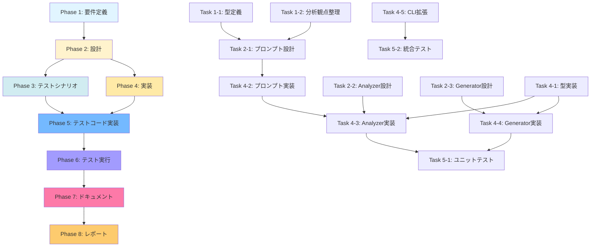

# プロジェクト計画書 - Issue #128

**Issue**: auto-issue: Phase 3 - 機能拡張提案（創造的提案）機能の実装
**日付**: 2025-01-30
**担当フェーズ**: Phase 0 (Planning)

---

## 1. Issue分析

### 複雑度

**判定: 複雑（Complex）**

**理由**:
- 新規カテゴリ（`enhancement`）の追加により、既存の `auto-issue` アーキテクチャを大幅に拡張
- エージェント（Codex/Claude）による創造的提案生成という、従来のバグ検出・リファクタリング検出とは異なる分析アプローチが必要
- リポジトリ特性分析（技術スタック、アーキテクチャ、既存機能の理解）という高度なコンテキスト理解が要求される
- プロンプト設計が複雑（創造的発想を引き出すための自由度の高いプロンプト）
- 既存の重複検出ロジック（IssueDeduplicator）をenhancementカテゴリに適用する際の調整が必要
- 多言語リポジトリ対応（TypeScript以外のリポジトリでも動作）の検証が必要

### 見積もり工数

**合計: 40〜56時間（5〜7営業日）**

**根拠**:
- リポジトリ特性分析機能の実装: 8〜12h（複雑なプロンプト設計とエージェント統合）
- 創造的提案生成機能の実装: 10〜14h（フリーフォーマットの提案生成とパース）
- EnhancementProposal型定義とバリデーション: 4〜6h（新規データ構造の設計）
- CLIオプション拡張（`--creative-mode`）: 2〜3h（既存コマンドの拡張）
- 既存機能の統合（重複検出、Issue生成）: 4〜6h（IssueDeduplicator/IssueGenerator拡張）
- テストコード実装（ユニット・統合）: 8〜12h（新規機能の網羅的テスト）
- ドキュメント更新（CLAUDE.md、README.md）: 4〜6h（詳細なCLI使用例とアーキテクチャ図）

### リスク評価

**判定: 高（High）**

**主要リスク**:
1. **エージェント出力の構造化困難**: 創造的提案は自由記述のため、JSONパースが失敗するリスクが高い
2. **提案品質のばらつき**: エージェントが生成する提案の具体性・実現可能性が不安定
3. **リポジトリ特性の誤解**: エージェントがリポジトリの文脈を正しく理解できないリスク
4. **重複検出の精度低下**: enhancementカテゴリは抽象度が高く、既存Issueとの重複判定が難しい
5. **多言語対応の検証不足**: TypeScript以外のリポジトリで動作検証が不十分な可能性

---

## 2. 実装戦略判断

### 実装戦略: EXTEND

**判断根拠**:

このIssueは、既存の `auto-issue` 機能（Phase 1: バグ検出、Phase 2: リファクタリング検出）を **拡張** する形で実装します。以下の理由から **EXTEND** 戦略が最適です：

1. **既存アーキテクチャの活用**: `RepositoryAnalyzer`、`IssueDeduplicator`、`IssueGenerator` という3つのコアモジュールは再利用可能
2. **新規メソッドの追加**: `RepositoryAnalyzer.analyzeForEnhancements()` という新規メソッドを追加（Phase 1/2の `analyze()`, `analyzeForRefactoring()` と並列）
3. **既存フローの拡張**: `handleAutoIssueCommand()` に `category === 'enhancement'` の分岐を追加（既存の `bug`/`refactor` 分岐と同様）
4. **型定義の拡張**: `EnhancementProposal` 型を `BugCandidate`/`RefactorCandidate` と並列に追加
5. **プロンプトテンプレートの追加**: `src/prompts/auto-issue/detect-enhancements.txt` を新規作成（既存の `detect-bugs.txt`, `detect-refactoring.txt` と同様）

**CREATE戦略を選ばない理由**:
- 新規サブシステムではなく、既存の `auto-issue` 機能の第3カテゴリとして実装
- 重複検出、Issue生成、エージェント統合などの既存ロジックを最大限再利用

**REFACTOR戦略を選ばない理由**:
- 既存コードの構造改善ではなく、新規機能の追加が目的

---

### テスト戦略: UNIT_INTEGRATION

**判断根拠**:

このIssueでは、**ユニットテスト** と **インテグレーションテスト** の両方が必要です。以下の理由から **UNIT_INTEGRATION** 戦略が最適です：

#### ユニットテスト（UNIT）が必要な理由:
1. **EnhancementProposal型のバリデーション**: `validateEnhancementProposal()` メソッドのロジック検証
2. **プロンプト変数置換**: `executeAgentWithFallback()` での変数置換ロジックのテスト
3. **提案タイプごとの処理分岐**: `type` フィールド（`improvement`, `integration`, `automation` 等）ごとのラベル生成ロジック
4. **エラーハンドリング**: エージェント失敗時のフォールバック動作の検証

#### インテグレーションテスト（INTEGRATION）が必要な理由:
1. **エージェント統合**: Codex/Claude エージェントとの実際の連携動作の確認
2. **GitHub API連携**: `IssueGenerator.generateEnhancementIssue()` による実際のIssue作成フローの検証
3. **エンドツーエンドフロー**: `handleAutoIssueCommand(category: 'enhancement')` → リポジトリ分析 → 重複検出 → Issue作成 の全体フロー
4. **重複検出の精度**: `IssueDeduplicator` がenhancementカテゴリでも正しく動作するか確認

#### BDD_ONLYを選ばない理由:
- ユーザーストーリーよりも、内部ロジックの正確性検証が優先
- CLI動作よりも、エージェント統合とデータ処理ロジックのテストが重要

#### UNIT_ONLY/INTEGRATION_ONLYを選ばない理由:
- ユニットテストだけでは、エージェント統合の実動作を検証できない
- インテグレーションテストだけでは、バリデーションロジックの詳細なエッジケース検証が不足

---

### テストコード戦略: BOTH_TEST

**判断根拠**:

このIssueでは、**既存テストファイルの拡張** と **新規テストファイルの作成** の両方が必要です。以下の理由から **BOTH_TEST** 戦略が最適です：

#### 既存テストファイル拡張（EXTEND_TEST）が必要な箇所:
1. **`tests/unit/core/repository-analyzer.test.ts`**:
   - `analyzeForEnhancements()` メソッドの追加テスト
   - プロンプト読み込み・変数置換のテストケース追加

2. **`tests/unit/core/issue-generator.test.ts`**:
   - `generateEnhancementIssue()` メソッドの追加テスト
   - ラベル生成・タイトル生成のテストケース追加

3. **`tests/unit/commands/auto-issue.test.ts`**:
   - `category: 'enhancement'` の分岐テストケース追加
   - `--creative-mode` オプションのパース検証

#### 新規テストファイル作成（CREATE_TEST）が必要な箇所:
1. **`tests/unit/validators/enhancement-validator.test.ts`**:
   - `validateEnhancementProposal()` の専用テスト
   - 各フィールド（type, description, implementation_hints等）のバリデーション

2. **`tests/integration/auto-issue-enhancement.test.ts`**:
   - enhancementカテゴリのエンドツーエンドテスト
   - リポジトリ分析 → 提案生成 → Issue作成の統合フロー

**理由**:
- 既存の `repository-analyzer.test.ts`, `issue-generator.test.ts` は、Phase 1/2の機能をテストしており、Phase 3の新規メソッドを追加するのが自然
- 一方、EnhancementProposal型のバリデーションは独立性が高く、専用テストファイルで管理する方が保守性が高い
- インテグレーションテストは、enhancementカテゴリ固有のフローを検証するため、新規ファイルで分離

---

## 3. 影響範囲分析

### 既存コードへの影響

#### 変更が必要なファイル・モジュール

1. **`src/core/repository-analyzer.ts`** (拡張):
   - 新規メソッド追加: `analyzeForEnhancements(repoPath, agent): Promise<EnhancementProposal[]>`
   - プロンプトパス: `src/prompts/auto-issue/detect-enhancements.txt` を読み込み
   - バリデーションメソッド追加: `validateEnhancementProposal()`

2. **`src/core/issue-generator.ts`** (拡張):
   - 新規メソッド追加: `generateEnhancementIssue(candidate, agent, dryRun): Promise<IssueCreationResult>`
   - タイトル生成: `generateEnhancementTitle()`
   - ラベル生成: `generateEnhancementLabels()`
   - フォールバック本文生成: `createEnhancementFallbackBody()`

3. **`src/commands/auto-issue.ts`** (拡張):
   - `handleAutoIssueCommand()` に `category === 'enhancement'` の分岐追加
   - 新規ヘルパー関数: `processEnhancementCandidates()`
   - `parseOptions()` で `--creative-mode` オプションのパース追加

4. **`src/types/auto-issue.ts`** (拡張):
   - 新規型定義追加: `EnhancementProposal` インターフェース
   - `AutoIssueOptions` インターフェースに `creativeMode?: boolean` フィールド追加

5. **`src/main.ts`** (拡張):
   - `auto-issue` コマンドのCLI定義に `--creative-mode` オプション追加

### 依存関係の変更

#### 新規依存の追加

**なし**

#### 既存依存の変更

**なし**

**理由**:
- Phase 1/2と同じエージェントクライアント（`CodexAgentClient`, `ClaudeAgentClient`）を使用
- 既存のGitHub API統合（`@octokit/rest`）を使用
- 追加のNPMパッケージは不要

### マイグレーション要否

#### データベーススキーマ変更

**不要**

**理由**: このプロジェクトはデータベースを使用していない

#### 設定ファイル変更

**不要**

**理由**:
- 環境変数は既存のものを使用（`CODEX_API_KEY`, `CLAUDE_CODE_CREDENTIALS_PATH`, `GITHUB_TOKEN` 等）
- 新規環境変数の追加は不要

#### メタデータ変更

**不要**

**理由**: `.ai-workflow/issue-*/metadata.json` への影響なし（`auto-issue` コマンドはワークフローメタデータを使用しない）

---

## 4. タスク分割

### Phase 1: 要件定義 (見積もり: 4〜6h)

- [ ] Task 1-1: EnhancementProposal型定義の詳細化 (2〜3h)
  - `src/types/auto-issue.ts` に `EnhancementProposal` インターフェースを追加
  - 各フィールド（type, description, rationale, implementation_hints, expected_impact, effort_estimate, related_files）のTSDoc記述
  - バリデーション要件の明確化（文字数制限、必須フィールド等）

- [ ] Task 1-2: リポジトリ分析観点の整理 (2〜3h)
  - プロジェクト構造分析（技術スタック、アーキテクチャ、ディレクトリ構成）の要件定義
  - 既存機能の理解方法（README.md、設計ドキュメント、コード解析）の明確化
  - ドキュメント分析（ROADMAP、TODO、技術的負債の記述）の要件定義

### Phase 2: 設計 (見積もり: 8〜12h)

- [x] Task 2-1: プロンプトテンプレート設計 (4〜6h)
  - `src/prompts/auto-issue/detect-enhancements.txt` のドラフト作成
  - リポジトリ分析セクションの設計（技術スタック検出、アーキテクチャ理解、ドキュメント解析）
  - 提案生成セクションの設計（既存機能改善、新機能提案、創造的発想の促進）
  - 出力形式の設計（JSON構造、フィールド定義、サンプル出力）
  - `--creative-mode` オプション使用時のプロンプト差分設計

- [x] Task 2-2: RepositoryAnalyzer拡張設計 (2〜3h)
  - `analyzeForEnhancements()` メソッドのシグネチャ設計
  - `validateEnhancementProposal()` バリデーションロジックの設計
  - エージェント実行フローの設計（Codex → Claude フォールバック）

- [x] Task 2-3: IssueGenerator拡張設計 (2〜3h)
  - `generateEnhancementIssue()` メソッドのシグネチャ設計
  - タイトル生成ロジックの設計（提案タイプごとのプレフィックス）
  - ラベル生成ロジックの設計（`auto-generated`, `enhancement`, `priority:*`, タイプ別ラベル）
  - フォールバックテンプレートの設計

### Phase 3: テストシナリオ (見積もり: 4〜6h)

- [x] Task 3-1: ユニットテストシナリオ作成 (2〜3h)
  - `validateEnhancementProposal()` のテストケース定義（正常系、異常系、エッジケース）
  - `parseOptions()` の `--creative-mode` パーステスト
  - タイトル・ラベル生成ロジックのテストケース定義

- [x] Task 3-2: インテグレーションテストシナリオ作成 (2〜3h)
  - エンドツーエンドフロー（`category: 'enhancement'`）のテストシナリオ
  - dry-runモードのテストシナリオ
  - エージェントフォールバック動作のテストシナリオ

### Phase 4: 実装 (見積もり: 12〜18h)

- [x] Task 4-1: EnhancementProposal型定義の実装 (1〜2h)
  - `src/types/auto-issue.ts` に型定義追加
  - TSDocコメント追加

- [x] Task 4-2: プロンプトテンプレート実装 (2〜3h)
  - `src/prompts/auto-issue/detect-enhancements.txt` 作成
  - 変数プレースホルダー（`{repository_path}`, `{output_file_path}`, `{creative_mode}` 等）の埋め込み

- [x] Task 4-3: RepositoryAnalyzer拡張実装 (4〜6h)
  - `analyzeForEnhancements()` メソッド実装
  - `validateEnhancementProposal()` バリデーションロジック実装
  - プロンプト読み込み・変数置換・エージェント実行の統合

- [x] Task 4-4: IssueGenerator拡張実装 (3〜5h)
  - `generateEnhancementIssue()` メソッド実装
  - `generateEnhancementTitle()`, `generateEnhancementLabels()` 実装
  - `createEnhancementFallbackBody()` フォールバックテンプレート実装

- [x] Task 4-5: CLIコマンド拡張実装 (2〜3h)
  - `src/commands/auto-issue.ts` に `category === 'enhancement'` 分岐追加
  - `processEnhancementCandidates()` ヘルパー関数実装
  - `src/main.ts` に `--creative-mode` オプション追加

### Phase 5: テストコード実装 (見積もり: 8〜12h)

- [ ] Task 5-1: ユニットテスト実装 (4〜6h)
  - `tests/unit/validators/enhancement-validator.test.ts` 作成
  - `tests/unit/core/repository-analyzer.test.ts` に `analyzeForEnhancements()` テスト追加
  - `tests/unit/core/issue-generator.test.ts` に `generateEnhancementIssue()` テスト追加
  - `tests/unit/commands/auto-issue.test.ts` に `--creative-mode` パーステスト追加

- [ ] Task 5-2: インテグレーションテスト実装 (4〜6h)
  - `tests/integration/auto-issue-enhancement.test.ts` 作成
  - エンドツーエンドフローのテスト実装
  - dry-runモードのテスト実装
  - エージェントフォールバック動作のテスト実装

### Phase 6: テスト実行 (見積もり: 2〜4h)

- [ ] Task 6-1: ユニットテスト実行と修正 (1〜2h)
  - `npm run test:unit` 実行
  - 失敗したテストケースの原因調査と修正
  - カバレッジレポート確認（目標: 80%以上）

- [ ] Task 6-2: インテグレーションテスト実行と修正 (1〜2h)
  - `npm run test:integration` 実行
  - 失敗したテストケースの原因調査と修正
  - TypeScript以外のリポジトリでの動作検証（Go、Python等）

### Phase 7: ドキュメント (見積もり: 4〜6h)

- [ ] Task 7-1: CLAUDE.md更新 (2〜3h)
  - `auto-issue` コマンドの `--category enhancement` オプション説明追加
  - `--creative-mode` オプション説明追加
  - Phase 3実装完了のマーク追加
  - EnhancementProposal型の説明追加

- [ ] Task 7-2: README.md更新 (2〜3h)
  - `auto-issue` コマンドのCLI使用例追加（`--category enhancement`）
  - `--creative-mode` オプションの説明追加
  - enhancementカテゴリの使用例追加（プレビューモード、本番実行）

### Phase 8: レポート (見積もり: 2〜3h)

- [ ] Task 8-1: 実装完了レポート作成 (2〜3h)
  - Issue #128の受け入れ基準チェック
  - テスト結果サマリー作成（カバレッジ、成功率）
  - 既知の制限事項の明記（TypeScript以外の言語での検証状況等）
  - PR本文の作成

---

## 5. 依存関係



---

## 6. リスクと軽減策

### リスク1: エージェント出力の構造化困難

- **影響度**: 高
- **確率**: 高
- **軽減策**:
  1. プロンプトに厳格なJSON出力形式を指定し、サンプル出力を明示
  2. パースエラー発生時のフォールバック処理を実装（`createEnhancementFallbackBody()`）
  3. エージェント出力の先頭から最初の有効なJSON配列/オブジェクトを抽出する寛容なパーサーを実装
  4. `--creative-mode` オプション使用時は、より厳格な出力形式を強制

### リスク2: 提案品質のばらつき

- **影響度**: 中
- **確率**: 高
- **軽減策**:
  1. `validateEnhancementProposal()` で最低文字数・必須フィールドを厳格にチェック
  2. プロンプトに「具体性」「実現可能性」「期待効果の明確化」を要求
  3. `expected_impact` と `effort_estimate` の組み合わせで品質スコアを算出し、低品質提案を除外
  4. 初期リリースでは `--limit 3` 程度の少数生成を推奨し、品質を確認してから拡大

### リスク3: リポジトリ特性の誤解

- **影響度**: 中
- **確率**: 中
- **軽減策**:
  1. プロンプトに「README.md、ARCHITECTURE.md、package.json等の主要ドキュメントを必ず参照」を明記
  2. エージェントに「不明な点は推測せず、既存ドキュメントから引用」を指示
  3. 提案に「根拠」（rationale）フィールドを必須化し、分析の妥当性を検証可能に
  4. dry-runモードでの事前確認を推奨

### リスク4: 重複検出の精度低下

- **影響度**: 中
- **確率**: 中
- **軽減策**:
  1. `IssueDeduplicator` の既存ロジック（2段階重複検出）をそのまま適用
  2. enhancementカテゴリでは、類似度閾値を0.85に引き上げ（デフォルト0.8より厳格）
  3. 初期リリースでは重複検出をスキップせず、必ず実行（`--similarity-threshold 0.85` を推奨）
  4. 重複判定が不安定な場合は、LLM判定に「既存Issueとの関連性」を明示的に問い合わせ

### リスク5: 多言語対応の検証不足

- **影響度**: 低
- **確率**: 中
- **軽減策**:
  1. テストリポジトリとして、Go（`ai-workflow-agent`）、Python（他のプロジェクト）を使用
  2. Phase 6のインテグレーションテストで、TypeScript以外のリポジトリを必須検証対象とする
  3. プロンプトに「リポジトリの主言語を検出し、その言語の慣習に従った提案を生成」を指示
  4. 既知の制限事項として、初期リリースでは「TypeScript、Go、Python」のみ推奨と明記

### リスク6: スコープクリープ（要件拡大）

- **影響度**: 中
- **確率**: 中
- **軽減策**:
  1. Phase 1で要件を明確化し、Issue #128の受け入れ基準（CLAUDE.md参照）に厳密に従う
  2. 追加機能（例: AIによる優先度自動判定、他ツール連携の自動検出等）は、Phase 4以降の別Issueとして分離
  3. 初期リリースでは最小限の機能（basic enhancement提案）のみ実装し、段階的に拡張
  4. Phase 0レビューで、スコープ外の要件を明確に除外

---

## 7. 品質ゲート

### Phase 1: 要件定義

- [ ] EnhancementProposal型の全フィールドが明確に定義されている
- [ ] リポジトリ分析観点（技術スタック、アーキテクチャ、ドキュメント）が具体化されている
- [ ] 受け入れ基準が定量的に測定可能である

### Phase 2: 設計

- [ ] **実装戦略（EXTEND）が明確に記載されている**
- [ ] **テスト戦略（UNIT_INTEGRATION）が明確に記載されている**
- [ ] **テストコード戦略（BOTH_TEST）が明確に記載されている**
- [ ] プロンプトテンプレートのドラフトが完成している
- [ ] `analyzeForEnhancements()` と `generateEnhancementIssue()` のシグネチャが確定している
- [ ] エージェント出力のJSONスキーマが定義されている

### Phase 3: テストシナリオ

- [x] ユニットテストケースが網羅的に定義されている（正常系・異常系・エッジケース）
- [x] インテグレーションテストケースが実行可能な形で定義されている
- [x] dry-runモードとエージェントフォールバックのテストシナリオが含まれている

### Phase 4: 実装

- [ ] `src/types/auto-issue.ts` に `EnhancementProposal` 型が追加されている
- [ ] `src/prompts/auto-issue/detect-enhancements.txt` が作成されている
- [ ] `RepositoryAnalyzer.analyzeForEnhancements()` が実装されている
- [ ] `IssueGenerator.generateEnhancementIssue()` が実装されている
- [ ] `handleAutoIssueCommand()` に `category === 'enhancement'` 分岐が追加されている
- [ ] `--creative-mode` オプションが `src/main.ts` に追加されている
- [ ] ESLint・TypeScriptコンパイルエラーが0件である

### Phase 5: テストコード実装

- [ ] `tests/unit/validators/enhancement-validator.test.ts` が作成されている
- [ ] 既存テストファイル（`repository-analyzer.test.ts`, `issue-generator.test.ts`, `auto-issue.test.ts`）に新規テストケースが追加されている
- [ ] `tests/integration/auto-issue-enhancement.test.ts` が作成されている
- [ ] テストカバレッジが80%以上である

### Phase 6: テスト実行

- [ ] `npm run test:unit` が100%成功している
- [ ] `npm run test:integration` が100%成功している
- [ ] TypeScript以外のリポジトリ（Go、Python）で動作検証が完了している
- [ ] dry-runモードでの出力が正しいフォーマット（タイトル、ラベル、本文）で表示されている

### Phase 7: ドキュメント

- [ ] CLAUDE.mdに `--category enhancement` と `--creative-mode` の説明が追加されている
- [ ] README.mdに使用例（プレビューモード、本番実行）が追加されている
- [ ] Phase 3実装完了のマーク（✅）がCLAUDE.mdに記載されている
- [ ] EnhancementProposal型の説明がCLAUDE.mdに追加されている

### Phase 8: レポート

- [ ] Issue #128の受け入れ基準がすべて満たされている
- [ ] テスト結果サマリー（カバレッジ、成功率）が記載されている
- [ ] 既知の制限事項が明記されている
- [ ] PR本文が作成されている

---

## 8. 補足事項

### Phase 3以降との統合

このIssue（Phase 3: enhancement）が完了すると、`auto-issue` 機能は以下の3つのカテゴリをサポートします：

1. **Phase 1 (Issue #126)**: `--category bug` - バグ検出とIssue生成
2. **Phase 2 (Issue #127)**: `--category refactor` - リファクタリング機会検出とIssue生成
3. **Phase 3 (Issue #128)**: `--category enhancement` - 機能拡張提案とIssue生成

Phase 4（`--category all`）は、これら3つを統合したカテゴリとして実装予定です（別Issue）。

### 既存コードとの一貫性

Phase 1/2で確立されたアーキテクチャパターンを厳守します：

- **RepositoryAnalyzer**: `analyze()`, `analyzeForRefactoring()`, `analyzeForEnhancements()` の3メソッド並列
- **IssueGenerator**: `generate()`, `generateRefactorIssue()`, `generateEnhancementIssue()` の3メソッド並列
- **handleAutoIssueCommand**: `category === 'bug'`, `'refactor'`, `'enhancement'` の3分岐

これにより、コードの保守性と可読性を維持します。

### 初期リリースの推奨設定

初期リリース（v0.5.1）では、以下の設定を推奨します：

```bash
# プレビューモード（Issue生成せず、提案のみ表示）
ai-workflow auto-issue --category enhancement --dry-run --limit 3

# 本番実行（厳格な重複検出）
ai-workflow auto-issue --category enhancement --limit 5 --similarity-threshold 0.85

# 創造的モード（より自由な提案）
ai-workflow auto-issue --category enhancement --creative-mode --dry-run --limit 3
```

### 成功基準

Phase 0完了時点で、以下が達成されていること：

1. **実装戦略（EXTEND）が明確に決定されている**
2. **テスト戦略（UNIT_INTEGRATION）が明確に決定されている**
3. **テストコード戦略（BOTH_TEST）が明確に決定されている**
4. **影響範囲が分析されている**
5. **タスク分割が適切な粒度である**（1タスク = 1~4時間）
6. **リスクが洗い出されている**

これらは、次フェーズ（Phase 1: 要件定義）に進むための必須要件です。

---

**計画書作成日**: 2025-01-30
**次のフェーズ**: Phase 1 (Requirements) - EnhancementProposal型定義の詳細化
