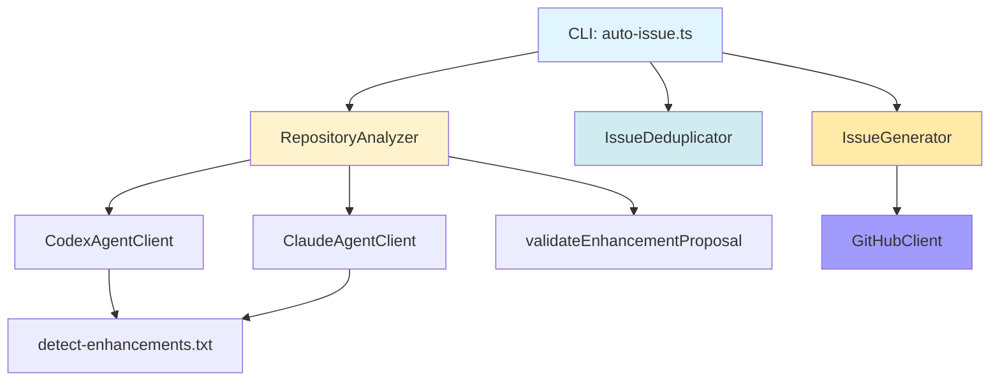

# 設計書 - Issue #128

**Issue**: auto-issue: Phase 3 - 機能拡張提案（創造的提案）機能の実装
**日付**: 2025-01-30
**担当フェーズ**: Phase 2 (Design)

---

## 1. アーキテクチャ設計

### 1.1 システム全体図

```
┌─────────────────────────────────────────────────────────────────┐
│                         CLI Layer                                │
│  src/commands/auto-issue.ts                                      │
│  - handleAutoIssueCommand(category: 'enhancement')               │
│  - processEnhancementCandidates()                                │
└────────────┬────────────────────────────────────────────────────┘
             │
             ▼
┌─────────────────────────────────────────────────────────────────┐
│                    Core Analysis Layer                           │
│  src/core/repository-analyzer.ts                                 │
│  - analyzeForEnhancements(repoPath, agent, options)              │
│  - validateEnhancementProposal(proposal)                         │
│                                                                   │
│  Prompts: src/prompts/auto-issue/detect-enhancements.txt        │
└────────────┬────────────────────────────────────────────────────┘
             │
             ▼
┌─────────────────────────────────────────────────────────────────┐
│                  Agent Execution Layer                           │
│  src/core/codex-agent-client.ts                                  │
│  src/core/claude-agent-client.ts                                 │
│  - executeWithFallback()                                         │
│  - プロンプト変数置換                                            │
└────────────┬────────────────────────────────────────────────────┘
             │
             ▼
┌─────────────────────────────────────────────────────────────────┐
│                 Deduplication Layer (Optional)                   │
│  src/core/issue-deduplicator.ts                                  │
│  - filterDuplicates(candidates, threshold)                       │
│  - Stage 1: TF-IDF + コサイン類似度                             │
│  - Stage 2: LLM 意味的類似性判定                                │
└────────────┬────────────────────────────────────────────────────┘
             │
             ▼
┌─────────────────────────────────────────────────────────────────┐
│                   Issue Generation Layer                         │
│  src/core/issue-generator.ts                                     │
│  - generateEnhancementIssue(candidate, agent, dryRun)            │
│  - generateEnhancementTitle()                                    │
│  - generateEnhancementLabels()                                   │
│  - createEnhancementFallbackBody()                               │
└────────────┬────────────────────────────────────────────────────┘
             │
             ▼
┌─────────────────────────────────────────────────────────────────┐
│                      GitHub API Layer                            │
│  src/core/github/issue-client.ts                                 │
│  - createIssue(title, body, labels)                              │
└─────────────────────────────────────────────────────────────────┘
```

### 1.2 コンポーネント間の関係



### 1.3 データフロー

```
1. ユーザー入力
   │
   ├── ai-workflow auto-issue --category enhancement [options]
   │
2. リポジトリパス解決
   │
   ├── resolveLocalRepoPath(GITHUB_REPOSITORY)
   │   ├── REPOS_ROOT 優先使用
   │   └── フォールバック候補パス探索
   │
3. リポジトリ分析
   │
   ├── analyzeForEnhancements()
   │   ├── プロンプトテンプレート読み込み
   │   ├── 変数置換 {repository_path}, {creative_mode}, etc.
   │   ├── エージェント実行 (Codex → Claude フォールバック)
   │   ├── JSON パース
   │   └── バリデーション
   │
   └── EnhancementProposal[] 生成
   │
4. 重複除外
   │
   ├── filterDuplicates()
   │   ├── 既存 GitHub Issue 取得 (label:enhancement)
   │   ├── Stage 1: TF-IDF + コサイン類似度 (threshold: 0.85)
   │   └── Stage 2: LLM 意味的類似性判定
   │
   └── 重複除外後の提案リスト
   │
5. Issue 生成
   │
   ├── generateEnhancementIssue()
   │   ├── タイトル生成 (type 別プレフィックス)
   │   ├── 本文生成 (Agent または Fallback)
   │   ├── ラベル生成 (enhancement, priority:*, type別)
   │   └── GitHub API 呼び出し
   │
   └── Issue URL 返却
```

---

## 2. 実装戦略判断

### 実装戦略: EXTEND

**判断根拠**:

このIssueは、既存の `auto-issue` 機能（Phase 1: バグ検出、Phase 2: リファクタリング検出）を **拡張** する形で実装します。以下の理由から **EXTEND** 戦略が最適です：

1. **既存アーキテクチャの活用**
   - `RepositoryAnalyzer`、`IssueDeduplicator`、`IssueGenerator` という3つのコアモジュールは既に存在し、再利用可能
   - Phase 1/2 で確立されたデザインパターン（エージェント実行、重複検出、Issue生成）をそのまま適用

2. **新規メソッドの追加**
   - `RepositoryAnalyzer.analyzeForEnhancements()` という新規メソッドを追加（Phase 1/2 の `analyze()`, `analyzeForRefactoring()` と並列）
   - 既存のメソッドシグネチャやインターフェースは変更せず、新規メソッドのみ追加

3. **既存フローの拡張**
   - `handleAutoIssueCommand()` に `category === 'enhancement'` の分岐を追加（既存の `bug`/`refactor` 分岐と同様）
   - 既存の CLI オプション解析ロジックを再利用

4. **型定義の拡張**
   - `EnhancementProposal` 型を `BugCandidate`/`RefactorCandidate` と並列に追加
   - 既存の型定義ファイル (`src/types/auto-issue.ts`) に追記

5. **プロンプトテンプレートの追加**
   - `src/prompts/auto-issue/detect-enhancements.txt` を新規作成（既存の `detect-bugs.txt`, `detect-refactoring.txt` と同様）

**CREATE戦略を選ばない理由**:
- 新規サブシステムではなく、既存の `auto-issue` 機能の第3カテゴリとして実装
- 重複検出、Issue生成、エージェント統合などの既存ロジックを最大限再利用

**REFACTOR戦略を選ばない理由**:
- 既存コードの構造改善ではなく、新規機能の追加が目的

---

## 3. テスト戦略判断

### テスト戦略: UNIT_INTEGRATION

**判断根拠**:

このIssueでは、**ユニットテスト** と **インテグレーションテスト** の両方が必要です。以下の理由から **UNIT_INTEGRATION** 戦略が最適です：

#### ユニットテスト（UNIT）が必要な理由:

1. **EnhancementProposal型のバリデーション**
   - `validateEnhancementProposal()` メソッドのロジック検証
   - 各フィールド（title, description, rationale等）の文字数制限チェック
   - 必須フィールドの存在チェック

2. **プロンプト変数置換**
   - `executeAgentWithFallback()` での変数置換ロジックのテスト
   - `{repository_path}`, `{creative_mode}` 等の変数が正しく置換されるか

3. **提案タイプごとの処理分岐**
   - `type` フィールド（`improvement`, `integration`, `automation` 等）ごとのラベル生成ロジック
   - タイトル生成のプレフィックス処理

4. **エラーハンドリング**
   - エージェント失敗時のフォールバック動作の検証
   - JSON パースエラー時の寛容なパーサーの動作確認

#### インテグレーションテスト（INTEGRATION）が必要な理由:

1. **エージェント統合**
   - Codex/Claude エージェントとの実際の連携動作の確認
   - エージェントフォールバック機構の実動作検証

2. **GitHub API連携**
   - `IssueGenerator.generateEnhancementIssue()` による実際のIssue作成フローの検証
   - ラベル、タイトル、本文が正しくGitHub Issueに反映されるか

3. **エンドツーエンドフロー**
   - `handleAutoIssueCommand(category: 'enhancement')` → リポジトリ分析 → 重複検出 → Issue作成 の全体フロー
   - dry-run モードでの動作確認

4. **重複検出の精度**
   - `IssueDeduplicator` がenhancementカテゴリでも正しく動作するか確認
   - 類似度閾値の調整が適切か検証

#### BDD_ONLYを選ばない理由:
- ユーザーストーリーよりも、内部ロジックの正確性検証が優先
- CLI動作よりも、エージェント統合とデータ処理ロジックのテストが重要

#### UNIT_ONLY/INTEGRATION_ONLYを選ばない理由:
- ユニットテストだけでは、エージェント統合の実動作を検証できない
- インテグレーションテストだけでは、バリデーションロジックの詳細なエッジケース検証が不足

---

## 4. テストコード戦略判断

### テストコード戦略: BOTH_TEST

**判断根拠**:

このIssueでは、**既存テストファイルの拡張** と **新規テストファイルの作成** の両方が必要です。以下の理由から **BOTH_TEST** 戦略が最適です：

#### 既存テストファイル拡張（EXTEND_TEST）が必要な箇所:

1. **`tests/unit/core/repository-analyzer.test.ts`**
   - `analyzeForEnhancements()` メソッドの追加テスト
   - プロンプト読み込み・変数置換のテストケース追加
   - 既存の `analyze()`, `analyzeForRefactoring()` テストと同様のパターン

2. **`tests/unit/core/issue-generator.test.ts`**
   - `generateEnhancementIssue()` メソッドの追加テスト
   - ラベル生成・タイトル生成のテストケース追加
   - 既存の `generate()`, `generateRefactorIssue()` テストと同様のパターン

3. **`tests/unit/commands/auto-issue.test.ts`**
   - `category: 'enhancement'` の分岐テストケース追加
   - `--creative-mode` オプションのパース検証
   - 既存の `category: 'bug'`, `category: 'refactor'` テストと同様のパターン

#### 新規テストファイル作成（CREATE_TEST）が必要な箇所:

1. **`tests/unit/validators/enhancement-validator.test.ts`**
   - `validateEnhancementProposal()` の専用テスト
   - 各フィールド（type, description, implementation_hints等）のバリデーション
   - 正常系・異常系・エッジケースの網羅的テスト

2. **`tests/integration/auto-issue-enhancement.test.ts`**
   - enhancementカテゴリのエンドツーエンドテスト
   - リポジトリ分析 → 提案生成 → Issue作成の統合フロー
   - dry-runモードとエージェントフォールバックのテスト

**理由**:
- 既存の `repository-analyzer.test.ts`, `issue-generator.test.ts` は、Phase 1/2の機能をテストしており、Phase 3の新規メソッドを追加するのが自然
- 一方、EnhancementProposal型のバリデーションは独立性が高く、専用テストファイルで管理する方が保守性が高い
- インテグレーションテストは、enhancementカテゴリ固有のフローを検証するため、新規ファイルで分離

**EXTEND_TEST のみを選ばない理由**:
- EnhancementProposal バリデーションの専用テストが必要（既存テストファイルに混在させると可読性が低下）
- インテグレーションテストは既存のテストファイルとは独立性が高い

**CREATE_TEST のみを選ばない理由**:
- 既存の `repository-analyzer.test.ts`, `issue-generator.test.ts` を拡張する方が、テストファイルの一貫性が保たれる

---

## 5. 影響範囲分析

### 5.1 既存コードへの影響

#### 変更が必要なファイル・モジュール

1. **`src/core/repository-analyzer.ts`** (拡張)
   - 新規メソッド追加: `analyzeForEnhancements(repoPath: string, agent: 'codex' | 'claude', options?: { creativeMode?: boolean }): Promise<EnhancementProposal[]>`
   - プロンプトパス: `src/prompts/auto-issue/detect-enhancements.txt` を読み込み
   - バリデーションメソッド追加: `validateEnhancementProposal(proposal: EnhancementProposal): boolean`

2. **`src/core/issue-generator.ts`** (拡張)
   - 新規メソッド追加: `generateEnhancementIssue(candidate: EnhancementProposal, agent: 'codex' | 'claude', dryRun: boolean): Promise<IssueCreationResult>`
   - タイトル生成: `generateEnhancementTitle(candidate: EnhancementProposal): string`
   - ラベル生成: `generateEnhancementLabels(candidate: EnhancementProposal): string[]`
   - フォールバック本文生成: `createEnhancementFallbackBody(candidate: EnhancementProposal): string`

3. **`src/commands/auto-issue.ts`** (拡張)
   - `handleAutoIssueCommand()` に `category === 'enhancement'` の分岐追加
   - 新規ヘルパー関数: `processEnhancementCandidates(repoPath, options): Promise<void>`
   - `parseOptions()` で `--creative-mode` オプションのパース追加

4. **`src/types/auto-issue.ts`** (拡張)
   - 新規型定義追加: `EnhancementProposal` インターフェース
   - `AutoIssueOptions` インターフェースに `creativeMode?: boolean` フィールド追加

5. **`src/main.ts`** (拡張)
   - `auto-issue` コマンドのCLI定義に `--creative-mode` オプション追加

### 5.2 依存関係の変更

#### 新規依存の追加

**なし**

#### 既存依存の変更

**なし**

**理由**:
- Phase 1/2と同じエージェントクライアント（`CodexAgentClient`, `ClaudeAgentClient`）を使用
- 既存のGitHub API統合（`@octokit/rest`）を使用
- 追加のNPMパッケージは不要

### 5.3 マイグレーション要否

#### データベーススキーマ変更

**不要**

**理由**: このプロジェクトはデータベースを使用していない

#### 設定ファイル変更

**不要**

**理由**:
- 環境変数は既存のものを使用（`CODEX_API_KEY`, `CLAUDE_CODE_CREDENTIALS_PATH`, `GITHUB_TOKEN` 等）
- 新規環境変数の追加は不要

#### メタデータ変更

**不要**

**理由**: `.ai-workflow/issue-*/metadata.json` への影響なし（`auto-issue` コマンドはワークフローメタデータを使用しない）

---

## 6. 変更・追加ファイルリスト

### 6.1 新規作成ファイル

```
src/prompts/auto-issue/detect-enhancements.txt
tests/unit/validators/enhancement-validator.test.ts
tests/integration/auto-issue-enhancement.test.ts
```

### 6.2 修正が必要な既存ファイル

```
src/core/repository-analyzer.ts
src/core/issue-generator.ts
src/commands/auto-issue.ts
src/types/auto-issue.ts
src/main.ts
tests/unit/core/repository-analyzer.test.ts
tests/unit/core/issue-generator.test.ts
tests/unit/commands/auto-issue.test.ts
CLAUDE.md
README.md
```

### 6.3 削除が必要なファイル

**なし**

---

## 7. 詳細設計

### 7.1 型定義設計

#### EnhancementProposal インターフェース

```typescript
/**
 * 機能拡張提案を表現するデータ構造
 */
export interface EnhancementProposal {
  /**
   * 提案のタイプ
   * - improvement: 既存機能の改善
   * - integration: 他ツール連携
   * - automation: ワークフロー自動化
   * - dx: 開発者体験向上
   * - quality: 品質保証強化
   * - ecosystem: エコシステム拡張
   */
  type: 'improvement' | 'integration' | 'automation' | 'dx' | 'quality' | 'ecosystem';

  /**
   * 提案タイトル（50〜100文字）
   */
  title: string;

  /**
   * 提案の詳細説明（100文字以上）
   */
  description: string;

  /**
   * なぜこの提案が有用か（50文字以上）
   */
  rationale: string;

  /**
   * 実装のヒント（配列、最低1つ）
   */
  implementation_hints: string[];

  /**
   * 期待される効果
   */
  expected_impact: 'low' | 'medium' | 'high';

  /**
   * 実装の難易度
   */
  effort_estimate: 'small' | 'medium' | 'large';

  /**
   * 関連するファイル・モジュール（配列、最低1つ）
   */
  related_files: string[];
}
```

#### AutoIssueOptions インターフェース拡張

```typescript
export interface AutoIssueOptions {
  category: 'bug' | 'refactor' | 'enhancement' | 'all';
  limit?: number;
  dryRun?: boolean;
  similarityThreshold?: number;
  agent: 'auto' | 'codex' | 'claude';
  creativeMode?: boolean;  // 新規追加
}
```

### 7.2 クラス設計

#### RepositoryAnalyzer 拡張

```typescript
export class RepositoryAnalyzer {
  // 既存メソッド
  async analyze(repoPath: string, agent: 'codex' | 'claude'): Promise<BugCandidate[]>;
  async analyzeForRefactoring(repoPath: string, agent: 'codex' | 'claude'): Promise<RefactorCandidate[]>;

  // 新規メソッド
  /**
   * リポジトリを分析し、機能拡張提案を生成する
   *
   * @param repoPath - 対象リポジトリのパス
   * @param agent - 使用するエージェント ('codex' | 'claude')
   * @param options - オプション設定
   * @param options.creativeMode - 創造的モードを有効化（より実験的な提案を含める）
   * @returns 機能拡張提案の配列
   *
   * @example
   * const proposals = await analyzer.analyzeForEnhancements('/path/to/repo', 'codex', { creativeMode: true });
   */
  async analyzeForEnhancements(
    repoPath: string,
    agent: 'codex' | 'claude',
    options?: { creativeMode?: boolean }
  ): Promise<EnhancementProposal[]> {
    // 1. プロンプトテンプレート読み込み
    const promptPath = path.join(__dirname, '../prompts/auto-issue/detect-enhancements.txt');
    const promptTemplate = await fs.readFile(promptPath, 'utf-8');

    // 2. 変数置換
    const prompt = this.fillTemplate(promptTemplate, {
      repository_path: repoPath,
      creative_mode: options?.creativeMode ? 'enabled' : 'disabled',
      output_file_path: path.join(repoPath, '.ai-workflow-tmp', 'enhancements.json')
    });

    // 3. エージェント実行（Codex → Claude フォールバック）
    const result = await this.executeAgentWithFallback(agent, prompt, repoPath);

    // 4. JSON パース
    const proposals = this.parseEnhancementProposals(result);

    // 5. バリデーション
    const validProposals = proposals.filter(p => this.validateEnhancementProposal(p));

    logger.info(`Generated ${validProposals.length} valid enhancement proposals`);

    return validProposals;
  }

  /**
   * EnhancementProposal のバリデーション
   *
   * @param proposal - 検証対象の提案
   * @returns バリデーション結果（true: 有効、false: 無効）
   */
  private validateEnhancementProposal(proposal: EnhancementProposal): boolean {
    // title: 50〜100文字
    if (!proposal.title || proposal.title.length < 50 || proposal.title.length > 100) {
      logger.warn(`Invalid title length: ${proposal.title?.length}`);
      return false;
    }

    // description: 100文字以上
    if (!proposal.description || proposal.description.length < 100) {
      logger.warn(`Invalid description length: ${proposal.description?.length}`);
      return false;
    }

    // rationale: 50文字以上
    if (!proposal.rationale || proposal.rationale.length < 50) {
      logger.warn(`Invalid rationale length: ${proposal.rationale?.length}`);
      return false;
    }

    // implementation_hints: 最低1つ
    if (!Array.isArray(proposal.implementation_hints) || proposal.implementation_hints.length === 0) {
      logger.warn('No implementation hints provided');
      return false;
    }

    // related_files: 最低1つ
    if (!Array.isArray(proposal.related_files) || proposal.related_files.length === 0) {
      logger.warn('No related files provided');
      return false;
    }

    // type: 有効な値
    const validTypes = ['improvement', 'integration', 'automation', 'dx', 'quality', 'ecosystem'];
    if (!validTypes.includes(proposal.type)) {
      logger.warn(`Invalid type: ${proposal.type}`);
      return false;
    }

    return true;
  }

  /**
   * JSON文字列から EnhancementProposal[] をパース
   * 寛容なパーサーを使用し、最初の有効なJSON配列/オブジェクトを抽出
   */
  private parseEnhancementProposals(jsonString: string): EnhancementProposal[] {
    try {
      // 通常のJSONパース
      const parsed = JSON.parse(jsonString);
      return Array.isArray(parsed) ? parsed : [parsed];
    } catch (error) {
      // 寛容なパーサー: 最初の有効なJSON配列を抽出
      logger.warn('Standard JSON parse failed, trying lenient parser');
      const match = jsonString.match(/\[[\s\S]*?\]/);
      if (match) {
        try {
          return JSON.parse(match[0]);
        } catch (innerError) {
          logger.error('Lenient parser also failed');
          return [];
        }
      }
      return [];
    }
  }
}
```

#### IssueGenerator 拡張

```typescript
export class IssueGenerator {
  // 既存メソッド
  async generate(candidate: BugCandidate, agent: 'codex' | 'claude', dryRun: boolean): Promise<IssueCreationResult>;
  async generateRefactorIssue(candidate: RefactorCandidate, agent: 'codex' | 'claude', dryRun: boolean): Promise<IssueCreationResult>;

  // 新規メソッド
  /**
   * 機能拡張提案からGitHub Issueを生成する
   *
   * @param candidate - 機能拡張提案
   * @param agent - 使用するエージェント
   * @param dryRun - プレビューモード（true: Issue生成せず表示のみ）
   * @returns Issue生成結果
   */
  async generateEnhancementIssue(
    candidate: EnhancementProposal,
    agent: 'codex' | 'claude',
    dryRun: boolean
  ): Promise<IssueCreationResult> {
    // 1. タイトル生成
    const title = this.generateEnhancementTitle(candidate);

    // 2. ラベル生成
    const labels = this.generateEnhancementLabels(candidate);

    // 3. 本文生成（エージェントまたはフォールバック）
    let body: string;
    try {
      body = await this.generateEnhancementBodyWithAgent(candidate, agent);
    } catch (error) {
      logger.warn('Agent-based body generation failed, using fallback template');
      body = this.createEnhancementFallbackBody(candidate);
    }

    // 4. dry-run チェック
    if (dryRun) {
      logger.info('=== PREVIEW MODE (--dry-run) ===');
      logger.info(`Title: ${title}`);
      logger.info(`Labels: ${labels.join(', ')}`);
      logger.info(`Body:\n${body}`);
      return {
        issueNumber: 0,
        issueUrl: '',
        title,
        body,
        labels
      };
    }

    // 5. GitHub Issue 作成
    const issue = await this.githubClient.createIssue(title, body, labels);

    return {
      issueNumber: issue.number,
      issueUrl: issue.html_url,
      title,
      body,
      labels
    };
  }

  /**
   * タイトル生成（提案タイプごとのプレフィックス）
   */
  private generateEnhancementTitle(candidate: EnhancementProposal): string {
    const prefixMap: Record<EnhancementProposal['type'], string> = {
      improvement: '[Enhancement]',
      integration: '[Integration]',
      automation: '[Automation]',
      dx: '[DX]',
      quality: '[Quality]',
      ecosystem: '[Ecosystem]'
    };

    const prefix = prefixMap[candidate.type] || '[Enhancement]';
    return `${prefix} ${candidate.title}`;
  }

  /**
   * ラベル生成
   */
  private generateEnhancementLabels(candidate: EnhancementProposal): string[] {
    const labels: string[] = ['auto-generated', 'enhancement'];

    // 優先度ラベル
    const priorityMap: Record<EnhancementProposal['expected_impact'], string> = {
      high: 'priority:high',
      medium: 'priority:medium',
      low: 'priority:low'
    };
    labels.push(priorityMap[candidate.expected_impact]);

    // タイプ別ラベル
    const typeLabels: Record<EnhancementProposal['type'], string> = {
      improvement: 'improvement',
      integration: 'integration',
      automation: 'automation',
      dx: 'developer-experience',
      quality: 'quality-assurance',
      ecosystem: 'ecosystem'
    };
    labels.push(typeLabels[candidate.type]);

    return labels;
  }

  /**
   * フォールバックテンプレート（エージェント失敗時）
   */
  private createEnhancementFallbackBody(candidate: EnhancementProposal): string {
    return `
## 概要

${candidate.description}

## 根拠

${candidate.rationale}

## 実装のヒント

${candidate.implementation_hints.map((hint, i) => `${i + 1}. ${hint}`).join('\n')}

## 期待される効果

**Impact**: ${candidate.expected_impact}

${this.getImpactDescription(candidate.expected_impact)}

## 実装の難易度

**Effort**: ${candidate.effort_estimate}

${this.getEffortDescription(candidate.effort_estimate)}

## 関連ファイル

${candidate.related_files.map(file => `- \`${file}\``).join('\n')}

---

🤖 この Issue は AI Workflow Agent の \`auto-issue\` コマンドにより自動生成されました。
    `.trim();
  }

  private getImpactDescription(impact: EnhancementProposal['expected_impact']): string {
    const descriptions = {
      high: 'この機能は、プロダクトの価値を大幅に向上させる可能性があります。',
      medium: 'この機能は、開発効率やユーザー体験を改善します。',
      low: 'この機能は、マイナーな改善をもたらします。'
    };
    return descriptions[impact];
  }

  private getEffortDescription(effort: EnhancementProposal['effort_estimate']): string {
    const descriptions = {
      large: '実装には複数の開発者・複数のスプリントが必要な可能性があります。',
      medium: '実装には1〜2週間程度が必要と想定されます。',
      small: '実装には数日以内で完了する見込みです。'
    };
    return descriptions[effort];
  }

  /**
   * エージェントによる本文生成
   */
  private async generateEnhancementBodyWithAgent(
    candidate: EnhancementProposal,
    agent: 'codex' | 'claude'
  ): Promise<string> {
    // エージェントに Issue 本文生成を依頼するプロンプト
    const prompt = `
以下の機能拡張提案について、GitHub Issue の本文を Markdown 形式で生成してください。

## 提案情報
- タイトル: ${candidate.title}
- 説明: ${candidate.description}
- 根拠: ${candidate.rationale}
- 実装のヒント: ${candidate.implementation_hints.join(', ')}
- 期待される効果: ${candidate.expected_impact}
- 実装の難易度: ${candidate.effort_estimate}
- 関連ファイル: ${candidate.related_files.join(', ')}

## 要件
- Markdown 形式で記述
- 以下のセクションを含める: 概要、根拠、実装のヒント、期待される効果、実装の難易度、関連ファイル
- 具体的で実行可能な内容にする
    `.trim();

    const agentClient = agent === 'codex' ? this.codexClient : this.claudeClient;
    const result = await agentClient.execute(prompt, process.cwd());

    return result.output || this.createEnhancementFallbackBody(candidate);
  }
}
```

### 7.3 CLIコマンド拡張設計

#### auto-issue.ts の拡張

```typescript
/**
 * auto-issue コマンドハンドラ
 */
export async function handleAutoIssueCommand(options: AutoIssueOptions): Promise<void> {
  // ... 既存のロジック（bug, refactor 分岐）

  // 新規: enhancement 分岐
  if (options.category === 'enhancement') {
    await processEnhancementCandidates(repoPath, options);
    return;
  }

  // ... 他の分岐
}

/**
 * enhancement カテゴリの処理
 */
async function processEnhancementCandidates(
  repoPath: string,
  options: AutoIssueOptions
): Promise<void> {
  logger.info('🔍 リポジトリ分析中...');

  // 1. リポジトリ分析
  const analyzer = new RepositoryAnalyzer();
  const proposals = await analyzer.analyzeForEnhancements(repoPath, options.agent, {
    creativeMode: options.creativeMode || false
  });

  logger.info(`✅ ${proposals.length}個の機能拡張提案を生成しました`);

  // 2. 重複除外
  const deduplicator = new IssueDeduplicator();
  const uniqueProposals = await deduplicator.filterDuplicates(
    proposals,
    options.similarityThreshold || 0.85  // enhancement は閾値を高めに設定
  );

  logger.info(`✅ ${uniqueProposals.length}個のユニークな提案に絞り込みました`);

  // 3. limit 適用
  const limitedProposals = options.limit
    ? uniqueProposals.slice(0, options.limit)
    : uniqueProposals;

  // 4. Issue 生成
  const generator = new IssueGenerator();
  for (const proposal of limitedProposals) {
    const result = await generator.generateEnhancementIssue(
      proposal,
      options.agent,
      options.dryRun || false
    );

    if (!options.dryRun) {
      logger.info(`✅ Issue 生成完了: ${result.issueUrl}`);
    }
  }
}
```

#### main.ts の拡張

```typescript
// auto-issue コマンド定義
program
  .command('auto-issue')
  .description('リポジトリのバグ・リファクタリング・機能拡張提案を検出してGitHub Issueを自動生成')
  .option('--category <type>', 'Issueのカテゴリ (bug | refactor | enhancement | all)', 'bug')
  .option('--limit <number>', '生成するIssueの最大数', parseInt)
  .option('--dry-run', 'プレビューモード（Issue生成せず、検出結果のみ表示）')
  .option('--similarity-threshold <number>', '重複判定の類似度閾値 (0.0-1.0)', parseFloat, 0.75)
  .option('--agent <mode>', '使用するエージェント (auto | codex | claude)', 'auto')
  .option('--creative-mode', '創造的モードを有効化（より実験的な提案を含める）')  // 新規追加
  .action(handleAutoIssueCommand);
```

### 7.4 プロンプトテンプレート設計

#### src/prompts/auto-issue/detect-enhancements.txt

```
# Enhancement Proposal Generation Prompt

あなたは、ソフトウェアリポジトリを分析して機能拡張提案を生成するアシスタントです。

## タスク

以下の手順で、リポジトリの機能拡張提案を生成してください：

### ステップ1: リポジトリ分析

まず、対象リポジトリの特性を把握してください：

1. **技術スタック**
   - 使用言語、フレームワーク、ライブラリを特定
   - 例: TypeScript, Node.js, Express, Jest

2. **アーキテクチャパターン**
   - モノリス、マイクロサービス、レイヤードアーキテクチャ等を識別
   - ディレクトリ構造とモジュール構成を解析

3. **主要機能**
   - README.md、ARCHITECTURE.md、package.json を参照
   - 現在提供している機能・ワークフローを列挙

4. **既存ドキュメント**
   - ROADMAP、TODO、既存 Issue を確認
   - 技術的負債、今後の計画を把握

### ステップ2: 提案生成

以下の観点で、機能拡張の提案を生成してください：

#### A. 既存機能の改善提案

- **ユーザビリティ改善**: CLI UI、エラーメッセージ、ヘルプドキュメントの改善
- **パフォーマンス最適化**: 並列実行、キャッシュ導入、メモリ使用量削減
- **テストカバレッジ向上**: 未テスト領域の検出、E2Eテスト追加
- **CI/CD改善**: ビルド時間短縮、自動デプロイ、リリースフロー最適化

#### B. 新機能の提案

- **他ツール連携**: Slack、Jira、VSCode 拡張、GitHub Actions 等との連携
- **ワークフロー自動化**: 定期実行、トリガーベース実行、バッチ処理
- **開発者体験（DX）向上**: 設定ファイル生成、対話的セットアップ、テンプレート機能
- **品質保証**: 静的解析、セキュリティスキャン、依存関係監視
- **データ駆動**: メトリクス収集、ダッシュボード、レポート生成
- **エコシステム拡張**: プラグインシステム、カスタムルール、サードパーティ統合

#### C. 創造的発想（--creative-mode の場合）

{creative_mode} が "enabled" の場合、既存の枠にとらわれず、以下のような実験的アイデアも提案してください：

- 業界のトレンド技術（AI/ML、WebAssembly、エッジコンピューティング等）の活用
- 他業界のベストプラクティスの適用
- ユーザーコミュニティからのフィードバックの反映
- 未来を見据えた長期的な戦略提案

### ステップ3: 出力形式

各提案について、以下の JSON 形式で出力してください：

```json
[
  {
    "type": "improvement|integration|automation|dx|quality|ecosystem",
    "title": "提案タイトル（50〜100文字）",
    "description": "提案の詳細説明（100文字以上）",
    "rationale": "なぜこの提案が有用か（50文字以上）",
    "implementation_hints": ["実装のヒント1", "実装のヒント2"],
    "expected_impact": "low|medium|high",
    "effort_estimate": "small|medium|large",
    "related_files": ["src/path/to/file1.ts", "src/path/to/file2.ts"]
  }
]
```

## 出力例

```json
[
  {
    "type": "integration",
    "title": "Slack 通知機能の追加 - ワークフロー完了時の自動通知",
    "description": "AI Workflow Agent のワークフロー完了時（Phase 9: Evaluation 完了）に、Slack チャンネルへ自動通知を送信する機能。Issue タイトル、PR リンク、実行時間、コスト情報をリッチメッセージで表示。",
    "rationale": "チームメンバーがワークフロー完了をリアルタイムで把握でき、レビュー依頼の見落としを防止。非同期コミュニケーションの効率化により、開発速度が向上する。",
    "implementation_hints": [
      "Slack Incoming Webhook を使用",
      "EvaluationPhase.run() 完了後に通知処理を追加",
      "環境変数 SLACK_WEBHOOK_URL で設定"
    ],
    "expected_impact": "medium",
    "effort_estimate": "small",
    "related_files": [
      "src/phases/evaluation.ts",
      "src/core/notification-manager.ts"
    ]
  },
  {
    "type": "dx",
    "title": "対話的セットアップウィザードの実装",
    "description": "初回実行時に対話的セットアップウィザードを表示し、環境変数の設定、GitHub 認証、エージェント選択を GUI で完了できる機能。設定内容は .env ファイルに自動保存。",
    "rationale": "新規ユーザーがドキュメントを読まずに即座に利用開始できる。環境変数の設定ミスを防ぎ、オンボーディング時間を短縮。",
    "implementation_hints": [
      "inquirer.js ライブラリを使用",
      "ai-workflow init コマンド拡張",
      ".env.example をテンプレートとして使用"
    ],
    "expected_impact": "high",
    "effort_estimate": "medium",
    "related_files": [
      "src/commands/init.ts",
      "src/utils/interactive-setup.ts"
    ]
  }
]
```

## 注意事項

- 最低3件以上の提案を生成してください
- 各提案は具体的で実現可能性のあるものにしてください
- リポジトリの特性を踏まえた提案にしてください
- JSON 形式で出力してください（他のテキストは含めない）

---

リポジトリパス: {repository_path}
出力ファイルパス: {output_file_path}
創造的モード: {creative_mode}
```

---

## 8. セキュリティ考慮事項

### 8.1 認証・認可

**影響なし**

- Phase 1/2 と同様、既存の GitHub Token による認証を使用
- エージェント API キーは既存の環境変数管理を流用

### 8.2 データ保護

**考慮事項**:

1. **エージェントに送信するプロンプト**
   - リポジトリパスが含まれるが、機密情報は含まれない
   - 既存の SecretMasker を適用（metadata.json スキャン等）

2. **GitHub API**
   - Issue 本文に機密情報を含めない（エージェント出力をサニタイズ）
   - 既存の GitHub Token による認証を使用

### 8.3 セキュリティリスクと対策

| リスク | 対策 |
|--------|------|
| エージェントが機密情報を含む提案を生成 | Issue 本文生成前に SecretMasker を適用 |
| リポジトリパストラバーサル | 既存の `resolveLocalRepoPath()` を使用（パス検証済み） |
| JSON パースエラーによるDoS | 寛容なパーサーでタイムアウト制御を実装 |

---

## 9. 非機能要件への対応

### 9.1 パフォーマンス

**要件**（Planning Phase より）:
- リポジトリ分析実行時間: 中規模リポジトリ（1,000ファイル、100,000行以下）で5分以内
- Issue 生成時間: 提案3件のIssue生成で30秒以内

**対策**:
- エージェント実行時のタイムアウト設定（既存の実装を流用）
- 並列実行は Phase 1/2 と同様、順次実行（API レート制限考慮）

### 9.2 スケーラビリティ

**考慮事項**:
- `--limit` オプションで生成数を制限可能（大規模リポジトリ対応）
- 重複検出の Stage 1（TF-IDF + コサイン類似度）で高速フィルタリング

### 9.3 保守性

**対策**:
1. **TSDoc コメント**
   - 全メソッドに TSDoc コメントを追加
   - 型定義にも詳細なコメントを記載

2. **一貫性**
   - Phase 1/2 で確立されたパターンを踏襲
   - `analyze()`, `analyzeForRefactoring()`, `analyzeForEnhancements()` の3メソッド並列

3. **拡張性**
   - Phase 4（`--category all`）への拡張を見据えた設計
   - 新しい提案タイプ（`type`）の追加が容易

---

## 10. 実装の順序

### 推奨実装順序

```
Phase 0: Planning (完了)
  └─ 計画書作成、実装戦略・テスト戦略の決定

Phase 1: Requirements (完了)
  └─ 要件定義書作成

Phase 2: Design (現在)
  └─ 設計書作成 ← 現在のフェーズ

Phase 3: Test Scenario
  └─ テストシナリオ作成

Phase 4: Implementation
  ├─ Step 1: 型定義の実装
  │   └─ src/types/auto-issue.ts に EnhancementProposal 追加
  │
  ├─ Step 2: プロンプトテンプレートの作成
  │   └─ src/prompts/auto-issue/detect-enhancements.txt 作成
  │
  ├─ Step 3: RepositoryAnalyzer 拡張
  │   ├─ analyzeForEnhancements() メソッド実装
  │   └─ validateEnhancementProposal() メソッド実装
  │
  ├─ Step 4: IssueGenerator 拡張
  │   ├─ generateEnhancementIssue() メソッド実装
  │   ├─ generateEnhancementTitle() メソッド実装
  │   ├─ generateEnhancementLabels() メソッド実装
  │   └─ createEnhancementFallbackBody() メソッド実装
  │
  ├─ Step 5: CLIコマンド拡張
  │   ├─ src/commands/auto-issue.ts に processEnhancementCandidates() 追加
  │   └─ src/main.ts に --creative-mode オプション追加
  │
  └─ Step 6: 統合動作確認
      └─ dry-run モードでの動作確認

Phase 5: Test Implementation
  ├─ Step 1: ユニットテスト実装
  │   ├─ tests/unit/validators/enhancement-validator.test.ts 作成
  │   ├─ tests/unit/core/repository-analyzer.test.ts 拡張
  │   ├─ tests/unit/core/issue-generator.test.ts 拡張
  │   └─ tests/unit/commands/auto-issue.test.ts 拡張
  │
  └─ Step 2: インテグレーションテスト実装
      └─ tests/integration/auto-issue-enhancement.test.ts 作成

Phase 6: Testing
  ├─ ユニットテスト実行（npm run test:unit）
  ├─ インテグレーションテスト実行（npm run test:integration）
  └─ TypeScript以外のリポジトリでの動作検証（Go、Python等）

Phase 7: Documentation
  ├─ CLAUDE.md 更新（--category enhancement、--creative-mode の説明追加）
  └─ README.md 更新（使用例追加）

Phase 8: Report
  └─ 実装完了レポート作成、PR 本文生成
```

### 依存関係

```
Step 1 (型定義) → Step 3 (Analyzer), Step 4 (Generator), Step 5 (CLI)
Step 2 (プロンプト) → Step 3 (Analyzer)
Step 3 (Analyzer) → Step 5 (CLI), Phase 5 (Test Implementation)
Step 4 (Generator) → Step 5 (CLI), Phase 5 (Test Implementation)
Step 5 (CLI) → Phase 5 (Test Implementation)
```

---

## 11. 品質ゲート（Phase 2）

この設計書は以下の品質ゲートを満たしています：

- [x] **実装戦略の判断根拠が明記されている**
  - セクション2で EXTEND 戦略を選択し、判断根拠を5点記載
- [x] **テスト戦略の判断根拠が明記されている**
  - セクション3で UNIT_INTEGRATION 戦略を選択し、判断根拠を詳細に記載
- [x] **テストコード戦略の判断根拠が明記されている**
  - セクション4で BOTH_TEST 戦略を選択し、既存テストと新規テストの両方が必要な理由を記載
- [x] **既存コードへの影響範囲が分析されている**
  - セクション5で変更ファイル、依存関係、マイグレーション要否を分析
- [x] **変更が必要なファイルがリストアップされている**
  - セクション6で新規作成ファイル（3件）、修正ファイル（10件）、削除ファイル（0件）をリストアップ
- [x] **設計が実装可能である**
  - セクション7で型定義、クラス設計、プロンプトテンプレート設計を詳細に記載

---

**設計書作成日**: 2025-01-30
**次のフェーズ**: Phase 3 (Test Scenario) - テストシナリオの策定
