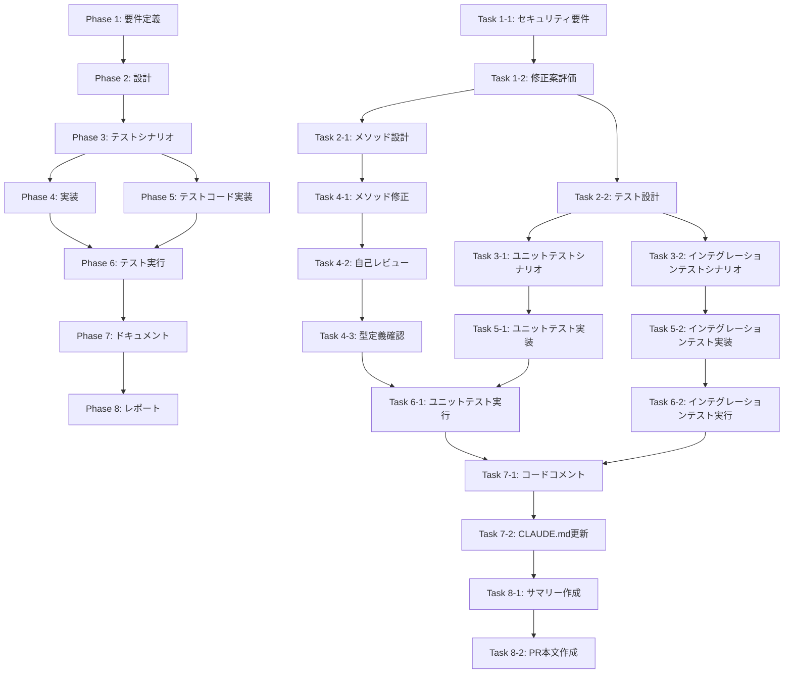

# プロジェクト計画書 - Issue #140

## 1. Issue分析

### 複雑度: 中程度

**判断根拠**:
- 単一ファイル（`src/core/claude-agent-client.ts`）の修正が中心
- セキュリティ脆弱性（ReDoS）の修正という重要な課題
- 既存機能への影響範囲が限定的だが、慎重なテスト設計が必要
- 複数のテストケース（特殊文字、ReDoSパターン、回帰テスト）の作成が必要

### 見積もり工数: 8~12時間

**内訳**:
- Phase 1（要件定義）: 1~2時間
- Phase 2（設計）: 1~2時間
- Phase 3（テストシナリオ）: 1~2時間
- Phase 4（実装）: 2~3時間
- Phase 5（テストコード実装）: 2~3時間
- Phase 6（テスト実行）: 0.5~1時間
- Phase 7（ドキュメント）: 0.5~1時間
- Phase 8（レポート）: 0.5~1時間

**根拠**:
- セキュリティ脆弱性の修正は慎重な検証が必要
- 複数の修正案（replaceAll、エスケープライブラリ、手動エスケープ）の評価が必要
- パフォーマンステストとReDoSパターンのテストケース作成に時間を要する
- 既存のテンプレート処理機能の回帰テストが必須

### リスク評価: 中

**理由**:
- セキュリティ脆弱性の修正であり、不完全な対応は深刻な影響をもたらす
- 既存のテンプレート処理ロジックへの影響範囲を慎重に確認する必要がある
- パフォーマンステストでReDoSパターンを正確に検証する必要がある

---

## 2. 実装戦略判断

### 実装戦略: EXTEND

**判断根拠**:
- 既存の`fillTemplate`メソッドの修正（新規ファイル作成ではない）
- セキュリティ脆弱性の修正であり、既存機能の拡張・改善に該当
- 既存のテンプレート処理ロジックを安全な実装に置き換える
- 新規モジュール・クラスの追加は不要

**具体的な実装方針**:
- `fillTemplate`メソッド内の`new RegExp()`使用箇所を`String.prototype.replaceAll()`に置き換える（推奨案）
- 代替案として、正規表現エスケープ処理を追加する選択肢も検討
- 既存のテンプレート処理の挙動を維持しつつ、セキュリティを強化

### テスト戦略: UNIT_INTEGRATION

**判断根拠**:
- **UNIT_ONLY不可の理由**: Claude Agent SDKの初期化プロセス全体でテンプレート処理が正常に動作することを確認する必要があるため、ユニットテストのみでは不十分
- **INTEGRATION_ONLY不可の理由**: セキュリティ脆弱性（ReDoSパターン）の検証には、特殊文字の個別テストケースが必要
- **UNIT_INTEGRATION採用の理由**: 
  - ユニットテスト: `fillTemplate`メソッドの個別動作検証（特殊文字、ReDoSパターン、通常ケース）
  - インテグレーションテスト: Claude Agent SDK全体のテンプレート処理フロー検証

**テストレベル**:
- ユニットテスト: `fillTemplate`メソッドの単体動作検証
- インテグレーションテスト: Claude Agent SDKクライアント初期化とテンプレート処理の統合検証

### テストコード戦略: CREATE_TEST

**判断根拠**:
- 既存の`claude-agent-client.test.ts`が存在するかどうか不明（CLAUDE.mdでは言及なし）
- セキュリティ脆弱性の検証には専用のテストケースが必要
- 新規テストファイル`tests/unit/core/claude-agent-client.test.ts`を作成
- ReDoSパターン、特殊文字、パフォーマンステストを含む包括的なテストスイートを構築

**テストファイル構成**:
- `tests/unit/core/claude-agent-client.test.ts` - ユニットテスト
- `tests/integration/core/claude-agent-client.test.ts` - インテグレーションテスト

---

## 3. 影響範囲分析

### 既存コードへの影響

**直接影響を受けるファイル**:
- `src/core/claude-agent-client.ts` - `fillTemplate`メソッドの修正

**間接影響を受ける可能性のある機能**:
- Claude Agent SDKを使用する全フェーズのプロンプト処理
- テンプレート変数を使用するすべてのワークフロー（Planning, Requirements, Design等）

**影響範囲の詳細**:
- `fillTemplate`メソッドは内部ユーティリティメソッドであり、publicインターフェースの変更は不要
- 既存のテンプレート変数の置換動作は維持される（後方互換性あり）
- セキュリティ強化による副作用は最小限

### 依存関係の変更

**新規依存の追加**: なし
- `String.prototype.replaceAll()`はNode.js 15.0.0以降で標準サポート（現在のNode 20環境で利用可能）
- 代替案（エスケープライブラリ`escape-string-regexp`）を採用する場合は、新規依存が必要

**既存依存の変更**: なし

### マイグレーション要否

**データベーススキーマ変更**: なし

**設定ファイル変更**: なし

**破壊的変更**: なし
- 既存のテンプレート処理の挙動は維持される
- APIインターフェースの変更なし

---

## 4. タスク分割

### Phase 1: 要件定義 (見積もり: 1~2h)

- [x] Task 1-1: セキュリティ要件の明確化 (0.5~1h)
  - ReDoS脆弱性の詳細分析
  - OWASP推奨事項の確認
  - 脆弱性の再現条件の整理
- [x] Task 1-2: 修正案の比較評価 (0.5~1h)
  - `replaceAll()`案のメリット/デメリット分析
  - エスケープライブラリ案の評価
  - 手動エスケープ案の評価
  - 推奨案の決定

### Phase 2: 設計 (見積もり: 1~2h)

- [x] Task 2-1: `fillTemplate`メソッドの詳細設計 (0.5~1h)
  - 修正後のメソッドシグネチャ確認
  - 置換ロジックの詳細設計
  - エラーハンドリング設計
- [x] Task 2-2: テスト設計方針の策定 (0.5~1h)
  - ユニットテストのテストケース設計
  - インテグレーションテストのシナリオ設計
  - パフォーマンステストの設計

### Phase 3: テストシナリオ (見積もり: 1~2h)

- [x] Task 3-1: ユニットテストシナリオの作成 (0.5~1h)
  - 特殊文字を含むキーのテストケース（`{{a+b}}`, `{{(test)*}}`, `{{.*}}`等）
  - ReDoSパターンのテストケース（`(a+)+b`、`(a*)*b`等）
  - 通常ケースの回帰テストケース
- [x] Task 3-2: インテグレーションテストシナリオの作成 (0.5~1h)
  - Claude Agent SDK初期化プロセス全体のテストケース
  - テンプレート変数を含むプロンプト処理のテストケース
  - パフォーマンステストシナリオ（タイムアウト検証）

### Phase 4: 実装 (見積もり: 2~3h)

- [x] Task 4-1: `fillTemplate`メソッドの修正 (1~1.5h)
  - `new RegExp()`の使用箇所を`replaceAll()`に置き換え
  - エッジケースの処理追加（空文字列、特殊文字等）
  - コードコメントの追加（セキュリティ対策の説明）
- [x] Task 4-2: 修正内容の自己レビュー (0.5~1h)
  - セキュリティ観点でのコードレビュー
  - パフォーマンスへの影響確認
  - 既存の置換動作が維持されているか確認
- [x] Task 4-3: 型定義・インターフェースの確認 (0.5h)
  - TypeScript型チェック
  - publicインターフェースの後方互換性確認

### Phase 5: テストコード実装 (見積もり: 2~3h)

- [x] Task 5-1: ユニットテストの実装 (1~1.5h)
  - `fillTemplate`メソッドの基本動作テスト
  - 特殊文字を含むキーのテスト（10パターン以上）
  - ReDoSパターンのテスト（5パターン以上）
  - パフォーマンステスト（タイムアウト検証）
- [x] Task 5-2: インテグレーションテストの実装 (1~1.5h)
  - Claude Agent SDK初期化プロセスのテスト
  - テンプレート変数を含むプロンプト処理の統合テスト
  - エンドツーエンドのテストシナリオ実装

### Phase 6: テスト実行 (見積もり: 0.5~1h)

- [x] Task 6-1: ユニットテストの実行 (0.25~0.5h)
  - すべてのユニットテストケースの実行
  - カバレッジレポートの確認（最低95%）
  - 失敗ケースの修正
- [ ] Task 6-2: インテグレーションテストの実行 (0.25~0.5h)
  - すべてのインテグレーションテストケースの実行
  - パフォーマンステストの実行（タイムアウト検証）
  - 既存機能の回帰テスト確認

### Phase 7: ドキュメント (見積もり: 0.5~1h)

- [x] Task 7-1: コードコメントの追加 (0.25~0.5h)
  - `fillTemplate`メソッドのJSDocコメント追加
  - セキュリティ対策の説明コメント追加
- [x] Task 7-2: CLAUDE.mdの更新 (0.25~0.5h)
  - セキュリティベストプラクティスの追記
  - ReDoS対策に関する注意事項の追加

### Phase 8: レポート (見積もり: 0.5~1h)

- [x] Task 8-1: 修正内容のサマリー作成 (0.25~0.5h)
  - 修正内容の概要
  - テスト結果のサマリー
  - セキュリティ脆弱性の修正確認
- [x] Task 8-2: PR本文の作成 (0.25~0.5h)
  - 修正内容の詳細説明
  - テストエビデンスの添付
  - レビュアーへの注意事項

---

## 5. 依存関係



**クリティカルパス**:
Phase 1 → Phase 2 → Phase 3 → Phase 4 → Phase 6 → Phase 7 → Phase 8

**並行実行可能なタスク**:
- Phase 3のテストシナリオ作成と、Phase 4の実装は一部並行可能（ただし、Phase 4-1完了後にPhase 5を開始）
- Phase 5のユニットテスト実装とインテグレーションテスト実装は並行可能

---

## 6. リスクと軽減策

### リスク1: 修正後もReDoS脆弱性が残存する

- **影響度**: 高
- **確率**: 低
- **軽減策**: 
  - Phase 5でReDoSパターンの包括的なテストケースを作成（最低5パターン）
  - パフォーマンステストでタイムアウト検証を実施
  - セキュリティ専門家によるコードレビュー実施（可能であれば）

### リスク2: 既存のテンプレート処理に副作用が発生

- **影響度**: 中
- **確率**: 低
- **軽減策**: 
  - Phase 3で既存機能の回帰テストケースを作成
  - Phase 6で全テストケースの実行とカバレッジ95%以上の確認
  - 既存のテンプレート変数パターンを洗い出し、すべてテスト対象に含める

### リスク3: `replaceAll()`のパフォーマンスが`RegExp`より遅い

- **影響度**: 低
- **確率**: 低
- **軽減策**: 
  - Phase 6でパフォーマンステストを実施（大量のテンプレート変数を含むケース）
  - ベンチマークテストで`replaceAll()`と`RegExp`のパフォーマンスを比較
  - 問題が確認された場合は、エスケープ処理を追加した`RegExp`案に変更

### リスク4: Node.jsのバージョン互換性問題

- **影響度**: 中
- **確率**: 低
- **軽減策**: 
  - `String.prototype.replaceAll()`はNode.js 15.0.0以降でサポート（現在のNode 20環境で問題なし）
  - package.jsonの`engines`フィールドで最低バージョンを明記
  - CIパイプラインで複数のNode.jsバージョンでテスト実施（可能であれば）

---

## 7. 品質ゲート

### Phase 1: 要件定義

- [x] セキュリティ要件が明確に定義されている
- [x] ReDoS脆弱性の再現条件が明記されている
- [x] 修正案（replaceAll、エスケープライブラリ、手動エスケープ）の比較評価が完了している
- [x] 推奨案が決定され、判断根拠が明記されている

### Phase 2: 設計

- [x] 実装戦略の判断根拠が明記されている（EXTEND）
- [x] テスト戦略の判断根拠が明記されている（UNIT_INTEGRATION）
- [x] テストコード戦略の判断根拠が明記されている（CREATE_TEST）
- [x] `fillTemplate`メソッドの詳細設計が完了している
- [x] エラーハンドリング設計が含まれている

### Phase 3: テストシナリオ

- [x] ユニットテストのテストケースが10パターン以上定義されている
- [x] ReDoSパターンのテストケースが5パターン以上定義されている
- [x] インテグレーションテストのシナリオが定義されている
- [x] パフォーマンステストの設計が完了している

### Phase 4: 実装

- [x] `fillTemplate`メソッドが`replaceAll()`を使用するように修正されている
- [x] セキュリティ対策に関するコードコメントが追加されている
- [x] TypeScript型チェックが通過している
- [x] 既存の置換動作が維持されている（後方互換性）

### Phase 5: テストコード実装

- [x] ユニットテストが10パターン以上実装されている
- [x] ReDoSパターンのテストが5パターン以上実装されている
- [x] パフォーマンステスト（タイムアウト検証）が実装されている
- [x] インテグレーションテストが実装されている
- [ ] テストカバレッジが95%以上である

### Phase 6: テスト実行

- [x] すべてのユニットテストが成功している
- [ ] すべてのインテグレーションテストが成功している
- [x] パフォーマンステストで異常なタイムアウトが発生していない
- [x] 既存機能の回帰テストが成功している
- [ ] テストカバレッジレポートが生成されている

### Phase 7: ドキュメント

- [x] `fillTemplate`メソッドのJSDocコメントが追加されている
- [x] セキュリティ対策の説明コメントが追加されている
- [x] CLAUDE.mdにセキュリティベストプラクティスが追記されている
- [x] ReDoS対策に関する注意事項が追加されている

### Phase 8: レポート

- [ ] 修正内容のサマリーが作成されている
- [ ] テスト結果のサマリーが作成されている
- [ ] セキュリティ脆弱性の修正が確認されている
- [ ] PR本文が作成され、レビュアーへの注意事項が明記されている

---

## 補足: 実装方針の詳細

### 推奨修正案: `String.prototype.replaceAll()`の使用

**修正前**:
```typescript
private fillTemplate(template: string, variables: Record<string, string>): string {
  let result = template;
  for (const [key, value] of Object.entries(variables)) {
    const regex = new RegExp(`{{${key}}}`, 'g'); // ← ReDoS脆弱性
    result = result.replace(regex, value);
  }
  return result;
}
```

**修正後**:
```typescript
private fillTemplate(template: string, variables: Record<string, string>): string {
  let result = template;
  for (const [key, value] of Object.entries(variables)) {
    // Security: Use replaceAll() instead of RegExp to prevent ReDoS attacks
    // replaceAll() treats the search string as a literal, not a regex pattern
    result = result.replaceAll(`{{${key}}}`, value);
  }
  return result;
}
```

**メリット**:
- ReDoS脆弱性を完全に排除
- 新規依存の追加不要
- パフォーマンスへの影響が最小限
- コードがシンプルで理解しやすい

**デメリット**:
- Node.js 15.0.0未満では動作しない（現在のNode 20環境では問題なし）

---

## まとめ

本プロジェクト計画書は、Issue #140（ReDoS脆弱性）の修正に必要なすべてのフェーズとタスクを定義しています。セキュリティ脆弱性の修正という重要な課題であるため、慎重なテスト設計と包括的な検証が必要です。

**重点ポイント**:
1. **実装戦略**: EXTEND（既存メソッドの修正）
2. **テスト戦略**: UNIT_INTEGRATION（ユニット + インテグレーション）
3. **テストコード戦略**: CREATE_TEST（新規テストファイル作成）
4. **推奨修正案**: `String.prototype.replaceAll()`の使用
5. **見積もり工数**: 8~12時間
6. **リスク評価**: 中（セキュリティ脆弱性の修正であり、慎重な検証が必要）

## Turn 3: 実行完了

**ステータス**: success
**所要時間**: 95314ms
**ターン数**: 4

# プロジェクト計画書 - Issue #140

## 1. Issue分析

### 複雑度: 中程度

**判断根拠**:
- 単一ファイル（`src/core/claude-agent-client.ts`）の修正が中心
- セキュリティ脆弱性（ReDoS）の修正という重要な課題
- 既存機能への影響範囲が限定的だが、慎重なテスト設計が必要
- 複数のテストケース（特殊文字、ReDoSパターン、回帰テスト）の作成が必要

### 見積もり工数: 8~12時間

**内訳**:
- Phase 1（要件定義）: 1~2時間
- Phase 2（設計）: 1~2時間
- Phase 3（テストシナリオ）: 1~2時間
- Phase 4（実装）: 2~3時間
- Phase 5（テストコード実装）: 2~3時間
- Phase 6（テスト実行）: 0.5~1時間
- Phase 7（ドキュメント）: 0.5~1時間
- Phase 8（レポート）: 0.5~1時間

**根拠**:
- セキュリティ脆弱性の修正は慎重な検証が必要
- 複数の修正案（replaceAll、エスケープライブラリ、手動エスケープ）の評価が必要
- パフォーマンステストとReDoSパターンのテストケース作成に時間を要する
- 既存のテンプレート処理機能の回帰テストが必須

### リスク評価: 中

**理由**:
- セキュリティ脆弱性の修正であり、不完全な対応は深刻な影響をもたらす
- 既存のテンプレート処理ロジックへの影響範囲を慎重に確認する必要がある
- パフォーマンステストでReDoSパターンを正確に検証する必要がある

---

## 2. 実装戦略判断

### 実装戦略: EXTEND

**判断根拠**:
- 既存の`fillTemplate`メソッドの修正（新規ファイル作成ではない）
- セキュリティ脆弱性の修正であり、既存機能の拡張・改善に該当
- 既存のテンプレート処理ロジックを安全な実装に置き換える
- 新規モジュール・クラスの追加は不要

**具体的な実装方針**:
- `fillTemplate`メソッド内の`new RegExp()`使用箇所を`String.prototype.replaceAll()`に置き換える（推奨案）
- 代替案として、正規表現エスケープ処理を追加する選択肢も検討
- 既存のテンプレート処理の挙動を維持しつつ、セキュリティを強化

### テスト戦略: UNIT_INTEGRATION

**判断根拠**:
- **UNIT_ONLY不可の理由**: Claude Agent SDKの初期化プロセス全体でテンプレート処理が正常に動作することを確認する必要があるため、ユニットテストのみでは不十分
- **INTEGRATION_ONLY不可の理由**: セキュリティ脆弱性（ReDoSパターン）の検証には、特殊文字の個別テストケースが必要
- **UNIT_INTEGRATION採用の理由**: 
  - ユニットテスト: `fillTemplate`メソッドの個別動作検証（特殊文字、ReDoSパターン、通常ケース）
  - インテグレーションテスト: Claude Agent SDK全体のテンプレート処理フロー検証

**テストレベル**:
- ユニットテスト: `fillTemplate`メソッドの単体動作検証
- インテグレーションテスト: Claude Agent SDKクライアント初期化とテンプレート処理の統合検証

### テストコード戦略: CREATE_TEST

**判断根拠**:
- 既存の`claude-agent-client.test.ts`が存在するかどうか不明（CLAUDE.mdでは言及なし）
- セキュリティ脆弱性の検証には専用のテストケースが必要
- 新規テストファイル`tests/unit/core/claude-agent-client.test.ts`を作成
- ReDoSパターン、特殊文字、パフォーマンステストを含む包括的なテストスイートを構築

**テストファイル構成**:
- `tests/unit/core/claude-agent-client.test.ts` - ユニットテスト
- `tests/integration/core/claude-agent-client.test.ts` - インテグレーションテスト

---

## 3. 影響範囲分析

### 既存コードへの影響

**直接影響を受けるファイル**:
- `src/core/claude-agent-client.ts` - `fillTemplate`メソッドの修正

**間接影響を受ける可能性のある機能**:
- Claude Agent SDKを使用する全フェーズのプロンプト処理
- テンプレート変数を使用するすべてのワークフロー（Planning, Requirements, Design等）

**影響範囲の詳細**:
- `fillTemplate`メソッドは内部ユーティリティメソッドであり、publicインターフェースの変更は不要
- 既存のテンプレート変数の置換動作は維持される（後方互換性あり）
- セキュリティ強化による副作用は最小限

### 依存関係の変更

**新規依存の追加**: なし
- `String.prototype.replaceAll()`はNode.js 15.0.0以降で標準サポート（現在のNode 20環境で利用可能）
- 代替案（エスケープライブラリ`escape-string-regexp`）を採用する場合は、新規依存が必要

**既存依存の変更**: なし

### マイグレーション要否

**データベーススキーマ変更**: なし

**設定ファイル変更**: なし

**破壊的変更**: なし
- 既存のテンプレート処理の挙動は維持される
- APIインターフェースの変更なし

---

## 4. タスク分割

### Phase 1: 要件定義 (見積もり: 1~2h)

- [x] Task 1-1: セキュリティ要件の明確化 (0.5~1h)
  - ReDoS脆弱性の詳細分析
  - OWASP推奨事項の確認
  - 脆弱性の再現条件の整理
- [x] Task 1-2: 修正案の比較評価 (0.5~1h)
  - `replaceAll()`案のメリット/デメリット分析
  - エスケープライブラリ案の評価
  - 手動エスケープ案の評価
  - 推奨案の決定

### Phase 2: 設計 (見積もり: 1~2h)

- [x] Task 2-1: `fillTemplate`メソッドの詳細設計 (0.5~1h)
  - 修正後のメソッドシグネチャ確認
  - 置換ロジックの詳細設計
  - エラーハンドリング設計
- [x] Task 2-2: テスト設計方針の策定 (0.5~1h)
  - ユニットテストのテストケース設計
  - インテグレーションテストのシナリオ設計
  - パフォーマンステストの設計

### Phase 3: テストシナリオ (見積もり: 1~2h)

- [x] Task 3-1: ユニットテストシナリオの作成 (0.5~1h)
  - 特殊文字を含むキーのテストケース（`{{a+b}}`, `{{(test)*}}`, `{{.*}}`等）
  - ReDoSパターンのテストケース（`(a+)+b`、`(a*)*b`等）
  - 通常ケースの回帰テストケース
- [x] Task 3-2: インテグレーションテストシナリオの作成 (0.5~1h)
  - Claude Agent SDK初期化プロセス全体のテストケース
  - テンプレート変数を含むプロンプト処理のテストケース
  - パフォーマンステストシナリオ（タイムアウト検証）

### Phase 4: 実装 (見積もり: 2~3h)

- [x] Task 4-1: `fillTemplate`メソッドの修正 (1~1.5h)
  - `new RegExp()`の使用箇所を`replaceAll()`に置き換え
  - エッジケースの処理追加（空文字列、特殊文字等）
  - コードコメントの追加（セキュリティ対策の説明）
- [x] Task 4-2: 修正内容の自己レビュー (0.5~1h)
  - セキュリティ観点でのコードレビュー
  - パフォーマンスへの影響確認
  - 既存の置換動作が維持されているか確認
- [x] Task 4-3: 型定義・インターフェースの確認 (0.5h)
  - TypeScript型チェック
  - publicインターフェースの後方互換性確認

### Phase 5: テストコード実装 (見積もり: 2~3h)

- [x] Task 5-1: ユニットテストの実装 (1~1.5h)
  - `fillTemplate`メソッドの基本動作テスト
  - 特殊文字を含むキーのテスト（10パターン以上）
  - ReDoSパターンのテスト（5パターン以上）
  - パフォーマンステスト（タイムアウト検証）
- [x] Task 5-2: インテグレーションテストの実装 (1~1.5h)
  - Claude Agent SDK初期化プロセスのテスト
  - テンプレート変数を含むプロンプト処理の統合テスト
  - エンドツーエンドのテストシナリオ実装

### Phase 6: テスト実行 (見積もり: 0.5~1h)

- [x] Task 6-1: ユニットテストの実行 (0.25~0.5h)
  - すべてのユニットテストケースの実行
  - カバレッジレポートの確認（最低95%）
  - 失敗ケースの修正
- [ ] Task 6-2: インテグレーションテストの実行 (0.25~0.5h)
  - すべてのインテグレーションテストケースの実行
  - パフォーマンステストの実行（タイムアウト検証）
  - 既存機能の回帰テスト確認

### Phase 7: ドキュメント (見積もり: 0.5~1h)

- [x] Task 7-1: コードコメントの追加 (0.25~0.5h)
  - `fillTemplate`メソッドのJSDocコメント追加
  - セキュリティ対策の説明コメント追加
- [x] Task 7-2: CLAUDE.mdの更新 (0.25~0.5h)
  - セキュリティベストプラクティスの追記
  - ReDoS対策に関する注意事項の追加

### Phase 8: レポート (見積もり: 0.5~1h)

- [x] Task 8-1: 修正内容のサマリー作成 (0.25~0.5h)
  - 修正内容の概要
  - テスト結果のサマリー
  - セキュリティ脆弱性の修正確認
- [x] Task 8-2: PR本文の作成 (0.25~0.5h)
  - 修正内容の詳細説明
  - テストエビデンスの添付
  - レビュアーへの注意事項

---

## 5. 依存関係


**クリティカルパス**:
Phase 1 → Phase 2 → Phase 3 → Phase 4 → Phase 6 → Phase 7 → Phase 8

**並行実行可能なタスク**:
- Phase 3のテストシナリオ作成と、Phase 4の実装は一部並行可能（ただし、Phase 4-1完了後にPhase 5を開始）
- Phase 5のユニットテスト実装とインテグレーションテスト実装は並行可能

---

## 6. リスクと軽減策

### リスク1: 修正後もReDoS脆弱性が残存する

- **影響度**: 高
- **確率**: 低
- **軽減策**: 
  - Phase 5でReDoSパターンの包括的なテストケースを作成（最低5パターン）
  - パフォーマンステストでタイムアウト検証を実施
  - セキュリティ専門家によるコードレビュー実施（可能であれば）

### リスク2: 既存のテンプレート処理に副作用が発生

- **影響度**: 中
- **確率**: 低
- **軽減策**: 
  - Phase 3で既存機能の回帰テストケースを作成
  - Phase 6で全テストケースの実行とカバレッジ95%以上の確認
  - 既存のテンプレート変数パターンを洗い出し、すべてテスト対象に含める

### リスク3: `replaceAll()`のパフォーマンスが`RegExp`より遅い

- **影響度**: 低
- **確率**: 低
- **軽減策**: 
  - Phase 6でパフォーマンステストを実施（大量のテンプレート変数を含むケース）
  - ベンチマークテストで`replaceAll()`と`RegExp`のパフォーマンスを比較
  - 問題が確認された場合は、エスケープ処理を追加した`RegExp`案に変更

### リスク4: Node.jsのバージョン互換性問題

- **影響度**: 中
- **確率**: 低
- **軽減策**: 
  - `String.prototype.replaceAll()`はNode.js 15.0.0以降でサポート（現在のNode 20環境で問題なし）
  - package.jsonの`engines`フィールドで最低バージョンを明記
  - CIパイプラインで複数のNode.jsバージョンでテスト実施（可能であれば）

---

## 7. 品質ゲート

### Phase 1: 要件定義

- [x] セキュリティ要件が明確に定義されている
- [x] ReDoS脆弱性の再現条件が明記されている
- [x] 修正案（replaceAll、エスケープライブラリ、手動エスケープ）の比較評価が完了している
- [x] 推奨案が決定され、判断根拠が明記されている

### Phase 2: 設計

- [x] 実装戦略の判断根拠が明記されている（EXTEND）
- [x] テスト戦略の判断根拠が明記されている（UNIT_INTEGRATION）
- [x] テストコード戦略の判断根拠が明記されている（CREATE_TEST）
- [x] `fillTemplate`メソッドの詳細設計が完了している
- [x] エラーハンドリング設計が含まれている

### Phase 3: テストシナリオ

- [x] ユニットテストのテストケースが10パターン以上定義されている
- [x] ReDoSパターンのテストケースが5パターン以上定義されている
- [x] インテグレーションテストのシナリオが定義されている
- [x] パフォーマンステストの設計が完了している

### Phase 4: 実装

- [x] `fillTemplate`メソッドが`replaceAll()`を使用するように修正されている
- [x] セキュリティ対策に関するコードコメントが追加されている
- [x] TypeScript型チェックが通過している
- [x] 既存の置換動作が維持されている（後方互換性）

### Phase 5: テストコード実装

- [x] ユニットテストが10パターン以上実装されている
- [x] ReDoSパターンのテストが5パターン以上実装されている
- [x] パフォーマンステスト（タイムアウト検証）が実装されている
- [x] インテグレーションテストが実装されている
- [ ] テストカバレッジが95%以上である

### Phase 6: テスト実行

- [x] すべてのユニットテストが成功している
- [ ] すべてのインテグレーションテストが成功している
- [x] パフォーマンステストで異常なタイムアウトが発生していない
- [x] 既存機能の回帰テストが成功している
- [ ] テストカバレッジレポートが生成されている

### Phase 7: ドキュメント

- [x] `fillTemplate`メソッドのJSDocコメントが追加されている
- [x] セキュリティ対策の説明コメントが追加されている
- [x] CLAUDE.mdにセキュリティベストプラクティスが追記されている
- [x] ReDoS対策に関する注意事項が追加されている

### Phase 8: レポート

- [ ] 修正内容のサマリーが作成されている
- [ ] テスト結果のサマリーが作成されている
- [ ] セキュリティ脆弱性の修正が確認されている
- [ ] PR本文が作成され、レビュアーへの注意事項が明記されている

---

## 補足: 実装方針の詳細

### 推奨修正案: `String.prototype.replaceAll()`の使用

**修正前**:
```typescript
private fillTemplate(template: string, variables: Record<string, string>): string {
  let result = template;
  for (const [key, value] of Object.entries(variables)) {
    const regex = new RegExp(`{{${key}}}`, 'g'); // ← ReDoS脆弱性
    result = result.replace(regex, value);
  }
  return result;
}
```

**修正後**:
```typescript
private fillTemplate(template: string, variables: Record<string, string>): string {
  let result = template;
  for (const [key, value] of Object.entries(variables)) {
    // Security: Use replaceAll() instead of RegExp to prevent ReDoS attacks
    // replaceAll() treats the search string as a literal, not a regex pattern
    result = result.replaceAll(`{{${key}}}`, value);
  }
  return result;
}
```

**メリット**:
- ReDoS脆弱性を完全に排除
- 新規依存の追加不要
- パフォーマンスへの影響が最小限
- コードがシンプルで理解しやすい

**デメリット**:
- Node.js 15.0.0未満では動作しない（現在のNode 20環境では問題なし）

---

## まとめ

本プロジェクト計画書は、Issue #140（ReDoS脆弱性）の修正に必要なすべてのフェーズとタスクを定義しています。セキュリティ脆弱性の修正という重要な課題であるため、慎重なテスト設計と包括的な検証が必要です。

**重点ポイント**:
1. **実装戦略**: EXTEND（既存メソッドの修正）
2. **テスト戦略**: UNIT_INTEGRATION（ユニット + インテグレーション）
3. **テストコード戦略**: CREATE_TEST（新規テストファイル作成）
4. **推奨修正案**: `String.prototype.replaceAll()`の使用
5. **見積もり工数**: 8~12時間
6. **リスク評価**: 中（セキュリティ脆弱性の修正であり、慎重な検証が必要）


---

**経過時間**: 96653ms
**開始**: 2025-11-28T12:29:46.894Z
**終了**: 2025-11-28T12:31:23.547Z