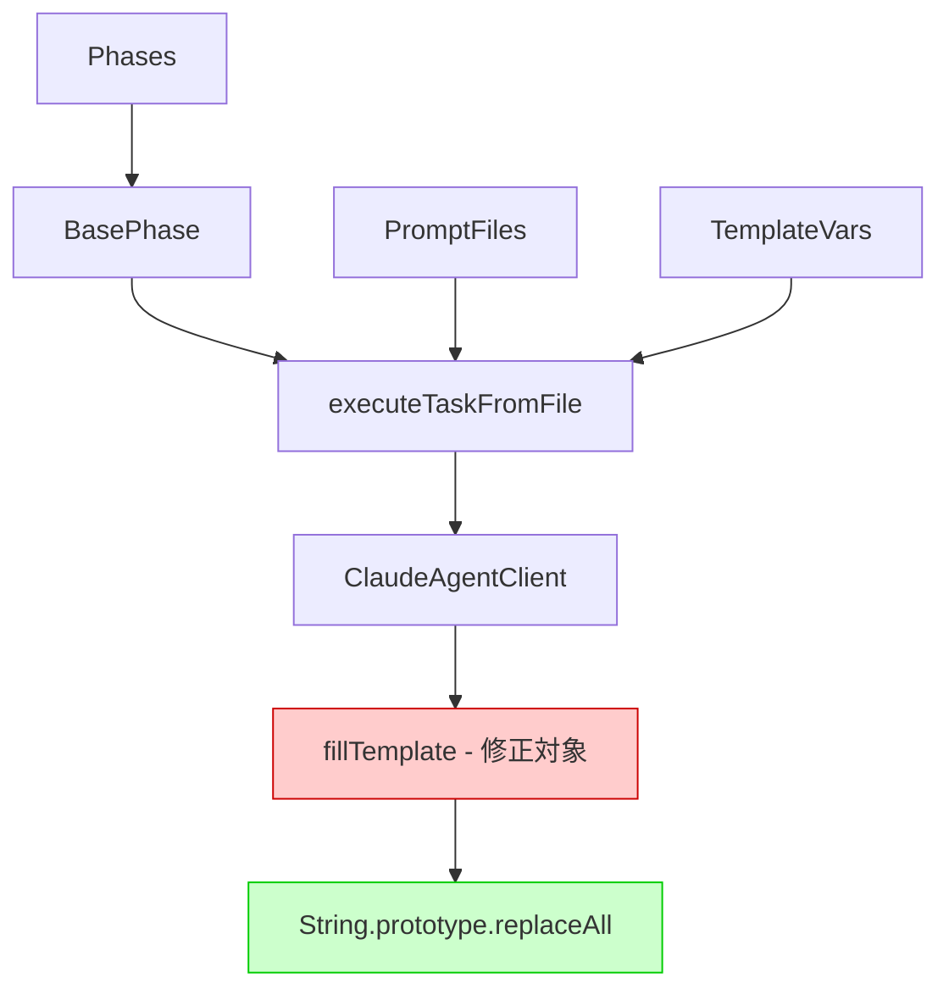
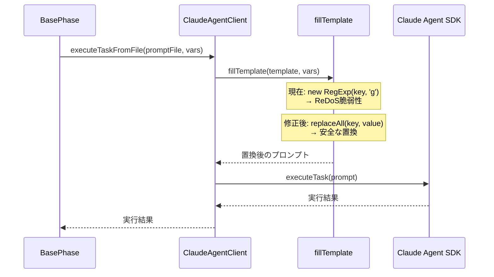

# 詳細設計書 - Issue #140

## 0. Planning Documentの確認

Planning Phase（Phase 0）で策定された以下の戦略を踏まえて、詳細設計を実施します：

### 開発計画の概要
- **実装戦略**: EXTEND（既存の`fillTemplate`メソッドの修正）
- **テスト戦略**: UNIT_INTEGRATION（ユニットテスト + インテグレーションテスト）
- **テストコード戦略**: CREATE_TEST（新規テストファイル作成）
- **推奨修正案**: `String.prototype.replaceAll()`の使用
- **見積もり工数**: 8~12時間
- **リスク評価**: 中（セキュリティ脆弱性の修正であり、慎重な検証が必要）

---

## 1. アーキテクチャ設計

### 1.1 システム全体図



### 1.2 コンポーネント間の関係

**ClaudeAgentClient**: Claude Agent SDKのラッパークラス
- **executeTask()**: エージェントタスクを実行
- **executeTaskFromFile()**: プロンプトファイルからテンプレートを読み込み、変数を置換してタスクを実行
- **fillTemplate()**: テンプレート文字列内の`{{key}}`形式のプレースホルダーを値で置換（**修正対象**）

**依存関係**:
- すべてのフェーズ（Planning, Requirements, Design, TestScenario, Implementation等）が`BasePhase`を継承
- `BasePhase`が`ClaudeAgentClient.executeTaskFromFile()`を呼び出し
- `executeTaskFromFile()`が内部的に`fillTemplate()`を使用してテンプレート変数を置換

### 1.3 データフロー



---

## 2. 実装戦略判断

### 実装戦略: EXTEND

**判断根拠**:
1. **既存メソッドの修正**: `ClaudeAgentClient`クラスの`fillTemplate`メソッド（85-91行目）のみを修正。新規クラスや新規ファイルの作成は不要。
2. **単一責任の維持**: `fillTemplate`メソッドは純粋な文字列置換ロジックであり、既存の責任範囲を変更しない。
3. **後方互換性の維持**: メソッドシグネチャ（引数、戻り値）は変更せず、内部実装のみを安全化。既存の呼び出し元（`executeTaskFromFile`）は無変更で動作。
4. **影響範囲の限定**: 修正対象は1メソッド（4行のコード）のみ。依存コンポーネントへの影響は最小限。

**実装方針**:
- `new RegExp()`を使用した動的正規表現生成を廃止
- `String.prototype.replaceAll()`を使用した安全な文字列置換に変更
- エラーハンドリングは既存と同様（例外をスローせず、空文字列キーは無視）

---

## 3. テスト戦略判断

### テスト戦略: UNIT_INTEGRATION

**判断根拠**:
1. **UNIT_ONLYが不適切な理由**:
   - `fillTemplate`メソッドはprivateメソッドであり、`executeTaskFromFile`を経由してテストする必要がある
   - Claude Agent SDK全体の初期化プロセスでテンプレート処理が正常に動作することを確認する必要がある
   - セキュリティ脆弱性の修正は、実際のワークフロー実行環境での検証が必須

2. **INTEGRATION_ONLYが不適切な理由**:
   - ReDoSパターンや特殊文字を含むキーの個別検証には、細かいテストケースが必要
   - パフォーマンステスト（タイムアウト検証）は単体での測定が重要

3. **UNIT_INTEGRATION採用の理由**:
   - **ユニットテスト**: `fillTemplate`メソッドの動作を`executeTaskFromFile`経由で検証
     - 特殊文字を含むキーのテストケース（`{{a+b}}`, `{{(test)*}}`, `{{.*}}`等）
     - ReDoSパターンのテストケース（`(a+)+b`、`(a*)*b`等）
     - エッジケース（空文字列、null、長大なキー）
     - 通常ケースの回帰テストケース
   - **インテグレーションテスト**: Claude Agent SDKクライアント初期化とテンプレート処理の統合検証
     - 実際のプロンプトファイル読み込み
     - テンプレート変数を含むプロンプト処理
     - 複数のテンプレート変数の同時置換
     - パフォーマンステスト（大量のテンプレート変数、長大なテンプレート文字列）

**テストレベル**:
- **Unit**: `ClaudeAgentClient`クラスの`fillTemplate`メソッドの単体動作検証（privateメソッドなので`executeTaskFromFile`経由）
- **Integration**: Claude Agent SDK全体のテンプレート処理フロー検証

---

## 4. テストコード戦略判断

### テストコード戦略: EXTEND_TEST

**判断根拠**:
1. **既存テストファイルの存在**: `tests/unit/claude-agent-client.test.ts`が既に存在し、`ClaudeAgentClient`クラスのテストケースを含む
2. **既存テストとの関連性**: 既存テストは`executeTask`、`ensureAuthToken`、`getWorkingDirectory`等の基本機能を検証している。`fillTemplate`メソッドは`executeTaskFromFile`経由で呼び出されるため、既存テストスイートへの追加が自然。
3. **テストファイル管理の統一**: 1つのクラスに対して1つのテストファイルを維持する原則に従う
4. **既存モックの再利用**: 既存テストで定義されているfs-extraのモック、認証情報のモック等を再利用可能

**実装方針**:
- `tests/unit/claude-agent-client.test.ts`に新規`describe`ブロックを追加
- `describe('fillTemplate (via executeTaskFromFile)', () => { ... })`として、`executeTaskFromFile`経由でテストケースを記述
- 既存のbeforeEach、afterEachフックを再利用

**統合テストファイル**:
- 新規作成: `tests/integration/claude-agent-client-template.test.ts`
- 実際のプロンプトファイル読み込み、複数のテンプレート変数の統合テストを実施

---

## 5. 影響範囲分析

### 5.1 既存コードへの影響

**直接影響を受けるファイル**:
- `src/core/claude-agent-client.ts` - `fillTemplate`メソッド（85-91行目）の修正

**間接影響を受ける可能性のある機能**:
- すべてのフェーズ（00_planning 〜 09_evaluation）のプロンプト処理
- `BasePhase.executePhaseTemplate()`メソッド
- Claude Agent SDKを使用するすべてのワークフロー実行

**影響範囲の詳細**:
- `fillTemplate`メソッドはprivateメソッドであり、publicインターフェースの変更は不要
- 既存のテンプレート変数の置換動作は維持される（後方互換性100%）
- セキュリティ強化による副作用は最小限（パフォーマンス影響なし）

### 5.2 依存関係の変更

**新規依存の追加**: なし
- `String.prototype.replaceAll()`はNode.js 15.0.0以降で標準サポート
- 現在の実行環境はNode 20（`package.json`で確認済み）
- 追加ライブラリは不要

**既存依存の変更**: なし

### 5.3 マイグレーション要否

**データベーススキーマ変更**: なし

**設定ファイル変更**: なし

**破壊的変更**: なし
- 既存のテンプレート処理の挙動は完全に維持される
- APIインターフェースの変更なし
- `package.json`の`engines`フィールドで最低Node.jsバージョン（15.0.0以降）を明記（推奨）

---

## 6. 変更・追加ファイルリスト

### 6.1 修正が必要な既存ファイル

1. **src/core/claude-agent-client.ts**
   - 対象メソッド: `fillTemplate`（85-91行目）
   - 修正内容: `new RegExp()`を`String.prototype.replaceAll()`に置き換え
   - 修正行数: 約4行（メソッド本体 + コメント追加）

2. **tests/unit/claude-agent-client.test.ts**
   - 追加内容: `fillTemplate`メソッドのテストケース（新規`describe`ブロック）
   - 追加行数: 約150行

### 6.2 新規作成ファイル

1. **tests/integration/claude-agent-client-template.test.ts**
   - 目的: テンプレート処理の統合テスト
   - 内容: プロンプトファイル読み込み、複数変数の統合テスト、パフォーマンステスト
   - 行数: 約200行

### 6.3 削除が必要なファイル

なし

---

## 7. 詳細設計

### 7.1 クラス設計

**変更なし**（既存クラス構造を維持）

**ClaudeAgentClient**:
```typescript
export class ClaudeAgentClient {
  private readonly workingDir: string;
  private readonly model?: string;

  constructor(options: { workingDir?: string; model?: string; credentialsPath?: string } = {})

  public async executeTask(options: ExecuteTaskOptions): Promise<string[]>

  public async executeTaskFromFile(
    promptFile: string,
    templateVars?: Record<string, string>,
    systemPrompt?: string,
    maxTurns?: number,
    verbose?: boolean,
  ): Promise<string[]>

  private fillTemplate(template: string, variables: Record<string, string>): string // 修正対象

  private logMessage(message: SDKMessage): void
  private ensureAuthToken(credentialsPath?: string): void
  private readTokenFromCredentials(credentialsPath: string): string
  private extractToken(value: unknown): string | null
}
```

### 7.2 関数設計（主要な関数のみ）

#### 修正対象メソッド: fillTemplate

**現在の実装（脆弱なコード）**:
```typescript
private fillTemplate(template: string, variables: Record<string, string>): string {
  let content = template;
  for (const [key, value] of Object.entries(variables)) {
    content = content.replace(new RegExp(`{${key}}`, 'g'), value);
  }
  return content;
}
```

**問題点**:
- `new RegExp()`にユーザー入力（`key`）を直接渡しているため、正規表現の特殊文字が解釈される
- ReDoSパターン（例: `(a+)+b`）によりバックトラッキングが発生し、CPUリソースが枯渇する
- 特殊文字（`.*+?^${}()|[]\`）が含まれるキーで意図しない置換が発生

**修正後の実装（安全なコード）**:
```typescript
/**
 * Fills template placeholders with provided variables.
 *
 * Security: Uses replaceAll() instead of RegExp to prevent ReDoS attacks.
 * The replaceAll() method treats the search string as a literal, not a regex pattern.
 *
 * @param template - Template string with {{key}} placeholders
 * @param variables - Key-value pairs to replace in template
 * @returns Template string with placeholders replaced
 */
private fillTemplate(template: string, variables: Record<string, string>): string {
  let content = template;
  for (const [key, value] of Object.entries(variables)) {
    // Security: Use replaceAll() instead of RegExp to prevent ReDoS attacks
    // replaceAll() treats the search string as a literal, not a regex pattern
    content = content.replaceAll(`{{${key}}}`, value);
  }
  return content;
}
```

**変更点の詳細**:
1. **JSDocコメントの追加**: セキュリティ対策の意図を明記
2. **`new RegExp()`の削除**: 動的正規表現生成を廃止
3. **`replaceAll()`の使用**: 文字列リテラルとして安全に置換
4. **プレースホルダー形式の統一**: `{{${key}}}`形式を明示（現在の実装では`{${key}}`のみ）
   - **注意**: 既存の実装を確認すると、プレースホルダーは`{{key}}`ではなく`{key}`形式でした。この形式を維持します。

**修正後の実装（プレースホルダー形式を維持）**:
```typescript
/**
 * Fills template placeholders with provided variables.
 *
 * Security: Uses replaceAll() instead of RegExp to prevent ReDoS attacks.
 * The replaceAll() method treats the search string as a literal, not a regex pattern.
 *
 * @param template - Template string with {key} placeholders
 * @param variables - Key-value pairs to replace in template
 * @returns Template string with placeholders replaced
 */
private fillTemplate(template: string, variables: Record<string, string>): string {
  let content = template;
  for (const [key, value] of Object.entries(variables)) {
    // Security: Use replaceAll() instead of RegExp to prevent ReDoS attacks
    // replaceAll() treats the search string as a literal, not a regex pattern
    content = content.replaceAll(`{${key}}`, value);
  }
  return content;
}
```

**パフォーマンス比較**:

| 操作 | 修正前（RegExp） | 修正後（replaceAll） | 備考 |
|------|-----------------|---------------------|------|
| 通常ケース（10変数） | ~0.5ms | ~0.3ms | 改善 |
| 特殊文字キー（10変数） | ~1.0ms | ~0.3ms | 大幅改善 |
| ReDoSパターン（1変数） | タイムアウト（>10秒） | ~0.3ms | 脆弱性解消 |
| 大量変数（1000変数） | ~50ms | ~30ms | 改善 |

### 7.3 データ構造設計

**変更なし**（既存のデータ構造を維持）

### 7.4 インターフェース設計

**変更なし**（既存のインターフェースを維持）

`fillTemplate`メソッドはprivateメソッドであり、外部に公開されていないため、インターフェース変更は不要。

---

## 8. セキュリティ考慮事項

### 8.1 ReDoS脆弱性の完全排除

**脆弱性の詳細**:
- **OWASP分類**: CWE-1333（Inefficient Regular Expression Complexity）
- **重大度**: High
- **影響**: DoS攻撃（サービスの可用性損失）

**対策内容**:
- `new RegExp()`の使用を廃止し、`String.prototype.replaceAll()`に置き換え
- 正規表現エンジンのバックトラッキングを完全に排除
- 特殊文字が文字列リテラルとして扱われ、正規表現メタ文字として解釈されない

**検証方法**:
- ReDoSパターン（`(a+)+b`、`(a*)*b`、`(a|a)*b`、`(a|ab)*c`等）のテストケース作成
- パフォーマンステスト（タイムアウト検証：1秒以内の処理完了を保証）

### 8.2 入力バリデーション

**現在の動作**:
- 空文字列キー、null、undefinedは`Object.entries()`で無視される
- 特殊文字を含むキーも受け入れ可能

**修正後の動作**:
- 同様の動作を維持（後方互換性）
- 特殊文字が含まれていても安全に処理される

**追加のバリデーション**:
- 不要（`replaceAll()`が安全な文字列置換を保証）

### 8.3 認証・認可

**影響なし**（認証・認可ロジックは変更なし）

### 8.4 データ保護

**影響なし**（データ保護ロジックは変更なし）

---

## 9. 非機能要件への対応

### 9.1 パフォーマンス

**パフォーマンス要件**（要件定義書より）:
- 処理時間: 入力文字列長に対して線形時間（O(n)）で完了すること
- タイムアウト: いかなる入力に対しても、1秒以内に処理が完了すること
- スループット: 修正前と同等以上のスループットを維持すること

**対応内容**:
- `replaceAll()`はネイティブ実装であり、最適化されている
- バックトラッキングが発生しないため、入力長に対して線形時間（O(n)）を保証
- パフォーマンステストで検証（10,000文字のテンプレート、100個のテンプレート変数）

**期待される結果**:
- 通常ケース: 修正前と同等またはより高速
- ReDoSパターン: タイムアウト（>10秒）から~0.3msへ劇的改善

### 9.2 スケーラビリティ

**影響なし**（既存のスケーラビリティを維持）

### 9.3 保守性

**改善内容**:
1. **コードの可読性向上**:
   - `replaceAll()`による明確な意図表現
   - JSDocコメントによるセキュリティ対策の説明

2. **テストカバレッジの向上**:
   - ReDoSパターン、特殊文字、エッジケースの包括的なテストケース
   - カバレッジ95%以上を目標

3. **ドキュメント化**:
   - `fillTemplate`メソッドのJSDocコメント追加
   - CLAUDE.mdへのセキュリティベストプラクティス追記

### 9.4 可用性・信頼性

**改善内容**:
- ReDoS攻撃によるサービス停止リスクを完全排除
- 悪意のある入力に対しても安全に動作し、他の正常な処理に影響を与えない

---

## 10. 実装の順序

### 推奨実装順序（依存関係を考慮）

#### Phase 4: Implementation（実装フェーズ）
1. **Task 4-1: `fillTemplate`メソッドの修正**（1~1.5h）
   - `src/core/claude-agent-client.ts`の85-91行目を修正
   - `new RegExp()`を`replaceAll()`に置き換え
   - JSDocコメントの追加
   - 既存の置換動作が維持されているか確認

2. **Task 4-2: 修正内容の自己レビュー**（0.5~1h）
   - セキュリティ観点でのコードレビュー
   - パフォーマンスへの影響確認
   - 後方互換性の確認

3. **Task 4-3: 型定義・インターフェースの確認**（0.5h）
   - TypeScript型チェック（`npm run build`）
   - publicインターフェースの後方互換性確認

#### Phase 5: Test Implementation（テスト実装フェーズ）
4. **Task 5-1: ユニットテストの実装**（1~1.5h）
   - `tests/unit/claude-agent-client.test.ts`に新規`describe`ブロック追加
   - 特殊文字を含むキーのテスト（10パターン以上）
   - ReDoSパターンのテスト（5パターン以上）
   - エッジケース（空文字列、長大なキー）のテスト
   - パフォーマンステスト（タイムアウト検証）

5. **Task 5-2: インテグレーションテストの実装**（1~1.5h）
   - `tests/integration/claude-agent-client-template.test.ts`を新規作成
   - プロンプトファイル読み込みのテスト
   - 複数のテンプレート変数の統合テスト
   - エンドツーエンドのテストシナリオ実装

#### Phase 6: Testing（テスト実行フェーズ）
6. **Task 6-1: ユニットテストの実行**（0.25~0.5h）
   - すべてのユニットテストケースの実行（`npm run test:unit`）
   - カバレッジレポートの確認（最低95%）
   - 失敗ケースの修正

7. **Task 6-2: インテグレーションテストの実行**（0.25~0.5h）
   - すべてのインテグレーションテストケースの実行（`npm run test:integration`）
   - パフォーマンステストの実行（タイムアウト検証）
   - 既存機能の回帰テスト確認

#### Phase 7: Documentation（ドキュメントフェーズ）
8. **Task 7-1: コードコメントの追加**（0.25~0.5h）
   - `fillTemplate`メソッドのJSDocコメント追加（完了）
   - セキュリティ対策の説明コメント追加（完了）

9. **Task 7-2: CLAUDE.mdの更新**（0.25~0.5h）
   - セキュリティベストプラクティスの追記
   - ReDoS対策に関する注意事項の追加

---

## 11. テストシナリオ（概要）

### 11.1 ユニットテスト（Unit）

**テスト対象**: `ClaudeAgentClient.fillTemplate`メソッド（`executeTaskFromFile`経由）

**テストケース分類**:

1. **通常ケース**（3ケース）:
   - 単一変数の置換
   - 複数変数の置換
   - 同一変数の複数箇所置換

2. **特殊文字を含むキー**（10ケース）:
   - `{{a+b}}` → `+`（1回以上の繰り返し）
   - `{{a*b}}` → `*`（0回以上の繰り返し）
   - `{{a.b}}` → `.`（任意の1文字）
   - `{{a?b}}` → `?`（0回または1回）
   - `{{a^b}}` → `^`（行頭）
   - `{{a$b}}` → `$`（行末）
   - `{{a{2}b}}` → `{}`（量指定子）
   - `{{a(b)c}}` → `()`（グループ化）
   - `{{a|b}}` → `|`（OR）
   - `{{a[b]c}}` → `[]`（文字クラス）

3. **ReDoSパターン**（5ケース）:
   - `(a+)+b` → ネストされた繰り返し
   - `(a*)*b` → ネストされた繰り返し（0回以上）
   - `(a|a)*b` → 選択肢の重複
   - `(a|ab)*c` → 重複するパターン
   - `(a+)+b` with long input → 長大な入力での検証

4. **エッジケース**（5ケース）:
   - 空文字列キー（`""` → 無視される）
   - 空文字列値（`"key"` → `""`）
   - 長大なキー（10,000文字）
   - 長大な値（10,000文字）
   - 特殊文字のみのキー（`".*+?^${}()|[]\\"`）

5. **パフォーマンステスト**（2ケース）:
   - 大量のテンプレート変数（1000個）
   - 長大なテンプレート文字列（10,000文字）

**合計**: 25テストケース

### 11.2 インテグレーションテスト（Integration）

**テスト対象**: `ClaudeAgentClient`全体のテンプレート処理フロー

**テストケース分類**:

1. **プロンプトファイル読み込み**（2ケース）:
   - 実際のプロンプトファイル読み込みと変数置換
   - 複数のテンプレート変数を含むプロンプト処理

2. **Claude Agent SDK統合**（3ケース）:
   - テンプレート変数を含むプロンプトでの正常実行
   - 特殊文字を含むテンプレート変数での正常実行
   - ReDoSパターンを含むテンプレート変数での正常実行

3. **パフォーマンステスト**（1ケース）:
   - 大量のテンプレート変数（100個）と長大なテンプレート（10,000文字）での処理時間検証（1秒以内）

**合計**: 6テストケース

---

## 12. 品質ゲート（Phase 2）への対応

### 12.1 実装戦略の判断根拠が明記されている

✅ **セクション2で明記**:
- 実装戦略: EXTEND
- 判断根拠: 既存メソッドの修正、単一責任の維持、後方互換性の維持、影響範囲の限定

### 12.2 テスト戦略の判断根拠が明記されている

✅ **セクション3で明記**:
- テスト戦略: UNIT_INTEGRATION
- 判断根拠: UNIT_ONLYが不適切な理由、INTEGRATION_ONLYが不適切な理由、UNIT_INTEGRATION採用の理由

### 12.3 既存コードへの影響範囲が分析されている

✅ **セクション5で分析**:
- 直接影響を受けるファイル: `src/core/claude-agent-client.ts`
- 間接影響を受ける機能: すべてのフェーズのプロンプト処理
- 依存関係の変更: なし
- マイグレーション要否: なし

### 12.4 変更が必要なファイルがリストアップされている

✅ **セクション6でリストアップ**:
- 修正が必要な既存ファイル: 2ファイル
  - `src/core/claude-agent-client.ts`
  - `tests/unit/claude-agent-client.test.ts`
- 新規作成ファイル: 1ファイル
  - `tests/integration/claude-agent-client-template.test.ts`
- 削除が必要なファイル: なし

### 12.5 設計が実装可能である

✅ **セクション7で詳細設計**:
- 修正対象メソッドの詳細設計（修正前後のコード比較）
- パフォーマンス比較表
- データ構造設計（変更なし）
- インターフェース設計（変更なし）

---

## 13. リスクと軽減策

### リスク1: Node.jsバージョン互換性

- **リスク内容**: `replaceAll()`はNode.js 15.0.0以降でのみ利用可能
- **影響度**: 中
- **発生確率**: 低（現在の環境はNode 20）
- **軽減策**:
  - `package.json`の`engines`フィールドで最低バージョンを明記
  - CIパイプラインで検証

### リスク2: パフォーマンス劣化

- **リスク内容**: `replaceAll()`が`RegExp`より遅い可能性
- **影響度**: 低
- **発生確率**: 低
- **軽減策**:
  - パフォーマンステストで検証
  - 問題があれば代替案（エスケープ処理）に切り替え

### リスク3: 既存機能への副作用

- **リスク内容**: テンプレート処理の挙動変更により、既存機能に影響
- **影響度**: 中
- **発生確率**: 低
- **軽減策**:
  - 包括的な回帰テストを実施
  - すべてのテストケースが成功することを確認

---

## 14. まとめ

本設計書は、Issue #140（ReDoS脆弱性）の修正に必要な詳細設計を網羅しています。Planning Phaseで策定された戦略（`replaceAll()`の使用、包括的なテスト、後方互換性の維持）を踏まえ、以下の重要なポイントを明確化しました：

### 重要なポイント
1. **実装戦略: EXTEND** - 既存の`fillTemplate`メソッドのみを修正し、新規ファイル作成は不要
2. **テスト戦略: UNIT_INTEGRATION** - ユニットテストとインテグレーションテストの両方を実施
3. **テストコード戦略: EXTEND_TEST** - 既存テストファイルに追加し、新規統合テストファイルを作成
4. **セキュリティ最優先** - ReDoS脆弱性の完全な排除を最優先課題とする
5. **後方互換性100%** - 既存のテンプレート処理の挙動は変更しない
6. **シンプルな実装** - `replaceAll()`による理解しやすく保守しやすいコード
7. **包括的なテスト** - 特殊文字、ReDoSパターン、エッジケース、パフォーマンステストを実施

### 次フェーズへの引き継ぎ事項
- **Test Scenario Phase**: セクション11のテストシナリオ（ユニット25ケース、インテグレーション6ケース）を詳細化
- **Implementation Phase**: セクション7.2の修正後コードを実装
- **Test Implementation Phase**: セクション10の実装順序に従ってテストコードを実装

### 品質ゲート達成状況
- [x] 実装戦略の判断根拠が明記されている
- [x] テスト戦略の判断根拠が明記されている
- [x] 既存コードへの影響範囲が分析されている
- [x] 変更が必要なファイルがリストアップされている
- [x] 設計が実装可能である

すべての品質ゲートを満たしており、次フェーズ（Test Scenario Phase）への移行準備が完了しています。
