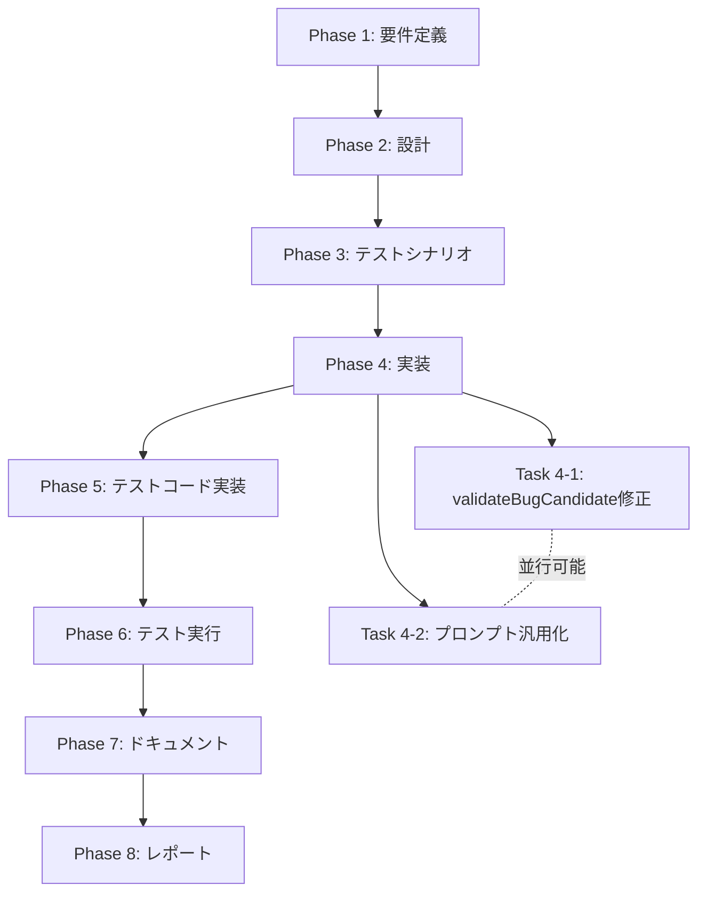

# プロジェクト計画書

**Issue**: #144 - auto-issue: 言語サポートの汎用化（TypeScript/Python制限の撤廃）
**作成日**: 2025-01-30
**見積もり工数**: 6〜8時間（1日程度）

---

## 1. Issue分析

### 複雑度: 中程度

**判定根拠**:
- **影響範囲**: 2ファイルの修正（`src/core/repository-analyzer.ts`, `src/prompts/auto-issue/detect-bugs.txt`）
- **既存機能の拡張**: 言語制限の撤廃とプロンプトの汎用化（新規機能追加ではなく、既存機能の制約緩和）
- **テスト修正**: 既存のユニットテスト/インテグレーションテストの修正が必要
- **リスク**: 中程度（プロンプト変更によるバグ検出精度の低下、既存機能の回帰）

### 見積もり工数: 6〜8時間

**根拠**:
- **Phase 1 (要件定義)**: 1h（除外パターン、サポート言語リストの整理）
- **Phase 2 (設計)**: 1h（バリデーションロジック、プロンプト構造の設計）
- **Phase 3 (テストシナリオ)**: 1h（多言語対応テスト、除外パターンテスト）
- **Phase 4 (実装)**: 2〜3h（バリデーション修正、プロンプト再構成）
- **Phase 5 (テストコード実装)**: 1〜2h（新規テストケース追加、既存テスト修正）
- **Phase 6 (テスト実行)**: 0.5h（全テスト実行、回帰確認）
- **Phase 7 (ドキュメント)**: 0.5h（CLAUDE.md更新）
- **Phase 8 (レポート)**: 0.5h（PR作成、レビュー準備）

### リスク評価: 中

**理由**:
- プロンプト変更によるバグ検出精度の低下リスク（緩和策: フェーズ固有キーワード検証）
- 既存のTypeScript/Pythonリポジトリでの回帰リスク（緩和策: 既存テストの実行）
- 除外パターンの誤設定による検出漏れリスク（緩和策: Phase 3で徹底的なテスト）

---

## 2. 実装戦略判断

### 実装戦略: EXTEND

**判断根拠**:
- **既存コードの拡張**: `validateBugCandidate()` メソッドの言語制限削除と除外パターン追加
- **プロンプトの汎用化**: 既存プロンプトの再構成（新規作成ではない）
- **新規ファイル追加なし**: 既存ファイル2つの修正のみ

**主な変更**:
1. `src/core/repository-analyzer.ts` の `validateBugCandidate()` で言語制限を削除
2. `src/prompts/auto-issue/detect-bugs.txt` を言語非依存のバグパターンに再構成
3. 除外パターン（バイナリ、生成ファイル等）のバリデーション追加

### テスト戦略: UNIT_INTEGRATION

**判断根拠**:
- **UNIT**: `validateBugCandidate()` の単体テスト（言語非依存の動作確認、除外パターン検証）
- **INTEGRATION**: 多言語リポジトリでのエンドツーエンドテスト（Go, Java, Ruby等）

**ユニットテスト対象**:
- 言語制限撤廃後の `validateBugCandidate()` の動作
- 除外パターン（バイナリ、node_modules/等）の正しい除外
- 既存のTypeScript/Python検出機能の回帰確認

**インテグレーションテスト対象**:
- 多言語リポジトリ（TypeScript, Python, Go, Java等）での検出動作
- Jenkinsfile、Dockerfile等のCI/CD設定ファイルの検出
- 除外パターン（node_modules/, dist/等）の正しいスキップ

### テストコード戦略: EXTEND_TEST

**判断根拠**:
- **既存テストの拡張**: `tests/unit/commands/auto-issue.test.ts` の既存テストに多言語ケースを追加
- **新規テストファイル不要**: 既存のテストファイルに新規テストケースを追加するだけで十分

**拡張対象**:
1. `validateBugCandidate()` のユニットテストに多言語ファイルパステストを追加
2. インテグレーションテストに多言語リポジトリテストを追加

---

## 3. 影響範囲分析

### 既存コードへの影響

**変更ファイル**:
1. `src/core/repository-analyzer.ts` (約280行)
   - `validateBugCandidate()` メソッド（lines 204-280）
   - 言語制限削除（lines 223-235）
   - 除外パターン追加（新規）

2. `src/prompts/auto-issue/detect-bugs.txt` (約92行)
   - 検出対象パターンセクション（lines 3-35）
   - 注意事項セクション（lines 78-91）

**影響を受けるモジュール**:
- `src/commands/auto-issue.ts`: 間接的影響なし（RepositoryAnalyzerのインターフェース変更なし）
- `src/core/issue-deduplicator.ts`: 影響なし
- `src/core/issue-generator.ts`: 影響なし

### 依存関係の変更

**新規依存**: なし

**既存依存の変更**: なし

### マイグレーション要否

**不要**: 設定ファイル変更なし、データベーススキーマ変更なし

---

## 4. タスク分割

### Phase 1: 要件定義 (見積もり: 1h)

- [x] Task 1-1: 除外パターンの整理 (0.5h)
  - バイナリファイル拡張子リスト作成
  - 除外ディレクトリリスト作成
  - ロックファイルパターンリスト作成
- [x] Task 1-2: サポート対象言語の明確化 (0.5h)
  - スクリプト言語、コンパイル言語、IaC等のカテゴリ別リスト作成
  - 各言語の拡張子リスト作成

### Phase 2: 設計 (見積もり: 1h)

- [x] Task 2-1: バリデーションロジックの設計 (0.5h)
  - 除外パターンチェックのロジック設計
  - 言語制限削除後の検証フロー設計
- [x] Task 2-2: プロンプト構造の設計 (0.5h)
  - 言語非依存のバグパターンセクション設計
  - 除外パターン明示セクション設計
  - サンプルJSONフォーマット見直し

### Phase 3: テストシナリオ (見積もり: 1h)

- [x] Task 3-1: ユニットテストシナリオ作成 (0.5h)
  - 多言語ファイルパス検証テスト（Go, Java, Ruby等）
  - 除外パターンテスト（バイナリ、node_modules/等）
  - 既存TypeScript/Python検出の回帰テスト
- [x] Task 3-2: インテグレーションテストシナリオ作成 (0.5h)
  - 多言語リポジトリでのエンドツーエンドテスト
  - CI/CD設定ファイル（Jenkinsfile, Dockerfile）検出テスト

### Phase 4: 実装 (見積もり: 2〜3h)

- [x] Task 4-1: `validateBugCandidate()` の修正 (1〜1.5h)
  - 言語制限コード（lines 223-235）の削除
  - 除外パターンチェックロジックの追加
  - 除外ヘルパー関数の実装（`isExcludedFile()`, `isExcludedDirectory()`）
- [x] Task 4-2: プロンプトの汎用化 (1〜1.5h)
  - 言語非依存のバグパターンへ再構成
  - 除外パターンセクションの明記
  - TypeScript/Python固有の記述削除

### Phase 5: テストコード実装 (見積もり: 1〜2h)

- [ ] Task 5-1: ユニットテストの追加 (0.5〜1h)
  - `validateBugCandidate()` の多言語テストケース追加
  - 除外パターンテストケース追加
- [ ] Task 5-2: インテグレーションテストの追加 (0.5〜1h)
  - 多言語リポジトリテストケース追加
  - CI/CD設定ファイル検出テストケース追加

### Phase 6: テスト実行 (見積もり: 0.5h)

- [ ] Task 6-1: 全テストの実行 (0.5h)
  - ユニットテスト実行（`npm run test:unit`）
  - インテグレーションテスト実行（`npm run test:integration`）
  - 回帰確認（既存機能の動作確認）

### Phase 7: ドキュメント (見積もり: 0.5h)

- [ ] Task 7-1: CLAUDE.mdの更新 (0.5h)
  - auto-issueコマンドセクションの更新
  - サポート対象言語リストの追記
  - Phase 1 MVP制限事項の更新

### Phase 8: レポート (見積もり: 0.5h)

- [ ] Task 8-1: PR作成とレビュー準備 (0.5h)
  - PR本文作成
  - 変更内容サマリー作成
  - テスト結果レポート作成

---

## 5. 依存関係

**重要な依存関係**:
- Phase 1 → Phase 2: 除外パターン、サポート言語リストが設計の入力となる
- Phase 2 → Phase 3: バリデーションロジック、プロンプト構造がテストシナリオの基盤
- Phase 3 → Phase 4: テストシナリオが実装の受け入れ基準となる
- Phase 4 → Phase 5: 実装完了後にテストコード実装が可能
- Phase 5 → Phase 6: テストコード完成後にテスト実行

**並行実行可能**:
- Task 4-1（バリデーション修正）とTask 4-2（プロンプト汎用化）は独立して実装可能

---

## 6. リスクと軽減策

### リスク1: プロンプト変更によるバグ検出精度の低下

- **影響度**: 高
- **確率**: 中
- **軽減策**:
  - Phase 3で多言語リポジトリテストを実施し、検出精度を検証
  - 言語非依存のバグパターン（エラーハンドリング、リソースリーク等）に重点を置く
  - 既存のTypeScript/Pythonリポジトリでの回帰テストを必須化

### リスク2: 除外パターンの誤設定による検出漏れ

- **影響度**: 中
- **確率**: 低
- **軽減策**:
  - Phase 1で除外パターンリストを徹底的に整理
  - Phase 5でnode_modules/, dist/, build/等の除外テストを実装
  - ログ出力で「除外されたファイル数」を明示

### リスク3: 既存機能の回帰（TypeScript/Python検出が動作しなくなる）

- **影響度**: 高
- **確率**: 低
- **軽減策**:
  - Phase 5で既存テストケースを必ず実行
  - Phase 6で既存リポジトリでの動作確認を実施
  - バリデーションロジック変更時は慎重にテスト

### リスク4: スコープクリープ（追加言語固有の最適化要求）

- **影響度**: 低
- **確率**: 中
- **軽減策**:
  - Issue #144のスコープは「言語制限の撤廃」のみと明確化
  - 言語固有の最適化は別Issueとして切り出す
  - Phase 2でプロンプト設計時にスコープを再確認

---

## 7. 品質ゲート

### Phase 1: 要件定義

- [x] 除外パターンリストが網羅的である（バイナリ、生成ファイル、ロックファイル等）
- [x] サポート対象言語リストが明確である（拡張子リスト付き）
- [x] 受け入れ基準がIssue本文と一致している

### Phase 2: 設計

- [x] 実装戦略（EXTEND）の判断根拠が明記されている
- [x] テスト戦略（UNIT_INTEGRATION）の判断根拠が明記されている
- [x] テストコード戦略（EXTEND_TEST）の判断根拠が明記されている
- [x] バリデーションロジックが言語非依存である
- [x] プロンプト構造が汎用的である（TypeScript/Python固有の記述なし）

### Phase 3: テストシナリオ

- [x] 多言語ファイルパステストシナリオが定義されている（Go, Java, Ruby等）
- [x] 除外パターンテストシナリオが定義されている（バイナリ、node_modules/等）
- [x] 既存TypeScript/Python検出の回帰テストシナリオが定義されている
- [x] CI/CD設定ファイル（Jenkinsfile, Dockerfile）の検出テストシナリオが定義されている

### Phase 4: 実装

- [x] `validateBugCandidate()` から言語制限コードが削除されている
- [x] 除外パターンチェックロジックが実装されている
- [x] プロンプトが言語非依存のバグパターンに再構成されている
- [x] 除外パターンがプロンプトに明記されている

### Phase 5: テストコード実装

- [ ] 多言語ファイルパステストが実装されている
- [ ] 除外パターンテストが実装されている
- [ ] 既存テストが修正され、すべてパスする

### Phase 6: テスト実行

- [ ] 全ユニットテストがパスする
- [ ] 全インテグレーションテストがパスする
- [ ] 既存機能の回帰が確認されている

### Phase 7: ドキュメント

- [ ] CLAUDE.mdが更新されている（サポート対象言語、Phase 1制限事項）
- [ ] コード内のコメントが更新されている（言語制限の記述削除）

### Phase 8: レポート

- [ ] PR本文にテスト結果が記載されている
- [ ] 変更内容サマリーが明確である
- [ ] 受け入れ基準がすべて満たされている

---

## 8. 受け入れ基準（Issue本文より）

以下の受け入れ基準をすべて満たす必要があります：

- [ ] TypeScript/Python以外のファイル（Go, Java, Ruby, Groovy等）でもバグ候補が検出される
- [ ] Jenkinsfile、Dockerfile等のCI/CD設定ファイルも対象となる
- [ ] バイナリファイルやnode_modules等の不要なファイルは除外される
- [ ] 既存のTypeScript/Pythonリポジトリでの動作が維持される
- [ ] プロンプトが言語非依存の形式に更新されている
- [ ] CLAUDE.mdのドキュメントが更新されている

---

## 9. 注意事項

### 実装時の重要ポイント

1. **言語制限の完全撤廃**: `validateBugCandidate()` のファイル拡張子チェック（lines 223-235）を完全に削除する
2. **除外パターンの優先度**: 言語非依存の除外パターン（バイナリ、生成ファイル、node_modules/等）を最優先でチェック
3. **プロンプトの汎用性**: TypeScript/Python固有の例（「`any` の過度な使用」等）を削除し、言語非依存の例に置き換える
4. **既存機能の保護**: 既存のTypeScript/Pythonリポジトリでの動作を必ずテストする

### レビュー時の確認ポイント

1. **品質ゲートの満たし**: 6つの必須要件（実装戦略、テスト戦略、テストコード戦略、影響範囲、タスク分割、リスク）がすべて明記されているか
2. **ブロッカーの不在**: 次フェーズに進めない問題がないか
3. **受け入れ基準の達成**: Issue本文の6つの受け入れ基準がすべて満たされているか

---

## 10. 参考情報

### 関連Issue

- #121: AIエージェントによる自動Issue作成機能の実装（親Issue）
- #126: auto-issue: Phase 1 - CLIコマンド基盤とバグ検出機能の実装（Phase 1実装）

### 関連ドキュメント

- `CLAUDE.md`: auto-issueコマンドの仕様（lines 163-211）
- `ARCHITECTURE.md`: RepositoryAnalyzerのアーキテクチャ

---

## 11. まとめ

このIssueは、auto-issue機能の言語制限（TypeScript/Python限定）を撤廃し、あらゆるプログラミング言語のリポジトリで使用できるように汎用化する中規模タスクです。実装戦略はEXTEND（既存コードの拡張）、テスト戦略はUNIT_INTEGRATION、見積もり工数は6〜8時間（1日程度）です。

**成功の鍵**:
- Phase 1での除外パターンの徹底的な整理
- Phase 2でのプロンプト汎用化設計
- Phase 3での多言語テストシナリオ策定
- Phase 5での既存機能回帰テストの実施

**ブロッカーなし**: 次フェーズ（Phase 1: 要件定義）に進む準備が整っています。
