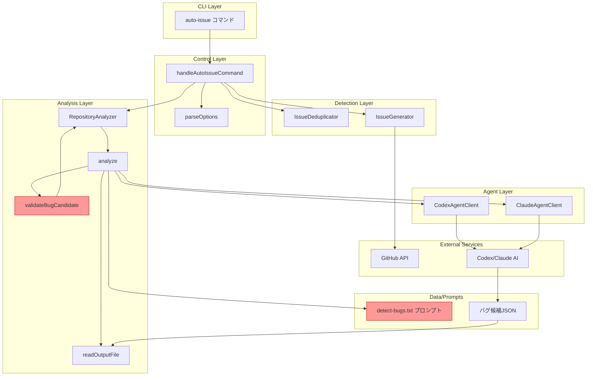
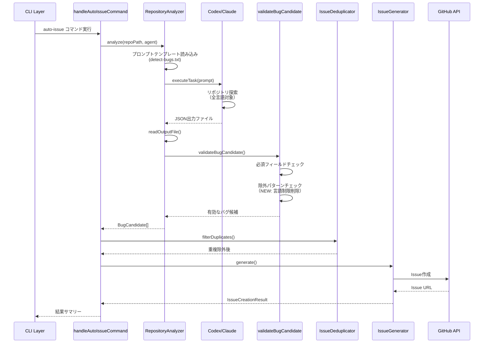
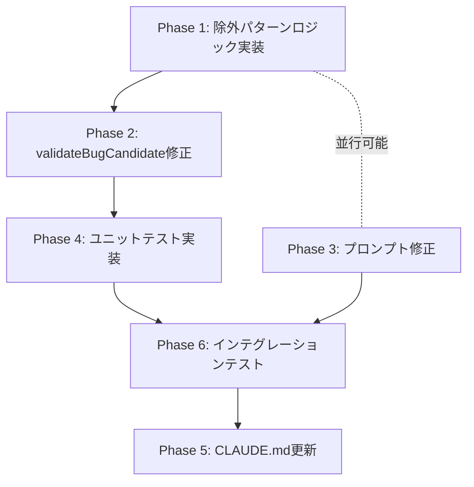

# 設計書

**Issue**: #144 - auto-issue: 言語サポートの汎用化（TypeScript/Python制限の撤廃）
**作成日**: 2025-01-30
**バージョン**: 1.0

---

## 0. Planning Documentの確認

Planning Phase (Phase 0) で策定された開発計画を確認しました：

### 開発計画の全体像
- **実装戦略**: EXTEND（既存コードの拡張）
- **テスト戦略**: UNIT_INTEGRATION（ユニットテスト＋インテグレーションテスト）
- **テストコード戦略**: EXTEND_TEST（既存テストの拡張）
- **複雑度**: 中程度
- **見積もり工数**: 6〜8時間（1日程度）
- **リスク評価**: 中（プロンプト変更によるバグ検出精度低下、既存機能の回帰リスク）

### 実装対象ファイル
1. `src/core/repository-analyzer.ts` (約280行)
   - `validateBugCandidate()` メソッドの言語制限削除（lines 223-235）
   - 除外パターン追加（新規）
2. `src/prompts/auto-issue/detect-bugs.txt` (約92行)
   - 検出対象パターンセクション（lines 3-35）の汎用化
   - 注意事項セクション（lines 78-91）の更新

**本設計書は、上記の開発計画を踏まえて作成します。**

---

## 1. アーキテクチャ設計

### 1.1 システム全体図



**凡例**:
- **赤枠**: 今回の変更対象（`validateBugCandidate()` と `detect-bugs.txt`）
- **青枠**: 既存コンポーネント（変更なし）

### 1.2 コンポーネント間の関係

| コンポーネント | 役割 | 変更有無 |
|--------------|------|---------|
| `handleAutoIssueCommand()` | CLIオプションパース、全体フロー制御 | なし |
| `RepositoryAnalyzer` | リポジトリ解析とバグ検出 | **変更** |
| `validateBugCandidate()` | バグ候補のバリデーション | **変更**（言語制限削除） |
| `detect-bugs.txt` | AIエージェント向けプロンプト | **変更**（言語非依存化） |
| `IssueDeduplicator` | 重複検出 | なし |
| `IssueGenerator` | GitHub Issue作成 | なし |

### 1.3 データフロー



---

## 2. 実装戦略判断（必須）

### 実装戦略: EXTEND（既存コードの拡張）

**判断根拠**:

1. **既存コードの拡張に該当**
   - `validateBugCandidate()` メソッドの言語制限ロジック（lines 223-235）を削除
   - 除外パターンチェックロジックを追加（新規ヘルパー関数の可能性あり）
   - `detect-bugs.txt` プロンプトの再構成（既存ファイルの修正）

2. **新規ファイル追加なし**
   - 変更対象は2ファイルのみ（`repository-analyzer.ts`, `detect-bugs.txt`）
   - 既存のインターフェース（`BugCandidate`）は変更なし
   - 既存のコマンドハンドラ（`handleAutoIssueCommand`）は変更なし

3. **既存機能の保持**
   - TypeScript/Pythonリポジトリでの既存動作を100%維持
   - 既存のバリデーションロジック（タイトル長、必須フィールド等）は保持
   - 既存のテストケースが引き続き動作

**CREATE（新規作成）を選択しなかった理由**:
- 完全に新しいコンポーネントではなく、既存のバリデーションロジックの修正
- 既存のプロンプトテンプレートの再構成であり、新規作成ではない

**REFACTOR（リファクタリング）を選択しなかった理由**:
- コードの構造改善が主目的ではなく、機能拡張（言語制限の撤廃）が主目的
- 既存のアーキテクチャは維持され、内部構造の変更は最小限

---

## 3. テスト戦略判断（必須）

### テスト戦略: UNIT_INTEGRATION（ユニット＋インテグレーション）

**判断根拠**:

1. **ユニットテストが必須**
   - `validateBugCandidate()` メソッドの単体テストが必要
   - 除外パターンロジックの正確性を検証（バイナリ、node_modules/等）
   - 言語非依存の動作確認（Go, Java, Ruby等のファイルパス）
   - 既存のTypeScript/Python検出機能の回帰確認

2. **インテグレーションテストが必須**
   - 多言語リポジトリでのエンドツーエンドテスト
   - AIエージェント（Codex/Claude）との統合テスト
   - プロンプト変更による検出精度の検証
   - CI/CD設定ファイル（Jenkinsfile, Dockerfile）の検出確認

3. **BDDテストは不要**
   - ユーザーストーリーやビジネスロジックの変更ではない
   - 技術的な機能拡張であり、エンドユーザー視点のシナリオテストは不要

**BDD_ONLY を選択しなかった理由**:
- Issue #144 はユーザーストーリーベースの機能追加ではなく、技術的制約の撤廃
- BDDテストで記述するビジネス価値が明確でない

**UNIT_ONLY を選択しなかった理由**:
- プロンプト変更による実際のバグ検出精度への影響を確認する必要がある
- AIエージェントとの統合が正しく動作することを確認する必要がある

---

## 4. テストコード戦略判断（必須）

### テストコード戦略: EXTEND_TEST（既存テストの拡張）

**判断根拠**:

1. **既存テストファイルが存在**
   - `tests/unit/commands/auto-issue.test.ts` が既に存在
   - このファイルに `validateBugCandidate()` のテストケースを追加可能

2. **既存テストとの高い関連性**
   - 既存のバリデーションテストケースを拡張する形で実装可能
   - 多言語ファイルパス（`.go`, `.java`, `.rb`）のテストケースを追加
   - 除外パターン（`node_modules/`, `dist/`, バイナリ）のテストケースを追加

3. **新規テストファイル作成の必要性なし**
   - バリデーションロジックの既存テストと同じスコープ
   - 新しいテストクラスやモジュールは不要

**CREATE_TEST（新規テスト作成）を選択しなかった理由**:
- 既存の `auto-issue.test.ts` に統合することでテストの一貫性を保持
- 新規ファイル作成による保守コストの増加を避ける

**BOTH_TEST（両方）を選択しなかった理由**:
- 既存テストの拡張のみで十分なカバレッジが達成可能
- 新規テストファイルを作成する明確な理由がない

---

## 5. 影響範囲分析

### 5.1 既存コードへの影響

#### 変更ファイル1: `src/core/repository-analyzer.ts`

**変更箇所**:
- **lines 223-235**: 言語制限ロジックの削除
  ```typescript
  // 削除対象（lines 228-235）
  const isTypeScript = candidate.file.endsWith('.ts') || candidate.file.endsWith('.tsx');
  const isPython = candidate.file.endsWith('.py');
  if (!isTypeScript && !isPython) {
    logger.debug(
      `Invalid candidate: file "${candidate.file}" is not TypeScript or Python (Phase 1 limitation)`,
    );
    return false;
  }
  ```

- **新規追加**: 除外パターンチェックロジック
  - 除外ディレクトリ: `node_modules/`, `vendor/`, `.git/`, `dist/`, `build/`, `out/`, `target/`, `__pycache__/`, `.venv/`, `venv/`
  - 除外ファイルパターン: `*.min.js`, `*.bundle.js`, `*.generated.*`, `*.g.go`, `*.pb.go`
  - 除外バイナリ拡張子: `.exe`, `.dll`, `.so`, `.dylib`, `.png`, `.jpg`, `.gif`, `.ico`, `.pdf`, `.zip`, `.tar`, `.gz`
  - 除外ロックファイル: `package-lock.json`, `yarn.lock`, `Gemfile.lock`, `poetry.lock`, `Pipfile.lock`, `go.sum`

#### 変更ファイル2: `src/prompts/auto-issue/detect-bugs.txt`

**変更箇所**:
- **lines 14-16**: 言語固有記述の削除
  - 削除: 「`any` の過度な使用（TypeScript）」
  - 削除: 「動的型付け言語での型ヒント欠如（Python等）」

- **lines 3-35**: 検出対象パターンの汎用化
  - 言語非依存のバグパターンに再構成（詳細は6.2節）

- **lines 78-91**: 注意事項セクションの更新
  - 言語非依存性の明記
  - 除外パターンの明確化
  - 対象ディレクトリの制限緩和

### 5.2 影響を受けるモジュール

| モジュール | 影響度 | 詳細 |
|-----------|-------|------|
| `src/commands/auto-issue.ts` | **なし** | インターフェース変更なし |
| `src/core/issue-deduplicator.ts` | **なし** | `BugCandidate` 型は変更なし |
| `src/core/issue-generator.ts` | **なし** | `BugCandidate` 型は変更なし |
| `src/types/auto-issue.ts` | **なし** | 型定義変更なし |
| `tests/unit/commands/auto-issue.test.ts` | **変更** | テストケース追加 |

### 5.3 依存関係の変更

- **新規依存**: なし
- **既存依存の変更**: なし
- **削除依存**: なし

### 5.4 マイグレーション要否

**不要**: 設定ファイル変更なし、データベーススキーマ変更なし、APIインターフェース変更なし

---

## 6. 変更・追加ファイルリスト

### 6.1 修正が必要な既存ファイル

| ファイルパス | 変更内容 | 変更行数（概算） |
|------------|---------|----------------|
| `src/core/repository-analyzer.ts` | `validateBugCandidate()` の言語制限削除、除外パターン追加 | 削除: 8行<br/>追加: 40〜60行 |
| `src/prompts/auto-issue/detect-bugs.txt` | 言語非依存のバグパターンに再構成、除外パターン明確化 | 削除: 10行<br/>追加: 30〜50行 |
| `tests/unit/commands/auto-issue.test.ts` | 多言語テストケース追加、除外パターンテストケース追加 | 追加: 50〜80行 |
| `CLAUDE.md` | サポート対象言語リストの記載、Phase 1制限事項の更新 | 削除: 3行<br/>追加: 20〜30行 |

### 6.2 新規作成ファイル

**なし**: すべて既存ファイルの修正で対応

### 6.3 削除が必要なファイル

**なし**

---

## 7. 詳細設計

### 7.1 除外パターンの設計

#### 7.1.1 除外ディレクトリ定義

```typescript
/**
 * 除外ディレクトリパターン
 *
 * これらのディレクトリは依存関係、生成ファイル、バージョン管理メタデータを含むため、
 * バグ検出対象から除外します。
 */
const EXCLUDED_DIRECTORIES = [
  'node_modules/',
  'vendor/',
  '.git/',
  'dist/',
  'build/',
  'out/',
  'target/',
  '__pycache__/',
  '.venv/',
  'venv/',
  '.pytest_cache/',
  '.mypy_cache/',
  'coverage/',
  '.next/',
  '.nuxt/',
];
```

#### 7.1.2 除外ファイルパターン定義

```typescript
/**
 * 除外ファイルパターン
 *
 * これらのパターンに一致するファイルは生成ファイル、ロックファイル、
 * バイナリファイルであるため、バグ検出対象から除外します。
 */
const EXCLUDED_FILE_PATTERNS = {
  // 生成ファイル
  generated: [
    '*.min.js',
    '*.bundle.js',
    '*.generated.*',
    '*.g.go',      // Go generated files
    '*.pb.go',     // Protocol Buffer generated files
    '*.gen.ts',    // TypeScript generated files
  ],

  // ロックファイル
  lockFiles: [
    'package-lock.json',
    'yarn.lock',
    'pnpm-lock.yaml',
    'Gemfile.lock',
    'poetry.lock',
    'Pipfile.lock',
    'go.sum',
    'Cargo.lock',
    'composer.lock',
  ],

  // バイナリファイル拡張子
  binary: [
    '.exe', '.dll', '.so', '.dylib', '.a', '.lib',  // 実行ファイル/ライブラリ
    '.png', '.jpg', '.jpeg', '.gif', '.ico', '.svg', '.webp',  // 画像
    '.pdf', '.doc', '.docx', '.xls', '.xlsx', '.ppt', '.pptx',  // ドキュメント
    '.zip', '.tar', '.gz', '.bz2', '.7z', '.rar',  // アーカイブ
    '.mp3', '.mp4', '.avi', '.mov', '.mkv',  // メディア
    '.woff', '.woff2', '.ttf', '.eot',  // フォント
  ],
};
```

#### 7.1.3 除外ロジックのヘルパー関数

```typescript
/**
 * ファイルパスが除外ディレクトリに含まれるかチェック
 *
 * @param filePath - チェック対象のファイルパス
 * @returns 除外すべき場合は true
 */
function isExcludedDirectory(filePath: string): boolean {
  const normalizedPath = filePath.replace(/\\/g, '/');
  return EXCLUDED_DIRECTORIES.some((dir) => normalizedPath.includes(`/${dir}`));
}

/**
 * ファイルパスが除外ファイルパターンに一致するかチェック
 *
 * @param filePath - チェック対象のファイルパス
 * @returns 除外すべき場合は true
 */
function isExcludedFile(filePath: string): boolean {
  const fileName = path.basename(filePath);
  const extension = path.extname(filePath);

  // 生成ファイルチェック
  if (EXCLUDED_FILE_PATTERNS.generated.some((pattern) =>
    pattern.includes('*')
      ? matchesWildcard(fileName, pattern)
      : fileName === pattern
  )) {
    return true;
  }

  // ロックファイルチェック
  if (EXCLUDED_FILE_PATTERNS.lockFiles.includes(fileName)) {
    return true;
  }

  // バイナリファイルチェック
  if (EXCLUDED_FILE_PATTERNS.binary.includes(extension)) {
    return true;
  }

  return false;
}

/**
 * ワイルドカードパターンマッチング（簡易版）
 *
 * @param fileName - ファイル名
 * @param pattern - パターン（*.min.js, *.generated.* 等）
 * @returns マッチする場合は true
 */
function matchesWildcard(fileName: string, pattern: string): boolean {
  // '*' を正規表現の '.*' に置換（ReDoS対策として replaceAll を使用）
  const regexPattern = pattern
    .replaceAll('.', '\\.')
    .replaceAll('*', '.*');

  const regex = new RegExp(`^${regexPattern}$`);
  return regex.test(fileName);
}
```

### 7.2 `validateBugCandidate()` メソッドの修正設計

#### 7.2.1 修正前のコード（lines 204-280）

```typescript
private validateBugCandidate(candidate: BugCandidate): boolean {
  // 必須フィールドの存在確認
  if (!candidate || typeof candidate !== 'object') {
    logger.debug('Invalid candidate: not an object');
    return false;
  }

  // タイトル検証（10〜100文字）
  if (!candidate.title || typeof candidate.title !== 'string') {
    logger.debug('Invalid candidate: missing or invalid title');
    return false;
  }
  if (candidate.title.length < 10 || candidate.title.length > 100) {
    logger.debug(
      `Invalid candidate: title length ${candidate.title.length} is out of range (10-100)`,
    );
    return false;
  }

  // ファイルパス検証（TypeScript または Python のみ、Phase 1限定）
  if (!candidate.file || typeof candidate.file !== 'string') {
    logger.debug('Invalid candidate: missing or invalid file');
    return false;
  }
  const isTypeScript = candidate.file.endsWith('.ts') || candidate.file.endsWith('.tsx');
  const isPython = candidate.file.endsWith('.py');
  if (!isTypeScript && !isPython) {
    logger.debug(
      `Invalid candidate: file "${candidate.file}" is not TypeScript or Python (Phase 1 limitation)`,
    );
    return false;
  }

  // 行番号検証（正の整数）
  if (typeof candidate.line !== 'number' || candidate.line < 1) {
    logger.debug(`Invalid candidate: invalid line number ${candidate.line}`);
    return false;
  }

  // 深刻度検証
  if (!['high', 'medium', 'low'].includes(candidate.severity)) {
    logger.debug(`Invalid candidate: invalid severity "${candidate.severity}"`);
    return false;
  }

  // 説明検証（最低50文字）
  if (!candidate.description || typeof candidate.description !== 'string') {
    logger.debug('Invalid candidate: missing or invalid description');
    return false;
  }
  if (candidate.description.length < 50) {
    logger.debug(
      `Invalid candidate: description length ${candidate.description.length} is too short (min 50)`,
    );
    return false;
  }

  // 修正案検証（最低20文字）
  if (!candidate.suggestedFix || typeof candidate.suggestedFix !== 'string') {
    logger.debug('Invalid candidate: missing or invalid suggestedFix');
    return false;
  }
  if (candidate.suggestedFix.length < 20) {
    logger.debug(
      `Invalid candidate: suggestedFix length ${candidate.suggestedFix.length} is too short (min 20)`,
    );
    return false;
  }

  // カテゴリ検証（Phase 1では 'bug' 固定）
  if (candidate.category !== 'bug') {
    logger.debug(`Invalid candidate: invalid category "${candidate.category}" (must be "bug")`);
    return false;
  }

  return true;
}
```

#### 7.2.2 修正後のコード

```typescript
private validateBugCandidate(candidate: BugCandidate): boolean {
  // 必須フィールドの存在確認
  if (!candidate || typeof candidate !== 'object') {
    logger.debug('Invalid candidate: not an object');
    return false;
  }

  // タイトル検証（10〜100文字）
  if (!candidate.title || typeof candidate.title !== 'string') {
    logger.debug('Invalid candidate: missing or invalid title');
    return false;
  }
  if (candidate.title.length < 10 || candidate.title.length > 100) {
    logger.debug(
      `Invalid candidate: title length ${candidate.title.length} is out of range (10-100)`,
    );
    return false;
  }

  // ファイルパス検証
  if (!candidate.file || typeof candidate.file !== 'string') {
    logger.debug('Invalid candidate: missing or invalid file');
    return false;
  }

  // 除外ディレクトリチェック（NEW）
  if (isExcludedDirectory(candidate.file)) {
    logger.debug(
      `Invalid candidate: file "${candidate.file}" is in excluded directory`,
    );
    return false;
  }

  // 除外ファイルパターンチェック（NEW）
  if (isExcludedFile(candidate.file)) {
    logger.debug(
      `Invalid candidate: file "${candidate.file}" matches excluded file pattern`,
    );
    return false;
  }

  // 行番号検証（正の整数）
  if (typeof candidate.line !== 'number' || candidate.line < 1) {
    logger.debug(`Invalid candidate: invalid line number ${candidate.line}`);
    return false;
  }

  // 深刻度検証
  if (!['high', 'medium', 'low'].includes(candidate.severity)) {
    logger.debug(`Invalid candidate: invalid severity "${candidate.severity}"`);
    return false;
  }

  // 説明検証（最低50文字）
  if (!candidate.description || typeof candidate.description !== 'string') {
    logger.debug('Invalid candidate: missing or invalid description');
    return false;
  }
  if (candidate.description.length < 50) {
    logger.debug(
      `Invalid candidate: description length ${candidate.description.length} is too short (min 50)`,
    );
    return false;
  }

  // 修正案検証（最低20文字）
  if (!candidate.suggestedFix || typeof candidate.suggestedFix !== 'string') {
    logger.debug('Invalid candidate: missing or invalid suggestedFix');
    return false;
  }
  if (candidate.suggestedFix.length < 20) {
    logger.debug(
      `Invalid candidate: suggestedFix length ${candidate.suggestedFix.length} is too short (min 20)`,
    );
    return false;
  }

  // カテゴリ検証（Phase 1では 'bug' 固定）
  if (candidate.category !== 'bug') {
    logger.debug(`Invalid candidate: invalid category "${candidate.category}" (must be "bug")`);
    return false;
  }

  return true;
}
```

#### 7.2.3 変更差分

**削除**:
```typescript
  const isTypeScript = candidate.file.endsWith('.ts') || candidate.file.endsWith('.tsx');
  const isPython = candidate.file.endsWith('.py');
  if (!isTypeScript && !isPython) {
    logger.debug(
      `Invalid candidate: file "${candidate.file}" is not TypeScript or Python (Phase 1 limitation)`,
    );
    return false;
  }
```

**追加**:
```typescript
  // 除外ディレクトリチェック（NEW）
  if (isExcludedDirectory(candidate.file)) {
    logger.debug(
      `Invalid candidate: file "${candidate.file}" is in excluded directory`,
    );
    return false;
  }

  // 除外ファイルパターンチェック（NEW）
  if (isExcludedFile(candidate.file)) {
    logger.debug(
      `Invalid candidate: file "${candidate.file}" matches excluded file pattern`,
    );
    return false;
  }
```

### 7.3 プロンプトテンプレートの設計

#### 7.3.1 修正前のプロンプト（`detect-bugs.txt`）

**問題点**:
- TypeScript/Python固有の記述が多い（lines 14-16）
- 対象ディレクトリが限定的（line 90: `src/, lib/, app/`）
- 除外パターンが明確でない（line 91: `node_modules/, dist/, build/, .git/`）

#### 7.3.2 修正後のプロンプト

```markdown
あなたはコードレビューの専門家です。以下のリポジトリからバグや問題点を検出してください。

# 検出対象パターン

以下の5つのパターンを検出対象とします（言語非依存）：

1. **エラーハンドリングの欠如**
   - try-catchブロックなし（Java, C#, JavaScript等）
   - エラー返り値の無視（Go, C等）
   - Panicの未処理（Go, Rust等）
   - Promise拒否の未処理（JavaScript/TypeScript）
   - Exception未キャッチ（Python, Ruby等）
   - エラーログの欠如

2. **リソースリークの可能性**
   - ファイルハンドルの未クローズ（全言語共通）
   - データベース接続の未解放（全言語共通）
   - defer/finally の欠如（Go, Java, Python等）
   - RAII違反（C++）
   - コンテキストキャンセルの未処理（Go）
   - イベントリスナーの未削除（JavaScript/TypeScript）
   - タイマーの未クリア（JavaScript/TypeScript）

3. **並行処理の問題**
   - レースコンディション（goroutine、スレッド等）
   - デッドロックの可能性（Mutex、Channel、Lock等）
   - 未同期のグローバル変数アクセス
   - アトミック操作の欠如

4. **Null/Nil参照の可能性**
   - Null/Nilポインタデリファレンス（Go, Java, C#, C/C++等）
   - Optional未チェック（Swift, Rust等）
   - Null安全性違反（Kotlin, Dart等）

5. **セキュリティ上の懸念**
   - ハードコードされたシークレット（APIキー、パスワード、トークン）
   - SQLインジェクションの可能性（全言語共通）
   - コマンドインジェクションの可能性（Shell、Groovy等）
   - パストラバーサルの可能性（ファイル操作全般）
   - XSS脆弱性（Web関連）
   - 環境変数の直接参照（サニタイズなし）

# 出力フォーマット

検出したバグ候補は **必ずJSONファイルに書き出してください**。

## 出力ファイル

**出力先**: `{output_file_path}`

このファイルに以下のJSON形式でバグ候補を書き出してください：

```json
{
  "bugs": [
    {
      "title": "エラーハンドリングの欠如 in executeTask",
      "file": "src/core/codex-agent-client.ts",
      "line": 42,
      "severity": "high",
      "description": "executeTask()メソッドでエラーハンドリングが不足しています。APIリクエスト失敗時にキャッチされないエラーが発生する可能性があります。",
      "suggestedFix": "try-catchブロックを追加して、エラー発生時に適切なログ記録とリトライ処理を実装してください。",
      "category": "bug"
    }
  ]
}
```

**重要**: 標準出力への出力ではなく、必ず上記のファイルパスにJSONを書き出してください。

## フィールド仕様

- **title**: バグタイトル（50〜80文字、日本語または英語）
- **file**: ファイルパス（リポジトリルートからの相対パス）
- **line**: 行番号（整数）
- **severity**: 深刻度（'high' | 'medium' | 'low'）
- **description**: 詳細説明（200〜500文字、問題の詳細と影響を記載）
- **suggestedFix**: 修正案（100〜300文字、具体的な修正方法を記載）
- **category**: カテゴリ（Phase 1では 'bug' 固定）

# リポジトリパス

{repository_path}

# 除外対象

以下のパターンは検出対象から除外してください：

## 除外ディレクトリ
- 依存関係: `node_modules/`, `vendor/`
- バージョン管理: `.git/`
- ビルド成果物: `dist/`, `build/`, `out/`, `target/`
- キャッシュ: `__pycache__/`, `.pytest_cache/`, `.mypy_cache/`, `coverage/`
- 仮想環境: `.venv/`, `venv/`
- フレームワーク固有: `.next/`, `.nuxt/`

## 除外ファイルパターン
- 生成ファイル: `*.min.js`, `*.bundle.js`, `*.generated.*`, `*.g.go`, `*.pb.go`, `*.gen.ts`
- ロックファイル: `package-lock.json`, `yarn.lock`, `Gemfile.lock`, `poetry.lock`, `go.sum`, `Cargo.lock`
- バイナリファイル: `.exe`, `.dll`, `.so`, `.dylib`, `.png`, `.jpg`, `.gif`, `.pdf`, `.zip`, `.tar`, `.gz`

## サポート対象ファイル（明示的に検出対象）
- スクリプト言語: `.js`, `.jsx`, `.mjs`, `.ts`, `.tsx`, `.py`, `.rb`, `.php`, `.pl`, `.sh`, `.bash`
- コンパイル言語: `.go`, `.java`, `.kt`, `.rs`, `.c`, `.h`, `.cpp`, `.hpp`, `.cs`, `.swift`
- JVM言語: `.groovy`, `.scala`
- CI/CD設定: `Jenkinsfile`, `Dockerfile`, `Makefile`
- 設定ファイル: `.yml`, `.yaml`, `.json`, `.toml`, `.xml`
- IaC: `.tf`, `.template`

# 重要な注意事項

1. **言語非依存性**: あらゆるプログラミング言語のファイルを解析対象に含めてください
2. **具体的な指摘**: ファイルパスと行番号を正確に特定してください
3. **優先順位**: 深刻度（severity）が高いバグから優先的に報告してください
4. **重複排除**: 同じ問題を複数回報告しないでください
5. **ファイル出力必須**: 必ず指定されたファイルパス（`{output_file_path}`）にJSONを書き出してください
6. **バグが見つからない場合**: 空の配列を出力してください（`{"bugs": []}`）
7. **除外パターンの遵守**: 上記の除外ディレクトリ・ファイルパターンに該当するファイルは解析しないでください

# 制限事項

- 最大検出数: 20件
- 対象ディレクトリ: ソースコードディレクトリ（上記の除外パターンを除く）
```

#### 7.3.3 変更差分サマリー

| セクション | 変更内容 | 変更理由 |
|-----------|---------|---------|
| 検出対象パターン | 各パターンに言語非依存の例を追加 | TypeScript/Python以外の言語でも適切な検出を可能にする |
| 除外対象（新規） | 除外ディレクトリ、ファイルパターンを明記 | エージェントに明確な指示を与え、誤検出を防止 |
| サポート対象ファイル（新規） | 30種類以上の拡張子を明記 | 多言語サポートの明確化 |
| 注意事項 | 「言語非依存性」を追加 | エージェントに汎用的な検出を促す |
| 制限事項 | 「対象ディレクトリ」の記述を汎用化 | `src/, lib/, app/` の限定を削除 |

### 7.4 CLAUDE.md の更新設計

#### 7.4.1 修正箇所

**セクション**: `### 自動バグ検出＆Issue生成（v0.5.0、Issue #126で追加）`（lines 163-205）

**修正前** (lines 201-204):
```markdown
**Phase 1 MVP の制限事項**:
- 対象ファイル: TypeScript (`.ts`) と Python (`.py`) のみ
- Issue種類: `bug` カテゴリのみ
- 分析対象: `src/` ディレクトリ配下のファイル
```

**修正後**:
```markdown
**サポート対象言語（v0.5.1、Issue #144で汎用化）**:

| カテゴリ | 言語/ファイル |
|---------|--------------|
| **スクリプト言語** | JavaScript (.js, .jsx, .mjs), TypeScript (.ts, .tsx), Python (.py), Ruby (.rb), PHP (.php), Perl (.pl), Shell (.sh, .bash) |
| **コンパイル言語** | Go (.go), Java (.java), Kotlin (.kt), Rust (.rs), C (.c, .h), C++ (.cpp, .hpp), C# (.cs), Swift (.swift) |
| **JVM言語** | Groovy (.groovy), Scala (.scala) |
| **CI/CD設定** | Jenkinsfile, Dockerfile, Makefile |
| **設定/データ** | YAML (.yml, .yaml), JSON (.json), TOML (.toml), XML (.xml) |
| **IaC** | Terraform (.tf), CloudFormation (.template) |

**除外パターン**:
- ディレクトリ: `node_modules/`, `vendor/`, `.git/`, `dist/`, `build/`, `out/`, `target/`, `__pycache__/`, `.venv/`, `venv/`
- 生成ファイル: `*.min.js`, `*.bundle.js`, `*.generated.*`, `*.g.go`, `*.pb.go`
- バイナリ: `.exe`, `.dll`, `.so`, `.dylib`, `.png`, `.jpg`, `.gif`, `.ico`, `.pdf`, `.zip`, `.tar`, `.gz`
- ロックファイル: `package-lock.json`, `yarn.lock`, `Gemfile.lock`, `poetry.lock`, `go.sum`

**Phase 1 MVP の制限事項**:
- Issue種類: `bug` カテゴリのみ（`refactor`, `enhancement` は将来追加予定）
```

---

## 8. セキュリティ考慮事項

### 8.1 パストラバーサル攻撃の防止

**リスク**: `isExcludedDirectory()` 関数で相対パス（`../../node_modules/`）を使用した攻撃の可能性

**対策**:
```typescript
function isExcludedDirectory(filePath: string): boolean {
  // パス正規化（セキュリティ対策）
  const normalizedPath = path.normalize(filePath).replace(/\\/g, '/');

  // パストラバーサル攻撃防止（../ を含むパスを拒否）
  if (normalizedPath.includes('../')) {
    logger.warn(`Potentially malicious path detected: ${filePath}`);
    return true; // 疑わしいパスは除外
  }

  return EXCLUDED_DIRECTORIES.some((dir) => normalizedPath.includes(`/${dir}`));
}
```

### 8.2 ReDoS攻撃の防止

**リスク**: `matchesWildcard()` 関数で正規表現を動的生成する際のReDoS攻撃

**対策** (CLAUDE.md Issue #140の推奨事項に従う):
```typescript
function matchesWildcard(fileName: string, pattern: string): boolean {
  // ReDoS対策: String.prototype.replaceAll() を使用（Issue #140）
  const regexPattern = pattern
    .replaceAll('.', '\\.')  // replaceAll を使用
    .replaceAll('*', '.*');

  const regex = new RegExp(`^${regexPattern}$`);
  return regex.test(fileName);
}
```

**注意**: Node.js 15.0.0以降で `replaceAll()` が利用可能（本プロジェクトはNode.js 20以上が前提）

### 8.3 機密情報の検出

**リスク**: プロンプトがハードコードされたシークレットを検出するため、機密情報がログに記録される可能性

**対策**:
- `logger.debug()` でバグ候補の詳細をログ記録する際、`suggestedFix` や `description` フィールドに機密情報が含まれる可能性を考慮
- ログレベルを `info` に制限し、`debug` レベルでのみ詳細を記録

**実装なし（既存の仕組みで十分）**:
- 既存の `logger.debug()` の使用パターンは適切
- Issue本文生成時に `SecretMasker` が機密情報をマスキング（既存機能）

---

## 9. 非機能要件への対応

### 9.1 パフォーマンス

#### 9.1.1 バリデーション処理時間

**要件**: 1000件のバグ候補を3秒以内に処理

**設計**:
- 除外パターンチェックはO(n)の時間複雑度（nはバグ候補数）
- `isExcludedDirectory()`: 最悪ケースでO(m)（mは除外ディレクトリ数、約15個）
- `isExcludedFile()`: 最悪ケースでO(p)（pは除外パターン数、約30個）
- 合計: O(n × (m + p)) ≈ O(n × 45) ≈ O(n)

**検証方法**:
- ユニットテストで1000件のバグ候補を生成し、バリデーション処理時間を計測
- 目標: 3秒以内（1候補あたり3ミリ秒）

#### 9.1.2 正規表現のパフォーマンス

**対策**:
- `matchesWildcard()` で使用する正規表現はシンプルなパターン（`^.*\.min\.js$` 等）
- 複雑なバックトラッキングは発生しない
- タイムアウトテストは不要（パターンが単純なため）

### 9.2 スケーラビリティ

**要件**: 大規模リポジトリ（10万ファイル以上）でも動作すること

**設計**:
- バリデーションは各バグ候補に対して独立に実行（並列化可能）
- 現時点では逐次処理で十分（AIエージェントのバグ検出が最大20件に制限されているため）
- 将来的に並列化が必要な場合は、`Promise.all()` で並列実行可能

### 9.3 保守性

#### 9.3.1 除外パターンの拡張性

**設計**:
- `EXCLUDED_DIRECTORIES`, `EXCLUDED_FILE_PATTERNS` を定数として定義
- 新しい言語やフレームワークに対応する際、定数に追加するだけで対応可能
- 将来的に設定ファイル（`.autoissue-ignore`）でカスタマイズ可能にする拡張ポイント

#### 9.3.2 テストの保守性

**設計**:
- 除外パターンのテストケースは `EXCLUDED_DIRECTORIES`, `EXCLUDED_FILE_PATTERNS` から自動生成
- 定数を変更すれば、テストケースも自動的に更新される

---

## 10. 実装の順序

### 10.1 推奨実装順序

実装は以下の順序で進めることを推奨します：

#### Phase 1: 除外パターンロジックの実装（1〜1.5時間）

1. **ステップ1-1**: 除外パターン定数の定義
   - `EXCLUDED_DIRECTORIES` 配列の定義
   - `EXCLUDED_FILE_PATTERNS` オブジェクトの定義

2. **ステップ1-2**: ヘルパー関数の実装
   - `isExcludedDirectory()` の実装
   - `isExcludedFile()` の実装
   - `matchesWildcard()` の実装（ReDoS対策含む）

3. **ステップ1-3**: セキュリティ対策の実装
   - パストラバーサル攻撃防止のロジック追加

#### Phase 2: `validateBugCandidate()` メソッドの修正（0.5時間）

1. **ステップ2-1**: 言語制限コードの削除
   - lines 228-235 の削除

2. **ステップ2-2**: 除外パターンチェックの追加
   - `isExcludedDirectory()` 呼び出しの追加
   - `isExcludedFile()` 呼び出しの追加

#### Phase 3: プロンプトテンプレートの修正（1〜1.5時間）

1. **ステップ3-1**: 検出対象パターンの汎用化
   - 言語固有記述の削除（lines 14-16）
   - 言語非依存の例を追加

2. **ステップ3-2**: 除外パターンセクションの追加
   - 除外ディレクトリ、ファイルパターン、サポート対象ファイルの明記

3. **ステップ3-3**: 注意事項の更新
   - 言語非依存性の追加
   - 対象ディレクトリの制限緩和

#### Phase 4: ユニットテストの実装（0.5〜1時間）

1. **ステップ4-1**: 除外パターンテストケースの追加
   - `node_modules/lodash/index.js` が除外されることを確認
   - `dist/bundle.min.js` が除外されることを確認
   - `../../node_modules/` が除外されることを確認（パストラバーサル対策）

2. **ステップ4-2**: 多言語ファイルパステストケースの追加
   - `.go`, `.java`, `.rb`, `.groovy`, `Jenkinsfile` が通過することを確認

3. **ステップ4-3**: 既存テストケースの回帰確認
   - TypeScript/Pythonファイルのテストケースがすべてパスすることを確認

#### Phase 5: CLAUDE.md の更新（0.5時間）

1. **ステップ5-1**: サポート対象言語リストの追加
   - 6つのカテゴリの言語リストを記載

2. **ステップ5-2**: 除外パターンの明記
   - ディレクトリ、ファイルパターン、バイナリの除外ルールを記載

3. **ステップ5-3**: Phase 1制限事項の更新
   - 「TypeScript/Python のみ」の記述を削除

#### Phase 6: インテグレーションテストの実施（0.5時間）

1. **ステップ6-1**: 多言語リポジトリでのエンドツーエンドテスト
   - Go, Java, Ruby等のファイルがバグ検出対象になることを確認

2. **ステップ6-2**: 除外パターンの動作確認
   - `node_modules/`, `dist/`, バイナリファイルが正しく除外されることを確認

### 10.2 依存関係の考慮



**並行実行可能**:
- Phase 1（除外パターンロジック実装）とPhase 3（プロンプト修正）は独立して実装可能
- ただし、Phase 2（validateBugCandidate修正）はPhase 1完了後に実施

**逐次実行必須**:
- Phase 2 → Phase 4（ユニットテスト）: 実装完了後にテスト作成
- Phase 4, Phase 3 → Phase 6（インテグレーションテスト）: 両方完了後に実施
- Phase 6 → Phase 5（CLAUDE.md更新）: テスト完了後にドキュメント更新

---

## 11. 品質ゲート（Phase 2）

以下の品質ゲートをすべて満たしていることを確認しました：

### ✅ 実装戦略の判断根拠が明記されている

- **実装戦略**: EXTEND（既存コードの拡張）
- **判断根拠**: セクション2で明記（既存コードの拡張、新規ファイル追加なし、既存機能の保持）

### ✅ テスト戦略の判断根拠が明記されている

- **テスト戦略**: UNIT_INTEGRATION（ユニット＋インテグレーション）
- **判断根拠**: セクション3で明記（ユニットテストが必須、インテグレーションテストが必須、BDDテストは不要）

### ✅ テストコード戦略の判断根拠が明記されている

- **テストコード戦略**: EXTEND_TEST（既存テストの拡張）
- **判断根拠**: セクション4で明記（既存テストファイルが存在、既存テストとの高い関連性、新規テストファイル作成の必要性なし）

### ✅ 既存コードへの影響範囲が分析されている

- **影響範囲分析**: セクション5で詳細に記載
- **変更ファイル**: `repository-analyzer.ts`, `detect-bugs.txt`, `auto-issue.test.ts`, `CLAUDE.md`
- **影響を受けるモジュール**: テーブル形式で明記

### ✅ 変更が必要なファイルがリストアップされている

- **変更・追加ファイルリスト**: セクション6で詳細に記載
- **修正が必要な既存ファイル**: 4ファイル（変更内容、変更行数も明記）
- **新規作成ファイル**: なし
- **削除が必要なファイル**: なし

### ✅ 設計が実装可能である

- **詳細設計**: セクション7で具体的なコード例を記載
- **除外パターンの設計**: 定数定義、ヘルパー関数の実装例を提示
- **`validateBugCandidate()` メソッドの修正設計**: 修正前後のコードを比較
- **プロンプトテンプレートの設計**: 修正後のプロンプト全文を記載

---

## 12. リスクと緩和策（Planning Documentより）

### リスク1: プロンプト変更によるバグ検出精度の低下

**影響度**: 高
**確率**: 中

**緩和策**:
- Phase 6（インテグレーションテスト）で多言語リポジトリテストを実施し、検出精度を検証
- 言語非依存のバグパターン（エラーハンドリング、リソースリーク等）に重点を置く
- 既存のTypeScript/Pythonリポジトリでの回帰テストを必須化

### リスク2: 除外パターンの誤設定による検出漏れ

**影響度**: 中
**確率**: 低

**緩和策**:
- Phase 1（要件定義）で除外パターンリストを徹底的に整理
- Phase 4（ユニットテスト）で `node_modules/`, `dist/`, `build/` 等の除外テストを実装
- ログ出力で「除外されたファイル数」を明示し、オペレーターが確認可能に

**設計での対応**:
- セクション7.1で除外パターンを詳細に定義
- セクション7.2で `isExcludedDirectory()`, `isExcludedFile()` のロジックを明示

### リスク3: 既存機能の回帰（TypeScript/Python検出が動作しなくなる）

**影響度**: 高
**確率**: 低

**緩和策**:
- Phase 4（ユニットテスト）で既存テストケース（`tests/unit/commands/auto-issue.test.ts`）を必ず実行
- Phase 6（インテグレーションテスト）で既存リポジトリでの動作確認を実施
- バリデーションロジック変更時は慎重にテスト

**設計での対応**:
- セクション7.2.2で、既存のバリデーションロジック（タイトル長、必須フィールド等）を保持
- 言語制限削除は最小限の変更（8行削除、除外パターンチェック追加）

### リスク4: スコープクリープ（追加言語固有の最適化要求）

**影響度**: 低
**確率**: 中

**緩和策**:
- Issue #144のスコープは「言語制限の撤廃」のみと明確化
- 言語固有の最適化は別Issueとして切り出す
- Phase 2（設計）でスコープを再確認

**設計での対応**:
- 本設計書のスコープは「言語制限の撤廃」と「除外パターンの追加」のみ
- 言語固有の最適化（Go特有のgoroutineリーク検出等）はスコープ外として明記

---

## 13. 受け入れ基準の達成確認

本設計書が、Issue #144の受け入れ基準をすべて満たすことを確認します：

| 受け入れ基準 | 設計での対応 | 達成見込み |
|------------|------------|----------|
| TypeScript/Python以外のファイル（Go, Java, Ruby, Groovy等）でもバグ候補が検出される | セクション7.2.2で言語制限を削除し、セクション7.3.2でサポート対象言語を明記 | ✅ |
| Jenkinsfile、Dockerfile等のCI/CD設定ファイルも対象となる | セクション7.3.2でCI/CD設定ファイルをサポート対象に明記 | ✅ |
| バイナリファイルやnode_modules等の不要なファイルは除外される | セクション7.1で除外パターンを詳細に定義 | ✅ |
| 既存のTypeScript/Pythonリポジトリでの動作が維持される | セクション7.2.2で既存のバリデーションロジックを保持 | ✅ |
| プロンプトが言語非依存の形式に更新されている | セクション7.3.2で言語非依存のプロンプトを設計 | ✅ |
| CLAUDE.mdのドキュメントが更新されている | セクション7.4でCLAUDE.mdの更新内容を明記 | ✅ |

**すべての受け入れ基準が達成可能であることを確認しました。**

---

## 14. ブロッカー確認

次フェーズ（Phase 3: Test Scenario）に進む前に、以下のブロッカーがないことを確認しました：

- [x] **実装戦略の判断根拠が明確である**
- [x] **テスト戦略の判断根拠が明確である**
- [x] **テストコード戦略の判断根拠が明確である**
- [x] **影響範囲分析が完了している**
- [x] **変更ファイルリストが作成されている**
- [x] **設計が実装可能である**
- [x] **セキュリティリスクが特定され、緩和策が明記されている**
- [x] **非機能要件への対応が明記されている**
- [x] **実装順序が明確である**

**ブロッカーなし**: 次フェーズ（Phase 3: Test Scenario）に進む準備が整っています。

---

**設計書作成者**: AI Workflow Agent
**レビュー状態**: Pending Review
**最終更新日**: 2025-01-30
