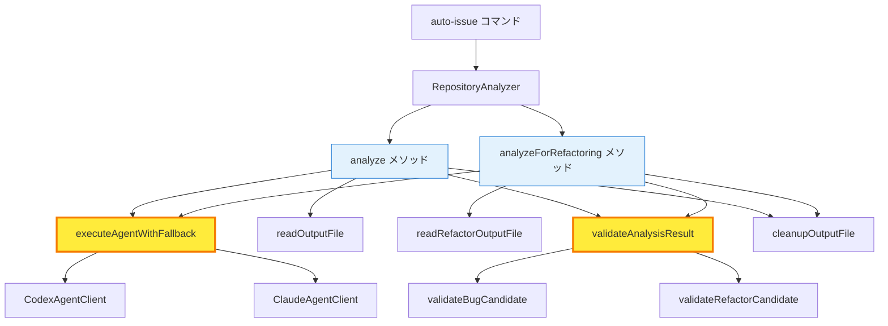
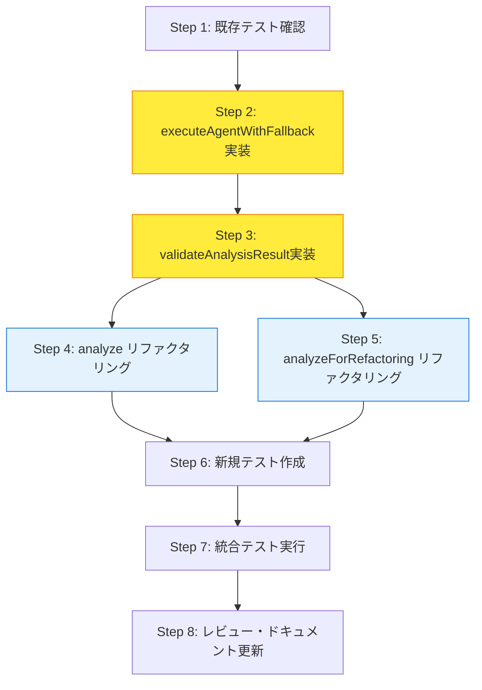

# 詳細設計書 - Issue #155

## プロジェクト情報

- **Issue番号**: #155
- **タイトル**: [Refactor] コード重複の削減: repository-analyzer.ts
- **カテゴリ**: リファクタリング
- **優先度**: High
- **作成日**: 2025-01-30

---

## 1. アーキテクチャ設計

### 1.1 システム全体図

```
┌────────────────────────────────────────────────────────────────┐
│                  RepositoryAnalyzer Class                      │
├────────────────────────────────────────────────────────────────┤
│                                                                │
│  Public API (インターフェース維持)                              │
│  ┌──────────────────────────────────────────────────────────┐ │
│  │ analyze(repoPath, agent): Promise<BugCandidate[]>        │ │
│  │ analyzeForRefactoring(repoPath, agent):                  │ │
│  │   Promise<RefactorCandidate[]>                           │ │
│  └──────────────────────────────────────────────────────────┘ │
│                         │         │                            │
│                         ▼         ▼                            │
│  ┌──────────────────────────────────────────────────────────┐ │
│  │      共通化された内部メソッド（新規作成）                 │ │
│  ├──────────────────────────────────────────────────────────┤ │
│  │ executeAgentWithFallback(                                │ │
│  │   promptPath: string,                                    │ │
│  │   outputFilePath: string,                                │ │
│  │   repoPath: string                                       │ │
│  │ ): Promise<void>                                         │ │
│  │                                                          │ │
│  │ ┌──────────────────────────────────────────┐            │ │
│  │ │ 1. プロンプトテンプレート読み込み        │            │ │
│  │ │ 2. 変数置換                              │            │ │
│  │ │ 3. エージェント選択・実行                │            │ │
│  │ │    - Codex → Claude フォールバック       │            │ │
│  │ │ 4. エラーハンドリング                    │            │ │
│  │ └──────────────────────────────────────────┘            │ │
│  │                                                          │ │
│  │ validateAnalysisResult<T>(                               │ │
│  │   candidates: T[],                                       │ │
│  │   candidateType: 'bug' | 'refactor'                      │ │
│  │ ): T[]                                                   │ │
│  │                                                          │ │
│  │ ┌──────────────────────────────────────────┐            │ │
│  │ │ 1. candidateType 別のバリデータ選択      │            │ │
│  │ │    - 'bug': validateBugCandidate()       │            │ │
│  │ │    - 'refactor': validateRefactorCandidate()│         │ │
│  │ │ 2. 有効な候補のみフィルタリング          │            │ │
│  │ └──────────────────────────────────────────┘            │ │
│  └──────────────────────────────────────────────────────────┘ │
│                                                                │
│  既存のヘルパーメソッド（変更なし）                            │
│  ┌──────────────────────────────────────────────────────────┐ │
│  │ readOutputFile(filePath): BugCandidate[]                 │ │
│  │ readRefactorOutputFile(filePath): RefactorCandidate[]    │ │
│  │ cleanupOutputFile(filePath): void                        │ │
│  │ validateBugCandidate(candidate): boolean                 │ │
│  │ validateRefactorCandidate(candidate): boolean            │ │
│  └──────────────────────────────────────────────────────────┘ │
└────────────────────────────────────────────────────────────────┘
```

### 1.2 コンポーネント間の関係



**凡例**:
- **黄色**: 新規作成される共通メソッド
- **青色**: リファクタリング対象のpublicメソッド
- **白色**: 既存のヘルパーメソッド（変更なし）

### 1.3 データフロー

#### Before（リファクタリング前）

```
analyze() メソッド:
  [1] プロンプト読込 → [2] ファイル生成 → [3] 変数置換 →
  [4] エージェント選択 → [5] エージェント実行 →
  [6] ファイル読取 → [7] バリデーション → [8] クリーンアップ

analyzeForRefactoring() メソッド:
  [1] プロンプト読込 → [2] ファイル生成 → [3] 変数置換 →
  [4] エージェント選択 → [5] エージェント実行 →
  [6] ファイル読取 → [7] バリデーション → [8] クリーンアップ

※ステップ[1]〜[5]が完全に重複（約100行）
```

#### After（リファクタリング後）

```
analyze() メソッド:
  [1] 出力ファイルパス生成
  [2] executeAgentWithFallback() 呼び出し
      ├─ プロンプト読込
      ├─ 変数置換
      ├─ エージェント選択
      └─ エージェント実行
  [3] readOutputFile()
  [4] validateAnalysisResult(candidates, 'bug')
  [5] cleanupOutputFile()

analyzeForRefactoring() メソッド:
  [1] 出力ファイルパス生成
  [2] executeAgentWithFallback() 呼び出し
      ├─ プロンプト読込
      ├─ 変数置換
      ├─ エージェント選択
      └─ エージェント実行
  [3] readRefactorOutputFile()
  [4] validateAnalysisResult(candidates, 'refactor')
  [5] cleanupOutputFile()

※重複が解消され、各メソッドは約10-15行に削減
```

---

## 2. 実装戦略判断

### 実装戦略: REFACTOR

**判断根拠**:

1. **既存コードの構造改善が主目的**
   - 既存の`analyze()`および`analyzeForRefactoring()`メソッドの機能は変更しない
   - 重複したロジックを共通メソッドに抽出する（Extract Method パターン）
   - 公開インターフェース（メソッドシグネチャ、戻り値、例外）は完全に維持

2. **新規機能の追加なし**
   - 新しいビジネスロジックの追加はない
   - エージェント実行フローの動作は完全に維持
   - 既存のバリデーションルールは変更しない

3. **DRY原則の徹底**
   - 約150行の重複コードを約50行に削減（削減率: 約67%）
   - Martin Fowlerの「Extract Method」リファクタリングパターンを適用
   - 保守性向上とバグ混入リスクの低減を目指す

4. **影響範囲の限定**
   - 単一ファイル（`src/core/repository-analyzer.ts`）のみが対象
   - 外部への影響なし（publicインターフェース不変）
   - 新規依存関係の追加なし

---

## 3. テスト戦略判断

### テスト戦略: UNIT_INTEGRATION

**判断根拠**:

1. **UNIT_ONLY ではない理由**
   - エージェント実行ロジック（Codex/Claude）との統合動作を確認する必要がある
   - ファイルI/O、テンプレート読込、出力ファイル生成を含むため、ユニットテストのみでは不十分
   - リファクタリング前後の動作一致を保証するために、実際のエージェント呼び出しを含む統合テストが必要

2. **INTEGRATION_ONLY ではない理由**
   - 新規抽出メソッド（`executeAgentWithFallback`、`validateAnalysisResult`）の単体ロジックを詳細にテストする必要がある
   - エッジケース（フォールバック失敗、バリデーション失敗等）の網羅的検証が必要
   - 共通メソッドの独立したテストにより、問題の早期発見とデバッグ効率化を実現

3. **UNIT_INTEGRATION を選択**
   - **ユニットテスト**: 新規メソッドの個別ロジック（バリデーション、エラーハンドリング、フォールバック動作）を検証
   - **インテグレーションテスト**: 既存の`analyze()`、`analyzeForRefactoring()`メソッドの統合動作を検証し、リグレッション防止

4. **テストカバレッジ目標**
   - ユニットテスト: 90%以上のカバレッジを目標
   - インテグレーションテスト: 既存テストケースの維持 + リファクタリング前後の出力比較

---

## 4. テストコード戦略判断

### テストコード戦略: EXTEND_TEST

**判断根拠**:

1. **既存テストファイルへの追加が適切**
   - 既存テストファイル（`tests/unit/core/repository-analyzer.test.ts`）が存在する
   - 新規機能ではなくリファクタリングであり、既存テストケースの拡張が適切
   - テストファイルの分散を避け、保守性を維持

2. **既存テストケースの維持**
   - 既存の`analyze()`、`analyzeForRefactoring()`テストは**維持**し、リグレッション検証に使用
   - 既存テストケースがリファクタリング後も100%パスすることを保証

3. **新規テストケースの追加**
   - 新規抽出メソッド（`executeAgentWithFallback`、`validateAnalysisResult`）のテストケースを追加
   - エッジケース（フォールバック失敗、バリデーション失敗等）のテストケースを追加

4. **CREATE_TEST ではない理由**
   - 新規テストファイルを作成する必要性がない
   - 既存テストファイル内で論理的にグルーピング可能
   - テストスイートの一貫性を保つため、既存ファイルに追加

---

## 5. 影響範囲分析

### 5.1 既存コードへの影響

#### 変更が必要なファイル

1. **`src/core/repository-analyzer.ts`**（主要な変更対象）
   - `analyze()`メソッド（234-305行）のリファクタリング
   - `analyzeForRefactoring()`メソッド（315-386行）のリファクタリング
   - 新規プライベートメソッド追加（`executeAgentWithFallback`、`validateAnalysisResult`）

#### 影響を受けるモジュール

- **呼び出し側**: 影響なし（publicインターフェース不変）
  - `src/commands/auto-issue.ts`（`analyze()`の呼び出し元）
  - その他、`analyzeForRefactoring()`を呼び出すモジュール

#### 変更不要なファイル

- `src/core/codex-agent-client.ts`（エージェントクライアント）
- `src/core/claude-agent-client.ts`（エージェントクライアント）
- `src/prompts/auto-issue/detect-bugs.txt`（プロンプトテンプレート）
- `src/prompts/auto-issue/detect-refactoring.txt`（プロンプトテンプレート）

### 5.2 依存関係の変更

#### 新規依存の追加

**なし**

#### 既存依存の変更

**なし**

#### 内部実装の変更のみ

- `CodexAgentClient`、`ClaudeAgentClient`の使用方法は変更なし
- ファイルI/O（`fs-extra`）の使用方法は変更なし
- ロギング（`logger`）の使用方法は変更なし

### 5.3 マイグレーション要否

**不要**

- データベーススキーマ変更なし
- 設定ファイル変更なし
- 環境変数の追加・変更なし
- 既存のメタデータ構造への影響なし

---

## 6. 変更・追加ファイルリスト

### 6.1 新規作成ファイル

**なし**

### 6.2 修正が必要な既存ファイル

1. **`src/core/repository-analyzer.ts`**（必須）
   - 新規プライベートメソッド追加
   - `analyze()`メソッドのリファクタリング
   - `analyzeForRefactoring()`メソッドのリファクタリング

2. **`tests/unit/core/repository-analyzer.test.ts`**（推奨）
   - 新規メソッドのテストケース追加
   - 既存テストケースの維持（リグレッション検証）

### 6.3 削除が必要なファイル

**なし**

---

## 7. 詳細設計

### 7.1 クラス設計

#### RepositoryAnalyzer クラス

**変更前の構造**:

```typescript
export class RepositoryAnalyzer {
  private readonly codexClient: CodexAgentClient | null;
  private readonly claudeClient: ClaudeAgentClient | null;

  constructor(
    codexClient: CodexAgentClient | null,
    claudeClient: ClaudeAgentClient | null,
  ) { }

  // Public API（約71行）
  public async analyze(
    repoPath: string,
    agent: 'auto' | 'codex' | 'claude',
  ): Promise<BugCandidate[]> { }

  // Public API（約71行）
  public async analyzeForRefactoring(
    repoPath: string,
    agent: 'auto' | 'codex' | 'claude',
  ): Promise<RefactorCandidate[]> { }

  // Private helpers（変更なし）
  private readOutputFile(filePath: string): BugCandidate[] { }
  private readRefactorOutputFile(filePath: string): RefactorCandidate[] { }
  private cleanupOutputFile(filePath: string): void { }
  private validateBugCandidate(candidate: BugCandidate): boolean { }
  private validateRefactorCandidate(candidate: RefactorCandidate): boolean { }
  // ...その他のヘルパーメソッド
}
```

**変更後の構造**:

```typescript
export class RepositoryAnalyzer {
  private readonly codexClient: CodexAgentClient | null;
  private readonly claudeClient: ClaudeAgentClient | null;

  constructor(
    codexClient: CodexAgentClient | null,
    claudeClient: ClaudeAgentClient | null,
  ) { }

  // Public API（約10-15行に削減）
  public async analyze(
    repoPath: string,
    agent: 'auto' | 'codex' | 'claude',
  ): Promise<BugCandidate[]> { }

  // Public API（約10-15行に削減）
  public async analyzeForRefactoring(
    repoPath: string,
    agent: 'auto' | 'codex' | 'claude',
  ): Promise<RefactorCandidate[]> { }

  // ★新規: 共通エージェント実行メソッド
  private async executeAgentWithFallback(
    promptPath: string,
    outputFilePath: string,
    repoPath: string,
    agent: 'auto' | 'codex' | 'claude',
  ): Promise<void> { }

  // ★新規: 共通バリデーションメソッド
  private validateAnalysisResult<T extends BugCandidate | RefactorCandidate>(
    candidates: T[],
    candidateType: 'bug' | 'refactor',
  ): T[] { }

  // Private helpers（変更なし）
  private readOutputFile(filePath: string): BugCandidate[] { }
  private readRefactorOutputFile(filePath: string): RefactorCandidate[] { }
  private cleanupOutputFile(filePath: string): void { }
  private validateBugCandidate(candidate: BugCandidate): boolean { }
  private validateRefactorCandidate(candidate: RefactorCandidate): boolean { }
  // ...その他のヘルパーメソッド
}
```

### 7.2 関数設計

#### 7.2.1 executeAgentWithFallback メソッド

**目的**: エージェント実行ロジックの共通化

**シグネチャ**:

```typescript
private async executeAgentWithFallback(
  promptPath: string,
  outputFilePath: string,
  repoPath: string,
  agent: 'auto' | 'codex' | 'claude',
): Promise<void>
```

**パラメータ**:

| パラメータ | 型 | 説明 |
|-----------|-----|------|
| `promptPath` | `string` | プロンプトテンプレートファイルのパス（絶対パス） |
| `outputFilePath` | `string` | エージェントが結果を書き込むファイルのパス |
| `repoPath` | `string` | 解析対象のリポジトリパス |
| `agent` | `'auto' \| 'codex' \| 'claude'` | 使用するエージェント（`auto`はフォールバック有効） |

**処理フロー**:

```typescript
private async executeAgentWithFallback(
  promptPath: string,
  outputFilePath: string,
  repoPath: string,
  agent: 'auto' | 'codex' | 'claude',
): Promise<void> {
  // 1. プロンプトテンプレート読み込み
  if (!fs.existsSync(promptPath)) {
    throw new Error(`Prompt template not found: ${promptPath}`);
  }
  const template = fs.readFileSync(promptPath, 'utf-8');

  // 2. 変数置換
  const prompt = template
    .replace('{repository_path}', repoPath)
    .replace(/{output_file_path}/g, outputFilePath);

  // 3. エージェント選択（auto の場合は Codex → Claude フォールバック）
  let selectedAgent = agent;

  if (agent === 'codex' || agent === 'auto') {
    if (!this.codexClient) {
      if (agent === 'codex') {
        throw new Error('Codex agent is not available.');
      }
      // auto モードで Codex が利用不可の場合、Claude にフォールバック
      logger.warn('Codex not available, falling back to Claude.');
      selectedAgent = 'claude';
    } else {
      try {
        logger.info('Using Codex agent for analysis.');
        await this.codexClient.executeTask({ prompt });
        return; // 成功したら終了
      } catch (error) {
        if (agent === 'codex') {
          throw error; // codex強制モードではエラーをスロー
        }
        // auto モードで Codex 失敗の場合、Claude にフォールバック
        logger.warn(`Codex failed (${getErrorMessage(error)}), falling back to Claude.`);
        selectedAgent = 'claude';
      }
    }
  }

  // 4. Claude エージェント実行
  if (selectedAgent === 'claude') {
    if (!this.claudeClient) {
      throw new Error('Claude agent is not available.');
    }
    logger.info('Using Claude agent for analysis.');
    await this.claudeClient.executeTask({ prompt });
  }
}
```

**例外**:

- `Error`: プロンプトテンプレートが存在しない場合
- `Error`: 指定されたエージェントが利用不可の場合
- `Error`: エージェント実行失敗時（`codex`強制モード時のみ）

**責務**:

- プロンプトテンプレートの読み込みと変数置換
- エージェントの選択とフォールバック制御
- エージェント実行の委譲

**責務外**:

- 出力ファイルの読み込み（呼び出し側で実施）
- バリデーション（呼び出し側で実施）
- クリーンアップ（呼び出し側で実施）

#### 7.2.2 validateAnalysisResult メソッド

**目的**: バリデーションロジックの共通化

**シグネチャ**:

```typescript
private validateAnalysisResult<T extends BugCandidate | RefactorCandidate>(
  candidates: T[],
  candidateType: 'bug' | 'refactor',
): T[]
```

**パラメータ**:

| パラメータ | 型 | 説明 |
|-----------|-----|------|
| `candidates` | `T[]` | バリデーション対象の候補リスト |
| `candidateType` | `'bug' \| 'refactor'` | 候補のタイプ（バグ or リファクタリング） |

**戻り値**:

有効な候補のみをフィルタリングした配列（`T[]`）

**処理フロー**:

```typescript
private validateAnalysisResult<T extends BugCandidate | RefactorCandidate>(
  candidates: T[],
  candidateType: 'bug' | 'refactor',
): T[] {
  // candidateType に基づいて適切なバリデータを選択
  const validCandidates = candidates.filter((c) => {
    if (candidateType === 'bug') {
      return this.validateBugCandidate(c as BugCandidate);
    } else {
      return this.validateRefactorCandidate(c as RefactorCandidate);
    }
  });

  logger.info(
    `Parsed ${candidates.length} ${candidateType} candidates, ${validCandidates.length} valid after validation.`,
  );

  return validCandidates;
}
```

**責務**:

- `candidateType`パラメータに基づいて適切なバリデーションメソッドを選択
- 有効な候補のみをフィルタリング
- バリデーション結果のログ出力

**責務外**:

- 個別の候補のバリデーションロジック（既存メソッドに委譲）

#### 7.2.3 analyze メソッド（リファクタリング後）

**目的**: バグ候補の検出（リファクタリング後の簡潔な実装）

**シグネチャ**:

```typescript
public async analyze(
  repoPath: string,
  agent: 'auto' | 'codex' | 'claude',
): Promise<BugCandidate[]>
```

**処理フロー（リファクタリング後）**:

```typescript
public async analyze(
  repoPath: string,
  agent: 'auto' | 'codex' | 'claude',
): Promise<BugCandidate[]> {
  logger.info(`Analyzing repository: ${repoPath}`);

  // 1. プロンプトパスと出力ファイルパスを準備
  const promptPath = path.resolve(__dirname, '../prompts/auto-issue/detect-bugs.txt');
  const outputFilePath = generateOutputFilePath('bugs');
  logger.debug(`Output file path: ${outputFilePath}`);

  try {
    // 2. 共通エージェント実行メソッド呼び出し
    await this.executeAgentWithFallback(promptPath, outputFilePath, repoPath, agent);

    // 3. 出力ファイルからJSONを読み込み
    const candidates = this.readOutputFile(outputFilePath);

    // 4. 共通バリデーションメソッド呼び出し
    const validCandidates = this.validateAnalysisResult(candidates, 'bug');

    return validCandidates;
  } finally {
    // 5. 一時ファイルをクリーンアップ（成功・失敗に関わらず）
    this.cleanupOutputFile(outputFilePath);
  }
}
```

**削減効果**:

- **Before**: 約71行
- **After**: 約20行
- **削減率**: 約72%

#### 7.2.4 analyzeForRefactoring メソッド（リファクタリング後）

**目的**: リファクタリング候補の検出（リファクタリング後の簡潔な実装）

**シグネチャ**:

```typescript
public async analyzeForRefactoring(
  repoPath: string,
  agent: 'auto' | 'codex' | 'claude',
): Promise<RefactorCandidate[]>
```

**処理フロー（リファクタリング後）**:

```typescript
public async analyzeForRefactoring(
  repoPath: string,
  agent: 'auto' | 'codex' | 'claude',
): Promise<RefactorCandidate[]> {
  logger.info(`Analyzing repository for refactoring: ${repoPath}`);

  // 1. プロンプトパスと出力ファイルパスを準備
  const promptPath = path.resolve(__dirname, '../prompts/auto-issue/detect-refactoring.txt');
  const outputFilePath = generateOutputFilePath('refactor');
  logger.debug(`Output file path: ${outputFilePath}`);

  try {
    // 2. 共通エージェント実行メソッド呼び出し
    await this.executeAgentWithFallback(promptPath, outputFilePath, repoPath, agent);

    // 3. 出力ファイルからJSONを読み込み
    const candidates = this.readRefactorOutputFile(outputFilePath);

    // 4. 共通バリデーションメソッド呼び出し
    const validCandidates = this.validateAnalysisResult(candidates, 'refactor');

    return validCandidates;
  } finally {
    // 5. 一時ファイルをクリーンアップ（成功・失敗に関わらず）
    this.cleanupOutputFile(outputFilePath);
  }
}
```

**削減効果**:

- **Before**: 約71行
- **After**: 約20行
- **削減率**: 約72%

### 7.3 データ構造設計

#### 変更なし

既存の型定義（`BugCandidate`、`RefactorCandidate`）は変更しません。

```typescript
// src/types/auto-issue.ts（変更なし）
export interface BugCandidate {
  title: string;
  file: string;
  line: number;
  severity: 'high' | 'medium' | 'low';
  description: string;
  suggestedFix: string;
  category: 'bug';
}

export interface RefactorCandidate {
  type: 'large-file' | 'large-function' | 'high-complexity' | 'duplication' | 'unused-code' | 'missing-docs';
  filePath: string;
  lineRange?: { start: number; end: number };
  description: string;
  suggestion: string;
  priority: 'low' | 'medium' | 'high';
}
```

### 7.4 インターフェース設計

#### Public API（変更なし）

```typescript
export class RepositoryAnalyzer {
  /**
   * コンストラクタ（変更なし）
   */
  constructor(
    codexClient: CodexAgentClient | null,
    claudeClient: ClaudeAgentClient | null,
  ) { }

  /**
   * バグ候補の検出（シグネチャ・振る舞い維持）
   */
  public async analyze(
    repoPath: string,
    agent: 'auto' | 'codex' | 'claude',
  ): Promise<BugCandidate[]> { }

  /**
   * リファクタリング候補の検出（シグネチャ・振る舞い維持）
   */
  public async analyzeForRefactoring(
    repoPath: string,
    agent: 'auto' | 'codex' | 'claude',
  ): Promise<RefactorCandidate[]> { }
}
```

**破壊的変更**: なし

---

## 8. セキュリティ考慮事項

### 8.1 認証・認可

**変更なし**

- エージェントクライアント（Codex/Claude）の認証情報管理は変更なし
- 環境変数（`CODEX_API_KEY`、`CLAUDE_CODE_CREDENTIALS_PATH`）の使用方法は変更なし

### 8.2 データ保護

**変更なし**

- 一時ファイル（`/tmp/auto-issue-*.json`）のクリーンアップは既存の`cleanupOutputFile()`を使用
- 機密情報のログ出力は既存の実装を維持

### 8.3 セキュリティリスクと対策

#### リスク1: パストラバーサル攻撃

**現状**:
- `isExcludedDirectory()`メソッドで既に対策済み（`../` を含むパスを拒否）

**リファクタリング後**:
- 変更なし（既存のセキュリティ対策を維持）

#### リスク2: ReDoS攻撃

**現状**:
- `matchesWildcard()`メソッドで`replaceAll()`を使用（Issue #140で対策済み）

**リファクタリング後**:
- 変更なし（既存のセキュリティ対策を維持）

#### リスク3: プロンプトインジェクション

**現状**:
- プロンプトテンプレートの変数置換は`replace()`を使用
- `repoPath`と`outputFilePath`のサニタイゼーションなし

**リファクタリング後**:
- 変更なし（既存の実装を維持）
- **推奨**: 将来的に`repoPath`と`outputFilePath`のバリデーションを追加（別Issue）

---

## 9. 非機能要件への対応

### 9.1 パフォーマンス

**目標**: リファクタリング前後でパフォーマンスが有意に劣化しないこと

**分析**:

1. **メソッド呼び出しオーバーヘッド**
   - 新規メソッド（`executeAgentWithFallback`、`validateAnalysisResult`）の追加により、関数呼び出しのオーバーヘッドが発生
   - ただし、Node.jsのV8エンジンは関数のインライン化を自動実行するため、実質的な影響は極めて低い

2. **エージェント実行時間**
   - エージェント実行（Codex/Claude API呼び出し）が全体の実行時間の大部分を占める
   - メソッド呼び出しオーバーヘッドは無視できるレベル（< 1ms）

3. **ファイルI/O**
   - プロンプトテンプレート読み込み、出力ファイル読み込み・書き込みの回数は変更なし
   - ファイルサイズも変更なし

**対策**:

- リファクタリング前後で実行時間の変動が±5%以内であることを確認（テストコードで測定）

### 9.2 スケーラビリティ

**変更なし**

- リポジトリサイズに応じたスケーラビリティは既存実装に依存
- 本リファクタリングではスケーラビリティへの影響なし

### 9.3 保守性

**大幅に向上**

1. **コード削減**
   - 約150行 → 約50行（削減率: 約67%）
   - 重複コードの完全な削除

2. **変更の局所化**
   - エージェント実行ロジックの変更が必要な場合、`executeAgentWithFallback()`メソッドのみを修正
   - バリデーションロジックの変更が必要な場合、`validateAnalysisResult()`メソッドのみを修正

3. **可読性の向上**
   - `analyze()`、`analyzeForRefactoring()`メソッドが約20行に削減され、処理フローが明確
   - メソッド名が責務を明確に表現（`executeAgentWithFallback`、`validateAnalysisResult`）

4. **テスタビリティの向上**
   - 共通メソッドに対するテストケースに集中できる
   - テストカバレッジの向上が期待できる

---

## 10. 実装の順序

### 10.1 推奨される実装順序

リファクタリングは以下の順序で実施することを推奨します：

#### Step 1: 既存テストの確認（1h）

1. `tests/unit/core/repository-analyzer.test.ts` の既存テストケースを確認
2. リファクタリング前のテストカバレッジを確認（`npm run test:coverage`）
3. 既存テストが100%パスすることを確認

**成功基準**:
- [ ] 既存テストが100%パスする
- [ ] テストカバレッジが80%以上である

#### Step 2: executeAgentWithFallback メソッドの実装（2h）

1. 新規プライベートメソッド`executeAgentWithFallback()`を実装
2. テンプレート読み込み、変数置換、エージェント選択・実行ロジックを移行
3. エラーハンドリングを実装

**成功基準**:
- [ ] メソッドシグネチャが設計書通りである
- [ ] プロンプトテンプレート読み込みが正常に動作する
- [ ] 変数置換が正常に動作する
- [ ] エージェント選択・フォールバックロジックが正常に動作する

#### Step 3: validateAnalysisResult メソッドの実装（1h）

1. 新規プライベートメソッド`validateAnalysisResult<T>()`を実装
2. `candidateType`パラメータに基づくバリデータ選択ロジックを実装
3. フィルタリングとログ出力を実装

**成功基準**:
- [ ] メソッドシグネチャが設計書通りである
- [ ] `candidateType='bug'`の場合、`validateBugCandidate()`が呼び出される
- [ ] `candidateType='refactor'`の場合、`validateRefactorCandidate()`が呼び出される
- [ ] 有効な候補のみがフィルタリングされる

#### Step 4: analyze メソッドのリファクタリング（1h）

1. `analyze()`メソッドを新しい共通メソッドを使用する形にリファクタリング
2. 重複コード（234-305行）を削除
3. `try-finally`ブロックでクリーンアップを保証

**成功基準**:
- [ ] メソッドが約20行に削減されている
- [ ] 既存テストがすべてパスする
- [ ] リファクタリング前後で出力が一致する

#### Step 5: analyzeForRefactoring メソッドのリファクタリング（1h）

1. `analyzeForRefactoring()`メソッドを新しい共通メソッドを使用する形にリファクタリング
2. 重複コード（315-386行）を削除
3. `try-finally`ブロックでクリーンアップを保証

**成功基準**:
- [ ] メソッドが約20行に削減されている
- [ ] 既存テストがすべてパスする
- [ ] リファクタリング前後で出力が一致する

#### Step 6: 新規テストケースの作成（2h）

1. `executeAgentWithFallback()`メソッドのテストケース実装
   - 正常系: Codex成功パターン
   - 正常系: Codex失敗 → Claude成功パターン
   - 異常系: 両エージェント失敗パターン
   - 異常系: テンプレートファイル不在
2. `validateAnalysisResult()`メソッドのテストケース実装
   - `candidateType='bug'`の正常系・異常系
   - `candidateType='refactor'`の正常系・異常系

**成功基準**:
- [ ] 新規メソッドのテストカバレッジが90%以上である
- [ ] すべてのテストケースがパスする

#### Step 7: 統合テストの実行（0.5h）

1. `npm run test:unit -- repository-analyzer.test.ts` の実行
2. `npm run test:coverage` の実行
3. カバレッジレポートの確認（目標: 90%以上）

**成功基準**:
- [ ] 全ユニットテストがパスする
- [ ] テストカバレッジが90%以上である
- [ ] リグレッションテストで、リファクタリング前後の出力が一致している

#### Step 8: コードレビュー・ドキュメント更新（0.5h）

1. JSDocコメントの追加（新規メソッド）
2. リファクタリング後のコードレビュー
3. ARCHITECTURE.md の更新（必要に応じて）

**成功基準**:
- [ ] JSDocコメントが追加されている
- [ ] コードレビューで問題が指摘されていない

### 10.2 依存関係の考慮



**重要な依存関係**:

- Step 2（`executeAgentWithFallback`実装）が完了するまで、Step 4/5（既存メソッドのリファクタリング）は開始不可
- Step 3（`validateAnalysisResult`実装）が完了するまで、Step 4/5（既存メソッドのリファクタリング）は開始不可
- Step 4/5（既存メソッドのリファクタリング）が完了するまで、Step 6（新規テスト作成）は開始不可

---

## 11. リスク管理

### リスク1: エッジケースの見逃し

**影響度**: 中
**確率**: 中

**詳細**:
- エージェントフォールバックロジックには複数の分岐（Codex成功/失敗、Claude成功/失敗）があり、エッジケースの見逃しによりバグが混入する可能性がある

**軽減策**:
- 網羅的なテストシナリオを作成（正常系、異常系、境界値）
- テストカバレッジ90%以上を目標にテスト実装
- リファクタリング前後の出力を比較するインテグレーションテストを必須化

### リスク2: リファクタリング後の性能劣化

**影響度**: 低
**確率**: 低

**詳細**:
- メソッド抽出により、関数呼び出しのオーバーヘッドが発生する可能性がある

**軽減策**:
- リファクタリング前後で実行時間を計測（テストログで確認）
- 有意な性能劣化が確認された場合、インライン化を検討
- ただし、Node.jsのV8エンジンは関数のインライン化を自動実行するため、実質的な影響は極めて低い

### リスク3: 既存テストの不足

**影響度**: 中
**確率**: 中

**詳細**:
- 既存のテストカバレッジが不足している場合、リファクタリングによるリグレッションを検出できない

**軽減策**:
- 既存テストカバレッジを確認（`npm run test:coverage`）
- カバレッジが80%未満の場合、追加テストを実装
- リグレッション検証用のインテグレーションテストを必須化

### リスク4: スコープクリープ

**影響度**: 低
**確率**: 低

**詳細**:
- リファクタリング中に関連する他の改善点を発見し、スコープが拡大する可能性がある

**軽減策**:
- Issue #155のスコープ（重複コード削減のみ）を厳守
- 発見した改善点は別Issueとして起票し、本Issueでは対応しない

### リスク5: テストモックの複雑化

**影響度**: 低~中
**確率**: 中

**詳細**:
- `executeAgentWithFallback`メソッドは複数の外部依存（CodexAgentClient、ClaudeAgentClient、fs-extra）を持つため、テストモックが複雑になる

**軽減策**:
- モック設定のヘルパー関数を作成（`setupMocks()`）
- `jest.spyOn()`を活用し、モック範囲を最小化
- Issue #115のベストプラクティス（型パラメータ明示、`afterEach()`でのモッククリーンアップ）を適用

---

## 12. 品質ゲート（Phase 2: Design）

設計書は以下の品質ゲートを満たしていることを確認しました：

- [x] **実装戦略の判断根拠が明記されている**: REFACTOR戦略を選択し、判断根拠を4点明記
- [x] **テスト戦略の判断根拠が明記されている**: UNIT_INTEGRATION戦略を選択し、判断根拠を4点明記
- [x] **テストコード戦略の判断根拠が明記されている**: EXTEND_TEST戦略を選択し、判断根拠を4点明記
- [x] **既存コードへの影響範囲が分析されている**: セクション5で詳細に分析済み
- [x] **変更が必要なファイルがリストアップされている**: セクション6で明記済み
- [x] **設計が実装可能である**: セクション7で実装可能な詳細設計を提示済み

---

## 13. まとめ

本設計書は、Issue #155（コード重複の削減: repository-analyzer.ts）のリファクタリングを実現するための詳細設計を提示しました。

### 主要なポイント

1. **実装戦略: REFACTOR**
   - 既存機能を変更せず、構造改善のみ実施
   - 約150行 → 約50行（削減率: 約67%）

2. **テスト戦略: UNIT_INTEGRATION**
   - 新規メソッドのユニットテスト + 既存メソッドのリグレッションテスト
   - テストカバレッジ90%以上を目標

3. **テストコード戦略: EXTEND_TEST**
   - 既存テストファイルに追加し、保守性を維持

4. **2つの新規プライベートメソッド**
   - `executeAgentWithFallback()`: エージェント実行ロジックの共通化
   - `validateAnalysisResult()`: バリデーションロジックの共通化

5. **破壊的変更なし**
   - 公開インターフェース（メソッドシグネチャ、戻り値、例外）は完全に維持
   - 外部への影響なし

### 次のフェーズ（Phase 3: Test Scenario）

次のフェーズでは、本設計書に基づいてテストシナリオを作成します。以下のテストケースを網羅的に定義します：

- `executeAgentWithFallback()`メソッドのテストケース（正常系、異常系、境界値）
- `validateAnalysisResult()`メソッドのテストケース（`bug`/`refactor`両方）
- `analyze()`、`analyzeForRefactoring()`メソッドのリグレッションテスト

---

**作成日**: 2025-01-30
**バージョン**: 1.0
**作成者**: AI Workflow Agent (Design Phase)
