# プロジェクト計画書 - Issue #16

## Issue分析

### 複雑度: 中程度

**判定根拠**:
- 複数ファイル（`src/main.ts`, `src/core/git-manager.ts`, `src/phases/report.ts`, `src/phases/evaluation.ts`）の修正が必要
- 既存機能の拡張（新しいコミットメッセージ生成メソッドの追加）が中心
- アーキテクチャ変更は不要、既存パターンの踏襲で対応可能
- テスト追加が必要（ユニットテスト + 統合テスト）

### 見積もり工数: 8~12時間

**工数内訳**:
- **Phase 1 (要件定義)**: 1~1.5時間
  - 現在のコミットメッセージフォーマット分析
  - 新しいコミットメッセージ仕様の詳細化
- **Phase 2 (設計)**: 1.5~2時間
  - メソッド設計（`commitWorkflowInit`, `commitCleanupLogs`）
  - インターフェース整合性確認
- **Phase 3 (テストシナリオ)**: 1~1.5時間
  - ユニットテストシナリオ策定
  - 統合テストシナリオ策定
- **Phase 4 (実装)**: 2.5~3.5時間
  - GitManagerへの新メソッド実装
  - main.ts, report.ts, evaluation.tsの修正
  - Planning Phaseログ削除対応
- **Phase 5 (テスト実装)**: 1~1.5時間
  - ユニットテスト実装
  - 統合テスト実装
- **Phase 6 (テスト実行)**: 0.5~1時間
  - テスト実行と修正
- **Phase 7 (ドキュメント)**: 0.5~1時間
  - CLAUDE.md, ARCHITECTURE.md更新
- **Phase 8 (レポート)**: 0.5~1時間
  - 実装サマリー作成

### リスク評価: 低

**理由**:
- 既存パターン（`commitStepOutput`, `commitPhaseOutput`）の踏襲で実装可能
- 影響範囲が明確（ワークフロー初期化とログクリーンアップ時のみ）
- 破壊的変更なし（既存機能は変更しない）
- ロールバック容易（コミットメッセージ生成ロジックのみの変更）

---

## 実装戦略判断

### 実装戦略: EXTEND

**判断根拠**:
- **既存クラスの拡張**: `GitManager`クラスに新しいメソッド（`commitWorkflowInit`, `commitCleanupLogs`）を追加
- **既存メソッドの修正**: `main.ts`, `report.ts`, `evaluation.ts`で既存のコミット呼び出しを新メソッドに置き換え
- **新規ファイル作成なし**: 全て既存ファイルへの機能追加
- **既存パターンの踏襲**: `commitStepOutput`と同じインターフェース（`CommitResult`を返す）を使用

### テスト戦略: UNIT_INTEGRATION

**判断根拠**:
- **UNIT_ONLY不可**: Gitコミット操作は外部システム（Git）との統合が必要
- **INTEGRATION_ONLYでも不十分**: コミットメッセージ生成ロジックはユニットテストで検証可能
- **BDD不要**: エンドユーザー向け機能ではなく、内部処理の改善
- **UNIT + INTEGRATIONが最適**:
  - ユニットテスト: コミットメッセージフォーマット検証（モック使用）
  - インテグレーションテスト: 実際のGitリポジトリでのコミット動作確認

### テストコード戦略: EXTEND_TEST

**判断根拠**:
- **既存テストファイル拡張**: `tests/unit/core/git-manager.test.ts`に新メソッドのテストを追加
- **新規テストファイル作成不要**: GitManagerの機能拡張であり、既存テストスイートに統合可能
- **既存パターン踏襲**: 既存の`commitStepOutput`テストと同じパターンでテスト実装

---

## 影響範囲分析

### 既存コードへの影響

**変更が必要なファイル** (4ファイル):

1. **`src/core/git-manager.ts`** (HIGH IMPACT)
   - 新規メソッド追加: `commitWorkflowInit()`, `commitCleanupLogs()`
   - 新規プライベートメソッド追加: `createInitCommitMessage()`, `createCleanupCommitMessage()`
   - 既存メソッドへの影響: なし（新規追加のみ）

2. **`src/main.ts`** (MEDIUM IMPACT)
   - 行390: `gitManager.commitPhaseOutput('planning', 'completed', 'N/A')` → `gitManager.commitWorkflowInit(issueNumber, branchName)` に置き換え
   - 既存ロジックへの影響: なし

3. **`src/phases/report.ts`** (MEDIUM IMPACT)
   - 行32-33: `autoCommitAndPush()` → `commitCleanupLogs()` + 手動プッシュに置き換え
   - 既存ロジックへの影響: なし（コミットメッセージのみ変更）

4. **`src/phases/evaluation.ts`** (MEDIUM IMPACT)
   - 新規: `cleanupWorkflowLogs()` メソッド実装（Report Phaseと同じパターン）
   - `run()` メソッド拡張: `--cleanup-on-complete`未指定時のログクリーンアップ処理追加
   - 行32-33: `autoCommitAndPush()` → `commitCleanupLogs()` + 手動プッシュに置き換え

**間接的影響を受けるファイル** (0ファイル):
- なし（コミットメッセージ形式変更は内部実装のみに影響）

### 依存関係の変更

**新規依存の追加**: なし
**既存依存の変更**: なし
**削除される依存**: なし

### マイグレーション要否

**データベーススキーマ変更**: なし
**設定ファイル変更**: なし
**環境変数の追加**: なし
**メタデータ形式の変更**: なし（コミットメッセージのみの変更）

---

## タスク分割

### Phase 1: 要件定義 (見積もり: 1~1.5h)

- [x] Task 1-1: 現在のコミットメッセージフォーマット分析 (0.5h)
  - `commitPhaseOutput`のコミットメッセージフォーマット確認
  - `commitStepOutput`のコミットメッセージフォーマット確認
  - Issue提案の3つのコミットメッセージ仕様を詳細化
- [x] Task 1-2: 新しいコミットメッセージ仕様の確定 (0.5~1h)
  - ワークフロー初期化時のコミットメッセージ形式
  - ログクリーンアップ時のコミットメッセージ形式（Report Phase、Evaluation Phase）
  - Planning Phase（Phase 0）ログ削除の仕様確認

### Phase 2: 設計 (見積もり: 1.5~2h)

- [x] Task 2-1: `GitManager`の新メソッド設計 (1~1.5h)
  - `commitWorkflowInit(issueNumber, branchName)` の詳細設計
  - `commitCleanupLogs(issueNumber, phase)` の詳細設計
  - `createInitCommitMessage()` のフォーマット設計
  - `createCleanupCommitMessage()` のフォーマット設計
  - 戻り値型（`CommitResult`）の整合性確認
- [x] Task 2-2: 呼び出し側の修正設計 (0.5h)
  - `src/main.ts:390` の修正方法
  - `src/phases/report.ts:32-33` の修正方法
  - `src/phases/evaluation.ts` の新規ログクリーンアップ処理設計

### Phase 3: テストシナリオ (見積もり: 1~1.5h)

- [ ] Task 3-1: ユニットテストシナリオ策定 (0.5~1h)
  - `commitWorkflowInit()` のテストケース設計
  - `commitCleanupLogs()` のテストケース設計
  - コミットメッセージフォーマット検証テスト
  - エラーハンドリングテスト（ファイルなし、Git操作失敗）
- [ ] Task 3-2: 統合テストシナリオ策定 (0.5h)
  - ワークフロー初期化 → コミットメッセージ確認
  - Report Phase完了 → クリーンアップコミットメッセージ確認
  - Evaluation Phase完了 → クリーンアップコミットメッセージ確認

### Phase 4: 実装 (見積もり: 2.5~3.5h)

- [x] Task 4-1: `GitManager`の新メソッド実装 (1.5~2h)
  - `commitWorkflowInit()` メソッド実装
  - `commitCleanupLogs()` メソッド実装
  - `createInitCommitMessage()` メソッド実装
  - `createCleanupCommitMessage()` メソッド実装
- [x] Task 4-2: `src/main.ts` の修正 (0.5h)
  - 行390のコミット呼び出しを`commitWorkflowInit()`に置き換え
  - コミット失敗時のエラーハンドリング確認
- [x] Task 4-3: `src/phases/report.ts` の修正 (0.5h)
  - 行32-33のコミット処理を`commitCleanupLogs()` + 手動プッシュに置き換え
  - Planning Phase（Phase 0）をクリーンアップ対象に追加（行324に`'00_planning'`追加）
- [x] Task 4-4: `src/phases/evaluation.ts` の修正 (0.5~1h)
  - `cleanupWorkflowLogs()` メソッド実装（Report Phaseと同じパターン）
  - `run()` メソッド拡張（`--cleanup-on-complete`未指定時のログクリーンアップ処理追加）
  - 行32-33のコミット処理を`commitCleanupLogs()` + 手動プッシュに置き換え

### Phase 5: テストコード実装 (見積もり: 1~1.5h)

- [ ] Task 5-1: ユニットテスト実装 (0.5~1h)
  - `tests/unit/core/git-manager.test.ts` に新メソッドのテスト追加
  - コミットメッセージフォーマット検証テスト
  - エラーケースのテスト
- [ ] Task 5-2: 統合テスト実装 (0.5h)
  - `tests/integration/` に実際のワークフロー実行テスト追加
  - コミットメッセージ確認テスト

### Phase 6: テスト実行 (見積もり: 0.5~1h)

- [ ] Task 6-1: ユニットテスト実行と修正 (0.25~0.5h)
  - `npm run test:unit` 実行
  - 失敗ケースの修正
- [ ] Task 6-2: 統合テスト実行と修正 (0.25~0.5h)
  - `npm run test:integration` 実行
  - 失敗ケースの修正

### Phase 7: ドキュメント (見積もり: 0.5~1h)

- [ ] Task 7-1: CLAUDE.md 更新 (0.25~0.5h)
  - GitManagerの新機能説明追加
  - コミットメッセージ形式の説明更新
- [ ] Task 7-2: ARCHITECTURE.md 更新 (0.25~0.5h)
  - Gitコミット処理フローの図更新
  - 新メソッドの説明追加

### Phase 8: レポート (見積もり: 0.5~1h)

- [ ] Task 8-1: 実装サマリー作成 (0.5~1h)
  - 変更ファイル一覧
  - コミットメッセージフォーマット変更のビフォーアフター
  - テスト結果サマリー
  - 今後の改善提案

---

## 依存関係

```mermaid
graph TD
    P0[Phase 0: Planning] --> P1[Phase 1: Requirements]
    P1 --> P2[Phase 2: Design]
    P2 --> P3[Phase 3: Test Scenario]
    P3 --> P4[Phase 4: Implementation]
    P4 --> P5[Phase 5: Test Implementation]
    P5 --> P6[Phase 6: Testing]
    P6 --> P7[Phase 7: Documentation]
    P7 --> P8[Phase 8: Report]

    P2 --> P4_SUB1[Task 4-1: GitManager実装]
    P2 --> P4_SUB2[Task 4-2: main.ts修正]
    P2 --> P4_SUB3[Task 4-3: report.ts修正]
    P2 --> P4_SUB4[Task 4-4: evaluation.ts修正]

    P4_SUB1 --> P4_SUB2
    P4_SUB1 --> P4_SUB3
    P4_SUB1 --> P4_SUB4

    P4_SUB2 --> P5
    P4_SUB3 --> P5
    P4_SUB4 --> P5
```



**クリティカルパス**:
- Phase 0 → Phase 1 → Phase 2 → Phase 4 (Task 4-1) → Phase 4 (Task 4-2/4-3/4-4) → Phase 5 → Phase 6

**並行実行可能なタスク**:
- Phase 4 (Task 4-2, 4-3, 4-4) は Task 4-1 完了後に並行実行可能
- Phase 5 (Task 5-1, 5-2) は並行実行可能

---

## リスクと軽減策

### リスク1: コミットメッセージフォーマットの後方互換性問題

- **影響度**: 低
- **確率**: 低
- **軽減策**:
  - 既存のコミットメッセージフォーマットは変更しない（新規メソッドのみ追加）
  - Phase番号の計算ロジックは既存の`createCommitMessage()`を参考にする
  - テストで既存機能に影響がないことを確認

### リスク2: Planning Phase（Phase 0）のログ削除による情報損失

- **影響度**: 中
- **確率**: 低
- **軽減策**:
  - `output/planning.md`は保持される（削除対象は`execute/`, `review/`, `revise/`のみ）
  - ドキュメントに「Issue参照ソースとして`planning.md`は保護される」旨を明記
  - テストで`output/planning.md`が残っていることを確認

### リスク3: Gitコミット失敗時のエラーハンドリング不足

- **影響度**: 中
- **確率**: 中
- **軽減策**:
  - 既存の`commitStepOutput()`と同じエラーハンドリングパターンを踏襲
  - `CommitResult`の`success`フラグで失敗を検知
  - テストで失敗ケース（ファイルなし、Git操作失敗）をカバー

### リスク4: CI環境でのテスト失敗

- **影響度**: 中
- **確率**: 低
- **軽減策**:
  - 統合テストは一時的なGitリポジトリを使用
  - Git設定（user.name, user.email）を明示的に設定
  - テスト後のクリーンアップを確実に実行

### リスク5: Evaluation Phaseのログクリーンアップタイミング問題

- **影響度**: 低
- **確率**: 低
- **軽減策**:
  - `--cleanup-on-complete`未指定時のみログクリーンアップを実行（デフォルト動作の変更なし）
  - 実行タイミングは`super.run()`成功後のみ（Report Phaseと同じパターン）
  - ドキュメントに動作を明記

---

## 品質ゲート

### Phase 1: 要件定義

- [ ] **3つのコミットメッセージ仕様が明確に定義されている**
- [ ] Planning Phase（Phase 0）ログ削除の仕様が確定している
- [ ] Evaluation Phaseのログクリーンアップ仕様が確定している
- [ ] 受け入れ基準が定義されている（コミットメッセージフォーマット検証方法）

### Phase 2: 設計

- [ ] **実装戦略の判断根拠が明記されている**（CREATE/EXTEND/REFACTOR → EXTEND）
- [ ] **テスト戦略の判断根拠が明記されている**（UNIT_ONLY/.../ALL → UNIT_INTEGRATION）
- [ ] **テストコード戦略の判断根拠が明記されている**（EXTEND_TEST/CREATE_TEST/BOTH_TEST → EXTEND_TEST）
- [ ] 新メソッドのインターフェースが既存パターンと整合している
- [ ] 戻り値型（`CommitResult`）が既存メソッドと統一されている
- [ ] エラーハンドリング設計が明確である

### Phase 3: テストシナリオ

- [ ] ユニットテストシナリオが網羅的である（正常系 + 異常系）
- [ ] 統合テストシナリオが実際のワークフロー実行を想定している
- [ ] エッジケース（ファイルなし、Git操作失敗）がカバーされている
- [ ] 既存機能への影響がテストで検証される

### Phase 4: 実装

- [ ] 新メソッドが既存パターンを踏襲している
- [ ] コミットメッセージフォーマットがIssue提案と一致している
- [ ] Planning Phase（Phase 0）がクリーンアップ対象に含まれている
- [ ] Evaluation Phaseのログクリーンアップが実装されている
- [ ] エラーハンドリングが適切に実装されている

### Phase 5: テストコード実装

- [ ] ユニットテストが全ての新メソッドをカバーしている
- [ ] 統合テストが実際のワークフロー実行をシミュレートしている
- [ ] コミットメッセージフォーマット検証テストが実装されている
- [ ] 既存テストが引き続き通ることを確認している

### Phase 6: テスト実行

- [ ] 全てのユニットテストが通る
- [ ] 全ての統合テストが通る
- [ ] カバレッジが既存水準を維持または向上している
- [ ] CI環境でのテストが成功する

### Phase 7: ドキュメント

- [ ] CLAUDE.mdが更新されている（新機能説明追加）
- [ ] ARCHITECTURE.mdが更新されている（処理フロー図更新）
- [ ] コミットメッセージ形式の変更が明記されている
- [ ] 後方互換性の説明が追加されている

### Phase 8: レポート

- [ ] 変更ファイル一覧が正確である
- [ ] コミットメッセージのビフォーアフターが明確である
- [ ] テスト結果が記録されている
- [ ] 今後の改善提案が含まれている

---

## 受け入れ基準（Acceptance Criteria）

### 機能要件

1. **ワークフロー初期化時のコミットメッセージ**:
   - ✅ `[ai-workflow] Initialize workflow for issue #<NUM>` 形式
   - ✅ Issue番号、ブランチ名、アクションが含まれる
   - ✅ Phase番号が含まれない

2. **ログクリーンアップ時のコミットメッセージ**:
   - ✅ `[ai-workflow] Clean up workflow execution logs` 形式
   - ✅ Issue番号、Phase番号（正しい値）、削除対象が含まれる
   - ✅ 保護対象（metadata.json、output/*.md）が明記される

3. **Planning Phase（Phase 0）のログ削除**:
   - ✅ Report Phase完了時に`00_planning/execute`, `00_planning/review`, `00_planning/revise`が削除される
   - ✅ `00_planning/output/planning.md`は保持される

4. **Evaluation Phaseのログクリーンアップ**:
   - ✅ `--cleanup-on-complete`未指定時にログクリーンアップが実行される
   - ✅ `--cleanup-on-complete`指定時はワークフロー全体削除が優先される
   - ✅ Report Phaseと同じクリーンアップパターンが適用される

### 非機能要件

1. **後方互換性**:
   - ✅ 既存のコミット処理（`commitPhaseOutput`, `commitStepOutput`）は影響を受けない
   - ✅ 既存のワークフローは正常に動作する

2. **テストカバレッジ**:
   - ✅ ユニットテストで新メソッドが100%カバーされる
   - ✅ 統合テストで実際のワークフロー実行が検証される

3. **ドキュメント**:
   - ✅ CLAUDE.md、ARCHITECTURE.mdが更新されている
   - ✅ コミットメッセージ形式の変更が明記されている

4. **エラーハンドリング**:
   - ✅ Gitコミット失敗時に適切なエラーメッセージが返される
   - ✅ ファイルなし時に警告ログが出力される

---

## 期待される効果

### 1. 明確なコミット履歴

**現在の問題**:
```
[ai-workflow] Phase 1 (planning) - completed  ← 実際はメタデータ初期化
[ai-workflow] Phase 9 (report) - completed   ← 実際はPhase 8のログクリーンアップ
```

**改善後**:
```
[ai-workflow] Initialize workflow for issue #16
[ai-workflow] Clean up workflow execution logs (Phase 8: report)
```

### 2. リポジトリサイズの追加削減

**現在のクリーンアップ**:
- Report Phase完了時: 01_requirements ~ 08_reportのログ削除（約70%削減）

**改善後**:
- Report Phase完了時: 00_planning ~ 08_reportのログ削除（約75%削減、**+5%改善**）
- Evaluation Phase完了時: 00_planning ~ 09_evaluationのログ削除（オプション）

### 3. 柔軟なクリーンアップオプション

**Evaluation Phase完了後の選択肢**:
1. **デフォルト（`--cleanup-on-complete`未指定）**: ログのみ削除、成果物（output/*.md）は保持
2. **`--cleanup-on-complete`指定**: ワークフロー全体削除（既存動作）

**メリット**:
- ユーザーの用途に応じた柔軟な選択が可能
- PRレビュー後にログだけ削除したい場合に対応

### 4. コードの一貫性向上

**既存パターンの踏襲**:
- `commitStepOutput()` と同じインターフェース（`CommitResult`）
- 既存のエラーハンドリングパターンを継承
- コミットメッセージ生成ロジックの一貫性

---

## 実装の優先順位

### 最優先（Phase 4 で最初に実装）

1. **メタデータ初期化時のコミットメッセージ修正**
   - 影響度: HIGH（全てのワークフロー初期化で使用される）
   - ユーザー可視性: HIGH（`git log`で最初に表示される）
   - 実装難易度: LOW（新メソッド追加のみ）

### 高優先

2. **ログクリーンアップ時のコミットメッセージ修正**
   - 影響度: MEDIUM（Report Phase完了時のみ）
   - ユーザー可視性: HIGH（コミット履歴が改善される）
   - 実装難易度: LOW（新メソッド追加のみ）

3. **Planning（Phase 0）のログ削除**
   - 影響度: MEDIUM（リポジトリサイズ削減）
   - ユーザー可視性: MEDIUM（PRサイズが小さくなる）
   - 実装難易度: VERY LOW（配列に1行追加のみ）

### 中優先

4. **Evaluation Phaseでのログクリーンアップ**
   - 影響度: LOW（オプション機能の拡張）
   - ユーザー可視性: MEDIUM（柔軟性が向上）
   - 実装難易度: MEDIUM（新メソッド実装 + run()拡張）

---

## まとめ

本Issueは、Gitコミットメッセージの改善を通じて、ワークフローの可視性と一貫性を向上させる中程度の複雑度のタスクです。

**主要な改善点**:
1. メタデータ初期化時のコミットメッセージを明確化
2. ログクリーンアップ時のコミットメッセージを正確化
3. Planning Phaseのログも削除対象に含める（リポジトリサイズ削減）
4. Evaluation Phaseにログクリーンアップオプションを追加

**実装戦略**: EXTEND（既存クラスの機能拡張）
**テスト戦略**: UNIT_INTEGRATION（ユニット + 統合テスト）
**テストコード戦略**: EXTEND_TEST（既存テストスイート拡張）

**見積もり工数**: 8~12時間
**リスク評価**: 低（既存パターンの踏襲、影響範囲明確）

次のPhase（要件定義）では、3つのコミットメッセージ仕様を詳細化し、受け入れ基準を確定します。
