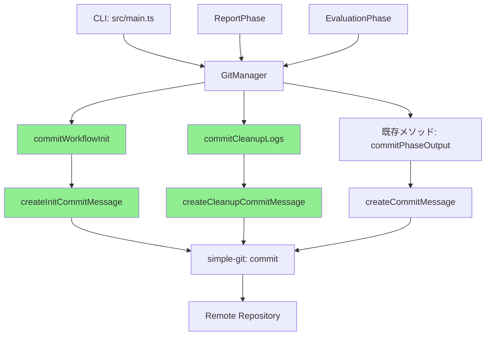

# 詳細設計書 - Issue #16

## 0. Planning Documentの確認

Planning Phase（Phase 0）で策定された開発計画を確認しました：

### 実装戦略
- **判断**: EXTEND（既存クラスの機能拡張）
- **理由**: GitManagerクラスに新しいメソッドを追加し、既存の呼び出し側を修正する方針
- **影響範囲**: 4ファイル（git-manager.ts, main.ts, report.ts, evaluation.ts）

### テスト戦略
- **判断**: UNIT_INTEGRATION（ユニットテスト + 統合テスト）
- **理由**: コミットメッセージ生成ロジックはユニットテストで検証し、実際のGitコミット動作は統合テストで検証

### テストコード戦略
- **判断**: EXTEND_TEST（既存テストファイル拡張）
- **理由**: `tests/unit/core/git-manager.test.ts`に新メソッドのテストを追加

### リスク評価
- **評価**: 低
- **理由**: 既存パターンの踏襲、影響範囲が明確、破壊的変更なし

---

## 1. アーキテクチャ設計

### 1.1 システム全体図



**凡例**:
- 緑色: 新規追加メソッド

### 1.2 コンポーネント間の関係

#### 既存コンポーネント
- **GitManager** (`src/core/git-manager.ts`): Git操作の抽象化レイヤー
- **CLI** (`src/main.ts`): コマンドラインインターフェース
- **ReportPhase** (`src/phases/report.ts`): Phase 8の実装
- **EvaluationPhase** (`src/phases/evaluation.ts`): Phase 9の実装

#### 新規コンポーネント
なし（既存クラスの拡張のみ）

### 1.3 データフロー

#### ワークフロー初期化時のコミットフロー

```
[CLI init command]
    ↓
[MetadataManager.initializeWorkflow()]
    ↓
[GitManager.commitWorkflowInit(issueNumber, branchName)]
    ↓
[createInitCommitMessage()] → コミットメッセージ生成
    ↓
[simple-git.commit()] → Gitコミット実行
    ↓
[GitManager.pushToRemote()] → リモートプッシュ
```

#### ログクリーンアップ時のコミットフロー

```
[ReportPhase.run() or EvaluationPhase.run()]
    ↓
[cleanupWorkflowLogs()] → ログディレクトリ削除
    ↓
[GitManager.commitCleanupLogs(issueNumber, phase)]
    ↓
[createCleanupCommitMessage()] → コミットメッセージ生成
    ↓
[simple-git.commit()] → Gitコミット実行
    ↓
[GitManager.pushToRemote()] → リモートプッシュ
```

---

## 2. 実装戦略判断

### 実装戦略: EXTEND（拡張）

**判断根拠**:
1. **既存クラスの拡張**: GitManagerクラスに新しいメソッド（`commitWorkflowInit`、`commitCleanupLogs`）を追加
2. **既存メソッドの活用**: `getChangedFiles()`, `filterPhaseFiles()`, `ensureGitConfig()`, `pushToRemote()` などの既存メソッドを再利用
3. **既存パターンの踏襲**: `commitStepOutput()` と同じインターフェース（`CommitResult`を返す）、同じエラーハンドリングパターン
4. **既存ファイルの修正**: `main.ts`, `report.ts`, `evaluation.ts` の既存コード修正のみ、新規ファイル作成なし
5. **後方互換性の維持**: 既存のコミット処理（`commitPhaseOutput`, `commitStepOutput`）に影響を与えない

**既存パターンとの整合性**:
```typescript
// 既存メソッドのシグネチャ（参考）
public async commitStepOutput(
  phaseName: string,
  step: 'execute' | 'review' | 'revise'
): Promise<CommitResult>

// 新規メソッドのシグネチャ（同じ戻り値型を使用）
public async commitWorkflowInit(
  issueNumber: number,
  branchName: string
): Promise<CommitResult>

public async commitCleanupLogs(
  issueNumber: number,
  phase: 'report' | 'evaluation'
): Promise<CommitResult>
```

---

## 3. テスト戦略判断

### テスト戦略: UNIT_INTEGRATION（ユニット + 統合テスト）

**判断根拠**:
1. **ユニットテストが必要な理由**:
   - コミットメッセージ生成ロジック（`createInitCommitMessage`, `createCleanupCommitMessage`）の検証
   - エラーハンドリング（ファイルなし、Git操作失敗）のテスト
   - モックを使用した分離テストが可能

2. **統合テストが必要な理由**:
   - 実際のGitリポジトリでのコミット動作確認
   - `simple-git`ライブラリとの統合検証
   - コミットメッセージがGitログに正しく記録されることの確認

3. **BDD不要の理由**:
   - エンドユーザー向け機能ではなく、内部処理の改善
   - ユーザーストーリーが単純（コミットメッセージの改善）
   - 既存のUnit + Integrationテストで十分カバー可能

**テストカバレッジ目標**:
- ユニットテスト: 新メソッド100%カバレッジ
- 統合テスト: ワークフロー初期化 → コミットメッセージ確認、クリーンアップ → コミットメッセージ確認

---

## 4. テストコード戦略判断

### テストコード戦略: EXTEND_TEST（既存テスト拡張）

**判断根拠**:
1. **既存テストファイルの活用**: `tests/unit/core/git-manager.test.ts` が既に存在
2. **既存テストパターンの踏襲**: `commitStepOutput` のテストと同じパターンで実装可能
3. **テストスイートの統一性**: GitManagerのすべてのコミットメソッドを1つのテストファイルで管理
4. **新規テストファイル不要**: 新しいクラスや複雑な機能追加ではないため、既存テストスイートに統合

**テスト追加場所**:
- ユニットテスト: `tests/unit/core/git-manager.test.ts`
  - `describe('commitWorkflowInit', ...)`
  - `describe('commitCleanupLogs', ...)`
- 統合テスト: `tests/integration/` 配下（新規または既存ファイルに追加）

---

## 5. 影響範囲分析

### 5.1 既存コードへの影響

#### 変更が必要なファイル（4ファイル）

##### 1. `src/core/git-manager.ts` (HIGH IMPACT)
- **変更内容**: 新規メソッド追加（2つ）、新規プライベートメソッド追加（2つ）
- **既存メソッドへの影響**: なし（新規追加のみ）
- **追加メソッド**:
  - `public async commitWorkflowInit(issueNumber, branchName): Promise<CommitResult>`
  - `public async commitCleanupLogs(issueNumber, phase): Promise<CommitResult>`
  - `private createInitCommitMessage(issueNumber, branchName): string`
  - `private createCleanupCommitMessage(issueNumber, phase): string`

##### 2. `src/main.ts` (MEDIUM IMPACT)
- **変更箇所**: 行390（メタデータ初期化後のコミット呼び出し）
- **変更内容**:
  ```typescript
  // 変更前:
  const commitResult = await gitManager.commitPhaseOutput('planning', 'completed', 'N/A');

  // 変更後:
  const commitResult = await gitManager.commitWorkflowInit(issueNumber, branchName);
  ```
- **既存ロジックへの影響**: なし

##### 3. `src/phases/report.ts` (MEDIUM IMPACT)
- **変更箇所1**: 行324（phaseDirectories配列に'00_planning'追加）
- **変更箇所2**: 行32-33（autoCommitAndPush → commitCleanupLogs + 手動プッシュ）
- **変更内容**:
  ```typescript
  // 変更箇所1: Planning Phaseをクリーンアップ対象に追加
  const phaseDirectories = [
    '00_planning',  // ← 追加
    '01_requirements',
    // ...
  ];

  // 変更箇所2: コミット処理を新メソッドに置き換え
  // 変更前:
  await this.autoCommitAndPush(gitManager, null);

  // 変更後:
  const commitResult = await gitManager.commitCleanupLogs(issueNumber, 'report');
  // エラーハンドリング + 手動プッシュ
  ```
- **既存ロジックへの影響**: なし（コミットメッセージのみ変更）

##### 4. `src/phases/evaluation.ts` (MEDIUM IMPACT)
- **変更内容**: 新規メソッド実装 + run()メソッド拡張
- **追加メソッド**: `private async cleanupWorkflowLogs(issueNumber): Promise<void>`
- **run()メソッドの変更**:
  ```typescript
  public async run(options: PhaseRunOptions = {}): Promise<boolean> {
    const success = await super.run(options);

    // ログのみクリーンアップ（--cleanup-on-complete未指定時）
    if (success && !options.cleanupOnComplete) {
      await this.cleanupWorkflowLogs(issueNumber);
      // Git commit + push
    }

    // ワークフロー全体削除（--cleanup-on-complete指定時）
    if (success && options.cleanupOnComplete) {
      await this.cleanupWorkflowArtifacts(force);
    }

    return success;
  }
  ```

#### 間接的影響を受けるファイル（0ファイル）
- なし（コミットメッセージ形式変更は内部実装のみに影響）

### 5.2 依存関係の変更

**新規依存の追加**: なし
**既存依存の変更**: なし
**削除される依存**: なし

### 5.3 マイグレーション要否

**データベーススキーマ変更**: なし
**設定ファイル変更**: なし
**環境変数の追加**: なし
**メタデータ形式の変更**: なし（コミットメッセージのみの変更）

---

## 6. 変更・追加ファイルリスト

### 6.1 新規作成ファイル
なし

### 6.2 修正が必要な既存ファイル

#### 実装ファイル（4ファイル）
1. `src/core/git-manager.ts` - 新メソッド追加
2. `src/main.ts` - 初期化コミット呼び出し修正
3. `src/phases/report.ts` - クリーンアップ対象追加、コミット処理修正
4. `src/phases/evaluation.ts` - ログクリーンアップ機能追加

#### テストファイル（1ファイル + α）
1. `tests/unit/core/git-manager.test.ts` - ユニットテスト追加
2. `tests/integration/` - 統合テスト追加（既存または新規ファイル）

#### ドキュメントファイル（2ファイル）
1. `CLAUDE.md` - 新機能説明追加
2. `ARCHITECTURE.md` - Gitコミット処理フロー更新

### 6.3 削除が必要なファイル
なし

---

## 7. 詳細設計

### 7.1 GitManagerクラスの拡張

#### 7.1.1 commitWorkflowInit メソッド

**目的**: ワークフロー初期化用のコミットを作成

**シグネチャ**:
```typescript
public async commitWorkflowInit(
  issueNumber: number,
  branchName: string
): Promise<CommitResult>
```

**引数**:
- `issueNumber` (number): Issue番号
- `branchName` (string): ブランチ名（例: "ai-workflow/issue-16"）

**戻り値**:
```typescript
interface CommitResult {
  success: boolean;
  commit_hash: string | null;
  files_committed: string[];
  error?: string;
}
```

**処理フロー**:
```typescript
public async commitWorkflowInit(
  issueNumber: number,
  branchName: string
): Promise<CommitResult> {
  // 1. 変更ファイルを取得
  const changedFiles = await this.getChangedFiles();
  const targetFiles = this.filterPhaseFiles(changedFiles, issueNumber.toString());

  // 2. ファイルがない場合は警告ログを出力して終了
  if (targetFiles.length === 0) {
    console.warn('[WARNING] No files to commit for initialization');
    return {
      success: true,
      commit_hash: null,
      files_committed: [],
    };
  }

  // 3. ファイルをステージング
  await this.git.add(targetFiles);

  // 4. Git設定を確保
  await this.ensureGitConfig();

  // 5. コミットメッセージを生成
  const message = this.createInitCommitMessage(issueNumber, branchName);

  // 6. コミット実行
  try {
    const commitResponse = await this.git.commit(message, targetFiles, {
      '--no-verify': null,
    });

    console.info(`[INFO] Initialization commit created: ${commitResponse.commit ?? 'unknown'}`);

    return {
      success: true,
      commit_hash: commitResponse.commit ?? null,
      files_committed: targetFiles,
    };
  } catch (error) {
    console.error(`[ERROR] Initialization commit failed: ${(error as Error).message}`);
    return {
      success: false,
      commit_hash: null,
      files_committed: targetFiles,
      error: `Initialization commit failed: ${(error as Error).message}`,
    };
  }
}
```

**エラーハンドリング**:
- ファイルなし: 警告ログ出力、`success: true`（エラーとして扱わない）
- Git操作失敗: エラーログ出力、`success: false`、`error`フィールドにメッセージ

#### 7.1.2 createInitCommitMessage メソッド

**目的**: ワークフロー初期化用のコミットメッセージを生成

**シグネチャ**:
```typescript
private createInitCommitMessage(
  issueNumber: number,
  branchName: string
): string
```

**引数**:
- `issueNumber` (number): Issue番号
- `branchName` (string): ブランチ名

**戻り値**: コミットメッセージ文字列

**実装**:
```typescript
private createInitCommitMessage(
  issueNumber: number,
  branchName: string
): string {
  return [
    `[ai-workflow] Initialize workflow for issue #${issueNumber}`,
    '',
    `Issue: #${issueNumber}`,
    `Action: Create workflow metadata and directory structure`,
    `Branch: ${branchName}`,
    '',
    'Auto-generated by AI Workflow',
  ].join('\n');
}
```

**出力例**:
```
[ai-workflow] Initialize workflow for issue #16

Issue: #16
Action: Create workflow metadata and directory structure
Branch: ai-workflow/issue-16

Auto-generated by AI Workflow
```

#### 7.1.3 commitCleanupLogs メソッド

**目的**: ログクリーンアップ用のコミットを作成

**シグネチャ**:
```typescript
public async commitCleanupLogs(
  issueNumber: number,
  phase: 'report' | 'evaluation'
): Promise<CommitResult>
```

**引数**:
- `issueNumber` (number): Issue番号
- `phase` ('report' | 'evaluation'): クリーンアップを実行したフェーズ

**戻り値**: `CommitResult`（`commitWorkflowInit`と同じ）

**処理フロー**:
```typescript
public async commitCleanupLogs(
  issueNumber: number,
  phase: 'report' | 'evaluation'
): Promise<CommitResult> {
  // 1. 変更ファイルを取得
  const changedFiles = await this.getChangedFiles();
  const targetFiles = this.filterPhaseFiles(changedFiles, issueNumber.toString());

  // 2. ファイルがない場合は警告ログを出力して終了
  if (targetFiles.length === 0) {
    console.warn('[WARNING] No files to commit for cleanup');
    return {
      success: true,
      commit_hash: null,
      files_committed: [],
    };
  }

  // 3. ファイルをステージング
  await this.git.add(targetFiles);

  // 4. Git設定を確保
  await this.ensureGitConfig();

  // 5. コミットメッセージを生成
  const message = this.createCleanupCommitMessage(issueNumber, phase);

  // 6. コミット実行
  try {
    const commitResponse = await this.git.commit(message, targetFiles, {
      '--no-verify': null,
    });

    console.info(`[INFO] Cleanup commit created: ${commitResponse.commit ?? 'unknown'}`);

    return {
      success: true,
      commit_hash: commitResponse.commit ?? null,
      files_committed: targetFiles,
    };
  } catch (error) {
    console.error(`[ERROR] Cleanup commit failed: ${(error as Error).message}`);
    return {
      success: false,
      commit_hash: null,
      files_committed: targetFiles,
      error: `Cleanup commit failed: ${(error as Error).message}`,
    };
  }
}
```

#### 7.1.4 createCleanupCommitMessage メソッド

**目的**: ログクリーンアップ用のコミットメッセージを生成

**シグネチャ**:
```typescript
private createCleanupCommitMessage(
  issueNumber: number,
  phase: 'report' | 'evaluation'
): string
```

**引数**:
- `issueNumber` (number): Issue番号
- `phase` ('report' | 'evaluation'): クリーンアップを実行したフェーズ

**戻り値**: コミットメッセージ文字列

**実装**:
```typescript
private createCleanupCommitMessage(
  issueNumber: number,
  phase: 'report' | 'evaluation'
): string {
  // Phase番号を正しく計算
  const phaseNumber = phase === 'report' ? 8 : 9;

  return [
    `[ai-workflow] Clean up workflow execution logs`,
    '',
    `Issue: #${issueNumber}`,
    `Phase: ${phaseNumber} (${phase})`,
    `Action: Remove agent execution logs (execute/review/revise directories)`,
    `Preserved: metadata.json, output/*.md`,
    '',
    'Auto-generated by AI Workflow',
  ].join('\n');
}
```

**出力例（Report Phase）**:
```
[ai-workflow] Clean up workflow execution logs

Issue: #16
Phase: 8 (report)
Action: Remove agent execution logs (execute/review/revise directories)
Preserved: metadata.json, output/*.md

Auto-generated by AI Workflow
```

**出力例（Evaluation Phase）**:
```
[ai-workflow] Clean up workflow execution logs

Issue: #16
Phase: 9 (evaluation)
Action: Remove agent execution logs (execute/review/revise directories)
Preserved: metadata.json, output/*.md

Auto-generated by AI Workflow
```

### 7.2 main.tsの修正

**修正箇所**: 行390（メタデータ初期化後のコミット）

**変更前**:
```typescript
// 行389-393（概算）
console.info('[INFO] Initializing workflow with metadata...');
const commitResult = await gitManager.commitPhaseOutput('planning', 'completed', 'N/A');
if (commitResult.success && commitResult.commit_hash) {
  console.info(`[INFO] Committed: ${commitResult.commit_hash}`);
}
```

**変更後**:
```typescript
// 行389-393（概算）
console.info('[INFO] Initializing workflow with metadata...');
const commitResult = await gitManager.commitWorkflowInit(issueNumber, branchName);
if (commitResult.success && commitResult.commit_hash) {
  console.info(`[INFO] Committed: ${commitResult.commit_hash}`);
}
```

**エラーハンドリング**:
- 既存のエラーハンドリングを維持（`commitResult.success`でチェック）
- コミット失敗時もワークフロー初期化は成功として扱う（既存動作を維持）

### 7.3 report.tsの修正

#### 7.3.1 修正箇所1: Planning Phaseをクリーンアップ対象に追加

**修正箇所**: 行324（phaseDirectories配列）

**変更前**:
```typescript
// Planning フェーズ（00_planning）は削除対象外（Issue参照ソースとして保持）
const phaseDirectories = [
  '01_requirements',
  '02_design',
  '03_test_scenario',
  '04_implementation',
  '05_test_implementation',
  '06_testing',
  '07_documentation',
  '08_report',
];
```

**変更後**:
```typescript
// すべてのフェーズ（00-08）の実行ログを削除
// ※ output/planning.md は保持される（targetSubdirsに'output'が含まれないため）
const phaseDirectories = [
  '00_planning',  // ← 追加
  '01_requirements',
  '02_design',
  '03_test_scenario',
  '04_implementation',
  '05_test_implementation',
  '06_testing',
  '07_documentation',
  '08_report',
];
```

**影響**:
- `00_planning/execute/`, `00_planning/review/`, `00_planning/revise/` ディレクトリが削除対象に
- `00_planning/output/planning.md` は保持される（`targetSubdirs`に'output'が含まれないため）

#### 7.3.2 修正箇所2: コミット処理を新メソッドに置き換え

**修正箇所**: 行32-33（ログクリーンアップ後のコミット）

**変更前**:
```typescript
// ログクリーンアップによる削除をコミット・プッシュ
if (gitManager) {
  await this.autoCommitAndPush(gitManager, null);
  console.info('[INFO] Cleanup changes committed and pushed.');
}
```

**変更後**:
```typescript
// ログクリーンアップによる削除をコミット・プッシュ
if (gitManager) {
  const issueNumber = parseInt(this.metadata.data.issue_number, 10);
  const commitResult = await gitManager.commitCleanupLogs(issueNumber, 'report');

  if (!commitResult.success) {
    throw new Error(`Git commit failed: ${commitResult.error ?? 'unknown error'}`);
  }

  const pushResult = await gitManager.pushToRemote();
  if (!pushResult.success) {
    throw new Error(`Git push failed: ${pushResult.error ?? 'unknown error'}`);
  }

  console.info('[INFO] Cleanup changes committed and pushed.');
}
```

**エラーハンドリング**:
- コミット失敗時: `Error`をスローし、呼び出し側でキャッチ（既存の`try-catch`ブロックで処理）
- プッシュ失敗時: 同様に`Error`をスロー

### 7.4 evaluation.tsの修正

#### 7.4.1 run()メソッドの拡張

**変更箇所**: `run()`メソッド全体

**変更後の実装**:
```typescript
public async run(options: PhaseRunOptions = {}): Promise<boolean> {
  // 親クラスの run() を実行（execute + review cycle）
  const success = await super.run(options);

  // すべての処理が成功し、かつ --cleanup-on-complete 未指定の場合、ログをクリーンアップ
  if (success && !options.cleanupOnComplete) {
    const gitManager = options.gitManager ?? null;
    const issueNumber = parseInt(this.metadata.data.issue_number, 10);

    try {
      await this.cleanupWorkflowLogs(issueNumber);
      console.info('[INFO] Workflow logs cleaned up successfully.');

      // ログクリーンアップによる削除をコミット・プッシュ
      if (gitManager) {
        const commitResult = await gitManager.commitCleanupLogs(issueNumber, 'evaluation');

        if (!commitResult.success) {
          throw new Error(`Git commit failed: ${commitResult.error ?? 'unknown error'}`);
        }

        const pushResult = await gitManager.pushToRemote();
        if (!pushResult.success) {
          throw new Error(`Git push failed: ${pushResult.error ?? 'unknown error'}`);
        }

        console.info('[INFO] Cleanup changes committed and pushed.');
      }
    } catch (error) {
      const message = (error as Error).message ?? String(error);
      console.warn(`[WARNING] Failed to cleanup workflow logs: ${message}`);
      // クリーンアップ失敗時もワークフロー全体は成功として扱う（Report Phaseと同じパターン）
    }
  }

  // オプションが指定されている場合は、ワークフロー全体を削除
  if (success && options.cleanupOnComplete) {
    const force = options.cleanupOnCompleteForce ?? false;
    await this.cleanupWorkflowArtifacts(force);
  }

  return success;
}
```

**動作仕様**:
1. `--cleanup-on-complete` 未指定時（デフォルト）:
   - `cleanupWorkflowLogs()` を実行してログのみ削除
   - Git コミット＆プッシュ
2. `--cleanup-on-complete` 指定時:
   - `cleanupWorkflowArtifacts()` を実行してワークフロー全体を削除（既存動作）
3. ログクリーンアップ失敗時:
   - 警告ログのみ出力、ワークフロー全体は成功として扱う

#### 7.4.2 cleanupWorkflowLogs()メソッドの追加

**目的**: ワークフローログをクリーンアップ（Report Phaseと同じパターン）

**シグネチャ**:
```typescript
private async cleanupWorkflowLogs(issueNumber: number): Promise<void>
```

**引数**:
- `issueNumber` (number): Issue番号

**実装**:
```typescript
/**
 * ワークフローログをクリーンアップ
 * Report Phaseと同じパターンで、すべてのフェーズ（00-09）の実行ログを削除
 */
private async cleanupWorkflowLogs(issueNumber: number): Promise<void> {
  const baseDir = path.resolve(this.metadata.workflowDir, '..', `issue-${issueNumber}`);

  // すべてのフェーズ（00-09）の実行ログを削除
  const phaseDirectories = [
    '00_planning',
    '01_requirements',
    '02_design',
    '03_test_scenario',
    '04_implementation',
    '05_test_implementation',
    '06_testing',
    '07_documentation',
    '08_report',
    '09_evaluation',
  ];

  const targetSubdirs = ['execute', 'review', 'revise'];

  let deletedCount = 0;
  let skippedCount = 0;

  for (const phaseDir of phaseDirectories) {
    const phasePath = path.join(baseDir, phaseDir);

    if (!fs.existsSync(phasePath)) {
      skippedCount++;
      continue;
    }

    for (const subdir of targetSubdirs) {
      const subdirPath = path.join(phasePath, subdir);

      if (fs.existsSync(subdirPath)) {
        try {
          fs.removeSync(subdirPath);
          deletedCount++;
          console.info(`[INFO] Deleted: ${path.relative(baseDir, subdirPath)}`);
        } catch (error) {
          const message = (error as Error).message ?? String(error);
          console.warn(`[WARNING] Failed to delete ${subdirPath}: ${message}`);
        }
      }
    }
  }

  console.info(
    `[INFO] Cleanup summary: ${deletedCount} directories deleted, ${skippedCount} phase directories skipped.`,
  );
}
```

**削除対象**:
- `.ai-workflow/issue-{NUM}/00_planning/execute/`
- `.ai-workflow/issue-{NUM}/00_planning/review/`
- `.ai-workflow/issue-{NUM}/00_planning/revise/`
- `.ai-workflow/issue-{NUM}/01_requirements/execute/`
- ...（同様に09_evaluationまで）

**保持対象**:
- `.ai-workflow/issue-{NUM}/*/metadata.json`
- `.ai-workflow/issue-{NUM}/*/output/*.md`

---

## 8. セキュリティ考慮事項

### 8.1 認証・認可

**既存のセキュリティメカニズムを維持**:
- Git操作には既存の`ensureGitConfig()`を使用
- 環境変数`GIT_COMMIT_USER_NAME`、`GIT_COMMIT_USER_EMAIL`を優先
- `GITHUB_TOKEN`による認証（既存）

**新規セキュリティリスク**: なし

### 8.2 データ保護

**コミットメッセージ内の機密情報**:
- Issue番号、ブランチ名、Phase番号のみ含まれる
- 機密情報（API Key、パスワード等）は含まれない

**シークレットマスキング**:
- 既存の`SecretMasker`（Issue #12）を継承
- コミット前に`SecretMasker.maskSecretsInWorkflowDir()`を実行（既存動作）

### 8.3 セキュリティリスクと対策

#### リスク1: パストラバーサル攻撃
- **評価**: 低
- **対策**: `issueNumber`は既に`parseInt()`で数値に変換済み（既存コード）
- **追加対策不要**: `path.join()`で安全にパス構築

#### リスク2: コミットメッセージインジェクション
- **評価**: 低
- **対策**: `branchName`は既にGit命名規則でバリデーション済み（`validateBranchName()`）
- **追加対策不要**: `issueNumber`は数値、`phase`は列挙型

---

## 9. 非機能要件への対応

### 9.1 パフォーマンス

#### コミット処理の応答時間
- **目標**: 5秒以内（通常のファイル数：10-50ファイル）
- **実装**:
  - 既存の`commitStepOutput()`と同じ処理パターン
  - `simple-git`ライブラリの非同期処理を活用
  - ファイルフィルタリング（`filterPhaseFiles()`）で対象ファイルのみコミット

#### ログクリーンアップの処理時間
- **目標**: 10秒以内（Phase数：10フェーズ × 3ステップ = 30ディレクトリ）
- **実装**:
  - `fs.removeSync()`による同期削除（Report Phaseと同じパターン）
  - ディレクトリ存在チェックで不要な処理をスキップ

### 9.2 スケーラビリティ

**将来的な拡張性**:
- **Phase追加**: `createCleanupCommitMessage()`の`phase`引数は文字列リテラル型のため、新Phaseの追加は容易
- **コミットメッセージカスタマイズ**: プライベートメソッド（`createInitCommitMessage`, `createCleanupCommitMessage`）を修正するだけで対応可能

### 9.3 保守性

#### コードの一貫性
- **既存パターンの踏襲**: `commitStepOutput()`と同じインターフェース、同じエラーハンドリング
- **コミットメッセージ生成の分離**: プライベートメソッドで生成ロジックを分離

#### 拡張性
- **新しいコミットタイプの追加**: 同じパターンで新メソッドを追加可能
- **コミットメッセージフォーマットの変更**: プライベートメソッドのみ修正すればOK

#### テスト容易性
- **ユニットテスト**: プライベートメソッドは間接的にテスト（パブリックメソッド経由）
- **モック**: `simple-git`をモックして分離テスト可能

---

## 10. 実装の順序

### 推奨実装順序

#### ステップ1: GitManagerの新メソッド実装（最優先）
1. `createInitCommitMessage()` 実装
2. `commitWorkflowInit()` 実装
3. `createCleanupCommitMessage()` 実装
4. `commitCleanupLogs()` 実装
5. ユニットテスト実装（テストファースト推奨）

**理由**: 他の修正がこれらのメソッドに依存するため

#### ステップ2: main.tsの修正（高優先）
1. 行390のコミット呼び出しを修正
2. 動作確認（ワークフロー初期化 → コミットメッセージ確認）

**理由**: 全てのワークフロー初期化で使用されるため

#### ステップ3: report.tsの修正（高優先）
1. phaseDirectories配列に'00_planning'追加
2. コミット処理を`commitCleanupLogs()`に置き換え
3. 動作確認（Report Phase完了 → コミットメッセージ確認）

**理由**: Report Phaseは頻繁に使用されるため

#### ステップ4: evaluation.tsの修正（中優先）
1. `cleanupWorkflowLogs()` メソッド実装
2. `run()` メソッド拡張
3. 動作確認（Evaluation Phase完了 → コミットメッセージ確認）

**理由**: Evaluation Phaseは最終段階のため、優先度は相対的に低い

#### ステップ5: 統合テスト実装
1. ワークフロー初期化テスト
2. Report Phaseクリーンアップテスト
3. Evaluation Phaseクリーンアップテスト

#### ステップ6: ドキュメント更新
1. CLAUDE.md更新（新機能説明）
2. ARCHITECTURE.md更新（Gitコミット処理フロー）

### 依存関係の考慮

```
ステップ1（GitManager実装）
   ├─ ステップ2（main.ts修正）
   ├─ ステップ3（report.ts修正）
   └─ ステップ4（evaluation.ts修正）
       ↓
   ステップ5（統合テスト）
       ↓
   ステップ6（ドキュメント更新）
```

**並行実行可能なタスク**:
- ステップ2、3、4はステップ1完了後に並行実行可能

---

## 11. データ構造設計

### 11.1 CommitResult型（既存）

```typescript
interface CommitResult {
  success: boolean;
  commit_hash: string | null;
  files_committed: string[];
  error?: string;
}
```

**使用箇所**:
- `commitWorkflowInit()` の戻り値
- `commitCleanupLogs()` の戻り値
- 既存メソッド（`commitStepOutput`, `commitPhaseOutput`）の戻り値

**フィールド説明**:
- `success`: コミット成功可否（ファイルなし時は`true`）
- `commit_hash`: コミットハッシュ（失敗時やファイルなし時は`null`）
- `files_committed`: コミットされたファイルのパス配列
- `error`: エラーメッセージ（任意、失敗時のみ設定）

### 11.2 コミットメッセージ構造

#### ワークフロー初期化時
```
[ai-workflow] Initialize workflow for issue #<NUM>

Issue: #<NUM>
Action: Create workflow metadata and directory structure
Branch: <BRANCH_NAME>

Auto-generated by AI Workflow
```

#### ログクリーンアップ時
```
[ai-workflow] Clean up workflow execution logs

Issue: #<NUM>
Phase: <PHASE_NUM> (<PHASE_NAME>)
Action: Remove agent execution logs (execute/review/revise directories)
Preserved: metadata.json, output/*.md

Auto-generated by AI Workflow
```

**共通フォーマット**:
- 1行目: `[ai-workflow]` プレフィックス + 操作内容
- 2行目: 空行
- 3行目以降: メタデータ（Issue番号、Phase、Action、Branch等）
- 最終行前: 空行
- 最終行: `Auto-generated by AI Workflow`

---

## 12. インターフェース設計

### 12.1 GitManager（パブリックメソッド）

```typescript
class GitManager {
  // 既存メソッド（参考）
  public async commitPhaseOutput(
    phaseName: string,
    status: string,
    review_result: string
  ): Promise<CommitResult>;

  public async commitStepOutput(
    phaseName: string,
    step: 'execute' | 'review' | 'revise'
  ): Promise<CommitResult>;

  public async pushToRemote(): Promise<CommitResult>;

  // 新規メソッド
  public async commitWorkflowInit(
    issueNumber: number,
    branchName: string
  ): Promise<CommitResult>;

  public async commitCleanupLogs(
    issueNumber: number,
    phase: 'report' | 'evaluation'
  ): Promise<CommitResult>;
}
```

### 12.2 EvaluationPhase（パブリックメソッド）

```typescript
class EvaluationPhase extends BasePhase {
  // 既存メソッド
  public async run(options?: PhaseRunOptions): Promise<boolean>;

  // 拡張後のrun()メソッド
  // - options.cleanupOnComplete が false（またはundefined）の場合、ログのみ削除
  // - options.cleanupOnComplete が true の場合、ワークフロー全体削除
  public async run(options?: PhaseRunOptions): Promise<boolean>;

  // 新規プライベートメソッド
  private async cleanupWorkflowLogs(issueNumber: number): Promise<void>;
}
```

### 12.3 CLI（main.ts）

**変更なし**（呼び出し方法のみ変更）

---

## 13. 品質ゲート確認

### Phase 2（設計）の品質ゲート

- ✅ **実装戦略の判断根拠が明記されている**: セクション2で「EXTEND」を選択し、5つの判断根拠を記載
- ✅ **テスト戦略の判断根拠が明記されている**: セクション3で「UNIT_INTEGRATION」を選択し、3つの判断根拠を記載
- ✅ **テストコード戦略の判断根拠が明記されている**: セクション4で「EXTEND_TEST」を選択し、4つの判断根拠を記載
- ✅ **既存コードへの影響範囲が分析されている**: セクション5で4ファイルの変更内容を詳細に記載
- ✅ **変更が必要なファイルがリストアップされている**: セクション6で実装ファイル（4）、テストファイル（1+α）、ドキュメントファイル（2）をリストアップ
- ✅ **設計が実装可能である**: セクション7で各メソッドの詳細設計（シグネチャ、処理フロー、実装コード）を記載

---

## 14. まとめ

### 設計の要点

1. **既存パターンの踏襲**: `commitStepOutput()`と同じインターフェース、同じエラーハンドリングパターン
2. **後方互換性の維持**: 既存のコミット処理に影響を与えない
3. **段階的な実装**: GitManager → main.ts → report.ts → evaluation.ts の順序で実装
4. **明確な責任分離**: コミットメッセージ生成はプライベートメソッドで分離

### 期待される効果

1. **明確なコミット履歴**: 各操作の目的が一目でわかる
2. **リポジトリサイズの削減**: Planning Phaseのログも削除されるため、さらに約5-10%のサイズ削減
3. **柔軟なクリーンアップ**: Evaluation Phase完了後に、ログのみ削除か全体削除かを選択可能
4. **コードの一貫性向上**: 既存パターンを踏襲し、保守性が向上

### 次のステップ

- **Phase 3（テストシナリオ）**: ユニットテスト・統合テストシナリオの策定
- **Phase 4（実装）**: GitManager新メソッド実装 → 呼び出し側修正
- **Phase 5（テスト実装）**: ユニットテスト・統合テストの実装
- **Phase 6（テスト実行）**: テスト実行と品質確認

---

**設計書作成日**: 2025-01-21
**設計書バージョン**: 1.0
**対応Issue**: #16
