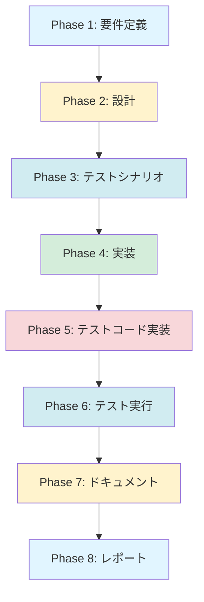

# プロジェクト計画書 - Issue #174

**Issue番号**: #174
**タイトル**: FOLLOW-UP Issue生成をエージェントベースに拡張する
**作成日**: 2025-01-30

---

## 1. Issue分析

### 複雑度: 中程度

**判定根拠**:
- 既存の `auto-issue` 機能（Issue #121〜#128）の設計パターンを再利用できるため、完全な新規実装ではない
- 複数ファイルの修正と新規ファイル作成が必要（プロンプトテンプレート、エージェントベース生成クラス、CLI オプション拡張等）
- 既存のLLM APIベース生成機能（`IssueAIGenerator`）との共存・フォールバック機構の実装が必要
- ファイル数は限定的（4〜6ファイル）だが、エージェント統合の理解が必要

### 見積もり工数: 12〜18時間

**根拠**:
- **Phase 1 (要件定義)**: 2時間 - 既存実装（auto-issue、IssueAIGenerator）の調査と要件整理
- **Phase 2 (設計)**: 2.5時間 - クラス設計、プロンプト設計、フォールバック機構設計
- **Phase 3 (テストシナリオ)**: 1.5時間 - 正常系・異常系シナリオ策定
- **Phase 4 (実装)**: 4〜6時間 - 新規クラス実装、既存クラス拡張、プロンプト作成
- **Phase 5 (テストコード実装)**: 2〜3時間 - ユニットテスト作成
- **Phase 6 (テスト実行)**: 0.5時間 - テスト実行と修正
- **Phase 7 (ドキュメント)**: 1時間 - README、CLAUDE.md、ARCHITECTURE.md 更新
- **Phase 8 (レポート)**: 0.5時間 - PR本文生成

### リスク評価: 中

**リスク要因**:
1. **技術的複雑性**: エージェント実行とファイルベース出力方式の理解が必要
2. **既存機能との統合**: `IssueAIGenerator` との共存とフォールバック機構の実装
3. **互換性維持**: 既存のLLM APIベース生成機能を破壊しないこと
4. **プロンプト品質**: Issue本文の品質がプロンプト設計に依存

---

## 2. 実装戦略判断

### 実装戦略: EXTEND

**判断根拠**:
- 既存の `IssueClient` クラスに新規メソッド（`generateFollowUpWithAgent()`）を追加する
- 既存の `EvaluationPhase` からエージェント生成を呼び出す拡張を行う
- 新規クラス `IssueAgentGenerator` を作成するが、これは既存アーキテクチャへの**追加**であり、完全な新規サブシステムではない
- 既存の `IssueAIGenerator`（LLM APIベース）は互換性維持のため残し、フォールバック先として使用
- `auto-issue` 機能で確立された設計パターン（`IssueGenerator`、ファイルベース出力方式）を**再利用**

### テスト戦略: UNIT_INTEGRATION

**判断根拠**:
- **UNIT テスト**: 必須
  - `IssueAgentGenerator` の単体テスト（プロンプト生成、エージェント呼び出し、出力ファイル読み込み）
  - `IssueClient.generateFollowUpWithAgent()` の単体テスト（モックエージェント使用）
  - CLI オプションパーサーの単体テスト
- **INTEGRATION テスト**: 必須
  - `EvaluationPhase` → `IssueClient` → `IssueAgentGenerator` → エージェント実行の統合テスト
  - フォールバック機構のテスト（エージェント失敗時に `IssueAIGenerator` へフォールバック）
  - GitHub API モックを使用したIssue作成のエンドツーエンドテスト
- **BDD テスト**: 不要
  - ユーザーストーリー中心ではなく、システム内部の機能拡張
  - CLI インターフェースの変更は既存パターンに従うため、新たなBDDシナリオは不要

### テストコード戦略: BOTH_TEST

**判断根拠**:
- **EXTEND_TEST**: 既存テストファイルへの追加
  - `tests/unit/core/github/issue-client.test.ts` - 既存の `IssueClient` テストに新規メソッドのテストを追加
  - `tests/integration/phases/evaluation.test.ts` - 既存の Evaluation Phase テストに新規シナリオを追加
- **CREATE_TEST**: 新規テストファイル作成
  - `tests/unit/core/github/issue-agent-generator.test.ts` - 新規クラス `IssueAgentGenerator` の単体テスト
  - `tests/integration/followup-issue-agent.test.ts` - エージェントベース FOLLOW-UP Issue 生成の統合テスト

---

## 3. 影響範囲分析

### 既存コードへの影響

**変更が必要なファイル**:

1. **`src/core/github/issue-client.ts`** (約385行)
   - 新規メソッド `generateFollowUpWithAgent()` を追加（約80行）
   - 既存メソッド `createIssueFromEvaluation()` にエージェントモード分岐を追加（約20行）

2. **`src/phases/evaluation.ts`** (約665行)
   - `handlePassWithIssues()` メソッドに `--followup-llm-mode agent` 対応を追加（約10行）

3. **`src/types.ts`** または **`src/types/commands.ts`**
   - `IssueGenerationOptions` 型に `mode: 'auto' | 'openai' | 'claude' | 'agent' | 'off'` を追加

4. **`src/commands/execute.ts`**
   - CLI オプション `--followup-llm-mode agent` のパース処理を追加

**新規作成ファイル**:

1. **`src/core/github/issue-agent-generator.ts`** (約250行)
   - エージェントベース FOLLOW-UP Issue 生成クラス

2. **`src/prompts/followup/generate-followup-issue.txt`** (約150行)
   - FOLLOW-UP Issue 生成用プロンプトテンプレート

### 依存関係の変更

**新規依存**: なし（既存の依存関係のみ使用）
- `CodexAgentClient` / `ClaudeAgentClient` - 既存
- `fs-extra` - 既存
- `path` - 標準ライブラリ

**既存依存の変更**: なし

### マイグレーション要否

**データベーススキーマ変更**: なし
**設定ファイル変更**: なし
**メタデータ変更**: あり（オプショナル）

- `metadata.json` の `evaluation.followup_issue_metadata` に生成元情報を追加（後方互換性あり）
  ```json
  {
    "evaluation": {
      "followup_issue_metadata": {
        "generation_mode": "agent",
        "agent_used": "codex",
        "duration_ms": 12345,
        "fallback_occurred": false
      }
    }
  }
  ```

---

## 4. タスク分割

### Phase 1: 要件定義 (見積もり: 2h)

- [x] Task 1-1: 既存実装の調査 (1~1.5h)
  - `auto-issue` 機能の `IssueGenerator` クラスを調査（Issue #121〜#128）
  - `IssueAIGenerator` クラスの実装パターンを調査（Issue #119）
  - エージェント実行パターン（ファイルベース出力方式）を理解
  - 既存プロンプトテンプレート（`generate-issue-body.txt`、`generate-refactor-issue-body.txt`）を参照

- [x] Task 1-2: 機能要件の明確化 (0.5~1h)
  - FOLLOW-UP Issue に必要なコンテキスト情報を定義（残タスク、元Issue情報、Evaluation Report等）
  - 生成するIssue本文の必須セクションを定義（背景、目的、実行内容、受け入れ基準、参考情報）
  - エージェント選択ロジックを設計（`--followup-llm-mode agent` 時の動作）
  - フォールバック条件を定義（エージェント失敗時に `IssueAIGenerator` へフォールバック）

### Phase 2: 設計 (見積もり: 2.5h)

- [x] Task 2-1: クラス設計 (1~1.5h)
  - `IssueAgentGenerator` クラスのインターフェース設計
  - `IssueClient.generateFollowUpWithAgent()` メソッドのシグネチャ設計
  - エージェントクライアント（Codex/Claude）の依存性注入設計
  - フォールバック機構の設計（`IssueAgentGenerator` → `IssueAIGenerator`）

- [x] Task 2-2: プロンプトテンプレート設計 (1h)
  - `src/prompts/followup/generate-followup-issue.txt` のセクション構成設計
  - プロンプト変数の定義（`{remaining_tasks_json}`、`{issue_context_json}`、`{evaluation_report_path}`、`{output_file_path}`）
  - 品質要件の定義（背景・目的・実行内容・受け入れ基準・参考情報の5セクション必須）

- [x] Task 2-3: エラーハンドリング設計 (0.5h)
  - エージェント実行失敗時のフォールバックフロー設計
  - 出力ファイル不在時のフォールバックフロー設計
  - ログ記録方針の設計（`logger.warn()` でフォールバック理由を記録）

### Phase 3: テストシナリオ (見積もり: 1.5h)

- [ ] Task 3-1: ユニットテストシナリオ策定 (0.5h)
  - `IssueAgentGenerator` の正常系（プロンプト生成、ファイル読み込み成功）
  - `IssueAgentGenerator` の異常系（ファイル不在、エージェント失敗）
  - `IssueClient.generateFollowUpWithAgent()` のモックテスト

- [ ] Task 3-2: インテグレーションテストシナリオ策定 (0.5h)
  - Codex エージェント使用時のエンドツーエンドテスト
  - Claude エージェント使用時のエンドツーエンドテスト
  - フォールバック機構のテスト（エージェント失敗 → LLM API にフォールバック）

- [ ] Task 3-3: Acceptance Criteria 定義 (0.5h)
  - エージェント生成Issue本文が必須5セクションを含むこと
  - フォールバック時にも Issue 作成が成功すること
  - `--followup-llm-mode agent` オプションが正しく動作すること

### Phase 4: 実装 (見積もり: 4~6h)

- [ ] Task 4-1: プロンプトテンプレート作成 (0.5h)
  - `src/prompts/followup/generate-followup-issue.txt` の実装
  - 5つの必須セクション（背景、目的、実行内容、受け入れ基準、参考情報）を含む
  - ファイルベース出力指示（`{output_file_path}` プレースホルダー）を含む

- [ ] Task 4-2: `IssueAgentGenerator` クラス実装 (2~3h)
  - コンストラクタ（エージェントクライアント注入）
  - `generate()` メソッド（プロンプト構築 → エージェント実行 → ファイル読み込み）
  - `buildPrompt()` メソッド（テンプレート変数置換）
  - `readOutputFile()` メソッド（ファイル検証、フォールバック処理）
  - エラーハンドリング（`getErrorMessage()` 使用）

- [ ] Task 4-3: `IssueClient` 拡張 (1h)
  - `generateFollowUpWithAgent()` メソッド追加
  - `createIssueFromEvaluation()` にエージェントモード分岐を追加
  - `IssueAgentGenerator` のインスタンス管理（コンストラクタ注入）

- [ ] Task 4-4: CLI オプション拡張 (0.5h)
  - `src/commands/execute.ts` に `--followup-llm-mode agent` パース処理を追加
  - `IssueGenerationOptions` 型に `mode: 'agent'` を追加

- [ ] Task 4-5: `EvaluationPhase` 統合 (0.5h)
  - `handlePassWithIssues()` からエージェント生成を呼び出し
  - フォールバック機構の統合

- [ ] Task 4-6: ビルドスクリプト更新 (0.5h)
  - `scripts/copy-static-assets.mjs` に `src/prompts/followup/*.txt` のコピー処理を追加（既存の `src/prompts/**/*.txt` で対応済みの可能性あり、要確認）

### Phase 5: テストコード実装 (見積もり: 2~3h)

- [ ] Task 5-1: `IssueAgentGenerator` ユニットテスト作成 (1~1.5h)
  - `tests/unit/core/github/issue-agent-generator.test.ts` 作成
  - プロンプト生成テスト
  - ファイル読み込みテスト（正常系・異常系）
  - エージェント呼び出しテスト（モック使用）

- [ ] Task 5-2: `IssueClient` ユニットテスト拡張 (0.5h)
  - `tests/unit/core/github/issue-client.test.ts` に `generateFollowUpWithAgent()` テストを追加

- [ ] Task 5-3: インテグレーションテスト作成 (1h)
  - `tests/integration/followup-issue-agent.test.ts` 作成
  - エージェント実行 → Issue作成のエンドツーエンドテスト
  - フォールバック機構のテスト

### Phase 6: テスト実行 (見積もり: 0.5h)

- [ ] Task 6-1: ユニットテスト実行と修正 (0.25h)
  - `npm run test:unit` 実行
  - 失敗したテストの修正

- [ ] Task 6-2: インテグレーションテスト実行と修正 (0.25h)
  - `npm run test:integration` 実行
  - 失敗したテストの修正

### Phase 7: ドキュメント (見積もり: 1h)

- [ ] Task 7-1: README.md 更新 (0.5h)
  - `--followup-llm-mode agent` オプションの使用例を追加
  - エージェントベース生成の説明を追加

- [ ] Task 7-2: CLAUDE.md 更新 (0.25h)
  - フォローアップIssue生成オプションセクションに `agent` モードを追加
  - プロンプトテンプレート情報を追加

- [ ] Task 7-3: ARCHITECTURE.md 更新 (0.25h)
  - `IssueAgentGenerator` クラスの説明を追加
  - エージェントベース生成フローの説明を追加

### Phase 8: レポート (見積もり: 0.5h)

- [ ] Task 8-1: PR本文生成 (0.5h)
  - 変更内容のサマリー作成
  - テスト結果の記載
  - スクリーンショット（CLI 実行例）の追加

---

## 5. 依存関係



**クリティカルパス**:
- Phase 1 → Phase 2 → Phase 4 → Phase 6 → Phase 8
- Phase 3 と Phase 5 は並行可能（Phase 4 完了後）

---

## 6. リスクと軽減策

### リスク1: エージェント実行の不安定性

**影響度**: 中
**確率**: 中
**軽減策**:
- フォールバック機構を必ず実装（`IssueAgentGenerator` → `IssueAIGenerator`）
- エージェント失敗時のログを詳細に記録（`logger.warn()` で理由を記録）
- リトライロジックは実装しない（複雑化を避ける）
- `auto-issue` の既存実装パターンを再利用（実証済みのパターン）

### リスク2: プロンプト品質の不安定性

**影響度**: 中
**確率**: 低
**軽減策**:
- 既存の `auto-issue` プロンプトテンプレートを参考にする（実証済み）
- 必須セクション（背景、目的、実行内容、受け入れ基準、参考情報）を明示的に指示
- ファイルベース出力方式により、エージェントが確実にファイルを保存するよう指示
- Phase 6 のテスト実行でプロンプト品質を検証

### リスク3: 既存機能との互換性破壊

**影響度**: 高
**確率**: 低
**軽減策**:
- 既存の `IssueAIGenerator` を削除せず、フォールバック先として残す
- `IssueClient.createIssueFromEvaluation()` のシグネチャを変更しない（オプション引数のみ追加）
- 既存のテストケースをすべて通過させる（リグレッションテスト）
- デフォルトモード（`--followup-llm-mode off`）は変更しない

### リスク4: ビルド時のプロンプトコピー漏れ

**影響度**: 高
**確率**: 低
**軽減策**:
- `scripts/copy-static-assets.mjs` のコピー対象パターン（`src/prompts/**/*.txt`）を確認
- ビルド後に `dist/prompts/followup/generate-followup-issue.txt` の存在を確認
- Phase 6 の統合テストで本番同等の環境（`dist/` ディレクトリ）でテスト実行

---

## 7. 品質ゲート

### Phase 1: 要件定義

- [ ] 機能要件が明確に記載されている（Issue本文の必須セクション、エージェント選択ロジック、フォールバック条件）
- [ ] 既存実装（`auto-issue`、`IssueAIGenerator`）の調査が完了している
- [ ] 受け入れ基準が定義されている（Acceptance Criteria）

### Phase 2: 設計

- [x] 実装戦略の判断根拠が明記されている（EXTEND）
- [x] テスト戦略の判断根拠が明記されている（UNIT_INTEGRATION）
- [x] テストコード戦略の判断根拠が明記されている（BOTH_TEST）
- [x] クラス設計が完了している（`IssueAgentGenerator`、`IssueClient` 拡張）
- [x] プロンプトテンプレート設計が完了している（5セクション、ファイルベース出力）
- [x] エラーハンドリング設計が完了している（フォールバックフロー）

### Phase 3: テストシナリオ

- [ ] ユニットテストシナリオが定義されている（正常系・異常系）
- [ ] インテグレーションテストシナリオが定義されている（エンドツーエンド、フォールバック）
- [ ] Acceptance Criteria が定義されている（必須5セクション、フォールバック成功、CLI オプション動作）

### Phase 4: 実装

- [ ] プロンプトテンプレートが作成されている（`generate-followup-issue.txt`）
- [ ] `IssueAgentGenerator` クラスが実装されている
- [ ] `IssueClient` 拡張が完了している
- [ ] CLI オプション拡張が完了している
- [ ] `EvaluationPhase` 統合が完了している
- [ ] ビルドスクリプトが更新されている

### Phase 5: テストコード実装

- [ ] ユニットテストが作成されている（`IssueAgentGenerator`、`IssueClient`）
- [ ] インテグレーションテストが作成されている（エンドツーエンド、フォールバック）
- [ ] テストカバレッジが80%以上である

### Phase 6: テスト実行

- [ ] すべてのユニットテストが成功している
- [ ] すべてのインテグレーションテストが成功している
- [ ] 既存のテストケース（リグレッションテスト）が成功している

### Phase 7: ドキュメント

- [ ] README.md が更新されている（`--followup-llm-mode agent` オプション）
- [ ] CLAUDE.md が更新されている（プロンプトテンプレート情報）
- [ ] ARCHITECTURE.md が更新されている（`IssueAgentGenerator` クラス）

### Phase 8: レポート

- [ ] PR本文が生成されている（変更サマリー、テスト結果、スクリーンショット）
- [ ] PR が作成されている
- [ ] CI/CD が成功している

---

## 8. 補足情報

### 参考実装

**auto-issue 機能（Issue #121〜#128）**:
- `src/core/issue-generator.ts` - エージェントベースIssue生成の参考実装
- `src/prompts/auto-issue/generate-issue-body.txt` - プロンプトテンプレートの参考
- ファイルベース出力方式（`{output_file_path}` プレースホルダー）
- エージェント選択ロジック（Codex → Claude フォールバック）

**IssueAIGenerator（Issue #119）**:
- `src/core/github/issue-ai-generator.ts` - LLM APIベース生成の既存実装
- OpenAI / Anthropic API 統合
- リトライ制御（最大3回）
- プロンプトサニタイズ（SecretMasker 統合）

### 技術的な考慮事項

1. **ファイルベース出力方式**:
   - エージェントに `{output_file_path}` を渡し、そのパスにIssue本文を保存させる
   - 一時ディレクトリ（`os.tmpdir()`）にユニークなファイル名で保存
   - 生成後、ファイルを読み込んでクリーンアップ

2. **フォールバック機構**:
   - `IssueAgentGenerator` 失敗時 → `IssueAIGenerator` へフォールバック
   - 出力ファイル不在時 → フォールバックテンプレート使用
   - フォールバック理由を `logger.warn()` で記録

3. **後方互換性**:
   - 既存の `--followup-llm-mode openai|claude|off` はそのまま動作
   - 新規の `--followup-llm-mode agent` のみ追加
   - デフォルトモード（`off`）は変更しない

### 成功基準

- [ ] `--followup-llm-mode agent` オプションが正しく動作すること
- [ ] エージェント生成Issue本文が必須5セクションを含むこと
- [ ] フォールバック機構が正常に動作すること（エージェント失敗時に LLM API へフォールバック）
- [ ] 既存のLLM APIベース生成機能が破壊されないこと
- [ ] すべてのテストが成功すること（ユニット、インテグレーション、リグレッション）
- [ ] ドキュメントが更新されていること（README、CLAUDE、ARCHITECTURE）

---

**計画書承認日**: 2025-01-30
**次フェーズ**: Phase 1 - 要件定義
