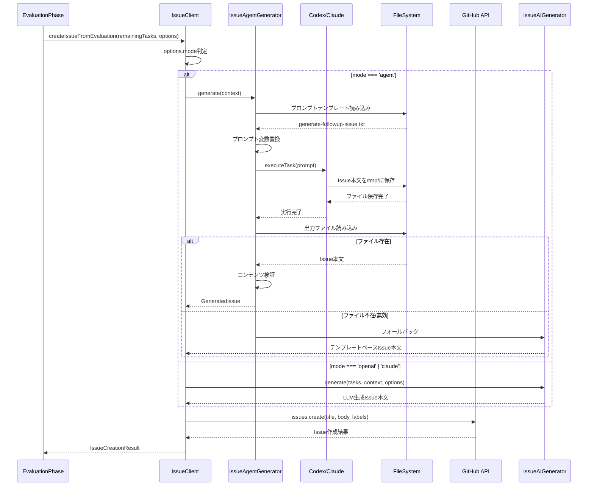
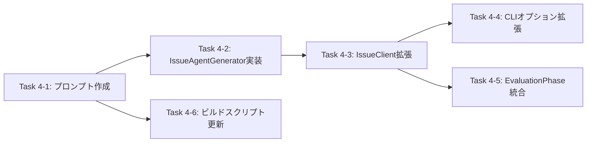

# 詳細設計書 - Issue #174

**Issue番号**: #174
**タイトル**: FOLLOW-UP Issue生成をエージェントベースに拡張する
**作成日**: 2025-01-30
**バージョン**: 1.0

---

## 1. アーキテクチャ設計

### 1.1 システム全体図

```mermaid
graph TB
    subgraph "Evaluation Phase (Phase 9)"
        EP[EvaluationPhase]
        EP --> |残タスク検出| HPWI[handlePassWithIssues]
    end

    subgraph "Issue Client Layer"
        IC[IssueClient]
        HPWI --> |createIssueFromEvaluation| IC
        IC --> |mode判定| MODE{mode?}
    end

    subgraph "エージェントベース生成（新規）"
        MODE --> |agent| IAG[IssueAgentGenerator]
        IAG --> |プロンプト読み込み| PT[generate-followup-issue.txt]
        IAG --> |エージェント実行| AGENT[Codex/Claude Agent]
        AGENT --> |ファイル出力| TMPFILE[/tmp/followup-*.md]
        TMPFILE --> |ファイル読み込み| IAG
    end

    subgraph "LLMベース生成（既存）"
        MODE --> |openai/claude| IAIG[IssueAIGenerator]
        IAIG --> |API呼び出し| LLM[OpenAI/Anthropic API]
        LLM --> |JSON応答| IAIG
    end

    subgraph "フォールバック機構"
        IAG --> |失敗時| FALLBACK{フォールバック}
        FALLBACK --> |ファイル不在| IAIG
        FALLBACK --> |エージェントエラー| IAIG
    end

    subgraph "GitHub Issue作成"
        IAG --> |Issue本文| GHAPI[GitHub API]
        IAIG --> |Issue本文| GHAPI
        GHAPI --> |Issue作成| RESULT[作成結果]
    end

    style EP fill:#e1f5ff
    style IC fill:#fff3cd
    style IAG fill:#d4edda
    style IAIG fill:#d1ecf1
    style FALLBACK fill:#f8d7da
    style GHAPI fill:#e7e7e7
```

### 1.2 コンポーネント間の関係

#### 既存コンポーネント

1. **EvaluationPhase** (`src/phases/evaluation.ts`)
   - 役割: 残タスク検出とFOLLOW-UP Issue作成のトリガー
   - 責務: `handlePassWithIssues()` メソッドで `IssueClient.createIssueFromEvaluation()` を呼び出し

2. **IssueClient** (`src/core/github/issue-client.ts`)
   - 役割: Issue作成のファサード
   - 責務: `mode` オプションに基づいて適切な生成戦略を選択
   - 既存: LLMベース生成（`IssueAIGenerator`）との統合

3. **IssueAIGenerator** (`src/core/github/issue-ai-generator.ts`)
   - 役割: OpenAI/Anthropic APIベースのIssue生成
   - 責務: プロンプト構築、API呼び出し、レスポンス検証

#### 新規コンポーネント

4. **IssueAgentGenerator** (`src/core/github/issue-agent-generator.ts`)
   - 役割: Codex/Claude Agentベースの詳細Issue生成
   - 責務: プロンプトテンプレート読み込み、エージェント実行、ファイルベース出力処理
   - 参考実装: `IssueGenerator` (auto-issue機能)

5. **プロンプトテンプレート** (`src/prompts/followup/generate-followup-issue.txt`)
   - 役割: エージェントへの指示書
   - 責務: 5つの必須セクション（背景、目的、実行内容、受け入れ基準、参考情報）を含むIssue本文生成の指示

### 1.3 データフロー



---

## 2. 実装戦略判断

### 実装戦略: **EXTEND**

#### 判断根拠

1. **既存コンポーネントへの拡張**:
   - `IssueClient.createIssueFromEvaluation()` メソッドに新規メソッド `generateFollowUpWithAgent()` を追加（既存のLLM生成機能は保持）
   - `EvaluationPhase.handlePassWithIssues()` からの呼び出しパターンは変更なし（オプション引数の拡張のみ）

2. **新規コンポーネントは既存アーキテクチャへの追加**:
   - `IssueAgentGenerator` クラスは `IssueGenerator` (auto-issue) のパターンを再利用
   - 既存の `IssueAIGenerator` は削除せず、フォールバック先として共存

3. **CLIオプションの拡張**:
   - `--followup-llm-mode` オプションに `agent` モードを追加（既存の `openai`, `claude`, `off` は互換性維持）
   - `IssueGenerationOptions` 型定義の拡張（`mode: 'agent'` を追加）

4. **ファイル数の評価**:
   - 新規作成ファイル: 2個（`IssueAgentGenerator`, プロンプトテンプレート）
   - 既存ファイルの修正: 4個（`IssueClient`, `EvaluationPhase`, `types.ts`, `execute.ts`）
   - 完全な新規サブシステムではなく、既存Issue生成機能への**機能追加**

---

## 3. テスト戦略判断

### テスト戦略: **UNIT_INTEGRATION**

#### 判断根拠

1. **UNIT テスト: 必須**
   - **`IssueAgentGenerator` の単体テスト**:
     - プロンプト生成ロジック（変数置換、ファイルパス生成）
     - エージェント呼び出し（モックエージェント使用）
     - 出力ファイル読み込み（正常系・異常系）
     - コンテンツ検証（必須セクション、最小文字数）
   - **`IssueClient.generateFollowUpWithAgent()` の単体テスト**:
     - モックエージェントを使用したIssue生成
     - フォールバック機構（ファイル不在時に `IssueAIGenerator` へフォールバック）
   - **CLIオプションパーサーの単体テスト**:
     - `--followup-llm-mode agent` の解析
     - `IssueGenerationOptions` 型への変換

2. **INTEGRATION テスト: 必須**
   - **エンドツーエンドフロー**:
     - `EvaluationPhase` → `IssueClient` → `IssueAgentGenerator` → エージェント実行 → Issue作成
     - 実際のファイルシステム操作（一時ファイル生成・読み込み・クリーンアップ）
   - **フォールバック機構の統合テスト**:
     - エージェント失敗時のフォールバック（`IssueAIGenerator` への切り替え）
     - ファイル不在時のフォールバック
   - **GitHub API モック**:
     - Issue作成のエンドツーエンドテスト（実際のGitHub APIは呼び出さない）

3. **BDD テスト: 不要**
   - ユーザーストーリー中心ではなく、システム内部の機能拡張
   - CLIインターフェースの変更は既存パターンに従うため、新たなBDDシナリオは不要

---

## 4. テストコード戦略判断

### テストコード戦略: **BOTH_TEST**

#### 判断根拠

1. **EXTEND_TEST（既存テストファイルへの追加）**:
   - **`tests/unit/core/github/issue-client.test.ts`**:
     - 既存の `IssueClient` テストに `generateFollowUpWithAgent()` メソッドのテストを追加
     - 既存のLLM生成テスト（`tryGenerateWithLLM`）との整合性を確認
   - **`tests/integration/phases/evaluation.test.ts`**:
     - 既存の Evaluation Phase 統合テストに新規シナリオ（`--followup-llm-mode agent`）を追加

2. **CREATE_TEST（新規テストファイル作成）**:
   - **`tests/unit/core/github/issue-agent-generator.test.ts`**:
     - 新規クラス `IssueAgentGenerator` の単体テスト
     - プロンプト生成、ファイル読み込み、エージェント呼び出しの各メソッドをテスト
   - **`tests/integration/followup-issue-agent.test.ts`**:
     - エージェントベースFOLLOW-UP Issue生成の統合テスト
     - フォールバック機構のエンドツーエンドテスト

---

## 5. 影響範囲分析

### 5.1 既存コードへの影響

#### 変更が必要なファイル

1. **`src/core/github/issue-client.ts`** (約385行)
   - 変更内容:
     - **新規メソッド追加**: `generateFollowUpWithAgent(context: FollowUpContext): Promise<GeneratedIssue>` (約80行)
     - **既存メソッド拡張**: `createIssueFromEvaluation()` にエージェントモード分岐を追加 (約20行)
   - 影響範囲: 中（新規メソッド追加のため、既存機能への影響は限定的）

2. **`src/phases/evaluation.ts`** (約665行)
   - 変更内容:
     - **`handlePassWithIssues()` メソッドの拡張**: `--followup-llm-mode agent` 対応を追加 (約10行)
   - 影響範囲: 小（オプション引数の追加のみ）

3. **`src/types.ts`** または **`src/types/commands.ts`**
   - 変更内容:
     - **`IssueGenerationOptions` 型の拡張**: `mode: 'auto' | 'openai' | 'claude' | 'agent' | 'off'`
   - 影響範囲: 小（型定義の拡張のみ、既存コードは互換性維持）

4. **`src/commands/execute.ts`** (約497行)
   - 変更内容:
     - **CLIオプションパース処理**: `--followup-llm-mode agent` の解析を追加 (約10行)
   - 影響範囲: 小（既存の `--followup-llm-mode` オプション処理への追加）

### 5.2 新規作成ファイル

1. **`src/core/github/issue-agent-generator.ts`** (約250行)
   - 役割: エージェントベースFOLLOW-UP Issue生成クラス
   - 主要メソッド:
     - `constructor(agentClient: CodexAgentClient | ClaudeAgentClient)`
     - `async generate(context: FollowUpContext): Promise<GeneratedIssue>`
     - `private buildPrompt(context: FollowUpContext): string`
     - `private async readOutputFile(filePath: string): Promise<string>`
     - `private createFallbackBody(context: FollowUpContext): string`

2. **`src/prompts/followup/generate-followup-issue.txt`** (約150行)
   - 役割: FOLLOW-UP Issue生成用プロンプトテンプレート
   - プレースホルダー:
     - `{remaining_tasks_json}`: 残タスクのJSON配列
     - `{issue_context_json}`: 元Issueのコンテキスト
     - `{evaluation_report_path}`: Evaluation Reportのファイルパス（@filepath形式）
     - `{output_file_path}`: 出力先ファイルパス
   - 必須セクション: 背景、目的、実行内容、受け入れ基準、参考情報

### 5.3 依存関係の変更

#### 新規依存

- **なし**（既存の依存関係のみ使用）
  - `CodexAgentClient` / `ClaudeAgentClient` - 既存
  - `fs-extra` - 既存
  - `path` - 標準ライブラリ
  - `os` - 標準ライブラリ

#### 既存依存の変更

- **なし**

### 5.4 マイグレーション要否

#### データベーススキーマ変更

- **なし**

#### 設定ファイル変更

- **なし**

#### メタデータ変更

- **あり**（オプショナル）
  - `metadata.json` の `evaluation.followup_issue_metadata` に生成元情報を追加（後方互換性あり）
  - 新規フィールド:
    ```json
    {
      "evaluation": {
        "followup_issue_metadata": {
          "generation_mode": "agent",
          "agent_used": "codex",
          "duration_ms": 12345,
          "fallback_occurred": false
        }
      }
    }
    ```

---

## 6. 詳細設計

### 6.1 クラス設計

#### 6.1.1 IssueAgentGenerator クラス

```typescript
/**
 * IssueAgentGenerator - エージェントベースFOLLOW-UP Issue生成クラス
 *
 * ファイルベース出力方式により、Codex/Claude Agentを使用して
 * 詳細なFOLLOW-UP Issue本文を生成します。
 *
 * @module issue-agent-generator
 */

import path from 'node:path';
import os from 'node:os';
import { fileURLToPath } from 'node:url';
import fs from 'fs-extra';
import { logger } from '../../utils/logger.js';
import { getErrorMessage } from '../../utils/error-utils.js';
import type { CodexAgentClient } from '../codex-agent-client.js';
import type { ClaudeAgentClient } from '../claude-agent-client.js';
import type { RemainingTask, IssueContext } from '../../types.js';

const __filename = fileURLToPath(import.meta.url);
const __dirname = path.dirname(__filename);

/**
 * FOLLOW-UP Issue生成コンテキスト
 */
export interface FollowUpContext {
  remainingTasks: RemainingTask[];
  issueContext: IssueContext;
  issueNumber: number;
  evaluationReportPath: string;
}

/**
 * 生成されたIssue
 */
export interface GeneratedIssue {
  title: string;
  body: string;
  success: boolean;
  error?: string;
}

export class IssueAgentGenerator {
  private readonly codexClient: CodexAgentClient | null;
  private readonly claudeClient: ClaudeAgentClient | null;

  /**
   * コンストラクタ
   *
   * @param codexClient - Codexエージェントクライアント（nullの場合は使用不可）
   * @param claudeClient - Claudeエージェントクライアント（nullの場合は使用不可）
   */
  constructor(
    codexClient: CodexAgentClient | null,
    claudeClient: ClaudeAgentClient | null,
  ) {
    this.codexClient = codexClient;
    this.claudeClient = claudeClient;
  }

  /**
   * FOLLOW-UP Issueを生成
   *
   * @param context - FOLLOW-UP Issue生成コンテキスト
   * @param agent - 使用エージェント（'auto' | 'codex' | 'claude'）
   * @returns 生成されたIssue
   */
  public async generate(
    context: FollowUpContext,
    agent: 'auto' | 'codex' | 'claude',
  ): Promise<GeneratedIssue> {
    logger.info(`Generating follow-up issue for #${context.issueNumber} with agent mode`);

    // 1. プロンプトテンプレートを読み込み
    const promptPath = path.resolve(
      __dirname,
      '../../prompts/followup/generate-followup-issue.txt',
    );
    if (!fs.existsSync(promptPath)) {
      return {
        success: false,
        title: '',
        body: '',
        error: `Prompt template not found: ${promptPath}`,
      };
    }

    const template = fs.readFileSync(promptPath, 'utf-8');

    // 2. 出力ファイルパスを生成
    const outputFilePath = this.generateOutputFilePath();
    logger.debug(`Output file path: ${outputFilePath}`);

    // 3. プロンプト変数を置換
    const prompt = this.buildPrompt(template, context, outputFilePath);

    // 4. エージェントを選択
    let selectedAgent = agent;

    if (agent === 'codex' || agent === 'auto') {
      if (!this.codexClient) {
        if (agent === 'codex') {
          return {
            success: false,
            title: '',
            body: '',
            error: 'Codex agent is not available.',
          };
        }
        logger.warn('Codex not available, falling back to Claude.');
        selectedAgent = 'claude';
      } else {
        try {
          logger.info('Using Codex agent for follow-up issue generation.');
          await this.codexClient.executeTask({ prompt });
        } catch (error) {
          if (agent === 'codex') {
            return {
              success: false,
              title: '',
              body: '',
              error: `Codex failed: ${getErrorMessage(error)}`,
            };
          }
          logger.warn(`Codex failed, falling back to Claude.`);
          selectedAgent = 'claude';
        }
      }
    }

    if (selectedAgent === 'claude') {
      if (!this.claudeClient) {
        return {
          success: false,
          title: '',
          body: '',
          error: 'Claude agent is not available.',
        };
      }
      logger.info('Using Claude agent for follow-up issue generation.');
      await this.claudeClient.executeTask({ prompt });
    }

    // 5. 出力ファイルからIssue本文を読み込み
    const issueBody = this.readOutputFile(outputFilePath, context);

    // 6. 一時ファイルをクリーンアップ
    this.cleanupOutputFile(outputFilePath);

    // 7. タイトル生成（残タスクのキーワードから自動生成）
    const title = this.generateTitle(context.issueNumber, context.remainingTasks);

    return {
      success: true,
      title,
      body: issueBody,
    };
  }

  /**
   * 出力ファイルパスを生成
   *
   * @returns 一時ディレクトリ内のユニークなファイルパス
   */
  private generateOutputFilePath(): string {
    const timestamp = Date.now();
    const random = Math.random().toString(36).substring(2, 8);
    return path.join(os.tmpdir(), `followup-issue-${timestamp}-${random}.md`);
  }

  /**
   * プロンプトを構築
   *
   * @param template - プロンプトテンプレート
   * @param context - FOLLOW-UP Issue生成コンテキスト
   * @param outputFilePath - 出力ファイルパス
   * @returns 変数置換済みプロンプト
   */
  private buildPrompt(
    template: string,
    context: FollowUpContext,
    outputFilePath: string,
  ): string {
    return template
      .replaceAll('{remaining_tasks_json}', JSON.stringify(context.remainingTasks, null, 2))
      .replaceAll('{issue_context_json}', JSON.stringify(context.issueContext, null, 2))
      .replaceAll('{evaluation_report_path}', `@${context.evaluationReportPath}`)
      .replaceAll('{output_file_path}', outputFilePath)
      .replaceAll('{issue_number}', String(context.issueNumber));
  }

  /**
   * 出力ファイルからIssue本文を読み込み
   *
   * @param filePath - 出力ファイルパス
   * @param context - FOLLOW-UP Issue生成コンテキスト（フォールバック用）
   * @returns Markdown形式のIssue本文
   */
  private readOutputFile(filePath: string, context: FollowUpContext): string {
    if (!fs.existsSync(filePath)) {
      logger.warn(`Output file not found: ${filePath}. Using fallback template.`);
      return this.createFallbackBody(context);
    }

    try {
      const content = fs.readFileSync(filePath, 'utf-8').trim();
      logger.debug(`Output file content (first 500 chars): ${content.substring(0, 500)}`);

      // 内容が空の場合はフォールバック
      if (!content) {
        logger.warn('Output file is empty. Using fallback template.');
        return this.createFallbackBody(context);
      }

      // 最低限の検証: 必須セクションが含まれているか
      if (!this.isValidIssueContent(content)) {
        logger.warn('Output file does not contain required sections. Using fallback template.');
        return this.createFallbackBody(context);
      }

      logger.info('Successfully read follow-up issue body from output file.');
      return content;
    } catch (error) {
      logger.error(`Failed to read output file: ${getErrorMessage(error)}`);
      return this.createFallbackBody(context);
    }
  }

  /**
   * Issue本文の妥当性検証
   *
   * @param content - Issue本文
   * @returns 妥当な場合はtrue
   */
  private isValidIssueContent(content: string): boolean {
    // 必須セクションの存在チェック
    const requiredSections = ['## 背景', '## 目的', '## 実行内容', '## 受け入れ基準', '## 参考情報'];
    for (const section of requiredSections) {
      if (!content.includes(section)) {
        logger.warn(`Missing required section: ${section}`);
        return false;
      }
    }

    // 最小文字数チェック（100文字以上）
    if (content.length < 100) {
      logger.warn(`Content too short: ${content.length} chars`);
      return false;
    }

    return true;
  }

  /**
   * フォールバック用のIssue本文を生成
   *
   * @param context - FOLLOW-UP Issue生成コンテキスト
   * @returns Markdown形式のIssue本文
   */
  private createFallbackBody(context: FollowUpContext): string {
    const lines: string[] = [];

    // 背景
    lines.push('## 背景', '');
    lines.push(context.issueContext.summary, '');

    if (context.issueContext.blockerStatus) {
      lines.push('### 元 Issue のステータス', '');
      lines.push(context.issueContext.blockerStatus, '');
    }

    if (context.issueContext.deferredReason) {
      lines.push('### なぜこれらのタスクが残ったか', '');
      lines.push(context.issueContext.deferredReason, '');
    }

    // 目的
    lines.push('## 目的', '');
    lines.push(`Issue #${context.issueNumber} で特定された残タスクを完了し、プロジェクトを最終化する。`, '');

    // 実行内容
    lines.push('## 実行内容', '');
    for (let i = 0; i < context.remainingTasks.length; i++) {
      const task = context.remainingTasks[i];
      const taskNumber = i + 1;

      lines.push(`### Task ${taskNumber}: ${task.task}`, '');

      if (task.targetFiles && task.targetFiles.length > 0) {
        lines.push('**対象ファイル**:', '');
        task.targetFiles.forEach((file) => lines.push(`- \`${file}\``));
        lines.push('');
      }

      if (task.steps && task.steps.length > 0) {
        lines.push('**必要な作業**:', '');
        task.steps.forEach((step, i) => lines.push(`${i + 1}. ${step}`));
        lines.push('');
      }

      lines.push(`**優先度**: ${task.priority ?? '中'}`, '');
      lines.push(`**見積もり**: ${task.estimatedHours ?? '未定'}`, '');
      lines.push('---', '');
    }

    // 受け入れ基準
    lines.push('## 受け入れ基準', '');
    for (const task of context.remainingTasks) {
      if (task.acceptanceCriteria && task.acceptanceCriteria.length > 0) {
        task.acceptanceCriteria.forEach((ac) => lines.push(`- [ ] ${ac}`));
      }
    }
    lines.push('');

    // 参考情報
    lines.push('## 参考情報', '');
    lines.push(`- 元Issue: #${context.issueNumber}`);
    lines.push(`- Evaluation Report: \`${context.evaluationReportPath}\``);
    lines.push('', '---', '*このIssueは自動生成されました（フォールバックテンプレート使用）*');

    return lines.join('\n');
  }

  /**
   * 一時出力ファイルをクリーンアップ
   *
   * @param filePath - 出力ファイルパス
   */
  private cleanupOutputFile(filePath: string): void {
    try {
      if (fs.existsSync(filePath)) {
        fs.removeSync(filePath);
        logger.debug(`Cleaned up output file: ${filePath}`);
      }
    } catch (error) {
      logger.warn(`Failed to cleanup output file: ${getErrorMessage(error)}`);
    }
  }

  /**
   * Issueタイトルを生成
   *
   * @param issueNumber - 元Issue番号
   * @param remainingTasks - 残タスクのリスト
   * @returns Issueタイトル（80文字以内）
   */
  private generateTitle(issueNumber: number, remainingTasks: RemainingTask[]): string {
    // キーワード抽出（最大3個）
    const keywords: string[] = [];

    for (const task of remainingTasks.slice(0, 3)) {
      const taskText = String(task.task ?? '');
      if (!taskText.trim()) {
        continue;
      }

      // 括弧前まで、または最初の20文字を抽出
      let keyword = taskText.split('（')[0].split('(')[0].trim();
      if (keyword.length > 20) {
        keyword = keyword.substring(0, 20);
      }

      if (keyword) {
        keywords.push(keyword);
      }
    }

    // キーワードが抽出できた場合
    if (keywords.length > 0) {
      const keywordsStr = keywords.join('・');
      const title = `[FOLLOW-UP] #${issueNumber}: ${keywordsStr}`;

      // 80文字制限
      if (title.length > 80) {
        return title.substring(0, 77) + '...';
      }

      return title;
    }

    // フォールバック
    return `[FOLLOW-UP] Issue #${issueNumber} - 残タスク`;
  }
}
```

#### 6.1.2 IssueClient 拡張

```typescript
/**
 * IssueClient 拡張メソッド
 */

// 新規メソッド追加
public async generateFollowUpWithAgent(
  context: FollowUpContext,
  agent: 'auto' | 'codex' | 'claude',
): Promise<GeneratedIssue> {
  if (!this.issueAgentGenerator) {
    throw new Error('IssueAgentGenerator is not configured.');
  }

  return await this.issueAgentGenerator.generate(context, agent);
}

// 既存メソッド拡張（createIssueFromEvaluation）
public async createIssueFromEvaluation(
  issueNumber: number,
  remainingTasks: RemainingTask[],
  evaluationReportPath: string,
  issueContext?: IssueContext,
  options?: IssueGenerationOptions,
): Promise<IssueCreationResult> {
  try {
    logger.info(
      `Creating follow-up issue for #${issueNumber} with ${remainingTasks.length} remaining tasks`,
    );

    const generationOptions = this.resolveIssueGenerationOptions(options);

    // ===== 新規: エージェントモード分岐 =====
    if (generationOptions.mode === 'agent') {
      const agentResult = await this.tryGenerateWithAgent(
        issueNumber,
        remainingTasks,
        evaluationReportPath,
        issueContext,
      );

      if (agentResult.success) {
        const title = agentResult.title;
        const body = agentResult.body;

        const { data } = await this.octokit.issues.create({
          owner: this.owner,
          repo: this.repo,
          title,
          body,
          labels: ['enhancement', 'ai-workflow-follow-up'],
        });

        logger.info(`Follow-up issue created: #${data.number} - ${title}`);

        return {
          success: true,
          issue_url: data.html_url ?? null,
          issue_number: data.number ?? null,
          error: null,
        };
      } else {
        // エージェント失敗時のフォールバック: 既存のLLM生成へ
        logger.warn(`Agent generation failed: ${agentResult.error}. Falling back to LLM generation.`);
        // 既存のLLM生成ロジックへフォールバック（後続処理）
      }
    }
    // ===== 既存: LLMモード =====

    const aiResult = await this.tryGenerateWithLLM(
      issueNumber,
      remainingTasks,
      issueContext,
      generationOptions,
    );

    // （既存コード続行）
    // ...
  } catch (error) {
    // （既存エラーハンドリング）
    // ...
  }
}

/**
 * エージェントベースFOLLOW-UP Issue生成を試行
 *
 * @param issueNumber - 元Issue番号
 * @param tasks - 残タスクのリスト
 * @param evaluationReportPath - Evaluation Reportのパス
 * @param issueContext - Issueコンテキスト
 * @returns 生成されたIssue
 */
private async tryGenerateWithAgent(
  issueNumber: number,
  tasks: RemainingTask[],
  evaluationReportPath: string,
  issueContext: IssueContext | undefined,
): Promise<GeneratedIssue> {
  if (!this.issueAgentGenerator) {
    logger.warn('IssueAgentGenerator is not configured. Skipping agent generation.');
    return {
      success: false,
      title: '',
      body: '',
      error: 'IssueAgentGenerator not configured',
    };
  }

  const context: FollowUpContext = {
    remainingTasks: tasks,
    issueContext: issueContext ?? {
      summary: `この Issue は、Issue #${issueNumber} の Evaluation フェーズで特定された残タスクをまとめたものです。`,
      blockerStatus: 'すべてのブロッカーは解決済み',
      deferredReason: 'タスク優先度の判断により後回し',
    },
    issueNumber,
    evaluationReportPath,
  };

  try {
    const agent = 'auto'; // デフォルトはauto（Codex優先）
    const result = await this.issueAgentGenerator.generate(context, agent);

    if (result.success) {
      logger.info('Agent-based follow-up issue generation succeeded.');
      return result;
    } else {
      logger.warn(`Agent generation failed: ${result.error}`);
      return result;
    }
  } catch (error) {
    const message = getErrorMessage(error);
    logger.error(`Agent generation error: ${message}`);
    return {
      success: false,
      title: '',
      body: '',
      error: message,
    };
  }
}
```

### 6.2 プロンプトテンプレート設計

#### 6.2.1 プロンプトテンプレートの構成

**ファイル**: `src/prompts/followup/generate-followup-issue.txt`

```
あなたはソフトウェア開発プロジェクトの FOLLOW-UP Issue 作成アシスタントです。
以下の情報から、詳細かつ実行可能な FOLLOW-UP Issue 本文を生成してください。

# 入力情報

## 残タスク

{remaining_tasks_json}

## Issue コンテキスト

{issue_context_json}

## Evaluation Report

Evaluation Report のパス: {evaluation_report_path}

Evaluation Report の内容を確認し、残タスクが発生した背景と理由を把握してください。

# Issue 本文フォーマット

以下の5つのセクションを含むMarkdown形式で生成してください：

## 背景
（元Issueの概要と、なぜ残タスクが発生したかを1〜2段落で説明してください。Evaluation Reportの内容を参考にしてください。最低100文字。）

## 目的
（各残タスクの目的と期待される成果を具体的に記載してください。「何を達成するのか」を明確に記述してください。最低100文字。）

## 実行内容
（各タスクについて、以下の情報を含めてください）
- 対象ファイル（targetFiles から抽出）
- 具体的な実装手順（steps から抽出、または提案）
- テスト方法（acceptanceCriteria を参考に提案）
- 注意事項

**形式**: 番号付きリストまたは見出し（### Task 1）で構造化してください。最低200文字。

## 受け入れ基準
（各タスクの完了判断基準を記載してください。可能な限り Given-When-Then 形式で記述してください。acceptanceCriteria を参考にしてください。最低100文字。）

例：
- [ ] Given: テストシナリオが存在する / When: テストを実行する / Then: すべてのテストが成功する
- [ ] Given: ドキュメントが更新される / When: README.mdを確認する / Then: 新機能の説明が含まれている

## 参考情報
（元Issue、Evaluation Report、関連ドキュメントへのリンクを記載してください。最低50文字。）

例：
- 元Issue: #123
- Evaluation Report: `path/to/evaluation_report.md`
- 関連ドキュメント: ARCHITECTURE.md, README.md

# 出力フォーマット

生成したIssue本文は **必ず指定されたファイルに書き出してください**。

## 出力ファイル

**出力先**: `{output_file_path}`

このファイルに以下のMarkdown形式でIssue本文を書き出してください（コードブロックなし、生のMarkdownテキスト）：

```
## 背景
（背景文を記載）

## 目的
（目的文を記載）

## 実行内容
（実行内容を記載）

## 受け入れ基準
（受け入れ基準を記載）

## 参考情報
- 元Issue: #{issue_number}
- Evaluation Report: `{evaluation_report_path}`
```

**重要**: 標準出力への出力ではなく、必ず上記のファイルパスにMarkdownテキストを書き出してください。

# 重要な注意事項

1. **日本語で記載**: すべてのセクションを日本語で記載してください
2. **具体性**: 抽象的な説明ではなく、具体的なアクションと手順を記載してください
3. **セクション必須**: 5つのセクション（背景、目的、実行内容、受け入れ基準、参考情報）をすべて含めてください
4. **ファイル出力必須**: 必ず指定されたファイルパス（`{output_file_path}`）にMarkdownを書き出してください
5. **適切な長さ**: 各セクションは最低文字数（背景100、目的100、実行内容200、受け入れ基準100、参考情報50）を満たしてください
6. **コードブロック不要**: ファイルには生のMarkdownテキストを書き出してください（```markdownで囲まないこと）
7. **Evaluation Report参照**: 必ず Evaluation Report の内容を確認し、背景と目的に反映してください

# 文体

- 簡潔かつ明確な文体を使用してください
- 技術的に正確な用語を使用してください
- 読者がエンジニアであることを前提に記載してください
- 実行可能な指示を含めてください
```

#### 6.2.2 プロンプト変数一覧

| 変数名 | 説明 | 形式 | 例 |
|-------|------|------|---|
| `{remaining_tasks_json}` | 残タスクのJSON配列 | JSON | `[{"task":"...", "phase":"...", ...}]` |
| `{issue_context_json}` | 元IssueのコンテキストJSON | JSON | `{"summary":"...", "blockerStatus":"...", ...}` |
| `{evaluation_report_path}` | Evaluation Reportのファイルパス | @filepath形式 | `@.ai-workflow/issue-123/09_evaluation/output/evaluation_report.md` |
| `{output_file_path}` | 出力先ファイルパス | 絶対パス | `/tmp/followup-issue-1735574400-abc123.md` |
| `{issue_number}` | 元Issue番号 | 数値文字列 | `"123"` |

### 6.3 関数設計

#### 6.3.1 主要関数一覧

| 関数名 | 責務 | 入力 | 出力 | エラーハンドリング |
|--------|------|------|------|-------------------|
| `IssueAgentGenerator.generate()` | Issue本文生成のメイン処理 | `FollowUpContext`, `agent` | `GeneratedIssue` | try-catchでエラーをキャッチし、フォールバック本文を返す |
| `IssueAgentGenerator.buildPrompt()` | プロンプト変数置換 | `template`, `context`, `outputFilePath` | `string` | なし（変数置換は文字列操作のみ） |
| `IssueAgentGenerator.readOutputFile()` | 出力ファイル読み込み | `filePath`, `context` | `string` | try-catchでエラーをキャッチし、フォールバック本文を返す |
| `IssueAgentGenerator.isValidIssueContent()` | コンテンツ検証 | `content` | `boolean` | なし（検証ロジックのみ） |
| `IssueAgentGenerator.createFallbackBody()` | フォールバック本文生成 | `context` | `string` | なし（テンプレート生成のみ） |
| `IssueClient.generateFollowUpWithAgent()` | エージェント生成の呼び出し | `context`, `agent` | `GeneratedIssue` | エラー時は例外をスロー |
| `IssueClient.tryGenerateWithAgent()` | エージェント生成の試行 | `issueNumber`, `tasks`, `evaluationReportPath`, `issueContext` | `GeneratedIssue` | try-catchでエラーをキャッチし、失敗結果を返す |

#### 6.3.2 エラーハンドリング設計

1. **エージェント実行失敗時**:
   - `IssueAgentGenerator.generate()` 内で try-catch
   - ログ記録（`logger.error()`）
   - フォールバック: `IssueAIGenerator` へ（`IssueClient` レイヤーで制御）

2. **出力ファイル不在時**:
   - `IssueAgentGenerator.readOutputFile()` 内で検証
   - ログ記録（`logger.warn()`）
   - フォールバック: `createFallbackBody()` でテンプレートベース本文生成

3. **コンテンツ検証失敗時**:
   - `IssueAgentGenerator.isValidIssueContent()` で検証
   - ログ記録（`logger.warn()`）
   - フォールバック: `createFallbackBody()` でテンプレートベース本文生成

### 6.4 データ構造設計

#### 6.4.1 FollowUpContext 型

```typescript
/**
 * FOLLOW-UP Issue生成コンテキスト
 */
export interface FollowUpContext {
  /**
   * 残タスクのリスト
   */
  remainingTasks: RemainingTask[];

  /**
   * Issueコンテキスト（背景情報）
   */
  issueContext: IssueContext;

  /**
   * 元Issue番号
   */
  issueNumber: number;

  /**
   * Evaluation Reportのファイルパス（相対パス）
   */
  evaluationReportPath: string;
}
```

#### 6.4.2 GeneratedIssue 型

```typescript
/**
 * 生成されたIssue
 */
export interface GeneratedIssue {
  /**
   * Issueタイトル
   */
  title: string;

  /**
   * Issue本文（Markdown形式）
   */
  body: string;

  /**
   * 生成成功フラグ
   */
  success: boolean;

  /**
   * エラーメッセージ（失敗時のみ）
   */
  error?: string;
}
```

#### 6.4.3 IssueGenerationOptions 型の拡張

```typescript
/**
 * Issue生成オプション（既存型の拡張）
 */
export interface IssueGenerationOptions {
  /**
   * LLM生成の有効化
   */
  enabled: boolean;

  /**
   * プロバイダ選択
   * - 'auto': Codexエージェント優先、なければClaudeエージェント
   * - 'openai': OpenAI API
   * - 'claude': Anthropic API
   * - 'agent': Codex/Claudeエージェント（ファイルベース出力）← 新規追加
   * - 'off': LLM生成無効化
   */
  mode: 'auto' | 'openai' | 'claude' | 'agent' | 'off'; // ← 'agent' を追加

  /**
   * モデル名
   */
  model?: string;

  /**
   * 温度パラメータ
   */
  temperature?: number;

  /**
   * 最大出力トークン数
   */
  maxOutputTokens?: number;

  /**
   * タイムアウト（ミリ秒）
   */
  timeoutMs?: number;

  /**
   * 最大リトライ回数
   */
  maxRetries?: number;

  /**
   * 最大タスク数
   */
  maxTasks?: number;

  /**
   * メタデータ追記フラグ
   */
  appendMetadata?: boolean;
}
```

### 6.5 インターフェース設計

#### 6.5.1 IssueAgentGenerator インターフェース

```typescript
/**
 * IssueAgentGenerator インターフェース
 */
export interface IIssueAgentGenerator {
  /**
   * FOLLOW-UP Issueを生成
   *
   * @param context - FOLLOW-UP Issue生成コンテキスト
   * @param agent - 使用エージェント（'auto' | 'codex' | 'claude'）
   * @returns 生成されたIssue
   */
  generate(
    context: FollowUpContext,
    agent: 'auto' | 'codex' | 'claude',
  ): Promise<GeneratedIssue>;
}
```

#### 6.5.2 IssueClient 拡張インターフェース

```typescript
/**
 * IssueClient拡張インターフェース
 */
export interface IIssueClientExtended {
  /**
   * エージェントベースFOLLOW-UP Issue生成
   *
   * @param context - FOLLOW-UP Issue生成コンテキスト
   * @param agent - 使用エージェント
   * @returns 生成されたIssue
   */
  generateFollowUpWithAgent(
    context: FollowUpContext,
    agent: 'auto' | 'codex' | 'claude',
  ): Promise<GeneratedIssue>;

  /**
   * Evaluation結果からFOLLOW-UP Issue作成（既存メソッド、拡張）
   *
   * @param issueNumber - 元Issue番号
   * @param remainingTasks - 残タスクのリスト
   * @param evaluationReportPath - Evaluation Reportのパス
   * @param issueContext - Issueコンテキスト（オプショナル）
   * @param options - Issue生成オプション（mode: 'agent' 追加）
   * @returns Issue作成結果
   */
  createIssueFromEvaluation(
    issueNumber: number,
    remainingTasks: RemainingTask[],
    evaluationReportPath: string,
    issueContext?: IssueContext,
    options?: IssueGenerationOptions,
  ): Promise<IssueCreationResult>;
}
```

---

## 7. セキュリティ考慮事項

### 7.1 認証・認可

1. **エージェント認証**:
   - Codex: `CODEX_API_KEY` または `OPENAI_API_KEY` 環境変数（既存）
   - Claude: `CLAUDE_CODE_CREDENTIALS_PATH` 環境変数（既存）
   - 環境変数は `src/core/config.ts` の Config クラス経由でアクセス（Issue #51パターン）

2. **GitHub API認証**:
   - `GITHUB_TOKEN` 環境変数（既存）
   - Issue作成権限が必要（`repo` スコープ）

### 7.2 データ保護

1. **一時ファイルのクリーンアップ**:
   - `os.tmpdir()` に生成される一時ファイルは、処理完了後に確実に削除
   - `IssueAgentGenerator.cleanupOutputFile()` メソッドで実装

2. **シークレットマスキング**:
   - プロンプトに含まれる機密情報（APIキー、メールアドレス、トークン）は自動的にマスキング（SecretMasker統合は既存の `IssueAIGenerator` パターンを参考）
   - ただし、エージェントへの入力は `remainingTasks` と `issueContext` のみであり、機密情報を含まないことを前提

3. **コンテキスト情報の最小化**:
   - エージェントに渡すコンテキスト情報は必要最小限に限定
   - `remainingTasks`, `issueContext`, `evaluationReportPath` のみ

### 7.3 セキュリティリスクと対策

| リスク | 影響度 | 対策 |
|--------|--------|------|
| **一時ファイルの残留** | 中 | `finally` ブロックで確実にクリーンアップ |
| **プロンプトインジェクション** | 低 | 入力データは構造化されたJSON（ユーザー入力は含まれない） |
| **APIキー漏洩** | 高 | 環境変数経由でアクセス、ログには記録しない |
| **エージェント実行の乱用** | 中 | タイムアウト設定（60秒）、リトライなし |

---

## 8. 非機能要件への対応

### 8.1 パフォーマンス

1. **エージェント実行時間**:
   - タイムアウト: 60秒（既存の `auto-issue` 機能と同等）
   - 実装: エージェントクライアントのタイムアウト設定を利用

2. **フォールバック処理**:
   - フォールバック時間: 30秒以内（既存の `IssueAIGenerator` のタイムアウト）
   - 実装: `tryGenerateWithLLM()` メソッドの既存タイムアウト

3. **プロンプトファイル読み込み**:
   - 目標: 1秒以内
   - 実装: ローカルファイルシステムアクセス（同期読み込み）

### 8.2 スケーラビリティ

1. **残タスク数の制限**:
   - 最大タスク数: 制限なし（エージェントのコンテキスト長に依存）
   - プロンプトサイズ: 残タスク数に比例（5タスクで約2KB、10タスクで約4KB）

2. **並行処理**:
   - エージェント実行は1度に1つ（並行処理なし）
   - フォールバック時のLLM呼び出しも1度に1つ

### 8.3 保守性

1. **コードの再利用性**:
   - `IssueGenerator` (auto-issue) のパターンを再利用
   - プロンプトテンプレートは `.txt` ファイルで管理（変更容易）

2. **既存機能との共存**:
   - `IssueAIGenerator` を削除せず、フォールバック先として保持
   - `IssueClient.createIssueFromEvaluation()` のシグネチャを変更しない

3. **ログとデバッグ**:
   - すべてのエラーは `logger.error()` で記録
   - フォールバック発生時は `logger.warn()` で記録
   - デバッグログは `logger.debug()` で記録

---

## 9. 実装の順序

### Phase 4: 実装（Planning Documentより）

1. **Task 4-1: プロンプトテンプレート作成** (0.5h)
   - `src/prompts/followup/generate-followup-issue.txt` の実装
   - 5つの必須セクション（背景、目的、実行内容、受け入れ基準、参考情報）を含む
   - ファイルベース出力指示（`{output_file_path}` プレースホルダー）を含む

2. **Task 4-2: `IssueAgentGenerator` クラス実装** (2〜3h)
   - コンストラクタ（エージェントクライアント注入）
   - `generate()` メソッド（プロンプト構築 → エージェント実行 → ファイル読み込み）
   - `buildPrompt()` メソッド（テンプレート変数置換）
   - `readOutputFile()` メソッド（ファイル検証、フォールバック処理）
   - エラーハンドリング（`getErrorMessage()` 使用）

3. **Task 4-3: `IssueClient` 拡張** (1h)
   - `generateFollowUpWithAgent()` メソッド追加
   - `createIssueFromEvaluation()` にエージェントモード分岐を追加
   - `IssueAgentGenerator` のインスタンス管理（コンストラクタ注入）

4. **Task 4-4: CLI オプション拡張** (0.5h)
   - `src/commands/execute.ts` に `--followup-llm-mode agent` パース処理を追加
   - `IssueGenerationOptions` 型に `mode: 'agent'` を追加

5. **Task 4-5: `EvaluationPhase` 統合** (0.5h)
   - `handlePassWithIssues()` からエージェント生成を呼び出し
   - フォールバック機構の統合

6. **Task 4-6: ビルドスクリプト更新** (0.5h)
   - `scripts/copy-static-assets.mjs` に `src/prompts/followup/*.txt` のコピー処理を追加（既存の `src/prompts/**/*.txt` で対応済みの可能性あり、要確認）

### 依存関係



**クリティカルパス**: Task 4-1 → Task 4-2 → Task 4-3 → Task 4-4 / Task 4-5

---

## 10. 品質ゲート（Phase 2）

設計書は以下の品質ゲートを満たす必要があります：

- [x] **実装戦略の判断根拠が明記されている**
  - ✅ セクション2で「EXTEND」戦略を選択し、4つの根拠を明記

- [x] **テスト戦略の判断根拠が明記されている**
  - ✅ セクション3で「UNIT_INTEGRATION」戦略を選択し、3つの根拠を明記

- [x] **テストコード戦略の判断根拠が明記されている**
  - ✅ セクション4で「BOTH_TEST」戦略を選択し、2つの根拠を明記

- [x] **既存コードへの影響範囲が分析されている**
  - ✅ セクション5.1で4つの既存ファイルの変更内容と影響範囲を記載

- [x] **変更が必要なファイルがリストアップされている**
  - ✅ セクション5.1で変更ファイル4個、セクション5.2で新規ファイル2個を記載

- [x] **設計が実装可能である**
  - ✅ セクション6でクラス設計、関数設計、データ構造設計を詳細に記載
  - ✅ 既存の `IssueGenerator` パターンを再利用し、実装可能性を確保

---

## 11. 変更・追加ファイルリスト

### 11.1 新規作成ファイル

1. **`src/core/github/issue-agent-generator.ts`** (約250行)
   - 役割: エージェントベースFOLLOW-UP Issue生成クラス

2. **`src/prompts/followup/generate-followup-issue.txt`** (約150行)
   - 役割: FOLLOW-UP Issue生成用プロンプトテンプレート

### 11.2 修正が必要な既存ファイル

1. **`src/core/github/issue-client.ts`** (約385行)
   - 変更行数: 約100行追加（新規メソッド80行 + 既存メソッド拡張20行）

2. **`src/phases/evaluation.ts`** (約665行)
   - 変更行数: 約10行追加（オプション引数の拡張のみ）

3. **`src/types.ts`** または **`src/types/commands.ts`**
   - 変更行数: 約5行追加（型定義の拡張のみ）

4. **`src/commands/execute.ts`** (約497行)
   - 変更行数: 約10行追加（CLIオプションパース処理の追加）

### 11.3 削除が必要なファイル

- **なし**

---

## 変更履歴

| バージョン | 日付 | 変更内容 | 担当者 |
|-----------|------|----------|--------|
| 1.0 | 2025-01-30 | 初版作成 | AI Workflow |

---

## 承認

| 役割 | 氏名 | 承認日 | 署名 |
|------|------|--------|------|
| プロダクトオーナー | - | - | - |
| テックリード | - | - | - |
| QAリード | - | - | - |

---

**次フェーズ**: Phase 3 - Test Scenario（テストシナリオ）
