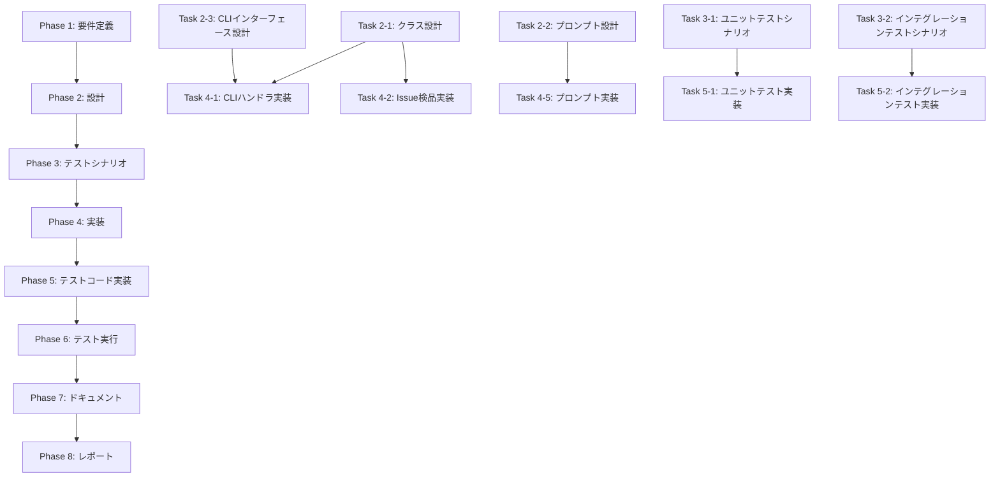

# プロジェクト計画書

## Issue概要

- **Issue番号**: #176
- **タイトル**: auto-close-issue: Issue検品と自動クローズ機能の実装
- **URL**: https://github.com/tielec/ai-workflow-agent/issues/176
- **状態**: open
- **ラベル**: enhancement

## 1. Issue分析

### 複雑度評価: 中程度

**判定根拠**:
- 既存の `auto-issue` コマンドのパターンを活用できるため、ゼロからの実装ではない
- エージェントベース検品という新規機能が必要だが、既存のエージェント連携ロジック（`AgentExecutor`, `RepositoryAnalyzer`等）を参考にできる
- 複数のフィルタカテゴリとエージェント判定ロジックの統合により、中程度の複雑性を持つ
- GitHub API連携、Issue情報取得、関連PR情報の収集が必要

### 見積もり工数: 10~14時間

**根拠**:
- Phase 1 (要件定義): 1.5~2時間
- Phase 2 (設計): 2~3時間
- Phase 3 (テストシナリオ): 1~1.5時間
- Phase 4 (実装): 3~4時間
- Phase 5 (テストコード実装): 1~1.5時間
- Phase 6 (テスト実行): 0.5~1時間
- Phase 7 (ドキュメント): 0.5~1時間
- Phase 8 (レポート): 0.5~1時間

**主な工数要因**:
- エージェント検品ロジックの実装（`IssueInspector` クラス）
- プロンプト設計（`inspect-issue.txt`）
- CLIオプションパース（4つのカテゴリとフィルタリング条件）
- GitHub API連携（Issue情報、コメント履歴、関連PR情報の取得）
- 構造化出力のパースとバリデーション

### リスク評価: 中

**理由**:
- エージェント判定の精度が要件（`confidence` 閾値）に依存するため、プロンプト設計の品質が重要
- 既存Issueの誤クローズを防ぐための安全機能（`needs_discussion`, ラベルフィルタ、最近更新除外）が必要
- GitHub APIレート制限（最大100件のIssue取得）に注意が必要
- エージェントの出力が期待するJSON形式と一致しない場合のエラーハンドリング

## 2. 実装戦略判断

### 実装戦略: **EXTEND**

**判断根拠**:
- 既存の `auto-issue` コマンド（`src/commands/auto-issue.ts`）のアーキテクチャを参考にできる
- 既存のエージェント連携インフラ（`AgentExecutor`, `setupAgentClients`, `resolveAgentCredentials`）を再利用
- 既存のGitHub API連携（`src/core/github/issue-client.ts`）を拡張してIssue検品機能を追加
- 新規コマンド（`auto-close-issue`）を追加するが、全体のアーキテクチャは既存パターンに沿う
- プロンプトテンプレート、エージェント実行ロジック、CLIオプションパースは既存パターンを継承

### テスト戦略: **UNIT_INTEGRATION**

**判断根拠**:
- **ユニットテスト（UNIT）**が必要な理由:
  - CLIオプションパース（`parseOptions`）のロジック検証
  - カテゴリフィルタリング条件の検証（`followup`, `stale`, `old`, `all`）
  - エージェント出力のJSONパース処理
  - `confidence` 閾値によるフィルタリングロジック
  - Issue除外ロジック（ラベルフィルタ、最近更新除外）

- **インテグレーションテスト（INTEGRATION）**が必要な理由:
  - GitHub API連携（Issue情報取得、クローズ、コメント投稿）
  - エージェント（Codex/Claude）との実際の統合
  - `IssueInspector` と GitHub API の連携フロー
  - `--dry-run` モードの動作確認
  - エンドツーエンドのコマンド実行フロー

- **BDDテストは不要**:
  - ユーザー向けのインタラクティブな機能ではなく、CLIコマンドベースの自動化ツール
  - ユーザーストーリーよりも機能仕様とエッジケースのテストが重要

### テストコード戦略: **CREATE_TEST**

**判断根拠**:
- 新規コマンド（`auto-close-issue`）の追加のため、新規テストファイルが必要
- 既存の `auto-issue.test.ts` と類似の構造を持つが、独立したテストファイルとして作成
- 以下の新規テストファイルを作成:
  - `tests/unit/commands/auto-close-issue.test.ts` - CLIオプションパース、フィルタリングロジック
  - `tests/unit/core/issue-inspector.test.ts` - Issue検品ロジック、エージェント出力パース
  - `tests/integration/auto-close-issue.test.ts` - エンドツーエンドの統合テスト

## 3. 影響範囲分析

### 既存コードへの影響

#### 変更が必要なファイル

1. **`src/main.ts`** (軽微な変更)
   - 新規コマンド `auto-close-issue` の追加
   - CLIオプション定義の追加

2. **`src/core/github/issue-client.ts`** (軽微な拡張)
   - Issue情報取得メソッドの追加（コメント履歴、関連PR情報を含む）
   - 既存メソッドは変更なし、新規メソッドのみ追加

#### 新規作成ファイル

1. **`src/commands/auto-close-issue.ts`** (新規作成)
   - CLIコマンドハンドラ
   - `auto-issue.ts` のパターンを参考に実装

2. **`src/core/issue-inspector.ts`** (新規作成)
   - Issue検品ロジック
   - エージェントによるIssue分析機能
   - 構造化出力パース

3. **`src/prompts/auto-close/inspect-issue.txt`** (新規作成)
   - エージェント用プロンプトテンプレート

4. **`src/types/auto-close-issue.ts`** (新規作成)
   - CLIオプション型定義
   - エージェント出力型定義（`InspectionResult`）
   - フィルタカテゴリ型定義

5. **テストファイル群** (新規作成)
   - `tests/unit/commands/auto-close-issue.test.ts`
   - `tests/unit/core/issue-inspector.test.ts`
   - `tests/integration/auto-close-issue.test.ts`

### 依存関係の変更

#### 新規依存の追加

なし（既存の依存パッケージで対応可能）

#### 既存依存の変更

なし

### マイグレーション要否

#### データベーススキーマ変更

なし（このプロジェクトはデータベースを使用していない）

#### 設定ファイル変更

なし（環境変数も新規追加不要、既存の `GITHUB_TOKEN`, `GITHUB_REPOSITORY`, `CODEX_API_KEY`, `CLAUDE_CODE_CREDENTIALS_PATH` を使用）

## 4. タスク分割

### Phase 1: 要件定義 (見積もり: 1.5~2h)

- [x] Task 1-1: 機能要件の整理 (0.5~1h)
  - Issue検品の4つの観点（対応状況、重要度・緊急度、関連性、クローズのリスク）を明確化
  - フィルタカテゴリ（`followup`, `stale`, `old`, `all`）の詳細仕様
  - エージェント出力形式（JSON schema）の定義
  - 安全機能（`confidence` 閾値、ラベルフィルタ、最近更新除外）の仕様

- [x] Task 1-2: ユーザーストーリーとユースケースの作成 (0.5~0.5h)
  - パターン1: FOLLOW-UP Issueの自動クローズ
  - パターン2: 長期間放置されたIssueの検品
  - パターン3: dry-runモードでのプレビュー
  - パターン4: 対話的確認モード（`--require-approval`）

- [x] Task 1-3: 受け入れ基準の定義 (0.5~0.5h)
  - エージェント判定の精度（`confidence >= 0.7` で推奨クローズ）
  - フィルタリング精度（誤クローズ率 < 5%）
  - パフォーマンス（100件のIssue処理 < 5分）
  - dry-runモードでの動作確認

### Phase 2: 設計 (見積もり: 2~3h)

- [x] Task 2-1: クラス設計 (0.5~1h)
  - `IssueInspector` クラスの設計（エージェントベース検品）
  - `IssueFilterService` クラスの設計（カテゴリフィルタリング）
  - `auto-issue.ts` のパターンを参考に、既存クラス（`AgentExecutor`, `GitHubClient`）との連携方針

- [x] Task 2-2: プロンプト設計 (0.5~1h)
  - `inspect-issue.txt` プロンプトテンプレート設計
  - エージェントへ提供する情報（Issue情報、関連情報、コードベース情報）の形式
  - 構造化出力（JSON）の要求形式
  - 判定基準の明示的な記載

- [x] Task 2-3: CLIインターフェース設計 (0.5~0.5h)
  - コマンド引数仕様（`--category`, `--limit`, `--dry-run`, `--confidence-threshold`, `--days-threshold`, `--require-approval`, `--exclude-labels`, `--agent`）
  - デフォルト値の決定（category: `followup`, limit: `10`, dryRun: `true`, confidence: `0.7`, days: `90`, agent: `auto`）
  - ヘルプメッセージとエラーメッセージ

- [x] Task 2-4: データフロー設計 (0.5~0.5h)
  - GitHub Issue取得 → カテゴリフィルタ → エージェント検品 → クローズ判定 → 実行/dry-run
  - エラーハンドリングフロー（エージェント失敗、GitHub APIエラー、JSON parse エラー）
  - ログ出力設計（進捗状況、判定結果、エラー情報）

### Phase 3: テストシナリオ (見積もり: 1~1.5h)

- [x] Task 3-1: ユニットテストシナリオ作成 (0.5~0.5h)
  - CLIオプションパースのテストケース（正常系、異常系、境界値）
  - カテゴリフィルタリングロジックのテストケース
  - エージェント出力JSONパースのテストケース
  - `confidence` 閾値フィルタリングのテストケース

- [x] Task 3-2: インテグレーションテストシナリオ作成 (0.5~1h)
  - GitHub API連携のテストケース（モック使用）
  - エージェント実行のテストケース（モック使用）
  - エンドツーエンドのコマンド実行テストケース
  - dry-runモードのテストケース
  - エラーケースのテストケース（エージェント失敗、GitHub APIエラー）

### Phase 4: 実装 (見積もり: 3~4h)

- [x] Task 4-1: CLIコマンドハンドラの実装 (0.5~1h)
  - [x] `src/commands/auto-close-issue.ts` の新規作成
  - [x] `handleAutoCloseIssueCommand` 関数の実装
  - [x] CLIオプションパース（`parseOptions`）
  - [x] 既存の `auto-issue.ts` のパターンを参考に実装

- [x] Task 4-2: Issue検品ロジックの実装 (1~1.5h)
  - [x] `src/core/issue-inspector.ts` の新規作成
  - [x] `IssueInspector` クラスの実装
  - [x] エージェント実行ロジック（プロンプトテンプレート読み込み、変数置換、実行）
  - [x] 構造化出力のJSONパース
  - [x] `confidence` 閾値によるフィルタリング

- [x] Task 4-3: カテゴリフィルタリングロジックの実装 (0.5~0.5h)
  - [x] カテゴリフィルタリング関数の実装（`auto-close-issue.ts` 内に統合）
  - [x] `followup` フィルタ（タイトルが `[FOLLOW-UP]` で始まる）
  - [x] `stale` フィルタ（最終更新から90日以上）
  - [x] `old` フィルタ（作成から180日以上）
  - [x] `all` フィルタ（制限なし）

- [x] Task 4-4: GitHub API連携の実装 (0.5~0.5h)
  - [x] `src/core/github/issue-client.ts` の拡張
  - [x] Issue一覧取得メソッド（getIssues）の追加
  - [x] Issue詳細情報取得メソッド（getIssueDetails）の追加
  - [x] Issueクローズメソッド（closeIssue）の追加
  - [x] ラベル付与メソッド（addLabels）の追加
  - [x] クローズコメント投稿（既存の `postComment` を活用）

- [x] Task 4-5: プロンプトテンプレートの実装 (0.5~0.5h)
  - [x] `src/prompts/auto-close/inspect-issue.txt` の作成
  - [x] 変数プレースホルダー（`{issue_info}`, `{related_info}`, `{codebase_info}`）
  - [x] 判定基準の明示
  - [x] JSON形式の出力要求

- [x] Task 4-6: src/main.ts への統合 (完了)
  - [x] `auto-close-issue` コマンド登録
  - [x] CLIオプション定義（category, limit, dry-run, confidence-threshold, days-threshold, require-approval, exclude-labels, agent）

### Phase 5: テストコード実装 (見積もり: 1~1.5h)

- [x] Task 5-1: ユニットテストの実装 (0.5~1h)
  - `tests/unit/commands/auto-close-issue.test.ts` の作成
  - CLIオプションパースのテスト（`parseOptions`）
  - カテゴリフィルタリングのテスト
  - エージェント出力パースのテスト
  - `tests/unit/core/issue-inspector.test.ts` の作成

- [x] Task 5-2: インテグレーションテストの実装 (0.5~0.5h)
  - `tests/integration/auto-close-issue.test.ts` の作成
  - GitHub API連携のテスト（モック使用）
  - エージェント実行のテスト（モック使用）
  - エンドツーエンドのコマンド実行テスト

### Phase 6: テスト実行 (見積もり: 0.5~1h)

- [x] Task 6-1: ユニットテストの実行と修正 (0.25~0.5h)
  - `npm run test:unit` の実行
  - 失敗したテストの修正
  - カバレッジ確認（目標: 80%以上）

- [x] Task 6-2: インテグレーションテストの実行と修正 (0.25~0.5h)
  - `npm run test:integration` の実行
  - 失敗したテストの修正
  - エンドツーエンドの動作確認

### Phase 7: ドキュメント (見積もり: 0.5~1h)

- [ ] Task 7-1: README.mdの更新 (0.25~0.5h)
  - `auto-close-issue` コマンドの説明追加
  - CLIオプションの説明
  - 使用例の追加

- [ ] Task 7-2: CLAUDE.mdの更新 (0.25~0.5h)
  - `auto-close-issue` コマンドの概要追加
  - 関連モジュールの説明
  - Issue #176 への参照追加

### Phase 8: レポート (見積もり: 0.5~1h)

- [ ] Task 8-1: 完了レポートの作成 (0.5~1h)
  - 実装内容のサマリー
  - テスト結果の報告
  - 既知の制限事項・今後の改善案
  - PR本文の作成

## 5. 依存関係

### クリティカルパス

1. Phase 1 (要件定義) → Phase 2 (設計) → Phase 4 (実装)
2. Task 2-2 (プロンプト設計) → Task 4-5 (プロンプト実装) - プロンプトの品質がエージェント判定精度に直結

### 並行実行可能なタスク

- Phase 4 (実装) の Task 4-1, 4-2, 4-3 は一部並行実行可能
- Phase 5 (テストコード実装) の Task 5-1, 5-2 は並行実行可能

## 6. リスクと軽減策

### リスク1: エージェント判定の精度不足

- **影響度**: 高
- **確率**: 中
- **軽減策**:
  - プロンプト設計に十分な時間を割く（Phase 2 Task 2-2）
  - 判定基準を明示的に記載（4つの観点を詳細に説明）
  - `confidence` 閾値によるフィルタリング（デフォルト: 0.7）
  - dry-runモードで事前検証を推奨
  - `needs_discussion` 推奨を積極的に活用

### リスク2: 既存Issueの誤クローズ

- **影響度**: 高
- **確率**: 低
- **軽減策**:
  - 多層防御の安全機能
    - `confidence` 閾値（デフォルト: 0.7）
    - 特定ラベル除外（`do-not-close`, `pinned`）
    - 最近更新除外（7日以内）
    - デフォルトで dry-run モード有効
  - `--require-approval` オプションで対話的確認
  - クローズ時に詳細なコメント投稿（理由を明記）
  - クローズ履歴のログ記録

### リスク3: GitHub APIレート制限

- **影響度**: 中
- **確率**: 中（大量のIssue処理時）
- **軽減策**:
  - `--limit` オプションでバッチサイズを制限（デフォルト: 10）
  - レート制限エラーのハンドリング
  - 必要に応じてリトライロジック（既存の `RemoteManager` パターンを参考）
  - ログに処理進捗を表示（例: "Processing 5/100 issues..."）

### リスク4: エージェント出力のJSONパースエラー

- **影響度**: 中
- **確率**: 中（エージェントの出力が期待形式と異なる場合）
- **軽減策**:
  - 厳格なJSONスキーマバリデーション
  - エラー時のフォールバック処理（該当Issueをスキップ、警告ログ出力）
  - エージェント出力の例を詳細にプロンプトに記載
  - パース失敗時は `recommendation: "needs_discussion"` として扱う

### リスク5: コードベース情報の取得失敗

- **影響度**: 低
- **確率**: 中（大規模リポジトリ、バイナリファイル等）
- **軽減策**:
  - ファイル存在確認のみで詳細な差分は取得しない（Phase 1 MVP範囲外）
  - エラー時は該当情報を省略して検品を継続
  - Phase 2 (精度向上フェーズ) で改善

## 7. 品質ゲート

### Phase 1: 要件定義

- [ ] 機能要件が明確に記載されている
- [ ] 4つの観点（対応状況、重要度・緊急度、関連性、クローズのリスク）が定義されている
- [ ] フィルタカテゴリ仕様が明確である
- [ ] エージェント出力形式（JSON schema）が定義されている
- [ ] 受け入れ基準が定義されている

### Phase 2: 設計

- [ ] 実装戦略の判断根拠が明記されている（EXTEND）
- [ ] テスト戦略の判断根拠が明記されている（UNIT_INTEGRATION）
- [ ] テストコード戦略の判断根拠が明記されている（CREATE_TEST）
- [ ] クラス設計が完了している（`IssueInspector`）
- [ ] プロンプト設計が完了している（`inspect-issue.txt`）
- [ ] CLIインターフェース設計が完了している
- [ ] データフロー設計が完了している

### Phase 3: テストシナリオ

- [x] ユニットテストシナリオが網羅的である（正常系、異常系、境界値）
- [x] インテグレーションテストシナリオが網羅的である
- [x] エッジケースが考慮されている
- [x] テストカバレッジ目標が設定されている（80%以上）

### Phase 4: 実装

- [x] すべてのタスクが完了している
- [x] コードが既存のコーディング規約に従っている
- [x] ESLintエラーがない
- [x] TypeScriptコンパイルエラーがない（実装ログに記載あり）
- [x] プロンプトテンプレートが作成されている
- [x] CLIオプションが正しく動作する
- [x] Phase 2の設計に沿った実装である
- [x] 基本的なエラーハンドリングがある

### Phase 5: テストコード実装

- [x] ユニットテストが実装されている
- [x] インテグレーションテストが実装されている
- [x] テストが既存のテストパターンに従っている（Jest、モック使用）

### Phase 6: テスト実行

- [ ] Task 6-1: ユニットテストの実行と修正 (0.25~0.5h)
  - [x] `npm run test:unit` の実行
  - [ ] 失敗したテストの修正（ESMモジュールエラー - Phase 5に差し戻し必要）
  - [ ] カバレッジ確認（目標: 80%以上）（テスト実行失敗のため確認不可）

- [ ] Task 6-2: インテグレーションテストの実行と修正 (0.25~0.5h)
  - [x] `npm run test:integration` の実行
  - [ ] 失敗したテストの修正（ESMモジュールエラー - Phase 5に差し戻し必要）
  - [ ] エンドツーエンドの動作確認（テスト実行失敗のため確認不可）

### Phase 7: ドキュメント

- [ ] README.mdが更新されている
- [ ] CLAUDE.mdが更新されている
- [ ] コマンドの使用例が記載されている
- [ ] CLIオプションの説明が記載されている

### Phase 8: レポート

- [ ] 完了レポートが作成されている
- [ ] テスト結果が報告されている
- [ ] 既知の制限事項が記載されている
- [ ] PR本文が作成されている

## 8. 実装の詳細方針

### エージェント検品の実装方針

1. **プロンプト設計の重要性**
   - 4つの判定観点（対応状況、重要度・緊急度、関連性、クローズのリスク）を明示
   - JSON形式の出力例を詳細に記載
   - `confidence` スコアの算出方法を説明

2. **構造化出力のパース**
   - JSON schemaバリデーション（Zod等のスキーマライブラリを検討）
   - エラー時のフォールバック処理（スキップして次のIssueへ）

3. **安全機能の多層防御**
   - ラベルフィルタ（`do-not-close`, `pinned`）
   - 最近更新除外（7日以内）
   - `confidence` 閾値（デフォルト: 0.7）
   - デフォルトで dry-run 有効

### GitHub API連携の実装方針

1. **既存の `IssueClient` を拡張**
   - コメント履歴取得メソッドの追加
   - 関連PR情報取得メソッドの追加（Phase 2で実装予定）

2. **レート制限対策**
   - バッチサイズ制限（`--limit` オプション）
   - エラーハンドリング

### CLIオプションの実装方針

1. **既存の `auto-issue.ts` のパターンを踏襲**
   - `parseOptions` 関数でバリデーション
   - デフォルト値の適用
   - エラーメッセージの統一

2. **dry-runモードをデフォルトで有効**
   - 誤クローズを防ぐため

## 9. Phase 2以降の拡張計画（参考）

本Issue（#176）ではPhase 1（MVP）のみを実装し、Phase 2以降は別Issueとして扱います。

### Phase 2: 精度向上（別Issue）

- コードベース分析の強化（関連ファイルの差分確認）
- 関連PR情報の取得と分析
- コメント履歴の分析

### Phase 3: 運用機能（別Issue）

- 定期実行スケジューラ（GitHub Actions連携）
- レポート生成機能
- Slack/Teams通知連携

## 10. 成功基準

- [ ] `auto-close-issue` コマンドが正常に動作する
- [ ] 4つのカテゴリフィルタ（`followup`, `stale`, `old`, `all`）が正しく機能する
- [ ] エージェント検品が期待通りの精度で動作する（`confidence >= 0.7` で推奨クローズ）
- [ ] 安全機能（ラベルフィルタ、最近更新除外、`confidence` 閾値）が正しく機能する
- [ ] dry-runモードで誤クローズが発生しない
- [ ] すべてのテストが成功する（カバレッジ80%以上）
- [ ] ドキュメントが更新されている

## 11. 参考情報

### 既存の類似実装

- `src/commands/auto-issue.ts` - CLIコマンドハンドラのパターン
- `src/core/repository-analyzer.ts` - エージェント分析のパターン
- `src/core/issue-generator.ts` - Issue生成のパターン
- `src/core/issue-deduplicator.ts` - 重複検出のパターン（今回は使用しない）

### 関連Issue

- Issue #121: auto-issue コマンド基盤
- Issue #174: FOLLOW-UP Issue生成をエージェントベースに拡張

### 関連ドキュメント

- `CLAUDE.md` - プロジェクト全体方針
- `ARCHITECTURE.md` - アーキテクチャ設計思想
- `README.md` - プロジェクト概要

---

**計画書作成日**: 2025-01-30
**見積もり総工数**: 10~14時間
**実装戦略**: EXTEND
**テスト戦略**: UNIT_INTEGRATION
**テストコード戦略**: CREATE_TEST
