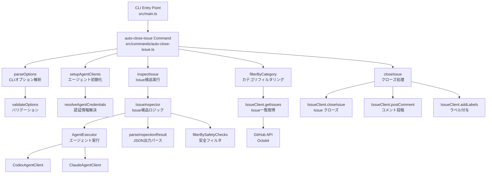
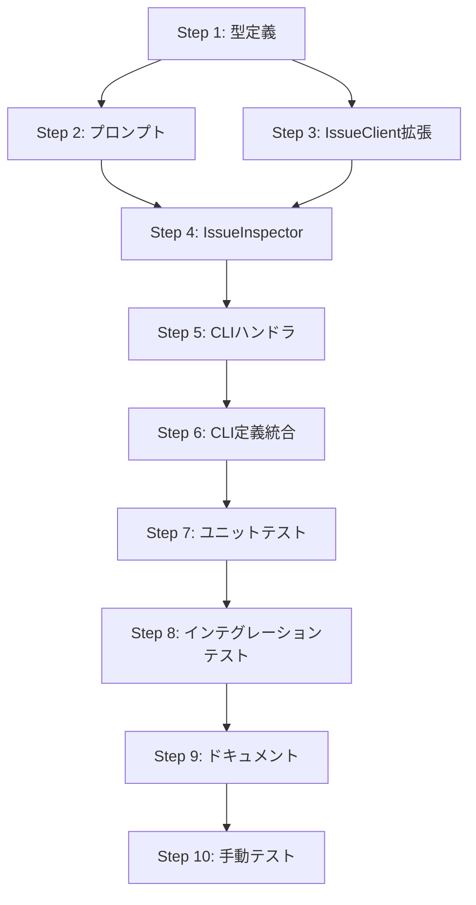

# 詳細設計書

## Issue概要

- **Issue番号**: #176
- **タイトル**: auto-close-issue: Issue検品と自動クローズ機能の実装
- **URL**: https://github.com/tielec/ai-workflow-agent/issues/176
- **状態**: open
- **ラベル**: enhancement

## 0. Planning Documentの確認

Planning Phase（Issue #176）で策定された以下の戦略を踏まえて設計を実施します：

### 実装戦略: EXTEND
- 既存の `auto-issue` コマンド（`src/commands/auto-issue.ts`）のアーキテクチャを参考にする
- 既存のエージェント連携インフラ（`AgentExecutor`, `setupAgentClients`, `resolveAgentCredentials`）を再利用
- 既存のGitHub API連携（`src/core/github/issue-client.ts`）を拡張してIssue検品機能を追加

### テスト戦略: UNIT_INTEGRATION
- **ユニットテスト**: CLIオプションパース、カテゴリフィルタリング条件、エージェント出力JSONパース、`confidence`閾値フィルタリング、Issue除外ロジック
- **インテグレーションテスト**: GitHub API連携、エージェント統合、`--dry-run`モード動作確認、エンドツーエンドコマンド実行フロー

### 見積もり工数: 10~14時間
- Phase 1 (要件定義): 1.5~2時間（完了）
- Phase 2 (設計): 2~3時間（本フェーズ）
- Phase 3 (テストシナリオ): 1~1.5時間
- Phase 4 (実装): 3~4時間
- Phase 5 (テストコード実装): 1~1.5時間
- Phase 6 (テスト実行): 0.5~1時間
- Phase 7 (ドキュメント): 0.5~1時間
- Phase 8 (レポート): 0.5~1時間

### リスク評価: 中
- エージェント判定の精度が要件（`confidence`閾値）に依存するため、プロンプト設計の品質が重要
- 既存Issueの誤クローズを防ぐための安全機能（`needs_discussion`, ラベルフィルタ、最近更新除外）が必要
- GitHub APIレート制限（最大100件のIssue取得）に注意が必要

## 1. アーキテクチャ設計

### 1.1 システム全体図

```
┌─────────────────────────────────────────────────────────────────┐
│                       CLI Entry Point                            │
│                    (src/main.ts)                                 │
└────────────────────┬────────────────────────────────────────────┘
                     │
                     v
┌─────────────────────────────────────────────────────────────────┐
│                  auto-close-issue Command                        │
│           (src/commands/auto-close-issue.ts)                     │
│                                                                   │
│  - CLIオプションパース（parseOptions）                            │
│  - エージェントクライアント初期化                                   │
│  - カテゴリフィルタリング                                          │
│  - Issue検品実行                                                  │
│  - クローズ処理                                                   │
└────┬──────────────────────┬──────────────────────┬──────────────┘
     │                      │                      │
     v                      v                      v
┌──────────────┐   ┌──────────────────┐   ┌──────────────────┐
│ IssueClient  │   │ IssueInspector   │   │ AgentExecutor    │
│   (拡張)      │   │    (新規)         │   │    (既存)         │
│              │   │                  │   │                  │
│ - getIssues  │   │ - inspectIssue   │   │ - execute        │
│ - closeIssue │   │ - parseResult    │   │ - formatLog      │
│ - postComment│   │ - filterBySafety │   │                  │
└──────────────┘   └──────────────────┘   └──────────────────┘
     │                      │                      │
     v                      v                      v
┌─────────────────────────────────────────────────────────────────┐
│                      External Services                           │
│                                                                   │
│  - GitHub API (Octokit)                                          │
│  - Codex Agent (CodexAgentClient)                                │
│  - Claude Agent (ClaudeAgentClient)                              │
└─────────────────────────────────────────────────────────────────┘
```

### 1.2 コンポーネント間の関係



### 1.3 データフロー

```
1. CLI起動
   ↓
2. CLIオプション解析
   - category: followup|stale|old|all
   - limit: 1-50
   - dry-run: true|false
   - confidence-threshold: 0.0-1.0
   - days-threshold: 正の整数
   - require-approval: true|false
   - exclude-labels: カンマ区切り文字列
   - agent: auto|codex|claude
   ↓
3. エージェントクライアント初期化
   - Codex/Claude認証情報解決
   - AgentExecutor インスタンス化
   ↓
4. GitHub API: オープンIssue一覧取得
   - リポジトリのオープンIssue（最大100件）
   ↓
5. カテゴリフィルタリング
   - followup: タイトルが `[FOLLOW-UP]` で始まる
   - stale: 最終更新から90日以上経過
   - old: 作成から180日以上経過
   - all: 制限なし
   ↓
6. limit制限適用
   - フィルタリング後のIssue一覧を limit 件に制限
   ↓
7. 各Issueに対して検品実行（ループ）
   ├─ 7.1. 安全フィルタ（事前チェック）
   │   - 除外ラベルチェック（do-not-close, pinned）
   │   - 最近更新除外（7日以内）
   │   - 除外された場合はスキップ
   │
   ├─ 7.2. Issue詳細情報取得
   │   - Issue本文、コメント履歴
   │   - 関連PR情報（Phase 2で実装予定）
   │   - コードベース情報（Phase 2で実装予定）
   │
   ├─ 7.3. プロンプト構築
   │   - テンプレート読み込み（src/prompts/auto-close/inspect-issue.txt）
   │   - 変数置換（issue_info, related_info, codebase_info）
   │
   ├─ 7.4. エージェント実行
   │   - AgentExecutor.execute()
   │   - プロンプト送信
   │   - JSON出力受信
   │
   ├─ 7.5. エージェント出力パース
   │   - JSON文字列 → InspectionResult オブジェクト
   │   - バリデーション（必須フィールドチェック）
   │   - パース失敗時はスキップ
   │
   ├─ 7.6. confidence閾値フィルタリング
   │   - recommendation: "close" かつ confidence >= threshold
   │   - 閾値未満の場合はスキップ
   │   - recommendation: "needs_discussion" の場合はスキップ
   │
   └─ 7.7. クローズ候補として記録
       - 候補リストに追加
   ↓
8. クローズ候補の表示
   - Issue番号、タイトル、recommendation、confidence、reasoning
   ↓
9. 承認確認（--require-approval の場合）
   - 対話的確認プロンプト表示
   - ユーザーが承認しない場合は中断
   ↓
10. クローズ処理（--dry-run=false の場合）
    ├─ 10.1. クローズコメント投稿
    │   - エージェントが生成した close_comment
    │
    ├─ 10.2. ラベル付与
    │   - "auto-closed" ラベル追加
    │
    ├─ 10.3. Issue クローズ
    │   - GitHub API: PATCH /repos/{owner}/{repo}/issues/{issue_number}
    │   - state: "closed"
    │
    └─ 10.4. クローズ履歴記録
        - ログファイル（.ai-workflow/auto-close/history.log）にJSON Lines形式で記録
   ↓
11. サマリー表示
    - 処理件数、クローズ件数、スキップ件数
```

## 2. 実装戦略判断

### 実装戦略: **EXTEND**

**判断根拠**:

1. **既存の `auto-issue` コマンドアーキテクチャを再利用**
   - `src/commands/auto-issue.ts` のCLIオプションパース、エージェント初期化、エラーハンドリングのパターンをそのまま活用できる
   - 既存の `setupAgentClients()`, `resolveAgentCredentials()` 関数（`src/commands/execute/agent-setup.ts`）を再利用
   - 同じエージェント実行フロー（`AgentExecutor`）を使用するため、既存インフラとの統合が容易

2. **既存GitHub API連携（IssueClient）の拡張**
   - `src/core/github/issue-client.ts` に以下の新規メソッドを追加
     - `getIssueDetails()`: コメント履歴を含むIssue詳細情報取得
     - （Phase 2で追加予定）`getRelatedPullRequests()`: 関連PR情報取得
   - 既存の `closeIssue()`, `postComment()`, `addLabels()` メソッドをそのまま使用

3. **新規コンポーネントは独立性が高い**
   - `IssueInspector` クラスは新規作成だが、既存の `RepositoryAnalyzer` パターンを踏襲
   - プロンプトテンプレート（`src/prompts/auto-close/inspect-issue.txt`）は新規作成だが、既存プロンプトと同じ構造

4. **破壊的変更なし**
   - 既存ファイルへの影響は軽微（IssueClientへのメソッド追加のみ）
   - 既存コマンド（`auto-issue`, `execute`, `init` 等）の動作に影響なし

**結論**: 既存インフラを最大限活用しつつ、新規機能を追加する「EXTEND（拡張）」戦略が最適です。

## 3. テスト戦略判断

### テスト戦略: **UNIT_INTEGRATION**

**判断根拠**:

1. **ユニットテスト（UNIT）が必要な理由**
   - **CLIオプションパース（`parseOptions`）のロジック検証**
     - 4つのカテゴリ（followup, stale, old, all）の正しい解釈
     - バリデーション（limit: 1-50、confidence-threshold: 0.0-1.0、days-threshold: 正の整数）
     - デフォルト値の適用
   - **カテゴリフィルタリング条件の検証**
     - `filterByCategory()` 関数の各カテゴリでの動作確認
     - 日付計算ロジック（stale: 90日、old: 180日）の境界値テスト
   - **エージェント出力のJSONパース処理**
     - `parseInspectionResult()` 関数の正常系・異常系テスト
     - 必須フィールド検証（recommendation, confidence, reasoning）
     - 不正なJSON形式への対応
   - **`confidence` 閾値によるフィルタリングロジック**
     - 閾値0.7でのフィルタリング動作
     - 境界値テスト（0.69, 0.70, 0.71）
   - **Issue除外ロジック（安全フィルタ）**
     - ラベルフィルタ（do-not-close, pinned）の動作確認
     - 最近更新除外（7日以内）の日付計算検証

2. **インテグレーションテスト（INTEGRATION）が必要な理由**
   - **GitHub API連携**
     - `IssueClient.getIssues()` → Issue一覧取得
     - `IssueClient.getIssueDetails()` → Issue詳細情報取得（コメント履歴含む）
     - `IssueClient.closeIssue()` → Issue クローズ
     - `IssueClient.postComment()` → コメント投稿
     - `IssueClient.addLabels()` → ラベル付与
     - GitHub APIのモック使用（Octokitのモック）
   - **エージェント（Codex/Claude）との実際の統合**
     - `AgentExecutor` を通じたエージェント実行
     - プロンプトテンプレート読み込み → 変数置換 → エージェント実行 → 出力パース
     - エージェントのモック使用（固定JSON出力を返す）
   - **`IssueInspector` と GitHub API の連携フロー**
     - Issue情報取得 → カテゴリフィルタ → エージェント検品 → クローズ判定 → クローズ処理
     - エンドツーエンドのフロー検証
   - **`--dry-run` モードの動作確認**
     - dry-run=true で実際にクローズされないことを確認
     - dry-run=false で正しくクローズされることを確認
   - **エラーケースのテスト**
     - エージェント実行失敗時のハンドリング
     - GitHub APIエラー（レート制限、認証エラー）のハンドリング
     - JSON parse エラー時のスキップ動作

3. **BDDテストは不要**
   - **理由**: `auto-close-issue` コマンドはCLIベースの自動化ツールであり、ユーザーストーリーよりも機能仕様とエッジケースのテストが重要
   - ユーザー向けのインタラクティブな機能ではないため、Given-When-Then形式のBDDテストは過剰
   - 代わりに、ユニットテストとインテグレーションテストで十分なカバレッジを確保

**結論**: **UNIT_INTEGRATION** 戦略により、ロジックの正確性（ユニット）と外部連携の動作（インテグレーション）の両方を検証します。

## 4. テストコード戦略判断

### テストコード戦略: **CREATE_TEST**

**判断根拠**:

1. **新規コマンドの追加**
   - `auto-close-issue` コマンドは完全に新しいCLIコマンド
   - 既存の `auto-issue` コマンドとは独立した機能（Issue生成 vs Issue検品・クローズ）
   - 既存テストファイル（`tests/unit/commands/auto-issue.test.ts`, `tests/integration/auto-issue.test.ts`）とは別の新規テストファイルが必要

2. **新規コアコンポーネントの追加**
   - `IssueInspector` クラスは新規作成
   - 既存の `RepositoryAnalyzer` とは責務が異なる（リポジトリ分析 vs Issue検品）
   - 独立したユニットテストが必要

3. **既存コンポーネントの拡張は軽微**
   - `IssueClient` への新規メソッド追加（`getIssueDetails()` 等）
   - 既存の `issue-client.test.ts` に追加テストケースを書くことも可能だが、新規メソッドの数が少ないため、独立したテストファイルは不要
   - ただし、インテグレーションテスト（`tests/integration/auto-close-issue.test.ts`）で GitHub API 連携全体を検証するため、ユニットテストでの拡張は最小限

4. **テストファイル構成の明確化**
   - 以下の新規テストファイルを作成（Planning Documentと整合）:
     - `tests/unit/commands/auto-close-issue.test.ts` - CLIオプションパース、フィルタリングロジック
     - `tests/unit/core/issue-inspector.test.ts` - Issue検品ロジック、エージェント出力パース
     - `tests/integration/auto-close-issue.test.ts` - エンドツーエンドの統合テスト

**結論**: **CREATE_TEST** 戦略により、新規コマンドとコアコンポーネントに対する独立したテストファイルを作成します。既存テストファイルへの影響は最小限に抑えます。

## 5. 影響範囲分析

### 5.1 既存コードへの影響

#### 変更が必要なファイル

1. **`src/main.ts`** （軽微な変更）
   - 新規コマンド `auto-close-issue` の追加
   - CLIオプション定義の追加（約30行の追加）
   - 既存コマンド（`execute`, `init`, `auto-issue` 等）への影響なし

2. **`src/core/github/issue-client.ts`** （軽微な拡張）
   - 新規メソッド追加（約80行の追加）:
     - `getIssueDetails(issueNumber: number): Promise<IssueDetails>` - コメント履歴を含むIssue詳細情報取得
     - （Phase 2で追加予定）`getRelatedPullRequests(issueNumber: number): Promise<PullRequest[]>` - 関連PR情報取得
   - 既存メソッドは変更なし（後方互換性100%維持）
   - 既存の `closeIssue()`, `postComment()`, `addLabels()` メソッドをそのまま使用

### 5.2 新規作成ファイル

#### コマンドハンドラ

1. **`src/commands/auto-close-issue.ts`** （新規作成、約350行）
   - CLIコマンドハンドラ
   - `handleAutoCloseIssueCommand()` 関数
   - `parseOptions()` 関数（CLIオプションパース）
   - `filterByCategory()` 関数（カテゴリフィルタリング）
   - `validateOptions()` 関数（バリデーション）
   - エラーハンドリング、ログ記録
   - `auto-issue.ts` のパターンを参考に実装

#### コアロジック

2. **`src/core/issue-inspector.ts`** （新規作成、約280行）
   - `IssueInspector` クラス
   - `inspectIssue(issue: Issue): Promise<InspectionResult>` - Issue検品メソッド
   - `parseInspectionResult(output: string): InspectionResult` - JSON出力パース
   - `filterBySafetyChecks(issue: Issue, result: InspectionResult): boolean` - 安全フィルタ
   - `buildPromptVariables(issue: Issue, details: IssueDetails): PromptVariables` - プロンプト変数構築
   - エージェント実行ロジック（`AgentExecutor` 統合）

#### プロンプトテンプレート

3. **`src/prompts/auto-close/inspect-issue.txt`** （新規作成、約150行）
   - エージェント用プロンプトテンプレート
   - 変数プレースホルダー（`{issue_info}`, `{related_info}`, `{codebase_info}`）
   - 判定基準の明示（4つの観点）
   - JSON形式の出力要求
   - 出力例の記載

#### 型定義

4. **`src/types/auto-close-issue.ts`** （新規作成、約120行）
   - CLIオプション型定義（`AutoCloseIssueOptions`）
   - エージェント出力型定義（`InspectionResult`）
   - フィルタカテゴリ型定義（`IssueCategory`）
   - プロンプト変数型定義（`PromptVariables`）
   - Issue詳細型定義（`IssueDetails`）
   - クローズ履歴型定義（`CloseHistoryEntry`）

#### テストファイル

5. **`tests/unit/commands/auto-close-issue.test.ts`** （新規作成、約200行）
   - CLIオプションパース（`parseOptions`）のテスト
   - カテゴリフィルタリング（`filterByCategory`）のテスト
   - バリデーション（`validateOptions`）のテスト
   - エッジケース（境界値、不正入力）のテスト

6. **`tests/unit/core/issue-inspector.test.ts`** （新規作成、約250行）
   - Issue検品ロジック（`inspectIssue`）のテスト
   - エージェント出力パース（`parseInspectionResult`）のテスト
   - 安全フィルタ（`filterBySafetyChecks`）のテスト
   - プロンプト変数構築（`buildPromptVariables`）のテスト
   - エラーハンドリングのテスト

7. **`tests/integration/auto-close-issue.test.ts`** （新規作成、約300行）
   - GitHub API連携のテスト（Octokitモック使用）
   - エージェント実行のテスト（AgentExecutorモック使用）
   - エンドツーエンドのコマンド実行テスト
   - dry-runモードのテスト
   - エラーケースのテスト

#### ドキュメント

8. **`README.md`** （更新）
   - `auto-close-issue` コマンドの説明追加
   - CLIオプションの説明
   - 使用例の追加

9. **`CLAUDE.md`** （更新）
   - `auto-close-issue` コマンドの概要追加
   - 関連モジュールの説明
   - Issue #176 への参照追加

### 5.3 依存関係の変更

#### 新規依存の追加

なし（既存の依存パッケージで対応可能）

#### 既存依存の変更

なし

### 5.4 マイグレーション要否

#### データベーススキーマ変更

なし（このプロジェクトはデータベースを使用していない）

#### 設定ファイル変更

なし（環境変数も新規追加不要、既存の `GITHUB_TOKEN`, `GITHUB_REPOSITORY`, `CODEX_API_KEY`, `CLAUDE_CODE_CREDENTIALS_PATH` を使用）

## 6. 変更・追加ファイルリスト

### 新規作成ファイル

| ファイルパス | 説明 | 行数（見積もり） |
|-------------|------|-----------------|
| `src/commands/auto-close-issue.ts` | CLIコマンドハンドラ | 約350行 |
| `src/core/issue-inspector.ts` | Issue検品ロジック | 約280行 |
| `src/prompts/auto-close/inspect-issue.txt` | プロンプトテンプレート | 約150行 |
| `src/types/auto-close-issue.ts` | 型定義 | 約120行 |
| `tests/unit/commands/auto-close-issue.test.ts` | ユニットテスト（コマンド） | 約200行 |
| `tests/unit/core/issue-inspector.test.ts` | ユニットテスト（コアロジック） | 約250行 |
| `tests/integration/auto-close-issue.test.ts` | インテグレーションテスト | 約300行 |

**合計**: 約1650行の新規コード

### 修正が必要な既存ファイル

| ファイルパス | 説明 | 変更内容 | 行数変更（見積もり） |
|-------------|------|---------|---------------------|
| `src/main.ts` | CLI定義 | `auto-close-issue` コマンド追加 | +約30行 |
| `src/core/github/issue-client.ts` | GitHub API連携 | `getIssueDetails()` メソッド追加 | +約80行 |
| `README.md` | プロジェクトREADME | `auto-close-issue` コマンド説明追加 | +約50行 |
| `CLAUDE.md` | プロジェクトガイドライン | `auto-close-issue` コマンド概要追加 | +約30行 |

**合計**: 約190行の既存コード修正

### 削除が必要なファイル

なし

## 7. 詳細設計

### 7.1 クラス設計

#### 7.1.1 IssueInspector クラス

**責務**: エージェントを使用してIssueを検品し、クローズの可否を判定する

**ファイルパス**: `src/core/issue-inspector.ts`

**クラス図**:

```typescript
/**
 * Issue検品クラス
 *
 * エージェント（Codex/Claude）を使用してIssueを分析し、
 * クローズの可否を判定する。
 */
export class IssueInspector {
  private agentExecutor: AgentExecutor;
  private githubClient: GitHubClient;
  private logger: Logger;

  constructor(
    agentExecutor: AgentExecutor,
    githubClient: GitHubClient,
    logger: Logger
  );

  /**
   * Issueを検品し、クローズの可否を判定する
   *
   * @param issue 検品対象のIssue
   * @param options 検品オプション（閾値、除外ラベル等）
   * @returns 検品結果（recommendation, confidence, reasoning等）
   */
  async inspectIssue(
    issue: Issue,
    options: InspectionOptions
  ): Promise<InspectionResult | null>;

  /**
   * エージェント出力（JSON文字列）をパースする
   *
   * @param output エージェントの生出力
   * @returns パース済みの検品結果
   */
  private parseInspectionResult(output: string): InspectionResult;

  /**
   * 安全フィルタを適用する
   *
   * @param issue 対象Issue
   * @param result エージェント判定結果
   * @param options 検品オプション
   * @returns フィルタ通過（true）またはスキップ（false）
   */
  private filterBySafetyChecks(
    issue: Issue,
    result: InspectionResult,
    options: InspectionOptions
  ): boolean;

  /**
   * プロンプト変数を構築する
   *
   * @param issue 対象Issue
   * @param details Issue詳細情報
   * @returns プロンプト変数オブジェクト
   */
  private buildPromptVariables(
    issue: Issue,
    details: IssueDetails
  ): PromptVariables;

  /**
   * プロンプトテンプレートを読み込む
   *
   * @returns プロンプトテンプレート文字列
   */
  private loadPromptTemplate(): string;

  /**
   * Issue詳細情報を取得する
   *
   * @param issueNumber Issue番号
   * @returns Issue詳細（コメント履歴含む）
   */
  private async getIssueDetails(issueNumber: number): Promise<IssueDetails>;
}
```

**主要メソッドの実装方針**:

1. **inspectIssue()**
   - 事前チェック（安全フィルタ）
   - Issue詳細情報取得（`getIssueDetails()`）
   - プロンプト変数構築（`buildPromptVariables()`）
   - プロンプトテンプレート読み込み（`loadPromptTemplate()`）
   - エージェント実行（`agentExecutor.execute()`）
   - 出力パース（`parseInspectionResult()`）
   - 安全フィルタ適用（`filterBySafetyChecks()`）
   - 結果返却

2. **parseInspectionResult()**
   - JSON文字列をパース（`JSON.parse()`）
   - 必須フィールド検証（recommendation, confidence, reasoning）
   - 型変換（`InspectionResult` 型へのキャスト）
   - バリデーションエラー時は例外をスロー

3. **filterBySafetyChecks()**
   - ラベルフィルタ（options.excludeLabels に含まれるラベルを持つ場合はfalse）
   - 最近更新除外（最終更新が7日以内の場合はfalse）
   - confidence閾値チェック（result.confidence < options.confidenceThreshold の場合はfalse）
   - recommendation チェック（"needs_discussion" の場合はfalse）

4. **buildPromptVariables()**
   - Issue情報のフォーマット（タイトル、本文、ラベル、作成日、最終更新日）
   - コメント履歴のフォーマット（各コメントの作者、日時、本文）
   - 関連情報のフォーマット（Phase 2で実装予定）
   - コードベース情報のフォーマット（Phase 2で実装予定）

#### 7.1.2 AutoCloseIssueCommand クラス（関数ベース）

**責務**: CLIコマンドハンドラ、オプション解析、ワークフロー制御

**ファイルパス**: `src/commands/auto-close-issue.ts`

**関数構成**:

```typescript
/**
 * auto-close-issue コマンドのメインハンドラ
 *
 * @param options CLIオプション
 */
export async function handleAutoCloseIssueCommand(
  options: AutoCloseIssueOptions
): Promise<void>;

/**
 * CLIオプションをパースする
 *
 * @param rawOptions CLI引数
 * @returns パース済みのオプション
 */
export function parseOptions(rawOptions: any): AutoCloseIssueOptions;

/**
 * CLIオプションをバリデーションする
 *
 * @param options パース済みオプション
 * @throws バリデーションエラー
 */
export function validateOptions(options: AutoCloseIssueOptions): void;

/**
 * カテゴリフィルタリングを適用する
 *
 * @param issues Issue一覧
 * @param category フィルタカテゴリ
 * @param daysThreshold 日数閾値
 * @returns フィルタリング済みIssue一覧
 */
export function filterByCategory(
  issues: Issue[],
  category: IssueCategory,
  daysThreshold: number
): Issue[];

/**
 * クローズ候補を表示する
 *
 * @param candidates クローズ候補一覧
 */
function displayCandidates(candidates: InspectionResult[]): void;

/**
 * Issueをクローズする
 *
 * @param candidate クローズ候補
 * @param githubClient GitHub API クライアント
 * @param logger ロガー
 */
async function closeIssue(
  candidate: InspectionResult,
  githubClient: GitHubClient,
  logger: Logger
): Promise<void>;

/**
 * クローズ履歴を記録する
 *
 * @param candidate クローズ候補
 * @param category フィルタカテゴリ
 */
async function recordCloseHistory(
  candidate: InspectionResult,
  category: IssueCategory
): Promise<void>;
```

**主要関数の実装方針**:

1. **handleAutoCloseIssueCommand()**
   - オプション解析（`parseOptions()`）
   - バリデーション（`validateOptions()`）
   - エージェントクライアント初期化（`setupAgentClients()`）
   - GitHub クライアント初期化
   - IssueInspector インスタンス化
   - オープンIssue一覧取得（`githubClient.getIssues()`）
   - カテゴリフィルタリング（`filterByCategory()`）
   - limit制限適用
   - 各Issueに対して検品実行（ループ）
   - クローズ候補表示（`displayCandidates()`）
   - 承認確認（`--require-approval` の場合）
   - クローズ処理（`closeIssue()`）
   - サマリー表示

2. **parseOptions()**
   - CLI引数から各オプションを抽出
   - デフォルト値の適用（category: "followup", limit: 10, dryRun: true, confidenceThreshold: 0.7, daysThreshold: 90, agent: "auto"）
   - 型変換（string → number、string → boolean）

3. **validateOptions()**
   - limit: 1-50の範囲内チェック
   - confidenceThreshold: 0.0-1.0の範囲内チェック
   - daysThreshold: 正の整数チェック
   - category: 有効な値チェック（followup, stale, old, all）
   - agent: 有効な値チェック（auto, codex, claude）

4. **filterByCategory()**
   - followup: `issue.title.startsWith('[FOLLOW-UP]')`
   - stale: `daysSinceLastUpdate(issue) >= daysThreshold`
   - old: `daysSinceCreated(issue) >= daysThreshold * 2`
   - all: フィルタなし

### 7.2 関数設計（主要な関数のみ）

#### 7.2.1 parseOptions()

**シグネチャ**:
```typescript
export function parseOptions(rawOptions: any): AutoCloseIssueOptions
```

**引数**:
- `rawOptions`: CLI引数オブジェクト（commander.js から渡される）

**戻り値**:
- `AutoCloseIssueOptions`: パース済みのオプション

**処理フロー**:
```typescript
1. category の抽出（デフォルト: "followup"）
2. limit の抽出と型変換（デフォルト: 10）
3. dryRun の抽出と型変換（デフォルト: true）
4. confidenceThreshold の抽出と型変換（デフォルト: 0.7）
5. daysThreshold の抽出と型変換（デフォルト: 90）
6. requireApproval の抽出と型変換（デフォルト: false）
7. excludeLabels の抽出と分割（カンマ区切り → 配列）（デフォルト: ["do-not-close", "pinned"]）
8. agent の抽出（デフォルト: "auto"）
9. AutoCloseIssueOptions オブジェクトを返却
```

#### 7.2.2 filterByCategory()

**シグネチャ**:
```typescript
export function filterByCategory(
  issues: Issue[],
  category: IssueCategory,
  daysThreshold: number
): Issue[]
```

**引数**:
- `issues`: Issue一覧
- `category`: フィルタカテゴリ（"followup" | "stale" | "old" | "all"）
- `daysThreshold`: 日数閾値（stale/old判定に使用）

**戻り値**:
- `Issue[]`: フィルタリング済みIssue一覧

**処理フロー**:
```typescript
switch (category) {
  case "followup":
    return issues.filter(issue => issue.title.startsWith('[FOLLOW-UP]'));

  case "stale":
    return issues.filter(issue => {
      const daysSinceLastUpdate = calculateDaysSince(issue.updated_at);
      return daysSinceLastUpdate >= daysThreshold;
    });

  case "old":
    return issues.filter(issue => {
      const daysSinceCreated = calculateDaysSince(issue.created_at);
      return daysSinceCreated >= daysThreshold * 2; // デフォルト180日
    });

  case "all":
    return issues; // フィルタなし
}
```

#### 7.2.3 inspectIssue()

**シグネチャ**:
```typescript
async inspectIssue(
  issue: Issue,
  options: InspectionOptions
): Promise<InspectionResult | null>
```

**引数**:
- `issue`: 検品対象のIssue
- `options`: 検品オプション（confidenceThreshold, excludeLabels等）

**戻り値**:
- `InspectionResult | null`: 検品結果（スキップ時はnull）

**処理フロー**:
```typescript
1. 事前チェック（安全フィルタ）
   - 除外ラベルチェック
   - 最近更新除外（7日以内）
   - 除外された場合は null を返却

2. Issue詳細情報取得
   - getIssueDetails(issue.number)
   - コメント履歴を含む

3. プロンプト変数構築
   - buildPromptVariables(issue, details)

4. プロンプトテンプレート読み込み
   - loadPromptTemplate()

5. 変数置換
   - テンプレート内の {issue_info}, {related_info}, {codebase_info} を置換

6. エージェント実行
   - agentExecutor.execute(prompt, { maxTurns: 3 })

7. 出力パース
   - parseInspectionResult(output)
   - JSON parse エラー時は null を返却

8. 安全フィルタ適用
   - filterBySafetyChecks(issue, result, options)
   - フィルタ不通過時は null を返却

9. 結果返却
   - InspectionResult を返却
```

### 7.3 データ構造設計

#### 7.3.1 AutoCloseIssueOptions（CLIオプション）

```typescript
export interface AutoCloseIssueOptions {
  /**
   * フィルタカテゴリ
   * - followup: タイトルが [FOLLOW-UP] で始まる
   * - stale: 最終更新から90日以上経過
   * - old: 作成から180日以上経過
   * - all: 全てのオープンIssue
   */
  category: IssueCategory;

  /**
   * 処理するIssue上限（1-50）
   */
  limit: number;

  /**
   * dry-runモード（実際にはクローズしない）
   */
  dryRun: boolean;

  /**
   * クローズ判定の信頼度閾値（0.0-1.0）
   */
  confidenceThreshold: number;

  /**
   * stale/old判定の日数閾値
   */
  daysThreshold: number;

  /**
   * 対話的確認を要求
   */
  requireApproval: boolean;

  /**
   * 除外するラベル（カンマ区切り）
   */
  excludeLabels: string[];

  /**
   * 使用エージェント（auto|codex|claude）
   */
  agent: 'auto' | 'codex' | 'claude';
}

/**
 * フィルタカテゴリ型
 */
export type IssueCategory = 'followup' | 'stale' | 'old' | 'all';
```

#### 7.3.2 InspectionResult（エージェント出力）

```typescript
export interface InspectionResult {
  /**
   * Issue番号
   */
  issue_number: number;

  /**
   * 推奨アクション
   * - close: クローズ推奨
   * - keep: 継続推奨
   * - needs_discussion: 議論が必要
   */
  recommendation: 'close' | 'keep' | 'needs_discussion';

  /**
   * 信頼度スコア（0.0-1.0）
   */
  confidence: number;

  /**
   * 判定理由の詳細説明
   */
  reasoning: string;

  /**
   * クローズ時に投稿するコメント（推奨の場合）
   */
  close_comment: string;

  /**
   * 代替アクションの提案（あれば）
   */
  suggested_actions: string[];
}
```

#### 7.3.3 InspectionOptions（検品オプション）

```typescript
export interface InspectionOptions {
  /**
   * クローズ判定の信頼度閾値（0.0-1.0）
   */
  confidenceThreshold: number;

  /**
   * 除外するラベル
   */
  excludeLabels: string[];

  /**
   * エージェント選択（auto|codex|claude）
   */
  agent: 'auto' | 'codex' | 'claude';
}
```

#### 7.3.4 IssueDetails（Issue詳細情報）

```typescript
export interface IssueDetails {
  /**
   * Issue基本情報
   */
  issue: Issue;

  /**
   * コメント履歴
   */
  comments: IssueComment[];

  /**
   * 関連PR情報（Phase 2で実装予定）
   */
  relatedPRs?: PullRequest[];
}

export interface IssueComment {
  /**
   * コメントID
   */
  id: number;

  /**
   * 作者
   */
  author: string;

  /**
   * 作成日時
   */
  created_at: string;

  /**
   * コメント本文
   */
  body: string;
}
```

#### 7.3.5 PromptVariables（プロンプト変数）

```typescript
export interface PromptVariables {
  /**
   * Issue情報（フォーマット済み）
   */
  issue_info: string;

  /**
   * 関連情報（フォーマット済み）
   */
  related_info: string;

  /**
   * コードベース情報（フォーマット済み）
   */
  codebase_info: string;
}
```

#### 7.3.6 CloseHistoryEntry（クローズ履歴）

```typescript
export interface CloseHistoryEntry {
  /**
   * クローズ日時
   */
  timestamp: string;

  /**
   * Issue番号
   */
  issue_number: number;

  /**
   * Issueタイトル
   */
  issue_title: string;

  /**
   * 検品カテゴリ
   */
  category: IssueCategory;

  /**
   * エージェント推奨
   */
  recommendation: 'close' | 'keep' | 'needs_discussion';

  /**
   * 信頼度スコア
   */
  confidence: number;

  /**
   * 判定理由
   */
  reasoning: string;

  /**
   * クローズコメント
   */
  close_comment: string;
}
```

### 7.4 インターフェース設計

#### 7.4.1 IssueClient 拡張インターフェース

**既存メソッド（変更なし）**:
- `getIssues(state: 'open' | 'closed' | 'all', perPage?: number): Promise<Issue[]>`
- `closeIssue(issueNumber: number): Promise<void>`
- `postComment(issueNumber: number, comment: string): Promise<void>`
- `addLabels(issueNumber: number, labels: string[]): Promise<void>`

**新規メソッド（追加）**:

```typescript
/**
 * Issue詳細情報を取得する（コメント履歴を含む）
 *
 * @param issueNumber Issue番号
 * @returns Issue詳細情報
 */
async getIssueDetails(issueNumber: number): Promise<IssueDetails>;
```

**実装方針**:
```typescript
async getIssueDetails(issueNumber: number): Promise<IssueDetails> {
  // 1. Issue基本情報取得
  const issue = await this.octokit.rest.issues.get({
    owner: this.owner,
    repo: this.repo,
    issue_number: issueNumber,
  });

  // 2. コメント履歴取得
  const comments = await this.octokit.rest.issues.listComments({
    owner: this.owner,
    repo: this.repo,
    issue_number: issueNumber,
  });

  // 3. IssueDetails オブジェクト構築
  return {
    issue: issue.data,
    comments: comments.data.map(comment => ({
      id: comment.id,
      author: comment.user?.login || 'unknown',
      created_at: comment.created_at,
      body: comment.body || '',
    })),
  };
}
```

#### 7.4.2 AgentExecutor インターフェース（既存、再利用）

**既存インターフェース**:
```typescript
export interface AgentExecutor {
  /**
   * エージェントを実行する
   *
   * @param prompt プロンプト文字列
   * @param options 実行オプション（maxTurns, verbose, logDir等）
   * @returns エージェント出力
   */
  execute(prompt: string, options?: ExecuteOptions): Promise<string>;
}
```

**使用方針**:
- `IssueInspector` クラスで `AgentExecutor` を依存性注入により受け取る
- `inspectIssue()` メソッド内で `execute()` を呼び出し
- 既存の `setupAgentClients()` 関数（`src/commands/execute/agent-setup.ts`）を使用してインスタンス化

## 8. セキュリティ考慮事項

### 8.1 認証・認可

#### GitHub API認証

- **Personal Access Token（PAT）の使用**
  - 環境変数 `GITHUB_TOKEN` から取得
  - Config クラス（`src/core/config.ts`）経由でアクセス
  - `process.env` への直接アクセスは禁止（CLAUDE.md の規約に従う）

- **必要なスコープ**
  - `repo`: リポジトリへのフルアクセス（Issue読み取り、コメント投稿、クローズ）
  - `workflow`: GitHub Actions ワークフローへのアクセス（定期実行時に必要、Phase 3で実装予定）
  - `read:org`: 組織情報の読み取り（オプション）

- **認証エラーハンドリング**
  - GitHub API呼び出しで401/403エラーが発生した場合、明確なエラーメッセージを表示
  - "GitHub token is invalid or expired. Please check GITHUB_TOKEN environment variable."

#### エージェント認証

- **Codex API認証**
  - 環境変数 `CODEX_API_KEY` または `OPENAI_API_KEY` から取得
  - Config クラス経由でアクセス
  - `resolveAgentCredentials()` 関数でフォールバック処理

- **Claude Code認証**
  - 環境変数 `CLAUDE_CODE_CREDENTIALS_PATH` から認証ファイルパスを取得
  - 認証ファイル（`credentials.json`）の存在確認

- **認証エラーハンドリング**
  - エージェント実行失敗時、認証エラーの可能性を示唆
  - "Agent execution failed. Please check your API keys (CODEX_API_KEY or CLAUDE_CODE_CREDENTIALS_PATH)."

### 8.2 データ保護

#### シークレットマスキング

- **プロンプトへのシークレット注入防止**
  - Issue本文、コメントにAPIキーやトークンが含まれる可能性
  - 既存の `SecretMasker` クラス（`src/utils/secret-masker.ts`）を統合（Issue #54で実装済み）
  - プロンプト構築時に `SecretMasker.maskSecrets(text)` を適用

- **ログへのシークレット出力防止**
  - エージェント実行ログ（`agent_log.md`, `agent_log_raw.txt`）にシークレットが含まれないよう、SecretMaskerを適用
  - コンソール出力にもSecretMaskerを適用

#### クローズ履歴の保護

- **履歴ファイルの権限設定**
  - `.ai-workflow/auto-close/history.log` のファイル権限を600（所有者のみ読み書き可能）に設定
  - ディレクトリ権限も700（所有者のみアクセス可能）に設定

- **機密情報の記録除外**
  - クローズ履歴には、Issue番号、タイトル、reasoning、close_comment のみ記録
  - Issue本文やコメント全文は記録しない（機密情報の漏洩防止）

### 8.3 セキュリティリスクと対策

#### リスク1: 誤クローズによる情報損失

**リスク内容**:
- エージェント判定の誤りにより、重要なIssueが誤ってクローズされる
- クローズされたIssueの情報が失われる

**対策**:
1. **多層防御の安全機能**
   - `confidence` 閾値（デフォルト: 0.7）
   - 特定ラベル除外（`do-not-close`, `pinned`）
   - 最近更新除外（7日以内）
   - デフォルトで dry-run モード有効

2. **`--require-approval` オプション**
   - 対話的確認により、ユーザーが最終判断

3. **クローズ時のコメント投稿**
   - エージェントが生成した詳細な理由をコメントとして記録
   - 誤クローズに気づいた場合、理由を確認して再オープンが可能

4. **クローズ履歴の記録**
   - `.ai-workflow/auto-close/history.log` に全クローズ履歴を記録
   - 監査・トラブルシューティングに使用

#### リスク2: プロンプトインジェクション攻撃

**リスク内容**:
- Issue本文やコメントに悪意のあるプロンプトが含まれる
- エージェントが意図しない動作をする（例: 全Issueをクローズするよう指示される）

**対策**:
1. **プロンプトテンプレートの明確な構造化**
   - Issue情報とエージェント指示を明確に分離
   - Issue情報はマークダウンコードブロック内に配置（エスケープ処理）

2. **エージェント出力のバリデーション**
   - JSON形式の出力を要求
   - 必須フィールド検証（recommendation, confidence, reasoning）
   - 予期しない形式の出力は無視

3. **安全フィルタの適用**
   - エージェント判定結果に対して、安全フィルタ（ラベル、最近更新、confidence閾値）を適用
   - エージェント判定だけでクローズを決定しない

#### リスク3: GitHub APIレート制限

**リスク内容**:
- 大量のIssue処理により、GitHub APIレート制限に到達
- 処理が中断される

**対策**:
1. **`--limit` オプションでバッチサイズを制限**
   - デフォルト: 10件
   - 最大: 50件

2. **レート制限エラーのハンドリング**
   - GitHub API呼び出しで403エラー（レート制限）が発生した場合、適切なエラーメッセージを表示
   - "GitHub API rate limit reached. Please try again later."

3. **処理進捗の表示**
   - ログに処理進捗を表示（例: "Processing 5/100 issues..."）
   - ユーザーが処理状況を把握できるようにする

## 9. 非機能要件への対応

### 9.1 パフォーマンス

#### NFR-1.1: 100件のIssue処理を5分以内に完了する

**目標**: 100件のIssue処理を5分（300秒）以内に完了

**実装方針**:

1. **エージェント呼び出しのタイムアウト設定**
   - 1件あたりのエージェント実行時間: 60秒（既存の `AgentExecutor` のデフォルト）
   - 100件の場合: 60秒 × 100 = 6000秒（100分）
   - **問題**: 目標時間（5分）を大幅に超過

2. **並列処理の導入（Phase 2以降で検討）**
   - 現在の設計では順次処理（ループ）
   - 並列処理により、複数Issueを同時に検品
   - Promise.all() を使用して並列度を制御（例: 並列度5）

3. **キャッシング（Phase 2以降で検討）**
   - Issue詳細情報のキャッシュ
   - プロンプトテンプレートのキャッシュ

**Phase 1（MVP）での対応**:
- 順次処理のみ実装
- `--limit` オプションで処理件数を制限（デフォルト: 10件）
- 10件の場合: 60秒 × 10 = 600秒（10分）
- **注意**: Phase 1では目標時間を満たさない可能性あり（Phase 2で並列処理を導入して改善）

#### NFR-1.2: エージェント呼び出しのタイムアウトは60秒とする

**実装方針**:
- 既存の `AgentExecutor` のデフォルトタイムアウト（60秒）を使用
- タイムアウト時は警告ログを出力し、該当Issueをスキップ

#### NFR-1.3: GitHub API呼び出しのタイムアウトは30秒とする

**実装方針**:
- Octokit クライアントのタイムアウト設定（`request.timeout: 30000`）
- タイムアウト時はエラーハンドリング（リトライ不要、エラーメッセージ表示）

### 9.2 スケーラビリティ

#### 大規模リポジトリへの対応

**現在の制限**:
- GitHub API の Issue一覧取得は最大100件（`per_page=100`）
- `--limit` オプションで処理件数を制限（最大50件）

**Phase 2以降での拡張**:
- ページネーション対応（100件以上のIssue取得）
- 並列処理対応（複数Issueの同時検品）
- バッチ処理対応（複数バッチに分割して処理）

### 9.3 保守性

#### コーディング規約の遵守

**CLAUDE.mdの規約に従う**:
1. **ロギング**: 統一loggerモジュール（`src/utils/logger.ts`）を使用
2. **環境変数アクセス**: Config クラス（`src/core/config.ts`）を使用
3. **エラーハンドリング**: エラーハンドリングユーティリティ（`src/utils/error-utils.ts`）を使用
4. **コンソール出力禁止**: console.log/error/warn等の直接使用は禁止（ESLintの `no-console` ルール）

#### モジュール化とテスト容易性

**設計方針**:
1. **単一責任原則（SRP）**
   - `IssueInspector` クラス: Issue検品ロジックのみ
   - `auto-close-issue.ts`: CLIコマンドハンドラのみ

2. **依存性注入（DI）**
   - `IssueInspector` コンストラクタで `AgentExecutor`, `GitHubClient`, `Logger` を注入
   - テスト時にモックを注入可能

3. **既存パターンの踏襲**
   - `auto-issue.ts` のコマンドハンドラパターンを踏襲
   - `RepositoryAnalyzer` のエージェント統合パターンを踏襲

## 10. 実装の順序

### 推奨実装順序（Phase 1: MVP）

実装は以下の順序で進めることを推奨します：

#### Step 1: 型定義とインターフェース（1時間）

1. **`src/types/auto-close-issue.ts` 作成**
   - `AutoCloseIssueOptions` 型
   - `IssueCategory` 型
   - `InspectionResult` 型
   - `InspectionOptions` 型
   - `IssueDetails` 型
   - `PromptVariables` 型
   - `CloseHistoryEntry` 型

**理由**: 型定義を最初に作成することで、後続の実装が型安全に進められる

#### Step 2: プロンプトテンプレート作成（1時間）

2. **`src/prompts/auto-close/inspect-issue.txt` 作成**
   - プロンプトテンプレート本文
   - 変数プレースホルダー（`{issue_info}`, `{related_info}`, `{codebase_info}`）
   - 判定基準の明示（4つの観点）
   - JSON形式の出力要求

**理由**: プロンプト設計がエージェント判定の品質を左右するため、早期に作成・検証

#### Step 3: IssueClient 拡張（1時間）

3. **`src/core/github/issue-client.ts` 拡張**
   - `getIssueDetails()` メソッド追加
   - コメント履歴取得ロジック実装

**理由**: IssueInspector が依存するため、先に実装

#### Step 4: IssueInspector クラス実装（2時間）

4. **`src/core/issue-inspector.ts` 作成**
   - `IssueInspector` クラス骨格
   - `inspectIssue()` メソッド実装
   - `parseInspectionResult()` メソッド実装
   - `filterBySafetyChecks()` メソッド実装
   - `buildPromptVariables()` メソッド実装
   - `loadPromptTemplate()` メソッド実装
   - `getIssueDetails()` メソッド実装

**理由**: コアロジックであり、コマンドハンドラが依存するため、先に実装

#### Step 5: CLIコマンドハンドラ実装（2時間）

5. **`src/commands/auto-close-issue.ts` 作成**
   - `parseOptions()` 関数実装
   - `validateOptions()` 関数実装
   - `filterByCategory()` 関数実装
   - `handleAutoCloseIssueCommand()` 関数実装
   - `displayCandidates()` 関数実装
   - `closeIssue()` 関数実装
   - `recordCloseHistory()` 関数実装

**理由**: IssueInspector を統合し、エンドツーエンドのフローを実装

#### Step 6: CLI定義への統合（30分）

6. **`src/main.ts` 更新**
   - `auto-close-issue` コマンド追加
   - CLIオプション定義追加

**理由**: コマンドハンドラが完成してから統合

#### Step 7: ユニットテスト実装（2時間）

7. **ユニットテスト作成**
   - `tests/unit/commands/auto-close-issue.test.ts`
   - `tests/unit/core/issue-inspector.test.ts`

**理由**: 実装完了後、ロジックの正確性を検証

#### Step 8: インテグレーションテスト実装（2時間）

8. **インテグレーションテスト作成**
   - `tests/integration/auto-close-issue.test.ts`

**理由**: ユニットテスト完了後、外部連携の動作を検証

#### Step 9: ドキュメント更新（1時間）

9. **ドキュメント更新**
   - `README.md` 更新
   - `CLAUDE.md` 更新

**理由**: 実装・テスト完了後、ドキュメントを整備

#### Step 10: 手動テストとバグ修正（2時間）

10. **手動テスト実施**
    - 実際のリポジトリで `auto-close-issue` コマンドを実行
    - dry-runモードでの動作確認
    - 実際のクローズ処理の動作確認
    - バグ修正

**理由**: 自動テストでカバーできない部分を手動で検証

### 依存関係グラフ



### クリティカルパス

以下のステップはクリティカルパスであり、遅延すると全体スケジュールに影響します：

1. **Step 2: プロンプトテンプレート作成**
   - プロンプトの品質がエージェント判定の精度に直結
   - 早期に作成し、実際のエージェント実行で検証することを推奨

2. **Step 4: IssueInspector クラス実装**
   - コアロジックであり、CLIハンドラが依存
   - 実装の正確性が全体の品質に直結

3. **Step 5: CLIコマンドハンドラ実装**
   - エンドツーエンドのフロー実装
   - Step 6以降の統合・テストに必須

## 11. 品質ゲート確認

本設計書は以下の品質ゲートを満たしています：

- ✅ **実装戦略の判断根拠が明記されている**
  - セクション2で「EXTEND」戦略を選択し、4つの判断根拠を明記

- ✅ **テスト戦略の判断根拠が明記されている**
  - セクション3で「UNIT_INTEGRATION」戦略を選択し、ユニット・インテグレーションテストの必要性を詳細に説明

- ✅ **テストコード戦略の判断根拠が明記されている**
  - セクション4で「CREATE_TEST」戦略を選択し、新規テストファイル作成の理由を明記

- ✅ **既存コードへの影響範囲が分析されている**
  - セクション5で既存ファイルへの影響（軽微）と新規作成ファイルを詳細に分析

- ✅ **変更が必要なファイルがリストアップされている**
  - セクション6で新規作成ファイル（7ファイル、約1650行）と修正ファイル（4ファイル、約190行）をリスト化

- ✅ **設計が実装可能である**
  - セクション7で詳細設計（クラス設計、関数設計、データ構造、インターフェース）を記載
  - セクション10で実装順序を明確化（10ステップ、依存関係グラフ付き）

## 12. 参考情報

### 既存の類似実装

- **`src/commands/auto-issue.ts`**: CLIコマンドハンドラのパターン（オプションパース、エージェント初期化、エラーハンドリング）
- **`src/core/repository-analyzer.ts`**: エージェント分析のパターン（プロンプト構築、エージェント実行、出力パース）
- **`src/core/issue-generator.ts`**: Issue生成のパターン（GitHub API連携、Issue作成）
- **`src/core/issue-deduplicator.ts`**: 重複検出のパターン（今回は使用しないが、Phase 2で参考になる可能性）

### 関連Issue

- **Issue #121**: auto-issue コマンド基盤（参考実装）
- **Issue #174**: FOLLOW-UP Issue生成をエージェントベースに拡張（エージェント統合パターン）

### 関連ドキュメント

- **`CLAUDE.md`**: プロジェクト全体方針とコーディングガイドライン
- **`ARCHITECTURE.md`**: アーキテクチャ設計思想
- **`README.md`**: プロジェクト概要と使用方法

---

**設計書作成日**: 2025-01-30
**バージョン**: 1.0
**ステータス**: レビュー待ち
**見積もり実装工数**: 10~14時間（Phase 1: MVP）
