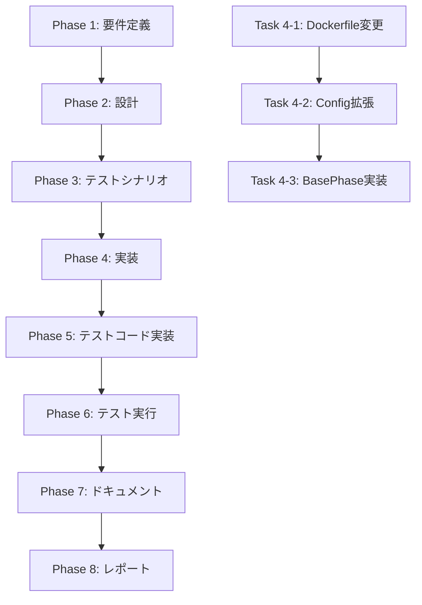

# プロジェクト計画書 - Issue #177

## 1. Issue分析

### 複雑度: 中程度

**根拠**:
- 3つのファイルの変更（Dockerfile、config.ts、base-phase.ts）
- 既存機能の拡張（Config クラスへのメソッド追加）
- 新規テストケースの追加（約10件のテストケース）
- Docker イメージの変更によるビルド・デプロイへの影響
- 軽度のアーキテクチャ変更（プロンプト生成ロジックへの環境情報注入）

### 見積もり工数: 8〜12時間

**内訳**:
- Phase 1 要件定義: 1時間（Issue情報は明確）
- Phase 2 設計: 1.5時間（Config拡張、プロンプト注入設計）
- Phase 3 テストシナリオ: 1時間（ユニットテストシナリオ策定）
- Phase 4 実装: 3〜4時間（Dockerfile、Config、BasePhase変更）
- Phase 5 テストコード実装: 1.5時間（10件のテストケース実装）
- Phase 6 テスト実行: 0.5時間（CI実行・検証）
- Phase 7 ドキュメント: 0.5時間（CLAUDE.md、README.md更新）
- Phase 8 レポート: 0.5〜1時間（PR生成、サマリー作成）

### リスク評価: 中

**根拠**:
- **Docker イメージサイズの増加**: `node:20-slim` → `ubuntu:22.04` に変更するため、イメージサイズが大幅に増加する可能性がある（100MB → 500MB+）
- **既存ワークフローへの影響**: ベースイメージ変更により、既存の依存関係に影響が出る可能性がある
- **セキュリティリスク**: `apt-get install` を許可するため、悪意のあるパッケージインストールのリスクがある（Docker内部は隔離環境なので影響は限定的）
- **ビルド時間の増加**: Ubuntu イメージのビルド時間が増加する可能性がある

---

## 2. 実装戦略判断

### 実装戦略: EXTEND

**判断根拠**:
- **既存ファイルの拡張が中心**:
  - `Dockerfile`: ベースイメージ変更、ビルドツール追加
  - `src/core/config.ts`: `IConfig` インターフェースと `Config` クラスへのメソッド追加
  - `src/phases/base-phase.ts`: `loadPrompt()` メソッドへの環境情報注入ロジック追加
- **新規ファイル作成はテストコードのみ**: 既存のテストファイル（`tests/unit/core/config.test.ts`）へのテストケース追加
- **アーキテクチャ変更なし**: 既存の Config パターン、BasePhase パターンを踏襲

### テスト戦略: UNIT_ONLY

**判断根拠**:
- **ユニットテスト中心の変更**:
  - `Config.canAgentInstallPackages()` の動作検証（環境変数パターン網羅）
  - プロンプト注入ロジックの検証（環境情報が正しく注入されるか）
- **外部システム連携なし**: Docker ビルドのみ（インテグレーションテスト不要）
- **BDD テスト不要**: エンドユーザー向け機能ではない（開発者向けインフラ機能）

### テストコード戦略: EXTEND_TEST

**判断根拠**:
- **既存テストファイルへの追加**: `tests/unit/core/config.test.ts` にテストケースを追加
- **新規テストファイル作成不要**: 既存の Config テストスイートに `canAgentInstallPackages()` のテストを追加するのみ
- **テストパターンの踏襲**: 既存テストと同様のパターン（Given/When/Then、環境変数バリエーション）

---

## 3. 影響範囲分析

### 既存コードへの影響

#### 変更が必要なファイル

1. **`Dockerfile`** (約49行 → 約70行):
   - ベースイメージを `node:20-slim` → `ubuntu:22.04` に変更
   - Node.js 20.x のインストール処理を追加
   - `build-essential`、`sudo` 等のビルドツールをインストール
   - 環境変数 `AGENT_CAN_INSTALL_PACKAGES=true` を設定

2. **`src/core/config.ts`** (約412行 → 約450行):
   - `IConfig` インターフェースに `canAgentInstallPackages(): boolean` を追加
   - `Config` クラスに実装を追加（`AGENT_CAN_INSTALL_PACKAGES` 環境変数を参照）
   - 内部ヘルパーメソッド `parseBoolean()` を追加（既存の `getLogNoColor()` パターンを踏襲）

3. **`src/phases/base-phase.ts`** (約764行 → 約810行):
   - `loadPrompt()` メソッドに環境情報注入ロジックを追加
   - `buildEnvironmentInfoSection()` プライベートメソッドを追加（環境情報のMarkdown生成）
   - `config.canAgentInstallPackages()` が `true` の場合、プロンプトの先頭に環境情報を注入

4. **`tests/unit/core/config.test.ts`** (約880行 → 約1000行):
   - `canAgentInstallPackages()` のテストスイートを追加（約10件のテストケース）
   - 環境変数パターン網羅テスト（true、1、false、0、未設定、空文字列、その他の値）

#### 影響を受けるが変更不要なファイル

1. **`src/index.ts`**: CLI エントリーポイント（影響なし）
2. **`src/main.ts`**: コマンドルーティング（影響なし）
3. **各フェーズ実装** (`src/phases/*.ts`): BasePhase.loadPrompt() を継承して使用（変更不要、自動的に環境情報が注入される）
4. **Jenkins パイプライン** (`Jenkinsfile`): Docker イメージビルド（変更不要、ビルド時間増加のみ）

### 依存関係の変更

#### 新規依存の追加

- **Ubuntu パッケージ**:
  - `build-essential`: C/C++ コンパイラ、make 等
  - `sudo`: パッケージインストールに必要
  - その他 Node.js 依存パッケージ（curl、ca-certificates等）

- **Node.js 20.x インストール方法**:
  - NodeSource リポジトリを追加（公式推奨方法）
  - `apt-get install -y nodejs` で Node.js 20.x をインストール

#### 既存依存の変更

- **なし**: npm パッケージの追加・変更なし

### マイグレーション要否

- **不要**: データベーススキーマ変更なし、設定ファイル変更なし
- **Docker イメージ再ビルド必須**: ベースイメージ変更のため、既存イメージの再ビルドが必要
- **環境変数追加（オプション）**: `AGENT_CAN_INSTALL_PACKAGES` 環境変数（デフォルト: false、Docker内部では true）

---

## 4. タスク分割

### Phase 1: 要件定義 (見積もり: 1h)

- [x] Task 1-1: Issue情報の整理と要件の明確化 (0.5h)
  - Issue #177 の本文を分析
  - 実装内容の3つの柱を確認（Dockerfile、Config、BasePhase）
  - 非機能要件の洗い出し（セキュリティ、パフォーマンス）

- [x] Task 1-2: 機能要件の定義 (0.5h)
  - `canAgentInstallPackages()` メソッドの仕様定義
  - プロンプト注入の仕様定義（注入位置、フォーマット）
  - 環境変数 `AGENT_CAN_INSTALL_PACKAGES` の仕様定義

### Phase 2: 設計 (見積もり: 1.5h)

- [x] Task 2-1: Dockerfile 設計 (0.5h)
  - Ubuntu 22.04 ベースイメージ選定理由の明記
  - Node.js 20.x インストール方法の選定（NodeSource リポジトリ）
  - ビルドツールリストの確定（build-essential、sudo等）

- [x] Task 2-2: Config クラス拡張設計 (0.5h)
  - `IConfig.canAgentInstallPackages()` インターフェース定義
  - `Config.canAgentInstallPackages()` 実装設計（環境変数パース）
  - 既存パターンとの整合性確認（`getLogNoColor()` パターン踏襲）

- [x] Task 2-3: BasePhase プロンプト注入設計 (0.5h)
  - `loadPrompt()` メソッドの拡張設計
  - 環境情報セクションのMarkdownフォーマット設計
  - 注入位置の決定（プロンプト先頭 vs 末尾）

### Phase 3: テストシナリオ (見積もり: 1h)

- [ ] Task 3-1: Config ユニットテストシナリオ策定 (0.5h)
  - `canAgentInstallPackages()` のテストケース網羅
  - 環境変数パターン（true、1、false、0、未設定、空文字列、その他）
  - 境界値テスト（大文字小文字混在、空白前後）

- [ ] Task 3-2: BasePhase プロンプト注入テストシナリオ策定 (0.5h)
  - 環境情報注入のテストケース（注入あり/なし）
  - Markdownフォーマット検証
  - 既存プロンプトとの互換性確認

### Phase 4: 実装 (見積もり: 3〜4h)

- [ ] Task 4-1: Dockerfile の変更 (1〜1.5h)
  - ベースイメージを `ubuntu:22.04` に変更
  - Node.js 20.x インストール処理を追加
  - `build-essential`、`sudo` 等のビルドツールをインストール
  - 環境変数 `AGENT_CAN_INSTALL_PACKAGES=true` を設定
  - Docker イメージビルドの動作確認

- [ ] Task 4-2: Config クラスの拡張 (1h)
  - `IConfig` インターフェースに `canAgentInstallPackages(): boolean` を追加
  - `Config` クラスに実装を追加
  - 内部ヘルパーメソッド `parseBoolean()` を追加（オプション、既存パターン踏襲）
  - 型定義の更新

- [ ] Task 4-3: BasePhase プロンプト注入実装 (1〜1.5h)
  - `loadPrompt()` メソッドに環境情報注入ロジックを追加
  - `buildEnvironmentInfoSection()` プライベートメソッドを追加
  - インストール可能な言語リストのMarkdown生成
  - 既存プロンプトとの統合テスト

### Phase 5: テストコード実装 (見積もり: 1.5h)

- [ ] Task 5-1: Config ユニットテスト実装 (1h)
  - `canAgentInstallPackages()` のテストスイート追加（約10件）
  - Given/When/Then パターンでテストケースを実装
  - 環境変数パターン網羅テスト

- [ ] Task 5-2: BasePhase プロンプト注入テスト実装 (0.5h)
  - 環境情報注入のテストケース実装
  - Markdownフォーマット検証テスト
  - 既存テストとの互換性確認

### Phase 6: テスト実行 (見積もり: 0.5h)

- [ ] Task 6-1: ユニットテスト実行 (0.3h)
  - `npm test` でテストスイート全体を実行
  - カバレッジレポート確認（`npm run test:coverage`）
  - 失敗したテストケースの修正

- [ ] Task 6-2: Docker ビルドテスト (0.2h)
  - `docker build` でイメージビルド
  - イメージサイズの確認（node:20-slim との比較）
  - コンテナ起動テスト（`docker run`）

### Phase 7: ドキュメント (見積もり: 0.5h)

- [ ] Task 7-1: CLAUDE.md の更新 (0.2h)
  - 環境変数 `AGENT_CAN_INSTALL_PACKAGES` の説明を追加
  - Config クラスのメソッド一覧に `canAgentInstallPackages()` を追加
  - プロンプト注入機能の説明を追加

- [ ] Task 7-2: README.md の更新 (0.2h)
  - Docker 環境でのパッケージインストール手順を追加
  - 使用例の追加（Python、Go、Java等のインストール例）
  - 環境変数の説明を追加

- [ ] Task 7-3: Dockerfile コメントの更新 (0.1h)
  - ベースイメージ変更の理由をコメントで明記
  - ビルドツールインストールの目的を説明

### Phase 8: レポート (見積もり: 0.5〜1h)

- [ ] Task 8-1: PR ボディ生成 (0.3h)
  - Report Phase で自動生成される PR ボディの確認
  - 変更サマリーの追加（Dockerfile、Config、BasePhase）
  - スクリーンショット/ログの添付

- [ ] Task 8-2: 完了サマリー作成 (0.2〜0.5h)
  - 実装内容のサマリー
  - テスト結果のサマリー
  - Docker イメージサイズの比較結果
  - 残タスクの確認

---

## 5. 依存関係

タスク間の依存関係をMermaid形式で図示：

**主な依存関係**:
- **Phase 2 → Phase 3**: 設計完了後にテストシナリオを策定
- **Phase 4 → Phase 5**: 実装完了後にテストコード実装
- **Phase 4 内部**: Dockerfile → Config → BasePhase の順に実装（BasePhase が Config に依存）

---

## 6. リスクと軽減策

### リスク1: Docker イメージサイズの大幅増加

- **影響度**: 中
- **確率**: 高（ubuntu:22.04 は node:20-slim より大きい）
- **軽減策**:
  - ビルド後に不要なパッケージを削除（`apt-get clean`, `rm -rf /var/lib/apt/lists/*`）
  - マルチステージビルドの検討（将来的な改善）
  - CI/CD パイプラインでイメージサイズを監視
  - 許容範囲の定義（500MB以下を目標）

### リスク2: Node.js インストールの失敗

- **影響度**: 高
- **確率**: 低（公式リポジトリを使用）
- **軽減策**:
  - NodeSource リポジトリの公式手順を使用
  - インストール後に `node --version` で動作確認
  - Dockerfile の各ステップで `&&` を使用（失敗時にビルド中断）

### リスク3: セキュリティリスク（悪意のあるパッケージインストール）

- **影響度**: 低（Docker内部は隔離環境）
- **確率**: 低
- **軽減策**:
  - Docker コンテナは隔離環境のため、ホストへの影響は限定的
  - エージェントが実行するコマンドは `agent_log.md` に記録されるため、事後監査が可能
  - 環境変数 `AGENT_CAN_INSTALL_PACKAGES` のデフォルトを `false` に設定（Docker内部のみ `true`）

### リスク4: ビルド時間の増加

- **影響度**: 中
- **確率**: 高
- **軽減策**:
  - Docker レイヤーキャッシュを最大限活用
  - 頻繁に変更されるファイル（`COPY . .`）を後半に配置
  - CI/CD パイプラインでビルド時間を監視
  - 許容範囲の定義（5分以内を目標）

### リスク5: 既存ワークフローへの影響

- **影響度**: 中
- **確率**: 中
- **軽減策**:
  - Phase 6 でテスト実行時に既存ワークフローのサンプル実行
  - Jenkins パイプラインでの統合テスト
  - エラー発生時のロールバック手順を事前に確認

---

## 7. 品質ゲート

### Phase 1: 要件定義

- [ ] 機能要件が明確に記載されている
- [ ] 受け入れ基準が定義されている（環境変数動作、プロンプト注入）
- [ ] 非機能要件が洗い出されている（セキュリティ、パフォーマンス）

### Phase 2: 設計

- [x] 実装戦略の判断根拠が明記されている（EXTEND）
- [x] テスト戦略の判断根拠が明記されている（UNIT_ONLY）
- [x] テストコード戦略の判断根拠が明記されている（EXTEND_TEST）
- [x] Dockerfile 設計が完了している（ベースイメージ、ビルドツール）
- [x] Config クラス拡張設計が完了している（インターフェース、実装）
- [x] BasePhase プロンプト注入設計が完了している（注入位置、フォーマット）

### Phase 3: テストシナリオ

- [ ] Config ユニットテストシナリオが策定されている（10件以上のテストケース）
- [ ] BasePhase プロンプト注入テストシナリオが策定されている
- [ ] テストケースが検証可能である（Given/When/Then パターン）

### Phase 4: 実装

- [ ] Dockerfile が変更され、Docker イメージがビルド成功している
- [ ] Config クラスに `canAgentInstallPackages()` メソッドが実装されている
- [ ] BasePhase の `loadPrompt()` メソッドに環境情報注入ロジックが実装されている
- [ ] TypeScript コンパイルエラーがない（`npm run build` 成功）

### Phase 5: テストコード実装

- [ ] Config ユニットテストが実装されている（10件以上）
- [ ] BasePhase プロンプト注入テストが実装されている
- [ ] テストコードが Given/When/Then パターンに従っている

### Phase 6: テスト実行

- [ ] すべてのユニットテストが成功している（`npm test`）
- [ ] テストカバレッジが十分である（新規コードのカバレッジ 80%以上）
- [ ] Docker イメージビルドが成功している
- [ ] Docker イメージサイズが許容範囲内である（500MB以下）
- [ ] コンテナ起動テストが成功している

### Phase 7: ドキュメント

- [ ] CLAUDE.md が更新されている（環境変数、Config メソッド、プロンプト注入）
- [ ] README.md が更新されている（使用例、環境変数）
- [ ] Dockerfile コメントが更新されている（ベースイメージ変更理由）

### Phase 8: レポート

- [ ] PR ボディが自動生成されている
- [ ] 変更サマリーが記載されている（Dockerfile、Config、BasePhase）
- [ ] テスト結果サマリーが記載されている
- [ ] Docker イメージサイズ比較結果が記載されている
- [ ] 残タスクがない（すべてのタスクが完了している）

---

## 8. 受け入れ基準

以下の基準をすべて満たすこと：

### 機能要件

1. **環境変数 `AGENT_CAN_INSTALL_PACKAGES` が正しく動作する**:
   - `true` または `1` の場合、`config.canAgentInstallPackages()` が `true` を返す
   - `false`、`0`、未設定、空文字列の場合、`false` を返す

2. **プロンプト先頭に環境情報が注入される**:
   - `config.canAgentInstallPackages()` が `true` の場合、すべてのフェーズのプロンプト先頭に環境情報セクションが追加される
   - 環境情報セクションにはインストール可能な言語リスト（Python、Go、Java、Rust、Ruby）が含まれる

3. **Docker イメージが正しくビルドされる**:
   - ベースイメージが `ubuntu:22.04` である
   - Node.js 20.x がインストールされている
   - `build-essential`、`sudo` がインストールされている
   - 環境変数 `AGENT_CAN_INSTALL_PACKAGES=true` が設定されている

### 非機能要件

1. **パフォーマンス**:
   - Docker イメージサイズが 500MB以下である
   - Docker イメージビルド時間が 5分以内である

2. **セキュリティ**:
   - 環境変数 `AGENT_CAN_INSTALL_PACKAGES` のデフォルトが `false` である（Docker内部のみ `true`）
   - エージェントが実行するコマンドが `agent_log.md` に記録される

3. **保守性**:
   - 既存の Config パターンを踏襲している（`getLogNoColor()` パターン）
   - 既存の BasePhase パターンを踏襲している（`loadPrompt()` 拡張）
   - テストコードが既存パターンに従っている（Given/When/Then）

4. **後方互換性**:
   - 既存のワークフローに影響を与えない
   - 環境変数未設定時はデフォルト動作（`false`）

---

## 9. 実装優先度

### Must（必須）

- Dockerfile の変更（ベースイメージ、Node.js、ビルドツール）
- Config クラスの拡張（`canAgentInstallPackages()` メソッド）
- BasePhase プロンプト注入実装
- ユニットテスト実装（Config、BasePhase）
- ドキュメント更新（CLAUDE.md、README.md）

### Should（推奨）

- Docker イメージサイズ最適化（apt-get clean、マルチステージビルド検討）
- ビルド時間最適化（レイヤーキャッシュ活用）
- CI/CD パイプラインでのイメージサイズ監視

### Could（任意）

- 内部ヘルパーメソッド `parseBoolean()` の追加（既存パターン統一）
- エージェントログの監査機能強化（セキュリティ対策）

---

## 10. 成功基準

この Issue が成功したと判断する基準：

1. **すべての品質ゲートを通過している**（Phase 1〜8）
2. **すべての受け入れ基準を満たしている**（機能要件、非機能要件）
3. **すべてのユニットテストが成功している**（`npm test`）
4. **Docker イメージが正しくビルドされている**
5. **ドキュメントが更新されている**（CLAUDE.md、README.md、Dockerfile）
6. **PR が作成され、レビュー可能な状態である**

---

## 11. 追加メモ

### 参考情報

- **既存の Config パターン**: `src/core/config.ts` の `getLogNoColor()` メソッドを参考にする（boolean型環境変数のパース）
- **既存の BasePhase パターン**: `src/phases/base-phase.ts` の `loadPrompt()` メソッドを参考にする（プロンプト読み込み＋差し戻し情報注入）
- **既存のテストパターン**: `tests/unit/core/config.test.ts` の既存テストケースを参考にする（Given/When/Then パターン）

### Docker イメージサイズ比較（推定）

- **現在（node:20-slim）**: 約 200MB
- **変更後（ubuntu:22.04 + Node.js 20.x）**: 約 400〜500MB（+100〜300MB）
- **最適化後**: 約 350〜400MB（apt-get clean 等の適用後）

### インストール可能な言語リスト

プロンプトに注入する環境情報セクションに含める言語リスト：

1. **Python**: `apt-get update && apt-get install -y python3 python3-pip`
2. **Go**: `apt-get update && apt-get install -y golang-go`
3. **Java**: `apt-get update && apt-get install -y default-jdk`
4. **Rust**: `curl --proto '=https' --tlsv1.2 -sSf https://sh.rustup.rs | sh -s -- -y`
5. **Ruby**: `apt-get update && apt-get install -y ruby ruby-dev`

---

**作成日時**: 2025-01-31
**作成者**: AI Workflow Agent (Planning Phase)
**Issue番号**: #177
**バージョン**: v1.0
