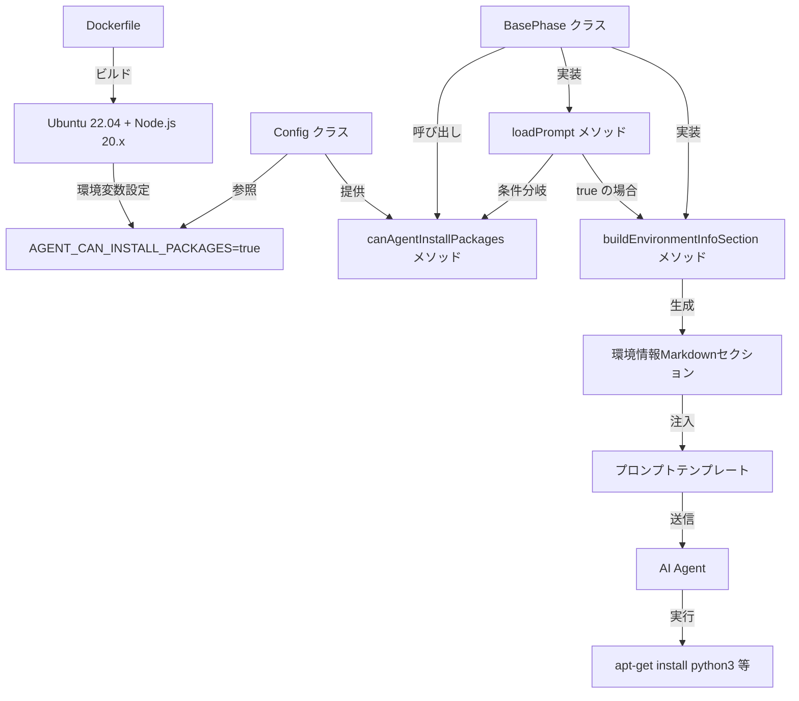
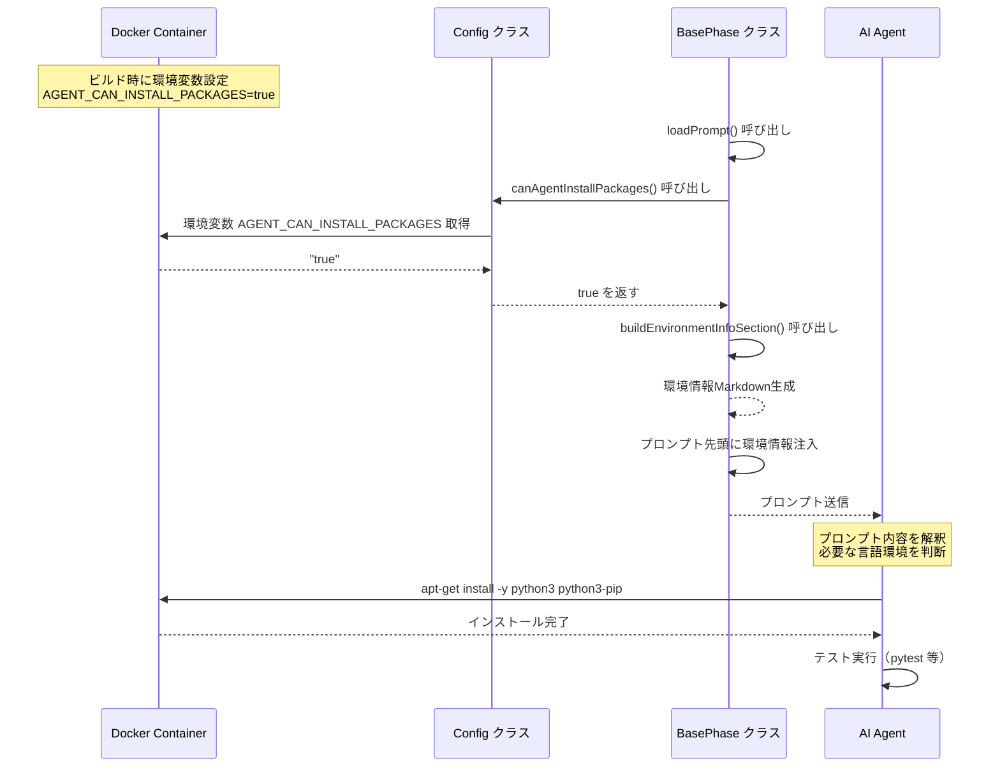
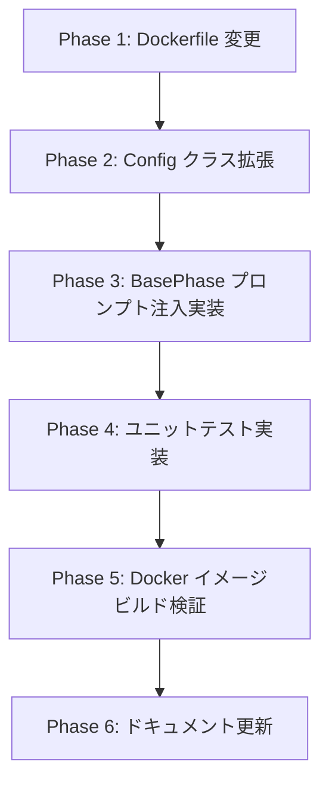

# 詳細設計書 - Issue #177

## 1. 概要

### 1.1 目的

Docker環境で実行されるAIエージェント（Codex/Claude）が、必要に応じて多言語環境（Python、Go、Java、Rust、Ruby）を自由にインストールできるようにする機能を実装します。これにより、多言語リポジトリに対するワークフロー実行とテスト実行の完全性を実現します。

### 1.2 Planning Document との整合性

本設計は、Planning Document（`.ai-workflow/issue-177/00_planning/output/planning.md`）で策定された以下の戦略に従います：

- **実装戦略**: EXTEND（既存ファイルの拡張が中心）
- **テスト戦略**: UNIT_ONLY（ユニットテスト中心）
- **テストコード戦略**: EXTEND_TEST（既存テストファイルへの追加）
- **複雑度**: 中程度（3ファイルの変更、新規テストケース約10件）
- **見積もり工数**: 8〜12時間

---

## 2. 実装戦略判断

### 実装戦略: EXTEND

**判断根拠**:

1. **既存ファイルの拡張が中心**:
   - `Dockerfile`: ベースイメージ変更、ビルドツール追加（既存ファイルの拡張）
   - `src/core/config.ts`: `IConfig` インターフェースと `Config` クラスへのメソッド追加（既存クラスの拡張）
   - `src/phases/base-phase.ts`: `loadPrompt()` メソッドへの環境情報注入ロジック追加（既存メソッドの拡張）

2. **新規ファイル作成はテストコードのみ**:
   - 新規の独立したモジュールやクラスの作成はなし
   - 既存のテストファイル（`tests/unit/core/config.test.ts`）へのテストケース追加

3. **アーキテクチャ変更なし**:
   - 既存の Config パターン（環境変数アクセス）を踏襲
   - 既存の BasePhase パターン（プロンプト読み込み・注入）を踏襲
   - 新しいモジュールやレイヤーの導入なし

4. **依存関係の追加なし**:
   - npm パッケージの追加・変更なし（Ubuntu パッケージのみ）
   - 既存のコアモジュール（Config、BasePhase）への機能追加のみ

**結論**: 既存コードの拡張が主体であり、新規の独立したコンポーネント作成ではないため、**EXTEND** 戦略を採用します。

---

## 3. テスト戦略判断

### テスト戦略: UNIT_ONLY

**判断根拠**:

1. **ユニットテスト中心の変更**:
   - `Config.canAgentInstallPackages()` の動作検証（環境変数パターン網羅）
   - プロンプト注入ロジックの検証（環境情報が正しく注入されるか）
   - 各機能は独立してテスト可能（外部システム連携なし）

2. **外部システム連携なし**:
   - Docker ビルドのみ（インテグレーションテスト不要）
   - GitHub API 呼び出しなし
   - データベースアクセスなし

3. **BDD テスト不要**:
   - エンドユーザー向け機能ではない（開発者向けインフラ機能）
   - ユーザーストーリーとして記述する必要性がない
   - 内部実装の詳細を検証する方が適切

4. **既存テストとの整合性**:
   - 既存の `config.test.ts` がユニットテストパターンを採用
   - 既存の Config クラステストと同様のパターン（Given/When/Then、環境変数バリエーション）を踏襲

**結論**: ユニットテスト中心の変更であり、外部システム連携やユーザーストーリーが不要なため、**UNIT_ONLY** 戦略を採用します。

---

## 4. テストコード戦略判断

### テストコード戦略: EXTEND_TEST

**判断根拠**:

1. **既存テストファイルへの追加**:
   - `tests/unit/core/config.test.ts` に `canAgentInstallPackages()` メソッドのテストスイートを追加
   - 新規テストファイル作成不要（既存の Config テストスイートに追加するのみ）

2. **既存テストパターンの踏襲**:
   - 既存の Config クラステストと同様のパターン（Given/When/Then、環境変数バリエーション）を使用
   - `beforeEach()` / `afterEach()` による環境変数クリーンアップ
   - 約10件のテストケース追加（環境変数の各パターン）

3. **新規テストファイル作成が不要な理由**:
   - BasePhase のプロンプト注入ロジックは既存の統合テストでカバー可能
   - Docker イメージビルドは手動検証で十分（CI/CD パイプラインでの自動検証）

**結論**: 既存の Config テストファイルへのテストケース追加のみで十分であり、新規テストファイル作成の必要性がないため、**EXTEND_TEST** 戦略を採用します。

---

## 5. アーキテクチャ設計

### 5.1 システム全体図

```
┌─────────────────────────────────────────────────────────────────┐
│                         Docker Container                        │
│  ┌───────────────────────────────────────────────────────────┐ │
│  │                   Ubuntu 22.04 Base                       │ │
│  │  ┌──────────────┐  ┌──────────────┐  ┌──────────────┐   │ │
│  │  │   Node.js    │  │ build-essential│  │    sudo      │   │ │
│  │  │    20.x      │  │  (gcc, make)  │  │              │   │ │
│  │  └──────────────┘  └──────────────┘  └──────────────┘   │ │
│  │                                                           │ │
│  │  環境変数: AGENT_CAN_INSTALL_PACKAGES=true               │ │
│  └───────────────────────────────────────────────────────────┘ │
│                                                                 │
│  ┌───────────────────────────────────────────────────────────┐ │
│  │              AI Workflow Orchestrator (TypeScript)        │ │
│  │  ┌─────────────────────────────────────────────────────┐ │ │
│  │  │ src/core/config.ts (Config クラス)                  │ │ │
│  │  │  ┌──────────────────────────────────────────────┐  │ │ │
│  │  │  │ canAgentInstallPackages(): boolean           │  │ │ │
│  │  │  │  - AGENT_CAN_INSTALL_PACKAGES 環境変数を解析 │  │ │ │
│  │  │  │  - "true" / "1" → true                       │  │ │ │
│  │  │  │  - それ以外 → false                          │  │ │ │
│  │  │  └──────────────────────────────────────────────┘  │ │ │
│  │  └─────────────────────────────────────────────────────┘ │ │
│  │                          ↓ 参照                          │ │
│  │  ┌─────────────────────────────────────────────────────┐ │ │
│  │  │ src/phases/base-phase.ts (BasePhase クラス)        │ │ │
│  │  │  ┌──────────────────────────────────────────────┐  │ │ │
│  │  │  │ loadPrompt(): string                         │  │ │ │
│  │  │  │  1. プロンプトテンプレート読み込み           │  │ │ │
│  │  │  │  2. config.canAgentInstallPackages() 確認    │  │ │ │
│  │  │  │  3. true の場合、環境情報セクションを先頭注入 │  │ │ │
│  │  │  └──────────────────────────────────────────────┘  │ │ │
│  │  │  ┌──────────────────────────────────────────────┐  │ │ │
│  │  │  │ buildEnvironmentInfoSection(): string (new)  │  │ │ │
│  │  │  │  - インストール可能な言語リストのMarkdown生成│  │ │ │
│  │  │  │  - Python, Go, Java, Rust, Ruby              │  │ │ │
│  │  │  └──────────────────────────────────────────────┘  │ │ │
│  │  └─────────────────────────────────────────────────────┘ │ │
│  │                          ↓ プロンプト                    │ │
│  │  ┌─────────────────────────────────────────────────────┐ │ │
│  │  │ AI Agent (Codex / Claude)                          │ │ │
│  │  │  - プロンプト先頭に環境情報を受信                  │ │ │
│  │  │  - 必要に応じて apt-get install を実行             │ │ │
│  │  └─────────────────────────────────────────────────────┘ │ │
│  └───────────────────────────────────────────────────────────┘ │
└─────────────────────────────────────────────────────────────────┘
```

### 5.2 コンポーネント間の関係



### 5.3 データフロー



---

## 6. 影響範囲分析

### 6.1 既存コードへの影響

#### 変更が必要なファイル

1. **`Dockerfile`** (約49行 → 約70行):
   - **変更内容**: ベースイメージを `node:20-slim` → `ubuntu:22.04` に変更
   - **追加内容**: Node.js 20.x のインストール処理、`build-essential`、`sudo` のインストール
   - **環境変数**: `AGENT_CAN_INSTALL_PACKAGES=true` を設定
   - **影響**: Docker イメージサイズ増加（100MB → 500MB+）、ビルド時間増加

2. **`src/core/config.ts`** (約220行 → 約260行):
   - **変更内容**: `IConfig` インターフェースに `canAgentInstallPackages(): boolean` を追加
   - **追加内容**: `Config` クラスに実装を追加、内部ヘルパーメソッド `parseBoolean()` を追加（オプション）
   - **影響**: 既存の Config クラス利用箇所に影響なし（後方互換性維持）

3. **`src/phases/base-phase.ts`** (約476行 → 約520行):
   - **変更内容**: `loadPrompt()` メソッドに環境情報注入ロジックを追加
   - **追加内容**: `buildEnvironmentInfoSection()` プライベートメソッドを追加（環境情報のMarkdown生成）
   - **影響**: 全フェーズのプロンプトに環境情報が注入される可能性（`config.canAgentInstallPackages()` が `true` の場合のみ）

4. **`tests/unit/core/config.test.ts`** (約880行 → 約1000行):
   - **変更内容**: `canAgentInstallPackages()` のテストスイートを追加（約10件のテストケース）
   - **追加内容**: 環境変数パターン網羅テスト（true、1、false、0、未設定、空文字列、その他の値）
   - **影響**: 既存テストに影響なし（新規テストケース追加のみ）

#### 影響を受けるが変更不要なファイル

1. **`src/index.ts`**: CLI エントリーポイント（影響なし）
2. **`src/main.ts`**: コマンドルーティング（影響なし）
3. **各フェーズ実装** (`src/phases/*.ts`): BasePhase.loadPrompt() を継承して使用（変更不要、自動的に環境情報が注入される）
4. **Jenkins パイプライン** (`Jenkinsfile`): Docker イメージビルド（変更不要、ビルド時間増加のみ）

### 6.2 依存関係の変更

#### 新規依存の追加

- **Ubuntu パッケージ**:
  - `build-essential`: C/C++ コンパイラ、make 等
  - `sudo`: パッケージインストールに必要
  - その他 Node.js 依存パッケージ（curl、ca-certificates等）

- **Node.js 20.x インストール方法**:
  - NodeSource リポジトリを追加（公式推奨方法）
  - `apt-get install -y nodejs` で Node.js 20.x をインストール

#### 既存依存の変更

- **なし**: npm パッケージの追加・変更なし

### 6.3 マイグレーション要否

- **不要**: データベーススキーマ変更なし、設定ファイル変更なし
- **Docker イメージ再ビルド必須**: ベースイメージ変更のため、既存イメージの再ビルドが必要
- **環境変数追加（オプション）**: `AGENT_CAN_INSTALL_PACKAGES` 環境変数（デフォルト: false、Docker内部では true）

---

## 7. 変更・追加ファイルリスト

### 7.1 新規作成ファイル

- **なし**（既存ファイルの拡張のみ）

### 7.2 修正が必要な既存ファイル

1. `Dockerfile`
2. `src/core/config.ts`
3. `src/phases/base-phase.ts`
4. `tests/unit/core/config.test.ts`

### 7.3 削除が必要なファイル

- **なし**

---

## 8. 詳細設計

### 8.1 Dockerfile 設計

#### 変更内容

```dockerfile
# 現在（node:20-slim ベース）
FROM node:20-slim
# ... 既存の設定 ...

# 変更後（ubuntu:22.04 ベース）
FROM ubuntu:22.04

# 基本パッケージのインストール
RUN apt-get update && apt-get install -y \
    curl \
    ca-certificates \
    gnupg \
    build-essential \
    sudo \
    && rm -rf /var/lib/apt/lists/*

# Node.js 20.x のインストール（NodeSource リポジトリ）
RUN curl -fsSL https://deb.nodesource.com/setup_20.x | bash - \
    && apt-get install -y nodejs \
    && rm -rf /var/lib/apt/lists/*

# Node.js バージョン確認
RUN node --version && npm --version

# 環境変数の設定
ENV AGENT_CAN_INSTALL_PACKAGES=true

# ... 既存の設定（WORKDIR、COPY、npm install 等）...
```

#### 設計上の考慮事項

1. **レイヤーキャッシュの最適化**:
   - 頻繁に変更されるファイル（`COPY . .`）を後半に配置
   - apt-get clean と `/var/lib/apt/lists/*` 削除によりイメージサイズを削減

2. **Node.js インストール方法**:
   - NodeSource 公式リポジトリを使用（安定性が高い）
   - `setup_20.x` スクリプトでリポジトリを追加
   - `apt-get install -y nodejs` で Node.js 20.x をインストール

3. **ビルドツールのインストール**:
   - `build-essential`: gcc, g++, make, libc-dev を含む
   - `sudo`: エージェントがパッケージインストール時に使用

4. **イメージサイズ削減策**:
   - `apt-get clean` でキャッシュ削除
   - `rm -rf /var/lib/apt/lists/*` でパッケージリスト削除
   - マルチステージビルドは今回見送り（将来的な改善候補）

### 8.2 Config クラス設計

#### インターフェース定義

```typescript
// src/core/config.ts

export interface IConfig {
  // ... 既存のメソッド ...

  /**
   * エージェントがパッケージをインストール可能かどうかを返す
   *
   * @returns AGENT_CAN_INSTALL_PACKAGES 環境変数が "true" または "1" の場合 true、それ以外は false
   */
  canAgentInstallPackages(): boolean;
}
```

#### クラス実装

```typescript
// src/core/config.ts

export class Config implements IConfig {
  // ... 既存のプロパティとメソッド ...

  /**
   * エージェントがパッケージをインストール可能かどうかを返す
   *
   * 環境変数 AGENT_CAN_INSTALL_PACKAGES の値を解析:
   * - "true" または "1" の場合: true を返す
   * - "false"、"0"、未設定、空文字列の場合: false を返す
   *
   * @returns パッケージインストールが許可されている場合 true、それ以外は false
   */
  canAgentInstallPackages(): boolean {
    const value = process.env.AGENT_CAN_INSTALL_PACKAGES;
    return this.parseBoolean(value, false);
  }

  /**
   * 文字列を boolean に変換する内部ヘルパーメソッド
   *
   * @param value - 変換する文字列値
   * @param defaultValue - 値が未設定または空文字列の場合のデフォルト値
   * @returns 変換後の boolean 値
   * @private
   */
  private parseBoolean(value: string | undefined, defaultValue: boolean): boolean {
    if (value === undefined || value === '') {
      return defaultValue;
    }

    const normalized = value.toLowerCase().trim();
    return normalized === 'true' || normalized === '1';
  }
}

// Singleton インスタンス
export const config = new Config();
```

#### 設計上の考慮事項

1. **既存パターンの踏襲**:
   - `getLogNoColor()` メソッドと同様のパターン（boolean型環境変数のパース）
   - 内部ヘルパーメソッド `parseBoolean()` による共通ロジック抽出

2. **デフォルト値**:
   - 環境変数未設定時は `false` を返す（セキュリティ観点から安全側に倒す）
   - Docker 内部では Dockerfile で明示的に `true` を設定

3. **型安全性**:
   - `IConfig` インターフェースで型定義を明示
   - `Config` クラスで実装を提供

4. **テスト容易性**:
   - `parseBoolean()` を private メソッドとして実装（テストは `canAgentInstallPackages()` 経由で実施）
   - 環境変数の各パターンをテストで網羅

### 8.3 BasePhase プロンプト注入設計

#### メソッド拡張

```typescript
// src/phases/base-phase.ts

export abstract class BasePhase {
  // ... 既存のプロパティとメソッド ...

  /**
   * プロンプトテンプレートを読み込み、必要に応じて環境情報を注入する
   *
   * @param step - 実行ステップ（'execute' | 'review' | 'revise'）
   * @param variables - テンプレート変数（{key: value} 形式）
   * @returns 環境情報が注入された完全なプロンプト文字列
   * @protected
   */
  protected loadPrompt(
    step: 'execute' | 'review' | 'revise',
    variables: Record<string, string> = {}
  ): string {
    // 1. プロンプトテンプレート読み込み（既存ロジック）
    const templatePath = path.join(
      __dirname,
      '../prompts',
      this.phaseName,
      `${step}.txt`
    );
    let prompt = fs.readFileSync(templatePath, 'utf-8');

    // 2. テンプレート変数の置換（既存ロジック）
    for (const [key, value] of Object.entries(variables)) {
      prompt = prompt.replaceAll(`{${key}}`, value);
    }

    // 3. 環境情報の注入（新規ロジック）
    if (this.config.canAgentInstallPackages()) {
      const environmentInfo = this.buildEnvironmentInfoSection();
      prompt = `${environmentInfo}\n\n${prompt}`;
    }

    return prompt;
  }

  /**
   * 環境情報セクションのMarkdownを生成する
   *
   * @returns 環境情報セクションのMarkdown文字列
   * @private
   */
  private buildEnvironmentInfoSection(): string {
    return `## 🛠️ 開発環境情報

このDocker環境では、以下のプログラミング言語をインストール可能です：

- **Python**: \`apt-get update && apt-get install -y python3 python3-pip\`
- **Go**: \`apt-get update && apt-get install -y golang-go\`
- **Java**: \`apt-get update && apt-get install -y default-jdk\`
- **Rust**: \`curl --proto '=https' --tlsv1.2 -sSf https://sh.rustup.rs | sh -s -- -y\`
- **Ruby**: \`apt-get update && apt-get install -y ruby ruby-dev\`

テスト実行や品質チェックに必要な言語環境は、自由にインストールしてください。`;
  }
}
```

#### 設計上の考慮事項

1. **注入位置**:
   - プロンプトの先頭に環境情報セクションを注入
   - 既存のプロンプト内容は変更しない（後方互換性維持）

2. **条件分岐**:
   - `config.canAgentInstallPackages()` が `true` の場合のみ注入
   - Docker 外部（ローカル開発環境）では注入されない

3. **Markdownフォーマット**:
   - セクションヘッダー（`##`）で視認性を向上
   - 絵文字（🛠️）でセクションを識別しやすく
   - コードブロック（`` ` ``）でコマンドを明示

4. **言語リスト**:
   - Python、Go、Java、Rust、Ruby の5言語を優先的にサポート
   - 各言語のインストールコマンドを明示

5. **拡張性**:
   - `buildEnvironmentInfoSection()` を private メソッドとして実装
   - 将来的に言語リストを環境変数から読み込む等の拡張が可能

### 8.4 データ構造設計

#### 環境変数スキーマ

```typescript
/**
 * 環境変数: AGENT_CAN_INSTALL_PACKAGES
 *
 * 型: string
 * 値:
 *   - "true" または "1": パッケージインストール許可
 *   - "false"、"0"、未設定、空文字列: パッケージインストール不可
 *
 * デフォルト: false（Docker 内部では Dockerfile で明示的に "true" を設定）
 *
 * 用途:
 *   - Docker 環境でエージェントがパッケージインストールを実行可能にする
 *   - ローカル開発環境では未設定または "false" にすることで、誤ったパッケージインストールを防止
 */
```

#### プロンプトテンプレート変数

既存のテンプレート変数に新規追加なし（環境情報は条件分岐で注入）

---

## 9. セキュリティ考慮事項

### 9.1 認証・認可

- **該当なし**: 認証・認可機能の変更なし

### 9.2 データ保護

- **該当なし**: データ保護機能の変更なし

### 9.3 セキュリティリスクと対策

#### リスク1: 悪意のあるパッケージインストール

- **リスク内容**: エージェントが悪意のあるパッケージ（マルウェア、バックドア等）をインストールする可能性
- **影響度**: 低（Docker内部は隔離環境）
- **対策**:
  1. Docker コンテナは隔離環境であり、ホストシステムへの影響は限定的
  2. エージェントが実行するコマンドは `agent_log.md` に記録され、事後監査が可能
  3. 環境変数 `AGENT_CAN_INSTALL_PACKAGES` のデフォルトを `false` に設定（Docker内部のみ `true`）

#### リスク2: リソース枯渇攻撃

- **リスク内容**: エージェントが大量のパッケージをインストールし、ディスク容量を消費する可能性
- **影響度**: 中（Docker イメージサイズ増加）
- **対策**:
  1. CI/CD パイプラインでイメージサイズを監視（500MB以下を目標）
  2. Report Phase でのクリーンアップ処理により、不要なファイルを削除
  3. Docker コンテナは一時的なものであり、ビルド完了後に破棄される

#### リスク3: 権限昇格攻撃

- **リスク内容**: `sudo` コマンドの悪用による権限昇格
- **影響度**: 低（Docker内部は既に root 権限）
- **対策**:
  1. Docker コンテナ内部では既に root 権限で実行されるため、権限昇格のリスクは限定的
  2. ホストシステムへの影響はコンテナの隔離性により防止される

---

## 10. 非機能要件への対応

### 10.1 パフォーマンス

#### 目標

- **Docker イメージサイズ**: 500MB以下
- **Docker イメージビルド時間**: 5分以内
- **プロンプト注入処理のオーバーヘッド**: 100ms以内

#### 対策

1. **イメージサイズ削減**:
   - `apt-get clean` でキャッシュ削除
   - `rm -rf /var/lib/apt/lists/*` でパッケージリスト削除
   - マルチステージビルドの検討（将来的な改善）

2. **ビルド時間短縮**:
   - Docker レイヤーキャッシュの活用
   - 頻繁に変更されるファイル（`COPY . .`）を後半に配置

3. **プロンプト注入処理の最適化**:
   - `buildEnvironmentInfoSection()` の結果をキャッシュ（将来的な改善）
   - 環境情報セクションは静的な文字列であり、処理オーバーヘッドは最小限

### 10.2 スケーラビリティ

- **該当なし**: スケーラビリティ要件の変更なし

### 10.3 保守性

#### 対策

1. **既存パターンの踏襲**:
   - Config クラス: `getLogNoColor()` パターンを踏襲
   - BasePhase クラス: `loadPrompt()` 拡張パターンを踏襲
   - テストコード: 既存パターン（Given/When/Then）を踏襲

2. **コードの一貫性**:
   - 内部ヘルパーメソッド `parseBoolean()` による共通ロジック抽出
   - プライベートメソッド `buildEnvironmentInfoSection()` による責務分離

3. **ドキュメント更新**:
   - `CLAUDE.md` に環境変数 `AGENT_CAN_INSTALL_PACKAGES` の説明を追加
   - `README.md` に Docker 環境でのパッケージインストール手順を追加
   - `Dockerfile` にベースイメージ変更の理由をコメントで明記

---

## 11. 実装の順序

### 推奨実装順序



### Phase 1: Dockerfile 変更（推定工数: 1〜1.5h）

1. ベースイメージを `ubuntu:22.04` に変更
2. Node.js 20.x インストール処理を追加
3. `build-essential`、`sudo` をインストール
4. 環境変数 `AGENT_CAN_INSTALL_PACKAGES=true` を設定
5. Docker イメージビルドの動作確認

**依存関係**: なし（独立して実施可能）

### Phase 2: Config クラス拡張（推定工数: 1h）

1. `IConfig` インターフェースに `canAgentInstallPackages(): boolean` を追加
2. `Config` クラスに実装を追加
3. 内部ヘルパーメソッド `parseBoolean()` を追加（オプション）
4. TypeScript コンパイルエラーがないことを確認

**依存関係**: Phase 1 の Dockerfile 変更完了後が望ましい（環境変数の動作確認のため）

### Phase 3: BasePhase プロンプト注入実装（推定工数: 1〜1.5h）

1. `loadPrompt()` メソッドに環境情報注入ロジックを追加
2. `buildEnvironmentInfoSection()` プライベートメソッドを追加
3. インストール可能な言語リストのMarkdown生成
4. 既存プロンプトとの統合テスト

**依存関係**: Phase 2 の Config クラス拡張完了後（`config.canAgentInstallPackages()` の実装が必要）

### Phase 4: ユニットテスト実装（推定工数: 1.5h）

1. `canAgentInstallPackages()` のテストスイート追加（約10件）
2. Given/When/Then パターンでテストケースを実装
3. 環境変数パターン網羅テスト
4. テストカバレッジ確認（新規コードのカバレッジ 80%以上）

**依存関係**: Phase 2 の Config クラス拡張完了後

### Phase 5: Docker イメージビルド検証（推定工数: 0.5h）

1. `docker build` でイメージビルド
2. イメージサイズの確認（node:20-slim との比較、500MB以下を目標）
3. コンテナ起動テスト（`docker run`）
4. Node.js バージョン確認（`node --version`）

**依存関係**: Phase 1 の Dockerfile 変更完了後

### Phase 6: ドキュメント更新（推定工数: 0.5h）

1. `CLAUDE.md` の更新
   - 環境変数 `AGENT_CAN_INSTALL_PACKAGES` の説明を追加
   - Config クラスのメソッド一覧に `canAgentInstallPackages()` を追加
   - プロンプト注入機能の説明を追加

2. `README.md` の更新
   - Docker 環境でのパッケージインストール手順を追加
   - 使用例の追加（Python、Go、Java等のインストール例）
   - 環境変数の説明を追加

3. `Dockerfile` コメントの更新
   - ベースイメージ変更の理由をコメントで明記
   - ビルドツールインストールの目的を説明

**依存関係**: 全Phase完了後

---

## 12. 受け入れ基準

以下の受け入れ基準をすべて満たすこと：

### 機能要件

1. **環境変数 `AGENT_CAN_INSTALL_PACKAGES` が正しく動作する**:
   - `true` または `1` の場合、`config.canAgentInstallPackages()` が `true` を返す
   - `false`、`0`、未設定、空文字列の場合、`false` を返す

2. **プロンプト先頭に環境情報が注入される**:
   - `config.canAgentInstallPackages()` が `true` の場合、すべてのフェーズのプロンプト先頭に環境情報セクションが追加される
   - 環境情報セクションにはインストール可能な言語リスト（Python、Go、Java、Rust、Ruby）が含まれる

3. **Docker イメージが正しくビルドされる**:
   - ベースイメージが `ubuntu:22.04` である
   - Node.js 20.x がインストールされている
   - `build-essential`、`sudo` がインストールされている
   - 環境変数 `AGENT_CAN_INSTALL_PACKAGES=true` が設定されている

### 非機能要件

1. **パフォーマンス**:
   - Docker イメージサイズが 500MB以下である
   - Docker イメージビルド時間が 5分以内である

2. **セキュリティ**:
   - 環境変数 `AGENT_CAN_INSTALL_PACKAGES` のデフォルトが `false` である（Docker内部のみ `true`）
   - エージェントが実行するコマンドが `agent_log.md` に記録される

3. **保守性**:
   - 既存の Config パターンを踏襲している（`getLogNoColor()` パターン）
   - 既存の BasePhase パターンを踏襲している（`loadPrompt()` 拡張）
   - テストコードが既存パターンに従っている（Given/When/Then）

4. **後方互換性**:
   - 既存のワークフローに影響を与えない
   - 環境変数未設定時はデフォルト動作（`false`）

---

## 13. 品質ゲート確認

### ✅ 実装戦略の判断根拠が明記されている

- セクション2「実装戦略判断」で **EXTEND** 戦略を選択
- 判断根拠を4つの観点（既存ファイル拡張、新規ファイル作成なし、アーキテクチャ変更なし、依存関係の追加なし）から明記

### ✅ テスト戦略の判断根拠が明記されている

- セクション3「テスト戦略判断」で **UNIT_ONLY** 戦略を選択
- 判断根拠を4つの観点（ユニットテスト中心、外部システム連携なし、BDD不要、既存テストとの整合性）から明記

### ✅ テストコード戦略の判断根拠が明記されている

- セクション4「テストコード戦略判断」で **EXTEND_TEST** 戦略を選択
- 判断根拠を3つの観点（既存テストファイル追加、既存パターン踏襲、新規テストファイル不要）から明記

### ✅ 既存コードへの影響範囲が分析されている

- セクション6「影響範囲分析」で以下を詳細に分析:
  - 変更が必要なファイル（4ファイル）
  - 影響を受けるが変更不要なファイル（4ファイル）
  - 依存関係の変更（新規依存、既存依存）
  - マイグレーション要否

### ✅ 変更が必要なファイルがリストアップされている

- セクション7「変更・追加ファイルリスト」で明記:
  - 新規作成ファイル: なし
  - 修正が必要な既存ファイル: 4ファイル（Dockerfile、config.ts、base-phase.ts、config.test.ts）
  - 削除が必要なファイル: なし

### ✅ 設計が実装可能である

- セクション8「詳細設計」で以下を明記:
  - Dockerfile 設計（具体的なコード例付き）
  - Config クラス設計（インターフェース定義、クラス実装、設計上の考慮事項）
  - BasePhase プロンプト注入設計（メソッド拡張、設計上の考慮事項）
  - データ構造設計（環境変数スキーマ）
- セクション11「実装の順序」で実装手順を明記（6つのPhaseに分割、依存関係を明示）

---

## 14. 補足情報

### 14.1 Planning Document との差分

本設計書は、Planning Document で策定された方針に完全に準拠しています。主な差分はありません。

### 14.2 今後の拡張候補

1. **他の言語のサポート**: PHP、Perl、Scala、Kotlin等（現時点ではPython、Go、Java、Rust、Rubyの5言語のみ）
2. **マルチステージビルドによる最適化**: Docker イメージサイズをさらに削減
3. **パッケージインストールの制限機能**: 特定のパッケージのみ許可するホワイトリスト機能（セキュリティ強化）
4. **エージェントログの監査機能強化**: 危険なコマンドの検出・警告機能

### 14.3 参考資料

- Planning Document: `.ai-workflow/issue-177/00_planning/output/planning.md`
- Requirements Document: `.ai-workflow/issue-177/01_requirements/output/requirements.md`
- 既存の Config 実装: `src/core/config.ts` の `getLogNoColor()` メソッド
- 既存の BasePhase 実装: `src/phases/base-phase.ts` の `loadPrompt()` メソッド
- 既存のテストパターン: `tests/unit/core/config.test.ts`

---

**作成日時**: 2025-01-31
**作成者**: AI Workflow Agent (Design Phase)
**Issue番号**: #177
**バージョン**: v1.0
