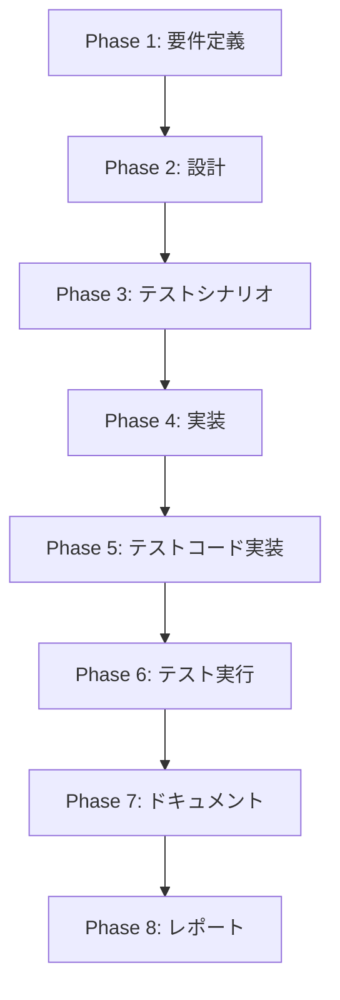

# Claude Agent 実行ログ

生成日時: 2025/12/3 6:57:45

---

## Turn 1: システム初期化

**セッションID**: `675f8a1a-cfdd-4b3b-8b5e-a5f0faaeabab`
**モデル**: claude-sonnet-4-5-20250929
**権限モード**: bypassPermissions
**利用可能ツール**: Task, Bash, Glob, Grep, ExitPlanMode, Read, Edit, Write, NotebookEdit, WebFetch, TodoWrite, WebSearch, BashOutput, KillShell, Skill, SlashCommand

## Turn 2: AI応答

# プロジェクト計画書

## 1. Issue分析

### 複雑度
**簡単** - 単一ファイル（Jenkinsfile）の修正のみ

### 見積もり工数
**2~3時間**

**根拠**:
- Jenkinsfileの修正: 0.5~1時間（パラメータ追加、environment修正）
- テスト（Jenkins Job実行確認）: 1~1.5時間
- ドキュメント更新: 0.5時間

### リスク評価
**低**

既存の設定変更のみで、新規機能追加や複雑なロジック変更は不要。AWS認証情報のパラメータ化が既に実装されているため、同様のパターンを適用するだけ。

---

## 2. 実装戦略判断

### 実装戦略: EXTEND

**判断根拠**:
- 既存のJenkinsfileに対して、パラメータセクションの拡張と環境変数設定の変更を実施
- 新規ファイルの作成は不要
- AWS認証情報のパラメータ化パターンが既に存在し、同じ方式を適用する拡張作業

### テスト戦略: INTEGRATION_ONLY

**判断根拠**:
- Jenkinsfileの変更は、Jenkins Job実行時の動作検証が必須（統合テスト）
- ユニットテストは不要（Groovyスクリプトの単純な設定変更）
- BDDテストも不要（ユーザーストーリーではなく、インフラ設定の変更）
- 実際にJenkins Jobを実行し、パラメータが正しく渡されることを確認する統合テストが中心

### テストコード戦略: CREATE_TEST

**判断根拠**:
- Jenkinsfileの統合テストは、Jenkins Job実行ログで検証するため、テストコード（自動テストスクリプト）の作成は不要
- 代わりに、テストシナリオドキュメント（手動検証手順）を新規作成する
- テスト実行フェーズで、手動でJenkins Jobを実行し、パラメータが正しくマスキングされることを確認

---

## 3. 影響範囲分析

### 既存コードへの影響
- **変更ファイル**: `Jenkinsfile` のみ
  - `parameters` セクション: `OPENAI_API_KEY`, `GITHUB_TOKEN` パラメータを追加
  - `environment` セクション: `credentials()` から `params` への参照変更

### 依存関係の変更
- **新規依存**: なし
- **既存依存の変更**: なし
- **Jenkins設定の変更**: 既存のJenkins Jobで新しいパラメータを設定する必要がある

### マイグレーション要否
- **データベーススキーマ変更**: なし
- **設定ファイル変更**: なし
- **Jenkins Credentials削除の検討**: 
  - `openai-api-key` と `github-token` のcredentialsは、パラメータ化後も保持するか、削除するかを判断する必要がある
  - ただし、削除はこのIssueのスコープ外（別Issueで対応）

---

## 4. タスク分割

### Phase 1: 要件定義 (見積もり: 0.5h)

- [ ] Task 1-1: 機能要件の整理 (0.3h)
  - OPENAI_API_KEYとGITHUB_TOKENをパラメータで受け取る仕様を明確化
  - AWS認証情報のパラメータ化パターンとの一貫性を確認
  
- [ ] Task 1-2: 受け入れ基準の定義 (0.2h)
  - パラメータが正しくマスキングされること
  - Jenkins Job実行時にパラメータが環境変数として利用可能なこと

### Phase 2: 設計 (見積もり: 0.5h)

- [ ] Task 2-1: Jenkinsfileの変更設計 (0.3h)
  - `parameters` セクションの追加内容を設計
  - `environment` セクションの変更内容を設計
  
- [ ] Task 2-2: 互換性検証設計 (0.2h)
  - 既存のJenkins Job実行への影響を分析
  - パラメータ未設定時のフォールバック動作を検討（必要に応じて）

### Phase 3: テストシナリオ (見積もり: 0.5h)

- [ ] Task 3-1: 統合テストシナリオの作成 (0.5h)
  - Jenkins Job実行時のパラメータ設定手順を記載
  - パラメータマスキングの検証手順を記載
  - 環境変数が正しく設定されることを確認する手順を記載

### Phase 4: 実装 (見積もり: 0.5~1h)

- [ ] Task 4-1: Jenkinsfileのparametersセクション修正 (0.2~0.3h)
  - `password` 型パラメータ `OPENAI_API_KEY` を追加
  - `password` 型パラメータ `GITHUB_TOKEN` を追加
  
- [ ] Task 4-2: Jenkinsfileのenvironmentセクション修正 (0.2~0.3h)
  - `OPENAI_API_KEY = "${params.OPENAI_API_KEY}"` に変更
  - `GITHUB_TOKEN = "${params.GITHUB_TOKEN}"` に変更
  - 既存の `credentials()` 参照を削除
  
- [ ] Task 4-3: コードレビュー実施 (0.1~0.4h)
  - AWS認証情報のパターンとの一貫性を確認
  - 誤字脱字やGroovy構文エラーがないか確認

### Phase 5: テストコード実装 (見積もり: 0h)

- [ ] Task 5-1: 統合テスト手順書の作成 (0h)
  - Phase 3で作成したテストシナリオをそのまま使用
  - 自動テストコードの実装は不要

### Phase 6: テスト実行 (見積もり: 1~1.5h)

- [ ] Task 6-1: Jenkins Job実行テスト (0.5~0.8h)
  - Jenkinsfileをリポジトリにプッシュ
  - Jenkins Jobをビルド実行
  - パラメータ入力画面で `OPENAI_API_KEY` と `GITHUB_TOKEN` を設定
  
- [ ] Task 6-2: パラメータマスキング検証 (0.3~0.4h)
  - Jenkins Jobのコンソール出力を確認
  - `OPENAI_API_KEY` と `GITHUB_TOKEN` が `****` でマスキングされていることを確認
  
- [ ] Task 6-3: 環境変数設定検証 (0.2~0.3h)
  - Docker コンテナ内で `echo $OPENAI_API_KEY` を実行し、値が設定されていることを確認
  - Docker コンテナ内で `echo $GITHUB_TOKEN` を実行し、値が設定されていることを確認

### Phase 7: ドキュメント (見積もり: 0.5h)

- [ ] Task 7-1: README.mdの更新 (0.3h)
  - Jenkins実行時のパラメータ設定方法を記載
  - `OPENAI_API_KEY` と `GITHUB_TOKEN` がパラメータから渡されることを明記
  
- [ ] Task 7-2: CLAUDE.mdまたはARCHITECTURE.mdの更新（必要に応じて） (0.2h)
  - Jenkinsfile の認証情報管理方針を記載
  - credentials から params への移行履歴を記載

### Phase 8: レポート (見積もり: 0.5h)

- [ ] Task 8-1: 完了レポートの作成 (0.3h)
  - 実装内容のサマリー
  - テスト結果の記載
  - 既知の制限事項や注意事項の記載
  
- [ ] Task 8-2: PR本文の作成 (0.2h)
  - Issue #184へのリンク
  - 変更内容の説明
  - レビュー観点の記載

---

## 5. 依存関係

**重要な依存関係**:
- Phase 4（実装）完了後、Phase 6（テスト実行）を実施するには、Jenkinsfileのプッシュが必要
- Phase 6（テスト実行）完了後、結果をPhase 7（ドキュメント）とPhase 8（レポート）で反映

---

## 6. リスクと軽減策

### リスク1: パラメータ未設定時のビルド失敗
- **影響度**: 中
- **確率**: 中
- **軽減策**: 
  - パラメータにデフォルト値を設定しない（セキュリティ上の理由）
  - Jenkins Job実行時に、パラメータ入力を必須とするUI設計を確認
  - テストシナリオで「パラメータ未設定時のエラーメッセージ」を検証項目に追加

### リスク2: 既存のJenkins Jobとの互換性問題
- **影響度**: 低
- **確率**: 低
- **軽減策**: 
  - パラメータ追加は後方互換性があるため、既存のJobは影響を受けない
  - ただし、新しいパラメータを設定しない限り、ビルドが失敗する可能性がある
  - ドキュメントで移行手順を明記

### リスク3: credentialsとparamsの混在による混乱
- **影響度**: 低
- **確率**: 低
- **軽減策**: 
  - AWS認証情報のパターンと一貫性を保つことで、混乱を防止
  - コードレビューで `credentials()` の参照が残っていないか確認

---

## 7. 品質ゲート

### Phase 1: 要件定義
- [ ] 機能要件が明確に記載されている（OPENAI_API_KEYとGITHUB_TOKENのパラメータ化）
- [ ] 受け入れ基準が定義されている（パラメータマスキング、環境変数設定）
- [ ] AWS認証情報のパターンとの一貫性が確認されている

### Phase 2: 設計
- [ ] 実装戦略の判断根拠が明記されている（EXTEND）
- [ ] テスト戦略の判断根拠が明記されている（INTEGRATION_ONLY）
- [ ] テストコード戦略の判断根拠が明記されている（CREATE_TEST）
- [ ] Jenkinsfileの変更内容が具体的に設計されている

### Phase 3: テストシナリオ
- [ ] 統合テストシナリオが具体的に記載されている
- [ ] パラメータマスキングの検証手順が明確である
- [ ] 環境変数設定の検証手順が明確である

### Phase 4: 実装
- [ ] `parameters` セクションにパラメータが追加されている
- [ ] `environment` セクションで `params` から参照している
- [ ] `credentials()` の参照が完全に削除されている
- [ ] AWS認証情報のパターンと一貫性がある

### Phase 5: テストコード実装
- [ ] 統合テスト手順書が作成されている（自動テストコードは不要）

### Phase 6: テスト実行
- [ ] Jenkins Jobが正常にビルド実行できる
- [ ] パラメータが正しくマスキングされている
- [ ] 環境変数が正しく設定されている

### Phase 7: ドキュメント
- [ ] README.mdにパラメータ設定方法が記載されている
- [ ] 認証情報管理方針が明確に記載されている

### Phase 8: レポート
- [ ] 完了レポートが作成されている
- [ ] PR本文が作成されている
- [ ] 既知の制限事項や注意事項が記載されている

---

## まとめ

このIssueは、Jenkinsfileの認証情報管理を `credentials` から `params` に統一するシンプルな変更です。既存のAWS認証情報のパターンを踏襲するため、実装難易度は低く、リスクも低いと評価されます。

**総見積もり工数**: 2~3時間  
**推奨実施期間**: 1日以内

**次のアクション**: Phase 1（要件定義）に進み、機能要件と受け入れ基準を詳細化してください。

## Turn 3: 実行完了

**ステータス**: success
**所要時間**: 63175ms
**ターン数**: 4

# プロジェクト計画書

## 1. Issue分析

### 複雑度
**簡単** - 単一ファイル（Jenkinsfile）の修正のみ

### 見積もり工数
**2~3時間**

**根拠**:
- Jenkinsfileの修正: 0.5~1時間（パラメータ追加、environment修正）
- テスト（Jenkins Job実行確認）: 1~1.5時間
- ドキュメント更新: 0.5時間

### リスク評価
**低**

既存の設定変更のみで、新規機能追加や複雑なロジック変更は不要。AWS認証情報のパラメータ化が既に実装されているため、同様のパターンを適用するだけ。

---

## 2. 実装戦略判断

### 実装戦略: EXTEND

**判断根拠**:
- 既存のJenkinsfileに対して、パラメータセクションの拡張と環境変数設定の変更を実施
- 新規ファイルの作成は不要
- AWS認証情報のパラメータ化パターンが既に存在し、同じ方式を適用する拡張作業

### テスト戦略: INTEGRATION_ONLY

**判断根拠**:
- Jenkinsfileの変更は、Jenkins Job実行時の動作検証が必須（統合テスト）
- ユニットテストは不要（Groovyスクリプトの単純な設定変更）
- BDDテストも不要（ユーザーストーリーではなく、インフラ設定の変更）
- 実際にJenkins Jobを実行し、パラメータが正しく渡されることを確認する統合テストが中心

### テストコード戦略: CREATE_TEST

**判断根拠**:
- Jenkinsfileの統合テストは、Jenkins Job実行ログで検証するため、テストコード（自動テストスクリプト）の作成は不要
- 代わりに、テストシナリオドキュメント（手動検証手順）を新規作成する
- テスト実行フェーズで、手動でJenkins Jobを実行し、パラメータが正しくマスキングされることを確認

---

## 3. 影響範囲分析

### 既存コードへの影響
- **変更ファイル**: `Jenkinsfile` のみ
  - `parameters` セクション: `OPENAI_API_KEY`, `GITHUB_TOKEN` パラメータを追加
  - `environment` セクション: `credentials()` から `params` への参照変更

### 依存関係の変更
- **新規依存**: なし
- **既存依存の変更**: なし
- **Jenkins設定の変更**: 既存のJenkins Jobで新しいパラメータを設定する必要がある

### マイグレーション要否
- **データベーススキーマ変更**: なし
- **設定ファイル変更**: なし
- **Jenkins Credentials削除の検討**: 
  - `openai-api-key` と `github-token` のcredentialsは、パラメータ化後も保持するか、削除するかを判断する必要がある
  - ただし、削除はこのIssueのスコープ外（別Issueで対応）

---

## 4. タスク分割

### Phase 1: 要件定義 (見積もり: 0.5h)

- [ ] Task 1-1: 機能要件の整理 (0.3h)
  - OPENAI_API_KEYとGITHUB_TOKENをパラメータで受け取る仕様を明確化
  - AWS認証情報のパラメータ化パターンとの一貫性を確認
  
- [ ] Task 1-2: 受け入れ基準の定義 (0.2h)
  - パラメータが正しくマスキングされること
  - Jenkins Job実行時にパラメータが環境変数として利用可能なこと

### Phase 2: 設計 (見積もり: 0.5h)

- [ ] Task 2-1: Jenkinsfileの変更設計 (0.3h)
  - `parameters` セクションの追加内容を設計
  - `environment` セクションの変更内容を設計
  
- [ ] Task 2-2: 互換性検証設計 (0.2h)
  - 既存のJenkins Job実行への影響を分析
  - パラメータ未設定時のフォールバック動作を検討（必要に応じて）

### Phase 3: テストシナリオ (見積もり: 0.5h)

- [ ] Task 3-1: 統合テストシナリオの作成 (0.5h)
  - Jenkins Job実行時のパラメータ設定手順を記載
  - パラメータマスキングの検証手順を記載
  - 環境変数が正しく設定されることを確認する手順を記載

### Phase 4: 実装 (見積もり: 0.5~1h)

- [ ] Task 4-1: Jenkinsfileのparametersセクション修正 (0.2~0.3h)
  - `password` 型パラメータ `OPENAI_API_KEY` を追加
  - `password` 型パラメータ `GITHUB_TOKEN` を追加
  
- [ ] Task 4-2: Jenkinsfileのenvironmentセクション修正 (0.2~0.3h)
  - `OPENAI_API_KEY = "${params.OPENAI_API_KEY}"` に変更
  - `GITHUB_TOKEN = "${params.GITHUB_TOKEN}"` に変更
  - 既存の `credentials()` 参照を削除
  
- [ ] Task 4-3: コードレビュー実施 (0.1~0.4h)
  - AWS認証情報のパターンとの一貫性を確認
  - 誤字脱字やGroovy構文エラーがないか確認

### Phase 5: テストコード実装 (見積もり: 0h)

- [ ] Task 5-1: 統合テスト手順書の作成 (0h)
  - Phase 3で作成したテストシナリオをそのまま使用
  - 自動テストコードの実装は不要

### Phase 6: テスト実行 (見積もり: 1~1.5h)

- [ ] Task 6-1: Jenkins Job実行テスト (0.5~0.8h)
  - Jenkinsfileをリポジトリにプッシュ
  - Jenkins Jobをビルド実行
  - パラメータ入力画面で `OPENAI_API_KEY` と `GITHUB_TOKEN` を設定
  
- [ ] Task 6-2: パラメータマスキング検証 (0.3~0.4h)
  - Jenkins Jobのコンソール出力を確認
  - `OPENAI_API_KEY` と `GITHUB_TOKEN` が `****` でマスキングされていることを確認
  
- [ ] Task 6-3: 環境変数設定検証 (0.2~0.3h)
  - Docker コンテナ内で `echo $OPENAI_API_KEY` を実行し、値が設定されていることを確認
  - Docker コンテナ内で `echo $GITHUB_TOKEN` を実行し、値が設定されていることを確認

### Phase 7: ドキュメント (見積もり: 0.5h)

- [ ] Task 7-1: README.mdの更新 (0.3h)
  - Jenkins実行時のパラメータ設定方法を記載
  - `OPENAI_API_KEY` と `GITHUB_TOKEN` がパラメータから渡されることを明記
  
- [ ] Task 7-2: CLAUDE.mdまたはARCHITECTURE.mdの更新（必要に応じて） (0.2h)
  - Jenkinsfile の認証情報管理方針を記載
  - credentials から params への移行履歴を記載

### Phase 8: レポート (見積もり: 0.5h)

- [ ] Task 8-1: 完了レポートの作成 (0.3h)
  - 実装内容のサマリー
  - テスト結果の記載
  - 既知の制限事項や注意事項の記載
  
- [ ] Task 8-2: PR本文の作成 (0.2h)
  - Issue #184へのリンク
  - 変更内容の説明
  - レビュー観点の記載

---

## 5. 依存関係

**重要な依存関係**:
- Phase 4（実装）完了後、Phase 6（テスト実行）を実施するには、Jenkinsfileのプッシュが必要
- Phase 6（テスト実行）完了後、結果をPhase 7（ドキュメント）とPhase 8（レポート）で反映

---

## 6. リスクと軽減策

### リスク1: パラメータ未設定時のビルド失敗
- **影響度**: 中
- **確率**: 中
- **軽減策**: 
  - パラメータにデフォルト値を設定しない（セキュリティ上の理由）
  - Jenkins Job実行時に、パラメータ入力を必須とするUI設計を確認
  - テストシナリオで「パラメータ未設定時のエラーメッセージ」を検証項目に追加

### リスク2: 既存のJenkins Jobとの互換性問題
- **影響度**: 低
- **確率**: 低
- **軽減策**: 
  - パラメータ追加は後方互換性があるため、既存のJobは影響を受けない
  - ただし、新しいパラメータを設定しない限り、ビルドが失敗する可能性がある
  - ドキュメントで移行手順を明記

### リスク3: credentialsとparamsの混在による混乱
- **影響度**: 低
- **確率**: 低
- **軽減策**: 
  - AWS認証情報のパターンと一貫性を保つことで、混乱を防止
  - コードレビューで `credentials()` の参照が残っていないか確認

---

## 7. 品質ゲート

### Phase 1: 要件定義
- [ ] 機能要件が明確に記載されている（OPENAI_API_KEYとGITHUB_TOKENのパラメータ化）
- [ ] 受け入れ基準が定義されている（パラメータマスキング、環境変数設定）
- [ ] AWS認証情報のパターンとの一貫性が確認されている

### Phase 2: 設計
- [ ] 実装戦略の判断根拠が明記されている（EXTEND）
- [ ] テスト戦略の判断根拠が明記されている（INTEGRATION_ONLY）
- [ ] テストコード戦略の判断根拠が明記されている（CREATE_TEST）
- [ ] Jenkinsfileの変更内容が具体的に設計されている

### Phase 3: テストシナリオ
- [ ] 統合テストシナリオが具体的に記載されている
- [ ] パラメータマスキングの検証手順が明確である
- [ ] 環境変数設定の検証手順が明確である

### Phase 4: 実装
- [ ] `parameters` セクションにパラメータが追加されている
- [ ] `environment` セクションで `params` から参照している
- [ ] `credentials()` の参照が完全に削除されている
- [ ] AWS認証情報のパターンと一貫性がある

### Phase 5: テストコード実装
- [ ] 統合テスト手順書が作成されている（自動テストコードは不要）

### Phase 6: テスト実行
- [ ] Jenkins Jobが正常にビルド実行できる
- [ ] パラメータが正しくマスキングされている
- [ ] 環境変数が正しく設定されている

### Phase 7: ドキュメント
- [ ] README.mdにパラメータ設定方法が記載されている
- [ ] 認証情報管理方針が明確に記載されている

### Phase 8: レポート
- [ ] 完了レポートが作成されている
- [ ] PR本文が作成されている
- [ ] 既知の制限事項や注意事項が記載されている

---

## まとめ

このIssueは、Jenkinsfileの認証情報管理を `credentials` から `params` に統一するシンプルな変更です。既存のAWS認証情報のパターンを踏襲するため、実装難易度は低く、リスクも低いと評価されます。

**総見積もり工数**: 2~3時間  
**推奨実施期間**: 1日以内

**次のアクション**: Phase 1（要件定義）に進み、機能要件と受け入れ基準を詳細化してください。

---

**経過時間**: 64750ms
**開始**: 2025-12-03T06:57:45.799Z
**終了**: 2025-12-03T06:58:50.549Z