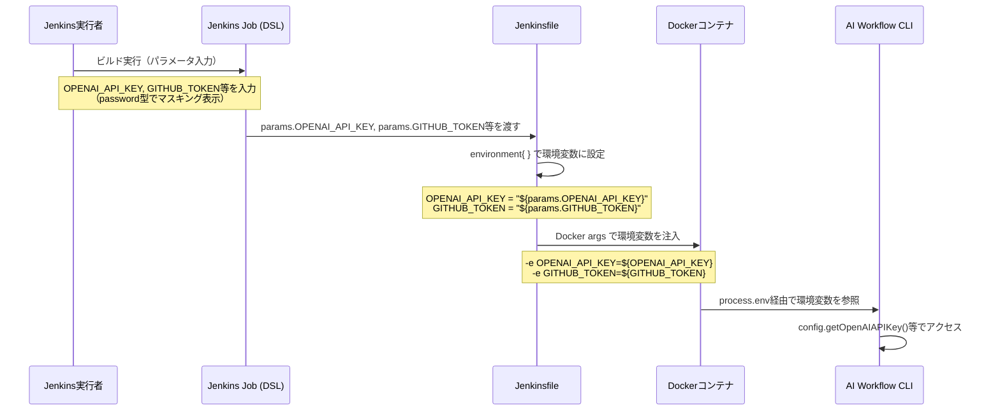
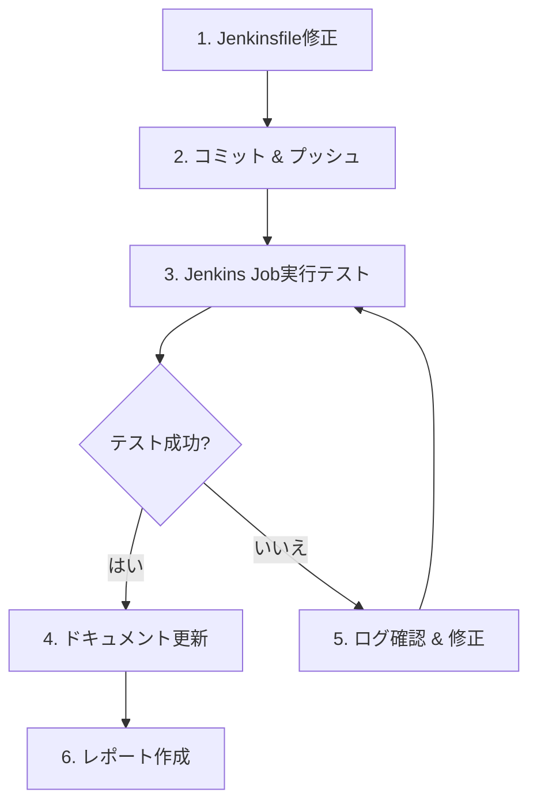

# 設計書

## 0. Planning Documentの確認

Planning Document（@.ai-workflow/issue-184/00_planning/output/planning.md）で策定された開発計画を確認しました：

- **実装戦略**: EXTEND（既存Jenkinsfileの拡張）
- **テスト戦略**: INTEGRATION_ONLY（Jenkins Job実行時の動作検証）
- **テストコード戦略**: CREATE_TEST（テストシナリオドキュメントを新規作成、自動テストスクリプトは不要）
- **複雑度**: 簡単（単一ファイルの修正のみ）
- **見積もり工数**: 2~3時間
- **リスク評価**: 低

この計画に基づき、以下の設計を実施します。

---

## 1. アーキテクチャ設計

### 1.1 システム全体図

```
┌─────────────────────────────────────────────────┐
│           Jenkins Job (DSL定義)                 │
│                                                 │
│  ┌───────────────────────────────────────────┐ │
│  │ パラメータ定義 (parameters)               │ │
│  │  - OPENAI_API_KEY (password型)            │ │
│  │  - GITHUB_TOKEN (password型)              │ │
│  │  - AWS_ACCESS_KEY_ID (password型)         │ │
│  │  - AWS_SECRET_ACCESS_KEY (password型)     │ │
│  │  - AWS_SESSION_TOKEN (password型)         │ │
│  └───────────────┬───────────────────────────┘ │
│                  │                               │
│                  │ パラメータ渡し                │
│                  ▼                               │
│  ┌───────────────────────────────────────────┐ │
│  │ Jenkinsfile (Pipeline)                    │ │
│  │                                           │ │
│  │ environment {                             │ │
│  │   OPENAI_API_KEY = "${params.xxx}"       │ │
│  │   GITHUB_TOKEN = "${params.xxx}"         │ │
│  │   AWS_xxx = "${params.xxx}"              │ │
│  │ }                                         │ │
│  └───────────────┬───────────────────────────┘ │
│                  │                               │
└──────────────────┼───────────────────────────────┘
                   │ 環境変数として渡される
                   ▼
┌─────────────────────────────────────────────────┐
│       Dockerコンテナ (Node.js環境)              │
│                                                 │
│  ┌───────────────────────────────────────────┐ │
│  │ AI Workflow CLI (TypeScript)              │ │
│  │                                           │ │
│  │ process.env.OPENAI_API_KEY               │ │
│  │ process.env.GITHUB_TOKEN                 │ │
│  │ process.env.AWS_xxx                      │ │
│  └───────────────────────────────────────────┘ │
└─────────────────────────────────────────────────┘
```

### 1.2 コンポーネント間の関係

**変更前**:
```
Jenkins Credentials Store
    ├─ openai-api-key (Secret Text)
    ├─ github-token (Secret Text)
    └─ claude-code-oauth-token (Secret Text)
           ↓
    credentials('xxx')
           ↓
      environment{}
           ↓
    Dockerコンテナ環境変数
```

**変更後（統一パターン）**:
```
Jenkins Job パラメータ (DSL定義)
    ├─ OPENAI_API_KEY (password型)
    ├─ GITHUB_TOKEN (password型)
    ├─ AWS_ACCESS_KEY_ID (password型)
    ├─ AWS_SECRET_ACCESS_KEY (password型)
    └─ AWS_SESSION_TOKEN (password型)
           ↓
     "${params.xxx}"
           ↓
      environment{}
           ↓
    Dockerコンテナ環境変数
```

**変更なし（Claude認証情報のみCredentials Storeを使用）**:
```
Jenkins Credentials Store
    └─ claude-code-oauth-token (Secret Text)
           ↓
    credentials('xxx')
           ↓
      environment{}
           ↓
    Dockerコンテナ環境変数
```

### 1.3 データフロー



---

## 2. 実装戦略判断

### 実装戦略: EXTEND

**判断根拠**:
- 既存のJenkinsfileに対して、`environment`セクションの変更を実施
- 新規ファイルの作成は不要
- AWS認証情報のパラメータ化パターンが既に存在し、同じ方式を適用する拡張作業
- `credentials()`から`params`への参照変更のみで、Jenkinsfileの構造変更は不要

---

## 3. テスト戦略判断

### テスト戦略: INTEGRATION_ONLY

**判断根拠**:
- Jenkinsfileの変更は、Jenkins Job実行時の動作検証が必須（統合テスト）
- ユニットテストは不要（Groovyスクリプトの単純な設定変更）
- BDDテストも不要（ユーザーストーリーではなく、インフラ設定の変更）
- 実際にJenkins Jobを実行し、パラメータが正しく渡されることを確認する統合テストが中心

---

## 4. テストコード戦略判断

### テストコード戦略: CREATE_TEST

**判断根拠**:
- Jenkinsfileの統合テストは、Jenkins Job実行ログで検証するため、テストコード（自動テストスクリプト）の作成は不要
- 代わりに、テストシナリオドキュメント（手動検証手順）を新規作成する
- テスト実行フェーズで、手動でJenkins Jobを実行し、パラメータが正しくマスキングされることを確認

---

## 5. 影響範囲分析

### 5.1 既存コードへの影響

**変更ファイル**: `Jenkinsfile` のみ

**変更箇所**:
1. **environment セクション** (Line 89-115):
   - Line 113: `OPENAI_API_KEY = credentials('openai-api-key')` → `OPENAI_API_KEY = "${params.OPENAI_API_KEY}"`
   - Line 114: `GITHUB_TOKEN = credentials('github-token')` → `GITHUB_TOKEN = "${params.GITHUB_TOKEN}"`

2. **Docker args** (Line 77):
   - 既にDOCKER_ARGS環境変数として`OPENAI_API_KEY`と`GITHUB_TOKEN`が渡されているため、変更不要

**影響を受けないコンポーネント**:
- Jenkins Job DSL定義（`jenkins/jobs/dsl/ai-workflow/ai_workflow_orchestrator.groovy`）
  - パラメータ定義は既存のままで動作する（新規追加ではなく、参照方法の変更のみ）
- AI Workflow CLI（TypeScript）
  - `process.env`経由で環境変数を参照しているため、無変更
- Dockerコンテナイメージ
  - 環境変数の渡し方は変わらないため、無変更

### 5.2 依存関係の変更

**新規依存**: なし

**既存依存の変更**: なし

**Jenkins設定の変更**:
- Jenkins Jobで新しいパラメータ（`OPENAI_API_KEY`、`GITHUB_TOKEN`）を設定する必要がある
- ただし、パラメータ定義はJob DSLで既に存在することを前提とする（Issue本文で指示されているため）

### 5.3 マイグレーション要否

- **データベーススキーマ変更**: なし
- **設定ファイル変更**: なし
- **Jenkins Credentials削除の検討**:
  - `openai-api-key` と `github-token` のcredentialsは、パラメータ化後も保持するか、削除するかを判断する必要がある
  - ただし、削除はこのIssueのスコープ外（別Issueで対応）

---

## 6. 変更・追加ファイルリスト

### 6.1 修正が必要な既存ファイル

| ファイルパス | 修正内容 | 優先度 |
|-------------|---------|--------|
| `Jenkinsfile` | `environment`セクションで`credentials()`から`params`への参照変更 | 高 |

### 6.2 新規作成ファイル

なし

### 6.3 削除が必要なファイル

なし

---

## 7. 詳細設計

### 7.1 Jenkinsfile変更詳細

#### 変更前（Line 112-114）

```groovy
// 認証情報（Jenkinsクレデンシャルから取得）
OPENAI_API_KEY = credentials('openai-api-key')
GITHUB_TOKEN = credentials('github-token')
```

#### 変更後（Line 112-114）

```groovy
// 認証情報（Job DSLパラメータから環境変数に設定）
OPENAI_API_KEY = "${params.OPENAI_API_KEY}"
GITHUB_TOKEN = "${params.GITHUB_TOKEN}"
```

#### コメント修正（Line 41-44）

**変更前**:
```groovy
* 認証情報（Jenkins Credentialsで設定）:
* - claude-code-oauth-token: Claude Agent SDK用OAuthトークン（必須）
* - openai-api-key: ContentParser用OpenAI APIキー（必須）
* - github-token: GitHub API用トークン（必須）
```

**変更後**:
```groovy
* 認証情報:
* - OPENAI_API_KEY: OpenAI API Key（Job DSLパラメータから取得）
* - GITHUB_TOKEN: GitHub Personal Access Token（Job DSLパラメータから取得）
* - AWS認証情報: AWS_ACCESS_KEY_ID, AWS_SECRET_ACCESS_KEY, AWS_SESSION_TOKEN（Job DSLパラメータから取得）
* - claude-code-oauth-token: Claude Agent SDK用OAuthトークン（Jenkins Credentialsで設定）
```

### 7.2 パラメータ型とマスキング

| パラメータ名 | 型 | マスキング | デフォルト値 |
|-------------|-----|----------|-------------|
| `OPENAI_API_KEY` | `password` | ✅ | なし |
| `GITHUB_TOKEN` | `password` | ✅ | なし |
| `AWS_ACCESS_KEY_ID` | `password` | ✅ | なし |
| `AWS_SECRET_ACCESS_KEY` | `password` | ✅ | なし |
| `AWS_SESSION_TOKEN` | `password` | ✅ | なし |

**マスキング動作**:
- Jenkins画面のパラメータ入力時: `****`で表示
- コンソール出力: `****`でマスキング
- Docker環境変数: 平文で渡される（コンテナ内部では平文アクセス可能）

### 7.3 環境変数の伝播パス

```
params.OPENAI_API_KEY (Jenkins Job DSL定義)
    ↓
environment { OPENAI_API_KEY = "${params.OPENAI_API_KEY}" } (Jenkinsfile)
    ↓
Docker args: -e OPENAI_API_KEY=${OPENAI_API_KEY} (Jenkinsfile Line 77)
    ↓
process.env.OPENAI_API_KEY (AI Workflow CLI)
    ↓
config.getOpenAIAPIKey() (src/core/config.ts)
```

### 7.4 AWS認証情報との統一パターン

既存のAWS認証情報パターン（Line 107-110）:
```groovy
// AWS認証情報（Job DSLパラメータから環境変数に設定）
AWS_ACCESS_KEY_ID = "${params.AWS_ACCESS_KEY_ID ?: ''}"
AWS_SECRET_ACCESS_KEY = "${params.AWS_SECRET_ACCESS_KEY ?: ''}"
AWS_SESSION_TOKEN = "${params.AWS_SESSION_TOKEN ?: ''}"
```

**統一後のパターン（新規追加）**:
```groovy
// 認証情報（Job DSLパラメータから環境変数に設定）
OPENAI_API_KEY = "${params.OPENAI_API_KEY}"
GITHUB_TOKEN = "${params.GITHUB_TOKEN}"
```

**相違点**:
- AWS認証情報: `?: ''`によるフォールバック（空文字列）を提供
- OPENAI_API_KEY/GITHUB_TOKEN: フォールバックなし（必須パラメータとして扱う）

**判断**:
- OPENAI_API_KEYとGITHUB_TOKENは必須パラメータであるため、フォールバックは不要
- もしパラメータが未設定の場合、Jenkinsのビルド実行時にエラーとなる（意図的な動作）

---

## 8. セキュリティ考慮事項

### 8.1 認証・認可

- **パラメータ型**: `password`型を使用し、Jenkins画面とコンソール出力でマスキングされる
- **Jenkins Credentials Store**: 今後、`openai-api-key`と`github-token`のcredentialsは削除可能（別Issueで対応）
- **Claude認証情報**: `claude-code-oauth-token`は引き続きCredentials Storeを使用（`Prepare Agent Credentials`ステージで処理）

### 8.2 データ保護

- **Jenkinsログ**: パラメータ値は`****`でマスキングされるため、ログに平文で記録されない
- **Docker環境変数**: コンテナ内部では平文でアクセス可能（既存のAWS認証情報と同じ動作）
- **Git リポジトリ**: Jenkinsfile自体にシークレットは含まれない

### 8.3 セキュリティリスクと対策

| リスク | 対策 |
|--------|------|
| パラメータ値の漏洩 | Jenkins画面とコンソール出力で`password`型によるマスキング |
| 環境変数の漏洩 | Docker コンテナ内部でのみアクセス可能、コンテナ終了時に破棄 |
| Jenkinsログの平文記録 | `password`型パラメータは自動的にマスキング |

---

## 9. 非機能要件への対応

### 9.1 パフォーマンス

- **影響**: なし
- **理由**: `credentials()`から`params`への参照変更のみで、処理時間に影響を与えない

### 9.2 スケーラビリティ

- **影響**: なし
- **理由**: 認証情報の取得方法の変更のみで、スケーラビリティに影響を与えない

### 9.3 保守性

- **向上**: 認証情報の取得方法が統一され、保守性が向上
- **一貫性**: AWS認証情報と同じパターンで統一され、コードの可読性が向上
- **ドキュメント**: コメント更新により、認証情報の取得方法が明確化

---

## 10. 実装の順序

### 10.1 推奨実装順序



### 10.2 実装ステップ詳細

| ステップ | 作業内容 | 依存関係 |
|---------|---------|---------|
| 1 | Jenkinsfile修正（`environment`セクション） | なし |
| 2 | コミット & プッシュ（feature/issue-184ブランチ） | ステップ1完了 |
| 3 | Jenkins Job実行テスト（パラメータ入力画面確認） | ステップ2完了 |
| 4 | パラメータマスキング検証（コンソール出力確認） | ステップ3完了 |
| 5 | 環境変数設定検証（Docker コンテナ内で確認） | ステップ4完了 |
| 6 | ドキュメント更新（README.md等） | ステップ5完了 |
| 7 | レポート作成（実装完了レポート） | ステップ6完了 |

### 10.3 依存関係の考慮

- **前提条件**:
  - Jenkins Job DSLで`OPENAI_API_KEY`と`GITHUB_TOKEN`のパラメータが定義されていること
  - Job DSLパラメータは`password`型で定義されていること

- **並行作業不可**:
  - Jenkinsfile修正とテスト実行は順次実行する必要がある

- **ブロック要因**:
  - Jenkins Job DSLパラメータが未定義の場合、実装がブロックされる
  - ただし、Issue本文でパラメータ定義が指示されているため、前提条件として満たされている

---

## 11. 実装時の注意事項

### 11.1 Groovy構文

- **文字列補間**: `"${params.OPENAI_API_KEY}"`を使用（ダブルクォートで囲む）
- **エルビス演算子**: `?:`によるフォールバックは不要（必須パラメータとして扱う）

### 11.2 後方互換性

- **パラメータ追加**: 既存のJobには影響を与えない（後方互換性あり）
- **ただし、新しいパラメータを設定しない限り、ビルドが失敗する**
  - これは意図的な動作（必須パラメータとして扱う）
  - ドキュメントで移行手順を明記する必要がある

### 11.3 テスト時の確認ポイント

1. **Jenkins画面でのパラメータ表示**: `password`型で`****`表示されるか
2. **コンソール出力でのマスキング**: パラメータ値が`****`でマスキングされるか
3. **Docker コンテナ内での環境変数**: `echo $OPENAI_API_KEY`で値が設定されているか
4. **AI Workflow CLI**: `config.getOpenAIAPIKey()`で値が取得できるか

---

## 12. 品質ゲート（Phase 2: Design）

- [x] **実装戦略の判断根拠が明記されている**
  - EXTEND戦略を選択し、既存Jenkinsfileの拡張作業であることを明示
- [x] **テスト戦略の判断根拠が明記されている**
  - INTEGRATION_ONLY戦略を選択し、Jenkins Job実行時の動作検証が中心であることを明示
- [x] **テストコード戦略の判断根拠が明記されている**
  - CREATE_TEST戦略を選択し、テストシナリオドキュメントを新規作成することを明示
- [x] **既存コードへの影響範囲が分析されている**
  - Jenkinsfileのみが影響を受けることを明示し、他のコンポーネントへの影響がないことを確認
- [x] **変更が必要なファイルがリストアップされている**
  - `Jenkinsfile`のみが修正対象であることを明示
- [x] **設計が実装可能である**
  - 変更前後のコード例を示し、実装が単純であることを確認

---

## 13. まとめ

この設計では、Jenkinsfileの認証情報管理を`credentials()`から`params`に統一するシンプルな変更を実施します。

**主な変更点**:
1. `environment`セクションで`credentials('openai-api-key')`を`"${params.OPENAI_API_KEY}"`に変更
2. `environment`セクションで`credentials('github-token')`を`"${params.GITHUB_TOKEN}"`に変更
3. コメントを更新し、認証情報の取得方法を明確化

**メリット**:
- AWS認証情報と同じパターンで統一され、コードの一貫性が向上
- 保守性が向上し、認証情報管理が明確化
- Jenkins Credentials Storeへの依存度が低下

**リスク**:
- 低リスク（単純な参照方法の変更のみ）
- パラメータ未設定時のビルド失敗は意図的な動作（ドキュメントで明記）

**次のアクション**: Phase 3（Test Scenario）に進み、テストシナリオを作成してください。

---

**作成日**: 2025-01-XX
**バージョン**: 1.0
**ステータス**: Draft
