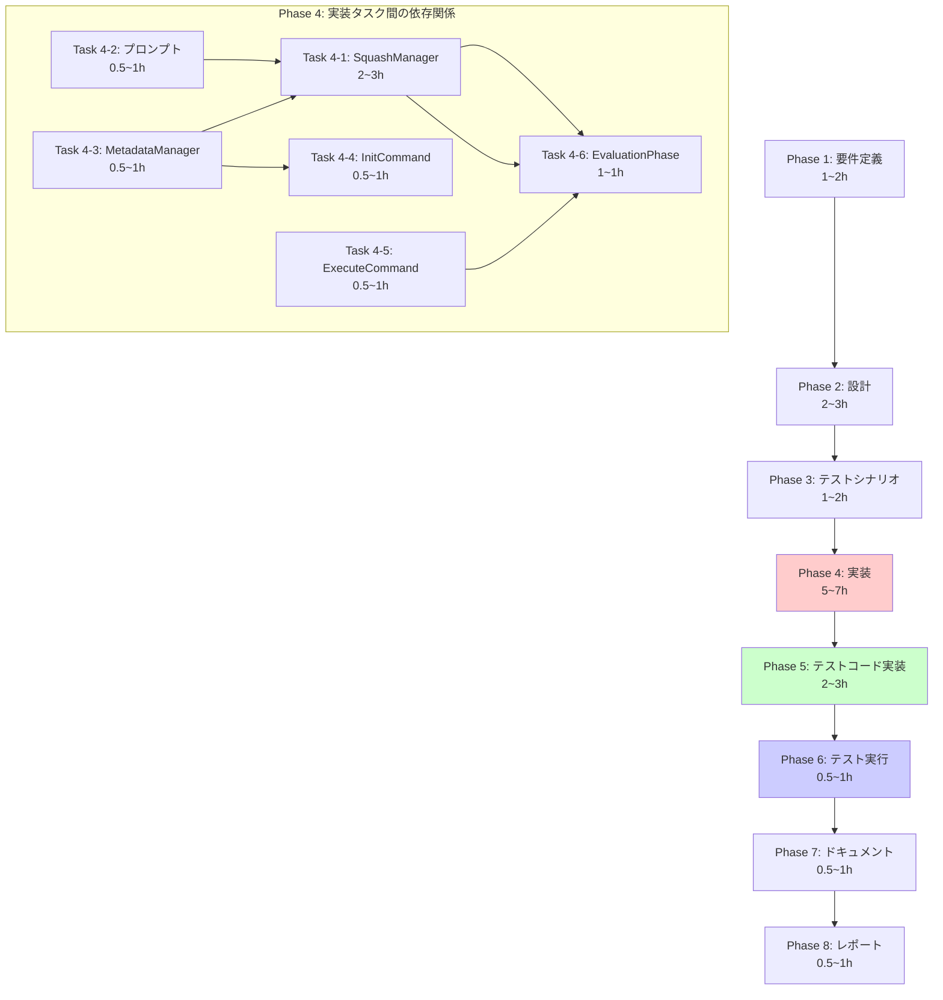

# プロジェクト計画書 - Issue #194

## 1. Issue分析

### Issue概要
- **Issue番号**: #194
- **タイトル**: feat: Squash commits after workflow completion with agent-generated commit message
- **状態**: open
- **優先度**: enhancement
- **URL**: https://github.com/tielec/ai-workflow-agent/issues/194

### 複雑度判定
**複雑度**: 中程度

**判定根拠**:
- 複数の既存モジュール（GitManager、MetadataManager、EvaluationPhase等）への変更が必要
- 新規クラス（SquashManager）の作成が必要
- Git操作（スカッシュ、フォースプッシュ）のエラーハンドリングが重要
- エージェント統合（コミットメッセージ生成）が含まれる
- 後方互換性の確保が必要
- ただし、アーキテクチャの大幅な変更は不要で、既存パターンに従って実装可能

### 見積もり工数
**合計見積もり**: 12~18時間

**内訳**:
- Phase 1（要件定義）: 1~2時間
- Phase 2（設計）: 2~3時間
- Phase 3（テストシナリオ）: 1~2時間
- Phase 4（実装）: 5~7時間
- Phase 5（テストコード実装）: 2~3時間
- Phase 6（テスト実行）: 0.5~1時間
- Phase 7（ドキュメント）: 0.5~1時間
- Phase 8（レポート）: 0.5~1時間

### リスク評価
**全体リスク**: 中

**主要リスク**:
1. **フォースプッシュの安全性** (影響度: 高、確率: 中)
   - `--force-with-lease`の誤用によるコミット喪失の可能性
   - ブランチ保護設定との競合

2. **エージェント生成メッセージの品質** (影響度: 中、確率: 低)
   - 不適切なコミットメッセージが生成される可能性

3. **後方互換性** (影響度: 中、確率: 低)
   - 既存ワークフロー（base_commit未記録）への影響

---

## 2. 実装戦略判断

### 実装戦略: EXTEND

**判断根拠**:
- **既存コードの拡張が中心**:
  - `InitCommand`: `base_commit`記録機能の追加
  - `ExecuteCommand`: `--squash-on-complete`オプションの追加
  - `MetadataManager`: 新規フィールド（`base_commit`, `pre_squash_commits`）の追加
  - `EvaluationPhase`: スカッシュ処理の呼び出し追加

- **新規クラスは1つのみ**:
  - `SquashManager`は新規作成だが、既存の`GitManager`階層に統合される専門マネージャー
  - 既存のファサードパターンに従った設計

- **アーキテクチャ変更なし**:
  - 既存のフェーズ構造、Git操作パターン、メタデータ管理パターンを踏襲
  - 既存のエージェント統合パターンを再利用

**結論**: 既存機能への追加（機能拡張）が中心であり、新規サブシステムの構築ではないため、**EXTEND**戦略が適切。

---

### テスト戦略: UNIT_INTEGRATION

**判断根拠**:

#### ユニットテストが必要な理由:
- **`SquashManager`**: 単体でのロジックテストが重要
  - コミット範囲の特定（`base_commit`からHEADまで）
  - ブランチ保護チェック（main/masterへのフォースプッシュ禁止）
  - エラーハンドリング（スカッシュ失敗時の処理）

- **`MetadataManager`**: 新規フィールドのCRUD操作
  - `base_commit`の記録・取得
  - `pre_squash_commits`の記録

- **プロンプトテンプレート**: コミットメッセージ生成ロジック
  - テンプレート変数の置換
  - フォーマット検証

#### インテグレーションテストが必要な理由:
- **Git操作の統合**:
  - `git reset --soft` → `git commit` → `git push --force-with-lease`の一連の流れ
  - リモートリポジトリとの連携

- **エージェント統合**:
  - Codex/Claudeによるコミットメッセージ生成
  - プロンプトからレスポンスまでのエンドツーエンド

- **ワークフロー統合**:
  - `init` → `execute --phase all` → `evaluation` → スカッシュの全体フロー
  - `--cleanup-on-complete`との併用

#### BDDテストが不要な理由:
- エンドユーザー向けのストーリーではなく、開発者向けの内部機能
- CLIオプションの動作確認は統合テストで十分

**結論**: ロジックの正確性（ユニット）+ Git/エージェント統合（インテグレーション）の両方が必要なため、**UNIT_INTEGRATION**が適切。

---

### テストコード戦略: BOTH_TEST

**判断根拠**:

#### 既存テストファイルに追加（EXTEND_TEST）:
- **`tests/unit/metadata-manager.test.ts`**:
  - `base_commit`フィールドのテストを追加
  - `pre_squash_commits`フィールドのテストを追加

- **`tests/unit/git-manager.test.ts`**:
  - `SquashManager`統合後のファサードメソッドテストを追加

- **`tests/integration/execute-command.test.ts`**:
  - `--squash-on-complete`オプションのテストを追加

#### 新規テストファイル作成（CREATE_TEST）:
- **`tests/unit/squash-manager.test.ts`** (新規):
  - `SquashManager`のユニットテスト
  - コミット範囲特定、ブランチ保護チェック、エラーハンドリング

- **`tests/integration/squash-workflow.test.ts`** (新規):
  - スカッシュワークフロー全体のエンドツーエンドテスト
  - `init` → `execute` → スカッシュの統合テスト

**結論**: 既存機能の拡張（メタデータ、Git操作）と新規機能（SquashManager）の両方が含まれるため、**BOTH_TEST**が適切。

---

## 3. 影響範囲分析

### 既存コードへの影響

#### 変更が必要なファイル（7ファイル）:

1. **`src/commands/init.ts`** (約306行):
   - `base_commit`の記録機能追加
   - 影響度: 低（新規フィールド追加のみ）

2. **`src/commands/execute.ts`** (約497行):
   - `--squash-on-complete`, `--no-squash-on-complete`オプション追加
   - 影響度: 低（オプション追加のみ）

3. **`src/core/metadata-manager.ts`** (約347行):
   - `base_commit`, `pre_squash_commits`フィールド追加
   - getter/setterメソッド追加
   - 影響度: 低（既存APIは変更なし）

4. **`src/core/git-manager.ts`** (約181行):
   - `SquashManager`統合（ファサードパターン）
   - `squashCommits()`メソッドの委譲追加
   - 影響度: 低（ファサードパターンで後方互換性維持）

5. **`src/phases/evaluation.ts`** (約200行):
   - スカッシュ処理の呼び出し追加（クリーンアップ後）
   - 影響度: 低（既存ロジックは変更なし）

6. **`src/types/workflow-state.ts`** (約120行):
   - `WorkflowState`インターフェースに`base_commit`, `pre_squash_commits`追加
   - 影響度: 低（型定義の拡張のみ）

7. **`src/types/commands.ts`** (約240行):
   - `ExecuteCommandOptions`に`squashOnComplete`フィールド追加
   - 影響度: 低（型定義の拡張のみ）

#### 新規作成ファイル（2ファイル）:

1. **`src/core/git/squash-manager.ts`** (約250~300行):
   - スカッシュ処理の専門マネージャー
   - コミット範囲特定、メッセージ生成、スカッシュ実行

2. **`src/prompts/squash/generate-message.txt`** (約100行):
   - コミットメッセージ生成用プロンプトテンプレート

### 依存関係の変更

#### 新規依存:
- なし（既存の依存関係のみ使用）

#### 既存依存の変更:
- なし

### マイグレーション要否

#### メタデータマイグレーション: 不要

**理由**:
- `base_commit`フィールドはオプショナル
- 既存ワークフロー（`base_commit`未記録）でもエラーにならない
- スカッシュ機能は`base_commit`がある場合のみ実行

**後方互換性の確保**:
```typescript
const baseCommit = metadataManager.getBaseCommit();
if (!baseCommit) {
  logger.warn('base_commit not found in metadata. Skipping squash.');
  return;
}
```

---

## 4. タスク分割

### Phase 1: 要件定義 (見積もり: 1~2h)

- [ ] Task 1-1: スカッシュ機能の詳細要件を定義 (0.5~1h)
  - スカッシュ対象コミットの特定方法の明確化
  - コミットメッセージ生成の入力/出力仕様の確定
  - エラーハンドリング要件の定義

- [ ] Task 1-2: 受け入れ基準を定義 (0.5~1h)
  - 機能要件の受け入れ基準（スカッシュ成功条件）
  - 非機能要件の受け入れ基準（パフォーマンス、安全性）
  - セキュリティ要件（ブランチ保護、フォースプッシュ制限）

### Phase 2: 設計 (見積もり: 2~3h)

- [x] Task 2-1: SquashManagerクラスの設計 (1~1.5h)
  - クラス構造（メソッド、プロパティ）の定義
  - GitManager統合（ファサードパターン）の設計
  - エラーハンドリング戦略の設計

- [x] Task 2-2: コミットメッセージ生成プロンプトの設計 (0.5~1h)
  - プロンプトテンプレート構造の定義
  - 入力変数（Issue情報、差分統計）の定義
  - 出力フォーマット（Conventional Commits）の定義

- [x] Task 2-3: メタデータスキーマ拡張の設計 (0.5~0.5h)
  - `base_commit`, `pre_squash_commits`フィールドの仕様
  - 後方互換性の確保方法
  - マイグレーション不要の根拠確認

### Phase 3: テストシナリオ (見積もり: 1~2h)

- [ ] Task 3-1: ユニットテストシナリオの作成 (0.5~1h)
  - SquashManagerのテストシナリオ（コミット範囲特定、ブランチ保護）
  - MetadataManagerのテストシナリオ（新規フィールドCRUD）

- [ ] Task 3-2: インテグレーションテストシナリオの作成 (0.5~1h)
  - スカッシュワークフロー全体のエンドツーエンドシナリオ
  - エージェント統合（コミットメッセージ生成）シナリオ
  - エラーケース（スカッシュ失敗、フォースプッシュ失敗）シナリオ

### Phase 4: 実装 (見積もり: 5~7h)

- [ ] Task 4-1: SquashManagerクラスの実装 (2~3h)
  - `getCommitsToSquash()`: コミット範囲特定
  - `validateBranchProtection()`: ブランチ保護チェック
  - `generateCommitMessage()`: エージェント連携（コミットメッセージ生成）
  - `squashCommits()`: スカッシュ実行（reset + commit + push）

- [ ] Task 4-2: プロンプトテンプレートの実装 (0.5~1h)
  - `src/prompts/squash/generate-message.txt`の作成
  - Conventional Commits形式の強制
  - Issue情報と差分統計の注入

- [ ] Task 4-3: メタデータ管理の拡張 (0.5~1h)
  - `MetadataManager.setBaseCommit()`
  - `MetadataManager.getBaseCommit()`
  - `MetadataManager.setPreSquashCommits()`

- [ ] Task 4-4: InitCommandの拡張 (0.5~1h)
  - `base_commit`記録処理の追加
  - Git操作エラーのハンドリング

- [ ] Task 4-5: ExecuteCommandの拡張 (0.5~1h)
  - `--squash-on-complete`オプションの追加
  - 環境変数`AI_WORKFLOW_SQUASH_ON_COMPLETE`の読み込み

- [ ] Task 4-6: EvaluationPhaseの拡張 (1~1h)
  - スカッシュ処理の呼び出し（クリーンアップ後）
  - エラーハンドリング（スカッシュ失敗時もワークフロー継続）
  - GitManager統合

### Phase 5: テストコード実装 (見積もり: 2~3h)

- [ ] Task 5-1: SquashManagerユニットテストの実装 (1~1.5h)
  - `tests/unit/squash-manager.test.ts`の作成
  - コミット範囲特定のテスト
  - ブランチ保護チェックのテスト
  - エラーハンドリングのテスト

- [ ] Task 5-2: MetadataManager拡張テストの実装 (0.5~0.5h)
  - `tests/unit/metadata-manager.test.ts`への追加
  - `base_commit`フィールドのCRUDテスト

- [ ] Task 5-3: スカッシュワークフロー統合テストの実装 (0.5~1h)
  - `tests/integration/squash-workflow.test.ts`の作成
  - エンドツーエンドシナリオ（init → execute → squash）
  - エージェント統合テスト（コミットメッセージ生成）

### Phase 6: テスト実行 (見積もり: 0.5~1h)

- [ ] Task 6-1: ユニットテストの実行と修正 (0.25~0.5h)
  - `npm run test:unit`実行
  - 失敗したテストの修正

- [ ] Task 6-2: インテグレーションテストの実行と修正 (0.25~0.5h)
  - `npm run test:integration`実行
  - 失敗したテストの修正

### Phase 7: ドキュメント (見積もり: 0.5~1h)

- [ ] Task 7-1: CLAUDE.mdの更新 (0.25~0.5h)
  - CLIオプション（`--squash-on-complete`）の追加
  - 環境変数（`AI_WORKFLOW_SQUASH_ON_COMPLETE`）の追加
  - スカッシュ機能の説明追加

- [ ] Task 7-2: ARCHITECTURE.mdの更新 (0.25~0.5h)
  - SquashManagerの追加
  - GitManager統合の説明
  - スカッシュフローの図示

### Phase 8: レポート (見積もり: 0.5~1h)

- [ ] Task 8-1: 完了レポートの作成 (0.25~0.5h)
  - 実装内容のサマリー
  - テスト結果のサマリー
  - 変更ファイル一覧

- [ ] Task 8-2: PRボディの生成 (0.25~0.5h)
  - 機能説明
  - スクリーンショット（CLIオプション実行例）
  - Breaking Changesの確認（なし）

---

## 5. 依存関係



### クリティカルパス
1. Phase 1（要件定義）→ Phase 2（設計）→ Phase 3（テストシナリオ）
2. Phase 4（実装）: Task 4-2（プロンプト）→ Task 4-1（SquashManager）→ Task 4-6（EvaluationPhase）
3. Phase 5（テストコード）→ Phase 6（テスト実行）→ Phase 7（ドキュメント）→ Phase 8（レポート）

**クリティカルパス上のタスク**: Phase 1 → 2 → 3 → Task 4-2 → Task 4-1 → Task 4-6 → Phase 5 → 6 → 7 → 8

---

## 6. リスクと軽減策

### リスク1: フォースプッシュによるコミット喪失
- **影響度**: 高
- **確率**: 中
- **カテゴリ**: 技術的リスク
- **軽減策**:
  1. **`--force-with-lease`の使用**: 他の開発者のプッシュを検出し、上書きを防ぐ
  2. **pre_squash_commits記録**: スカッシュ前の全コミットハッシュを`metadata.json`に記録
  3. **ブランチ保護チェック**: main/masterへのフォースプッシュを明示的に禁止
  4. **エラーハンドリング**: フォースプッシュ失敗時は元のコミット履歴を維持
  5. **ドライランモード**: `--dry-run`オプションで事前確認（将来拡張）

### リスク2: エージェント生成メッセージの品質
- **影響度**: 中
- **確率**: 低
- **カテゴリ**: 技術的リスク
- **軽減策**:
  1. **プロンプト最適化**: Conventional Commits形式を強制するプロンプト設計
  2. **バリデーション**: 生成されたメッセージのフォーマット検証
  3. **フォールバック**: エージェント失敗時はテンプレートベースのメッセージを使用
  4. **レビュー可能性**: 生成されたメッセージを事前にログ出力（確認可能）

### リスク3: 既存ワークフローへの影響（後方互換性）
- **影響度**: 中
- **確率**: 低
- **カテゴリ**: 技術的リスク
- **軽減策**:
  1. **オプトイン方式**: デフォルトは無効（`--squash-on-complete`明示時のみ有効）
  2. **base_commit未記録時のスキップ**: 既存ワークフローでエラーにならない
  3. **後方互換性テスト**: 既存ワークフロー（base_commit未記録）での動作確認
  4. **段階的ロールアウト**: 少数のIssueで先行検証後、全体に適用

### リスク4: Git操作のエラーハンドリング不足
- **影響度**: 中
- **確率**: 中
- **カテゴリ**: 技術的リスク
- **軽減策**:
  1. **エラーケースの網羅**: スカッシュ失敗、フォースプッシュ失敗、ネットワークエラー等
  2. **ワークフロー継続**: スカッシュ失敗時もワークフロー全体は継続（WARNING ログ）
  3. **リトライロジック**: フォースプッシュ失敗時は既存のリトライ機構を活用
  4. **統合テスト**: エラーケースを含むシナリオをテスト

### リスク5: スコープクリープ（機能追加の要求）
- **影響度**: 低
- **確率**: 中
- **カテゴリ**: スコープリスク
- **軽減策**:
  1. **MVP原則**: 最小限の機能（基本的なスカッシュ）に絞る
  2. **将来拡張の余地**: ドライランモード、カスタムメッセージ等は将来拡張として切り分け
  3. **明確な受け入れ基準**: Phase 1で合意した要件のみを実装
  4. **Issue分割**: 追加要求は別Issueとして起票

---

## 7. 品質ゲート

### Phase 1: 要件定義

- [ ] スカッシュ対象コミットの特定方法が明確に定義されている
- [ ] コミットメッセージ生成の入力/出力仕様が確定している
- [ ] 受け入れ基準（機能要件、非機能要件、セキュリティ要件）が定義されている
- [ ] エラーハンドリング要件が明確に定義されている
- [ ] 後方互換性の要件が確認されている

### Phase 2: 設計

- [ ] **実装戦略（EXTEND）の判断根拠が明記されている**
- [ ] **テスト戦略（UNIT_INTEGRATION）の判断根拠が明記されている**
- [ ] **テストコード戦略（BOTH_TEST）の判断根拠が明記されている**
- [ ] SquashManagerクラスの設計が完了している（メソッド、プロパティ、エラーハンドリング）
- [ ] プロンプトテンプレート構造が定義されている（入力変数、出力フォーマット）
- [ ] メタデータスキーマ拡張が設計されている（後方互換性確保）
- [ ] GitManager統合（ファサードパターン）の設計が完了している

### Phase 3: テストシナリオ

- [ ] ユニットテストシナリオが作成されている（SquashManager、MetadataManager）
- [ ] インテグレーションテストシナリオが作成されている（スカッシュワークフロー全体、エージェント統合）
- [ ] エラーケースシナリオが網羅されている（スカッシュ失敗、フォースプッシュ失敗）
- [ ] 各シナリオに期待される結果が明記されている

### Phase 4: 実装

- [ ] SquashManagerクラスが実装され、すべてのメソッドが動作する
- [ ] プロンプトテンプレート（`generate-message.txt`）が作成されている
- [ ] MetadataManagerに新規フィールド（`base_commit`, `pre_squash_commits`）が追加されている
- [ ] InitCommandに`base_commit`記録処理が追加されている
- [ ] ExecuteCommandに`--squash-on-complete`オプションが追加されている
- [ ] EvaluationPhaseにスカッシュ処理呼び出しが追加されている
- [ ] エラーハンドリングが適切に実装されている（スカッシュ失敗時もワークフロー継続）
- [ ] コードが既存のコーディング規約に準拠している

### Phase 5: テストコード実装

- [ ] SquashManagerユニットテストが実装されている（`squash-manager.test.ts`）
- [ ] MetadataManager拡張テストが実装されている（既存テストファイルへの追加）
- [ ] スカッシュワークフロー統合テストが実装されている（`squash-workflow.test.ts`）
- [ ] すべてのテストシナリオがカバーされている（正常系、異常系）

### Phase 6: テスト実行

- [ ] すべてのユニットテストがPASSしている
- [ ] すべてのインテグレーションテストがPASSしている
- [ ] テストカバレッジが基準を満たしている（80%以上）
- [ ] エラーケースが適切にハンドリングされている

### Phase 7: ドキュメント

- [ ] CLAUDE.mdに新機能（CLIオプション、環境変数）が追加されている
- [ ] ARCHITECTURE.mdにSquashManagerが追加されている
- [ ] スカッシュフローが図示されている
- [ ] 使用例が明記されている

### Phase 8: レポート

- [ ] 完了レポートが作成されている（実装内容、テスト結果、変更ファイル一覧）
- [ ] PRボディが生成されている（機能説明、使用例）
- [ ] Breaking Changesがないことが確認されている
- [ ] レビュー準備が完了している

---

## 8. 成功基準（全体）

このプロジェクトが成功したと判断できる基準：

1. **機能要件**:
   - [ ] `--squash-on-complete`オプションでスカッシュが実行される
   - [ ] エージェント生成のコミットメッセージが適切（Conventional Commits形式）
   - [ ] `base_commit`が`init`コマンドで記録される
   - [ ] main/masterへのフォースプッシュが禁止されている

2. **非機能要件**:
   - [ ] スカッシュ失敗時もワークフロー全体は継続する
   - [ ] 後方互換性が維持されている（既存ワークフロー動作）
   - [ ] テストカバレッジ80%以上

3. **品質要件**:
   - [ ] すべてのテストがPASSしている
   - [ ] コードレビューで重大な指摘がない
   - [ ] ドキュメントが最新化されている

4. **リスク管理**:
   - [ ] フォースプッシュによるコミット喪失のリスクが軽減されている
   - [ ] エラーハンドリングが適切に実装されている

---

## 9. 備考

### 実装時の注意点

1. **Git操作の安全性**:
   - `--force-with-lease`を必ず使用（`--force`は禁止）
   - ブランチ保護チェックを実装（main/master検出）
   - `pre_squash_commits`を記録（ロールバック用）

2. **エージェント統合**:
   - 既存のエージェント統合パターン（`BasePhase.executeWithAgent()`）を再利用
   - プロンプトテンプレートは`src/prompts/squash/`に配置
   - エージェント失敗時のフォールバック（テンプレートベースメッセージ）

3. **後方互換性**:
   - `base_commit`はオプショナルフィールド
   - `base_commit`未記録時はスカッシュをスキップ（WARNING ログ）
   - 既存ワークフローでエラーにならないこと

4. **テスト方針**:
   - ユニットテスト: ロジックの正確性（コミット範囲特定、ブランチ保護）
   - インテグレーションテスト: Git操作の統合、エージェント統合、ワークフロー全体

### 将来の拡張可能性

以下は本Issueのスコープ外だが、将来拡張として検討可能：

- **ドライランモード**: `--squash-dry-run`でスカッシュ内容を事前確認
- **カスタムメッセージ**: `--squash-message`でメッセージを手動指定
- **対話的モード**: スカッシュ前に確認プロンプトを表示
- **リベースサポート**: スカッシュ以外のGit履歴整形オプション

---

## 10. 参照ドキュメント

本計画書作成時に参照したドキュメント：

- `@CLAUDE.md` - プロジェクトの全体方針とコーディングガイドライン
- `@ARCHITECTURE.md` - アーキテクチャ設計思想
- `@README.md` - プロジェクト概要と使用方法
- Issue #194 - feat: Squash commits after workflow completion with agent-generated commit message

---

**計画書作成日**: 2025-01-XX
**見積もり合計**: 12~18時間
**複雑度**: 中程度
**全体リスク**: 中
