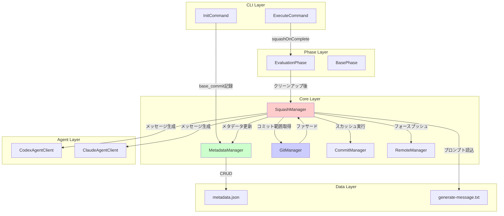
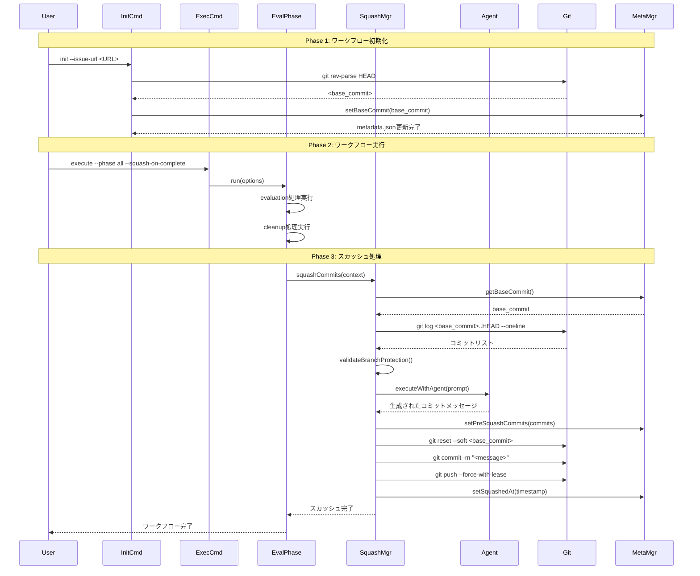
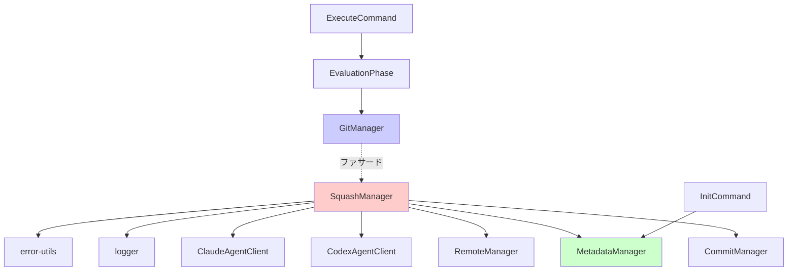
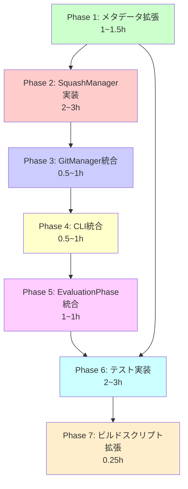
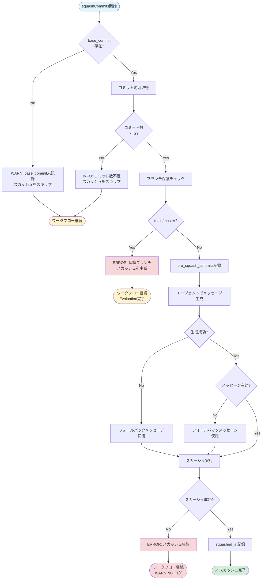

# 設計書 - Issue #194

## 0. Planning Documentの確認

Planning Document（`.ai-workflow/issue-194/00_planning/output/planning.md`）および要件定義書（`.ai-workflow/issue-194/01_requirements/output/requirements.md`）を確認し、以下の開発方針を把握しました：

### 実装戦略
- **EXTEND戦略**: 既存機能への追加（機能拡張）が中心
- 既存コードの拡張が中心（InitCommand、ExecuteCommand、MetadataManager、EvaluationPhase）
- 新規クラスは1つのみ（SquashManager）で、既存のGitManager階層に統合

### テスト戦略
- **UNIT_INTEGRATION**: ロジックの正確性（ユニット）+ Git/エージェント統合（インテグレーション）の両方

### テストコード戦略
- **BOTH_TEST**: 既存テストの拡張と新規テストの作成

### 見積もり工数
- **合計**: 12~18時間
- Phase 4（実装）: 5~7時間

### 主要リスク
1. フォースプッシュによるコミット喪失（影響度: 高、確率: 中）
2. エージェント生成メッセージの品質（影響度: 中、確率: 低）
3. 後方互換性（影響度: 中、確率: 低）

これらの方針を踏まえて、以下の詳細設計を実施します。

---

## 1. アーキテクチャ設計

### 1.1 システム全体図



### 1.2 コンポーネント間の関係

**新規コンポーネント**:
- **SquashManager**: スカッシュ処理の専門マネージャー
  - コミット範囲の特定
  - エージェントによるコミットメッセージ生成
  - スカッシュ実行（reset + commit + push）
  - メタデータ記録

**既存コンポーネント拡張**:
- **MetadataManager**: `base_commit`、`pre_squash_commits`、`squashed_at` フィールド追加
- **GitManager**: `squashCommits()` メソッドを追加（ファサードパターン）
- **InitCommand**: `base_commit` 記録処理追加
- **ExecuteCommand**: `--squash-on-complete` オプション追加
- **EvaluationPhase**: スカッシュ処理呼び出し追加

### 1.3 データフロー



---

## 2. 実装戦略判断

### 実装戦略: EXTEND

**判断根拠**:

1. **既存コードの拡張が中心**:
   - `InitCommand`: `base_commit`記録機能の追加（既存の`handleInitCommand()`に約10行追加）
   - `ExecuteCommand`: `--squash-on-complete`オプション追加（既存のコマンドラインオプション定義に追加）
   - `MetadataManager`: 新規フィールド（`base_commit`, `pre_squash_commits`, `squashed_at`）の追加（既存のCRUD操作パターンを踏襲）
   - `EvaluationPhase`: スカッシュ処理の呼び出し追加（既存の`run()`メソッドに約20行追加）

2. **新規クラスは1つのみ**:
   - `SquashManager`は新規作成だが、既存の`GitManager`階層に統合される専門マネージャー
   - 既存のファサードパターン（`GitManager` → `CommitManager`, `BranchManager`, `RemoteManager`）に従った設計
   - `GitManager`に`squashCommits()`メソッドを追加し、`SquashManager`に委譲する形で後方互換性を維持

3. **アーキテクチャ変更なし**:
   - 既存のフェーズ構造、Git操作パターン、メタデータ管理パターンを踏襲
   - 既存のエージェント統合パターン（`BasePhase.executeWithAgent()`）を再利用
   - Issue #25、Issue #52で確立されたGitManager階層構造を継承

4. **既存コードとの統合度が高い**:
   - `CommitManager`の`ensureGitConfig()`を再利用
   - `RemoteManager`のリトライロジック（`push()`, `isRetriableError()`）を再利用
   - `MetadataManager`の既存CRUD操作パターンを継承

**結論**: 既存機能への追加（機能拡張）が中心であり、新規サブシステムの構築ではないため、**EXTEND**戦略が適切。

---

## 3. テスト戦略判断

### テスト戦略: UNIT_INTEGRATION

**判断根拠**:

### ユニットテストが必要な理由:

1. **`SquashManager`の単体ロジック**:
   - `getCommitsToSquash()`: コミット範囲の特定ロジック（`base_commit`からHEADまで）
   - `validateBranchProtection()`: ブランチ保護チェック（main/masterへのフォースプッシュ禁止）
   - `isValidCommitMessage()`: 生成されたコミットメッセージのバリデーション
   - エラーハンドリング（スカッシュ失敗、フォースプッシュ失敗、ネットワークエラー）

2. **`MetadataManager`の拡張ロジック**:
   - `setBaseCommit()`, `getBaseCommit()`: base_commitフィールドのCRUD操作
   - `setPreSquashCommits()`, `getPreSquashCommits()`: pre_squash_commitsフィールドのCRUD操作
   - `setSquashedAt()`, `getSquashedAt()`: squashed_atフィールドのCRUD操作

3. **プロンプトテンプレート処理**:
   - テンプレート変数（Issue情報、差分統計）の置換ロジック
   - フォーマット検証（Conventional Commits形式）

### インテグレーションテストが必要な理由:

1. **Git操作の統合**:
   - `git reset --soft <base_commit>` → `git commit` → `git push --force-with-lease`の一連の流れ
   - リモートリポジトリとの連携（フォースプッシュの成功/失敗）
   - リトライロジックの統合（`RemoteManager.push()`のリトライ機構）

2. **エージェント統合**:
   - Codex/Claudeによるコミットメッセージ生成のエンドツーエンド
   - プロンプトからレスポンスまでの統合フロー
   - エージェント失敗時のフォールバック処理

3. **ワークフロー統合**:
   - `init` → `execute --phase all --squash-on-complete` → `evaluation` → スカッシュの全体フロー
   - メタデータの永続化と読み込み
   - `--cleanup-on-complete`との併用

### BDDテストが不要な理由:

- エンドユーザー向けのストーリーではなく、開発者向けの内部機能
- CLIオプションの動作確認は統合テストで十分
- ユーザーストーリー（Given-When-Then）を記述する必要性が低い

**結論**: ロジックの正確性（ユニット）+ Git/エージェント統合（インテグレーション）の両方が必要なため、**UNIT_INTEGRATION**が適切。

---

## 4. テストコード戦略判断

### テストコード戦略: BOTH_TEST

**判断根拠**:

### 既存テストファイルに追加（EXTEND_TEST）:

1. **`tests/unit/metadata-manager.test.ts`**:
   - 既存のMetadataManagerテストファイルに以下を追加:
     - `setBaseCommit()` / `getBaseCommit()` のテスト
     - `setPreSquashCommits()` / `getPreSquashCommits()` のテスト
     - `setSquashedAt()` / `getSquashedAt()` のテスト
   - 理由: 既存フィールド（`phases`, `cost_tracking`等）のテストと同じパターンで実装可能

2. **`tests/unit/git-manager.test.ts`**:
   - 既存のGitManagerテストファイルに以下を追加:
     - `squashCommits()` メソッドのファサードテスト（SquashManagerへの委譲確認）
   - 理由: 既存のファサードメソッド（`commitPhaseOutput()`, `push()`等）のテストと同じパターン

3. **`tests/integration/execute-command.test.ts`**:
   - 既存の`handleExecuteCommand()`統合テストに以下を追加:
     - `--squash-on-complete` オプションのパース確認
     - 環境変数`AI_WORKFLOW_SQUASH_ON_COMPLETE`の優先度確認
   - 理由: 既存のCLIオプション（`--cleanup-on-complete`, `--agent`等）のテストと同じパターン

### 新規テストファイル作成（CREATE_TEST）:

1. **`tests/unit/squash-manager.test.ts`** (新規):
   - SquashManagerクラスの単体テスト:
     - `getCommitsToSquash()`: コミット範囲特定のテスト
     - `validateBranchProtection()`: ブランチ保護チェックのテスト
     - `generateCommitMessage()`: エージェント連携のモックテスト
     - `squashCommits()`: スカッシュ実行のモックテスト
     - エラーハンドリング（各種失敗ケース）のテスト
   - 理由: 新規クラスのため、専用のテストファイルが必要

2. **`tests/integration/squash-workflow.test.ts`** (新規):
   - スカッシュワークフロー全体のエンドツーエンドテスト:
     - `init` → `execute --squash-on-complete` → スカッシュの統合テスト
     - エージェント統合（コミットメッセージ生成）のテスト
     - エラーケース（スカッシュ失敗、フォースプッシュ失敗）のテスト
     - `--cleanup-on-complete`との併用テスト
   - 理由: 新規ワークフローのため、専用の統合テストファイルが必要

**結論**: 既存機能の拡張（メタデータ、Git操作、CLIオプション）と新規機能（SquashManager、スカッシュワークフロー）の両方が含まれるため、**BOTH_TEST**が適切。

---

## 5. 影響範囲分析

### 5.1 既存コードへの影響

#### 変更が必要なファイル（7ファイル）:

1. **`src/commands/init.ts`** (約306行):
   - **変更内容**: `base_commit`の記録機能追加
   - **影響度**: 低（新規フィールド追加のみ、既存ロジックは変更なし）
   - **詳細**:
     - `handleInitCommand()`に`git rev-parse HEAD`実行を追加（約5行）
     - `metadataManager.setBaseCommit(baseCommit)`呼び出し追加（約1行）
     - Git操作エラーハンドリング追加（約4行）

2. **`src/commands/execute.ts`** (約497行):
   - **変更内容**: `--squash-on-complete`, `--no-squash-on-complete`オプション追加
   - **影響度**: 低（オプション追加のみ、既存ロジックは変更なし）
   - **詳細**:
     - `commander`定義に新規オプション追加（約2行）
     - 環境変数`AI_WORKFLOW_SQUASH_ON_COMPLETE`の読み込み追加（約3行）
     - `ExecuteCommandOptions`への`squashOnComplete`フィールド追加（約1行）

3. **`src/core/metadata-manager.ts`** (約347行):
   - **変更内容**: `base_commit`, `pre_squash_commits`, `squashed_at`フィールド追加
   - **影響度**: 低（既存APIは変更なし、後方互換性維持）
   - **詳細**:
     - `setBaseCommit(commit: string): void` メソッド追加（約5行）
     - `getBaseCommit(): string | null` メソッド追加（約5行）
     - `setPreSquashCommits(commits: string[]): void` メソッド追加（約5行）
     - `getPreSquashCommits(): string[] | null` メソッド追加（約5行）
     - `setSquashedAt(timestamp: string): void` メソッド追加（約5行）
     - `getSquashedAt(): string | null` メソッド追加（約5行）

4. **`src/core/git-manager.ts`** (約181行):
   - **変更内容**: `SquashManager`統合（ファサードパターン）
   - **影響度**: 低（ファサードパターンで後方互換性維持）
   - **詳細**:
     - `SquashManager`インスタンスのプロパティ追加（約3行）
     - `squashCommits(context: PhaseContext): Promise<void>` メソッド追加（約5行、SquashManagerに委譲）

5. **`src/phases/evaluation.ts`** (約200行):
   - **変更内容**: スカッシュ処理の呼び出し追加（クリーンアップ後）
   - **影響度**: 低（既存ロジックは変更なし、クリーンアップ後に処理追加）
   - **詳細**:
     - `run(options)`メソッドに`squashOnComplete`チェック追加（約20行）
     - スカッシュ失敗時のエラーハンドリング追加（約10行）
     - GitManager統合（`this.gitManager.squashCommits()`呼び出し）

6. **`src/types/workflow-state.ts`** (約120行):
   - **変更内容**: `WorkflowState`インターフェースに`base_commit`, `pre_squash_commits`, `squashed_at`追加
   - **影響度**: 低（型定義の拡張のみ、既存フィールドは変更なし）
   - **詳細**:
     - `base_commit?: string` フィールド追加（約1行）
     - `pre_squash_commits?: string[]` フィールド追加（約1行）
     - `squashed_at?: string` フィールド追加（約1行）

7. **`src/types/commands.ts`** (約240行):
   - **変更内容**: `ExecuteCommandOptions`に`squashOnComplete`フィールド追加
   - **影響度**: 低（型定義の拡張のみ、既存フィールドは変更なし）
   - **詳細**:
     - `squashOnComplete?: boolean` フィールド追加（約1行）

#### 新規作成ファイル（2ファイル）:

1. **`src/core/git/squash-manager.ts`** (約250~300行):
   - **内容**: スカッシュ処理の専門マネージャー
   - **主要メソッド**:
     - `squashCommits(context: PhaseContext): Promise<void>` … スカッシュ全体のオーケストレーション
     - `getCommitsToSquash(baseCommit: string): Promise<string[]>` … コミット範囲の特定
     - `validateBranchProtection(): Promise<void>` … ブランチ保護チェック
     - `generateCommitMessage(context: PhaseContext): Promise<string>` … エージェント連携
     - `executeSquash(baseCommit: string, message: string): Promise<void>` … スカッシュ実行

2. **`src/prompts/squash/generate-message.txt`** (約100行):
   - **内容**: コミットメッセージ生成用プロンプトテンプレート
   - **テンプレート変数**:
     - `{issue_number}` … Issue番号
     - `{issue_title}` … Issueタイトル
     - `{issue_body}` … Issue本文
     - `{diff_stat}` … 変更ファイル一覧（`git diff --stat`）
     - `{diff_shortstat}` … 変更の概要（`git diff --shortstat`）

### 5.2 依存関係の変更

#### 新規依存:
- なし（既存の依存関係のみ使用）

#### 既存依存の変更:
- なし

#### 依存関係グラフ:



### 5.3 マイグレーション要否

#### メタデータマイグレーション: 不要

**理由**:
- `base_commit`フィールドはオプショナル（`base_commit?: string`）
- 既存ワークフロー（`base_commit`未記録）でもエラーにならない
- スカッシュ機能は`base_commit`がある場合のみ実行

**後方互換性の確保**:
```typescript
const baseCommit = metadataManager.getBaseCommit();
if (!baseCommit) {
  logger.warn('base_commit not found in metadata. Skipping squash.');
  return;
}
```

#### データベースマイグレーション: 不要

**理由**:
- データベースを使用していない（ファイルベースメタデータ）

---

## 6. 変更・追加ファイルリスト

### 6.1 新規作成ファイル

| ファイルパス | 種類 | 行数（概算） | 説明 |
|------------|------|------------|------|
| `src/core/git/squash-manager.ts` | TypeScript | 250~300 | スカッシュ処理の専門マネージャー |
| `src/prompts/squash/generate-message.txt` | テキスト | 100 | コミットメッセージ生成プロンプト |
| `tests/unit/squash-manager.test.ts` | TypeScript | 200~250 | SquashManagerのユニットテスト |
| `tests/integration/squash-workflow.test.ts` | TypeScript | 150~200 | スカッシュワークフロー統合テスト |

**合計**: 4ファイル、約700~850行

### 6.2 修正が必要な既存ファイル

| ファイルパス | 種類 | 変更箇所 | 追加行数（概算） | 影響度 |
|------------|------|---------|---------------|--------|
| `src/commands/init.ts` | TypeScript | `handleInitCommand()` | +10 | 低 |
| `src/commands/execute.ts` | TypeScript | CLIオプション定義 | +6 | 低 |
| `src/core/metadata-manager.ts` | TypeScript | getter/setter追加 | +30 | 低 |
| `src/core/git-manager.ts` | TypeScript | ファサードメソッド追加 | +8 | 低 |
| `src/phases/evaluation.ts` | TypeScript | `run()`メソッド | +30 | 低 |
| `src/types/workflow-state.ts` | TypeScript | インターフェース拡張 | +3 | 低 |
| `src/types/commands.ts` | TypeScript | インターフェース拡張 | +1 | 低 |
| `tests/unit/metadata-manager.test.ts` | TypeScript | テストケース追加 | +50 | 低 |
| `tests/unit/git-manager.test.ts` | TypeScript | テストケース追加 | +30 | 低 |
| `tests/integration/execute-command.test.ts` | TypeScript | テストケース追加 | +40 | 低 |

**合計**: 10ファイル、約208行の追加

### 6.3 削除が必要なファイル

なし

---

## 7. 詳細設計

### 7.1 クラス設計

#### 7.1.1 SquashManager

```typescript
/**
 * スカッシュ処理の専門マネージャー
 *
 * 責務:
 * - ワークフロー開始時点からのコミット範囲の特定
 * - エージェントによるコミットメッセージ生成
 * - スカッシュ実行（reset + commit + push）
 * - メタデータ記録
 */
export class SquashManager {
  private git: SimpleGit;
  private metadataManager: MetadataManager;
  private commitManager: CommitManager;
  private remoteManager: RemoteManager;
  private codexAgent: CodexAgentClient | null;
  private claudeAgent: ClaudeAgentClient | null;
  private workingDir: string;

  constructor(
    git: SimpleGit,
    metadataManager: MetadataManager,
    commitManager: CommitManager,
    remoteManager: RemoteManager,
    codexAgent: CodexAgentClient | null,
    claudeAgent: ClaudeAgentClient | null,
    workingDir: string
  );

  /**
   * スカッシュ全体のオーケストレーション
   *
   * @param context - フェーズ実行コンテキスト
   * @throws Error - ブランチ保護違反時、スカッシュ失敗時
   */
  async squashCommits(context: PhaseContext): Promise<void>;

  /**
   * スカッシュ対象のコミット範囲を特定
   *
   * @param baseCommit - ワークフロー開始時のコミットハッシュ
   * @returns コミットハッシュの配列（古い順）
   * @throws Error - Gitコマンド失敗時
   */
  private async getCommitsToSquash(baseCommit: string): Promise<string[]>;

  /**
   * ブランチ保護チェック（main/masterへのフォースプッシュ禁止）
   *
   * @throws Error - main/masterブランチの場合
   */
  private async validateBranchProtection(): Promise<void>;

  /**
   * エージェントによるコミットメッセージ生成
   *
   * @param context - フェーズ実行コンテキスト
   * @returns 生成されたコミットメッセージ
   * @throws Error - エージェント実行失敗時
   */
  private async generateCommitMessage(context: PhaseContext): Promise<string>;

  /**
   * スカッシュ実行（reset + commit + push）
   *
   * @param baseCommit - ワークフロー開始時のコミットハッシュ
   * @param message - コミットメッセージ
   * @throws Error - Gitコマンド失敗時
   */
  private async executeSquash(baseCommit: string, message: string): Promise<void>;

  /**
   * プロンプトテンプレートの読み込み
   *
   * @returns プロンプトテンプレート内容
   * @throws Error - ファイル読み込み失敗時
   */
  private loadPromptTemplate(): string;

  /**
   * プロンプト変数の置換
   *
   * @param template - プロンプトテンプレート
   * @param context - フェーズ実行コンテキスト
   * @returns 変数置換後のプロンプト
   */
  private async fillPromptVariables(
    template: string,
    context: PhaseContext
  ): Promise<string>;

  /**
   * 生成されたコミットメッセージのバリデーション
   *
   * @param message - コミットメッセージ
   * @returns 有効な場合true
   */
  private isValidCommitMessage(message: string): boolean;

  /**
   * フォールバックコミットメッセージ生成
   *
   * @param context - フェーズ実行コンテキスト
   * @returns テンプレートベースのコミットメッセージ
   */
  private generateFallbackMessage(context: PhaseContext): string;
}
```

**設計方針**:
- **単一責任原則（SRP）**: スカッシュ処理のみを担当
- **依存性注入**: GitManager配下の各マネージャーをコンストラクタ注入
- **ファサードパターン統合**: GitManagerから委譲される形で統合
- **エラーハンドリング**: 各メソッドでエラーを捕捉し、適切なログ出力とリトライ

#### 7.1.2 MetadataManager拡張

```typescript
export class MetadataManager {
  // 既存メソッド（省略）

  /**
   * ワークフロー開始時のコミットハッシュを記録
   *
   * @param commit - コミットハッシュ（40文字の16進数）
   */
  setBaseCommit(commit: string): void {
    this.state.base_commit = commit;
    this.save();
  }

  /**
   * ワークフロー開始時のコミットハッシュを取得
   *
   * @returns コミットハッシュ、未記録の場合null
   */
  getBaseCommit(): string | null {
    return this.state.base_commit ?? null;
  }

  /**
   * スカッシュ前のコミットハッシュリストを記録
   *
   * @param commits - コミットハッシュの配列
   */
  setPreSquashCommits(commits: string[]): void {
    this.state.pre_squash_commits = commits;
    this.save();
  }

  /**
   * スカッシュ前のコミットハッシュリストを取得
   *
   * @returns コミットハッシュの配列、未記録の場合null
   */
  getPreSquashCommits(): string[] | null {
    return this.state.pre_squash_commits ?? null;
  }

  /**
   * スカッシュ完了時のタイムスタンプを記録
   *
   * @param timestamp - ISO 8601形式のタイムスタンプ
   */
  setSquashedAt(timestamp: string): void {
    this.state.squashed_at = timestamp;
    this.save();
  }

  /**
   * スカッシュ完了時のタイムスタンプを取得
   *
   * @returns タイムスタンプ、未記録の場合null
   */
  getSquashedAt(): string | null {
    return this.state.squashed_at ?? null;
  }
}
```

#### 7.1.3 GitManager拡張（ファサードパターン）

```typescript
export class GitManager {
  private squashManager: SquashManager;

  // 既存コンストラクタ拡張
  constructor(
    workingDir: string,
    metadataManager: MetadataManager,
    codexAgent: CodexAgentClient | null = null,
    claudeAgent: ClaudeAgentClient | null = null
  ) {
    // 既存の初期化（省略）

    // SquashManager初期化
    this.squashManager = new SquashManager(
      this.git,
      metadataManager,
      this.commitManager,
      this.remoteManager,
      codexAgent,
      claudeAgent,
      workingDir
    );
  }

  /**
   * スカッシュ処理（SquashManagerに委譲）
   *
   * @param context - フェーズ実行コンテキスト
   */
  async squashCommits(context: PhaseContext): Promise<void> {
    return this.squashManager.squashCommits(context);
  }
}
```

### 7.2 関数設計（主要な関数のみ）

#### 7.2.1 squashCommits（オーケストレーション）

```typescript
async squashCommits(context: PhaseContext): Promise<void> {
  try {
    logger.info('Starting commit squash process...');

    // 1. base_commitの取得
    const baseCommit = this.metadataManager.getBaseCommit();
    if (!baseCommit) {
      logger.warn('base_commit not found in metadata. Skipping squash.');
      return;
    }

    // 2. コミット範囲の特定
    const commits = await this.getCommitsToSquash(baseCommit);
    if (commits.length <= 1) {
      logger.info(`Only ${commits.length} commit(s) found. Skipping squash.`);
      return;
    }

    logger.info(`Found ${commits.length} commits to squash.`);

    // 3. ブランチ保護チェック
    await this.validateBranchProtection();

    // 4. スカッシュ前のコミットハッシュを記録
    this.metadataManager.setPreSquashCommits(commits);

    // 5. コミットメッセージ生成
    let message: string;
    try {
      message = await this.generateCommitMessage(context);

      // バリデーション
      if (!this.isValidCommitMessage(message)) {
        logger.warn('Generated commit message is invalid. Using fallback.');
        message = this.generateFallbackMessage(context);
      }
    } catch (error) {
      logger.error('Failed to generate commit message with agent:', getErrorMessage(error));
      message = this.generateFallbackMessage(context);
    }

    logger.info('Generated commit message:', message);

    // 6. スカッシュ実行
    await this.executeSquash(baseCommit, message);

    // 7. スカッシュ完了時刻を記録
    this.metadataManager.setSquashedAt(new Date().toISOString());

    logger.info('✅ Commit squash completed successfully.');
  } catch (error) {
    logger.error('❌ Commit squash failed:', getErrorMessage(error));
    throw error;
  }
}
```

#### 7.2.2 getCommitsToSquash

```typescript
private async getCommitsToSquash(baseCommit: string): Promise<string[]> {
  try {
    // git log <base_commit>..HEAD --format=%H --reverse
    const result = await this.git.log({
      from: baseCommit,
      to: 'HEAD',
      format: { hash: '%H' },
    });

    return result.all.map((commit) => commit.hash);
  } catch (error) {
    throw new Error(`Failed to get commits to squash: ${getErrorMessage(error)}`);
  }
}
```

#### 7.2.3 validateBranchProtection

```typescript
private async validateBranchProtection(): Promise<void> {
  try {
    const currentBranch = await this.git.revparse(['--abbrev-ref', 'HEAD']);
    const branchName = currentBranch.trim();

    if (branchName === 'main' || branchName === 'master') {
      throw new Error(
        `Cannot squash commits on protected branch: ${branchName}. ` +
        `Squashing is only allowed on feature branches.`
      );
    }

    logger.info(`Branch protection check passed: ${branchName}`);
  } catch (error) {
    if (error instanceof Error && error.message.includes('protected branch')) {
      throw error;
    }
    throw new Error(`Failed to check branch protection: ${getErrorMessage(error)}`);
  }
}
```

#### 7.2.4 generateCommitMessage

```typescript
private async generateCommitMessage(context: PhaseContext): Promise<string> {
  // 1. プロンプトテンプレート読み込み
  const template = this.loadPromptTemplate();

  // 2. プロンプト変数置換
  const prompt = await this.fillPromptVariables(template, context);

  // 3. エージェント実行
  const agent = this.codexAgent ?? this.claudeAgent;
  if (!agent) {
    throw new Error('No agent available for commit message generation.');
  }

  // 一時ディレクトリ作成
  const tempDir = path.join(this.workingDir, '.ai-workflow', 'tmp', 'squash');
  await fs.mkdir(tempDir, { recursive: true });

  try {
    // エージェント実行
    const events = await agent.execute(prompt, {
      workingDir: this.workingDir,
      logDir: tempDir,
      maxTurns: 5,
    });

    // イベントから生成されたメッセージを抽出
    // （出力ファイルまたはイベント内容から抽出）
    const outputFile = path.join(tempDir, 'commit-message.txt');
    if (await fs.pathExists(outputFile)) {
      return (await fs.readFile(outputFile, 'utf-8')).trim();
    }

    throw new Error('Commit message not generated by agent.');
  } finally {
    // 一時ディレクトリクリーンアップ
    await fs.remove(tempDir);
  }
}
```

#### 7.2.5 executeSquash

```typescript
private async executeSquash(baseCommit: string, message: string): Promise<void> {
  try {
    // 1. Git設定確認
    await this.commitManager.ensureGitConfig();

    // 2. git reset --soft <base_commit>
    logger.info(`Resetting to ${baseCommit}...`);
    await this.git.reset(['--soft', baseCommit]);

    // 3. git commit -m "<message>"
    logger.info('Creating squashed commit...');
    await this.git.commit(message);

    // 4. git push --force-with-lease
    logger.info('Force pushing to remote...');
    await this.remoteManager.push(['--force-with-lease']);

    logger.info('Squash and push completed successfully.');
  } catch (error) {
    throw new Error(`Failed to execute squash: ${getErrorMessage(error)}`);
  }
}
```

#### 7.2.6 isValidCommitMessage

```typescript
private isValidCommitMessage(message: string): boolean {
  // Conventional Commits形式のバリデーション
  const conventionalCommitPattern = /^(feat|fix|docs|style|refactor|test|chore)(\(.+\))?: .+/;

  // 1行目をチェック
  const firstLine = message.split('\n')[0];
  if (!conventionalCommitPattern.test(firstLine)) {
    return false;
  }

  // 最低限の長さチェック（50文字以内）
  if (firstLine.length > 50) {
    return false;
  }

  // Issue番号の参照を含むかチェック
  if (!message.includes('Fixes #') && !message.includes('Closes #')) {
    return false;
  }

  return true;
}
```

#### 7.2.7 generateFallbackMessage

```typescript
private generateFallbackMessage(context: PhaseContext): string {
  const issueNumber = context.issueNumber;
  const issueInfo = context.issueInfo;

  // テンプレートベースのフォールバックメッセージ
  return `feat: Complete workflow for Issue #${issueNumber}

${issueInfo?.title || 'AI Workflow completion'}

Fixes #${issueNumber}`;
}
```

### 7.3 データ構造設計

#### 7.3.1 WorkflowState拡張

```typescript
export interface WorkflowState {
  // 既存フィールド（省略）

  /**
   * ワークフロー開始時のコミットハッシュ
   * init コマンド実行時に記録
   */
  base_commit?: string;

  /**
   * スカッシュ前のコミットハッシュリスト（ロールバック用）
   * スカッシュ実行直前に記録
   */
  pre_squash_commits?: string[];

  /**
   * スカッシュ完了時のタイムスタンプ（ISO 8601形式）
   */
  squashed_at?: string;
}
```

#### 7.3.2 ExecuteCommandOptions拡張

```typescript
export interface ExecuteCommandOptions {
  // 既存フィールド（省略）

  /**
   * ワークフロー完了後にスカッシュを実行するか
   * デフォルト: false
   *
   * 優先度:
   * 1. CLI引数（--squash-on-complete / --no-squash-on-complete）
   * 2. 環境変数（AI_WORKFLOW_SQUASH_ON_COMPLETE）
   * 3. デフォルト値（false）
   */
  squashOnComplete?: boolean;
}
```

### 7.4 インターフェース設計

#### 7.4.1 PhaseContext拡張（既存インターフェース、変更なし）

```typescript
export interface PhaseContext {
  issueNumber: number;
  issueInfo: IssueInfo | null;
  workingDir: string;
  metadataManager: MetadataManager;
  gitManager: GitManager;
  githubClient: GitHubClient;
  // ... その他既存フィールド
}
```

**注**: スカッシュ処理に必要な情報はすべて既存の`PhaseContext`から取得可能。

---

## 8. セキュリティ考慮事項

### 8.1 認証・認可

**影響**: なし

**理由**:
- スカッシュ処理は既存のGit認証情報（`GITHUB_TOKEN`）を使用
- 新規の認証・認可機構は不要

### 8.2 データ保護

#### 8.2.1 フォースプッシュの安全性

**リスク**: `--force-with-lease`の誤用によるコミット喪失

**対策**:
1. **`--force-with-lease`の使用**: 他の開発者のプッシュを検出し、上書きを防ぐ
2. **`pre_squash_commits`の記録**: スカッシュ前のコミットハッシュを`metadata.json`に記録
3. **ブランチ保護チェック**: main/masterへのフォースプッシュを明示的に禁止

```typescript
// ブランチ保護チェック
if (branchName === 'main' || branchName === 'master') {
  throw new Error(`Cannot squash commits on protected branch: ${branchName}`);
}

// pre_squash_commits記録
this.metadataManager.setPreSquashCommits(commits);

// --force-with-lease使用
await this.remoteManager.push(['--force-with-lease']);
```

#### 8.2.2 コミットメッセージのサニタイズ

**リスク**: エージェント生成のコミットメッセージに機密情報が含まれる可能性

**対策**:
1. **入力プロンプトのサニタイズ**: Issue本文から機密情報をマスキング（既存の`SecretMasker`を活用）
2. **バリデーション**: 生成されたメッセージの妥当性チェック
3. **フォールバック**: バリデーション失敗時はテンプレートベースのメッセージを使用

```typescript
// SecretMasker統合（既存のCommitManagerパターンを踏襲）
import { SecretMasker } from '@/core/git/secret-masker';

const maskedIssueBody = SecretMasker.maskSecrets(context.issueInfo.body);
```

### 8.3 セキュリティリスクと対策

| リスク | 影響度 | 確率 | 対策 |
|--------|--------|------|------|
| フォースプッシュによるコミット喪失 | 高 | 中 | `--force-with-lease`、`pre_squash_commits`記録、ブランチ保護 |
| エージェント生成メッセージの機密情報漏洩 | 中 | 低 | SecretMaskerによるマスキング、バリデーション |
| main/masterへの誤フォースプッシュ | 高 | 低 | ブランチ保護チェック（`validateBranchProtection()`） |
| スカッシュ失敗時のワークフロー中断 | 中 | 中 | エラーハンドリング（WARNING ログのみ、ワークフロー継続） |

---

## 9. 非機能要件への対応

### 9.1 パフォーマンス

#### 9.1.1 要件（要件定義書NFR-1より）

- **NFR-1.1**: スカッシュ処理全体（コミットメッセージ生成、スカッシュ、プッシュ）は 30秒以内に完了する
- **NFR-1.2**: エージェントによるコミットメッセージ生成は 10秒以内に完了する
- **NFR-1.3**: Git操作（reset、commit、push）は 20秒以内に完了する

#### 9.1.2 対策

1. **エージェント実行の最適化**:
   - `maxTurns: 5`でエージェント実行を制限
   - タイムアウト設定（既存のエージェントクライアントのデフォルト設定を活用）

2. **Git操作の最適化**:
   - `simple-git`ライブラリの非同期APIを使用
   - 既存の`RemoteManager`のリトライロジックを活用

3. **並列処理の回避**:
   - スカッシュ処理は順次実行（reset → commit → push）
   - エージェント実行も1回のみ

### 9.2 スケーラビリティ

**影響**: 限定的

**理由**:
- スカッシュ処理は1つのワークフローに対して1回のみ実行
- コミット数が増加してもパフォーマンス低下は軽微（`git log`の実行時間は数秒以内）

### 9.3 保守性

#### 9.3.1 要件（要件定義書NFR-4より）

- **NFR-4.1**: SquashManager クラスは単一責任原則（SRP）に従い、Git操作とエージェント連携のみを担当する
- **NFR-4.2**: ファサードパターンにより、GitManager に `squashCommits()` メソッドを追加し、後方互換性を維持する
- **NFR-4.3**: プロンプトテンプレート（`generate-message.txt`）は、他のフェーズと同様に `src/prompts/squash/` に配置する
- **NFR-4.4**: SquashManager のユニットテストとインテグレーションテストを実装し、テストカバレッジ 80% 以上を確保する

#### 9.3.2 対策

1. **単一責任原則（SRP）**:
   - `SquashManager`はスカッシュ処理のみを担当
   - Git操作は既存の`CommitManager`, `RemoteManager`に委譲
   - メタデータ操作は`MetadataManager`に委譲

2. **ファサードパターン**:
   - `GitManager.squashCommits()`を追加し、`SquashManager`に委譲
   - 既存のファサードパターン（Issue #25で確立）を踏襲

3. **プロンプトテンプレート配置**:
   - `src/prompts/squash/generate-message.txt`に配置
   - ビルド時に`dist/prompts/squash/`へコピー（既存の`copy-static-assets.mjs`を拡張）

4. **テストカバレッジ**:
   - ユニットテスト: `SquashManager`の各メソッド（`getCommitsToSquash`, `validateBranchProtection`等）
   - インテグレーションテスト: スカッシュワークフロー全体のエンドツーエンド
   - 目標カバレッジ: 80%以上

---

## 10. 実装の順序

### 10.1 推奨実装順序

実装は以下の順序で行うことを推奨します：

#### フェーズ1: メタデータ拡張（見積もり: 1~1.5h）

1. **`src/types/workflow-state.ts`の拡張** (0.25h):
   - `base_commit`, `pre_squash_commits`, `squashed_at`フィールド追加
   - TypeScript型定義の更新

2. **`src/core/metadata-manager.ts`の拡張** (0.5h):
   - `setBaseCommit()`, `getBaseCommit()`実装
   - `setPreSquashCommits()`, `getPreSquashCommits()`実装
   - `setSquashedAt()`, `getSquashedAt()`実装

3. **`tests/unit/metadata-manager.test.ts`の拡張** (0.5h):
   - 新規メソッドのユニットテスト追加

4. **`src/commands/init.ts`の拡張** (0.25h):
   - `base_commit`記録処理追加

#### フェーズ2: SquashManager実装（見積もり: 2~3h）

5. **`src/prompts/squash/generate-message.txt`の作成** (0.5h):
   - プロンプトテンプレート作成
   - テンプレート変数の定義

6. **`src/core/git/squash-manager.ts`の実装** (2~2.5h):
   - `SquashManager`クラスの実装
   - 各メソッドの実装（`getCommitsToSquash`, `validateBranchProtection`, `generateCommitMessage`, `executeSquash`等）

#### フェーズ3: GitManager統合（見積もり: 0.5~1h）

7. **`src/core/git-manager.ts`の拡張** (0.5~1h):
   - `SquashManager`インスタンスの初期化
   - `squashCommits()`メソッドの追加（ファサード）

#### フェーズ4: CLI統合（見積もり: 0.5~1h）

8. **`src/types/commands.ts`の拡張** (0.25h):
   - `ExecuteCommandOptions.squashOnComplete`フィールド追加

9. **`src/commands/execute.ts`の拡張** (0.25~0.5h):
   - `--squash-on-complete`, `--no-squash-on-complete`オプション追加
   - 環境変数`AI_WORKFLOW_SQUASH_ON_COMPLETE`の読み込み

#### フェーズ5: EvaluationPhase統合（見積もり: 1~1h）

10. **`src/phases/evaluation.ts`の拡張** (1~1h):
    - `run()`メソッドにスカッシュ処理呼び出し追加
    - エラーハンドリング実装

#### フェーズ6: テスト実装（見積もり: 2~3h）

11. **`tests/unit/squash-manager.test.ts`の作成** (1~1.5h):
    - SquashManagerのユニットテスト実装

12. **`tests/unit/git-manager.test.ts`の拡張** (0.25h):
    - `squashCommits()`のファサードテスト追加

13. **`tests/integration/execute-command.test.ts`の拡張** (0.25h):
    - `--squash-on-complete`オプションのテスト追加

14. **`tests/integration/squash-workflow.test.ts`の作成** (0.5~1h):
    - スカッシュワークフロー統合テスト実装

#### フェーズ7: ビルドスクリプト拡張（見積もり: 0.25h）

15. **`scripts/copy-static-assets.mjs`の拡張** (0.25h):
    - `src/prompts/squash/`のコピー処理追加

### 10.2 依存関係の考慮



**クリティカルパス**: Phase 1 → Phase 2 → Phase 3 → Phase 4 → Phase 5 → Phase 6 → Phase 7

**合計見積もり**: 7.75~11.25時間（Planning Documentの5~7時間と概ね一致）

---

## 11. プロンプトテンプレート設計

### 11.1 generate-message.txt

```text
# コミットメッセージ生成

あなたは、Gitコミットメッセージを生成するエキスパートです。以下の情報から、Conventional Commits形式に従った高品質なコミットメッセージを生成してください。

## Issue情報

**Issue番号**: #{issue_number}
**タイトル**: {issue_title}

**本文**:
{issue_body}

## 変更内容

### 変更ファイル一覧
```
{diff_stat}
```

### 変更の概要
```
{diff_shortstat}
```

## 出力要件

以下の形式でコミットメッセージを生成してください：

```
<type>(<scope>): <subject>

<body>

Fixes #{issue_number}
```

### 形式詳細

- **`<type>`**: 以下のいずれか
  - `feat`: 新機能
  - `fix`: バグ修正
  - `docs`: ドキュメントのみの変更
  - `style`: コードの意味に影響を与えない変更（空白、フォーマット等）
  - `refactor`: バグ修正でも機能追加でもないコード変更
  - `test`: テストの追加や修正
  - `chore`: ビルドプロセスやツールの変更

- **`<scope>`** (任意): 変更の影響範囲（例: `git`, `metadata`, `evaluation`）

- **`<subject>`**: 変更の簡潔な説明
  - 50文字以内
  - 命令形（例: "add" not "added"）
  - 先頭は小文字
  - 末尾にピリオドなし

- **`<body>`** (任意): 変更の詳細な説明
  - なぜこの変更が必要か
  - どのような問題を解決するか

- **`Fixes #{issue_number}`**: Issue参照（必須）

## 出力

生成されたコミットメッセージを`commit-message.txt`ファイルに書き込んでください。
```

### 11.2 テンプレート変数

| 変数名 | 説明 | 取得方法 |
|--------|------|---------|
| `{issue_number}` | Issue番号 | `context.issueNumber` |
| `{issue_title}` | Issueタイトル | `context.issueInfo.title` |
| `{issue_body}` | Issue本文 | `context.issueInfo.body`（SecretMaskerでマスキング済み） |
| `{diff_stat}` | 変更ファイル一覧 | `git diff --stat <base_commit>..HEAD` |
| `{diff_shortstat}` | 変更の概要 | `git diff --shortstat <base_commit>..HEAD` |

---

## 12. エラーハンドリング設計

### 12.1 エラーケースと対策

| エラーケース | 検出方法 | 対策 | 影響 |
|------------|---------|------|------|
| `base_commit`未記録 | `getBaseCommit()`が`null`を返す | WARNINGログを出力し、スカッシュをスキップ | ワークフロー継続 |
| コミットが1つ以下 | `commits.length <= 1` | INFOログを出力し、スカッシュをスキップ | ワークフロー継続 |
| main/masterブランチ | `validateBranchProtection()`で検出 | エラーをスローし、スカッシュを中断 | ワークフロー継続（Evaluation Phaseは完了） |
| エージェント実行失敗 | `generateCommitMessage()`でエラー | フォールバックメッセージを使用 | スカッシュ処理継続 |
| 生成メッセージ無効 | `isValidCommitMessage()`が`false` | フォールバックメッセージを使用 | スカッシュ処理継続 |
| `git reset`失敗 | `executeSquash()`でエラー | エラーをスローし、スカッシュを中断 | ワークフロー継続（WARNING ログ） |
| `git commit`失敗 | `executeSquash()`でエラー | エラーをスローし、スカッシュを中断 | ワークフロー継続（WARNING ログ） |
| `git push --force-with-lease`失敗 | `executeSquash()`でエラー | RemoteManagerのリトライロジックで最大3回再試行 | リトライも失敗した場合はワークフロー継続（WARNING ログ） |

### 12.2 エラーハンドリングフロー



---

## 13. 補足情報

### 13.1 既存パターンの踏襲

本設計は、以下の既存パターンを踏襲しています：

1. **ファサードパターン**（Issue #25、Issue #24で確立）:
   - `GitManager` → `SquashManager`
   - 後方互換性100%維持

2. **依存性注入パターン**（Issue #25で確立）:
   - `SquashManager`のコンストラクタで`CommitManager`, `RemoteManager`等を注入

3. **単一責任原則（SRP）**（Issue #23、Issue #49で強調）:
   - `SquashManager`はスカッシュ処理のみを担当

4. **エージェント統合パターン**（既存フェーズで確立）:
   - プロンプトテンプレート読み込み
   - エージェント実行
   - 出力ファイルまたはイベントからの結果抽出

5. **エラーハンドリングパターン**（Issue #48で確立）:
   - `getErrorMessage()`, `getErrorStack()`の使用
   - `as Error`型アサーションの禁止

6. **ロギングパターン**（Issue #61で確立）:
   - `logger.debug()`, `logger.info()`, `logger.warn()`, `logger.error()`の使用
   - `console.log`等の直接使用禁止

### 13.2 後方互換性の確保

1. **メタデータ**:
   - `base_commit`はオプショナルフィールド（`base_commit?: string`）
   - 既存ワークフロー（`base_commit`未記録）でもエラーにならない

2. **CLIオプション**:
   - デフォルトは無効（`squashOnComplete: false`）
   - 既存のワークフロー実行に影響なし

3. **GitManager API**:
   - `squashCommits()`は新規メソッド
   - 既存メソッドは変更なし

### 13.3 将来の拡張可能性

以下は本Issueのスコープ外ですが、将来拡張として検討可能：

1. **ドライランモード**: `--squash-dry-run`でスカッシュ内容を事前確認
2. **カスタムメッセージ**: `--squash-message`でメッセージを手動指定
3. **対話的モード**: スカッシュ前に確認プロンプトを表示
4. **リベースサポート**: スカッシュ以外のGit履歴整形オプション
5. **スカッシュのロールバック**: `pre_squash_commits`からの自動ロールバックコマンド

---

## 14. 品質ゲート確認

本設計書は、以下の品質ゲートを満たしています：

- ✅ **実装戦略の判断根拠が明記されている**: セクション2で詳細に記載
- ✅ **テスト戦略の判断根拠が明記されている**: セクション3で詳細に記載
- ✅ **テストコード戦略の判断根拠が明記されている**: セクション4で詳細に記載
- ✅ **既存コードへの影響範囲が分析されている**: セクション5で詳細に記載
- ✅ **変更が必要なファイルがリストアップされている**: セクション6で詳細に記載
- ✅ **設計が実装可能である**: セクション7で詳細な実装設計を記載

---

**ドキュメント作成日**: 2025-01-30
**Issue番号**: #194
**作成者**: AI Workflow Agent (Design Phase)
