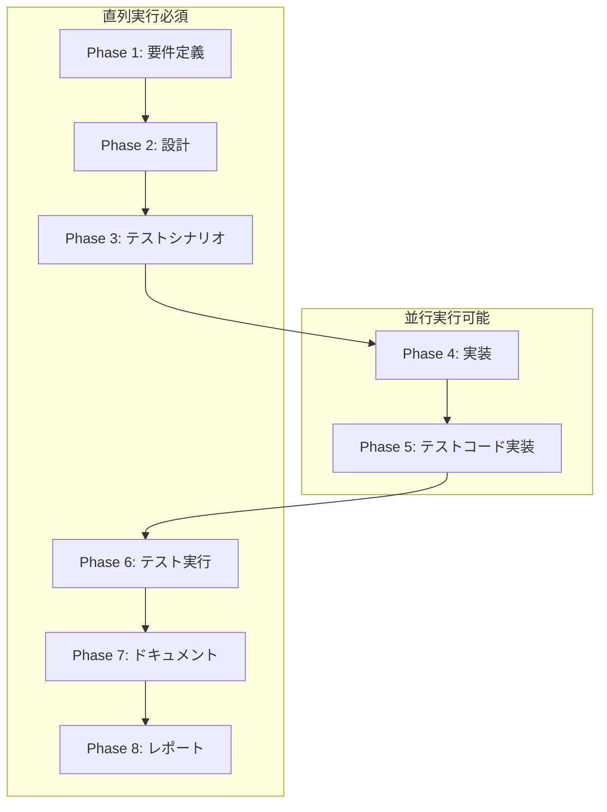

# プロジェクト計画書 - Issue #2

## Issue分析

### Issue情報
- **Issue番号**: #2
- **タイトル**: Evaluation Phase 完了後の .ai-workflow クリーンアップオプション
- **状態**: open
- **URL**: https://github.com/tielec/ai-workflow-agent/issues/2
- **ラベル**: enhancement

### 複雑度: 中程度

**判定根拠**:
- 複数ファイルの修正が必要（`src/main.ts`, `src/phases/evaluation.ts`, `src/phases/base-phase.ts`）
- 既存のクリーンアップ機能（Report Phase）の設計パターンを踏襲可能
- Git操作との統合が必要だが、既存のGitManager実装を活用可能
- CLI オプション追加とフェーズライフサイクルへの統合という、明確な実装範囲

### 見積もり工数: 8~12時間

**内訳**:
- Phase 1（要件定義）: 1~2h
- Phase 2（設計）: 2~3h
- Phase 3（テストシナリオ）: 1~2h
- Phase 4（実装）: 3~4h
- Phase 5（テストコード実装）: 1~2h
- Phase 6（テスト実行）: 0.5~1h
- Phase 7（ドキュメント）: 0.5~1h
- Phase 8（レポート）: 0.5~1h

### リスク評価: 低

**理由**:
- Report PhaseのcleanupWorkflowLogs()という類似実装が既存
- Git操作は既存のGitManagerで対応可能
- オプション機能のため、既存機能への影響が限定的
- 後方互換性の維持が容易（デフォルトでは無効）

---

## 実装戦略判断

### 実装戦略: EXTEND

**判断根拠**:
1. **既存の設計パターンを踏襲**: Report Phase（Phase 8）で既に実装されている `cleanupWorkflowLogs()` と同様のアプローチを採用
2. **既存クラスの拡張が中心**:
   - `src/main.ts`: CLI オプション追加（`--cleanup-on-complete`, `--cleanup-on-complete-force`）
   - `src/phases/base-phase.ts`: クリーンアップメソッド追加（または `src/phases/evaluation.ts` に直接実装）
   - `src/phases/evaluation.ts`: フェーズ完了後のクリーンアップ呼び出し追加
3. **新規ファイル作成は不要**: 既存のモジュール構成で対応可能
4. **既存のGitManager・MetadataManagerを活用**: 新規の抽象化レイヤーは不要

この実装は、既存のワークフローアーキテクチャに自然に統合され、コードの一貫性を保ちます。

### テスト戦略: UNIT_INTEGRATION

**判断根拠**:
1. **ユニットテスト（UNIT）**:
   - `cleanupWorkflowArtifacts()` メソッドの単体動作検証
   - ファイルシステム操作のモック化テスト
   - エラーハンドリングの検証
   - 確認プロンプトのロジック検証（force フラグの動作）

2. **インテグレーションテスト（INTEGRATION）**:
   - Evaluation Phase 完了後のクリーンアップ実行フロー
   - Git コミット & プッシュとの統合検証
   - CLI オプションのエンドツーエンド動作確認
   - 実際のファイルシステム操作の検証

3. **BDDテストが不要な理由**:
   - エンドユーザー向けのUIではなく、開発者向けのCLIオプション
   - ユーザーストーリーベースのシナリオテストより、技術的な動作検証が重要
   - 既存のテストフレームワーク（Jest）で十分に検証可能

### テストコード戦略: CREATE_TEST

**判断根拠**:
1. **新規テストファイル作成が適切**:
   - `tests/unit/cleanup-workflow-artifacts.test.ts`: クリーンアップメソッドのユニットテスト
   - `tests/integration/evaluation-phase-cleanup.test.ts`: Evaluation Phase完了フローのインテグレーションテスト

2. **既存テスト拡張ではない理由**:
   - 新機能のため、独立したテストファイルで管理する方が明確
   - Report Phaseのクリーンアップテストとは対象が異なる（ワークフローログ vs ワークフロー全体）
   - テストの保守性・可読性の向上

3. **テストファイル構成**:
   ```
   tests/
   ├── unit/
   │   └── cleanup-workflow-artifacts.test.ts  # 新規作成
   └── integration/
       └── evaluation-phase-cleanup.test.ts    # 新規作成
   ```

---

## 影響範囲分析

### 既存コードへの影響

#### 変更が必要なファイル

1. **`src/main.ts`** (優先度: 高)
   - CLI オプション追加: `--cleanup-on-complete`, `--cleanup-on-complete-force`
   - `execute` コマンドのオプション定義部分を修正
   - Phase実行時のオプション受け渡し処理を追加

2. **`src/phases/evaluation.ts`** (優先度: 高)
   - `run()` メソッド内にクリーンアップ呼び出しを追加
   - フェーズ完了判定後のクリーンアップ実行ロジック

3. **`src/phases/base-phase.ts`** (優先度: 中)
   - `cleanupWorkflowArtifacts()` メソッドを追加（全フェーズで利用可能にする場合）
   - または、Evaluation Phaseのみで使用する場合は `evaluation.ts` に直接実装

4. **`src/core/git-manager.ts`** (優先度: 低)
   - 既存の `commit()` / `push()` メソッドを活用
   - 新規変更は不要（既存APIで対応可能）

5. **`src/core/metadata-manager.ts`** (優先度: 低)
   - 既存のメタデータ取得APIを活用
   - 新規変更は不要

#### 変更が不要なファイル
- `src/core/codex-agent-client.ts`: エージェント実行には影響なし
- `src/core/claude-agent-client.ts`: エージェント実行には影響なし
- `src/core/github-client.ts`: GitHub API呼び出しには影響なし
- 他のフェーズファイル: Evaluation Phase以外は影響なし

### 依存関係の変更

#### 新規依存の追加
- **なし**: 既存の依存関係（`fs-extra`, `simple-git`, `commander`）で対応可能

#### 既存依存の変更
- **なし**: パッケージバージョンのアップグレードは不要

### マイグレーション要否

#### データベーススキーマ変更
- **不要**: データベースは使用していない

#### 設定ファイル変更
- **不要**: 環境変数の追加は不要
- CLI オプションは実行時に指定するため、設定ファイル変更は不要

#### メタデータスキーマ変更
- **不要**: `metadata.json` のスキーマ変更は不要
- 既存のフェーズステータス管理で対応可能

#### 後方互換性
- **完全に互換**: `--cleanup-on-complete` オプションは完全にオプショナル
- デフォルト動作は変更なし（従来通り成果物を保持）
- 既存のワークフローに影響なし

---

## タスク分割

### Phase 1: 要件定義 (見積もり: 1~2h)

- [x] Task 1-1: ユースケースの詳細化 (0.5~1h)
  - Jenkins CI/CD環境でのクリーンアップシナリオを定義
  - ローカル開発環境での手動クリーンアップシナリオを定義
  - 成果物を保持したい場合のシナリオを定義
  - 削除失敗時のエラーハンドリングシナリオを定義

- [x] Task 1-2: 非機能要件の明確化 (0.5~1h)
  - エラー発生時のワークフロー継続要件
  - 削除前の確認プロンプト表示要件
  - Git コミット & プッシュの要件
  - ログ出力の要件（INFO/WARNING/ERROR）

### Phase 2: 設計 (見積もり: 2~3h)

- [x] Task 2-1: クリーンアップメソッドの詳細設計 (1~1.5h)
  - メソッドシグネチャの定義（引数、戻り値）
  - エラーハンドリング戦略の設計
  - 確認プロンプトのロジック設計（CI環境判定）
  - ログ出力フォーマットの設計

- [x] Task 2-2: CLI オプションの設計 (0.5~1h)
  - オプション名の決定（`--cleanup-on-complete`, `--cleanup-on-complete-force`）
  - オプションのデフォルト値の決定
  - オプション受け渡しのデータフロー設計

- [x] Task 2-3: Evaluation Phase統合の設計 (0.5~1h)
  - フェーズ完了判定ロジックとの統合点
  - Git コミット実行タイミングの設計
  - Report Phaseのクリーンアップとの関係整理

### Phase 3: テストシナリオ (見積もり: 1~2h)

- [x] Task 3-1: ユニットテストシナリオの作成 (0.5~1h)
  - クリーンアップメソッドの正常系テストシナリオ
  - 削除対象ディレクトリが存在しない場合のテストシナリオ
  - 削除権限がない場合のテストシナリオ
  - 確認プロンプトのロジックテストシナリオ

- [x] Task 3-2: インテグレーションテストシナリオの作成 (0.5~1h)
  - Evaluation Phase完了 + クリーンアップ実行のエンドツーエンドシナリオ
  - Git コミット & プッシュとの統合シナリオ
  - CLI オプション指定時の動作シナリオ
  - デフォルト動作（クリーンアップなし）の確認シナリオ

### Phase 4: 実装 (見積もり: 3~4h)

- [x] Task 4-1: CLI オプションの追加 (0.5~1h)
  - `src/main.ts` に `--cleanup-on-complete` オプションを追加
  - `src/main.ts` に `--cleanup-on-complete-force` オプションを追加
  - オプションのヘルプテキストを記載

- [x] Task 4-2: クリーンアップメソッドの実装 (1.5~2h)
  - `cleanupWorkflowArtifacts()` メソッドを実装（`base-phase.ts` または `evaluation.ts`）
  - ディレクトリ削除処理の実装（`fs-extra.removeSync()`）
  - エラーハンドリングの実装
  - ログ出力の実装（INFO/WARNING/ERROR）

- [x] Task 4-3: 確認プロンプトの実装 (0.5~1h)
  - CI環境判定ロジックの実装（環境変数 `CI` をチェック）
  - 対話的環境での確認プロンプト表示
  - `--cleanup-on-complete-force` による確認スキップ

- [x] Task 4-4: Evaluation Phaseへの統合 (0.5~1h)
  - `src/phases/evaluation.ts` の `run()` メソッドにクリーンアップ呼び出しを追加
  - フェーズ完了判定後のクリーンアップ実行
  - Git コミット & プッシュの実行

### Phase 5: テストコード実装 (見積もり: 1~2h)

- [ ] Task 5-1: ユニットテストの実装 (0.5~1h)
  - `tests/unit/cleanup-workflow-artifacts.test.ts` を作成
  - 正常系テストの実装
  - 異常系テスト（ディレクトリ不在、削除権限なし）の実装
  - 確認プロンプトロジックのテスト

- [ ] Task 5-2: インテグレーションテストの実装 (0.5~1h)
  - `tests/integration/evaluation-phase-cleanup.test.ts` を作成
  - エンドツーエンドテストの実装
  - Git統合テストの実装
  - CLI オプション動作確認テストの実装

### Phase 6: テスト実行 (見積もり: 0.5~1h)

- [ ] Task 6-1: ユニットテストの実行と修正 (0.25~0.5h)
  - `npm run test:unit` でテスト実行
  - 失敗したテストケースの原因分析と修正
  - カバレッジレポートの確認

- [ ] Task 6-2: インテグレーションテストの実行と修正 (0.25~0.5h)
  - `npm run test:integration` でテスト実行
  - 失敗したテストケースの原因分析と修正
  - エンドツーエンドシナリオの動作確認

### Phase 7: ドキュメント (見積もり: 0.5~1h)

- [ ] Task 7-1: README.md の更新 (0.25~0.5h)
  - `--cleanup-on-complete` オプションの説明を追加
  - `--cleanup-on-complete-force` オプションの説明を追加
  - 使用例を追加（Jenkins CI/CD、ローカル開発）

- [ ] Task 7-2: CLAUDE.md の更新 (0.25~0.5h)
  - クリーンアップ機能の概要を追加
  - Evaluation Phase完了後の動作説明を追加
  - Report Phaseのクリーンアップとの違いを明記

### Phase 8: レポート (見積もり: 0.5~1h)

- [ ] Task 8-1: 実装サマリーの作成 (0.25~0.5h)
  - 変更ファイル一覧
  - 追加された機能の概要
  - テスト結果サマリー

- [ ] Task 8-2: PR本文の生成 (0.25~0.5h)
  - 変更内容の説明
  - 使用例のスクリーンショット（または実行例）
  - レビュー観点の記載

---

## 依存関係



**依存関係の説明**:
- **Phase 1 → 2**: 要件が明確でないと設計できない
- **Phase 2 → 3**: 設計が確定しないとテストシナリオを定義できない
- **Phase 3 → 4, 5**: テストシナリオが確定してから実装とテストコードを並行作成可能
- **Phase 4, 5 → 6**: 実装とテストコードが揃ってからテスト実行
- **Phase 6 → 7**: テスト結果を踏まえてドキュメント作成
- **Phase 7 → 8**: ドキュメント完成後にレポート作成

---

## リスクと軽減策

### リスク1: Git操作のタイミングとクリーンアップの競合

- **カテゴリ**: 技術的リスク
- **影響度**: 中
- **確率**: 低
- **説明**: クリーンアップ実行後にGitコミット・プッシュを行う際、削除したディレクトリのGit管理状態が不整合になる可能性
- **軽減策**:
  - クリーンアップ前にGitステータスを確認
  - 削除後に `git add -A` で削除をステージング
  - 既存のGitManagerのAPI（`commit()`, `push()`）を活用し、実績のある実装を利用
  - インテグレーションテストでGit操作との統合を検証

### リスク2: CI/CD環境での確認プロンプト表示

- **カテゴリ**: 技術的リスク
- **影響度**: 高
- **確率**: 中
- **説明**: Jenkins等のCI環境で確認プロンプトが表示されると、ビルドがハングする可能性
- **軽減策**:
  - CI環境を自動判定（環境変数 `CI` をチェック）
  - CI環境では自動的に確認をスキップ
  - `--cleanup-on-complete-force` オプションで明示的に確認をスキップ
  - ドキュメントにCI/CD環境での使用方法を明記

### リスク3: ファイルシステム権限エラー

- **カテゴリ**: 技術的リスク
- **影響度**: 低
- **確率**: 低
- **説明**: Docker環境やCI環境でディレクトリ削除権限がない場合、エラーが発生する可能性
- **軽減策**:
  - エラー発生時もワークフロー全体は成功として扱う（Report Phaseのクリーンアップと同様）
  - エラーログを明確に出力（ERROR レベル）
  - ユニットテストでエラーハンドリングを検証
  - Dockerfileでファイルシステム権限を適切に設定

### リスク4: 既存ワークフローへの影響

- **カテゴリ**: スコープリスク
- **影響度**: 低
- **確率**: 低
- **説明**: 新機能追加により、既存のワークフロー動作が変わる可能性
- **軽減策**:
  - オプション機能として実装（デフォルトでは無効）
  - 後方互換性を完全に維持
  - 既存のテストが全て通ることを確認
  - インテグレーションテストでデフォルト動作（クリーンアップなし）を検証

### リスク5: 見積もり工数の超過

- **カテゴリ**: リソースリスク
- **影響度**: 低
- **確率**: 低
- **説明**: 実装中に予期しない技術的問題が発生し、見積もり工数を超過する可能性
- **軽減策**:
  - 既存のReport Phaseクリーンアップ実装を参考にする
  - タスク粒度を1~4時間に細分化し、進捗を可視化
  - 早期にPoCを実装し、技術的な不確実性を排除
  - ブロッカーが発生した場合は早期にエスカレーション

---

## 品質ゲート

### Phase 1: 要件定義

- [ ] 機能要件が明確に記載されている
  - クリーンアップのトリガー条件（Evaluation Phase完了 + オプション指定）
  - 削除対象ディレクトリ（`.ai-workflow/issue-<NUM>/`）
  - CLI オプション仕様（`--cleanup-on-complete`, `--cleanup-on-complete-force`）
- [ ] 受け入れ基準が定義されている
  - オプション指定時にディレクトリが削除される
  - Git コミット & プッシュが自動実行される
  - 削除失敗時もワークフローは成功する
- [ ] 非機能要件が明確である
  - エラーハンドリング要件
  - ログ出力要件
  - 後方互換性要件
- [ ] ユースケースが網羅されている
  - Jenkins CI/CD環境
  - ローカル開発環境
  - 成果物保持ケース

### Phase 2: 設計

- [ ] 実装戦略の判断根拠が明記されている（EXTEND）
- [ ] テスト戦略の判断根拠が明記されている（UNIT_INTEGRATION）
- [ ] テストコード戦略の判断根拠が明記されている（CREATE_TEST）
- [ ] クラス設計・メソッド設計が具体的である
  - `cleanupWorkflowArtifacts()` のシグネチャ
  - エラーハンドリング戦略
  - 確認プロンプトロジック
- [ ] データフロー図が明確である
  - CLI → Evaluation Phase → クリーンアップメソッド → Git
- [ ] 既存コードとの統合点が明確である
  - Report Phaseクリーンアップとの関係
  - GitManagerとの連携方法

### Phase 3: テストシナリオ

- [ ] ユニットテストシナリオが網羅的である
  - 正常系（ディレクトリ削除成功）
  - 異常系（ディレクトリ不在、削除権限なし）
  - 確認プロンプトロジック（CI環境判定）
- [ ] インテグレーションテストシナリオが網羅的である
  - エンドツーエンドフロー
  - Git統合
  - CLI オプション動作
- [ ] テストデータが定義されている
  - モックディレクトリ構造
  - モックメタデータ
- [ ] 期待結果が明確に記載されている
  - 削除されるべきファイル/ディレクトリ
  - 出力されるべきログメッセージ
  - Git コミットメッセージ

### Phase 4: 実装

- [ ] コードが設計通りに実装されている
- [ ] エラーハンドリングが適切に実装されている
  - try-catchブロック
  - エラーログ出力
  - ワークフロー継続ロジック
- [ ] ログ出力が適切である（INFO/WARNING/ERROR）
- [ ] コードレビューが実施されている（自己レビュー含む）
- [ ] 既存コードとの整合性が保たれている
  - Report Phaseクリーンアップと同様のパターン
  - GitManagerの使用方法

### Phase 5: テストコード実装

- [ ] テストシナリオ通りにテストコードが実装されている
- [ ] テストカバレッジが十分である（目標: 80%以上）
- [ ] モック・スタブが適切に使用されている
  - ファイルシステム操作のモック
  - Git操作のモック
- [ ] アサーションが明確である
  - 削除されたディレクトリの確認
  - ログメッセージの確認
  - Git コミットの確認

### Phase 6: テスト実行

- [ ] すべてのユニットテストが成功している
- [ ] すべてのインテグレーションテストが成功している
- [ ] テストカバレッジが目標値（80%）を達成している
- [ ] エッジケースが検証されている
  - ディレクトリ不在
  - 削除権限なし
  - CI環境 vs ローカル環境
- [ ] 既存テストが全て通過している（リグレッションなし）

### Phase 7: ドキュメント

- [ ] README.mdに新機能の説明が追加されている
  - オプションの説明
  - 使用例（Jenkins CI/CD、ローカル開発）
- [ ] CLAUDE.mdに実装詳細が記載されている
  - クリーンアップ機能の概要
  - Evaluation Phase完了後の動作
  - Report Phaseクリーンアップとの違い
- [ ] コード内コメントが適切である
  - 複雑なロジックの説明
  - エラーハンドリングの意図
- [ ] 使用例が実行可能である
  - コマンド例が正確
  - 期待される出力が記載されている

### Phase 8: レポート

- [ ] 変更内容が正確にまとめられている
  - 変更ファイル一覧
  - 追加された機能の概要
- [ ] テスト結果が明記されている
  - ユニットテスト結果
  - インテグレーションテスト結果
  - カバレッジレポート
- [ ] 既知の問題・制約が記載されている（該当する場合）
- [ ] レビュー観点が明確である
  - コードレビューのポイント
  - 動作確認の手順

---

## 補足情報

### Report Phaseクリーンアップとの違い

| 項目 | Report Phase (Phase 8) | Evaluation Phase (Phase 9) |
|------|------------------------|----------------------------|
| **削除対象** | デバッグログ（`execute/`, `review/`, `revise/`） | ワークフロー全体（`.ai-workflow/issue-<NUM>/`） |
| **削除範囲** | Phase 01-08のログディレクトリ | ディレクトリ全体（`metadata.json`, `output/*.md` 含む） |
| **実行タイミング** | Report Phase完了時（常に実行） | Evaluation Phase完了時（オプション指定時のみ） |
| **目的** | PRレビューの負荷軽減（約70%削減） | ワークフロー完了後のクリーンアップ（完全削除） |
| **保護対象** | `00_planning/`, `metadata.json`, `output/*.md` | なし（全て削除） |

### 実装参考コード

Report Phaseのクリーンアップ実装（`src/phases/report.ts`）:

```typescript
protected async cleanupWorkflowLogs(): Promise<void> {
  const workflowDir = this.metadata.workflowDir;
  const phasesToCleanup = ['01_requirements', '02_design', '03_test_scenario',
                          '04_implementation', '05_test_implementation',
                          '06_testing', '07_documentation', '08_report'];

  for (const phase of phasesToCleanup) {
    const phaseDir = path.join(workflowDir, phase);
    for (const subdir of ['execute', 'review', 'revise']) {
      const targetDir = path.join(phaseDir, subdir);
      if (fs.existsSync(targetDir)) {
        fs.removeSync(targetDir);
      }
    }
  }
}
```

この実装パターンを参考に、Evaluation Phaseのクリーンアップを実装します。

---

## まとめ

本プロジェクトは、Evaluation Phase完了後にワークフロー全体をクリーンアップするオプション機能を追加するものです。以下の点が重要です：

1. **既存機能の自然な拡張**: Report Phaseのクリーンアップ機能を参考に、一貫性のある実装を行う
2. **後方互換性の維持**: オプション機能として実装し、既存ワークフローに影響を与えない
3. **エラーハンドリング**: 削除失敗時もワークフロー全体は成功として扱う
4. **CI/CD対応**: 確認プロンプトの自動スキップにより、Jenkins等のCI環境で問題なく動作

見積もり工数（8~12時間）は現実的であり、リスクも低く抑えられています。既存のアーキテクチャに自然に統合できる設計となっています。
