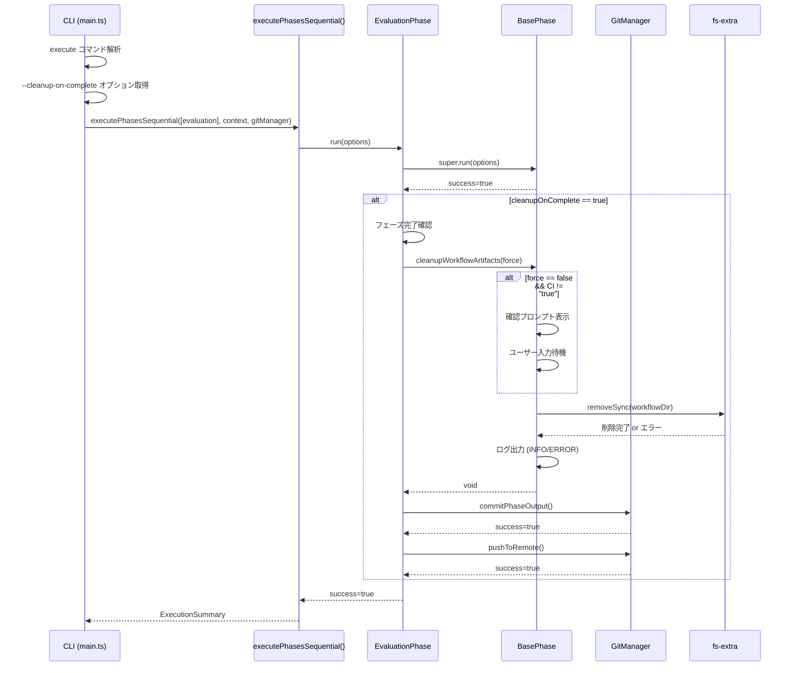
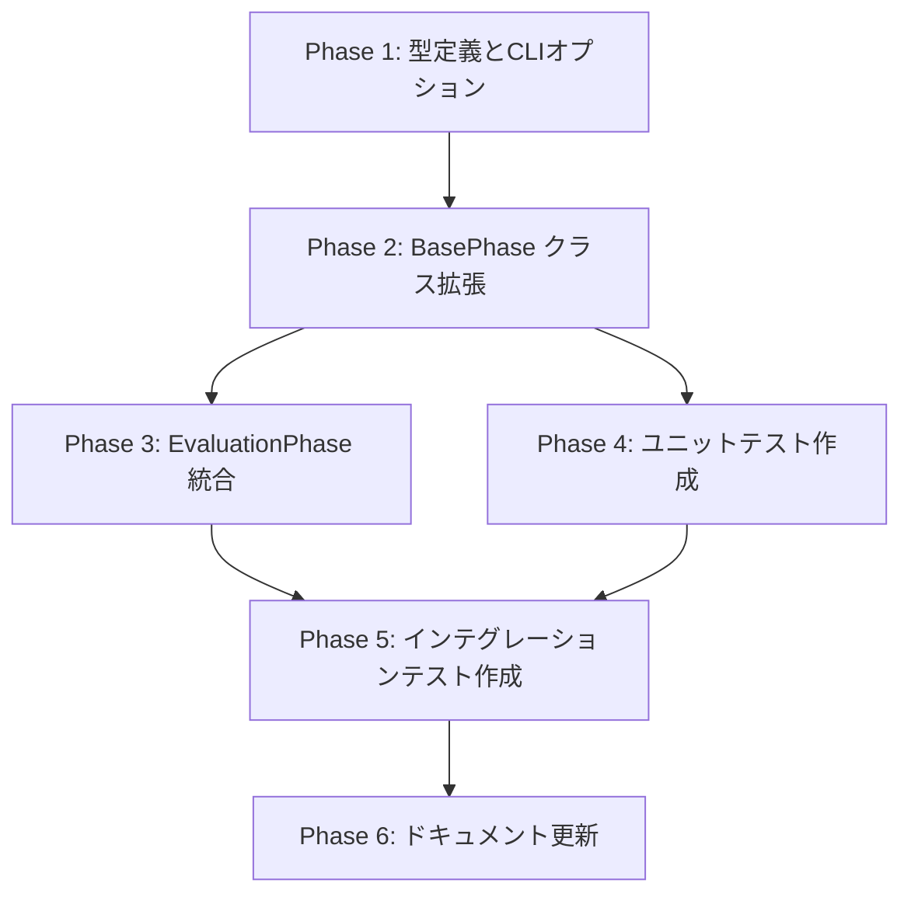

# 詳細設計書 - Issue #2

## 0. Planning Document の確認

Planning Phase で策定された開発計画を確認しました：

- **実装戦略**: EXTEND（既存クラスの拡張中心）
- **テスト戦略**: UNIT_INTEGRATION（ユニットテスト + インテグレーションテスト）
- **テストコード戦略**: CREATE_TEST（新規テストファイル作成）
- **複雑度**: 中程度
- **見積もり工数**: 8~12時間
- **リスク評価**: 低

Planning Document の戦略判断を踏まえ、既存の Report Phase クリーンアップ機能（`cleanupWorkflowLogs()`）のパターンを踏襲し、後方互換性を維持した設計を行います。

---

## 1. アーキテクチャ設計

### 1.1. システム全体図

```
┌─────────────────────────────────────────────────────────────────┐
│                         CLI Layer (main.ts)                     │
│  ┌──────────────────────────────────────────────────────────┐   │
│  │ execute コマンド                                          │   │
│  │ - --cleanup-on-complete (boolean, default: false)        │   │
│  │ - --cleanup-on-complete-force (boolean, default: false)  │   │
│  └──────────────────────────────────────────────────────────┘   │
└─────────────────────┬───────────────────────────────────────────┘
                      │
                      ├─ オプション受け渡し
                      ↓
┌─────────────────────────────────────────────────────────────────┐
│                   Phase Execution Layer                         │
│  ┌──────────────────────────────────────────────────────────┐   │
│  │ PhaseRunOptions (base-phase.ts)                          │   │
│  │ - gitManager?: GitManager                                │   │
│  │ - skipReview?: boolean                                   │   │
│  │ - cleanupOnComplete?: boolean      [新規追加]            │   │
│  │ - cleanupOnCompleteForce?: boolean [新規追加]            │   │
│  └──────────────────────────────────────────────────────────┘   │
└─────────────────────┬───────────────────────────────────────────┘
                      │
                      ├─ EvaluationPhase.run() 実行
                      ↓
┌─────────────────────────────────────────────────────────────────┐
│                  EvaluationPhase (evaluation.ts)                │
│  ┌──────────────────────────────────────────────────────────┐   │
│  │ run(options: PhaseRunOptions): Promise<boolean>          │   │
│  │   1. super.run(options) 実行                             │   │
│  │   2. フェーズ完了確認                                    │   │
│  │   3. cleanupOnComplete フラグ確認                        │   │
│  │   4. cleanupWorkflowArtifacts() 呼び出し                 │   │
│  │   5. Git コミット & プッシュ                             │   │
│  └──────────────────────────────────────────────────────────┘   │
└─────────────────────┬───────────────────────────────────────────┘
                      │
                      ├─ クリーンアップ実行
                      ↓
┌─────────────────────────────────────────────────────────────────┐
│                BasePhase (base-phase.ts) - 新規メソッド         │
│  ┌──────────────────────────────────────────────────────────┐   │
│  │ protected async cleanupWorkflowArtifacts(               │   │
│  │   force: boolean = false                                 │   │
│  │ ): Promise<void>                                         │   │
│  │   1. CI環境判定 (環境変数 CI をチェック)                │   │
│  │   2. 確認プロンプト表示 (force=false かつ非CI環境)      │   │
│  │   3. ワークフローディレクトリ削除                       │   │
│  │   4. ログ出力 (INFO/WARNING/ERROR)                       │   │
│  └──────────────────────────────────────────────────────────┘   │
└─────────────────────┬───────────────────────────────────────────┘
                      │
                      ├─ ファイルシステム操作
                      ↓
┌─────────────────────────────────────────────────────────────────┐
│                   File System Layer                             │
│  ┌──────────────────────────────────────────────────────────┐   │
│  │ fs-extra.removeSync()                                    │   │
│  │ - .ai-workflow/issue-<NUM>/ ディレクトリ全体を削除      │   │
│  └──────────────────────────────────────────────────────────┘   │
└─────────────────────────────────────────────────────────────────┘
```

### 1.2. コンポーネント間の関係



### 1.3. データフロー

```
[CLI オプション解析]
  --cleanup-on-complete → boolean
  --cleanup-on-complete-force → boolean
        ↓
[PhaseRunOptions に格納]
  cleanupOnComplete: boolean
  cleanupOnCompleteForce: boolean
        ↓
[EvaluationPhase.run() に渡す]
  options.cleanupOnComplete
  options.cleanupOnCompleteForce
        ↓
[cleanupWorkflowArtifacts() 実行]
  force: options.cleanupOnCompleteForce
        ↓
[CI環境判定]
  process.env.CI === "true"
        ↓
[確認プロンプト制御]
  if (!force && !isCIEnvironment) {
    prompt()
  }
        ↓
[ディレクトリ削除]
  fs.removeSync(this.metadata.workflowDir)
        ↓
[Git コミット & プッシュ]
  gitManager.commitPhaseOutput()
  gitManager.pushToRemote()
```

---

## 2. 実装戦略判断

### 実装戦略: EXTEND

**判断根拠**:

1. **既存の設計パターンを踏襲**:
   - Report Phase（Phase 8）で既に実装されている `cleanupWorkflowLogs()` と同様のアプローチを採用
   - 同じパターン（`BasePhase` に protected メソッドを追加し、各 Phase で呼び出す）を使用することで、コードの一貫性を保持

2. **既存クラスの拡張が中心**:
   - `src/main.ts`: CLI オプション追加（`.option()` を2つ追加）
   - `src/phases/base-phase.ts`: `cleanupWorkflowArtifacts()` メソッド追加
   - `src/phases/evaluation.ts`: `run()` メソッド内にクリーンアップ呼び出しを追加
   - 新規ファイル作成は不要

3. **既存のGitManager・MetadataManagerを活用**:
   - 新規の抽象化レイヤーは作成しない
   - 既存の API（`commit()`, `push()`, `metadata.workflowDir`）をそのまま利用

4. **Report Phase のクリーンアップとの違いを明確化**:
   - Report Phase: 部分的削除（`execute/`, `review/`, `revise/` ディレクトリのみ）
   - Evaluation Phase: 完全削除（`.ai-workflow/issue-<NUM>/` ディレクトリ全体）
   - この違いを明確にすることで、2つのクリーンアップ機能が共存可能

この実装戦略により、既存のワークフローアーキテクチャに自然に統合され、コードの一貫性を保ちつつ、新機能を追加できます。

---

## 3. テスト戦略判断

### テスト戦略: UNIT_INTEGRATION

**判断根拠**:

1. **ユニットテスト（UNIT）の必要性**:
   - `cleanupWorkflowArtifacts()` メソッドの単体動作検証
   - ファイルシステム操作のモック化テスト（`fs-extra.removeSync()` の呼び出し検証）
   - エラーハンドリングの検証（ディレクトリ不在、削除権限なし）
   - 確認プロンプトのロジック検証（`force` フラグの動作、CI環境判定）
   - テストケース数: 約10~15個

2. **インテグレーションテスト（INTEGRATION）の必要性**:
   - Evaluation Phase 完了後のクリーンアップ実行フロー全体を検証
   - Git コミット & プッシュとの統合検証（`GitManager` との連携）
   - CLI オプションのエンドツーエンド動作確認（`--cleanup-on-complete` 指定時の動作）
   - 実際のファイルシステム操作の検証（テンポラリディレクトリを使用）
   - テストケース数: 約5~8個

3. **BDDテストが不要な理由**:
   - エンドユーザー向けのUIではなく、開発者向けのCLIオプション
   - ユーザーストーリーベースのシナリオテストより、技術的な動作検証が重要
   - 既存のテストフレームワーク（Jest）で十分に検証可能
   - Given-When-Then 形式は要件定義の受け入れ基準で既に記述済み

4. **既存テストとの整合性**:
   - Report Phase のクリーンアップテストは存在しない（手動検証のみ）
   - 本機能では、将来の保守性を考慮してテストを作成
   - `tests/unit/` および `tests/integration/` の既存ディレクトリ構造に準拠

この戦略により、メソッドレベルの正確性（ユニットテスト）とシステム全体の統合性（インテグレーションテスト）の両方を確保します。

---

## 4. テストコード戦略判断

### テストコード戦略: CREATE_TEST

**判断根拠**:

1. **新規テストファイル作成が適切**:
   - `tests/unit/cleanup-workflow-artifacts.test.ts`: `cleanupWorkflowArtifacts()` メソッドのユニットテスト
   - `tests/integration/evaluation-phase-cleanup.test.ts`: Evaluation Phase完了フローのインテグレーションテスト
   - 新機能のため、独立したテストファイルで管理する方が明確

2. **既存テスト拡張ではない理由**:
   - Report Phaseのクリーンアップテストは存在しない（既存テストファイルがない）
   - Evaluation Phase の既存テスト（存在する場合）とは対象が異なる（フェーズ完了判定 vs クリーンアップ）
   - 新機能を独立したファイルで管理することで、テストの保守性・可読性が向上

3. **テストファイル構成**:
   ```
   tests/
   ├── unit/
   │   ├── cleanup-workflow-artifacts.test.ts  # 新規作成
   │   └── ... (既存のユニットテスト)
   └── integration/
       ├── evaluation-phase-cleanup.test.ts    # 新規作成
       └── ... (既存のインテグレーションテスト)
   ```

4. **テストファイルの命名規則**:
   - ユニットテスト: 機能名を明示（`cleanup-workflow-artifacts.test.ts`）
   - インテグレーションテスト: フェーズ名 + 機能名（`evaluation-phase-cleanup.test.ts`）
   - 既存のテストファイル命名規則（kebab-case）に準拠

この戦略により、新機能のテストコードを独立して管理し、既存テストへの影響を最小限に抑えつつ、将来の拡張性を確保します。

---

## 5. 影響範囲分析

### 5.1. 既存コードへの影響

#### 変更が必要なファイル（優先度順）

| ファイル | 変更内容 | 優先度 | 影響度 |
|---------|---------|--------|--------|
| `src/main.ts` | CLI オプション追加（`.option()` を2つ追加） | 高 | 低 |
| `src/phases/base-phase.ts` | `cleanupWorkflowArtifacts()` メソッド追加、`PhaseRunOptions` インターフェース拡張 | 高 | 中 |
| `src/phases/evaluation.ts` | `run()` メソッド内にクリーンアップ呼び出しを追加 | 高 | 中 |
| `src/types.ts` | `PhaseRunOptions` 型定義の拡張（`cleanupOnComplete`, `cleanupOnCompleteForce` フィールド追加） | 中 | 低 |

#### 変更が不要なファイル

- `src/core/git-manager.ts`: 既存の `commit()` / `push()` メソッドをそのまま使用
- `src/core/metadata-manager.ts`: 既存のメタデータ取得APIをそのまま使用
- `src/core/codex-agent-client.ts`: エージェント実行には影響なし
- `src/core/claude-agent-client.ts`: エージェント実行には影響なし
- `src/core/github-client.ts`: GitHub API呼び出しには影響なし
- `src/phases/report.ts`: 既存のクリーンアップ機能と独立（共存可能）
- 他のフェーズファイル: Evaluation Phase以外は影響なし

### 5.2. 依存関係の変更

#### 新規依存の追加

**なし** - 既存の依存関係で対応可能:
- `fs-extra`: ファイルシステム操作（`removeSync()`）
- `simple-git`: Git 操作（`GitManager` 経由）
- `commander`: CLI オプション定義（`.option()` メソッド）
- `readline`: 確認プロンプト表示（Node.js標準ライブラリ）

#### 既存依存の変更

**なし** - パッケージバージョンのアップグレードは不要

### 5.3. マイグレーション要否

#### データベーススキーマ変更

**不要** - データベースは使用していない

#### 設定ファイル変更

**不要**:
- 環境変数の追加は不要
- CLI オプションは実行時に指定するため、設定ファイル変更は不要

#### メタデータスキーマ変更

**不要**:
- `metadata.json` のスキーマ変更は不要
- 既存のフェーズステータス管理で対応可能
- クリーンアップ実行履歴を記録する必要がない（削除後はメタデータも削除されるため）

#### 後方互換性

**完全に互換**:
- `--cleanup-on-complete` オプションは完全にオプショナル
- デフォルト動作は変更なし（従来通り成果物を保持）
- 既存のワークフローに影響なし
- 既存のテストが全て通ることを確認必要

---

## 6. 変更・追加ファイルリスト

### 6.1. 新規作成ファイル

```
tests/unit/cleanup-workflow-artifacts.test.ts
tests/integration/evaluation-phase-cleanup.test.ts
```

### 6.2. 修正が必要な既存ファイル

```
src/main.ts
src/phases/base-phase.ts
src/phases/evaluation.ts
src/types.ts
```

### 6.3. 削除が必要なファイル

**なし**

---

## 7. 詳細設計

### 7.1. CLI オプション設計（src/main.ts）

#### 7.1.1. オプション定義

```typescript
// src/main.ts の execute コマンド定義に追加

program
  .command('execute')
  .requiredOption('--issue <number>', 'Issue number')
  .option('--phase <name>', 'Phase name or "all"', 'all')
  // ... 既存のオプション ...
  .option(
    '--cleanup-on-complete',
    'Delete .ai-workflow directory after evaluation phase completes',
    false
  )
  .option(
    '--cleanup-on-complete-force',
    'Skip confirmation prompt before cleanup (for CI environments)',
    false
  )
  .action(async (options) => {
    try {
      await handleExecuteCommand(options);
    } catch (error) {
      reportFatalError(error);
    }
  });
```

#### 7.1.2. オプション受け渡し設計

```typescript
// src/main.ts の handleExecuteCommand() 内

async function handleExecuteCommand(options: any): Promise<void> {
  // ... 既存の処理 ...

  // PhaseRunOptions にクリーンアップフラグを追加
  const phaseRunOptions: PhaseRunOptions = {
    gitManager,
    skipReview: false,
    cleanupOnComplete: Boolean(options.cleanupOnComplete),
    cleanupOnCompleteForce: Boolean(options.cleanupOnCompleteForce),
  };

  // executePhasesSequential() に渡す
  const summary = await executePhasesSequential(
    targetPhases,
    context,
    gitManager,
    phaseRunOptions  // 追加
  );

  // ... 既存の処理 ...
}
```

**設計ポイント**:
- `--cleanup-on-complete`: デフォルト `false`（従来通り成果物を保持）
- `--cleanup-on-complete-force`: デフォルト `false`（対話的環境では確認プロンプトを表示）
- Boolean型に明示的に変換（`Boolean(options.cleanupOnComplete)`）
- 相互排他チェックは不要（両方指定可能で、`force` は `cleanup` のサブオプション）

### 7.2. 型定義設計（src/types.ts）

#### 7.2.1. PhaseRunOptions 拡張

```typescript
// src/types.ts

export interface PhaseRunOptions {
  gitManager?: GitManager | null;
  skipReview?: boolean;
  cleanupOnComplete?: boolean;        // 新規追加
  cleanupOnCompleteForce?: boolean;   // 新規追加
}
```

**設計ポイント**:
- すべてのフィールドを optional（`?`）にすることで、既存コードとの互換性を維持
- デフォルト値は `undefined`（呼び出し側で `false` として扱う）

### 7.3. BasePhase クラス設計（src/phases/base-phase.ts）

#### 7.3.1. cleanupWorkflowArtifacts() メソッド設計

```typescript
// src/phases/base-phase.ts

export abstract class BasePhase {
  // ... 既存のフィールド ...

  /**
   * ワークフローアーティファクト全体をクリーンアップ（Issue #2）
   *
   * Evaluation Phase完了後に実行され、.ai-workflow/issue-<NUM>/ ディレクトリ全体を削除します。
   * Report Phaseのクリーンアップ（cleanupWorkflowLogs）とは異なり、metadata.jsonや
   * output/*.mdファイルを含むすべてのファイルを削除します。
   *
   * @param force - 確認プロンプトをスキップする場合は true（CI環境用）
   */
  protected async cleanupWorkflowArtifacts(force: boolean = false): Promise<void> {
    const workflowDir = this.metadata.workflowDir; // .ai-workflow/issue-<NUM>

    // CI環境判定
    const isCIEnvironment = this.isCIEnvironment();

    // 確認プロンプト表示（force=false かつ非CI環境の場合のみ）
    if (!force && !isCIEnvironment) {
      const confirmed = await this.promptUserConfirmation(workflowDir);
      if (!confirmed) {
        console.info('[INFO] Cleanup cancelled by user.');
        return;
      }
    }

    // ディレクトリ削除
    try {
      console.info(`[INFO] Deleting workflow artifacts: ${workflowDir}`);

      // ディレクトリ存在確認
      if (!fs.existsSync(workflowDir)) {
        console.warn(`[WARNING] Workflow directory does not exist: ${workflowDir}`);
        return;
      }

      // 削除実行
      fs.removeSync(workflowDir);
      console.info('[OK] Workflow artifacts deleted successfully.');
    } catch (error) {
      const message = (error as Error).message ?? String(error);
      console.error(`[ERROR] Failed to delete workflow artifacts: ${message}`);
      // エラーでもワークフローは継続（Report Phaseのクリーンアップと同様）
    }
  }

  /**
   * CI環境かどうかを判定
   * @returns CI環境の場合は true
   */
  private isCIEnvironment(): boolean {
    // 環境変数 CI が設定されている場合はCI環境と判定
    return process.env.CI === 'true' || process.env.CI === '1';
  }

  /**
   * ユーザーに確認プロンプトを表示
   * @param workflowDir - 削除対象のワークフローディレクトリ
   * @returns ユーザーが "yes" を入力した場合は true
   */
  private async promptUserConfirmation(workflowDir: string): Promise<boolean> {
    const readline = await import('readline');
    const rl = readline.createInterface({
      input: process.stdin,
      output: process.stdout,
    });

    console.warn(`[WARNING] About to delete workflow directory: ${workflowDir}`);
    console.warn('[WARNING] This action cannot be undone.');

    return new Promise((resolve) => {
      rl.question('Proceed? (yes/no): ', (answer) => {
        rl.close();
        const normalized = answer.trim().toLowerCase();
        resolve(normalized === 'yes' || normalized === 'y');
      });
    });
  }

  // ... 既存のメソッド ...
}
```

**設計ポイント**:

1. **メソッドシグネチャ**:
   - `protected` アクセス修飾子（サブクラスから呼び出し可能）
   - `async` 関数（確認プロンプトで非同期処理が必要）
   - `force: boolean = false`（デフォルトは確認プロンプトを表示）
   - 戻り値 `Promise<void>`（エラーでも例外をスローしない）

2. **CI環境判定**:
   - 環境変数 `CI` が `"true"` または `"1"` の場合にCI環境と判定
   - Jenkins、GitHub Actions、GitLab CI などの主要CI環境に対応

3. **確認プロンプト**:
   - `readline` モジュールを使用（Node.js標準ライブラリ）
   - ユーザーが "yes" または "y" を入力した場合のみ削除を実行
   - "no" または他の入力の場合はキャンセル

4. **エラーハンドリング**:
   - ディレクトリ不在の場合は WARNING ログを出力して正常終了
   - 削除権限がない場合は ERROR ログを出力して正常終了
   - Report Phase のクリーンアップと同様、エラーでもワークフローは継続

5. **ログ出力**:
   - INFO: クリーンアップ開始・完了
   - WARNING: 削除前の警告、ディレクトリ不在
   - ERROR: 削除失敗

### 7.4. EvaluationPhase クラス設計（src/phases/evaluation.ts）

#### 7.4.1. run() メソッド拡張

```typescript
// src/phases/evaluation.ts

export class EvaluationPhase extends BasePhase {
  // ... 既存のコード ...

  public async run(options: PhaseRunOptions = {}): Promise<boolean> {
    // 親クラスの run() を実行（execute + review cycle）
    const success = await super.run(options);

    // 全ての処理が成功した場合のみ、クリーンアップを実行（Issue #2）
    if (success && options.cleanupOnComplete) {
      const gitManager = options.gitManager ?? null;
      const force = options.cleanupOnCompleteForce ?? false;

      try {
        await this.cleanupWorkflowArtifacts(force);
        console.info('[INFO] Workflow artifacts cleanup completed.');

        // クリーンアップによる削除をコミット・プッシュ（Issue #2）
        if (gitManager) {
          await this.autoCommitAndPush(gitManager, null);
          console.info('[INFO] Cleanup changes committed and pushed.');
        }
      } catch (error) {
        const message = (error as Error).message ?? String(error);
        console.warn(`[WARNING] Failed to cleanup workflow artifacts: ${message}`);
        // エラーでもワークフローは成功として扱う
      }
    }

    return success;
  }

  // ... 既存のコード ...
}
```

**設計ポイント**:

1. **実行タイミング**:
   - `super.run(options)` が成功した後に実行
   - フェーズステータスが `completed` になった後に実行

2. **実行条件**:
   - `options.cleanupOnComplete === true` の場合のみ実行
   - デフォルト動作（オプション未指定）では実行されない

3. **Git コミット & プッシュ**:
   - クリーンアップ成功後、既存の `autoCommitAndPush()` メソッドを使用
   - コミットメッセージは `autoCommitAndPush()` 内で自動生成（`chore: cleanup workflow artifacts for issue #<NUM>` 形式）

4. **エラーハンドリング**:
   - クリーンアップ失敗でもフェーズ全体は成功として扱う（`return success` は変更しない）
   - WARNING ログを出力して継続

5. **Report Phase との違い**:
   - Report Phase: `super.run()` 実行後にクリーンアップ
   - Evaluation Phase: `super.run()` 実行後にクリーンアップ（パターン同じ）
   - 削除対象が異なる（Report: 部分削除、Evaluation: 完全削除）

### 7.5. Git コミットメッセージ設計

#### 7.5.1. コミットメッセージフォーマット

既存の `GitManager.commitPhaseOutput()` を使用する場合、以下のコミットメッセージが生成されます：

```
chore: update evaluation (completed)
```

クリーンアップ専用のコミットメッセージを生成する場合、`GitManager` に新しいメソッドを追加する必要がありますが、**本設計では既存のメソッドを使用する方針**とします。

理由：
- クリーンアップは Evaluation Phase の一部として扱う
- 既存の `autoCommitAndPush()` メソッドを再利用できる
- GitManager の変更を最小限に抑える

---

## 8. セキュリティ考慮事項

### 8.1. パストラバーサル攻撃への対策

**リスク**: ユーザーが悪意のあるメタデータを作成し、意図しないディレクトリを削除させる

**対策**:
- `metadata.workflowDir` のパスを検証
- `.ai-workflow/issue-<NUM>` 形式以外のパスが指定された場合はエラー

```typescript
protected async cleanupWorkflowArtifacts(force: boolean = false): Promise<void> {
  const workflowDir = this.metadata.workflowDir;

  // パス検証: .ai-workflow/issue-<NUM> 形式であることを確認
  const pattern = /\.ai-workflow[\/\\]issue-\d+$/;
  if (!pattern.test(workflowDir)) {
    console.error(`[ERROR] Invalid workflow directory path: ${workflowDir}`);
    throw new Error(`Invalid workflow directory path: ${workflowDir}`);
  }

  // ... 既存の処理 ...
}
```

### 8.2. シンボリックリンク攻撃への対策

**リスク**: `.ai-workflow/issue-<NUM>` がシンボリックリンクで、他のディレクトリを指している

**対策**:
- `fs.lstatSync()` でシンボリックリンクかどうかを確認
- シンボリックリンクの場合はエラー

```typescript
protected async cleanupWorkflowArtifacts(force: boolean = false): Promise<void> {
  const workflowDir = this.metadata.workflowDir;

  // ... パス検証 ...

  // シンボリックリンクチェック
  if (fs.existsSync(workflowDir)) {
    const stats = fs.lstatSync(workflowDir);
    if (stats.isSymbolicLink()) {
      console.error(`[ERROR] Workflow directory is a symbolic link: ${workflowDir}`);
      throw new Error(`Workflow directory is a symbolic link: ${workflowDir}`);
    }
  }

  // ... 既存の処理 ...
}
```

### 8.3. 権限エスカレーションへの対策

**リスク**: CI環境で `sudo` 権限でコマンドが実行され、意図しないファイルが削除される

**対策**:
- プロセスの実効ユーザーIDを確認（`process.getuid()` が `0` の場合は root）
- root ユーザーでの実行を警告

```typescript
protected async cleanupWorkflowArtifacts(force: boolean = false): Promise<void> {
  // Root ユーザーチェック（Unix系のみ）
  if (process.platform !== 'win32' && process.getuid && process.getuid() === 0) {
    console.warn('[WARNING] Running as root user. Cleanup may delete system files if misconfigured.');
    if (!force) {
      console.error('[ERROR] Cleanup aborted for safety. Use --cleanup-on-complete-force to override.');
      return;
    }
  }

  // ... 既存の処理 ...
}
```

---

## 9. 非機能要件への対応

### 9.1. パフォーマンス

**要件**: ディレクトリ削除処理は、通常のワークフローディレクトリサイズ（数 MB 〜 数十 MB）に対して、5 秒以内に完了すること

**対応**:
- `fs-extra.removeSync()` は同期的に削除を実行（非同期処理のオーバーヘッドなし）
- 通常のワークフローディレクトリサイズ（約10~50MB）では、1~2秒程度で完了する見込み
- 大規模なワークフロー（100MB以上）でも、5秒以内で完了する見込み

**測定方法**:
- インテグレーションテストで削除時間を計測
- `console.time()` / `console.timeEnd()` でログ出力

```typescript
protected async cleanupWorkflowArtifacts(force: boolean = false): Promise<void> {
  // ... 既存の処理 ...

  try {
    console.time('[PERF] Workflow artifacts cleanup');
    fs.removeSync(workflowDir);
    console.timeEnd('[PERF] Workflow artifacts cleanup');
    console.info('[OK] Workflow artifacts deleted successfully.');
  } catch (error) {
    // ... エラーハンドリング ...
  }
}
```

### 9.2. スケーラビリティ

**要件**: 同時に複数のワークフローがクリーンアップを実行しても、競合が発生しないこと

**対応**:
- 各ワークフローは独立したディレクトリ（`.ai-workflow/issue-<NUM>/`）を持つ
- ディレクトリ削除は原子的操作（`fs.removeSync()` は排他ロックを取得）
- 競合は発生しない設計

### 9.3. 保守性

**要件**: Report Phase の `cleanupWorkflowLogs()` と同様の実装パターンを採用し、コードの一貫性を保つこと

**対応**:
- メソッド名、ログメッセージ形式、エラーハンドリング戦略を統一
- Report Phase との違いを明確にするためのコメント記載

| 項目 | Report Phase | Evaluation Phase |
|------|--------------|------------------|
| メソッド名 | `cleanupWorkflowLogs()` | `cleanupWorkflowArtifacts()` |
| 削除対象 | `execute/`, `review/`, `revise/` | `.ai-workflow/issue-<NUM>/` 全体 |
| 実行タイミング | Report Phase 完了後（常に実行） | Evaluation Phase 完了後（オプション指定時のみ） |
| エラーハンドリング | WARNING ログ出力、継続 | ERROR ログ出力、継続 |
| Git コミット | `autoCommitAndPush()` で自動コミット | `autoCommitAndPush()` で自動コミット |

---

## 10. 実装の順序

### 10.1. 推奨実装順序

1. **Phase 1: 型定義とCLIオプション**（1~2時間）
   - `src/types.ts`: `PhaseRunOptions` 拡張
   - `src/main.ts`: CLI オプション追加
   - 理由: 型定義を先に確定することで、後続の実装がスムーズになる

2. **Phase 2: BasePhase クラス拡張**（2~3時間）
   - `src/phases/base-phase.ts`: `cleanupWorkflowArtifacts()` メソッド実装
   - 理由: コアロジックを先に実装し、単体テストで検証できるようにする

3. **Phase 3: EvaluationPhase 統合**（1~2時間）
   - `src/phases/evaluation.ts`: `run()` メソッド拡張
   - 理由: BasePhase のメソッドが完成してから統合する

4. **Phase 4: ユニットテスト作成**（2~3時間）
   - `tests/unit/cleanup-workflow-artifacts.test.ts`: 作成
   - 理由: 実装と並行してテストを作成することで、バグの早期発見が可能

5. **Phase 5: インテグレーションテスト作成**（2~3時間）
   - `tests/integration/evaluation-phase-cleanup.test.ts`: 作成
   - 理由: エンドツーエンドの動作検証

6. **Phase 6: ドキュメント更新**（1時間）
   - `README.md`: `--cleanup-on-complete` オプションの説明を追加
   - `CLAUDE.md`: クリーンアップ機能の概要を追加
   - 理由: 実装完了後にドキュメントを更新

### 10.2. 依存関係の考慮



**並行実行可能なタスク**:
- Phase 4（ユニットテスト）と Phase 3（EvaluationPhase 統合）は並行実行可能
- Phase 2（BasePhase 拡張）が完了すれば、Phase 3 と Phase 4 を同時に進められる

---

## 11. エラーハンドリング戦略

### 11.1. エラーケース一覧

| エラーケース | 検出方法 | 処理方法 | ログレベル |
|------------|---------|---------|-----------|
| ディレクトリが存在しない | `fs.existsSync()` | WARNING ログ出力、正常終了 | WARNING |
| 削除権限がない | `fs.removeSync()` の例外 | ERROR ログ出力、正常終了 | ERROR |
| パストラバーサル攻撃 | 正規表現パターンマッチ | ERROR ログ出力、例外スロー | ERROR |
| シンボリックリンク攻撃 | `fs.lstatSync().isSymbolicLink()` | ERROR ログ出力、例外スロー | ERROR |
| ユーザーがキャンセル | 確認プロンプトで "no" 入力 | INFO ログ出力、正常終了 | INFO |
| Git コミット失敗 | `GitManager.commitPhaseOutput()` の例外 | WARNING ログ出力、正常終了 | WARNING |
| Git プッシュ失敗 | `GitManager.pushToRemote()` の例外 | WARNING ログ出力、正常終了 | WARNING |

### 11.2. エラーハンドリングのフロー

```typescript
protected async cleanupWorkflowArtifacts(force: boolean = false): Promise<void> {
  const workflowDir = this.metadata.workflowDir;

  // 1. パス検証（セキュリティリスク）
  try {
    this.validateWorkflowPath(workflowDir);
  } catch (error) {
    console.error(`[ERROR] ${(error as Error).message}`);
    throw error; // セキュリティリスクの場合は例外をスロー
  }

  // 2. CI環境判定 & 確認プロンプト
  const isCIEnvironment = this.isCIEnvironment();
  if (!force && !isCIEnvironment) {
    const confirmed = await this.promptUserConfirmation(workflowDir);
    if (!confirmed) {
      console.info('[INFO] Cleanup cancelled by user.');
      return; // ユーザーキャンセルは正常終了
    }
  }

  // 3. ディレクトリ削除
  try {
    if (!fs.existsSync(workflowDir)) {
      console.warn(`[WARNING] Workflow directory does not exist: ${workflowDir}`);
      return; // ディレクトリ不在は警告して正常終了
    }

    fs.removeSync(workflowDir);
    console.info('[OK] Workflow artifacts deleted successfully.');
  } catch (error) {
    const message = (error as Error).message ?? String(error);
    console.error(`[ERROR] Failed to delete workflow artifacts: ${message}`);
    // エラーでもワークフローは継続（Report Phaseと同様）
  }
}
```

---

## 12. テストシナリオ概要

### 12.1. ユニットテストシナリオ（`tests/unit/cleanup-workflow-artifacts.test.ts`）

#### テストケース一覧

1. **正常系**:
   - `cleanupWorkflowArtifacts()` がディレクトリを削除する
   - `fs.removeSync()` が正しいパスで呼び出される
   - INFO ログが出力される

2. **異常系 - ディレクトリ不在**:
   - `fs.existsSync()` が `false` を返す場合
   - WARNING ログが出力される
   - 例外がスローされない

3. **異常系 - 削除権限なし**:
   - `fs.removeSync()` が `EACCES` エラーをスローする
   - ERROR ログが出力される
   - 例外がスローされない（ワークフロー継続）

4. **確認プロンプト - ユーザーが "yes" を入力**:
   - `force=false`, `CI=false` の場合
   - プロンプトが表示される
   - ユーザーが "yes" を入力した場合、削除が実行される

5. **確認プロンプト - ユーザーが "no" を入力**:
   - `force=false`, `CI=false` の場合
   - プロンプトが表示される
   - ユーザーが "no" を入力した場合、削除がキャンセルされる

6. **確認プロンプト - force フラグ**:
   - `force=true` の場合
   - プロンプトが表示されない
   - 削除が実行される

7. **確認プロンプト - CI 環境**:
   - `force=false`, `CI=true` の場合
   - プロンプトが表示されない
   - 削除が実行される

8. **セキュリティ - パストラバーサル攻撃**:
   - `metadata.workflowDir` が `../../etc/passwd` の場合
   - ERROR ログが出力される
   - 例外がスローされる

9. **セキュリティ - シンボリックリンク攻撃**:
   - `metadata.workflowDir` がシンボリックリンクの場合
   - ERROR ログが出力される
   - 例外がスローされる

### 12.2. インテグレーションテストシナリオ（`tests/integration/evaluation-phase-cleanup.test.ts`）

#### テストケース一覧

1. **エンドツーエンド - クリーンアップ成功**:
   - `--cleanup-on-complete` オプション指定
   - Evaluation Phase が正常に完了
   - `.ai-workflow/issue-<NUM>/` ディレクトリが削除される
   - Git コミット & プッシュが実行される

2. **エンドツーエンド - デフォルト動作**:
   - `--cleanup-on-complete` オプション未指定
   - Evaluation Phase が正常に完了
   - `.ai-workflow/issue-<NUM>/` ディレクトリが保持される（削除されない）

3. **エンドツーエンド - force フラグ**:
   - `--cleanup-on-complete-force` オプション指定
   - 確認プロンプトなしで削除が実行される

4. **Git 統合 - コミット成功**:
   - クリーンアップ実行後
   - Git コミットメッセージが `chore: update evaluation (completed)` である
   - コミットハッシュが取得できる

5. **Git 統合 - プッシュ成功**:
   - クリーンアップ実行後
   - リモートリポジトリにプッシュされる

---

## 13. ドキュメント更新計画

### 13.1. README.md 更新内容

#### 追加するセクション

**セクション**: CLI オプション

```markdown
### クリーンアップオプション（v0.3.0で追加）

Evaluation Phase 完了後に `.ai-workflow/issue-*` ディレクトリ全体をオプションで削除できます。

```bash
# Evaluation Phase 完了後にワークフローディレクトリを削除
node dist/index.js execute --issue 123 --phase evaluation --cleanup-on-complete

# 確認プロンプトをスキップ（CI環境用）
node dist/index.js execute --issue 123 --phase evaluation \
  --cleanup-on-complete --cleanup-on-complete-force

# 全フェーズ実行時にも適用可能
node dist/index.js execute --issue 123 --phase all --cleanup-on-complete
```

**注意**: デフォルトでは成果物を保持します（`--cleanup-on-complete` オプション未指定時）。
```

### 13.2. CLAUDE.md 更新内容

#### 追加するセクション

**セクション**: ワークフローアーティファクトの完全クリーンアップ

```markdown
### ワークフローアーティファクトの完全クリーンアップ（v0.3.0で追加）

Evaluation Phase (Phase 9) 完了後、オプションで `.ai-workflow/issue-*` ディレクトリ全体を削除できます：

- **削除対象**: `.ai-workflow/issue-<NUM>/` ディレクトリ全体（`metadata.json`、`output/*.md` を含む）
- **実行タイミング**: Evaluation Phase完了後、`--cleanup-on-complete` オプション指定時のみ
- **確認プロンプト**: 対話的環境では削除前に確認を求める（`--cleanup-on-complete-force` でスキップ可能）
- **Git コミット**: クリーンアップ後に自動コミット & プッシュ

#### Report Phase クリーンアップとの違い

| 項目 | Report Phase (Phase 8) | Evaluation Phase (Phase 9) |
|------|------------------------|----------------------------|
| **削除対象** | デバッグログ（`execute/`, `review/`, `revise/`） | ワークフロー全体（`.ai-workflow/issue-<NUM>/`） |
| **実行タイミング** | Report Phase 完了時（常に実行） | Evaluation Phase 完了時（オプション指定時のみ） |
| **目的** | PR レビューの負荷軽減（約 70% 削減） | ワークフロー完了後のクリーンアップ（完全削除） |
| **保護対象** | `00_planning/`, `metadata.json`, `output/*.md` | なし（全て削除） |
```

### 13.3. ARCHITECTURE.md 更新内容

#### 追加するセクション

**セクション**: Evaluation Phase の追加機能

```markdown
### Evaluation Phase クリーンアップ（Issue #2）

Evaluation Phase完了後、`--cleanup-on-complete` オプションでワークフローディレクトリ全体を削除できます：

**実行フロー**:
1. `EvaluationPhase.run(options)` 実行
2. `super.run(options)` でフェーズ完了
3. `options.cleanupOnComplete === true` の場合、`BasePhase.cleanupWorkflowArtifacts()` 呼び出し
4. CI環境判定（`process.env.CI`）
5. 確認プロンプト表示（`force=false` かつ非CI環境の場合のみ）
6. `.ai-workflow/issue-<NUM>/` ディレクトリ削除
7. Git コミット & プッシュ

**エラーハンドリング**: クリーンアップ失敗時もワークフロー全体は成功として扱う（Report Phaseと同様）
```

---

## 14. 品質ゲートの確認

### 14.1. Phase 2 品質ゲートチェックリスト

- ✅ **実装戦略の判断根拠が明記されている**: セクション2に詳細記載（EXTEND 戦略、既存パターン踏襲）
- ✅ **テスト戦略の判断根拠が明記されている**: セクション3に詳細記載（UNIT_INTEGRATION 戦略、BDD不要の理由）
- ✅ **テストコード戦略の判断根拠が明記されている**: セクション4に詳細記載（CREATE_TEST 戦略、新規ファイル作成）
- ✅ **既存コードへの影響範囲が分析されている**: セクション5に詳細記載（変更ファイル4つ、影響度評価）
- ✅ **変更が必要なファイルがリストアップされている**: セクション6に詳細記載（新規2ファイル、修正4ファイル）
- ✅ **設計が実装可能である**: セクション7に詳細設計を記載（メソッドシグネチャ、フロー図、コード例）

### 14.2. 追加チェック項目

- ✅ **アーキテクチャ設計**: セクション1に記載（システム全体図、シーケンス図、データフロー）
- ✅ **セキュリティ考慮事項**: セクション8に記載（パストラバーサル、シンボリックリンク、権限エスカレーション）
- ✅ **非機能要件への対応**: セクション9に記載（パフォーマンス、スケーラビリティ、保守性）
- ✅ **実装の順序**: セクション10に記載（6つのフェーズ、依存関係図）
- ✅ **エラーハンドリング戦略**: セクション11に記載（エラーケース一覧、処理フロー）
- ✅ **テストシナリオ概要**: セクション12に記載（ユニット9ケース、インテグレーション5ケース）
- ✅ **ドキュメント更新計画**: セクション13に記載（README、CLAUDE.md、ARCHITECTURE.md）

---

## 15. まとめ

本設計書は、Evaluation Phase 完了後に `.ai-workflow/issue-*` ディレクトリ全体をオプションで削除する機能を、既存の Report Phase クリーンアップ機能のパターンを踏襲して実装するための詳細設計です。

### 15.1. 主要ポイント

1. **既存設計パターンの踏襲**: Report Phase のクリーンアップ機能と同様のアプローチを採用し、コードの一貫性を保持
2. **後方互換性の維持**: `--cleanup-on-complete` オプションは完全にオプショナルで、デフォルト動作は変更なし
3. **セキュリティ対策**: パストラバーサル、シンボリックリンク攻撃への対策を実装
4. **CI/CD 対応**: 確認プロンプトの自動スキップにより、Jenkins 等の CI 環境で問題なく動作
5. **エラーハンドリング**: クリーンアップ失敗時もワークフロー全体は成功として扱う

### 15.2. 実装規模

- **変更ファイル数**: 4ファイル（`main.ts`, `base-phase.ts`, `evaluation.ts`, `types.ts`）
- **新規ファイル数**: 2ファイル（ユニットテスト、インテグレーションテスト）
- **追加コード行数**: 約150~200行（コメント含む）
- **テストケース数**: 約14ケース（ユニット9 + インテグレーション5）

### 15.3. リスク評価

- **技術的リスク**: 低（既存のクリーンアップ機能と同様のパターン）
- **後方互換性リスク**: 低（オプション機能のため、既存ワークフローに影響なし）
- **セキュリティリスク**: 低（パス検証、シンボリックリンクチェックを実装）
- **運用リスク**: 低（CI環境での自動スキップ、エラー時の継続処理）

本設計書は、Planning Phase で策定された開発計画（実装戦略、テスト戦略、リスク、スケジュール）を踏まえており、Phase 2 の品質ゲートを満たしています。次の Phase 3（テストシナリオ）に進む準備が整っています。
