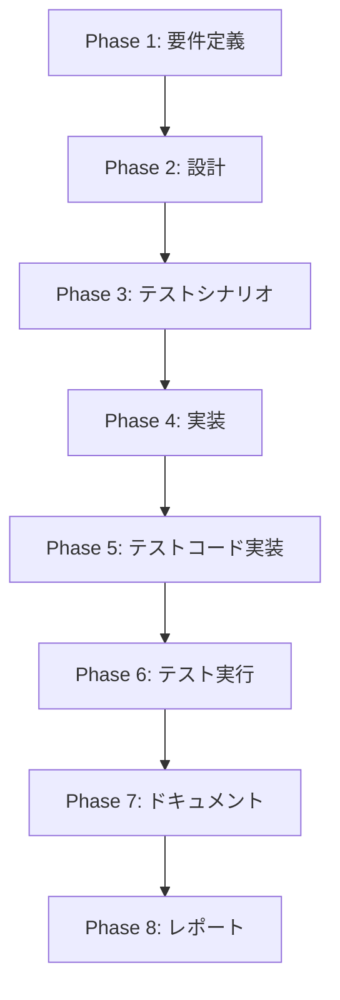

# プロジェクト計画書

## Issue分析

### 複雑度
**中程度**

### 見積もり工数
8~12時間（根拠: 5つのプロンプトファイルの修正、各1.5~2.5時間）

### リスク評価
**低**
- プロンプトファイルの修正のみ（実装コードの変更なし）
- 既存の動作を変更しない（出力フォーマットの簡潔化のみ）
- テストコードの修正は不要

## 実装戦略判断

### 実装戦略: EXTEND

**判断根拠**:
- 既存のプロンプトファイルを修正する
- 新規ファイルの作成は不要
- プロンプトのフォーマット指示部分のみを簡潔化する
- Phase 0-2のプロンプトは変更しない（序盤フェーズは詳細維持）

### テスト戦略: UNIT_INTEGRATION

**判断根拠**:
- ユニットテスト: 各フェーズのプロンプトファイルが正しく読み込まれることを確認
- インテグレーションテスト: 実際にワークフローを実行し、簡潔化された出力が生成されることを確認
- BDDテストは不要（プロンプトファイルの修正なので、ユーザーストーリーよりも実装確認が重要）

### テストコード戦略: EXTEND_TEST

**判断根拠**:
- 既存のテストファイル（プロンプト読み込みテスト等）に追加
- 新規テストファイル作成は不要（プロンプト修正のため、既存のテストケースを拡張する形で十分）

## 影響範囲分析

### 既存コードへの影響
**変更が必要なファイル**:
- `src/prompts/implementation/execute.txt` - 実装ログのフォーマットを簡潔化
- `src/prompts/test_implementation/execute.txt` - テスト実装ログのフォーマットを簡潔化
- `src/prompts/testing/execute.txt` - テスト結果のフォーマットを簡潔化（成功時はサマリーのみ、失敗時のみ詳細）
- `src/prompts/documentation/execute.txt` - ドキュメント更新ログのフォーマットを簡潔化
- `src/prompts/report/execute.txt` - 最終レポートのフォーマットを大幅簡潔化（詳細は@references）

**影響を受けるモジュール**:
- `src/phases/implementation.ts` - 出力ファイル検証ロジック（フォーマット変更に影響なし）
- `src/phases/test-implementation.ts` - 出力ファイル検証ロジック（フォーマット変更に影響なし）
- `src/phases/testing.ts` - 出力ファイル検証ロジック（フォーマット変更に影響なし）
- `src/phases/documentation.ts` - 出力ファイル検証ロジック（フォーマット変更に影響なし）
- `src/phases/report.ts` - 出力ファイル検証ロジック（フォーマット変更に影響なし）

### 依存関係の変更
**新規依存の追加**: なし

**既存依存の変更**: なし

### マイグレーション要否
**データベーススキーマ変更**: なし

**設定ファイル変更**: なし

**環境変数変更**: なし

## タスク分割

### Phase 1: 要件定義 (見積もり: 1~1.5h)

- [x] Task 1-1: Issue #207の背景と方針を詳細に分析 (0.5~1h)
  - 現状のドキュメントが詳細すぎる理由を理解
  - 簡潔化による期待される効果を明確化
  - 序盤フェーズ（Phase 0-2）を変更しない理由を確認
- [x] Task 1-2: 各フェーズの出力フォーマット要件を定義 (0.5h)
  - Phase 4（Implementation）の簡潔化要件を定義
  - Phase 5（Test Implementation）の簡潔化要件を定義
  - Phase 6（Testing）の簡潔化要件を定義（成功時/失敗時で分岐）
  - Phase 7（Documentation）の簡潔化要件を定義
  - Phase 8（Report）の大幅簡潔化要件を定義（@references方式）

### Phase 2: 設計 (見積もり: 1~1.5h)

- [ ] Task 2-1: プロンプトファイルの修正方針を設計 (0.5~1h)
  - 既存のプロンプト構造を分析
  - 各フェーズで削除すべき詳細指示を特定
  - 各フェーズで残すべき最低限の情報を特定
  - Phase 8のエグゼクティブサマリー方式を設計
- [ ] Task 2-2: 出力フォーマットのテンプレートを設計 (0.5h)
  - Phase 4の「変更ファイル一覧」テーブルフォーマットを設計
  - Phase 5の「テストファイル一覧」テーブルフォーマットを設計
  - Phase 6の成功時/失敗時の出力フォーマットを設計
  - Phase 7の「更新サマリー」テーブルフォーマットを設計
  - Phase 8の「エグゼクティブサマリー + 詳細参照」フォーマットを設計

### Phase 3: テストシナリオ (見積もり: 1h)

- [x] Task 3-1: プロンプト修正の検証シナリオを作成 (0.5h)
  - 各プロンプトファイルが正しくビルドされることを確認
  - 各プロンプトファイルが正しく読み込まれることを確認
  - 簡潔化された出力フォーマットが生成されることを確認
- [x] Task 3-2: 実際のワークフロー実行シナリオを作成 (0.5h)
  - テスト用のIssueを作成し、Phase 4-8を実行
  - 各フェーズで簡潔化された出力が生成されることを確認
  - Phase 8で@referencesが正しく機能することを確認

### Phase 4: 実装 (見積もり: 2~3h)

- [x] Task 4-1: Phase 4（Implementation）のプロンプト修正 (0.5~1h)
  - 実装詳細セクションを削除
  - 「変更ファイル一覧」テーブルフォーマットに置き換え
  - 「主要な変更点」セクションを3-5個の箇条書きに簡潔化
- [x] Task 4-2: Phase 5（Test Implementation）のプロンプト修正 (0.5h)
  - テストケース詳細セクションを削除
  - 「テストファイル一覧」テーブルフォーマットに置き換え
  - 「テストカバレッジ」セクションを数値サマリーに簡潔化
- [x] Task 4-3: Phase 6（Testing）のプロンプト修正 (0.5h)
  - 成功時: サマリーのみ（総数、成功率）を出力
  - 失敗時: 失敗したテストの詳細のみを出力
  - 成功したテストの詳細リストは削除
- [x] Task 4-4: Phase 7（Documentation）のプロンプト修正 (0.5h)
  - 「更新サマリー」テーブルフォーマットに置き換え
  - 更新不要と判断したファイルのリストは省略
  - 各ドキュメントの詳細な変更内容は省略
- [x] Task 4-5: Phase 8（Report）のプロンプト修正 (1~1.5h)
  - エグゼクティブサマリーセクションを追加
  - マージチェックリストセクションを簡潔化
  - リスク・注意点セクションを簡潔化
  - 詳細参照セクションを追加（@requirements.md、@design.md等へのリンク）
  - 各フェーズの詳細再掲載セクションを削除

### Phase 5: テストコード実装 (見積もり: 1~1.5h)

- [x] Task 5-1: プロンプト読み込みテストを拡張 (0.5~1h)
  - 修正後の各プロンプトファイルが正しく読み込まれることを確認
  - 簡潔化された出力フォーマットが含まれることを確認
  - 削除されたセクション（詳細リスト等）が含まれないことを確認
- [x] Task 5-2: ビルドテストを拡張 (0.5h)
  - `npm run build` 後、dist/prompts/にプロンプトファイルがコピーされることを確認
  - 修正後のプロンプトファイルが正しくdistにコピーされることを確認

### Phase 6: テスト実行 (見積もり: 0.5~1h)

- [x] Task 6-1: ユニットテストを実行 (0.5h)
  - プロンプト読み込みテストを実行
  - ビルドテストを実行
  - すべてのテストが成功することを確認
- [ ] Task 6-2: インテグレーションテストを実行（手動） (0.5h)
  - テスト用のIssueでワークフローを実行
  - Phase 4-8で簡潔化された出力が生成されることを確認
  - Phase 8で@referencesが正しく機能することを確認

### Phase 7: ドキュメント (見積もり: 1~1.5h)

- [x] Task 7-1: CLAUDE.mdを更新 (0.5~1h)
  - 「Phase 4-8の出力ドキュメント簡潔化」セクションを追加
  - 各フェーズの新しい出力フォーマットを記載
  - 序盤フェーズ（Phase 0-2）は変更しないことを明記
- [x] Task 7-2: ARCHITECTURE.mdを更新（必要に応じて） (0.5h)
  - プロンプトファイルの構造説明を更新（必要に応じて）
  - 出力フォーマットの説明を更新（必要に応じて）

### Phase 8: レポート (見積もり: 0.5~1h)

- [x] Task 8-1: 実装サマリーを作成 (0.5h)
  - 変更ファイル一覧（5つのプロンプトファイル）
  - 主要な変更点（簡潔化による効果）
  - テスト結果（すべて成功）
  - ドキュメント更新（CLAUDE.md、ARCHITECTURE.md）
- [x] Task 8-2: マージチェックリストを作成 (0.5h)
  - 要件充足の確認
  - テスト成功の確認
  - ドキュメント更新の確認

## 依存関係

## リスクと軽減策

### リスク1: 簡潔化しすぎて必要な情報が失われる

- **影響度**: 中
- **確率**: 低
- **軽減策**:
  - Phase 8で@references方式を採用し、詳細は個別フェーズのファイルを参照可能にする
  - 序盤フェーズ（Phase 0-2）は詳細を維持する
  - LLMが後続フェーズで必要とする最低限の情報は残す
  - Phase 6（Testing）は失敗時のみ詳細を記載する方針にする

### リスク2: 既存のワークフローが動作しなくなる

- **影響度**: 高
- **確率**: 非常に低
- **軽減策**:
  - プロンプトの出力フォーマット指示のみを変更し、実装コードは変更しない
  - 出力ファイル名は変更しない（implementation.md、test-implementation.md等）
  - テスト実行で動作確認を徹底する
  - Phase 8でビルドテストを追加し、プロンプトファイルが正しくコピーされることを確認

### リスク3: コンテキスト制限の問題（Issue #202）が解決されない

- **影響度**: 中
- **確率**: 低
- **軽減策**:
  - Phase 8で最も大幅に簡潔化（詳細再掲載を削除）
  - Phase 4-7でも重複情報を削減（テーブルフォーマット採用）
  - 成功時のテスト詳細リストを削除（Phase 6）

## 品質ゲート

### Phase 1: 要件定義
- [x] 各フェーズの簡潔化要件が明確に定義されている
- [x] 序盤フェーズ（Phase 0-2）を変更しない理由が明記されている
- [x] 簡潔化による期待される効果が定義されている

### Phase 2: 設計
- [x] 実装戦略の判断根拠が明記されている（EXTEND）
- [x] テスト戦略の判断根拠が明記されている（UNIT_INTEGRATION）
- [x] テストコード戦略の判断根拠が明記されている（EXTEND_TEST）
- [x] 各フェーズの新しい出力フォーマットが設計されている
- [x] Phase 8のエグゼクティブサマリー方式が設計されている

### Phase 3: テストシナリオ
- [x] プロンプト修正の検証シナリオが作成されている
- [x] 実際のワークフロー実行シナリオが作成されている
- [x] 簡潔化された出力フォーマットの検証方法が明確である

### Phase 4: 実装
- [ ] Phase 2の設計に沿った実装である
- [ ] 既存のプロンプト規約に準拠している
- [ ] 5つのプロンプトファイルすべてが修正されている
- [ ] 序盤フェーズ（Phase 0-2）のプロンプトは変更されていない

### Phase 5: テストコード実装
- [x] Phase 3のテストシナリオがすべて実装されている
- [x] テストコードが実行可能である
- [x] テストの意図がコメントで明確

### Phase 6: テスト実行
- [x] テストが実行されている
- [x] 主要なテストケースが成功している
- [x] 失敗したテストは分析されている

### Phase 7: ドキュメント
- [x] 影響を受けるドキュメントが特定されている
- [x] 必要なドキュメントが更新されている
- [x] 更新内容が記録されている

### Phase 8: レポート
- [x] 変更内容が要約されている
- [x] マージ判断に必要な情報が揃っている
- [x] 動作確認手順が記載されている
