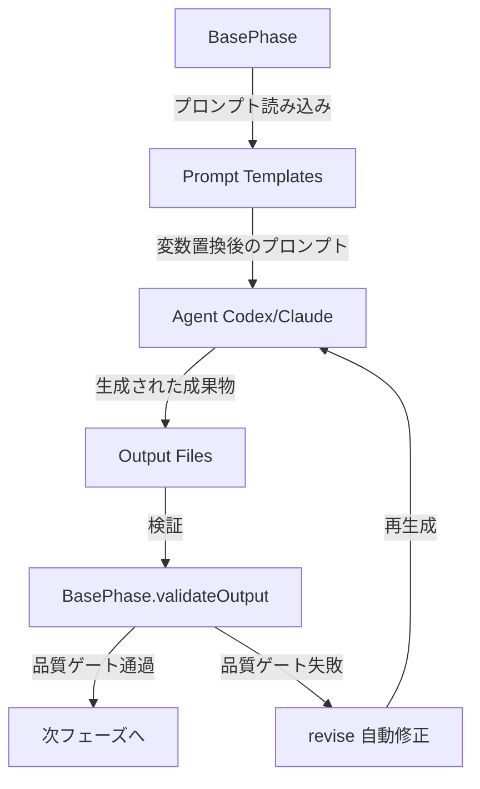

# 設計書

## 0. Planning Documentの確認

Planning Phase（Phase 0）で策定された開発計画を確認しました。主要な方針は以下の通りです：

- **実装戦略**: EXTEND（既存のプロンプトファイルを修正）
- **テスト戦略**: UNIT_INTEGRATION（ユニットテスト + インテグレーションテスト）
- **テストコード戦略**: EXTEND_TEST（既存テストに追加）
- **見積もり工数**: 8~12時間
- **リスク**: 低（プロンプトファイルの修正のみ、実装コードの変更なし）

この計画に基づき、以下の詳細設計を実施します。

## 1. アーキテクチャ設計

### システム全体図

```
┌─────────────────────────────────────────────────────────────┐
│                     AI Workflow System                       │
└─────────────────────────────────────────────────────────────┘
                              │
                              ▼
┌─────────────────────────────────────────────────────────────┐
│                    BasePhase (src/phases/)                   │
│  ・execute() → プロンプト読み込み → エージェント実行        │
│  ・review()  → 出力検証                                     │
│  ・revise()  → 自動修正サイクル                             │
└─────────────────────────────────────────────────────────────┘
                              │
                              ▼
┌─────────────────────────────────────────────────────────────┐
│             Prompt Templates (src/prompts/)                  │
│                                                              │
│  Phase 0-2 (変更なし)                                        │
│  ├── 00_planning/execute.txt                                 │
│  ├── 01_requirements/execute.txt                             │
│  └── 02_design/execute.txt                                   │
│                                                              │
│  Phase 4-8 (簡潔化対象) ← ★今回の修正範囲                    │
│  ├── 04_implementation/execute.txt     (FR-1)               │
│  ├── 05_test_implementation/execute.txt (FR-2)              │
│  ├── 06_testing/execute.txt            (FR-3)               │
│  ├── 07_documentation/execute.txt      (FR-4)               │
│  └── 08_report/execute.txt             (FR-5)               │
└─────────────────────────────────────────────────────────────┘
                              │
                              ▼
┌─────────────────────────────────────────────────────────────┐
│              Agent (Codex / Claude Code)                     │
│  ・プロンプトに従って成果物を生成                            │
│  ・簡潔化された出力フォーマット指示に基づいて記載            │
└─────────────────────────────────────────────────────────────┘
                              │
                              ▼
┌─────────────────────────────────────────────────────────────┐
│        Output Files (.ai-workflow/issue-*/*/output/)         │
│  ・implementation.md    (テーブルフォーマット)               │
│  ・test-implementation.md (テーブルフォーマット)             │
│  ・test-result.md       (サマリー形式)                       │
│  ・documentation.md     (テーブルフォーマット)               │
│  ・report.md            (エグゼクティブサマリー + @references)│
└─────────────────────────────────────────────────────────────┘
```

### コンポーネント間の関係



### データフロー

1. **プロンプト読み込み**: `BasePhase.loadPrompt()` → `src/prompts/{phase}/execute.txt`
2. **変数置換**: テンプレート変数を実際の値に置換（Issue番号、リポジトリ情報等）
3. **エージェント実行**: Codex / Claude がプロンプトに従って成果物を生成
4. **出力ファイル保存**: `.ai-workflow/issue-{NUM}/{phase}/output/{file}.md`
5. **検証**: `BasePhase.validateOutput()` で品質ゲートチェック
6. **後続フェーズ参照**: 他のフェーズが `@filepath` 形式で参照

## 2. 実装戦略判断

### 実装戦略: EXTEND

**判断根拠**:
- **既存のプロンプトファイルを修正する**: 新規ファイルの作成は不要で、5つの既存プロンプトファイル（`execute.txt`）の出力フォーマット指示セクションのみを簡潔化する
- **実装コードは変更しない**: `src/phases/` 配下のTypeScriptコードは一切変更せず、プロンプトテンプレートのみを修正する
- **既存の品質ゲートは維持**: `BasePhase.validateOutput()` のロジックは変更しないため、フォーマット変更が品質ゲートに影響しない
- **段階的な修正が可能**: Phase 4-8の各プロンプトファイルを個別に修正できるため、リスクを最小化できる

## 3. テスト戦略判断

### テスト戦略: UNIT_INTEGRATION

**判断根拠**:
- **ユニットテスト**: 各フェーズのプロンプトファイルが正しく読み込まれることを確認（ファイル存在チェック、文字列検証）
- **インテグレーションテスト**: 実際にワークフローを実行し、簡潔化された出力が生成されることを確認（Phase 4-8の出力ファイル内容検証）
- **BDDテストは不要**: プロンプトファイルの修正であり、ユーザーストーリーよりも実装確認（「簡潔化されたフォーマットが生成される」）が重要
- **テスト範囲の明確化**: ユニットテストで個別フェーズのプロンプト読み込みを検証し、インテグレーションテストで全体フローを検証することで、品質を担保

## 4. テストコード戦略判断

### テストコード戦略: EXTEND_TEST

**判断根拠**:
- **既存のテストファイルに追加**: プロンプトファイルの修正なので、既存のテストケース（プロンプト読み込みテスト等）を拡張する形で十分
- **新規テストファイル作成は不要**: Phase 4-8の出力フォーマット検証テストは、既存のインテグレーションテスト（`tests/integration/` 配下）に追加できる
- **テストの保守性**: 既存テストファイルに追加することで、テストコードの重複を避け、保守性を向上
- **テストの実行効率**: 既存のテストスイートに統合することで、CIパイプラインの変更を最小化

## 5. 影響範囲分析

### 5.1 既存コードへの影響

#### 変更が必要なファイル（プロンプトテンプレート）

1. **`src/prompts/implementation/execute.txt`**（FR-1）
   - 実装詳細セクションを削除
   - 「変更ファイル一覧」テーブルフォーマットに置き換え
   - 「主要な変更点」セクションを3-5個の箇条書きに簡潔化

2. **`src/prompts/test_implementation/execute.txt`**（FR-2）
   - テストケース詳細セクションを削除
   - 「テストファイル一覧」テーブルフォーマットに置き換え
   - 「テストカバレッジ」セクションを数値サマリーに簡潔化

3. **`src/prompts/testing/execute.txt`**（FR-3）
   - 成功時: サマリーのみ（総数、成功率）を出力
   - 失敗時: 失敗したテストの詳細のみを出力
   - 成功したテストの詳細リストは削除

4. **`src/prompts/documentation/execute.txt`**（FR-4）
   - 「更新サマリー」テーブルフォーマットに置き換え
   - 更新不要と判断したファイルのリストは省略
   - 各ドキュメントの詳細な変更内容は省略

5. **`src/prompts/report/execute.txt`**（FR-5）
   - エグゼクティブサマリーセクションを追加
   - マージチェックリストセクションを簡潔化
   - リスク・注意点セクションを簡潔化
   - 詳細参照セクションを追加（@requirements.md、@design.md等へのリンク）
   - 各フェーズの詳細再掲載セクションを削除

#### 影響を受けるモジュール（変更なし、検証のみ）

以下のTypeScriptファイルは**変更不要**ですが、プロンプト修正後も正常に動作することを検証します：

1. **`src/phases/implementation.ts`**
   - `validateOutput()` メソッド: 出力ファイル（`implementation.md`）が存在するか検証
   - **影響なし**: ファイル存在チェックのみなので、フォーマット変更は無関係

2. **`src/phases/test-implementation.ts`**
   - `validateOutput()` メソッド: 出力ファイル（`test-implementation.md`）が存在するか検証
   - **影響なし**: ファイル存在チェックのみ

3. **`src/phases/testing.ts`**
   - `validateOutput()` メソッド: 出力ファイル（`test-result.md`）が存在するか検証
   - **影響なし**: ファイル存在チェックのみ

4. **`src/phases/documentation.ts`**
   - `validateOutput()` メソッド: 出力ファイル（`documentation.md`）が存在するか検証
   - **影響なし**: ファイル存在チェックのみ

5. **`src/phases/report.ts`**
   - `validateOutput()` メソッド: 出力ファイル（`report.md`）が存在するか検証
   - **影響なし**: ファイル存在チェックのみ

6. **`src/phases/base-phase.ts`**
   - `loadPrompt()` メソッド: プロンプトファイルを読み込む
   - **影響なし**: プロンプトの内容変更は読み込み処理に影響しない

### 5.2 依存関係の変更

#### 新規依存の追加
**なし**（プロンプトファイルの修正のみで、新規パッケージのインストールは不要）

#### 既存依存の変更
**なし**（`package.json` の変更不要）

### 5.3 マイグレーション要否

#### データベーススキーマ変更
**なし**（データベースは使用していない）

#### 設定ファイル変更
**なし**（環境変数や設定ファイルの変更は不要）

#### 環境変数変更
**なし**（新規環境変数の追加は不要）

## 6. 変更・追加ファイルリスト

### 修正が必要な既存ファイル

1. `src/prompts/implementation/execute.txt`（FR-1: Phase 4 プロンプト）
2. `src/prompts/test_implementation/execute.txt`（FR-2: Phase 5 プロンプト）
3. `src/prompts/testing/execute.txt`（FR-3: Phase 6 プロンプト）
4. `src/prompts/documentation/execute.txt`（FR-4: Phase 7 プロンプト）
5. `src/prompts/report/execute.txt`（FR-5: Phase 8 プロンプト）

### 新規作成ファイル

**なし**（既存プロンプトファイルの修正のみ）

### 削除が必要なファイル

**なし**

## 7. 詳細設計

### 7.1 Phase 4（Implementation）プロンプト設計

#### 現状のセクション構成
```markdown
# 実装完了レポート

## 実装詳細

### ファイル1: path/to/file.py
- **変更内容**: （何を実装したか）
- **理由**: （なぜこの実装にしたか）
- **注意点**: （レビュー時の注意点）

### ファイル2: path/to/another.py
...（以下、各ファイルについて詳細に記載）
```

#### 修正後のセクション構成
```markdown
# 実装完了レポート

## 変更ファイル一覧

| ファイル | 変更種別 | 概要 |
|---------|---------|------|
| `path/to/file.py` | 新規 | XXX機能を実装 |
| `path/to/existing.py` | 修正 | YYY処理を追加 |
| `path/to/removed.py` | 削除 | 不要なモジュールを削除 |

## 主要な変更点
- （重要な変更点1: 1-2文）
- （重要な変更点2: 1-2文）
- （重要な変更点3: 1-2文）
- （必要に応じて4-5個まで）

## テスト実施状況
- ビルド: ✅ 成功 / ❌ 失敗
- リント: ✅ 成功 / ❌ 失敗
- 基本動作確認: （簡潔に記載）
```

#### プロンプト修正箇所（execute.txt内）

**削除するセクション**:
```
## 実装詳細

各ファイルの変更内容を以下の形式で詳細に記載してください：

### ファイル: {ファイルパス}
- **変更内容**: （何を実装したか）
- **理由**: （なぜこの実装にしたか）
- **注意点**: （レビュー時の注意点）
```

**追加するセクション**:
```
## 変更ファイル一覧

以下のテーブル形式で変更ファイルをリストアップしてください：

| ファイル | 変更種別 | 概要 |
|---------|---------|------|
| `path/to/file` | 新規/修正/削除 | 1文で概要を記載 |

## 主要な変更点

重要な変更点を3-5個の箇条書きで簡潔に記載してください（各1-2文）：
- （変更点1）
- （変更点2）
- （変更点3）
```

### 7.2 Phase 5（Test Implementation）プロンプト設計

#### 現状のセクション構成
```markdown
# テスト実装完了レポート

## テストケース詳細

### ファイル: tests/test_xxx.py
- **test_function1**: （テスト内容の詳細説明）
- **test_function2**: （テスト内容の詳細説明）
...（以下、各テスト関数について詳細に記載）
```

#### 修正後のセクション構成
```markdown
# テスト実装完了レポート

## テストファイル一覧

| ファイル | テスト数 | カバー対象 |
|---------|---------|-----------|
| `tests/test_xxx.py` | 5 | XXXモジュール |
| `tests/test_yyy.py` | 3 | YYYモジュール |

## テストカバレッジ
- ユニットテスト: X件
- 統合テスト: Y件
- BDDテスト: Z件（該当する場合）
- カバレッジ率: XX%（算出可能な場合）
```

#### プロンプト修正箇所（execute.txt内）

**削除するセクション**:
```
## テストケース詳細

各テストケースの内容を以下の形式で詳細に記載してください：

### ファイル: {ファイルパス}
- **test_function1**: （テスト内容の詳細説明）
- **test_function2**: （テスト内容の詳細説明）
```

**追加するセクション**:
```
## テストファイル一覧

以下のテーブル形式でテストファイルをリストアップしてください：

| ファイル | テスト数 | カバー対象 |
|---------|---------|-----------|
| `tests/test_xxx.py` | X | カバー対象モジュール名 |

## テストカバレッジ

以下の形式で数値サマリーを記載してください：
- ユニットテスト: X件
- 統合テスト: Y件
- BDDテスト: Z件（該当する場合）
- カバレッジ率: XX%（算出可能な場合のみ）
```

### 7.3 Phase 6（Testing）プロンプト設計

#### 現状のセクション構成
```markdown
# テスト結果レポート

## 全テスト結果

### 成功したテスト
- test_function1: PASS
- test_function2: PASS
- test_function3: PASS
...（全ての成功したテストをリストアップ）

### 失敗したテスト
- test_function4: FAIL
  - エラー内容: ...
  - スタックトレース: ...
```

#### 修正後のセクション構成

**成功時**:
```markdown
# テスト結果レポート

## テスト結果サマリー
- 総テスト数: 120件
- 成功: 120件
- 失敗: 0件
- 成功率: 100%

✅ 全てのテストが成功しました。
```

**失敗時**:
```markdown
# テスト結果レポート

## テスト結果サマリー
- 総テスト数: 120件
- 成功: 115件
- 失敗: 5件
- 成功率: 95.8%

## 失敗したテスト詳細

### `tests/test_xxx.py::test_function1`
- **エラー**: AssertionError: Expected 10, got 5
- **スタックトレース**:
  ```
  （関連する部分のみ抜粋）
  ```

### `tests/test_xxx.py::test_function2`
- **エラー**: ValueError: Invalid input
- **スタックトレース**:
  ```
  （関連する部分のみ抜粋）
  ```

...（以下、失敗したテストのみ記載）
```

#### プロンプト修正箇所（execute.txt内）

**削除するセクション**:
```
## 全テスト結果

すべてのテスト結果を以下の形式で記載してください：

### 成功したテスト
- test_function1: PASS
- test_function2: PASS
...

### 失敗したテスト
- test_function3: FAIL
  - エラー内容: ...
```

**追加するセクション**:
```
## テスト結果サマリー

以下の形式で数値サマリーを記載してください：
- 総テスト数: X件
- 成功: Y件
- 失敗: Z件
- 成功率: XX%

## 条件分岐

**成功時（失敗数が0件）**:
✅ 全てのテストが成功しました。

**失敗時（失敗数が1件以上）**:
以下の形式で失敗したテストの詳細のみを記載してください：

### `tests/test_xxx.py::test_function_name`
- **エラー**: （エラーメッセージ）
- **スタックトレース**:
  ```
  （関連する部分のみ抜粋）
  ```

**注意**: 成功したテストの詳細リストは記載しないでください。
```

### 7.4 Phase 7（Documentation）プロンプト設計

#### 現状のセクション構成
```markdown
# ドキュメント更新レポート

## 調査したドキュメント
- README.md
- CLAUDE.md
- ARCHITECTURE.md
...（全ての.mdファイルをリストアップ）

## 更新したドキュメント

### `README.md`
**更新理由**: 新機能XXXの使用方法を追加
**主な変更内容**:
- （変更点1）
- （変更点2）
- （変更点3）

### `CLAUDE.md`
**更新理由**: 環境変数YYYを追記
**主な変更内容**:
- （変更点1）
- （変更点2）

## 更新不要と判断したドキュメント
- ARCHITECTURE.md: 今回の変更は既存アーキテクチャに影響しないため
- TROUBLESHOOTING.md: トラブルシューティング情報の追加は不要と判断
...
```

#### 修正後のセクション構成
```markdown
# ドキュメント更新レポート

## 更新サマリー

| ファイル | 更新理由 |
|---------|---------|
| `README.md` | 新機能XXXの使用方法を追加 |
| `CLAUDE.md` | 環境変数YYYを追記 |
| `ARCHITECTURE.md` | YYYモジュールのアーキテクチャ図を更新 |

※ 更新不要と判断したファイルは省略しています。
```

#### プロンプト修正箇所（execute.txt内）

**削除するセクション**:
```
## 調査したドキュメント

すべての.mdファイルをリストアップしてください：
- README.md
- CLAUDE.md
...

## 更新したドキュメント

各ドキュメントについて以下の形式で詳細に記載してください：

### `{ファイル名}`
**更新理由**: ...
**主な変更内容**:
- （変更点1）
- （変更点2）

## 更新不要と判断したドキュメント
- {ファイル名}: （理由）
```

**追加するセクション**:
```
## 更新サマリー

以下のテーブル形式で更新したドキュメントのみをリストアップしてください：

| ファイル | 更新理由 |
|---------|---------|
| `{ファイル名}` | 1文で更新理由を記載 |

※ 更新不要と判断したファイルのリストは省略してください。
※ 詳細な変更内容は各ドキュメント自体に記載されているため、ここでは記載不要です。
```

### 7.5 Phase 8（Report）プロンプト設計

#### 現状のセクション構成
```markdown
# Issue 完了レポート

## 要件定義サマリー
（要件定義書の内容を詳細に再掲載）

## 設計サマリー
（設計書の内容を詳細に再掲載）

## 実装サマリー
（実装レポートの内容を詳細に再掲載）

## テスト実装サマリー
（テスト実装レポートの内容を詳細に再掲載）

## テスト結果サマリー
（テスト結果の内容を詳細に再掲載）

## ドキュメント更新サマリー
（ドキュメント更新レポートの内容を詳細に再掲載）

## マージ推奨
✅ マージ推奨 / ⚠️ 条件付きマージ / ❌ マージ非推奨
```

#### 修正後のセクション構成
```markdown
# Issue 完了レポート

## エグゼクティブサマリー
- **Issue番号**: #XXX
- **タイトル**: （Issueタイトル）
- **実装内容**: （1-2文で簡潔に）
- **変更規模**: 新規X件、修正Y件、削除Z件
- **テスト結果**: 全N件成功（成功率XX%）
- **マージ推奨**: ✅ マージ推奨 / ⚠️ 条件付きマージ / ❌ マージ非推奨

## マージチェックリスト
- [ ] 要件充足: （充足しているか？）
- [ ] テスト成功: （全テスト成功？）
- [ ] ドキュメント更新: （必要なドキュメントが更新されているか？）
- [ ] セキュリティリスク: （新たなリスクがないか？）
- [ ] 後方互換性: （既存機能に影響がないか？）

## リスク・注意点
- （あれば箇条書きで簡潔に記載、なければ「なし」）

## 詳細参照

各フェーズの詳細は以下のファイルを参照してください：

- **要件定義**: @.ai-workflow/issue-{NUM}/01_requirements/output/requirements.md
- **設計**: @.ai-workflow/issue-{NUM}/02_design/output/design.md
- **実装**: @.ai-workflow/issue-{NUM}/04_implementation/output/implementation.md
- **テスト実装**: @.ai-workflow/issue-{NUM}/05_test_implementation/output/test-implementation.md
- **テスト結果**: @.ai-workflow/issue-{NUM}/06_testing/output/test-result.md
- **ドキュメント更新**: @.ai-workflow/issue-{NUM}/07_documentation/output/documentation.md
```

#### プロンプト修正箇所（execute.txt内）

**削除するセクション**:
```
## 要件定義サマリー
（要件定義書の内容を詳細に再掲載）

## 設計サマリー
（設計書の内容を詳細に再掲載）

...（以下、各フェーズのサマリーセクション）
```

**追加するセクション**:
```
## エグゼクティブサマリー

以下の形式で簡潔に記載してください：

- **Issue番号**: #{issue_number}
- **タイトル**: {issue_title}
- **実装内容**: （1-2文で簡潔に）
- **変更規模**: 新規X件、修正Y件、削除Z件
- **テスト結果**: 全N件成功（成功率XX%）
- **マージ推奨**: ✅ マージ推奨 / ⚠️ 条件付きマージ / ❌ マージ非推奨

## マージチェックリスト

以下のチェックリストを埋めてください：

- [ ] 要件充足: （充足しているか？）
- [ ] テスト成功: （全テスト成功？）
- [ ] ドキュメント更新: （必要なドキュメントが更新されているか？）
- [ ] セキュリティリスク: （新たなリスクがないか？）
- [ ] 後方互換性: （既存機能に影響がないか？）

## リスク・注意点

特に注意すべき点があれば箇条書きで簡潔に記載してください。なければ「なし」と記載してください。

## 詳細参照

**重要**: 各フェーズの詳細をここに再掲載しないでください。代わりに以下の@参照形式でリンクしてください：

- **要件定義**: @.ai-workflow/issue-{issue_number}/01_requirements/output/requirements.md
- **設計**: @.ai-workflow/issue-{issue_number}/02_design/output/design.md
- **実装**: @.ai-workflow/issue-{issue_number}/04_implementation/output/implementation.md
- **テスト実装**: @.ai-workflow/issue-{issue_number}/05_test_implementation/output/test-implementation.md
- **テスト結果**: @.ai-workflow/issue-{issue_number}/06_testing/output/test-result.md
- **ドキュメント更新**: @.ai-workflow/issue-{issue_number}/07_documentation/output/documentation.md
```

### 7.6 プロンプトファイル修正のパターン

すべてのプロンプトファイル修正は以下のパターンに従います：

1. **既存のセクション構造を維持**: プロンプトファイルの基本構造（ヘッダー、変数定義等）は変更しない
2. **出力フォーマット指示のみを修正**: エージェントに出力させる内容の指示部分のみを簡潔化する
3. **変数置換は維持**: `{issue_number}`, `{repository_name}` 等の変数置換機能は維持
4. **品質ゲートは維持**: 出力ファイルの品質基準（必須セクション等）は維持

## 8. セキュリティ考慮事項

### 8.1 認証・認可
**影響なし**: プロンプトファイルの修正のみで、認証・認可ロジックには影響しない

### 8.2 データ保護
**影響なし**: プロンプトファイルの修正のみで、データ保護ロジックには影響しない

### 8.3 セキュリティリスクと対策

#### リスク1: 簡潔化により必要な情報が欠落する
**影響度**: 中
**確率**: 低
**対策**:
- Phase 8で@references方式を採用し、詳細は個別フェーズのファイルを参照可能にする
- 序盤フェーズ（Phase 0-2）は詳細を維持する
- LLMが後続フェーズで必要とする最低限の情報は残す
- Phase 6（Testing）は失敗時のみ詳細を記載する方針にする

#### リスク2: 既存のワークフローが動作しなくなる
**影響度**: 高
**確率**: 非常に低
**対策**:
- プロンプトの出力フォーマット指示のみを変更し、実装コードは変更しない
- 出力ファイル名は変更しない（`implementation.md`、`test-implementation.md`等）
- テスト実行で動作確認を徹底する
- Phase 8でビルドテストを追加し、プロンプトファイルが正しくコピーされることを確認

#### リスク3: コンテキスト制限の問題（Issue #202）が解決されない
**影響度**: 中
**確率**: 低
**対策**:
- Phase 8で最も大幅に簡潔化（詳細再掲載を削除）
- Phase 4-7でも重複情報を削減（テーブルフォーマット採用）
- 成功時のテスト詳細リストを削除（Phase 6）
- インテグレーションテストでコンテキスト消費量を検証

## 9. 非機能要件への対応

### 9.1 パフォーマンス

#### NFR-1: コンテキスト消費量
- **目標**: Phase 8（Report）およびPhase 9（Evaluation）で、従来比30-50%のコンテキスト削減を達成すること
- **対応**:
  - Phase 8で詳細再掲載セクションを削除（最も大きな削減効果）
  - Phase 4-7でテーブルフォーマット採用（簡潔な表現）
  - Phase 6で成功時のテスト詳細リスト削除
- **検証方法**: 修正前後のPhase 8出力ファイル（`report.md`）の文字数を比較

#### NFR-2: 生成時間
- **目標**: プロンプト修正により、ドキュメント生成時間に悪影響を与えないこと（±10%以内）
- **対応**:
  - プロンプトファイルの修正のみで、実装コードは変更しないため、生成時間への影響は最小限
  - エージェント（Codex / Claude）の実行時間は変わらない
- **検証方法**: 修正前後で同一Issueに対してワークフローを実行し、各フェーズの実行時間を比較

### 9.2 品質要件

#### NFR-3: 情報損失の最小化
- **目標**: LLMが後続フェーズで必要とする最低限の情報は保持すること
- **対応**:
  - Phase 4-7: 変更ファイル一覧、テストファイル一覧等の「索引情報」は保持
  - Phase 8: @references方式により、詳細情報へのアクセス経路を提供
  - Phase 6: 失敗時は詳細を記載（デバッグに必要な情報を保持）
- **検証方法**: インテグレーションテストで後続フェーズが正常に動作することを確認

#### NFR-4: 可読性
- **目標**: 人間が読みやすい形式（テーブル、箇条書き）を採用すること
- **対応**:
  - テーブルフォーマット採用（Phase 4, 5, 7）
  - 箇条書き簡潔化（Phase 4, 8）
  - サマリー形式（Phase 6）
  - @references方式（Phase 8）
- **検証方法**: 手動レビューで可読性を確認

#### NFR-5: 一貫性
- **目標**: 簡潔化後も、各フェーズの品質ゲート（Planning Documentで定義）を維持すること
- **対応**:
  - `BasePhase.validateOutput()` のロジックは変更しない
  - 出力ファイル名は変更しない（`implementation.md`等）
  - 必須セクションの削除は行わない（セクション内容の簡潔化のみ）
- **検証方法**: 品質ゲート検証テストで確認

### 9.3 保守性要件

#### NFR-6: プロンプト規約準拠
- **目標**: 既存のプロンプト規約（CLAUDE.md記載）に準拠すること
- **対応**:
  - プロンプトファイルの基本構造（ヘッダー、変数定義等）は維持
  - 変数置換機能（`{issue_number}`, `{repository_name}` 等）は維持
  - エージェント実行環境情報セクションは維持
- **検証方法**: コードレビューで確認

#### NFR-7: 後方互換性
- **目標**: プロンプト修正後も、既存のワークフローが動作すること（出力ファイル名は変更しない）
- **対応**:
  - 出力ファイル名は変更しない（`implementation.md`、`test-implementation.md`、`test-result.md`、`documentation.md`、`report.md`）
  - `BasePhase.validateOutput()` のロジックは変更しない
  - オプショナルコンテキスト構築機能（`BasePhase.buildOptionalContext()`）は維持
- **検証方法**: インテグレーションテストで後続フェーズが正常に動作することを確認

## 10. 実装の順序

以下の順序で実装することを推奨します：

### Phase 1: Planning & Requirements（完了済み）
- [x] Issue #207の分析
- [x] Planning Documentの作成
- [x] Requirements Documentの作成

### Phase 2: Design（現在のフェーズ）
- [ ] 詳細設計書の作成（本ドキュメント）

### Phase 3: Test Scenario
- [ ] ユニットテストシナリオの作成
  - プロンプトファイル読み込みテスト
  - プロンプトファイルビルドテスト
- [ ] インテグレーションテストシナリオの作成
  - Phase 4-8の出力フォーマット検証
  - コンテキスト消費量検証

### Phase 4: Implementation（推奨順序）

#### 4-1. Phase 4（Implementation）プロンプト修正
- [ ] `src/prompts/implementation/execute.txt` の出力フォーマット指示を簡潔化
- [ ] ローカルでビルド（`npm run build`）して `dist/prompts/implementation/execute.txt` が正しくコピーされることを確認

#### 4-2. Phase 5（Test Implementation）プロンプト修正
- [ ] `src/prompts/test_implementation/execute.txt` の出力フォーマット指示を簡潔化
- [ ] ローカルでビルド確認

#### 4-3. Phase 6（Testing）プロンプト修正
- [ ] `src/prompts/testing/execute.txt` の出力フォーマット指示を簡潔化（成功時/失敗時の条件分岐）
- [ ] ローカルでビルド確認

#### 4-4. Phase 7（Documentation）プロンプト修正
- [ ] `src/prompts/documentation/execute.txt` の出力フォーマット指示を簡潔化
- [ ] ローカルでビルド確認

#### 4-5. Phase 8（Report）プロンプト修正
- [ ] `src/prompts/report/execute.txt` の出力フォーマット指示を大幅簡潔化（@references方式）
- [ ] ローカルでビルド確認

### Phase 5: Test Implementation
- [ ] ユニットテスト実装
  - プロンプトファイル読み込みテストの拡張
  - ビルドテストの拡張
- [ ] インテグレーションテスト実装
  - Phase 4-8の出力フォーマット検証テストの追加
  - コンテキスト消費量検証テストの追加

### Phase 6: Testing
- [ ] ユニットテスト実行（`npm run test:unit`）
- [ ] インテグレーションテスト実行（`npm run test:integration`）
- [ ] カバレッジレポート確認（`npm run test:coverage`）

### Phase 7: Documentation
- [ ] CLAUDE.md の更新
  - 「Phase 4-8の出力ドキュメント簡潔化」セクションを追加
  - 各フェーズの新しい出力フォーマットを記載
- [ ] ARCHITECTURE.md の更新（必要に応じて）
  - プロンプトファイルの構造説明を更新

### Phase 8: Report
- [ ] 実装サマリーの作成
  - 変更ファイル一覧（5つのプロンプトファイル）
  - 主要な変更点（簡潔化による効果）
  - テスト結果（すべて成功）
  - ドキュメント更新（CLAUDE.md、ARCHITECTURE.md）
- [ ] マージチェックリストの作成
  - 要件充足の確認
  - テスト成功の確認
  - ドキュメント更新の確認

## 11. 実装時の注意事項

### 11.1 プロンプトファイルの編集規則

1. **文字エンコーディング**: UTF-8を維持
2. **改行コード**: LF（Unix形式）を維持
3. **インデント**: スペース2つを維持（既存のプロンプトファイルに合わせる）
4. **変数置換**: `{issue_number}`, `{repository_name}` 等の変数は維持

### 11.2 テンプレート変数の維持

以下のテンプレート変数は**削除しないでください**：

- `{issue_number}`: Issue番号
- `{issue_title}`: Issueタイトル
- `{repository_name}`: リポジトリ名
- `{issue_body}`: Issue本文
- `{working_dir}`: 作業ディレクトリ
- `{phase_name}`: フェーズ名

### 11.3 エージェント実行環境情報セクションの維持

以下のセクションは**削除しないでください**：

```
## 🛠️ 開発環境情報

このDocker環境では、以下のプログラミング言語をインストール可能です：

- **Python**: `apt-get update && apt-get install -y python3 python3-pip`
- **Go**: `apt-get update && apt-get install -y golang-go`
- **Java**: `apt-get update && apt-get install -y default-jdk`
- **Rust**: `curl --proto '=https' --tlsv1.2 -sSf https://sh.rustup.rs | sh -s -- -y`
- **Ruby**: `apt-get update && apt-get install -y ruby ruby-dev`

テスト実行や品質チェックに必要な言語環境は、自由にインストールしてください。
```

### 11.4 品質ゲートセクションの維持

各プロンプトファイルの末尾にある「品質ゲート」セクションは**削除しないでください**。出力フォーマットが変わっても、品質ゲートの基準は維持します。

例（Phase 4のプロンプトファイル）:
```
## 品質ゲート（Phase 4）

実装は以下の品質ゲートを満たす必要があります：

- [ ] **要件充足**: 要件定義書のすべての機能要件が実装されている
- [ ] **設計準拠**: 設計書の方針に従った実装である
- [ ] **コーディング規約**: CLAUDE.mdの規約に準拠している
- [ ] **ビルド成功**: `npm run build` が成功する
- [ ] **リント成功**: `npm run lint` が成功する（該当する場合）
```

## 12. ビルドプロセス

### 12.1 ビルドコマンド

```bash
# TypeScriptコンパイル + プロンプトファイルコピー
npm run build

# ウォッチモード（開発時）
npm run dev
```

### 12.2 ビルド後の確認

以下のファイルが `dist/prompts/` にコピーされていることを確認してください：

- `dist/prompts/implementation/execute.txt`
- `dist/prompts/test_implementation/execute.txt`
- `dist/prompts/testing/execute.txt`
- `dist/prompts/documentation/execute.txt`
- `dist/prompts/report/execute.txt`

### 12.3 ビルドスクリプト

`scripts/copy-static-assets.mjs` はプロンプトファイルを `dist/` にコピーします。このスクリプトの変更は**不要**です。

## 13. テスト戦略詳細

### 13.1 ユニットテスト

#### テスト対象
- `BasePhase.loadPrompt()` メソッド（プロンプトファイル読み込み）
- ビルド後のプロンプトファイル存在チェック

#### テストケース例
```typescript
describe('Phase 4 - Implementation Prompt', () => {
  it('should load implementation prompt file', async () => {
    const phase = new ImplementationPhase(/* ... */);
    const prompt = await phase.loadPrompt('execute');
    expect(prompt).toContain('変更ファイル一覧');
    expect(prompt).toContain('主要な変更点');
  });

  it('should exist in dist/ after build', () => {
    const promptPath = 'dist/prompts/implementation/execute.txt';
    expect(fs.existsSync(promptPath)).toBe(true);
  });
});
```

### 13.2 インテグレーションテスト

#### テスト対象
- Phase 4-8の実際のワークフロー実行
- 簡潔化された出力ファイルの生成確認

#### テストケース例（Phase 4）
```typescript
describe('Phase 4 - Implementation Output Format', () => {
  it('should generate concise implementation.md', async () => {
    // テスト用のIssueでPhase 4を実行
    await executePhase('implementation', 999);

    // 出力ファイルを読み込み
    const outputPath = '.ai-workflow/issue-999/04_implementation/output/implementation.md';
    const content = fs.readFileSync(outputPath, 'utf-8');

    // 簡潔化されたフォーマットが生成されているか確認
    expect(content).toContain('## 変更ファイル一覧');
    expect(content).toContain('| ファイル | 変更種別 | 概要 |');
    expect(content).toContain('## 主要な変更点');

    // 削除された詳細セクションが含まれていないことを確認
    expect(content).not.toContain('## 実装詳細');
    expect(content).not.toContain('### ファイル1:');
  });
});
```

#### テストケース例（Phase 6 - 成功時）
```typescript
describe('Phase 6 - Testing Output Format (Success)', () => {
  it('should generate summary only when all tests pass', async () => {
    // テスト用のIssueでPhase 6を実行（全テスト成功）
    await executePhase('testing', 999);

    const outputPath = '.ai-workflow/issue-999/06_testing/output/test-result.md';
    const content = fs.readFileSync(outputPath, 'utf-8');

    // サマリーのみが記載されていることを確認
    expect(content).toContain('## テスト結果サマリー');
    expect(content).toContain('総テスト数:');
    expect(content).toContain('成功率: 100%');

    // 成功したテストの詳細リストが含まれていないことを確認
    expect(content).not.toContain('### 成功したテスト');
  });
});
```

#### テストケース例（Phase 8 - @references）
```typescript
describe('Phase 8 - Report Output Format', () => {
  it('should use @references format instead of detailed duplication', async () => {
    await executePhase('report', 999);

    const outputPath = '.ai-workflow/issue-999/08_report/output/report.md';
    const content = fs.readFileSync(outputPath, 'utf-8');

    // エグゼクティブサマリーが記載されていることを確認
    expect(content).toContain('## エグゼクティブサマリー');
    expect(content).toContain('マージ推奨:');

    // @references形式が記載されていることを確認
    expect(content).toContain('## 詳細参照');
    expect(content).toContain('@.ai-workflow/issue-999/01_requirements/output/requirements.md');
    expect(content).toContain('@.ai-workflow/issue-999/02_design/output/design.md');

    // 詳細再掲載セクションが削除されていることを確認
    expect(content).not.toContain('## 要件定義サマリー');
    expect(content).not.toContain('## 設計サマリー');
  });
});
```

### 13.3 コンテキスト消費量検証テスト

#### テスト対象
- Phase 8（Report）の出力ファイルサイズ比較

#### テストケース例
```typescript
describe('Context Consumption Reduction', () => {
  it('should reduce report.md size by 30-50%', async () => {
    // 修正前のreport.mdサイズ（事前に取得しておく）
    const beforeSize = 50000; // 50KB（仮）

    // 修正後のPhase 8を実行
    await executePhase('report', 999);

    const outputPath = '.ai-workflow/issue-999/08_report/output/report.md';
    const afterSize = fs.statSync(outputPath).size;

    // 30-50%削減されているか確認
    const reductionRate = (beforeSize - afterSize) / beforeSize;
    expect(reductionRate).toBeGreaterThanOrEqual(0.3);
    expect(reductionRate).toBeLessThanOrEqual(0.5);
  });
});
```

## 14. ドキュメント更新計画

### 14.1 CLAUDE.md の更新

以下のセクションを追加します：

```markdown
## Phase 4-8 の出力ドキュメント簡潔化（Issue #207）

中盤フェーズ（Phase 4-8）の出力ドキュメントが簡潔化されました。以下のフォーマットに従ってください：

### Phase 4（Implementation）
- **変更ファイル一覧**: テーブルフォーマット（ファイル、変更種別、概要）
- **主要な変更点**: 3-5個の箇条書き
- **削除されたセクション**: 各ファイルの詳細な変更内容

### Phase 5（Test Implementation）
- **テストファイル一覧**: テーブルフォーマット（ファイル、テスト数、カバー対象）
- **テストカバレッジ**: 数値サマリー
- **削除されたセクション**: 各テスト関数の詳細説明

### Phase 6（Testing）
- **成功時**: サマリーのみ（総数、成功率）
- **失敗時**: サマリー + 失敗したテストの詳細のみ
- **削除されたセクション**: 成功したテストの詳細リスト

### Phase 7（Documentation）
- **更新サマリー**: テーブルフォーマット（ファイル、更新理由）
- **削除されたセクション**: 調査したドキュメント一覧、更新不要と判断したドキュメント一覧

### Phase 8（Report）
- **エグゼクティブサマリー**: Issue番号、タイトル、実装内容、変更規模、テスト結果、マージ推奨
- **マージチェックリスト**: 要件充足、テスト成功、ドキュメント更新、セキュリティリスク、後方互換性
- **詳細参照**: @references形式で各フェーズのファイルへリンク
- **削除されたセクション**: 各フェーズの詳細再掲載
```

### 14.2 ARCHITECTURE.md の更新（必要に応じて）

プロンプトファイルの構造説明セクションに以下を追記します：

```markdown
### プロンプトファイルの出力フォーマット簡潔化（Issue #207）

Phase 4-8のプロンプトファイルは、出力ドキュメントの簡潔化のために以下の方針で修正されています：

- **Phase 4-7**: テーブルフォーマット、箇条書き簡潔化、サマリー形式を採用
- **Phase 8**: エグゼクティブサマリー + @references方式（詳細再掲載を削除）

詳細は `CLAUDE.md` の「Phase 4-8の出力ドキュメント簡潔化」セクションを参照してください。
```

## 15. レビューチェックリスト

実装完了後、以下のチェックリストで確認してください：

### プロンプトファイル修正
- [ ] `src/prompts/implementation/execute.txt` が簡潔化されている
- [ ] `src/prompts/test_implementation/execute.txt` が簡潔化されている
- [ ] `src/prompts/testing/execute.txt` が簡潔化されている（成功時/失敗時の条件分岐あり）
- [ ] `src/prompts/documentation/execute.txt` が簡潔化されている
- [ ] `src/prompts/report/execute.txt` が大幅簡潔化されている（@references方式）

### ビルド確認
- [ ] `npm run build` が成功する
- [ ] `dist/prompts/` に5つのプロンプトファイルがコピーされている

### テスト確認
- [ ] `npm run test:unit` が成功する
- [ ] `npm run test:integration` が成功する
- [ ] カバレッジが低下していない

### ドキュメント確認
- [ ] `CLAUDE.md` に「Phase 4-8の出力ドキュメント簡潔化」セクションが追加されている
- [ ] `ARCHITECTURE.md` が更新されている（必要に応じて）

### インテグレーションテスト（手動）
- [ ] テスト用のIssueでPhase 4-8を実行し、簡潔化された出力が生成されることを確認
- [ ] Phase 8で@referencesが正しく機能することを確認
- [ ] 後続フェーズ（Phase 9）が正常に動作することを確認

### コンテキスト消費量確認
- [ ] Phase 8の出力ファイル（`report.md`）が修正前より30-50%削減されている

## 16. まとめ

本設計書では、Issue #207「中盤フェーズ（Phase 4-8）の出力ドキュメント簡潔化」の詳細設計を行いました。

### 主要な設計判断

1. **実装戦略**: EXTEND（既存プロンプトファイルの修正のみ）
2. **テスト戦略**: UNIT_INTEGRATION（ユニットテスト + インテグレーションテスト）
3. **テストコード戦略**: EXTEND_TEST（既存テストに追加）

### 変更範囲

- **5つのプロンプトファイル**: Phase 4-8の `execute.txt` のみ修正
- **実装コード**: 変更なし
- **テストコード**: 既存テストファイルに追加

### 期待される効果

- **レビュー時間の短縮**: 重要な情報に集中できる
- **コンテキスト消費の削減**: Phase 8で30-50%削減、Evaluation Phase（Phase 9）のコンテキスト制限エラーを防止
- **可読性の向上**: テーブルフォーマット、箇条書き簡潔化、サマリー形式、@references方式の採用

### リスク管理

- **リスク1（簡潔化しすぎて必要な情報が失われる）**: @references方式により詳細アクセス経路を提供
- **リスク2（既存のワークフローが動作しなくなる）**: 実装コード変更なし、テスト実行で動作確認
- **リスク3（コンテキスト制限の問題が解決されない）**: Phase 8で最大の削減、インテグレーションテストで検証

次のフェーズ（Phase 3: Test Scenario）では、本設計書に基づいてテストシナリオを策定します。
